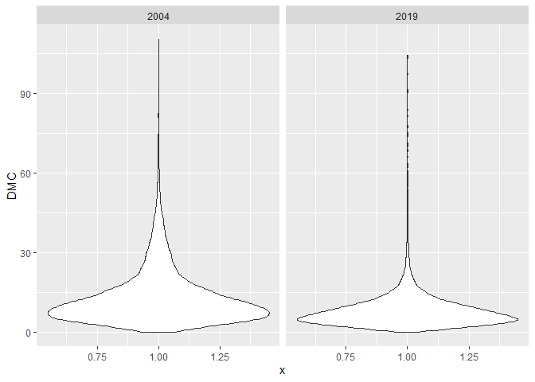
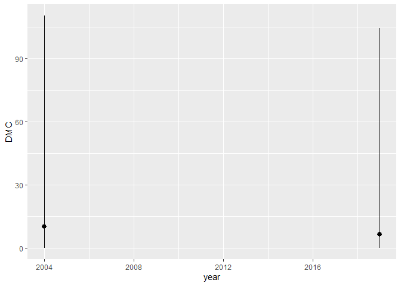
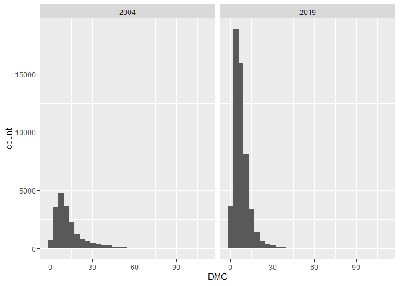
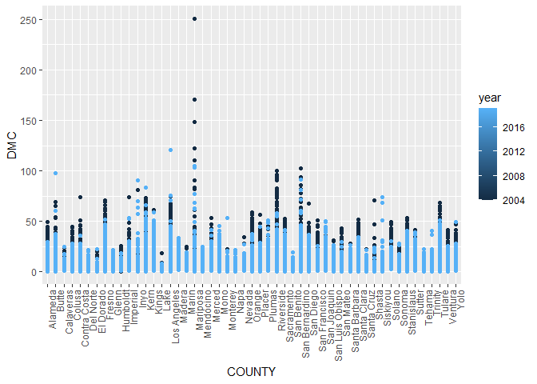
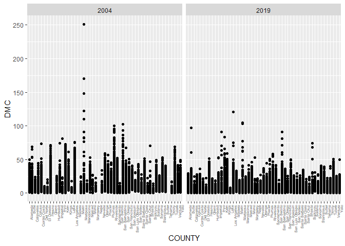
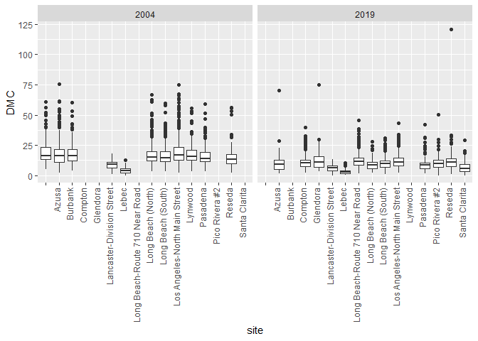

```r
library(data.table)
```

```
## Warning: package 'data.table' was built under R version 4.0.5
```

```r
library(dtplyr)
```

```
## Warning: package 'dtplyr' was built under R version 4.0.5
```

```r
library(dplyr)
```

```
## Warning: package 'dplyr' was built under R version 4.0.5
```

```
## 
## Attaching package: 'dplyr'
```

```
## The following objects are masked from 'package:data.table':
## 
##     between, first, last
```

```
## The following objects are masked from 'package:stats':
## 
##     filter, lag
```

```
## The following objects are masked from 'package:base':
## 
##     intersect, setdiff, setequal, union
```

```r
library(readr)
```

```
## Warning: package 'readr' was built under R version 4.0.5
```

```r
library(tidyverse)
```

```
## Warning: package 'tidyverse' was built under R version 4.0.5
```

```
## -- Attaching packages --------------------------------------- tidyverse 1.3.1 --
```

```
## v ggplot2 3.3.5     v purrr   0.3.4
## v tibble  3.1.4     v stringr 1.4.0
## v tidyr   1.1.3     v forcats 0.5.1
```

```
## Warning: package 'ggplot2' was built under R version 4.0.5
```

```
## Warning: package 'tibble' was built under R version 4.0.5
```

```
## Warning: package 'tidyr' was built under R version 4.0.5
```

```
## Warning: package 'purrr' was built under R version 4.0.3
```

```
## Warning: package 'stringr' was built under R version 4.0.5
```

```
## Warning: package 'forcats' was built under R version 4.0.5
```

```
## -- Conflicts ------------------------------------------ tidyverse_conflicts() --
## x dplyr::between()   masks data.table::between()
## x dplyr::filter()    masks stats::filter()
## x dplyr::first()     masks data.table::first()
## x dplyr::lag()       masks stats::lag()
## x dplyr::last()      masks data.table::last()
## x purrr::transpose() masks data.table::transpose()
```

```r
library(skimr)
```

```
## Warning: package 'skimr' was built under R version 4.0.5
```

```r
library(lubridate)
```

```
## Warning: package 'lubridate' was built under R version 4.0.5
```

```
## 
## Attaching package: 'lubridate'
```

```
## The following objects are masked from 'package:data.table':
## 
##     hour, isoweek, mday, minute, month, quarter, second, wday, week,
##     yday, year
```

```
## The following objects are masked from 'package:base':
## 
##     date, intersect, setdiff, union
```

```r
library(leaflet)
```

```
## Warning: package 'leaflet' was built under R version 4.0.5
```
## 1. Import and check the data.

```r
pm04 <- fread("ad_viz_plotval_data_2004.csv")

pm19 <- fread("ad_viz_plotval_data_2019.csv")
```
Check the variables of 2004

```r
dim(pm04)
```

```
## [1] 19233    20
```

```r
names(pm04)
```

```
##  [1] "Date"               "Source"             "Site ID"           
##  [4] "POC"                "DMC"                "UNITS"             
##  [7] "DAILY_AQI_VALUE"    "site"               "DAILY_OBS_COUNT"   
## [10] "PERCENT_COMPLETE"   "AQS_PARAMETER_CODE" "AQS_PARAMETER_DESC"
## [13] "CBSA_CODE"          "CBSA_NAME"          "STATE_CODE"        
## [16] "STATE"              "COUNTY_CODE"        "COUNTY"            
## [19] "lat"                "lon"
```

```r
str(pm04)
```

```
## Classes 'data.table' and 'data.frame':	19233 obs. of  20 variables:
##  $ Date              : chr  "01/01/2004" "01/02/2004" "01/03/2004" "01/04/2004" ...
##  $ Source            : chr  "AQS" "AQS" "AQS" "AQS" ...
##  $ Site ID           : int  60010007 60010007 60010007 60010007 60010007 60010007 60010007 60010007 60010007 60010007 ...
##  $ POC               : int  1 1 1 1 1 1 1 1 1 1 ...
##  $ DMC               : num  11 12.2 16.5 18.1 11.5 32.5 14 29.9 21 15.7 ...
##  $ UNITS             : chr  "ug/m3 LC" "ug/m3 LC" "ug/m3 LC" "ug/m3 LC" ...
##  $ DAILY_AQI_VALUE   : int  46 51 60 64 48 94 55 88 70 59 ...
##  $ site              : chr  "Livermore" "Livermore" "Livermore" "Livermore" ...
##  $ DAILY_OBS_COUNT   : int  1 1 1 1 1 1 1 1 1 1 ...
##  $ PERCENT_COMPLETE  : int  100 100 100 100 100 100 100 100 100 100 ...
##  $ AQS_PARAMETER_CODE: int  88502 88502 88502 88101 88502 88502 88101 88502 88502 88101 ...
##  $ AQS_PARAMETER_DESC: chr  "Acceptable PM2.5 AQI & Speciation Mass" "Acceptable PM2.5 AQI & Speciation Mass" "Acceptable PM2.5 AQI & Speciation Mass" "PM2.5 - Local Conditions" ...
##  $ CBSA_CODE         : int  41860 41860 41860 41860 41860 41860 41860 41860 41860 41860 ...
##  $ CBSA_NAME         : chr  "San Francisco-Oakland-Hayward, CA" "San Francisco-Oakland-Hayward, CA" "San Francisco-Oakland-Hayward, CA" "San Francisco-Oakland-Hayward, CA" ...
##  $ STATE_CODE        : int  6 6 6 6 6 6 6 6 6 6 ...
##  $ STATE             : chr  "California" "California" "California" "California" ...
##  $ COUNTY_CODE       : int  1 1 1 1 1 1 1 1 1 1 ...
##  $ COUNTY            : chr  "Alameda" "Alameda" "Alameda" "Alameda" ...
##  $ lat               : num  37.7 37.7 37.7 37.7 37.7 ...
##  $ lon               : num  -122 -122 -122 -122 -122 ...
##  - attr(*, ".internal.selfref")=<externalptr>
```

```r
head(pm04)
```

```
##          Date Source  Site ID POC  DMC    UNITS DAILY_AQI_VALUE      site
## 1: 01/01/2004    AQS 60010007   1 11.0 ug/m3 LC              46 Livermore
## 2: 01/02/2004    AQS 60010007   1 12.2 ug/m3 LC              51 Livermore
## 3: 01/03/2004    AQS 60010007   1 16.5 ug/m3 LC              60 Livermore
## 4: 01/04/2004    AQS 60010007   1 18.1 ug/m3 LC              64 Livermore
## 5: 01/05/2004    AQS 60010007   1 11.5 ug/m3 LC              48 Livermore
## 6: 01/06/2004    AQS 60010007   1 32.5 ug/m3 LC              94 Livermore
##    DAILY_OBS_COUNT PERCENT_COMPLETE AQS_PARAMETER_CODE
## 1:               1              100              88502
## 2:               1              100              88502
## 3:               1              100              88502
## 4:               1              100              88101
## 5:               1              100              88502
## 6:               1              100              88502
##                        AQS_PARAMETER_DESC CBSA_CODE
## 1: Acceptable PM2.5 AQI & Speciation Mass     41860
## 2: Acceptable PM2.5 AQI & Speciation Mass     41860
## 3: Acceptable PM2.5 AQI & Speciation Mass     41860
## 4:               PM2.5 - Local Conditions     41860
## 5: Acceptable PM2.5 AQI & Speciation Mass     41860
## 6: Acceptable PM2.5 AQI & Speciation Mass     41860
##                            CBSA_NAME STATE_CODE      STATE COUNTY_CODE  COUNTY
## 1: San Francisco-Oakland-Hayward, CA          6 California           1 Alameda
## 2: San Francisco-Oakland-Hayward, CA          6 California           1 Alameda
## 3: San Francisco-Oakland-Hayward, CA          6 California           1 Alameda
## 4: San Francisco-Oakland-Hayward, CA          6 California           1 Alameda
## 5: San Francisco-Oakland-Hayward, CA          6 California           1 Alameda
## 6: San Francisco-Oakland-Hayward, CA          6 California           1 Alameda
##         lat       lon
## 1: 37.68753 -121.7842
## 2: 37.68753 -121.7842
## 3: 37.68753 -121.7842
## 4: 37.68753 -121.7842
## 5: 37.68753 -121.7842
## 6: 37.68753 -121.7842
```

```r
tail(pm04)
```

```
##          Date Source  Site ID POC DMC    UNITS DAILY_AQI_VALUE
## 1: 12/14/2004    AQS 61131003   1  11 ug/m3 LC              46
## 2: 12/17/2004    AQS 61131003   1  16 ug/m3 LC              59
## 3: 12/20/2004    AQS 61131003   1  17 ug/m3 LC              61
## 4: 12/23/2004    AQS 61131003   1   9 ug/m3 LC              38
## 5: 12/26/2004    AQS 61131003   1  24 ug/m3 LC              76
## 6: 12/29/2004    AQS 61131003   1   9 ug/m3 LC              38
##                    site DAILY_OBS_COUNT PERCENT_COMPLETE AQS_PARAMETER_CODE
## 1: Woodland-Gibson Road               1              100              88101
## 2: Woodland-Gibson Road               1              100              88101
## 3: Woodland-Gibson Road               1              100              88101
## 4: Woodland-Gibson Road               1              100              88101
## 5: Woodland-Gibson Road               1              100              88101
## 6: Woodland-Gibson Road               1              100              88101
##          AQS_PARAMETER_DESC CBSA_CODE                               CBSA_NAME
## 1: PM2.5 - Local Conditions     40900 Sacramento--Roseville--Arden-Arcade, CA
## 2: PM2.5 - Local Conditions     40900 Sacramento--Roseville--Arden-Arcade, CA
## 3: PM2.5 - Local Conditions     40900 Sacramento--Roseville--Arden-Arcade, CA
## 4: PM2.5 - Local Conditions     40900 Sacramento--Roseville--Arden-Arcade, CA
## 5: PM2.5 - Local Conditions     40900 Sacramento--Roseville--Arden-Arcade, CA
## 6: PM2.5 - Local Conditions     40900 Sacramento--Roseville--Arden-Arcade, CA
##    STATE_CODE      STATE COUNTY_CODE COUNTY      lat       lon
## 1:          6 California         113   Yolo 38.66121 -121.7327
## 2:          6 California         113   Yolo 38.66121 -121.7327
## 3:          6 California         113   Yolo 38.66121 -121.7327
## 4:          6 California         113   Yolo 38.66121 -121.7327
## 5:          6 California         113   Yolo 38.66121 -121.7327
## 6:          6 California         113   Yolo 38.66121 -121.7327
```
Check the variables of 2019

```r
dim(pm19)
```

```
## [1] 53086    20
```

```r
names(pm19)
```

```
##  [1] "Date"               "Source"             "Site ID"           
##  [4] "POC"                "DMC"                "UNITS"             
##  [7] "DAILY_AQI_VALUE"    "site"               "DAILY_OBS_COUNT"   
## [10] "PERCENT_COMPLETE"   "AQS_PARAMETER_CODE" "AQS_PARAMETER_DESC"
## [13] "CBSA_CODE"          "CBSA_NAME"          "STATE_CODE"        
## [16] "STATE"              "COUNTY_CODE"        "COUNTY"            
## [19] "lat"                "lon"
```

```r
str(pm19)
```

```
## Classes 'data.table' and 'data.frame':	53086 obs. of  20 variables:
##  $ Date              : chr  "01/01/2019" "01/02/2019" "01/03/2019" "01/04/2019" ...
##  $ Source            : chr  "AQS" "AQS" "AQS" "AQS" ...
##  $ Site ID           : int  60010007 60010007 60010007 60010007 60010007 60010007 60010007 60010007 60010007 60010007 ...
##  $ POC               : int  3 3 3 3 3 3 3 3 3 3 ...
##  $ DMC               : num  5.7 11.9 20.1 28.8 11.2 2.7 2.8 7 3.1 7.1 ...
##  $ UNITS             : chr  "ug/m3 LC" "ug/m3 LC" "ug/m3 LC" "ug/m3 LC" ...
##  $ DAILY_AQI_VALUE   : int  24 50 68 86 47 11 12 29 13 30 ...
##  $ site              : chr  "Livermore" "Livermore" "Livermore" "Livermore" ...
##  $ DAILY_OBS_COUNT   : int  1 1 1 1 1 1 1 1 1 1 ...
##  $ PERCENT_COMPLETE  : int  100 100 100 100 100 100 100 100 100 100 ...
##  $ AQS_PARAMETER_CODE: int  88101 88101 88101 88101 88101 88101 88101 88101 88101 88101 ...
##  $ AQS_PARAMETER_DESC: chr  "PM2.5 - Local Conditions" "PM2.5 - Local Conditions" "PM2.5 - Local Conditions" "PM2.5 - Local Conditions" ...
##  $ CBSA_CODE         : int  41860 41860 41860 41860 41860 41860 41860 41860 41860 41860 ...
##  $ CBSA_NAME         : chr  "San Francisco-Oakland-Hayward, CA" "San Francisco-Oakland-Hayward, CA" "San Francisco-Oakland-Hayward, CA" "San Francisco-Oakland-Hayward, CA" ...
##  $ STATE_CODE        : int  6 6 6 6 6 6 6 6 6 6 ...
##  $ STATE             : chr  "California" "California" "California" "California" ...
##  $ COUNTY_CODE       : int  1 1 1 1 1 1 1 1 1 1 ...
##  $ COUNTY            : chr  "Alameda" "Alameda" "Alameda" "Alameda" ...
##  $ lat               : num  37.7 37.7 37.7 37.7 37.7 ...
##  $ lon               : num  -122 -122 -122 -122 -122 ...
##  - attr(*, ".internal.selfref")=<externalptr>
```

```r
head(pm19)
```

```
##          Date Source  Site ID POC  DMC    UNITS DAILY_AQI_VALUE      site
## 1: 01/01/2019    AQS 60010007   3  5.7 ug/m3 LC              24 Livermore
## 2: 01/02/2019    AQS 60010007   3 11.9 ug/m3 LC              50 Livermore
## 3: 01/03/2019    AQS 60010007   3 20.1 ug/m3 LC              68 Livermore
## 4: 01/04/2019    AQS 60010007   3 28.8 ug/m3 LC              86 Livermore
## 5: 01/05/2019    AQS 60010007   3 11.2 ug/m3 LC              47 Livermore
## 6: 01/06/2019    AQS 60010007   3  2.7 ug/m3 LC              11 Livermore
##    DAILY_OBS_COUNT PERCENT_COMPLETE AQS_PARAMETER_CODE       AQS_PARAMETER_DESC
## 1:               1              100              88101 PM2.5 - Local Conditions
## 2:               1              100              88101 PM2.5 - Local Conditions
## 3:               1              100              88101 PM2.5 - Local Conditions
## 4:               1              100              88101 PM2.5 - Local Conditions
## 5:               1              100              88101 PM2.5 - Local Conditions
## 6:               1              100              88101 PM2.5 - Local Conditions
##    CBSA_CODE                         CBSA_NAME STATE_CODE      STATE
## 1:     41860 San Francisco-Oakland-Hayward, CA          6 California
## 2:     41860 San Francisco-Oakland-Hayward, CA          6 California
## 3:     41860 San Francisco-Oakland-Hayward, CA          6 California
## 4:     41860 San Francisco-Oakland-Hayward, CA          6 California
## 5:     41860 San Francisco-Oakland-Hayward, CA          6 California
## 6:     41860 San Francisco-Oakland-Hayward, CA          6 California
##    COUNTY_CODE  COUNTY      lat       lon
## 1:           1 Alameda 37.68753 -121.7842
## 2:           1 Alameda 37.68753 -121.7842
## 3:           1 Alameda 37.68753 -121.7842
## 4:           1 Alameda 37.68753 -121.7842
## 5:           1 Alameda 37.68753 -121.7842
## 6:           1 Alameda 37.68753 -121.7842
```

```r
tail(pm19)
```

```
##          Date Source  Site ID POC  DMC    UNITS DAILY_AQI_VALUE
## 1: 11/11/2019    AQS 61131003   1 13.5 ug/m3 LC              54
## 2: 11/17/2019    AQS 61131003   1 18.1 ug/m3 LC              64
## 3: 11/29/2019    AQS 61131003   1 12.5 ug/m3 LC              52
## 4: 12/17/2019    AQS 61131003   1 23.8 ug/m3 LC              76
## 5: 12/23/2019    AQS 61131003   1  1.0 ug/m3 LC               4
## 6: 12/29/2019    AQS 61131003   1  9.1 ug/m3 LC              38
##                    site DAILY_OBS_COUNT PERCENT_COMPLETE AQS_PARAMETER_CODE
## 1: Woodland-Gibson Road               1              100              88101
## 2: Woodland-Gibson Road               1              100              88101
## 3: Woodland-Gibson Road               1              100              88101
## 4: Woodland-Gibson Road               1              100              88101
## 5: Woodland-Gibson Road               1              100              88101
## 6: Woodland-Gibson Road               1              100              88101
##          AQS_PARAMETER_DESC CBSA_CODE                               CBSA_NAME
## 1: PM2.5 - Local Conditions     40900 Sacramento--Roseville--Arden-Arcade, CA
## 2: PM2.5 - Local Conditions     40900 Sacramento--Roseville--Arden-Arcade, CA
## 3: PM2.5 - Local Conditions     40900 Sacramento--Roseville--Arden-Arcade, CA
## 4: PM2.5 - Local Conditions     40900 Sacramento--Roseville--Arden-Arcade, CA
## 5: PM2.5 - Local Conditions     40900 Sacramento--Roseville--Arden-Arcade, CA
## 6: PM2.5 - Local Conditions     40900 Sacramento--Roseville--Arden-Arcade, CA
##    STATE_CODE      STATE COUNTY_CODE COUNTY      lat       lon
## 1:          6 California         113   Yolo 38.66121 -121.7327
## 2:          6 California         113   Yolo 38.66121 -121.7327
## 3:          6 California         113   Yolo 38.66121 -121.7327
## 4:          6 California         113   Yolo 38.66121 -121.7327
## 5:          6 California         113   Yolo 38.66121 -121.7327
## 6:          6 California         113   Yolo 38.66121 -121.7327
```
Check the data of 2004

```r
pm04[,table(is.na(DMC))]
```

```
## 
## FALSE 
## 19233
```

```r
pm04[,table(is.na(`Site ID`))]
```

```
## 
## FALSE 
## 19233
```

```r
pm04[,table(is.na(DAILY_AQI_VALUE))]
```

```
## 
## FALSE 
## 19233
```

```r
pm04[,table(is.na(lat))]
```

```
## 
## FALSE 
## 19233
```

```r
pm04[,table(is.na(lon))]
```

```
## 
## FALSE 
## 19233
```

```r
pm04[,range(lat)]
```

```
## [1] 32.63124 41.71182
```

```r
pm04[,range(lon)]
```

```
## [1] -124.1621 -115.4831
```

```r
pm04[,range(DMC)]
```

```
## [1]  -0.1 251.0
```

```r
pm04 <- pm04[DMC>=0]
```
Check the data of 2019

```r
pm19[,table(is.na(DMC))]
```

```
## 
## FALSE 
## 53086
```

```r
pm19[,table(is.na(`Site ID`))]
```

```
## 
## FALSE 
## 53086
```

```r
pm19[,table(is.na(DAILY_AQI_VALUE))]
```

```
## 
## FALSE 
## 53086
```

```r
pm19[,table(is.na(lat))]
```

```
## 
## FALSE 
## 53086
```

```r
pm19[,table(is.na(lon))]
```

```
## 
## FALSE 
## 53086
```

```r
pm19[,range(lat)]
```

```
## [1] 32.57816 41.75613
```

```r
pm19[,range(lon)]
```

```
## [1] -124.2035 -115.4831
```

```r
pm19[,range(DMC)]
```

```
## [1]  -2.2 120.9
```

```r
pm19 <- pm19[DMC>=0]
```

## 2. Combine the two years of data into one data frame and add an year variable.

```r
pm_all <- rbind(pm04,pm19)
pm_all$Date <- mdy(pm_all$Date)
pm_all$year <- year(pm_all$Date)
```
## 3. Create a basic map in leaflet() that shows the locations of the sites (make sure to use different colors for each year). Summarize the spatial distribution of the monitoring sites.

```r
year.pal <- colorFactor(c('blue','red'), domain=pm_all$year)

OB04<-pm_all[pm_all$year==2004]
OB19<-pm_all[pm_all$year==2019]
library(leaflet)
leaflet(pm_all) %>% 
  addProviderTiles('CartoDB.Positron') %>% 
  addCircles(
    data = OB04,
    lat = ~lat, lng = ~lon, popup = "2004.",
    opacity = 1, fillOpacity = 1, radius = 400, color = "blue"
    ) %>%
  addCircles(
    data = OB19,
    lat = ~lat, lng = ~lon, popup = "2019.",
    opacity=0.5, fillOpacity=0.5, radius = 400, color = "red"
    ) %>%
  addLegend('bottomleft', pal=year.pal, values=pm_all$year,
          title='Sites', opacity=1)
```

```{=html}
<div id="htmlwidget-8cf1015ed11b970a8ade" style="width:672px;height:480px;" class="leaflet html-widget"></div>
<script type="application/json" data-for="htmlwidget-8cf1015ed11b970a8ade">{"x":{"options":{"crs":{"crsClass":"L.CRS.EPSG3857","code":null,"proj4def":null,"projectedBounds":null,"options":{}}},"calls":[{"method":"addProviderTiles","args":["CartoDB.Positron",null,null,{"errorTileUrl":"","noWrap":false,"detectRetina":false}]},{"method":"addCircles","args":[[37.687526,37.687526,37.687526,37.687526,37.687526,37.687526,37.687526,37.687526,37.687526,37.687526,37.687526,37.687526,37.687526,37.687526,37.687526,37.687526,37.687526,37.687526,37.687526,37.687526,37.687526,37.687526,37.687526,37.687526,37.687526,37.687526,37.687526,37.687526,37.687526,37.687526,37.687526,37.687526,37.687526,37.687526,37.687526,37.687526,37.687526,37.687526,37.687526,37.687526,37.687526,37.687526,37.687526,37.687526,37.687526,37.687526,37.687526,37.687526,37.687526,37.687526,37.687526,37.687526,37.687526,37.687526,37.687526,37.687526,37.687526,37.687526,37.687526,37.687526,37.687526,37.687526,37.687526,37.687526,37.687526,37.687526,37.687526,37.687526,37.687526,37.687526,37.687526,37.687526,37.687526,37.687526,37.687526,37.687526,37.687526,37.687526,37.687526,37.687526,37.687526,37.687526,37.687526,37.687526,37.687526,37.687526,37.687526,37.687526,37.687526,37.687526,37.687526,37.687526,37.687526,37.687526,37.687526,37.687526,37.687526,37.687526,37.687526,37.687526,37.687526,37.687526,37.687526,37.687526,37.687526,37.687526,37.687526,37.687526,37.687526,37.687526,37.687526,37.687526,37.687526,37.687526,37.687526,37.687526,37.687526,37.687526,37.687526,37.687526,37.687526,37.687526,37.687526,37.687526,37.687526,37.687526,37.687526,37.687526,37.687526,37.687526,37.687526,37.687526,37.687526,37.687526,37.687526,37.687526,37.687526,37.687526,37.687526,37.687526,37.687526,37.687526,37.687526,37.687526,37.687526,37.687526,37.687526,37.687526,37.687526,37.687526,37.687526,37.687526,37.687526,37.687526,37.687526,37.687526,37.687526,37.687526,37.687526,37.687526,37.687526,37.687526,37.687526,37.687526,37.687526,37.687526,37.687526,37.687526,37.687526,37.687526,37.687526,37.687526,37.687526,37.687526,37.687526,37.687526,37.687526,37.687526,37.687526,37.687526,37.687526,37.687526,37.687526,37.687526,37.687526,37.687526,37.687526,37.687526,37.687526,37.687526,37.687526,37.687526,37.687526,37.687526,37.687526,37.687526,37.687526,37.687526,37.687526,37.687526,37.687526,37.687526,37.687526,37.687526,37.687526,37.687526,37.687526,37.687526,37.687526,37.687526,37.687526,37.687526,37.687526,37.687526,37.687526,37.687526,37.687526,37.687526,37.687526,37.687526,37.687526,37.687526,37.687526,37.687526,37.687526,37.687526,37.687526,37.687526,37.687526,37.687526,37.687526,37.687526,37.687526,37.687526,37.687526,37.687526,37.687526,37.687526,37.687526,37.687526,37.687526,37.687526,37.687526,37.687526,37.687526,37.687526,37.687526,37.687526,37.687526,37.687526,37.687526,37.687526,37.687526,37.687526,37.687526,37.687526,37.687526,37.687526,37.687526,37.687526,37.687526,37.687526,37.687526,37.687526,37.687526,37.687526,37.687526,37.687526,37.687526,37.687526,37.687526,37.687526,37.687526,37.687526,37.687526,37.687526,37.687526,37.687526,37.687526,37.687526,37.687526,37.687526,37.687526,37.687526,37.687526,37.687526,37.687526,37.687526,37.687526,37.687526,37.687526,37.687526,37.687526,37.687526,37.687526,37.687526,37.687526,37.687526,37.687526,37.687526,37.687526,37.687526,37.687526,37.687526,37.687526,37.687526,37.687526,37.687526,37.687526,37.687526,37.687526,37.687526,37.687526,37.687526,37.687526,37.687526,37.687526,37.687526,37.687526,37.687526,37.687526,37.687526,37.687526,37.687526,37.687526,37.687526,37.687526,37.687526,37.687526,37.687526,37.687526,37.687526,37.687526,37.687526,37.687526,37.687526,37.687526,37.687526,37.687526,37.687526,37.687526,37.687526,37.687526,37.687526,37.687526,37.687526,37.687526,37.687526,37.687526,37.687526,37.687526,37.687526,37.687526,37.687526,37.687526,37.687526,37.687526,37.687526,37.687526,37.687526,37.687526,37.687526,37.687526,37.687526,37.535833,37.535833,37.535833,37.535833,37.535833,37.535833,37.535833,37.535833,37.535833,37.535833,37.535833,37.535833,37.535833,37.535833,37.535833,37.535833,37.535833,37.535833,37.535833,37.535833,37.535833,37.535833,37.535833,37.535833,37.535833,37.535833,37.535833,37.535833,37.535833,37.535833,37.535833,37.535833,37.535833,37.535833,37.535833,37.535833,37.535833,37.535833,37.535833,37.535833,37.535833,37.535833,37.535833,37.535833,37.535833,37.535833,37.535833,37.535833,37.535833,37.535833,37.535833,37.535833,37.535833,37.535833,37.535833,37.535833,37.535833,37.535833,37.535833,37.535833,37.535833,37.535833,37.535833,37.535833,37.535833,37.535833,37.535833,37.535833,37.535833,37.535833,37.535833,37.535833,37.535833,37.535833,37.535833,37.535833,37.535833,37.535833,37.535833,37.535833,37.535833,37.535833,37.535833,37.535833,37.535833,37.535833,37.535833,37.535833,37.535833,37.535833,37.535833,37.535833,37.535833,37.535833,39.75737149,39.75737149,39.75737149,39.75737149,39.75737149,39.75737149,39.75737149,39.75737149,39.75737149,39.75737149,39.75737149,39.75737149,39.75737149,39.75737149,39.75737149,39.75737149,39.75737149,39.75737149,39.75737149,39.75737149,39.75737149,39.75737149,39.75737149,39.75737149,39.75737149,39.75737149,39.75737149,39.75737149,39.75737149,39.75737149,39.75737149,39.75737149,39.75737149,39.75737149,39.75737149,39.75737149,39.75737149,39.75737149,39.75737149,39.75737149,39.75737149,39.75737149,39.75737149,39.75737149,39.75737149,39.75737149,39.75737149,39.75737149,39.75737149,39.75737149,39.75737149,39.75737149,39.75737149,39.75737149,39.75737149,39.75737149,39.75737149,39.75737149,39.75737149,39.75737149,39.75737149,39.75737149,39.75737149,39.75737149,39.75737149,39.75737149,39.75737149,39.75737149,39.75737149,39.75737149,39.75737149,39.75737149,39.75737149,39.75737149,39.75737149,39.75737149,39.75737149,39.75737149,39.75737149,39.75737149,39.75737149,39.75737149,39.75737149,39.75737149,39.75737149,39.75737149,39.75737149,39.75737149,39.75737149,39.75737149,39.75737149,39.75737149,39.75737149,39.75737149,39.75737149,39.75737149,39.75737149,39.75737149,39.75737149,39.75737149,39.75737149,39.75737149,39.75737149,39.75737149,39.75737149,39.75737149,39.75737149,39.75737149,39.75737149,39.75737149,39.75737149,39.75737149,39.75737149,39.75737149,39.75737149,39.75737149,39.75737149,39.75737149,39.75737149,39.75737149,39.75737149,39.75737149,39.327563,39.327563,39.327563,39.327563,39.327563,39.327563,39.327563,39.327563,39.327563,39.327563,39.327563,39.327563,39.327563,39.327563,39.327563,39.327563,39.327563,39.327563,39.327563,39.327563,39.327563,39.327563,39.327563,39.327563,39.327563,39.327563,39.327563,39.327563,39.327563,39.327563,39.327563,39.327563,39.327563,39.327563,39.327563,39.327563,39.327563,39.327563,39.327563,39.327563,39.327563,39.327563,39.327563,39.327563,39.327563,39.327563,39.327563,39.327563,39.327563,39.327563,39.327563,39.327563,39.327563,39.327563,39.327563,39.327563,39.327563,39.327563,39.327563,39.327563,39.327563,39.327563,39.327563,39.327563,39.327563,39.327563,39.327563,39.327563,39.327563,39.327563,39.327563,39.327563,39.327563,39.327563,39.327563,39.327563,39.327563,39.327563,39.327563,39.327563,39.327563,39.327563,39.327563,39.327563,39.327563,39.327563,39.327563,39.327563,39.327563,39.327563,39.327563,39.327563,39.327563,39.327563,39.327563,39.327563,39.327563,39.327563,39.327563,39.327563,39.327563,39.327563,39.327563,39.327563,39.327563,39.327563,39.327563,39.327563,39.327563,39.327563,39.327563,39.327563,39.327563,39.327563,39.327563,39.327563,39.327563,39.327563,39.327563,39.327563,39.327563,39.327563,39.327563,39.327563,39.327563,39.327563,39.327563,39.327563,39.327563,39.327563,39.327563,39.327563,39.327563,39.327563,39.327563,39.327563,39.327563,39.327563,39.327563,39.327563,39.327563,39.327563,39.327563,39.327563,39.327563,39.327563,39.327563,39.327563,39.327563,39.327563,39.327563,39.327563,39.327563,39.327563,39.327563,39.327563,39.327563,39.327563,39.327563,39.327563,39.327563,39.327563,39.327563,39.327563,39.327563,39.327563,39.327563,39.327563,39.327563,39.327563,39.327563,39.327563,39.327563,39.327563,39.327563,39.327563,39.327563,39.327563,39.327563,39.327563,39.327563,39.327563,39.327563,39.327563,39.327563,39.327563,39.327563,39.327563,39.327563,39.327563,39.327563,39.327563,39.327563,39.327563,39.327563,39.327563,39.327563,39.327563,39.327563,39.327563,39.327563,39.327563,39.327563,39.327563,39.327563,39.327563,39.327563,39.327563,39.327563,39.327563,39.327563,39.327563,39.327563,39.327563,39.327563,39.327563,39.327563,39.327563,39.327563,39.327563,39.327563,39.327563,39.327563,39.327563,39.327563,39.327563,39.327563,39.327563,39.327563,39.327563,39.327563,39.327563,39.327563,39.327563,39.327563,39.327563,39.327563,39.327563,39.327563,39.327563,39.327563,39.327563,39.327563,39.327563,39.327563,39.327563,39.327563,39.327563,39.327563,39.327563,39.327563,39.327563,39.327563,39.327563,39.327563,39.327563,39.327563,39.327563,39.327563,39.327563,39.327563,39.327563,39.327563,39.327563,39.327563,39.327563,39.327563,39.327563,39.327563,39.327563,39.327563,39.327563,39.327563,39.327563,39.327563,39.327563,39.327563,39.327563,39.327563,39.327563,39.327563,39.327563,39.327563,39.327563,39.327563,39.327563,39.327563,39.327563,39.327563,39.327563,39.327563,39.327563,39.327563,39.327563,39.327563,39.327563,39.327563,39.327563,39.327563,39.327563,39.327563,39.327563,39.327563,39.327563,39.327563,39.327563,39.327563,39.327563,39.327563,39.327563,39.327563,39.327563,39.327563,39.327563,39.327563,39.327563,39.327563,39.327563,39.327563,39.327563,39.327563,39.327563,38.20185,38.20185,38.20185,38.20185,38.20185,38.20185,38.20185,38.20185,38.20185,38.20185,38.20185,38.20185,38.20185,38.20185,38.20185,38.20185,38.20185,38.20185,38.20185,38.20185,38.20185,38.20185,38.20185,38.20185,38.20185,38.20185,38.20185,38.20185,38.20185,38.20185,38.20185,38.20185,38.20185,38.20185,38.20185,38.20185,38.20185,38.20185,38.20185,38.20185,38.20185,38.20185,38.20185,38.20185,38.20185,38.20185,38.20185,38.20185,38.20185,38.20185,38.20185,38.20185,38.20185,38.20185,38.20185,38.20185,38.20185,38.20185,38.20185,38.20185,38.20185,39.18919,39.18919,39.18919,39.18919,39.18919,39.18919,39.18919,39.18919,39.18919,39.18919,39.18919,39.18919,39.18919,39.18919,39.18919,39.18919,39.18919,39.18919,39.18919,39.18919,39.18919,39.18919,39.18919,39.18919,39.18919,39.18919,39.18919,39.18919,39.18919,39.18919,39.18919,39.18919,39.18919,39.18919,39.18919,39.18919,39.18919,39.18919,39.18919,39.18919,39.18919,39.18919,39.18919,39.18919,39.18919,39.18919,39.18919,39.18919,39.18919,39.18919,39.18919,39.18919,39.18919,39.18919,39.18919,39.18919,39.18919,39.18919,39.18919,39.18919,39.18919,39.18919,39.18919,39.18919,39.18919,39.18919,39.18919,39.18919,39.18919,39.18919,39.18919,39.18919,39.18919,39.18919,39.18919,39.18919,39.18919,39.18919,39.18919,39.18919,39.18919,39.18919,39.18919,39.18919,39.18919,39.18919,39.18919,39.18919,39.18919,39.18919,39.18919,39.18919,39.18919,39.18919,39.18919,39.18919,39.18919,39.18919,39.18919,39.18919,39.18919,39.18919,39.18919,39.18919,39.18919,39.18919,39.18919,39.18919,39.18919,39.18919,39.18919,39.18919,39.18919,39.18919,39.18919,39.18919,39.18919,39.18919,39.18919,39.18919,39.18919,39.18919,39.18919,39.18919,39.18919,39.18919,39.18919,39.18919,39.18919,39.18919,39.18919,39.18919,39.18919,39.18919,39.18919,39.18919,39.18919,39.18919,39.18919,39.18919,39.18919,39.18919,39.18919,39.18919,39.18919,39.18919,39.18919,39.18919,39.18919,39.18919,39.18919,39.18919,39.18919,39.18919,39.18919,39.18919,39.18919,39.18919,39.18919,39.18919,39.18919,39.18919,39.18919,39.18919,39.18919,39.18919,39.18919,39.18919,39.18919,39.18919,39.18919,39.18919,39.18919,39.18919,39.18919,39.18919,39.18919,39.18919,39.18919,39.18919,39.18919,39.18919,39.18919,39.18919,39.18919,39.18919,39.18919,39.18919,39.18919,39.18919,39.18919,39.18919,39.18919,39.18919,39.18919,39.18919,39.18919,39.18919,39.18919,39.18919,39.18919,37.936013,37.936013,37.936013,37.936013,37.936013,37.936013,37.936013,37.936013,37.936013,37.936013,37.936013,37.936013,37.936013,37.936013,37.936013,37.936013,37.936013,37.936013,37.936013,37.936013,37.936013,37.936013,37.936013,37.936013,37.936013,37.936013,37.936013,37.936013,37.936013,37.936013,37.936013,37.936013,37.936013,37.936013,37.936013,37.936013,37.936013,37.936013,37.936013,37.936013,37.936013,37.936013,37.936013,37.936013,37.936013,37.936013,37.936013,37.936013,37.936013,37.936013,37.936013,37.936013,37.936013,37.936013,37.936013,37.936013,37.936013,37.936013,37.936013,37.936013,37.936013,37.936013,37.936013,37.936013,37.936013,37.936013,37.936013,37.936013,37.936013,37.936013,37.936013,37.936013,37.936013,37.936013,37.936013,37.936013,37.936013,37.936013,37.936013,37.936013,37.936013,37.936013,37.936013,37.936013,37.936013,37.936013,37.936013,37.936013,37.936013,37.936013,37.936013,37.936013,37.936013,37.936013,37.936013,37.936013,37.936013,37.936013,37.936013,37.936013,37.936013,37.936013,37.936013,37.936013,37.936013,37.936013,37.936013,37.936013,37.936013,37.936013,37.936013,37.936013,37.936013,37.936013,37.936013,37.936013,37.936013,37.936013,37.936013,37.936013,37.936013,37.936013,37.936013,37.936013,37.936013,37.936013,37.936013,37.936013,37.936013,37.936013,37.936013,37.936013,37.936013,37.936013,37.936013,37.936013,37.936013,37.936013,37.936013,37.936013,37.936013,37.936013,37.936013,37.936013,37.936013,37.936013,37.936013,37.936013,37.936013,37.936013,37.936013,37.936013,37.936013,37.936013,37.936013,37.936013,37.936013,37.936013,37.936013,37.936013,37.936013,37.936013,37.936013,37.936013,37.936013,37.936013,37.936013,37.936013,37.936013,37.936013,37.936013,37.936013,37.936013,37.936013,37.936013,37.936013,37.936013,37.936013,37.936013,37.936013,37.936013,37.936013,37.936013,37.936013,37.936013,37.936013,37.936013,37.936013,37.936013,37.936013,37.936013,37.936013,37.936013,37.936013,37.936013,37.936013,37.936013,37.936013,37.936013,37.936013,37.936013,37.936013,37.936013,37.936013,37.936013,37.936013,37.936013,37.936013,37.936013,37.936013,37.936013,37.936013,37.936013,37.936013,37.936013,37.936013,37.936013,37.936013,37.936013,37.936013,37.936013,37.936013,37.936013,37.936013,37.936013,37.936013,37.936013,37.936013,37.936013,37.936013,37.936013,37.936013,37.936013,37.936013,37.936013,37.936013,37.936013,37.936013,37.936013,37.936013,37.936013,37.936013,37.936013,37.936013,37.936013,37.936013,37.936013,37.936013,37.936013,37.936013,37.936013,37.936013,37.936013,37.936013,37.936013,37.936013,37.936013,37.936013,37.936013,41.56095239,41.56095239,41.56095239,41.56095239,41.56095239,41.56095239,41.56095239,41.56095239,41.56095239,41.56095239,41.56095239,41.56095239,41.56095239,41.56095239,41.56095239,41.56095239,41.56095239,41.56095239,41.56095239,41.56095239,41.56095239,41.56095239,41.56095239,41.56095239,41.56095239,41.56095239,41.56095239,41.56095239,41.56095239,41.56095239,41.56095239,41.56095239,41.56095239,41.56095239,41.56095239,41.56095239,41.56095239,41.56095239,41.56095239,41.56095239,41.56095239,41.56095239,41.56095239,41.56095239,41.56095239,41.56095239,41.56095239,41.56095239,41.56095239,41.56095239,41.56095239,41.56095239,41.56095239,41.56095239,41.56095239,41.56095239,41.56095239,41.56095239,41.56095239,41.56095239,41.56095239,41.56095239,41.56095239,41.56095239,41.56095239,41.56095239,41.56095239,41.56095239,41.56095239,41.56095239,41.56095239,41.56095239,41.56095239,41.56095239,41.56095239,41.56095239,41.56095239,41.56095239,41.56095239,41.56095239,41.56095239,41.56095239,41.56095239,41.56095239,41.56095239,41.56095239,41.56095239,41.56095239,41.56095239,41.56095239,41.56095239,41.56095239,41.56095239,41.56095239,41.56095239,41.56095239,41.56095239,41.56095239,41.56095239,41.56095239,41.56095239,41.56095239,41.56095239,41.56095239,41.56095239,41.56095239,41.56095239,41.56095239,41.56095239,41.56095239,41.56095239,41.56095239,41.56095239,41.56095239,41.56095239,41.56095239,41.56095239,38.944979,38.944979,38.944979,38.944979,38.944979,38.944979,38.944979,38.944979,38.944979,38.97599962,38.97599962,38.97599962,38.97599962,38.97599962,38.97599962,38.97599962,38.97599962,38.97599962,38.97599962,38.97599962,38.97599962,38.97599962,38.97599962,38.97599962,38.97599962,38.97599962,38.97599962,38.97599962,38.97599962,38.97599962,38.97599962,38.97599962,38.97599962,38.97599962,38.97599962,38.97599962,38.97599962,38.97599962,38.97599962,38.97599962,38.97599962,38.97599962,38.97599962,38.97599962,38.97599962,38.97599962,38.97599962,38.97599962,38.97599962,38.97599962,38.97599962,38.97599962,38.97599962,38.97599962,38.97599962,38.97599962,38.97599962,38.97599962,38.97599962,38.97599962,38.97599962,38.97599962,38.97599962,38.97599962,38.97599962,38.97599962,38.97599962,38.97599962,38.97599962,38.97599962,38.97599962,38.97599962,38.97599962,38.97599962,38.97599962,38.97599962,38.97599962,38.97599962,38.97599962,38.97599962,38.97599962,38.97599962,38.97599962,38.97599962,38.97599962,38.97599962,38.97599962,38.97599962,38.97599962,38.97599962,38.97599962,38.97599962,38.97599962,38.97599962,38.97599962,38.97599962,38.97599962,38.97599962,38.97599962,38.97599962,38.97599962,38.97599962,38.97599962,38.97599962,38.97599962,38.97599962,38.97599962,38.97599962,38.97599962,38.97599962,38.97599962,38.97599962,38.97599962,38.97599962,38.97599962,38.97599962,38.97599962,38.97599962,38.97599962,38.97599962,38.97599962,38.97599962,38.97599962,38.97599962,38.97599962,38.97599962,38.97599962,38.97599962,36.78133285,36.78133285,36.78133285,36.78133285,36.78133285,36.78133285,36.78133285,36.78133285,36.78133285,36.78133285,36.78133285,36.78133285,36.78133285,36.78133285,36.78133285,36.78133285,36.78133285,36.78133285,36.78133285,36.78133285,36.78133285,36.78133285,36.78133285,36.78133285,36.78133285,36.78133285,36.78133285,36.78133285,36.78133285,36.78133285,36.78133285,36.78133285,36.78133285,36.78133285,36.78133285,36.78133285,36.78133285,36.78133285,36.78133285,36.78133285,36.78133285,36.78133285,36.78133285,36.78133285,36.78133285,36.78133285,36.78133285,36.78133285,36.78133285,36.78133285,36.78133285,36.78133285,36.78133285,36.78133285,36.78133285,36.78133285,36.78133285,36.78133285,36.78133285,36.78133285,36.78133285,36.78133285,36.78133285,36.78133285,36.78133285,36.78133285,36.78133285,36.78133285,36.78133285,36.78133285,36.78133285,36.78133285,36.78133285,36.78133285,36.78133285,36.78133285,36.78133285,36.78133285,36.78133285,36.78133285,36.78133285,36.78133285,36.78133285,36.78133285,36.78133285,36.78133285,36.78133285,36.78133285,36.78133285,36.78133285,36.78133285,36.78133285,36.78133285,36.78133285,36.78133285,36.78133285,36.78133285,36.78133285,36.78133285,36.78133285,36.78133285,36.78133285,36.78133285,36.78133285,36.78133285,36.78133285,36.78133285,36.78133285,36.78133285,36.78133285,36.78133285,36.78133285,36.78133285,36.78133285,36.78133285,36.78133285,36.78133285,36.78133285,36.78133285,36.78133285,36.78133285,36.78133285,36.78133285,36.78133285,36.78133285,36.78133285,36.78133285,36.78133285,36.78133285,36.78133285,36.78133285,36.78133285,36.78133285,36.78133285,36.78133285,36.78133285,36.78133285,36.78133285,36.78133285,36.78133285,36.78133285,36.78133285,36.78133285,36.78133285,36.78133285,36.78133285,36.78133285,36.78133285,36.78133285,36.78133285,36.78133285,36.78133285,36.78133285,36.78133285,36.78133285,36.78133285,36.78133285,36.78133285,36.78133285,36.78133285,36.78133285,36.78133285,36.78133285,36.78133285,36.78133285,36.78133285,36.78133285,36.78133285,36.78133285,36.78133285,36.78133285,36.78133285,36.78133285,36.78133285,36.78133285,36.78133285,36.78133285,36.78133285,36.78133285,36.78133285,36.78133285,36.78133285,36.78133285,36.78133285,36.78133285,36.78133285,36.78133285,36.78133285,36.78133285,36.78133285,36.78133285,36.78133285,36.78133285,36.78133285,36.78133285,36.78133285,36.78133285,36.78133285,36.78133285,36.78133285,36.78133285,36.78133285,36.78133285,36.78133285,36.78133285,36.78133285,36.78133285,36.78133285,36.78133285,36.78133285,36.78133285,36.78133285,36.78133285,36.78133285,36.78133285,36.78133285,36.78133285,36.78133285,36.78133285,36.78133285,36.78133285,36.78133285,36.78133285,36.78133285,36.78133285,36.78133285,36.78133285,36.78133285,36.78133285,36.78133285,36.78133285,36.78133285,36.78133285,36.78133285,36.78133285,36.78133285,36.78133285,36.78133285,36.78133285,36.78133285,36.78133285,36.78133285,36.78133285,36.78133285,36.78133285,36.78133285,36.78133285,36.78133285,36.78133285,36.78133285,36.78133285,36.78133285,36.78133285,36.78133285,36.78133285,36.78133285,36.78133285,36.78133285,36.78133285,36.78133285,36.78133285,36.78133285,36.78133285,36.78133285,36.78133285,36.78133285,36.78133285,36.78133285,36.78133285,36.78133285,36.78133285,36.78133285,36.78133285,36.78133285,36.78133285,36.78133285,36.78133285,36.78133285,36.78133285,36.78133285,36.78133285,36.78133285,36.78133285,36.78133285,36.78133285,36.78133285,36.78133285,36.78133285,36.78133285,36.78133285,36.78133285,36.78133285,36.78133285,36.78133285,36.78133285,36.78133285,36.78133285,36.78133285,36.78133285,36.78133285,36.78133285,36.78133285,36.78133285,36.78133285,36.78133285,36.78133285,36.78133285,36.78133285,36.78133285,36.78133285,36.78133285,36.78133285,36.78133285,36.78133285,36.78133285,36.78133285,36.78133285,36.78133285,36.78133285,36.78133285,36.78133285,36.78133285,36.78133285,36.78133285,36.78133285,36.78133285,36.78133285,36.78133285,36.78133285,36.78133285,36.78133285,36.78133285,36.78133285,36.78133285,36.78133285,36.78133285,36.78133285,36.78133285,36.78133285,36.78133285,36.78133285,36.78133285,36.78133285,36.78133285,36.78133285,36.78133285,36.78133285,36.78133285,36.78133285,36.78133285,36.78133285,36.78133285,36.78133285,36.78133285,36.78133285,36.78133285,36.78133285,36.78133285,36.78133285,36.78133285,36.78133285,36.78133285,36.78133285,36.78133285,36.78133285,36.78133285,36.78133285,36.78133285,36.78133285,36.78133285,36.78133285,36.78133285,36.78133285,36.78133285,36.78133285,36.78133285,36.78133285,36.78133285,36.78133285,36.78133285,36.78133285,36.78133285,36.78133285,36.78133285,36.78133285,36.78133285,36.78133285,36.78133285,36.78133285,36.78133285,36.78133285,36.78133285,36.78133285,36.78133285,36.78133285,36.78133285,36.78133285,36.78133285,36.78133285,36.78133285,36.78133285,36.78133285,36.78133285,36.78133285,36.78133285,36.78133285,36.78133285,36.78133285,36.78133285,36.78133285,36.78133285,36.78133285,36.78133285,36.78133285,36.78133285,36.78133285,36.78133285,36.78133285,36.78133285,36.78133285,36.78133285,36.78133285,36.78133285,36.78133285,36.78133285,36.78133285,36.78133285,36.78133285,36.78133285,36.78133285,36.78133285,36.78133285,36.78133285,36.78133285,36.78133285,36.78133285,36.78133285,36.78133285,36.78133285,36.78133285,36.78133285,36.78133285,36.78133285,36.78133285,36.78133285,36.78133285,36.78133285,36.78133285,36.78133285,36.78133285,36.78133285,36.78133285,36.78133285,36.78133285,36.78133285,36.78133285,36.78133285,36.78133285,36.78133285,36.78133285,36.78133285,36.78133285,36.78133285,36.78133285,36.78133285,36.78133285,36.78133285,36.78133285,36.78133285,36.78133285,36.78133285,36.78133285,36.78133285,36.78133285,36.78133285,36.78133285,36.78133285,36.78133285,36.78133285,36.78133285,36.78133285,36.78133285,36.78133285,36.78133285,36.78133285,36.78133285,36.78133285,36.78133285,36.78133285,36.78133285,36.78133285,36.78133285,36.78133285,36.78133285,36.78133285,36.78133285,36.78133285,36.78133285,36.78133285,36.78133285,36.78133285,36.78133285,36.78133285,36.78133285,36.78133285,36.78133285,36.78133285,36.78133285,36.78133285,36.78133285,36.78133285,36.78133285,36.78133285,36.78133285,36.78133285,36.78133285,36.78133285,36.78133285,36.78133285,36.78133285,36.78133285,36.819449,36.819449,36.819449,36.819449,36.819449,36.819449,36.819449,36.819449,36.819449,36.819449,36.819449,36.819449,36.819449,36.819449,36.819449,36.819449,36.819449,36.819449,36.819449,36.819449,36.819449,36.819449,36.819449,36.819449,36.819449,36.819449,36.819449,36.819449,36.819449,36.819449,36.819449,36.819449,36.819449,36.819449,36.819449,36.819449,36.819449,36.819449,36.819449,36.819449,36.819449,36.819449,36.819449,36.819449,36.819449,36.819449,36.819449,36.819449,36.819449,36.819449,36.819449,36.819449,36.819449,36.819449,36.819449,36.819449,36.819449,36.819449,36.819449,36.819449,36.819449,36.819449,36.819449,36.819449,36.819449,36.819449,36.819449,36.819449,36.819449,36.819449,36.819449,36.819449,36.819449,36.819449,36.819449,36.819449,36.819449,36.819449,36.819449,36.819449,36.819449,36.819449,36.819449,36.819449,36.819449,36.819449,36.819449,36.819449,36.819449,36.819449,36.72639,36.72639,36.72639,36.72639,36.72639,36.72639,36.72639,36.72639,36.72639,36.72639,36.72639,36.72639,36.72639,36.72639,36.72639,36.72639,36.72639,36.72639,36.72639,36.72639,36.72639,36.72639,36.72639,36.72639,36.72639,36.72639,36.72639,36.72639,36.72639,36.72639,36.72639,36.72639,36.72639,36.72639,36.72639,36.72639,36.72639,36.72639,36.72639,36.72639,36.72639,36.72639,36.72639,36.72639,36.72639,36.72639,36.72639,36.72639,36.72639,36.72639,36.72639,36.72639,36.72639,36.72639,36.72639,36.72639,36.72639,36.72639,36.72639,36.72639,36.72639,36.72639,36.72639,36.72639,36.72639,36.72639,36.72639,36.72639,36.72639,36.72639,36.72639,36.72639,36.72639,36.72639,36.72639,36.72639,36.72639,36.72639,36.72639,36.72639,36.72639,36.72639,36.72639,36.72639,36.72639,36.72639,36.72639,36.72639,36.72639,36.72639,37.22063986,37.22063986,37.22063986,37.22063986,37.22063986,37.22063986,37.22063986,37.22063986,37.22063986,37.22063986,37.22063986,37.22063986,37.22063986,37.22063986,37.22063986,37.22063986,37.22063986,37.22063986,37.22063986,37.22063986,37.22063986,37.22063986,37.22063986,37.22063986,37.22063986,37.22063986,37.22063986,37.22063986,37.22063986,37.22063986,37.22063986,37.22063986,37.22063986,37.22063986,37.22063986,37.22063986,37.22063986,37.22063986,37.22063986,37.22063986,37.22063986,37.22063986,37.22063986,37.22063986,37.22063986,37.22063986,37.22063986,37.22063986,37.22063986,37.22063986,37.22063986,37.22063986,37.22063986,37.22063986,37.22063986,37.22063986,37.22063986,37.22063986,37.22063986,37.22063986,37.22063986,37.22063986,37.22063986,37.22063986,37.22063986,37.22063986,37.22063986,37.22063986,37.22063986,37.22063986,37.22063986,37.22063986,37.22063986,37.22063986,37.22063986,37.22063986,37.22063986,37.22063986,37.22063986,37.22063986,37.22063986,37.22063986,37.22063986,37.22063986,37.22063986,37.22063986,37.22063986,37.22063986,37.22063986,37.22063986,37.22063986,37.22063986,37.22063986,37.22063986,37.22063986,37.22063986,37.22063986,37.22063986,37.22063986,37.22063986,37.22063986,37.22063986,37.22063986,37.22063986,37.22063986,37.22063986,37.22063986,37.22063986,37.22063986,40.80178,40.80178,40.80178,40.80178,40.80178,40.80178,40.80178,40.80178,40.80178,40.80178,40.80178,40.80178,40.80178,40.80178,40.80178,40.80178,40.80178,40.80178,40.80178,40.80178,40.80178,40.80178,40.80178,40.80178,40.80178,40.80178,40.80178,40.80178,40.80178,40.80178,40.80178,40.80178,40.80178,40.80178,40.80178,40.80178,40.80178,40.80178,40.80178,40.80178,40.80178,40.80178,40.80178,40.80178,40.80178,40.80178,40.80178,40.80178,40.80178,40.80178,40.80178,40.80178,40.80178,40.80178,40.80178,40.80178,40.80178,40.80178,32.67618,32.67618,32.67618,32.67618,32.67618,32.67618,32.67618,32.67618,32.67618,32.67618,32.67618,32.67618,32.67618,32.67618,32.67618,32.67618,32.67618,32.67618,32.67618,32.67618,32.67618,32.67618,32.67618,32.67618,32.67618,32.67618,32.67618,32.67618,32.67618,32.67618,32.67618,32.67618,32.67618,32.67618,32.67618,32.67618,32.67618,32.67618,32.67618,32.67618,32.67618,32.67618,32.67618,32.67618,32.67618,32.67618,32.67618,32.67618,32.67618,32.67618,32.67618,32.67618,32.67618,32.67618,32.67618,32.67618,32.67618,32.67618,32.67618,32.67618,32.67618,32.67618,32.67618,32.67618,32.67618,32.67618,32.67618,32.67618,32.67618,32.67618,32.67618,32.67618,32.67618,32.67618,32.67618,32.67618,32.67618,32.67618,32.67618,32.67618,32.67618,32.67618,32.67618,32.67618,32.67618,32.67618,32.67618,32.67618,32.67618,32.67618,32.67618,32.67618,32.67618,32.67618,32.67618,32.67618,32.67618,32.67618,32.67618,32.67618,32.67618,32.67618,32.67618,32.67618,32.67618,32.67618,32.67618,32.67618,32.67618,32.67618,32.67618,32.67618,32.67618,32.67618,32.67618,32.67618,32.67618,32.67618,32.67618,32.67618,32.67618,32.67618,32.67618,32.67618,32.67618,32.67618,32.67618,32.67618,32.67618,32.67618,32.67618,32.67618,32.67618,32.67618,32.67618,32.67618,32.67618,32.67618,32.67618,32.67618,32.67618,32.67618,32.67618,32.67618,32.67618,32.67618,32.67618,32.67618,32.67618,32.67618,32.67618,32.67618,32.67618,32.67618,32.67618,32.67618,32.67618,32.67618,32.67618,32.67618,32.67618,32.67618,32.97833,32.97833,32.97833,32.97833,32.97833,32.97833,32.97833,32.97833,32.97833,32.97833,32.97833,32.97833,32.97833,32.97833,32.97833,32.97833,32.97833,32.97833,32.97833,32.97833,32.97833,32.97833,32.97833,32.97833,32.97833,32.97833,32.97833,32.97833,32.97833,32.97833,32.97833,32.97833,32.97833,32.97833,32.97833,32.97833,32.97833,32.97833,32.97833,32.97833,32.97833,32.97833,32.97833,32.97833,32.97833,32.97833,32.97833,32.97833,32.97833,32.97833,32.97833,32.97833,32.97833,32.97833,32.97833,32.97833,32.97833,32.97833,32.97833,32.97833,32.97833,32.97833,32.97833,32.97833,32.97833,32.97833,32.97833,32.97833,32.97833,32.97833,32.97833,32.97833,32.97833,32.97833,32.97833,32.97833,32.97833,32.97833,32.97833,32.97833,32.97833,32.97833,32.97833,32.97833,32.97833,32.97833,32.97833,32.97833,32.97833,32.97833,32.97833,32.97833,32.97833,32.97833,32.97833,32.97833,32.97833,32.97833,32.97833,32.79222,32.79222,32.79222,32.79222,32.79222,32.79222,32.79222,32.79222,32.79222,32.79222,32.79222,32.79222,32.79222,32.79222,32.79222,32.79222,32.79222,32.79222,32.79222,32.79222,32.79222,32.79222,32.79222,32.79222,32.79222,32.79222,32.79222,32.79222,32.79222,32.79222,32.79222,32.79222,32.79222,32.79222,32.79222,32.79222,32.79222,32.79222,32.79222,32.79222,32.79222,32.79222,32.79222,32.79222,32.79222,32.79222,32.79222,32.79222,32.79222,32.79222,32.79222,32.79222,32.79222,32.79222,32.79222,32.79222,32.79222,32.79222,32.79222,32.79222,32.79222,32.79222,32.79222,32.79222,32.79222,32.79222,32.79222,32.79222,32.79222,32.79222,32.79222,32.79222,32.79222,32.79222,32.79222,32.79222,32.79222,32.79222,32.79222,32.79222,32.79222,32.79222,32.79222,32.79222,32.79222,32.79222,32.79222,32.79222,32.79222,32.79222,32.79222,32.79222,32.79222,32.79222,32.79222,32.79222,32.79222,32.79222,32.79222,32.79222,32.79222,32.79222,32.79222,32.79222,32.79222,36.508611,36.508611,36.508611,36.508611,36.508611,36.508611,36.508611,36.508611,36.508611,36.508611,36.508611,36.508611,36.508611,36.508611,36.508611,36.508611,36.508611,36.508611,36.508611,36.508611,36.508611,36.508611,36.508611,36.508611,36.508611,36.508611,36.508611,36.508611,36.508611,36.508611,36.508611,36.508611,36.508611,36.508611,36.508611,36.508611,36.508611,36.508611,36.508611,36.508611,36.508611,36.508611,36.508611,36.508611,36.508611,36.508611,36.508611,36.508611,36.508611,36.508611,36.508611,36.508611,36.508611,36.508611,36.508611,36.508611,36.508611,36.508611,36.508611,36.508611,36.508611,36.508611,36.508611,36.508611,36.508611,36.508611,36.508611,36.508611,36.508611,36.508611,36.508611,36.508611,36.508611,36.508611,36.508611,36.508611,36.508611,36.508611,36.508611,36.508611,36.508611,36.508611,36.508611,36.508611,36.508611,36.508611,36.508611,36.508611,36.508611,36.508611,36.508611,36.508611,36.508611,36.508611,36.508611,36.508611,36.508611,36.508611,36.508611,36.508611,36.508611,36.508611,36.508611,36.508611,36.508611,36.508611,36.508611,36.508611,36.508611,36.508611,36.508611,36.508611,36.508611,36.508611,36.508611,36.508611,36.508611,36.508611,36.508611,36.487823,36.487823,36.487823,36.487823,36.487823,36.487823,36.487823,36.487823,36.487823,36.487823,36.487823,36.487823,36.487823,36.487823,36.487823,36.487823,36.487823,36.487823,36.487823,36.487823,36.487823,36.487823,36.487823,36.487823,36.487823,36.487823,36.487823,36.487823,36.487823,36.487823,36.487823,36.487823,36.487823,36.487823,36.487823,36.487823,36.487823,36.487823,36.487823,36.487823,36.487823,36.487823,36.487823,36.487823,36.487823,36.487823,36.487823,36.487823,36.487823,36.487823,36.487823,36.487823,36.487823,36.487823,36.487823,36.487823,36.487823,36.487823,36.487823,36.487823,36.487823,36.487823,36.487823,36.487823,36.487823,36.487823,36.487823,36.487823,36.487823,36.487823,36.487823,36.487823,36.487823,36.487823,36.487823,36.487823,36.487823,36.487823,36.487823,36.487823,36.487823,36.487823,36.487823,36.487823,36.487823,36.487823,36.487823,36.487823,36.487823,36.487823,36.487823,36.487823,36.487823,36.487823,36.487823,36.487823,36.487823,36.487823,36.487823,36.487823,36.487823,36.487823,36.487823,36.487823,36.487823,36.487823,36.487823,36.487823,36.487823,36.487823,36.487823,36.487823,36.487823,36.487823,36.487823,36.487823,36.487823,36.487823,36.487823,36.487823,36.487823,36.487823,36.487823,36.487823,36.487823,36.487823,36.487823,36.487823,35.385574,35.385574,35.385574,35.385574,35.385574,35.385574,35.385574,35.385574,35.385574,35.385574,35.385574,35.385574,35.385574,35.385574,35.385574,35.385574,35.385574,35.385574,35.385574,35.385574,35.385574,35.385574,35.385574,35.385574,35.385574,35.385574,35.385574,35.385574,35.385574,35.385574,35.385574,35.385574,35.385574,35.385574,35.385574,35.385574,35.385574,35.385574,35.385574,35.385574,35.385574,35.385574,35.385574,35.385574,35.385574,35.385574,35.385574,35.385574,35.385574,35.385574,35.385574,35.385574,35.385574,35.385574,35.385574,35.385574,35.385574,35.385574,35.385574,35.385574,35.385574,35.385574,35.385574,35.385574,35.385574,35.385574,35.385574,35.385574,35.385574,35.385574,35.385574,35.385574,35.385574,35.385574,35.385574,35.385574,35.385574,35.385574,35.385574,35.385574,35.385574,35.385574,35.385574,35.385574,35.385574,35.385574,35.385574,35.385574,35.05055135,35.05055135,35.05055135,35.05055135,35.05055135,35.05055135,35.05055135,35.05055135,35.05055135,35.05055135,35.05055135,35.05055135,35.05055135,35.05055135,35.05055135,35.05055135,35.05055135,35.05055135,35.05055135,35.05055135,35.05055135,35.05055135,35.05055135,35.05055135,35.05055135,35.05055135,35.05055135,35.05055135,35.05055135,35.05055135,35.05055135,35.05055135,35.05055135,35.05055135,35.05055135,35.05055135,35.05055135,35.05055135,35.05055135,35.05055135,35.05055135,35.05055135,35.05055135,35.05055135,35.05055135,35.05055135,35.05055135,35.05055135,35.05055135,35.05055135,35.05055135,35.05055135,35.05055135,35.05055135,35.05055135,35.05055135,35.05055135,35.05055135,35.05055135,35.05055135,35.05055135,35.05055135,35.05055135,35.356615,35.356615,35.356615,35.356615,35.356615,35.356615,35.356615,35.356615,35.356615,35.356615,35.356615,35.356615,35.356615,35.356615,35.356615,35.356615,35.356615,35.356615,35.356615,35.356615,35.356615,35.356615,35.356615,35.356615,35.356615,35.356615,35.356615,35.356615,35.356615,35.356615,35.356615,35.356615,35.356615,35.356615,35.356615,35.356615,35.356615,35.356615,35.356615,35.356615,35.356615,35.356615,35.356615,35.356615,35.356615,35.356615,35.356615,35.356615,35.356615,35.356615,35.356615,35.356615,35.356615,35.356615,35.356615,35.356615,35.356615,35.356615,35.356615,35.356615,35.356615,35.356615,35.356615,35.356615,35.356615,35.356615,35.356615,35.356615,35.356615,35.356615,35.356615,35.356615,35.356615,35.356615,35.356615,35.356615,35.356615,35.356615,35.356615,35.356615,35.356615,35.356615,35.356615,35.356615,35.356615,35.356615,35.356615,35.356615,35.356615,35.356615,35.356615,35.356615,35.356615,35.356615,35.356615,35.356615,35.356615,35.356615,35.356615,35.356615,35.356615,35.356615,35.356615,35.356615,35.356615,35.356615,35.356615,35.356615,35.356615,35.356615,35.356615,35.356615,35.356615,35.356615,35.356615,35.356615,35.356615,35.356615,35.356615,35.356615,35.356615,35.356615,35.356615,35.356615,35.356615,35.356615,35.356615,35.356615,35.356615,35.356615,35.356615,35.356615,35.356615,35.356615,35.356615,35.356615,35.356615,35.356615,35.356615,35.356615,35.356615,35.356615,35.356615,35.356615,35.356615,35.356615,35.356615,35.356615,35.356615,35.356615,35.356615,35.356615,35.356615,35.356615,35.356615,35.356615,35.356615,35.356615,35.356615,35.356615,35.356615,35.356615,35.356615,35.356615,35.356615,35.356615,35.356615,35.356615,35.356615,35.356615,35.356615,35.356615,35.356615,35.356615,35.356615,35.356615,35.356615,35.356615,35.356615,35.356615,35.356615,35.356615,35.356615,35.356615,35.356615,35.356615,35.356615,35.356615,35.356615,35.356615,35.356615,35.356615,35.356615,35.356615,35.356615,35.356615,35.356615,35.356615,35.356615,35.356615,35.356615,35.356615,35.356615,35.356615,35.356615,35.356615,35.356615,35.356615,35.356615,35.356615,35.356615,35.356615,35.356615,35.356615,35.356615,35.356615,35.356615,35.356615,35.356615,35.356615,35.356615,35.356615,35.356615,35.356615,35.356615,35.356615,35.356615,35.356615,35.356615,35.356615,35.356615,35.356615,35.356615,35.356615,35.356615,35.356615,35.356615,35.356615,35.356615,35.356615,35.356615,35.356615,35.356615,35.356615,35.356615,35.356615,35.356615,35.356615,35.356615,35.356615,35.356615,35.356615,35.356615,35.356615,35.356615,35.356615,35.356615,35.356615,35.356615,35.356615,35.356615,35.356615,35.356615,35.356615,35.356615,35.356615,35.356615,35.356615,35.356615,35.356615,35.356615,35.356615,35.356615,35.356615,35.356615,35.356615,35.356615,35.356615,35.356615,35.356615,35.356615,35.356615,35.356615,35.356615,35.356615,35.356615,35.356615,35.356615,35.356615,35.356615,35.356615,35.356615,35.356615,35.356615,35.356615,35.356615,35.356615,35.356615,35.356615,35.356615,35.356615,35.356615,35.356615,35.356615,35.356615,35.356615,35.356615,35.356615,35.356615,35.356615,35.356615,35.356615,35.356615,35.356615,35.356615,35.356615,35.356615,35.356615,35.356615,35.356615,35.356615,35.356615,35.356615,35.356615,35.356615,35.356615,35.356615,35.356615,35.356615,35.356615,35.356615,35.356615,35.356615,35.356615,35.356615,35.356615,35.356615,35.356615,35.356615,35.356615,35.356615,35.356615,35.356615,35.356615,35.356615,35.356615,35.356615,35.356615,35.356615,35.356615,35.356615,35.356615,35.356615,35.356615,35.356615,35.356615,35.356615,35.356615,35.356615,35.356615,35.356615,35.356615,35.356615,35.356615,35.356615,35.356615,35.356615,35.356615,35.356615,35.356615,35.356615,35.356615,35.356615,35.356615,35.356615,35.356615,35.356615,35.356615,35.356615,35.356615,35.356615,35.356615,35.356615,35.356615,35.356615,35.356615,35.356615,35.356615,35.356615,35.356615,35.356615,35.356615,35.356615,35.356615,35.356615,35.356615,35.356615,35.356615,35.356615,35.356615,35.356615,35.356615,35.356615,35.356615,35.356615,35.356615,35.356615,35.356615,35.356615,35.356615,35.356615,35.356615,35.356615,35.356615,35.356615,35.356615,35.356615,35.356615,35.356615,35.356615,35.356615,35.356615,35.356615,35.356615,35.356615,35.356615,35.356615,35.356615,35.356615,35.356615,35.356615,35.356615,35.356615,35.356615,35.356615,35.356615,35.356615,35.356615,35.356615,35.356615,35.356615,35.356615,35.356615,35.356615,35.356615,35.356615,35.356615,35.356615,35.356615,35.356615,35.356615,35.356615,35.356615,35.356615,35.356615,35.356615,35.356615,35.356615,35.356615,35.356615,35.356615,35.356615,35.356615,35.356615,35.356615,35.356615,35.356615,35.356615,35.356615,35.356615,35.356615,35.356615,35.356615,35.356615,35.356615,35.356615,35.356615,35.356615,35.356615,35.356615,35.356615,35.356615,35.356615,35.356615,35.356615,35.356615,35.356615,35.356615,35.356615,35.356615,35.356615,35.356615,35.356615,35.356615,35.356615,35.356615,35.356615,35.356615,35.356615,35.356615,35.356615,35.356615,35.356615,35.356615,35.356615,35.356615,35.356615,35.356615,35.356615,35.356615,35.356615,35.356615,35.356615,35.356615,35.356615,35.356615,35.356615,35.356615,35.356615,35.356615,35.356615,35.356615,35.356615,35.356615,35.356615,35.356615,35.356615,35.356615,35.356615,35.356615,35.356615,35.356615,35.356615,35.356615,35.356615,35.356615,35.356615,35.356615,35.356615,35.356615,35.356615,35.356615,35.356615,35.356615,35.356615,35.356615,35.356615,35.356615,35.356615,35.356615,35.356615,35.356615,35.356615,35.356615,35.356615,35.356615,35.356615,35.356615,35.356615,35.356615,35.356615,35.356615,35.356615,35.356615,35.356615,35.356615,35.356615,35.356615,35.356615,35.356615,35.356615,35.356615,35.356615,35.356615,35.356615,35.356615,35.356615,35.356615,35.356615,35.356615,35.356615,35.356615,35.356615,35.356615,35.356615,35.356615,35.356615,35.356615,35.356615,35.356615,35.356615,35.356615,35.356615,35.356615,35.356615,35.356615,35.356615,35.356615,35.356615,35.356615,35.356615,35.356615,35.356615,35.356615,35.356615,35.356615,35.356615,35.356615,35.356615,35.356615,35.356615,35.356615,35.356615,35.356615,35.356615,35.356615,35.356615,35.356615,35.356615,35.356615,35.356615,35.356615,35.356615,35.356615,35.356615,35.356615,35.356615,35.356615,35.356615,35.356615,35.356615,35.356615,35.356615,35.356615,35.356615,35.356615,35.356615,35.356615,35.356615,35.356615,35.356615,35.356615,35.356615,35.356615,35.356615,35.356615,35.356615,35.356615,35.356615,35.356615,35.356615,35.356615,35.356615,35.356615,35.356615,35.356615,35.356615,35.356615,35.356615,35.356615,35.356615,35.356615,35.356615,35.356615,35.356615,35.356615,35.356615,35.356615,35.356615,35.356615,35.356615,35.356615,35.356615,35.356615,35.356615,35.356615,35.356615,35.356615,35.356615,35.356615,35.356615,35.356615,35.356615,35.356615,35.356615,35.356615,35.356615,35.356615,35.356615,35.356615,35.356615,35.356615,35.356615,35.356615,35.356615,35.356615,35.356615,35.356615,35.356615,35.356615,35.356615,35.356615,35.356615,35.356615,35.356615,35.356615,35.356615,35.356615,35.356615,35.356615,35.356615,35.356615,35.356615,35.356615,35.356615,35.356615,35.356615,35.356615,35.356615,35.356615,35.356615,35.356615,35.356615,35.356615,35.356615,35.356615,35.356615,35.356615,35.356615,35.356615,35.356615,35.356615,35.356615,35.356615,35.356615,35.356615,35.356615,35.356615,35.356615,35.356615,35.356615,35.356615,35.356615,35.356615,35.356615,35.356615,35.356615,35.356615,35.356615,35.356615,35.356615,35.356615,35.356615,35.356615,35.356615,35.356615,35.356615,35.356615,35.356615,35.356615,35.356615,35.356615,35.356615,35.356615,35.356615,35.356615,35.356615,35.356615,35.356615,35.356615,35.356615,35.356615,35.356615,35.356615,35.356615,35.356615,35.356615,35.356615,35.356615,35.356615,35.356615,35.356615,35.356615,35.356615,35.356615,35.356615,35.356615,35.356615,35.356615,35.356615,35.356615,35.356615,35.356615,35.356615,35.356615,35.356615,35.356615,35.356615,35.356615,35.356615,35.356615,35.356615,35.356615,35.356615,35.356615,35.356615,35.356615,35.356615,35.356615,35.356615,35.356615,35.356615,35.356615,35.356615,35.356615,35.356615,35.356615,35.356615,35.356615,35.356615,35.356615,35.356615,35.356615,35.356615,35.356615,35.356615,35.356615,35.356615,35.356615,35.356615,35.356615,35.356615,35.356615,35.356615,35.356615,35.356615,35.356615,35.356615,35.356615,35.356615,35.356615,35.356615,35.356615,35.356615,35.356615,35.356615,35.356615,35.356615,35.356615,35.356615,35.62109,35.62109,35.62109,35.62109,35.62109,35.62109,35.62109,35.62109,35.62109,35.62109,35.62109,35.62109,35.62109,35.62109,35.62109,35.62109,35.62109,35.62109,35.62109,35.62109,35.62109,35.62109,35.62109,35.62109,35.62109,35.62109,35.62109,35.62109,35.62109,35.62109,35.62109,35.62109,35.62109,35.62109,35.62109,35.62109,35.62109,35.62109,35.62109,35.62109,35.62109,35.62109,35.62109,35.62109,35.62109,35.62109,35.62109,35.62109,35.62109,35.62109,35.62109,35.62109,35.62109,35.62109,35.62109,35.62109,35.62109,35.62109,35.62109,35.62109,35.62109,35.62109,35.62109,35.62109,35.62109,35.62109,35.62109,35.62109,35.62109,35.62109,35.62109,35.62109,35.62109,35.62109,35.62109,35.62109,35.62109,35.62109,35.62109,35.62109,35.62109,35.62109,35.62109,35.62109,35.62109,35.62109,35.62109,35.62109,35.62109,35.62109,35.62109,35.62109,35.62109,35.62109,35.62109,35.62109,35.324636,35.324636,35.324636,35.324636,35.324636,35.324636,35.324636,35.324636,35.324636,35.324636,35.324636,35.324636,35.324636,35.324636,35.324636,35.324636,35.324636,35.324636,35.324636,35.324636,35.324636,35.324636,35.324636,35.324636,35.324636,35.324636,35.324636,35.324636,35.324636,35.324636,35.324636,35.324636,35.324636,35.324636,35.324636,35.324636,35.324636,35.324636,35.324636,35.324636,35.324636,35.324636,35.324636,35.324636,35.324636,35.324636,35.324636,35.324636,35.324636,35.324636,35.324636,35.324636,35.324636,35.324636,35.324636,35.324636,35.324636,35.324636,35.324636,35.324636,35.324636,35.324636,35.324636,35.324636,35.324636,35.324636,35.324636,35.324636,35.324636,35.324636,35.324636,35.324636,35.324636,35.324636,35.324636,35.324636,35.324636,35.324636,35.324636,35.324636,35.324636,35.324636,35.324636,35.324636,35.324636,35.324636,35.324636,35.324636,35.324636,35.324636,35.324636,35.324636,35.324636,35.324636,35.324636,35.324636,35.324636,35.324636,35.324636,35.324636,34.82883943,34.82883943,34.82883943,34.82883943,34.82883943,34.82883943,34.82883943,34.82883943,34.82883943,34.82883943,34.82883943,34.82883943,34.82883943,34.82883943,34.82883943,34.82883943,34.82883943,34.82883943,34.82883943,34.82883943,34.82883943,34.82883943,34.82883943,34.82883943,34.82883943,34.82883943,34.82883943,34.82883943,34.82883943,34.82883943,34.82883943,34.82883943,34.82883943,34.82883943,34.82883943,34.82883943,34.82883943,34.82883943,34.82883943,34.82883943,34.82883943,34.82883943,34.82883943,34.82883943,34.82883943,34.82883943,34.82883943,34.82883943,34.82883943,34.82883943,34.82883943,34.82883943,34.82883943,34.82883943,34.82883943,34.82883943,34.82883943,34.82883943,34.82883943,34.82883943,34.82883943,34.82883943,34.82883943,34.82883943,34.82883943,34.82883943,34.82883943,34.82883943,34.82883943,34.82883943,34.82883943,34.82883943,34.82883943,34.82883943,34.82883943,34.82883943,34.82883943,34.82883943,34.82883943,34.82883943,34.82883943,34.82883943,34.82883943,34.82883943,34.82883943,34.82883943,34.82883943,34.82883943,34.82883943,34.82883943,34.82883943,34.82883943,34.82883943,34.82883943,34.82883943,34.82883943,34.82883943,34.82883943,34.82883943,34.82883943,34.82883943,34.82883943,34.82883943,34.82883943,34.82883943,34.82883943,34.82883943,36.102244,36.102244,36.102244,36.102244,36.102244,36.102244,36.102244,36.102244,36.102244,36.102244,36.102244,36.102244,36.102244,36.102244,36.102244,36.102244,36.102244,36.102244,36.102244,36.102244,36.102244,36.102244,36.102244,36.102244,36.102244,36.102244,36.102244,36.102244,36.102244,36.102244,36.102244,36.102244,36.102244,36.102244,36.102244,36.102244,36.102244,36.102244,36.102244,36.102244,36.102244,36.102244,36.102244,36.102244,36.102244,36.102244,36.102244,36.102244,36.102244,36.102244,36.102244,36.102244,36.102244,36.102244,36.102244,36.102244,36.102244,36.102244,36.102244,36.102244,36.102244,36.102244,36.102244,36.102244,36.102244,36.102244,36.102244,36.102244,36.102244,36.102244,36.102244,36.102244,36.102244,36.102244,36.102244,36.102244,36.102244,36.102244,36.102244,36.102244,36.102244,36.102244,36.102244,36.102244,39.0327,39.0327,39.0327,39.0327,39.0327,39.0327,39.0327,39.0327,39.0327,39.0327,39.0327,39.0327,39.0327,39.0327,39.0327,39.0327,39.0327,39.0327,39.0327,39.0327,39.0327,39.0327,39.0327,39.0327,39.0327,39.0327,39.0327,39.0327,39.0327,39.0327,39.0327,39.0327,39.0327,39.0327,39.0327,39.0327,39.0327,39.0327,39.0327,39.0327,39.0327,39.0327,39.0327,39.0327,39.0327,39.0327,39.0327,39.0327,39.0327,39.0327,39.0327,39.0327,39.0327,39.0327,39.0327,39.0327,39.0327,39.0327,39.0327,39.0327,34.1365,34.1365,34.1365,34.1365,34.1365,34.1365,34.1365,34.1365,34.1365,34.1365,34.1365,34.1365,34.1365,34.1365,34.1365,34.1365,34.1365,34.1365,34.1365,34.1365,34.1365,34.1365,34.1365,34.1365,34.1365,34.1365,34.1365,34.1365,34.1365,34.1365,34.1365,34.1365,34.1365,34.1365,34.1365,34.1365,34.1365,34.1365,34.1365,34.1365,34.1365,34.1365,34.1365,34.1365,34.1365,34.1365,34.1365,34.1365,34.1365,34.1365,34.1365,34.1365,34.1365,34.1365,34.1365,34.1365,34.1365,34.1365,34.1365,34.1365,34.1365,34.1365,34.1365,34.1365,34.1365,34.1365,34.1365,34.1365,34.1365,34.1365,34.1365,34.1365,34.1365,34.1365,34.1365,34.1365,34.1365,34.1365,34.1365,34.1365,34.1365,34.1365,34.1365,34.1365,34.1365,34.1365,34.1365,34.1365,34.1365,34.1365,34.1365,34.1365,34.1365,34.1365,34.1365,34.1365,34.1365,34.1365,34.1365,34.1365,34.1365,34.1365,34.1365,34.1365,34.1365,34.1365,34.1365,34.1365,34.1365,34.1365,34.1365,34.1365,34.1365,34.1365,34.1365,34.1365,34.1365,34.1365,34.1365,34.1365,34.1365,34.1365,34.1365,34.1365,34.1365,34.1365,34.1365,34.1365,34.1365,34.1365,34.1365,34.1365,34.1365,34.1365,34.1365,34.1365,34.1365,34.1365,34.1365,34.1365,34.1365,34.1365,34.1365,34.1365,34.1365,34.1365,34.1365,34.1365,34.1365,34.1365,34.1365,34.1365,34.1365,34.1365,34.1365,34.1365,34.1365,34.1365,34.1365,34.1365,34.1365,34.1365,34.1365,34.1365,34.1365,34.1365,34.1365,34.1365,34.1365,34.1365,34.1365,34.1365,34.1365,34.1365,34.1365,34.1365,34.1365,34.1365,34.1365,34.1365,34.1365,34.1365,34.1365,34.1365,34.1365,34.1365,34.1365,34.1365,34.1365,34.1365,34.1365,34.1365,34.1365,34.1365,34.1365,34.1365,34.1365,34.1365,34.1365,34.1365,34.1365,34.1365,34.1365,34.1365,34.1365,34.1365,34.1365,34.1365,34.1365,34.1365,34.1365,34.1365,34.1365,34.1365,34.1365,34.1365,34.1365,34.1365,34.1365,34.1365,34.1365,34.1365,34.1365,34.1365,34.1365,34.1365,34.1365,34.1365,34.1365,34.1365,34.1365,34.1365,34.1365,34.1365,34.1365,34.1365,34.1365,34.1365,34.1365,34.1365,34.1365,34.1365,34.1365,34.1365,34.1365,34.1365,34.1365,34.1365,34.1365,34.1365,34.1365,34.1365,34.1365,34.1365,34.1365,34.1365,34.1365,34.1365,34.1365,34.1365,34.1365,34.1365,34.1365,34.1365,34.1365,34.1365,34.1365,34.1365,34.1365,34.1365,34.1365,34.1365,34.1365,34.1365,34.1365,34.1365,34.1365,34.1365,34.1365,34.17605,34.17605,34.17605,34.17605,34.17605,34.17605,34.17605,34.17605,34.17605,34.17605,34.17605,34.17605,34.17605,34.17605,34.17605,34.17605,34.17605,34.17605,34.17605,34.17605,34.17605,34.17605,34.17605,34.17605,34.17605,34.17605,34.17605,34.17605,34.17605,34.17605,34.17605,34.17605,34.17605,34.17605,34.17605,34.17605,34.17605,34.17605,34.17605,34.17605,34.17605,34.17605,34.17605,34.17605,34.17605,34.17605,34.17605,34.17605,34.17605,34.17605,34.17605,34.17605,34.17605,34.17605,34.17605,34.17605,34.17605,34.17605,34.17605,34.17605,34.17605,34.17605,34.17605,34.17605,34.17605,34.17605,34.17605,34.17605,34.17605,34.17605,34.17605,34.17605,34.17605,34.17605,34.17605,34.17605,34.17605,34.17605,34.17605,34.17605,34.17605,34.17605,34.17605,34.17605,34.17605,34.17605,34.17605,34.17605,34.17605,34.17605,34.17605,34.17605,34.17605,34.17605,34.17605,34.17605,34.17605,34.17605,34.17605,34.17605,34.17605,34.17605,34.17605,34.17605,34.17605,34.17605,34.17605,34.17605,34.17605,34.06659,34.06659,34.06659,34.06659,34.06659,34.06659,34.06659,34.06659,34.06659,34.06659,34.06659,34.06659,34.06659,34.06659,34.06659,34.06659,34.06659,34.06659,34.06659,34.06659,34.06659,34.06659,34.06659,34.06659,34.06659,34.06659,34.06659,34.06659,34.06659,34.06659,34.06659,34.06659,34.06659,34.06659,34.06659,34.06659,34.06659,34.06659,34.06659,34.06659,34.06659,34.06659,34.06659,34.06659,34.06659,34.06659,34.06659,34.06659,34.06659,34.06659,34.06659,34.06659,34.06659,34.06659,34.06659,34.06659,34.06659,34.06659,34.06659,34.06659,34.06659,34.06659,34.06659,34.06659,34.06659,34.06659,34.06659,34.06659,34.06659,34.06659,34.06659,34.06659,34.06659,34.06659,34.06659,34.06659,34.06659,34.06659,34.06659,34.06659,34.06659,34.06659,34.06659,34.06659,34.06659,34.06659,34.06659,34.06659,34.06659,34.06659,34.06659,34.06659,34.06659,34.06659,34.06659,34.06659,34.06659,34.06659,34.06659,34.06659,34.06659,34.06659,34.06659,34.06659,34.06659,34.06659,34.06659,34.06659,34.06659,34.06659,34.06659,34.06659,34.06659,34.06659,34.06659,34.06659,34.06659,34.06659,34.06659,34.06659,34.06659,34.06659,34.06659,34.06659,34.06659,34.06659,34.06659,34.06659,34.06659,34.06659,34.06659,34.06659,34.06659,34.06659,34.06659,34.06659,34.06659,34.06659,34.06659,34.06659,34.06659,34.06659,34.06659,34.06659,34.06659,34.06659,34.06659,34.06659,34.06659,34.06659,34.06659,34.06659,34.06659,34.06659,34.06659,34.06659,34.06659,34.06659,34.06659,34.06659,34.06659,34.06659,34.06659,34.06659,34.06659,34.06659,34.06659,34.06659,34.06659,34.06659,34.06659,34.06659,34.06659,34.06659,34.06659,34.06659,34.06659,34.06659,34.06659,34.06659,34.06659,34.06659,34.06659,34.06659,34.06659,34.06659,34.06659,34.06659,34.06659,34.06659,34.06659,34.06659,34.06659,34.06659,34.06659,34.06659,34.06659,34.06659,34.06659,34.06659,34.06659,34.06659,34.06659,34.06659,34.06659,34.06659,34.06659,34.06659,34.06659,34.06659,34.06659,34.06659,34.06659,34.06659,34.06659,34.06659,34.06659,34.06659,34.06659,34.06659,34.06659,34.06659,34.06659,34.06659,34.06659,34.06659,34.06659,34.06659,34.06659,34.06659,34.06659,34.06659,34.06659,34.06659,34.06659,34.06659,34.06659,34.06659,34.06659,34.06659,34.06659,34.06659,34.06659,34.06659,34.06659,34.06659,34.06659,34.06659,34.06659,34.06659,34.06659,34.06659,34.06659,34.06659,34.06659,34.06659,34.06659,34.06659,34.06659,34.06659,34.06659,34.06659,34.06659,34.06659,34.06659,34.06659,34.06659,34.06659,34.06659,34.06659,34.06659,34.06659,34.06659,34.06659,34.06659,34.06659,34.06659,34.06659,34.06659,34.06659,34.06659,34.06659,34.06659,34.06659,34.06659,34.06659,34.06659,34.06659,34.06659,34.06659,34.06659,34.06659,34.06659,34.06659,34.06659,34.06659,34.06659,34.06659,34.06659,34.06659,34.06659,34.06659,34.06659,34.06659,34.06659,34.06659,34.06659,34.06659,34.06659,34.06659,34.06659,34.06659,34.06659,34.06659,34.06659,34.06659,34.06659,34.06659,34.06659,34.06659,34.06659,34.06659,34.06659,34.06659,34.06659,34.06659,34.06659,34.06659,34.06659,34.06659,34.06659,34.06659,34.06659,34.06659,34.06659,34.06659,34.06659,34.06659,34.06659,34.06659,34.06659,34.06659,34.06659,34.06659,34.06659,34.06659,34.06659,34.06659,34.06659,34.06659,34.06659,34.06659,34.06659,34.06659,34.06659,34.06659,34.06659,34.06659,34.06659,34.06659,34.06659,34.06659,34.06659,34.06659,34.06659,34.06659,34.06659,34.06659,34.06659,34.06659,34.06659,34.06659,34.06659,34.06659,34.06659,34.06659,34.06659,34.06659,34.06659,34.06659,34.06659,34.06659,34.06659,34.06659,34.06659,34.06659,34.06659,34.06659,34.06659,34.06659,34.06659,34.06659,34.06659,34.06659,34.06659,34.06659,34.06659,34.06659,34.06659,34.06659,34.06659,34.06659,34.06659,34.06659,34.06659,34.06659,34.06659,34.06659,34.06659,34.06659,34.06659,34.06659,34.06659,34.06659,34.06659,34.06659,34.06659,34.06659,34.06659,34.06659,34.06659,34.06659,34.06659,34.06659,34.06659,34.06659,34.06659,34.06659,34.06659,34.06659,34.06659,34.06659,34.06659,34.06659,34.06659,34.06659,34.06659,34.06659,34.06659,34.06659,34.06659,34.06659,34.06659,34.06659,34.06659,34.06659,34.06659,34.06659,34.06659,34.06659,34.06659,34.06659,34.06659,34.06659,34.06659,34.06659,34.06659,34.06659,34.06659,34.06659,34.06659,34.06659,34.06659,34.06659,34.06659,34.06659,34.06659,34.06659,34.06659,34.06659,34.06659,34.06659,34.06659,34.06659,34.06659,34.06659,34.06659,34.06659,34.06659,34.06659,34.06659,34.06659,34.06659,34.06659,34.06659,34.06659,34.06659,34.06659,34.06659,34.06659,34.06659,34.06659,34.06659,34.06659,34.06659,34.06659,34.06659,34.06659,34.06659,34.06659,34.06659,34.06659,34.06659,34.06659,34.06659,34.06659,34.06659,34.06659,34.06659,34.06659,34.06659,34.06659,34.06659,34.06659,34.06659,34.06659,34.06659,34.06659,34.06659,34.06659,34.06659,34.06659,34.06659,34.06659,34.06659,34.06659,34.06659,34.06659,34.06659,34.06659,34.06659,34.06659,34.06659,34.06659,34.06659,34.19925,34.19925,34.19925,34.19925,34.19925,34.19925,34.19925,34.19925,34.19925,34.19925,34.19925,34.19925,34.19925,34.19925,34.19925,34.19925,34.19925,34.19925,34.19925,34.19925,34.19925,34.19925,34.19925,34.19925,34.19925,34.19925,34.19925,34.19925,34.19925,34.19925,34.19925,34.19925,34.19925,34.19925,34.19925,34.19925,34.19925,34.19925,34.19925,34.19925,34.19925,34.19925,34.19925,34.19925,34.19925,34.19925,34.19925,34.19925,34.19925,34.19925,34.19925,34.19925,34.19925,34.19925,34.19925,34.19925,34.19925,34.19925,34.19925,34.19925,34.19925,34.19925,34.19925,34.19925,34.19925,34.19925,34.19925,34.19925,34.19925,34.19925,34.19925,34.19925,34.19925,34.19925,34.19925,34.19925,34.19925,34.19925,34.19925,34.19925,34.19925,34.19925,34.19925,34.19925,34.19925,34.19925,34.19925,34.19925,34.19925,34.19925,34.19925,34.19925,34.19925,34.19925,34.19925,34.19925,34.19925,34.19925,34.19925,34.19925,34.19925,34.19925,34.19925,34.19925,34.19925,34.19925,33.92899,33.92899,33.92899,33.92899,33.92899,33.92899,33.92899,33.92899,33.92899,33.92899,33.92899,33.92899,33.92899,33.92899,33.92899,33.92899,33.92899,33.92899,33.92899,33.92899,33.92899,33.92899,33.92899,33.92899,33.92899,33.92899,33.92899,33.92899,33.92899,33.92899,33.92899,33.92899,33.92899,33.92899,33.92899,33.92899,33.92899,33.92899,33.92899,33.92899,33.92899,33.92899,33.92899,33.92899,33.92899,33.92899,33.92899,33.92899,33.92899,33.92899,33.92899,33.92899,33.92899,33.92899,33.92899,33.92899,33.92899,33.92899,33.92899,33.92899,33.92899,33.92899,33.92899,33.92899,33.92899,33.92899,33.92899,33.92899,33.92899,33.92899,33.92899,33.92899,33.92899,33.92899,33.92899,33.92899,33.92899,33.92899,33.92899,33.92899,33.92899,33.92899,33.92899,33.92899,33.92899,33.92899,33.92899,33.92899,33.92899,33.92899,33.92899,33.92899,33.92899,33.92899,33.92899,33.92899,33.92899,33.92899,33.92899,33.92899,33.92899,33.92899,33.92899,33.92899,33.92899,33.92899,33.92899,33.92899,33.92899,33.92899,33.92899,33.92899,33.92899,33.92899,33.92899,34.01407,34.01407,34.01407,34.01407,34.01407,34.01407,34.01407,34.01407,34.01407,34.01407,34.01407,34.01407,34.01407,34.01407,34.01407,34.01407,34.01407,34.01407,34.01407,34.01407,34.01407,34.01407,34.01407,34.01407,34.01407,34.01407,34.01407,34.01407,34.01407,34.01407,34.01407,34.01407,34.01407,34.01407,34.01407,34.01407,34.01407,34.01407,34.01407,34.01407,34.01407,34.01407,34.01407,34.01407,34.01407,34.01407,34.01407,34.01407,34.01407,34.01407,34.01407,34.01407,34.01407,34.01407,34.01407,34.01407,34.01407,34.01407,34.01407,34.01407,34.01407,34.01407,34.01407,34.01407,34.01407,34.01407,34.01407,34.01407,34.01407,34.01407,34.01407,34.01407,34.01407,34.01407,34.01407,34.01407,34.01407,34.01407,34.01407,34.01407,34.01407,34.01407,34.01407,34.01407,34.01407,34.01407,34.01407,34.01407,34.01407,34.01407,34.01407,34.01407,34.01407,34.01407,34.01407,34.01407,34.01407,34.01407,34.01407,34.01407,34.01407,34.01407,34.01407,34.01407,34.01407,34.01407,34.01407,34.01407,34.1326,34.1326,34.1326,34.1326,34.1326,34.1326,34.1326,34.1326,34.1326,34.1326,34.1326,34.1326,34.1326,34.1326,34.1326,34.1326,34.1326,34.1326,34.1326,34.1326,34.1326,34.1326,34.1326,34.1326,34.1326,34.1326,34.1326,34.1326,34.1326,34.1326,34.1326,34.1326,34.1326,34.1326,34.1326,34.1326,34.1326,34.1326,34.1326,34.1326,34.1326,34.1326,34.1326,34.1326,34.1326,34.1326,34.1326,34.1326,34.1326,34.1326,34.1326,34.1326,34.1326,34.1326,34.1326,34.1326,34.1326,34.1326,34.1326,34.1326,34.1326,34.1326,34.1326,34.1326,34.1326,34.1326,34.1326,34.1326,34.1326,34.1326,34.1326,34.1326,34.1326,34.1326,34.1326,34.1326,34.1326,34.1326,34.1326,34.1326,34.1326,34.1326,34.1326,34.1326,34.1326,34.1326,34.1326,34.1326,34.1326,34.1326,34.1326,34.1326,34.1326,34.1326,34.1326,34.1326,34.1326,34.1326,34.1326,34.1326,34.1326,34.1326,34.1326,34.1326,34.1326,34.1326,34.1326,34.1326,34.1326,34.1326,34.1326,34.1326,34.1326,33.82376,33.82376,33.82376,33.82376,33.82376,33.82376,33.82376,33.82376,33.82376,33.82376,33.82376,33.82376,33.82376,33.82376,33.82376,33.82376,33.82376,33.82376,33.82376,33.82376,33.82376,33.82376,33.82376,33.82376,33.82376,33.82376,33.82376,33.82376,33.82376,33.82376,33.82376,33.82376,33.82376,33.82376,33.82376,33.82376,33.82376,33.82376,33.82376,33.82376,33.82376,33.82376,33.82376,33.82376,33.82376,33.82376,33.82376,33.82376,33.82376,33.82376,33.82376,33.82376,33.82376,33.82376,33.82376,33.82376,33.82376,33.82376,33.82376,33.82376,33.82376,33.82376,33.82376,33.82376,33.82376,33.82376,33.82376,33.82376,33.82376,33.82376,33.82376,33.82376,33.82376,33.82376,33.82376,33.82376,33.82376,33.82376,33.82376,33.82376,33.82376,33.82376,33.82376,33.82376,33.82376,33.82376,33.82376,33.82376,33.82376,33.82376,33.82376,33.82376,33.82376,33.82376,33.82376,33.82376,33.82376,33.82376,33.82376,33.82376,33.82376,33.82376,33.82376,33.82376,33.82376,33.82376,33.82376,33.82376,33.82376,33.82376,33.82376,33.82376,33.82376,33.82376,33.82376,33.82376,33.82376,33.82376,33.82376,33.82376,33.82376,33.82376,33.82376,33.82376,33.82376,33.82376,33.82376,33.82376,33.82376,33.82376,33.82376,33.82376,33.82376,33.82376,33.82376,33.82376,33.82376,33.82376,33.82376,33.82376,33.82376,33.82376,33.82376,33.82376,33.82376,33.82376,33.82376,33.82376,33.82376,33.82376,33.82376,33.82376,33.82376,33.82376,33.82376,33.82376,33.82376,33.82376,33.82376,33.82376,33.82376,33.82376,33.82376,33.82376,33.82376,33.82376,33.82376,33.82376,33.82376,33.82376,33.82376,33.82376,33.82376,33.82376,33.82376,33.82376,33.82376,33.82376,33.82376,33.82376,33.82376,33.82376,33.82376,33.82376,33.82376,33.82376,33.82376,33.82376,33.82376,33.82376,33.82376,33.82376,33.82376,33.82376,33.82376,33.82376,33.82376,33.82376,33.82376,33.82376,33.82376,33.82376,33.82376,33.82376,33.82376,33.82376,33.82376,33.82376,33.82376,33.82376,33.82376,33.82376,33.82376,33.82376,33.82376,33.82376,33.82376,33.82376,33.82376,33.82376,33.82376,33.82376,33.82376,33.82376,33.82376,33.82376,33.82376,33.82376,33.82376,33.82376,33.82376,33.82376,33.82376,33.82376,33.82376,33.82376,33.82376,33.82376,33.82376,33.82376,33.82376,33.82376,33.82376,33.82376,33.82376,33.82376,33.82376,33.82376,33.82376,33.82376,33.82376,33.82376,33.82376,33.82376,33.82376,33.82376,33.82376,33.82376,33.82376,33.82376,33.82376,33.82376,33.82376,33.82376,33.82376,33.82376,33.82376,33.82376,33.82376,33.82376,33.82376,33.82376,33.82376,33.82376,33.82376,33.82376,33.82376,33.82376,33.82376,33.82376,33.82376,33.82376,33.82376,33.82376,33.82376,33.82376,33.82376,33.82376,33.82376,33.82376,33.82376,33.82376,33.82376,33.82376,33.82376,33.82376,33.82376,33.82376,33.82376,33.82376,33.82376,33.82376,33.82376,33.82376,33.82376,33.82376,33.82376,33.82376,33.82376,33.82376,33.82376,33.82376,33.82376,33.82376,33.82376,33.82376,33.82376,33.82376,33.82376,33.82376,33.82376,33.82376,33.82376,33.82376,33.82376,33.79236,33.79236,33.79236,33.79236,33.79236,33.79236,33.79236,33.79236,33.79236,33.79236,33.79236,33.79236,33.79236,33.79236,33.79236,33.79236,33.79236,33.79236,33.79236,33.79236,33.79236,33.79236,33.79236,33.79236,33.79236,33.79236,33.79236,33.79236,33.79236,33.79236,33.79236,33.79236,33.79236,33.79236,33.79236,33.79236,33.79236,33.79236,33.79236,33.79236,33.79236,33.79236,33.79236,33.79236,33.79236,33.79236,33.79236,33.79236,33.79236,33.79236,33.79236,33.79236,33.79236,33.79236,33.79236,33.79236,33.79236,33.79236,33.79236,33.79236,33.79236,33.79236,33.79236,33.79236,33.79236,33.79236,33.79236,33.79236,33.79236,33.79236,33.79236,33.79236,33.79236,33.79236,33.79236,33.79236,33.79236,33.79236,33.79236,33.79236,33.79236,33.79236,33.79236,33.79236,33.79236,33.79236,33.79236,33.79236,33.79236,33.79236,33.79236,33.79236,33.79236,33.79236,33.79236,33.79236,33.79236,33.79236,33.79236,33.79236,33.79236,33.79236,33.79236,33.79236,33.79236,33.79236,33.79236,33.79236,33.79236,33.79236,33.79236,33.79236,33.79236,33.79236,33.79236,33.79236,33.79236,33.79236,33.79236,33.79236,33.79236,33.79236,33.79236,33.79236,33.79236,33.79236,33.79236,33.79236,33.79236,33.79236,33.79236,33.79236,33.79236,33.79236,33.79236,33.79236,33.79236,33.79236,33.79236,33.79236,33.79236,33.79236,33.79236,33.79236,33.79236,33.79236,33.79236,33.79236,33.79236,33.79236,33.79236,33.79236,33.79236,33.79236,33.79236,33.79236,33.79236,33.79236,33.79236,33.79236,33.79236,33.79236,33.79236,33.79236,33.79236,33.79236,33.79236,33.79236,33.79236,33.79236,33.79236,33.79236,33.79236,33.79236,33.79236,33.79236,33.79236,33.79236,33.79236,33.79236,33.79236,33.79236,33.79236,33.79236,33.79236,33.79236,33.79236,33.79236,33.79236,33.79236,33.79236,33.79236,33.79236,33.79236,33.79236,33.79236,33.79236,33.79236,33.79236,33.79236,33.79236,33.79236,33.79236,33.79236,33.79236,33.79236,33.79236,33.79236,33.79236,33.79236,33.79236,33.79236,33.79236,33.79236,33.79236,33.79236,33.79236,33.79236,33.79236,33.79236,33.79236,33.79236,33.79236,33.79236,33.79236,33.79236,33.79236,33.79236,33.79236,33.79236,33.79236,33.79236,33.79236,33.79236,33.79236,33.79236,33.79236,33.79236,33.79236,33.79236,33.79236,33.79236,33.79236,33.79236,33.79236,33.79236,33.79236,33.79236,33.79236,33.79236,33.79236,33.79236,33.79236,33.79236,33.79236,33.79236,33.79236,33.79236,33.79236,33.79236,33.79236,33.79236,33.79236,33.79236,33.79236,33.79236,33.79236,33.79236,33.79236,33.79236,33.79236,33.79236,33.79236,33.79236,33.79236,33.79236,33.79236,33.79236,33.79236,33.79236,33.79236,33.79236,33.79236,33.79236,33.79236,33.79236,33.79236,33.79236,33.79236,33.79236,33.79236,33.79236,33.79236,33.79236,33.79236,33.79236,33.79236,33.79236,33.79236,33.79236,33.79236,33.79236,33.79236,33.79236,33.79236,33.79236,33.79236,33.79236,33.79236,33.79236,33.79236,33.79236,33.79236,33.79236,33.79236,33.79236,33.79236,33.79236,33.79236,33.79236,33.79236,33.79236,33.79236,33.79236,33.79236,33.79236,33.79236,34.669739,34.669739,34.669739,34.669739,34.669739,34.669739,34.669739,34.669739,34.669739,34.669739,34.669739,34.669739,34.669739,34.669739,34.669739,34.669739,34.669739,34.669739,34.669739,34.669739,34.669739,34.669739,34.669739,34.669739,34.669739,34.669739,34.669739,34.669739,34.669739,34.669739,34.669739,34.669739,34.669739,34.669739,34.669739,34.669739,34.669739,34.669739,34.669739,34.669739,34.669739,34.669739,34.669739,34.669739,34.669739,34.669739,34.669739,34.669739,34.669739,34.669739,34.669739,34.669739,34.669739,34.669739,34.669739,34.669739,34.669739,34.669739,34.669739,34.669739,34.669739,34.669739,34.669739,34.669739,34.669739,34.669739,34.669739,34.669739,34.669739,34.669739,34.669739,34.669739,34.669739,34.669739,34.669739,34.669739,34.669739,34.669739,34.669739,34.669739,34.669739,34.669739,34.669739,34.669739,34.669739,34.669739,34.669739,34.669739,34.669739,34.669739,34.669739,34.669739,34.669739,34.669739,34.669739,34.669739,34.669739,34.669739,34.669739,34.669739,34.669739,34.669739,34.669739,34.669739,34.669739,34.669739,34.669739,34.669739,34.669739,34.669739,34.669739,34.81303426,34.81303426,34.81303426,34.81303426,34.81303426,34.81303426,34.81303426,34.81303426,34.81303426,34.81303426,34.81303426,34.81303426,34.81303426,34.81303426,34.81303426,34.81303426,34.81303426,34.81303426,34.81303426,34.81303426,34.81303426,34.81303426,34.81303426,34.81303426,34.81303426,34.81303426,34.81303426,34.81303426,34.81303426,34.81303426,34.81303426,34.81303426,34.81303426,34.81303426,34.81303426,34.81303426,34.81303426,34.81303426,34.81303426,34.81303426,34.81303426,34.81303426,34.81303426,34.81303426,34.81303426,34.81303426,34.81303426,34.81303426,34.81303426,34.81303426,34.81303426,34.81303426,34.81303426,34.81303426,34.81303426,34.81303426,34.81303426,34.81303426,34.81303426,34.81303426,34.81303426,34.81303426,34.81303426,34.81303426,34.81303426,34.81303426,34.81303426,34.81303426,34.81303426,34.81303426,34.81303426,34.81303426,34.81303426,34.81303426,34.81303426,34.81303426,34.81303426,34.81303426,34.81303426,34.81303426,34.81303426,34.81303426,34.81303426,34.81303426,34.81303426,34.81303426,34.81303426,34.81303426,34.81303426,34.81303426,34.81303426,34.81303426,34.81303426,34.81303426,34.81303426,34.81303426,34.81303426,34.81303426,34.81303426,34.81303426,34.81303426,34.81303426,34.81303426,34.81303426,34.81303426,34.81303426,34.81303426,34.81303426,34.81303426,34.81303426,34.81303426,34.81303426,34.81303426,34.81303426,34.81303426,38.12297852,38.12297852,38.12297852,38.12297852,38.12297852,38.12297852,38.12297852,38.12297852,38.12297852,38.12297852,38.12297852,38.12297852,38.12297852,38.12297852,38.12297852,38.12297852,38.12297852,38.12297852,38.12297852,38.12297852,38.12297852,38.12297852,38.12297852,38.12297852,38.12297852,38.12297852,38.12297852,38.12297852,38.12297852,38.12297852,38.12297852,38.12297852,38.12297852,38.12297852,38.12297852,38.12297852,38.12297852,38.12297852,38.12297852,38.12297852,38.12297852,38.12297852,38.12297852,38.12297852,38.12297852,38.12297852,38.12297852,38.12297852,38.12297852,38.12297852,38.12297852,38.12297852,38.12297852,38.12297852,38.12297852,38.12297852,38.12297852,38.12297852,38.12297852,38.12297852,38.12297852,38.12297852,38.12297852,38.12297852,38.12297852,38.12297852,38.12297852,38.12297852,38.12297852,38.12297852,38.12297852,38.12297852,38.12297852,38.12297852,38.12297852,38.12297852,38.12297852,38.12297852,38.12297852,38.12297852,38.12297852,38.12297852,38.12297852,38.12297852,38.12297852,38.12297852,38.12297852,38.12297852,38.12297852,38.12297852,38.12297852,38.12297852,38.12297852,38.12297852,38.12297852,38.12297852,38.12297852,38.12297852,38.12297852,38.12297852,38.12297852,38.12297852,38.12297852,38.12297852,38.12297852,38.12297852,38.12297852,38.12297852,38.12297852,38.12297852,38.12297852,38.12297852,38.12297852,38.12297852,38.12297852,38.12297852,38.12297852,38.12297852,38.12297852,38.12297852,37.71325,37.71325,37.71325,37.71325,37.71325,37.71325,37.71325,37.71325,37.71325,37.71325,37.71325,37.71325,37.71325,37.71325,37.71325,37.71325,37.71325,37.71325,37.71325,37.71325,37.71325,37.71325,37.71325,37.71325,37.71325,37.71325,37.71325,37.71325,37.71325,37.71325,37.71325,37.71325,37.71325,37.71325,37.71325,37.71325,37.71325,37.71325,37.71325,37.71325,37.71325,37.71325,37.71325,37.71325,37.71325,37.71325,37.71325,37.71325,37.71325,37.71325,37.71325,37.71325,37.71325,37.71325,37.71325,37.71325,37.71325,37.71325,37.71325,37.71325,37.71325,37.71325,37.71325,37.71325,37.71325,37.71325,37.71325,37.71325,37.71325,37.71325,37.71325,37.71325,37.71325,37.71325,37.71325,37.71325,37.71325,37.71325,37.71325,37.71325,37.71325,37.71325,37.71325,37.71325,37.71325,37.71325,37.71325,37.71325,37.71325,37.71325,37.71325,37.71325,37.71325,37.71325,37.71325,37.71325,37.71325,37.71325,37.71325,37.71325,37.71325,37.71325,37.71325,37.71325,37.71325,37.71325,37.71325,37.71325,37.71325,37.71325,37.748707,37.748707,37.748707,37.748707,37.748707,37.748707,37.748707,37.748707,37.748707,37.748707,37.748707,37.748707,37.748707,37.748707,37.748707,37.748707,37.748707,37.748707,37.748707,37.748707,37.748707,37.748707,37.748707,37.748707,37.748707,37.748707,37.748707,37.748707,37.748707,37.748707,37.748707,37.748707,37.748707,37.748707,37.748707,37.748707,37.748707,37.748707,37.748707,37.748707,37.748707,37.748707,37.748707,37.748707,37.748707,37.748707,37.748707,37.748707,37.748707,37.748707,37.748707,37.748707,37.748707,37.748707,37.748707,37.748707,37.748707,37.748707,37.748707,37.748707,37.748707,37.748707,37.748707,37.748707,37.748707,37.748707,37.748707,37.748707,37.748707,37.748707,37.748707,37.748707,37.748707,37.748707,37.748707,37.748707,37.748707,37.748707,37.748707,37.748707,37.748707,37.748707,37.748707,37.748707,37.748707,37.748707,37.748707,37.748707,37.748707,37.748707,37.748707,37.748707,37.748707,37.748707,37.748707,37.748707,37.748707,37.748707,37.748707,37.748707,37.748707,37.748707,37.748707,37.748707,37.748707,37.748707,37.748707,37.748707,37.748707,37.748707,37.748707,37.748707,37.748707,37.748707,37.748707,37.748707,37.748707,37.748707,37.748707,37.748707,37.748707,37.748707,37.748707,37.748707,37.748707,37.748707,37.748707,37.748707,37.748707,37.748707,37.748707,37.748707,37.748707,37.748707,37.748707,37.748707,37.748707,37.748707,37.748707,37.748707,37.748707,37.748707,37.748707,37.748707,37.748707,37.748707,37.748707,37.748707,37.748707,37.748707,37.748707,37.748707,37.748707,37.748707,37.748707,37.748707,37.748707,37.748707,37.748707,37.748707,37.748707,37.748707,37.748707,37.748707,37.748707,37.748707,37.748707,37.748707,37.748707,37.748707,37.748707,37.748707,37.748707,37.748707,37.748707,37.748707,37.748707,37.748707,37.748707,37.748707,37.748707,37.748707,37.748707,37.748707,37.748707,37.748707,37.748707,37.748707,37.748707,37.748707,37.748707,37.748707,37.748707,37.748707,37.748707,37.748707,37.748707,37.748707,37.748707,37.748707,37.748707,37.748707,37.748707,37.748707,37.748707,37.748707,37.748707,37.748707,37.748707,37.748707,39.15047,39.15047,39.15047,39.15047,39.15047,39.15047,39.15047,39.15047,39.15047,39.15047,39.15047,39.15047,39.15047,39.15047,39.15047,39.15047,39.15047,39.15047,39.15047,39.15047,39.15047,39.15047,39.15047,39.15047,39.15047,39.15047,39.15047,39.15047,39.15047,39.15047,39.15047,39.15047,39.15047,39.15047,39.15047,39.15047,39.15047,39.15047,39.15047,39.15047,39.15047,39.15047,39.15047,39.15047,39.15047,39.15047,39.15047,39.15047,39.15047,39.15047,39.15047,39.15047,39.15047,39.15047,39.15047,39.15047,39.15047,39.15047,39.15047,39.15047,39.15047,37.30832,37.30832,37.30832,37.30832,37.30832,37.30832,37.30832,37.30832,37.30832,37.30832,37.30832,37.30832,37.30832,37.30832,37.30832,37.30832,37.30832,37.30832,37.30832,37.30832,37.30832,37.30832,37.30832,37.30832,37.30832,37.30832,37.30832,37.30832,37.30832,37.30832,37.30832,37.30832,37.30832,37.30832,37.30832,37.30832,37.30832,37.30832,37.30832,37.30832,37.30832,37.30832,37.30832,37.30832,37.30832,37.30832,37.30832,37.30832,37.30832,37.30832,37.30832,37.30832,37.30832,37.30832,37.30832,37.30832,37.30832,37.30832,37.30832,37.30832,37.30832,37.30832,37.30832,37.30832,37.30832,37.30832,37.30832,37.30832,37.30832,37.30832,37.30832,37.30832,37.30832,37.30832,37.30832,37.30832,37.30832,37.30832,37.30832,37.30832,37.30832,37.30832,37.30832,37.30832,37.30832,37.30832,37.30832,37.30832,37.30832,37.30832,37.64571,37.64571,37.64571,37.64571,37.64571,37.64571,37.64571,37.64571,37.64571,37.64571,37.64571,37.64571,37.64571,37.64571,37.64571,37.64571,37.64571,37.64571,37.64571,37.64571,37.64571,37.64571,37.64571,37.64571,37.64571,37.64571,37.64571,37.64571,37.64571,37.64571,37.64571,37.64571,37.64571,37.64571,37.64571,37.64571,37.64571,37.64571,37.64571,37.64571,37.64571,37.64571,37.64571,37.64571,37.64571,37.64571,37.64571,37.64571,37.64571,37.64571,37.64571,37.64571,37.64571,37.64571,37.64571,37.64571,37.64571,37.64571,37.64571,38.08802304,38.08802304,38.08802304,38.08802304,38.08802304,38.08802304,38.08802304,38.08802304,38.08802304,38.08802304,38.08802304,38.08802304,38.08802304,38.08802304,38.08802304,38.08802304,38.08802304,38.08802304,38.08802304,38.08802304,38.08802304,38.08802304,38.08802304,38.08802304,38.08802304,38.08802304,38.08802304,38.08802304,38.08802304,38.08802304,38.08802304,38.08802304,38.08802304,38.08802304,38.08802304,38.08802304,38.08802304,38.08802304,38.08802304,38.08802304,38.08802304,38.08802304,38.08802304,38.08802304,38.08802304,38.08802304,38.08802304,38.08802304,38.08802304,38.08802304,38.08802304,38.08802304,38.08802304,38.08802304,38.08802304,38.08802304,38.08802304,38.08802304,38.08802304,38.08802304,38.08802304,38.08802304,38.08802304,38.08802304,38.08802304,38.08802304,38.08802304,38.08802304,38.08802304,38.08802304,38.08802304,38.08802304,38.08802304,38.08802304,38.08802304,38.08802304,38.08802304,38.08802304,38.08802304,38.08802304,38.08802304,38.08802304,38.08802304,38.08802304,38.08802304,38.08802304,38.08802304,38.08802304,38.08802304,38.08802304,38.08802304,38.08802304,38.08802304,38.08802304,38.08802304,38.08802304,38.08802304,38.08802304,38.08802304,38.08802304,38.08802304,38.08802304,38.08802304,38.08802304,38.08802304,38.08802304,38.08802304,38.08802304,38.08802304,38.08802304,38.08802304,38.08802304,38.08802304,38.08802304,38.08802304,38.08802304,38.08802304,38.08802304,38.08802304,38.08802304,38.08802304,38.08802304,36.694261,36.694261,36.694261,36.694261,36.694261,36.694261,36.694261,36.694261,36.694261,36.694261,36.694261,36.694261,36.694261,36.694261,36.694261,36.694261,36.694261,36.694261,36.694261,36.694261,36.694261,36.694261,36.694261,36.694261,36.694261,36.694261,36.694261,36.694261,36.694261,36.694261,36.694261,36.694261,36.694261,36.694261,36.694261,36.694261,36.694261,36.694261,36.694261,36.694261,36.694261,36.694261,36.694261,36.694261,36.694261,36.694261,36.694261,36.694261,36.694261,36.694261,36.694261,36.694261,36.694261,36.694261,36.694261,36.694261,36.694261,36.694261,36.694261,36.694261,39.233477,39.233477,39.233477,39.233477,39.233477,39.233477,39.233477,39.233477,39.233477,39.233477,39.233477,39.233477,39.233477,39.233477,39.233477,39.233477,39.233477,39.233477,39.233477,39.233477,39.233477,39.233477,39.233477,39.233477,39.233477,39.233477,39.233477,39.233477,39.233477,39.233477,39.233477,39.233477,39.233477,39.233477,39.233477,39.233477,39.233477,39.233477,39.233477,39.233477,39.233477,39.233477,39.233477,39.233477,39.233477,39.233477,39.233477,39.233477,39.233477,39.233477,39.233477,39.233477,39.233477,39.233477,39.233477,39.233477,39.32783,39.32783,39.32783,39.32783,39.32783,39.32783,39.32783,39.32783,39.32783,39.32783,39.32783,39.32783,39.32783,39.32783,39.32783,39.32783,39.32783,39.32783,39.32783,39.32783,39.32783,39.32783,39.32783,39.32783,39.32783,39.32783,39.32783,39.32783,39.32783,39.32783,39.32783,39.32783,39.32783,39.32783,39.32783,39.32783,39.32783,39.32783,39.32783,39.32783,39.32783,39.32783,39.32783,39.32783,39.32783,39.32783,39.32783,39.32783,39.32783,39.32783,39.32783,39.32783,39.32783,39.32783,39.32783,39.32783,39.32783,39.32783,39.32783,39.32783,39.32783,39.32783,39.32783,39.32783,39.32783,39.32783,39.32783,39.32783,39.32783,39.32783,39.32783,39.32783,39.32783,39.32783,39.32783,39.32783,39.32783,39.32783,39.32783,39.32783,39.32783,39.32783,39.32783,39.32783,39.32783,39.32783,39.32783,39.32783,39.32783,39.32783,39.32783,39.32783,39.32783,39.32783,39.32783,39.32783,39.32783,39.32783,39.32783,39.32783,39.32783,39.32783,39.32783,39.32783,39.32783,39.32783,39.32783,39.32783,39.32783,39.32783,39.32783,39.32783,39.32783,39.32783,39.32783,39.32783,39.32783,39.32783,39.32783,39.32783,39.32783,39.32783,39.32783,39.32783,39.32783,39.32783,39.32783,39.32783,39.32783,39.32783,39.32783,39.32783,39.32783,39.32783,39.32783,39.32783,39.32783,39.32783,39.32783,39.32783,39.32783,39.32783,39.32783,39.32783,39.32783,39.32783,39.32783,39.32783,39.32783,39.32783,39.32783,39.32783,39.32783,39.32783,39.32783,39.32783,39.32783,39.32783,39.32783,39.32783,39.32783,39.32783,39.32783,39.32783,39.32783,39.32783,39.32783,39.32783,39.32783,39.32783,39.32783,39.32783,39.32783,39.32783,39.32783,39.32783,33.83062,33.83062,33.83062,33.83062,33.83062,33.83062,33.83062,33.83062,33.83062,33.83062,33.83062,33.83062,33.83062,33.83062,33.83062,33.83062,33.83062,33.83062,33.83062,33.83062,33.83062,33.83062,33.83062,33.83062,33.83062,33.83062,33.83062,33.83062,33.83062,33.83062,33.83062,33.83062,33.83062,33.83062,33.83062,33.83062,33.83062,33.83062,33.83062,33.83062,33.83062,33.83062,33.83062,33.83062,33.83062,33.83062,33.83062,33.83062,33.83062,33.83062,33.83062,33.83062,33.83062,33.83062,33.83062,33.83062,33.83062,33.83062,33.83062,33.83062,33.83062,33.83062,33.83062,33.83062,33.83062,33.83062,33.83062,33.83062,33.83062,33.83062,33.83062,33.83062,33.83062,33.83062,33.83062,33.83062,33.83062,33.83062,33.83062,33.83062,33.83062,33.83062,33.83062,33.83062,33.83062,33.83062,33.83062,33.83062,33.83062,33.83062,33.83062,33.83062,33.83062,33.83062,33.83062,33.83062,33.83062,33.83062,33.83062,33.83062,33.83062,33.83062,33.83062,33.83062,33.83062,33.83062,33.83062,33.83062,33.83062,33.83062,33.83062,33.83062,33.83062,33.83062,33.83062,33.83062,33.83062,33.83062,33.83062,33.83062,33.83062,33.83062,33.83062,33.83062,33.83062,33.83062,33.83062,33.83062,33.83062,33.83062,33.83062,33.83062,33.83062,33.83062,33.83062,33.83062,33.83062,33.83062,33.83062,33.83062,33.83062,33.83062,33.83062,33.83062,33.83062,33.83062,33.83062,33.83062,33.83062,33.83062,33.83062,33.83062,33.83062,33.83062,33.83062,33.83062,33.83062,33.83062,33.83062,33.83062,33.83062,33.83062,33.83062,33.83062,33.83062,33.83062,33.83062,33.83062,33.83062,33.83062,33.83062,33.83062,33.83062,33.83062,33.83062,33.83062,33.83062,33.83062,33.83062,33.83062,33.83062,33.83062,33.83062,33.83062,33.83062,33.83062,33.83062,33.83062,33.83062,33.83062,33.83062,33.83062,33.83062,33.83062,33.83062,33.83062,33.83062,33.83062,33.83062,33.83062,33.83062,33.83062,33.83062,33.83062,33.83062,33.83062,33.83062,33.83062,33.83062,33.83062,33.83062,33.83062,33.83062,33.83062,33.83062,33.83062,33.83062,33.83062,33.83062,33.83062,33.83062,33.83062,33.83062,33.83062,33.83062,33.83062,33.83062,33.83062,33.83062,33.83062,33.83062,33.83062,33.83062,33.83062,33.83062,33.83062,33.83062,33.83062,33.83062,33.83062,33.83062,33.83062,33.83062,33.83062,33.83062,33.83062,33.83062,33.83062,33.83062,33.83062,33.83062,33.83062,33.83062,33.83062,33.83062,33.83062,33.83062,33.83062,33.83062,33.83062,33.83062,33.83062,33.83062,33.83062,33.83062,33.83062,33.83062,33.83062,33.83062,33.83062,33.83062,33.83062,33.83062,33.83062,33.83062,33.83062,33.83062,33.83062,33.83062,33.83062,33.83062,33.83062,33.83062,33.83062,33.83062,33.83062,33.83062,33.83062,33.83062,33.83062,33.83062,33.83062,33.83062,33.83062,33.83062,33.83062,33.83062,33.83062,33.83062,33.83062,33.83062,33.83062,33.83062,33.83062,33.83062,33.83062,33.83062,33.83062,33.83062,33.83062,33.83062,33.83062,33.83062,33.83062,33.83062,33.83062,33.83062,33.83062,33.83062,33.83062,33.83062,33.83062,33.83062,33.83062,33.83062,33.83062,33.83062,33.83062,33.83062,33.83062,33.83062,33.83062,33.83062,33.83062,33.83062,33.83062,33.83062,33.83062,33.83062,33.83062,33.83062,33.83062,33.83062,33.83062,33.83062,33.83062,33.83062,33.83062,33.83062,33.83062,33.83062,33.83062,33.83062,33.83062,33.83062,33.83062,33.83062,33.83062,33.83062,33.83062,33.83062,33.83062,33.83062,33.83062,33.83062,33.83062,33.83062,33.83062,33.83062,33.83062,33.83062,33.83062,33.83062,33.83062,33.83062,33.83062,33.83062,33.83062,33.83062,33.83062,33.83062,33.83062,33.83062,33.83062,33.83062,33.83062,33.83062,33.83062,33.83062,33.83062,33.83062,33.83062,33.83062,33.83062,33.83062,33.83062,33.83062,33.83062,33.83062,33.83062,33.83062,33.83062,33.83062,33.83062,33.83062,33.83062,33.83062,33.83062,33.83062,33.83062,33.83062,33.83062,33.83062,33.83062,33.83062,33.83062,33.83062,33.83062,33.63003,33.63003,33.63003,33.63003,33.63003,33.63003,33.63003,33.63003,33.63003,33.63003,33.63003,33.63003,33.63003,33.63003,33.63003,33.63003,33.63003,33.63003,33.63003,33.63003,33.63003,33.63003,33.63003,33.63003,33.63003,33.63003,33.63003,33.63003,33.63003,33.63003,33.63003,33.63003,33.63003,33.63003,33.63003,33.63003,33.63003,33.63003,33.63003,33.63003,33.63003,33.63003,33.63003,33.63003,33.63003,33.63003,33.63003,33.63003,33.63003,33.63003,33.63003,33.63003,33.63003,33.63003,33.63003,33.63003,33.63003,33.63003,33.63003,33.63003,33.63003,33.63003,33.63003,33.63003,33.63003,33.63003,33.63003,33.63003,33.63003,33.63003,33.63003,33.63003,33.63003,33.63003,33.63003,33.63003,33.63003,33.63003,33.63003,33.63003,33.63003,33.63003,33.63003,33.63003,33.63003,33.63003,33.63003,33.63003,33.63003,33.63003,33.63003,33.63003,33.63003,33.63003,33.63003,33.63003,33.63003,33.63003,33.63003,33.63003,33.63003,33.63003,33.63003,33.63003,33.63003,33.63003,33.63003,33.63003,33.63003,33.63003,33.63003,38.74643,38.74643,38.74643,38.74643,38.74643,38.74643,38.74643,38.74643,38.74643,38.74643,38.74643,38.74643,38.74643,38.74643,38.74643,38.74643,38.74643,38.74643,38.74643,38.74643,38.74643,38.74643,38.74643,38.74643,38.74643,38.74643,38.74643,38.74643,38.74643,38.74643,38.74643,38.74643,38.74643,38.74643,38.74643,38.74643,38.74643,38.74643,38.74643,38.74643,38.74643,38.74643,38.74643,38.74643,38.74643,38.74643,38.74643,38.74643,38.74643,38.74643,38.74643,38.74643,38.74643,38.74643,38.74643,38.74643,38.74643,38.74643,38.74643,38.74643,38.74643,38.74643,38.74643,38.74643,38.74643,38.74643,38.74643,38.74643,38.74643,38.74643,38.74643,38.74643,38.74643,38.74643,38.74643,38.74643,38.74643,38.74643,38.74643,38.74643,38.74643,38.74643,38.74643,38.74643,38.74643,38.74643,38.74643,38.74643,38.74643,38.74643,38.74643,38.74643,38.74643,38.74643,38.74643,38.74643,38.74643,38.74643,38.74643,38.74643,38.74643,38.74643,38.74643,38.74643,38.74643,38.74643,38.74643,38.74643,38.74643,38.74643,38.74643,38.74643,38.74643,38.74643,38.74643,38.74643,38.74643,38.74643,38.74643,38.74643,38.74643,38.74643,38.74643,38.74643,38.74643,38.74643,38.74643,38.74643,38.74643,38.74643,38.74643,38.74643,38.74643,38.74643,38.74643,38.74643,38.74643,38.74643,38.74643,38.74643,38.74643,38.74643,38.74643,38.74643,38.74643,38.74643,38.74643,38.74643,38.74643,38.74643,38.74643,38.74643,38.74643,38.74643,38.74643,38.74643,38.74643,38.74643,38.74643,38.74643,38.74643,38.74643,38.74643,38.74643,38.74643,38.74643,38.74643,38.74643,38.74643,38.74643,38.74643,38.74643,38.74643,38.74643,38.74643,38.74643,38.74643,38.74643,38.74643,38.74643,38.74643,38.74643,38.74643,38.74643,38.74643,38.74643,38.74643,38.74643,38.74643,38.74643,38.74643,38.74643,38.74643,38.74643,38.74643,38.74643,38.74643,38.74643,38.74643,38.74643,38.74643,38.74643,38.74643,38.74643,38.74643,38.74643,38.74643,38.74643,38.74643,38.74643,38.74643,38.74643,38.74643,38.74643,38.74643,38.74643,38.74643,38.74643,38.74643,38.74643,38.74643,38.74643,38.74643,38.74643,38.74643,38.74643,38.74643,38.74643,38.74643,38.74643,38.74643,38.74643,38.74643,38.74643,38.74643,38.74643,38.74643,38.74643,38.74643,38.74643,38.74643,38.74643,38.74643,38.74643,38.74643,38.74643,39.939567,39.939567,39.939567,39.939567,39.939567,39.939567,39.939567,39.939567,39.939567,39.939567,39.939567,39.939567,39.939567,39.939567,39.939567,39.939567,39.939567,39.939567,39.939567,39.939567,39.939567,39.939567,39.939567,39.939567,39.939567,39.939567,39.939567,39.939567,39.939567,39.939567,39.939567,39.939567,39.939567,39.939567,39.939567,39.939567,39.939567,39.939567,39.939567,39.939567,39.939567,39.939567,39.939567,39.939567,39.939567,39.939567,39.939567,39.939567,39.939567,39.939567,39.939567,39.939567,39.939567,39.939567,39.939567,39.939567,39.939567,39.939567,39.939567,39.939567,39.939567,39.939567,39.939567,39.939567,39.939567,39.939567,39.939567,39.939567,39.939567,39.939567,39.939567,39.939567,39.939567,39.939567,39.939567,39.939567,39.939567,39.808333,39.808333,39.808333,39.808333,39.808333,39.808333,39.808333,39.808333,39.808333,39.808333,39.808333,39.808333,39.808333,39.808333,39.808333,39.808333,39.808333,39.808333,39.808333,39.808333,39.808333,39.808333,39.808333,39.808333,39.808333,39.808333,39.808333,39.808333,39.808333,39.808333,39.808333,39.808333,39.808333,39.808333,39.808333,39.808333,39.808333,39.808333,39.808333,39.808333,39.808333,39.808333,39.808333,39.808333,39.808333,39.808333,39.808333,39.808333,39.808333,39.808333,39.808333,39.808333,39.808333,39.808333,39.808333,39.808333,39.808333,39.808333,39.808333,39.808333,39.808333,39.808333,39.808333,39.808333,39.808333,39.808333,39.808333,39.808333,39.808333,39.808333,39.808333,39.808333,39.808333,39.808333,39.808333,39.808333,39.808333,39.808333,39.808333,39.808333,39.808333,39.808333,39.808333,39.808333,39.808333,39.808333,39.808333,39.808333,39.808333,39.808333,39.808333,39.808333,39.808333,39.808333,39.808333,39.808333,39.808333,39.808333,39.808333,39.808333,39.808333,39.808333,39.808333,39.808333,39.808333,39.808333,39.808333,39.808333,39.808333,39.808333,39.808333,39.808333,39.808333,39.808333,39.808333,39.808333,39.808333,39.808333,39.808333,39.808333,39.808333,39.808333,39.808333,39.808333,39.808333,39.808333,39.808333,39.808333,39.808333,39.808333,39.808333,39.808333,39.808333,39.808333,39.808333,39.808333,39.808333,39.808333,39.808333,39.808333,39.808333,39.808333,39.808333,39.808333,39.808333,39.808333,39.808333,39.808333,39.808333,39.808333,39.808333,39.808333,39.808333,39.808333,39.808333,39.808333,39.808333,39.808333,39.808333,39.808333,39.808333,39.808333,39.808333,39.808333,39.808333,39.808333,39.808333,39.808333,39.808333,39.808333,39.808333,39.808333,39.808333,39.808333,39.808333,39.808333,39.808333,39.808333,39.808333,39.808333,39.808333,33.94603,33.94603,33.94603,33.94603,33.94603,33.94603,33.94603,33.94603,33.94603,33.94603,33.94603,33.94603,33.94603,33.94603,33.94603,33.94603,33.94603,33.94603,33.94603,33.94603,33.94603,33.94603,33.94603,33.94603,33.94603,33.94603,33.94603,33.94603,33.94603,33.94603,33.94603,33.94603,33.94603,33.94603,33.94603,33.94603,33.94603,33.94603,33.94603,33.94603,33.94603,33.94603,33.94603,33.94603,33.94603,33.94603,33.94603,33.94603,33.94603,33.94603,33.94603,33.94603,33.94603,33.94603,33.94603,33.94603,33.94603,33.94603,33.94603,33.94603,33.94603,33.94603,33.94603,33.94603,33.94603,33.94603,33.94603,33.94603,33.94603,33.94603,33.94603,33.94603,33.94603,33.94603,33.94603,33.94603,33.94603,33.94603,33.94603,33.94603,33.94603,33.94603,33.94603,33.94603,33.94603,33.94603,33.94603,33.94603,33.94603,33.94603,33.94603,33.94603,33.94603,33.94603,33.94603,33.94603,33.94603,33.94603,33.94603,33.94603,33.94603,33.94603,33.94603,33.94603,33.94603,33.94603,33.94603,33.94603,33.94603,33.94603,33.70853,33.70853,33.70853,33.70853,33.70853,33.70853,33.70853,33.70853,33.70853,33.70853,33.70853,33.70853,33.70853,33.70853,33.70853,33.70853,33.70853,33.70853,33.70853,33.70853,33.70853,33.70853,33.70853,33.70853,33.70853,33.70853,33.70853,33.70853,33.70853,33.70853,33.70853,33.70853,33.70853,33.70853,33.70853,33.70853,33.70853,33.70853,33.70853,33.70853,33.70853,33.70853,33.70853,33.70853,33.70853,33.70853,33.70853,33.70853,33.70853,33.70853,33.70853,33.70853,33.70853,33.70853,33.70853,33.70853,33.70853,33.70853,33.70853,33.70853,33.70853,33.70853,33.70853,33.70853,33.70853,33.70853,33.70853,33.70853,33.70853,33.70853,33.70853,33.70853,33.70853,33.70853,33.70853,33.70853,33.70853,33.70853,33.70853,33.70853,33.70853,33.70853,33.70853,33.70853,33.70853,33.70853,33.70853,33.70853,33.70853,33.70853,33.70853,33.70853,33.70853,33.70853,33.70853,33.70853,33.70853,33.70853,33.70853,33.70853,33.70853,33.70853,33.70853,33.70853,33.70853,33.70853,33.70853,33.70853,33.70853,33.70853,33.70853,33.70853,33.70853,33.70853,33.70853,33.70853,33.70853,33.70853,33.70853,33.70853,33.70853,33.70853,33.70853,33.70853,33.70853,33.70853,33.70853,33.70853,33.70853,33.70853,33.70853,33.70853,33.70853,33.70853,33.70853,33.70853,33.70853,33.70853,33.70853,33.70853,33.70853,33.70853,33.70853,33.70853,33.70853,33.70853,33.70853,33.70853,33.70853,33.70853,33.70853,33.70853,33.70853,33.70853,33.70853,33.70853,33.70853,33.70853,33.70853,33.70853,33.70853,33.85275,33.85275,33.85275,33.85275,33.85275,33.85275,33.85275,33.85275,33.85275,33.85275,33.85275,33.85275,33.85275,33.85275,33.85275,33.85275,33.85275,33.85275,33.85275,33.85275,33.85275,33.85275,33.85275,33.85275,33.85275,33.85275,33.85275,33.85275,33.85275,33.85275,33.85275,33.85275,33.85275,33.85275,33.85275,33.85275,33.85275,33.85275,33.85275,33.85275,33.85275,33.85275,33.85275,33.85275,33.85275,33.85275,33.85275,33.85275,33.85275,33.85275,33.85275,33.85275,33.85275,33.85275,33.85275,33.85275,33.85275,33.85275,33.85275,33.85275,33.85275,33.85275,33.85275,33.85275,33.85275,33.85275,33.85275,33.85275,33.85275,33.85275,33.85275,33.85275,33.85275,33.85275,33.85275,33.85275,33.85275,33.85275,33.85275,33.85275,33.85275,33.85275,33.85275,33.85275,33.85275,33.85275,33.85275,33.85275,33.85275,33.85275,33.85275,33.85275,33.85275,33.85275,33.85275,33.85275,33.85275,33.85275,33.85275,33.85275,33.85275,33.85275,33.85275,33.85275,33.85275,33.85275,33.85275,33.85275,33.85275,33.85275,33.85275,33.85275,33.99958,33.99958,33.99958,33.99958,33.99958,33.99958,33.99958,33.99958,33.99958,33.99958,33.99958,33.99958,33.99958,33.99958,33.99958,33.99958,33.99958,33.99958,33.99958,33.99958,33.99958,33.99958,33.99958,33.99958,33.99958,33.99958,33.99958,33.99958,33.99958,33.99958,33.99958,33.99958,33.99958,33.99958,33.99958,33.99958,33.99958,33.99958,33.99958,33.99958,33.99958,33.99958,33.99958,33.99958,33.99958,33.99958,33.99958,33.99958,33.99958,33.99958,33.99958,33.99958,33.99958,33.99958,33.99958,33.99958,33.99958,33.99958,33.99958,33.99958,33.99958,33.99958,33.99958,33.99958,33.99958,33.99958,33.99958,33.99958,33.99958,33.99958,33.99958,33.99958,33.99958,33.99958,33.99958,33.99958,33.99958,33.99958,33.99958,33.99958,33.99958,33.99958,33.99958,33.99958,33.99958,33.99958,33.99958,33.99958,33.99958,33.99958,33.99958,33.99958,33.99958,33.99958,33.99958,33.99958,33.99958,33.99958,33.99958,33.99958,33.99958,33.99958,33.99958,33.99958,33.99958,33.99958,33.99958,33.99958,33.99958,33.99958,33.99958,33.99958,33.99958,33.99958,33.99958,33.99958,33.99958,33.99958,33.99958,33.99958,33.99958,33.99958,33.99958,33.99958,33.99958,33.99958,33.99958,33.99958,33.99958,33.99958,33.99958,33.99958,33.99958,33.99958,33.99958,33.99958,33.99958,33.99958,33.99958,33.99958,33.99958,33.99958,33.99958,33.99958,33.99958,33.99958,33.99958,33.99958,33.99958,33.99958,33.99958,33.99958,33.99958,33.99958,33.99958,33.99958,33.99958,33.99958,33.99958,33.99958,33.99958,33.99958,33.99958,33.99958,33.99958,33.99958,33.99958,33.99958,33.99958,33.99958,33.99958,33.99958,33.99958,33.99958,33.99958,33.99958,33.99958,33.99958,33.99958,33.99958,33.99958,33.99958,33.99958,33.99958,33.99958,33.99958,33.99958,33.99958,33.99958,33.99958,33.99958,33.99958,33.99958,33.99958,33.99958,33.99958,33.99958,33.99958,33.99958,33.99958,33.99958,33.99958,33.99958,33.99958,33.99958,33.99958,33.99958,33.99958,33.99958,33.99958,33.99958,33.99958,33.99958,33.99958,33.99958,33.99958,33.99958,33.99958,33.99958,33.99958,33.99958,33.99958,33.99958,33.99958,33.99958,33.99958,33.99958,33.99958,33.99958,33.99958,33.99958,33.99958,33.99958,33.99958,33.99958,33.99958,33.99958,33.99958,33.99958,33.99958,33.99958,33.99958,33.99958,33.99958,33.99958,33.99958,33.99958,33.99958,33.99958,33.99958,33.99958,33.99958,33.99958,33.99958,33.99958,33.99958,33.99958,33.99958,33.99958,33.99958,33.99958,33.99958,33.99958,33.99958,33.99958,33.99958,33.99958,33.99958,33.99958,33.99958,33.99958,33.99958,33.99958,33.99958,33.99958,33.99958,33.99958,33.99958,33.99958,33.99958,33.99958,33.99958,33.99958,33.99958,33.99958,33.99958,33.99958,33.99958,33.99958,33.99958,33.99958,33.99958,33.99958,33.99958,33.99958,33.99958,33.99958,33.99958,33.99958,33.99958,33.99958,33.99958,33.99958,33.99958,33.99958,33.99958,33.99958,33.99958,33.99958,33.99958,33.99958,33.99958,33.99958,33.99958,33.99958,33.99958,33.99958,33.99958,33.99958,33.99958,33.99958,33.99958,33.99958,33.99958,33.99958,33.99958,33.99958,33.99958,33.99958,33.99958,33.99958,33.99958,33.99958,33.99958,33.99958,33.99958,33.99958,33.99958,33.99958,33.99958,33.99958,33.99958,33.99958,33.99958,33.99958,33.99958,33.99958,33.99958,33.99958,33.99958,33.99958,33.99958,33.99958,33.99958,33.99958,33.99958,33.99958,33.99958,33.99958,33.99958,33.99958,33.99958,33.99958,33.99958,33.99958,33.99958,33.99958,33.99958,33.99958,33.99958,33.99958,33.99958,33.99958,33.99958,33.99958,33.99958,33.99958,33.99958,33.99958,33.99958,33.99958,33.99958,33.99958,33.99958,33.99958,33.99958,33.99958,33.99958,33.99958,33.99958,33.99958,33.99958,33.99958,33.99958,33.99958,33.99958,33.99958,33.99958,33.99958,33.99958,33.99958,33.99958,33.99958,33.99958,33.99958,33.99958,33.99958,33.99958,33.99958,33.99958,33.99958,33.99958,33.99958,33.99958,33.99958,33.99958,33.99958,33.99958,33.99958,33.99958,33.99958,33.99958,33.99958,33.99958,33.99958,33.99958,33.99958,33.99958,33.99958,33.99958,33.99958,33.99958,33.99958,33.99958,33.99958,33.99958,33.99958,33.99958,33.99958,33.99958,33.99958,33.99958,33.99958,33.99958,33.99958,33.99958,33.99958,33.99958,33.99958,33.99958,33.99958,33.99958,33.99958,33.99958,33.99958,33.99958,33.99958,33.99958,33.99958,33.99958,33.99958,33.99958,33.99958,33.99958,33.99958,33.99958,33.99958,33.99958,33.99958,33.99958,33.99958,33.99958,33.99958,33.99958,33.99958,33.99958,33.99958,33.99958,33.99958,33.99958,33.99958,33.99958,33.99958,33.99958,33.99958,33.99958,33.99958,33.99958,33.99958,33.99958,33.99958,33.99958,33.99958,33.99958,33.99958,33.99958,33.99958,33.99958,33.99958,33.99958,33.99958,33.99958,33.99958,33.99958,33.99958,33.99958,33.99958,33.99958,33.99958,33.99958,33.99958,33.99958,33.99958,33.99958,33.99958,33.99958,33.99958,33.99958,33.99958,33.99958,33.99958,33.99958,33.99958,33.99958,33.99958,33.99958,33.99958,33.99958,33.99958,33.99958,33.99958,33.99958,33.99958,33.99958,33.99958,33.99958,33.99958,33.99958,33.99958,33.99958,33.99958,33.99958,33.99958,33.99958,33.99958,33.99958,33.99958,33.99958,33.99958,33.99958,33.99958,33.99958,33.99958,33.99958,33.99958,33.99958,33.99958,33.99958,33.99958,33.99958,33.99958,33.99958,33.99958,33.99958,33.99958,33.99958,33.99958,33.99958,33.99958,33.99958,33.99958,33.99958,33.99958,33.99958,33.99958,33.99958,33.99958,33.99958,33.99958,33.99958,33.99958,33.99958,33.99958,33.99958,33.99958,33.99958,33.99958,33.99958,33.99958,33.99958,33.99958,33.99958,33.99958,33.99958,33.99958,33.99958,33.99958,33.99958,33.99958,33.99958,33.99958,33.99958,33.99958,33.99958,33.99958,33.99958,33.99958,33.99958,33.99958,33.99958,33.99958,33.99958,33.99958,33.99958,33.99958,33.99958,33.99958,33.99958,33.99958,33.99958,33.99958,33.99958,33.99958,33.99958,33.99958,33.99958,33.99958,33.99958,33.99958,33.99958,33.99958,33.99958,33.99958,33.99958,33.99958,33.99958,33.99958,33.99958,33.99958,33.99958,33.99958,33.99958,33.99958,33.99958,33.99958,33.99958,33.99958,33.99958,33.99958,33.99958,33.99958,33.99958,33.99958,33.99958,33.99958,33.99958,33.99958,33.99958,33.99958,33.99958,33.99958,33.99958,33.99958,33.99958,33.99958,33.99958,33.99958,33.99958,33.99958,33.99958,33.99958,33.99958,33.99958,33.99958,33.99958,33.99958,33.99958,33.99958,33.99958,33.99958,33.99958,33.99958,33.99958,33.99958,33.99958,33.99958,33.99958,33.99958,33.99958,33.99958,33.99958,33.99958,33.99958,33.99958,33.99958,33.99958,33.99958,33.99958,33.99958,33.99958,33.99958,33.99958,33.99958,33.99958,33.99958,33.99958,33.99958,33.99958,33.99958,33.99958,33.99958,33.46364383,33.46364383,33.46364383,33.46364383,33.46364383,33.46364383,33.46364383,33.46364383,33.46364383,33.46364383,33.46364383,33.46364383,33.46364383,33.46364383,33.46364383,33.46364383,33.46364383,33.46364383,33.46364383,33.46364383,33.46364383,33.46364383,33.46364383,33.46364383,33.46364383,33.46364383,33.46364383,33.46364383,33.46364383,33.46364383,33.46364383,33.46364383,33.46364383,33.46364383,33.46364383,33.46364383,33.46364383,33.46364383,33.46364383,33.46364383,33.46364383,33.46364383,33.46364383,33.46364383,33.46364383,33.46364383,33.46364383,33.46364383,33.46364383,33.46364383,33.46364383,33.46364383,33.46364383,33.46364383,33.46364383,33.46364383,33.46364383,33.46364383,33.46364383,33.46364383,33.46364383,33.46364383,33.46364383,33.46364383,33.46364383,33.46364383,33.46364383,33.46364383,33.46364383,33.46364383,33.46364383,33.46364383,33.46364383,33.46364383,33.46364383,33.46364383,33.46364383,33.46364383,33.46364383,33.46364383,33.46364383,33.46364383,33.46364383,33.46364383,33.46364383,33.46364383,33.46364383,33.46364383,33.46364383,33.46364383,33.46364383,33.46364383,33.46364383,33.46364383,33.46364383,33.46364383,33.46364383,33.46364383,33.46364383,33.46364383,33.46364383,33.46364383,33.46364383,33.46364383,33.46364383,33.46364383,33.46364383,33.46364383,33.46364383,38.613779,38.613779,38.613779,38.613779,38.613779,38.613779,38.613779,38.613779,38.613779,38.613779,38.613779,38.613779,38.613779,38.613779,38.613779,38.613779,38.613779,38.613779,38.613779,38.613779,38.613779,38.613779,38.613779,38.613779,38.613779,38.613779,38.613779,38.613779,38.613779,38.613779,38.613779,38.613779,38.613779,38.613779,38.613779,38.613779,38.613779,38.613779,38.613779,38.613779,38.613779,38.613779,38.613779,38.613779,38.613779,38.613779,38.613779,38.613779,38.613779,38.613779,38.613779,38.613779,38.613779,38.613779,38.613779,38.613779,38.613779,38.613779,38.613779,38.613779,38.613779,38.613779,38.613779,38.613779,38.613779,38.613779,38.613779,38.613779,38.613779,38.613779,38.613779,38.613779,38.613779,38.613779,38.613779,38.613779,38.613779,38.613779,38.613779,38.613779,38.613779,38.613779,38.613779,38.613779,38.613779,38.613779,38.613779,38.613779,38.613779,38.613779,38.613779,38.613779,38.613779,38.613779,38.613779,38.613779,38.613779,38.613779,38.613779,38.613779,38.613779,38.613779,38.613779,38.613779,38.613779,38.613779,38.613779,38.613779,38.613779,38.613779,38.613779,38.613779,38.613779,38.613779,38.613779,38.613779,38.613779,38.613779,38.613779,38.613779,38.613779,38.613779,38.613779,38.613779,38.613779,38.613779,38.613779,38.613779,38.613779,38.613779,38.613779,38.613779,38.613779,38.613779,38.613779,38.613779,38.613779,38.613779,38.613779,38.613779,38.613779,38.613779,38.613779,38.613779,38.613779,38.613779,38.613779,38.613779,38.613779,38.613779,38.613779,38.613779,38.613779,38.613779,38.613779,38.613779,38.613779,38.613779,38.613779,38.613779,38.613779,38.613779,38.613779,38.613779,38.613779,38.613779,38.613779,38.613779,38.613779,38.613779,38.613779,38.613779,38.613779,38.613779,38.613779,38.613779,38.613779,38.613779,38.613779,38.613779,38.613779,38.613779,38.613779,38.613779,38.613779,38.613779,38.613779,38.613779,38.613779,38.613779,38.613779,38.613779,38.613779,38.613779,38.613779,38.613779,38.613779,38.613779,38.613779,38.613779,38.613779,38.613779,38.613779,38.613779,38.613779,38.613779,38.613779,38.613779,38.613779,38.613779,38.613779,38.613779,38.613779,38.613779,38.613779,38.613779,38.613779,38.613779,38.613779,38.613779,38.613779,38.613779,38.613779,38.613779,38.613779,38.613779,38.613779,38.613779,38.613779,38.613779,38.613779,38.613779,38.613779,38.613779,38.613779,38.613779,38.613779,38.613779,38.613779,38.613779,38.613779,38.613779,38.613779,38.613779,38.613779,38.613779,38.613779,38.613779,38.613779,38.613779,38.613779,38.613779,38.613779,38.613779,38.613779,38.613779,38.613779,38.613779,38.613779,38.613779,38.613779,38.613779,38.613779,38.613779,38.613779,38.613779,38.613779,38.613779,38.613779,38.613779,38.613779,38.613779,38.613779,38.613779,38.613779,38.613779,38.613779,38.613779,38.613779,38.613779,38.613779,38.613779,38.613779,38.613779,38.613779,38.613779,38.613779,38.613779,38.613779,38.613779,38.613779,38.613779,38.613779,38.613779,38.613779,38.613779,38.613779,38.613779,38.613779,38.613779,38.613779,38.613779,38.613779,38.613779,38.613779,38.613779,38.613779,38.613779,38.613779,38.613779,38.613779,38.613779,38.613779,38.613779,38.613779,38.613779,38.613779,38.613779,38.613779,38.613779,38.613779,38.613779,38.613779,38.613779,38.613779,38.613779,38.613779,38.613779,38.613779,38.613779,38.613779,38.613779,38.613779,38.613779,38.613779,38.613779,38.613779,38.613779,38.613779,38.613779,38.613779,38.613779,38.613779,38.613779,38.613779,38.613779,38.613779,38.613779,38.613779,38.613779,38.613779,38.613779,38.613779,38.613779,38.613779,38.613779,38.613779,38.613779,38.613779,38.613779,38.613779,38.613779,38.613779,38.613779,38.613779,38.613779,38.613779,38.613779,38.613779,38.613779,38.613779,38.613779,38.613779,38.613779,38.613779,38.613779,38.613779,38.613779,38.613779,38.613779,38.613779,38.613779,38.613779,38.613779,38.613779,38.613779,38.613779,38.613779,38.613779,38.613779,38.613779,38.613779,38.613779,38.613779,38.613779,38.613779,38.613779,38.613779,38.613779,38.613779,38.613779,38.613779,38.613779,38.613779,38.613779,38.613779,38.613779,38.613779,38.613779,38.613779,38.613779,38.613779,38.613779,38.613779,38.56844,38.56844,38.56844,38.56844,38.56844,38.56844,38.56844,38.56844,38.56844,38.56844,38.56844,38.56844,38.56844,38.56844,38.56844,38.56844,38.56844,38.56844,38.56844,38.56844,38.56844,38.56844,38.56844,38.56844,38.56844,38.56844,38.56844,38.56844,38.56844,38.56844,38.56844,38.56844,38.56844,38.56844,38.56844,38.56844,38.56844,38.56844,38.56844,38.56844,38.56844,38.56844,38.56844,38.56844,38.56844,38.56844,38.56844,38.56844,38.56844,38.56844,38.56844,38.56844,38.56844,38.56844,38.56844,38.56844,38.56844,38.56844,38.56844,38.56844,38.56844,38.56844,38.56844,38.56844,38.56844,38.56844,38.56844,38.56844,38.56844,38.56844,38.56844,38.56844,38.56844,38.56844,38.56844,38.56844,38.56844,38.56844,38.56844,38.56844,38.56844,38.56844,38.56844,38.56844,38.56844,38.56844,38.56844,38.56844,38.56844,38.56844,38.56844,38.56844,38.56844,38.56844,38.56844,38.56844,38.56844,38.56844,38.56844,38.56844,38.56844,38.56844,38.56844,38.56844,38.56844,38.56844,38.56844,38.56844,38.56844,38.56844,38.56844,38.56844,38.56844,38.56844,38.56844,38.56844,38.56844,38.56844,38.56844,38.56844,38.56844,38.56844,38.56844,38.56844,38.56844,38.56844,38.56844,38.56844,38.56844,38.56844,38.56844,38.56844,38.56844,38.56844,38.56844,38.56844,38.56844,38.56844,38.56844,38.56844,38.56844,38.56844,38.56844,38.56844,38.56844,38.56844,38.56844,38.56844,38.56844,38.56844,38.56844,38.56844,38.56844,38.56844,38.56844,38.56844,38.56844,38.56844,38.56844,38.56844,38.56844,38.56844,38.56844,38.56844,38.56844,38.56844,38.56844,38.56844,38.56844,38.56844,38.56844,38.56844,38.56844,38.56844,38.56844,38.56844,38.56844,38.56844,38.56844,38.56844,38.56844,38.56844,38.56844,38.56844,38.56844,38.56844,38.56844,38.56844,38.56844,38.56844,38.56844,38.56844,38.56844,38.56844,38.56844,38.56844,38.56844,38.56844,38.56844,38.56844,38.56844,38.56844,38.56844,38.56844,38.56844,38.56844,38.56844,38.56844,38.56844,38.56844,38.56844,38.56844,38.56844,38.56844,38.56844,38.56844,38.56844,38.56844,38.56844,38.56844,38.56844,38.56844,38.56844,38.56844,38.56844,38.56844,38.56844,38.56844,38.56844,38.56844,38.56844,38.56844,38.56844,38.56844,38.56844,38.56844,38.56844,38.56844,38.56844,38.56844,38.56844,38.56844,38.56844,38.56844,38.56844,38.56844,38.56844,38.56844,38.56844,38.56844,38.56844,38.56844,38.56844,38.56844,38.56844,38.56844,38.56844,38.56844,38.56844,38.56844,38.56844,38.56844,38.56844,38.56844,38.56844,38.56844,38.56844,38.56844,38.56844,38.56844,38.56844,38.56844,38.56844,38.56844,38.56844,38.56844,38.56844,38.56844,38.56844,38.56844,38.56844,38.56844,38.56844,38.56844,38.56844,38.56844,38.56844,38.56844,38.56844,38.56844,38.56844,38.56844,38.56844,38.56844,38.56844,38.56844,38.56844,38.56844,38.56844,38.56844,38.56844,38.56844,38.56844,38.56844,38.56844,38.56844,38.56844,38.56844,38.56844,38.56844,38.56844,38.56844,38.56844,38.56844,38.56844,38.56844,38.56844,38.56844,38.56844,38.56844,38.56844,38.56844,38.56844,38.56844,38.56844,38.56844,38.56844,38.56844,38.56844,38.56844,38.56844,38.56844,38.56844,38.56844,38.56844,38.56844,38.56844,38.56844,38.56844,38.56844,38.56844,38.56844,38.56844,38.56844,38.56844,38.56844,38.56844,38.56844,38.56844,38.56844,38.56844,38.56844,38.56844,38.56844,38.56844,38.56844,38.56844,38.56844,38.56844,38.56844,38.56844,38.56844,38.56844,38.56844,38.56844,38.56844,38.56844,38.56844,38.56844,38.56844,38.56844,38.56844,38.56844,38.56844,38.56844,38.56844,38.56844,38.56844,38.56844,38.56844,38.56844,38.56844,38.56844,38.56844,38.56844,38.56844,38.56844,38.56844,38.56844,38.56844,38.56844,38.56844,38.56844,38.56844,38.56844,38.56844,38.56844,38.56844,38.56844,38.56844,38.56844,38.56844,38.56844,38.56844,38.56844,38.56844,38.56844,38.56844,38.56844,38.56844,38.56844,38.56844,38.56844,38.56844,38.56844,38.56844,38.56844,38.56844,38.56844,38.56844,38.56844,38.56844,38.56844,38.56844,38.56844,38.56844,38.56844,38.56844,38.56844,38.56844,38.56844,38.56844,38.56844,38.56844,38.56844,38.56844,38.56844,38.56844,38.56844,38.56844,38.56844,38.56844,38.56844,38.56844,38.56844,38.56844,38.56844,38.56844,38.56844,38.56844,38.56844,38.56844,38.56844,38.56844,38.56844,38.56844,38.56844,38.56844,38.56844,38.56844,38.56844,38.56844,38.56844,38.56844,38.56844,38.56844,38.56844,38.56844,38.56844,38.56844,38.56844,38.56844,38.56844,38.56844,38.56844,38.56844,38.56844,38.56844,38.56844,38.56844,38.56844,38.56844,38.56844,38.56844,38.56844,38.56844,38.56844,38.56844,38.56844,38.56844,38.56844,38.56844,38.56844,38.56844,38.56844,38.56844,38.56844,38.56844,38.56844,38.56844,38.56844,38.56844,38.56844,38.56844,38.56844,38.56844,38.56844,38.56844,38.56844,38.56844,38.56844,38.56844,38.56844,38.56844,38.56844,38.56844,38.56844,38.56844,38.56844,38.56844,38.56844,38.56844,38.56844,38.56844,38.56844,38.56844,38.56844,38.56844,38.56844,38.56844,38.56844,38.56844,38.56844,38.56844,38.56844,38.56844,38.56844,38.56844,38.56844,38.56844,38.56844,38.56844,38.56844,38.56844,38.56844,38.56844,38.56844,38.56844,38.56844,38.56844,38.56844,38.56844,38.56844,38.56844,38.56844,38.56844,38.56844,38.56844,38.56844,38.56844,38.56844,38.56844,38.56844,38.56844,38.56844,38.56844,38.56844,38.56844,38.56844,38.56844,38.56844,38.56844,38.56844,38.56844,38.56844,38.56844,38.56844,38.56844,38.56844,38.56844,38.56844,38.56844,38.56844,38.56844,38.56844,38.56844,38.56844,38.56844,38.56844,38.56844,38.56844,38.56844,38.56844,38.56844,38.56844,38.56844,38.56844,38.56844,38.56844,38.56844,38.56844,38.56844,38.56844,38.56844,38.56844,38.56844,38.56844,38.56844,38.56844,38.56844,38.56844,38.56844,38.56844,38.56844,38.56844,38.56844,38.56844,38.56844,38.56844,38.56844,38.56844,38.56844,38.56844,38.56844,38.56844,38.56844,38.56844,38.56844,38.56844,38.56844,38.56844,38.56844,38.56844,38.56844,38.56844,38.56844,38.56844,38.56844,38.56844,38.56844,38.56844,38.56844,38.56844,38.56844,38.56844,38.56844,38.56844,38.56844,38.56844,38.56844,38.56844,38.56844,38.56844,38.56844,38.56844,38.56844,38.56844,38.56844,38.56844,38.56844,38.56844,38.56844,38.56844,38.56844,38.56844,38.56844,38.56844,38.56844,38.56844,38.56844,38.56844,38.56844,38.56844,38.56844,38.56844,38.56844,38.56844,38.56844,38.56844,38.56844,38.56844,38.56844,38.56844,38.56844,38.56844,38.56844,38.56844,38.56844,38.56844,38.56844,38.56844,38.56844,38.56844,38.56844,38.56844,38.56844,38.56844,38.56844,38.56844,38.56844,38.56844,38.56844,38.56844,38.56844,38.56844,38.56844,38.56844,38.56844,38.56844,38.56844,38.56844,38.56844,38.56844,38.56844,38.56844,38.56844,38.56844,38.56844,38.56844,38.56844,38.56844,38.56844,38.56844,38.56844,38.56844,38.56844,38.56844,38.56844,38.56844,38.56844,38.56844,38.56844,38.56844,38.56844,38.56844,38.56844,38.56844,38.56844,38.56844,38.56844,38.56844,38.56844,38.56844,38.56844,38.56844,38.56844,38.56844,38.56844,38.56844,38.56844,38.56844,38.56844,38.56844,38.56844,38.56844,38.56844,38.56844,38.56844,38.56844,38.56844,38.56844,38.56844,38.56844,38.56844,38.56844,38.56844,38.56844,38.56844,38.56844,38.56844,38.56844,38.56844,38.56844,38.56844,38.56844,38.56844,38.56844,38.56844,38.56844,38.56844,38.56844,38.56844,38.56844,38.56844,38.56844,38.56844,38.56844,38.56844,38.56844,38.56844,38.56844,38.56844,38.56844,38.56844,38.56844,38.56844,38.56844,38.56844,38.56844,38.56844,38.56844,38.56844,38.56844,38.56844,38.56844,38.56844,38.556326,38.556326,38.556326,38.556326,38.556326,38.556326,38.556326,38.556326,38.556326,38.556326,38.556326,38.556326,38.556326,38.556326,38.556326,38.556326,38.556326,38.556326,38.556326,38.556326,38.556326,38.556326,38.556326,38.556326,38.556326,38.556326,38.556326,38.556326,38.556326,38.556326,38.556326,38.556326,38.556326,38.556326,38.556326,38.556326,38.556326,38.556326,38.556326,38.556326,38.556326,38.556326,38.556326,38.556326,38.556326,38.556326,38.556326,38.556326,38.556326,38.556326,38.556326,38.556326,38.556326,38.556326,38.556326,38.556326,38.556326,38.556326,38.556326,38.556326,38.556326,38.556326,38.556326,38.556326,38.556326,38.556326,38.556326,38.556326,38.556326,38.556326,38.556326,38.556326,38.556326,38.556326,38.556326,38.556326,38.556326,38.556326,38.556326,38.556326,38.556326,38.556326,38.556326,38.556326,38.556326,38.556326,38.556326,38.556326,38.556326,38.556326,38.556326,38.556326,38.556326,38.556326,38.556326,38.556326,38.556326,38.556326,38.556326,38.556326,38.556326,38.556326,38.556326,38.556326,38.556326,38.556326,38.556326,38.556326,38.556326,38.556326,38.556326,38.556326,38.556326,38.556326,38.556326,38.556326,38.556326,38.556326,38.556326,38.556326,38.556326,38.556326,38.556326,38.556326,38.556326,38.556326,38.556326,38.556326,38.556326,38.556326,38.556326,38.556326,38.556326,38.556326,38.556326,38.556326,38.556326,38.556326,38.556326,38.556326,38.556326,38.556326,38.556326,38.556326,38.556326,38.556326,38.556326,38.556326,38.556326,38.556326,38.556326,38.556326,38.556326,38.556326,38.556326,38.556326,38.556326,38.556326,38.556326,38.556326,38.556326,38.556326,38.556326,38.556326,38.556326,38.556326,38.556326,38.556326,38.556326,38.556326,38.556326,38.556326,38.556326,38.556326,38.556326,38.556326,38.556326,38.556326,38.556326,38.556326,38.556326,38.556326,38.556326,38.556326,38.556326,38.556326,38.556326,38.556326,38.556326,38.556326,38.556326,38.556326,38.556326,38.556326,38.556326,38.556326,38.556326,38.556326,38.556326,38.556326,38.556326,38.556326,38.556326,38.556326,38.556326,38.556326,38.556326,38.556326,38.556326,38.556326,38.556326,38.556326,38.556326,38.556326,38.556326,38.556326,38.556326,38.556326,38.556326,38.556326,38.556326,38.556326,38.556326,38.556326,38.556326,38.556326,38.556326,38.556326,38.556326,38.556326,38.556326,38.556326,38.556326,36.48324,36.48324,36.48324,36.48324,36.48324,36.48324,36.48324,36.48324,36.48324,36.48324,36.48324,36.48324,36.48324,36.48324,36.48324,36.48324,36.48324,36.48324,36.48324,36.48324,36.48324,36.48324,36.48324,36.48324,36.48324,36.48324,36.48324,36.48324,36.48324,36.48324,36.48324,36.48324,36.48324,36.48324,36.48324,36.48324,36.48324,36.48324,36.48324,36.48324,36.48324,36.48324,36.48324,36.48324,36.48324,36.48324,36.48324,36.48324,36.48324,36.48324,36.48324,36.48324,36.48324,36.48324,36.48324,36.48324,36.48324,36.48324,36.48324,36.48324,36.48324,36.48324,36.48324,36.48324,36.48324,36.48324,36.48324,36.48324,36.48324,36.48324,36.48324,36.48324,36.48324,36.48324,36.48324,36.48324,36.48324,36.48324,36.48324,36.48324,36.48324,36.48324,36.48324,36.48324,36.48324,36.48324,36.48324,36.48324,36.48324,36.48324,36.48324,36.48324,36.48324,36.48324,36.48324,36.48324,36.48324,36.48324,36.48324,36.48324,36.48324,36.48324,36.48324,36.48324,36.48324,36.48324,36.48324,36.48324,36.48324,36.48324,36.48324,36.48324,36.48324,36.48324,36.48324,36.48324,36.48324,36.48324,36.48324,36.48324,36.48324,36.48324,34.03723364,34.03723364,34.03723364,34.03723364,34.03723364,34.03723364,34.03723364,34.03723364,34.03723364,34.03723364,34.03723364,34.03723364,34.03723364,34.03723364,34.03723364,34.03723364,34.03723364,34.03723364,34.03723364,34.03723364,34.03723364,34.03723364,34.03723364,34.03723364,34.03723364,34.03723364,34.03723364,34.03723364,34.03723364,34.03723364,34.03723364,34.03723364,34.03723364,34.03723364,34.03723364,34.03723364,34.03723364,34.03723364,34.03723364,34.03723364,34.03723364,34.03723364,34.03723364,34.03723364,34.03723364,34.03723364,34.03723364,34.03723364,34.03723364,34.03723364,34.03723364,34.03723364,34.03723364,34.03723364,34.03723364,34.03723364,34.03723364,34.03723364,34.03723364,34.03723364,34.03723364,34.03723364,34.03723364,34.03723364,34.03723364,34.03723364,34.03723364,34.03723364,34.03723364,34.03723364,34.03723364,34.03723364,34.03723364,34.03723364,34.03723364,34.03723364,34.03723364,34.03723364,34.03723364,34.03723364,34.03723364,34.03723364,34.03723364,34.03723364,34.03723364,34.03723364,34.03723364,34.03723364,34.03723364,34.03723364,34.03723364,34.03723364,34.03723364,34.03723364,34.03723364,34.03723364,34.03723364,34.03723364,34.03723364,34.03723364,34.03723364,34.03723364,34.03723364,34.03723364,34.03723364,34.03723364,34.03723364,34.03723364,34.03723364,34.03723364,34.03723364,34.03723364,34.51096111,34.51096111,34.51096111,34.51096111,34.51096111,34.51096111,34.51096111,34.51096111,34.51096111,34.51096111,34.51096111,34.51096111,34.51096111,34.51096111,34.51096111,34.51096111,34.51096111,34.51096111,34.51096111,34.51096111,34.51096111,34.51096111,34.51096111,34.51096111,34.51096111,34.51096111,34.51096111,34.51096111,34.51096111,34.51096111,34.51096111,34.51096111,34.51096111,34.51096111,34.51096111,34.51096111,34.51096111,34.51096111,34.51096111,34.51096111,34.51096111,34.51096111,34.51096111,34.51096111,34.51096111,34.51096111,34.51096111,34.51096111,34.51096111,34.51096111,34.51096111,34.51096111,34.51096111,34.51096111,34.51096111,34.51096111,34.51096111,34.51096111,34.51096111,34.51096111,34.51096111,34.51096111,34.51096111,34.51096111,34.51096111,34.51096111,34.51096111,34.51096111,34.51096111,34.51096111,34.51096111,34.51096111,34.51096111,34.51096111,34.51096111,34.51096111,34.51096111,34.51096111,34.51096111,34.51096111,34.51096111,34.51096111,34.51096111,34.51096111,34.51096111,34.51096111,34.51096111,34.51096111,34.51096111,34.51096111,34.51096111,34.51096111,34.51096111,34.51096111,34.51096111,34.51096111,34.51096111,34.51096111,34.51096111,34.51096111,34.51096111,34.51096111,34.51096111,34.51096111,34.51096111,34.51096111,34.51096111,34.51096111,34.51096111,34.51096111,34.51096111,34.51096111,34.51096111,34.51096111,34.51096111,34.51096111,34.51096111,34.51096111,34.51096111,34.51096111,34.51096111,34.51096111,34.51096111,34.51096111,34.51096111,34.51096111,34.51096111,34.51096111,34.51096111,34.51096111,34.51096111,34.51096111,34.51096111,34.51096111,34.51096111,34.51096111,34.51096111,34.51096111,34.51096111,34.51096111,34.51096111,34.51096111,34.51096111,34.51096111,34.51096111,34.51096111,34.51096111,34.51096111,34.51096111,34.51096111,34.51096111,34.51096111,34.51096111,34.51096111,34.51096111,34.51096111,34.51096111,34.51096111,34.51096111,34.51096111,34.51096111,34.51096111,34.51096111,34.51096111,34.51096111,34.51096111,34.51096111,34.51096111,34.51096111,34.51096111,34.51096111,34.51096111,34.51096111,34.51096111,34.51096111,34.51096111,34.51096111,34.51096111,34.51096111,34.51096111,34.51096111,34.51096111,34.10002,34.10002,34.10002,34.10002,34.10002,34.10002,34.10002,34.10002,34.10002,34.10002,34.10002,34.10002,34.10002,34.10002,34.10002,34.10002,34.10002,34.10002,34.10002,34.10002,34.10002,34.10002,34.10002,34.10002,34.10002,34.10002,34.10002,34.10002,34.10002,34.10002,34.10002,34.10002,34.10002,34.10002,34.10002,34.10002,34.10002,34.10002,34.10002,34.10002,34.10002,34.10002,34.10002,34.10002,34.10002,34.10002,34.10002,34.10002,34.10002,34.10002,34.10002,34.10002,34.10002,34.10002,34.10002,34.10002,34.10002,34.10002,34.10002,34.10002,34.10002,34.10002,34.10002,34.10002,34.10002,34.10002,34.10002,34.10002,34.10002,34.10002,34.10002,34.10002,34.10002,34.10002,34.10002,34.10002,34.10002,34.10002,34.10002,34.10002,34.10002,34.10002,34.10002,34.10002,34.10002,34.10002,34.10002,34.10002,34.10002,34.10002,34.10002,34.10002,34.10002,34.10002,34.10002,34.10002,34.10002,34.10002,34.10002,34.10002,34.10002,34.10002,34.10002,34.10002,34.10002,34.10002,34.10002,34.10002,34.10002,34.10002,34.10002,34.10002,34.10002,34.10002,34.10002,34.10002,34.10002,34.10002,34.10002,34.10002,34.10002,34.10002,34.10002,34.10002,34.10002,34.10002,34.10002,34.10002,34.10002,34.10002,34.10002,34.10002,34.10002,34.10002,34.10002,34.10002,34.10002,34.10002,34.10002,34.10002,34.10002,34.10002,34.10002,34.10002,34.10002,34.10002,34.10002,34.10002,34.10002,34.10002,34.10002,34.10002,34.10002,34.10002,34.10002,34.10002,34.10002,34.10002,34.10002,34.10002,34.10002,34.10002,34.10002,34.10002,34.10002,34.10002,34.10002,34.10002,34.10002,34.10002,34.10002,34.10002,34.10002,34.10002,34.10002,34.10002,34.10002,34.10002,34.10002,34.10002,34.10002,34.10002,34.10002,34.10002,34.10002,34.10002,34.10002,34.10002,34.10002,34.10002,34.10002,34.10002,34.10002,34.10002,34.10002,34.10002,34.10002,34.10002,34.10002,34.26464,34.26464,34.26464,34.26464,34.26464,34.26464,34.26464,34.26464,34.26464,34.26464,34.26464,34.26464,34.26464,34.26464,34.26464,34.26464,34.26464,34.26464,34.26464,34.26464,34.26464,34.26464,34.26464,34.26464,34.26464,34.26464,34.26464,34.26464,34.26464,34.26464,34.26464,34.26464,34.26464,34.26464,34.26464,34.26464,34.26464,34.26464,34.26464,34.26464,34.26464,34.26464,34.26464,34.26464,34.26464,34.26464,34.26464,34.26464,34.26464,34.26464,34.26464,34.26464,34.06957,34.06957,34.06957,34.06957,34.06957,34.06957,34.06957,34.06957,34.06957,34.06957,34.06957,34.06957,34.06957,34.06957,34.06957,34.06957,34.06957,34.06957,34.06957,34.06957,34.06957,34.06957,34.06957,34.06957,34.06957,34.06957,34.06957,34.06957,34.06957,34.06957,34.06957,34.06957,34.06957,34.06957,34.06957,34.06957,34.06957,34.06957,34.06957,34.06957,34.06957,34.06957,34.06957,34.06957,34.06957,34.06957,34.06957,34.06957,34.06957,34.06957,34.06957,34.06957,34.06957,34.06957,34.06957,34.06957,34.06957,34.06957,34.06957,34.06957,34.06957,34.06957,34.06957,34.06957,34.06957,34.06957,34.06957,34.06957,34.06957,34.06957,34.06957,34.06957,34.06957,34.06957,34.06957,34.06957,34.06957,34.06957,34.06957,34.06957,34.06957,34.06957,34.06957,34.06957,34.06957,34.06957,34.06957,34.06957,34.06957,34.06957,34.06957,34.06957,34.06957,34.06957,34.06957,34.06957,34.06957,34.06957,34.06957,34.06957,34.06957,34.06957,34.06957,34.06957,34.06957,34.06957,34.06957,34.06957,34.06957,34.06957,34.06957,34.06957,34.06957,34.06957,34.06957,34.06957,34.06957,34.06957,34.06957,34.06957,34.06957,34.106678,34.106678,34.106678,34.106678,34.106678,34.106678,34.106678,34.106678,34.106678,34.106678,34.106678,34.106678,34.106678,34.106678,34.106678,34.106678,34.106678,34.106678,34.106678,34.106678,34.106678,34.106678,34.106678,34.106678,34.106678,34.106678,34.106678,34.106678,34.106678,34.106678,34.106678,34.106678,34.106678,34.106678,34.106678,34.106678,34.106678,34.106678,34.106678,34.106678,34.106678,34.106678,34.106678,34.106678,34.106678,34.106678,34.106678,34.106678,34.106678,34.106678,34.106678,34.106678,34.106678,34.106678,34.106678,34.106678,34.106678,34.106678,34.106678,34.106678,34.106678,34.106678,34.106678,34.106678,34.106678,34.106678,34.106678,34.106678,34.106678,34.106678,34.106678,34.106678,34.106678,34.106678,34.106678,34.106678,34.106678,34.106678,34.106678,34.106678,34.106678,34.106678,34.106678,34.106678,34.106678,34.106678,34.106678,34.106678,34.106678,34.106678,34.106678,34.106678,34.106678,34.106678,34.106678,34.106678,34.106678,34.106678,34.106678,34.106678,34.106678,34.106678,34.106678,34.106678,34.106678,34.106678,34.19392532,34.19392532,34.19392532,34.19392532,34.19392532,34.19392532,34.19392532,34.19392532,34.19392532,34.19392532,34.19392532,34.19392532,34.19392532,34.19392532,34.19392532,34.19392532,34.19392532,34.19392532,34.19392532,34.19392532,34.19392532,34.19392532,34.19392532,34.19392532,34.19392532,34.19392532,34.19392532,34.19392532,34.19392532,34.19392532,34.19392532,34.19392532,34.19392532,34.19392532,34.19392532,34.19392532,34.19392532,34.19392532,34.19392532,34.19392532,34.19392532,34.19392532,34.19392532,34.19392532,34.19392532,34.19392532,34.19392532,34.19392532,34.19392532,34.19392532,34.19392532,34.19392532,34.19392532,34.19392532,34.19392532,34.19392532,34.19392532,34.19392532,34.19392532,34.19392532,34.19392532,34.19392532,34.19392532,34.19392532,34.19392532,34.19392532,34.19392532,34.19392532,34.19392532,34.19392532,34.19392532,34.19392532,34.19392532,34.19392532,34.19392532,34.19392532,34.19392532,34.19392532,34.19392532,34.19392532,34.19392532,34.19392532,34.19392532,34.19392532,34.19392532,34.19392532,34.19392532,34.19392532,34.19392532,34.19392532,34.19392532,34.19392532,34.19392532,34.19392532,34.19392532,34.19392532,34.19392532,34.19392532,34.19392532,34.19392532,34.19392532,34.19392532,34.19392532,34.19392532,34.19392532,34.19392532,34.19392532,34.19392532,34.19392532,34.19392532,34.19392532,34.19392532,34.19392532,34.19392532,34.19392532,34.19392532,34.19392532,34.19392532,34.19392532,34.19392532,34.19392532,32.631242,32.631242,32.631242,32.631242,32.631242,32.631242,32.631242,32.631242,32.631242,32.631242,32.631242,32.631242,32.631242,32.631242,32.631242,32.631242,32.631242,32.631242,32.631242,32.631242,32.631242,32.631242,32.631242,32.631242,32.631242,32.631242,32.631242,32.631242,32.631242,32.631242,32.631242,32.631242,32.631242,32.631242,32.631242,32.631242,32.631242,32.631242,32.631242,32.631242,32.631242,32.631242,32.631242,32.631242,32.631242,32.631242,32.631242,32.631242,32.631242,32.631242,32.631242,32.631242,32.631242,32.631242,32.631242,32.631242,32.631242,32.631242,32.631242,32.631242,32.631242,32.631242,32.631242,32.631242,32.631242,32.631242,32.631242,32.631242,32.631242,32.631242,32.631242,32.631242,32.631242,32.631242,32.631242,32.631242,32.631242,32.631242,32.631242,32.631242,32.631242,32.631242,32.631242,32.631242,32.631242,32.631242,32.631242,32.631242,32.631242,32.631242,32.631242,32.631242,32.631242,32.631242,32.631242,32.631242,32.631242,32.631242,32.631242,32.631242,32.631242,32.631242,32.631242,32.631242,32.631242,32.631242,32.631242,32.631242,32.631242,32.631242,32.631242,32.631242,32.631242,32.791194,32.791194,32.791194,32.791194,32.791194,32.791194,32.791194,32.791194,32.791194,32.791194,32.791194,32.791194,32.791194,32.791194,32.791194,32.791194,32.791194,32.791194,32.791194,32.791194,32.791194,32.791194,32.791194,32.791194,32.791194,32.791194,32.791194,32.791194,32.791194,32.791194,32.791194,32.791194,32.791194,32.791194,32.791194,32.791194,32.791194,32.791194,32.791194,32.791194,32.791194,32.791194,32.791194,32.791194,32.791194,32.791194,32.791194,32.791194,32.791194,32.791194,32.791194,32.791194,32.791194,32.791194,32.791194,32.791194,32.791194,32.791194,32.791194,32.791194,32.791194,32.791194,32.791194,32.791194,32.791194,32.791194,32.791194,32.791194,32.791194,32.791194,32.791194,32.791194,32.791194,32.791194,32.791194,32.791194,32.791194,32.791194,32.791194,32.791194,32.791194,32.791194,32.791194,32.791194,32.791194,32.791194,32.791194,32.791194,32.791194,32.791194,32.791194,32.791194,32.791194,32.791194,32.791194,32.791194,32.791194,32.791194,32.791194,32.791194,32.791194,32.791194,32.791194,32.791194,32.791194,32.791194,32.791194,32.791194,32.791194,32.791194,32.791194,32.791194,32.791194,32.791194,32.791194,32.791194,32.791194,32.791194,32.791194,32.791194,32.791194,32.791194,32.791194,32.791194,32.791194,32.791194,32.791194,32.791194,32.791194,32.791194,32.791194,32.791194,32.791194,32.791194,32.791194,32.791194,32.791194,32.791194,32.791194,32.791194,32.791194,32.791194,32.791194,32.791194,32.791194,32.791194,32.791194,32.791194,32.791194,32.791194,32.791194,32.791194,32.791194,32.791194,32.791194,32.791194,32.791194,32.791194,32.791194,32.791194,32.791194,32.791194,32.791194,32.791194,32.791194,32.791194,32.791194,32.791194,32.791194,32.791194,32.791194,32.791194,32.791194,32.791194,32.791194,32.791194,32.791194,32.791194,32.791194,32.791194,32.791194,32.791194,32.791194,32.791194,32.791194,32.791194,32.791194,32.791194,32.791194,32.791194,32.791194,32.791194,32.791194,32.791194,32.791194,32.791194,32.791194,32.791194,32.791194,32.791194,32.791194,32.791194,32.791194,32.791194,32.791194,32.791194,32.791194,32.791194,32.791194,32.791194,32.791194,32.791194,32.791194,32.791194,32.791194,32.791194,32.791194,32.791194,32.791194,32.791194,32.791194,32.791194,32.791194,32.791194,32.791194,32.791194,32.791194,32.791194,32.791194,32.791194,32.791194,32.791194,32.791194,32.791194,32.791194,32.791194,32.791194,32.791194,32.791194,32.791194,32.791194,32.791194,32.791194,32.791194,32.791194,32.791194,32.791194,32.791194,32.791194,32.791194,32.791194,32.791194,32.791194,32.791194,32.791194,32.791194,32.791194,32.791194,32.791194,32.791194,32.791194,32.791194,32.791194,32.791194,32.791194,32.791194,32.791194,32.791194,32.791194,32.791194,32.791194,32.791194,32.791194,32.791194,32.791194,32.791194,32.791194,32.791194,32.791194,32.791194,32.791194,32.791194,32.791194,32.791194,32.791194,32.791194,32.791194,32.791194,32.791194,32.791194,32.791194,32.791194,32.791194,32.791194,32.791194,32.791194,32.791194,32.791194,32.791194,32.791194,32.791194,32.791194,32.791194,32.791194,32.791194,32.791194,32.791194,32.791194,32.791194,32.791194,32.791194,32.791194,32.791194,32.791194,32.791194,32.791194,32.791194,32.791194,32.791194,32.791194,32.791194,32.791194,32.791194,32.791194,32.791194,32.791194,32.791194,32.791194,32.791194,32.791194,32.791194,32.791194,32.791194,32.791194,32.791194,32.791194,32.791194,32.791194,32.791194,32.791194,32.791194,32.791194,32.791194,32.791194,32.791194,32.791194,32.791194,32.791194,32.791194,32.791194,32.791194,32.791194,32.791194,32.791194,32.791194,32.791194,32.791194,32.791194,32.791194,32.791194,32.791194,32.791194,32.791194,32.791194,32.791194,32.791194,32.791194,32.791194,32.791194,32.791194,32.791194,32.791194,32.791194,32.791194,32.791194,32.791194,32.791194,32.791194,32.791194,32.791194,32.791194,32.791194,32.791194,32.791194,32.791194,32.791194,32.791194,32.791194,32.791194,32.791194,32.791194,32.791194,32.791194,32.791194,32.791194,32.791194,32.791194,32.791194,32.791194,32.791194,32.791194,32.791194,32.791194,32.791194,32.791194,32.791194,32.791194,32.791194,32.791194,32.791194,32.791194,32.791194,32.791194,32.791194,32.791194,32.791194,32.791194,32.791194,32.791194,32.791194,32.791194,32.791194,32.791194,32.791194,32.791194,32.791194,32.791194,32.791194,32.791194,32.791194,32.791194,32.791194,32.791194,32.791194,32.791194,32.791194,32.791194,32.791194,32.836461,32.836461,32.836461,32.836461,32.836461,32.836461,32.836461,32.836461,32.836461,32.836461,32.836461,32.836461,32.836461,32.836461,32.836461,32.836461,32.836461,32.836461,32.836461,32.836461,32.836461,32.836461,32.836461,32.836461,32.836461,32.836461,32.836461,32.836461,32.836461,32.836461,32.836461,32.836461,32.836461,32.836461,32.836461,32.836461,32.836461,32.836461,32.836461,32.836461,32.836461,32.836461,32.836461,32.836461,32.836461,32.836461,32.836461,32.836461,32.836461,32.836461,32.836461,32.836461,32.836461,32.836461,32.836461,32.836461,32.836461,32.836461,32.836461,32.836461,32.836461,32.836461,32.836461,32.836461,32.836461,32.836461,32.836461,32.836461,32.836461,32.836461,32.836461,32.836461,32.836461,32.836461,32.836461,32.836461,32.836461,32.836461,32.836461,32.836461,32.836461,32.836461,32.836461,32.836461,32.836461,32.836461,32.836461,32.836461,32.836461,32.836461,32.836461,32.836461,32.836461,32.836461,32.836461,32.836461,32.836461,32.836461,32.836461,32.836461,32.836461,32.836461,32.836461,32.836461,32.836461,32.836461,32.836461,32.836461,33.127769,33.127769,33.127769,33.127769,33.127769,33.127769,33.127769,33.127769,33.127769,33.127769,33.127769,33.127769,33.127769,33.127769,33.127769,33.127769,33.127769,33.127769,33.127769,33.127769,33.127769,33.127769,33.127769,33.127769,33.127769,33.127769,33.127769,33.127769,33.127769,33.127769,33.127769,33.127769,33.127769,33.127769,33.127769,33.127769,33.127769,33.127769,33.127769,33.127769,33.127769,33.127769,33.127769,33.127769,33.127769,33.127769,33.127769,33.127769,33.127769,33.127769,33.127769,33.127769,33.127769,33.127769,33.127769,33.127769,33.127769,33.127769,33.127769,33.127769,33.127769,33.127769,33.127769,33.127769,33.127769,33.127769,33.127769,33.127769,33.127769,33.127769,33.127769,33.127769,33.127769,33.127769,33.127769,33.127769,33.127769,33.127769,33.127769,33.127769,33.127769,33.127769,33.127769,33.127769,33.127769,33.127769,33.127769,33.127769,33.127769,33.127769,33.127769,33.127769,33.127769,33.127769,33.127769,33.127769,33.127769,33.127769,33.127769,33.127769,33.127769,33.127769,33.127769,33.127769,33.127769,33.127769,33.127769,33.127769,33.127769,33.127769,33.127769,33.127769,33.127769,33.127769,33.127769,33.127769,33.127769,33.127769,33.127769,33.127769,33.127769,33.127769,33.127769,33.127769,33.127769,33.127769,33.127769,33.127769,33.127769,33.127769,33.127769,33.127769,33.127769,33.127769,33.127769,33.127769,33.127769,33.127769,33.127769,33.127769,33.127769,33.127769,33.127769,33.127769,33.127769,33.127769,33.127769,33.127769,33.127769,33.127769,33.127769,33.127769,33.127769,33.127769,33.127769,33.127769,33.127769,33.127769,33.127769,33.127769,33.127769,33.127769,33.127769,33.127769,33.127769,33.127769,33.127769,33.127769,33.127769,33.127769,33.127769,33.127769,33.127769,33.127769,33.127769,33.127769,33.127769,33.127769,33.127769,33.127769,33.127769,33.127769,33.127769,33.127769,33.127769,33.127769,33.127769,33.127769,33.127769,33.127769,33.127769,33.127769,33.127769,33.127769,33.127769,33.127769,33.127769,33.127769,33.127769,33.127769,33.127769,33.127769,33.127769,33.127769,33.127769,33.127769,33.127769,33.127769,33.127769,33.127769,33.127769,33.127769,33.127769,33.127769,33.127769,33.127769,33.127769,33.127769,33.127769,33.127769,33.127769,33.127769,33.127769,33.127769,33.127769,33.127769,33.127769,33.127769,33.127769,33.127769,33.127769,33.127769,33.127769,33.127769,33.127769,33.127769,33.127769,33.127769,33.127769,33.127769,33.127769,33.127769,33.127769,33.127769,33.127769,33.127769,33.127769,33.127769,33.127769,33.127769,33.127769,33.127769,33.127769,33.127769,33.127769,33.127769,33.127769,33.127769,33.127769,33.127769,33.127769,33.127769,33.127769,33.127769,33.127769,33.127769,33.127769,33.127769,33.127769,33.127769,33.127769,33.127769,33.127769,33.127769,33.127769,33.127769,33.127769,33.127769,33.127769,33.127769,33.127769,33.127769,33.127769,33.127769,33.127769,33.127769,33.127769,33.127769,33.127769,33.127769,33.127769,33.127769,33.127769,33.127769,33.127769,33.127769,33.127769,33.127769,33.127769,33.127769,33.127769,33.127769,33.127769,33.127769,33.127769,33.127769,33.127769,33.127769,33.127769,33.127769,33.127769,33.127769,33.127769,33.127769,33.127769,33.127769,33.127769,33.127769,33.127769,33.127769,33.127769,33.127769,33.127769,33.127769,33.127769,33.127769,33.127769,33.127769,33.127769,33.127769,33.127769,33.127769,33.127769,33.127769,33.127769,33.127769,33.127769,33.127769,33.127769,33.127769,33.127769,33.127769,33.127769,33.127769,33.127769,33.127769,33.127769,33.127769,33.127769,33.127769,33.127769,33.127769,33.127769,33.127769,33.127769,33.127769,33.127769,33.127769,33.127769,33.127769,33.127769,33.127769,33.127769,33.127769,33.127769,33.127769,33.127769,33.127769,33.127769,33.127769,33.127769,33.127769,33.127769,33.127769,33.127769,33.127769,33.127769,33.127769,33.127769,33.127769,33.127769,33.127769,33.127769,33.127769,33.127769,33.127769,33.127769,33.127769,33.127769,33.127769,33.127769,33.127769,33.127769,33.127769,33.127769,33.127769,33.127769,33.127769,33.127769,33.127769,33.127769,33.127769,33.127769,33.127769,33.127769,33.127769,33.127769,33.127769,33.127769,33.127769,33.127769,33.127769,32.70922361,32.70922361,32.70922361,32.70922361,32.70922361,32.70922361,32.70922361,32.70922361,32.70922361,32.70922361,32.70922361,32.70922361,32.70922361,32.70922361,32.70922361,32.70922361,32.70922361,32.70922361,32.70922361,32.70922361,32.70922361,32.70922361,32.70922361,32.70922361,32.70922361,32.70922361,32.70922361,32.70922361,32.70922361,32.70922361,32.70922361,32.70922361,32.70922361,32.70922361,32.70922361,32.70922361,32.70922361,32.70922361,32.70922361,32.70922361,32.70922361,32.70922361,32.70922361,32.70922361,32.70922361,32.70922361,32.70922361,32.70922361,32.70922361,32.70922361,32.70922361,32.70922361,32.70922361,32.70922361,32.70922361,32.70922361,32.70922361,32.70922361,32.70922361,32.70922361,32.70922361,32.70922361,32.70922361,32.70922361,32.70922361,32.70922361,32.70922361,32.70922361,32.70922361,32.70922361,32.70922361,32.70922361,32.70922361,32.70922361,32.70922361,32.70922361,32.70922361,32.70922361,32.70922361,32.70922361,32.70922361,32.70922361,32.70922361,32.70922361,32.70922361,32.70922361,32.70922361,32.70922361,32.70922361,32.70922361,32.70922361,32.70922361,32.70922361,32.70922361,32.70922361,32.70922361,32.70922361,32.70922361,32.70922361,32.70922361,32.70922361,32.70922361,32.70922361,32.70922361,32.70922361,32.70922361,32.70922361,32.70922361,32.70922361,32.70922361,32.70922361,32.70922361,32.70922361,32.70922361,32.70922361,32.70922361,32.70922361,32.70922361,32.70922361,32.70922361,32.70922361,32.70922361,32.70922361,32.70922361,32.70922361,32.70922361,32.70922361,32.70922361,32.70922361,32.70922361,32.70922361,32.70922361,32.70922361,32.70922361,32.70922361,32.70922361,32.70922361,32.70922361,32.70922361,32.70922361,32.70922361,32.70922361,32.70922361,32.70922361,32.70922361,32.70922361,32.70922361,32.70922361,32.70922361,32.70922361,32.70922361,32.70922361,32.70922361,32.70922361,32.70922361,32.70922361,32.70922361,32.70922361,32.70922361,32.70922361,32.70922361,32.70922361,32.70922361,32.70922361,32.70922361,32.70922361,32.70922361,32.70922361,32.70922361,32.70922361,32.70922361,32.70922361,32.70922361,32.70922361,32.70922361,32.70922361,32.70922361,32.70922361,32.70922361,32.70922361,32.70922361,32.70922361,32.70922361,32.70922361,32.70922361,32.70922361,32.70922361,32.70922361,32.70922361,32.70922361,32.70922361,32.70922361,32.70922361,32.70922361,32.70922361,32.70922361,32.70922361,32.70922361,32.70922361,32.70922361,32.70922361,32.70922361,32.70922361,32.70922361,32.70922361,32.70922361,32.70922361,32.70922361,32.70922361,32.70922361,32.70922361,32.70922361,32.70922361,32.70922361,32.70922361,32.70922361,32.70922361,32.70922361,32.70922361,32.70922361,32.70922361,32.70922361,32.70922361,32.70922361,32.70922361,32.70922361,32.70922361,32.70922361,32.70922361,32.70922361,32.70922361,32.70922361,32.70922361,32.70922361,32.70922361,32.70922361,32.70922361,32.70922361,32.70922361,32.70922361,32.70922361,32.70922361,32.70922361,32.70922361,32.70922361,32.70922361,32.70922361,32.70922361,32.70922361,32.70922361,32.70922361,32.70922361,32.70922361,32.70922361,32.70922361,32.70922361,32.70922361,32.70922361,32.70922361,32.70922361,32.70922361,32.70922361,32.70922361,32.70922361,32.70922361,32.70922361,32.70922361,32.70922361,32.70922361,32.70922361,32.70922361,32.70922361,32.70922361,32.70922361,32.70922361,32.70922361,32.70922361,32.70922361,32.70922361,32.70922361,32.70922361,32.70922361,32.70922361,32.70922361,32.70922361,32.70922361,32.70922361,32.70922361,32.70922361,32.70922361,32.70922361,32.70922361,32.70922361,32.70922361,32.70922361,32.70922361,32.70922361,32.70922361,32.70922361,32.70922361,32.70922361,32.70922361,32.70922361,32.70922361,32.70922361,32.70922361,32.70922361,32.70922361,32.70922361,32.70922361,32.70922361,32.70922361,32.70922361,32.70922361,32.70922361,32.70922361,32.70922361,32.70922361,32.70922361,32.70922361,32.70922361,32.70922361,32.70922361,32.70922361,32.70922361,32.70922361,32.70922361,32.70922361,32.70922361,32.70922361,32.70922361,32.70922361,32.70922361,32.70922361,32.70922361,32.70922361,32.70922361,32.725226,32.725226,32.725226,32.725226,32.725226,32.725226,32.725226,32.725226,32.725226,32.725226,32.725226,32.725226,32.725226,32.725226,32.725226,32.725226,32.725226,32.725226,32.725226,32.725226,32.725226,32.725226,32.725226,37.765946,37.765946,37.765946,37.765946,37.765946,37.765946,37.765946,37.765946,37.765946,37.765946,37.765946,37.765946,37.765946,37.765946,37.765946,37.765946,37.765946,37.765946,37.765946,37.765946,37.765946,37.765946,37.765946,37.765946,37.765946,37.765946,37.765946,37.765946,37.765946,37.765946,37.765946,37.765946,37.765946,37.765946,37.765946,37.765946,37.765946,37.765946,37.765946,37.765946,37.765946,37.765946,37.765946,37.765946,37.765946,37.765946,37.765946,37.765946,37.765946,37.765946,37.765946,37.765946,37.765946,37.765946,37.765946,37.765946,37.765946,37.765946,37.765946,37.765946,37.765946,37.765946,37.765946,37.765946,37.765946,37.765946,37.765946,37.765946,37.765946,37.765946,37.765946,37.765946,37.765946,37.765946,37.765946,37.765946,37.765946,37.765946,37.765946,37.765946,37.765946,37.765946,37.765946,37.765946,37.765946,37.765946,37.765946,37.765946,37.765946,37.765946,37.765946,37.765946,37.765946,37.765946,37.765946,37.765946,37.765946,37.765946,37.765946,37.765946,37.765946,37.765946,37.765946,37.765946,37.765946,37.765946,37.765946,37.765946,37.765946,37.765946,37.765946,37.765946,37.765946,37.765946,37.765946,37.765946,37.765946,37.765946,37.765946,37.765946,37.765946,37.765946,37.765946,37.765946,37.765946,37.765946,37.765946,37.765946,37.765946,37.765946,37.765946,37.765946,37.765946,37.765946,37.765946,37.765946,37.765946,37.765946,37.765946,37.765946,37.765946,37.765946,37.765946,37.765946,37.765946,37.765946,37.765946,37.765946,37.765946,37.765946,37.765946,37.765946,37.765946,37.765946,37.765946,37.765946,37.765946,37.765946,37.765946,37.765946,37.765946,37.765946,37.765946,37.765946,37.765946,37.765946,37.765946,37.765946,37.765946,37.765946,37.765946,37.765946,37.765946,37.765946,37.765946,37.765946,37.765946,37.765946,37.765946,37.765946,37.765946,37.765946,37.765946,37.765946,37.765946,37.765946,37.765946,37.765946,37.765946,37.765946,37.765946,37.765946,37.765946,37.765946,37.765946,37.765946,37.765946,37.765946,37.765946,37.765946,37.765946,37.765946,37.765946,37.765946,37.765946,37.765946,37.765946,37.765946,37.765946,37.765946,37.765946,37.765946,37.765946,37.765946,37.765946,37.765946,37.765946,37.765946,37.765946,37.765946,37.765946,37.765946,37.765946,37.765946,37.765946,37.765946,37.765946,37.765946,37.765946,37.765946,37.765946,37.765946,37.765946,37.765946,37.765946,37.765946,37.765946,37.765946,37.765946,37.765946,37.765946,37.765946,37.765946,37.765946,37.765946,37.765946,37.765946,37.765946,37.765946,37.765946,37.765946,37.765946,37.765946,37.765946,37.765946,37.765946,37.765946,37.765946,37.765946,37.765946,37.765946,37.765946,37.765946,37.765946,37.765946,37.765946,37.765946,37.765946,37.765946,37.765946,37.765946,37.765946,37.765946,37.765946,37.765946,37.765946,37.765946,37.765946,37.765946,37.765946,37.765946,37.765946,37.765946,37.765946,37.765946,37.765946,37.765946,37.765946,37.765946,37.765946,37.765946,37.765946,37.765946,37.765946,37.765946,37.765946,37.765946,37.765946,37.765946,37.765946,37.765946,37.765946,37.765946,37.765946,37.765946,37.765946,37.765946,37.765946,37.765946,37.765946,37.765946,37.765946,37.765946,37.765946,37.765946,37.765946,37.765946,37.765946,37.765946,37.765946,37.765946,37.765946,37.765946,37.765946,37.765946,37.765946,37.765946,37.765946,37.765946,37.765946,37.765946,37.765946,37.765946,37.765946,37.765946,37.765946,37.765946,37.765946,37.765946,37.765946,37.765946,37.765946,37.765946,37.765946,37.765946,37.765946,37.765946,37.765946,37.765946,37.765946,37.765946,37.765946,37.765946,37.765946,37.765946,37.765946,37.765946,37.765946,37.765946,37.765946,37.765946,37.765946,37.765946,37.7338,37.7338,37.7338,37.7338,37.7338,37.7338,37.7338,37.7338,37.7338,37.7338,37.7338,37.7338,37.7338,37.7338,37.7338,37.7338,37.7338,37.7338,37.7338,37.7338,37.7338,37.7338,37.7338,37.7338,37.7338,37.7338,37.7338,37.7338,37.7338,37.7338,37.7338,37.7338,37.7338,37.7338,37.7338,37.7338,37.7338,37.7338,37.7338,37.7338,37.7338,37.7338,37.7338,37.7338,37.7338,37.7338,37.7338,37.7338,37.7338,37.7338,37.7338,37.7338,37.7338,37.7338,37.7338,37.7338,37.7338,37.7338,37.7338,37.7338,37.7338,37.7338,37.7338,37.7338,37.7338,37.7338,37.7338,37.7338,37.7338,37.7338,37.7338,37.7338,37.7338,37.7338,37.7338,37.7338,37.7338,37.7338,37.7338,37.7338,37.7338,37.7338,37.7338,37.7338,37.7338,37.7338,37.7338,37.7338,37.7338,37.7338,37.7338,37.7338,37.7338,37.7338,37.7338,37.7338,37.7338,37.7338,37.7338,37.7338,37.7338,37.7338,37.7338,37.7338,37.7338,37.7338,37.7338,37.7338,37.7338,37.7338,37.7338,37.7338,37.7338,37.7338,37.7338,37.7338,37.7338,37.7338,37.7338,37.7338,37.7338,37.7338,37.7338,37.7338,37.7338,37.7338,37.7338,37.7338,37.7338,37.7338,37.7338,37.7338,37.7338,37.7338,37.7338,37.7338,37.7338,37.7338,37.7338,37.7338,37.7338,37.7338,37.7338,37.7338,37.7338,37.7338,37.7338,37.7338,37.7338,37.7338,37.7338,37.7338,37.7338,37.7338,37.7338,37.7338,37.7338,37.7338,37.7338,37.7338,37.7338,37.7338,37.7338,37.7338,37.7338,37.7338,37.7338,37.7338,37.7338,37.7338,37.7338,37.7338,37.7338,37.7338,37.7338,37.7338,37.7338,37.7338,37.7338,37.7338,37.7338,37.7338,37.7338,37.7338,37.7338,37.7338,37.7338,37.7338,37.7338,37.7338,37.7338,37.7338,37.7338,37.7338,37.7338,37.7338,37.7338,37.9507409,37.9507409,37.9507409,37.9507409,37.9507409,37.9507409,37.9507409,37.9507409,37.9507409,37.9507409,37.9507409,37.9507409,37.9507409,37.9507409,37.9507409,37.9507409,37.9507409,37.9507409,37.9507409,37.9507409,37.9507409,37.9507409,37.9507409,37.9507409,37.9507409,37.9507409,37.9507409,37.9507409,37.9507409,37.9507409,37.9507409,37.9507409,37.9507409,37.9507409,37.9507409,37.9507409,37.9507409,37.9507409,37.9507409,37.9507409,37.9507409,37.9507409,37.9507409,37.9507409,37.9507409,37.9507409,37.9507409,37.9507409,37.9507409,37.9507409,37.9507409,37.9507409,37.9507409,37.9507409,37.9507409,37.9507409,37.9507409,37.9507409,37.9507409,37.9507409,37.9507409,37.9507409,37.9507409,37.9507409,37.9507409,37.9507409,37.9507409,37.9507409,37.9507409,37.9507409,37.9507409,37.9507409,37.9507409,37.9507409,37.9507409,37.9507409,37.9507409,37.9507409,37.9507409,37.9507409,37.9507409,37.9507409,37.9507409,37.9507409,37.9507409,37.9507409,37.9507409,37.9507409,37.9507409,37.9507409,37.9507409,37.9507409,37.9507409,37.9507409,37.9507409,37.9507409,37.9507409,37.9507409,37.9507409,37.9507409,37.9507409,37.9507409,37.9507409,37.9507409,37.9507409,37.9507409,37.9507409,37.9507409,37.9507409,37.9507409,37.9507409,37.9507409,37.9507409,37.9507409,37.9507409,37.9507409,37.9507409,37.9507409,37.9507409,37.9507409,37.9507409,37.9507409,35.28386358,35.28386358,35.28386358,35.28386358,35.28386358,35.28386358,35.28386358,35.28386358,35.28386358,35.28386358,35.28386358,35.28386358,35.28386358,35.28386358,35.28386358,35.28386358,35.28386358,35.28386358,35.28386358,35.28386358,35.28386358,35.28386358,35.28386358,35.28386358,35.28386358,35.28386358,35.28386358,35.28386358,35.28386358,35.28386358,35.28386358,35.28386358,35.28386358,35.28386358,35.28386358,35.28386358,35.28386358,35.28386358,35.28386358,35.28386358,35.28386358,35.28386358,35.28386358,35.28386358,35.28386358,35.28386358,35.28386358,35.28386358,35.28386358,35.28386358,35.28386358,35.28386358,35.28386358,35.28386358,35.28386358,35.28386358,35.28386358,35.28386358,35.28386358,35.49158,35.49158,35.49158,35.49158,35.49158,35.49158,35.49158,35.49158,35.49158,35.49158,35.49158,35.49158,35.49158,35.49158,35.49158,35.49158,35.49158,35.49158,35.49158,35.49158,35.49158,35.49158,35.49158,35.49158,35.49158,35.49158,35.49158,35.49158,35.49158,35.49158,35.49158,35.49158,35.49158,35.49158,35.49158,35.49158,35.49158,35.49158,35.49158,35.49158,35.49158,35.49158,35.49158,35.49158,35.49158,35.49158,35.49158,35.49158,35.49158,35.49158,35.49158,35.49158,35.49158,35.49158,35.49158,35.49158,35.49158,35.49158,35.49158,35.49158,35.49158,35.49158,35.49158,35.49158,35.49158,35.49158,35.49158,35.49158,35.49158,35.49158,35.49158,35.49158,35.49158,35.49158,35.49158,35.49158,35.49158,35.49158,35.49158,35.49158,35.49158,35.49158,35.49158,35.49158,35.49158,35.49158,35.49158,35.49158,35.49158,35.49158,35.49158,35.49158,35.49158,35.49158,35.49158,35.49158,35.49158,35.49158,35.49158,35.49158,35.49158,35.49158,35.49158,35.49158,35.49158,35.49158,35.49158,35.49158,35.49158,35.49158,35.49158,35.49158,35.49158,35.49158,35.49158,35.49158,35.49158,37.482934,37.482934,37.482934,37.482934,37.482934,37.482934,37.482934,37.482934,37.482934,37.482934,37.482934,37.482934,37.482934,37.482934,37.482934,37.482934,37.482934,37.482934,37.482934,37.482934,37.482934,37.482934,37.482934,37.482934,37.482934,37.482934,37.482934,37.482934,37.482934,37.482934,37.482934,37.482934,37.482934,37.482934,37.482934,37.482934,37.482934,37.482934,37.482934,37.482934,37.482934,37.482934,37.482934,37.482934,37.482934,37.482934,37.482934,37.482934,37.482934,37.482934,37.482934,37.482934,37.482934,37.482934,37.482934,37.482934,37.482934,37.482934,37.482934,37.482934,37.482934,37.482934,37.482934,37.482934,37.482934,37.482934,37.482934,37.482934,37.482934,37.482934,37.482934,37.482934,37.482934,37.482934,37.482934,37.482934,37.482934,37.482934,37.482934,37.482934,37.482934,37.482934,37.482934,37.482934,37.482934,37.482934,37.482934,37.482934,37.482934,37.482934,37.482934,37.482934,37.482934,37.482934,37.482934,37.482934,37.482934,37.482934,37.482934,37.482934,37.482934,37.482934,37.482934,37.482934,37.482934,37.482934,37.482934,37.482934,37.482934,37.482934,37.482934,37.482934,37.482934,37.482934,37.482934,37.482934,37.482934,37.482934,37.482934,37.482934,37.482934,37.482934,37.482934,37.482934,37.482934,37.482934,37.482934,37.482934,37.482934,37.482934,37.482934,37.482934,37.482934,37.482934,37.482934,37.482934,37.482934,37.482934,37.482934,37.482934,37.482934,37.482934,37.482934,37.482934,37.482934,37.482934,37.482934,37.482934,37.482934,37.482934,37.482934,37.482934,37.482934,37.482934,37.482934,37.482934,37.482934,37.482934,37.482934,37.482934,37.482934,37.482934,37.482934,37.482934,37.482934,37.482934,37.482934,37.482934,37.482934,37.482934,37.482934,37.482934,37.482934,37.482934,37.482934,37.482934,37.482934,37.482934,37.482934,37.482934,37.482934,37.482934,37.482934,37.482934,37.482934,37.482934,37.482934,37.482934,37.482934,37.482934,37.482934,37.482934,37.482934,37.482934,37.482934,37.482934,37.482934,37.482934,37.482934,37.482934,37.482934,37.482934,37.482934,37.482934,37.482934,37.482934,37.482934,37.482934,37.482934,37.482934,37.482934,37.482934,37.482934,37.482934,37.482934,37.482934,37.482934,37.482934,37.482934,37.482934,37.482934,37.482934,37.482934,37.482934,37.482934,37.482934,37.482934,37.482934,37.482934,37.482934,37.482934,37.482934,37.482934,37.482934,37.482934,37.482934,37.482934,37.482934,37.482934,37.482934,37.482934,37.482934,37.482934,37.482934,37.482934,37.482934,37.482934,37.482934,37.482934,37.482934,37.482934,37.482934,37.482934,37.482934,37.482934,37.482934,37.482934,37.482934,37.482934,37.482934,37.482934,37.482934,37.482934,37.482934,37.482934,37.482934,37.482934,37.482934,37.482934,37.482934,37.482934,37.482934,37.482934,37.482934,37.482934,37.482934,37.482934,37.482934,37.482934,37.482934,37.482934,37.482934,37.482934,37.482934,37.482934,37.482934,37.482934,37.482934,37.482934,37.482934,37.482934,37.482934,37.482934,37.482934,37.482934,37.482934,37.482934,37.482934,37.482934,37.482934,37.482934,37.482934,37.482934,37.482934,37.482934,37.482934,37.482934,37.482934,37.482934,37.482934,37.482934,37.482934,37.482934,37.482934,37.482934,37.482934,37.482934,37.482934,37.482934,37.482934,37.482934,37.482934,37.482934,37.482934,37.482934,37.482934,37.482934,37.482934,37.482934,37.482934,37.482934,37.482934,37.482934,37.482934,37.482934,37.482934,37.482934,37.482934,37.482934,37.482934,37.482934,37.482934,37.482934,37.482934,37.482934,37.482934,37.482934,37.482934,37.482934,37.482934,37.482934,37.482934,37.482934,37.482934,34.427775,34.427775,34.427775,34.427775,34.427775,34.427775,34.427775,34.427775,34.427775,34.427775,34.427775,34.427775,34.427775,34.427775,34.427775,34.427775,34.427775,34.427775,34.427775,34.427775,34.427775,34.427775,34.427775,34.427775,34.427775,34.427775,34.427775,34.427775,34.427775,34.427775,34.427775,34.427775,34.427775,34.427775,34.427775,34.427775,34.427775,34.427775,34.427775,34.427775,34.427775,34.427775,34.427775,34.427775,34.427775,34.427775,34.427775,34.427775,34.427775,34.427775,34.427775,34.427775,34.427775,34.427775,34.427775,34.942872,34.942872,34.942872,34.942872,34.942872,34.942872,34.942872,34.942872,34.942872,34.942872,34.942872,34.942872,34.942872,34.942872,34.942872,34.942872,34.942872,34.942872,34.942872,34.942872,34.942872,34.942872,34.942872,34.942872,34.942872,34.942872,34.942872,34.942872,34.942872,34.942872,34.942872,34.942872,34.942872,34.942872,34.942872,34.942872,34.942872,34.942872,34.942872,34.942872,34.942872,34.942872,34.942872,34.942872,34.942872,34.942872,34.942872,34.942872,34.942872,34.942872,34.942872,34.942872,34.942872,34.942872,34.942872,34.942872,34.942872,34.942872,34.73388887,34.73388887,34.73388887,34.73388887,34.73388887,34.73388887,34.73388887,34.73388887,34.73388887,34.73388887,34.73388887,34.73388887,34.73388887,34.73388887,34.73388887,34.73388887,34.73388887,34.73388887,34.73388887,34.73388887,34.73388887,34.73388887,34.73388887,34.73388887,34.73388887,34.73388887,34.73388887,34.73388887,34.73388887,34.73388887,34.73388887,34.73388887,34.73388887,34.73388887,34.73388887,34.73388887,34.73388887,34.73388887,34.73388887,34.73388887,34.73388887,34.73388887,34.73388887,34.73388887,34.73388887,34.73388887,34.73388887,34.73388887,34.73388887,34.73388887,34.73388887,34.73388887,34.73388887,34.73388887,34.73388887,34.73388887,34.73388887,34.73388887,34.73388887,34.73388887,34.73388887,34.73388887,34.73388887,34.73388887,34.73388887,34.73388887,34.73388887,34.73388887,34.73388887,34.73388887,34.73388887,34.73388887,34.73388887,34.73388887,34.73388887,34.73388887,34.73388887,34.73388887,34.73388887,34.73388887,34.73388887,34.73388887,34.73388887,34.73388887,34.73388887,34.73388887,34.73388887,34.73388887,34.73388887,34.73388887,34.73388887,34.73388887,34.73388887,34.73388887,34.73388887,34.73388887,34.73388887,34.73388887,34.73388887,34.73388887,34.73388887,34.73388887,34.73388887,34.73388887,34.73388887,34.73388887,34.73388887,34.73388887,34.73388887,34.73388887,34.73388887,34.73388887,37.348497,37.348497,37.348497,37.348497,37.348497,37.348497,37.348497,37.348497,37.348497,37.348497,37.348497,37.348497,37.348497,37.348497,37.348497,37.348497,37.348497,37.348497,37.348497,37.348497,37.348497,37.348497,37.348497,37.348497,37.348497,37.348497,37.348497,37.348497,37.348497,37.348497,37.348497,37.348497,37.348497,37.348497,37.348497,37.348497,37.348497,37.348497,37.348497,37.348497,37.348497,37.348497,37.348497,37.348497,37.348497,37.348497,37.348497,37.348497,37.348497,37.348497,37.348497,37.348497,37.348497,37.348497,37.348497,37.348497,37.348497,37.348497,37.348497,37.348497,37.348497,37.348497,37.348497,37.348497,37.348497,37.348497,37.348497,37.348497,37.348497,37.348497,37.348497,37.348497,37.348497,37.348497,37.348497,37.348497,37.348497,37.348497,37.348497,37.348497,37.348497,37.348497,37.348497,37.348497,37.348497,37.348497,37.348497,37.348497,37.348497,37.348497,37.348497,37.348497,37.348497,37.348497,37.348497,37.348497,37.348497,37.348497,37.348497,37.348497,37.348497,37.348497,37.348497,37.348497,37.348497,37.348497,37.348497,37.348497,37.348497,37.348497,37.348497,37.348497,37.348497,37.348497,37.348497,37.348497,37.348497,37.348497,37.348497,37.348497,37.348497,37.348497,37.348497,37.348497,37.348497,37.348497,37.348497,37.348497,37.348497,37.348497,37.348497,37.348497,37.348497,37.348497,37.348497,37.348497,37.348497,37.348497,37.348497,37.348497,37.348497,37.348497,37.348497,37.348497,37.348497,37.348497,37.348497,37.348497,37.348497,37.348497,37.348497,37.348497,37.348497,37.348497,37.348497,37.348497,37.348497,37.348497,37.348497,37.348497,37.348497,37.348497,37.348497,37.348497,37.348497,37.348497,37.348497,37.348497,37.348497,37.348497,37.348497,37.348497,37.348497,37.348497,37.348497,37.348497,37.348497,37.348497,37.348497,37.348497,37.348497,37.348497,37.348497,37.348497,37.348497,37.348497,37.348497,37.348497,37.348497,37.348497,37.348497,37.348497,37.348497,37.348497,37.348497,37.348497,37.348497,37.348497,37.348497,37.348497,37.348497,37.348497,37.348497,37.348497,37.348497,37.348497,37.348497,37.348497,37.348497,37.348497,37.348497,37.348497,37.348497,37.348497,37.348497,37.348497,37.348497,37.348497,37.348497,37.348497,37.348497,37.348497,37.348497,37.348497,37.348497,37.348497,37.348497,37.348497,37.348497,37.348497,37.348497,37.348497,37.348497,37.348497,37.348497,37.348497,37.348497,37.348497,37.348497,37.348497,37.348497,37.348497,37.348497,37.348497,37.348497,37.348497,37.348497,37.348497,37.348497,37.348497,37.348497,37.348497,37.348497,37.348497,37.348497,37.348497,37.348497,37.348497,37.348497,37.348497,37.348497,37.348497,37.348497,37.348497,37.348497,37.348497,37.348497,37.348497,37.348497,37.348497,37.348497,37.348497,37.348497,37.348497,37.348497,37.348497,37.348497,37.348497,37.348497,37.348497,37.348497,37.348497,37.348497,37.348497,37.348497,37.348497,37.348497,37.348497,37.348497,37.348497,37.348497,37.348497,37.348497,37.348497,37.348497,37.348497,37.348497,37.348497,37.348497,37.348497,37.348497,37.348497,37.348497,37.348497,37.348497,37.348497,37.348497,37.348497,37.348497,37.348497,37.348497,37.348497,37.348497,37.348497,37.348497,37.348497,37.348497,37.348497,37.348497,37.348497,37.348497,37.348497,37.348497,37.348497,37.348497,37.348497,37.348497,37.348497,37.348497,37.348497,37.348497,37.348497,37.348497,37.348497,37.348497,37.348497,37.348497,37.348497,37.348497,37.348497,37.348497,37.348497,37.348497,37.348497,37.348497,37.348497,37.348497,37.348497,37.348497,37.348497,37.348497,37.348497,37.348497,37.348497,37.348497,37.348497,37.348497,37.348497,37.348497,37.348497,37.348497,37.348497,37.348497,37.348497,37.348497,37.348497,37.348497,37.348497,37.348497,37.348497,37.348497,37.348497,37.348497,37.348497,37.348497,37.348497,37.348497,37.348497,37.348497,37.348497,37.348497,37.348497,37.348497,37.348497,37.348497,37.348497,37.348497,37.348497,37.348497,37.348497,37.348497,37.348497,37.348497,37.348497,37.348497,37.348497,37.348497,37.348497,37.348497,37.348497,37.348497,37.348497,37.348497,37.348497,37.348497,37.348497,37.348497,37.348497,37.348497,37.348497,37.348497,37.348497,37.348497,37.348497,37.348497,37.348497,37.348497,37.348497,37.348497,37.348497,37.348497,37.348497,37.348497,37.348497,37.348497,37.348497,37.348497,37.348497,37.348497,37.348497,37.348497,37.348497,37.348497,37.348497,37.348497,37.348497,37.348497,37.348497,37.348497,37.348497,37.348497,37.348497,37.348497,37.348497,37.348497,37.348497,37.348497,37.3062,37.3062,37.3062,37.3062,37.3062,37.3062,37.3062,37.3062,37.3062,37.3062,37.3062,37.3062,37.3062,37.3062,37.3062,37.3062,37.3062,37.3062,37.3062,37.3062,37.3062,37.3062,37.3062,37.3062,37.3062,37.3062,37.3062,37.3062,37.3062,37.3062,37.3062,37.3062,37.3062,37.3062,37.3062,37.3062,37.3062,37.3062,37.3062,37.3062,37.3062,37.3062,37.3062,37.3062,37.3062,37.3062,37.3062,37.3062,37.3062,37.3062,37.3062,37.3062,37.3062,37.3062,37.3062,37.3062,37.3062,37.3062,37.3062,37.3062,37.3062,37.3062,37.3062,37.3062,37.3062,37.3062,37.3062,37.3062,37.3062,37.3062,37.3062,37.3062,37.3062,37.3062,37.3062,37.3062,37.3062,37.3062,37.3062,37.3062,37.3062,37.3062,37.3062,37.3062,37.3062,37.3062,37.3062,37.3062,37.3062,37.3062,37.3062,37.3062,37.3062,37.3062,37.3062,37.3062,37.3062,37.3062,37.3062,37.3062,37.3062,37.3062,37.3062,37.3062,37.3062,37.3062,37.3062,37.3062,37.3062,37.3062,37.3062,37.3062,37.3062,37.3062,37.3062,37.3062,37.3062,37.3062,37.3062,37.3062,37.3062,37.3062,37.3062,37.3062,37.3062,37.3062,37.3062,37.3062,37.3062,37.3062,37.3062,37.3062,37.3062,37.3062,37.3062,37.3062,37.3062,37.3062,37.3062,37.3062,37.3062,37.3062,37.3062,37.3062,37.3062,37.3062,37.3062,37.3062,37.3062,37.3062,37.3062,37.3062,37.3062,37.3062,37.3062,37.3062,37.3062,37.3062,37.3062,37.3062,37.3062,37.3062,37.3062,37.3062,37.3062,37.3062,37.3062,37.3062,37.3062,37.3062,37.3062,37.3062,37.3062,37.3062,37.3062,37.3062,37.3062,37.3062,37.3062,37.3062,37.3062,37.3062,37.3062,37.3062,37.3062,37.3062,37.3062,37.3062,37.3062,37.3062,37.3062,37.3062,37.3062,37.3062,37.3062,37.3062,37.3062,37.3062,37.3062,37.3062,37.3062,37.3062,37.3062,37.3062,37.3062,37.3062,37.3062,37.3062,37.3062,37.3062,37.3062,37.3062,37.3062,36.98332,36.98332,36.98332,36.98332,36.98332,36.98332,36.98332,36.98332,36.98332,36.98332,36.98332,36.98332,36.98332,36.98332,36.98332,36.98332,36.98332,36.98332,36.98332,36.98332,36.98332,36.98332,36.98332,36.98332,36.98332,36.98332,36.98332,36.98332,36.98332,36.98332,36.98332,36.98332,36.98332,36.98332,36.98332,36.98332,36.98332,36.98332,36.98332,36.98332,36.98332,36.98332,36.98332,36.98332,36.98332,36.98332,36.98332,36.98332,36.98332,36.98332,36.98332,36.98332,36.98332,36.98332,36.98332,36.98332,40.55013,40.55013,40.55013,40.55013,40.55013,40.55013,40.55013,40.55013,40.55013,40.55013,40.55013,40.55013,40.55013,40.55013,40.55013,40.55013,40.55013,40.55013,40.55013,40.55013,40.55013,40.55013,40.55013,40.55013,40.55013,40.55013,40.55013,40.55013,40.55013,40.55013,40.55013,40.55013,40.55013,40.55013,40.55013,40.55013,40.55013,40.55013,40.55013,40.55013,40.55013,40.55013,40.55013,40.55013,40.55013,40.55013,40.55013,40.55013,40.55013,40.55013,40.55013,40.55013,40.55013,40.55013,40.55013,40.55013,40.55013,40.55013,40.53999,40.53999,40.53999,40.53999,40.53999,40.53999,40.53999,40.53999,40.53999,40.53999,40.53999,40.53999,40.53999,40.53999,40.53999,40.53999,40.53999,40.53999,40.53999,40.53999,40.53999,40.53999,40.53999,40.53999,40.53999,40.53999,40.53999,40.53999,40.53999,40.53999,40.53999,40.53999,40.53999,40.53999,40.53999,40.53999,40.53999,40.53999,40.53999,40.53999,40.53999,40.53999,40.53999,40.53999,40.53999,40.53999,40.53999,40.53999,40.53999,40.53999,40.53999,40.53999,40.53999,40.53999,40.53999,40.53999,40.53999,40.53999,40.53999,40.53999,40.53999,40.53999,40.53999,40.53999,40.53999,40.53999,40.53999,40.53999,40.53999,40.53999,40.53999,40.53999,40.53999,40.53999,40.53999,40.53999,40.53999,40.53999,40.53999,40.53999,40.53999,40.53999,40.53999,40.53999,40.53999,40.53999,40.53999,40.53999,40.53999,40.53999,40.53999,40.53999,40.53999,40.53999,40.53999,40.53999,40.53999,40.53999,40.53999,40.53999,40.53999,40.53999,40.53999,40.53999,40.53999,40.53999,40.53999,40.53999,40.53999,40.53999,40.6304,40.6304,40.6304,40.6304,40.6304,40.6304,40.69184,40.69184,40.69184,40.69184,40.69184,40.69184,40.69184,41.71182451,41.71182451,41.71182451,41.71182451,41.71182451,41.71182451,41.71182451,41.71182451,41.71182451,41.71182451,41.71182451,41.71182451,41.71182451,41.71182451,41.71182451,41.71182451,41.71182451,41.71182451,41.71182451,41.71182451,41.71182451,41.71182451,41.71182451,41.71182451,41.71182451,41.71182451,41.71182451,41.71182451,41.71182451,41.71182451,41.71182451,41.71182451,41.71182451,41.71182451,41.71182451,41.71182451,41.71182451,41.71182451,41.71182451,41.71182451,41.71182451,41.71182451,41.71182451,41.71182451,41.71182451,41.71182451,41.71182451,41.71182451,41.71182451,41.71182451,41.71182451,41.71182451,41.71182451,41.71182451,41.71182451,41.71182451,41.71182451,41.71182451,41.71182451,41.71182451,41.71182451,41.71182451,41.71182451,41.71182451,41.71182451,41.71182451,41.71182451,41.71182451,41.71182451,41.71182451,41.71182451,41.71182451,41.71182451,41.71182451,41.71182451,41.71182451,41.71182451,41.71182451,41.71182451,41.71182451,41.71182451,41.71182451,41.71182451,41.71182451,41.71182451,41.71182451,41.71182451,41.71182451,41.71182451,41.71182451,41.71182451,41.71182451,41.71182451,41.71182451,41.71182451,41.71182451,41.71182451,41.71182451,41.71182451,41.71182451,41.71182451,41.71182451,41.71182451,41.71182451,41.71182451,41.71182451,41.71182451,41.71182451,41.71182451,41.71182451,41.71182451,41.71182451,41.71182451,41.71182451,41.71182451,41.71182451,41.71182451,38.102507,38.102507,38.102507,38.102507,38.102507,38.102507,38.102507,38.102507,38.102507,38.102507,38.102507,38.102507,38.102507,38.102507,38.102507,38.102507,38.102507,38.102507,38.102507,38.102507,38.102507,38.102507,38.102507,38.102507,38.102507,38.102507,38.102507,38.102507,38.102507,38.102507,38.102507,38.102507,38.102507,38.102507,38.102507,38.102507,38.102507,38.102507,38.102507,38.102507,38.102507,38.102507,38.102507,38.102507,38.102507,38.102507,38.102507,38.102507,38.102507,38.102507,38.102507,38.102507,38.102507,38.102507,38.102507,38.102507,38.102507,38.102507,38.102507,38.102507,38.102507,38.102507,38.102507,38.102507,38.102507,38.102507,38.102507,38.102507,38.102507,38.102507,38.102507,38.102507,38.102507,38.102507,38.102507,38.102507,38.102507,38.102507,38.102507,38.102507,38.102507,38.102507,38.102507,38.102507,38.102507,38.102507,38.102507,38.102507,38.102507,38.102507,38.102507,38.102507,38.102507,38.102507,38.102507,38.102507,38.102507,38.102507,38.102507,38.102507,38.102507,38.102507,38.102507,38.102507,38.102507,38.102507,38.102507,38.102507,38.102507,38.102507,38.102507,38.102507,38.102507,38.102507,38.102507,38.102507,38.102507,38.102507,38.102507,38.102507,38.102507,38.102507,38.102507,38.102507,38.102507,38.102507,38.102507,38.102507,38.102507,38.102507,38.102507,38.102507,38.102507,38.102507,38.102507,38.102507,38.102507,38.102507,38.102507,38.102507,38.102507,38.102507,38.102507,38.102507,38.102507,38.102507,38.102507,38.102507,38.102507,38.102507,38.102507,38.102507,38.102507,38.102507,38.102507,38.102507,38.102507,38.102507,38.102507,38.102507,38.102507,38.102507,38.102507,38.102507,38.102507,38.102507,38.102507,38.102507,38.102507,38.102507,38.102507,38.102507,38.102507,38.102507,38.102507,38.102507,38.102507,38.102507,38.102507,38.102507,38.102507,38.102507,38.102507,38.102507,38.102507,38.102507,38.102507,38.102507,38.102507,38.102507,38.102507,38.102507,38.102507,38.102507,38.102507,38.102507,38.102507,38.102507,38.102507,38.102507,38.102507,38.102507,38.102507,38.102507,38.102507,38.102507,38.102507,38.102507,38.102507,38.102507,38.102507,38.102507,38.102507,38.102507,38.102507,38.102507,38.102507,38.102507,38.102507,38.102507,38.102507,38.102507,38.102507,38.102507,38.102507,38.102507,38.102507,38.102507,38.102507,38.102507,38.102507,38.102507,38.102507,38.102507,38.102507,38.102507,38.102507,38.102507,38.102507,38.102507,38.102507,38.102507,38.102507,38.102507,38.102507,38.102507,38.102507,38.102507,38.102507,38.102507,38.102507,38.102507,38.102507,38.102507,38.102507,38.102507,38.102507,38.102507,38.102507,38.102507,38.102507,38.102507,38.102507,38.102507,38.102507,38.102507,38.102507,38.102507,38.102507,38.102507,38.102507,38.102507,38.102507,38.102507,38.102507,38.102507,38.102507,38.102507,38.102507,38.102507,38.102507,38.102507,38.102507,38.102507,38.102507,38.102507,38.102507,38.102507,38.102507,38.102507,38.102507,38.102507,38.102507,38.102507,38.102507,38.102507,38.102507,38.102507,38.102507,38.102507,38.102507,38.102507,38.102507,38.102507,38.102507,38.102507,38.102507,38.102507,38.102507,38.102507,38.102507,38.102507,38.102507,38.102507,38.102507,38.102507,38.102507,38.102507,38.102507,38.102507,38.102507,38.102507,38.102507,38.102507,38.102507,38.102507,38.102507,38.102507,38.102507,38.102507,38.102507,38.102507,38.102507,38.102507,38.102507,38.102507,38.102507,38.102507,38.102507,38.102507,38.102507,38.102507,38.102507,38.102507,38.102507,38.102507,38.102507,38.102507,38.102507,38.102507,38.102507,38.102507,38.102507,38.102507,38.102507,38.102507,38.102507,38.102507,38.102507,38.102507,38.102507,38.443503,38.443503,38.443503,38.443503,38.443503,38.443503,38.443503,38.443503,38.443503,38.443503,38.443503,38.443503,38.443503,38.443503,38.443503,38.443503,38.443503,38.443503,38.443503,38.443503,38.443503,38.443503,38.443503,38.443503,38.443503,38.443503,38.443503,38.443503,38.443503,38.443503,38.443503,38.443503,38.443503,38.443503,38.443503,38.443503,38.443503,38.443503,38.443503,38.443503,38.443503,38.443503,38.443503,38.443503,38.443503,38.443503,38.443503,38.443503,38.443503,38.443503,38.443503,38.443503,38.443503,38.443503,38.443503,38.443503,38.443503,38.443503,38.443503,38.443503,38.443503,38.443503,38.443503,38.443503,38.443503,38.443503,38.443503,38.443503,38.443503,38.443503,38.443503,38.443503,38.443503,38.443503,38.443503,38.443503,38.443503,38.443503,38.443503,38.443503,38.443503,38.443503,38.443503,38.443503,38.443503,38.443503,38.443503,38.443503,38.443503,38.443503,38.443503,38.443503,37.642165,37.642165,37.642165,37.642165,37.642165,37.642165,37.642165,37.642165,37.642165,37.642165,37.642165,37.642165,37.642165,37.642165,37.642165,37.642165,37.642165,37.642165,37.642165,37.642165,37.642165,37.642165,37.642165,37.642165,37.642165,37.642165,37.642165,37.642165,37.642165,37.642165,37.642165,37.642165,37.642165,37.642165,37.642165,37.642165,37.642165,37.642165,37.642165,37.642165,37.642165,37.642165,37.642165,37.642165,37.642165,37.642165,37.642165,37.642165,37.642165,37.642165,37.642165,37.642165,37.642165,37.642165,37.642165,37.642165,37.642165,37.642165,37.642165,37.642165,37.642165,37.642165,37.642165,37.642165,37.642165,37.642165,37.642165,37.642165,37.642165,37.642165,37.642165,37.642165,37.642165,37.642165,37.642165,37.642165,37.642165,37.642165,37.642165,37.642165,37.642165,37.642165,37.642165,37.642165,37.642165,37.642165,37.642165,37.642165,37.642165,37.642165,37.642165,37.642165,37.642165,37.642165,37.642165,37.642165,37.642165,37.642165,37.642165,37.642165,37.642165,37.642165,37.642165,37.642165,37.642165,37.642165,37.642165,37.642165,37.642165,37.642165,37.642165,37.642165,37.642165,37.642165,37.642165,37.642165,37.642165,37.642165,37.642165,37.642165,37.642165,37.642165,37.642165,37.642165,37.642165,37.642165,37.642165,37.642165,37.642165,37.642165,37.642165,37.642165,37.642165,37.642165,37.642165,37.642165,37.642165,37.642165,37.642165,37.642165,37.642165,37.642165,37.642165,37.642165,37.642165,37.642165,37.642165,37.642165,37.642165,37.642165,37.642165,37.642165,37.642165,37.642165,37.642165,37.642165,37.642165,37.642165,37.642165,37.642165,37.642165,37.642165,37.642165,37.642165,37.642165,37.642165,37.642165,37.642165,37.642165,37.642165,37.642165,37.642165,37.642165,37.642165,37.642165,37.642165,37.642165,37.642165,37.642165,37.642165,37.642165,37.642165,37.642165,39.13877254,39.13877254,39.13877254,39.13877254,39.13877254,39.13877254,39.13877254,39.13877254,39.13877254,39.13877254,39.13877254,39.13877254,39.13877254,39.13877254,39.13877254,39.13877254,39.13877254,39.13877254,39.13877254,39.13877254,39.13877254,39.13877254,39.13877254,39.13877254,39.13877254,39.13877254,39.13877254,39.13877254,39.13877254,39.13877254,39.13877254,39.13877254,39.13877254,39.13877254,39.13877254,39.13877254,39.13877254,39.13877254,39.13877254,39.13877254,39.13877254,39.13877254,39.13877254,39.13877254,39.13877254,39.13877254,39.13877254,39.13877254,39.13877254,39.13877254,39.13877254,39.13877254,39.13877254,39.13877254,39.13877254,39.13877254,39.13877254,39.13877254,39.13877254,39.13877254,39.13877254,39.13877254,39.13877254,39.13877254,39.13877254,39.13877254,39.13877254,39.13877254,39.13877254,39.13877254,39.13877254,39.13877254,39.13877254,39.13877254,39.13877254,39.13877254,39.13877254,39.13877254,39.13877254,39.13877254,39.13877254,39.13877254,39.13877254,39.13877254,39.13877254,39.13877254,39.13877254,39.13877254,39.13877254,39.13877254,39.13877254,39.13877254,39.13877254,39.13877254,39.13877254,39.13877254,39.13877254,39.13877254,39.13877254,39.13877254,39.13877254,39.13877254,39.13877254,39.13877254,39.13877254,39.13877254,39.13877254,39.13877254,39.13877254,39.13877254,39.13877254,39.13877254,39.13877254,39.13877254,39.13877254,39.13877254,39.13877254,39.13877254,39.13877254,39.13877254,39.13877254,39.13877254,39.13877254,39.13877254,39.13877254,39.13877254,39.13877254,39.13877254,39.13877254,39.13877254,39.13877254,39.13877254,39.13877254,39.13877254,39.13877254,39.13877254,39.13877254,39.13877254,39.13877254,39.13877254,39.13877254,39.13877254,39.13877254,39.13877254,39.13877254,39.13877254,39.13877254,39.13877254,39.13877254,39.13877254,39.13877254,39.13877254,39.13877254,39.13877254,39.13877254,39.13877254,39.13877254,39.13877254,39.13877254,39.13877254,39.13877254,39.13877254,39.13877254,39.13877254,39.13877254,39.13877254,39.13877254,39.13877254,39.13877254,39.13877254,39.13877254,39.13877254,39.13877254,39.13877254,39.13877254,39.13877254,39.13877254,39.13877254,39.13877254,39.13877254,39.13877254,39.13877254,39.13877254,39.13877254,39.13877254,39.13877254,39.13877254,39.13877254,39.13877254,39.13877254,39.13877254,39.13877254,39.13877254,39.13877254,39.13877254,39.13877254,39.13877254,39.13877254,39.13877254,39.13877254,39.13877254,39.13877254,39.13877254,39.13877254,39.13877254,39.13877254,39.13877254,39.13877254,39.13877254,39.13877254,39.13877254,39.13877254,39.13877254,39.13877254,39.13877254,39.13877254,39.13877254,39.13877254,39.13877254,39.13877254,39.13877254,39.13877254,39.13877254,39.13877254,39.13877254,39.13877254,39.13877254,39.13877254,39.13877254,39.13877254,39.13877254,39.13877254,39.13877254,39.13877254,39.13877254,39.13877254,39.13877254,39.13877254,39.13877254,39.13877254,39.13877254,39.13877254,39.13877254,39.13877254,39.13877254,39.13877254,39.13877254,39.13877254,39.13877254,39.13877254,39.13877254,39.13877254,39.13877254,39.13877254,39.13877254,39.13877254,39.13877254,39.13877254,39.13877254,39.13877254,39.13877254,39.13877254,39.13877254,39.13877254,39.13877254,39.13877254,39.13877254,39.13877254,39.13877254,39.13877254,39.13877254,39.13877254,39.13877254,39.13877254,39.13877254,39.13877254,39.13877254,39.13877254,39.13877254,39.13877254,39.13877254,39.13877254,39.13877254,39.13877254,39.13877254,39.13877254,39.13877254,39.13877254,39.13877254,39.13877254,39.13877254,39.13877254,39.13877254,39.13877254,39.13877254,39.13877254,39.13877254,39.13877254,39.13877254,39.13877254,39.13877254,39.13877254,39.13877254,39.13877254,39.13877254,39.13877254,39.13877254,39.13877254,39.13877254,40.78624736,40.78624736,40.78624736,40.78624736,40.78624736,40.78624736,40.78624736,40.78624736,40.78624736,40.78624736,40.78624736,40.78624736,40.78624736,40.78624736,40.78624736,40.78624736,40.78624736,40.78624736,40.78624736,40.78624736,40.78624736,40.78624736,40.78624736,40.78624736,40.78624736,40.78624736,40.78624736,40.78624736,40.78624736,40.78624736,40.78624736,40.78624736,40.78624736,40.78624736,40.78624736,40.78624736,40.78624736,40.78624736,40.78624736,40.78624736,40.78624736,40.78624736,40.78624736,40.78624736,40.78624736,40.78624736,40.78624736,40.78624736,40.78624736,40.78624736,40.78624736,40.78624736,40.78624736,40.78624736,40.78624736,40.78624736,40.78624736,40.78624736,40.78624736,40.78624736,40.78624736,40.78624736,40.78624736,40.78624736,40.78624736,40.78624736,40.78624736,40.78624736,40.78624736,40.78624736,40.78624736,40.78624736,40.78624736,40.78624736,40.78624736,40.78624736,40.78624736,40.78624736,40.78624736,40.78624736,40.78624736,40.78624736,40.78624736,40.78624736,40.78624736,40.78624736,40.78624736,40.78624736,40.78624736,40.78624736,40.78624736,40.78624736,40.78624736,40.78624736,40.78624736,40.78624736,40.78624736,40.78624736,40.78624736,40.78624736,40.78624736,40.78624736,40.78624736,40.78624736,40.78624736,40.78624736,40.78624736,40.78624736,40.78624736,40.78624736,40.78624736,40.78624736,40.78624736,40.78624736,40.78624736,36.49883495,36.49883495,36.49883495,36.49883495,36.49883495,36.49883495,36.49883495,36.49883495,36.49883495,36.49883495,36.49883495,36.49883495,36.49883495,36.49883495,36.49883495,36.49883495,36.49883495,36.49883495,36.49883495,36.49883495,36.49883495,36.49883495,36.49883495,36.49883495,36.49883495,36.49883495,36.49883495,36.49883495,36.49883495,36.49883495,36.49883495,36.49883495,36.49883495,36.49883495,36.49883495,36.49883495,36.49883495,36.49883495,36.49883495,36.49883495,36.49883495,36.49883495,36.49883495,36.49883495,36.49883495,36.49883495,36.49883495,36.49883495,36.49883495,36.49883495,36.49883495,36.49883495,36.49883495,36.49883495,36.49883495,36.49883495,36.49883495,36.49883495,36.49883495,36.49883495,36.49883495,36.49883495,36.49883495,36.49883495,36.49883495,36.49883495,36.49883495,36.49883495,36.49883495,36.49883495,36.49883495,36.49883495,36.49883495,36.49883495,36.49883495,36.49883495,36.49883495,36.49883495,36.49883495,36.49883495,36.49883495,36.49883495,36.49883495,36.49883495,36.49883495,36.49883495,36.49883495,36.49883495,36.49883495,36.49883495,36.49883495,36.49883495,36.49883495,36.49883495,36.49883495,36.49883495,36.49883495,36.49883495,36.49883495,36.49883495,36.49883495,36.49883495,36.49883495,36.49883495,36.49883495,36.49883495,36.49883495,36.49883495,36.49883495,36.49883495,36.49883495,36.49883495,36.33217931,36.33217931,36.33217931,36.33217931,36.33217931,36.33217931,36.33217931,36.33217931,36.33217931,36.33217931,36.33217931,36.33217931,36.33217931,36.33217931,36.33217931,36.33217931,36.33217931,36.33217931,36.33217931,36.33217931,36.33217931,36.33217931,36.33217931,36.33217931,36.33217931,36.33217931,36.33217931,36.33217931,36.33217931,36.33217931,36.33217931,36.33217931,36.33217931,36.33217931,36.33217931,36.33217931,36.33217931,36.33217931,36.33217931,36.33217931,36.33217931,36.33217931,36.33217931,36.33217931,36.33217931,36.33217931,36.33217931,36.33217931,36.33217931,36.33217931,36.33217931,36.33217931,36.33217931,36.33217931,36.33217931,36.33217931,36.33217931,36.33217931,36.33217931,36.33217931,36.33217931,36.33217931,36.33217931,36.33217931,36.33217931,36.33217931,36.33217931,36.33217931,36.33217931,36.33217931,36.33217931,36.33217931,36.33217931,36.33217931,36.33217931,36.33217931,36.33217931,36.33217931,36.33217931,36.33217931,36.33217931,36.33217931,36.33217931,36.33217931,36.33217931,36.33217931,36.33217931,36.33217931,36.33217931,36.33217931,36.33217931,36.33217931,36.33217931,36.33217931,36.33217931,36.33217931,36.33217931,36.33217931,36.33217931,36.33217931,36.33217931,36.33217931,36.33217931,36.33217931,36.33217931,36.33217931,36.33217931,36.33217931,36.33217931,36.33217931,36.33217931,36.33217931,36.33217931,36.33217931,36.33217931,36.33217931,36.33217931,36.33217931,36.33217931,36.33217931,36.33217931,36.33217931,36.33217931,36.33217931,36.33217931,36.33217931,36.33217931,36.33217931,36.33217931,36.33217931,36.33217931,36.33217931,36.33217931,36.33217931,36.33217931,36.33217931,36.33217931,36.33217931,36.33217931,36.33217931,36.33217931,36.33217931,36.33217931,36.33217931,36.33217931,36.33217931,36.33217931,36.33217931,36.33217931,36.33217931,36.33217931,36.33217931,36.33217931,36.33217931,36.33217931,36.33217931,36.33217931,36.33217931,36.33217931,36.33217931,36.33217931,36.33217931,36.33217931,36.33217931,36.33217931,36.33217931,36.33217931,36.33217931,36.33217931,36.33217931,36.33217931,36.33217931,36.33217931,36.33217931,36.33217931,36.33217931,36.33217931,36.33217931,36.33217931,36.33217931,36.33217931,36.33217931,36.33217931,36.33217931,36.33217931,36.33217931,36.33217931,36.33217931,36.33217931,36.33217931,36.33217931,36.33217931,36.33217931,36.33217931,36.33217931,36.33217931,36.33217931,36.33217931,36.33217931,36.33217931,36.33217931,36.33217931,36.33217931,36.33217931,36.33217931,36.33217931,36.33217931,36.33217931,36.33217931,36.33217931,36.33217931,36.33217931,36.33217931,36.33217931,36.33217931,36.33217931,36.33217931,36.33217931,36.33217931,36.33217931,36.33217931,36.33217931,36.33217931,36.33217931,36.33217931,36.33217931,36.33217931,36.33217931,36.33217931,36.33217931,36.33217931,36.33217931,36.33217931,36.33217931,36.33217931,36.33217931,36.33217931,36.33217931,36.33217931,36.33217931,36.33217931,36.33217931,36.33217931,36.33217931,36.33217931,36.33217931,36.33217931,36.33217931,36.33217931,36.33217931,36.33217931,36.33217931,36.33217931,36.33217931,36.33217931,36.33217931,36.33217931,36.33217931,36.33217931,36.33217931,36.33217931,36.33217931,36.33217931,36.33217931,36.33217931,36.33217931,36.33217931,36.33217931,36.33217931,36.33217931,36.33217931,36.33217931,36.33217931,36.33217931,36.33217931,36.33217931,36.33217931,36.33217931,36.33217931,36.33217931,36.33217931,36.33217931,36.33217931,36.33217931,36.33217931,36.33217931,36.33217931,36.33217931,36.33217931,36.33217931,36.33217931,36.33217931,36.33217931,36.33217931,36.33217931,36.33217931,36.33217931,36.33217931,36.33217931,36.33217931,36.33217931,36.33217931,36.33217931,36.33217931,36.33217931,36.33217931,36.33217931,36.33217931,36.33217931,36.33217931,36.33217931,36.33217931,36.33217931,36.33217931,36.33217931,36.33217931,36.33217931,36.33217931,36.33217931,36.33217931,36.33217931,36.33217931,36.33217931,36.33217931,36.33217931,36.33217931,36.33217931,36.33217931,36.33217931,36.33217931,36.33217931,36.33217931,36.33217931,36.33217931,36.33217931,36.33217931,36.33217931,36.33217931,36.33217931,36.33217931,36.33217931,36.33217931,36.33217931,36.33217931,36.33217931,36.33217931,36.33217931,36.33217931,36.33217931,36.33217931,36.33217931,36.33217931,36.33217931,36.33217931,36.33217931,36.33217931,36.33217931,36.33217931,36.33217931,36.33217931,36.33217931,36.33217931,36.33217931,36.33217931,36.33217931,36.33217931,36.33217931,36.33217931,36.33217931,36.33217931,36.33217931,36.33217931,36.33217931,36.33217931,36.33217931,36.33217931,36.33217931,36.33217931,36.33217931,36.33217931,36.33217931,36.33217931,36.33217931,36.33217931,36.33217931,36.33217931,36.33217931,36.33217931,36.33217931,36.33217931,36.33217931,36.33217931,36.33217931,36.33217931,36.33217931,36.33217931,36.33217931,36.33217931,36.33217931,36.33217931,36.33217931,36.33217931,36.33217931,36.33217931,36.33217931,36.33217931,36.33217931,36.33217931,36.33217931,36.33217931,36.33217931,36.33217931,36.33217931,36.33217931,36.33217931,36.33217931,36.33217931,36.33217931,36.33217931,36.33217931,36.33217931,36.33217931,36.33217931,36.33217931,36.33217931,36.33217931,36.33217931,36.33217931,36.33217931,36.33217931,36.33217931,36.33217931,36.33217931,36.33217931,36.33217931,36.33217931,36.33217931,36.33217931,36.33217931,36.33217931,36.33217931,36.33217931,36.33217931,36.33217931,36.33217931,36.33217931,36.33217931,36.33217931,36.33217931,36.33217931,36.33217931,36.33217931,36.33217931,36.33217931,36.33217931,36.33217931,36.33217931,36.33217931,36.33217931,36.33217931,36.33217931,36.33217931,36.33217931,36.33217931,36.33217931,36.33217931,36.33217931,36.33217931,36.33217931,36.33217931,36.33217931,36.33217931,36.33217931,36.33217931,36.33217931,36.33217931,36.33217931,36.33217931,36.33217931,36.33217931,36.33217931,36.33217931,36.33217931,36.33217931,36.33217931,36.33217931,36.33217931,36.33217931,36.33217931,36.33217931,36.33217931,36.33217931,36.33217931,36.33217931,36.33217931,36.33217931,36.33217931,36.33217931,36.33217931,36.33217931,36.33217931,36.33217931,36.33217931,36.33217931,36.33217931,36.33217931,36.33217931,36.33217931,36.33217931,36.33217931,36.33217931,36.33217931,36.33217931,36.33217931,36.33217931,34.210169,34.210169,34.210169,34.210169,34.210169,34.210169,34.210169,34.210169,34.210169,34.210169,34.210169,34.210169,34.210169,34.210169,34.210169,34.210169,34.210169,34.210169,34.210169,34.210169,34.210169,34.210169,34.210169,34.210169,34.210169,34.210169,34.210169,34.210169,34.210169,34.210169,34.210169,34.210169,34.210169,34.210169,34.210169,34.210169,34.210169,34.210169,34.210169,34.210169,34.210169,34.210169,34.210169,34.210169,34.210169,34.210169,34.210169,34.210169,34.210169,34.210169,34.210169,34.210169,34.210169,34.210169,34.210169,34.210169,34.210169,34.210169,34.210169,34.210169,34.210169,34.210169,34.210169,34.210169,34.210169,34.210169,34.210169,34.210169,34.210169,34.210169,34.210169,34.210169,34.210169,34.210169,34.210169,34.210169,34.210169,34.210169,34.210169,34.210169,34.210169,34.210169,34.210169,34.210169,34.210169,34.210169,34.210169,34.210169,34.210169,34.210169,34.210169,34.210169,34.210169,34.210169,34.210169,34.210169,34.210169,34.210169,34.210169,34.210169,34.210169,34.210169,34.210169,34.210169,34.210169,34.210169,34.210169,34.210169,34.210169,34.210169,34.210169,34.210169,34.210169,34.210169,34.210169,34.210169,34.210169,34.210169,34.210169,34.210169,34.210169,34.210169,34.210169,34.210169,34.210169,34.210169,34.210169,34.210169,34.210169,34.210169,34.210169,34.210169,34.210169,34.210169,34.210169,34.210169,34.210169,34.210169,34.210169,34.210169,34.210169,34.210169,34.210169,34.210169,34.210169,34.210169,34.210169,34.210169,34.210169,34.210169,34.210169,34.210169,34.210169,34.210169,34.210169,34.210169,34.210169,34.210169,34.210169,34.210169,34.210169,34.210169,34.210169,34.210169,34.210169,34.210169,34.210169,34.210169,34.210169,34.210169,34.210169,34.210169,34.210169,34.210169,34.210169,34.210169,34.210169,34.210169,34.210169,34.210169,34.404281,34.404281,34.404281,34.404281,34.404281,34.404281,34.404281,34.404281,34.404281,34.404281,34.404281,34.404281,34.404281,34.404281,34.404281,34.404281,34.404281,34.404281,34.404281,34.404281,34.404281,34.404281,34.404281,34.404281,34.404281,34.404281,34.404281,34.404281,34.404281,34.404281,34.404281,34.404281,34.404281,34.404281,34.404281,34.404281,34.404281,34.404281,34.404281,34.404281,34.404281,34.404281,34.404281,34.404281,34.404281,34.404281,34.404281,34.404281,34.404281,34.404281,34.404281,34.404281,34.404281,34.404281,34.404281,34.404281,34.404281,34.404281,34.404281,34.404281,34.404281,34.404281,34.404281,34.404281,34.404281,34.404281,34.404281,34.404281,34.404281,34.404281,34.404281,34.404281,34.404281,34.404281,34.404281,34.404281,34.404281,34.404281,34.404281,34.404281,34.404281,34.404281,34.404281,34.404281,34.404281,34.404281,34.404281,34.404281,34.404281,34.404281,34.404281,34.404281,34.404281,34.404281,34.404281,34.404281,34.404281,34.404281,34.404281,34.404281,34.404281,34.404281,34.404281,34.404281,34.404281,34.404281,34.404281,34.404281,34.404281,34.404281,34.404281,34.276316,34.276316,34.276316,34.276316,34.276316,34.276316,34.276316,34.276316,34.276316,34.276316,34.276316,34.276316,34.276316,34.276316,34.276316,34.276316,34.276316,34.276316,34.276316,34.276316,34.276316,34.276316,34.276316,34.276316,34.276316,34.276316,34.276316,34.276316,34.276316,34.276316,34.276316,34.276316,34.276316,34.276316,34.276316,34.276316,34.276316,34.276316,34.276316,34.276316,34.276316,34.276316,34.276316,34.276316,34.276316,34.276316,34.276316,34.276316,34.276316,34.276316,34.276316,34.276316,34.276316,34.276316,34.276316,34.276316,34.276316,34.276316,34.276316,34.276316,34.276316,34.276316,34.276316,34.276316,34.276316,34.276316,34.276316,34.276316,34.276316,34.276316,34.276316,34.276316,34.276316,34.276316,34.276316,34.276316,34.276316,34.276316,34.276316,34.276316,34.276316,34.276316,34.276316,34.276316,34.276316,34.276316,34.276316,34.276316,34.276316,34.276316,34.276316,34.276316,34.276316,34.276316,34.276316,34.276316,34.276316,34.276316,34.276316,34.276316,34.276316,34.276316,34.276316,34.276316,34.276316,34.276316,34.276316,34.276316,34.276316,34.276316,34.276316,34.276316,34.276316,34.276316,34.276316,34.276316,34.276316,34.276316,34.276316,34.276316,34.276316,34.276316,34.276316,34.276316,34.276316,34.276316,34.276316,34.276316,34.276316,34.276316,34.276316,34.276316,34.276316,34.276316,34.276316,34.276316,34.276316,34.276316,34.276316,34.276316,34.276316,34.276316,34.276316,34.276316,34.276316,34.276316,34.276316,34.276316,34.276316,34.276316,34.276316,34.276316,34.276316,34.276316,34.276316,34.276316,34.276316,34.276316,34.276316,34.276316,34.276316,34.276316,34.276316,34.276316,34.276316,34.276316,34.276316,34.276316,34.276316,34.276316,34.276316,34.276316,34.25239,34.25239,34.25239,34.25239,34.25239,34.25239,34.25239,34.25239,34.25239,34.25239,34.25239,34.25239,34.25239,34.25239,34.25239,34.25239,34.25239,34.25239,34.25239,34.25239,34.25239,34.25239,34.25239,34.25239,34.25239,34.25239,34.25239,34.25239,34.25239,34.25239,34.25239,34.25239,34.25239,34.25239,34.25239,34.25239,34.25239,34.25239,34.25239,34.25239,34.25239,34.25239,34.25239,34.25239,34.25239,34.25239,34.25239,34.25239,34.25239,34.25239,34.25239,34.25239,34.25239,34.25239,34.25239,34.25239,34.25239,34.25239,34.25239,34.25239,34.25239,34.25239,34.25239,34.25239,34.25239,34.25239,34.25239,34.25239,34.25239,34.25239,34.25239,34.25239,34.25239,34.25239,34.25239,34.25239,34.25239,34.25239,34.25239,34.25239,34.25239,34.25239,34.25239,34.25239,34.25239,34.25239,34.25239,34.25239,34.25239,34.25239,34.25239,34.25239,34.25239,34.25239,34.25239,34.25239,34.25239,34.25239,34.25239,34.25239,34.25239,34.25239,34.25239,34.25239,34.25239,34.25239,34.25239,34.25239,34.25239,34.25239,34.25239,34.25239,34.25239,34.25239,34.25239,34.25239,34.25239,38.53445,38.53445,38.53445,38.53445,38.53445,38.53445,38.53445,38.53445,38.53445,38.53445,38.53445,38.53445,38.53445,38.53445,38.53445,38.53445,38.53445,38.53445,38.53445,38.53445,38.53445,38.53445,38.53445,38.53445,38.53445,38.53445,38.53445,38.53445,38.53445,38.53445,38.53445,38.53445,38.53445,38.53445,38.53445,38.53445,38.53445,38.53445,38.53445,38.53445,38.53445,38.53445,38.53445,38.53445,38.53445,38.53445,38.53445,38.53445,38.53445,38.53445,38.53445,38.53445,38.53445,38.53445,38.53445,38.53445,38.53445,38.53445,38.53445,38.53445,38.53445,38.53445,38.53445,38.53445,38.53445,38.53445,38.53445,38.53445,38.53445,38.53445,38.53445,38.53445,38.53445,38.53445,38.53445,38.53445,38.53445,38.53445,38.53445,38.53445,38.53445,38.53445,38.53445,38.53445,38.53445,38.53445,38.53445,38.53445,38.53445,38.53445,38.53445,38.53445,38.53445,38.53445,38.53445,38.53445,38.53445,38.53445,38.53445,38.53445,38.53445,38.53445,38.53445,38.53445,38.53445,38.53445,38.53445,38.53445,38.53445,38.53445,38.53445,38.53445,38.53445,38.53445,38.53445,38.53445,38.53445,38.53445,38.53445,38.53445,38.53445,38.53445,38.53445,38.53445,38.53445,38.53445,38.53445,38.53445,38.53445,38.53445,38.53445,38.53445,38.53445,38.53445,38.53445,38.53445,38.53445,38.53445,38.53445,38.53445,38.53445,38.53445,38.53445,38.53445,38.53445,38.53445,38.53445,38.53445,38.53445,38.53445,38.53445,38.53445,38.53445,38.53445,38.53445,38.53445,38.53445,38.53445,38.53445,38.53445,38.53445,38.53445,38.53445,38.53445,38.53445,38.53445,38.53445,38.53445,38.53445,38.53445,38.53445,38.53445,38.53445,38.53445,38.53445,38.53445,38.53445,38.53445,38.53445,38.53445,38.53445,38.53445,38.53445,38.53445,38.53445,38.53445,38.53445,38.53445,38.53445,38.53445,38.53445,38.53445,38.53445,38.53445,38.53445,38.53445,38.53445,38.53445,38.53445,38.53445,38.53445,38.53445,38.53445,38.53445,38.53445,38.53445,38.53445,38.53445,38.53445,38.53445,38.53445,38.53445,38.53445,38.53445,38.53445,38.53445,38.53445,38.53445,38.53445,38.53445,38.53445,38.53445,38.53445,38.53445,38.53445,38.53445,38.53445,38.53445,38.53445,38.53445,38.53445,38.53445,38.53445,38.53445,38.53445,38.53445,38.53445,38.53445,38.53445,38.53445,38.53445,38.53445,38.53445,38.53445,38.53445,38.53445,38.53445,38.53445,38.53445,38.53445,38.53445,38.53445,38.53445,38.53445,38.53445,38.53445,38.53445,38.53445,38.53445,38.53445,38.53445,38.53445,38.53445,38.53445,38.53445,38.53445,38.53445,38.53445,38.53445,38.53445,38.53445,38.53445,38.53445,38.53445,38.53445,38.53445,38.53445,38.53445,38.53445,38.53445,38.53445,38.53445,38.53445,38.53445,38.53445,38.53445,38.53445,38.53445,38.53445,38.53445,38.53445,38.53445,38.53445,38.53445,38.53445,38.53445,38.53445,38.53445,38.53445,38.53445,38.53445,38.53445,38.53445,38.53445,38.53445,38.53445,38.53445,38.53445,38.53445,38.53445,38.53445,38.53445,38.53445,38.53445,38.53445,38.53445,38.53445,38.53445,38.53445,38.53445,38.53445,38.53445,38.53445,38.53445,38.53445,38.53445,38.53445,38.53445,38.53445,38.53445,38.53445,38.53445,38.53445,38.53445,38.53445,38.53445,38.53445,38.53445,38.53445,38.53445,38.53445,38.53445,38.53445,38.53445,38.53445,38.53445,38.53445,38.53445,38.53445,38.53445,38.53445,38.53445,38.53445,38.53445,38.53445,38.53445,38.53445,38.53445,38.53445,38.66121,38.66121,38.66121,38.66121,38.66121,38.66121,38.66121,38.66121,38.66121,38.66121,38.66121,38.66121,38.66121,38.66121,38.66121,38.66121,38.66121,38.66121,38.66121,38.66121,38.66121,38.66121,38.66121,38.66121,38.66121,38.66121,38.66121,38.66121,38.66121,38.66121,38.66121,38.66121,38.66121,38.66121,38.66121,38.66121,38.66121,38.66121,38.66121,38.66121,38.66121,38.66121,38.66121,38.66121,38.66121,38.66121,38.66121,38.66121,38.66121,38.66121,38.66121,38.66121,38.66121,38.66121,38.66121,38.66121,38.66121,38.66121,38.66121,38.66121,38.66121,38.66121,38.66121,38.66121,38.66121,38.66121,38.66121,38.66121,38.66121,38.66121,38.66121,38.66121,38.66121,38.66121,38.66121,38.66121,38.66121,38.66121,38.66121,38.66121,38.66121,38.66121,38.66121,38.66121,38.66121,38.66121,38.66121,38.66121,38.66121,38.66121,38.66121,38.66121,38.66121,38.66121,38.66121,38.66121,38.66121,38.66121,38.66121,38.66121,38.66121,38.66121,38.66121,38.66121,38.66121,38.66121,38.66121,38.66121,38.66121,38.66121,38.66121,38.66121,38.66121,38.66121,38.66121,38.66121],[-121.784217,-121.784217,-121.784217,-121.784217,-121.784217,-121.784217,-121.784217,-121.784217,-121.784217,-121.784217,-121.784217,-121.784217,-121.784217,-121.784217,-121.784217,-121.784217,-121.784217,-121.784217,-121.784217,-121.784217,-121.784217,-121.784217,-121.784217,-121.784217,-121.784217,-121.784217,-121.784217,-121.784217,-121.784217,-121.784217,-121.784217,-121.784217,-121.784217,-121.784217,-121.784217,-121.784217,-121.784217,-121.784217,-121.784217,-121.784217,-121.784217,-121.784217,-121.784217,-121.784217,-121.784217,-121.784217,-121.784217,-121.784217,-121.784217,-121.784217,-121.784217,-121.784217,-121.784217,-121.784217,-121.784217,-121.784217,-121.784217,-121.784217,-121.784217,-121.784217,-121.784217,-121.784217,-121.784217,-121.784217,-121.784217,-121.784217,-121.784217,-121.784217,-121.784217,-121.784217,-121.784217,-121.784217,-121.784217,-121.784217,-121.784217,-121.784217,-121.784217,-121.784217,-121.784217,-121.784217,-121.784217,-121.784217,-121.784217,-121.784217,-121.784217,-121.784217,-121.784217,-121.784217,-121.784217,-121.784217,-121.784217,-121.784217,-121.784217,-121.784217,-121.784217,-121.784217,-121.784217,-121.784217,-121.784217,-121.784217,-121.784217,-121.784217,-121.784217,-121.784217,-121.784217,-121.784217,-121.784217,-121.784217,-121.784217,-121.784217,-121.784217,-121.784217,-121.784217,-121.784217,-121.784217,-121.784217,-121.784217,-121.784217,-121.784217,-121.784217,-121.784217,-121.784217,-121.784217,-121.784217,-121.784217,-121.784217,-121.784217,-121.784217,-121.784217,-121.784217,-121.784217,-121.784217,-121.784217,-121.784217,-121.784217,-121.784217,-121.784217,-121.784217,-121.784217,-121.784217,-121.784217,-121.784217,-121.784217,-121.784217,-121.784217,-121.784217,-121.784217,-121.784217,-121.784217,-121.784217,-121.784217,-121.784217,-121.784217,-121.784217,-121.784217,-121.784217,-121.784217,-121.784217,-121.784217,-121.784217,-121.784217,-121.784217,-121.784217,-121.784217,-121.784217,-121.784217,-121.784217,-121.784217,-121.784217,-121.784217,-121.784217,-121.784217,-121.784217,-121.784217,-121.784217,-121.784217,-121.784217,-121.784217,-121.784217,-121.784217,-121.784217,-121.784217,-121.784217,-121.784217,-121.784217,-121.784217,-121.784217,-121.784217,-121.784217,-121.784217,-121.784217,-121.784217,-121.784217,-121.784217,-121.784217,-121.784217,-121.784217,-121.784217,-121.784217,-121.784217,-121.784217,-121.784217,-121.784217,-121.784217,-121.784217,-121.784217,-121.784217,-121.784217,-121.784217,-121.784217,-121.784217,-121.784217,-121.784217,-121.784217,-121.784217,-121.784217,-121.784217,-121.784217,-121.784217,-121.784217,-121.784217,-121.784217,-121.784217,-121.784217,-121.784217,-121.784217,-121.784217,-121.784217,-121.784217,-121.784217,-121.784217,-121.784217,-121.784217,-121.784217,-121.784217,-121.784217,-121.784217,-121.784217,-121.784217,-121.784217,-121.784217,-121.784217,-121.784217,-121.784217,-121.784217,-121.784217,-121.784217,-121.784217,-121.784217,-121.784217,-121.784217,-121.784217,-121.784217,-121.784217,-121.784217,-121.784217,-121.784217,-121.784217,-121.784217,-121.784217,-121.784217,-121.784217,-121.784217,-121.784217,-121.784217,-121.784217,-121.784217,-121.784217,-121.784217,-121.784217,-121.784217,-121.784217,-121.784217,-121.784217,-121.784217,-121.784217,-121.784217,-121.784217,-121.784217,-121.784217,-121.784217,-121.784217,-121.784217,-121.784217,-121.784217,-121.784217,-121.784217,-121.784217,-121.784217,-121.784217,-121.784217,-121.784217,-121.784217,-121.784217,-121.784217,-121.784217,-121.784217,-121.784217,-121.784217,-121.784217,-121.784217,-121.784217,-121.784217,-121.784217,-121.784217,-121.784217,-121.784217,-121.784217,-121.784217,-121.784217,-121.784217,-121.784217,-121.784217,-121.784217,-121.784217,-121.784217,-121.784217,-121.784217,-121.784217,-121.784217,-121.784217,-121.784217,-121.784217,-121.784217,-121.784217,-121.784217,-121.784217,-121.784217,-121.784217,-121.784217,-121.784217,-121.784217,-121.784217,-121.784217,-121.784217,-121.784217,-121.784217,-121.784217,-121.784217,-121.784217,-121.784217,-121.784217,-121.784217,-121.784217,-121.784217,-121.784217,-121.784217,-121.784217,-121.784217,-121.784217,-121.784217,-121.784217,-121.784217,-121.784217,-121.784217,-121.784217,-121.784217,-121.784217,-121.784217,-121.784217,-121.784217,-121.784217,-121.784217,-121.784217,-121.961823,-121.961823,-121.961823,-121.961823,-121.961823,-121.961823,-121.961823,-121.961823,-121.961823,-121.961823,-121.961823,-121.961823,-121.961823,-121.961823,-121.961823,-121.961823,-121.961823,-121.961823,-121.961823,-121.961823,-121.961823,-121.961823,-121.961823,-121.961823,-121.961823,-121.961823,-121.961823,-121.961823,-121.961823,-121.961823,-121.961823,-121.961823,-121.961823,-121.961823,-121.961823,-121.961823,-121.961823,-121.961823,-121.961823,-121.961823,-121.961823,-121.961823,-121.961823,-121.961823,-121.961823,-121.961823,-121.961823,-121.961823,-121.961823,-121.961823,-121.961823,-121.961823,-121.961823,-121.961823,-121.961823,-121.961823,-121.961823,-121.961823,-121.961823,-121.961823,-121.961823,-121.961823,-121.961823,-121.961823,-121.961823,-121.961823,-121.961823,-121.961823,-121.961823,-121.961823,-121.961823,-121.961823,-121.961823,-121.961823,-121.961823,-121.961823,-121.961823,-121.961823,-121.961823,-121.961823,-121.961823,-121.961823,-121.961823,-121.961823,-121.961823,-121.961823,-121.961823,-121.961823,-121.961823,-121.961823,-121.961823,-121.961823,-121.961823,-121.961823,-121.8432863,-121.8432863,-121.8432863,-121.8432863,-121.8432863,-121.8432863,-121.8432863,-121.8432863,-121.8432863,-121.8432863,-121.8432863,-121.8432863,-121.8432863,-121.8432863,-121.8432863,-121.8432863,-121.8432863,-121.8432863,-121.8432863,-121.8432863,-121.8432863,-121.8432863,-121.8432863,-121.8432863,-121.8432863,-121.8432863,-121.8432863,-121.8432863,-121.8432863,-121.8432863,-121.8432863,-121.8432863,-121.8432863,-121.8432863,-121.8432863,-121.8432863,-121.8432863,-121.8432863,-121.8432863,-121.8432863,-121.8432863,-121.8432863,-121.8432863,-121.8432863,-121.8432863,-121.8432863,-121.8432863,-121.8432863,-121.8432863,-121.8432863,-121.8432863,-121.8432863,-121.8432863,-121.8432863,-121.8432863,-121.8432863,-121.8432863,-121.8432863,-121.8432863,-121.8432863,-121.8432863,-121.8432863,-121.8432863,-121.8432863,-121.8432863,-121.8432863,-121.8432863,-121.8432863,-121.8432863,-121.8432863,-121.8432863,-121.8432863,-121.8432863,-121.8432863,-121.8432863,-121.8432863,-121.8432863,-121.8432863,-121.8432863,-121.8432863,-121.8432863,-121.8432863,-121.8432863,-121.8432863,-121.8432863,-121.8432863,-121.8432863,-121.8432863,-121.8432863,-121.8432863,-121.8432863,-121.8432863,-121.8432863,-121.8432863,-121.8432863,-121.8432863,-121.8432863,-121.8432863,-121.8432863,-121.8432863,-121.8432863,-121.8432863,-121.8432863,-121.8432863,-121.8432863,-121.8432863,-121.8432863,-121.8432863,-121.8432863,-121.8432863,-121.8432863,-121.8432863,-121.8432863,-121.8432863,-121.8432863,-121.8432863,-121.8432863,-121.8432863,-121.8432863,-121.8432863,-121.8432863,-121.8432863,-121.668811,-121.668811,-121.668811,-121.668811,-121.668811,-121.668811,-121.668811,-121.668811,-121.668811,-121.668811,-121.668811,-121.668811,-121.668811,-121.668811,-121.668811,-121.668811,-121.668811,-121.668811,-121.668811,-121.668811,-121.668811,-121.668811,-121.668811,-121.668811,-121.668811,-121.668811,-121.668811,-121.668811,-121.668811,-121.668811,-121.668811,-121.668811,-121.668811,-121.668811,-121.668811,-121.668811,-121.668811,-121.668811,-121.668811,-121.668811,-121.668811,-121.668811,-121.668811,-121.668811,-121.668811,-121.668811,-121.668811,-121.668811,-121.668811,-121.668811,-121.668811,-121.668811,-121.668811,-121.668811,-121.668811,-121.668811,-121.668811,-121.668811,-121.668811,-121.668811,-121.668811,-121.668811,-121.668811,-121.668811,-121.668811,-121.668811,-121.668811,-121.668811,-121.668811,-121.668811,-121.668811,-121.668811,-121.668811,-121.668811,-121.668811,-121.668811,-121.668811,-121.668811,-121.668811,-121.668811,-121.668811,-121.668811,-121.668811,-121.668811,-121.668811,-121.668811,-121.668811,-121.668811,-121.668811,-121.668811,-121.668811,-121.668811,-121.668811,-121.668811,-121.668811,-121.668811,-121.668811,-121.668811,-121.668811,-121.668811,-121.668811,-121.668811,-121.668811,-121.668811,-121.668811,-121.668811,-121.668811,-121.668811,-121.668811,-121.668811,-121.668811,-121.668811,-121.668811,-121.668811,-121.668811,-121.668811,-121.668811,-121.668811,-121.668811,-121.668811,-121.668811,-121.668811,-121.668811,-121.668811,-121.668811,-121.668811,-121.668811,-121.668811,-121.668811,-121.668811,-121.668811,-121.668811,-121.668811,-121.668811,-121.668811,-121.668811,-121.668811,-121.668811,-121.668811,-121.668811,-121.668811,-121.668811,-121.668811,-121.668811,-121.668811,-121.668811,-121.668811,-121.668811,-121.668811,-121.668811,-121.668811,-121.668811,-121.668811,-121.668811,-121.668811,-121.668811,-121.668811,-121.668811,-121.668811,-121.668811,-121.668811,-121.668811,-121.668811,-121.668811,-121.668811,-121.668811,-121.668811,-121.668811,-121.668811,-121.668811,-121.668811,-121.668811,-121.668811,-121.668811,-121.668811,-121.668811,-121.668811,-121.668811,-121.668811,-121.668811,-121.668811,-121.668811,-121.668811,-121.668811,-121.668811,-121.668811,-121.668811,-121.668811,-121.668811,-121.668811,-121.668811,-121.668811,-121.668811,-121.668811,-121.668811,-121.668811,-121.668811,-121.668811,-121.668811,-121.668811,-121.668811,-121.668811,-121.668811,-121.668811,-121.668811,-121.668811,-121.668811,-121.668811,-121.668811,-121.668811,-121.668811,-121.668811,-121.668811,-121.668811,-121.668811,-121.668811,-121.668811,-121.668811,-121.668811,-121.668811,-121.668811,-121.668811,-121.668811,-121.668811,-121.668811,-121.668811,-121.668811,-121.668811,-121.668811,-121.668811,-121.668811,-121.668811,-121.668811,-121.668811,-121.668811,-121.668811,-121.668811,-121.668811,-121.668811,-121.668811,-121.668811,-121.668811,-121.668811,-121.668811,-121.668811,-121.668811,-121.668811,-121.668811,-121.668811,-121.668811,-121.668811,-121.668811,-121.668811,-121.668811,-121.668811,-121.668811,-121.668811,-121.668811,-121.668811,-121.668811,-121.668811,-121.668811,-121.668811,-121.668811,-121.668811,-121.668811,-121.668811,-121.668811,-121.668811,-121.668811,-121.668811,-121.668811,-121.668811,-121.668811,-121.668811,-121.668811,-121.668811,-121.668811,-121.668811,-121.668811,-121.668811,-121.668811,-121.668811,-121.668811,-121.668811,-121.668811,-121.668811,-121.668811,-121.668811,-121.668811,-121.668811,-121.668811,-121.668811,-121.668811,-121.668811,-121.668811,-121.668811,-121.668811,-121.668811,-121.668811,-121.668811,-121.668811,-121.668811,-121.668811,-121.668811,-121.668811,-121.668811,-121.668811,-121.668811,-121.668811,-121.668811,-121.668811,-121.668811,-121.668811,-121.668811,-121.668811,-121.668811,-121.668811,-121.668811,-121.668811,-121.668811,-121.668811,-120.680277,-120.680277,-120.680277,-120.680277,-120.680277,-120.680277,-120.680277,-120.680277,-120.680277,-120.680277,-120.680277,-120.680277,-120.680277,-120.680277,-120.680277,-120.680277,-120.680277,-120.680277,-120.680277,-120.680277,-120.680277,-120.680277,-120.680277,-120.680277,-120.680277,-120.680277,-120.680277,-120.680277,-120.680277,-120.680277,-120.680277,-120.680277,-120.680277,-120.680277,-120.680277,-120.680277,-120.680277,-120.680277,-120.680277,-120.680277,-120.680277,-120.680277,-120.680277,-120.680277,-120.680277,-120.680277,-120.680277,-120.680277,-120.680277,-120.680277,-120.680277,-120.680277,-120.680277,-120.680277,-120.680277,-120.680277,-120.680277,-120.680277,-120.680277,-120.680277,-120.680277,-121.99887,-121.99887,-121.99887,-121.99887,-121.99887,-121.99887,-121.99887,-121.99887,-121.99887,-121.99887,-121.99887,-121.99887,-121.99887,-121.99887,-121.99887,-121.99887,-121.99887,-121.99887,-121.99887,-121.99887,-121.99887,-121.99887,-121.99887,-121.99887,-121.99887,-121.99887,-121.99887,-121.99887,-121.99887,-121.99887,-121.99887,-121.99887,-121.99887,-121.99887,-121.99887,-121.99887,-121.99887,-121.99887,-121.99887,-121.99887,-121.99887,-121.99887,-121.99887,-121.99887,-121.99887,-121.99887,-121.99887,-121.99887,-121.99887,-121.99887,-121.99887,-121.99887,-121.99887,-121.99887,-121.99887,-121.99887,-121.99887,-121.99887,-121.99887,-121.99887,-121.99887,-121.99887,-121.99887,-121.99887,-121.99887,-121.99887,-121.99887,-121.99887,-121.99887,-121.99887,-121.99887,-121.99887,-121.99887,-121.99887,-121.99887,-121.99887,-121.99887,-121.99887,-121.99887,-121.99887,-121.99887,-121.99887,-121.99887,-121.99887,-121.99887,-121.99887,-121.99887,-121.99887,-121.99887,-121.99887,-121.99887,-121.99887,-121.99887,-121.99887,-121.99887,-121.99887,-121.99887,-121.99887,-121.99887,-121.99887,-121.99887,-121.99887,-121.99887,-121.99887,-121.99887,-121.99887,-121.99887,-121.99887,-121.99887,-121.99887,-121.99887,-121.99887,-121.99887,-121.99887,-121.99887,-121.99887,-121.99887,-121.99887,-121.99887,-121.99887,-121.99887,-121.99887,-121.99887,-121.99887,-121.99887,-121.99887,-121.99887,-121.99887,-121.99887,-121.99887,-121.99887,-121.99887,-121.99887,-121.99887,-121.99887,-121.99887,-121.99887,-121.99887,-121.99887,-121.99887,-121.99887,-121.99887,-121.99887,-121.99887,-121.99887,-121.99887,-121.99887,-121.99887,-121.99887,-121.99887,-121.99887,-121.99887,-121.99887,-121.99887,-121.99887,-121.99887,-121.99887,-121.99887,-121.99887,-121.99887,-121.99887,-121.99887,-121.99887,-121.99887,-121.99887,-121.99887,-121.99887,-121.99887,-121.99887,-121.99887,-121.99887,-121.99887,-121.99887,-121.99887,-121.99887,-121.99887,-121.99887,-121.99887,-121.99887,-121.99887,-121.99887,-121.99887,-121.99887,-121.99887,-121.99887,-121.99887,-121.99887,-121.99887,-121.99887,-121.99887,-121.99887,-121.99887,-121.99887,-121.99887,-121.99887,-121.99887,-121.99887,-121.99887,-121.99887,-121.99887,-121.99887,-122.026154,-122.026154,-122.026154,-122.026154,-122.026154,-122.026154,-122.026154,-122.026154,-122.026154,-122.026154,-122.026154,-122.026154,-122.026154,-122.026154,-122.026154,-122.026154,-122.026154,-122.026154,-122.026154,-122.026154,-122.026154,-122.026154,-122.026154,-122.026154,-122.026154,-122.026154,-122.026154,-122.026154,-122.026154,-122.026154,-122.026154,-122.026154,-122.026154,-122.026154,-122.026154,-122.026154,-122.026154,-122.026154,-122.026154,-122.026154,-122.026154,-122.026154,-122.026154,-122.026154,-122.026154,-122.026154,-122.026154,-122.026154,-122.026154,-122.026154,-122.026154,-122.026154,-122.026154,-122.026154,-122.026154,-122.026154,-122.026154,-122.026154,-122.026154,-122.026154,-122.026154,-122.026154,-122.026154,-122.026154,-122.026154,-122.026154,-122.026154,-122.026154,-122.026154,-122.026154,-122.026154,-122.026154,-122.026154,-122.026154,-122.026154,-122.026154,-122.026154,-122.026154,-122.026154,-122.026154,-122.026154,-122.026154,-122.026154,-122.026154,-122.026154,-122.026154,-122.026154,-122.026154,-122.026154,-122.026154,-122.026154,-122.026154,-122.026154,-122.026154,-122.026154,-122.026154,-122.026154,-122.026154,-122.026154,-122.026154,-122.026154,-122.026154,-122.026154,-122.026154,-122.026154,-122.026154,-122.026154,-122.026154,-122.026154,-122.026154,-122.026154,-122.026154,-122.026154,-122.026154,-122.026154,-122.026154,-122.026154,-122.026154,-122.026154,-122.026154,-122.026154,-122.026154,-122.026154,-122.026154,-122.026154,-122.026154,-122.026154,-122.026154,-122.026154,-122.026154,-122.026154,-122.026154,-122.026154,-122.026154,-122.026154,-122.026154,-122.026154,-122.026154,-122.026154,-122.026154,-122.026154,-122.026154,-122.026154,-122.026154,-122.026154,-122.026154,-122.026154,-122.026154,-122.026154,-122.026154,-122.026154,-122.026154,-122.026154,-122.026154,-122.026154,-122.026154,-122.026154,-122.026154,-122.026154,-122.026154,-122.026154,-122.026154,-122.026154,-122.026154,-122.026154,-122.026154,-122.026154,-122.026154,-122.026154,-122.026154,-122.026154,-122.026154,-122.026154,-122.026154,-122.026154,-122.026154,-122.026154,-122.026154,-122.026154,-122.026154,-122.026154,-122.026154,-122.026154,-122.026154,-122.026154,-122.026154,-122.026154,-122.026154,-122.026154,-122.026154,-122.026154,-122.026154,-122.026154,-122.026154,-122.026154,-122.026154,-122.026154,-122.026154,-122.026154,-122.026154,-122.026154,-122.026154,-122.026154,-122.026154,-122.026154,-122.026154,-122.026154,-122.026154,-122.026154,-122.026154,-122.026154,-122.026154,-122.026154,-122.026154,-122.026154,-122.026154,-122.026154,-122.026154,-122.026154,-122.026154,-122.026154,-122.026154,-122.026154,-122.026154,-122.026154,-122.026154,-122.026154,-122.026154,-122.026154,-122.026154,-122.026154,-122.026154,-122.026154,-122.026154,-122.026154,-122.026154,-122.026154,-122.026154,-122.026154,-122.026154,-122.026154,-122.026154,-122.026154,-122.026154,-122.026154,-122.026154,-122.026154,-122.026154,-122.026154,-122.026154,-122.026154,-122.026154,-122.026154,-122.026154,-122.026154,-122.026154,-122.026154,-122.026154,-122.026154,-124.0839642,-124.0839642,-124.0839642,-124.0839642,-124.0839642,-124.0839642,-124.0839642,-124.0839642,-124.0839642,-124.0839642,-124.0839642,-124.0839642,-124.0839642,-124.0839642,-124.0839642,-124.0839642,-124.0839642,-124.0839642,-124.0839642,-124.0839642,-124.0839642,-124.0839642,-124.0839642,-124.0839642,-124.0839642,-124.0839642,-124.0839642,-124.0839642,-124.0839642,-124.0839642,-124.0839642,-124.0839642,-124.0839642,-124.0839642,-124.0839642,-124.0839642,-124.0839642,-124.0839642,-124.0839642,-124.0839642,-124.0839642,-124.0839642,-124.0839642,-124.0839642,-124.0839642,-124.0839642,-124.0839642,-124.0839642,-124.0839642,-124.0839642,-124.0839642,-124.0839642,-124.0839642,-124.0839642,-124.0839642,-124.0839642,-124.0839642,-124.0839642,-124.0839642,-124.0839642,-124.0839642,-124.0839642,-124.0839642,-124.0839642,-124.0839642,-124.0839642,-124.0839642,-124.0839642,-124.0839642,-124.0839642,-124.0839642,-124.0839642,-124.0839642,-124.0839642,-124.0839642,-124.0839642,-124.0839642,-124.0839642,-124.0839642,-124.0839642,-124.0839642,-124.0839642,-124.0839642,-124.0839642,-124.0839642,-124.0839642,-124.0839642,-124.0839642,-124.0839642,-124.0839642,-124.0839642,-124.0839642,-124.0839642,-124.0839642,-124.0839642,-124.0839642,-124.0839642,-124.0839642,-124.0839642,-124.0839642,-124.0839642,-124.0839642,-124.0839642,-124.0839642,-124.0839642,-124.0839642,-124.0839642,-124.0839642,-124.0839642,-124.0839642,-124.0839642,-124.0839642,-124.0839642,-124.0839642,-124.0839642,-124.0839642,-124.0839642,-119.970609,-119.970609,-119.970609,-119.970609,-119.970609,-119.970609,-119.970609,-119.970609,-119.970609,-120.1035059,-120.1035059,-120.1035059,-120.1035059,-120.1035059,-120.1035059,-120.1035059,-120.1035059,-120.1035059,-120.1035059,-120.1035059,-120.1035059,-120.1035059,-120.1035059,-120.1035059,-120.1035059,-120.1035059,-120.1035059,-120.1035059,-120.1035059,-120.1035059,-120.1035059,-120.1035059,-120.1035059,-120.1035059,-120.1035059,-120.1035059,-120.1035059,-120.1035059,-120.1035059,-120.1035059,-120.1035059,-120.1035059,-120.1035059,-120.1035059,-120.1035059,-120.1035059,-120.1035059,-120.1035059,-120.1035059,-120.1035059,-120.1035059,-120.1035059,-120.1035059,-120.1035059,-120.1035059,-120.1035059,-120.1035059,-120.1035059,-120.1035059,-120.1035059,-120.1035059,-120.1035059,-120.1035059,-120.1035059,-120.1035059,-120.1035059,-120.1035059,-120.1035059,-120.1035059,-120.1035059,-120.1035059,-120.1035059,-120.1035059,-120.1035059,-120.1035059,-120.1035059,-120.1035059,-120.1035059,-120.1035059,-120.1035059,-120.1035059,-120.1035059,-120.1035059,-120.1035059,-120.1035059,-120.1035059,-120.1035059,-120.1035059,-120.1035059,-120.1035059,-120.1035059,-120.1035059,-120.1035059,-120.1035059,-120.1035059,-120.1035059,-120.1035059,-120.1035059,-120.1035059,-120.1035059,-120.1035059,-120.1035059,-120.1035059,-120.1035059,-120.1035059,-120.1035059,-120.1035059,-120.1035059,-120.1035059,-120.1035059,-120.1035059,-120.1035059,-120.1035059,-120.1035059,-120.1035059,-120.1035059,-120.1035059,-120.1035059,-120.1035059,-120.1035059,-120.1035059,-120.1035059,-120.1035059,-120.1035059,-120.1035059,-120.1035059,-120.1035059,-120.1035059,-119.7731898,-119.7731898,-119.7731898,-119.7731898,-119.7731898,-119.7731898,-119.7731898,-119.7731898,-119.7731898,-119.7731898,-119.7731898,-119.7731898,-119.7731898,-119.7731898,-119.7731898,-119.7731898,-119.7731898,-119.7731898,-119.7731898,-119.7731898,-119.7731898,-119.7731898,-119.7731898,-119.7731898,-119.7731898,-119.7731898,-119.7731898,-119.7731898,-119.7731898,-119.7731898,-119.7731898,-119.7731898,-119.7731898,-119.7731898,-119.7731898,-119.7731898,-119.7731898,-119.7731898,-119.7731898,-119.7731898,-119.7731898,-119.7731898,-119.7731898,-119.7731898,-119.7731898,-119.7731898,-119.7731898,-119.7731898,-119.7731898,-119.7731898,-119.7731898,-119.7731898,-119.7731898,-119.7731898,-119.7731898,-119.7731898,-119.7731898,-119.7731898,-119.7731898,-119.7731898,-119.7731898,-119.7731898,-119.7731898,-119.7731898,-119.7731898,-119.7731898,-119.7731898,-119.7731898,-119.7731898,-119.7731898,-119.7731898,-119.7731898,-119.7731898,-119.7731898,-119.7731898,-119.7731898,-119.7731898,-119.7731898,-119.7731898,-119.7731898,-119.7731898,-119.7731898,-119.7731898,-119.7731898,-119.7731898,-119.7731898,-119.7731898,-119.7731898,-119.7731898,-119.7731898,-119.7731898,-119.7731898,-119.7731898,-119.7731898,-119.7731898,-119.7731898,-119.7731898,-119.7731898,-119.7731898,-119.7731898,-119.7731898,-119.7731898,-119.7731898,-119.7731898,-119.7731898,-119.7731898,-119.7731898,-119.7731898,-119.7731898,-119.7731898,-119.7731898,-119.7731898,-119.7731898,-119.7731898,-119.7731898,-119.7731898,-119.7731898,-119.7731898,-119.7731898,-119.7731898,-119.7731898,-119.7731898,-119.7731898,-119.7731898,-119.7731898,-119.7731898,-119.7731898,-119.7731898,-119.7731898,-119.7731898,-119.7731898,-119.7731898,-119.7731898,-119.7731898,-119.7731898,-119.7731898,-119.7731898,-119.7731898,-119.7731898,-119.7731898,-119.7731898,-119.7731898,-119.7731898,-119.7731898,-119.7731898,-119.7731898,-119.7731898,-119.7731898,-119.7731898,-119.7731898,-119.7731898,-119.7731898,-119.7731898,-119.7731898,-119.7731898,-119.7731898,-119.7731898,-119.7731898,-119.7731898,-119.7731898,-119.7731898,-119.7731898,-119.7731898,-119.7731898,-119.7731898,-119.7731898,-119.7731898,-119.7731898,-119.7731898,-119.7731898,-119.7731898,-119.7731898,-119.7731898,-119.7731898,-119.7731898,-119.7731898,-119.7731898,-119.7731898,-119.7731898,-119.7731898,-119.7731898,-119.7731898,-119.7731898,-119.7731898,-119.7731898,-119.7731898,-119.7731898,-119.7731898,-119.7731898,-119.7731898,-119.7731898,-119.7731898,-119.7731898,-119.7731898,-119.7731898,-119.7731898,-119.7731898,-119.7731898,-119.7731898,-119.7731898,-119.7731898,-119.7731898,-119.7731898,-119.7731898,-119.7731898,-119.7731898,-119.7731898,-119.7731898,-119.7731898,-119.7731898,-119.7731898,-119.7731898,-119.7731898,-119.7731898,-119.7731898,-119.7731898,-119.7731898,-119.7731898,-119.7731898,-119.7731898,-119.7731898,-119.7731898,-119.7731898,-119.7731898,-119.7731898,-119.7731898,-119.7731898,-119.7731898,-119.7731898,-119.7731898,-119.7731898,-119.7731898,-119.7731898,-119.7731898,-119.7731898,-119.7731898,-119.7731898,-119.7731898,-119.7731898,-119.7731898,-119.7731898,-119.7731898,-119.7731898,-119.7731898,-119.7731898,-119.7731898,-119.7731898,-119.7731898,-119.7731898,-119.7731898,-119.7731898,-119.7731898,-119.7731898,-119.7731898,-119.7731898,-119.7731898,-119.7731898,-119.7731898,-119.7731898,-119.7731898,-119.7731898,-119.7731898,-119.7731898,-119.7731898,-119.7731898,-119.7731898,-119.7731898,-119.7731898,-119.7731898,-119.7731898,-119.7731898,-119.7731898,-119.7731898,-119.7731898,-119.7731898,-119.7731898,-119.7731898,-119.7731898,-119.7731898,-119.7731898,-119.7731898,-119.7731898,-119.7731898,-119.7731898,-119.7731898,-119.7731898,-119.7731898,-119.7731898,-119.7731898,-119.7731898,-119.7731898,-119.7731898,-119.7731898,-119.7731898,-119.7731898,-119.7731898,-119.7731898,-119.7731898,-119.7731898,-119.7731898,-119.7731898,-119.7731898,-119.7731898,-119.7731898,-119.7731898,-119.7731898,-119.7731898,-119.7731898,-119.7731898,-119.7731898,-119.7731898,-119.7731898,-119.7731898,-119.7731898,-119.7731898,-119.7731898,-119.7731898,-119.7731898,-119.7731898,-119.7731898,-119.7731898,-119.7731898,-119.7731898,-119.7731898,-119.7731898,-119.7731898,-119.7731898,-119.7731898,-119.7731898,-119.7731898,-119.7731898,-119.7731898,-119.7731898,-119.7731898,-119.7731898,-119.7731898,-119.7731898,-119.7731898,-119.7731898,-119.7731898,-119.7731898,-119.7731898,-119.7731898,-119.7731898,-119.7731898,-119.7731898,-119.7731898,-119.7731898,-119.7731898,-119.7731898,-119.7731898,-119.7731898,-119.7731898,-119.7731898,-119.7731898,-119.7731898,-119.7731898,-119.7731898,-119.7731898,-119.7731898,-119.7731898,-119.7731898,-119.7731898,-119.7731898,-119.7731898,-119.7731898,-119.7731898,-119.7731898,-119.7731898,-119.7731898,-119.7731898,-119.7731898,-119.7731898,-119.7731898,-119.7731898,-119.7731898,-119.7731898,-119.7731898,-119.7731898,-119.7731898,-119.7731898,-119.7731898,-119.7731898,-119.7731898,-119.7731898,-119.7731898,-119.7731898,-119.7731898,-119.7731898,-119.7731898,-119.7731898,-119.7731898,-119.7731898,-119.7731898,-119.7731898,-119.7731898,-119.7731898,-119.7731898,-119.7731898,-119.7731898,-119.7731898,-119.7731898,-119.7731898,-119.7731898,-119.7731898,-119.7731898,-119.7731898,-119.7731898,-119.7731898,-119.7731898,-119.7731898,-119.7731898,-119.7731898,-119.7731898,-119.7731898,-119.7731898,-119.7731898,-119.7731898,-119.7731898,-119.7731898,-119.7731898,-119.7731898,-119.7731898,-119.7731898,-119.7731898,-119.7731898,-119.7731898,-119.7731898,-119.7731898,-119.7731898,-119.7731898,-119.7731898,-119.7731898,-119.7731898,-119.7731898,-119.7731898,-119.7731898,-119.7731898,-119.7731898,-119.7731898,-119.7731898,-119.7731898,-119.7731898,-119.7731898,-119.7731898,-119.7731898,-119.7731898,-119.7731898,-119.7731898,-119.7731898,-119.7731898,-119.7731898,-119.7731898,-119.7731898,-119.7731898,-119.7731898,-119.7731898,-119.7731898,-119.7731898,-119.7731898,-119.7731898,-119.7731898,-119.7731898,-119.7731898,-119.7731898,-119.7731898,-119.7731898,-119.7731898,-119.7731898,-119.7731898,-119.7731898,-119.7731898,-119.7731898,-119.7731898,-119.7731898,-119.7731898,-119.7731898,-119.7731898,-119.7731898,-119.7731898,-119.7731898,-119.7731898,-119.7731898,-119.7731898,-119.7731898,-119.7731898,-119.7731898,-119.7731898,-119.7731898,-119.7731898,-119.7731898,-119.7731898,-119.7731898,-119.7731898,-119.7731898,-119.7731898,-119.7731898,-119.7731898,-119.7731898,-119.7731898,-119.7731898,-119.7731898,-119.7731898,-119.7731898,-119.7731898,-119.7731898,-119.7731898,-119.7731898,-119.7731898,-119.7731898,-119.7731898,-119.7731898,-119.7731898,-119.7731898,-119.7731898,-119.7731898,-119.7731898,-119.7731898,-119.7731898,-119.7731898,-119.7731898,-119.716433,-119.716433,-119.716433,-119.716433,-119.716433,-119.716433,-119.716433,-119.716433,-119.716433,-119.716433,-119.716433,-119.716433,-119.716433,-119.716433,-119.716433,-119.716433,-119.716433,-119.716433,-119.716433,-119.716433,-119.716433,-119.716433,-119.716433,-119.716433,-119.716433,-119.716433,-119.716433,-119.716433,-119.716433,-119.716433,-119.716433,-119.716433,-119.716433,-119.716433,-119.716433,-119.716433,-119.716433,-119.716433,-119.716433,-119.716433,-119.716433,-119.716433,-119.716433,-119.716433,-119.716433,-119.716433,-119.716433,-119.716433,-119.716433,-119.716433,-119.716433,-119.716433,-119.716433,-119.716433,-119.716433,-119.716433,-119.716433,-119.716433,-119.716433,-119.716433,-119.716433,-119.716433,-119.716433,-119.716433,-119.716433,-119.716433,-119.716433,-119.716433,-119.716433,-119.716433,-119.716433,-119.716433,-119.716433,-119.716433,-119.716433,-119.716433,-119.716433,-119.716433,-119.716433,-119.716433,-119.716433,-119.716433,-119.716433,-119.716433,-119.716433,-119.716433,-119.716433,-119.716433,-119.716433,-119.716433,-119.733,-119.733,-119.733,-119.733,-119.733,-119.733,-119.733,-119.733,-119.733,-119.733,-119.733,-119.733,-119.733,-119.733,-119.733,-119.733,-119.733,-119.733,-119.733,-119.733,-119.733,-119.733,-119.733,-119.733,-119.733,-119.733,-119.733,-119.733,-119.733,-119.733,-119.733,-119.733,-119.733,-119.733,-119.733,-119.733,-119.733,-119.733,-119.733,-119.733,-119.733,-119.733,-119.733,-119.733,-119.733,-119.733,-119.733,-119.733,-119.733,-119.733,-119.733,-119.733,-119.733,-119.733,-119.733,-119.733,-119.733,-119.733,-119.733,-119.733,-119.733,-119.733,-119.733,-119.733,-119.733,-119.733,-119.733,-119.733,-119.733,-119.733,-119.733,-119.733,-119.733,-119.733,-119.733,-119.733,-119.733,-119.733,-119.733,-119.733,-119.733,-119.733,-119.733,-119.733,-119.733,-119.733,-119.733,-119.733,-119.733,-119.733,-119.155557,-119.155557,-119.155557,-119.155557,-119.155557,-119.155557,-119.155557,-119.155557,-119.155557,-119.155557,-119.155557,-119.155557,-119.155557,-119.155557,-119.155557,-119.155557,-119.155557,-119.155557,-119.155557,-119.155557,-119.155557,-119.155557,-119.155557,-119.155557,-119.155557,-119.155557,-119.155557,-119.155557,-119.155557,-119.155557,-119.155557,-119.155557,-119.155557,-119.155557,-119.155557,-119.155557,-119.155557,-119.155557,-119.155557,-119.155557,-119.155557,-119.155557,-119.155557,-119.155557,-119.155557,-119.155557,-119.155557,-119.155557,-119.155557,-119.155557,-119.155557,-119.155557,-119.155557,-119.155557,-119.155557,-119.155557,-119.155557,-119.155557,-119.155557,-119.155557,-119.155557,-119.155557,-119.155557,-119.155557,-119.155557,-119.155557,-119.155557,-119.155557,-119.155557,-119.155557,-119.155557,-119.155557,-119.155557,-119.155557,-119.155557,-119.155557,-119.155557,-119.155557,-119.155557,-119.155557,-119.155557,-119.155557,-119.155557,-119.155557,-119.155557,-119.155557,-119.155557,-119.155557,-119.155557,-119.155557,-119.155557,-119.155557,-119.155557,-119.155557,-119.155557,-119.155557,-119.155557,-119.155557,-119.155557,-119.155557,-119.155557,-119.155557,-119.155557,-119.155557,-119.155557,-119.155557,-119.155557,-119.155557,-119.155557,-124.1621,-124.1621,-124.1621,-124.1621,-124.1621,-124.1621,-124.1621,-124.1621,-124.1621,-124.1621,-124.1621,-124.1621,-124.1621,-124.1621,-124.1621,-124.1621,-124.1621,-124.1621,-124.1621,-124.1621,-124.1621,-124.1621,-124.1621,-124.1621,-124.1621,-124.1621,-124.1621,-124.1621,-124.1621,-124.1621,-124.1621,-124.1621,-124.1621,-124.1621,-124.1621,-124.1621,-124.1621,-124.1621,-124.1621,-124.1621,-124.1621,-124.1621,-124.1621,-124.1621,-124.1621,-124.1621,-124.1621,-124.1621,-124.1621,-124.1621,-124.1621,-124.1621,-124.1621,-124.1621,-124.1621,-124.1621,-124.1621,-124.1621,-115.48307,-115.48307,-115.48307,-115.48307,-115.48307,-115.48307,-115.48307,-115.48307,-115.48307,-115.48307,-115.48307,-115.48307,-115.48307,-115.48307,-115.48307,-115.48307,-115.48307,-115.48307,-115.48307,-115.48307,-115.48307,-115.48307,-115.48307,-115.48307,-115.48307,-115.48307,-115.48307,-115.48307,-115.48307,-115.48307,-115.48307,-115.48307,-115.48307,-115.48307,-115.48307,-115.48307,-115.48307,-115.48307,-115.48307,-115.48307,-115.48307,-115.48307,-115.48307,-115.48307,-115.48307,-115.48307,-115.48307,-115.48307,-115.48307,-115.48307,-115.48307,-115.48307,-115.48307,-115.48307,-115.48307,-115.48307,-115.48307,-115.48307,-115.48307,-115.48307,-115.48307,-115.48307,-115.48307,-115.48307,-115.48307,-115.48307,-115.48307,-115.48307,-115.48307,-115.48307,-115.48307,-115.48307,-115.48307,-115.48307,-115.48307,-115.48307,-115.48307,-115.48307,-115.48307,-115.48307,-115.48307,-115.48307,-115.48307,-115.48307,-115.48307,-115.48307,-115.48307,-115.48307,-115.48307,-115.48307,-115.48307,-115.48307,-115.48307,-115.48307,-115.48307,-115.48307,-115.48307,-115.48307,-115.48307,-115.48307,-115.48307,-115.48307,-115.48307,-115.48307,-115.48307,-115.48307,-115.48307,-115.48307,-115.48307,-115.48307,-115.48307,-115.48307,-115.48307,-115.48307,-115.48307,-115.48307,-115.48307,-115.48307,-115.48307,-115.48307,-115.48307,-115.48307,-115.48307,-115.48307,-115.48307,-115.48307,-115.48307,-115.48307,-115.48307,-115.48307,-115.48307,-115.48307,-115.48307,-115.48307,-115.48307,-115.48307,-115.48307,-115.48307,-115.48307,-115.48307,-115.48307,-115.48307,-115.48307,-115.48307,-115.48307,-115.48307,-115.48307,-115.48307,-115.48307,-115.48307,-115.48307,-115.48307,-115.48307,-115.48307,-115.48307,-115.48307,-115.48307,-115.48307,-115.48307,-115.48307,-115.48307,-115.48307,-115.53917,-115.53917,-115.53917,-115.53917,-115.53917,-115.53917,-115.53917,-115.53917,-115.53917,-115.53917,-115.53917,-115.53917,-115.53917,-115.53917,-115.53917,-115.53917,-115.53917,-115.53917,-115.53917,-115.53917,-115.53917,-115.53917,-115.53917,-115.53917,-115.53917,-115.53917,-115.53917,-115.53917,-115.53917,-115.53917,-115.53917,-115.53917,-115.53917,-115.53917,-115.53917,-115.53917,-115.53917,-115.53917,-115.53917,-115.53917,-115.53917,-115.53917,-115.53917,-115.53917,-115.53917,-115.53917,-115.53917,-115.53917,-115.53917,-115.53917,-115.53917,-115.53917,-115.53917,-115.53917,-115.53917,-115.53917,-115.53917,-115.53917,-115.53917,-115.53917,-115.53917,-115.53917,-115.53917,-115.53917,-115.53917,-115.53917,-115.53917,-115.53917,-115.53917,-115.53917,-115.53917,-115.53917,-115.53917,-115.53917,-115.53917,-115.53917,-115.53917,-115.53917,-115.53917,-115.53917,-115.53917,-115.53917,-115.53917,-115.53917,-115.53917,-115.53917,-115.53917,-115.53917,-115.53917,-115.53917,-115.53917,-115.53917,-115.53917,-115.53917,-115.53917,-115.53917,-115.53917,-115.53917,-115.53917,-115.56306,-115.56306,-115.56306,-115.56306,-115.56306,-115.56306,-115.56306,-115.56306,-115.56306,-115.56306,-115.56306,-115.56306,-115.56306,-115.56306,-115.56306,-115.56306,-115.56306,-115.56306,-115.56306,-115.56306,-115.56306,-115.56306,-115.56306,-115.56306,-115.56306,-115.56306,-115.56306,-115.56306,-115.56306,-115.56306,-115.56306,-115.56306,-115.56306,-115.56306,-115.56306,-115.56306,-115.56306,-115.56306,-115.56306,-115.56306,-115.56306,-115.56306,-115.56306,-115.56306,-115.56306,-115.56306,-115.56306,-115.56306,-115.56306,-115.56306,-115.56306,-115.56306,-115.56306,-115.56306,-115.56306,-115.56306,-115.56306,-115.56306,-115.56306,-115.56306,-115.56306,-115.56306,-115.56306,-115.56306,-115.56306,-115.56306,-115.56306,-115.56306,-115.56306,-115.56306,-115.56306,-115.56306,-115.56306,-115.56306,-115.56306,-115.56306,-115.56306,-115.56306,-115.56306,-115.56306,-115.56306,-115.56306,-115.56306,-115.56306,-115.56306,-115.56306,-115.56306,-115.56306,-115.56306,-115.56306,-115.56306,-115.56306,-115.56306,-115.56306,-115.56306,-115.56306,-115.56306,-115.56306,-115.56306,-115.56306,-115.56306,-115.56306,-115.56306,-115.56306,-115.56306,-116.847778,-116.847778,-116.847778,-116.847778,-116.847778,-116.847778,-116.847778,-116.847778,-116.847778,-116.847778,-116.847778,-116.847778,-116.847778,-116.847778,-116.847778,-116.847778,-116.847778,-116.847778,-116.847778,-116.847778,-116.847778,-116.847778,-116.847778,-116.847778,-116.847778,-116.847778,-116.847778,-116.847778,-116.847778,-116.847778,-116.847778,-116.847778,-116.847778,-116.847778,-116.847778,-116.847778,-116.847778,-116.847778,-116.847778,-116.847778,-116.847778,-116.847778,-116.847778,-116.847778,-116.847778,-116.847778,-116.847778,-116.847778,-116.847778,-116.847778,-116.847778,-116.847778,-116.847778,-116.847778,-116.847778,-116.847778,-116.847778,-116.847778,-116.847778,-116.847778,-116.847778,-116.847778,-116.847778,-116.847778,-116.847778,-116.847778,-116.847778,-116.847778,-116.847778,-116.847778,-116.847778,-116.847778,-116.847778,-116.847778,-116.847778,-116.847778,-116.847778,-116.847778,-116.847778,-116.847778,-116.847778,-116.847778,-116.847778,-116.847778,-116.847778,-116.847778,-116.847778,-116.847778,-116.847778,-116.847778,-116.847778,-116.847778,-116.847778,-116.847778,-116.847778,-116.847778,-116.847778,-116.847778,-116.847778,-116.847778,-116.847778,-116.847778,-116.847778,-116.847778,-116.847778,-116.847778,-116.847778,-116.847778,-116.847778,-116.847778,-116.847778,-116.847778,-116.847778,-116.847778,-116.847778,-116.847778,-116.847778,-116.847778,-116.847778,-117.871036,-117.871036,-117.871036,-117.871036,-117.871036,-117.871036,-117.871036,-117.871036,-117.871036,-117.871036,-117.871036,-117.871036,-117.871036,-117.871036,-117.871036,-117.871036,-117.871036,-117.871036,-117.871036,-117.871036,-117.871036,-117.871036,-117.871036,-117.871036,-117.871036,-117.871036,-117.871036,-117.871036,-117.871036,-117.871036,-117.871036,-117.871036,-117.871036,-117.871036,-117.871036,-117.871036,-117.871036,-117.871036,-117.871036,-117.871036,-117.871036,-117.871036,-117.871036,-117.871036,-117.871036,-117.871036,-117.871036,-117.871036,-117.871036,-117.871036,-117.871036,-117.871036,-117.871036,-117.871036,-117.871036,-117.871036,-117.871036,-117.871036,-117.871036,-117.871036,-117.871036,-117.871036,-117.871036,-117.871036,-117.871036,-117.871036,-117.871036,-117.871036,-117.871036,-117.871036,-117.871036,-117.871036,-117.871036,-117.871036,-117.871036,-117.871036,-117.871036,-117.871036,-117.871036,-117.871036,-117.871036,-117.871036,-117.871036,-117.871036,-117.871036,-117.871036,-117.871036,-117.871036,-117.871036,-117.871036,-117.871036,-117.871036,-117.871036,-117.871036,-117.871036,-117.871036,-117.871036,-117.871036,-117.871036,-117.871036,-117.871036,-117.871036,-117.871036,-117.871036,-117.871036,-117.871036,-117.871036,-117.871036,-117.871036,-117.871036,-117.871036,-117.871036,-117.871036,-117.871036,-117.871036,-117.871036,-117.871036,-117.871036,-117.871036,-117.871036,-117.871036,-117.871036,-117.871036,-117.871036,-117.871036,-117.871036,-117.871036,-117.871036,-119.015009,-119.015009,-119.015009,-119.015009,-119.015009,-119.015009,-119.015009,-119.015009,-119.015009,-119.015009,-119.015009,-119.015009,-119.015009,-119.015009,-119.015009,-119.015009,-119.015009,-119.015009,-119.015009,-119.015009,-119.015009,-119.015009,-119.015009,-119.015009,-119.015009,-119.015009,-119.015009,-119.015009,-119.015009,-119.015009,-119.015009,-119.015009,-119.015009,-119.015009,-119.015009,-119.015009,-119.015009,-119.015009,-119.015009,-119.015009,-119.015009,-119.015009,-119.015009,-119.015009,-119.015009,-119.015009,-119.015009,-119.015009,-119.015009,-119.015009,-119.015009,-119.015009,-119.015009,-119.015009,-119.015009,-119.015009,-119.015009,-119.015009,-119.015009,-119.015009,-119.015009,-119.015009,-119.015009,-119.015009,-119.015009,-119.015009,-119.015009,-119.015009,-119.015009,-119.015009,-119.015009,-119.015009,-119.015009,-119.015009,-119.015009,-119.015009,-119.015009,-119.015009,-119.015009,-119.015009,-119.015009,-119.015009,-119.015009,-119.015009,-119.015009,-119.015009,-119.015009,-119.015009,-118.1472936,-118.1472936,-118.1472936,-118.1472936,-118.1472936,-118.1472936,-118.1472936,-118.1472936,-118.1472936,-118.1472936,-118.1472936,-118.1472936,-118.1472936,-118.1472936,-118.1472936,-118.1472936,-118.1472936,-118.1472936,-118.1472936,-118.1472936,-118.1472936,-118.1472936,-118.1472936,-118.1472936,-118.1472936,-118.1472936,-118.1472936,-118.1472936,-118.1472936,-118.1472936,-118.1472936,-118.1472936,-118.1472936,-118.1472936,-118.1472936,-118.1472936,-118.1472936,-118.1472936,-118.1472936,-118.1472936,-118.1472936,-118.1472936,-118.1472936,-118.1472936,-118.1472936,-118.1472936,-118.1472936,-118.1472936,-118.1472936,-118.1472936,-118.1472936,-118.1472936,-118.1472936,-118.1472936,-118.1472936,-118.1472936,-118.1472936,-118.1472936,-118.1472936,-118.1472936,-118.1472936,-118.1472936,-118.1472936,-119.062613,-119.062613,-119.062613,-119.062613,-119.062613,-119.062613,-119.062613,-119.062613,-119.062613,-119.062613,-119.062613,-119.062613,-119.062613,-119.062613,-119.062613,-119.062613,-119.062613,-119.062613,-119.062613,-119.062613,-119.062613,-119.062613,-119.062613,-119.062613,-119.062613,-119.062613,-119.062613,-119.062613,-119.062613,-119.062613,-119.062613,-119.062613,-119.062613,-119.062613,-119.062613,-119.062613,-119.062613,-119.062613,-119.062613,-119.062613,-119.062613,-119.062613,-119.062613,-119.062613,-119.062613,-119.062613,-119.062613,-119.062613,-119.062613,-119.062613,-119.062613,-119.062613,-119.062613,-119.062613,-119.062613,-119.062613,-119.062613,-119.062613,-119.062613,-119.062613,-119.062613,-119.062613,-119.062613,-119.062613,-119.062613,-119.062613,-119.062613,-119.062613,-119.062613,-119.062613,-119.062613,-119.062613,-119.062613,-119.062613,-119.062613,-119.062613,-119.062613,-119.062613,-119.062613,-119.062613,-119.062613,-119.062613,-119.062613,-119.062613,-119.062613,-119.062613,-119.062613,-119.062613,-119.062613,-119.062613,-119.062613,-119.062613,-119.062613,-119.062613,-119.062613,-119.062613,-119.062613,-119.062613,-119.062613,-119.062613,-119.062613,-119.062613,-119.062613,-119.062613,-119.062613,-119.062613,-119.062613,-119.062613,-119.062613,-119.062613,-119.062613,-119.062613,-119.062613,-119.062613,-119.062613,-119.062613,-119.062613,-119.062613,-119.062613,-119.062613,-119.062613,-119.062613,-119.062613,-119.062613,-119.062613,-119.062613,-119.062613,-119.062613,-119.062613,-119.062613,-119.062613,-119.062613,-119.062613,-119.062613,-119.062613,-119.062613,-119.062613,-119.062613,-119.062613,-119.062613,-119.062613,-119.062613,-119.062613,-119.062613,-119.062613,-119.062613,-119.062613,-119.062613,-119.062613,-119.062613,-119.062613,-119.062613,-119.062613,-119.062613,-119.062613,-119.062613,-119.062613,-119.062613,-119.062613,-119.062613,-119.062613,-119.062613,-119.062613,-119.062613,-119.062613,-119.062613,-119.062613,-119.062613,-119.062613,-119.062613,-119.062613,-119.062613,-119.062613,-119.062613,-119.062613,-119.062613,-119.062613,-119.062613,-119.062613,-119.062613,-119.062613,-119.062613,-119.062613,-119.062613,-119.062613,-119.062613,-119.062613,-119.062613,-119.062613,-119.062613,-119.062613,-119.062613,-119.062613,-119.062613,-119.062613,-119.062613,-119.062613,-119.062613,-119.062613,-119.062613,-119.062613,-119.062613,-119.062613,-119.062613,-119.062613,-119.062613,-119.062613,-119.062613,-119.062613,-119.062613,-119.062613,-119.062613,-119.062613,-119.062613,-119.062613,-119.062613,-119.062613,-119.062613,-119.062613,-119.062613,-119.062613,-119.062613,-119.062613,-119.062613,-119.062613,-119.062613,-119.062613,-119.062613,-119.062613,-119.062613,-119.062613,-119.062613,-119.062613,-119.062613,-119.062613,-119.062613,-119.062613,-119.062613,-119.062613,-119.062613,-119.062613,-119.062613,-119.062613,-119.062613,-119.062613,-119.062613,-119.062613,-119.062613,-119.062613,-119.062613,-119.062613,-119.062613,-119.062613,-119.062613,-119.062613,-119.062613,-119.062613,-119.062613,-119.062613,-119.062613,-119.062613,-119.062613,-119.062613,-119.062613,-119.062613,-119.062613,-119.062613,-119.062613,-119.062613,-119.062613,-119.062613,-119.062613,-119.062613,-119.062613,-119.062613,-119.062613,-119.062613,-119.062613,-119.062613,-119.062613,-119.062613,-119.062613,-119.062613,-119.062613,-119.062613,-119.062613,-119.062613,-119.062613,-119.062613,-119.062613,-119.062613,-119.062613,-119.062613,-119.062613,-119.062613,-119.062613,-119.062613,-119.062613,-119.062613,-119.062613,-119.062613,-119.062613,-119.062613,-119.062613,-119.062613,-119.062613,-119.062613,-119.062613,-119.062613,-119.062613,-119.062613,-119.062613,-119.062613,-119.062613,-119.062613,-119.062613,-119.062613,-119.062613,-119.062613,-119.062613,-119.062613,-119.062613,-119.062613,-119.062613,-119.062613,-119.062613,-119.062613,-119.062613,-119.062613,-119.062613,-119.062613,-119.062613,-119.062613,-119.062613,-119.062613,-119.062613,-119.062613,-119.062613,-119.062613,-119.062613,-119.062613,-119.062613,-119.062613,-119.062613,-119.062613,-119.062613,-119.062613,-119.062613,-119.062613,-119.062613,-119.062613,-119.062613,-119.062613,-119.062613,-119.062613,-119.062613,-119.062613,-119.062613,-119.062613,-119.062613,-119.062613,-119.062613,-119.062613,-119.062613,-119.062613,-119.062613,-119.062613,-119.062613,-119.062613,-119.062613,-119.062613,-119.062613,-119.062613,-119.062613,-119.062613,-119.062613,-119.062613,-119.062613,-119.062613,-119.062613,-119.062613,-119.062613,-119.062613,-119.062613,-119.062613,-119.062613,-119.062613,-119.062613,-119.062613,-119.062613,-119.062613,-119.062613,-119.062613,-119.062613,-119.062613,-119.062613,-119.062613,-119.062613,-119.062613,-119.062613,-119.062613,-119.062613,-119.062613,-119.062613,-119.062613,-119.062613,-119.062613,-119.062613,-119.062613,-119.062613,-119.062613,-119.062613,-119.062613,-119.062613,-119.062613,-119.062613,-119.062613,-119.062613,-119.062613,-119.062613,-119.062613,-119.062613,-119.062613,-119.062613,-119.062613,-119.062613,-119.062613,-119.062613,-119.062613,-119.062613,-119.062613,-119.062613,-119.062613,-119.062613,-119.062613,-119.062613,-119.062613,-119.062613,-119.062613,-119.062613,-119.062613,-119.062613,-119.062613,-119.062613,-119.062613,-119.062613,-119.062613,-119.062613,-119.062613,-119.062613,-119.062613,-119.062613,-119.062613,-119.062613,-119.062613,-119.062613,-119.062613,-119.062613,-119.062613,-119.062613,-119.062613,-119.062613,-119.062613,-119.062613,-119.062613,-119.062613,-119.062613,-119.062613,-119.062613,-119.062613,-119.062613,-119.062613,-119.062613,-119.062613,-119.062613,-119.062613,-119.062613,-119.062613,-119.062613,-119.062613,-119.062613,-119.062613,-119.062613,-119.062613,-119.062613,-119.062613,-119.062613,-119.062613,-119.062613,-119.062613,-119.062613,-119.062613,-119.062613,-119.062613,-119.062613,-119.062613,-119.062613,-119.062613,-119.062613,-119.062613,-119.062613,-119.062613,-119.062613,-119.062613,-119.062613,-119.062613,-119.062613,-119.062613,-119.062613,-119.062613,-119.062613,-119.062613,-119.062613,-119.062613,-119.062613,-119.062613,-119.062613,-119.062613,-119.062613,-119.062613,-119.062613,-119.062613,-119.062613,-119.062613,-119.062613,-119.062613,-119.062613,-119.062613,-119.062613,-119.062613,-119.062613,-119.062613,-119.062613,-119.062613,-119.062613,-119.062613,-119.062613,-119.062613,-119.062613,-119.062613,-119.062613,-119.062613,-119.062613,-119.062613,-119.062613,-119.062613,-119.062613,-119.062613,-119.062613,-119.062613,-119.062613,-119.062613,-119.062613,-119.062613,-119.062613,-119.062613,-119.062613,-119.062613,-119.062613,-119.062613,-119.062613,-119.062613,-119.062613,-119.062613,-119.062613,-119.062613,-119.062613,-119.062613,-119.062613,-119.062613,-119.062613,-119.062613,-119.062613,-119.062613,-119.062613,-119.062613,-119.062613,-119.062613,-119.062613,-119.062613,-119.062613,-119.062613,-119.062613,-119.062613,-119.062613,-119.062613,-119.062613,-119.062613,-119.062613,-119.062613,-119.062613,-119.062613,-119.062613,-119.062613,-119.062613,-119.062613,-119.062613,-119.062613,-119.062613,-119.062613,-119.062613,-119.062613,-119.062613,-119.062613,-119.062613,-119.062613,-119.062613,-119.062613,-119.062613,-119.062613,-119.062613,-119.062613,-119.062613,-119.062613,-119.062613,-119.062613,-119.062613,-119.062613,-119.062613,-119.062613,-119.062613,-119.062613,-119.062613,-119.062613,-119.062613,-119.062613,-119.062613,-119.062613,-119.062613,-119.062613,-119.062613,-119.062613,-119.062613,-119.062613,-119.062613,-119.062613,-119.062613,-119.062613,-119.062613,-119.062613,-119.062613,-119.062613,-119.062613,-119.062613,-119.062613,-119.062613,-119.062613,-119.062613,-119.062613,-119.062613,-119.062613,-119.062613,-119.062613,-119.062613,-119.062613,-119.062613,-119.062613,-119.062613,-119.062613,-119.062613,-119.062613,-119.062613,-119.062613,-119.062613,-119.062613,-119.062613,-119.062613,-119.062613,-119.062613,-119.062613,-119.062613,-119.062613,-119.062613,-119.062613,-119.062613,-119.062613,-119.062613,-119.062613,-119.062613,-119.062613,-119.062613,-119.062613,-119.062613,-119.062613,-119.062613,-119.062613,-119.062613,-119.062613,-119.062613,-119.062613,-119.062613,-119.062613,-119.062613,-119.062613,-119.062613,-119.062613,-119.062613,-119.062613,-119.062613,-119.062613,-119.062613,-119.062613,-119.062613,-119.062613,-119.062613,-119.062613,-119.062613,-119.062613,-119.062613,-119.062613,-119.062613,-119.062613,-119.062613,-119.062613,-119.062613,-119.062613,-119.062613,-119.062613,-119.062613,-119.062613,-119.062613,-119.062613,-119.062613,-119.062613,-119.062613,-119.062613,-119.062613,-119.062613,-119.062613,-119.062613,-119.062613,-119.062613,-119.062613,-119.062613,-119.062613,-119.062613,-119.062613,-119.062613,-119.062613,-119.062613,-119.062613,-119.062613,-119.062613,-119.062613,-119.062613,-119.062613,-119.062613,-119.062613,-119.062613,-119.062613,-119.062613,-119.062613,-119.062613,-119.062613,-119.062613,-119.062613,-119.062613,-119.062613,-119.062613,-119.062613,-119.062613,-119.062613,-119.062613,-119.062613,-119.062613,-119.062613,-119.062613,-119.062613,-119.062613,-119.062613,-119.062613,-119.062613,-119.062613,-119.062613,-119.062613,-119.062613,-119.062613,-119.062613,-119.062613,-119.062613,-119.062613,-119.062613,-119.062613,-119.062613,-119.062613,-119.062613,-119.062613,-119.062613,-119.062613,-119.062613,-119.062613,-119.062613,-119.062613,-119.062613,-119.062613,-119.062613,-119.062613,-119.062613,-119.062613,-119.062613,-119.062613,-119.062613,-119.062613,-119.062613,-119.062613,-119.062613,-119.062613,-119.062613,-119.062613,-119.062613,-119.062613,-119.062613,-119.062613,-119.062613,-119.062613,-119.062613,-119.062613,-119.062613,-119.062613,-119.062613,-119.062613,-119.062613,-119.062613,-119.062613,-119.062613,-119.062613,-119.062613,-119.062613,-119.062613,-119.062613,-119.062613,-119.062613,-119.062613,-119.062613,-119.062613,-119.062613,-119.062613,-119.062613,-119.062613,-119.062613,-119.062613,-119.062613,-119.062613,-119.062613,-119.062613,-119.062613,-119.062613,-119.062613,-119.062613,-119.062613,-117.67296,-117.67296,-117.67296,-117.67296,-117.67296,-117.67296,-117.67296,-117.67296,-117.67296,-117.67296,-117.67296,-117.67296,-117.67296,-117.67296,-117.67296,-117.67296,-117.67296,-117.67296,-117.67296,-117.67296,-117.67296,-117.67296,-117.67296,-117.67296,-117.67296,-117.67296,-117.67296,-117.67296,-117.67296,-117.67296,-117.67296,-117.67296,-117.67296,-117.67296,-117.67296,-117.67296,-117.67296,-117.67296,-117.67296,-117.67296,-117.67296,-117.67296,-117.67296,-117.67296,-117.67296,-117.67296,-117.67296,-117.67296,-117.67296,-117.67296,-117.67296,-117.67296,-117.67296,-117.67296,-117.67296,-117.67296,-117.67296,-117.67296,-117.67296,-117.67296,-117.67296,-117.67296,-117.67296,-117.67296,-117.67296,-117.67296,-117.67296,-117.67296,-117.67296,-117.67296,-117.67296,-117.67296,-117.67296,-117.67296,-117.67296,-117.67296,-117.67296,-117.67296,-117.67296,-117.67296,-117.67296,-117.67296,-117.67296,-117.67296,-117.67296,-117.67296,-117.67296,-117.67296,-117.67296,-117.67296,-117.67296,-117.67296,-117.67296,-117.67296,-117.67296,-117.67296,-118.997627,-118.997627,-118.997627,-118.997627,-118.997627,-118.997627,-118.997627,-118.997627,-118.997627,-118.997627,-118.997627,-118.997627,-118.997627,-118.997627,-118.997627,-118.997627,-118.997627,-118.997627,-118.997627,-118.997627,-118.997627,-118.997627,-118.997627,-118.997627,-118.997627,-118.997627,-118.997627,-118.997627,-118.997627,-118.997627,-118.997627,-118.997627,-118.997627,-118.997627,-118.997627,-118.997627,-118.997627,-118.997627,-118.997627,-118.997627,-118.997627,-118.997627,-118.997627,-118.997627,-118.997627,-118.997627,-118.997627,-118.997627,-118.997627,-118.997627,-118.997627,-118.997627,-118.997627,-118.997627,-118.997627,-118.997627,-118.997627,-118.997627,-118.997627,-118.997627,-118.997627,-118.997627,-118.997627,-118.997627,-118.997627,-118.997627,-118.997627,-118.997627,-118.997627,-118.997627,-118.997627,-118.997627,-118.997627,-118.997627,-118.997627,-118.997627,-118.997627,-118.997627,-118.997627,-118.997627,-118.997627,-118.997627,-118.997627,-118.997627,-118.997627,-118.997627,-118.997627,-118.997627,-118.997627,-118.997627,-118.997627,-118.997627,-118.997627,-118.997627,-118.997627,-118.997627,-118.997627,-118.997627,-118.997627,-118.997627,-118.8800564,-118.8800564,-118.8800564,-118.8800564,-118.8800564,-118.8800564,-118.8800564,-118.8800564,-118.8800564,-118.8800564,-118.8800564,-118.8800564,-118.8800564,-118.8800564,-118.8800564,-118.8800564,-118.8800564,-118.8800564,-118.8800564,-118.8800564,-118.8800564,-118.8800564,-118.8800564,-118.8800564,-118.8800564,-118.8800564,-118.8800564,-118.8800564,-118.8800564,-118.8800564,-118.8800564,-118.8800564,-118.8800564,-118.8800564,-118.8800564,-118.8800564,-118.8800564,-118.8800564,-118.8800564,-118.8800564,-118.8800564,-118.8800564,-118.8800564,-118.8800564,-118.8800564,-118.8800564,-118.8800564,-118.8800564,-118.8800564,-118.8800564,-118.8800564,-118.8800564,-118.8800564,-118.8800564,-118.8800564,-118.8800564,-118.8800564,-118.8800564,-118.8800564,-118.8800564,-118.8800564,-118.8800564,-118.8800564,-118.8800564,-118.8800564,-118.8800564,-118.8800564,-118.8800564,-118.8800564,-118.8800564,-118.8800564,-118.8800564,-118.8800564,-118.8800564,-118.8800564,-118.8800564,-118.8800564,-118.8800564,-118.8800564,-118.8800564,-118.8800564,-118.8800564,-118.8800564,-118.8800564,-118.8800564,-118.8800564,-118.8800564,-118.8800564,-118.8800564,-118.8800564,-118.8800564,-118.8800564,-118.8800564,-118.8800564,-118.8800564,-118.8800564,-118.8800564,-118.8800564,-118.8800564,-118.8800564,-118.8800564,-118.8800564,-118.8800564,-118.8800564,-118.8800564,-118.8800564,-118.8800564,-119.56565,-119.56565,-119.56565,-119.56565,-119.56565,-119.56565,-119.56565,-119.56565,-119.56565,-119.56565,-119.56565,-119.56565,-119.56565,-119.56565,-119.56565,-119.56565,-119.56565,-119.56565,-119.56565,-119.56565,-119.56565,-119.56565,-119.56565,-119.56565,-119.56565,-119.56565,-119.56565,-119.56565,-119.56565,-119.56565,-119.56565,-119.56565,-119.56565,-119.56565,-119.56565,-119.56565,-119.56565,-119.56565,-119.56565,-119.56565,-119.56565,-119.56565,-119.56565,-119.56565,-119.56565,-119.56565,-119.56565,-119.56565,-119.56565,-119.56565,-119.56565,-119.56565,-119.56565,-119.56565,-119.56565,-119.56565,-119.56565,-119.56565,-119.56565,-119.56565,-119.56565,-119.56565,-119.56565,-119.56565,-119.56565,-119.56565,-119.56565,-119.56565,-119.56565,-119.56565,-119.56565,-119.56565,-119.56565,-119.56565,-119.56565,-119.56565,-119.56565,-119.56565,-119.56565,-119.56565,-119.56565,-119.56565,-119.56565,-119.56565,-122.92229,-122.92229,-122.92229,-122.92229,-122.92229,-122.92229,-122.92229,-122.92229,-122.92229,-122.92229,-122.92229,-122.92229,-122.92229,-122.92229,-122.92229,-122.92229,-122.92229,-122.92229,-122.92229,-122.92229,-122.92229,-122.92229,-122.92229,-122.92229,-122.92229,-122.92229,-122.92229,-122.92229,-122.92229,-122.92229,-122.92229,-122.92229,-122.92229,-122.92229,-122.92229,-122.92229,-122.92229,-122.92229,-122.92229,-122.92229,-122.92229,-122.92229,-122.92229,-122.92229,-122.92229,-122.92229,-122.92229,-122.92229,-122.92229,-122.92229,-122.92229,-122.92229,-122.92229,-122.92229,-122.92229,-122.92229,-122.92229,-122.92229,-122.92229,-122.92229,-117.92391,-117.92391,-117.92391,-117.92391,-117.92391,-117.92391,-117.92391,-117.92391,-117.92391,-117.92391,-117.92391,-117.92391,-117.92391,-117.92391,-117.92391,-117.92391,-117.92391,-117.92391,-117.92391,-117.92391,-117.92391,-117.92391,-117.92391,-117.92391,-117.92391,-117.92391,-117.92391,-117.92391,-117.92391,-117.92391,-117.92391,-117.92391,-117.92391,-117.92391,-117.92391,-117.92391,-117.92391,-117.92391,-117.92391,-117.92391,-117.92391,-117.92391,-117.92391,-117.92391,-117.92391,-117.92391,-117.92391,-117.92391,-117.92391,-117.92391,-117.92391,-117.92391,-117.92391,-117.92391,-117.92391,-117.92391,-117.92391,-117.92391,-117.92391,-117.92391,-117.92391,-117.92391,-117.92391,-117.92391,-117.92391,-117.92391,-117.92391,-117.92391,-117.92391,-117.92391,-117.92391,-117.92391,-117.92391,-117.92391,-117.92391,-117.92391,-117.92391,-117.92391,-117.92391,-117.92391,-117.92391,-117.92391,-117.92391,-117.92391,-117.92391,-117.92391,-117.92391,-117.92391,-117.92391,-117.92391,-117.92391,-117.92391,-117.92391,-117.92391,-117.92391,-117.92391,-117.92391,-117.92391,-117.92391,-117.92391,-117.92391,-117.92391,-117.92391,-117.92391,-117.92391,-117.92391,-117.92391,-117.92391,-117.92391,-117.92391,-117.92391,-117.92391,-117.92391,-117.92391,-117.92391,-117.92391,-117.92391,-117.92391,-117.92391,-117.92391,-117.92391,-117.92391,-117.92391,-117.92391,-117.92391,-117.92391,-117.92391,-117.92391,-117.92391,-117.92391,-117.92391,-117.92391,-117.92391,-117.92391,-117.92391,-117.92391,-117.92391,-117.92391,-117.92391,-117.92391,-117.92391,-117.92391,-117.92391,-117.92391,-117.92391,-117.92391,-117.92391,-117.92391,-117.92391,-117.92391,-117.92391,-117.92391,-117.92391,-117.92391,-117.92391,-117.92391,-117.92391,-117.92391,-117.92391,-117.92391,-117.92391,-117.92391,-117.92391,-117.92391,-117.92391,-117.92391,-117.92391,-117.92391,-117.92391,-117.92391,-117.92391,-117.92391,-117.92391,-117.92391,-117.92391,-117.92391,-117.92391,-117.92391,-117.92391,-117.92391,-117.92391,-117.92391,-117.92391,-117.92391,-117.92391,-117.92391,-117.92391,-117.92391,-117.92391,-117.92391,-117.92391,-117.92391,-117.92391,-117.92391,-117.92391,-117.92391,-117.92391,-117.92391,-117.92391,-117.92391,-117.92391,-117.92391,-117.92391,-117.92391,-117.92391,-117.92391,-117.92391,-117.92391,-117.92391,-117.92391,-117.92391,-117.92391,-117.92391,-117.92391,-117.92391,-117.92391,-117.92391,-117.92391,-117.92391,-117.92391,-117.92391,-117.92391,-117.92391,-117.92391,-117.92391,-117.92391,-117.92391,-117.92391,-117.92391,-117.92391,-117.92391,-117.92391,-117.92391,-117.92391,-117.92391,-117.92391,-117.92391,-117.92391,-117.92391,-117.92391,-117.92391,-117.92391,-117.92391,-117.92391,-117.92391,-117.92391,-117.92391,-117.92391,-117.92391,-117.92391,-117.92391,-117.92391,-117.92391,-117.92391,-117.92391,-117.92391,-117.92391,-117.92391,-117.92391,-117.92391,-117.92391,-117.92391,-117.92391,-117.92391,-117.92391,-117.92391,-117.92391,-117.92391,-117.92391,-117.92391,-117.92391,-117.92391,-117.92391,-117.92391,-117.92391,-117.92391,-117.92391,-117.92391,-117.92391,-118.31712,-118.31712,-118.31712,-118.31712,-118.31712,-118.31712,-118.31712,-118.31712,-118.31712,-118.31712,-118.31712,-118.31712,-118.31712,-118.31712,-118.31712,-118.31712,-118.31712,-118.31712,-118.31712,-118.31712,-118.31712,-118.31712,-118.31712,-118.31712,-118.31712,-118.31712,-118.31712,-118.31712,-118.31712,-118.31712,-118.31712,-118.31712,-118.31712,-118.31712,-118.31712,-118.31712,-118.31712,-118.31712,-118.31712,-118.31712,-118.31712,-118.31712,-118.31712,-118.31712,-118.31712,-118.31712,-118.31712,-118.31712,-118.31712,-118.31712,-118.31712,-118.31712,-118.31712,-118.31712,-118.31712,-118.31712,-118.31712,-118.31712,-118.31712,-118.31712,-118.31712,-118.31712,-118.31712,-118.31712,-118.31712,-118.31712,-118.31712,-118.31712,-118.31712,-118.31712,-118.31712,-118.31712,-118.31712,-118.31712,-118.31712,-118.31712,-118.31712,-118.31712,-118.31712,-118.31712,-118.31712,-118.31712,-118.31712,-118.31712,-118.31712,-118.31712,-118.31712,-118.31712,-118.31712,-118.31712,-118.31712,-118.31712,-118.31712,-118.31712,-118.31712,-118.31712,-118.31712,-118.31712,-118.31712,-118.31712,-118.31712,-118.31712,-118.31712,-118.31712,-118.31712,-118.31712,-118.31712,-118.31712,-118.31712,-118.22688,-118.22688,-118.22688,-118.22688,-118.22688,-118.22688,-118.22688,-118.22688,-118.22688,-118.22688,-118.22688,-118.22688,-118.22688,-118.22688,-118.22688,-118.22688,-118.22688,-118.22688,-118.22688,-118.22688,-118.22688,-118.22688,-118.22688,-118.22688,-118.22688,-118.22688,-118.22688,-118.22688,-118.22688,-118.22688,-118.22688,-118.22688,-118.22688,-118.22688,-118.22688,-118.22688,-118.22688,-118.22688,-118.22688,-118.22688,-118.22688,-118.22688,-118.22688,-118.22688,-118.22688,-118.22688,-118.22688,-118.22688,-118.22688,-118.22688,-118.22688,-118.22688,-118.22688,-118.22688,-118.22688,-118.22688,-118.22688,-118.22688,-118.22688,-118.22688,-118.22688,-118.22688,-118.22688,-118.22688,-118.22688,-118.22688,-118.22688,-118.22688,-118.22688,-118.22688,-118.22688,-118.22688,-118.22688,-118.22688,-118.22688,-118.22688,-118.22688,-118.22688,-118.22688,-118.22688,-118.22688,-118.22688,-118.22688,-118.22688,-118.22688,-118.22688,-118.22688,-118.22688,-118.22688,-118.22688,-118.22688,-118.22688,-118.22688,-118.22688,-118.22688,-118.22688,-118.22688,-118.22688,-118.22688,-118.22688,-118.22688,-118.22688,-118.22688,-118.22688,-118.22688,-118.22688,-118.22688,-118.22688,-118.22688,-118.22688,-118.22688,-118.22688,-118.22688,-118.22688,-118.22688,-118.22688,-118.22688,-118.22688,-118.22688,-118.22688,-118.22688,-118.22688,-118.22688,-118.22688,-118.22688,-118.22688,-118.22688,-118.22688,-118.22688,-118.22688,-118.22688,-118.22688,-118.22688,-118.22688,-118.22688,-118.22688,-118.22688,-118.22688,-118.22688,-118.22688,-118.22688,-118.22688,-118.22688,-118.22688,-118.22688,-118.22688,-118.22688,-118.22688,-118.22688,-118.22688,-118.22688,-118.22688,-118.22688,-118.22688,-118.22688,-118.22688,-118.22688,-118.22688,-118.22688,-118.22688,-118.22688,-118.22688,-118.22688,-118.22688,-118.22688,-118.22688,-118.22688,-118.22688,-118.22688,-118.22688,-118.22688,-118.22688,-118.22688,-118.22688,-118.22688,-118.22688,-118.22688,-118.22688,-118.22688,-118.22688,-118.22688,-118.22688,-118.22688,-118.22688,-118.22688,-118.22688,-118.22688,-118.22688,-118.22688,-118.22688,-118.22688,-118.22688,-118.22688,-118.22688,-118.22688,-118.22688,-118.22688,-118.22688,-118.22688,-118.22688,-118.22688,-118.22688,-118.22688,-118.22688,-118.22688,-118.22688,-118.22688,-118.22688,-118.22688,-118.22688,-118.22688,-118.22688,-118.22688,-118.22688,-118.22688,-118.22688,-118.22688,-118.22688,-118.22688,-118.22688,-118.22688,-118.22688,-118.22688,-118.22688,-118.22688,-118.22688,-118.22688,-118.22688,-118.22688,-118.22688,-118.22688,-118.22688,-118.22688,-118.22688,-118.22688,-118.22688,-118.22688,-118.22688,-118.22688,-118.22688,-118.22688,-118.22688,-118.22688,-118.22688,-118.22688,-118.22688,-118.22688,-118.22688,-118.22688,-118.22688,-118.22688,-118.22688,-118.22688,-118.22688,-118.22688,-118.22688,-118.22688,-118.22688,-118.22688,-118.22688,-118.22688,-118.22688,-118.22688,-118.22688,-118.22688,-118.22688,-118.22688,-118.22688,-118.22688,-118.22688,-118.22688,-118.22688,-118.22688,-118.22688,-118.22688,-118.22688,-118.22688,-118.22688,-118.22688,-118.22688,-118.22688,-118.22688,-118.22688,-118.22688,-118.22688,-118.22688,-118.22688,-118.22688,-118.22688,-118.22688,-118.22688,-118.22688,-118.22688,-118.22688,-118.22688,-118.22688,-118.22688,-118.22688,-118.22688,-118.22688,-118.22688,-118.22688,-118.22688,-118.22688,-118.22688,-118.22688,-118.22688,-118.22688,-118.22688,-118.22688,-118.22688,-118.22688,-118.22688,-118.22688,-118.22688,-118.22688,-118.22688,-118.22688,-118.22688,-118.22688,-118.22688,-118.22688,-118.22688,-118.22688,-118.22688,-118.22688,-118.22688,-118.22688,-118.22688,-118.22688,-118.22688,-118.22688,-118.22688,-118.22688,-118.22688,-118.22688,-118.22688,-118.22688,-118.22688,-118.22688,-118.22688,-118.22688,-118.22688,-118.22688,-118.22688,-118.22688,-118.22688,-118.22688,-118.22688,-118.22688,-118.22688,-118.22688,-118.22688,-118.22688,-118.22688,-118.22688,-118.22688,-118.22688,-118.22688,-118.22688,-118.22688,-118.22688,-118.22688,-118.22688,-118.22688,-118.22688,-118.22688,-118.22688,-118.22688,-118.22688,-118.22688,-118.22688,-118.22688,-118.22688,-118.22688,-118.22688,-118.22688,-118.22688,-118.22688,-118.22688,-118.22688,-118.22688,-118.22688,-118.22688,-118.22688,-118.22688,-118.22688,-118.22688,-118.22688,-118.22688,-118.22688,-118.22688,-118.22688,-118.22688,-118.22688,-118.22688,-118.22688,-118.22688,-118.22688,-118.22688,-118.22688,-118.22688,-118.22688,-118.22688,-118.22688,-118.22688,-118.22688,-118.22688,-118.22688,-118.22688,-118.22688,-118.22688,-118.22688,-118.22688,-118.22688,-118.22688,-118.22688,-118.22688,-118.22688,-118.22688,-118.22688,-118.22688,-118.22688,-118.22688,-118.22688,-118.22688,-118.22688,-118.22688,-118.22688,-118.22688,-118.22688,-118.22688,-118.22688,-118.22688,-118.22688,-118.22688,-118.22688,-118.22688,-118.22688,-118.22688,-118.22688,-118.22688,-118.22688,-118.22688,-118.22688,-118.22688,-118.22688,-118.22688,-118.22688,-118.22688,-118.22688,-118.22688,-118.22688,-118.22688,-118.22688,-118.22688,-118.22688,-118.22688,-118.22688,-118.22688,-118.22688,-118.22688,-118.22688,-118.22688,-118.22688,-118.22688,-118.22688,-118.22688,-118.22688,-118.22688,-118.22688,-118.22688,-118.22688,-118.22688,-118.22688,-118.22688,-118.22688,-118.22688,-118.22688,-118.22688,-118.22688,-118.22688,-118.22688,-118.22688,-118.22688,-118.22688,-118.22688,-118.22688,-118.22688,-118.22688,-118.22688,-118.22688,-118.22688,-118.22688,-118.22688,-118.22688,-118.22688,-118.22688,-118.22688,-118.22688,-118.22688,-118.22688,-118.22688,-118.22688,-118.22688,-118.22688,-118.22688,-118.22688,-118.22688,-118.22688,-118.22688,-118.22688,-118.22688,-118.22688,-118.22688,-118.22688,-118.22688,-118.22688,-118.22688,-118.22688,-118.22688,-118.22688,-118.22688,-118.22688,-118.22688,-118.22688,-118.22688,-118.22688,-118.22688,-118.22688,-118.22688,-118.22688,-118.22688,-118.22688,-118.22688,-118.53276,-118.53276,-118.53276,-118.53276,-118.53276,-118.53276,-118.53276,-118.53276,-118.53276,-118.53276,-118.53276,-118.53276,-118.53276,-118.53276,-118.53276,-118.53276,-118.53276,-118.53276,-118.53276,-118.53276,-118.53276,-118.53276,-118.53276,-118.53276,-118.53276,-118.53276,-118.53276,-118.53276,-118.53276,-118.53276,-118.53276,-118.53276,-118.53276,-118.53276,-118.53276,-118.53276,-118.53276,-118.53276,-118.53276,-118.53276,-118.53276,-118.53276,-118.53276,-118.53276,-118.53276,-118.53276,-118.53276,-118.53276,-118.53276,-118.53276,-118.53276,-118.53276,-118.53276,-118.53276,-118.53276,-118.53276,-118.53276,-118.53276,-118.53276,-118.53276,-118.53276,-118.53276,-118.53276,-118.53276,-118.53276,-118.53276,-118.53276,-118.53276,-118.53276,-118.53276,-118.53276,-118.53276,-118.53276,-118.53276,-118.53276,-118.53276,-118.53276,-118.53276,-118.53276,-118.53276,-118.53276,-118.53276,-118.53276,-118.53276,-118.53276,-118.53276,-118.53276,-118.53276,-118.53276,-118.53276,-118.53276,-118.53276,-118.53276,-118.53276,-118.53276,-118.53276,-118.53276,-118.53276,-118.53276,-118.53276,-118.53276,-118.53276,-118.53276,-118.53276,-118.53276,-118.53276,-118.21071,-118.21071,-118.21071,-118.21071,-118.21071,-118.21071,-118.21071,-118.21071,-118.21071,-118.21071,-118.21071,-118.21071,-118.21071,-118.21071,-118.21071,-118.21071,-118.21071,-118.21071,-118.21071,-118.21071,-118.21071,-118.21071,-118.21071,-118.21071,-118.21071,-118.21071,-118.21071,-118.21071,-118.21071,-118.21071,-118.21071,-118.21071,-118.21071,-118.21071,-118.21071,-118.21071,-118.21071,-118.21071,-118.21071,-118.21071,-118.21071,-118.21071,-118.21071,-118.21071,-118.21071,-118.21071,-118.21071,-118.21071,-118.21071,-118.21071,-118.21071,-118.21071,-118.21071,-118.21071,-118.21071,-118.21071,-118.21071,-118.21071,-118.21071,-118.21071,-118.21071,-118.21071,-118.21071,-118.21071,-118.21071,-118.21071,-118.21071,-118.21071,-118.21071,-118.21071,-118.21071,-118.21071,-118.21071,-118.21071,-118.21071,-118.21071,-118.21071,-118.21071,-118.21071,-118.21071,-118.21071,-118.21071,-118.21071,-118.21071,-118.21071,-118.21071,-118.21071,-118.21071,-118.21071,-118.21071,-118.21071,-118.21071,-118.21071,-118.21071,-118.21071,-118.21071,-118.21071,-118.21071,-118.21071,-118.21071,-118.21071,-118.21071,-118.21071,-118.21071,-118.21071,-118.21071,-118.21071,-118.21071,-118.21071,-118.21071,-118.21071,-118.21071,-118.21071,-118.21071,-118.21071,-118.06056,-118.06056,-118.06056,-118.06056,-118.06056,-118.06056,-118.06056,-118.06056,-118.06056,-118.06056,-118.06056,-118.06056,-118.06056,-118.06056,-118.06056,-118.06056,-118.06056,-118.06056,-118.06056,-118.06056,-118.06056,-118.06056,-118.06056,-118.06056,-118.06056,-118.06056,-118.06056,-118.06056,-118.06056,-118.06056,-118.06056,-118.06056,-118.06056,-118.06056,-118.06056,-118.06056,-118.06056,-118.06056,-118.06056,-118.06056,-118.06056,-118.06056,-118.06056,-118.06056,-118.06056,-118.06056,-118.06056,-118.06056,-118.06056,-118.06056,-118.06056,-118.06056,-118.06056,-118.06056,-118.06056,-118.06056,-118.06056,-118.06056,-118.06056,-118.06056,-118.06056,-118.06056,-118.06056,-118.06056,-118.06056,-118.06056,-118.06056,-118.06056,-118.06056,-118.06056,-118.06056,-118.06056,-118.06056,-118.06056,-118.06056,-118.06056,-118.06056,-118.06056,-118.06056,-118.06056,-118.06056,-118.06056,-118.06056,-118.06056,-118.06056,-118.06056,-118.06056,-118.06056,-118.06056,-118.06056,-118.06056,-118.06056,-118.06056,-118.06056,-118.06056,-118.06056,-118.06056,-118.06056,-118.06056,-118.06056,-118.06056,-118.06056,-118.06056,-118.06056,-118.06056,-118.06056,-118.06056,-118.06056,-118.1272,-118.1272,-118.1272,-118.1272,-118.1272,-118.1272,-118.1272,-118.1272,-118.1272,-118.1272,-118.1272,-118.1272,-118.1272,-118.1272,-118.1272,-118.1272,-118.1272,-118.1272,-118.1272,-118.1272,-118.1272,-118.1272,-118.1272,-118.1272,-118.1272,-118.1272,-118.1272,-118.1272,-118.1272,-118.1272,-118.1272,-118.1272,-118.1272,-118.1272,-118.1272,-118.1272,-118.1272,-118.1272,-118.1272,-118.1272,-118.1272,-118.1272,-118.1272,-118.1272,-118.1272,-118.1272,-118.1272,-118.1272,-118.1272,-118.1272,-118.1272,-118.1272,-118.1272,-118.1272,-118.1272,-118.1272,-118.1272,-118.1272,-118.1272,-118.1272,-118.1272,-118.1272,-118.1272,-118.1272,-118.1272,-118.1272,-118.1272,-118.1272,-118.1272,-118.1272,-118.1272,-118.1272,-118.1272,-118.1272,-118.1272,-118.1272,-118.1272,-118.1272,-118.1272,-118.1272,-118.1272,-118.1272,-118.1272,-118.1272,-118.1272,-118.1272,-118.1272,-118.1272,-118.1272,-118.1272,-118.1272,-118.1272,-118.1272,-118.1272,-118.1272,-118.1272,-118.1272,-118.1272,-118.1272,-118.1272,-118.1272,-118.1272,-118.1272,-118.1272,-118.1272,-118.1272,-118.1272,-118.1272,-118.1272,-118.1272,-118.1272,-118.1272,-118.1272,-118.18921,-118.18921,-118.18921,-118.18921,-118.18921,-118.18921,-118.18921,-118.18921,-118.18921,-118.18921,-118.18921,-118.18921,-118.18921,-118.18921,-118.18921,-118.18921,-118.18921,-118.18921,-118.18921,-118.18921,-118.18921,-118.18921,-118.18921,-118.18921,-118.18921,-118.18921,-118.18921,-118.18921,-118.18921,-118.18921,-118.18921,-118.18921,-118.18921,-118.18921,-118.18921,-118.18921,-118.18921,-118.18921,-118.18921,-118.18921,-118.18921,-118.18921,-118.18921,-118.18921,-118.18921,-118.18921,-118.18921,-118.18921,-118.18921,-118.18921,-118.18921,-118.18921,-118.18921,-118.18921,-118.18921,-118.18921,-118.18921,-118.18921,-118.18921,-118.18921,-118.18921,-118.18921,-118.18921,-118.18921,-118.18921,-118.18921,-118.18921,-118.18921,-118.18921,-118.18921,-118.18921,-118.18921,-118.18921,-118.18921,-118.18921,-118.18921,-118.18921,-118.18921,-118.18921,-118.18921,-118.18921,-118.18921,-118.18921,-118.18921,-118.18921,-118.18921,-118.18921,-118.18921,-118.18921,-118.18921,-118.18921,-118.18921,-118.18921,-118.18921,-118.18921,-118.18921,-118.18921,-118.18921,-118.18921,-118.18921,-118.18921,-118.18921,-118.18921,-118.18921,-118.18921,-118.18921,-118.18921,-118.18921,-118.18921,-118.18921,-118.18921,-118.18921,-118.18921,-118.18921,-118.18921,-118.18921,-118.18921,-118.18921,-118.18921,-118.18921,-118.18921,-118.18921,-118.18921,-118.18921,-118.18921,-118.18921,-118.18921,-118.18921,-118.18921,-118.18921,-118.18921,-118.18921,-118.18921,-118.18921,-118.18921,-118.18921,-118.18921,-118.18921,-118.18921,-118.18921,-118.18921,-118.18921,-118.18921,-118.18921,-118.18921,-118.18921,-118.18921,-118.18921,-118.18921,-118.18921,-118.18921,-118.18921,-118.18921,-118.18921,-118.18921,-118.18921,-118.18921,-118.18921,-118.18921,-118.18921,-118.18921,-118.18921,-118.18921,-118.18921,-118.18921,-118.18921,-118.18921,-118.18921,-118.18921,-118.18921,-118.18921,-118.18921,-118.18921,-118.18921,-118.18921,-118.18921,-118.18921,-118.18921,-118.18921,-118.18921,-118.18921,-118.18921,-118.18921,-118.18921,-118.18921,-118.18921,-118.18921,-118.18921,-118.18921,-118.18921,-118.18921,-118.18921,-118.18921,-118.18921,-118.18921,-118.18921,-118.18921,-118.18921,-118.18921,-118.18921,-118.18921,-118.18921,-118.18921,-118.18921,-118.18921,-118.18921,-118.18921,-118.18921,-118.18921,-118.18921,-118.18921,-118.18921,-118.18921,-118.18921,-118.18921,-118.18921,-118.18921,-118.18921,-118.18921,-118.18921,-118.18921,-118.18921,-118.18921,-118.18921,-118.18921,-118.18921,-118.18921,-118.18921,-118.18921,-118.18921,-118.18921,-118.18921,-118.18921,-118.18921,-118.18921,-118.18921,-118.18921,-118.18921,-118.18921,-118.18921,-118.18921,-118.18921,-118.18921,-118.18921,-118.18921,-118.18921,-118.18921,-118.18921,-118.18921,-118.18921,-118.18921,-118.18921,-118.18921,-118.18921,-118.18921,-118.18921,-118.18921,-118.18921,-118.18921,-118.18921,-118.18921,-118.18921,-118.18921,-118.18921,-118.18921,-118.18921,-118.18921,-118.18921,-118.18921,-118.18921,-118.18921,-118.18921,-118.18921,-118.18921,-118.18921,-118.18921,-118.18921,-118.18921,-118.18921,-118.18921,-118.18921,-118.18921,-118.18921,-118.18921,-118.18921,-118.18921,-118.18921,-118.18921,-118.18921,-118.18921,-118.18921,-118.18921,-118.18921,-118.18921,-118.18921,-118.18921,-118.18921,-118.18921,-118.18921,-118.18921,-118.18921,-118.18921,-118.18921,-118.18921,-118.18921,-118.18921,-118.18921,-118.18921,-118.18921,-118.18921,-118.18921,-118.18921,-118.18921,-118.18921,-118.18921,-118.18921,-118.18921,-118.18921,-118.18921,-118.18921,-118.18921,-118.18921,-118.18921,-118.18921,-118.18921,-118.17533,-118.17533,-118.17533,-118.17533,-118.17533,-118.17533,-118.17533,-118.17533,-118.17533,-118.17533,-118.17533,-118.17533,-118.17533,-118.17533,-118.17533,-118.17533,-118.17533,-118.17533,-118.17533,-118.17533,-118.17533,-118.17533,-118.17533,-118.17533,-118.17533,-118.17533,-118.17533,-118.17533,-118.17533,-118.17533,-118.17533,-118.17533,-118.17533,-118.17533,-118.17533,-118.17533,-118.17533,-118.17533,-118.17533,-118.17533,-118.17533,-118.17533,-118.17533,-118.17533,-118.17533,-118.17533,-118.17533,-118.17533,-118.17533,-118.17533,-118.17533,-118.17533,-118.17533,-118.17533,-118.17533,-118.17533,-118.17533,-118.17533,-118.17533,-118.17533,-118.17533,-118.17533,-118.17533,-118.17533,-118.17533,-118.17533,-118.17533,-118.17533,-118.17533,-118.17533,-118.17533,-118.17533,-118.17533,-118.17533,-118.17533,-118.17533,-118.17533,-118.17533,-118.17533,-118.17533,-118.17533,-118.17533,-118.17533,-118.17533,-118.17533,-118.17533,-118.17533,-118.17533,-118.17533,-118.17533,-118.17533,-118.17533,-118.17533,-118.17533,-118.17533,-118.17533,-118.17533,-118.17533,-118.17533,-118.17533,-118.17533,-118.17533,-118.17533,-118.17533,-118.17533,-118.17533,-118.17533,-118.17533,-118.17533,-118.17533,-118.17533,-118.17533,-118.17533,-118.17533,-118.17533,-118.17533,-118.17533,-118.17533,-118.17533,-118.17533,-118.17533,-118.17533,-118.17533,-118.17533,-118.17533,-118.17533,-118.17533,-118.17533,-118.17533,-118.17533,-118.17533,-118.17533,-118.17533,-118.17533,-118.17533,-118.17533,-118.17533,-118.17533,-118.17533,-118.17533,-118.17533,-118.17533,-118.17533,-118.17533,-118.17533,-118.17533,-118.17533,-118.17533,-118.17533,-118.17533,-118.17533,-118.17533,-118.17533,-118.17533,-118.17533,-118.17533,-118.17533,-118.17533,-118.17533,-118.17533,-118.17533,-118.17533,-118.17533,-118.17533,-118.17533,-118.17533,-118.17533,-118.17533,-118.17533,-118.17533,-118.17533,-118.17533,-118.17533,-118.17533,-118.17533,-118.17533,-118.17533,-118.17533,-118.17533,-118.17533,-118.17533,-118.17533,-118.17533,-118.17533,-118.17533,-118.17533,-118.17533,-118.17533,-118.17533,-118.17533,-118.17533,-118.17533,-118.17533,-118.17533,-118.17533,-118.17533,-118.17533,-118.17533,-118.17533,-118.17533,-118.17533,-118.17533,-118.17533,-118.17533,-118.17533,-118.17533,-118.17533,-118.17533,-118.17533,-118.17533,-118.17533,-118.17533,-118.17533,-118.17533,-118.17533,-118.17533,-118.17533,-118.17533,-118.17533,-118.17533,-118.17533,-118.17533,-118.17533,-118.17533,-118.17533,-118.17533,-118.17533,-118.17533,-118.17533,-118.17533,-118.17533,-118.17533,-118.17533,-118.17533,-118.17533,-118.17533,-118.17533,-118.17533,-118.17533,-118.17533,-118.17533,-118.17533,-118.17533,-118.17533,-118.17533,-118.17533,-118.17533,-118.17533,-118.17533,-118.17533,-118.17533,-118.17533,-118.17533,-118.17533,-118.17533,-118.17533,-118.17533,-118.17533,-118.17533,-118.17533,-118.17533,-118.17533,-118.17533,-118.17533,-118.17533,-118.17533,-118.17533,-118.17533,-118.17533,-118.17533,-118.17533,-118.17533,-118.17533,-118.17533,-118.17533,-118.17533,-118.17533,-118.17533,-118.17533,-118.17533,-118.17533,-118.17533,-118.17533,-118.17533,-118.17533,-118.17533,-118.17533,-118.17533,-118.17533,-118.17533,-118.17533,-118.17533,-118.17533,-118.17533,-118.17533,-118.17533,-118.17533,-118.17533,-118.17533,-118.17533,-118.17533,-118.17533,-118.17533,-118.17533,-118.17533,-118.17533,-118.17533,-118.17533,-118.17533,-118.17533,-118.17533,-118.17533,-118.17533,-118.17533,-118.17533,-118.17533,-118.17533,-118.17533,-118.17533,-118.17533,-118.17533,-118.17533,-118.17533,-118.17533,-118.17533,-118.17533,-118.17533,-118.130511,-118.130511,-118.130511,-118.130511,-118.130511,-118.130511,-118.130511,-118.130511,-118.130511,-118.130511,-118.130511,-118.130511,-118.130511,-118.130511,-118.130511,-118.130511,-118.130511,-118.130511,-118.130511,-118.130511,-118.130511,-118.130511,-118.130511,-118.130511,-118.130511,-118.130511,-118.130511,-118.130511,-118.130511,-118.130511,-118.130511,-118.130511,-118.130511,-118.130511,-118.130511,-118.130511,-118.130511,-118.130511,-118.130511,-118.130511,-118.130511,-118.130511,-118.130511,-118.130511,-118.130511,-118.130511,-118.130511,-118.130511,-118.130511,-118.130511,-118.130511,-118.130511,-118.130511,-118.130511,-118.130511,-118.130511,-118.130511,-118.130511,-118.130511,-118.130511,-118.130511,-118.130511,-118.130511,-118.130511,-118.130511,-118.130511,-118.130511,-118.130511,-118.130511,-118.130511,-118.130511,-118.130511,-118.130511,-118.130511,-118.130511,-118.130511,-118.130511,-118.130511,-118.130511,-118.130511,-118.130511,-118.130511,-118.130511,-118.130511,-118.130511,-118.130511,-118.130511,-118.130511,-118.130511,-118.130511,-118.130511,-118.130511,-118.130511,-118.130511,-118.130511,-118.130511,-118.130511,-118.130511,-118.130511,-118.130511,-118.130511,-118.130511,-118.130511,-118.130511,-118.130511,-118.130511,-118.130511,-118.130511,-118.130511,-118.130511,-118.130511,-118.8848195,-118.8848195,-118.8848195,-118.8848195,-118.8848195,-118.8848195,-118.8848195,-118.8848195,-118.8848195,-118.8848195,-118.8848195,-118.8848195,-118.8848195,-118.8848195,-118.8848195,-118.8848195,-118.8848195,-118.8848195,-118.8848195,-118.8848195,-118.8848195,-118.8848195,-118.8848195,-118.8848195,-118.8848195,-118.8848195,-118.8848195,-118.8848195,-118.8848195,-118.8848195,-118.8848195,-118.8848195,-118.8848195,-118.8848195,-118.8848195,-118.8848195,-118.8848195,-118.8848195,-118.8848195,-118.8848195,-118.8848195,-118.8848195,-118.8848195,-118.8848195,-118.8848195,-118.8848195,-118.8848195,-118.8848195,-118.8848195,-118.8848195,-118.8848195,-118.8848195,-118.8848195,-118.8848195,-118.8848195,-118.8848195,-118.8848195,-118.8848195,-118.8848195,-118.8848195,-118.8848195,-118.8848195,-118.8848195,-118.8848195,-118.8848195,-118.8848195,-118.8848195,-118.8848195,-118.8848195,-118.8848195,-118.8848195,-118.8848195,-118.8848195,-118.8848195,-118.8848195,-118.8848195,-118.8848195,-118.8848195,-118.8848195,-118.8848195,-118.8848195,-118.8848195,-118.8848195,-118.8848195,-118.8848195,-118.8848195,-118.8848195,-118.8848195,-118.8848195,-118.8848195,-118.8848195,-118.8848195,-118.8848195,-118.8848195,-118.8848195,-118.8848195,-118.8848195,-118.8848195,-118.8848195,-118.8848195,-118.8848195,-118.8848195,-118.8848195,-118.8848195,-118.8848195,-118.8848195,-118.8848195,-118.8848195,-118.8848195,-118.8848195,-118.8848195,-118.8848195,-118.8848195,-118.8848195,-118.8848195,-122.9094397,-122.9094397,-122.9094397,-122.9094397,-122.9094397,-122.9094397,-122.9094397,-122.9094397,-122.9094397,-122.9094397,-122.9094397,-122.9094397,-122.9094397,-122.9094397,-122.9094397,-122.9094397,-122.9094397,-122.9094397,-122.9094397,-122.9094397,-122.9094397,-122.9094397,-122.9094397,-122.9094397,-122.9094397,-122.9094397,-122.9094397,-122.9094397,-122.9094397,-122.9094397,-122.9094397,-122.9094397,-122.9094397,-122.9094397,-122.9094397,-122.9094397,-122.9094397,-122.9094397,-122.9094397,-122.9094397,-122.9094397,-122.9094397,-122.9094397,-122.9094397,-122.9094397,-122.9094397,-122.9094397,-122.9094397,-122.9094397,-122.9094397,-122.9094397,-122.9094397,-122.9094397,-122.9094397,-122.9094397,-122.9094397,-122.9094397,-122.9094397,-122.9094397,-122.9094397,-122.9094397,-122.9094397,-122.9094397,-122.9094397,-122.9094397,-122.9094397,-122.9094397,-122.9094397,-122.9094397,-122.9094397,-122.9094397,-122.9094397,-122.9094397,-122.9094397,-122.9094397,-122.9094397,-122.9094397,-122.9094397,-122.9094397,-122.9094397,-122.9094397,-122.9094397,-122.9094397,-122.9094397,-122.9094397,-122.9094397,-122.9094397,-122.9094397,-122.9094397,-122.9094397,-122.9094397,-122.9094397,-122.9094397,-122.9094397,-122.9094397,-122.9094397,-122.9094397,-122.9094397,-122.9094397,-122.9094397,-122.9094397,-122.9094397,-122.9094397,-122.9094397,-122.9094397,-122.9094397,-122.9094397,-122.9094397,-122.9094397,-122.9094397,-122.9094397,-122.9094397,-122.9094397,-122.9094397,-122.9094397,-122.9094397,-122.9094397,-122.9094397,-122.9094397,-122.9094397,-119.7062,-119.7062,-119.7062,-119.7062,-119.7062,-119.7062,-119.7062,-119.7062,-119.7062,-119.7062,-119.7062,-119.7062,-119.7062,-119.7062,-119.7062,-119.7062,-119.7062,-119.7062,-119.7062,-119.7062,-119.7062,-119.7062,-119.7062,-119.7062,-119.7062,-119.7062,-119.7062,-119.7062,-119.7062,-119.7062,-119.7062,-119.7062,-119.7062,-119.7062,-119.7062,-119.7062,-119.7062,-119.7062,-119.7062,-119.7062,-119.7062,-119.7062,-119.7062,-119.7062,-119.7062,-119.7062,-119.7062,-119.7062,-119.7062,-119.7062,-119.7062,-119.7062,-119.7062,-119.7062,-119.7062,-119.7062,-119.7062,-119.7062,-119.7062,-119.7062,-119.7062,-119.7062,-119.7062,-119.7062,-119.7062,-119.7062,-119.7062,-119.7062,-119.7062,-119.7062,-119.7062,-119.7062,-119.7062,-119.7062,-119.7062,-119.7062,-119.7062,-119.7062,-119.7062,-119.7062,-119.7062,-119.7062,-119.7062,-119.7062,-119.7062,-119.7062,-119.7062,-119.7062,-119.7062,-119.7062,-119.7062,-119.7062,-119.7062,-119.7062,-119.7062,-119.7062,-119.7062,-119.7062,-119.7062,-119.7062,-119.7062,-119.7062,-119.7062,-119.7062,-119.7062,-119.7062,-119.7062,-119.7062,-119.7062,-119.7062,-119.587094,-119.587094,-119.587094,-119.587094,-119.587094,-119.587094,-119.587094,-119.587094,-119.587094,-119.587094,-119.587094,-119.587094,-119.587094,-119.587094,-119.587094,-119.587094,-119.587094,-119.587094,-119.587094,-119.587094,-119.587094,-119.587094,-119.587094,-119.587094,-119.587094,-119.587094,-119.587094,-119.587094,-119.587094,-119.587094,-119.587094,-119.587094,-119.587094,-119.587094,-119.587094,-119.587094,-119.587094,-119.587094,-119.587094,-119.587094,-119.587094,-119.587094,-119.587094,-119.587094,-119.587094,-119.587094,-119.587094,-119.587094,-119.587094,-119.587094,-119.587094,-119.587094,-119.587094,-119.587094,-119.587094,-119.587094,-119.587094,-119.587094,-119.587094,-119.587094,-119.587094,-119.587094,-119.587094,-119.587094,-119.587094,-119.587094,-119.587094,-119.587094,-119.587094,-119.587094,-119.587094,-119.587094,-119.587094,-119.587094,-119.587094,-119.587094,-119.587094,-119.587094,-119.587094,-119.587094,-119.587094,-119.587094,-119.587094,-119.587094,-119.587094,-119.587094,-119.587094,-119.587094,-119.587094,-119.587094,-119.587094,-119.587094,-119.587094,-119.587094,-119.587094,-119.587094,-119.587094,-119.587094,-119.587094,-119.587094,-119.587094,-119.587094,-119.587094,-119.587094,-119.587094,-119.587094,-119.587094,-119.587094,-119.587094,-119.587094,-119.587094,-119.587094,-119.587094,-119.587094,-119.587094,-119.587094,-119.587094,-119.587094,-119.587094,-119.587094,-119.587094,-119.587094,-119.587094,-119.587094,-119.587094,-119.587094,-119.587094,-119.587094,-119.587094,-119.587094,-119.587094,-119.587094,-119.587094,-119.587094,-119.587094,-119.587094,-119.587094,-119.587094,-119.587094,-119.587094,-119.587094,-119.587094,-119.587094,-119.587094,-119.587094,-119.587094,-119.587094,-119.587094,-119.587094,-119.587094,-119.587094,-119.587094,-119.587094,-119.587094,-119.587094,-119.587094,-119.587094,-119.587094,-119.587094,-119.587094,-119.587094,-119.587094,-119.587094,-119.587094,-119.587094,-119.587094,-119.587094,-119.587094,-119.587094,-119.587094,-119.587094,-119.587094,-119.587094,-119.587094,-119.587094,-119.587094,-119.587094,-119.587094,-119.587094,-119.587094,-119.587094,-119.587094,-119.587094,-119.587094,-119.587094,-119.587094,-119.587094,-119.587094,-119.587094,-119.587094,-119.587094,-119.587094,-119.587094,-119.587094,-119.587094,-119.587094,-119.587094,-119.587094,-119.587094,-119.587094,-119.587094,-119.587094,-119.587094,-119.587094,-119.587094,-119.587094,-119.587094,-119.587094,-119.587094,-119.587094,-123.20655,-123.20655,-123.20655,-123.20655,-123.20655,-123.20655,-123.20655,-123.20655,-123.20655,-123.20655,-123.20655,-123.20655,-123.20655,-123.20655,-123.20655,-123.20655,-123.20655,-123.20655,-123.20655,-123.20655,-123.20655,-123.20655,-123.20655,-123.20655,-123.20655,-123.20655,-123.20655,-123.20655,-123.20655,-123.20655,-123.20655,-123.20655,-123.20655,-123.20655,-123.20655,-123.20655,-123.20655,-123.20655,-123.20655,-123.20655,-123.20655,-123.20655,-123.20655,-123.20655,-123.20655,-123.20655,-123.20655,-123.20655,-123.20655,-123.20655,-123.20655,-123.20655,-123.20655,-123.20655,-123.20655,-123.20655,-123.20655,-123.20655,-123.20655,-123.20655,-123.20655,-120.480456,-120.480456,-120.480456,-120.480456,-120.480456,-120.480456,-120.480456,-120.480456,-120.480456,-120.480456,-120.480456,-120.480456,-120.480456,-120.480456,-120.480456,-120.480456,-120.480456,-120.480456,-120.480456,-120.480456,-120.480456,-120.480456,-120.480456,-120.480456,-120.480456,-120.480456,-120.480456,-120.480456,-120.480456,-120.480456,-120.480456,-120.480456,-120.480456,-120.480456,-120.480456,-120.480456,-120.480456,-120.480456,-120.480456,-120.480456,-120.480456,-120.480456,-120.480456,-120.480456,-120.480456,-120.480456,-120.480456,-120.480456,-120.480456,-120.480456,-120.480456,-120.480456,-120.480456,-120.480456,-120.480456,-120.480456,-120.480456,-120.480456,-120.480456,-120.480456,-120.480456,-120.480456,-120.480456,-120.480456,-120.480456,-120.480456,-120.480456,-120.480456,-120.480456,-120.480456,-120.480456,-120.480456,-120.480456,-120.480456,-120.480456,-120.480456,-120.480456,-120.480456,-120.480456,-120.480456,-120.480456,-120.480456,-120.480456,-120.480456,-120.480456,-120.480456,-120.480456,-120.480456,-120.480456,-120.480456,-118.96652,-118.96652,-118.96652,-118.96652,-118.96652,-118.96652,-118.96652,-118.96652,-118.96652,-118.96652,-118.96652,-118.96652,-118.96652,-118.96652,-118.96652,-118.96652,-118.96652,-118.96652,-118.96652,-118.96652,-118.96652,-118.96652,-118.96652,-118.96652,-118.96652,-118.96652,-118.96652,-118.96652,-118.96652,-118.96652,-118.96652,-118.96652,-118.96652,-118.96652,-118.96652,-118.96652,-118.96652,-118.96652,-118.96652,-118.96652,-118.96652,-118.96652,-118.96652,-118.96652,-118.96652,-118.96652,-118.96652,-118.96652,-118.96652,-118.96652,-118.96652,-118.96652,-118.96652,-118.96652,-118.96652,-118.96652,-118.96652,-118.96652,-118.96652,-119.1780688,-119.1780688,-119.1780688,-119.1780688,-119.1780688,-119.1780688,-119.1780688,-119.1780688,-119.1780688,-119.1780688,-119.1780688,-119.1780688,-119.1780688,-119.1780688,-119.1780688,-119.1780688,-119.1780688,-119.1780688,-119.1780688,-119.1780688,-119.1780688,-119.1780688,-119.1780688,-119.1780688,-119.1780688,-119.1780688,-119.1780688,-119.1780688,-119.1780688,-119.1780688,-119.1780688,-119.1780688,-119.1780688,-119.1780688,-119.1780688,-119.1780688,-119.1780688,-119.1780688,-119.1780688,-119.1780688,-119.1780688,-119.1780688,-119.1780688,-119.1780688,-119.1780688,-119.1780688,-119.1780688,-119.1780688,-119.1780688,-119.1780688,-119.1780688,-119.1780688,-119.1780688,-119.1780688,-119.1780688,-119.1780688,-119.1780688,-119.1780688,-119.1780688,-119.1780688,-119.1780688,-119.1780688,-119.1780688,-119.1780688,-119.1780688,-119.1780688,-119.1780688,-119.1780688,-119.1780688,-119.1780688,-119.1780688,-119.1780688,-119.1780688,-119.1780688,-119.1780688,-119.1780688,-119.1780688,-119.1780688,-119.1780688,-119.1780688,-119.1780688,-119.1780688,-119.1780688,-119.1780688,-119.1780688,-119.1780688,-119.1780688,-119.1780688,-119.1780688,-119.1780688,-119.1780688,-119.1780688,-119.1780688,-119.1780688,-119.1780688,-119.1780688,-119.1780688,-119.1780688,-119.1780688,-119.1780688,-119.1780688,-119.1780688,-119.1780688,-119.1780688,-119.1780688,-119.1780688,-119.1780688,-119.1780688,-119.1780688,-119.1780688,-119.1780688,-119.1780688,-119.1780688,-119.1780688,-119.1780688,-119.1780688,-119.1780688,-119.1780688,-119.1780688,-119.1780688,-119.1780688,-119.1780688,-121.623271,-121.623271,-121.623271,-121.623271,-121.623271,-121.623271,-121.623271,-121.623271,-121.623271,-121.623271,-121.623271,-121.623271,-121.623271,-121.623271,-121.623271,-121.623271,-121.623271,-121.623271,-121.623271,-121.623271,-121.623271,-121.623271,-121.623271,-121.623271,-121.623271,-121.623271,-121.623271,-121.623271,-121.623271,-121.623271,-121.623271,-121.623271,-121.623271,-121.623271,-121.623271,-121.623271,-121.623271,-121.623271,-121.623271,-121.623271,-121.623271,-121.623271,-121.623271,-121.623271,-121.623271,-121.623271,-121.623271,-121.623271,-121.623271,-121.623271,-121.623271,-121.623271,-121.623271,-121.623271,-121.623271,-121.623271,-121.623271,-121.623271,-121.623271,-121.623271,-121.055608,-121.055608,-121.055608,-121.055608,-121.055608,-121.055608,-121.055608,-121.055608,-121.055608,-121.055608,-121.055608,-121.055608,-121.055608,-121.055608,-121.055608,-121.055608,-121.055608,-121.055608,-121.055608,-121.055608,-121.055608,-121.055608,-121.055608,-121.055608,-121.055608,-121.055608,-121.055608,-121.055608,-121.055608,-121.055608,-121.055608,-121.055608,-121.055608,-121.055608,-121.055608,-121.055608,-121.055608,-121.055608,-121.055608,-121.055608,-121.055608,-121.055608,-121.055608,-121.055608,-121.055608,-121.055608,-121.055608,-121.055608,-121.055608,-121.055608,-121.055608,-121.055608,-121.055608,-121.055608,-121.055608,-121.055608,-120.184592,-120.184592,-120.184592,-120.184592,-120.184592,-120.184592,-120.184592,-120.184592,-120.184592,-120.184592,-120.184592,-120.184592,-120.184592,-120.184592,-120.184592,-120.184592,-120.184592,-120.184592,-120.184592,-120.184592,-120.184592,-120.184592,-120.184592,-120.184592,-120.184592,-120.184592,-120.184592,-120.184592,-120.184592,-120.184592,-120.184592,-120.184592,-120.184592,-120.184592,-120.184592,-120.184592,-120.184592,-120.184592,-120.184592,-120.184592,-120.184592,-120.184592,-120.184592,-120.184592,-120.184592,-120.184592,-120.184592,-120.184592,-120.184592,-120.184592,-120.184592,-120.184592,-120.184592,-120.184592,-120.184592,-120.184592,-120.184592,-120.184592,-120.184592,-120.184592,-120.184592,-120.184592,-120.184592,-120.184592,-120.184592,-120.184592,-120.184592,-120.184592,-120.184592,-120.184592,-120.184592,-120.184592,-120.184592,-120.184592,-120.184592,-120.184592,-120.184592,-120.184592,-120.184592,-120.184592,-120.184592,-120.184592,-120.184592,-120.184592,-120.184592,-120.184592,-120.184592,-120.184592,-120.184592,-120.184592,-120.184592,-120.184592,-120.184592,-120.184592,-120.184592,-120.184592,-120.184592,-120.184592,-120.184592,-120.184592,-120.184592,-120.184592,-120.184592,-120.184592,-120.184592,-120.184592,-120.184592,-120.184592,-120.184592,-120.184592,-120.184592,-120.184592,-120.184592,-120.184592,-120.184592,-120.184592,-120.184592,-120.184592,-120.184592,-120.184592,-120.184592,-120.184592,-120.184592,-120.184592,-120.184592,-120.184592,-120.184592,-120.184592,-120.184592,-120.184592,-120.184592,-120.184592,-120.184592,-120.184592,-120.184592,-120.184592,-120.184592,-120.184592,-120.184592,-120.184592,-120.184592,-120.184592,-120.184592,-120.184592,-120.184592,-120.184592,-120.184592,-120.184592,-120.184592,-120.184592,-120.184592,-120.184592,-120.184592,-120.184592,-120.184592,-120.184592,-120.184592,-120.184592,-120.184592,-120.184592,-120.184592,-120.184592,-120.184592,-120.184592,-120.184592,-120.184592,-120.184592,-120.184592,-120.184592,-120.184592,-120.184592,-120.184592,-120.184592,-120.184592,-120.184592,-120.184592,-117.93845,-117.93845,-117.93845,-117.93845,-117.93845,-117.93845,-117.93845,-117.93845,-117.93845,-117.93845,-117.93845,-117.93845,-117.93845,-117.93845,-117.93845,-117.93845,-117.93845,-117.93845,-117.93845,-117.93845,-117.93845,-117.93845,-117.93845,-117.93845,-117.93845,-117.93845,-117.93845,-117.93845,-117.93845,-117.93845,-117.93845,-117.93845,-117.93845,-117.93845,-117.93845,-117.93845,-117.93845,-117.93845,-117.93845,-117.93845,-117.93845,-117.93845,-117.93845,-117.93845,-117.93845,-117.93845,-117.93845,-117.93845,-117.93845,-117.93845,-117.93845,-117.93845,-117.93845,-117.93845,-117.93845,-117.93845,-117.93845,-117.93845,-117.93845,-117.93845,-117.93845,-117.93845,-117.93845,-117.93845,-117.93845,-117.93845,-117.93845,-117.93845,-117.93845,-117.93845,-117.93845,-117.93845,-117.93845,-117.93845,-117.93845,-117.93845,-117.93845,-117.93845,-117.93845,-117.93845,-117.93845,-117.93845,-117.93845,-117.93845,-117.93845,-117.93845,-117.93845,-117.93845,-117.93845,-117.93845,-117.93845,-117.93845,-117.93845,-117.93845,-117.93845,-117.93845,-117.93845,-117.93845,-117.93845,-117.93845,-117.93845,-117.93845,-117.93845,-117.93845,-117.93845,-117.93845,-117.93845,-117.93845,-117.93845,-117.93845,-117.93845,-117.93845,-117.93845,-117.93845,-117.93845,-117.93845,-117.93845,-117.93845,-117.93845,-117.93845,-117.93845,-117.93845,-117.93845,-117.93845,-117.93845,-117.93845,-117.93845,-117.93845,-117.93845,-117.93845,-117.93845,-117.93845,-117.93845,-117.93845,-117.93845,-117.93845,-117.93845,-117.93845,-117.93845,-117.93845,-117.93845,-117.93845,-117.93845,-117.93845,-117.93845,-117.93845,-117.93845,-117.93845,-117.93845,-117.93845,-117.93845,-117.93845,-117.93845,-117.93845,-117.93845,-117.93845,-117.93845,-117.93845,-117.93845,-117.93845,-117.93845,-117.93845,-117.93845,-117.93845,-117.93845,-117.93845,-117.93845,-117.93845,-117.93845,-117.93845,-117.93845,-117.93845,-117.93845,-117.93845,-117.93845,-117.93845,-117.93845,-117.93845,-117.93845,-117.93845,-117.93845,-117.93845,-117.93845,-117.93845,-117.93845,-117.93845,-117.93845,-117.93845,-117.93845,-117.93845,-117.93845,-117.93845,-117.93845,-117.93845,-117.93845,-117.93845,-117.93845,-117.93845,-117.93845,-117.93845,-117.93845,-117.93845,-117.93845,-117.93845,-117.93845,-117.93845,-117.93845,-117.93845,-117.93845,-117.93845,-117.93845,-117.93845,-117.93845,-117.93845,-117.93845,-117.93845,-117.93845,-117.93845,-117.93845,-117.93845,-117.93845,-117.93845,-117.93845,-117.93845,-117.93845,-117.93845,-117.93845,-117.93845,-117.93845,-117.93845,-117.93845,-117.93845,-117.93845,-117.93845,-117.93845,-117.93845,-117.93845,-117.93845,-117.93845,-117.93845,-117.93845,-117.93845,-117.93845,-117.93845,-117.93845,-117.93845,-117.93845,-117.93845,-117.93845,-117.93845,-117.93845,-117.93845,-117.93845,-117.93845,-117.93845,-117.93845,-117.93845,-117.93845,-117.93845,-117.93845,-117.93845,-117.93845,-117.93845,-117.93845,-117.93845,-117.93845,-117.93845,-117.93845,-117.93845,-117.93845,-117.93845,-117.93845,-117.93845,-117.93845,-117.93845,-117.93845,-117.93845,-117.93845,-117.93845,-117.93845,-117.93845,-117.93845,-117.93845,-117.93845,-117.93845,-117.93845,-117.93845,-117.93845,-117.93845,-117.93845,-117.93845,-117.93845,-117.93845,-117.93845,-117.93845,-117.93845,-117.93845,-117.93845,-117.93845,-117.93845,-117.93845,-117.93845,-117.93845,-117.93845,-117.93845,-117.93845,-117.93845,-117.93845,-117.93845,-117.93845,-117.93845,-117.93845,-117.93845,-117.93845,-117.93845,-117.93845,-117.93845,-117.93845,-117.93845,-117.93845,-117.93845,-117.93845,-117.93845,-117.93845,-117.93845,-117.93845,-117.93845,-117.93845,-117.93845,-117.93845,-117.93845,-117.93845,-117.93845,-117.93845,-117.93845,-117.93845,-117.93845,-117.93845,-117.93845,-117.93845,-117.93845,-117.93845,-117.93845,-117.93845,-117.93845,-117.93845,-117.93845,-117.93845,-117.93845,-117.93845,-117.93845,-117.93845,-117.93845,-117.93845,-117.93845,-117.93845,-117.93845,-117.93845,-117.93845,-117.93845,-117.93845,-117.93845,-117.93845,-117.93845,-117.93845,-117.93845,-117.93845,-117.93845,-117.93845,-117.93845,-117.93845,-117.93845,-117.93845,-117.93845,-117.93845,-117.93845,-117.93845,-117.93845,-117.93845,-117.93845,-117.93845,-117.93845,-117.93845,-117.93845,-117.93845,-117.93845,-117.93845,-117.93845,-117.93845,-117.93845,-117.93845,-117.93845,-117.93845,-117.93845,-117.93845,-117.93845,-117.93845,-117.93845,-117.93845,-117.93845,-117.93845,-117.93845,-117.93845,-117.93845,-117.93845,-117.93845,-117.93845,-117.93845,-117.93845,-117.93845,-117.93845,-117.93845,-117.93845,-117.93845,-117.93845,-117.93845,-117.93845,-117.93845,-117.67593,-117.67593,-117.67593,-117.67593,-117.67593,-117.67593,-117.67593,-117.67593,-117.67593,-117.67593,-117.67593,-117.67593,-117.67593,-117.67593,-117.67593,-117.67593,-117.67593,-117.67593,-117.67593,-117.67593,-117.67593,-117.67593,-117.67593,-117.67593,-117.67593,-117.67593,-117.67593,-117.67593,-117.67593,-117.67593,-117.67593,-117.67593,-117.67593,-117.67593,-117.67593,-117.67593,-117.67593,-117.67593,-117.67593,-117.67593,-117.67593,-117.67593,-117.67593,-117.67593,-117.67593,-117.67593,-117.67593,-117.67593,-117.67593,-117.67593,-117.67593,-117.67593,-117.67593,-117.67593,-117.67593,-117.67593,-117.67593,-117.67593,-117.67593,-117.67593,-117.67593,-117.67593,-117.67593,-117.67593,-117.67593,-117.67593,-117.67593,-117.67593,-117.67593,-117.67593,-117.67593,-117.67593,-117.67593,-117.67593,-117.67593,-117.67593,-117.67593,-117.67593,-117.67593,-117.67593,-117.67593,-117.67593,-117.67593,-117.67593,-117.67593,-117.67593,-117.67593,-117.67593,-117.67593,-117.67593,-117.67593,-117.67593,-117.67593,-117.67593,-117.67593,-117.67593,-117.67593,-117.67593,-117.67593,-117.67593,-117.67593,-117.67593,-117.67593,-117.67593,-117.67593,-117.67593,-117.67593,-117.67593,-117.67593,-117.67593,-117.67593,-121.26498,-121.26498,-121.26498,-121.26498,-121.26498,-121.26498,-121.26498,-121.26498,-121.26498,-121.26498,-121.26498,-121.26498,-121.26498,-121.26498,-121.26498,-121.26498,-121.26498,-121.26498,-121.26498,-121.26498,-121.26498,-121.26498,-121.26498,-121.26498,-121.26498,-121.26498,-121.26498,-121.26498,-121.26498,-121.26498,-121.26498,-121.26498,-121.26498,-121.26498,-121.26498,-121.26498,-121.26498,-121.26498,-121.26498,-121.26498,-121.26498,-121.26498,-121.26498,-121.26498,-121.26498,-121.26498,-121.26498,-121.26498,-121.26498,-121.26498,-121.26498,-121.26498,-121.26498,-121.26498,-121.26498,-121.26498,-121.26498,-121.26498,-121.26498,-121.26498,-121.26498,-121.26498,-121.26498,-121.26498,-121.26498,-121.26498,-121.26498,-121.26498,-121.26498,-121.26498,-121.26498,-121.26498,-121.26498,-121.26498,-121.26498,-121.26498,-121.26498,-121.26498,-121.26498,-121.26498,-121.26498,-121.26498,-121.26498,-121.26498,-121.26498,-121.26498,-121.26498,-121.26498,-121.26498,-121.26498,-121.26498,-121.26498,-121.26498,-121.26498,-121.26498,-121.26498,-121.26498,-121.26498,-121.26498,-121.26498,-121.26498,-121.26498,-121.26498,-121.26498,-121.26498,-121.26498,-121.26498,-121.26498,-121.26498,-121.26498,-121.26498,-121.26498,-121.26498,-121.26498,-121.26498,-121.26498,-121.26498,-121.26498,-121.26498,-121.26498,-121.26498,-121.26498,-121.26498,-121.26498,-121.26498,-121.26498,-121.26498,-121.26498,-121.26498,-121.26498,-121.26498,-121.26498,-121.26498,-121.26498,-121.26498,-121.26498,-121.26498,-121.26498,-121.26498,-121.26498,-121.26498,-121.26498,-121.26498,-121.26498,-121.26498,-121.26498,-121.26498,-121.26498,-121.26498,-121.26498,-121.26498,-121.26498,-121.26498,-121.26498,-121.26498,-121.26498,-121.26498,-121.26498,-121.26498,-121.26498,-121.26498,-121.26498,-121.26498,-121.26498,-121.26498,-121.26498,-121.26498,-121.26498,-121.26498,-121.26498,-121.26498,-121.26498,-121.26498,-121.26498,-121.26498,-121.26498,-121.26498,-121.26498,-121.26498,-121.26498,-121.26498,-121.26498,-121.26498,-121.26498,-121.26498,-121.26498,-121.26498,-121.26498,-121.26498,-121.26498,-121.26498,-121.26498,-121.26498,-121.26498,-121.26498,-121.26498,-121.26498,-121.26498,-121.26498,-121.26498,-121.26498,-121.26498,-121.26498,-121.26498,-121.26498,-121.26498,-121.26498,-121.26498,-121.26498,-121.26498,-121.26498,-121.26498,-121.26498,-121.26498,-121.26498,-121.26498,-121.26498,-121.26498,-121.26498,-121.26498,-121.26498,-121.26498,-121.26498,-121.26498,-121.26498,-121.26498,-121.26498,-121.26498,-121.26498,-121.26498,-121.26498,-121.26498,-121.26498,-121.26498,-121.26498,-121.26498,-121.26498,-121.26498,-121.26498,-121.26498,-121.26498,-121.26498,-121.26498,-121.26498,-121.26498,-121.26498,-120.944376,-120.944376,-120.944376,-120.944376,-120.944376,-120.944376,-120.944376,-120.944376,-120.944376,-120.944376,-120.944376,-120.944376,-120.944376,-120.944376,-120.944376,-120.944376,-120.944376,-120.944376,-120.944376,-120.944376,-120.944376,-120.944376,-120.944376,-120.944376,-120.944376,-120.944376,-120.944376,-120.944376,-120.944376,-120.944376,-120.944376,-120.944376,-120.944376,-120.944376,-120.944376,-120.944376,-120.944376,-120.944376,-120.944376,-120.944376,-120.944376,-120.944376,-120.944376,-120.944376,-120.944376,-120.944376,-120.944376,-120.944376,-120.944376,-120.944376,-120.944376,-120.944376,-120.944376,-120.944376,-120.944376,-120.944376,-120.944376,-120.944376,-120.944376,-120.944376,-120.944376,-120.944376,-120.944376,-120.944376,-120.944376,-120.944376,-120.944376,-120.944376,-120.944376,-120.944376,-120.944376,-120.944376,-120.944376,-120.944376,-120.944376,-120.944376,-120.944376,-120.471667,-120.471667,-120.471667,-120.471667,-120.471667,-120.471667,-120.471667,-120.471667,-120.471667,-120.471667,-120.471667,-120.471667,-120.471667,-120.471667,-120.471667,-120.471667,-120.471667,-120.471667,-120.471667,-120.471667,-120.471667,-120.471667,-120.471667,-120.471667,-120.471667,-120.471667,-120.471667,-120.471667,-120.471667,-120.471667,-120.471667,-120.471667,-120.471667,-120.471667,-120.471667,-120.471667,-120.471667,-120.471667,-120.471667,-120.471667,-120.471667,-120.471667,-120.471667,-120.471667,-120.471667,-120.471667,-120.471667,-120.471667,-120.471667,-120.471667,-120.471667,-120.471667,-120.471667,-120.471667,-120.471667,-120.471667,-120.471667,-120.471667,-120.471667,-120.471667,-120.471667,-120.471667,-120.471667,-120.471667,-120.471667,-120.471667,-120.471667,-120.471667,-120.471667,-120.471667,-120.471667,-120.471667,-120.471667,-120.471667,-120.471667,-120.471667,-120.471667,-120.471667,-120.471667,-120.471667,-120.471667,-120.471667,-120.471667,-120.471667,-120.471667,-120.471667,-120.471667,-120.471667,-120.471667,-120.471667,-120.471667,-120.471667,-120.471667,-120.471667,-120.471667,-120.471667,-120.471667,-120.471667,-120.471667,-120.471667,-120.471667,-120.471667,-120.471667,-120.471667,-120.471667,-120.471667,-120.471667,-120.471667,-120.471667,-120.471667,-120.471667,-120.471667,-120.471667,-120.471667,-120.471667,-120.471667,-120.471667,-120.471667,-120.471667,-120.471667,-120.471667,-120.471667,-120.471667,-120.471667,-120.471667,-120.471667,-120.471667,-120.471667,-120.471667,-120.471667,-120.471667,-120.471667,-120.471667,-120.471667,-120.471667,-120.471667,-120.471667,-120.471667,-120.471667,-120.471667,-120.471667,-120.471667,-120.471667,-120.471667,-120.471667,-120.471667,-120.471667,-120.471667,-120.471667,-120.471667,-120.471667,-120.471667,-120.471667,-120.471667,-120.471667,-120.471667,-120.471667,-120.471667,-120.471667,-120.471667,-120.471667,-120.471667,-120.471667,-120.471667,-120.471667,-120.471667,-120.471667,-120.471667,-120.471667,-120.471667,-120.471667,-120.471667,-120.471667,-120.471667,-120.471667,-120.471667,-120.471667,-120.471667,-120.471667,-120.471667,-120.471667,-117.40063,-117.40063,-117.40063,-117.40063,-117.40063,-117.40063,-117.40063,-117.40063,-117.40063,-117.40063,-117.40063,-117.40063,-117.40063,-117.40063,-117.40063,-117.40063,-117.40063,-117.40063,-117.40063,-117.40063,-117.40063,-117.40063,-117.40063,-117.40063,-117.40063,-117.40063,-117.40063,-117.40063,-117.40063,-117.40063,-117.40063,-117.40063,-117.40063,-117.40063,-117.40063,-117.40063,-117.40063,-117.40063,-117.40063,-117.40063,-117.40063,-117.40063,-117.40063,-117.40063,-117.40063,-117.40063,-117.40063,-117.40063,-117.40063,-117.40063,-117.40063,-117.40063,-117.40063,-117.40063,-117.40063,-117.40063,-117.40063,-117.40063,-117.40063,-117.40063,-117.40063,-117.40063,-117.40063,-117.40063,-117.40063,-117.40063,-117.40063,-117.40063,-117.40063,-117.40063,-117.40063,-117.40063,-117.40063,-117.40063,-117.40063,-117.40063,-117.40063,-117.40063,-117.40063,-117.40063,-117.40063,-117.40063,-117.40063,-117.40063,-117.40063,-117.40063,-117.40063,-117.40063,-117.40063,-117.40063,-117.40063,-117.40063,-117.40063,-117.40063,-117.40063,-117.40063,-117.40063,-117.40063,-117.40063,-117.40063,-117.40063,-117.40063,-117.40063,-117.40063,-117.40063,-117.40063,-117.40063,-117.40063,-117.40063,-117.40063,-116.21537,-116.21537,-116.21537,-116.21537,-116.21537,-116.21537,-116.21537,-116.21537,-116.21537,-116.21537,-116.21537,-116.21537,-116.21537,-116.21537,-116.21537,-116.21537,-116.21537,-116.21537,-116.21537,-116.21537,-116.21537,-116.21537,-116.21537,-116.21537,-116.21537,-116.21537,-116.21537,-116.21537,-116.21537,-116.21537,-116.21537,-116.21537,-116.21537,-116.21537,-116.21537,-116.21537,-116.21537,-116.21537,-116.21537,-116.21537,-116.21537,-116.21537,-116.21537,-116.21537,-116.21537,-116.21537,-116.21537,-116.21537,-116.21537,-116.21537,-116.21537,-116.21537,-116.21537,-116.21537,-116.21537,-116.21537,-116.21537,-116.21537,-116.21537,-116.21537,-116.21537,-116.21537,-116.21537,-116.21537,-116.21537,-116.21537,-116.21537,-116.21537,-116.21537,-116.21537,-116.21537,-116.21537,-116.21537,-116.21537,-116.21537,-116.21537,-116.21537,-116.21537,-116.21537,-116.21537,-116.21537,-116.21537,-116.21537,-116.21537,-116.21537,-116.21537,-116.21537,-116.21537,-116.21537,-116.21537,-116.21537,-116.21537,-116.21537,-116.21537,-116.21537,-116.21537,-116.21537,-116.21537,-116.21537,-116.21537,-116.21537,-116.21537,-116.21537,-116.21537,-116.21537,-116.21537,-116.21537,-116.21537,-116.21537,-116.21537,-116.21537,-116.21537,-116.21537,-116.21537,-116.21537,-116.21537,-116.21537,-116.21537,-116.21537,-116.21537,-116.21537,-116.21537,-116.21537,-116.21537,-116.21537,-116.21537,-116.21537,-116.21537,-116.21537,-116.21537,-116.21537,-116.21537,-116.21537,-116.21537,-116.21537,-116.21537,-116.21537,-116.21537,-116.21537,-116.21537,-116.21537,-116.21537,-116.21537,-116.21537,-116.21537,-116.21537,-116.21537,-116.21537,-116.21537,-116.21537,-116.21537,-116.21537,-116.21537,-116.21537,-116.21537,-116.21537,-116.21537,-116.21537,-116.21537,-116.21537,-116.21537,-116.54101,-116.54101,-116.54101,-116.54101,-116.54101,-116.54101,-116.54101,-116.54101,-116.54101,-116.54101,-116.54101,-116.54101,-116.54101,-116.54101,-116.54101,-116.54101,-116.54101,-116.54101,-116.54101,-116.54101,-116.54101,-116.54101,-116.54101,-116.54101,-116.54101,-116.54101,-116.54101,-116.54101,-116.54101,-116.54101,-116.54101,-116.54101,-116.54101,-116.54101,-116.54101,-116.54101,-116.54101,-116.54101,-116.54101,-116.54101,-116.54101,-116.54101,-116.54101,-116.54101,-116.54101,-116.54101,-116.54101,-116.54101,-116.54101,-116.54101,-116.54101,-116.54101,-116.54101,-116.54101,-116.54101,-116.54101,-116.54101,-116.54101,-116.54101,-116.54101,-116.54101,-116.54101,-116.54101,-116.54101,-116.54101,-116.54101,-116.54101,-116.54101,-116.54101,-116.54101,-116.54101,-116.54101,-116.54101,-116.54101,-116.54101,-116.54101,-116.54101,-116.54101,-116.54101,-116.54101,-116.54101,-116.54101,-116.54101,-116.54101,-116.54101,-116.54101,-116.54101,-116.54101,-116.54101,-116.54101,-116.54101,-116.54101,-116.54101,-116.54101,-116.54101,-116.54101,-116.54101,-116.54101,-116.54101,-116.54101,-116.54101,-116.54101,-116.54101,-116.54101,-116.54101,-116.54101,-116.54101,-116.54101,-116.54101,-116.54101,-116.54101,-116.54101,-117.41601,-117.41601,-117.41601,-117.41601,-117.41601,-117.41601,-117.41601,-117.41601,-117.41601,-117.41601,-117.41601,-117.41601,-117.41601,-117.41601,-117.41601,-117.41601,-117.41601,-117.41601,-117.41601,-117.41601,-117.41601,-117.41601,-117.41601,-117.41601,-117.41601,-117.41601,-117.41601,-117.41601,-117.41601,-117.41601,-117.41601,-117.41601,-117.41601,-117.41601,-117.41601,-117.41601,-117.41601,-117.41601,-117.41601,-117.41601,-117.41601,-117.41601,-117.41601,-117.41601,-117.41601,-117.41601,-117.41601,-117.41601,-117.41601,-117.41601,-117.41601,-117.41601,-117.41601,-117.41601,-117.41601,-117.41601,-117.41601,-117.41601,-117.41601,-117.41601,-117.41601,-117.41601,-117.41601,-117.41601,-117.41601,-117.41601,-117.41601,-117.41601,-117.41601,-117.41601,-117.41601,-117.41601,-117.41601,-117.41601,-117.41601,-117.41601,-117.41601,-117.41601,-117.41601,-117.41601,-117.41601,-117.41601,-117.41601,-117.41601,-117.41601,-117.41601,-117.41601,-117.41601,-117.41601,-117.41601,-117.41601,-117.41601,-117.41601,-117.41601,-117.41601,-117.41601,-117.41601,-117.41601,-117.41601,-117.41601,-117.41601,-117.41601,-117.41601,-117.41601,-117.41601,-117.41601,-117.41601,-117.41601,-117.41601,-117.41601,-117.41601,-117.41601,-117.41601,-117.41601,-117.41601,-117.41601,-117.41601,-117.41601,-117.41601,-117.41601,-117.41601,-117.41601,-117.41601,-117.41601,-117.41601,-117.41601,-117.41601,-117.41601,-117.41601,-117.41601,-117.41601,-117.41601,-117.41601,-117.41601,-117.41601,-117.41601,-117.41601,-117.41601,-117.41601,-117.41601,-117.41601,-117.41601,-117.41601,-117.41601,-117.41601,-117.41601,-117.41601,-117.41601,-117.41601,-117.41601,-117.41601,-117.41601,-117.41601,-117.41601,-117.41601,-117.41601,-117.41601,-117.41601,-117.41601,-117.41601,-117.41601,-117.41601,-117.41601,-117.41601,-117.41601,-117.41601,-117.41601,-117.41601,-117.41601,-117.41601,-117.41601,-117.41601,-117.41601,-117.41601,-117.41601,-117.41601,-117.41601,-117.41601,-117.41601,-117.41601,-117.41601,-117.41601,-117.41601,-117.41601,-117.41601,-117.41601,-117.41601,-117.41601,-117.41601,-117.41601,-117.41601,-117.41601,-117.41601,-117.41601,-117.41601,-117.41601,-117.41601,-117.41601,-117.41601,-117.41601,-117.41601,-117.41601,-117.41601,-117.41601,-117.41601,-117.41601,-117.41601,-117.41601,-117.41601,-117.41601,-117.41601,-117.41601,-117.41601,-117.41601,-117.41601,-117.41601,-117.41601,-117.41601,-117.41601,-117.41601,-117.41601,-117.41601,-117.41601,-117.41601,-117.41601,-117.41601,-117.41601,-117.41601,-117.41601,-117.41601,-117.41601,-117.41601,-117.41601,-117.41601,-117.41601,-117.41601,-117.41601,-117.41601,-117.41601,-117.41601,-117.41601,-117.41601,-117.41601,-117.41601,-117.41601,-117.41601,-117.41601,-117.41601,-117.41601,-117.41601,-117.41601,-117.41601,-117.41601,-117.41601,-117.41601,-117.41601,-117.41601,-117.41601,-117.41601,-117.41601,-117.41601,-117.41601,-117.41601,-117.41601,-117.41601,-117.41601,-117.41601,-117.41601,-117.41601,-117.41601,-117.41601,-117.41601,-117.41601,-117.41601,-117.41601,-117.41601,-117.41601,-117.41601,-117.41601,-117.41601,-117.41601,-117.41601,-117.41601,-117.41601,-117.41601,-117.41601,-117.41601,-117.41601,-117.41601,-117.41601,-117.41601,-117.41601,-117.41601,-117.41601,-117.41601,-117.41601,-117.41601,-117.41601,-117.41601,-117.41601,-117.41601,-117.41601,-117.41601,-117.41601,-117.41601,-117.41601,-117.41601,-117.41601,-117.41601,-117.41601,-117.41601,-117.41601,-117.41601,-117.41601,-117.41601,-117.41601,-117.41601,-117.41601,-117.41601,-117.41601,-117.41601,-117.41601,-117.41601,-117.41601,-117.41601,-117.41601,-117.41601,-117.41601,-117.41601,-117.41601,-117.41601,-117.41601,-117.41601,-117.41601,-117.41601,-117.41601,-117.41601,-117.41601,-117.41601,-117.41601,-117.41601,-117.41601,-117.41601,-117.41601,-117.41601,-117.41601,-117.41601,-117.41601,-117.41601,-117.41601,-117.41601,-117.41601,-117.41601,-117.41601,-117.41601,-117.41601,-117.41601,-117.41601,-117.41601,-117.41601,-117.41601,-117.41601,-117.41601,-117.41601,-117.41601,-117.41601,-117.41601,-117.41601,-117.41601,-117.41601,-117.41601,-117.41601,-117.41601,-117.41601,-117.41601,-117.41601,-117.41601,-117.41601,-117.41601,-117.41601,-117.41601,-117.41601,-117.41601,-117.41601,-117.41601,-117.41601,-117.41601,-117.41601,-117.41601,-117.41601,-117.41601,-117.41601,-117.41601,-117.41601,-117.41601,-117.41601,-117.41601,-117.41601,-117.41601,-117.41601,-117.41601,-117.41601,-117.41601,-117.41601,-117.41601,-117.41601,-117.41601,-117.41601,-117.41601,-117.41601,-117.41601,-117.41601,-117.41601,-117.41601,-117.41601,-117.41601,-117.41601,-117.41601,-117.41601,-117.41601,-117.41601,-117.41601,-117.41601,-117.41601,-117.41601,-117.41601,-117.41601,-117.41601,-117.41601,-117.41601,-117.41601,-117.41601,-117.41601,-117.41601,-117.41601,-117.41601,-117.41601,-117.41601,-117.41601,-117.41601,-117.41601,-117.41601,-117.41601,-117.41601,-117.41601,-117.41601,-117.41601,-117.41601,-117.41601,-117.41601,-117.41601,-117.41601,-117.41601,-117.41601,-117.41601,-117.41601,-117.41601,-117.41601,-117.41601,-117.41601,-117.41601,-117.41601,-117.41601,-117.41601,-117.41601,-117.41601,-117.41601,-117.41601,-117.41601,-117.41601,-117.41601,-117.41601,-117.41601,-117.41601,-117.41601,-117.41601,-117.41601,-117.41601,-117.41601,-117.41601,-117.41601,-117.41601,-117.41601,-117.41601,-117.41601,-117.41601,-117.41601,-117.41601,-117.41601,-117.41601,-117.41601,-117.41601,-117.41601,-117.41601,-117.41601,-117.41601,-117.41601,-117.41601,-117.41601,-117.41601,-117.41601,-117.41601,-117.41601,-117.41601,-117.41601,-117.41601,-117.41601,-117.41601,-117.41601,-117.41601,-117.41601,-117.41601,-117.41601,-117.41601,-117.41601,-117.41601,-117.41601,-117.41601,-117.41601,-117.41601,-117.41601,-117.41601,-117.41601,-117.41601,-117.41601,-117.41601,-117.41601,-117.41601,-117.41601,-117.41601,-117.41601,-117.41601,-117.41601,-117.41601,-117.41601,-117.41601,-117.41601,-117.41601,-117.41601,-117.41601,-117.41601,-117.41601,-117.41601,-117.41601,-117.41601,-117.41601,-117.41601,-117.41601,-117.41601,-117.41601,-117.41601,-117.41601,-117.41601,-117.41601,-117.41601,-117.41601,-117.41601,-117.41601,-117.41601,-117.41601,-117.41601,-117.41601,-117.41601,-117.41601,-117.41601,-117.41601,-117.41601,-117.41601,-117.41601,-117.41601,-117.41601,-117.41601,-117.41601,-117.41601,-117.41601,-117.41601,-117.41601,-117.41601,-117.41601,-117.41601,-117.41601,-117.41601,-117.41601,-117.41601,-117.41601,-117.41601,-117.41601,-117.41601,-117.41601,-117.41601,-117.41601,-117.41601,-117.41601,-117.41601,-117.41601,-117.41601,-117.41601,-117.41601,-117.41601,-117.41601,-117.41601,-117.41601,-117.41601,-117.41601,-117.41601,-117.41601,-117.41601,-117.41601,-117.41601,-117.41601,-117.41601,-117.41601,-117.41601,-117.41601,-117.41601,-117.41601,-117.41601,-117.41601,-117.41601,-117.41601,-117.41601,-117.41601,-117.41601,-117.41601,-117.41601,-117.41601,-117.41601,-117.41601,-117.41601,-117.41601,-117.41601,-117.41601,-117.41601,-117.41601,-117.41601,-117.41601,-117.41601,-117.41601,-117.41601,-117.41601,-117.41601,-117.41601,-117.41601,-117.41601,-117.41601,-117.41601,-117.41601,-117.41601,-117.41601,-117.41601,-117.41601,-117.41601,-117.41601,-117.41601,-117.41601,-117.41601,-117.41601,-117.41601,-117.41601,-117.41601,-117.41601,-117.41601,-117.41601,-117.41601,-117.41601,-117.41601,-117.41601,-117.41601,-117.41601,-117.41601,-117.41601,-117.41601,-117.41601,-117.41601,-117.41601,-117.41601,-117.41601,-117.41601,-117.41601,-117.41601,-117.41601,-117.41601,-117.41601,-117.41601,-117.41601,-117.41601,-117.41601,-117.41601,-117.41601,-117.41601,-117.41601,-117.41601,-117.41601,-117.41601,-117.41601,-117.41601,-117.41601,-117.41601,-117.41601,-117.41601,-117.41601,-117.41601,-117.41601,-117.41601,-117.41601,-117.41601,-117.41601,-117.41601,-117.41601,-117.41601,-117.41601,-116.9714573,-116.9714573,-116.9714573,-116.9714573,-116.9714573,-116.9714573,-116.9714573,-116.9714573,-116.9714573,-116.9714573,-116.9714573,-116.9714573,-116.9714573,-116.9714573,-116.9714573,-116.9714573,-116.9714573,-116.9714573,-116.9714573,-116.9714573,-116.9714573,-116.9714573,-116.9714573,-116.9714573,-116.9714573,-116.9714573,-116.9714573,-116.9714573,-116.9714573,-116.9714573,-116.9714573,-116.9714573,-116.9714573,-116.9714573,-116.9714573,-116.9714573,-116.9714573,-116.9714573,-116.9714573,-116.9714573,-116.9714573,-116.9714573,-116.9714573,-116.9714573,-116.9714573,-116.9714573,-116.9714573,-116.9714573,-116.9714573,-116.9714573,-116.9714573,-116.9714573,-116.9714573,-116.9714573,-116.9714573,-116.9714573,-116.9714573,-116.9714573,-116.9714573,-116.9714573,-116.9714573,-116.9714573,-116.9714573,-116.9714573,-116.9714573,-116.9714573,-116.9714573,-116.9714573,-116.9714573,-116.9714573,-116.9714573,-116.9714573,-116.9714573,-116.9714573,-116.9714573,-116.9714573,-116.9714573,-116.9714573,-116.9714573,-116.9714573,-116.9714573,-116.9714573,-116.9714573,-116.9714573,-116.9714573,-116.9714573,-116.9714573,-116.9714573,-116.9714573,-116.9714573,-116.9714573,-116.9714573,-116.9714573,-116.9714573,-116.9714573,-116.9714573,-116.9714573,-116.9714573,-116.9714573,-116.9714573,-116.9714573,-116.9714573,-116.9714573,-116.9714573,-116.9714573,-116.9714573,-116.9714573,-116.9714573,-116.9714573,-121.368014,-121.368014,-121.368014,-121.368014,-121.368014,-121.368014,-121.368014,-121.368014,-121.368014,-121.368014,-121.368014,-121.368014,-121.368014,-121.368014,-121.368014,-121.368014,-121.368014,-121.368014,-121.368014,-121.368014,-121.368014,-121.368014,-121.368014,-121.368014,-121.368014,-121.368014,-121.368014,-121.368014,-121.368014,-121.368014,-121.368014,-121.368014,-121.368014,-121.368014,-121.368014,-121.368014,-121.368014,-121.368014,-121.368014,-121.368014,-121.368014,-121.368014,-121.368014,-121.368014,-121.368014,-121.368014,-121.368014,-121.368014,-121.368014,-121.368014,-121.368014,-121.368014,-121.368014,-121.368014,-121.368014,-121.368014,-121.368014,-121.368014,-121.368014,-121.368014,-121.368014,-121.368014,-121.368014,-121.368014,-121.368014,-121.368014,-121.368014,-121.368014,-121.368014,-121.368014,-121.368014,-121.368014,-121.368014,-121.368014,-121.368014,-121.368014,-121.368014,-121.368014,-121.368014,-121.368014,-121.368014,-121.368014,-121.368014,-121.368014,-121.368014,-121.368014,-121.368014,-121.368014,-121.368014,-121.368014,-121.368014,-121.368014,-121.368014,-121.368014,-121.368014,-121.368014,-121.368014,-121.368014,-121.368014,-121.368014,-121.368014,-121.368014,-121.368014,-121.368014,-121.368014,-121.368014,-121.368014,-121.368014,-121.368014,-121.368014,-121.368014,-121.368014,-121.368014,-121.368014,-121.368014,-121.368014,-121.368014,-121.368014,-121.368014,-121.368014,-121.368014,-121.368014,-121.368014,-121.368014,-121.368014,-121.368014,-121.368014,-121.368014,-121.368014,-121.368014,-121.368014,-121.368014,-121.368014,-121.368014,-121.368014,-121.368014,-121.368014,-121.368014,-121.368014,-121.368014,-121.368014,-121.368014,-121.368014,-121.368014,-121.368014,-121.368014,-121.368014,-121.368014,-121.368014,-121.368014,-121.368014,-121.368014,-121.368014,-121.368014,-121.368014,-121.368014,-121.368014,-121.368014,-121.368014,-121.368014,-121.368014,-121.368014,-121.368014,-121.368014,-121.368014,-121.368014,-121.368014,-121.368014,-121.368014,-121.368014,-121.368014,-121.368014,-121.368014,-121.368014,-121.368014,-121.368014,-121.368014,-121.368014,-121.368014,-121.368014,-121.368014,-121.368014,-121.368014,-121.368014,-121.368014,-121.368014,-121.368014,-121.368014,-121.368014,-121.368014,-121.368014,-121.368014,-121.368014,-121.368014,-121.368014,-121.368014,-121.368014,-121.368014,-121.368014,-121.368014,-121.368014,-121.368014,-121.368014,-121.368014,-121.368014,-121.368014,-121.368014,-121.368014,-121.368014,-121.368014,-121.368014,-121.368014,-121.368014,-121.368014,-121.368014,-121.368014,-121.368014,-121.368014,-121.368014,-121.368014,-121.368014,-121.368014,-121.368014,-121.368014,-121.368014,-121.368014,-121.368014,-121.368014,-121.368014,-121.368014,-121.368014,-121.368014,-121.368014,-121.368014,-121.368014,-121.368014,-121.368014,-121.368014,-121.368014,-121.368014,-121.368014,-121.368014,-121.368014,-121.368014,-121.368014,-121.368014,-121.368014,-121.368014,-121.368014,-121.368014,-121.368014,-121.368014,-121.368014,-121.368014,-121.368014,-121.368014,-121.368014,-121.368014,-121.368014,-121.368014,-121.368014,-121.368014,-121.368014,-121.368014,-121.368014,-121.368014,-121.368014,-121.368014,-121.368014,-121.368014,-121.368014,-121.368014,-121.368014,-121.368014,-121.368014,-121.368014,-121.368014,-121.368014,-121.368014,-121.368014,-121.368014,-121.368014,-121.368014,-121.368014,-121.368014,-121.368014,-121.368014,-121.368014,-121.368014,-121.368014,-121.368014,-121.368014,-121.368014,-121.368014,-121.368014,-121.368014,-121.368014,-121.368014,-121.368014,-121.368014,-121.368014,-121.368014,-121.368014,-121.368014,-121.368014,-121.368014,-121.368014,-121.368014,-121.368014,-121.368014,-121.368014,-121.368014,-121.368014,-121.368014,-121.368014,-121.368014,-121.368014,-121.368014,-121.368014,-121.368014,-121.368014,-121.368014,-121.368014,-121.368014,-121.368014,-121.368014,-121.368014,-121.368014,-121.368014,-121.368014,-121.368014,-121.368014,-121.368014,-121.368014,-121.368014,-121.368014,-121.368014,-121.368014,-121.368014,-121.368014,-121.368014,-121.368014,-121.368014,-121.368014,-121.368014,-121.368014,-121.368014,-121.368014,-121.368014,-121.368014,-121.368014,-121.368014,-121.368014,-121.368014,-121.368014,-121.368014,-121.368014,-121.368014,-121.368014,-121.368014,-121.368014,-121.368014,-121.368014,-121.368014,-121.368014,-121.368014,-121.368014,-121.368014,-121.368014,-121.368014,-121.368014,-121.368014,-121.368014,-121.368014,-121.368014,-121.368014,-121.368014,-121.368014,-121.368014,-121.368014,-121.368014,-121.368014,-121.368014,-121.368014,-121.368014,-121.368014,-121.368014,-121.368014,-121.368014,-121.368014,-121.368014,-121.368014,-121.368014,-121.368014,-121.368014,-121.368014,-121.368014,-121.368014,-121.368014,-121.368014,-121.368014,-121.368014,-121.368014,-121.368014,-121.368014,-121.368014,-121.368014,-121.368014,-121.368014,-121.368014,-121.368014,-121.368014,-121.368014,-121.368014,-121.49311,-121.49311,-121.49311,-121.49311,-121.49311,-121.49311,-121.49311,-121.49311,-121.49311,-121.49311,-121.49311,-121.49311,-121.49311,-121.49311,-121.49311,-121.49311,-121.49311,-121.49311,-121.49311,-121.49311,-121.49311,-121.49311,-121.49311,-121.49311,-121.49311,-121.49311,-121.49311,-121.49311,-121.49311,-121.49311,-121.49311,-121.49311,-121.49311,-121.49311,-121.49311,-121.49311,-121.49311,-121.49311,-121.49311,-121.49311,-121.49311,-121.49311,-121.49311,-121.49311,-121.49311,-121.49311,-121.49311,-121.49311,-121.49311,-121.49311,-121.49311,-121.49311,-121.49311,-121.49311,-121.49311,-121.49311,-121.49311,-121.49311,-121.49311,-121.49311,-121.49311,-121.49311,-121.49311,-121.49311,-121.49311,-121.49311,-121.49311,-121.49311,-121.49311,-121.49311,-121.49311,-121.49311,-121.49311,-121.49311,-121.49311,-121.49311,-121.49311,-121.49311,-121.49311,-121.49311,-121.49311,-121.49311,-121.49311,-121.49311,-121.49311,-121.49311,-121.49311,-121.49311,-121.49311,-121.49311,-121.49311,-121.49311,-121.49311,-121.49311,-121.49311,-121.49311,-121.49311,-121.49311,-121.49311,-121.49311,-121.49311,-121.49311,-121.49311,-121.49311,-121.49311,-121.49311,-121.49311,-121.49311,-121.49311,-121.49311,-121.49311,-121.49311,-121.49311,-121.49311,-121.49311,-121.49311,-121.49311,-121.49311,-121.49311,-121.49311,-121.49311,-121.49311,-121.49311,-121.49311,-121.49311,-121.49311,-121.49311,-121.49311,-121.49311,-121.49311,-121.49311,-121.49311,-121.49311,-121.49311,-121.49311,-121.49311,-121.49311,-121.49311,-121.49311,-121.49311,-121.49311,-121.49311,-121.49311,-121.49311,-121.49311,-121.49311,-121.49311,-121.49311,-121.49311,-121.49311,-121.49311,-121.49311,-121.49311,-121.49311,-121.49311,-121.49311,-121.49311,-121.49311,-121.49311,-121.49311,-121.49311,-121.49311,-121.49311,-121.49311,-121.49311,-121.49311,-121.49311,-121.49311,-121.49311,-121.49311,-121.49311,-121.49311,-121.49311,-121.49311,-121.49311,-121.49311,-121.49311,-121.49311,-121.49311,-121.49311,-121.49311,-121.49311,-121.49311,-121.49311,-121.49311,-121.49311,-121.49311,-121.49311,-121.49311,-121.49311,-121.49311,-121.49311,-121.49311,-121.49311,-121.49311,-121.49311,-121.49311,-121.49311,-121.49311,-121.49311,-121.49311,-121.49311,-121.49311,-121.49311,-121.49311,-121.49311,-121.49311,-121.49311,-121.49311,-121.49311,-121.49311,-121.49311,-121.49311,-121.49311,-121.49311,-121.49311,-121.49311,-121.49311,-121.49311,-121.49311,-121.49311,-121.49311,-121.49311,-121.49311,-121.49311,-121.49311,-121.49311,-121.49311,-121.49311,-121.49311,-121.49311,-121.49311,-121.49311,-121.49311,-121.49311,-121.49311,-121.49311,-121.49311,-121.49311,-121.49311,-121.49311,-121.49311,-121.49311,-121.49311,-121.49311,-121.49311,-121.49311,-121.49311,-121.49311,-121.49311,-121.49311,-121.49311,-121.49311,-121.49311,-121.49311,-121.49311,-121.49311,-121.49311,-121.49311,-121.49311,-121.49311,-121.49311,-121.49311,-121.49311,-121.49311,-121.49311,-121.49311,-121.49311,-121.49311,-121.49311,-121.49311,-121.49311,-121.49311,-121.49311,-121.49311,-121.49311,-121.49311,-121.49311,-121.49311,-121.49311,-121.49311,-121.49311,-121.49311,-121.49311,-121.49311,-121.49311,-121.49311,-121.49311,-121.49311,-121.49311,-121.49311,-121.49311,-121.49311,-121.49311,-121.49311,-121.49311,-121.49311,-121.49311,-121.49311,-121.49311,-121.49311,-121.49311,-121.49311,-121.49311,-121.49311,-121.49311,-121.49311,-121.49311,-121.49311,-121.49311,-121.49311,-121.49311,-121.49311,-121.49311,-121.49311,-121.49311,-121.49311,-121.49311,-121.49311,-121.49311,-121.49311,-121.49311,-121.49311,-121.49311,-121.49311,-121.49311,-121.49311,-121.49311,-121.49311,-121.49311,-121.49311,-121.49311,-121.49311,-121.49311,-121.49311,-121.49311,-121.49311,-121.49311,-121.49311,-121.49311,-121.49311,-121.49311,-121.49311,-121.49311,-121.49311,-121.49311,-121.49311,-121.49311,-121.49311,-121.49311,-121.49311,-121.49311,-121.49311,-121.49311,-121.49311,-121.49311,-121.49311,-121.49311,-121.49311,-121.49311,-121.49311,-121.49311,-121.49311,-121.49311,-121.49311,-121.49311,-121.49311,-121.49311,-121.49311,-121.49311,-121.49311,-121.49311,-121.49311,-121.49311,-121.49311,-121.49311,-121.49311,-121.49311,-121.49311,-121.49311,-121.49311,-121.49311,-121.49311,-121.49311,-121.49311,-121.49311,-121.49311,-121.49311,-121.49311,-121.49311,-121.49311,-121.49311,-121.49311,-121.49311,-121.49311,-121.49311,-121.49311,-121.49311,-121.49311,-121.49311,-121.49311,-121.49311,-121.49311,-121.49311,-121.49311,-121.49311,-121.49311,-121.49311,-121.49311,-121.49311,-121.49311,-121.49311,-121.49311,-121.49311,-121.49311,-121.49311,-121.49311,-121.49311,-121.49311,-121.49311,-121.49311,-121.49311,-121.49311,-121.49311,-121.49311,-121.49311,-121.49311,-121.49311,-121.49311,-121.49311,-121.49311,-121.49311,-121.49311,-121.49311,-121.49311,-121.49311,-121.49311,-121.49311,-121.49311,-121.49311,-121.49311,-121.49311,-121.49311,-121.49311,-121.49311,-121.49311,-121.49311,-121.49311,-121.49311,-121.49311,-121.49311,-121.49311,-121.49311,-121.49311,-121.49311,-121.49311,-121.49311,-121.49311,-121.49311,-121.49311,-121.49311,-121.49311,-121.49311,-121.49311,-121.49311,-121.49311,-121.49311,-121.49311,-121.49311,-121.49311,-121.49311,-121.49311,-121.49311,-121.49311,-121.49311,-121.49311,-121.49311,-121.49311,-121.49311,-121.49311,-121.49311,-121.49311,-121.49311,-121.49311,-121.49311,-121.49311,-121.49311,-121.49311,-121.49311,-121.49311,-121.49311,-121.49311,-121.49311,-121.49311,-121.49311,-121.49311,-121.49311,-121.49311,-121.49311,-121.49311,-121.49311,-121.49311,-121.49311,-121.49311,-121.49311,-121.49311,-121.49311,-121.49311,-121.49311,-121.49311,-121.49311,-121.49311,-121.49311,-121.49311,-121.49311,-121.49311,-121.49311,-121.49311,-121.49311,-121.49311,-121.49311,-121.49311,-121.49311,-121.49311,-121.49311,-121.49311,-121.49311,-121.49311,-121.49311,-121.49311,-121.49311,-121.49311,-121.49311,-121.49311,-121.49311,-121.49311,-121.49311,-121.49311,-121.49311,-121.49311,-121.49311,-121.49311,-121.49311,-121.49311,-121.49311,-121.49311,-121.49311,-121.49311,-121.49311,-121.49311,-121.49311,-121.49311,-121.49311,-121.49311,-121.49311,-121.49311,-121.49311,-121.49311,-121.49311,-121.49311,-121.49311,-121.49311,-121.49311,-121.49311,-121.49311,-121.49311,-121.49311,-121.49311,-121.49311,-121.49311,-121.49311,-121.49311,-121.49311,-121.49311,-121.49311,-121.49311,-121.49311,-121.49311,-121.49311,-121.49311,-121.49311,-121.49311,-121.49311,-121.49311,-121.49311,-121.49311,-121.49311,-121.49311,-121.49311,-121.49311,-121.49311,-121.49311,-121.49311,-121.49311,-121.49311,-121.49311,-121.49311,-121.49311,-121.49311,-121.49311,-121.49311,-121.49311,-121.49311,-121.49311,-121.49311,-121.49311,-121.49311,-121.49311,-121.49311,-121.49311,-121.49311,-121.49311,-121.49311,-121.49311,-121.49311,-121.49311,-121.49311,-121.49311,-121.49311,-121.49311,-121.49311,-121.49311,-121.49311,-121.49311,-121.49311,-121.49311,-121.49311,-121.49311,-121.49311,-121.49311,-121.49311,-121.49311,-121.49311,-121.49311,-121.49311,-121.49311,-121.49311,-121.49311,-121.49311,-121.49311,-121.49311,-121.49311,-121.49311,-121.49311,-121.49311,-121.49311,-121.49311,-121.49311,-121.49311,-121.49311,-121.49311,-121.49311,-121.49311,-121.49311,-121.49311,-121.49311,-121.49311,-121.49311,-121.49311,-121.49311,-121.49311,-121.49311,-121.49311,-121.49311,-121.49311,-121.49311,-121.49311,-121.49311,-121.49311,-121.49311,-121.49311,-121.49311,-121.49311,-121.49311,-121.49311,-121.49311,-121.49311,-121.49311,-121.49311,-121.49311,-121.49311,-121.49311,-121.49311,-121.49311,-121.49311,-121.49311,-121.49311,-121.49311,-121.49311,-121.49311,-121.49311,-121.49311,-121.49311,-121.49311,-121.49311,-121.49311,-121.49311,-121.49311,-121.49311,-121.49311,-121.49311,-121.49311,-121.49311,-121.49311,-121.49311,-121.49311,-121.49311,-121.49311,-121.49311,-121.49311,-121.49311,-121.49311,-121.49311,-121.49311,-121.49311,-121.49311,-121.49311,-121.49311,-121.49311,-121.49311,-121.49311,-121.49311,-121.49311,-121.49311,-121.49311,-121.49311,-121.49311,-121.49311,-121.49311,-121.49311,-121.49311,-121.49311,-121.49311,-121.49311,-121.49311,-121.49311,-121.49311,-121.49311,-121.49311,-121.49311,-121.49311,-121.49311,-121.49311,-121.49311,-121.49311,-121.49311,-121.49311,-121.49311,-121.49311,-121.49311,-121.49311,-121.49311,-121.49311,-121.49311,-121.49311,-121.49311,-121.49311,-121.49311,-121.49311,-121.49311,-121.49311,-121.49311,-121.49311,-121.49311,-121.49311,-121.49311,-121.49311,-121.49311,-121.49311,-121.49311,-121.49311,-121.49311,-121.49311,-121.49311,-121.49311,-121.49311,-121.49311,-121.49311,-121.49311,-121.49311,-121.49311,-121.49311,-121.49311,-121.49311,-121.49311,-121.49311,-121.49311,-121.49311,-121.49311,-121.49311,-121.49311,-121.49311,-121.49311,-121.49311,-121.49311,-121.49311,-121.49311,-121.49311,-121.49311,-121.49311,-121.49311,-121.49311,-121.49311,-121.49311,-121.49311,-121.49311,-121.458499,-121.458499,-121.458499,-121.458499,-121.458499,-121.458499,-121.458499,-121.458499,-121.458499,-121.458499,-121.458499,-121.458499,-121.458499,-121.458499,-121.458499,-121.458499,-121.458499,-121.458499,-121.458499,-121.458499,-121.458499,-121.458499,-121.458499,-121.458499,-121.458499,-121.458499,-121.458499,-121.458499,-121.458499,-121.458499,-121.458499,-121.458499,-121.458499,-121.458499,-121.458499,-121.458499,-121.458499,-121.458499,-121.458499,-121.458499,-121.458499,-121.458499,-121.458499,-121.458499,-121.458499,-121.458499,-121.458499,-121.458499,-121.458499,-121.458499,-121.458499,-121.458499,-121.458499,-121.458499,-121.458499,-121.458499,-121.458499,-121.458499,-121.458499,-121.458499,-121.458499,-121.458499,-121.458499,-121.458499,-121.458499,-121.458499,-121.458499,-121.458499,-121.458499,-121.458499,-121.458499,-121.458499,-121.458499,-121.458499,-121.458499,-121.458499,-121.458499,-121.458499,-121.458499,-121.458499,-121.458499,-121.458499,-121.458499,-121.458499,-121.458499,-121.458499,-121.458499,-121.458499,-121.458499,-121.458499,-121.458499,-121.458499,-121.458499,-121.458499,-121.458499,-121.458499,-121.458499,-121.458499,-121.458499,-121.458499,-121.458499,-121.458499,-121.458499,-121.458499,-121.458499,-121.458499,-121.458499,-121.458499,-121.458499,-121.458499,-121.458499,-121.458499,-121.458499,-121.458499,-121.458499,-121.458499,-121.458499,-121.458499,-121.458499,-121.458499,-121.458499,-121.458499,-121.458499,-121.458499,-121.458499,-121.458499,-121.458499,-121.458499,-121.458499,-121.458499,-121.458499,-121.458499,-121.458499,-121.458499,-121.458499,-121.458499,-121.458499,-121.458499,-121.458499,-121.458499,-121.458499,-121.458499,-121.458499,-121.458499,-121.458499,-121.458499,-121.458499,-121.458499,-121.458499,-121.458499,-121.458499,-121.458499,-121.458499,-121.458499,-121.458499,-121.458499,-121.458499,-121.458499,-121.458499,-121.458499,-121.458499,-121.458499,-121.458499,-121.458499,-121.458499,-121.458499,-121.458499,-121.458499,-121.458499,-121.458499,-121.458499,-121.458499,-121.458499,-121.458499,-121.458499,-121.458499,-121.458499,-121.458499,-121.458499,-121.458499,-121.458499,-121.458499,-121.458499,-121.458499,-121.458499,-121.458499,-121.458499,-121.458499,-121.458499,-121.458499,-121.458499,-121.458499,-121.458499,-121.458499,-121.458499,-121.458499,-121.458499,-121.458499,-121.458499,-121.458499,-121.458499,-121.458499,-121.458499,-121.458499,-121.458499,-121.458499,-121.458499,-121.458499,-121.458499,-121.458499,-121.458499,-121.458499,-121.458499,-121.458499,-121.458499,-121.458499,-121.458499,-121.458499,-121.458499,-121.458499,-121.458499,-121.458499,-121.458499,-121.458499,-121.458499,-121.458499,-121.458499,-121.458499,-121.458499,-121.458499,-121.458499,-121.458499,-121.458499,-121.15688,-121.15688,-121.15688,-121.15688,-121.15688,-121.15688,-121.15688,-121.15688,-121.15688,-121.15688,-121.15688,-121.15688,-121.15688,-121.15688,-121.15688,-121.15688,-121.15688,-121.15688,-121.15688,-121.15688,-121.15688,-121.15688,-121.15688,-121.15688,-121.15688,-121.15688,-121.15688,-121.15688,-121.15688,-121.15688,-121.15688,-121.15688,-121.15688,-121.15688,-121.15688,-121.15688,-121.15688,-121.15688,-121.15688,-121.15688,-121.15688,-121.15688,-121.15688,-121.15688,-121.15688,-121.15688,-121.15688,-121.15688,-121.15688,-121.15688,-121.15688,-121.15688,-121.15688,-121.15688,-121.15688,-121.15688,-121.15688,-121.15688,-121.15688,-121.15688,-121.15688,-121.15688,-121.15688,-121.15688,-121.15688,-121.15688,-121.15688,-121.15688,-121.15688,-121.15688,-121.15688,-121.15688,-121.15688,-121.15688,-121.15688,-121.15688,-121.15688,-121.15688,-121.15688,-121.15688,-121.15688,-121.15688,-121.15688,-121.15688,-121.15688,-121.15688,-121.15688,-121.15688,-121.15688,-121.15688,-121.15688,-121.15688,-121.15688,-121.15688,-121.15688,-121.15688,-121.15688,-121.15688,-121.15688,-121.15688,-121.15688,-121.15688,-121.15688,-121.15688,-121.15688,-121.15688,-121.15688,-121.15688,-121.15688,-121.15688,-121.15688,-121.15688,-121.15688,-121.15688,-121.15688,-121.15688,-121.15688,-121.15688,-121.15688,-121.15688,-121.15688,-121.15688,-117.6908886,-117.6908886,-117.6908886,-117.6908886,-117.6908886,-117.6908886,-117.6908886,-117.6908886,-117.6908886,-117.6908886,-117.6908886,-117.6908886,-117.6908886,-117.6908886,-117.6908886,-117.6908886,-117.6908886,-117.6908886,-117.6908886,-117.6908886,-117.6908886,-117.6908886,-117.6908886,-117.6908886,-117.6908886,-117.6908886,-117.6908886,-117.6908886,-117.6908886,-117.6908886,-117.6908886,-117.6908886,-117.6908886,-117.6908886,-117.6908886,-117.6908886,-117.6908886,-117.6908886,-117.6908886,-117.6908886,-117.6908886,-117.6908886,-117.6908886,-117.6908886,-117.6908886,-117.6908886,-117.6908886,-117.6908886,-117.6908886,-117.6908886,-117.6908886,-117.6908886,-117.6908886,-117.6908886,-117.6908886,-117.6908886,-117.6908886,-117.6908886,-117.6908886,-117.6908886,-117.6908886,-117.6908886,-117.6908886,-117.6908886,-117.6908886,-117.6908886,-117.6908886,-117.6908886,-117.6908886,-117.6908886,-117.6908886,-117.6908886,-117.6908886,-117.6908886,-117.6908886,-117.6908886,-117.6908886,-117.6908886,-117.6908886,-117.6908886,-117.6908886,-117.6908886,-117.6908886,-117.6908886,-117.6908886,-117.6908886,-117.6908886,-117.6908886,-117.6908886,-117.6908886,-117.6908886,-117.6908886,-117.6908886,-117.6908886,-117.6908886,-117.6908886,-117.6908886,-117.6908886,-117.6908886,-117.6908886,-117.6908886,-117.6908886,-117.6908886,-117.6908886,-117.6908886,-117.6908886,-117.6908886,-117.6908886,-117.6908886,-117.6908886,-117.6908886,-117.6908886,-117.32554,-117.32554,-117.32554,-117.32554,-117.32554,-117.32554,-117.32554,-117.32554,-117.32554,-117.32554,-117.32554,-117.32554,-117.32554,-117.32554,-117.32554,-117.32554,-117.32554,-117.32554,-117.32554,-117.32554,-117.32554,-117.32554,-117.32554,-117.32554,-117.32554,-117.32554,-117.32554,-117.32554,-117.32554,-117.32554,-117.32554,-117.32554,-117.32554,-117.32554,-117.32554,-117.32554,-117.32554,-117.32554,-117.32554,-117.32554,-117.32554,-117.32554,-117.32554,-117.32554,-117.32554,-117.32554,-117.32554,-117.32554,-117.32554,-117.32554,-117.32554,-117.32554,-117.32554,-117.32554,-117.32554,-117.32554,-117.32554,-117.32554,-117.32554,-117.32554,-117.32554,-117.32554,-117.32554,-117.32554,-117.32554,-117.32554,-117.32554,-117.32554,-117.32554,-117.32554,-117.32554,-117.32554,-117.32554,-117.32554,-117.32554,-117.32554,-117.32554,-117.32554,-117.32554,-117.32554,-117.32554,-117.32554,-117.32554,-117.32554,-117.32554,-117.32554,-117.32554,-117.32554,-117.32554,-117.32554,-117.32554,-117.32554,-117.32554,-117.32554,-117.32554,-117.32554,-117.32554,-117.32554,-117.32554,-117.32554,-117.32554,-117.32554,-117.32554,-117.32554,-117.32554,-117.32554,-117.32554,-117.32554,-117.32554,-117.32554,-117.32554,-117.32554,-117.32554,-117.32554,-117.32554,-117.32554,-117.32554,-117.32554,-117.32554,-117.32554,-117.32554,-117.32554,-117.32554,-117.32554,-117.32554,-117.32554,-117.32554,-117.32554,-117.32554,-117.32554,-117.32554,-117.32554,-117.32554,-117.32554,-117.32554,-117.32554,-117.32554,-117.32554,-117.32554,-117.32554,-117.32554,-117.32554,-117.32554,-117.32554,-117.32554,-117.32554,-117.32554,-117.32554,-117.32554,-117.32554,-117.32554,-117.32554,-117.32554,-117.32554,-117.32554,-117.32554,-117.32554,-117.32554,-117.32554,-117.32554,-117.32554,-117.32554,-117.32554,-117.32554,-117.32554,-117.32554,-117.32554,-117.32554,-117.32554,-117.32554,-117.32554,-117.32554,-117.32554,-117.32554,-117.32554,-117.32554,-117.32554,-117.32554,-117.32554,-117.32554,-117.32554,-117.32554,-117.49201,-117.49201,-117.49201,-117.49201,-117.49201,-117.49201,-117.49201,-117.49201,-117.49201,-117.49201,-117.49201,-117.49201,-117.49201,-117.49201,-117.49201,-117.49201,-117.49201,-117.49201,-117.49201,-117.49201,-117.49201,-117.49201,-117.49201,-117.49201,-117.49201,-117.49201,-117.49201,-117.49201,-117.49201,-117.49201,-117.49201,-117.49201,-117.49201,-117.49201,-117.49201,-117.49201,-117.49201,-117.49201,-117.49201,-117.49201,-117.49201,-117.49201,-117.49201,-117.49201,-117.49201,-117.49201,-117.49201,-117.49201,-117.49201,-117.49201,-117.49201,-117.49201,-117.49201,-117.49201,-117.49201,-117.49201,-117.49201,-117.49201,-117.49201,-117.49201,-117.49201,-117.49201,-117.49201,-117.49201,-117.49201,-117.49201,-117.49201,-117.49201,-117.49201,-117.49201,-117.49201,-117.49201,-117.49201,-117.49201,-117.49201,-117.49201,-117.49201,-117.49201,-117.49201,-117.49201,-117.49201,-117.49201,-117.49201,-117.49201,-117.49201,-117.49201,-117.49201,-117.49201,-117.49201,-117.49201,-117.49201,-117.49201,-117.49201,-117.49201,-117.49201,-117.49201,-117.49201,-117.49201,-117.49201,-117.49201,-117.49201,-117.49201,-117.49201,-117.49201,-117.49201,-117.49201,-117.49201,-117.49201,-117.49201,-117.49201,-117.49201,-117.49201,-117.49201,-117.49201,-117.49201,-117.49201,-117.49201,-117.49201,-117.49201,-117.49201,-117.49201,-117.49201,-117.49201,-117.49201,-117.49201,-117.49201,-117.49201,-117.49201,-117.49201,-117.49201,-117.49201,-117.49201,-117.49201,-117.49201,-117.49201,-117.49201,-117.49201,-117.49201,-117.49201,-117.49201,-117.49201,-117.49201,-117.49201,-117.49201,-117.49201,-117.49201,-117.49201,-117.49201,-117.49201,-117.49201,-117.49201,-117.49201,-117.49201,-117.49201,-117.49201,-117.49201,-117.49201,-117.49201,-117.49201,-117.49201,-117.49201,-117.49201,-117.49201,-117.49201,-117.49201,-117.49201,-117.49201,-117.49201,-117.49201,-117.49201,-117.49201,-117.49201,-117.49201,-117.49201,-117.49201,-117.49201,-117.49201,-117.49201,-117.49201,-117.49201,-117.49201,-117.49201,-117.49201,-117.49201,-117.49201,-117.49201,-117.49201,-117.49201,-117.49201,-117.49201,-117.49201,-117.49201,-117.49201,-117.49201,-117.49201,-117.49201,-117.49201,-117.49201,-117.49201,-116.86147,-116.86147,-116.86147,-116.86147,-116.86147,-116.86147,-116.86147,-116.86147,-116.86147,-116.86147,-116.86147,-116.86147,-116.86147,-116.86147,-116.86147,-116.86147,-116.86147,-116.86147,-116.86147,-116.86147,-116.86147,-116.86147,-116.86147,-116.86147,-116.86147,-116.86147,-116.86147,-116.86147,-116.86147,-116.86147,-116.86147,-116.86147,-116.86147,-116.86147,-116.86147,-116.86147,-116.86147,-116.86147,-116.86147,-116.86147,-116.86147,-116.86147,-116.86147,-116.86147,-116.86147,-116.86147,-116.86147,-116.86147,-116.86147,-116.86147,-116.86147,-116.86147,-116.38893,-116.38893,-116.38893,-116.38893,-116.38893,-116.38893,-116.38893,-116.38893,-116.38893,-116.38893,-116.38893,-116.38893,-116.38893,-116.38893,-116.38893,-116.38893,-116.38893,-116.38893,-116.38893,-116.38893,-116.38893,-116.38893,-116.38893,-116.38893,-116.38893,-116.38893,-116.38893,-116.38893,-116.38893,-116.38893,-116.38893,-116.38893,-116.38893,-116.38893,-116.38893,-116.38893,-116.38893,-116.38893,-116.38893,-116.38893,-116.38893,-116.38893,-116.38893,-116.38893,-116.38893,-116.38893,-116.38893,-116.38893,-116.38893,-116.38893,-116.38893,-116.38893,-116.38893,-116.38893,-116.38893,-116.38893,-116.38893,-116.38893,-116.38893,-116.38893,-116.38893,-116.38893,-116.38893,-116.38893,-116.38893,-116.38893,-116.38893,-116.38893,-116.38893,-116.38893,-116.38893,-116.38893,-116.38893,-116.38893,-116.38893,-116.38893,-116.38893,-116.38893,-116.38893,-116.38893,-116.38893,-116.38893,-116.38893,-116.38893,-116.38893,-116.38893,-116.38893,-116.38893,-116.38893,-116.38893,-116.38893,-116.38893,-116.38893,-116.38893,-116.38893,-116.38893,-116.38893,-116.38893,-116.38893,-116.38893,-116.38893,-116.38893,-116.38893,-116.38893,-116.38893,-116.38893,-116.38893,-116.38893,-116.38893,-116.38893,-116.38893,-116.38893,-116.38893,-116.38893,-116.38893,-116.38893,-116.38893,-116.38893,-116.38893,-116.38893,-116.38893,-117.274063,-117.274063,-117.274063,-117.274063,-117.274063,-117.274063,-117.274063,-117.274063,-117.274063,-117.274063,-117.274063,-117.274063,-117.274063,-117.274063,-117.274063,-117.274063,-117.274063,-117.274063,-117.274063,-117.274063,-117.274063,-117.274063,-117.274063,-117.274063,-117.274063,-117.274063,-117.274063,-117.274063,-117.274063,-117.274063,-117.274063,-117.274063,-117.274063,-117.274063,-117.274063,-117.274063,-117.274063,-117.274063,-117.274063,-117.274063,-117.274063,-117.274063,-117.274063,-117.274063,-117.274063,-117.274063,-117.274063,-117.274063,-117.274063,-117.274063,-117.274063,-117.274063,-117.274063,-117.274063,-117.274063,-117.274063,-117.274063,-117.274063,-117.274063,-117.274063,-117.274063,-117.274063,-117.274063,-117.274063,-117.274063,-117.274063,-117.274063,-117.274063,-117.274063,-117.274063,-117.274063,-117.274063,-117.274063,-117.274063,-117.274063,-117.274063,-117.274063,-117.274063,-117.274063,-117.274063,-117.274063,-117.274063,-117.274063,-117.274063,-117.274063,-117.274063,-117.274063,-117.274063,-117.274063,-117.274063,-117.274063,-117.274063,-117.274063,-117.274063,-117.274063,-117.274063,-117.274063,-117.274063,-117.274063,-117.274063,-117.274063,-117.274063,-117.274063,-117.274063,-117.274063,-117.274063,-116.9140631,-116.9140631,-116.9140631,-116.9140631,-116.9140631,-116.9140631,-116.9140631,-116.9140631,-116.9140631,-116.9140631,-116.9140631,-116.9140631,-116.9140631,-116.9140631,-116.9140631,-116.9140631,-116.9140631,-116.9140631,-116.9140631,-116.9140631,-116.9140631,-116.9140631,-116.9140631,-116.9140631,-116.9140631,-116.9140631,-116.9140631,-116.9140631,-116.9140631,-116.9140631,-116.9140631,-116.9140631,-116.9140631,-116.9140631,-116.9140631,-116.9140631,-116.9140631,-116.9140631,-116.9140631,-116.9140631,-116.9140631,-116.9140631,-116.9140631,-116.9140631,-116.9140631,-116.9140631,-116.9140631,-116.9140631,-116.9140631,-116.9140631,-116.9140631,-116.9140631,-116.9140631,-116.9140631,-116.9140631,-116.9140631,-116.9140631,-116.9140631,-116.9140631,-116.9140631,-116.9140631,-116.9140631,-116.9140631,-116.9140631,-116.9140631,-116.9140631,-116.9140631,-116.9140631,-116.9140631,-116.9140631,-116.9140631,-116.9140631,-116.9140631,-116.9140631,-116.9140631,-116.9140631,-116.9140631,-116.9140631,-116.9140631,-116.9140631,-116.9140631,-116.9140631,-116.9140631,-116.9140631,-116.9140631,-116.9140631,-116.9140631,-116.9140631,-116.9140631,-116.9140631,-116.9140631,-116.9140631,-116.9140631,-116.9140631,-116.9140631,-116.9140631,-116.9140631,-116.9140631,-116.9140631,-116.9140631,-116.9140631,-116.9140631,-116.9140631,-116.9140631,-116.9140631,-116.9140631,-116.9140631,-116.9140631,-116.9140631,-116.9140631,-116.9140631,-116.9140631,-116.9140631,-116.9140631,-116.9140631,-116.9140631,-116.9140631,-116.9140631,-116.9140631,-116.9140631,-116.9140631,-117.059088,-117.059088,-117.059088,-117.059088,-117.059088,-117.059088,-117.059088,-117.059088,-117.059088,-117.059088,-117.059088,-117.059088,-117.059088,-117.059088,-117.059088,-117.059088,-117.059088,-117.059088,-117.059088,-117.059088,-117.059088,-117.059088,-117.059088,-117.059088,-117.059088,-117.059088,-117.059088,-117.059088,-117.059088,-117.059088,-117.059088,-117.059088,-117.059088,-117.059088,-117.059088,-117.059088,-117.059088,-117.059088,-117.059088,-117.059088,-117.059088,-117.059088,-117.059088,-117.059088,-117.059088,-117.059088,-117.059088,-117.059088,-117.059088,-117.059088,-117.059088,-117.059088,-117.059088,-117.059088,-117.059088,-117.059088,-117.059088,-117.059088,-117.059088,-117.059088,-117.059088,-117.059088,-117.059088,-117.059088,-117.059088,-117.059088,-117.059088,-117.059088,-117.059088,-117.059088,-117.059088,-117.059088,-117.059088,-117.059088,-117.059088,-117.059088,-117.059088,-117.059088,-117.059088,-117.059088,-117.059088,-117.059088,-117.059088,-117.059088,-117.059088,-117.059088,-117.059088,-117.059088,-117.059088,-117.059088,-117.059088,-117.059088,-117.059088,-117.059088,-117.059088,-117.059088,-117.059088,-117.059088,-117.059088,-117.059088,-117.059088,-117.059088,-117.059088,-117.059088,-117.059088,-117.059088,-117.059088,-117.059088,-117.059088,-117.059088,-117.059088,-117.059088,-117.059088,-116.942092,-116.942092,-116.942092,-116.942092,-116.942092,-116.942092,-116.942092,-116.942092,-116.942092,-116.942092,-116.942092,-116.942092,-116.942092,-116.942092,-116.942092,-116.942092,-116.942092,-116.942092,-116.942092,-116.942092,-116.942092,-116.942092,-116.942092,-116.942092,-116.942092,-116.942092,-116.942092,-116.942092,-116.942092,-116.942092,-116.942092,-116.942092,-116.942092,-116.942092,-116.942092,-116.942092,-116.942092,-116.942092,-116.942092,-116.942092,-116.942092,-116.942092,-116.942092,-116.942092,-116.942092,-116.942092,-116.942092,-116.942092,-116.942092,-116.942092,-116.942092,-116.942092,-116.942092,-116.942092,-116.942092,-116.942092,-116.942092,-116.942092,-116.942092,-116.942092,-116.942092,-116.942092,-116.942092,-116.942092,-116.942092,-116.942092,-116.942092,-116.942092,-116.942092,-116.942092,-116.942092,-116.942092,-116.942092,-116.942092,-116.942092,-116.942092,-116.942092,-116.942092,-116.942092,-116.942092,-116.942092,-116.942092,-116.942092,-116.942092,-116.942092,-116.942092,-116.942092,-116.942092,-116.942092,-116.942092,-116.942092,-116.942092,-116.942092,-116.942092,-116.942092,-116.942092,-116.942092,-116.942092,-116.942092,-116.942092,-116.942092,-116.942092,-116.942092,-116.942092,-116.942092,-116.942092,-116.942092,-116.942092,-116.942092,-116.942092,-116.942092,-116.942092,-116.942092,-116.942092,-116.942092,-116.942092,-116.942092,-116.942092,-116.942092,-116.942092,-116.942092,-116.942092,-116.942092,-116.942092,-116.942092,-116.942092,-116.942092,-116.942092,-116.942092,-116.942092,-116.942092,-116.942092,-116.942092,-116.942092,-116.942092,-116.942092,-116.942092,-116.942092,-116.942092,-116.942092,-116.942092,-116.942092,-116.942092,-116.942092,-116.942092,-116.942092,-116.942092,-116.942092,-116.942092,-116.942092,-116.942092,-116.942092,-116.942092,-116.942092,-116.942092,-116.942092,-116.942092,-116.942092,-116.942092,-116.942092,-116.942092,-116.942092,-116.942092,-116.942092,-116.942092,-116.942092,-116.942092,-116.942092,-116.942092,-116.942092,-116.942092,-116.942092,-116.942092,-116.942092,-116.942092,-116.942092,-116.942092,-116.942092,-116.942092,-116.942092,-116.942092,-116.942092,-116.942092,-116.942092,-116.942092,-116.942092,-116.942092,-116.942092,-116.942092,-116.942092,-116.942092,-116.942092,-116.942092,-116.942092,-116.942092,-116.942092,-116.942092,-116.942092,-116.942092,-116.942092,-116.942092,-116.942092,-116.942092,-116.942092,-116.942092,-116.942092,-116.942092,-116.942092,-116.942092,-116.942092,-116.942092,-116.942092,-116.942092,-116.942092,-116.942092,-116.942092,-116.942092,-116.942092,-116.942092,-116.942092,-116.942092,-116.942092,-116.942092,-116.942092,-116.942092,-116.942092,-116.942092,-116.942092,-116.942092,-116.942092,-116.942092,-116.942092,-116.942092,-116.942092,-116.942092,-116.942092,-116.942092,-116.942092,-116.942092,-116.942092,-116.942092,-116.942092,-116.942092,-116.942092,-116.942092,-116.942092,-116.942092,-116.942092,-116.942092,-116.942092,-116.942092,-116.942092,-116.942092,-116.942092,-116.942092,-116.942092,-116.942092,-116.942092,-116.942092,-116.942092,-116.942092,-116.942092,-116.942092,-116.942092,-116.942092,-116.942092,-116.942092,-116.942092,-116.942092,-116.942092,-116.942092,-116.942092,-116.942092,-116.942092,-116.942092,-116.942092,-116.942092,-116.942092,-116.942092,-116.942092,-116.942092,-116.942092,-116.942092,-116.942092,-116.942092,-116.942092,-116.942092,-116.942092,-116.942092,-116.942092,-116.942092,-116.942092,-116.942092,-116.942092,-116.942092,-116.942092,-116.942092,-116.942092,-116.942092,-116.942092,-116.942092,-116.942092,-116.942092,-116.942092,-116.942092,-116.942092,-116.942092,-116.942092,-116.942092,-116.942092,-116.942092,-116.942092,-116.942092,-116.942092,-116.942092,-116.942092,-116.942092,-116.942092,-116.942092,-116.942092,-116.942092,-116.942092,-116.942092,-116.942092,-116.942092,-116.942092,-116.942092,-116.942092,-116.942092,-116.942092,-116.942092,-116.942092,-116.942092,-116.942092,-116.942092,-116.942092,-116.942092,-116.942092,-116.942092,-116.942092,-116.942092,-116.942092,-116.942092,-116.942092,-116.942092,-116.942092,-116.942092,-116.942092,-116.942092,-116.942092,-116.942092,-116.942092,-116.942092,-116.942092,-116.942092,-116.942092,-116.942092,-116.942092,-116.942092,-116.942092,-116.942092,-116.942092,-116.942092,-116.942092,-116.942092,-116.942092,-116.942092,-116.942092,-116.942092,-116.942092,-116.942092,-116.942092,-116.942092,-116.942092,-116.942092,-116.942092,-116.942092,-116.942092,-116.942092,-116.942092,-116.942092,-116.942092,-116.942092,-116.942092,-116.942092,-116.942092,-116.942092,-116.942092,-116.942092,-116.942092,-116.942092,-116.942092,-116.942092,-116.942092,-116.942092,-116.942092,-116.942092,-116.942092,-116.942092,-116.942092,-116.942092,-116.942092,-116.942092,-116.942092,-116.942092,-116.942092,-116.942092,-116.942092,-116.942092,-116.942092,-116.942092,-116.942092,-116.942092,-116.942092,-116.942092,-116.942092,-116.942092,-116.942092,-116.942092,-116.942092,-116.942092,-116.942092,-116.942092,-116.942092,-116.942092,-116.942092,-116.942092,-116.942092,-116.942092,-116.942092,-116.942092,-116.942092,-116.942092,-116.942092,-116.942092,-116.942092,-116.942092,-116.942092,-117.128752,-117.128752,-117.128752,-117.128752,-117.128752,-117.128752,-117.128752,-117.128752,-117.128752,-117.128752,-117.128752,-117.128752,-117.128752,-117.128752,-117.128752,-117.128752,-117.128752,-117.128752,-117.128752,-117.128752,-117.128752,-117.128752,-117.128752,-117.128752,-117.128752,-117.128752,-117.128752,-117.128752,-117.128752,-117.128752,-117.128752,-117.128752,-117.128752,-117.128752,-117.128752,-117.128752,-117.128752,-117.128752,-117.128752,-117.128752,-117.128752,-117.128752,-117.128752,-117.128752,-117.128752,-117.128752,-117.128752,-117.128752,-117.128752,-117.128752,-117.128752,-117.128752,-117.128752,-117.128752,-117.128752,-117.128752,-117.128752,-117.128752,-117.128752,-117.128752,-117.128752,-117.128752,-117.128752,-117.128752,-117.128752,-117.128752,-117.128752,-117.128752,-117.128752,-117.128752,-117.128752,-117.128752,-117.128752,-117.128752,-117.128752,-117.128752,-117.128752,-117.128752,-117.128752,-117.128752,-117.128752,-117.128752,-117.128752,-117.128752,-117.128752,-117.128752,-117.128752,-117.128752,-117.128752,-117.128752,-117.128752,-117.128752,-117.128752,-117.128752,-117.128752,-117.128752,-117.128752,-117.128752,-117.128752,-117.128752,-117.128752,-117.128752,-117.128752,-117.128752,-117.128752,-117.128752,-117.128752,-117.128752,-117.075086,-117.075086,-117.075086,-117.075086,-117.075086,-117.075086,-117.075086,-117.075086,-117.075086,-117.075086,-117.075086,-117.075086,-117.075086,-117.075086,-117.075086,-117.075086,-117.075086,-117.075086,-117.075086,-117.075086,-117.075086,-117.075086,-117.075086,-117.075086,-117.075086,-117.075086,-117.075086,-117.075086,-117.075086,-117.075086,-117.075086,-117.075086,-117.075086,-117.075086,-117.075086,-117.075086,-117.075086,-117.075086,-117.075086,-117.075086,-117.075086,-117.075086,-117.075086,-117.075086,-117.075086,-117.075086,-117.075086,-117.075086,-117.075086,-117.075086,-117.075086,-117.075086,-117.075086,-117.075086,-117.075086,-117.075086,-117.075086,-117.075086,-117.075086,-117.075086,-117.075086,-117.075086,-117.075086,-117.075086,-117.075086,-117.075086,-117.075086,-117.075086,-117.075086,-117.075086,-117.075086,-117.075086,-117.075086,-117.075086,-117.075086,-117.075086,-117.075086,-117.075086,-117.075086,-117.075086,-117.075086,-117.075086,-117.075086,-117.075086,-117.075086,-117.075086,-117.075086,-117.075086,-117.075086,-117.075086,-117.075086,-117.075086,-117.075086,-117.075086,-117.075086,-117.075086,-117.075086,-117.075086,-117.075086,-117.075086,-117.075086,-117.075086,-117.075086,-117.075086,-117.075086,-117.075086,-117.075086,-117.075086,-117.075086,-117.075086,-117.075086,-117.075086,-117.075086,-117.075086,-117.075086,-117.075086,-117.075086,-117.075086,-117.075086,-117.075086,-117.075086,-117.075086,-117.075086,-117.075086,-117.075086,-117.075086,-117.075086,-117.075086,-117.075086,-117.075086,-117.075086,-117.075086,-117.075086,-117.075086,-117.075086,-117.075086,-117.075086,-117.075086,-117.075086,-117.075086,-117.075086,-117.075086,-117.075086,-117.075086,-117.075086,-117.075086,-117.075086,-117.075086,-117.075086,-117.075086,-117.075086,-117.075086,-117.075086,-117.075086,-117.075086,-117.075086,-117.075086,-117.075086,-117.075086,-117.075086,-117.075086,-117.075086,-117.075086,-117.075086,-117.075086,-117.075086,-117.075086,-117.075086,-117.075086,-117.075086,-117.075086,-117.075086,-117.075086,-117.075086,-117.075086,-117.075086,-117.075086,-117.075086,-117.075086,-117.075086,-117.075086,-117.075086,-117.075086,-117.075086,-117.075086,-117.075086,-117.075086,-117.075086,-117.075086,-117.075086,-117.075086,-117.075086,-117.075086,-117.075086,-117.075086,-117.075086,-117.075086,-117.075086,-117.075086,-117.075086,-117.075086,-117.075086,-117.075086,-117.075086,-117.075086,-117.075086,-117.075086,-117.075086,-117.075086,-117.075086,-117.075086,-117.075086,-117.075086,-117.075086,-117.075086,-117.075086,-117.075086,-117.075086,-117.075086,-117.075086,-117.075086,-117.075086,-117.075086,-117.075086,-117.075086,-117.075086,-117.075086,-117.075086,-117.075086,-117.075086,-117.075086,-117.075086,-117.075086,-117.075086,-117.075086,-117.075086,-117.075086,-117.075086,-117.075086,-117.075086,-117.075086,-117.075086,-117.075086,-117.075086,-117.075086,-117.075086,-117.075086,-117.075086,-117.075086,-117.075086,-117.075086,-117.075086,-117.075086,-117.075086,-117.075086,-117.075086,-117.075086,-117.075086,-117.075086,-117.075086,-117.075086,-117.075086,-117.075086,-117.075086,-117.075086,-117.075086,-117.075086,-117.075086,-117.075086,-117.075086,-117.075086,-117.075086,-117.075086,-117.075086,-117.075086,-117.075086,-117.075086,-117.075086,-117.075086,-117.075086,-117.075086,-117.075086,-117.075086,-117.075086,-117.075086,-117.075086,-117.075086,-117.075086,-117.075086,-117.075086,-117.075086,-117.075086,-117.075086,-117.075086,-117.075086,-117.075086,-117.075086,-117.075086,-117.075086,-117.075086,-117.075086,-117.075086,-117.075086,-117.075086,-117.075086,-117.075086,-117.075086,-117.075086,-117.075086,-117.075086,-117.075086,-117.075086,-117.075086,-117.075086,-117.075086,-117.075086,-117.075086,-117.075086,-117.075086,-117.075086,-117.075086,-117.075086,-117.075086,-117.075086,-117.075086,-117.075086,-117.075086,-117.075086,-117.075086,-117.075086,-117.075086,-117.075086,-117.075086,-117.075086,-117.075086,-117.075086,-117.075086,-117.075086,-117.075086,-117.075086,-117.075086,-117.075086,-117.075086,-117.075086,-117.075086,-117.075086,-117.075086,-117.075086,-117.075086,-117.075086,-117.075086,-117.075086,-117.075086,-117.075086,-117.075086,-117.075086,-117.075086,-117.075086,-117.075086,-117.075086,-117.075086,-117.075086,-117.075086,-117.075086,-117.075086,-117.075086,-117.075086,-117.075086,-117.075086,-117.075086,-117.075086,-117.075086,-117.075086,-117.075086,-117.075086,-117.075086,-117.075086,-117.075086,-117.075086,-117.075086,-117.075086,-117.075086,-117.075086,-117.075086,-117.075086,-117.075086,-117.075086,-117.075086,-117.075086,-117.075086,-117.075086,-117.075086,-117.075086,-117.075086,-117.075086,-117.075086,-117.075086,-117.075086,-117.075086,-117.075086,-117.075086,-117.075086,-117.075086,-117.075086,-117.075086,-117.075086,-117.075086,-117.075086,-117.075086,-117.075086,-117.075086,-117.075086,-117.1548411,-117.1548411,-117.1548411,-117.1548411,-117.1548411,-117.1548411,-117.1548411,-117.1548411,-117.1548411,-117.1548411,-117.1548411,-117.1548411,-117.1548411,-117.1548411,-117.1548411,-117.1548411,-117.1548411,-117.1548411,-117.1548411,-117.1548411,-117.1548411,-117.1548411,-117.1548411,-117.1548411,-117.1548411,-117.1548411,-117.1548411,-117.1548411,-117.1548411,-117.1548411,-117.1548411,-117.1548411,-117.1548411,-117.1548411,-117.1548411,-117.1548411,-117.1548411,-117.1548411,-117.1548411,-117.1548411,-117.1548411,-117.1548411,-117.1548411,-117.1548411,-117.1548411,-117.1548411,-117.1548411,-117.1548411,-117.1548411,-117.1548411,-117.1548411,-117.1548411,-117.1548411,-117.1548411,-117.1548411,-117.1548411,-117.1548411,-117.1548411,-117.1548411,-117.1548411,-117.1548411,-117.1548411,-117.1548411,-117.1548411,-117.1548411,-117.1548411,-117.1548411,-117.1548411,-117.1548411,-117.1548411,-117.1548411,-117.1548411,-117.1548411,-117.1548411,-117.1548411,-117.1548411,-117.1548411,-117.1548411,-117.1548411,-117.1548411,-117.1548411,-117.1548411,-117.1548411,-117.1548411,-117.1548411,-117.1548411,-117.1548411,-117.1548411,-117.1548411,-117.1548411,-117.1548411,-117.1548411,-117.1548411,-117.1548411,-117.1548411,-117.1548411,-117.1548411,-117.1548411,-117.1548411,-117.1548411,-117.1548411,-117.1548411,-117.1548411,-117.1548411,-117.1548411,-117.1548411,-117.1548411,-117.1548411,-117.1548411,-117.1548411,-117.1548411,-117.1548411,-117.1548411,-117.1548411,-117.1548411,-117.1548411,-117.1548411,-117.1548411,-117.1548411,-117.1548411,-117.1548411,-117.1548411,-117.1548411,-117.1548411,-117.1548411,-117.1548411,-117.1548411,-117.1548411,-117.1548411,-117.1548411,-117.1548411,-117.1548411,-117.1548411,-117.1548411,-117.1548411,-117.1548411,-117.1548411,-117.1548411,-117.1548411,-117.1548411,-117.1548411,-117.1548411,-117.1548411,-117.1548411,-117.1548411,-117.1548411,-117.1548411,-117.1548411,-117.1548411,-117.1548411,-117.1548411,-117.1548411,-117.1548411,-117.1548411,-117.1548411,-117.1548411,-117.1548411,-117.1548411,-117.1548411,-117.1548411,-117.1548411,-117.1548411,-117.1548411,-117.1548411,-117.1548411,-117.1548411,-117.1548411,-117.1548411,-117.1548411,-117.1548411,-117.1548411,-117.1548411,-117.1548411,-117.1548411,-117.1548411,-117.1548411,-117.1548411,-117.1548411,-117.1548411,-117.1548411,-117.1548411,-117.1548411,-117.1548411,-117.1548411,-117.1548411,-117.1548411,-117.1548411,-117.1548411,-117.1548411,-117.1548411,-117.1548411,-117.1548411,-117.1548411,-117.1548411,-117.1548411,-117.1548411,-117.1548411,-117.1548411,-117.1548411,-117.1548411,-117.1548411,-117.1548411,-117.1548411,-117.1548411,-117.1548411,-117.1548411,-117.1548411,-117.1548411,-117.1548411,-117.1548411,-117.1548411,-117.1548411,-117.1548411,-117.1548411,-117.1548411,-117.1548411,-117.1548411,-117.1548411,-117.1548411,-117.1548411,-117.1548411,-117.1548411,-117.1548411,-117.1548411,-117.1548411,-117.1548411,-117.1548411,-117.1548411,-117.1548411,-117.1548411,-117.1548411,-117.1548411,-117.1548411,-117.1548411,-117.1548411,-117.1548411,-117.1548411,-117.1548411,-117.1548411,-117.1548411,-117.1548411,-117.1548411,-117.1548411,-117.1548411,-117.1548411,-117.1548411,-117.1548411,-117.1548411,-117.1548411,-117.1548411,-117.1548411,-117.1548411,-117.1548411,-117.1548411,-117.1548411,-117.1548411,-117.1548411,-117.1548411,-117.1548411,-117.1548411,-117.1548411,-117.1548411,-117.1548411,-117.1548411,-117.1548411,-117.1548411,-117.1548411,-117.1548411,-117.1548411,-117.1548411,-117.1548411,-117.1548411,-117.1548411,-117.1548411,-117.1548411,-117.1548411,-117.1548411,-117.1548411,-117.1548411,-117.1548411,-117.1548411,-117.1548411,-117.1548411,-117.1548411,-117.1548411,-117.1548411,-117.1548411,-117.1548411,-117.1548411,-117.1548411,-117.1548411,-117.1548411,-117.1548411,-117.1548411,-117.1548411,-117.1548411,-117.1548411,-117.1548411,-117.1548411,-117.1548411,-117.1548411,-117.1548411,-117.1548411,-117.1548411,-117.1548411,-117.1548411,-117.1548411,-117.1548411,-117.1548411,-117.1548411,-117.1548411,-117.1548411,-117.1548411,-117.1548411,-117.1548411,-117.1548411,-117.1548411,-117.1548411,-117.1548411,-117.1548411,-117.1548411,-117.1548411,-117.1548411,-117.1548411,-117.1548411,-117.1548411,-117.1548411,-117.1548411,-117.1548411,-117.1548411,-117.1548411,-117.1548411,-117.1548411,-117.1548411,-117.1548411,-117.1548411,-117.1548411,-116.3652034,-116.3652034,-116.3652034,-116.3652034,-116.3652034,-116.3652034,-116.3652034,-116.3652034,-116.3652034,-116.3652034,-116.3652034,-116.3652034,-116.3652034,-116.3652034,-116.3652034,-116.3652034,-116.3652034,-116.3652034,-116.3652034,-116.3652034,-116.3652034,-116.3652034,-116.3652034,-122.399044,-122.399044,-122.399044,-122.399044,-122.399044,-122.399044,-122.399044,-122.399044,-122.399044,-122.399044,-122.399044,-122.399044,-122.399044,-122.399044,-122.399044,-122.399044,-122.399044,-122.399044,-122.399044,-122.399044,-122.399044,-122.399044,-122.399044,-122.399044,-122.399044,-122.399044,-122.399044,-122.399044,-122.399044,-122.399044,-122.399044,-122.399044,-122.399044,-122.399044,-122.399044,-122.399044,-122.399044,-122.399044,-122.399044,-122.399044,-122.399044,-122.399044,-122.399044,-122.399044,-122.399044,-122.399044,-122.399044,-122.399044,-122.399044,-122.399044,-122.399044,-122.399044,-122.399044,-122.399044,-122.399044,-122.399044,-122.399044,-122.399044,-122.399044,-122.399044,-122.399044,-122.399044,-122.399044,-122.399044,-122.399044,-122.399044,-122.399044,-122.399044,-122.399044,-122.399044,-122.399044,-122.399044,-122.399044,-122.399044,-122.399044,-122.399044,-122.399044,-122.399044,-122.399044,-122.399044,-122.399044,-122.399044,-122.399044,-122.399044,-122.399044,-122.399044,-122.399044,-122.399044,-122.399044,-122.399044,-122.399044,-122.399044,-122.399044,-122.399044,-122.399044,-122.399044,-122.399044,-122.399044,-122.399044,-122.399044,-122.399044,-122.399044,-122.399044,-122.399044,-122.399044,-122.399044,-122.399044,-122.399044,-122.399044,-122.399044,-122.399044,-122.399044,-122.399044,-122.399044,-122.399044,-122.399044,-122.399044,-122.399044,-122.399044,-122.399044,-122.399044,-122.399044,-122.399044,-122.399044,-122.399044,-122.399044,-122.399044,-122.399044,-122.399044,-122.399044,-122.399044,-122.399044,-122.399044,-122.399044,-122.399044,-122.399044,-122.399044,-122.399044,-122.399044,-122.399044,-122.399044,-122.399044,-122.399044,-122.399044,-122.399044,-122.399044,-122.399044,-122.399044,-122.399044,-122.399044,-122.399044,-122.399044,-122.399044,-122.399044,-122.399044,-122.399044,-122.399044,-122.399044,-122.399044,-122.399044,-122.399044,-122.399044,-122.399044,-122.399044,-122.399044,-122.399044,-122.399044,-122.399044,-122.399044,-122.399044,-122.399044,-122.399044,-122.399044,-122.399044,-122.399044,-122.399044,-122.399044,-122.399044,-122.399044,-122.399044,-122.399044,-122.399044,-122.399044,-122.399044,-122.399044,-122.399044,-122.399044,-122.399044,-122.399044,-122.399044,-122.399044,-122.399044,-122.399044,-122.399044,-122.399044,-122.399044,-122.399044,-122.399044,-122.399044,-122.399044,-122.399044,-122.399044,-122.399044,-122.399044,-122.399044,-122.399044,-122.399044,-122.399044,-122.399044,-122.399044,-122.399044,-122.399044,-122.399044,-122.399044,-122.399044,-122.399044,-122.399044,-122.399044,-122.399044,-122.399044,-122.399044,-122.399044,-122.399044,-122.399044,-122.399044,-122.399044,-122.399044,-122.399044,-122.399044,-122.399044,-122.399044,-122.399044,-122.399044,-122.399044,-122.399044,-122.399044,-122.399044,-122.399044,-122.399044,-122.399044,-122.399044,-122.399044,-122.399044,-122.399044,-122.399044,-122.399044,-122.399044,-122.399044,-122.399044,-122.399044,-122.399044,-122.399044,-122.399044,-122.399044,-122.399044,-122.399044,-122.399044,-122.399044,-122.399044,-122.399044,-122.399044,-122.399044,-122.399044,-122.399044,-122.399044,-122.399044,-122.399044,-122.399044,-122.399044,-122.399044,-122.399044,-122.399044,-122.399044,-122.399044,-122.399044,-122.399044,-122.399044,-122.399044,-122.399044,-122.399044,-122.399044,-122.399044,-122.399044,-122.399044,-122.399044,-122.399044,-122.399044,-122.399044,-122.399044,-122.399044,-122.399044,-122.399044,-122.399044,-122.399044,-122.399044,-122.399044,-122.399044,-122.399044,-122.399044,-122.399044,-122.399044,-122.399044,-122.399044,-122.399044,-122.399044,-122.399044,-122.399044,-122.399044,-122.399044,-122.399044,-122.399044,-122.399044,-122.399044,-122.399044,-122.399044,-122.399044,-122.399044,-122.399044,-122.399044,-122.399044,-122.399044,-122.399044,-122.399044,-122.399044,-122.399044,-122.399044,-122.399044,-122.399044,-122.399044,-122.399044,-122.399044,-122.399044,-122.399044,-122.399044,-122.399044,-122.399044,-122.399044,-122.399044,-122.399044,-122.399044,-122.399044,-122.399044,-122.399044,-122.399044,-122.399044,-122.399044,-122.399044,-122.399044,-122.399044,-122.399044,-122.399044,-122.399044,-122.399044,-122.399044,-122.399044,-122.399044,-122.399044,-122.399044,-122.399044,-122.399044,-122.399044,-122.399044,-122.399044,-122.3824,-122.3824,-122.3824,-122.3824,-122.3824,-122.3824,-122.3824,-122.3824,-122.3824,-122.3824,-122.3824,-122.3824,-122.3824,-122.3824,-122.3824,-122.3824,-122.3824,-122.3824,-122.3824,-122.3824,-122.3824,-122.3824,-122.3824,-122.3824,-122.3824,-122.3824,-122.3824,-122.3824,-122.3824,-122.3824,-122.3824,-122.3824,-122.3824,-122.3824,-122.3824,-122.3824,-122.3824,-122.3824,-122.3824,-122.3824,-122.3824,-122.3824,-122.3824,-122.3824,-122.3824,-122.3824,-122.3824,-122.3824,-122.3824,-122.3824,-122.3824,-122.3824,-122.3824,-122.3824,-122.3824,-122.3824,-122.3824,-122.3824,-122.3824,-122.3824,-122.3824,-122.3824,-122.3824,-122.3824,-122.3824,-122.3824,-122.3824,-122.3824,-122.3824,-122.3824,-122.3824,-122.3824,-122.3824,-122.3824,-122.3824,-122.3824,-122.3824,-122.3824,-122.3824,-122.3824,-122.3824,-122.3824,-122.3824,-122.3824,-122.3824,-122.3824,-122.3824,-122.3824,-122.3824,-122.3824,-122.3824,-122.3824,-122.3824,-122.3824,-122.3824,-122.3824,-122.3824,-122.3824,-122.3824,-122.3824,-122.3824,-122.3824,-122.3824,-122.3824,-122.3824,-122.3824,-122.3824,-122.3824,-122.3824,-122.3824,-122.3824,-122.3824,-122.3824,-122.3824,-122.3824,-122.3824,-122.3824,-122.3824,-122.3824,-122.3824,-122.3824,-122.3824,-122.3824,-122.3824,-122.3824,-122.3824,-122.3824,-122.3824,-122.3824,-122.3824,-122.3824,-122.3824,-122.3824,-122.3824,-122.3824,-122.3824,-122.3824,-122.3824,-122.3824,-122.3824,-122.3824,-122.3824,-122.3824,-122.3824,-122.3824,-122.3824,-122.3824,-122.3824,-122.3824,-122.3824,-122.3824,-122.3824,-122.3824,-122.3824,-122.3824,-122.3824,-122.3824,-122.3824,-122.3824,-122.3824,-122.3824,-122.3824,-122.3824,-122.3824,-122.3824,-122.3824,-122.3824,-122.3824,-122.3824,-122.3824,-122.3824,-122.3824,-122.3824,-122.3824,-122.3824,-122.3824,-122.3824,-122.3824,-122.3824,-122.3824,-122.3824,-122.3824,-122.3824,-122.3824,-122.3824,-122.3824,-122.3824,-122.3824,-122.3824,-122.3824,-122.3824,-122.3824,-122.3824,-122.3824,-122.3824,-122.3824,-122.3824,-121.2685227,-121.2685227,-121.2685227,-121.2685227,-121.2685227,-121.2685227,-121.2685227,-121.2685227,-121.2685227,-121.2685227,-121.2685227,-121.2685227,-121.2685227,-121.2685227,-121.2685227,-121.2685227,-121.2685227,-121.2685227,-121.2685227,-121.2685227,-121.2685227,-121.2685227,-121.2685227,-121.2685227,-121.2685227,-121.2685227,-121.2685227,-121.2685227,-121.2685227,-121.2685227,-121.2685227,-121.2685227,-121.2685227,-121.2685227,-121.2685227,-121.2685227,-121.2685227,-121.2685227,-121.2685227,-121.2685227,-121.2685227,-121.2685227,-121.2685227,-121.2685227,-121.2685227,-121.2685227,-121.2685227,-121.2685227,-121.2685227,-121.2685227,-121.2685227,-121.2685227,-121.2685227,-121.2685227,-121.2685227,-121.2685227,-121.2685227,-121.2685227,-121.2685227,-121.2685227,-121.2685227,-121.2685227,-121.2685227,-121.2685227,-121.2685227,-121.2685227,-121.2685227,-121.2685227,-121.2685227,-121.2685227,-121.2685227,-121.2685227,-121.2685227,-121.2685227,-121.2685227,-121.2685227,-121.2685227,-121.2685227,-121.2685227,-121.2685227,-121.2685227,-121.2685227,-121.2685227,-121.2685227,-121.2685227,-121.2685227,-121.2685227,-121.2685227,-121.2685227,-121.2685227,-121.2685227,-121.2685227,-121.2685227,-121.2685227,-121.2685227,-121.2685227,-121.2685227,-121.2685227,-121.2685227,-121.2685227,-121.2685227,-121.2685227,-121.2685227,-121.2685227,-121.2685227,-121.2685227,-121.2685227,-121.2685227,-121.2685227,-121.2685227,-121.2685227,-121.2685227,-121.2685227,-121.2685227,-121.2685227,-121.2685227,-121.2685227,-121.2685227,-121.2685227,-121.2685227,-121.2685227,-121.2685227,-120.6551713,-120.6551713,-120.6551713,-120.6551713,-120.6551713,-120.6551713,-120.6551713,-120.6551713,-120.6551713,-120.6551713,-120.6551713,-120.6551713,-120.6551713,-120.6551713,-120.6551713,-120.6551713,-120.6551713,-120.6551713,-120.6551713,-120.6551713,-120.6551713,-120.6551713,-120.6551713,-120.6551713,-120.6551713,-120.6551713,-120.6551713,-120.6551713,-120.6551713,-120.6551713,-120.6551713,-120.6551713,-120.6551713,-120.6551713,-120.6551713,-120.6551713,-120.6551713,-120.6551713,-120.6551713,-120.6551713,-120.6551713,-120.6551713,-120.6551713,-120.6551713,-120.6551713,-120.6551713,-120.6551713,-120.6551713,-120.6551713,-120.6551713,-120.6551713,-120.6551713,-120.6551713,-120.6551713,-120.6551713,-120.6551713,-120.6551713,-120.6551713,-120.6551713,-120.66804,-120.66804,-120.66804,-120.66804,-120.66804,-120.66804,-120.66804,-120.66804,-120.66804,-120.66804,-120.66804,-120.66804,-120.66804,-120.66804,-120.66804,-120.66804,-120.66804,-120.66804,-120.66804,-120.66804,-120.66804,-120.66804,-120.66804,-120.66804,-120.66804,-120.66804,-120.66804,-120.66804,-120.66804,-120.66804,-120.66804,-120.66804,-120.66804,-120.66804,-120.66804,-120.66804,-120.66804,-120.66804,-120.66804,-120.66804,-120.66804,-120.66804,-120.66804,-120.66804,-120.66804,-120.66804,-120.66804,-120.66804,-120.66804,-120.66804,-120.66804,-120.66804,-120.66804,-120.66804,-120.66804,-120.66804,-120.66804,-120.66804,-120.66804,-120.66804,-120.66804,-120.66804,-120.66804,-120.66804,-120.66804,-120.66804,-120.66804,-120.66804,-120.66804,-120.66804,-120.66804,-120.66804,-120.66804,-120.66804,-120.66804,-120.66804,-120.66804,-120.66804,-120.66804,-120.66804,-120.66804,-120.66804,-120.66804,-120.66804,-120.66804,-120.66804,-120.66804,-120.66804,-120.66804,-120.66804,-120.66804,-120.66804,-120.66804,-120.66804,-120.66804,-120.66804,-120.66804,-120.66804,-120.66804,-120.66804,-120.66804,-120.66804,-120.66804,-120.66804,-120.66804,-120.66804,-120.66804,-120.66804,-120.66804,-120.66804,-120.66804,-120.66804,-120.66804,-120.66804,-120.66804,-120.66804,-120.66804,-122.20337,-122.20337,-122.20337,-122.20337,-122.20337,-122.20337,-122.20337,-122.20337,-122.20337,-122.20337,-122.20337,-122.20337,-122.20337,-122.20337,-122.20337,-122.20337,-122.20337,-122.20337,-122.20337,-122.20337,-122.20337,-122.20337,-122.20337,-122.20337,-122.20337,-122.20337,-122.20337,-122.20337,-122.20337,-122.20337,-122.20337,-122.20337,-122.20337,-122.20337,-122.20337,-122.20337,-122.20337,-122.20337,-122.20337,-122.20337,-122.20337,-122.20337,-122.20337,-122.20337,-122.20337,-122.20337,-122.20337,-122.20337,-122.20337,-122.20337,-122.20337,-122.20337,-122.20337,-122.20337,-122.20337,-122.20337,-122.20337,-122.20337,-122.20337,-122.20337,-122.20337,-122.20337,-122.20337,-122.20337,-122.20337,-122.20337,-122.20337,-122.20337,-122.20337,-122.20337,-122.20337,-122.20337,-122.20337,-122.20337,-122.20337,-122.20337,-122.20337,-122.20337,-122.20337,-122.20337,-122.20337,-122.20337,-122.20337,-122.20337,-122.20337,-122.20337,-122.20337,-122.20337,-122.20337,-122.20337,-122.20337,-122.20337,-122.20337,-122.20337,-122.20337,-122.20337,-122.20337,-122.20337,-122.20337,-122.20337,-122.20337,-122.20337,-122.20337,-122.20337,-122.20337,-122.20337,-122.20337,-122.20337,-122.20337,-122.20337,-122.20337,-122.20337,-122.20337,-122.20337,-122.20337,-122.20337,-122.20337,-122.20337,-122.20337,-122.20337,-122.20337,-122.20337,-122.20337,-122.20337,-122.20337,-122.20337,-122.20337,-122.20337,-122.20337,-122.20337,-122.20337,-122.20337,-122.20337,-122.20337,-122.20337,-122.20337,-122.20337,-122.20337,-122.20337,-122.20337,-122.20337,-122.20337,-122.20337,-122.20337,-122.20337,-122.20337,-122.20337,-122.20337,-122.20337,-122.20337,-122.20337,-122.20337,-122.20337,-122.20337,-122.20337,-122.20337,-122.20337,-122.20337,-122.20337,-122.20337,-122.20337,-122.20337,-122.20337,-122.20337,-122.20337,-122.20337,-122.20337,-122.20337,-122.20337,-122.20337,-122.20337,-122.20337,-122.20337,-122.20337,-122.20337,-122.20337,-122.20337,-122.20337,-122.20337,-122.20337,-122.20337,-122.20337,-122.20337,-122.20337,-122.20337,-122.20337,-122.20337,-122.20337,-122.20337,-122.20337,-122.20337,-122.20337,-122.20337,-122.20337,-122.20337,-122.20337,-122.20337,-122.20337,-122.20337,-122.20337,-122.20337,-122.20337,-122.20337,-122.20337,-122.20337,-122.20337,-122.20337,-122.20337,-122.20337,-122.20337,-122.20337,-122.20337,-122.20337,-122.20337,-122.20337,-122.20337,-122.20337,-122.20337,-122.20337,-122.20337,-122.20337,-122.20337,-122.20337,-122.20337,-122.20337,-122.20337,-122.20337,-122.20337,-122.20337,-122.20337,-122.20337,-122.20337,-122.20337,-122.20337,-122.20337,-122.20337,-122.20337,-122.20337,-122.20337,-122.20337,-122.20337,-122.20337,-122.20337,-122.20337,-122.20337,-122.20337,-122.20337,-122.20337,-122.20337,-122.20337,-122.20337,-122.20337,-122.20337,-122.20337,-122.20337,-122.20337,-122.20337,-122.20337,-122.20337,-122.20337,-122.20337,-122.20337,-122.20337,-122.20337,-122.20337,-122.20337,-122.20337,-122.20337,-122.20337,-122.20337,-122.20337,-122.20337,-122.20337,-122.20337,-122.20337,-122.20337,-122.20337,-122.20337,-122.20337,-122.20337,-122.20337,-122.20337,-122.20337,-122.20337,-122.20337,-122.20337,-122.20337,-122.20337,-122.20337,-122.20337,-122.20337,-122.20337,-122.20337,-122.20337,-122.20337,-122.20337,-122.20337,-122.20337,-122.20337,-122.20337,-122.20337,-122.20337,-122.20337,-122.20337,-122.20337,-122.20337,-122.20337,-122.20337,-122.20337,-122.20337,-122.20337,-122.20337,-122.20337,-122.20337,-122.20337,-122.20337,-122.20337,-122.20337,-122.20337,-122.20337,-122.20337,-122.20337,-122.20337,-122.20337,-122.20337,-122.20337,-122.20337,-122.20337,-122.20337,-122.20337,-122.20337,-122.20337,-122.20337,-122.20337,-122.20337,-122.20337,-122.20337,-122.20337,-122.20337,-122.20337,-122.20337,-122.20337,-122.20337,-122.20337,-122.20337,-122.20337,-122.20337,-122.20337,-122.20337,-122.20337,-122.20337,-122.20337,-122.20337,-122.20337,-119.6912178,-119.6912178,-119.6912178,-119.6912178,-119.6912178,-119.6912178,-119.6912178,-119.6912178,-119.6912178,-119.6912178,-119.6912178,-119.6912178,-119.6912178,-119.6912178,-119.6912178,-119.6912178,-119.6912178,-119.6912178,-119.6912178,-119.6912178,-119.6912178,-119.6912178,-119.6912178,-119.6912178,-119.6912178,-119.6912178,-119.6912178,-119.6912178,-119.6912178,-119.6912178,-119.6912178,-119.6912178,-119.6912178,-119.6912178,-119.6912178,-119.6912178,-119.6912178,-119.6912178,-119.6912178,-119.6912178,-119.6912178,-119.6912178,-119.6912178,-119.6912178,-119.6912178,-119.6912178,-119.6912178,-119.6912178,-119.6912178,-119.6912178,-119.6912178,-119.6912178,-119.6912178,-119.6912178,-119.6912178,-120.435611,-120.435611,-120.435611,-120.435611,-120.435611,-120.435611,-120.435611,-120.435611,-120.435611,-120.435611,-120.435611,-120.435611,-120.435611,-120.435611,-120.435611,-120.435611,-120.435611,-120.435611,-120.435611,-120.435611,-120.435611,-120.435611,-120.435611,-120.435611,-120.435611,-120.435611,-120.435611,-120.435611,-120.435611,-120.435611,-120.435611,-120.435611,-120.435611,-120.435611,-120.435611,-120.435611,-120.435611,-120.435611,-120.435611,-120.435611,-120.435611,-120.435611,-120.435611,-120.435611,-120.435611,-120.435611,-120.435611,-120.435611,-120.435611,-120.435611,-120.435611,-120.435611,-120.435611,-120.435611,-120.435611,-120.435611,-120.435611,-120.435611,-120.0083494,-120.0083494,-120.0083494,-120.0083494,-120.0083494,-120.0083494,-120.0083494,-120.0083494,-120.0083494,-120.0083494,-120.0083494,-120.0083494,-120.0083494,-120.0083494,-120.0083494,-120.0083494,-120.0083494,-120.0083494,-120.0083494,-120.0083494,-120.0083494,-120.0083494,-120.0083494,-120.0083494,-120.0083494,-120.0083494,-120.0083494,-120.0083494,-120.0083494,-120.0083494,-120.0083494,-120.0083494,-120.0083494,-120.0083494,-120.0083494,-120.0083494,-120.0083494,-120.0083494,-120.0083494,-120.0083494,-120.0083494,-120.0083494,-120.0083494,-120.0083494,-120.0083494,-120.0083494,-120.0083494,-120.0083494,-120.0083494,-120.0083494,-120.0083494,-120.0083494,-120.0083494,-120.0083494,-120.0083494,-120.0083494,-120.0083494,-120.0083494,-120.0083494,-120.0083494,-120.0083494,-120.0083494,-120.0083494,-120.0083494,-120.0083494,-120.0083494,-120.0083494,-120.0083494,-120.0083494,-120.0083494,-120.0083494,-120.0083494,-120.0083494,-120.0083494,-120.0083494,-120.0083494,-120.0083494,-120.0083494,-120.0083494,-120.0083494,-120.0083494,-120.0083494,-120.0083494,-120.0083494,-120.0083494,-120.0083494,-120.0083494,-120.0083494,-120.0083494,-120.0083494,-120.0083494,-120.0083494,-120.0083494,-120.0083494,-120.0083494,-120.0083494,-120.0083494,-120.0083494,-120.0083494,-120.0083494,-120.0083494,-120.0083494,-120.0083494,-120.0083494,-120.0083494,-120.0083494,-120.0083494,-120.0083494,-120.0083494,-120.0083494,-120.0083494,-120.0083494,-121.894898,-121.894898,-121.894898,-121.894898,-121.894898,-121.894898,-121.894898,-121.894898,-121.894898,-121.894898,-121.894898,-121.894898,-121.894898,-121.894898,-121.894898,-121.894898,-121.894898,-121.894898,-121.894898,-121.894898,-121.894898,-121.894898,-121.894898,-121.894898,-121.894898,-121.894898,-121.894898,-121.894898,-121.894898,-121.894898,-121.894898,-121.894898,-121.894898,-121.894898,-121.894898,-121.894898,-121.894898,-121.894898,-121.894898,-121.894898,-121.894898,-121.894898,-121.894898,-121.894898,-121.894898,-121.894898,-121.894898,-121.894898,-121.894898,-121.894898,-121.894898,-121.894898,-121.894898,-121.894898,-121.894898,-121.894898,-121.894898,-121.894898,-121.894898,-121.894898,-121.894898,-121.894898,-121.894898,-121.894898,-121.894898,-121.894898,-121.894898,-121.894898,-121.894898,-121.894898,-121.894898,-121.894898,-121.894898,-121.894898,-121.894898,-121.894898,-121.894898,-121.894898,-121.894898,-121.894898,-121.894898,-121.894898,-121.894898,-121.894898,-121.894898,-121.894898,-121.894898,-121.894898,-121.894898,-121.894898,-121.894898,-121.894898,-121.894898,-121.894898,-121.894898,-121.894898,-121.894898,-121.894898,-121.894898,-121.894898,-121.894898,-121.894898,-121.894898,-121.894898,-121.894898,-121.894898,-121.894898,-121.894898,-121.894898,-121.894898,-121.894898,-121.894898,-121.894898,-121.894898,-121.894898,-121.894898,-121.894898,-121.894898,-121.894898,-121.894898,-121.894898,-121.894898,-121.894898,-121.894898,-121.894898,-121.894898,-121.894898,-121.894898,-121.894898,-121.894898,-121.894898,-121.894898,-121.894898,-121.894898,-121.894898,-121.894898,-121.894898,-121.894898,-121.894898,-121.894898,-121.894898,-121.894898,-121.894898,-121.894898,-121.894898,-121.894898,-121.894898,-121.894898,-121.894898,-121.894898,-121.894898,-121.894898,-121.894898,-121.894898,-121.894898,-121.894898,-121.894898,-121.894898,-121.894898,-121.894898,-121.894898,-121.894898,-121.894898,-121.894898,-121.894898,-121.894898,-121.894898,-121.894898,-121.894898,-121.894898,-121.894898,-121.894898,-121.894898,-121.894898,-121.894898,-121.894898,-121.894898,-121.894898,-121.894898,-121.894898,-121.894898,-121.894898,-121.894898,-121.894898,-121.894898,-121.894898,-121.894898,-121.894898,-121.894898,-121.894898,-121.894898,-121.894898,-121.894898,-121.894898,-121.894898,-121.894898,-121.894898,-121.894898,-121.894898,-121.894898,-121.894898,-121.894898,-121.894898,-121.894898,-121.894898,-121.894898,-121.894898,-121.894898,-121.894898,-121.894898,-121.894898,-121.894898,-121.894898,-121.894898,-121.894898,-121.894898,-121.894898,-121.894898,-121.894898,-121.894898,-121.894898,-121.894898,-121.894898,-121.894898,-121.894898,-121.894898,-121.894898,-121.894898,-121.894898,-121.894898,-121.894898,-121.894898,-121.894898,-121.894898,-121.894898,-121.894898,-121.894898,-121.894898,-121.894898,-121.894898,-121.894898,-121.894898,-121.894898,-121.894898,-121.894898,-121.894898,-121.894898,-121.894898,-121.894898,-121.894898,-121.894898,-121.894898,-121.894898,-121.894898,-121.894898,-121.894898,-121.894898,-121.894898,-121.894898,-121.894898,-121.894898,-121.894898,-121.894898,-121.894898,-121.894898,-121.894898,-121.894898,-121.894898,-121.894898,-121.894898,-121.894898,-121.894898,-121.894898,-121.894898,-121.894898,-121.894898,-121.894898,-121.894898,-121.894898,-121.894898,-121.894898,-121.894898,-121.894898,-121.894898,-121.894898,-121.894898,-121.894898,-121.894898,-121.894898,-121.894898,-121.894898,-121.894898,-121.894898,-121.894898,-121.894898,-121.894898,-121.894898,-121.894898,-121.894898,-121.894898,-121.894898,-121.894898,-121.894898,-121.894898,-121.894898,-121.894898,-121.894898,-121.894898,-121.894898,-121.894898,-121.894898,-121.894898,-121.894898,-121.894898,-121.894898,-121.894898,-121.894898,-121.894898,-121.894898,-121.894898,-121.894898,-121.894898,-121.894898,-121.894898,-121.894898,-121.894898,-121.894898,-121.894898,-121.894898,-121.894898,-121.894898,-121.894898,-121.894898,-121.894898,-121.894898,-121.894898,-121.894898,-121.894898,-121.894898,-121.894898,-121.894898,-121.894898,-121.894898,-121.894898,-121.894898,-121.894898,-121.894898,-121.894898,-121.894898,-121.894898,-121.894898,-121.894898,-121.894898,-121.894898,-121.894898,-121.894898,-121.894898,-121.894898,-121.894898,-121.894898,-121.894898,-121.894898,-121.894898,-121.894898,-121.894898,-121.894898,-121.894898,-121.894898,-121.894898,-121.894898,-121.894898,-121.894898,-121.894898,-121.894898,-121.894898,-121.894898,-121.894898,-121.894898,-121.894898,-121.894898,-121.894898,-121.894898,-121.894898,-121.894898,-121.894898,-121.894898,-121.894898,-121.894898,-121.894898,-121.894898,-121.894898,-121.894898,-121.894898,-121.894898,-121.894898,-121.894898,-121.894898,-121.894898,-121.894898,-121.894898,-121.894898,-121.894898,-121.894898,-121.894898,-121.894898,-121.894898,-121.894898,-121.894898,-121.894898,-121.894898,-121.894898,-121.894898,-121.894898,-121.894898,-121.894898,-121.894898,-121.894898,-121.894898,-121.894898,-121.894898,-121.894898,-121.894898,-121.894898,-121.894898,-121.894898,-121.894898,-121.894898,-121.894898,-121.894898,-121.894898,-121.894898,-121.894898,-121.894898,-121.894898,-121.894898,-121.894898,-121.894898,-121.894898,-121.894898,-121.894898,-121.894898,-121.894898,-121.894898,-121.894898,-121.894898,-121.894898,-121.894898,-121.84885,-121.84885,-121.84885,-121.84885,-121.84885,-121.84885,-121.84885,-121.84885,-121.84885,-121.84885,-121.84885,-121.84885,-121.84885,-121.84885,-121.84885,-121.84885,-121.84885,-121.84885,-121.84885,-121.84885,-121.84885,-121.84885,-121.84885,-121.84885,-121.84885,-121.84885,-121.84885,-121.84885,-121.84885,-121.84885,-121.84885,-121.84885,-121.84885,-121.84885,-121.84885,-121.84885,-121.84885,-121.84885,-121.84885,-121.84885,-121.84885,-121.84885,-121.84885,-121.84885,-121.84885,-121.84885,-121.84885,-121.84885,-121.84885,-121.84885,-121.84885,-121.84885,-121.84885,-121.84885,-121.84885,-121.84885,-121.84885,-121.84885,-121.84885,-121.84885,-121.84885,-121.84885,-121.84885,-121.84885,-121.84885,-121.84885,-121.84885,-121.84885,-121.84885,-121.84885,-121.84885,-121.84885,-121.84885,-121.84885,-121.84885,-121.84885,-121.84885,-121.84885,-121.84885,-121.84885,-121.84885,-121.84885,-121.84885,-121.84885,-121.84885,-121.84885,-121.84885,-121.84885,-121.84885,-121.84885,-121.84885,-121.84885,-121.84885,-121.84885,-121.84885,-121.84885,-121.84885,-121.84885,-121.84885,-121.84885,-121.84885,-121.84885,-121.84885,-121.84885,-121.84885,-121.84885,-121.84885,-121.84885,-121.84885,-121.84885,-121.84885,-121.84885,-121.84885,-121.84885,-121.84885,-121.84885,-121.84885,-121.84885,-121.84885,-121.84885,-121.84885,-121.84885,-121.84885,-121.84885,-121.84885,-121.84885,-121.84885,-121.84885,-121.84885,-121.84885,-121.84885,-121.84885,-121.84885,-121.84885,-121.84885,-121.84885,-121.84885,-121.84885,-121.84885,-121.84885,-121.84885,-121.84885,-121.84885,-121.84885,-121.84885,-121.84885,-121.84885,-121.84885,-121.84885,-121.84885,-121.84885,-121.84885,-121.84885,-121.84885,-121.84885,-121.84885,-121.84885,-121.84885,-121.84885,-121.84885,-121.84885,-121.84885,-121.84885,-121.84885,-121.84885,-121.84885,-121.84885,-121.84885,-121.84885,-121.84885,-121.84885,-121.84885,-121.84885,-121.84885,-121.84885,-121.84885,-121.84885,-121.84885,-121.84885,-121.84885,-121.84885,-121.84885,-121.84885,-121.84885,-121.84885,-121.84885,-121.84885,-121.84885,-121.84885,-121.84885,-121.84885,-121.84885,-121.84885,-121.84885,-121.84885,-121.84885,-121.84885,-121.84885,-121.84885,-121.84885,-121.84885,-121.84885,-121.84885,-121.84885,-121.84885,-121.84885,-121.84885,-121.84885,-121.84885,-121.84885,-121.84885,-121.84885,-121.84885,-121.98822,-121.98822,-121.98822,-121.98822,-121.98822,-121.98822,-121.98822,-121.98822,-121.98822,-121.98822,-121.98822,-121.98822,-121.98822,-121.98822,-121.98822,-121.98822,-121.98822,-121.98822,-121.98822,-121.98822,-121.98822,-121.98822,-121.98822,-121.98822,-121.98822,-121.98822,-121.98822,-121.98822,-121.98822,-121.98822,-121.98822,-121.98822,-121.98822,-121.98822,-121.98822,-121.98822,-121.98822,-121.98822,-121.98822,-121.98822,-121.98822,-121.98822,-121.98822,-121.98822,-121.98822,-121.98822,-121.98822,-121.98822,-121.98822,-121.98822,-121.98822,-121.98822,-121.98822,-121.98822,-121.98822,-121.98822,-122.38092,-122.38092,-122.38092,-122.38092,-122.38092,-122.38092,-122.38092,-122.38092,-122.38092,-122.38092,-122.38092,-122.38092,-122.38092,-122.38092,-122.38092,-122.38092,-122.38092,-122.38092,-122.38092,-122.38092,-122.38092,-122.38092,-122.38092,-122.38092,-122.38092,-122.38092,-122.38092,-122.38092,-122.38092,-122.38092,-122.38092,-122.38092,-122.38092,-122.38092,-122.38092,-122.38092,-122.38092,-122.38092,-122.38092,-122.38092,-122.38092,-122.38092,-122.38092,-122.38092,-122.38092,-122.38092,-122.38092,-122.38092,-122.38092,-122.38092,-122.38092,-122.38092,-122.38092,-122.38092,-122.38092,-122.38092,-122.38092,-122.38092,-121.57646,-121.57646,-121.57646,-121.57646,-121.57646,-121.57646,-121.57646,-121.57646,-121.57646,-121.57646,-121.57646,-121.57646,-121.57646,-121.57646,-121.57646,-121.57646,-121.57646,-121.57646,-121.57646,-121.57646,-121.57646,-121.57646,-121.57646,-121.57646,-121.57646,-121.57646,-121.57646,-121.57646,-121.57646,-121.57646,-121.57646,-121.57646,-121.57646,-121.57646,-121.57646,-121.57646,-121.57646,-121.57646,-121.57646,-121.57646,-121.57646,-121.57646,-121.57646,-121.57646,-121.57646,-121.57646,-121.57646,-121.57646,-121.57646,-121.57646,-121.57646,-121.57646,-121.57646,-121.57646,-121.57646,-121.57646,-121.57646,-121.57646,-121.57646,-121.57646,-121.57646,-121.57646,-121.57646,-121.57646,-121.57646,-121.57646,-121.57646,-121.57646,-121.57646,-121.57646,-121.57646,-121.57646,-121.57646,-121.57646,-121.57646,-121.57646,-121.57646,-121.57646,-121.57646,-121.57646,-121.57646,-121.57646,-121.57646,-121.57646,-121.57646,-121.57646,-121.57646,-121.57646,-121.57646,-121.57646,-121.57646,-121.57646,-121.57646,-121.57646,-121.57646,-121.57646,-121.57646,-121.57646,-121.57646,-121.57646,-121.57646,-121.57646,-121.57646,-121.57646,-121.57646,-121.57646,-121.57646,-121.57646,-121.57646,-121.57646,-122.4031,-122.4031,-122.4031,-122.4031,-122.4031,-122.4031,-122.40179,-122.40179,-122.40179,-122.40179,-122.40179,-122.40179,-122.40179,-121.5099931,-121.5099931,-121.5099931,-121.5099931,-121.5099931,-121.5099931,-121.5099931,-121.5099931,-121.5099931,-121.5099931,-121.5099931,-121.5099931,-121.5099931,-121.5099931,-121.5099931,-121.5099931,-121.5099931,-121.5099931,-121.5099931,-121.5099931,-121.5099931,-121.5099931,-121.5099931,-121.5099931,-121.5099931,-121.5099931,-121.5099931,-121.5099931,-121.5099931,-121.5099931,-121.5099931,-121.5099931,-121.5099931,-121.5099931,-121.5099931,-121.5099931,-121.5099931,-121.5099931,-121.5099931,-121.5099931,-121.5099931,-121.5099931,-121.5099931,-121.5099931,-121.5099931,-121.5099931,-121.5099931,-121.5099931,-121.5099931,-121.5099931,-121.5099931,-121.5099931,-121.5099931,-121.5099931,-121.5099931,-121.5099931,-121.5099931,-121.5099931,-121.5099931,-121.5099931,-121.5099931,-121.5099931,-121.5099931,-121.5099931,-121.5099931,-121.5099931,-121.5099931,-121.5099931,-121.5099931,-121.5099931,-121.5099931,-121.5099931,-121.5099931,-121.5099931,-121.5099931,-121.5099931,-121.5099931,-121.5099931,-121.5099931,-121.5099931,-121.5099931,-121.5099931,-121.5099931,-121.5099931,-121.5099931,-121.5099931,-121.5099931,-121.5099931,-121.5099931,-121.5099931,-121.5099931,-121.5099931,-121.5099931,-121.5099931,-121.5099931,-121.5099931,-121.5099931,-121.5099931,-121.5099931,-121.5099931,-121.5099931,-121.5099931,-121.5099931,-121.5099931,-121.5099931,-121.5099931,-121.5099931,-121.5099931,-121.5099931,-121.5099931,-121.5099931,-121.5099931,-121.5099931,-121.5099931,-121.5099931,-121.5099931,-121.5099931,-122.237976,-122.237976,-122.237976,-122.237976,-122.237976,-122.237976,-122.237976,-122.237976,-122.237976,-122.237976,-122.237976,-122.237976,-122.237976,-122.237976,-122.237976,-122.237976,-122.237976,-122.237976,-122.237976,-122.237976,-122.237976,-122.237976,-122.237976,-122.237976,-122.237976,-122.237976,-122.237976,-122.237976,-122.237976,-122.237976,-122.237976,-122.237976,-122.237976,-122.237976,-122.237976,-122.237976,-122.237976,-122.237976,-122.237976,-122.237976,-122.237976,-122.237976,-122.237976,-122.237976,-122.237976,-122.237976,-122.237976,-122.237976,-122.237976,-122.237976,-122.237976,-122.237976,-122.237976,-122.237976,-122.237976,-122.237976,-122.237976,-122.237976,-122.237976,-122.237976,-122.237976,-122.237976,-122.237976,-122.237976,-122.237976,-122.237976,-122.237976,-122.237976,-122.237976,-122.237976,-122.237976,-122.237976,-122.237976,-122.237976,-122.237976,-122.237976,-122.237976,-122.237976,-122.237976,-122.237976,-122.237976,-122.237976,-122.237976,-122.237976,-122.237976,-122.237976,-122.237976,-122.237976,-122.237976,-122.237976,-122.237976,-122.237976,-122.237976,-122.237976,-122.237976,-122.237976,-122.237976,-122.237976,-122.237976,-122.237976,-122.237976,-122.237976,-122.237976,-122.237976,-122.237976,-122.237976,-122.237976,-122.237976,-122.237976,-122.237976,-122.237976,-122.237976,-122.237976,-122.237976,-122.237976,-122.237976,-122.237976,-122.237976,-122.237976,-122.237976,-122.237976,-122.237976,-122.237976,-122.237976,-122.237976,-122.237976,-122.237976,-122.237976,-122.237976,-122.237976,-122.237976,-122.237976,-122.237976,-122.237976,-122.237976,-122.237976,-122.237976,-122.237976,-122.237976,-122.237976,-122.237976,-122.237976,-122.237976,-122.237976,-122.237976,-122.237976,-122.237976,-122.237976,-122.237976,-122.237976,-122.237976,-122.237976,-122.237976,-122.237976,-122.237976,-122.237976,-122.237976,-122.237976,-122.237976,-122.237976,-122.237976,-122.237976,-122.237976,-122.237976,-122.237976,-122.237976,-122.237976,-122.237976,-122.237976,-122.237976,-122.237976,-122.237976,-122.237976,-122.237976,-122.237976,-122.237976,-122.237976,-122.237976,-122.237976,-122.237976,-122.237976,-122.237976,-122.237976,-122.237976,-122.237976,-122.237976,-122.237976,-122.237976,-122.237976,-122.237976,-122.237976,-122.237976,-122.237976,-122.237976,-122.237976,-122.237976,-122.237976,-122.237976,-122.237976,-122.237976,-122.237976,-122.237976,-122.237976,-122.237976,-122.237976,-122.237976,-122.237976,-122.237976,-122.237976,-122.237976,-122.237976,-122.237976,-122.237976,-122.237976,-122.237976,-122.237976,-122.237976,-122.237976,-122.237976,-122.237976,-122.237976,-122.237976,-122.237976,-122.237976,-122.237976,-122.237976,-122.237976,-122.237976,-122.237976,-122.237976,-122.237976,-122.237976,-122.237976,-122.237976,-122.237976,-122.237976,-122.237976,-122.237976,-122.237976,-122.237976,-122.237976,-122.237976,-122.237976,-122.237976,-122.237976,-122.237976,-122.237976,-122.237976,-122.237976,-122.237976,-122.237976,-122.237976,-122.237976,-122.237976,-122.237976,-122.237976,-122.237976,-122.237976,-122.237976,-122.237976,-122.237976,-122.237976,-122.237976,-122.237976,-122.237976,-122.237976,-122.237976,-122.237976,-122.237976,-122.237976,-122.237976,-122.237976,-122.237976,-122.237976,-122.237976,-122.237976,-122.237976,-122.237976,-122.237976,-122.237976,-122.237976,-122.237976,-122.237976,-122.237976,-122.237976,-122.237976,-122.237976,-122.237976,-122.237976,-122.237976,-122.237976,-122.237976,-122.237976,-122.237976,-122.237976,-122.237976,-122.237976,-122.237976,-122.237976,-122.237976,-122.237976,-122.237976,-122.237976,-122.237976,-122.237976,-122.237976,-122.237976,-122.237976,-122.237976,-122.237976,-122.237976,-122.237976,-122.237976,-122.237976,-122.237976,-122.237976,-122.237976,-122.237976,-122.237976,-122.237976,-122.237976,-122.237976,-122.237976,-122.237976,-122.237976,-122.237976,-122.237976,-122.237976,-122.237976,-122.237976,-122.237976,-122.237976,-122.237976,-122.237976,-122.237976,-122.237976,-122.237976,-122.237976,-122.237976,-122.237976,-122.237976,-122.237976,-122.237976,-122.237976,-122.237976,-122.237976,-122.237976,-122.237976,-122.237976,-122.237976,-122.237976,-122.237976,-122.237976,-122.237976,-122.237976,-122.237976,-122.237976,-122.237976,-122.237976,-122.237976,-122.237976,-122.710169,-122.710169,-122.710169,-122.710169,-122.710169,-122.710169,-122.710169,-122.710169,-122.710169,-122.710169,-122.710169,-122.710169,-122.710169,-122.710169,-122.710169,-122.710169,-122.710169,-122.710169,-122.710169,-122.710169,-122.710169,-122.710169,-122.710169,-122.710169,-122.710169,-122.710169,-122.710169,-122.710169,-122.710169,-122.710169,-122.710169,-122.710169,-122.710169,-122.710169,-122.710169,-122.710169,-122.710169,-122.710169,-122.710169,-122.710169,-122.710169,-122.710169,-122.710169,-122.710169,-122.710169,-122.710169,-122.710169,-122.710169,-122.710169,-122.710169,-122.710169,-122.710169,-122.710169,-122.710169,-122.710169,-122.710169,-122.710169,-122.710169,-122.710169,-122.710169,-122.710169,-122.710169,-122.710169,-122.710169,-122.710169,-122.710169,-122.710169,-122.710169,-122.710169,-122.710169,-122.710169,-122.710169,-122.710169,-122.710169,-122.710169,-122.710169,-122.710169,-122.710169,-122.710169,-122.710169,-122.710169,-122.710169,-122.710169,-122.710169,-122.710169,-122.710169,-122.710169,-122.710169,-122.710169,-122.710169,-122.710169,-122.710169,-120.994212,-120.994212,-120.994212,-120.994212,-120.994212,-120.994212,-120.994212,-120.994212,-120.994212,-120.994212,-120.994212,-120.994212,-120.994212,-120.994212,-120.994212,-120.994212,-120.994212,-120.994212,-120.994212,-120.994212,-120.994212,-120.994212,-120.994212,-120.994212,-120.994212,-120.994212,-120.994212,-120.994212,-120.994212,-120.994212,-120.994212,-120.994212,-120.994212,-120.994212,-120.994212,-120.994212,-120.994212,-120.994212,-120.994212,-120.994212,-120.994212,-120.994212,-120.994212,-120.994212,-120.994212,-120.994212,-120.994212,-120.994212,-120.994212,-120.994212,-120.994212,-120.994212,-120.994212,-120.994212,-120.994212,-120.994212,-120.994212,-120.994212,-120.994212,-120.994212,-120.994212,-120.994212,-120.994212,-120.994212,-120.994212,-120.994212,-120.994212,-120.994212,-120.994212,-120.994212,-120.994212,-120.994212,-120.994212,-120.994212,-120.994212,-120.994212,-120.994212,-120.994212,-120.994212,-120.994212,-120.994212,-120.994212,-120.994212,-120.994212,-120.994212,-120.994212,-120.994212,-120.994212,-120.994212,-120.994212,-120.994212,-120.994212,-120.994212,-120.994212,-120.994212,-120.994212,-120.994212,-120.994212,-120.994212,-120.994212,-120.994212,-120.994212,-120.994212,-120.994212,-120.994212,-120.994212,-120.994212,-120.994212,-120.994212,-120.994212,-120.994212,-120.994212,-120.994212,-120.994212,-120.994212,-120.994212,-120.994212,-120.994212,-120.994212,-120.994212,-120.994212,-120.994212,-120.994212,-120.994212,-120.994212,-120.994212,-120.994212,-120.994212,-120.994212,-120.994212,-120.994212,-120.994212,-120.994212,-120.994212,-120.994212,-120.994212,-120.994212,-120.994212,-120.994212,-120.994212,-120.994212,-120.994212,-120.994212,-120.994212,-120.994212,-120.994212,-120.994212,-120.994212,-120.994212,-120.994212,-120.994212,-120.994212,-120.994212,-120.994212,-120.994212,-120.994212,-120.994212,-120.994212,-120.994212,-120.994212,-120.994212,-120.994212,-120.994212,-120.994212,-120.994212,-120.994212,-120.994212,-120.994212,-120.994212,-120.994212,-120.994212,-120.994212,-120.994212,-120.994212,-120.994212,-120.994212,-120.994212,-120.994212,-120.994212,-120.994212,-120.994212,-120.994212,-120.994212,-121.618549,-121.618549,-121.618549,-121.618549,-121.618549,-121.618549,-121.618549,-121.618549,-121.618549,-121.618549,-121.618549,-121.618549,-121.618549,-121.618549,-121.618549,-121.618549,-121.618549,-121.618549,-121.618549,-121.618549,-121.618549,-121.618549,-121.618549,-121.618549,-121.618549,-121.618549,-121.618549,-121.618549,-121.618549,-121.618549,-121.618549,-121.618549,-121.618549,-121.618549,-121.618549,-121.618549,-121.618549,-121.618549,-121.618549,-121.618549,-121.618549,-121.618549,-121.618549,-121.618549,-121.618549,-121.618549,-121.618549,-121.618549,-121.618549,-121.618549,-121.618549,-121.618549,-121.618549,-121.618549,-121.618549,-121.618549,-121.618549,-121.618549,-121.618549,-121.618549,-121.618549,-121.618549,-121.618549,-121.618549,-121.618549,-121.618549,-121.618549,-121.618549,-121.618549,-121.618549,-121.618549,-121.618549,-121.618549,-121.618549,-121.618549,-121.618549,-121.618549,-121.618549,-121.618549,-121.618549,-121.618549,-121.618549,-121.618549,-121.618549,-121.618549,-121.618549,-121.618549,-121.618549,-121.618549,-121.618549,-121.618549,-121.618549,-121.618549,-121.618549,-121.618549,-121.618549,-121.618549,-121.618549,-121.618549,-121.618549,-121.618549,-121.618549,-121.618549,-121.618549,-121.618549,-121.618549,-121.618549,-121.618549,-121.618549,-121.618549,-121.618549,-121.618549,-121.618549,-121.618549,-121.618549,-121.618549,-121.618549,-121.618549,-121.618549,-121.618549,-121.618549,-121.618549,-121.618549,-121.618549,-121.618549,-121.618549,-121.618549,-121.618549,-121.618549,-121.618549,-121.618549,-121.618549,-121.618549,-121.618549,-121.618549,-121.618549,-121.618549,-121.618549,-121.618549,-121.618549,-121.618549,-121.618549,-121.618549,-121.618549,-121.618549,-121.618549,-121.618549,-121.618549,-121.618549,-121.618549,-121.618549,-121.618549,-121.618549,-121.618549,-121.618549,-121.618549,-121.618549,-121.618549,-121.618549,-121.618549,-121.618549,-121.618549,-121.618549,-121.618549,-121.618549,-121.618549,-121.618549,-121.618549,-121.618549,-121.618549,-121.618549,-121.618549,-121.618549,-121.618549,-121.618549,-121.618549,-121.618549,-121.618549,-121.618549,-121.618549,-121.618549,-121.618549,-121.618549,-121.618549,-121.618549,-121.618549,-121.618549,-121.618549,-121.618549,-121.618549,-121.618549,-121.618549,-121.618549,-121.618549,-121.618549,-121.618549,-121.618549,-121.618549,-121.618549,-121.618549,-121.618549,-121.618549,-121.618549,-121.618549,-121.618549,-121.618549,-121.618549,-121.618549,-121.618549,-121.618549,-121.618549,-121.618549,-121.618549,-121.618549,-121.618549,-121.618549,-121.618549,-121.618549,-121.618549,-121.618549,-121.618549,-121.618549,-121.618549,-121.618549,-121.618549,-121.618549,-121.618549,-121.618549,-121.618549,-121.618549,-121.618549,-121.618549,-121.618549,-121.618549,-121.618549,-121.618549,-121.618549,-121.618549,-121.618549,-121.618549,-121.618549,-121.618549,-121.618549,-121.618549,-121.618549,-121.618549,-121.618549,-121.618549,-121.618549,-121.618549,-121.618549,-121.618549,-121.618549,-121.618549,-121.618549,-121.618549,-121.618549,-121.618549,-121.618549,-121.618549,-121.618549,-121.618549,-121.618549,-121.618549,-121.618549,-121.618549,-121.618549,-121.618549,-121.618549,-121.618549,-121.618549,-121.618549,-121.618549,-121.618549,-121.618549,-121.618549,-121.618549,-121.618549,-121.618549,-121.618549,-121.618549,-121.618549,-121.618549,-121.618549,-121.618549,-121.618549,-121.618549,-121.618549,-121.618549,-121.618549,-121.618549,-121.618549,-121.618549,-121.618549,-121.618549,-121.618549,-121.618549,-121.618549,-121.618549,-121.618549,-121.618549,-121.618549,-121.618549,-121.618549,-121.618549,-121.618549,-121.618549,-121.618549,-121.618549,-122.8057067,-122.8057067,-122.8057067,-122.8057067,-122.8057067,-122.8057067,-122.8057067,-122.8057067,-122.8057067,-122.8057067,-122.8057067,-122.8057067,-122.8057067,-122.8057067,-122.8057067,-122.8057067,-122.8057067,-122.8057067,-122.8057067,-122.8057067,-122.8057067,-122.8057067,-122.8057067,-122.8057067,-122.8057067,-122.8057067,-122.8057067,-122.8057067,-122.8057067,-122.8057067,-122.8057067,-122.8057067,-122.8057067,-122.8057067,-122.8057067,-122.8057067,-122.8057067,-122.8057067,-122.8057067,-122.8057067,-122.8057067,-122.8057067,-122.8057067,-122.8057067,-122.8057067,-122.8057067,-122.8057067,-122.8057067,-122.8057067,-122.8057067,-122.8057067,-122.8057067,-122.8057067,-122.8057067,-122.8057067,-122.8057067,-122.8057067,-122.8057067,-122.8057067,-122.8057067,-122.8057067,-122.8057067,-122.8057067,-122.8057067,-122.8057067,-122.8057067,-122.8057067,-122.8057067,-122.8057067,-122.8057067,-122.8057067,-122.8057067,-122.8057067,-122.8057067,-122.8057067,-122.8057067,-122.8057067,-122.8057067,-122.8057067,-122.8057067,-122.8057067,-122.8057067,-122.8057067,-122.8057067,-122.8057067,-122.8057067,-122.8057067,-122.8057067,-122.8057067,-122.8057067,-122.8057067,-122.8057067,-122.8057067,-122.8057067,-122.8057067,-122.8057067,-122.8057067,-122.8057067,-122.8057067,-122.8057067,-122.8057067,-122.8057067,-122.8057067,-122.8057067,-122.8057067,-122.8057067,-122.8057067,-122.8057067,-122.8057067,-122.8057067,-122.8057067,-122.8057067,-122.8057067,-122.8057067,-122.8057067,-118.8248211,-118.8248211,-118.8248211,-118.8248211,-118.8248211,-118.8248211,-118.8248211,-118.8248211,-118.8248211,-118.8248211,-118.8248211,-118.8248211,-118.8248211,-118.8248211,-118.8248211,-118.8248211,-118.8248211,-118.8248211,-118.8248211,-118.8248211,-118.8248211,-118.8248211,-118.8248211,-118.8248211,-118.8248211,-118.8248211,-118.8248211,-118.8248211,-118.8248211,-118.8248211,-118.8248211,-118.8248211,-118.8248211,-118.8248211,-118.8248211,-118.8248211,-118.8248211,-118.8248211,-118.8248211,-118.8248211,-118.8248211,-118.8248211,-118.8248211,-118.8248211,-118.8248211,-118.8248211,-118.8248211,-118.8248211,-118.8248211,-118.8248211,-118.8248211,-118.8248211,-118.8248211,-118.8248211,-118.8248211,-118.8248211,-118.8248211,-118.8248211,-118.8248211,-118.8248211,-118.8248211,-118.8248211,-118.8248211,-118.8248211,-118.8248211,-118.8248211,-118.8248211,-118.8248211,-118.8248211,-118.8248211,-118.8248211,-118.8248211,-118.8248211,-118.8248211,-118.8248211,-118.8248211,-118.8248211,-118.8248211,-118.8248211,-118.8248211,-118.8248211,-118.8248211,-118.8248211,-118.8248211,-118.8248211,-118.8248211,-118.8248211,-118.8248211,-118.8248211,-118.8248211,-118.8248211,-118.8248211,-118.8248211,-118.8248211,-118.8248211,-118.8248211,-118.8248211,-118.8248211,-118.8248211,-118.8248211,-118.8248211,-118.8248211,-118.8248211,-118.8248211,-118.8248211,-118.8248211,-118.8248211,-118.8248211,-118.8248211,-118.8248211,-118.8248211,-118.8248211,-119.2912276,-119.2912276,-119.2912276,-119.2912276,-119.2912276,-119.2912276,-119.2912276,-119.2912276,-119.2912276,-119.2912276,-119.2912276,-119.2912276,-119.2912276,-119.2912276,-119.2912276,-119.2912276,-119.2912276,-119.2912276,-119.2912276,-119.2912276,-119.2912276,-119.2912276,-119.2912276,-119.2912276,-119.2912276,-119.2912276,-119.2912276,-119.2912276,-119.2912276,-119.2912276,-119.2912276,-119.2912276,-119.2912276,-119.2912276,-119.2912276,-119.2912276,-119.2912276,-119.2912276,-119.2912276,-119.2912276,-119.2912276,-119.2912276,-119.2912276,-119.2912276,-119.2912276,-119.2912276,-119.2912276,-119.2912276,-119.2912276,-119.2912276,-119.2912276,-119.2912276,-119.2912276,-119.2912276,-119.2912276,-119.2912276,-119.2912276,-119.2912276,-119.2912276,-119.2912276,-119.2912276,-119.2912276,-119.2912276,-119.2912276,-119.2912276,-119.2912276,-119.2912276,-119.2912276,-119.2912276,-119.2912276,-119.2912276,-119.2912276,-119.2912276,-119.2912276,-119.2912276,-119.2912276,-119.2912276,-119.2912276,-119.2912276,-119.2912276,-119.2912276,-119.2912276,-119.2912276,-119.2912276,-119.2912276,-119.2912276,-119.2912276,-119.2912276,-119.2912276,-119.2912276,-119.2912276,-119.2912276,-119.2912276,-119.2912276,-119.2912276,-119.2912276,-119.2912276,-119.2912276,-119.2912276,-119.2912276,-119.2912276,-119.2912276,-119.2912276,-119.2912276,-119.2912276,-119.2912276,-119.2912276,-119.2912276,-119.2912276,-119.2912276,-119.2912276,-119.2912276,-119.2912276,-119.2912276,-119.2912276,-119.2912276,-119.2912276,-119.2912276,-119.2912276,-119.2912276,-119.2912276,-119.2912276,-119.2912276,-119.2912276,-119.2912276,-119.2912276,-119.2912276,-119.2912276,-119.2912276,-119.2912276,-119.2912276,-119.2912276,-119.2912276,-119.2912276,-119.2912276,-119.2912276,-119.2912276,-119.2912276,-119.2912276,-119.2912276,-119.2912276,-119.2912276,-119.2912276,-119.2912276,-119.2912276,-119.2912276,-119.2912276,-119.2912276,-119.2912276,-119.2912276,-119.2912276,-119.2912276,-119.2912276,-119.2912276,-119.2912276,-119.2912276,-119.2912276,-119.2912276,-119.2912276,-119.2912276,-119.2912276,-119.2912276,-119.2912276,-119.2912276,-119.2912276,-119.2912276,-119.2912276,-119.2912276,-119.2912276,-119.2912276,-119.2912276,-119.2912276,-119.2912276,-119.2912276,-119.2912276,-119.2912276,-119.2912276,-119.2912276,-119.2912276,-119.2912276,-119.2912276,-119.2912276,-119.2912276,-119.2912276,-119.2912276,-119.2912276,-119.2912276,-119.2912276,-119.2912276,-119.2912276,-119.2912276,-119.2912276,-119.2912276,-119.2912276,-119.2912276,-119.2912276,-119.2912276,-119.2912276,-119.2912276,-119.2912276,-119.2912276,-119.2912276,-119.2912276,-119.2912276,-119.2912276,-119.2912276,-119.2912276,-119.2912276,-119.2912276,-119.2912276,-119.2912276,-119.2912276,-119.2912276,-119.2912276,-119.2912276,-119.2912276,-119.2912276,-119.2912276,-119.2912276,-119.2912276,-119.2912276,-119.2912276,-119.2912276,-119.2912276,-119.2912276,-119.2912276,-119.2912276,-119.2912276,-119.2912276,-119.2912276,-119.2912276,-119.2912276,-119.2912276,-119.2912276,-119.2912276,-119.2912276,-119.2912276,-119.2912276,-119.2912276,-119.2912276,-119.2912276,-119.2912276,-119.2912276,-119.2912276,-119.2912276,-119.2912276,-119.2912276,-119.2912276,-119.2912276,-119.2912276,-119.2912276,-119.2912276,-119.2912276,-119.2912276,-119.2912276,-119.2912276,-119.2912276,-119.2912276,-119.2912276,-119.2912276,-119.2912276,-119.2912276,-119.2912276,-119.2912276,-119.2912276,-119.2912276,-119.2912276,-119.2912276,-119.2912276,-119.2912276,-119.2912276,-119.2912276,-119.2912276,-119.2912276,-119.2912276,-119.2912276,-119.2912276,-119.2912276,-119.2912276,-119.2912276,-119.2912276,-119.2912276,-119.2912276,-119.2912276,-119.2912276,-119.2912276,-119.2912276,-119.2912276,-119.2912276,-119.2912276,-119.2912276,-119.2912276,-119.2912276,-119.2912276,-119.2912276,-119.2912276,-119.2912276,-119.2912276,-119.2912276,-119.2912276,-119.2912276,-119.2912276,-119.2912276,-119.2912276,-119.2912276,-119.2912276,-119.2912276,-119.2912276,-119.2912276,-119.2912276,-119.2912276,-119.2912276,-119.2912276,-119.2912276,-119.2912276,-119.2912276,-119.2912276,-119.2912276,-119.2912276,-119.2912276,-119.2912276,-119.2912276,-119.2912276,-119.2912276,-119.2912276,-119.2912276,-119.2912276,-119.2912276,-119.2912276,-119.2912276,-119.2912276,-119.2912276,-119.2912276,-119.2912276,-119.2912276,-119.2912276,-119.2912276,-119.2912276,-119.2912276,-119.2912276,-119.2912276,-119.2912276,-119.2912276,-119.2912276,-119.2912276,-119.2912276,-119.2912276,-119.2912276,-119.2912276,-119.2912276,-119.2912276,-119.2912276,-119.2912276,-119.2912276,-119.2912276,-119.2912276,-119.2912276,-119.2912276,-119.2912276,-119.2912276,-119.2912276,-119.2912276,-119.2912276,-119.2912276,-119.2912276,-119.2912276,-119.2912276,-119.2912276,-119.2912276,-119.2912276,-119.2912276,-119.2912276,-119.2912276,-119.2912276,-119.2912276,-119.2912276,-119.2912276,-119.2912276,-119.2912276,-119.2912276,-119.2912276,-119.2912276,-119.2912276,-119.2912276,-119.2912276,-119.2912276,-119.2912276,-119.2912276,-119.2912276,-119.2912276,-119.2912276,-119.2912276,-119.2912276,-119.2912276,-119.2912276,-119.2912276,-119.2912276,-119.2912276,-119.2912276,-119.2912276,-119.2912276,-119.2912276,-119.2912276,-119.2912276,-119.2912276,-119.2912276,-119.2912276,-119.2912276,-119.2912276,-119.2912276,-119.2912276,-119.2912276,-119.2912276,-119.2912276,-119.2912276,-119.2912276,-119.2912276,-119.2912276,-119.2912276,-119.2912276,-119.2912276,-119.2912276,-119.2912276,-119.2912276,-119.2912276,-119.2912276,-119.2912276,-119.2912276,-119.2912276,-119.2912276,-119.2912276,-119.2912276,-119.2912276,-119.2912276,-119.2912276,-119.2912276,-119.2912276,-119.2912276,-119.2912276,-119.2912276,-119.2912276,-119.2912276,-119.2912276,-119.2912276,-119.2912276,-119.2912276,-119.2912276,-119.2912276,-119.2912276,-119.2912276,-119.2912276,-119.2912276,-119.2912276,-119.2912276,-119.2912276,-119.2912276,-119.2912276,-119.2912276,-119.2912276,-119.2912276,-119.2912276,-119.2912276,-119.2912276,-119.2912276,-119.2912276,-119.2912276,-119.2912276,-119.2912276,-119.2912276,-119.2912276,-119.2912276,-119.2912276,-119.2912276,-119.2912276,-119.2912276,-119.2912276,-119.2912276,-119.2912276,-119.2912276,-119.2912276,-119.2912276,-119.2912276,-119.2912276,-119.2912276,-119.2912276,-119.2912276,-119.2912276,-119.2912276,-119.2912276,-119.2912276,-119.2912276,-119.2912276,-119.2912276,-119.2912276,-119.2912276,-119.2912276,-119.2912276,-119.2912276,-119.2912276,-119.2912276,-119.2912276,-119.2912276,-119.2912276,-119.2912276,-119.2912276,-119.2912276,-119.2912276,-119.2912276,-119.2912276,-119.2912276,-119.2912276,-119.2912276,-119.2912276,-119.2912276,-119.2912276,-118.870509,-118.870509,-118.870509,-118.870509,-118.870509,-118.870509,-118.870509,-118.870509,-118.870509,-118.870509,-118.870509,-118.870509,-118.870509,-118.870509,-118.870509,-118.870509,-118.870509,-118.870509,-118.870509,-118.870509,-118.870509,-118.870509,-118.870509,-118.870509,-118.870509,-118.870509,-118.870509,-118.870509,-118.870509,-118.870509,-118.870509,-118.870509,-118.870509,-118.870509,-118.870509,-118.870509,-118.870509,-118.870509,-118.870509,-118.870509,-118.870509,-118.870509,-118.870509,-118.870509,-118.870509,-118.870509,-118.870509,-118.870509,-118.870509,-118.870509,-118.870509,-118.870509,-118.870509,-118.870509,-118.870509,-118.870509,-118.870509,-118.870509,-118.870509,-118.870509,-118.870509,-118.870509,-118.870509,-118.870509,-118.870509,-118.870509,-118.870509,-118.870509,-118.870509,-118.870509,-118.870509,-118.870509,-118.870509,-118.870509,-118.870509,-118.870509,-118.870509,-118.870509,-118.870509,-118.870509,-118.870509,-118.870509,-118.870509,-118.870509,-118.870509,-118.870509,-118.870509,-118.870509,-118.870509,-118.870509,-118.870509,-118.870509,-118.870509,-118.870509,-118.870509,-118.870509,-118.870509,-118.870509,-118.870509,-118.870509,-118.870509,-118.870509,-118.870509,-118.870509,-118.870509,-118.870509,-118.870509,-118.870509,-118.870509,-118.870509,-118.870509,-118.870509,-118.870509,-118.870509,-118.870509,-118.870509,-118.870509,-118.870509,-118.870509,-118.870509,-118.870509,-118.870509,-118.870509,-118.870509,-118.870509,-118.870509,-118.870509,-118.870509,-118.870509,-118.870509,-118.870509,-118.870509,-118.870509,-118.870509,-118.870509,-118.870509,-118.870509,-118.870509,-118.870509,-118.870509,-118.870509,-118.870509,-118.870509,-118.870509,-118.870509,-118.870509,-118.870509,-118.870509,-118.870509,-118.870509,-118.870509,-118.870509,-118.870509,-118.870509,-118.870509,-118.870509,-118.870509,-118.870509,-118.870509,-118.870509,-118.870509,-118.870509,-118.870509,-118.870509,-118.870509,-118.870509,-118.870509,-118.870509,-118.870509,-118.870509,-118.870509,-118.870509,-118.870509,-118.870509,-118.870509,-118.870509,-118.870509,-118.870509,-118.870509,-118.870509,-118.80998,-118.80998,-118.80998,-118.80998,-118.80998,-118.80998,-118.80998,-118.80998,-118.80998,-118.80998,-118.80998,-118.80998,-118.80998,-118.80998,-118.80998,-118.80998,-118.80998,-118.80998,-118.80998,-118.80998,-118.80998,-118.80998,-118.80998,-118.80998,-118.80998,-118.80998,-118.80998,-118.80998,-118.80998,-118.80998,-118.80998,-118.80998,-118.80998,-118.80998,-118.80998,-118.80998,-118.80998,-118.80998,-118.80998,-118.80998,-118.80998,-118.80998,-118.80998,-118.80998,-118.80998,-118.80998,-118.80998,-118.80998,-118.80998,-118.80998,-118.80998,-118.80998,-118.80998,-118.80998,-118.80998,-118.80998,-118.80998,-118.80998,-118.80998,-118.80998,-118.80998,-118.80998,-118.80998,-118.80998,-118.80998,-118.80998,-118.80998,-118.80998,-118.80998,-118.80998,-118.80998,-118.80998,-118.80998,-118.80998,-118.80998,-118.80998,-118.80998,-118.80998,-118.80998,-118.80998,-118.80998,-118.80998,-118.80998,-118.80998,-118.80998,-118.80998,-118.80998,-118.80998,-118.80998,-118.80998,-118.80998,-118.80998,-118.80998,-118.80998,-118.80998,-118.80998,-118.80998,-118.80998,-118.80998,-118.80998,-118.80998,-118.80998,-118.80998,-118.80998,-118.80998,-118.80998,-118.80998,-118.80998,-118.80998,-118.80998,-118.80998,-118.683685,-118.683685,-118.683685,-118.683685,-118.683685,-118.683685,-118.683685,-118.683685,-118.683685,-118.683685,-118.683685,-118.683685,-118.683685,-118.683685,-118.683685,-118.683685,-118.683685,-118.683685,-118.683685,-118.683685,-118.683685,-118.683685,-118.683685,-118.683685,-118.683685,-118.683685,-118.683685,-118.683685,-118.683685,-118.683685,-118.683685,-118.683685,-118.683685,-118.683685,-118.683685,-118.683685,-118.683685,-118.683685,-118.683685,-118.683685,-118.683685,-118.683685,-118.683685,-118.683685,-118.683685,-118.683685,-118.683685,-118.683685,-118.683685,-118.683685,-118.683685,-118.683685,-118.683685,-118.683685,-118.683685,-118.683685,-118.683685,-118.683685,-118.683685,-118.683685,-118.683685,-118.683685,-118.683685,-118.683685,-118.683685,-118.683685,-118.683685,-118.683685,-118.683685,-118.683685,-118.683685,-118.683685,-118.683685,-118.683685,-118.683685,-118.683685,-118.683685,-118.683685,-118.683685,-118.683685,-118.683685,-118.683685,-118.683685,-118.683685,-118.683685,-118.683685,-118.683685,-118.683685,-118.683685,-118.683685,-118.683685,-118.683685,-118.683685,-118.683685,-118.683685,-118.683685,-118.683685,-118.683685,-118.683685,-118.683685,-118.683685,-118.683685,-118.683685,-118.683685,-118.683685,-118.683685,-118.683685,-118.683685,-118.683685,-118.683685,-118.683685,-118.683685,-118.683685,-118.683685,-118.683685,-118.683685,-118.683685,-118.683685,-118.683685,-118.683685,-118.683685,-118.683685,-118.683685,-118.683685,-118.683685,-118.683685,-118.683685,-118.683685,-118.683685,-118.683685,-118.683685,-118.683685,-118.683685,-118.683685,-118.683685,-118.683685,-118.683685,-118.683685,-118.683685,-118.683685,-118.683685,-118.683685,-118.683685,-118.683685,-118.683685,-118.683685,-118.683685,-118.683685,-118.683685,-118.683685,-118.683685,-118.683685,-118.683685,-118.683685,-118.683685,-118.683685,-118.683685,-118.683685,-118.683685,-118.683685,-118.683685,-118.683685,-118.683685,-118.683685,-118.683685,-118.683685,-118.683685,-118.683685,-118.683685,-118.683685,-118.683685,-118.683685,-119.143182,-119.143182,-119.143182,-119.143182,-119.143182,-119.143182,-119.143182,-119.143182,-119.143182,-119.143182,-119.143182,-119.143182,-119.143182,-119.143182,-119.143182,-119.143182,-119.143182,-119.143182,-119.143182,-119.143182,-119.143182,-119.143182,-119.143182,-119.143182,-119.143182,-119.143182,-119.143182,-119.143182,-119.143182,-119.143182,-119.143182,-119.143182,-119.143182,-119.143182,-119.143182,-119.143182,-119.143182,-119.143182,-119.143182,-119.143182,-119.143182,-119.143182,-119.143182,-119.143182,-119.143182,-119.143182,-119.143182,-119.143182,-119.143182,-119.143182,-119.143182,-119.143182,-119.143182,-119.143182,-119.143182,-119.143182,-119.143182,-119.143182,-119.143182,-119.143182,-119.143182,-119.143182,-119.143182,-119.143182,-119.143182,-119.143182,-119.143182,-119.143182,-119.143182,-119.143182,-119.143182,-119.143182,-119.143182,-119.143182,-119.143182,-119.143182,-119.143182,-119.143182,-119.143182,-119.143182,-119.143182,-119.143182,-119.143182,-119.143182,-119.143182,-119.143182,-119.143182,-119.143182,-119.143182,-119.143182,-119.143182,-119.143182,-119.143182,-119.143182,-119.143182,-119.143182,-119.143182,-119.143182,-119.143182,-119.143182,-119.143182,-119.143182,-119.143182,-119.143182,-119.143182,-119.143182,-119.143182,-119.143182,-119.143182,-119.143182,-119.143182,-119.143182,-119.143182,-119.143182,-119.143182,-119.143182,-119.143182,-121.7734,-121.7734,-121.7734,-121.7734,-121.7734,-121.7734,-121.7734,-121.7734,-121.7734,-121.7734,-121.7734,-121.7734,-121.7734,-121.7734,-121.7734,-121.7734,-121.7734,-121.7734,-121.7734,-121.7734,-121.7734,-121.7734,-121.7734,-121.7734,-121.7734,-121.7734,-121.7734,-121.7734,-121.7734,-121.7734,-121.7734,-121.7734,-121.7734,-121.7734,-121.7734,-121.7734,-121.7734,-121.7734,-121.7734,-121.7734,-121.7734,-121.7734,-121.7734,-121.7734,-121.7734,-121.7734,-121.7734,-121.7734,-121.7734,-121.7734,-121.7734,-121.7734,-121.7734,-121.7734,-121.7734,-121.7734,-121.7734,-121.7734,-121.7734,-121.7734,-121.7734,-121.7734,-121.7734,-121.7734,-121.7734,-121.7734,-121.7734,-121.7734,-121.7734,-121.7734,-121.7734,-121.7734,-121.7734,-121.7734,-121.7734,-121.7734,-121.7734,-121.7734,-121.7734,-121.7734,-121.7734,-121.7734,-121.7734,-121.7734,-121.7734,-121.7734,-121.7734,-121.7734,-121.7734,-121.7734,-121.7734,-121.7734,-121.7734,-121.7734,-121.7734,-121.7734,-121.7734,-121.7734,-121.7734,-121.7734,-121.7734,-121.7734,-121.7734,-121.7734,-121.7734,-121.7734,-121.7734,-121.7734,-121.7734,-121.7734,-121.7734,-121.7734,-121.7734,-121.7734,-121.7734,-121.7734,-121.7734,-121.7734,-121.7734,-121.7734,-121.7734,-121.7734,-121.7734,-121.7734,-121.7734,-121.7734,-121.7734,-121.7734,-121.7734,-121.7734,-121.7734,-121.7734,-121.7734,-121.7734,-121.7734,-121.7734,-121.7734,-121.7734,-121.7734,-121.7734,-121.7734,-121.7734,-121.7734,-121.7734,-121.7734,-121.7734,-121.7734,-121.7734,-121.7734,-121.7734,-121.7734,-121.7734,-121.7734,-121.7734,-121.7734,-121.7734,-121.7734,-121.7734,-121.7734,-121.7734,-121.7734,-121.7734,-121.7734,-121.7734,-121.7734,-121.7734,-121.7734,-121.7734,-121.7734,-121.7734,-121.7734,-121.7734,-121.7734,-121.7734,-121.7734,-121.7734,-121.7734,-121.7734,-121.7734,-121.7734,-121.7734,-121.7734,-121.7734,-121.7734,-121.7734,-121.7734,-121.7734,-121.7734,-121.7734,-121.7734,-121.7734,-121.7734,-121.7734,-121.7734,-121.7734,-121.7734,-121.7734,-121.7734,-121.7734,-121.7734,-121.7734,-121.7734,-121.7734,-121.7734,-121.7734,-121.7734,-121.7734,-121.7734,-121.7734,-121.7734,-121.7734,-121.7734,-121.7734,-121.7734,-121.7734,-121.7734,-121.7734,-121.7734,-121.7734,-121.7734,-121.7734,-121.7734,-121.7734,-121.7734,-121.7734,-121.7734,-121.7734,-121.7734,-121.7734,-121.7734,-121.7734,-121.7734,-121.7734,-121.7734,-121.7734,-121.7734,-121.7734,-121.7734,-121.7734,-121.7734,-121.7734,-121.7734,-121.7734,-121.7734,-121.7734,-121.7734,-121.7734,-121.7734,-121.7734,-121.7734,-121.7734,-121.7734,-121.7734,-121.7734,-121.7734,-121.7734,-121.7734,-121.7734,-121.7734,-121.7734,-121.7734,-121.7734,-121.7734,-121.7734,-121.7734,-121.7734,-121.7734,-121.7734,-121.7734,-121.7734,-121.7734,-121.7734,-121.7734,-121.7734,-121.7734,-121.7734,-121.7734,-121.7734,-121.7734,-121.7734,-121.7734,-121.7734,-121.7734,-121.7734,-121.7734,-121.7734,-121.7734,-121.7734,-121.7734,-121.7734,-121.7734,-121.7734,-121.7734,-121.7734,-121.7734,-121.7734,-121.7734,-121.7734,-121.7734,-121.7734,-121.7734,-121.7734,-121.7734,-121.7734,-121.7734,-121.7734,-121.7734,-121.7734,-121.7734,-121.7734,-121.7734,-121.7734,-121.7734,-121.7734,-121.7734,-121.7734,-121.7734,-121.7734,-121.7734,-121.7734,-121.7734,-121.7734,-121.7734,-121.7734,-121.7734,-121.7734,-121.7734,-121.7734,-121.7734,-121.7734,-121.7734,-121.7734,-121.7734,-121.7734,-121.7734,-121.7734,-121.7734,-121.7734,-121.7734,-121.7734,-121.7734,-121.7734,-121.7734,-121.7734,-121.7734,-121.7734,-121.7734,-121.7734,-121.7734,-121.7734,-121.7734,-121.7734,-121.7734,-121.7734,-121.7734,-121.7734,-121.7734,-121.7734,-121.7734,-121.73269,-121.73269,-121.73269,-121.73269,-121.73269,-121.73269,-121.73269,-121.73269,-121.73269,-121.73269,-121.73269,-121.73269,-121.73269,-121.73269,-121.73269,-121.73269,-121.73269,-121.73269,-121.73269,-121.73269,-121.73269,-121.73269,-121.73269,-121.73269,-121.73269,-121.73269,-121.73269,-121.73269,-121.73269,-121.73269,-121.73269,-121.73269,-121.73269,-121.73269,-121.73269,-121.73269,-121.73269,-121.73269,-121.73269,-121.73269,-121.73269,-121.73269,-121.73269,-121.73269,-121.73269,-121.73269,-121.73269,-121.73269,-121.73269,-121.73269,-121.73269,-121.73269,-121.73269,-121.73269,-121.73269,-121.73269,-121.73269,-121.73269,-121.73269,-121.73269,-121.73269,-121.73269,-121.73269,-121.73269,-121.73269,-121.73269,-121.73269,-121.73269,-121.73269,-121.73269,-121.73269,-121.73269,-121.73269,-121.73269,-121.73269,-121.73269,-121.73269,-121.73269,-121.73269,-121.73269,-121.73269,-121.73269,-121.73269,-121.73269,-121.73269,-121.73269,-121.73269,-121.73269,-121.73269,-121.73269,-121.73269,-121.73269,-121.73269,-121.73269,-121.73269,-121.73269,-121.73269,-121.73269,-121.73269,-121.73269,-121.73269,-121.73269,-121.73269,-121.73269,-121.73269,-121.73269,-121.73269,-121.73269,-121.73269,-121.73269,-121.73269,-121.73269,-121.73269,-121.73269,-121.73269,-121.73269],400,null,null,{"interactive":true,"className":"","stroke":true,"color":"blue","weight":5,"opacity":1,"fill":true,"fillColor":"blue","fillOpacity":1},"2004.",null,null,{"interactive":false,"permanent":false,"direction":"auto","opacity":1,"offset":[0,0],"textsize":"10px","textOnly":false,"className":"","sticky":true},null,null]},{"method":"addCircles","args":[[37.687526,37.687526,37.687526,37.687526,37.687526,37.687526,37.687526,37.687526,37.687526,37.687526,37.687526,37.687526,37.687526,37.687526,37.687526,37.687526,37.687526,37.687526,37.687526,37.687526,37.687526,37.687526,37.687526,37.687526,37.687526,37.687526,37.687526,37.687526,37.687526,37.687526,37.687526,37.687526,37.687526,37.687526,37.687526,37.687526,37.687526,37.687526,37.687526,37.687526,37.687526,37.687526,37.687526,37.687526,37.687526,37.687526,37.687526,37.687526,37.687526,37.687526,37.687526,37.687526,37.687526,37.687526,37.687526,37.687526,37.687526,37.687526,37.687526,37.687526,37.687526,37.687526,37.687526,37.687526,37.687526,37.687526,37.687526,37.687526,37.687526,37.687526,37.687526,37.687526,37.687526,37.687526,37.687526,37.687526,37.687526,37.687526,37.687526,37.687526,37.687526,37.687526,37.687526,37.687526,37.687526,37.687526,37.687526,37.687526,37.687526,37.687526,37.687526,37.687526,37.687526,37.687526,37.687526,37.687526,37.687526,37.687526,37.687526,37.687526,37.687526,37.687526,37.687526,37.687526,37.687526,37.687526,37.687526,37.687526,37.687526,37.687526,37.687526,37.687526,37.687526,37.687526,37.687526,37.687526,37.687526,37.687526,37.687526,37.687526,37.687526,37.687526,37.687526,37.687526,37.687526,37.687526,37.687526,37.687526,37.687526,37.687526,37.687526,37.687526,37.687526,37.687526,37.687526,37.687526,37.687526,37.687526,37.687526,37.687526,37.687526,37.687526,37.687526,37.687526,37.687526,37.687526,37.687526,37.687526,37.687526,37.687526,37.687526,37.687526,37.687526,37.687526,37.687526,37.687526,37.687526,37.687526,37.687526,37.687526,37.687526,37.687526,37.687526,37.687526,37.687526,37.687526,37.687526,37.687526,37.687526,37.687526,37.687526,37.687526,37.687526,37.687526,37.687526,37.687526,37.687526,37.687526,37.687526,37.687526,37.687526,37.687526,37.687526,37.687526,37.687526,37.687526,37.687526,37.687526,37.687526,37.687526,37.687526,37.687526,37.687526,37.687526,37.687526,37.687526,37.687526,37.687526,37.687526,37.687526,37.687526,37.687526,37.687526,37.687526,37.687526,37.687526,37.687526,37.687526,37.687526,37.687526,37.687526,37.687526,37.687526,37.687526,37.687526,37.687526,37.687526,37.687526,37.687526,37.687526,37.687526,37.687526,37.687526,37.687526,37.687526,37.687526,37.687526,37.687526,37.687526,37.687526,37.687526,37.687526,37.687526,37.687526,37.687526,37.687526,37.687526,37.687526,37.687526,37.687526,37.687526,37.687526,37.687526,37.687526,37.687526,37.687526,37.687526,37.687526,37.687526,37.687526,37.687526,37.687526,37.687526,37.687526,37.687526,37.687526,37.687526,37.687526,37.687526,37.687526,37.687526,37.687526,37.687526,37.687526,37.687526,37.687526,37.687526,37.687526,37.687526,37.687526,37.687526,37.687526,37.687526,37.687526,37.687526,37.687526,37.687526,37.687526,37.687526,37.687526,37.687526,37.687526,37.687526,37.687526,37.687526,37.687526,37.687526,37.687526,37.687526,37.687526,37.687526,37.687526,37.687526,37.687526,37.687526,37.687526,37.687526,37.687526,37.687526,37.687526,37.687526,37.687526,37.687526,37.687526,37.687526,37.687526,37.687526,37.687526,37.687526,37.687526,37.687526,37.687526,37.687526,37.687526,37.687526,37.687526,37.687526,37.687526,37.687526,37.687526,37.687526,37.687526,37.687526,37.687526,37.687526,37.687526,37.687526,37.687526,37.687526,37.687526,37.687526,37.687526,37.687526,37.687526,37.687526,37.687526,37.687526,37.687526,37.687526,37.687526,37.687526,37.687526,37.687526,37.687526,37.687526,37.687526,37.687526,37.687526,37.687526,37.687526,37.687526,37.687526,37.687526,37.687526,37.743065,37.743065,37.743065,37.743065,37.743065,37.743065,37.743065,37.743065,37.743065,37.743065,37.743065,37.743065,37.743065,37.743065,37.743065,37.743065,37.743065,37.743065,37.743065,37.743065,37.743065,37.743065,37.743065,37.743065,37.743065,37.743065,37.743065,37.743065,37.743065,37.743065,37.743065,37.743065,37.743065,37.743065,37.743065,37.743065,37.743065,37.743065,37.743065,37.743065,37.743065,37.743065,37.743065,37.743065,37.743065,37.743065,37.743065,37.743065,37.743065,37.743065,37.743065,37.743065,37.743065,37.743065,37.743065,37.743065,37.743065,37.743065,37.743065,37.743065,37.743065,37.743065,37.743065,37.743065,37.743065,37.743065,37.743065,37.743065,37.743065,37.743065,37.743065,37.743065,37.743065,37.743065,37.743065,37.743065,37.743065,37.743065,37.743065,37.743065,37.743065,37.743065,37.743065,37.743065,37.743065,37.743065,37.743065,37.743065,37.743065,37.743065,37.743065,37.743065,37.743065,37.743065,37.743065,37.743065,37.743065,37.743065,37.743065,37.743065,37.743065,37.743065,37.743065,37.743065,37.743065,37.743065,37.743065,37.743065,37.743065,37.743065,37.743065,37.743065,37.743065,37.743065,37.743065,37.743065,37.743065,37.743065,37.743065,37.743065,37.743065,37.743065,37.743065,37.743065,37.743065,37.743065,37.743065,37.743065,37.743065,37.743065,37.743065,37.743065,37.743065,37.743065,37.743065,37.743065,37.743065,37.743065,37.743065,37.743065,37.743065,37.743065,37.743065,37.743065,37.743065,37.743065,37.743065,37.743065,37.743065,37.743065,37.743065,37.743065,37.743065,37.743065,37.743065,37.743065,37.743065,37.743065,37.743065,37.743065,37.743065,37.743065,37.743065,37.743065,37.743065,37.743065,37.743065,37.743065,37.743065,37.743065,37.743065,37.743065,37.743065,37.743065,37.743065,37.743065,37.743065,37.743065,37.743065,37.743065,37.743065,37.743065,37.743065,37.743065,37.743065,37.743065,37.743065,37.743065,37.743065,37.743065,37.743065,37.743065,37.743065,37.743065,37.743065,37.743065,37.743065,37.743065,37.743065,37.743065,37.743065,37.743065,37.743065,37.743065,37.743065,37.743065,37.743065,37.743065,37.743065,37.743065,37.743065,37.743065,37.743065,37.743065,37.743065,37.743065,37.743065,37.743065,37.743065,37.743065,37.743065,37.743065,37.743065,37.743065,37.743065,37.743065,37.743065,37.743065,37.743065,37.743065,37.743065,37.743065,37.743065,37.743065,37.743065,37.743065,37.743065,37.743065,37.743065,37.743065,37.743065,37.743065,37.743065,37.743065,37.743065,37.743065,37.743065,37.743065,37.743065,37.743065,37.743065,37.743065,37.743065,37.743065,37.743065,37.743065,37.743065,37.743065,37.743065,37.743065,37.743065,37.743065,37.743065,37.743065,37.743065,37.743065,37.743065,37.743065,37.743065,37.743065,37.743065,37.743065,37.743065,37.743065,37.743065,37.743065,37.743065,37.743065,37.743065,37.743065,37.743065,37.743065,37.743065,37.743065,37.743065,37.743065,37.743065,37.743065,37.743065,37.743065,37.743065,37.743065,37.743065,37.743065,37.743065,37.743065,37.743065,37.743065,37.743065,37.743065,37.743065,37.743065,37.743065,37.743065,37.743065,37.743065,37.743065,37.743065,37.743065,37.743065,37.743065,37.743065,37.743065,37.743065,37.743065,37.743065,37.743065,37.743065,37.743065,37.743065,37.743065,37.743065,37.743065,37.743065,37.743065,37.743065,37.743065,37.743065,37.743065,37.743065,37.743065,37.743065,37.743065,37.743065,37.743065,37.743065,37.743065,37.743065,37.743065,37.743065,37.743065,37.743065,37.743065,37.743065,37.743065,37.743065,37.743065,37.743065,37.743065,37.743065,37.743065,37.743065,37.743065,37.743065,37.743065,37.743065,37.743065,37.743065,37.743065,37.743065,37.743065,37.814781,37.814781,37.814781,37.814781,37.814781,37.814781,37.814781,37.814781,37.814781,37.814781,37.814781,37.814781,37.814781,37.814781,37.814781,37.814781,37.814781,37.814781,37.814781,37.814781,37.814781,37.814781,37.814781,37.814781,37.814781,37.814781,37.814781,37.814781,37.814781,37.814781,37.814781,37.814781,37.814781,37.814781,37.814781,37.814781,37.814781,37.814781,37.814781,37.814781,37.814781,37.814781,37.814781,37.814781,37.814781,37.814781,37.814781,37.814781,37.814781,37.814781,37.814781,37.814781,37.814781,37.814781,37.814781,37.814781,37.814781,37.814781,37.814781,37.814781,37.814781,37.814781,37.814781,37.814781,37.814781,37.814781,37.814781,37.814781,37.814781,37.814781,37.814781,37.814781,37.814781,37.814781,37.814781,37.814781,37.814781,37.814781,37.814781,37.814781,37.814781,37.814781,37.814781,37.814781,37.814781,37.814781,37.814781,37.814781,37.814781,37.814781,37.814781,37.814781,37.814781,37.814781,37.814781,37.814781,37.814781,37.814781,37.814781,37.814781,37.814781,37.814781,37.814781,37.814781,37.814781,37.814781,37.814781,37.814781,37.814781,37.814781,37.814781,37.814781,37.814781,37.814781,37.814781,37.814781,37.814781,37.814781,37.814781,37.814781,37.814781,37.814781,37.814781,37.814781,37.814781,37.814781,37.814781,37.814781,37.814781,37.814781,37.814781,37.814781,37.814781,37.814781,37.814781,37.814781,37.814781,37.814781,37.814781,37.814781,37.814781,37.814781,37.814781,37.814781,37.814781,37.814781,37.814781,37.814781,37.814781,37.814781,37.814781,37.814781,37.814781,37.814781,37.814781,37.814781,37.814781,37.814781,37.814781,37.814781,37.814781,37.814781,37.814781,37.814781,37.814781,37.814781,37.814781,37.814781,37.814781,37.814781,37.814781,37.814781,37.814781,37.814781,37.814781,37.814781,37.814781,37.814781,37.814781,37.814781,37.814781,37.814781,37.814781,37.814781,37.814781,37.814781,37.814781,37.814781,37.814781,37.814781,37.814781,37.814781,37.814781,37.814781,37.814781,37.814781,37.814781,37.814781,37.814781,37.814781,37.814781,37.814781,37.814781,37.814781,37.814781,37.814781,37.814781,37.814781,37.814781,37.814781,37.814781,37.814781,37.814781,37.814781,37.814781,37.814781,37.814781,37.814781,37.814781,37.814781,37.814781,37.814781,37.814781,37.814781,37.814781,37.814781,37.814781,37.814781,37.814781,37.814781,37.814781,37.814781,37.814781,37.814781,37.814781,37.814781,37.814781,37.814781,37.814781,37.814781,37.814781,37.814781,37.814781,37.814781,37.814781,37.814781,37.814781,37.814781,37.814781,37.814781,37.814781,37.814781,37.814781,37.814781,37.814781,37.814781,37.814781,37.814781,37.814781,37.814781,37.814781,37.814781,37.814781,37.814781,37.814781,37.814781,37.814781,37.814781,37.814781,37.814781,37.814781,37.814781,37.814781,37.814781,37.814781,37.814781,37.814781,37.814781,37.814781,37.814781,37.814781,37.814781,37.814781,37.814781,37.814781,37.814781,37.814781,37.814781,37.814781,37.814781,37.814781,37.814781,37.814781,37.814781,37.814781,37.814781,37.814781,37.814781,37.814781,37.814781,37.814781,37.814781,37.814781,37.814781,37.814781,37.814781,37.814781,37.814781,37.814781,37.814781,37.814781,37.814781,37.814781,37.814781,37.814781,37.814781,37.814781,37.814781,37.814781,37.814781,37.814781,37.814781,37.814781,37.814781,37.814781,37.814781,37.814781,37.814781,37.814781,37.814781,37.814781,37.814781,37.814781,37.814781,37.814781,37.814781,37.814781,37.814781,37.814781,37.814781,37.814781,37.814781,37.814781,37.814781,37.814781,37.814781,37.814781,37.814781,37.814781,37.814781,37.814781,37.814781,37.814781,37.814781,37.814781,37.814781,37.793624,37.793624,37.793624,37.793624,37.793624,37.793624,37.793624,37.793624,37.793624,37.793624,37.793624,37.793624,37.793624,37.793624,37.793624,37.793624,37.793624,37.793624,37.793624,37.793624,37.793624,37.793624,37.793624,37.793624,37.793624,37.793624,37.793624,37.793624,37.793624,37.793624,37.793624,37.793624,37.793624,37.793624,37.793624,37.793624,37.793624,37.793624,37.793624,37.793624,37.793624,37.793624,37.793624,37.793624,37.793624,37.793624,37.793624,37.793624,37.793624,37.793624,37.793624,37.793624,37.793624,37.793624,37.793624,37.793624,37.793624,37.793624,37.793624,37.793624,37.793624,37.793624,37.793624,37.793624,37.793624,37.793624,37.793624,37.793624,37.793624,37.793624,37.793624,37.793624,37.793624,37.793624,37.793624,37.793624,37.793624,37.793624,37.793624,37.793624,37.793624,37.793624,37.793624,37.793624,37.793624,37.793624,37.793624,37.793624,37.793624,37.793624,37.793624,37.793624,37.793624,37.793624,37.793624,37.793624,37.793624,37.793624,37.793624,37.793624,37.793624,37.793624,37.793624,37.793624,37.793624,37.793624,37.793624,37.793624,37.793624,37.793624,37.793624,37.793624,37.793624,37.793624,37.793624,37.793624,37.793624,37.793624,37.793624,37.793624,37.793624,37.793624,37.793624,37.793624,37.793624,37.793624,37.793624,37.793624,37.793624,37.793624,37.793624,37.793624,37.793624,37.793624,37.793624,37.793624,37.793624,37.793624,37.793624,37.793624,37.793624,37.793624,37.793624,37.793624,37.793624,37.793624,37.793624,37.793624,37.793624,37.793624,37.793624,37.793624,37.793624,37.793624,37.793624,37.793624,37.793624,37.793624,37.793624,37.793624,37.793624,37.793624,37.793624,37.793624,37.793624,37.793624,37.793624,37.793624,37.793624,37.793624,37.793624,37.793624,37.793624,37.793624,37.793624,37.793624,37.793624,37.793624,37.793624,37.793624,37.793624,37.793624,37.793624,37.793624,37.793624,37.793624,37.793624,37.793624,37.793624,37.793624,37.793624,37.793624,37.793624,37.793624,37.793624,37.793624,37.793624,37.793624,37.793624,37.793624,37.793624,37.793624,37.793624,37.793624,37.793624,37.793624,37.793624,37.793624,37.793624,37.793624,37.793624,37.793624,37.793624,37.793624,37.793624,37.793624,37.793624,37.793624,37.793624,37.793624,37.793624,37.793624,37.793624,37.793624,37.793624,37.793624,37.793624,37.793624,37.793624,37.793624,37.793624,37.793624,37.793624,37.793624,37.793624,37.793624,37.793624,37.793624,37.793624,37.793624,37.793624,37.793624,37.793624,37.793624,37.793624,37.793624,37.793624,37.793624,37.793624,37.793624,37.793624,37.793624,37.793624,37.793624,37.793624,37.793624,37.793624,37.793624,37.793624,37.793624,37.793624,37.793624,37.793624,37.793624,37.793624,37.793624,37.793624,37.793624,37.793624,37.793624,37.793624,37.793624,37.793624,37.793624,37.793624,37.793624,37.793624,37.793624,37.793624,37.793624,37.793624,37.793624,37.793624,37.793624,37.793624,37.793624,37.793624,37.793624,37.793624,37.793624,37.793624,37.793624,37.793624,37.793624,37.793624,37.793624,37.793624,37.793624,37.793624,37.793624,37.793624,37.793624,37.793624,37.793624,37.793624,37.793624,37.793624,37.793624,37.793624,37.793624,37.793624,37.793624,37.793624,37.793624,37.793624,37.793624,37.793624,37.793624,37.793624,37.793624,37.793624,37.793624,37.793624,37.793624,37.793624,37.793624,37.793624,37.793624,37.793624,37.793624,37.793624,37.793624,37.793624,37.793624,37.793624,37.793624,37.793624,37.793624,37.793624,37.793624,37.793624,37.793624,37.793624,37.793624,37.793624,37.793624,37.793624,37.793624,37.793624,37.793624,37.793624,37.793624,37.793624,37.793624,37.793624,37.793624,37.793624,37.793624,37.793624,37.793624,37.864767,37.864767,37.864767,37.864767,37.864767,37.864767,37.864767,37.864767,37.864767,37.864767,37.864767,37.864767,37.864767,37.864767,37.864767,37.864767,37.864767,37.864767,37.864767,37.864767,37.864767,37.864767,37.864767,37.864767,37.864767,37.864767,37.864767,37.864767,37.864767,37.864767,37.864767,37.864767,37.864767,37.864767,37.864767,37.864767,37.864767,37.864767,37.864767,37.864767,37.864767,37.864767,37.864767,37.864767,37.864767,37.864767,37.864767,37.864767,37.864767,37.864767,37.864767,37.864767,37.864767,37.864767,37.864767,37.864767,37.864767,37.864767,37.864767,37.864767,37.864767,37.864767,37.864767,37.864767,37.864767,37.864767,37.864767,37.864767,37.864767,37.864767,37.864767,37.864767,37.864767,37.864767,37.864767,37.864767,37.864767,37.864767,37.864767,37.864767,37.864767,37.864767,37.864767,37.864767,37.864767,37.864767,37.864767,37.864767,37.864767,37.864767,37.864767,37.864767,37.864767,37.864767,37.864767,37.864767,37.864767,37.864767,37.864767,37.864767,37.864767,37.864767,37.864767,37.864767,37.864767,37.864767,37.864767,37.864767,37.864767,37.864767,37.864767,37.864767,37.864767,37.864767,37.864767,37.864767,37.864767,37.864767,37.864767,37.864767,37.864767,37.864767,37.864767,37.864767,37.864767,37.864767,37.864767,37.864767,37.864767,37.864767,37.864767,37.864767,37.864767,37.864767,37.864767,37.864767,37.864767,37.864767,37.864767,37.864767,37.864767,37.864767,37.864767,37.864767,37.864767,37.864767,37.864767,37.864767,37.864767,37.864767,37.864767,37.864767,37.864767,37.864767,37.864767,37.864767,37.864767,37.864767,37.864767,37.864767,37.864767,37.864767,37.864767,37.864767,37.864767,37.864767,37.864767,37.864767,37.864767,37.864767,37.864767,37.864767,37.864767,37.864767,37.864767,37.864767,37.864767,37.864767,37.864767,37.864767,37.864767,37.864767,37.864767,37.864767,37.864767,37.864767,37.864767,37.864767,37.864767,37.864767,37.864767,37.864767,37.864767,37.864767,37.864767,37.864767,37.864767,37.864767,37.864767,37.864767,37.864767,37.864767,37.864767,37.864767,37.864767,37.864767,37.864767,37.864767,37.864767,37.864767,37.864767,37.864767,37.864767,37.864767,37.864767,37.864767,37.864767,37.864767,37.864767,37.864767,37.864767,37.864767,37.864767,37.864767,37.864767,37.864767,37.864767,37.864767,37.864767,37.864767,37.864767,37.864767,37.864767,37.864767,37.864767,37.864767,37.864767,37.864767,37.864767,37.864767,37.864767,37.864767,37.864767,37.864767,37.864767,37.864767,37.864767,37.864767,37.864767,37.864767,37.864767,37.864767,37.864767,37.864767,37.864767,37.864767,37.864767,37.864767,37.864767,37.864767,37.864767,37.864767,37.864767,37.864767,37.864767,37.864767,37.864767,37.864767,37.864767,37.864767,37.864767,37.864767,37.864767,37.864767,37.864767,37.864767,37.864767,37.864767,37.864767,37.864767,37.864767,37.864767,37.864767,37.864767,37.864767,37.864767,37.864767,37.864767,37.864767,37.864767,37.864767,37.864767,37.864767,37.864767,37.864767,37.864767,37.864767,37.864767,37.864767,37.864767,37.864767,37.864767,37.864767,37.864767,37.864767,37.864767,37.864767,37.864767,37.864767,37.864767,37.864767,37.864767,37.864767,37.864767,37.864767,37.864767,37.864767,37.864767,37.864767,37.864767,37.864767,37.864767,37.864767,37.864767,37.864767,37.864767,37.864767,37.864767,37.864767,37.864767,37.864767,37.864767,37.864767,37.864767,37.864767,37.864767,37.864767,37.864767,37.864767,37.864767,37.864767,37.864767,37.864767,37.864767,37.864767,37.864767,37.864767,37.864767,37.864767,37.864767,37.864767,37.864767,37.701222,37.701222,37.701222,37.701222,37.701222,37.701222,37.701222,37.701222,37.701222,37.701222,37.701222,37.701222,37.701222,37.701222,37.701222,37.701222,37.701222,37.701222,37.701222,37.701222,37.701222,37.701222,37.701222,37.701222,37.701222,37.701222,37.701222,37.701222,37.701222,37.701222,37.701222,37.701222,37.701222,37.701222,37.701222,37.701222,37.701222,37.701222,37.701222,37.701222,37.701222,37.701222,37.701222,37.701222,37.701222,37.701222,37.701222,37.701222,37.701222,37.701222,37.701222,37.701222,37.701222,37.701222,37.701222,37.701222,37.701222,37.701222,37.701222,37.701222,37.701222,37.701222,37.701222,37.701222,37.701222,37.701222,37.701222,37.701222,37.701222,37.701222,37.701222,37.701222,37.701222,37.701222,37.701222,37.701222,37.701222,37.701222,37.701222,37.701222,37.701222,37.701222,37.701222,37.701222,37.701222,37.701222,37.701222,37.701222,37.701222,37.701222,37.701222,37.701222,37.701222,37.701222,37.701222,37.701222,37.701222,37.701222,37.701222,37.701222,37.701222,37.701222,37.701222,37.701222,37.701222,37.701222,37.701222,37.701222,37.701222,37.701222,37.701222,37.701222,37.701222,37.701222,37.701222,37.701222,37.701222,37.701222,37.701222,37.701222,37.701222,37.701222,37.701222,37.701222,37.701222,37.701222,37.701222,37.701222,37.701222,37.701222,37.701222,37.701222,37.701222,37.701222,37.701222,37.701222,37.701222,37.701222,37.701222,37.701222,37.701222,37.701222,37.701222,37.701222,37.701222,37.701222,37.701222,37.701222,37.701222,37.701222,37.701222,37.701222,37.701222,37.701222,37.701222,37.701222,37.701222,37.701222,37.701222,37.701222,37.701222,37.701222,37.701222,37.701222,37.701222,37.701222,37.701222,37.701222,37.701222,37.701222,37.701222,37.701222,37.701222,37.701222,37.701222,37.701222,37.701222,37.701222,37.701222,37.701222,37.701222,37.701222,37.701222,37.701222,37.701222,37.701222,37.701222,37.701222,37.701222,37.701222,37.701222,37.701222,37.701222,37.701222,37.701222,37.701222,37.701222,37.701222,37.701222,37.701222,37.701222,37.701222,37.701222,37.701222,37.701222,37.701222,37.701222,37.701222,37.701222,37.701222,37.701222,37.701222,37.701222,37.701222,37.701222,37.701222,37.701222,37.701222,37.701222,37.701222,37.701222,37.701222,37.701222,37.701222,37.701222,37.701222,37.701222,37.701222,37.701222,37.701222,37.701222,37.701222,37.701222,37.701222,37.701222,37.701222,37.701222,37.701222,37.701222,37.701222,37.701222,37.701222,37.701222,37.701222,37.701222,37.701222,37.701222,37.701222,37.701222,37.701222,37.701222,37.701222,37.701222,37.701222,37.701222,37.701222,37.701222,37.701222,37.701222,37.701222,37.701222,37.701222,37.701222,37.701222,37.701222,37.701222,37.701222,37.701222,37.701222,37.701222,37.701222,37.701222,37.701222,37.701222,37.701222,37.701222,37.701222,37.701222,37.701222,37.701222,37.701222,37.701222,37.701222,37.701222,37.701222,37.701222,37.701222,37.701222,37.701222,37.701222,37.701222,37.701222,37.701222,37.701222,37.701222,37.701222,37.701222,37.701222,37.701222,37.701222,37.701222,37.701222,37.701222,37.701222,37.701222,37.701222,37.701222,37.701222,37.701222,37.701222,37.701222,37.701222,37.701222,37.701222,37.701222,37.701222,37.701222,37.701222,37.701222,37.701222,37.701222,37.701222,37.701222,37.701222,37.701222,37.701222,37.701222,37.701222,37.701222,37.701222,37.701222,37.701222,37.701222,37.701222,37.701222,37.701222,37.701222,37.701222,37.701222,37.701222,37.701222,37.701222,37.701222,37.701222,37.701222,37.701222,37.701222,37.701222,37.701222,37.701222,37.701222,37.701222,39.76168,39.76168,39.76168,39.76168,39.76168,39.76168,39.76168,39.76168,39.76168,39.76168,39.76168,39.76168,39.76168,39.76168,39.76168,39.76168,39.76168,39.76168,39.76168,39.76168,39.76168,39.76168,39.76168,39.76168,39.76168,39.76168,39.76168,39.76168,39.76168,39.76168,39.76168,39.76168,39.76168,39.76168,39.76168,39.76168,39.76168,39.76168,39.76168,39.76168,39.76168,39.76168,39.76168,39.76168,39.76168,39.76168,39.76168,39.76168,39.76168,39.76168,39.76168,39.76168,39.76168,39.76168,39.76168,39.76168,39.76168,39.76168,39.76168,39.76168,39.76168,39.76168,39.76168,39.76168,39.76168,39.76168,39.76168,39.76168,39.76168,39.76168,39.76168,39.76168,39.76168,39.76168,39.76168,39.76168,39.76168,39.76168,39.76168,39.76168,39.76168,39.76168,39.76168,39.76168,39.76168,39.76168,39.76168,39.76168,39.76168,39.76168,39.76168,39.76168,39.76168,39.76168,39.76168,39.76168,39.76168,39.76168,39.76168,39.76168,39.76168,39.76168,39.76168,39.76168,39.76168,39.76168,39.76168,39.76168,39.76168,39.76168,39.76168,39.76168,39.76168,39.76168,39.76168,39.76168,39.76168,39.76168,39.76168,39.76168,39.76168,39.76168,39.76168,39.76168,39.76168,39.76168,39.76168,39.76168,39.76168,39.76168,39.76168,39.76168,39.76168,39.76168,39.76168,39.76168,39.76168,39.76168,39.76168,39.76168,39.76168,39.76168,39.76168,39.76168,39.76168,39.76168,39.76168,39.76168,39.76168,39.76168,39.76168,39.76168,39.76168,39.76168,39.76168,39.76168,39.76168,39.76168,39.76168,39.76168,39.76168,39.76168,39.76168,39.76168,39.76168,39.76168,39.76168,39.76168,39.76168,39.76168,39.76168,39.76168,39.76168,39.76168,39.76168,39.76168,39.76168,39.76168,39.76168,39.76168,39.76168,39.76168,39.76168,39.76168,39.76168,39.76168,39.76168,39.76168,39.76168,39.76168,39.76168,39.76168,39.76168,39.76168,39.76168,39.76168,39.76168,39.76168,39.76168,39.76168,39.76168,39.76168,39.76168,39.76168,39.76168,39.76168,39.76168,39.76168,39.76168,39.76168,39.76168,39.76168,39.76168,39.76168,39.76168,39.76168,39.76168,39.76168,39.76168,39.76168,39.76168,39.76168,39.76168,39.76168,39.76168,39.76168,39.76168,39.76168,39.76168,39.76168,39.76168,39.76168,39.76168,39.76168,39.76168,39.76168,39.76168,39.76168,39.76168,39.76168,39.76168,39.76168,39.76168,39.76168,39.76168,39.76168,39.76168,39.76168,39.76168,39.76168,39.76168,39.76168,39.76168,39.76168,39.76168,39.76168,39.76168,39.76168,39.76168,39.76168,39.76168,39.76168,39.76168,39.76168,39.76168,39.76168,39.76168,39.76168,39.76168,39.76168,39.76168,39.76168,39.76168,39.76168,39.76168,39.76168,39.76168,39.76168,39.76168,39.76168,39.76168,39.76168,39.76168,39.76168,39.76168,39.76168,39.76168,39.76168,39.76168,39.76168,39.76168,39.76168,39.76168,39.76168,39.76168,39.76168,39.76168,39.76168,39.76168,39.76168,39.76168,39.76168,39.76168,39.76168,39.76168,39.76168,39.76168,39.76168,39.76168,39.76168,39.76168,39.76168,39.76168,39.76168,39.76168,39.76168,39.76168,39.76168,39.76168,39.76168,39.76168,39.76168,39.76168,39.76168,39.76168,39.76168,39.76168,39.76168,39.76168,39.76168,39.76168,39.76168,39.76168,39.76168,39.76168,39.76168,39.76168,39.76168,39.76168,39.76168,39.76168,39.76168,39.76168,39.76168,39.76168,39.76168,39.76168,39.76168,39.76168,39.76168,39.76168,39.76168,39.76168,39.76168,39.76168,39.76168,39.76168,39.76168,39.76168,39.76168,39.76168,39.76168,39.76168,39.76168,39.76168,39.76168,39.76168,39.76168,39.76168,39.76168,39.76168,39.76168,39.76168,39.76168,39.76168,39.76168,39.76168,39.76168,39.76168,39.76168,39.76168,39.76168,39.76168,39.76168,39.76168,39.76168,39.76168,39.76168,39.76168,39.76168,39.76168,39.76168,39.76168,39.76168,39.76168,39.76168,39.76168,39.76168,39.76168,39.76168,39.76168,39.76168,39.76168,39.76168,39.76168,39.76168,39.76168,39.76168,39.76168,39.76168,39.76168,39.76168,39.76168,39.76168,39.76168,39.76168,39.76168,39.76168,39.76168,39.76168,39.76168,39.76168,39.76168,39.76168,39.76168,39.76168,39.76168,39.76168,39.76168,39.76168,39.76168,39.76168,39.76168,39.76168,39.76168,39.76168,39.76168,39.76168,39.76168,39.76168,39.76168,39.76168,39.76168,39.76168,39.76168,39.76168,39.76168,39.76168,39.76168,39.76168,39.76168,39.76168,39.76168,39.76168,39.76168,39.76168,39.76168,39.76168,39.76168,39.76168,39.76168,39.76168,39.76168,39.76168,39.76168,39.76168,39.76168,39.76168,39.76168,39.76168,39.76168,39.76168,39.76168,39.76168,39.76168,39.76168,39.76168,39.76168,39.76168,39.76168,39.76168,39.76168,39.76168,39.76168,39.76168,39.76168,39.76168,39.76168,39.76168,39.76168,39.76168,39.76168,39.76168,39.76168,39.76168,39.76168,39.76168,39.76168,39.76168,39.76168,39.76168,39.76168,39.76168,39.76168,39.76168,39.76168,39.76168,39.76168,39.76168,39.76168,39.76168,39.76168,39.76168,39.76168,39.76168,39.76168,39.76168,39.76168,39.76168,39.76168,39.76168,39.76168,39.76168,39.76168,39.76168,39.76168,39.76168,39.76168,39.76168,39.76168,39.76168,39.76168,39.76168,39.76168,39.76168,39.76168,39.76168,39.76168,39.76168,39.76168,39.76168,39.76168,39.76168,39.76168,39.76168,39.76168,39.76168,39.76168,39.76168,39.76168,39.76168,39.76168,39.76168,39.77919,39.77919,39.77919,39.77919,39.77919,39.77919,39.77919,39.77919,39.77919,39.77919,39.77919,39.77919,39.77919,39.77919,39.77919,39.77919,39.77919,39.77919,39.77919,39.77919,39.77919,39.77919,39.77919,39.77919,39.77919,39.77919,39.77919,39.77919,39.77919,39.77919,39.77919,39.77919,39.77919,39.77919,39.77919,39.77919,39.77919,39.77919,39.77919,39.77919,39.77919,39.77919,39.77919,39.77919,39.77919,39.77919,39.77919,39.77919,39.77919,39.77919,39.77919,39.77919,39.77919,39.77919,39.77919,39.77919,39.77919,39.77919,39.77919,39.77919,39.77919,39.77919,39.77919,39.77919,39.77919,39.77919,39.77919,39.77919,39.77919,39.77919,39.77919,39.77919,39.77919,39.77919,39.77919,39.77919,39.77919,39.77919,39.77919,39.77919,39.77919,39.77919,39.77919,39.77919,39.77919,39.77919,39.77919,39.77919,39.77919,39.77919,39.77919,39.77919,39.77919,39.77919,39.77919,39.77919,39.77919,39.77919,39.77919,39.77919,39.77919,39.77919,39.77919,39.77919,39.77919,39.77919,39.77919,39.77919,39.77919,39.77919,39.77919,39.77919,39.77919,39.77919,39.77919,39.77919,39.77919,39.77919,39.77919,39.77919,39.77919,39.77919,39.77919,39.77919,39.77919,39.77919,39.77919,39.77919,39.77919,39.77919,39.77919,39.77919,39.77919,39.77919,39.77919,39.77919,39.77919,39.77919,39.77919,39.77919,39.77919,39.77919,39.77919,39.77919,39.77919,39.77919,39.77919,39.77919,39.77919,39.77919,39.77919,39.77919,39.77919,39.77919,39.77919,39.77919,39.77919,39.77919,39.77919,39.77919,39.77919,39.77919,39.77919,39.77919,39.77919,39.77919,39.77919,39.77919,39.77919,39.77919,39.77919,39.77919,39.77919,39.77919,39.77919,39.77919,39.77919,39.77919,39.77919,39.77919,39.77919,39.77919,39.77919,39.77919,39.77919,39.77919,39.77919,39.77919,39.77919,39.77919,39.77919,39.77919,39.77919,39.77919,39.77919,39.77919,39.77919,39.77919,39.77919,39.77919,39.77919,39.77919,39.77919,39.77919,39.77919,39.77919,39.77919,39.77919,39.77919,39.77919,39.77919,39.77919,39.77919,39.77919,39.77919,39.77919,39.77919,39.77919,39.77919,39.77919,39.77919,39.77919,39.77919,39.77919,39.77919,39.77919,39.77919,39.77919,39.77919,39.77919,39.77919,39.77919,39.77919,39.77919,39.77919,39.77919,39.77919,39.77919,39.77919,39.77919,39.77919,39.77919,39.77919,39.77919,39.77919,39.77919,39.77919,39.77919,39.77919,39.77919,39.77919,39.77919,39.77919,39.77919,39.77919,39.77919,39.77919,39.77919,39.77919,39.77919,39.77919,39.77919,39.77919,39.77919,39.77919,39.77919,39.77919,39.77919,39.77919,39.77919,39.77919,39.77919,39.77919,39.77919,39.77919,39.77919,39.77919,39.77919,39.77919,39.77919,39.77919,39.77919,39.77919,39.77919,39.77919,39.77919,39.77919,39.77919,39.77919,39.77919,39.77919,39.77919,39.77919,39.77919,39.77919,39.77919,39.77919,39.77919,39.77919,39.77919,39.77919,39.77919,39.77919,39.77919,39.77919,39.77919,39.77919,39.77919,39.77919,39.77919,39.77919,39.77919,39.77919,39.77919,39.77919,39.77919,39.77919,39.77919,39.77919,39.77919,39.77919,39.77919,39.77919,39.77919,39.77919,39.77919,39.77919,39.77919,39.77919,39.77919,39.77919,39.77919,39.77919,39.77919,39.77919,39.77919,39.77919,39.327563,39.327563,39.327563,39.327563,39.327563,39.327563,39.327563,39.327563,39.327563,39.327563,39.327563,39.327563,39.327563,39.327563,39.327563,39.327563,39.327563,39.327563,39.327563,39.327563,39.327563,39.327563,39.327563,39.327563,39.327563,39.327563,39.327563,39.327563,39.327563,39.327563,39.327563,39.327563,39.327563,39.327563,39.327563,39.327563,39.327563,39.327563,39.327563,39.327563,39.327563,39.327563,39.327563,39.327563,39.327563,39.327563,39.327563,39.327563,39.327563,39.327563,39.327563,39.327563,39.327563,39.327563,39.327563,39.327563,39.327563,39.327563,39.327563,39.327563,39.327563,39.327563,39.327563,39.327563,39.327563,39.327563,39.327563,39.327563,39.327563,39.327563,39.327563,39.327563,39.327563,39.327563,39.327563,39.327563,39.327563,39.327563,39.327563,39.327563,39.327563,39.327563,39.327563,39.327563,39.327563,39.327563,39.327563,39.327563,39.327563,39.327563,39.327563,39.327563,39.327563,39.327563,39.327563,39.327563,39.327563,39.327563,39.327563,39.327563,39.327563,39.327563,39.327563,39.327563,39.327563,39.327563,39.327563,39.327563,39.327563,39.327563,39.327563,39.327563,39.327563,39.327563,39.327563,39.327563,39.327563,39.327563,39.327563,39.327563,39.327563,39.327563,39.327563,39.327563,39.327563,39.327563,39.327563,39.327563,39.327563,39.327563,39.327563,39.327563,39.327563,39.327563,39.327563,39.327563,39.327563,39.327563,39.327563,39.327563,39.327563,39.327563,39.327563,39.327563,39.327563,39.327563,39.327563,39.327563,39.327563,39.327563,39.327563,39.327563,39.327563,39.327563,39.327563,39.327563,39.327563,39.327563,39.327563,39.327563,39.327563,39.327563,39.327563,39.327563,39.327563,39.327563,39.327563,39.327563,39.327563,39.327563,39.327563,39.327563,39.327563,39.327563,39.327563,39.327563,39.327563,39.327563,39.327563,39.327563,39.327563,39.327563,39.327563,39.327563,39.327563,39.327563,39.327563,39.327563,39.327563,39.327563,39.327563,39.327563,39.327563,39.327563,39.327563,39.327563,39.327563,39.327563,39.327563,39.327563,39.327563,39.327563,39.327563,39.327563,39.327563,39.327563,39.327563,39.327563,39.327563,39.327563,39.327563,39.327563,39.327563,39.327563,39.327563,39.327563,39.327563,39.327563,39.327563,39.327563,39.327563,39.327563,39.327563,39.327563,39.327563,39.327563,39.327563,39.327563,39.327563,39.327563,39.327563,39.327563,39.327563,39.327563,39.327563,39.327563,39.327563,39.327563,39.327563,39.327563,39.327563,39.327563,39.327563,39.327563,39.327563,39.327563,39.327563,39.327563,39.327563,39.327563,39.327563,39.327563,39.327563,39.327563,39.327563,39.327563,39.327563,39.327563,39.327563,39.327563,39.327563,39.327563,39.327563,39.327563,39.327563,39.327563,39.327563,39.327563,39.327563,39.327563,39.327563,39.327563,39.327563,39.327563,39.327563,39.327563,39.327563,39.327563,39.327563,39.327563,39.327563,39.327563,39.327563,39.327563,39.327563,39.327563,39.327563,39.327563,39.327563,39.327563,39.327563,39.327563,39.327563,39.327563,39.327563,39.327563,39.327563,39.327563,39.327563,39.327563,39.327563,39.327563,39.327563,39.327563,39.327563,39.327563,39.327563,39.327563,39.327563,39.327563,39.327563,39.327563,39.327563,39.327563,39.327563,39.327563,39.327563,39.327563,39.327563,39.327563,39.327563,39.327563,39.327563,39.327563,39.327563,39.327563,39.327563,39.327563,39.327563,39.327563,39.327563,39.327563,39.327563,39.327563,39.327563,39.327563,39.327563,39.327563,39.327563,39.327563,39.327563,39.327563,39.327563,39.327563,39.327563,39.327563,39.327563,39.327563,39.327563,39.327563,39.327563,39.327563,39.327563,39.327563,39.327563,39.327563,39.327563,39.327563,39.327563,39.327563,38.20185,38.20185,38.20185,38.20185,38.20185,38.20185,38.20185,38.20185,38.20185,38.20185,38.20185,38.20185,38.20185,38.20185,38.20185,38.20185,38.20185,38.20185,38.20185,38.20185,38.20185,38.20185,38.20185,38.20185,38.20185,38.20185,38.20185,38.20185,38.20185,38.20185,38.20185,38.20185,38.20185,38.20185,38.20185,38.20185,38.20185,38.20185,38.20185,38.20185,38.20185,38.20185,38.20185,38.20185,38.20185,38.20185,38.20185,38.20185,38.20185,38.20185,38.20185,38.20185,38.20185,38.20185,38.20185,38.20185,38.20185,38.20185,38.20185,38.20185,38.20185,38.20185,38.20185,38.20185,38.20185,38.20185,38.20185,38.20185,38.20185,38.20185,38.20185,38.20185,38.20185,38.20185,38.20185,38.20185,38.20185,38.20185,38.20185,38.20185,38.20185,38.20185,38.20185,38.20185,38.20185,38.20185,38.20185,38.20185,38.20185,38.20185,38.20185,38.20185,38.20185,38.20185,38.20185,38.20185,38.20185,38.20185,38.20185,38.20185,38.20185,38.20185,38.20185,38.20185,38.20185,38.20185,38.20185,38.20185,38.20185,38.20185,38.20185,38.20185,38.20185,38.20185,38.20185,38.20185,38.20185,38.20185,38.20185,38.20185,38.20185,38.20185,38.20185,38.20185,38.20185,38.20185,38.20185,38.20185,38.20185,38.20185,38.20185,38.20185,38.20185,38.20185,38.20185,38.20185,38.20185,38.20185,38.20185,38.20185,38.20185,38.20185,38.20185,38.20185,38.20185,38.20185,38.20185,38.20185,38.20185,38.20185,38.20185,38.20185,38.20185,38.20185,38.20185,38.20185,38.20185,38.20185,38.20185,38.20185,38.20185,38.20185,38.20185,38.20185,38.20185,38.20185,38.20185,38.20185,38.20185,38.20185,38.20185,38.20185,38.20185,38.20185,38.20185,38.20185,38.20185,38.20185,38.20185,38.20185,38.20185,38.20185,38.20185,38.20185,38.20185,38.20185,38.20185,38.20185,38.20185,38.20185,38.20185,38.20185,38.20185,38.20185,38.20185,38.20185,38.20185,38.20185,38.20185,38.20185,38.20185,38.20185,38.20185,38.20185,38.20185,38.20185,38.20185,38.20185,38.20185,38.20185,38.20185,38.20185,38.20185,38.20185,38.20185,38.20185,38.20185,38.20185,38.20185,38.20185,38.20185,38.20185,38.20185,38.20185,38.20185,38.20185,38.20185,38.20185,38.20185,38.20185,38.20185,38.20185,38.20185,38.20185,38.20185,38.20185,38.20185,38.20185,38.20185,38.20185,38.20185,38.20185,38.20185,38.20185,38.20185,38.20185,38.20185,38.20185,38.20185,38.20185,38.20185,38.20185,38.20185,38.20185,38.20185,38.20185,38.20185,38.20185,38.20185,38.20185,38.20185,38.20185,38.20185,38.20185,38.20185,38.20185,38.20185,38.20185,38.20185,38.20185,38.20185,38.20185,38.20185,38.20185,38.20185,38.20185,38.20185,38.20185,38.20185,38.20185,38.20185,38.20185,38.20185,38.20185,38.20185,38.20185,38.20185,38.20185,38.20185,38.20185,38.20185,38.20185,38.20185,38.20185,38.20185,38.20185,38.20185,38.20185,38.20185,38.20185,38.20185,38.20185,38.20185,38.20185,38.20185,38.20185,38.20185,38.20185,38.20185,38.20185,38.20185,38.20185,38.20185,38.20185,38.20185,38.20185,38.20185,38.20185,38.20185,38.20185,38.20185,38.20185,38.20185,38.20185,38.20185,38.20185,38.20185,38.20185,38.20185,38.20185,38.20185,38.20185,38.20185,38.20185,38.20185,38.20185,38.20185,38.20185,39.021221,39.021221,39.021221,39.021221,39.021221,39.021221,39.021221,39.021221,39.021221,39.021221,39.021221,39.021221,39.021221,39.021221,39.021221,39.021221,39.021221,39.021221,39.021221,39.021221,39.021221,39.021221,39.021221,39.021221,39.021221,39.021221,39.021221,39.021221,39.021221,39.021221,39.021221,39.021221,39.021221,39.021221,39.021221,39.021221,39.021221,39.021221,39.021221,39.021221,39.021221,39.021221,39.021221,39.021221,39.021221,39.021221,39.021221,39.021221,39.021221,39.021221,39.021221,39.021221,39.021221,39.021221,39.021221,39.021221,39.021221,39.021221,39.021221,39.021221,39.021221,39.021221,39.021221,39.021221,39.021221,39.021221,39.021221,39.021221,39.021221,39.021221,39.021221,39.021221,39.021221,39.021221,39.021221,39.021221,39.021221,39.021221,39.021221,39.021221,39.021221,39.021221,39.021221,39.021221,39.021221,39.021221,39.021221,39.021221,39.021221,39.021221,39.021221,39.021221,39.021221,39.021221,39.021221,39.021221,39.021221,39.021221,39.021221,39.021221,39.021221,39.021221,39.021221,39.021221,39.021221,39.021221,39.021221,39.021221,39.021221,39.021221,39.021221,39.021221,39.021221,39.021221,39.021221,39.021221,39.021221,39.021221,39.021221,39.021221,39.021221,39.021221,39.021221,39.021221,39.021221,39.021221,39.021221,39.021221,39.021221,39.021221,39.021221,39.021221,39.021221,39.021221,39.021221,39.021221,39.021221,39.021221,39.021221,39.021221,39.021221,39.021221,39.021221,39.021221,39.021221,39.021221,39.021221,39.021221,39.021221,39.021221,39.021221,39.021221,39.021221,39.021221,39.021221,39.021221,39.021221,39.021221,39.021221,39.021221,39.021221,39.021221,39.021221,39.021221,39.021221,39.021221,39.021221,39.021221,39.021221,39.021221,39.021221,39.021221,39.021221,39.021221,39.021221,39.021221,39.021221,39.021221,39.021221,39.021221,39.021221,39.021221,39.021221,39.021221,39.021221,39.021221,39.021221,39.021221,39.021221,39.021221,39.021221,39.021221,39.021221,39.021221,39.021221,39.021221,39.021221,39.021221,39.021221,39.021221,39.021221,39.021221,39.021221,39.021221,39.021221,39.021221,39.021221,39.021221,39.021221,39.021221,39.021221,39.021221,39.021221,39.021221,39.021221,39.021221,39.021221,39.021221,39.021221,39.021221,39.021221,39.021221,39.021221,39.021221,39.021221,39.021221,39.021221,39.021221,39.021221,39.021221,39.021221,39.021221,39.021221,39.021221,39.021221,39.021221,39.021221,39.021221,39.021221,39.021221,39.021221,39.021221,39.021221,39.021221,39.021221,39.021221,39.021221,39.021221,39.021221,39.021221,39.021221,39.021221,39.021221,39.021221,39.021221,39.021221,39.021221,39.021221,39.021221,39.021221,39.021221,39.021221,39.021221,39.021221,39.021221,39.021221,39.021221,39.021221,39.021221,39.021221,39.021221,39.021221,39.021221,39.021221,39.021221,39.021221,39.021221,39.021221,39.021221,39.021221,39.021221,39.021221,39.021221,39.021221,39.021221,39.021221,39.021221,39.021221,39.021221,39.021221,39.021221,39.021221,39.021221,39.021221,39.021221,39.021221,39.021221,39.021221,39.021221,39.021221,39.021221,39.021221,39.021221,39.021221,39.021221,39.18919,39.18919,39.18919,39.18919,39.18919,39.18919,39.18919,39.18919,39.18919,39.18919,39.18919,39.18919,39.18919,39.18919,39.18919,39.18919,39.18919,39.18919,39.18919,39.18919,39.18919,39.18919,39.18919,39.18919,39.18919,39.18919,39.18919,39.18919,39.18919,39.18919,39.18919,39.18919,39.18919,39.18919,39.18919,39.18919,39.18919,39.18919,39.18919,39.18919,39.18919,39.18919,39.18919,39.18919,39.18919,39.18919,39.18919,39.18919,39.18919,39.18919,39.18919,39.18919,39.18919,39.18919,39.18919,39.18919,39.18919,39.18919,39.18919,39.18919,39.18919,39.18919,39.18919,39.18919,39.18919,39.18919,39.18919,39.18919,39.18919,39.18919,39.18919,39.18919,39.18919,39.18919,39.18919,39.18919,39.18919,39.18919,39.18919,39.18919,39.18919,39.18919,39.18919,39.18919,39.18919,39.18919,39.18919,39.18919,39.18919,39.18919,39.18919,39.18919,39.18919,39.18919,39.18919,39.18919,39.18919,39.18919,39.18919,39.18919,39.18919,39.18919,39.18919,39.18919,39.18919,39.18919,39.18919,39.18919,39.18919,39.18919,39.18919,39.18919,39.18919,39.18919,39.18919,39.18919,39.18919,39.18919,39.18919,39.18919,39.18919,39.18919,39.18919,39.18919,39.18919,39.18919,39.18919,39.18919,39.18919,39.18919,39.18919,39.18919,39.18919,39.18919,39.18919,39.18919,39.18919,39.18919,39.18919,39.18919,39.18919,39.18919,39.18919,39.18919,39.18919,39.18919,39.18919,39.18919,39.18919,39.18919,39.18919,39.18919,39.18919,39.18919,39.18919,39.18919,39.18919,39.18919,39.18919,39.18919,39.18919,39.18919,39.18919,39.18919,39.18919,39.18919,39.18919,39.18919,39.18919,39.18919,39.18919,39.18919,39.18919,39.18919,39.18919,39.18919,39.18919,39.18919,39.18919,39.18919,39.18919,39.18919,39.18919,39.18919,39.18919,39.18919,39.18919,39.18919,39.18919,39.18919,39.18919,39.18919,39.18919,39.18919,39.18919,39.18919,39.18919,39.18919,39.18919,39.18919,39.18919,39.18919,39.18919,39.18919,39.18919,39.18919,39.18919,39.18919,39.18919,39.18919,39.18919,39.18919,39.18919,39.18919,39.18919,39.18919,39.18919,39.18919,39.18919,39.18919,39.18919,39.18919,39.18919,39.18919,39.18919,39.18919,39.18919,39.18919,39.18919,39.18919,39.18919,39.18919,39.18919,39.18919,39.18919,39.18919,39.18919,39.18919,39.18919,39.18919,39.18919,39.18919,39.18919,39.18919,39.18919,39.18919,39.18919,39.18919,39.18919,39.18919,39.18919,39.18919,39.18919,39.18919,39.18919,39.18919,39.18919,39.18919,39.18919,39.18919,39.18919,39.18919,39.18919,39.18919,39.18919,39.18919,39.18919,39.18919,39.18919,39.18919,39.18919,39.18919,39.18919,39.18919,39.18919,39.18919,39.18919,39.18919,39.18919,39.18919,39.18919,39.18919,39.18919,39.18919,39.18919,39.18919,39.18919,39.18919,39.18919,39.18919,39.18919,39.18919,39.18919,39.18919,39.18919,39.18919,39.18919,39.18919,39.18919,39.18919,39.18919,39.18919,39.18919,39.18919,39.18919,39.18919,39.18919,39.18919,39.18919,39.18919,39.18919,39.18919,39.18919,39.18919,39.18919,39.18919,39.18919,39.18919,39.18919,39.18919,39.18919,39.18919,39.18919,39.18919,39.18919,39.18919,39.18919,39.18919,39.18919,39.18919,39.18919,39.18919,39.18919,39.18919,39.18919,39.18919,39.18919,39.18919,39.18919,39.18919,39.18919,39.18919,39.18919,39.18919,39.18919,39.18919,39.18919,39.18919,39.18919,39.18919,39.18919,39.18919,39.18919,39.18919,39.18919,39.18919,39.18919,39.18919,39.18919,39.18919,39.18919,39.18919,39.18919,39.18919,39.18919,39.18919,39.18919,39.18919,39.18919,39.18919,39.18919,39.18919,39.18919,39.18919,39.18919,39.18919,39.18919,39.18919,39.18919,39.18919,39.18919,39.18919,39.18919,39.18919,39.18919,39.18919,39.18919,39.18919,39.18919,39.18919,39.18919,39.18919,39.18919,39.18919,39.18919,39.18919,39.18919,39.18919,39.18919,39.18919,39.18919,39.18919,39.18919,39.18919,39.18919,39.18919,39.18919,39.18919,39.18919,39.18919,39.18919,39.18919,39.18919,39.18919,39.18919,39.18919,39.18919,39.18919,39.18919,39.18919,39.18919,39.18919,39.18919,37.936013,37.936013,37.936013,37.936013,37.936013,37.936013,37.936013,37.936013,37.936013,37.936013,37.936013,37.936013,37.936013,37.936013,37.936013,37.936013,37.936013,37.936013,37.936013,37.936013,37.936013,37.936013,37.936013,37.936013,37.936013,37.936013,37.936013,37.936013,37.936013,37.936013,37.936013,37.936013,37.936013,37.936013,37.936013,37.936013,37.936013,37.936013,37.936013,37.936013,37.936013,37.936013,37.936013,37.936013,37.936013,37.936013,37.936013,37.936013,37.936013,37.936013,37.936013,37.936013,37.936013,37.936013,37.936013,37.936013,37.936013,37.936013,37.936013,37.936013,37.936013,37.936013,37.936013,37.936013,37.936013,37.936013,37.936013,37.936013,37.936013,37.936013,37.936013,37.936013,37.936013,37.936013,37.936013,37.936013,37.936013,37.936013,37.936013,37.936013,37.936013,37.936013,37.936013,37.936013,37.936013,37.936013,37.936013,37.936013,37.936013,37.936013,37.936013,37.936013,37.936013,37.936013,37.936013,37.936013,37.936013,37.936013,37.936013,37.936013,37.936013,37.936013,37.936013,37.936013,37.936013,37.936013,37.936013,37.936013,37.936013,37.936013,37.936013,37.936013,37.936013,37.936013,37.936013,37.936013,37.936013,37.936013,37.936013,37.936013,37.936013,37.936013,37.936013,37.936013,37.936013,37.936013,37.936013,37.936013,37.936013,37.936013,37.936013,37.936013,37.936013,37.936013,37.936013,37.936013,37.936013,37.936013,37.936013,37.936013,37.936013,37.936013,37.936013,37.936013,37.936013,37.936013,37.936013,37.936013,37.936013,37.936013,37.936013,37.936013,37.936013,37.936013,37.936013,37.936013,37.936013,37.936013,37.936013,37.936013,37.936013,37.936013,37.936013,37.936013,37.936013,37.936013,37.936013,37.936013,37.936013,37.936013,37.936013,37.936013,37.936013,37.936013,37.936013,37.936013,37.936013,37.936013,37.936013,37.936013,37.936013,37.936013,37.936013,37.936013,37.936013,37.936013,37.936013,37.936013,37.936013,37.936013,37.936013,37.936013,37.936013,37.936013,37.936013,37.936013,37.936013,37.936013,37.936013,37.936013,37.936013,37.936013,37.936013,37.936013,37.936013,37.936013,37.936013,37.936013,37.936013,37.936013,37.936013,37.936013,37.936013,37.936013,37.936013,37.936013,37.936013,37.936013,37.936013,37.936013,37.936013,37.936013,37.936013,37.936013,37.936013,37.936013,37.936013,37.936013,37.936013,37.936013,37.936013,37.936013,37.936013,37.936013,37.936013,37.936013,37.936013,37.936013,37.936013,37.936013,37.936013,37.936013,37.936013,37.936013,37.936013,37.936013,37.936013,37.936013,37.936013,37.936013,37.936013,37.936013,37.936013,37.936013,37.936013,37.936013,37.936013,37.936013,37.936013,37.936013,37.936013,37.936013,37.936013,37.936013,37.936013,37.936013,37.936013,37.936013,37.936013,37.936013,37.936013,37.936013,37.936013,37.936013,37.936013,37.936013,37.936013,37.936013,37.936013,37.936013,37.936013,37.936013,37.936013,37.936013,37.936013,37.936013,37.936013,37.936013,37.936013,37.936013,37.936013,37.936013,37.936013,37.936013,37.936013,37.936013,37.936013,37.936013,37.936013,37.936013,37.936013,37.936013,37.936013,37.936013,37.936013,37.936013,37.936013,37.936013,37.936013,37.936013,37.936013,37.936013,37.936013,37.936013,37.936013,37.936013,37.936013,37.936013,37.936013,37.936013,37.936013,37.936013,37.936013,37.936013,37.936013,37.936013,37.936013,37.936013,37.936013,37.936013,37.936013,37.936013,37.936013,37.936013,37.936013,37.936013,37.936013,37.936013,37.936013,37.936013,37.936013,37.936013,37.936013,37.936013,37.936013,37.936013,37.936013,37.936013,37.936013,37.936013,37.936013,37.936013,37.936013,37.936013,37.936013,37.936013,37.936013,37.936013,37.936013,37.936013,37.936013,37.936013,37.936013,37.936013,37.936013,37.936013,37.936013,37.936013,37.936013,37.936013,37.936013,37.936013,37.936013,37.936013,37.936013,37.936013,37.936013,37.936013,37.936013,37.936013,37.936013,37.936013,37.936013,37.936013,37.936013,37.936013,37.936013,37.936013,37.936013,37.936013,37.936013,37.936013,37.936013,37.936013,37.936013,37.936013,37.936013,37.936013,37.936013,37.936013,37.936013,37.936013,37.936013,37.936013,37.936013,37.936013,37.936013,37.936013,37.936013,37.936013,37.936013,37.936013,37.936013,37.936013,37.936013,37.936013,37.936013,37.936013,37.936013,37.936013,37.936013,37.936013,37.936013,37.936013,37.936013,37.936013,37.936013,37.936013,37.936013,37.936013,37.936013,37.936013,37.936013,37.936013,37.936013,37.936013,37.936013,37.936013,37.936013,37.936013,37.936013,37.936013,37.936013,37.936013,37.936013,37.936013,37.936013,37.936013,37.936013,37.936013,37.936013,37.936013,37.936013,37.936013,37.936013,37.936013,37.936013,37.936013,37.9604,37.9604,37.9604,37.9604,37.9604,37.9604,37.9604,37.9604,37.9604,37.9604,37.9604,37.9604,37.9604,37.9604,37.9604,37.9604,37.9604,37.9604,37.9604,37.9604,37.9604,37.9604,37.9604,37.9604,37.9604,37.9604,37.9604,37.9604,37.9604,37.9604,37.9604,37.9604,37.9604,37.9604,37.9604,37.9604,37.9604,37.9604,37.9604,37.9604,37.9604,37.9604,37.9604,37.9604,37.9604,37.9604,37.9604,37.9604,37.9604,37.9604,37.9604,37.9604,37.9604,37.9604,37.9604,37.9604,37.9604,37.9604,37.9604,37.9604,37.9604,37.9604,37.9604,37.9604,37.9604,37.9604,37.9604,37.9604,37.9604,37.9604,37.9604,37.9604,37.9604,37.9604,37.9604,37.9604,37.9604,37.9604,37.9604,37.9604,37.9604,37.9604,37.9604,37.9604,37.9604,37.9604,37.9604,37.9604,37.9604,37.9604,37.9604,37.9604,37.9604,37.9604,37.9604,37.9604,37.9604,37.9604,37.9604,37.9604,37.9604,37.9604,37.9604,37.9604,37.9604,37.9604,37.9604,37.9604,37.9604,37.9604,37.9604,37.9604,37.9604,37.9604,37.9604,37.9604,37.9604,37.9604,37.9604,37.9604,37.9604,37.9604,37.9604,37.9604,37.9604,37.9604,37.9604,37.9604,37.9604,37.9604,37.9604,37.9604,37.9604,37.9604,37.9604,37.9604,37.9604,37.9604,37.9604,37.9604,37.9604,37.9604,37.9604,37.9604,37.9604,37.9604,37.9604,37.9604,37.9604,37.9604,37.9604,37.9604,37.9604,37.9604,37.9604,37.9604,37.9604,37.9604,37.9604,37.9604,37.9604,37.9604,37.9604,37.9604,37.9604,37.9604,37.9604,37.9604,37.9604,37.9604,37.9604,37.9604,37.9604,37.9604,37.9604,37.9604,37.9604,37.9604,37.9604,37.9604,37.9604,37.9604,37.9604,37.9604,37.9604,37.9604,37.9604,37.9604,37.9604,37.9604,37.9604,37.9604,37.9604,37.9604,37.9604,37.9604,37.9604,37.9604,37.9604,37.9604,37.9604,37.9604,37.9604,37.9604,37.9604,37.9604,37.9604,37.9604,37.9604,37.9604,37.9604,37.9604,37.9604,37.9604,37.9604,37.9604,37.9604,37.9604,37.9604,37.9604,37.9604,37.9604,37.9604,37.9604,37.9604,37.9604,37.9604,37.9604,37.9604,37.9604,37.9604,37.9604,37.9604,37.9604,37.9604,37.9604,37.9604,37.9604,37.9604,37.9604,37.9604,37.9604,37.9604,37.9604,37.9604,37.9604,37.9604,37.9604,37.9604,37.9604,37.9604,37.9604,37.9604,37.9604,37.9604,37.9604,37.9604,37.9604,37.9604,37.9604,37.9604,37.9604,37.9604,37.9604,37.9604,37.9604,37.9604,37.9604,37.9604,37.9604,37.9604,37.9604,37.9604,37.9604,37.9604,37.9604,37.9604,37.9604,37.9604,37.9604,37.9604,37.9604,37.9604,37.9604,37.9604,37.9604,37.9604,37.9604,37.9604,37.9604,37.9604,37.9604,37.9604,37.9604,37.9604,37.9604,37.9604,37.9604,37.9604,37.9604,37.9604,37.9604,37.9604,37.9604,37.9604,37.9604,37.9604,37.9604,37.9604,37.9604,37.9604,37.9604,37.9604,37.9604,37.9604,37.9604,37.9604,37.9604,37.9604,37.9604,37.9604,37.9604,37.9604,37.9604,37.9604,37.9604,37.9604,37.9604,37.9604,37.9604,37.9604,37.9604,37.9604,37.9604,37.9604,37.9604,37.9604,37.9604,37.9604,37.9604,37.9604,37.9604,37.9604,37.9604,37.9604,37.9604,37.9604,37.9604,37.9604,37.9604,37.9604,41.56095239,41.56095239,41.56095239,41.56095239,41.56095239,41.56095239,41.56095239,41.56095239,41.56095239,41.56095239,41.56095239,41.56095239,41.56095239,41.56095239,41.56095239,41.56095239,41.56095239,41.56095239,41.56095239,41.56095239,41.56095239,41.56095239,41.56095239,41.56095239,41.56095239,41.56095239,41.56095239,41.56095239,41.56095239,41.56095239,41.56095239,41.56095239,41.56095239,41.56095239,41.56095239,41.56095239,41.56095239,41.56095239,41.56095239,41.56095239,41.56095239,41.56095239,41.56095239,41.56095239,41.56095239,41.56095239,41.56095239,41.56095239,41.56095239,41.56095239,41.56095239,41.56095239,41.56095239,41.56095239,41.56095239,41.56095239,41.56095239,41.56095239,41.56095239,41.56095239,41.56095239,41.56095239,41.56095239,41.56095239,41.56095239,41.56095239,41.56095239,41.56095239,41.56095239,41.56095239,41.56095239,41.56095239,41.56095239,41.56095239,41.56095239,41.56095239,41.56095239,41.56095239,41.56095239,41.56095239,41.56095239,41.56095239,41.56095239,41.56095239,41.56095239,41.56095239,41.56095239,41.56095239,41.56095239,41.56095239,41.56095239,41.56095239,41.56095239,41.56095239,41.56095239,41.56095239,41.56095239,41.56095239,41.56095239,41.56095239,41.56095239,41.56095239,41.56095239,41.56095239,41.56095239,41.56095239,41.56095239,41.56095239,41.56095239,41.56095239,41.56095239,41.56095239,41.56095239,41.56095239,41.75613,41.75613,41.75613,41.75613,41.75613,41.75613,41.75613,41.75613,41.75613,41.75613,41.75613,41.75613,41.75613,41.75613,41.75613,41.75613,41.75613,41.75613,41.75613,41.75613,41.75613,41.75613,41.75613,41.75613,41.75613,41.75613,41.75613,41.75613,41.75613,41.75613,41.75613,41.75613,41.75613,41.75613,41.75613,41.75613,41.75613,41.75613,41.75613,41.75613,41.75613,41.75613,41.75613,41.75613,41.75613,41.75613,41.75613,41.75613,41.75613,41.75613,41.75613,41.75613,41.75613,41.75613,41.75613,41.75613,41.75613,41.75613,41.75613,41.75613,41.75613,41.75613,41.75613,41.75613,41.75613,41.75613,41.75613,41.75613,41.75613,41.75613,41.75613,41.75613,41.75613,41.75613,41.75613,41.75613,41.75613,41.75613,41.75613,41.75613,41.75613,41.75613,41.75613,41.75613,41.75613,41.75613,41.75613,41.75613,41.75613,41.75613,41.75613,41.75613,41.75613,41.75613,41.75613,41.75613,41.75613,41.75613,41.75613,41.75613,41.75613,41.75613,41.75613,41.75613,41.75613,41.75613,41.75613,41.75613,41.75613,41.75613,41.75613,41.75613,41.75613,41.75613,41.75613,41.75613,41.75613,41.75613,41.75613,41.75613,41.75613,41.75613,41.75613,41.75613,41.75613,41.75613,41.75613,41.75613,41.75613,41.75613,41.75613,41.75613,41.75613,41.75613,41.75613,41.75613,41.75613,41.75613,41.75613,41.75613,41.75613,41.75613,41.75613,41.75613,41.75613,41.75613,41.75613,41.75613,41.75613,41.75613,41.75613,41.75613,41.75613,41.75613,41.75613,41.75613,41.75613,41.75613,41.75613,41.75613,41.75613,41.75613,41.75613,41.75613,41.75613,41.75613,41.75613,41.75613,41.75613,41.75613,41.75613,41.75613,41.75613,41.75613,41.75613,41.75613,41.75613,41.75613,41.75613,41.75613,41.75613,41.75613,41.75613,41.75613,41.75613,41.75613,41.75613,41.75613,41.75613,41.75613,41.75613,41.75613,41.75613,41.75613,41.75613,38.97599962,38.97599962,38.97599962,38.97599962,38.97599962,38.97599962,38.97599962,38.97599962,38.97599962,38.97599962,38.97599962,38.97599962,38.97599962,38.97599962,38.97599962,38.97599962,38.97599962,38.97599962,38.97599962,38.97599962,38.97599962,38.97599962,38.97599962,38.97599962,38.97599962,38.97599962,38.97599962,38.97599962,38.97599962,38.97599962,38.97599962,38.97599962,38.97599962,38.97599962,38.97599962,38.97599962,38.97599962,38.97599962,38.97599962,38.97599962,38.97599962,38.97599962,38.97599962,38.97599962,38.97599962,38.97599962,38.97599962,38.97599962,38.97599962,38.97599962,38.97599962,38.97599962,38.97599962,38.97599962,38.97599962,38.97599962,38.97599962,38.97599962,38.97599962,38.97599962,38.97599962,38.9248,38.9248,38.9248,38.9248,38.9248,38.9248,38.9248,38.9248,38.9248,38.9248,38.9248,38.9248,38.9248,38.9248,38.9248,38.9248,38.9248,38.9248,38.9248,38.9248,38.9248,38.9248,38.9248,38.9248,38.9248,38.9248,38.9248,38.9248,38.9248,38.9248,38.9248,38.9248,38.9248,38.9248,38.9248,38.9248,38.9248,38.9248,38.9248,38.9248,38.9248,38.9248,38.9248,38.9248,38.9248,38.9248,38.9248,38.9248,38.9248,38.9248,38.9248,38.9248,38.9248,38.9248,38.9248,38.9248,38.9248,38.9248,38.9248,38.9248,38.9248,38.9248,38.9248,38.9248,38.9248,38.9248,38.9248,38.9248,38.9248,38.9248,38.9248,38.9248,38.9248,38.9248,38.9248,38.9248,38.9248,38.9248,38.9248,38.9248,38.9248,38.9248,38.9248,38.9248,38.9248,38.9248,38.9248,38.9248,38.9248,38.9248,38.9248,38.9248,38.9248,38.9248,38.9248,38.9248,38.9248,38.9248,38.9248,38.9248,38.9248,38.9248,38.9248,38.9248,38.9248,38.9248,38.9248,38.9248,38.9248,38.9248,38.9248,38.9248,38.9248,38.9248,38.9248,38.9248,36.78538,36.78538,36.78538,36.78538,36.78538,36.78538,36.78538,36.78538,36.78538,36.78538,36.78538,36.78538,36.78538,36.78538,36.78538,36.78538,36.78538,36.78538,36.78538,36.78538,36.78538,36.78538,36.78538,36.78538,36.78538,36.78538,36.78538,36.78538,36.78538,36.78538,36.78538,36.78538,36.78538,36.78538,36.78538,36.78538,36.78538,36.78538,36.78538,36.78538,36.78538,36.78538,36.78538,36.78538,36.78538,36.78538,36.78538,36.78538,36.78538,36.78538,36.78538,36.78538,36.78538,36.78538,36.78538,36.78538,36.78538,36.78538,36.78538,36.78538,36.78538,36.78538,36.78538,36.78538,36.78538,36.78538,36.78538,36.78538,36.78538,36.78538,36.78538,36.78538,36.78538,36.78538,36.78538,36.78538,36.78538,36.78538,36.78538,36.78538,36.78538,36.78538,36.78538,36.78538,36.78538,36.78538,36.78538,36.78538,36.78538,36.78538,36.78538,36.78538,36.78538,36.78538,36.78538,36.78538,36.78538,36.78538,36.78538,36.78538,36.78538,36.78538,36.78538,36.78538,36.78538,36.78538,36.78538,36.78538,36.78538,36.78538,36.78538,36.78538,36.78538,36.78538,36.78538,36.78538,36.78538,36.78538,36.78538,36.78538,36.78538,36.78538,36.78538,36.78538,36.78538,36.78538,36.78538,36.78538,36.78538,36.78538,36.78538,36.78538,36.78538,36.78538,36.78538,36.78538,36.78538,36.78538,36.78538,36.78538,36.78538,36.78538,36.78538,36.78538,36.78538,36.78538,36.78538,36.78538,36.78538,36.78538,36.78538,36.78538,36.78538,36.78538,36.78538,36.78538,36.78538,36.78538,36.78538,36.78538,36.78538,36.78538,36.78538,36.78538,36.78538,36.78538,36.78538,36.78538,36.78538,36.78538,36.78538,36.78538,36.78538,36.78538,36.78538,36.78538,36.78538,36.78538,36.78538,36.78538,36.78538,36.78538,36.78538,36.78538,36.78538,36.78538,36.78538,36.78538,36.78538,36.78538,36.78538,36.78538,36.78538,36.78538,36.78538,36.78538,36.78538,36.78538,36.78538,36.78538,36.78538,36.78538,36.78538,36.78538,36.78538,36.78538,36.78538,36.78538,36.78538,36.78538,36.78538,36.78538,36.78538,36.78538,36.78538,36.78538,36.78538,36.78538,36.78538,36.78538,36.78538,36.78538,36.78538,36.78538,36.78538,36.78538,36.78538,36.78538,36.78538,36.78538,36.78538,36.78538,36.78538,36.78538,36.78538,36.78538,36.78538,36.78538,36.78538,36.78538,36.78538,36.78538,36.78538,36.78538,36.78538,36.78538,36.78538,36.78538,36.78538,36.78538,36.78538,36.78538,36.78538,36.78538,36.78538,36.78538,36.78538,36.78538,36.78538,36.78538,36.78538,36.78538,36.78538,36.78538,36.78538,36.78538,36.78538,36.78538,36.78538,36.78538,36.78538,36.78538,36.78538,36.78538,36.78538,36.78538,36.78538,36.78538,36.78538,36.78538,36.78538,36.78538,36.78538,36.78538,36.78538,36.78538,36.78538,36.78538,36.78538,36.78538,36.78538,36.78538,36.78538,36.78538,36.78538,36.78538,36.78538,36.78538,36.78538,36.78538,36.78538,36.78538,36.78538,36.78538,36.78538,36.78538,36.78538,36.78538,36.78538,36.78538,36.78538,36.78538,36.78538,36.78538,36.78538,36.78538,36.78538,36.78538,36.78538,36.78538,36.78538,36.78538,36.78538,36.78538,36.78538,36.78538,36.78538,36.78538,36.78538,36.78538,36.78538,36.78538,36.78538,36.78538,36.78538,36.78538,36.78538,36.78538,36.78538,36.78538,36.78538,36.78538,36.78538,36.78538,36.78538,36.78538,36.78538,36.78538,36.78538,36.78538,36.78538,36.78538,36.78538,36.78538,36.78538,36.78538,36.78538,36.78538,36.78538,36.78538,36.78538,36.78538,36.78538,36.78538,36.78538,36.78538,36.78538,36.78538,36.78538,36.78538,36.78538,36.78538,36.78538,36.78538,36.78538,36.78538,36.78538,36.78538,36.78538,36.78538,36.78538,36.78538,36.78538,36.78538,36.78538,36.78538,36.78538,36.78538,36.78538,36.78538,36.78538,36.78538,36.78538,36.78538,36.78538,36.78538,36.78538,36.78538,36.78538,36.78538,36.78538,36.78538,36.78538,36.78538,36.78538,36.78538,36.78538,36.78538,36.78538,36.78538,36.78538,36.78538,36.78538,36.78538,36.78538,36.78538,36.78538,36.78538,36.78538,36.78538,36.78538,36.78538,36.78538,36.78538,36.78538,36.78538,36.78538,36.78538,36.78538,36.78538,36.78538,36.78538,36.78538,36.78538,36.78538,36.78538,36.78538,36.78538,36.78538,36.78538,36.78538,36.78538,36.78538,36.78538,36.78538,36.78538,36.78538,36.78538,36.78538,36.78538,36.78538,36.78538,36.78538,36.78538,36.78538,36.78538,36.78538,36.78538,36.78538,36.78538,36.78538,36.78538,36.78538,36.78538,36.78538,36.78538,36.78538,36.78538,36.78538,36.78538,36.78538,36.78538,36.78538,36.78538,36.78538,36.78538,36.78538,36.78538,36.78538,36.78538,36.78538,36.78538,36.78538,36.78538,36.78538,36.78538,36.78538,36.78538,36.78538,36.78538,36.78538,36.78538,36.78538,36.78538,36.78538,36.78538,36.78538,36.78538,36.78538,36.78538,36.78538,36.78538,36.78538,36.78538,36.78538,36.78538,36.78538,36.78538,36.78538,36.78538,36.78538,36.78538,36.78538,36.78538,36.78538,36.78538,36.78538,36.78538,36.78538,36.78538,36.78538,36.78538,36.78538,36.78538,36.78538,36.78538,36.78538,36.78538,36.78538,36.78538,36.78538,36.78538,36.78538,36.78538,36.78538,36.78538,36.78538,36.78538,36.78538,36.78538,36.78538,36.78538,36.78538,36.78538,36.78538,36.78538,36.78538,36.78538,36.78538,36.78538,36.78538,36.78538,36.78538,36.78538,36.78538,36.78538,36.78538,36.78538,36.78538,36.78538,36.78538,36.78538,36.78538,36.78538,36.78538,36.78538,36.78538,36.78538,36.78538,36.78538,36.78538,36.78538,36.78538,36.78538,36.78538,36.78538,36.78538,36.78538,36.78538,36.78538,36.78538,36.78538,36.78538,36.78538,36.78538,36.78538,36.78538,36.78538,36.78538,36.78538,36.78538,36.78538,36.78538,36.78538,36.78538,36.78538,36.78538,36.78538,36.78538,36.78538,36.78538,36.78538,36.78538,36.78538,36.78538,36.78538,36.78538,36.78538,36.78538,36.78538,36.78538,36.78538,36.78538,36.78538,36.78538,36.78538,36.78538,36.78538,36.78538,36.78538,36.78538,36.78538,36.78538,36.78538,36.78538,36.78538,36.78538,36.78538,36.78538,36.78538,36.78538,36.78538,36.78538,36.78538,36.78538,36.78538,36.78538,36.78538,36.78538,36.78538,36.78538,36.78538,36.78538,36.78538,36.78538,36.78538,36.78538,36.78538,36.78538,36.78538,36.78538,36.78538,36.78538,36.78538,36.78538,36.78538,36.78538,36.78538,36.78538,36.78538,36.78538,36.78538,36.78538,36.78538,36.78538,36.78538,36.78538,36.78538,36.78538,36.78538,36.78538,36.78538,36.78538,36.78538,36.78538,36.78538,36.78538,36.78538,36.78538,36.78538,36.78538,36.78538,36.78538,36.78538,36.78538,36.78538,36.78538,36.78538,36.78538,36.78538,36.78538,36.78538,36.78538,36.78538,36.78538,36.78538,36.78538,36.78538,36.78538,36.78538,36.78538,36.78538,36.78538,36.78538,36.78538,36.78538,36.78538,36.78538,36.78538,36.78538,36.78538,36.78538,36.78538,36.78538,36.78538,36.78538,36.78538,36.78538,36.78538,36.78538,36.78538,36.78538,36.78538,36.78538,36.78538,36.78538,36.78538,36.78538,36.78538,36.78538,36.78538,36.78538,36.78538,36.78538,36.78538,36.78538,36.78538,36.78538,36.78538,36.78538,36.78538,36.78538,36.78538,36.78538,36.78538,36.78538,36.78538,36.78538,36.78538,36.78538,36.78538,36.78538,36.78538,36.78538,36.78538,36.78538,36.78538,36.78538,36.78538,36.78538,36.78538,36.78538,36.78538,36.78538,36.78538,36.78538,36.78538,36.78538,36.78538,36.78538,36.78538,36.78538,36.78538,36.78538,36.78538,36.78538,36.78538,36.78538,36.78538,36.78538,36.78538,36.78538,36.78538,36.78538,36.78538,36.78538,36.78538,36.78538,36.78538,36.78538,36.78538,36.78538,36.78538,36.78538,36.78538,36.78538,36.78538,36.78538,36.78538,36.78538,36.78538,36.78538,36.78538,36.78538,36.78538,36.78538,36.78538,36.78538,36.78538,36.78538,36.78538,36.78538,36.78538,36.78538,36.78538,36.78538,36.78538,36.78538,36.78538,36.78538,36.78538,36.78538,36.78538,36.78538,36.78538,36.78538,36.78538,36.78538,36.78538,36.78538,36.78538,36.78538,36.78538,36.78538,36.78538,36.78538,36.78538,36.78538,36.78538,36.78538,36.78538,36.78538,36.78538,36.78538,36.78538,36.78538,36.78538,36.78538,36.78538,36.78538,36.78538,36.78538,36.78538,36.78538,36.78538,36.78538,36.78538,36.78538,36.78538,36.78538,36.78538,36.78538,36.78538,36.78538,36.78538,36.78538,36.78538,36.78538,36.78538,36.78538,36.78538,36.78538,36.78538,36.78538,36.78538,36.78538,36.78538,36.78538,36.78538,36.78538,36.78538,36.78538,36.78538,36.78538,36.78538,36.78538,36.78538,36.78538,36.78538,36.78538,36.78538,36.78538,36.78538,36.78538,36.78538,36.78538,36.78538,36.78538,36.78538,36.78538,36.78538,36.78538,36.78538,36.78538,36.78538,36.78538,36.78538,36.78538,36.78538,36.78538,36.78538,36.78538,36.78538,36.78538,36.78538,36.78538,36.78538,36.78538,36.78538,36.78538,36.78538,36.78538,36.78538,36.78538,36.78538,36.78538,36.78538,36.78538,36.78538,36.78538,36.78538,36.78538,36.78538,36.78538,36.78538,36.78538,36.78538,36.78538,36.78538,36.78538,36.78538,36.78538,36.78538,36.78538,36.78538,36.78538,36.78538,36.78538,36.78538,36.78538,36.78538,36.78538,36.78538,36.78538,36.78538,36.78538,36.78538,36.78538,36.78538,36.78538,36.78538,36.78538,36.78538,36.78538,36.78538,36.78538,36.78538,36.78538,36.78538,36.78538,36.78538,36.78538,36.78538,36.78538,36.78538,36.78538,36.78538,36.78538,36.78538,36.78538,36.78538,36.78538,36.78538,36.78538,36.78538,36.78538,36.78538,36.78538,36.78538,36.78538,36.78538,36.78538,36.78538,36.78538,36.78538,36.78538,36.78538,36.78538,36.78538,36.78538,36.78538,36.78538,36.78538,36.78538,36.78538,36.78538,36.78538,36.78538,36.78538,36.78538,36.78538,36.78538,36.78538,36.78538,36.78538,36.78538,36.78538,36.78538,36.78538,36.78538,36.78538,36.78538,36.78538,36.78538,36.78538,36.78538,36.78538,36.78538,36.78538,36.78538,36.78538,36.78538,36.78538,36.78538,36.78538,36.78538,36.78538,36.78538,36.78538,36.78538,36.78538,36.78538,36.78538,36.78538,36.78538,36.78538,36.78538,36.78538,36.78538,36.78538,36.78538,36.78538,36.78538,36.78538,36.78538,36.78538,36.78538,36.78538,36.78538,36.78538,36.78538,36.78538,36.78538,36.78538,36.78538,36.78538,36.78538,36.78538,36.78538,36.78538,36.78538,36.78538,36.78538,36.78538,36.78538,36.78538,36.78538,36.78538,36.78538,36.78538,36.78538,36.78538,36.78538,36.78538,36.78538,36.78538,36.78538,36.78538,36.78538,36.78538,36.78538,36.78538,36.78538,36.78538,36.78538,36.78538,36.78538,36.78538,36.78538,36.78538,36.78538,36.78538,36.78538,36.78538,36.78538,36.78538,36.78538,36.78538,36.78538,36.78538,36.78538,36.78538,36.78538,36.78538,36.78538,36.78538,36.78538,36.78538,36.98511856,36.98511856,36.98511856,36.98511856,36.98511856,36.98511856,36.98511856,36.98511856,36.98511856,36.98511856,36.98511856,36.98511856,36.98511856,36.98511856,36.98511856,36.98511856,36.98511856,36.98511856,36.98511856,36.98511856,36.98511856,36.98511856,36.98511856,36.98511856,36.98511856,36.98511856,36.98511856,36.98511856,36.98511856,36.98511856,36.98511856,36.98511856,36.98511856,36.98511856,36.98511856,36.98511856,36.98511856,36.98511856,36.98511856,36.98511856,36.98511856,36.98511856,36.98511856,36.98511856,36.98511856,36.98511856,36.98511856,36.98511856,36.98511856,36.98511856,36.98511856,36.98511856,36.98511856,36.98511856,36.98511856,36.98511856,36.98511856,36.98511856,36.98511856,36.98511856,36.98511856,36.98511856,36.98511856,36.98511856,36.98511856,36.98511856,36.98511856,36.98511856,36.98511856,36.98511856,36.98511856,36.98511856,36.98511856,36.98511856,36.98511856,36.98511856,36.98511856,36.98511856,36.98511856,36.98511856,36.98511856,36.98511856,36.98511856,36.98511856,36.98511856,36.98511856,36.98511856,36.98511856,36.98511856,36.98511856,36.98511856,36.98511856,36.98511856,36.98511856,36.98511856,36.98511856,36.98511856,36.98511856,36.98511856,36.98511856,36.98511856,36.98511856,36.98511856,36.98511856,36.98511856,36.98511856,36.98511856,36.98511856,36.98511856,36.98511856,36.98511856,36.98511856,36.98511856,36.98511856,36.98511856,36.98511856,36.98511856,36.98511856,36.98511856,36.98511856,36.98511856,36.98511856,36.98511856,36.98511856,36.98511856,36.98511856,36.98511856,36.98511856,36.98511856,36.98511856,36.98511856,36.98511856,36.98511856,36.98511856,36.98511856,36.98511856,36.98511856,36.98511856,36.98511856,36.98511856,36.98511856,36.98511856,36.98511856,36.98511856,36.98511856,36.98511856,36.98511856,36.98511856,36.98511856,36.98511856,36.98511856,36.98511856,36.98511856,36.98511856,36.98511856,36.98511856,36.98511856,36.98511856,36.98511856,36.98511856,36.98511856,36.98511856,36.98511856,36.98511856,36.98511856,36.98511856,36.98511856,36.98511856,36.98511856,36.98511856,36.98511856,36.98511856,36.98511856,36.98511856,36.98511856,36.98511856,36.98511856,36.98511856,36.98511856,36.98511856,36.98511856,36.98511856,36.98511856,36.98511856,36.98511856,36.98511856,36.98511856,36.98511856,36.98511856,36.98511856,36.98511856,36.98511856,36.98511856,36.98511856,36.98511856,36.98511856,36.98511856,36.98511856,36.98511856,36.98511856,36.98511856,36.98511856,36.98511856,36.98511856,36.98511856,36.98511856,36.98511856,36.98511856,36.98511856,36.98511856,36.98511856,36.98511856,36.98511856,36.98511856,36.98511856,36.98511856,36.98511856,36.98511856,36.98511856,36.98511856,36.98511856,36.98511856,36.98511856,36.98511856,36.98511856,36.98511856,36.98511856,36.98511856,36.98511856,36.98511856,36.98511856,36.98511856,36.98511856,36.98511856,36.98511856,36.98511856,36.98511856,36.98511856,36.98511856,36.98511856,36.98511856,36.98511856,36.98511856,36.98511856,36.98511856,36.98511856,36.98511856,36.98511856,36.98511856,36.98511856,36.98511856,36.98511856,36.98511856,36.98511856,36.98511856,36.98511856,36.98511856,36.98511856,36.98511856,36.98511856,36.98511856,36.98511856,36.98511856,36.98511856,36.98511856,36.98511856,36.98511856,36.98511856,36.98511856,36.98511856,36.98511856,36.98511856,36.98511856,36.98511856,36.98511856,36.98511856,36.98511856,36.98511856,36.98511856,36.98511856,36.98511856,36.98511856,36.98511856,36.98511856,36.98511856,36.98511856,36.98511856,36.98511856,36.98511856,36.98511856,36.98511856,36.98511856,36.98511856,36.98511856,36.98511856,36.98511856,36.98511856,36.98511856,36.98511856,36.98511856,36.98511856,36.98511856,36.98511856,36.98511856,36.98511856,36.98511856,36.98511856,36.98511856,36.98511856,36.98511856,36.98511856,36.98511856,36.98511856,36.98511856,36.98511856,36.98511856,36.98511856,36.98511856,36.98511856,36.98511856,36.98511856,36.98511856,36.98511856,36.98511856,36.98511856,36.98511856,36.98511856,36.98511856,36.98511856,36.98511856,36.98511856,36.98511856,36.98511856,36.98511856,36.98511856,36.98511856,36.98511856,36.98511856,36.98511856,36.98511856,36.98511856,36.98511856,36.98511856,36.98511856,36.98511856,36.98511856,36.98511856,36.98511856,36.98511856,36.98511856,36.98511856,36.98511856,36.98511856,36.98511856,36.198672,36.198672,36.198672,36.198672,36.198672,36.198672,36.198672,36.198672,36.198672,36.198672,36.198672,36.198672,36.198672,36.198672,36.198672,36.198672,36.198672,36.198672,36.198672,36.198672,36.198672,36.198672,36.198672,36.198672,36.198672,36.198672,36.198672,36.198672,36.198672,36.198672,36.198672,36.198672,36.198672,36.198672,36.198672,36.198672,36.198672,36.198672,36.198672,36.198672,36.198672,36.198672,36.198672,36.198672,36.198672,36.198672,36.198672,36.198672,36.198672,36.198672,36.198672,36.198672,36.198672,36.198672,36.198672,36.198672,36.198672,36.198672,36.198672,36.198672,36.198672,36.198672,36.198672,36.198672,36.198672,36.198672,36.198672,36.198672,36.198672,36.198672,36.198672,36.198672,36.198672,36.198672,36.198672,36.198672,36.198672,36.198672,36.198672,36.198672,36.198672,36.198672,36.198672,36.198672,36.198672,36.198672,36.198672,36.198672,36.198672,36.198672,36.198672,36.198672,36.198672,36.198672,36.198672,36.198672,36.198672,36.198672,36.198672,36.198672,36.198672,36.198672,36.198672,36.198672,36.198672,36.198672,36.198672,36.198672,36.198672,36.198672,36.198672,36.198672,36.198672,36.198672,36.198672,36.198672,36.198672,36.198672,36.198672,36.198672,36.198672,36.198672,36.198672,36.198672,36.198672,36.198672,36.198672,36.198672,36.198672,36.198672,36.198672,36.198672,36.198672,36.198672,36.198672,36.198672,36.198672,36.198672,36.198672,36.198672,36.198672,36.198672,36.198672,36.198672,36.198672,36.198672,36.198672,36.198672,36.198672,36.198672,36.198672,36.198672,36.198672,36.198672,36.198672,36.198672,36.198672,36.198672,36.198672,36.198672,36.198672,36.198672,36.198672,36.198672,36.198672,36.198672,36.198672,36.198672,36.198672,36.198672,36.198672,36.198672,36.198672,36.198672,36.198672,36.198672,36.198672,36.198672,36.198672,36.198672,36.198672,36.198672,36.198672,36.198672,36.198672,36.198672,36.198672,36.198672,36.198672,36.198672,36.198672,36.198672,36.198672,36.198672,36.198672,36.198672,36.198672,36.198672,36.198672,36.198672,36.198672,36.198672,36.198672,36.198672,36.198672,36.198672,36.198672,36.198672,36.198672,36.198672,36.198672,36.198672,36.198672,36.198672,36.198672,36.198672,36.198672,36.198672,36.198672,36.198672,36.198672,36.198672,36.198672,36.198672,36.198672,36.198672,36.198672,36.198672,36.198672,36.198672,36.198672,36.198672,36.198672,36.198672,36.198672,36.198672,36.198672,36.198672,36.198672,36.198672,36.198672,36.198672,36.198672,36.198672,36.198672,36.198672,36.198672,36.198672,36.198672,36.198672,36.198672,36.198672,36.198672,36.198672,36.198672,36.198672,36.198672,36.198672,36.198672,36.198672,36.198672,36.198672,36.198672,36.198672,36.198672,36.198672,36.198672,36.198672,36.198672,36.198672,36.198672,36.198672,36.198672,36.198672,36.198672,36.198672,36.198672,36.198672,36.198672,36.198672,36.198672,36.198672,36.198672,36.198672,36.198672,36.198672,36.198672,36.198672,36.198672,36.198672,36.198672,36.198672,36.198672,36.198672,36.198672,36.198672,36.198672,36.198672,36.198672,36.198672,36.198672,36.198672,36.198672,36.198672,36.198672,36.198672,36.198672,36.198672,36.198672,36.198672,36.198672,36.198672,36.198672,36.198672,36.198672,36.198672,36.198672,36.198672,36.198672,36.198672,36.198672,36.198672,36.198672,36.198672,36.198672,36.198672,36.198672,36.198672,36.198672,36.198672,36.198672,36.198672,36.198672,36.198672,36.198672,36.198672,36.198672,36.198672,36.198672,36.198672,36.198672,36.198672,36.198672,36.198672,36.198672,36.198672,36.198672,36.198672,36.198672,36.198672,36.198672,36.198672,36.634225,36.634225,36.634225,36.634225,36.634225,36.634225,36.634225,36.634225,36.634225,36.634225,36.634225,36.634225,36.634225,36.634225,36.634225,36.634225,36.634225,36.634225,36.634225,36.634225,36.634225,36.634225,36.634225,36.634225,36.634225,36.634225,36.634225,36.634225,36.634225,36.634225,36.634225,36.634225,36.634225,36.634225,36.634225,36.634225,36.634225,36.634225,36.634225,36.634225,36.634225,36.634225,36.634225,36.634225,36.634225,36.634225,36.634225,36.634225,36.634225,36.634225,36.634225,36.634225,36.634225,36.634225,36.634225,36.634225,36.634225,36.634225,36.634225,36.634225,36.634225,36.634225,36.634225,36.634225,36.634225,36.634225,36.634225,36.634225,36.634225,36.634225,36.634225,36.634225,36.634225,36.634225,36.634225,36.634225,36.634225,36.634225,36.634225,36.634225,36.634225,36.634225,36.634225,36.634225,36.634225,36.634225,36.634225,36.634225,36.634225,36.634225,36.634225,36.634225,36.634225,36.634225,36.634225,36.634225,36.634225,36.634225,36.634225,36.634225,36.634225,36.634225,36.634225,36.634225,36.634225,36.634225,36.634225,36.634225,36.634225,36.634225,36.634225,36.634225,36.634225,36.634225,36.634225,36.634225,36.634225,36.634225,36.634225,36.634225,36.634225,36.634225,36.634225,36.634225,36.634225,36.634225,36.634225,36.634225,36.634225,36.634225,36.634225,36.634225,36.634225,36.634225,36.634225,36.634225,36.634225,36.634225,36.634225,36.634225,36.634225,36.634225,36.634225,36.634225,36.634225,36.634225,36.634225,36.634225,36.634225,36.634225,36.634225,36.634225,36.634225,36.634225,36.634225,36.634225,36.634225,36.634225,36.634225,36.634225,36.634225,36.634225,36.634225,36.634225,36.634225,36.634225,36.634225,36.634225,36.634225,36.634225,36.634225,36.634225,36.634225,36.634225,36.634225,36.634225,36.634225,36.634225,36.634225,36.634225,36.634225,36.634225,36.634225,36.634225,36.634225,36.634225,36.634225,36.634225,36.634225,36.634225,36.634225,36.634225,36.634225,36.634225,36.634225,36.634225,36.634225,36.634225,36.634225,36.634225,36.634225,36.634225,36.634225,36.634225,36.634225,36.634225,36.634225,36.634225,36.634225,36.634225,36.634225,36.634225,36.634225,36.634225,36.634225,36.634225,36.634225,36.634225,36.634225,36.634225,36.634225,36.634225,36.634225,36.634225,36.634225,36.634225,36.634225,36.634225,36.634225,36.634225,36.634225,36.634225,36.634225,36.634225,36.634225,36.634225,36.634225,36.634225,36.634225,36.634225,36.634225,36.634225,36.634225,36.634225,36.634225,36.634225,36.634225,36.634225,36.634225,36.634225,36.634225,36.634225,36.634225,36.634225,36.634225,36.634225,36.634225,36.634225,36.634225,36.634225,36.634225,36.634225,36.634225,36.634225,36.634225,36.634225,36.634225,36.634225,36.634225,36.634225,36.634225,36.634225,36.634225,36.634225,36.634225,36.634225,36.634225,36.634225,36.634225,36.634225,36.634225,36.634225,36.634225,36.634225,36.634225,36.634225,36.634225,36.634225,36.634225,36.634225,36.634225,36.634225,36.634225,36.634225,36.634225,36.634225,36.634225,36.634225,36.634225,36.634225,36.634225,36.634225,36.634225,36.634225,36.634225,36.634225,36.634225,36.634225,36.634225,36.634225,36.634225,36.634225,36.634225,36.634225,36.634225,36.634225,36.634225,36.634225,36.634225,36.634225,36.634225,36.634225,36.634225,36.634225,36.634225,36.634225,36.634225,36.634225,36.634225,36.634225,36.634225,36.634225,36.634225,36.634225,36.634225,36.634225,36.634225,36.634225,36.634225,36.634225,36.819449,36.819449,36.819449,36.819449,36.819449,36.819449,36.819449,36.819449,36.819449,36.819449,36.819449,36.819449,36.819449,36.819449,36.819449,36.819449,36.819449,36.819449,36.819449,36.819449,36.819449,36.819449,36.819449,36.819449,36.819449,36.819449,36.819449,36.819449,36.819449,36.819449,36.819449,36.819449,36.819449,36.819449,36.819449,36.819449,36.819449,36.819449,36.819449,36.819449,36.819449,36.819449,36.819449,36.819449,36.819449,36.819449,36.819449,36.819449,36.819449,36.819449,36.819449,36.819449,36.819449,36.819449,36.819449,36.819449,36.819449,36.819449,36.819449,36.819449,36.819449,36.819449,36.819449,36.819449,36.819449,36.819449,36.819449,36.819449,36.819449,36.819449,36.819449,36.819449,36.819449,36.819449,36.819449,36.819449,36.819449,36.819449,36.819449,36.819449,36.819449,36.819449,36.819449,36.819449,36.819449,36.819449,36.819449,36.819449,36.819449,36.819449,36.819449,36.819449,36.819449,36.819449,36.819449,36.819449,36.819449,36.819449,36.819449,36.819449,36.819449,36.819449,36.819449,36.819449,36.819449,36.819449,36.819449,36.819449,36.819449,36.819449,36.819449,36.819449,36.819449,36.819449,36.819449,36.819449,36.819449,36.819449,36.819449,36.819449,36.819449,36.819449,36.819449,36.819449,36.819449,36.819449,36.819449,36.819449,36.819449,36.819449,36.819449,36.819449,36.819449,36.819449,36.819449,36.819449,36.819449,36.819449,36.819449,36.819449,36.819449,36.819449,36.819449,36.819449,36.819449,36.819449,36.819449,36.819449,36.819449,36.819449,36.819449,36.819449,36.819449,36.819449,36.819449,36.819449,36.819449,36.819449,36.819449,36.819449,36.819449,36.819449,36.819449,36.819449,36.819449,36.819449,36.819449,36.819449,36.819449,36.819449,36.819449,36.819449,36.819449,36.819449,36.819449,36.819449,36.819449,36.819449,36.819449,36.819449,36.819449,36.819449,36.819449,36.819449,36.819449,36.819449,36.819449,36.819449,36.819449,36.819449,36.819449,36.819449,36.819449,36.819449,36.819449,36.819449,36.819449,36.819449,36.819449,36.819449,36.819449,36.819449,36.819449,36.819449,36.819449,36.819449,36.819449,36.819449,36.819449,36.819449,36.819449,36.819449,36.819449,36.819449,36.819449,36.819449,36.819449,36.819449,36.819449,36.819449,36.819449,36.819449,36.819449,36.819449,36.819449,36.819449,36.819449,36.819449,36.819449,36.819449,36.819449,36.819449,36.819449,36.819449,36.819449,36.819449,36.819449,36.819449,36.819449,36.819449,36.819449,36.819449,36.819449,36.819449,36.819449,36.819449,36.819449,36.819449,36.819449,36.819449,36.819449,36.819449,36.819449,36.819449,36.819449,36.819449,36.819449,36.819449,36.819449,36.819449,36.819449,36.819449,36.819449,36.819449,36.819449,36.819449,36.819449,36.819449,36.819449,36.819449,36.819449,36.819449,36.819449,36.819449,36.819449,36.819449,36.819449,36.819449,36.72639,36.72639,36.72639,36.72639,36.72639,36.72639,36.72639,36.72639,36.72639,36.72639,36.72639,36.72639,36.72639,36.72639,36.72639,36.72639,36.72639,36.72639,36.72639,36.72639,36.72639,36.72639,36.72639,36.72639,36.72639,36.72639,36.72639,36.72639,36.72639,36.72639,36.72639,36.72639,36.72639,36.72639,36.72639,36.72639,36.72639,36.72639,36.72639,36.72639,36.72639,36.72639,36.72639,36.72639,36.72639,36.72639,36.72639,36.72639,36.72639,36.72639,36.72639,36.72639,36.72639,36.72639,36.72639,36.72639,36.72639,36.72639,36.72639,36.72639,36.72639,36.72639,36.72639,36.72639,36.72639,36.72639,36.72639,36.72639,36.72639,36.72639,36.72639,36.72639,36.72639,36.72639,36.72639,36.72639,36.72639,36.72639,36.72639,36.72639,36.72639,36.72639,36.72639,36.72639,36.72639,36.72639,36.72639,36.72639,36.72639,36.72639,36.72639,36.72639,36.72639,36.72639,36.72639,36.72639,36.72639,36.72639,36.72639,36.72639,36.72639,36.72639,36.72639,36.72639,36.72639,36.72639,36.72639,36.72639,36.72639,36.72639,36.72639,36.72639,36.72639,36.72639,37.22063986,37.22063986,37.22063986,37.22063986,37.22063986,37.22063986,37.22063986,37.22063986,37.22063986,37.22063986,37.22063986,37.22063986,37.22063986,37.22063986,37.22063986,37.22063986,37.22063986,37.22063986,37.22063986,37.22063986,37.22063986,37.22063986,37.22063986,37.22063986,37.22063986,37.22063986,37.22063986,37.22063986,37.22063986,37.22063986,37.22063986,37.22063986,37.22063986,37.22063986,37.22063986,37.22063986,37.22063986,37.22063986,37.22063986,37.22063986,37.22063986,37.22063986,37.22063986,37.22063986,37.22063986,37.22063986,37.22063986,37.22063986,37.22063986,37.22063986,37.22063986,37.22063986,37.22063986,37.22063986,37.22063986,37.22063986,37.22063986,37.22063986,37.22063986,37.22063986,37.22063986,37.22063986,37.22063986,37.22063986,37.22063986,37.22063986,37.22063986,37.22063986,37.22063986,37.22063986,37.22063986,37.22063986,37.22063986,37.22063986,37.22063986,37.22063986,37.22063986,37.22063986,37.22063986,37.22063986,37.22063986,37.22063986,37.22063986,37.22063986,37.22063986,37.22063986,37.22063986,37.22063986,37.22063986,37.22063986,37.22063986,37.22063986,37.22063986,37.22063986,37.22063986,37.22063986,37.22063986,37.22063986,37.22063986,37.22063986,37.22063986,37.22063986,37.22063986,37.22063986,37.22063986,37.22063986,37.22063986,37.22063986,39.53387,39.53387,39.53387,39.53387,39.53387,39.53387,39.53387,39.53387,39.53387,39.53387,39.53387,39.53387,39.53387,39.53387,39.53387,39.53387,39.53387,39.53387,39.53387,39.53387,39.53387,39.53387,39.53387,39.53387,39.53387,39.53387,39.53387,39.53387,39.53387,39.53387,39.53387,39.53387,39.53387,39.53387,39.53387,39.53387,39.53387,39.53387,39.53387,39.53387,39.53387,39.53387,39.53387,39.53387,39.53387,39.53387,39.53387,39.53387,39.53387,39.53387,39.53387,39.53387,39.53387,39.53387,39.53387,39.53387,39.53387,39.53387,39.53387,39.53387,39.53387,39.53387,39.53387,39.53387,39.53387,39.53387,39.53387,39.53387,39.53387,39.53387,39.53387,39.53387,39.53387,39.53387,39.53387,39.53387,39.53387,39.53387,39.53387,39.53387,39.53387,39.53387,39.53387,39.53387,39.53387,39.53387,39.53387,39.53387,39.53387,39.53387,39.53387,39.53387,39.53387,39.53387,39.53387,39.53387,39.53387,39.53387,39.53387,39.53387,39.53387,39.53387,39.53387,39.53387,39.53387,39.53387,39.53387,39.53387,39.53387,39.53387,39.53387,39.53387,39.53387,39.53387,39.53387,39.53387,39.53387,39.53387,39.53387,39.53387,39.53387,39.53387,39.53387,39.53387,39.53387,39.53387,39.53387,39.53387,39.53387,39.53387,39.53387,39.53387,39.53387,39.53387,39.53387,39.53387,39.53387,39.53387,39.53387,39.53387,39.53387,39.53387,39.53387,39.53387,39.53387,39.53387,39.53387,39.53387,39.53387,39.53387,39.53387,39.53387,39.53387,39.53387,39.53387,39.53387,39.53387,39.53387,39.53387,39.53387,39.53387,39.53387,39.53387,39.53387,39.53387,39.53387,39.53387,39.53387,39.53387,39.53387,39.53387,39.53387,39.53387,39.53387,39.53387,39.53387,39.53387,39.53387,39.53387,39.53387,39.53387,39.53387,39.53387,39.53387,39.53387,39.53387,39.53387,39.53387,39.53387,39.53387,39.53387,39.53387,39.53387,39.53387,39.53387,39.53387,39.53387,39.53387,39.53387,39.53387,39.53387,39.53387,39.53387,39.53387,39.53387,39.53387,39.53387,39.53387,39.53387,39.53387,39.53387,39.53387,39.53387,39.53387,39.53387,39.53387,39.53387,39.53387,39.53387,39.53387,39.53387,39.53387,39.53387,39.53387,39.53387,39.53387,39.53387,39.53387,39.53387,39.53387,39.53387,39.53387,39.53387,39.53387,39.53387,39.53387,39.53387,39.53387,39.53387,39.53387,39.53387,39.53387,39.53387,39.53387,39.53387,39.53387,39.53387,39.53387,39.53387,39.53387,39.53387,39.53387,39.53387,39.53387,39.53387,39.53387,39.53387,39.53387,39.53387,39.53387,39.53387,39.53387,39.53387,39.53387,39.53387,39.53387,39.53387,39.53387,39.53387,39.53387,39.53387,39.53387,39.53387,39.53387,39.53387,39.53387,39.53387,39.53387,39.53387,39.53387,39.53387,39.53387,39.53387,39.53387,39.53387,39.53387,39.53387,39.53387,39.53387,39.53387,39.53387,39.53387,39.53387,39.53387,39.53387,39.53387,39.53387,39.53387,39.53387,39.53387,39.53387,39.53387,39.53387,39.53387,39.53387,39.53387,39.53387,39.53387,39.53387,39.53387,39.53387,39.53387,39.53387,39.53387,39.53387,39.53387,39.53387,39.53387,39.53387,39.53387,39.53387,39.53387,39.53387,39.53387,39.53387,39.53387,39.53387,39.53387,39.53387,39.53387,39.53387,39.53387,39.53387,39.53387,39.53387,39.53387,39.53387,39.53387,39.53387,39.53387,39.53387,39.53387,39.53387,39.53387,39.53387,39.53387,39.53387,39.53387,39.53387,39.53387,39.53387,39.53387,39.53387,39.53387,39.53387,39.53387,40.77678,40.77678,40.77678,40.77678,40.77678,40.77678,40.77678,40.77678,40.77678,40.77678,40.77678,40.77678,40.77678,40.77678,40.77678,40.77678,40.77678,40.77678,40.77678,40.77678,40.77678,40.77678,40.77678,40.77678,40.77678,40.77678,40.77678,40.77678,40.77678,40.77678,40.77678,40.77678,40.77678,40.77678,40.77678,40.77678,40.77678,40.77678,40.77678,40.77678,40.77678,40.77678,40.77678,40.77678,40.77678,40.77678,40.77678,40.77678,40.77678,40.77678,40.77678,40.77678,40.77678,40.77678,40.77678,40.77678,40.77678,40.77678,40.77678,40.77678,40.77678,40.77678,40.77678,40.77678,40.77678,40.77678,40.77678,40.77678,40.77678,40.77678,40.77678,40.77678,40.77678,40.77678,40.77678,40.77678,40.77678,40.77678,40.77678,40.77678,40.77678,40.77678,40.77678,40.77678,40.77678,40.77678,40.77678,40.77678,40.77678,40.77678,40.77678,40.77678,40.77678,40.77678,40.77678,40.77678,40.77678,40.77678,40.77678,40.77678,40.77678,40.77678,40.77678,40.77678,40.77678,40.77678,40.77678,32.67618,32.67618,32.67618,32.67618,32.67618,32.67618,32.67618,32.67618,32.67618,32.67618,32.67618,32.67618,32.67618,32.67618,32.67618,32.67618,32.67618,32.67618,32.67618,32.67618,32.67618,32.67618,32.67618,32.67618,32.67618,32.67618,32.67618,32.67618,32.67618,32.67618,32.67618,32.67618,32.67618,32.67618,32.67618,32.67618,32.67618,32.67618,32.67618,32.67618,32.67618,32.67618,32.67618,32.67618,32.67618,32.67618,32.67618,32.67618,32.67618,32.67618,32.67618,32.67618,32.67618,32.67618,32.67618,32.67618,32.67618,32.67618,32.67618,32.67618,32.67618,32.67618,32.67618,32.67618,32.67618,32.67618,32.67618,32.67618,32.67618,32.67618,32.67618,32.67618,32.67618,32.67618,32.67618,32.67618,32.67618,32.67618,32.67618,32.67618,32.67618,32.67618,32.67618,32.67618,32.67618,32.67618,32.67618,32.67618,32.67618,32.67618,32.67618,32.67618,32.67618,32.67618,32.67618,32.67618,32.67618,32.67618,32.67618,32.67618,32.67618,32.67618,32.67618,32.67618,32.67618,32.67618,32.67618,32.67618,32.67618,32.67618,32.67618,32.67618,32.67618,32.67618,32.67618,32.67618,32.67618,32.67618,32.67618,32.67618,32.67618,32.67618,32.67618,32.67618,32.67618,32.67618,32.67618,32.67618,32.67618,32.67618,32.67618,32.67618,32.67618,32.67618,32.67618,32.67618,32.67618,32.67618,32.67618,32.67618,32.67618,32.67618,32.67618,32.67618,32.67618,32.67618,32.67618,32.67618,32.67618,32.67618,32.67618,32.67618,32.67618,32.67618,32.67618,32.67618,32.67618,32.67618,32.67618,32.67618,32.67618,32.67618,32.67618,32.67618,32.67618,32.67618,32.67618,32.67618,32.67618,32.67618,32.67618,32.67618,32.67618,32.67618,32.67618,32.67618,32.67618,32.67618,32.67618,32.67618,32.67618,32.67618,32.67618,32.67618,32.67618,32.67618,32.67618,32.67618,32.67618,32.67618,32.67618,32.67618,32.67618,32.67618,32.67618,32.67618,32.67618,32.67618,32.67618,32.67618,32.67618,32.67618,32.67618,32.67618,32.67618,32.67618,32.67618,32.67618,32.67618,32.67618,32.67618,32.67618,32.67618,32.67618,32.67618,32.67618,32.67618,32.67618,32.67618,32.67618,32.67618,32.67618,32.67618,32.67618,32.67618,32.67618,32.67618,32.67618,32.67618,32.67618,32.67618,32.67618,32.67618,32.67618,32.67618,32.67618,32.67618,32.67618,32.67618,32.67618,32.67618,32.67618,32.67618,32.67618,32.67618,32.67618,32.67618,32.67618,32.67618,32.67618,32.67618,32.67618,32.67618,32.67618,32.67618,32.67618,32.67618,32.67618,32.67618,32.67618,32.67618,32.67618,32.67618,32.67618,32.67618,32.67618,32.67618,32.67618,32.67618,32.67618,32.67618,32.67618,32.67618,32.67618,32.67618,32.67618,32.67618,32.67618,32.67618,32.67618,32.67618,32.67618,32.67618,32.67618,32.67618,32.67618,32.67618,32.67618,32.67618,32.67618,32.67618,32.67618,32.67618,32.67618,32.67618,32.67618,32.67618,32.67618,32.67618,32.67618,32.67618,32.67618,32.67618,32.67618,32.67618,32.67618,32.67618,32.67618,32.67618,32.67618,32.67618,32.67618,32.67618,32.67618,32.67618,32.67618,32.67618,32.67618,32.67618,32.67618,32.67618,32.67618,32.67618,32.67618,32.67618,32.67618,32.67618,32.67618,32.67618,32.67618,32.67618,32.67618,32.67618,32.67618,32.67618,32.67618,32.67618,32.67618,32.67618,32.67618,32.67618,32.67618,32.67618,32.67618,32.67618,32.67618,32.67618,32.67618,32.67618,32.67618,32.67618,32.67618,32.67618,32.67618,32.67618,32.67618,32.67618,32.67618,32.67618,32.67618,32.67618,32.67618,32.67618,32.67618,32.67618,32.67618,32.67618,32.67618,32.67618,32.67618,32.67618,32.67618,32.67618,32.67618,32.67618,32.67618,32.67618,32.67618,32.67618,32.67618,32.67618,32.67618,32.67618,32.67618,32.67618,32.67618,32.67618,32.67618,32.67618,32.67618,32.67618,32.67618,32.67618,32.67618,32.67618,32.67618,32.67618,32.67618,32.67618,32.67618,32.67618,32.67618,32.67618,32.67618,32.67618,32.67618,32.67618,32.67618,32.67618,32.67618,32.67618,32.67618,32.67618,32.67618,32.67618,32.67618,32.67618,32.67618,32.67618,32.67618,32.67618,32.67618,32.67618,32.67618,32.67618,32.67618,32.67618,32.67618,32.67618,32.67618,32.67618,32.67618,32.67618,32.67618,32.67618,32.67618,32.67618,32.67618,32.67618,32.67618,32.67618,32.67618,32.67618,32.67618,32.67618,32.67618,32.67618,32.67618,32.67618,32.67618,32.67618,32.67618,32.67618,32.67618,32.67618,32.67618,32.67618,32.67618,32.67618,32.67618,32.67618,32.67618,32.67618,32.67618,32.67618,32.67618,32.67618,32.67618,32.67618,32.67618,32.67618,32.67618,32.67618,32.67618,32.67618,32.67618,32.67618,32.67618,32.67618,32.67618,32.67618,32.67618,32.67618,32.67618,32.67618,32.67618,32.67618,32.67618,32.67618,32.67618,32.67618,32.67618,32.67618,32.67618,32.67618,32.67618,32.67618,32.67618,32.67618,32.67618,32.67618,32.67618,32.67618,32.67618,32.67618,32.67618,32.67618,32.67618,32.67618,32.67618,32.67618,32.67618,32.67618,32.67618,32.67618,32.67618,32.67618,32.67618,32.67618,32.67618,32.67618,32.67618,32.67618,32.67618,32.67618,32.67618,32.67618,32.67618,32.67618,32.67618,32.67618,32.67618,32.67618,32.67618,32.67618,32.67618,32.67618,32.67618,32.67618,32.67618,32.67618,32.67618,32.67618,32.67618,32.67618,32.67618,32.67618,32.67618,32.67618,32.67618,32.67618,32.67618,32.67618,32.67618,32.67618,32.67618,32.67618,32.67618,32.67618,32.67618,32.67618,32.67618,32.67618,32.67618,32.67618,32.67618,32.67618,32.67618,32.67618,32.67618,32.67618,32.67618,32.67618,32.67618,32.67618,32.67618,32.67618,32.67618,32.67618,32.67618,32.67618,32.67618,32.67618,32.67618,32.67618,32.67618,32.67618,32.67618,32.67618,32.67618,32.67618,32.67618,32.67618,32.67618,32.67618,32.67618,32.67618,32.67618,32.67618,32.67618,32.67618,32.67618,32.67618,32.67618,32.67618,32.67618,32.67618,32.67618,32.67618,32.67618,32.67618,32.67618,32.67618,32.67618,32.67618,32.67618,32.67618,32.67618,32.67618,32.67618,32.67618,32.67618,32.67618,32.67618,32.67618,32.67618,32.67618,32.67618,32.67618,32.67618,32.67618,32.67618,32.67618,32.67618,32.67618,32.67618,32.67618,32.67618,32.67618,32.67618,32.67618,32.67618,32.67618,32.67618,32.67618,32.67618,32.67618,32.67618,32.67618,32.67618,32.67618,32.67618,32.67618,32.67618,32.67618,32.67618,32.67618,32.67618,32.67618,32.67618,32.67618,32.67618,32.67618,32.67618,32.67618,32.67618,32.67618,32.67618,32.67618,32.67618,32.67618,32.67618,32.67618,32.67618,32.67618,32.67618,32.67618,32.67618,32.67618,32.67618,32.67618,32.67618,32.67618,32.67618,32.67618,32.67618,32.67618,32.67618,32.67618,32.67618,32.67618,32.67618,32.67618,32.67618,32.67618,32.67618,32.67618,32.67618,32.67618,32.67618,32.67618,32.67618,32.67618,32.67618,32.67618,32.67618,32.67618,32.67618,32.67618,32.67618,32.67618,32.67618,32.67618,32.67618,32.67618,32.67618,32.67618,32.67618,32.67618,32.67618,32.67618,32.67618,32.67618,32.67618,32.67618,32.67618,32.67618,32.67618,32.67618,32.67618,32.67618,32.67618,32.67618,32.67618,32.67618,32.67618,32.67618,32.67618,32.67618,32.67618,32.67618,32.67618,32.67618,32.67618,32.67618,32.67618,32.67618,32.67618,32.67618,32.67618,32.67618,32.67618,32.67618,32.67618,32.67618,32.67618,32.67618,32.67618,32.67618,32.67618,32.67618,32.67618,32.67618,32.67618,32.67618,32.67618,32.67618,32.67618,32.67618,32.67618,32.67618,32.67618,32.67618,32.97833,32.97833,32.97833,32.97833,32.97833,32.97833,32.97833,32.97833,32.97833,32.97833,32.97833,32.97833,32.97833,32.97833,32.97833,32.97833,32.97833,32.97833,32.97833,32.97833,32.97833,32.97833,32.97833,32.97833,32.97833,32.97833,32.97833,32.97833,32.97833,32.97833,32.97833,32.97833,32.97833,32.97833,32.97833,32.97833,32.97833,32.97833,32.97833,32.97833,32.97833,32.97833,32.97833,32.97833,32.97833,32.97833,32.97833,32.97833,32.97833,32.97833,32.97833,32.97833,32.97833,32.97833,32.97833,32.97833,32.97833,32.97833,32.97833,32.97833,32.97833,32.97833,32.97833,32.97833,32.97833,32.97833,32.97833,32.97833,32.97833,32.97833,32.97833,32.97833,32.97833,32.97833,32.97833,32.97833,32.97833,32.97833,32.97833,32.97833,32.97833,32.97833,32.97833,32.97833,32.97833,32.97833,32.97833,32.97833,32.97833,32.97833,32.97833,32.97833,32.97833,32.97833,32.97833,32.97833,32.97833,32.97833,32.97833,32.97833,32.97833,32.97833,32.97833,32.97833,32.97833,32.97833,32.97833,32.97833,32.97833,32.97833,32.97833,32.97833,32.97833,32.97833,32.97833,32.97833,32.97833,32.79222,32.79222,32.79222,32.79222,32.79222,32.79222,32.79222,32.79222,32.79222,32.79222,32.79222,32.79222,32.79222,32.79222,32.79222,32.79222,32.79222,32.79222,32.79222,32.79222,32.79222,32.79222,32.79222,32.79222,32.79222,32.79222,32.79222,32.79222,32.79222,32.79222,32.79222,32.79222,32.79222,32.79222,32.79222,32.79222,32.79222,32.79222,32.79222,32.79222,32.79222,32.79222,32.79222,32.79222,32.79222,32.79222,32.79222,32.79222,32.79222,32.79222,32.79222,32.79222,32.79222,32.79222,32.79222,32.79222,32.79222,32.79222,32.79222,32.79222,32.79222,32.79222,32.79222,32.79222,32.79222,32.79222,32.79222,32.79222,32.79222,32.79222,32.79222,32.79222,32.79222,32.79222,32.79222,32.79222,32.79222,32.79222,32.79222,32.79222,32.79222,32.79222,32.79222,32.79222,32.79222,32.79222,32.79222,32.79222,32.79222,32.79222,32.79222,32.79222,32.79222,32.79222,32.79222,32.79222,32.79222,32.79222,32.79222,32.79222,32.79222,32.79222,32.79222,32.79222,32.79222,32.79222,32.79222,32.79222,32.79222,32.79222,32.79222,32.79222,32.79222,32.79222,32.79222,32.79222,37.360684,37.360684,37.360684,37.360684,37.360684,37.360684,37.360684,37.360684,37.360684,37.360684,37.360684,37.360684,37.360684,37.360684,37.360684,37.360684,37.360684,37.360684,37.360684,37.360684,37.360684,37.360684,37.360684,37.360684,37.360684,37.360684,37.360684,37.360684,37.360684,37.360684,37.360684,37.360684,37.360684,37.360684,37.360684,37.360684,37.360684,37.360684,37.360684,37.360684,37.360684,37.360684,37.360684,37.360684,37.360684,37.360684,37.360684,37.360684,37.360684,37.360684,37.360684,37.360684,37.360684,37.360684,37.360684,37.360684,37.360684,37.360684,37.360684,37.360684,37.360684,37.360684,37.360684,37.360684,37.360684,37.360684,37.360684,37.360684,37.360684,37.360684,37.360684,37.360684,37.360684,37.360684,37.360684,37.360684,37.360684,37.360684,37.360684,37.360684,37.360684,37.360684,37.360684,37.360684,37.360684,37.360684,37.360684,37.360684,37.360684,37.360684,37.360684,37.360684,37.360684,37.360684,37.360684,37.360684,37.360684,37.360684,37.360684,37.360684,37.360684,37.360684,37.360684,37.360684,37.360684,37.360684,37.360684,37.360684,37.360684,37.360684,37.360684,37.360684,37.360684,37.360684,37.360684,37.360684,37.360684,37.360684,37.360684,37.360684,37.360684,37.360684,37.360684,37.360684,37.360684,37.360684,37.360684,37.360684,37.360684,37.360684,37.360684,37.360684,37.360684,37.360684,37.360684,37.360684,37.360684,37.360684,37.360684,37.360684,37.360684,37.360684,37.360684,37.360684,37.360684,37.360684,37.360684,37.360684,37.360684,37.360684,37.360684,37.360684,37.360684,37.360684,37.360684,37.360684,37.360684,37.360684,37.360684,37.360684,37.360684,37.360684,37.360684,37.360684,37.360684,37.360684,37.360684,37.360684,37.360684,37.360684,37.360684,37.360684,37.360684,37.360684,37.360684,37.360684,37.360684,37.360684,37.360684,37.360684,37.360684,37.360684,37.360684,37.360684,37.360684,37.360684,37.360684,37.360684,37.360684,37.360684,37.360684,37.360684,37.360684,37.360684,37.360684,37.360684,37.360684,37.360684,37.360684,37.360684,37.360684,37.360684,37.360684,37.360684,37.360684,37.360684,37.360684,37.360684,37.360684,37.360684,37.360684,37.360684,37.360684,37.360684,37.360684,37.360684,37.360684,37.360684,37.360684,37.360684,37.360684,37.360684,37.360684,37.360684,37.360684,37.360684,37.360684,37.360684,37.360684,37.360684,37.360684,37.360684,37.360684,37.360684,37.360684,37.360684,37.360684,37.360684,37.360684,37.360684,37.360684,37.360684,37.360684,37.360684,37.360684,37.360684,37.360684,37.360684,37.360684,37.360684,37.360684,37.360684,37.360684,37.360684,37.360684,37.360684,37.360684,37.360684,37.360684,37.360684,37.360684,37.360684,37.360684,37.360684,37.360684,37.360684,37.360684,37.360684,37.360684,37.360684,37.360684,37.360684,37.360684,37.360684,37.360684,37.360684,37.360684,37.360684,37.360684,37.360684,37.360684,37.360684,37.360684,37.360684,37.360684,37.360684,37.360684,37.360684,37.360684,37.360684,37.360684,37.360684,37.360684,37.360684,37.360684,37.360684,37.360684,37.360684,37.360684,37.360684,37.360684,37.360684,37.360684,37.360684,37.360684,37.360684,37.360684,37.360684,37.360684,37.360684,37.360684,37.360684,37.360684,37.360684,37.360684,37.360684,37.360684,37.360684,37.360684,37.360684,37.360684,37.360684,37.360684,37.360684,37.360684,37.360684,37.360684,37.360684,37.360684,37.360684,37.360684,37.360684,37.360684,37.360684,37.360684,37.360684,37.360684,37.360684,37.360684,37.360684,37.360684,37.360684,37.360684,37.360684,37.360684,37.360684,37.360684,37.360684,37.360684,37.360684,37.360684,37.360684,37.360684,37.360684,37.360684,37.360684,37.360684,37.360684,37.360684,37.360684,37.360684,37.360684,37.360684,37.360684,37.360684,37.360684,37.360684,37.360684,37.360684,37.360684,37.360684,37.360684,37.360684,37.360684,37.360684,37.360684,37.360684,37.360684,37.360684,37.360684,37.360684,37.360684,37.360684,37.360684,37.360684,37.360684,37.360684,37.360684,37.360684,37.360684,37.360684,37.360684,37.360684,37.360684,37.360684,37.360684,37.360684,37.360684,37.360684,37.360684,37.360684,37.360684,37.360684,37.360684,37.360684,37.360684,37.360684,37.360684,37.360684,37.360684,37.360684,37.360684,37.360684,37.360684,37.360684,37.360684,36.487823,36.487823,36.487823,36.487823,36.487823,36.487823,36.487823,36.487823,36.487823,36.487823,36.487823,36.487823,36.487823,36.487823,36.487823,36.487823,36.487823,36.487823,36.487823,36.487823,36.487823,36.487823,36.487823,36.487823,36.487823,36.487823,36.487823,36.487823,36.487823,36.487823,36.487823,36.487823,36.487823,36.487823,36.487823,36.487823,36.487823,36.487823,36.487823,36.487823,36.487823,36.487823,36.487823,36.487823,36.487823,36.487823,36.487823,36.487823,36.487823,36.487823,36.487823,36.487823,36.487823,36.487823,36.487823,36.487823,36.487823,36.487823,36.487823,36.487823,36.487823,36.487823,36.487823,36.487823,36.487823,36.487823,36.487823,36.487823,36.487823,36.487823,36.487823,36.487823,36.487823,36.487823,36.487823,36.487823,36.487823,36.487823,36.487823,36.487823,36.487823,36.487823,36.487823,36.487823,36.487823,36.487823,36.487823,36.487823,36.487823,36.487823,36.487823,36.487823,36.487823,36.487823,36.487823,36.487823,36.487823,36.487823,36.487823,36.487823,36.487823,36.487823,36.487823,36.487823,36.487823,36.487823,36.487823,36.487823,36.487823,36.487823,36.487823,36.487823,36.487823,36.487823,36.487823,36.487823,36.487823,36.487823,36.487823,36.487823,36.487823,36.487823,36.487823,36.487823,36.487823,36.487823,36.487823,36.487823,36.487823,36.487823,36.487823,36.487823,36.487823,36.487823,36.487823,36.487823,36.487823,36.487823,36.487823,36.487823,36.487823,36.487823,36.487823,36.487823,36.487823,36.487823,36.487823,36.487823,36.487823,36.487823,36.487823,36.487823,36.487823,36.487823,36.487823,36.487823,36.487823,36.487823,36.487823,36.487823,36.487823,36.487823,36.487823,36.487823,36.487823,36.487823,36.487823,36.487823,36.487823,36.487823,36.487823,36.487823,36.487823,36.487823,36.487823,36.487823,36.487823,36.487823,36.487823,36.487823,36.487823,36.487823,36.487823,36.487823,36.487823,36.487823,36.487823,36.487823,36.487823,36.487823,36.487823,36.487823,36.487823,36.487823,36.487823,36.487823,36.487823,36.487823,36.487823,36.487823,36.487823,36.487823,36.487823,36.487823,36.487823,36.487823,36.487823,36.487823,36.487823,36.487823,36.487823,36.487823,36.487823,36.487823,36.487823,36.487823,36.487823,36.487823,36.487823,36.487823,36.487823,36.487823,36.487823,36.487823,36.487823,36.487823,36.487823,36.487823,36.487823,36.487823,36.487823,36.487823,36.487823,36.487823,36.487823,36.487823,36.487823,36.487823,36.487823,36.487823,36.487823,36.487823,36.487823,36.487823,36.487823,36.487823,36.487823,36.487823,36.487823,36.487823,36.487823,36.487823,36.487823,36.487823,36.487823,36.487823,36.487823,36.487823,36.487823,36.487823,36.487823,36.487823,36.487823,36.487823,36.487823,36.487823,36.487823,36.487823,36.487823,36.487823,36.487823,36.487823,36.487823,36.487823,36.487823,36.487823,36.487823,36.487823,36.487823,36.487823,36.487823,36.487823,36.487823,36.487823,36.487823,36.487823,36.487823,36.487823,36.487823,36.487823,36.487823,36.487823,36.487823,36.487823,36.487823,36.487823,36.487823,36.487823,36.487823,36.487823,36.487823,36.487823,36.487823,36.487823,36.487823,36.487823,36.487823,36.487823,36.487823,36.487823,36.487823,36.487823,36.487823,36.487823,36.487823,36.487823,36.487823,36.487823,36.487823,36.487823,36.487823,36.487823,36.487823,36.487823,36.487823,36.487823,36.487823,36.487823,36.487823,36.487823,36.487823,36.487823,36.487823,36.487823,36.487823,36.487823,36.487823,36.487823,36.487823,36.487823,36.487823,36.487823,36.487823,36.487823,36.487823,36.487823,36.487823,36.487823,36.487823,36.487823,36.487823,36.487823,36.487823,36.487823,36.487823,36.487823,36.487823,36.487823,36.487823,36.487823,36.487823,36.487823,36.487823,36.487823,36.487823,36.487823,36.487823,36.487823,36.487823,36.487823,36.487823,36.487823,36.487823,36.487823,36.487823,36.487823,36.487823,36.487823,36.487823,36.487823,36.487823,36.487823,36.487823,36.487823,36.487823,36.487823,36.487823,36.487823,36.487823,36.487823,36.487823,36.487823,36.487823,36.487823,36.487823,36.487823,36.487823,36.487823,36.487823,36.487823,36.487823,36.487823,36.487823,36.487823,36.487823,36.487823,36.487823,36.487823,36.487823,36.487823,36.487823,36.487823,36.487823,36.487823,36.487823,36.487823,36.487823,36.487823,36.487823,36.487823,36.487823,36.487823,36.487823,36.487823,36.487823,36.487823,36.487823,36.487823,36.487823,36.487823,36.487823,36.487823,36.487823,36.487823,36.487823,36.487823,36.487823,36.487823,36.487823,36.487823,36.487823,36.487823,36.487823,36.487823,36.487823,36.487823,36.487823,36.487823,36.487823,36.487823,36.487823,36.487823,36.487823,36.487823,36.487823,36.487823,36.487823,36.487823,36.487823,36.487823,36.487823,36.487823,36.487823,36.487823,36.487823,36.487823,36.487823,36.487823,36.487823,36.487823,36.487823,36.487823,36.487823,36.487823,36.487823,36.487823,36.487823,36.487823,36.487823,36.487823,36.487823,36.487823,36.487823,36.487823,36.487823,36.487823,35.385574,35.385574,35.385574,35.385574,35.385574,35.385574,35.385574,35.385574,35.385574,35.385574,35.385574,35.385574,35.385574,35.385574,35.385574,35.385574,35.385574,35.385574,35.385574,35.385574,35.385574,35.385574,35.385574,35.385574,35.385574,35.385574,35.385574,35.385574,35.385574,35.385574,35.385574,35.385574,35.385574,35.385574,35.385574,35.385574,35.385574,35.385574,35.385574,35.385574,35.385574,35.385574,35.385574,35.385574,35.385574,35.385574,35.385574,35.385574,35.385574,35.385574,35.385574,35.385574,35.385574,35.385574,35.385574,35.385574,35.385574,35.385574,35.385574,35.385574,35.385574,35.385574,35.385574,35.385574,35.385574,35.385574,35.385574,35.385574,35.385574,35.385574,35.385574,35.385574,35.385574,35.385574,35.385574,35.385574,35.385574,35.385574,35.385574,35.385574,35.385574,35.385574,35.385574,35.385574,35.385574,35.385574,35.385574,35.385574,35.385574,35.385574,35.385574,35.385574,35.385574,35.385574,35.385574,35.385574,35.385574,35.385574,35.385574,35.385574,35.385574,35.385574,35.385574,35.385574,35.385574,35.385574,35.385574,35.385574,35.385574,35.385574,35.385574,35.385574,35.385574,35.385574,35.385574,35.385574,35.385574,35.385574,35.385574,35.385574,35.385574,35.05055135,35.05055135,35.05055135,35.05055135,35.05055135,35.05055135,35.05055135,35.05055135,35.05055135,35.05055135,35.05055135,35.05055135,35.05055135,35.05055135,35.05055135,35.05055135,35.05055135,35.05055135,35.05055135,35.05055135,35.05055135,35.05055135,35.05055135,35.05055135,35.05055135,35.05055135,35.05055135,35.05055135,35.05055135,35.05055135,35.05055135,35.05055135,35.05055135,35.05055135,35.05055135,35.05055135,35.05055135,35.05055135,35.05055135,35.05055135,35.05055135,35.05055135,35.05055135,35.05055135,35.05055135,35.05055135,35.05055135,35.05055135,35.05055135,35.05055135,35.05055135,35.05055135,35.05055135,35.05055135,35.05055135,35.05055135,35.05055135,35.05055135,35.05055135,35.05055135,35.05055135,35.05055135,35.05055135,35.05055135,35.05055135,35.05055135,35.05055135,35.05055135,35.05055135,35.05055135,35.05055135,35.05055135,35.05055135,35.05055135,35.05055135,35.05055135,35.05055135,35.05055135,35.05055135,35.05055135,35.05055135,35.05055135,35.05055135,35.05055135,35.05055135,35.05055135,35.05055135,35.05055135,35.05055135,35.05055135,35.05055135,35.05055135,35.05055135,35.05055135,35.05055135,35.05055135,35.05055135,35.05055135,35.05055135,35.05055135,35.05055135,35.05055135,35.05055135,35.05055135,35.05055135,35.05055135,35.05055135,35.05055135,35.05055135,35.05055135,35.05055135,35.05055135,35.05055135,35.05055135,35.05055135,35.05055135,35.05055135,35.05055135,35.05055135,35.05055135,35.05055135,35.05055135,35.05055135,35.05055135,35.05055135,35.05055135,35.05055135,35.05055135,35.05055135,35.05055135,35.05055135,35.05055135,35.05055135,35.05055135,35.05055135,35.05055135,35.05055135,35.05055135,35.05055135,35.05055135,35.05055135,35.05055135,35.05055135,35.05055135,35.05055135,35.05055135,35.05055135,35.05055135,35.05055135,35.05055135,35.05055135,35.05055135,35.05055135,35.05055135,35.05055135,35.05055135,35.05055135,35.05055135,35.05055135,35.05055135,35.05055135,35.05055135,35.05055135,35.05055135,35.05055135,35.05055135,35.05055135,35.05055135,35.05055135,35.05055135,35.05055135,35.05055135,35.05055135,35.05055135,35.05055135,35.05055135,35.05055135,35.05055135,35.05055135,35.05055135,35.05055135,35.05055135,35.05055135,35.05055135,35.05055135,35.05055135,35.05055135,35.05055135,35.05055135,35.05055135,35.05055135,35.05055135,35.05055135,35.05055135,35.05055135,35.05055135,35.05055135,35.05055135,35.05055135,35.05055135,35.05055135,35.05055135,35.05055135,35.05055135,35.05055135,35.05055135,35.05055135,35.05055135,35.05055135,35.05055135,35.05055135,35.05055135,35.05055135,35.05055135,35.05055135,35.05055135,35.05055135,35.05055135,35.05055135,35.05055135,35.05055135,35.05055135,35.05055135,35.05055135,35.05055135,35.05055135,35.05055135,35.05055135,35.05055135,35.05055135,35.05055135,35.05055135,35.05055135,35.05055135,35.05055135,35.05055135,35.05055135,35.05055135,35.05055135,35.05055135,35.05055135,35.05055135,35.05055135,35.05055135,35.05055135,35.05055135,35.05055135,35.05055135,35.05055135,35.05055135,35.05055135,35.05055135,35.05055135,35.05055135,35.05055135,35.05055135,35.05055135,35.05055135,35.05055135,35.05055135,35.05055135,35.05055135,35.05055135,35.05055135,35.05055135,35.05055135,35.05055135,35.05055135,35.05055135,35.05055135,35.05055135,35.05055135,35.05055135,35.05055135,35.05055135,35.05055135,35.05055135,35.05055135,35.05055135,35.05055135,35.05055135,35.05055135,35.05055135,35.05055135,35.05055135,35.05055135,35.05055135,35.05055135,35.05055135,35.05055135,35.05055135,35.05055135,35.05055135,35.05055135,35.05055135,35.05055135,35.05055135,35.05055135,35.05055135,35.05055135,35.05055135,35.05055135,35.05055135,35.05055135,35.05055135,35.05055135,35.05055135,35.05055135,35.05055135,35.05055135,35.05055135,35.05055135,35.05055135,35.05055135,35.05055135,35.05055135,35.05055135,35.05055135,35.05055135,35.05055135,35.05055135,35.05055135,35.05055135,35.05055135,35.05055135,35.05055135,35.05055135,35.05055135,35.05055135,35.05055135,35.05055135,35.05055135,35.05055135,35.05055135,35.05055135,35.05055135,35.05055135,35.05055135,35.05055135,35.05055135,35.05055135,35.05055135,35.05055135,35.05055135,35.05055135,35.05055135,35.05055135,35.05055135,35.05055135,35.05055135,35.05055135,35.05055135,35.05055135,35.05055135,35.05055135,35.05055135,35.05055135,35.05055135,35.05055135,35.05055135,35.05055135,35.05055135,35.05055135,35.05055135,35.05055135,35.356615,35.356615,35.356615,35.356615,35.356615,35.356615,35.356615,35.356615,35.356615,35.356615,35.356615,35.356615,35.356615,35.356615,35.356615,35.356615,35.356615,35.356615,35.356615,35.356615,35.356615,35.356615,35.356615,35.356615,35.356615,35.356615,35.356615,35.356615,35.356615,35.356615,35.356615,35.356615,35.356615,35.356615,35.356615,35.356615,35.356615,35.356615,35.356615,35.356615,35.356615,35.356615,35.356615,35.356615,35.356615,35.356615,35.356615,35.356615,35.356615,35.356615,35.356615,35.356615,35.356615,35.356615,35.356615,35.356615,35.356615,35.356615,35.356615,35.356615,35.356615,35.356615,35.356615,35.356615,35.356615,35.356615,35.356615,35.356615,35.356615,35.356615,35.356615,35.356615,35.356615,35.356615,35.356615,35.356615,35.356615,35.356615,35.356615,35.356615,35.356615,35.356615,35.356615,35.356615,35.356615,35.356615,35.356615,35.356615,35.356615,35.356615,35.356615,35.356615,35.356615,35.356615,35.356615,35.356615,35.356615,35.356615,35.356615,35.356615,35.356615,35.356615,35.356615,35.356615,35.356615,35.356615,35.356615,35.356615,35.356615,35.356615,35.356615,35.356615,35.356615,35.356615,35.356615,35.356615,35.356615,35.356615,35.356615,35.356615,35.356615,35.356615,35.356615,35.356615,35.356615,35.356615,35.356615,35.356615,35.356615,35.356615,35.356615,35.356615,35.356615,35.356615,35.356615,35.356615,35.356615,35.356615,35.356615,35.356615,35.356615,35.356615,35.356615,35.356615,35.356615,35.356615,35.356615,35.356615,35.356615,35.356615,35.356615,35.356615,35.356615,35.356615,35.356615,35.356615,35.356615,35.356615,35.356615,35.356615,35.356615,35.356615,35.356615,35.356615,35.356615,35.356615,35.356615,35.356615,35.356615,35.356615,35.356615,35.356615,35.356615,35.356615,35.356615,35.356615,35.356615,35.356615,35.356615,35.356615,35.356615,35.356615,35.356615,35.356615,35.356615,35.356615,35.356615,35.356615,35.356615,35.356615,35.356615,35.356615,35.356615,35.356615,35.356615,35.356615,35.356615,35.356615,35.356615,35.356615,35.356615,35.356615,35.356615,35.356615,35.356615,35.356615,35.356615,35.356615,35.356615,35.356615,35.356615,35.356615,35.356615,35.356615,35.356615,35.356615,35.356615,35.356615,35.356615,35.356615,35.356615,35.356615,35.356615,35.356615,35.356615,35.356615,35.356615,35.356615,35.356615,35.356615,35.356615,35.356615,35.356615,35.356615,35.356615,35.356615,35.356615,35.356615,35.356615,35.356615,35.356615,35.356615,35.356615,35.356615,35.356615,35.356615,35.356615,35.356615,35.356615,35.356615,35.356615,35.356615,35.356615,35.356615,35.356615,35.356615,35.356615,35.356615,35.356615,35.356615,35.356615,35.356615,35.356615,35.356615,35.356615,35.356615,35.356615,35.356615,35.356615,35.356615,35.356615,35.356615,35.356615,35.356615,35.356615,35.356615,35.356615,35.356615,35.356615,35.356615,35.356615,35.356615,35.356615,35.356615,35.356615,35.356615,35.356615,35.356615,35.356615,35.356615,35.356615,35.356615,35.356615,35.356615,35.356615,35.356615,35.356615,35.356615,35.356615,35.356615,35.356615,35.356615,35.356615,35.356615,35.356615,35.356615,35.356615,35.356615,35.356615,35.356615,35.356615,35.356615,35.356615,35.356615,35.356615,35.356615,35.356615,35.356615,35.356615,35.356615,35.356615,35.356615,35.356615,35.356615,35.356615,35.356615,35.356615,35.356615,35.356615,35.356615,35.356615,35.356615,35.356615,35.356615,35.356615,35.356615,35.356615,35.356615,35.356615,35.356615,35.356615,35.356615,35.356615,35.356615,35.356615,35.356615,35.356615,35.356615,35.356615,35.356615,35.356615,35.356615,35.356615,35.356615,35.356615,35.356615,35.356615,35.356615,35.356615,35.356615,35.356615,35.356615,35.356615,35.356615,35.356615,35.356615,35.356615,35.356615,35.356615,35.356615,35.356615,35.356615,35.356615,35.356615,35.356615,35.356615,35.356615,35.356615,35.356615,35.356615,35.356615,35.356615,35.356615,35.356615,35.356615,35.356615,35.356615,35.356615,35.356615,35.356615,35.356615,35.356615,35.356615,35.356615,35.356615,35.356615,35.356615,35.356615,35.356615,35.356615,35.356615,35.356615,35.356615,35.356615,35.356615,35.356615,35.356615,35.356615,35.356615,35.356615,35.356615,35.356615,35.356615,35.356615,35.356615,35.356615,35.356615,35.356615,35.356615,35.356615,35.356615,35.356615,35.356615,35.356615,35.356615,35.356615,35.356615,35.356615,35.356615,35.356615,35.356615,35.356615,35.356615,35.356615,35.356615,35.356615,35.356615,35.356615,35.356615,35.356615,35.356615,35.356615,35.356615,35.356615,35.356615,35.356615,35.356615,35.356615,35.356615,35.356615,35.356615,35.356615,35.356615,35.356615,35.356615,35.356615,35.356615,35.356615,35.356615,35.356615,35.356615,35.356615,35.356615,35.356615,35.356615,35.356615,35.356615,35.356615,35.356615,35.356615,35.356615,35.356615,35.356615,35.356615,35.356615,35.356615,35.356615,35.356615,35.356615,35.356615,35.356615,35.356615,35.356615,35.356615,35.356615,35.356615,35.356615,35.356615,35.356615,35.356615,35.356615,35.356615,35.356615,35.356615,35.356615,35.356615,35.356615,35.356615,35.356615,35.356615,35.356615,35.356615,35.356615,35.356615,35.356615,35.356615,35.356615,35.356615,35.356615,35.356615,35.356615,35.356615,35.356615,35.356615,35.356615,35.356615,35.356615,35.356615,35.356615,35.356615,35.356615,35.356615,35.356615,35.356615,35.356615,35.356615,35.356615,35.356615,35.356615,35.356615,35.356615,35.356615,35.356615,35.356615,35.356615,35.356615,35.356615,35.356615,35.356615,35.356615,35.356615,35.356615,35.356615,35.356615,35.356615,35.356615,35.356615,35.356615,35.356615,35.356615,35.356615,35.356615,35.356615,35.356615,35.356615,35.356615,35.356615,35.356615,35.356615,35.356615,35.356615,35.356615,35.356615,35.356615,35.356615,35.356615,35.356615,35.356615,35.356615,35.356615,35.356615,35.356615,35.356615,35.356615,35.356615,35.356615,35.356615,35.356615,35.356615,35.356615,35.356615,35.356615,35.356615,35.356615,35.356615,35.356615,35.356615,35.356615,35.356615,35.356615,35.356615,35.356615,35.356615,35.356615,35.356615,35.356615,35.356615,35.356615,35.356615,35.356615,35.356615,35.356615,35.356615,35.356615,35.356615,35.356615,35.356615,35.356615,35.356615,35.356615,35.356615,35.356615,35.356615,35.356615,35.356615,35.356615,35.356615,35.356615,35.356615,35.356615,35.356615,35.356615,35.356615,35.356615,35.356615,35.356615,35.356615,35.356615,35.356615,35.356615,35.356615,35.356615,35.356615,35.356615,35.356615,35.356615,35.356615,35.356615,35.356615,35.356615,35.356615,35.356615,35.356615,35.356615,35.356615,35.356615,35.356615,35.356615,35.356615,35.356615,35.356615,35.356615,35.356615,35.356615,35.356615,35.356615,35.356615,35.356615,35.356615,35.356615,35.356615,35.356615,35.356615,35.356615,35.356615,35.356615,35.356615,35.356615,35.356615,35.356615,35.356615,35.356615,35.356615,35.356615,35.356615,35.356615,35.356615,35.356615,35.356615,35.356615,35.356615,35.356615,35.356615,35.356615,35.356615,35.356615,35.356615,35.356615,35.356615,35.356615,35.356615,35.356615,35.356615,35.356615,35.356615,35.356615,35.356615,35.356615,35.356615,35.356615,35.356615,35.356615,35.356615,35.356615,35.356615,35.356615,35.356615,35.356615,35.356615,35.356615,35.356615,35.356615,35.356615,35.356615,35.356615,35.356615,35.356615,35.356615,35.356615,35.356615,35.356615,35.356615,35.356615,35.356615,35.356615,35.356615,35.356615,35.356615,35.356615,35.356615,35.356615,35.356615,35.356615,35.356615,35.356615,35.356615,35.356615,35.356615,35.356615,35.356615,35.356615,35.356615,35.356615,35.356615,35.356615,35.356615,35.356615,35.356615,35.324636,35.324636,35.324636,35.324636,35.324636,35.324636,35.324636,35.324636,35.324636,35.324636,35.324636,35.324636,35.324636,35.324636,35.324636,35.324636,35.324636,35.324636,35.324636,35.324636,35.324636,35.324636,35.324636,35.324636,35.324636,35.324636,35.324636,35.324636,35.324636,35.324636,35.324636,35.324636,35.324636,35.324636,35.324636,35.324636,35.324636,35.324636,35.324636,35.324636,35.324636,35.324636,35.324636,35.324636,35.324636,35.324636,35.324636,35.324636,35.324636,35.324636,35.324636,35.324636,35.324636,35.324636,35.324636,35.324636,35.324636,35.324636,35.324636,35.324636,35.324636,35.324636,35.324636,35.324636,35.324636,35.324636,35.324636,35.324636,35.324636,35.324636,35.324636,35.324636,35.324636,35.324636,35.324636,35.324636,35.324636,35.324636,35.324636,35.324636,35.324636,35.324636,35.324636,35.324636,35.324636,35.324636,35.324636,35.324636,35.324636,35.324636,35.324636,35.324636,35.324636,35.324636,35.324636,35.324636,35.324636,35.324636,35.324636,35.324636,35.324636,35.324636,35.324636,35.324636,35.324636,35.324636,35.324636,35.324636,35.324636,35.324636,35.324636,35.324636,35.324636,35.324636,35.324636,35.6429431,35.6429431,35.6429431,35.6429431,35.6429431,35.6429431,35.6429431,35.6429431,35.6429431,35.6429431,35.6429431,35.6429431,35.6429431,35.6429431,35.6429431,35.6429431,35.6429431,35.6429431,35.6429431,35.6429431,35.6429431,35.6429431,35.6429431,35.6429431,35.6429431,35.6429431,35.6429431,35.6429431,35.6429431,35.6429431,35.6429431,35.6429431,35.6429431,35.6429431,35.6429431,35.6429431,35.6429431,35.6429431,35.6429431,35.6429431,35.6429431,35.6429431,35.6429431,35.6429431,35.6429431,35.6429431,35.6429431,35.6429431,35.6429431,35.6429431,35.6429431,35.6429431,35.6429431,35.6429431,35.6429431,35.6429431,35.6429431,35.6429431,35.6429431,35.6429431,35.6429431,35.6429431,35.6429431,35.6429431,35.6429431,35.6429431,35.6429431,35.6429431,35.6429431,35.6429431,35.6429431,35.6429431,35.6429431,35.6429431,35.6429431,35.6429431,35.6429431,35.6429431,35.6429431,35.6429431,35.6429431,35.6429431,35.6429431,35.6429431,35.6429431,35.6429431,35.6429431,35.6429431,35.6429431,35.6429431,35.6429431,35.6429431,35.6429431,35.6429431,35.6429431,35.6429431,35.6429431,35.6429431,35.6429431,35.6429431,35.6429431,35.6429431,35.6429431,35.6429431,35.6429431,35.6429431,35.6429431,35.6429431,35.6429431,35.6429431,35.6429431,35.6429431,35.6429431,35.6429431,35.6429431,35.6429431,35.6429431,35.6429431,35.6429431,35.6429431,35.6429431,35.6429431,35.6429431,35.6429431,35.6429431,35.6429431,35.6429431,35.6429431,35.6429431,35.6429431,35.6429431,35.6429431,35.6429431,35.6429431,35.6429431,35.6429431,35.6429431,35.6429431,35.6429431,35.6429431,35.6429431,35.6429431,35.6429431,35.6429431,35.6429431,35.6429431,35.6429431,35.6429431,35.6429431,35.6429431,35.6429431,35.6429431,35.6429431,35.6429431,35.6429431,35.6429431,35.6429431,35.6429431,35.6429431,35.6429431,35.6429431,35.6429431,35.6429431,35.6429431,35.6429431,35.6429431,35.6429431,35.6429431,35.6429431,35.6429431,35.6429431,35.6429431,35.6429431,35.6429431,35.6429431,35.6429431,35.6429431,35.6429431,35.6429431,35.6429431,35.6429431,35.6429431,35.6429431,35.6429431,35.6429431,35.6429431,35.6429431,35.6429431,35.6429431,35.6429431,35.6429431,35.6429431,35.6429431,35.6429431,35.6429431,35.6429431,35.6429431,35.6429431,35.6429431,35.6429431,35.6429431,35.6429431,35.6429431,35.6429431,35.6429431,35.6429431,35.6429431,35.6429431,35.6429431,35.6429431,35.6429431,35.6429431,35.6429431,35.6429431,35.6429431,35.6429431,35.6429431,35.6429431,35.6429431,35.6429431,35.6429431,35.6429431,35.6429431,35.6429431,35.6429431,35.6429431,35.6429431,35.6429431,35.6429431,35.6429431,35.6429431,35.6429431,35.6429431,35.6429431,35.6429431,35.6429431,35.6429431,35.6429431,35.6429431,35.6429431,35.6429431,35.6429431,35.6429431,35.6429431,35.6429431,35.6429431,35.6429431,35.6429431,35.6429431,35.6429431,35.6429431,35.6429431,35.6429431,35.6429431,35.6429431,35.6429431,35.6429431,35.6429431,35.6429431,35.6429431,35.6429431,35.6429431,35.6429431,35.6429431,35.6429431,35.6429431,35.6429431,35.6429431,35.6429431,35.6429431,35.6429431,35.6429431,35.6429431,35.6429431,35.6429431,35.6429431,35.6429431,35.6429431,35.6429431,35.6429431,35.6429431,35.6429431,35.6429431,35.6429431,35.6429431,35.6429431,35.6429431,35.6429431,35.6429431,35.6429431,35.6429431,35.6429431,35.6429431,35.6429431,35.6429431,35.6429431,35.6429431,35.6429431,35.6429431,35.6429431,35.6429431,35.6429431,35.6429431,35.6429431,35.6429431,35.6429431,35.6429431,35.6429431,35.6429431,35.6429431,35.6429431,35.6429431,35.6429431,35.6429431,35.6429431,35.6429431,35.6429431,35.6429431,35.6429431,35.6429431,35.6429431,35.6429431,35.6429431,35.6429431,35.6429431,35.6429431,35.6429431,35.6429431,35.6429431,35.6429431,35.6429431,35.6429431,35.6429431,35.6429431,35.6429431,35.6429431,35.6429431,35.6429431,35.6429431,35.6429431,35.6429431,35.6429431,35.6429431,35.6429431,35.6429431,35.6429431,35.6429431,35.6429431,35.6429431,35.6429431,35.6429431,35.6429431,35.6429431,35.6429431,35.6429431,34.841567,34.841567,34.841567,34.841567,34.841567,34.841567,34.841567,34.841567,34.841567,34.841567,34.841567,34.841567,34.841567,34.841567,34.841567,34.841567,34.841567,34.841567,34.841567,34.841567,34.841567,34.841567,34.841567,34.841567,34.841567,34.841567,34.841567,34.841567,34.841567,34.841567,34.841567,34.841567,34.841567,34.841567,34.841567,34.841567,34.841567,34.841567,34.841567,34.841567,34.841567,34.841567,34.841567,34.841567,34.841567,34.841567,34.841567,34.841567,34.841567,34.841567,34.841567,34.841567,34.841567,34.841567,34.841567,34.841567,34.841567,34.841567,34.841567,34.841567,34.841567,34.841567,34.841567,34.841567,34.841567,34.841567,34.841567,34.841567,34.841567,34.841567,34.841567,34.841567,34.841567,34.841567,34.841567,34.841567,34.841567,34.841567,34.841567,34.841567,34.841567,34.841567,34.841567,34.841567,34.841567,34.841567,34.841567,34.841567,34.841567,34.841567,34.841567,34.841567,34.841567,34.841567,34.841567,34.841567,34.841567,34.841567,34.841567,34.841567,34.841567,34.841567,34.841567,34.841567,34.841567,34.841567,34.841567,34.841567,34.841567,34.841567,34.841567,34.841567,34.841567,34.841567,34.841567,34.841567,34.841567,34.841567,34.841567,34.841567,34.841567,34.841567,34.841567,34.841567,34.841567,34.841567,34.841567,34.841567,34.841567,34.841567,34.841567,34.841567,34.841567,34.841567,34.841567,34.841567,34.841567,34.841567,34.841567,34.841567,34.841567,34.841567,34.841567,34.841567,34.841567,34.841567,34.841567,34.841567,34.841567,34.841567,34.841567,34.841567,34.841567,34.841567,34.841567,34.841567,34.841567,34.841567,34.841567,34.841567,34.841567,34.841567,34.841567,34.841567,34.841567,34.841567,34.841567,34.841567,34.841567,34.841567,34.841567,34.841567,34.841567,34.841567,34.841567,34.841567,34.841567,34.841567,34.841567,34.841567,34.841567,34.841567,34.841567,34.841567,34.841567,34.841567,34.841567,34.841567,34.841567,34.841567,34.841567,34.841567,34.841567,34.841567,34.841567,34.841567,34.841567,34.841567,34.841567,34.841567,34.841567,34.841567,34.841567,34.841567,34.841567,34.841567,34.841567,34.841567,34.841567,34.841567,34.841567,34.841567,34.841567,34.841567,34.841567,34.841567,34.841567,34.841567,34.841567,34.841567,34.841567,34.841567,34.841567,34.841567,34.841567,34.841567,34.841567,34.841567,34.841567,34.841567,34.841567,34.841567,34.841567,34.841567,34.841567,34.841567,34.841567,34.841567,34.841567,34.841567,34.841567,34.841567,34.841567,34.841567,34.841567,34.841567,34.841567,34.841567,34.841567,34.841567,34.841567,34.841567,34.841567,34.841567,34.841567,34.841567,34.841567,34.841567,34.841567,34.841567,34.8219218,34.8219218,34.8219218,34.8219218,34.8219218,34.8219218,34.8219218,34.8219218,34.8219218,34.8219218,34.8219218,34.8219218,34.8219218,34.8219218,34.8219218,34.8219218,34.8219218,34.8219218,34.8219218,34.8219218,34.8219218,34.8219218,34.8219218,34.8219218,34.8219218,34.8219218,34.8219218,34.8219218,34.8219218,34.8219218,34.8219218,34.8219218,34.8219218,34.8219218,34.8219218,34.8219218,34.8219218,34.8219218,34.8219218,34.8219218,34.8219218,34.8219218,34.8219218,34.8219218,34.8219218,34.8219218,34.8219218,34.8219218,34.8219218,34.8219218,34.8219218,34.8219218,34.8219218,34.8219218,34.8219218,34.8219218,34.8219218,34.8219218,34.8219218,34.8219218,34.8219218,34.8219218,34.8219218,34.8219218,34.8219218,34.8219218,34.8219218,34.8219218,34.8219218,34.8219218,34.8219218,34.8219218,34.8219218,34.8219218,34.8219218,34.8219218,34.8219218,34.8219218,34.8219218,34.8219218,34.8219218,34.8219218,34.8219218,34.8219218,34.8219218,34.8219218,34.8219218,34.8219218,34.8219218,34.8219218,34.8219218,34.8219218,34.8219218,34.8219218,34.8219218,34.8219218,34.8219218,34.8219218,34.8219218,34.8219218,34.8219218,34.8219218,34.8219218,34.8219218,34.8219218,34.8219218,34.8219218,34.8219218,34.8219218,34.8219218,34.8219218,36.102244,36.102244,36.102244,36.102244,36.102244,36.102244,36.102244,36.102244,36.102244,36.102244,36.102244,36.102244,36.102244,36.102244,36.102244,36.102244,36.102244,36.102244,36.102244,36.102244,36.102244,36.102244,36.102244,36.102244,36.102244,36.102244,36.102244,36.102244,36.102244,36.102244,36.102244,36.102244,36.102244,36.102244,36.102244,36.102244,36.102244,36.102244,36.102244,36.102244,36.102244,36.102244,36.102244,36.102244,36.102244,36.102244,36.102244,36.102244,36.102244,36.102244,36.102244,36.102244,36.102244,36.102244,36.102244,36.102244,36.102244,36.102244,36.102244,36.102244,36.102244,36.102244,36.102244,36.102244,36.102244,36.102244,36.102244,36.102244,36.102244,36.102244,36.102244,36.102244,36.102244,36.102244,36.102244,36.102244,36.102244,36.102244,36.102244,36.102244,36.102244,36.102244,36.102244,36.102244,36.102244,36.102244,36.102244,36.102244,36.102244,36.102244,36.102244,36.102244,36.102244,36.102244,36.102244,36.102244,36.102244,36.102244,36.102244,36.102244,36.102244,36.102244,36.102244,36.102244,36.102244,36.102244,36.102244,36.102244,36.102244,36.102244,36.102244,36.102244,36.102244,36.102244,36.102244,36.102244,36.102244,36.102244,36.102244,36.102244,36.102244,36.102244,36.102244,36.102244,36.102244,36.102244,36.102244,36.102244,36.102244,36.102244,36.102244,36.102244,36.102244,36.102244,36.102244,36.102244,36.102244,36.102244,36.102244,36.102244,36.102244,36.102244,36.102244,36.102244,36.102244,36.102244,36.102244,36.102244,36.102244,36.102244,36.102244,36.102244,36.102244,36.102244,36.102244,36.102244,36.102244,36.102244,36.102244,36.102244,36.102244,36.102244,36.102244,36.102244,36.102244,36.102244,36.102244,36.102244,36.102244,36.102244,36.102244,36.102244,36.102244,36.102244,36.102244,36.102244,36.102244,36.102244,36.102244,36.102244,36.102244,36.102244,36.102244,36.102244,36.102244,36.102244,36.102244,36.102244,36.102244,36.102244,36.102244,36.102244,36.102244,36.102244,36.102244,36.102244,36.102244,36.102244,36.102244,36.102244,36.102244,36.102244,36.102244,36.102244,36.102244,36.102244,36.102244,36.102244,36.102244,36.102244,36.102244,36.102244,36.102244,36.102244,36.102244,36.102244,36.102244,36.102244,36.102244,36.102244,36.102244,36.102244,36.102244,36.102244,36.102244,36.102244,36.102244,36.102244,36.102244,36.102244,36.102244,36.102244,36.102244,36.102244,36.102244,36.102244,36.102244,36.102244,36.102244,36.102244,36.102244,36.102244,36.102244,36.102244,36.102244,36.102244,36.102244,36.102244,36.102244,36.102244,36.102244,36.102244,36.102244,36.102244,36.102244,36.102244,36.102244,36.102244,36.102244,36.102244,36.102244,36.102244,36.102244,36.102244,36.102244,36.102244,36.102244,36.102244,36.102244,36.102244,36.102244,36.102244,36.102244,36.102244,36.102244,36.102244,36.102244,36.102244,36.102244,36.102244,36.102244,36.102244,36.102244,36.102244,36.102244,36.102244,36.102244,36.102244,36.102244,36.102244,36.102244,36.102244,36.102244,36.102244,36.102244,36.102244,36.102244,36.102244,36.102244,36.102244,36.102244,36.102244,36.102244,36.102244,36.102244,36.102244,36.102244,36.102244,36.102244,36.102244,36.102244,36.102244,36.102244,36.102244,36.102244,36.102244,36.102244,36.102244,36.102244,36.102244,36.102244,36.102244,36.102244,36.102244,36.102244,36.102244,36.102244,36.102244,36.102244,36.102244,36.102244,36.102244,36.102244,36.102244,36.102244,36.102244,36.102244,36.102244,36.102244,36.102244,36.102244,36.102244,36.102244,36.102244,36.102244,36.102244,36.102244,36.102244,36.102244,36.102244,36.102244,36.102244,36.102244,36.102244,36.102244,36.102244,36.102244,36.102244,36.102244,36.102244,36.102244,36.102244,36.102244,36.102244,36.102244,36.102244,36.102244,36.102244,36.102244,36.102244,36.102244,36.102244,36.102244,36.102244,36.102244,36.102244,36.102244,36.102244,36.102244,36.102244,36.102244,36.102244,36.102244,36.102244,36.102244,36.102244,36.102244,36.102244,36.102244,36.102244,36.102244,36.102244,36.102244,36.102244,36.102244,36.102244,36.102244,36.102244,36.102244,36.102244,36.102244,36.102244,36.102244,36.102244,36.102244,36.102244,36.102244,36.102244,36.102244,36.102244,36.102244,36.102244,36.102244,36.102244,36.102244,36.102244,36.102244,36.102244,36.102244,36.102244,36.102244,36.102244,36.102244,36.102244,36.102244,36.102244,36.102244,36.102244,36.102244,36.102244,36.102244,36.102244,36.102244,36.102244,36.102244,36.102244,36.102244,36.102244,36.102244,36.102244,36.102244,36.102244,36.102244,36.102244,36.102244,36.102244,36.102244,36.102244,36.102244,36.102244,36.102244,36.102244,36.102244,36.102244,36.102244,36.102244,36.31567,36.31567,36.31567,36.31567,36.31567,36.31567,36.31567,36.31567,36.31567,36.31567,36.31567,36.31567,36.31567,36.31567,36.31567,36.31567,36.31567,36.31567,36.31567,36.31567,36.31567,36.31567,36.31567,36.31567,36.31567,36.31567,36.31567,36.31567,36.31567,36.31567,36.31567,36.31567,36.31567,36.31567,36.31567,36.31567,36.31567,36.31567,36.31567,36.31567,36.31567,36.31567,36.31567,36.31567,36.31567,36.31567,36.31567,36.31567,36.31567,36.31567,36.31567,36.31567,36.31567,36.31567,36.31567,36.31567,36.31567,36.31567,36.31567,36.31567,36.31567,36.31567,36.31567,36.31567,36.31567,36.31567,36.31567,36.31567,36.31567,36.31567,36.31567,36.31567,36.31567,36.31567,36.31567,36.31567,36.31567,36.31567,36.31567,36.31567,36.31567,36.31567,36.31567,36.31567,36.31567,36.31567,36.31567,36.31567,36.31567,36.31567,36.31567,36.31567,36.31567,36.31567,36.31567,36.31567,36.31567,36.31567,36.31567,36.31567,36.31567,36.31567,36.31567,36.31567,36.31567,36.31567,36.31567,36.31567,36.31567,36.31567,36.31567,36.31567,36.31567,36.31567,36.31567,36.31567,36.31567,36.31567,36.31567,36.31567,36.31567,36.31567,36.31567,36.31567,36.31567,36.31567,36.31567,36.31567,36.31567,36.31567,36.31567,36.31567,36.31567,36.31567,36.31567,36.31567,36.31567,36.31567,36.31567,36.31567,36.31567,36.31567,36.31567,36.31567,36.31567,36.31567,36.31567,36.31567,36.31567,36.31567,36.31567,36.31567,36.31567,36.31567,36.31567,36.31567,36.31567,36.31567,36.31567,36.31567,36.31567,36.31567,36.31567,36.31567,36.31567,36.31567,36.31567,36.31567,36.31567,36.31567,36.31567,36.31567,36.31567,36.31567,36.31567,36.31567,36.31567,36.31567,36.31567,36.31567,36.31567,36.31567,36.31567,36.31567,36.31567,36.31567,36.31567,36.31567,36.31567,36.31567,36.31567,36.31567,36.31567,36.31567,36.31567,36.31567,36.31567,36.31567,36.31567,36.31567,36.31567,36.31567,36.31567,36.31567,36.31567,36.31567,36.31567,36.31567,36.31567,36.31567,36.31567,36.31567,36.31567,36.31567,36.31567,36.31567,36.31567,36.31567,36.31567,36.31567,36.31567,36.31567,36.31567,36.31567,36.31567,36.31567,36.31567,36.31567,36.31567,36.31567,36.31567,36.31567,36.31567,36.31567,36.31567,36.31567,36.31567,36.31567,36.31567,36.31567,36.31567,36.31567,36.31567,36.31567,36.31567,36.31567,36.31567,36.31567,36.31567,36.31567,36.31567,36.31567,36.31567,36.31567,36.31567,36.31567,36.31567,36.31567,36.31567,36.31567,36.31567,36.31567,36.31567,36.31567,36.31567,36.31567,36.31567,36.31567,36.31567,36.31567,36.31567,36.31567,36.31567,36.31567,36.31567,36.31567,36.31567,36.31567,36.31567,36.31567,36.31567,36.31567,36.31567,36.31567,36.31567,36.31567,36.31567,36.31567,36.31567,36.31567,36.31567,36.31567,36.31567,36.31567,36.31567,36.31567,36.31567,36.31567,36.31567,36.31567,36.31567,36.31567,36.31567,36.31567,36.31567,36.31567,36.31567,36.31567,36.31567,36.31567,36.31567,36.31567,36.31567,36.31567,36.31567,36.31567,36.31567,36.31567,36.31567,36.31567,36.31567,36.31567,36.31567,36.31567,36.31567,36.31567,36.31567,36.31567,36.31567,36.31567,36.31567,36.31567,36.31567,36.31567,36.31567,36.31567,36.31567,36.31567,36.31567,36.31567,36.31567,36.31567,36.31567,36.31567,36.31567,36.31567,36.31567,36.31567,36.31567,39.01893,39.01893,39.01893,39.01893,39.01893,39.01893,39.01893,39.01893,39.01893,39.01893,39.01893,39.01893,39.01893,39.01893,39.01893,39.01893,39.01893,39.01893,39.01893,39.01893,39.01893,39.01893,39.01893,39.01893,39.01893,39.01893,39.01893,39.01893,39.01893,39.01893,39.01893,39.01893,39.01893,39.01893,39.01893,39.01893,39.01893,39.01893,39.01893,39.01893,39.01893,39.01893,39.01893,39.01893,39.01893,39.01893,39.01893,39.01893,39.01893,39.01893,39.01893,39.01893,39.01893,39.01893,39.01893,39.01893,39.01893,39.01893,39.01893,39.01893,34.1365,34.1365,34.1365,34.1365,34.1365,34.1365,34.1365,34.1365,34.1365,34.1365,34.1365,34.1365,34.1365,34.1365,34.1365,34.1365,34.1365,34.1365,34.1365,34.1365,34.1365,34.1365,34.1365,34.1365,34.1365,34.1365,34.1365,34.1365,34.1365,34.1365,34.1365,34.1365,34.1365,34.1365,34.1365,34.1365,34.1365,34.1365,34.1365,34.1365,34.1365,34.1365,34.1365,34.1365,34.1365,34.1365,34.1365,34.1365,34.1365,34.1365,34.1365,34.1365,34.1365,34.1365,34.1365,34.1365,34.1365,34.1365,34.1365,34.1365,34.1365,34.1365,34.1365,34.1365,34.1365,34.1365,34.1365,34.1365,34.1365,34.1365,34.1365,34.1365,34.1365,34.1365,34.1365,34.1365,34.1365,34.1365,34.1365,34.1365,34.1365,34.1365,34.1365,34.1365,34.1365,34.1365,34.1365,34.1365,34.1365,34.1365,34.1365,34.1365,34.1365,34.1365,34.1365,34.1365,34.1365,34.1365,34.1365,34.1365,34.1365,34.1365,34.1365,34.1365,34.1365,34.1365,34.1365,34.1365,34.1365,34.1365,34.1365,34.1365,34.1365,34.1365,34.1365,34.1365,34.1365,34.1365,34.1365,34.1365,34.1365,34.14435,34.14435,34.14435,34.14435,34.14435,34.14435,34.14435,34.14435,34.14435,34.14435,34.14435,34.14435,34.14435,34.14435,34.14435,34.14435,34.14435,34.14435,34.14435,34.14435,34.14435,34.14435,34.14435,34.14435,34.14435,34.14435,34.14435,34.14435,34.14435,34.14435,34.14435,34.14435,34.14435,34.14435,34.14435,34.14435,34.14435,34.14435,34.14435,34.14435,34.14435,34.14435,34.14435,34.14435,34.14435,34.14435,34.14435,34.14435,34.14435,34.14435,34.14435,34.14435,34.14435,34.14435,34.14435,34.14435,34.14435,34.14435,34.14435,34.14435,34.14435,34.14435,34.14435,34.14435,34.14435,34.14435,34.14435,34.14435,34.14435,34.14435,34.14435,34.14435,34.14435,34.14435,34.14435,34.14435,34.14435,34.14435,34.14435,34.14435,34.14435,34.14435,34.14435,34.14435,34.14435,34.14435,34.14435,34.14435,34.14435,34.14435,34.14435,34.14435,34.14435,34.14435,34.14435,34.14435,34.14435,34.14435,34.14435,34.14435,34.14435,34.14435,34.14435,34.14435,34.14435,34.14435,34.14435,34.14435,34.14435,34.14435,34.14435,34.14435,34.14435,34.14435,34.14435,34.14435,34.14435,34.14435,34.14435,34.14435,34.14435,34.14435,34.14435,34.14435,34.14435,34.14435,34.14435,34.14435,34.14435,34.14435,34.14435,34.14435,34.14435,34.14435,34.14435,34.14435,34.14435,34.14435,34.14435,34.14435,34.14435,34.14435,34.14435,34.14435,34.14435,34.14435,34.14435,34.14435,34.14435,34.14435,34.14435,34.14435,34.14435,34.14435,34.14435,34.14435,34.14435,34.14435,34.14435,34.14435,34.14435,34.14435,34.14435,34.14435,34.14435,34.14435,34.14435,34.14435,34.14435,34.14435,34.14435,34.14435,34.14435,34.14435,34.14435,34.14435,34.14435,34.14435,34.14435,34.14435,34.14435,34.14435,34.14435,34.14435,34.14435,34.14435,34.14435,34.14435,34.14435,34.14435,34.14435,34.14435,34.14435,34.14435,34.14435,34.14435,34.14435,34.14435,34.14435,34.14435,34.14435,34.14435,34.14435,34.14435,34.14435,34.14435,34.14435,34.14435,34.14435,34.14435,34.14435,34.14435,34.14435,34.14435,34.14435,34.14435,34.14435,34.14435,34.14435,34.14435,34.14435,34.14435,34.14435,34.14435,34.14435,34.14435,34.14435,34.14435,34.14435,34.14435,34.14435,34.14435,34.14435,34.14435,34.14435,34.14435,34.14435,34.14435,34.14435,34.14435,34.14435,34.14435,34.14435,34.14435,34.14435,34.14435,34.14435,34.14435,34.14435,34.14435,34.14435,34.14435,34.14435,34.14435,34.14435,34.14435,34.14435,34.14435,34.14435,34.14435,34.14435,34.14435,34.14435,34.14435,34.14435,34.14435,34.14435,34.14435,34.14435,34.14435,34.14435,34.14435,34.14435,34.14435,34.14435,34.14435,34.14435,34.14435,34.14435,34.14435,34.14435,34.14435,34.14435,34.14435,34.14435,34.14435,34.14435,34.14435,34.14435,34.14435,34.14435,34.14435,34.14435,34.14435,34.14435,34.14435,34.14435,34.14435,34.14435,34.14435,34.14435,34.14435,34.14435,34.14435,34.14435,34.14435,34.14435,34.14435,34.14435,34.14435,34.14435,34.14435,34.14435,34.14435,34.14435,34.14435,34.14435,34.14435,34.14435,34.14435,34.14435,34.14435,34.14435,34.14435,34.14435,34.14435,34.14435,34.14435,34.14435,34.14435,34.14435,34.14435,34.14435,34.14435,34.14435,34.14435,34.14435,34.14435,34.14435,34.14435,34.14435,34.14435,34.14435,34.14435,34.14435,34.14435,34.14435,34.14435,34.14435,34.14435,34.14435,34.14435,34.14435,34.14435,34.14435,34.14435,34.14435,34.14435,34.14435,34.14435,34.06659,34.06659,34.06659,34.06659,34.06659,34.06659,34.06659,34.06659,34.06659,34.06659,34.06659,34.06659,34.06659,34.06659,34.06659,34.06659,34.06659,34.06659,34.06659,34.06659,34.06659,34.06659,34.06659,34.06659,34.06659,34.06659,34.06659,34.06659,34.06659,34.06659,34.06659,34.06659,34.06659,34.06659,34.06659,34.06659,34.06659,34.06659,34.06659,34.06659,34.06659,34.06659,34.06659,34.06659,34.06659,34.06659,34.06659,34.06659,34.06659,34.06659,34.06659,34.06659,34.06659,34.06659,34.06659,34.06659,34.06659,34.06659,34.06659,34.06659,34.06659,34.06659,34.06659,34.06659,34.06659,34.06659,34.06659,34.06659,34.06659,34.06659,34.06659,34.06659,34.06659,34.06659,34.06659,34.06659,34.06659,34.06659,34.06659,34.06659,34.06659,34.06659,34.06659,34.06659,34.06659,34.06659,34.06659,34.06659,34.06659,34.06659,34.06659,34.06659,34.06659,34.06659,34.06659,34.06659,34.06659,34.06659,34.06659,34.06659,34.06659,34.06659,34.06659,34.06659,34.06659,34.06659,34.06659,34.06659,34.06659,34.06659,34.06659,34.06659,34.06659,34.06659,34.06659,34.06659,34.06659,34.06659,34.06659,34.06659,34.06659,34.06659,34.06659,34.06659,34.06659,34.06659,34.06659,34.06659,34.06659,34.06659,34.06659,34.06659,34.06659,34.06659,34.06659,34.06659,34.06659,34.06659,34.06659,34.06659,34.06659,34.06659,34.06659,34.06659,34.06659,34.06659,34.06659,34.06659,34.06659,34.06659,34.06659,34.06659,34.06659,34.06659,34.06659,34.06659,34.06659,34.06659,34.06659,34.06659,34.06659,34.06659,34.06659,34.06659,34.06659,34.06659,34.06659,34.06659,34.06659,34.06659,34.06659,34.06659,34.06659,34.06659,34.06659,34.06659,34.06659,34.06659,34.06659,34.06659,34.06659,34.06659,34.06659,34.06659,34.06659,34.06659,34.06659,34.06659,34.06659,34.06659,34.06659,34.06659,34.06659,34.06659,34.06659,34.06659,34.06659,34.06659,34.06659,34.06659,34.06659,34.06659,34.06659,34.06659,34.06659,34.06659,34.06659,34.06659,34.06659,34.06659,34.06659,34.06659,34.06659,34.06659,34.06659,34.06659,34.06659,34.06659,34.06659,34.06659,34.06659,34.06659,34.06659,34.06659,34.06659,34.06659,34.06659,34.06659,34.06659,34.06659,34.06659,34.06659,34.06659,34.06659,34.06659,34.06659,34.06659,34.06659,34.06659,34.06659,34.06659,34.06659,34.06659,34.06659,34.06659,34.06659,34.06659,34.06659,34.06659,34.06659,34.06659,34.06659,34.06659,34.06659,34.06659,34.06659,34.06659,34.06659,34.06659,34.06659,34.06659,34.06659,34.06659,34.06659,34.06659,34.06659,34.06659,34.06659,34.06659,34.06659,34.06659,34.06659,34.06659,34.06659,34.06659,34.06659,34.06659,34.06659,34.06659,34.06659,34.06659,34.06659,34.06659,34.06659,34.06659,34.06659,34.06659,34.06659,34.06659,34.06659,34.06659,34.06659,34.06659,34.06659,34.06659,34.06659,34.06659,34.06659,34.06659,34.06659,34.06659,34.06659,34.06659,34.06659,34.06659,34.06659,34.06659,34.06659,34.06659,34.06659,34.06659,34.06659,34.06659,34.06659,34.06659,34.06659,34.06659,34.06659,34.06659,34.06659,34.06659,34.06659,34.06659,34.06659,34.06659,34.06659,34.06659,34.06659,34.06659,34.06659,34.06659,34.06659,34.06659,34.06659,34.06659,34.06659,34.06659,34.06659,34.06659,34.06659,34.06659,34.06659,34.06659,34.06659,34.06659,34.06659,34.06659,34.06659,34.06659,34.06659,34.06659,34.06659,34.06659,34.06659,34.06659,34.06659,34.06659,34.06659,34.06659,34.06659,34.06659,34.06659,34.06659,34.06659,34.06659,34.06659,34.06659,34.06659,34.06659,34.06659,34.06659,34.06659,34.06659,34.06659,34.06659,34.06659,34.06659,34.06659,34.06659,34.06659,34.06659,34.06659,34.06659,34.06659,34.06659,34.06659,34.06659,34.06659,34.06659,34.06659,34.06659,34.06659,34.06659,34.06659,34.06659,34.06659,34.06659,34.06659,34.06659,34.06659,34.06659,34.06659,34.06659,34.06659,34.06659,34.06659,34.06659,34.06659,34.06659,34.06659,34.06659,34.06659,34.06659,34.06659,34.06659,34.06659,34.06659,34.06659,34.06659,34.06659,34.06659,34.06659,34.06659,34.06659,34.06659,34.06659,34.06659,34.06659,34.06659,34.06659,34.06659,34.06659,34.06659,34.06659,34.06659,34.06659,34.06659,34.06659,34.06659,34.06659,34.06659,34.06659,34.06659,34.06659,34.06659,34.06659,34.06659,34.06659,34.06659,34.06659,34.06659,34.06659,34.06659,34.06659,34.06659,34.06659,34.06659,34.06659,34.06659,34.06659,34.06659,34.06659,34.06659,34.06659,34.06659,34.06659,34.06659,34.06659,34.06659,34.06659,34.06659,34.06659,34.06659,34.06659,34.06659,34.06659,34.06659,34.06659,34.06659,34.06659,34.06659,34.06659,34.06659,34.06659,34.06659,34.06659,34.06659,34.06659,34.06659,34.06659,34.06659,34.06659,34.06659,34.06659,34.06659,34.06659,34.06659,34.06659,34.06659,34.06659,34.06659,34.06659,34.06659,34.06659,34.06659,34.06659,34.06659,34.06659,34.06659,34.06659,34.06659,34.06659,34.06659,34.06659,34.06659,34.06659,34.06659,34.06659,34.06659,34.06659,34.06659,34.06659,34.06659,34.06659,34.06659,34.06659,34.06659,34.06659,34.06659,34.06659,34.06659,34.06659,34.06659,34.06659,34.06659,34.06659,34.06659,34.06659,34.06659,34.06659,34.06659,34.06659,34.06659,34.06659,34.06659,34.06659,34.06659,34.06659,34.06659,34.06659,34.06659,34.06659,34.06659,34.06659,34.06659,34.06659,34.06659,34.06659,34.06659,34.06659,34.06659,34.06659,34.06659,34.06659,34.06659,34.06659,34.06659,34.06659,34.06659,34.06659,34.06659,34.06659,34.06659,34.06659,34.06659,34.06659,34.06659,34.06659,34.06659,34.06659,34.06659,34.06659,34.06659,34.06659,34.06659,34.06659,34.06659,34.06659,34.06659,34.06659,34.06659,34.06659,34.06659,34.06659,34.06659,34.06659,34.06659,34.06659,34.06659,34.06659,34.06659,34.06659,34.06659,34.06659,34.06659,34.06659,34.06659,34.06659,34.06659,34.06659,34.06659,34.06659,34.06659,34.06659,34.06659,34.06659,34.06659,34.06659,34.06659,34.06659,34.06659,34.06659,34.06659,34.06659,34.06659,34.06659,34.06659,34.06659,34.06659,34.06659,34.06659,34.06659,34.06659,34.06659,34.06659,34.06659,34.06659,34.06659,34.06659,34.06659,34.06659,34.06659,34.06659,34.06659,34.06659,34.06659,34.06659,34.06659,34.06659,34.06659,34.06659,34.06659,34.06659,34.06659,34.06659,34.06659,34.06659,34.06659,34.06659,34.06659,34.06659,34.06659,34.06659,34.06659,34.06659,34.06659,34.06659,34.06659,34.06659,34.06659,34.06659,34.06659,34.06659,34.06659,34.06659,34.06659,34.06659,34.06659,34.06659,34.06659,34.06659,34.06659,34.06659,34.06659,34.06659,34.06659,34.06659,34.06659,34.06659,34.06659,34.06659,34.06659,34.06659,34.06659,34.06659,34.06659,34.06659,34.06659,34.06659,34.06659,34.06659,34.06659,34.06659,34.06659,34.06659,34.06659,34.06659,34.06659,34.06659,34.06659,34.06659,34.06659,34.06659,34.06659,34.06659,34.06659,34.06659,34.06659,34.06659,34.06659,34.06659,34.06659,34.06659,34.06659,34.06659,34.06659,34.06659,34.06659,34.06659,34.06659,34.06659,34.06659,34.06659,34.06659,34.06659,34.06659,34.06659,34.06659,34.06659,34.06659,34.06659,34.06659,34.06659,34.06659,34.06659,34.06659,34.06659,34.06659,34.06659,34.06659,34.06659,34.06659,34.06659,34.06659,34.06659,34.06659,34.06659,34.06659,34.06659,34.06659,34.06659,34.06659,34.06659,34.06659,34.06659,34.06659,34.06659,34.06659,34.06659,34.06659,34.06659,34.06659,34.06659,34.06659,34.06659,34.06659,34.06659,34.06659,34.06659,34.06659,34.06659,34.06659,34.06659,34.06659,34.06659,34.06659,34.06659,34.06659,34.06659,34.06659,34.06659,34.06659,34.06659,34.06659,34.06659,34.06659,34.06659,34.06659,34.06659,34.06659,34.06659,34.06659,34.06659,34.06659,34.06659,34.06659,34.06659,34.06659,34.06659,34.06659,34.06659,34.06659,34.06659,34.06659,34.06659,34.06659,34.06659,34.06659,34.06659,34.06659,34.06659,34.06659,34.06659,34.06659,34.06659,34.06659,34.06659,34.06659,34.06659,34.06659,34.06659,34.06659,34.06659,34.06659,34.06659,34.06659,34.06659,34.06659,34.06659,34.06659,34.06659,34.06659,34.06659,34.06659,34.06659,34.06659,34.06659,34.06659,34.06659,34.06659,34.06659,34.06659,34.06659,34.06659,34.06659,34.06659,34.06659,34.06659,34.06659,34.06659,34.06659,34.06659,34.06659,34.06659,34.06659,34.06659,34.19925,34.19925,34.19925,34.19925,34.19925,34.19925,34.19925,34.19925,34.19925,34.19925,34.19925,34.19925,34.19925,34.19925,34.19925,34.19925,34.19925,34.19925,34.19925,34.19925,34.19925,34.19925,34.19925,34.19925,34.19925,34.19925,34.19925,34.19925,34.19925,34.19925,34.19925,34.19925,34.19925,34.19925,34.19925,34.19925,34.19925,34.19925,34.19925,34.19925,34.19925,34.19925,34.19925,34.19925,34.19925,34.19925,34.19925,34.19925,34.19925,34.19925,34.19925,34.19925,34.19925,34.19925,34.19925,34.19925,34.19925,34.19925,34.19925,34.19925,34.19925,34.19925,34.19925,34.19925,34.19925,34.19925,34.19925,34.19925,34.19925,34.19925,34.19925,34.19925,34.19925,34.19925,34.19925,34.19925,34.19925,34.19925,34.19925,34.19925,34.19925,34.19925,34.19925,34.19925,34.19925,34.19925,34.19925,34.19925,34.19925,34.19925,34.19925,34.19925,34.19925,34.19925,34.19925,34.19925,34.19925,34.19925,34.19925,34.19925,34.19925,34.19925,34.19925,34.19925,34.19925,34.19925,34.19925,34.19925,34.19925,34.19925,34.19925,34.19925,34.19925,34.19925,34.19925,34.19925,34.19925,34.19925,34.19925,34.19925,34.19925,34.19925,34.19925,34.19925,34.19925,34.19925,34.19925,34.19925,34.19925,34.19925,34.19925,34.19925,34.19925,34.19925,34.19925,34.19925,34.19925,34.19925,34.19925,34.19925,34.19925,34.19925,34.19925,34.19925,34.19925,34.19925,34.19925,34.19925,34.19925,34.19925,34.19925,34.19925,34.19925,34.19925,34.19925,34.19925,34.19925,34.19925,34.19925,34.19925,34.19925,34.19925,34.19925,34.19925,34.19925,34.19925,34.19925,34.19925,34.19925,34.19925,34.19925,34.19925,34.19925,34.19925,34.19925,34.19925,34.19925,34.19925,34.19925,34.19925,34.19925,34.19925,34.19925,34.19925,34.19925,34.19925,34.19925,34.19925,34.19925,34.19925,34.19925,34.19925,34.19925,34.19925,34.19925,34.19925,34.19925,34.19925,34.19925,34.19925,34.19925,34.19925,34.19925,34.19925,34.19925,34.19925,34.19925,34.19925,34.19925,34.19925,34.19925,34.19925,34.19925,34.19925,34.19925,34.19925,34.19925,34.19925,34.19925,34.19925,34.19925,34.19925,34.19925,34.19925,34.19925,34.19925,34.19925,34.19925,34.19925,34.19925,34.19925,34.19925,34.19925,34.19925,34.19925,34.19925,34.19925,34.19925,34.19925,34.19925,34.19925,34.19925,34.19925,34.19925,34.19925,34.19925,34.19925,34.19925,34.19925,34.19925,34.19925,34.19925,34.19925,34.19925,34.19925,34.19925,34.19925,34.19925,34.19925,34.19925,34.19925,34.19925,34.19925,34.19925,34.19925,34.19925,34.19925,34.19925,34.19925,34.19925,34.19925,34.19925,34.19925,34.19925,34.19925,34.19925,34.19925,34.19925,34.19925,34.19925,34.19925,34.19925,34.19925,34.19925,34.19925,34.19925,34.19925,34.19925,34.19925,34.19925,34.19925,34.19925,34.19925,34.19925,34.19925,34.19925,34.19925,34.19925,34.19925,34.19925,34.19925,34.19925,34.19925,34.19925,34.19925,34.19925,34.19925,34.19925,34.19925,34.19925,34.19925,34.19925,34.19925,34.19925,34.19925,34.19925,34.19925,34.19925,34.19925,34.19925,34.19925,34.19925,34.19925,34.19925,34.19925,34.19925,34.19925,34.19925,34.19925,34.19925,34.19925,34.19925,34.19925,34.19925,34.19925,34.19925,34.19925,34.19925,34.19925,34.19925,34.19925,34.19925,34.19925,34.19925,34.19925,34.19925,34.19925,34.19925,34.19925,34.19925,34.19925,34.19925,34.19925,34.19925,34.19925,34.19925,34.19925,34.19925,34.19925,34.19925,34.19925,34.19925,34.19925,34.19925,34.19925,34.19925,34.19925,34.19925,34.19925,34.19925,34.19925,34.19925,34.19925,34.19925,34.19925,34.19925,34.19925,34.19925,34.19925,34.19925,34.19925,34.19925,34.19925,34.19925,34.19925,34.19925,34.19925,34.19925,34.19925,34.19925,34.19925,34.19925,34.19925,34.19925,34.19925,34.19925,34.19925,34.19925,34.19925,34.19925,34.19925,34.19925,34.19925,34.19925,34.19925,34.19925,34.19925,34.19925,34.19925,34.19925,34.19925,34.19925,34.19925,34.19925,34.19925,34.19925,34.19925,34.19925,34.19925,34.19925,34.19925,34.19925,34.19925,34.19925,34.19925,34.19925,34.19925,34.19925,34.19925,34.19925,34.19925,34.19925,34.19925,34.19925,34.19925,34.19925,34.19925,34.19925,34.19925,34.19925,34.19925,34.19925,34.19925,34.19925,34.19925,34.19925,34.19925,34.19925,34.19925,34.19925,34.19925,34.19925,34.19925,34.19925,34.19925,34.19925,34.19925,34.19925,34.19925,34.19925,34.19925,34.19925,34.19925,34.19925,34.19925,34.19925,34.19925,34.19925,34.19925,34.19925,34.19925,34.19925,34.19925,34.19925,34.19925,34.19925,34.19925,34.19925,34.19925,34.19925,33.901389,33.901389,33.901389,33.901389,33.901389,33.901389,33.901389,33.901389,33.901389,33.901389,33.901389,33.901389,33.901389,33.901389,33.901389,33.901389,33.901389,33.901389,33.901389,33.901389,33.901389,33.901389,33.901389,33.901389,33.901389,33.901389,33.901389,33.901389,33.901389,33.901389,33.901389,33.901389,33.901389,33.901389,33.901389,33.901389,33.901389,33.901389,33.901389,33.901389,33.901389,33.901389,33.901389,33.901389,33.901389,33.901389,33.901389,33.901389,33.901389,33.901389,33.901389,33.901389,33.901389,33.901389,33.901389,33.901389,33.901389,33.901389,33.901389,33.901389,33.901389,33.901389,33.901389,33.901389,33.901389,33.901389,33.901389,33.901389,33.901389,33.901389,33.901389,33.901389,33.901389,33.901389,33.901389,33.901389,33.901389,33.901389,33.901389,33.901389,33.901389,33.901389,33.901389,33.901389,33.901389,33.901389,33.901389,33.901389,33.901389,33.901389,33.901389,33.901389,33.901389,33.901389,33.901389,33.901389,33.901389,33.901389,33.901389,33.901389,33.901389,33.901389,33.901389,33.901389,33.901389,33.901389,33.901389,33.901389,33.901389,33.901389,33.901389,33.901389,33.901389,33.901389,33.901389,33.901389,33.901389,33.901389,33.901389,33.901389,33.901389,33.901389,33.901389,33.901389,33.901389,33.901389,33.901389,33.901389,33.901389,33.901389,33.901389,33.901389,33.901389,33.901389,33.901389,33.901389,33.901389,33.901389,33.901389,33.901389,33.901389,33.901389,33.901389,33.901389,33.901389,33.901389,33.901389,33.901389,33.901389,33.901389,33.901389,33.901389,33.901389,33.901389,33.901389,33.901389,33.901389,33.901389,33.901389,33.901389,33.901389,33.901389,33.901389,33.901389,33.901389,33.901389,33.901389,33.901389,33.901389,33.901389,33.901389,33.901389,33.901389,33.901389,33.901389,33.901389,33.901389,33.901389,33.901389,33.901389,33.901389,33.901389,33.901389,33.901389,33.901389,33.901389,33.901389,33.901389,33.901389,33.901389,33.901389,33.901389,33.901389,33.901389,33.901389,33.901389,33.901389,33.901389,33.901389,33.901389,33.901389,33.901389,33.901389,33.901389,33.901389,33.901389,33.901389,33.901389,33.901389,33.901389,33.901389,33.901389,33.901389,33.901389,33.901389,33.901389,33.901389,33.901389,33.901389,33.901389,33.901389,33.901389,33.901389,33.901389,33.901389,33.901389,33.901389,33.901389,33.901389,33.901389,33.901389,33.901389,33.901389,33.901389,33.901389,33.901389,33.901389,33.901389,33.901389,33.901389,33.901389,33.901389,33.901389,33.901389,33.901389,33.901389,33.901389,33.901389,33.901389,33.901389,33.901389,33.901389,33.901389,33.901389,33.901389,33.901389,33.901389,33.901389,33.901389,33.901389,33.901389,33.901389,33.901389,33.901389,33.901389,33.901389,33.901389,33.901389,33.901389,33.901389,33.901389,33.901389,33.901389,33.901389,33.901389,33.901389,33.901389,33.901389,33.901389,33.901389,33.901389,33.901389,33.901389,33.901389,33.901389,33.901389,33.901389,33.901389,33.901389,33.901389,33.901389,33.901389,33.901389,33.901389,33.901389,33.901389,33.901389,33.901389,33.901389,33.901389,33.901389,33.901389,33.901389,34.01029,34.01029,34.01029,34.01029,34.01029,34.01029,34.01029,34.01029,34.01029,34.01029,34.01029,34.01029,34.01029,34.01029,34.01029,34.01029,34.01029,34.01029,34.01029,34.01029,34.01029,34.01029,34.01029,34.01029,34.01029,34.01029,34.01029,34.01029,34.01029,34.01029,34.01029,34.01029,34.01029,34.01029,34.01029,34.01029,34.01029,34.01029,34.01029,34.01029,34.01029,34.01029,34.01029,34.01029,34.01029,34.01029,34.01029,34.01029,34.01029,34.01029,34.01029,34.01029,34.01029,34.01029,34.01029,34.01029,34.01029,34.01029,34.01029,34.01029,34.01029,34.01029,34.01029,34.01029,34.01029,34.01029,34.01029,34.01029,34.01029,34.01029,34.01029,34.01029,34.01029,34.01029,34.01029,34.01029,34.01029,34.01029,34.01029,34.01029,34.01029,34.01029,34.01029,34.01029,34.01029,34.01029,34.01029,34.01029,34.01029,34.01029,34.01029,34.01029,34.01029,34.01029,34.01029,34.01029,34.01029,34.01029,34.01029,34.01029,34.01029,34.01029,34.01029,34.01029,34.01029,34.01029,34.01029,34.01029,34.01029,34.01029,34.01029,34.01029,34.01029,34.01029,34.01029,34.01029,34.01029,34.01029,34.01029,34.01029,34.01029,34.01029,34.01029,34.01029,34.01029,34.01029,34.01029,34.01029,34.01029,34.01029,34.01029,34.01029,34.01029,34.01029,34.01029,34.01029,34.01029,34.01029,34.01029,34.01029,34.01029,34.01029,34.01029,34.01029,34.01029,34.01029,34.01029,34.01029,34.01029,34.01029,34.01029,34.01029,34.01029,34.01029,34.01029,34.01029,34.01029,34.01029,34.01029,34.01029,34.01029,34.01029,34.01029,34.01029,34.01029,34.01029,34.01029,34.01029,34.01029,34.01029,34.01029,34.01029,34.01029,34.01029,34.01029,34.01029,34.01029,34.01029,34.1326,34.1326,34.1326,34.1326,34.1326,34.1326,34.1326,34.1326,34.1326,34.1326,34.1326,34.1326,34.1326,34.1326,34.1326,34.1326,34.1326,34.1326,34.1326,34.1326,34.1326,34.1326,34.1326,34.1326,34.1326,34.1326,34.1326,34.1326,34.1326,34.1326,34.1326,34.1326,34.1326,34.1326,34.1326,34.1326,34.1326,34.1326,34.1326,34.1326,34.1326,34.1326,34.1326,34.1326,34.1326,34.1326,34.1326,34.1326,34.1326,34.1326,34.1326,34.1326,34.1326,34.1326,34.1326,34.1326,34.1326,34.1326,34.1326,34.1326,34.1326,34.1326,34.1326,34.1326,34.1326,34.1326,34.1326,34.1326,34.1326,34.1326,34.1326,34.1326,34.1326,34.1326,34.1326,34.1326,34.1326,34.1326,34.1326,34.1326,34.1326,34.1326,34.1326,34.1326,34.1326,34.1326,34.1326,34.1326,34.1326,34.1326,34.1326,34.1326,34.1326,34.1326,34.1326,34.1326,34.1326,34.1326,34.1326,34.1326,34.1326,34.1326,34.1326,34.1326,34.1326,34.1326,34.1326,34.1326,34.1326,34.1326,34.1326,34.1326,34.1326,34.1326,34.1326,34.1326,34.1326,34.1326,34.1326,34.1326,34.1326,34.1326,34.1326,34.1326,34.1326,34.1326,34.1326,34.1326,34.1326,34.1326,34.1326,34.1326,34.1326,34.1326,34.1326,34.1326,34.1326,34.1326,34.1326,34.1326,34.1326,34.1326,34.1326,34.1326,34.1326,34.1326,34.1326,34.1326,34.1326,34.1326,34.1326,34.1326,34.1326,34.1326,34.1326,34.1326,34.1326,34.1326,34.1326,34.1326,34.1326,34.1326,34.1326,34.1326,34.1326,34.1326,34.1326,34.1326,34.1326,34.1326,34.1326,34.1326,34.1326,34.1326,34.1326,33.82376,33.82376,33.82376,33.82376,33.82376,33.82376,33.82376,33.82376,33.82376,33.82376,33.82376,33.82376,33.82376,33.82376,33.82376,33.82376,33.82376,33.82376,33.82376,33.82376,33.82376,33.82376,33.82376,33.82376,33.82376,33.82376,33.82376,33.82376,33.82376,33.82376,33.82376,33.82376,33.82376,33.82376,33.82376,33.82376,33.82376,33.82376,33.82376,33.82376,33.82376,33.82376,33.82376,33.82376,33.82376,33.82376,33.82376,33.82376,33.82376,33.82376,33.82376,33.82376,33.82376,33.82376,33.82376,33.82376,33.82376,33.82376,33.82376,33.82376,33.82376,33.82376,33.82376,33.82376,33.82376,33.82376,33.82376,33.82376,33.82376,33.82376,33.82376,33.82376,33.82376,33.82376,33.82376,33.82376,33.82376,33.82376,33.82376,33.82376,33.82376,33.82376,33.82376,33.82376,33.82376,33.82376,33.82376,33.82376,33.82376,33.82376,33.82376,33.82376,33.82376,33.82376,33.82376,33.82376,33.82376,33.82376,33.82376,33.82376,33.82376,33.82376,33.82376,33.82376,33.82376,33.82376,33.82376,33.82376,33.82376,33.82376,33.82376,33.82376,33.82376,33.82376,33.82376,33.82376,33.82376,33.82376,33.82376,33.82376,33.82376,33.82376,33.82376,33.82376,33.82376,33.82376,33.82376,33.82376,33.82376,33.82376,33.82376,33.82376,33.82376,33.82376,33.82376,33.82376,33.82376,33.82376,33.82376,33.82376,33.82376,33.82376,33.82376,33.82376,33.82376,33.82376,33.82376,33.82376,33.82376,33.82376,33.82376,33.82376,33.82376,33.82376,33.82376,33.82376,33.82376,33.82376,33.82376,33.79236,33.79236,33.79236,33.79236,33.79236,33.79236,33.79236,33.79236,33.79236,33.79236,33.79236,33.79236,33.79236,33.79236,33.79236,33.79236,33.79236,33.79236,33.79236,33.79236,33.79236,33.79236,33.79236,33.79236,33.79236,33.79236,33.79236,33.79236,33.79236,33.79236,33.79236,33.79236,33.79236,33.79236,33.79236,33.79236,33.79236,33.79236,33.79236,33.79236,33.79236,33.79236,33.79236,33.79236,33.79236,33.79236,33.79236,33.79236,33.79236,33.79236,33.79236,33.79236,33.79236,33.79236,33.79236,33.79236,33.79236,33.79236,33.79236,33.79236,33.79236,33.79236,33.79236,33.79236,33.79236,33.79236,33.79236,33.79236,33.79236,33.79236,33.79236,33.79236,33.79236,33.79236,33.79236,33.79236,33.79236,33.79236,33.79236,33.79236,33.79236,33.79236,33.79236,33.79236,33.79236,33.79236,33.79236,33.79236,33.79236,33.79236,33.79236,33.79236,33.79236,33.79236,33.79236,33.79236,33.79236,33.79236,33.79236,33.79236,33.79236,33.79236,33.79236,33.79236,33.79236,33.79236,33.79236,33.79236,33.79236,33.79236,33.79236,33.79236,33.79236,33.79236,33.79236,33.79236,33.79236,33.79236,33.79236,33.79236,33.79236,33.79236,33.79236,33.79236,33.79236,33.79236,33.79236,33.79236,33.79236,33.79236,33.79236,33.79236,33.79236,33.79236,33.79236,33.79236,33.79236,33.79236,33.79236,33.79236,33.79236,33.79236,33.79236,33.79236,33.79236,33.79236,33.79236,33.79236,33.79236,33.79236,33.79236,33.79236,33.79236,33.79236,33.79236,33.79236,33.79236,33.79236,33.79236,33.79236,33.79236,33.79236,33.79236,33.79236,33.79236,33.79236,33.79236,33.79236,33.79236,33.79236,33.79236,33.79236,33.79236,33.79236,33.79236,33.79236,33.79236,33.79236,33.79236,33.79236,33.79236,33.79236,33.79236,33.79236,33.79236,33.79236,33.79236,33.79236,33.79236,33.79236,33.79236,33.79236,33.79236,33.79236,33.79236,33.79236,33.79236,33.79236,33.79236,33.79236,33.79236,33.79236,33.79236,33.79236,33.79236,33.79236,33.79236,33.79236,33.79236,33.79236,33.79236,33.79236,33.79236,33.79236,33.79236,33.79236,33.79236,33.79236,33.79236,33.79236,33.79236,33.79236,33.79236,33.79236,33.79236,33.79236,33.79236,33.79236,33.79236,33.79236,33.79236,33.79236,33.79236,33.79236,33.79236,33.79236,33.79236,33.79236,33.79236,33.79236,33.79236,33.79236,33.79236,33.79236,33.79236,33.79236,33.79236,33.79236,33.79236,33.79236,33.79236,33.79236,33.79236,33.79236,33.79236,33.79236,33.79236,33.79236,33.79236,33.79236,33.79236,33.79236,33.79236,33.79236,33.79236,33.79236,33.79236,33.79236,33.79236,33.79236,33.79236,33.79236,33.79236,33.79236,33.79236,33.79236,33.79236,33.79236,33.79236,33.79236,33.79236,33.79236,33.79236,33.79236,33.79236,33.79236,33.79236,33.79236,33.79236,33.79236,33.79236,33.79236,33.79236,33.79236,33.79236,33.79236,33.79236,33.79236,33.79236,33.79236,33.79236,33.79236,33.79236,33.79236,33.79236,33.79236,33.79236,33.79236,33.79236,33.79236,33.79236,33.79236,33.79236,33.79236,33.79236,33.79236,33.79236,33.79236,33.79236,33.79236,33.79236,33.79236,33.79236,33.79236,33.79236,33.79236,33.79236,33.79236,33.79236,33.79236,33.79236,33.79236,33.79236,33.79236,33.79236,33.79236,33.79236,33.79236,33.79236,33.79236,33.79236,33.79236,33.79236,33.79236,33.79236,33.79236,33.79236,33.79236,33.79236,33.79236,33.79236,33.79236,33.79236,33.79236,33.79236,33.79236,33.79236,33.79236,33.79236,33.79236,33.79236,33.79236,33.79236,33.79236,33.79236,33.79236,33.79236,33.79236,33.79236,33.79236,33.79236,33.79236,33.79236,33.79236,33.79236,33.79236,33.79236,33.79236,33.79236,33.79236,33.79236,33.79236,33.79236,33.79236,33.79236,33.79236,33.79236,33.79236,33.79236,33.79236,33.79236,33.79236,33.79236,33.79236,33.79236,33.79236,33.79236,33.79236,33.79236,33.79236,33.79236,33.79236,33.79236,33.79236,33.79236,33.79236,33.79236,33.79236,33.79236,33.79236,33.79236,33.79236,33.79236,33.79236,33.79236,33.79236,33.79236,33.79236,33.79236,33.79236,33.79236,33.79236,33.79236,33.79236,33.79236,33.79236,33.79236,33.79236,33.79236,33.79236,33.79236,33.79236,33.79236,33.79236,33.79236,33.79236,33.79236,33.79236,33.79236,33.79236,33.79236,33.79236,33.79236,33.79236,33.79236,33.79236,33.79236,33.79236,33.79236,33.79236,33.79236,33.79236,33.79236,33.79236,33.79236,33.79236,33.79236,33.79236,33.79236,33.79236,33.79236,33.79236,33.79236,33.79236,33.79236,33.79236,33.79236,33.79236,33.79236,33.79236,33.79236,33.79236,33.79236,33.79236,33.79236,33.79236,33.79236,33.79236,33.79236,33.79236,33.79236,33.79236,33.79236,33.79236,33.79236,33.79236,33.79236,33.79236,33.79236,33.79236,33.79236,33.79236,33.79236,33.79236,33.79236,33.79236,33.79236,33.79236,33.79236,33.79236,33.79236,33.79236,33.79236,33.79236,33.79236,33.79236,33.79236,33.79236,33.79236,33.79236,33.79236,33.79236,33.79236,33.79236,33.79236,33.79236,33.79236,33.79236,33.79236,33.79236,33.79236,33.79236,33.79236,33.79236,33.79236,33.79236,33.79236,33.79236,33.79236,33.79236,33.79236,33.79236,33.79236,33.79236,33.79236,33.79236,33.79236,33.79236,33.79236,33.79236,33.79236,33.79236,33.79236,33.79236,33.79236,33.79236,33.79236,33.79236,33.79236,33.79236,33.79236,33.79236,33.79236,33.79236,33.79236,33.79236,33.79236,33.79236,33.79236,33.79236,33.79236,33.79236,33.79236,33.79236,33.79236,33.79236,33.79236,33.79236,33.79236,33.79236,33.79236,33.79236,33.79236,33.79236,33.79236,33.79236,33.79236,33.79236,33.79236,33.79236,33.79236,33.79236,33.79236,33.79236,33.79236,33.79236,33.79236,33.79236,33.79236,33.79236,33.79236,33.79236,33.79236,33.79236,33.79236,33.79236,33.79236,33.79236,33.79236,33.79236,33.79236,33.79236,33.79236,33.79236,33.79236,33.79236,33.79236,33.79236,33.79236,33.79236,33.79236,33.79236,33.79236,33.79236,33.79236,33.79236,33.79236,33.79236,33.79236,33.79236,33.79236,33.79236,33.79236,33.79236,33.79236,33.79236,33.79236,33.79236,33.79236,33.79236,33.79236,33.79236,33.79236,33.79236,33.79236,33.79236,33.79236,33.79236,33.79236,33.79236,33.79236,33.79236,33.79236,33.79236,33.79236,33.79236,33.79236,33.79236,33.79236,33.79236,33.79236,33.79236,33.79236,33.79236,33.79236,33.79236,33.79236,33.79236,33.79236,33.79236,33.79236,33.79236,33.79236,33.79236,33.79236,33.79236,33.79236,33.79236,33.79236,33.79236,33.79236,33.79236,33.79236,33.79236,33.79236,33.79236,33.79236,33.79236,33.79236,33.79236,33.79236,33.79236,33.79236,33.79236,33.79236,33.79236,33.79236,33.79236,33.79236,33.79236,33.79236,33.79236,33.79236,33.79236,33.79236,33.79236,33.79236,33.79236,33.79236,33.79236,33.79236,33.79236,33.79236,33.79236,33.79236,33.79236,33.79236,33.79236,33.79236,33.79236,33.79236,33.79236,33.79236,33.79236,33.79236,33.79236,33.859662,33.859662,33.859662,33.859662,33.859662,33.859662,33.859662,33.859662,33.859662,33.859662,33.859662,33.859662,33.859662,33.859662,33.859662,33.859662,33.859662,33.859662,33.859662,33.859662,33.859662,33.859662,33.859662,33.859662,33.859662,33.859662,33.859662,33.859662,33.859662,33.859662,33.859662,33.859662,33.859662,33.859662,33.859662,33.859662,33.859662,33.859662,33.859662,33.859662,33.859662,33.859662,33.859662,33.859662,33.859662,33.859662,33.859662,33.859662,33.859662,33.859662,33.859662,33.859662,33.859662,33.859662,33.859662,33.859662,33.859662,33.859662,33.859662,33.859662,33.859662,33.859662,33.859662,33.859662,33.859662,33.859662,33.859662,33.859662,33.859662,33.859662,33.859662,33.859662,33.859662,33.859662,33.859662,33.859662,33.859662,33.859662,33.859662,33.859662,33.859662,33.859662,33.859662,33.859662,33.859662,33.859662,33.859662,33.859662,33.859662,33.859662,33.859662,33.859662,33.859662,33.859662,33.859662,33.859662,33.859662,33.859662,33.859662,33.859662,33.859662,33.859662,33.859662,33.859662,33.859662,33.859662,33.859662,33.859662,33.859662,33.859662,33.859662,33.859662,33.859662,33.859662,33.859662,33.859662,33.859662,33.859662,33.859662,33.859662,33.859662,33.859662,33.859662,33.859662,33.859662,33.859662,33.859662,33.859662,33.859662,33.859662,33.859662,33.859662,33.859662,33.859662,33.859662,33.859662,33.859662,33.859662,33.859662,33.859662,33.859662,33.859662,33.859662,33.859662,33.859662,33.859662,33.859662,33.859662,33.859662,33.859662,33.859662,33.859662,33.859662,33.859662,33.859662,33.859662,33.859662,33.859662,33.859662,33.859662,33.859662,33.859662,33.859662,33.859662,33.859662,33.859662,33.859662,33.859662,33.859662,33.859662,33.859662,33.859662,33.859662,33.859662,33.859662,33.859662,33.859662,33.859662,33.859662,33.859662,33.859662,33.859662,33.859662,33.859662,33.859662,33.859662,33.859662,33.859662,33.859662,33.859662,33.859662,33.859662,33.859662,33.859662,33.859662,33.859662,33.859662,33.859662,33.859662,33.859662,33.859662,33.859662,33.859662,33.859662,33.859662,33.859662,33.859662,33.859662,33.859662,33.859662,33.859662,33.859662,33.859662,33.859662,33.859662,33.859662,33.859662,33.859662,33.859662,33.859662,33.859662,33.859662,33.859662,33.859662,33.859662,33.859662,33.859662,33.859662,33.859662,33.859662,33.859662,33.859662,33.859662,33.859662,33.859662,33.859662,33.859662,33.859662,33.859662,33.859662,33.859662,33.859662,33.859662,33.859662,33.859662,33.859662,33.859662,33.859662,33.859662,33.859662,33.859662,33.859662,33.859662,33.859662,33.859662,33.859662,33.859662,33.859662,33.859662,33.859662,33.859662,33.859662,33.859662,33.859662,33.859662,33.859662,33.859662,33.859662,33.859662,33.859662,33.859662,33.859662,33.859662,33.859662,33.859662,33.859662,33.859662,33.859662,33.859662,33.859662,33.859662,33.859662,33.859662,33.859662,33.859662,33.859662,33.859662,33.859662,33.859662,33.859662,33.859662,33.859662,33.859662,33.859662,33.859662,33.859662,33.859662,33.859662,33.859662,33.859662,33.859662,33.859662,33.859662,33.859662,33.859662,33.859662,33.859662,33.859662,33.859662,33.859662,33.859662,33.859662,33.859662,33.859662,33.859662,33.859662,33.859662,33.859662,33.859662,33.859662,33.859662,33.859662,33.859662,33.859662,33.859662,33.859662,33.859662,33.859662,33.859662,33.859662,33.859662,33.859662,33.859662,33.859662,33.859662,33.859662,33.859662,33.859662,33.859662,33.859662,33.859662,33.859662,33.859662,33.859662,33.859662,33.859662,33.859662,33.859662,33.859662,33.859662,33.859662,33.859662,33.859662,33.859662,33.859662,33.859662,33.859662,33.859662,33.859662,33.859662,33.859662,33.859662,33.859662,33.859662,33.859662,33.859662,33.859662,33.859662,33.859662,33.859662,33.859662,33.859662,33.859662,33.859662,33.859662,33.859662,33.859662,33.859662,33.859662,33.859662,33.859662,33.859662,33.859662,33.859662,33.859662,33.859662,33.859662,33.859662,33.859662,33.859662,33.859662,33.859662,33.859662,33.859662,33.859662,33.859662,33.859662,33.859662,33.859662,33.859662,33.859662,33.859662,33.859662,33.859662,33.859662,33.859662,33.859662,33.859662,33.859662,33.859662,33.859662,33.859662,33.859662,33.859662,33.859662,33.859662,33.859662,33.859662,33.859662,33.859662,33.859662,33.859662,33.859662,33.859662,33.859662,33.859662,33.859662,33.859662,33.859662,33.859662,33.859662,33.859662,33.859662,33.859662,33.859662,33.859662,33.859662,33.859662,33.859662,33.859662,33.859662,33.859662,33.859662,33.859662,33.859662,33.859662,33.859662,33.859662,33.859662,33.859662,33.859662,33.859662,33.859662,33.859662,33.859662,33.859662,33.859662,33.859662,33.859662,33.859662,33.859662,33.859662,33.859662,33.859662,33.859662,33.859662,33.859662,33.859662,33.859662,33.859662,33.859662,33.859662,33.859662,33.859662,33.859662,33.859662,33.859662,33.859662,33.859662,33.859662,33.859662,33.859662,33.859662,33.859662,33.859662,33.859662,33.859662,33.859662,33.859662,33.859662,33.859662,33.859662,33.859662,33.859662,33.859662,33.859662,33.859662,33.859662,33.859662,33.859662,33.859662,33.859662,33.859662,33.859662,33.859662,33.859662,33.859662,33.859662,33.859662,33.859662,33.859662,33.859662,33.859662,33.859662,33.859662,33.859662,33.859662,33.859662,33.859662,33.859662,33.859662,33.859662,33.859662,33.859662,33.859662,33.859662,33.859662,33.859662,33.859662,33.859662,33.859662,33.859662,33.859662,33.859662,33.859662,33.859662,33.859662,33.859662,33.859662,33.859662,33.859662,33.859662,33.859662,33.859662,33.859662,33.859662,33.859662,33.859662,33.859662,33.859662,33.859662,33.859662,33.859662,33.859662,33.859662,33.859662,33.859662,33.859662,33.859662,33.859662,33.859662,33.859662,33.859662,33.859662,33.859662,33.859662,33.859662,33.859662,33.859662,33.859662,33.859662,33.859662,33.859662,33.859662,33.859662,33.859662,33.859662,33.859662,33.859662,33.859662,33.859662,33.859662,33.859662,33.859662,33.859662,33.859662,33.859662,33.859662,33.859662,33.859662,33.859662,33.859662,33.859662,33.859662,33.859662,33.859662,33.859662,33.859662,33.859662,33.859662,33.859662,33.859662,33.859662,33.859662,33.859662,33.859662,33.859662,33.859662,33.859662,33.859662,33.859662,33.859662,33.859662,33.859662,33.859662,33.859662,33.859662,33.859662,33.859662,33.859662,33.859662,33.859662,33.859662,33.859662,33.859662,33.859662,33.859662,33.859662,33.859662,33.859662,33.859662,33.859662,33.859662,33.859662,33.859662,33.859662,33.859662,33.859662,33.859662,33.859662,33.859662,33.859662,33.859662,33.859662,33.859662,33.859662,33.859662,33.859662,33.859662,33.859662,33.859662,33.859662,33.859662,33.859662,33.859662,33.859662,33.859662,33.859662,33.859662,33.859662,33.859662,33.859662,33.859662,33.859662,33.859662,33.859662,33.859662,33.859662,33.859662,33.859662,33.859662,33.859662,33.859662,33.859662,33.859662,33.859662,33.859662,33.859662,33.859662,33.859662,33.859662,33.859662,33.859662,33.859662,33.859662,33.859662,33.859662,33.859662,33.859662,33.859662,33.859662,33.859662,33.859662,33.859662,33.859662,33.859662,33.859662,33.859662,33.859662,33.859662,33.859662,33.859662,33.859662,33.859662,33.859662,33.859662,33.859662,33.859662,33.859662,33.859662,33.859662,34.38344,34.38344,34.38344,34.38344,34.38344,34.38344,34.38344,34.38344,34.38344,34.38344,34.38344,34.38344,34.38344,34.38344,34.38344,34.38344,34.38344,34.38344,34.38344,34.38344,34.38344,34.38344,34.38344,34.38344,34.38344,34.38344,34.38344,34.38344,34.38344,34.38344,34.38344,34.38344,34.38344,34.38344,34.38344,34.38344,34.38344,34.38344,34.38344,34.38344,34.38344,34.38344,34.38344,34.38344,34.38344,34.38344,34.38344,34.38344,34.38344,34.38344,34.38344,34.38344,34.38344,34.38344,34.38344,34.38344,34.38344,34.38344,34.38344,34.38344,34.38344,34.38344,34.38344,34.38344,34.38344,34.38344,34.38344,34.38344,34.38344,34.38344,34.38344,34.38344,34.38344,34.38344,34.38344,34.38344,34.38344,34.38344,34.38344,34.38344,34.38344,34.38344,34.38344,34.38344,34.38344,34.38344,34.38344,34.38344,34.38344,34.38344,34.38344,34.38344,34.38344,34.38344,34.38344,34.38344,34.38344,34.38344,34.38344,34.38344,34.38344,34.38344,34.38344,34.38344,34.38344,34.38344,34.38344,34.38344,34.38344,34.38344,34.38344,34.38344,34.38344,34.38344,34.38344,34.38344,34.38344,34.38344,34.38344,34.38344,34.38344,34.38344,34.38344,34.38344,34.38344,34.38344,34.38344,34.38344,34.38344,34.38344,34.38344,34.38344,34.38344,34.38344,34.38344,34.38344,34.38344,34.38344,34.38344,34.38344,34.38344,34.38344,34.38344,34.38344,34.38344,34.38344,34.38344,34.38344,34.38344,34.38344,34.38344,34.38344,34.38344,34.38344,34.38344,34.38344,34.38344,34.38344,34.38344,34.38344,34.38344,34.38344,34.38344,34.38344,34.38344,34.38344,34.38344,34.38344,34.38344,34.38344,34.38344,34.38344,34.38344,34.38344,34.38344,34.38344,34.38344,34.38344,34.38344,34.38344,34.38344,34.38344,34.38344,34.38344,34.38344,34.38344,34.38344,34.38344,34.38344,34.38344,34.38344,34.38344,34.38344,34.38344,34.38344,34.38344,34.38344,34.38344,34.38344,34.38344,34.38344,34.38344,34.38344,34.38344,34.38344,34.38344,34.38344,34.38344,34.38344,34.38344,34.38344,34.38344,34.38344,34.38344,34.38344,34.38344,34.38344,34.38344,34.38344,34.38344,34.38344,34.38344,34.38344,34.38344,34.38344,34.38344,34.38344,34.38344,34.38344,34.38344,34.38344,34.38344,34.38344,34.38344,34.38344,34.38344,34.38344,34.38344,34.38344,34.38344,34.38344,34.38344,34.38344,34.38344,34.38344,34.38344,34.38344,34.38344,34.38344,34.38344,34.38344,34.38344,34.38344,34.38344,34.38344,34.38344,34.38344,34.38344,34.38344,34.38344,34.38344,34.38344,34.38344,34.38344,34.38344,34.38344,34.38344,34.38344,34.38344,34.38344,34.38344,34.38344,34.38344,34.38344,34.38344,34.38344,34.38344,34.38344,34.38344,34.38344,34.38344,34.38344,34.38344,34.38344,34.38344,34.38344,34.38344,34.38344,34.38344,34.38344,34.38344,34.38344,34.38344,34.38344,34.38344,34.38344,34.38344,34.38344,34.38344,34.38344,34.38344,34.38344,34.38344,34.38344,34.38344,34.38344,34.38344,34.38344,34.38344,34.38344,34.38344,34.38344,34.38344,34.38344,34.38344,34.38344,34.38344,34.38344,34.38344,34.38344,34.38344,34.38344,34.38344,34.38344,34.38344,34.38344,34.38344,34.38344,34.38344,34.38344,34.38344,34.38344,34.38344,34.38344,34.38344,34.38344,34.38344,34.38344,34.38344,34.38344,34.38344,34.38344,34.38344,34.38344,34.38344,34.38344,34.38344,34.38344,34.38344,34.38344,34.38344,34.38344,34.38344,34.38344,34.38344,34.38344,34.38344,34.38344,34.669739,34.669739,34.669739,34.669739,34.669739,34.669739,34.669739,34.669739,34.669739,34.669739,34.669739,34.669739,34.669739,34.669739,34.669739,34.669739,34.669739,34.669739,34.669739,34.669739,34.669739,34.669739,34.669739,34.669739,34.669739,34.669739,34.669739,34.669739,34.669739,34.669739,34.669739,34.669739,34.669739,34.669739,34.669739,34.669739,34.669739,34.669739,34.669739,34.669739,34.669739,34.669739,34.669739,34.669739,34.669739,34.669739,34.669739,34.669739,34.669739,34.669739,34.669739,34.669739,34.669739,34.669739,34.669739,34.669739,34.669739,34.669739,34.669739,34.669739,34.669739,34.669739,34.669739,34.669739,34.669739,34.669739,34.669739,34.669739,34.669739,34.669739,34.669739,34.669739,34.669739,34.669739,34.669739,34.669739,34.669739,34.669739,34.669739,34.669739,34.669739,34.669739,34.669739,34.669739,34.669739,34.669739,34.669739,34.669739,34.669739,34.669739,34.669739,34.669739,34.669739,34.669739,34.669739,34.669739,34.669739,34.669739,34.669739,34.669739,34.669739,34.669739,34.669739,34.669739,34.669739,34.669739,34.669739,34.669739,34.669739,34.669739,34.669739,34.669739,34.669739,34.669739,34.669739,34.669739,34.669739,34.669739,34.669739,34.669739,34.669739,34.669739,34.669739,34.669739,34.669739,34.669739,34.669739,34.669739,34.669739,34.669739,34.669739,34.669739,34.669739,34.669739,34.669739,34.669739,34.669739,34.669739,34.669739,34.669739,34.669739,34.669739,34.669739,34.669739,34.669739,34.669739,34.669739,34.669739,34.669739,34.669739,34.669739,34.669739,34.669739,34.669739,34.669739,34.669739,34.669739,34.669739,34.669739,34.669739,34.669739,34.669739,34.669739,34.669739,34.669739,34.669739,34.669739,34.669739,34.669739,34.669739,34.669739,34.669739,34.669739,34.669739,34.669739,34.669739,34.669739,34.669739,34.669739,34.669739,34.669739,34.669739,34.669739,34.669739,34.669739,34.669739,34.669739,34.669739,34.669739,34.669739,34.669739,34.669739,34.669739,34.669739,34.669739,34.669739,34.669739,34.669739,34.669739,34.669739,34.669739,34.669739,34.669739,34.669739,34.669739,34.669739,34.669739,34.669739,34.669739,34.669739,34.669739,34.669739,34.669739,34.669739,34.669739,34.669739,34.669739,34.669739,34.669739,34.669739,34.669739,34.669739,34.669739,34.669739,34.669739,34.669739,34.669739,34.669739,34.669739,34.669739,34.669739,34.669739,34.669739,34.669739,34.669739,34.669739,34.669739,34.669739,34.669739,34.669739,34.669739,34.669739,34.669739,34.669739,34.669739,34.669739,34.669739,34.669739,34.669739,34.669739,34.669739,34.669739,34.669739,34.669739,34.669739,34.669739,34.669739,34.669739,34.669739,34.669739,34.669739,34.669739,34.669739,34.669739,34.669739,34.669739,34.669739,34.669739,34.669739,34.669739,34.669739,34.669739,34.669739,34.669739,34.669739,34.669739,34.669739,34.669739,34.669739,34.669739,34.669739,34.669739,34.669739,34.669739,34.669739,34.669739,34.669739,34.669739,34.669739,34.669739,34.669739,34.669739,34.669739,34.669739,34.669739,34.669739,34.669739,34.669739,34.669739,34.669739,34.669739,34.669739,34.669739,34.669739,34.669739,34.669739,34.669739,34.669739,34.669739,34.669739,34.669739,34.669739,34.669739,34.669739,34.669739,34.669739,34.669739,34.669739,34.669739,34.669739,34.669739,34.669739,34.669739,34.669739,34.669739,34.669739,34.669739,34.669739,34.669739,34.669739,34.669739,34.669739,34.669739,34.669739,34.669739,34.669739,34.669739,34.669739,34.669739,34.669739,34.669739,34.669739,34.669739,34.669739,34.669739,34.669739,34.669739,34.669739,34.669739,34.669739,34.669739,34.669739,34.669739,34.669739,34.669739,34.669739,34.669739,34.81303426,34.81303426,34.81303426,34.81303426,34.81303426,34.81303426,34.81303426,34.81303426,34.81303426,34.81303426,34.81303426,34.81303426,34.81303426,34.81303426,34.81303426,34.81303426,34.81303426,34.81303426,34.81303426,34.81303426,34.81303426,34.81303426,34.81303426,34.81303426,34.81303426,34.81303426,34.81303426,34.81303426,34.81303426,34.81303426,34.81303426,34.81303426,34.81303426,34.81303426,34.81303426,34.81303426,34.81303426,34.81303426,34.81303426,34.81303426,34.81303426,34.81303426,34.81303426,34.81303426,34.81303426,34.81303426,34.81303426,34.81303426,34.81303426,34.81303426,34.81303426,34.81303426,34.81303426,34.81303426,34.81303426,34.81303426,34.81303426,34.81303426,34.81303426,34.81303426,34.81303426,34.81303426,34.81303426,34.81303426,34.81303426,34.81303426,34.81303426,34.81303426,34.81303426,34.81303426,34.81303426,34.81303426,34.81303426,34.81303426,34.81303426,34.81303426,34.81303426,34.81303426,34.81303426,34.81303426,34.81303426,34.81303426,34.81303426,34.81303426,34.81303426,34.81303426,34.81303426,34.81303426,34.81303426,34.81303426,34.81303426,34.81303426,34.81303426,34.81303426,34.81303426,34.81303426,34.81303426,34.81303426,34.81303426,34.81303426,34.81303426,34.81303426,34.81303426,34.81303426,36.953256,36.953256,36.953256,36.953256,36.953256,36.953256,36.953256,36.953256,36.953256,36.953256,36.953256,36.953256,36.953256,36.953256,36.953256,36.953256,36.953256,36.953256,36.953256,36.953256,36.953256,36.953256,36.953256,36.953256,36.953256,36.953256,36.953256,36.953256,36.953256,36.953256,36.953256,36.953256,36.953256,36.953256,36.953256,36.953256,36.953256,36.953256,36.953256,36.953256,36.953256,36.953256,36.953256,36.953256,36.953256,36.953256,36.953256,36.953256,36.953256,36.953256,36.953256,36.953256,36.953256,36.953256,36.953256,36.953256,36.953256,36.953256,36.953256,36.953256,36.953256,36.953256,36.953256,36.953256,36.953256,36.953256,36.953256,36.953256,36.953256,36.953256,36.953256,36.953256,36.953256,36.953256,36.953256,36.953256,36.953256,36.953256,36.953256,36.953256,36.953256,36.953256,36.953256,36.953256,36.953256,36.953256,36.953256,36.953256,36.953256,36.953256,36.953256,36.953256,36.953256,36.953256,36.953256,36.953256,36.953256,36.953256,36.953256,36.953256,36.953256,36.953256,36.953256,36.953256,36.953256,36.953256,36.953256,36.953256,36.953256,36.953256,36.953256,36.953256,36.953256,36.953256,36.953256,36.953256,36.953256,36.953256,36.953256,36.953256,36.953256,36.953256,36.953256,36.953256,36.953256,36.953256,36.953256,36.953256,36.953256,36.953256,36.953256,36.953256,36.953256,36.953256,36.953256,36.953256,36.953256,36.953256,36.953256,36.953256,36.953256,36.953256,36.953256,36.953256,36.953256,36.953256,36.953256,36.953256,36.953256,36.953256,36.953256,36.953256,36.953256,36.953256,36.953256,36.953256,36.953256,36.953256,36.953256,36.953256,36.953256,36.953256,36.953256,36.953256,36.953256,36.953256,36.953256,36.953256,36.953256,36.953256,36.953256,36.953256,36.953256,36.953256,36.953256,36.953256,36.953256,36.953256,36.953256,36.953256,36.953256,36.953256,36.953256,36.953256,36.953256,36.953256,36.953256,36.953256,36.953256,36.953256,36.953256,36.953256,36.953256,36.953256,36.953256,36.953256,36.953256,36.953256,36.953256,36.953256,36.953256,36.953256,36.953256,36.953256,36.953256,36.953256,36.953256,36.953256,36.953256,36.953256,36.953256,36.953256,36.953256,36.953256,36.953256,36.953256,36.953256,36.953256,36.953256,36.953256,36.953256,36.953256,36.953256,36.953256,36.953256,36.953256,36.953256,36.953256,36.953256,36.953256,36.953256,36.953256,36.953256,36.953256,36.953256,36.953256,36.953256,36.953256,36.953256,36.953256,36.953256,36.953256,36.953256,36.953256,36.953256,36.953256,36.953256,36.953256,36.953256,36.953256,36.953256,36.953256,36.953256,36.953256,36.953256,36.953256,36.953256,36.953256,36.953256,36.953256,36.953256,36.953256,36.953256,36.953256,36.953256,36.953256,36.953256,36.953256,36.953256,36.953256,36.953256,36.953256,36.953256,36.953256,36.953256,36.953256,36.953256,36.953256,36.953256,36.953256,36.953256,36.953256,36.953256,36.953256,36.953256,36.953256,36.953256,36.953256,36.953256,36.953256,36.953256,36.953256,36.953256,36.953256,36.953256,36.953256,36.953256,36.953256,36.953256,36.953256,36.953256,36.953256,36.953256,36.953256,36.953256,36.953256,36.953256,36.953256,36.953256,36.953256,36.953256,36.953256,36.953256,36.953256,36.953256,36.953256,36.953256,36.953256,36.953256,36.953256,36.953256,36.953256,36.953256,36.953256,36.953256,36.953256,36.953256,36.953256,36.953256,36.953256,36.953256,36.953256,36.953256,36.953256,36.953256,36.953256,36.953256,36.953256,36.953256,36.953256,36.953256,36.953256,36.953256,36.953256,36.953256,36.953256,36.953256,36.953256,36.953256,36.953256,36.953256,36.953256,36.953256,36.953256,36.953256,36.953256,36.953256,37.97231,37.97231,37.97231,37.97231,37.97231,37.97231,37.97231,37.97231,37.97231,37.97231,37.97231,37.97231,37.97231,37.97231,37.97231,37.97231,37.97231,37.97231,37.97231,37.97231,37.97231,37.97231,37.97231,37.97231,37.97231,37.97231,37.97231,37.97231,37.97231,37.97231,37.97231,37.97231,37.97231,37.97231,37.97231,37.97231,37.97231,37.97231,37.97231,37.97231,37.97231,37.97231,37.97231,37.97231,37.97231,37.97231,37.97231,37.97231,37.97231,37.97231,37.97231,37.97231,37.97231,37.97231,37.97231,37.97231,37.97231,37.97231,37.97231,37.97231,37.97231,37.97231,37.97231,37.97231,37.97231,37.97231,37.97231,37.97231,37.97231,37.97231,37.97231,37.97231,37.97231,37.97231,37.97231,37.97231,37.97231,37.97231,37.97231,37.97231,37.97231,37.97231,37.97231,37.97231,37.97231,37.97231,37.97231,37.97231,37.97231,37.97231,37.97231,37.97231,37.97231,37.97231,37.97231,37.97231,37.97231,37.97231,37.97231,37.97231,37.97231,37.97231,37.97231,37.97231,37.97231,37.97231,37.97231,37.97231,37.97231,37.97231,37.97231,37.97231,37.97231,37.97231,37.97231,37.97231,37.97231,37.97231,37.97231,37.97231,37.97231,37.97231,37.97231,37.97231,37.97231,37.97231,37.97231,37.97231,37.97231,37.97231,37.97231,37.97231,37.97231,37.97231,37.97231,37.97231,37.97231,37.97231,37.97231,37.97231,37.97231,37.97231,37.97231,37.97231,37.97231,37.97231,37.97231,37.97231,37.97231,37.97231,37.97231,37.97231,37.97231,37.97231,37.97231,37.97231,37.97231,37.97231,37.97231,37.97231,37.97231,37.97231,37.97231,37.97231,37.97231,37.97231,37.97231,37.97231,37.97231,37.97231,37.97231,37.97231,37.97231,37.97231,37.97231,37.97231,37.97231,37.97231,37.97231,37.97231,37.97231,37.97231,37.97231,37.97231,37.97231,37.97231,37.97231,37.97231,37.97231,37.97231,37.97231,37.97231,37.97231,37.97231,37.97231,37.97231,37.97231,37.97231,37.97231,37.97231,37.97231,37.97231,37.97231,37.97231,37.97231,37.97231,37.97231,37.97231,37.97231,37.97231,37.97231,37.97231,37.97231,37.97231,37.97231,37.97231,37.97231,37.97231,37.97231,37.97231,37.97231,37.97231,37.97231,37.97231,37.97231,37.97231,37.97231,37.97231,37.97231,37.97231,37.97231,37.97231,37.97231,37.97231,37.97231,37.97231,37.97231,37.97231,37.97231,37.97231,37.97231,37.97231,37.97231,37.97231,37.97231,37.97231,37.97231,37.97231,37.97231,37.97231,37.97231,37.97231,37.97231,37.97231,37.97231,37.97231,37.97231,37.97231,37.97231,37.97231,37.97231,37.97231,37.97231,37.97231,37.97231,37.97231,37.97231,37.97231,37.97231,37.97231,37.97231,37.97231,37.97231,37.97231,37.97231,37.97231,37.97231,37.97231,37.97231,37.97231,37.97231,37.97231,37.97231,37.97231,37.97231,37.97231,37.97231,37.97231,37.97231,37.97231,37.97231,37.97231,37.97231,37.97231,37.97231,37.97231,37.97231,37.97231,37.97231,37.97231,37.97231,37.97231,37.97231,37.97231,37.97231,37.97231,37.97231,37.97231,37.97231,37.97231,37.97231,37.97231,37.97231,37.97231,37.97231,37.97231,37.97231,37.97231,37.97231,37.97231,37.97231,37.97231,37.97231,37.97231,37.97231,37.97231,37.97231,37.97231,37.97231,37.97231,37.97231,37.97231,37.97231,37.97231,37.97231,37.97231,37.97231,37.97231,37.97231,37.97231,37.97231,37.97231,37.97231,37.97231,37.97231,37.97231,37.97231,37.97231,37.97231,37.97231,37.97231,37.97231,37.97231,38.12297852,38.12297852,38.12297852,38.12297852,38.12297852,38.12297852,38.12297852,38.12297852,38.12297852,38.12297852,38.12297852,38.12297852,38.12297852,38.12297852,38.12297852,38.12297852,38.12297852,38.12297852,38.12297852,38.12297852,38.12297852,38.12297852,38.12297852,38.12297852,38.12297852,38.12297852,38.12297852,38.12297852,38.12297852,38.12297852,38.12297852,38.12297852,38.12297852,38.12297852,38.12297852,38.12297852,38.12297852,38.12297852,38.12297852,38.12297852,38.12297852,38.12297852,38.12297852,38.12297852,38.12297852,38.12297852,38.12297852,38.12297852,38.12297852,38.12297852,38.12297852,38.12297852,38.12297852,38.12297852,38.12297852,38.12297852,38.12297852,38.12297852,38.12297852,38.12297852,38.12297852,38.12297852,38.12297852,38.12297852,38.12297852,38.12297852,38.12297852,38.12297852,38.12297852,38.12297852,38.12297852,38.12297852,38.12297852,38.12297852,38.12297852,38.12297852,38.12297852,38.12297852,38.12297852,38.12297852,38.12297852,38.12297852,38.12297852,38.12297852,38.12297852,38.12297852,38.12297852,38.12297852,38.12297852,38.12297852,38.12297852,38.12297852,38.12297852,38.12297852,38.12297852,38.12297852,38.12297852,38.12297852,38.12297852,38.12297852,38.12297852,38.12297852,38.12297852,38.12297852,37.71325,37.71325,37.71325,37.71325,37.71325,37.71325,37.71325,37.71325,37.71325,37.71325,37.71325,37.71325,37.71325,37.71325,37.71325,37.71325,37.71325,37.71325,37.71325,37.71325,37.71325,37.71325,37.71325,37.71325,37.71325,37.71325,37.71325,37.71325,37.71325,37.71325,37.71325,37.71325,37.71325,37.71325,37.71325,37.71325,37.71325,37.71325,37.71325,37.71325,37.71325,37.71325,37.71325,37.71325,37.71325,37.71325,37.71325,37.71325,37.71325,37.71325,37.71325,37.71325,37.71325,37.71325,37.71325,37.71325,37.71325,37.71325,37.71325,37.71325,37.71325,37.71325,37.71325,37.71325,37.71325,37.71325,37.71325,37.71325,37.71325,37.71325,37.71325,37.71325,37.71325,37.71325,37.71325,37.71325,37.71325,37.71325,37.71325,37.71325,37.71325,37.71325,37.71325,37.71325,37.71325,37.71325,37.71325,37.71325,37.71325,37.71325,37.71325,37.71325,37.71325,37.71325,37.71325,37.71325,37.71325,37.71325,37.71325,37.71325,37.71325,37.71325,37.71325,37.71325,37.71325,37.71325,37.71325,37.71325,37.71325,37.71325,37.71325,37.71325,37.71325,37.71325,37.71325,37.71325,37.71325,37.71325,37.71325,37.71325,37.71325,37.71325,37.71325,37.71325,37.71325,37.71325,37.71325,37.71325,37.71325,37.71325,37.71325,37.71325,37.71325,37.71325,37.71325,37.71325,37.71325,37.71325,37.71325,37.71325,37.71325,37.71325,37.71325,37.71325,37.71325,37.71325,37.71325,37.71325,37.71325,37.71325,37.71325,37.71325,37.71325,37.71325,37.71325,37.71325,37.71325,37.71325,37.71325,37.71325,37.71325,37.71325,37.71325,37.71325,37.71325,37.71325,37.71325,37.71325,37.71325,37.71325,37.71325,37.71325,37.71325,37.71325,37.71325,37.71325,37.71325,37.71325,37.71325,37.71325,37.71325,37.71325,37.71325,37.71325,37.71325,37.71325,37.71325,37.71325,37.71325,37.71325,37.71325,37.71325,37.71325,37.71325,37.71325,37.71325,37.71325,37.71325,37.71325,37.71325,37.71325,37.71325,37.71325,37.71325,37.71325,37.71325,37.71325,37.71325,37.71325,37.71325,37.71325,37.71325,37.71325,37.71325,37.71325,37.71325,37.748707,37.748707,37.748707,37.748707,37.748707,37.748707,37.748707,37.748707,37.748707,37.748707,37.748707,37.748707,37.748707,37.748707,37.748707,37.748707,37.748707,37.748707,37.748707,37.748707,37.748707,37.748707,37.748707,37.748707,37.748707,37.748707,37.748707,37.748707,37.748707,37.748707,37.748707,37.748707,37.748707,37.748707,37.748707,37.748707,37.748707,37.748707,37.748707,37.748707,37.748707,37.748707,37.748707,37.748707,37.748707,37.748707,37.748707,37.748707,37.748707,37.748707,37.748707,37.748707,37.748707,37.748707,37.748707,37.748707,37.748707,37.748707,37.748707,37.748707,37.748707,37.748707,37.748707,37.748707,37.748707,37.748707,37.748707,37.748707,37.748707,37.748707,37.748707,37.748707,37.748707,37.748707,37.748707,37.748707,37.748707,37.748707,37.748707,37.748707,37.748707,37.748707,37.748707,37.748707,37.748707,37.748707,37.748707,37.748707,37.748707,37.748707,37.748707,37.748707,37.748707,37.748707,37.748707,37.748707,37.748707,37.748707,37.748707,37.748707,37.748707,37.748707,37.748707,37.748707,37.748707,37.748707,37.748707,37.748707,37.748707,37.748707,37.748707,37.748707,37.748707,37.748707,37.748707,37.748707,37.748707,37.748707,37.748707,37.748707,37.748707,37.748707,37.748707,37.748707,37.748707,37.748707,37.748707,37.748707,37.748707,37.748707,37.748707,37.748707,37.748707,37.748707,37.748707,37.748707,37.748707,37.748707,37.748707,37.748707,37.748707,37.748707,37.748707,37.748707,37.748707,37.748707,37.748707,37.748707,37.748707,37.748707,37.748707,37.748707,37.748707,37.748707,37.748707,37.748707,37.748707,37.748707,37.748707,37.748707,37.748707,37.748707,37.748707,37.748707,37.748707,37.748707,37.748707,37.748707,37.748707,37.748707,37.748707,37.748707,37.748707,37.748707,37.748707,37.748707,37.748707,37.748707,37.748707,37.748707,37.748707,37.748707,37.748707,37.748707,37.748707,37.748707,37.748707,37.748707,37.748707,37.748707,37.748707,37.748707,37.748707,37.748707,37.748707,37.748707,37.748707,37.748707,37.748707,37.748707,37.748707,37.748707,37.748707,37.748707,37.748707,37.748707,37.748707,37.748707,37.748707,37.748707,37.748707,37.748707,37.748707,37.748707,37.748707,37.748707,37.748707,37.748707,37.748707,37.748707,37.748707,37.748707,37.748707,37.748707,37.748707,37.748707,37.748707,37.748707,37.748707,37.748707,37.748707,37.748707,37.748707,37.748707,37.748707,37.748707,37.748707,37.748707,37.748707,37.748707,37.748707,37.748707,37.748707,37.748707,37.748707,37.748707,37.748707,37.748707,37.748707,37.748707,37.748707,37.748707,37.748707,37.748707,37.748707,37.748707,37.748707,37.748707,37.748707,37.748707,37.748707,37.748707,37.748707,37.748707,37.748707,37.748707,37.748707,37.748707,37.748707,37.748707,37.748707,37.748707,37.748707,37.748707,37.748707,37.748707,37.748707,37.748707,37.748707,37.748707,37.748707,37.748707,37.748707,37.748707,37.748707,37.748707,37.748707,37.748707,37.748707,37.748707,37.748707,37.748707,37.748707,37.748707,37.748707,37.748707,37.748707,37.748707,37.748707,37.748707,37.748707,37.748707,37.748707,37.748707,37.748707,37.748707,37.748707,37.748707,37.748707,37.748707,37.748707,37.748707,37.748707,37.748707,37.748707,37.748707,37.748707,37.748707,37.748707,37.748707,39.15047,39.15047,39.15047,39.15047,39.15047,39.15047,39.15047,39.15047,39.15047,39.15047,39.15047,39.15047,39.15047,39.15047,39.15047,39.15047,39.15047,39.15047,39.15047,39.15047,39.15047,39.15047,39.15047,39.15047,39.15047,39.15047,39.15047,39.15047,39.15047,39.15047,39.15047,39.15047,39.15047,39.15047,39.15047,39.15047,39.15047,39.15047,39.15047,39.15047,39.15047,39.15047,39.15047,39.15047,39.15047,39.15047,39.15047,39.15047,39.15047,39.15047,39.15047,39.15047,39.15047,39.15047,39.15047,39.15047,39.15047,39.15047,39.15047,39.15047,39.15047,39.15047,39.15047,39.15047,39.15047,39.15047,39.15047,39.15047,39.15047,39.15047,39.15047,39.15047,39.15047,39.15047,39.15047,39.15047,39.15047,39.15047,39.15047,39.15047,39.15047,39.15047,39.15047,39.15047,39.15047,39.15047,39.15047,39.15047,39.15047,39.15047,39.15047,39.15047,39.15047,39.15047,39.15047,39.15047,39.15047,39.15047,39.15047,39.15047,39.15047,39.15047,39.15047,39.15047,39.15047,39.15047,39.15047,39.15047,39.15047,39.15047,39.15047,39.15047,39.15047,39.15047,39.15047,39.15047,39.15047,39.15047,39.15047,39.15047,39.15047,39.15047,39.15047,39.15047,39.15047,39.15047,39.15047,39.15047,39.15047,39.15047,39.15047,39.15047,39.15047,39.15047,39.15047,39.15047,39.15047,39.15047,39.15047,39.15047,39.15047,39.15047,39.15047,39.15047,39.15047,39.15047,39.15047,39.15047,39.15047,39.15047,39.15047,39.15047,39.15047,39.15047,39.15047,39.15047,39.15047,39.15047,39.15047,39.15047,39.15047,39.15047,39.15047,39.15047,39.15047,39.15047,39.15047,39.15047,39.15047,39.15047,39.15047,39.15047,39.15047,39.15047,39.15047,39.15047,39.15047,39.15047,39.15047,39.15047,39.15047,39.15047,39.15047,39.15047,39.15047,39.15047,39.15047,39.15047,39.15047,39.15047,39.15047,39.15047,39.15047,39.15047,39.15047,39.15047,39.15047,39.15047,39.15047,39.15047,39.15047,39.15047,39.15047,39.15047,39.15047,39.15047,39.15047,39.15047,39.15047,39.15047,39.15047,39.15047,39.15047,39.15047,39.15047,39.15047,39.15047,39.15047,39.15047,39.15047,39.15047,39.15047,39.15047,39.15047,39.15047,39.15047,39.15047,39.15047,39.15047,39.15047,39.15047,39.15047,39.15047,39.15047,39.15047,39.15047,39.15047,39.15047,39.15047,39.15047,39.15047,39.15047,39.15047,39.15047,39.15047,39.15047,39.15047,39.15047,39.15047,39.15047,39.15047,39.15047,39.15047,39.15047,39.15047,39.15047,39.15047,39.15047,39.15047,39.15047,39.15047,39.15047,39.15047,39.15047,39.15047,39.15047,39.15047,39.15047,39.15047,39.15047,39.15047,39.15047,39.15047,39.15047,39.15047,39.15047,39.15047,39.15047,39.15047,39.15047,39.15047,39.15047,39.15047,39.15047,39.15047,39.15047,39.15047,39.15047,39.15047,39.15047,39.15047,39.15047,39.15047,39.15047,39.15047,39.15047,39.15047,39.15047,39.15047,39.15047,39.15047,39.15047,39.15047,39.15047,39.15047,39.15047,39.15047,39.15047,39.15047,39.15047,39.15047,39.15047,39.15047,39.15047,39.15047,39.15047,39.15047,39.15047,39.15047,39.15047,39.15047,39.15047,39.15047,39.15047,39.15047,39.15047,39.15047,39.15047,39.15047,39.15047,39.15047,39.15047,39.15047,39.15047,39.15047,39.15047,39.15047,39.15047,39.15047,39.15047,39.15047,39.15047,39.15047,39.15047,39.15047,39.15047,39.15047,39.15047,39.15047,39.15047,39.15047,39.15047,39.15047,39.15047,39.15047,39.41174,39.41174,39.41174,39.41174,39.41174,39.41174,39.41174,39.41174,39.41174,39.41174,39.41174,39.41174,39.41174,39.41174,39.41174,39.41174,39.41174,39.41174,39.41174,39.41174,39.41174,39.41174,39.41174,39.41174,39.41174,39.41174,39.41174,39.41174,39.41174,39.41174,39.41174,39.41174,39.41174,39.41174,39.41174,39.41174,39.41174,39.41174,39.41174,39.41174,39.41174,39.41174,39.41174,39.41174,39.41174,39.41174,39.41174,39.41174,39.41174,39.41174,39.41174,39.41174,39.41174,39.41174,39.41174,39.41174,39.41174,39.41174,39.41174,39.41174,39.41174,39.41174,39.41174,39.41174,39.41174,39.41174,39.41174,39.41174,39.41174,39.41174,39.41174,39.41174,39.41174,39.41174,39.41174,39.41174,39.41174,39.41174,39.41174,39.41174,39.41174,39.41174,39.41174,39.41174,39.41174,39.41174,39.41174,39.41174,39.41174,39.41174,39.41174,39.41174,39.41174,39.41174,39.41174,39.41174,39.41174,39.41174,39.41174,39.41174,39.41174,39.41174,39.41174,39.41174,39.41174,39.41174,39.41174,39.41174,39.41174,39.41174,39.41174,39.41174,39.41174,39.41174,39.41174,39.41174,39.41174,39.41174,39.41174,39.41174,39.41174,39.41174,39.41174,39.41174,39.41174,39.41174,39.41174,39.41174,39.41174,39.41174,39.41174,39.41174,39.41174,39.41174,39.41174,39.41174,39.41174,39.41174,39.41174,39.41174,39.41174,39.41174,39.41174,39.41174,39.41174,39.41174,39.41174,39.41174,39.41174,39.41174,39.41174,39.41174,39.41174,39.41174,39.41174,39.41174,39.41174,39.41174,39.41174,39.41174,39.41174,39.41174,39.41174,39.41174,39.41174,39.41174,39.41174,39.41174,39.41174,39.41174,39.41174,39.41174,39.41174,39.41174,39.41174,39.41174,39.41174,39.41174,39.41174,39.41174,39.41174,39.41174,39.41174,39.41174,39.41174,39.41174,39.41174,39.41174,39.41174,39.41174,39.41174,39.41174,39.41174,39.41174,39.41174,39.41174,39.41174,39.41174,39.41174,39.41174,39.41174,39.41174,39.41174,39.41174,39.41174,39.41174,39.41174,39.41174,39.41174,39.41174,39.41174,39.41174,39.41174,39.41174,39.41174,39.41174,39.41174,39.41174,39.41174,39.41174,39.41174,39.41174,39.41174,39.41174,39.41174,39.41174,39.41174,39.41174,39.41174,39.41174,39.41174,39.41174,39.41174,39.41174,39.41174,39.41174,39.41174,39.41174,39.41174,39.41174,39.41174,39.41174,39.41174,39.41174,39.41174,39.41174,39.41174,39.41174,39.41174,39.41174,39.41174,39.41174,39.41174,39.41174,39.41174,39.41174,39.41174,39.41174,39.41174,39.41174,39.41174,39.41174,39.41174,39.41174,39.41174,39.41174,39.41174,39.41174,39.41174,39.41174,39.41174,39.41174,39.41174,39.41174,39.41174,39.41174,39.41174,39.41174,39.41174,39.41174,39.41174,39.41174,39.41174,39.41174,39.41174,39.41174,39.41174,39.41174,39.41174,39.41174,39.41174,39.41174,39.41174,39.41174,39.41174,39.41174,39.41174,39.41174,39.41174,39.41174,39.41174,39.41174,39.41174,39.41174,39.41174,39.41174,39.41174,39.41174,39.41174,39.41174,39.41174,39.41174,39.41174,39.41174,39.41174,39.41174,39.41174,39.41174,39.41174,39.41174,39.41174,39.41174,39.41174,39.41174,39.41174,39.41174,39.41174,39.41174,39.41174,39.41174,39.41174,39.41174,39.41174,39.41174,39.41174,39.41174,39.41174,39.41174,39.41174,39.41174,39.41174,39.41174,39.41174,39.41174,39.41174,39.41174,39.41174,39.41174,39.41174,39.41174,39.41174,39.41174,37.281853,37.281853,37.281853,37.281853,37.281853,37.281853,37.281853,37.281853,37.281853,37.281853,37.281853,37.281853,37.281853,37.281853,37.281853,37.281853,37.281853,37.281853,37.281853,37.281853,37.281853,37.281853,37.281853,37.281853,37.281853,37.281853,37.281853,37.281853,37.281853,37.281853,37.281853,37.281853,37.281853,37.281853,37.281853,37.281853,37.281853,37.281853,37.281853,37.281853,37.281853,37.281853,37.281853,37.281853,37.281853,37.281853,37.281853,37.281853,37.281853,37.281853,37.281853,37.281853,37.281853,37.281853,37.281853,37.281853,37.281853,37.281853,37.281853,37.281853,37.281853,37.281853,37.281853,37.281853,37.281853,37.281853,37.281853,37.281853,37.281853,37.281853,37.281853,37.281853,37.281853,37.281853,37.281853,37.281853,37.281853,37.281853,37.281853,37.281853,37.281853,37.281853,37.281853,37.281853,37.281853,37.281853,37.281853,37.281853,37.281853,37.281853,37.281853,37.281853,37.281853,37.281853,37.281853,37.281853,37.281853,37.281853,37.281853,37.281853,37.281853,37.281853,37.281853,37.281853,37.281853,37.281853,37.281853,37.281853,37.281853,37.281853,37.281853,37.281853,37.281853,37.281853,37.281853,37.281853,37.281853,37.281853,37.281853,37.281853,37.281853,37.281853,37.281853,37.281853,37.281853,37.281853,37.281853,37.281853,37.281853,37.281853,37.281853,37.281853,37.281853,37.281853,37.281853,37.281853,37.281853,37.281853,37.281853,37.281853,37.281853,37.281853,37.281853,37.281853,37.281853,37.281853,37.281853,37.281853,37.281853,37.281853,37.281853,37.281853,37.281853,37.281853,37.281853,37.281853,37.281853,37.281853,37.281853,37.281853,37.281853,37.281853,37.281853,37.281853,37.281853,37.281853,37.281853,37.281853,37.281853,37.281853,37.281853,37.281853,37.281853,37.281853,37.281853,37.281853,37.281853,37.281853,37.281853,37.281853,37.281853,37.281853,37.281853,37.281853,37.281853,37.281853,37.281853,37.281853,37.281853,37.281853,37.281853,37.281853,37.281853,37.281853,37.281853,37.281853,37.281853,37.281853,37.281853,37.281853,37.281853,37.281853,37.281853,37.281853,37.281853,37.281853,37.281853,37.281853,37.281853,37.281853,37.281853,37.281853,37.281853,37.281853,37.281853,37.281853,37.281853,37.281853,37.281853,37.281853,37.281853,37.281853,37.281853,37.281853,37.281853,37.281853,37.281853,37.281853,37.281853,37.281853,37.281853,37.281853,37.281853,37.281853,37.281853,37.281853,37.281853,37.281853,37.281853,37.281853,37.281853,37.281853,37.281853,37.281853,37.281853,37.281853,37.281853,37.281853,37.281853,37.281853,37.281853,37.281853,37.281853,37.281853,37.281853,37.281853,37.281853,37.281853,37.281853,37.281853,37.281853,37.281853,37.281853,37.281853,37.281853,37.281853,37.281853,37.281853,37.281853,37.281853,37.281853,37.281853,37.281853,37.281853,37.281853,37.281853,37.281853,37.281853,37.281853,37.281853,37.281853,37.281853,37.281853,37.281853,37.281853,37.281853,37.281853,37.281853,37.281853,37.281853,37.281853,37.281853,37.281853,37.281853,37.281853,37.281853,37.281853,37.281853,37.281853,37.281853,37.281853,37.281853,37.281853,37.281853,37.281853,37.281853,37.281853,37.281853,37.281853,37.281853,37.281853,37.281853,37.281853,37.281853,37.281853,37.281853,37.281853,37.281853,37.281853,37.281853,37.281853,37.281853,37.281853,37.281853,37.281853,37.281853,37.281853,37.281853,37.281853,37.281853,37.281853,37.281853,37.281853,37.281853,37.281853,37.281853,37.281853,37.281853,37.281853,37.281853,37.281853,37.281853,37.281853,37.281853,37.281853,37.281853,37.281853,37.281853,37.281853,37.281853,37.281853,37.281853,37.281853,37.281853,37.281853,37.281853,37.281853,37.281853,37.281853,37.30832,37.30832,37.30832,37.30832,37.30832,37.30832,37.30832,37.30832,37.30832,37.30832,37.30832,37.30832,37.30832,37.30832,37.30832,37.30832,37.30832,37.30832,37.30832,37.30832,37.30832,37.30832,37.30832,37.30832,37.30832,37.30832,37.30832,37.30832,37.30832,37.30832,37.30832,37.30832,37.30832,37.30832,37.30832,37.30832,37.30832,37.30832,37.30832,37.30832,37.30832,37.30832,37.30832,37.30832,37.30832,37.30832,37.30832,37.30832,37.30832,37.30832,37.30832,37.30832,37.30832,37.30832,37.30832,37.30832,37.30832,37.30832,37.30832,37.30832,37.30832,37.30832,37.30832,37.30832,37.30832,37.30832,37.30832,37.30832,37.30832,37.30832,37.30832,37.30832,37.30832,37.30832,37.30832,37.30832,37.30832,37.30832,37.30832,37.30832,37.30832,37.30832,37.30832,37.30832,37.30832,37.30832,37.30832,37.30832,37.30832,37.30832,37.30832,37.30832,37.30832,37.30832,37.30832,37.30832,37.30832,37.30832,37.30832,37.30832,37.30832,37.30832,37.30832,37.30832,37.30832,37.30832,37.30832,37.30832,37.30832,37.30832,37.30832,37.30832,37.30832,37.30832,37.30832,37.30832,37.30832,37.30832,37.30832,37.30832,37.64571,37.64571,37.64571,37.64571,37.64571,37.64571,37.64571,37.64571,37.64571,37.64571,37.64571,37.64571,37.64571,37.64571,37.64571,37.64571,37.64571,37.64571,37.64571,37.64571,37.64571,37.64571,37.64571,37.64571,37.64571,37.64571,37.64571,37.64571,37.64571,37.64571,37.64571,37.64571,37.64571,37.64571,37.64571,37.64571,37.64571,37.64571,37.64571,37.64571,37.64571,37.64571,37.64571,37.64571,37.64571,37.64571,37.64571,37.64571,37.64571,37.64571,37.64571,37.64571,37.64571,37.64571,37.64571,37.64571,37.64571,37.64571,37.64571,37.64571,37.64571,37.64571,37.64571,37.64571,37.64571,37.64571,37.64571,37.64571,37.64571,37.64571,37.64571,37.64571,37.64571,37.64571,37.64571,37.64571,37.64571,37.64571,37.64571,37.64571,37.64571,37.64571,37.64571,37.64571,37.64571,37.64571,37.64571,37.64571,37.64571,37.64571,37.64571,37.64571,37.64571,37.64571,37.64571,37.64571,37.64571,37.64571,37.64571,37.64571,37.64571,37.64571,37.64571,37.64571,37.64571,37.64571,37.64571,37.64571,37.64571,37.64571,37.64571,37.64571,37.64571,37.64571,37.64571,37.64571,37.64571,37.64571,37.64571,37.64571,37.64571,37.64571,37.64571,37.64571,37.64571,37.64571,37.64571,37.64571,37.64571,37.64571,37.64571,37.64571,37.64571,37.64571,37.64571,37.64571,37.64571,37.64571,37.64571,37.64571,37.64571,37.64571,37.64571,37.64571,37.64571,37.64571,37.64571,37.64571,37.64571,37.64571,37.64571,37.64571,37.64571,37.64571,37.64571,37.64571,37.64571,37.64571,37.64571,37.64571,37.64571,37.64571,37.64571,37.64571,37.64571,37.64571,37.64571,37.64571,37.64571,37.64571,37.64571,37.64571,37.64571,37.64571,37.64571,37.64571,37.64571,37.64571,37.64571,37.64571,37.64571,37.64571,37.64571,37.64571,37.64571,37.64571,37.64571,37.64571,37.64571,37.64571,37.64571,37.64571,37.64571,37.64571,37.64571,37.64571,37.64571,37.64571,37.64571,37.64571,37.64571,37.64571,37.64571,37.64571,37.64571,37.64571,37.64571,37.64571,37.64571,37.64571,37.64571,37.64571,37.64571,37.64571,37.64571,37.64571,37.64571,37.64571,37.64571,37.64571,37.64571,37.64571,37.64571,37.64571,37.64571,37.64571,37.64571,37.64571,37.64571,37.64571,37.64571,37.64571,37.64571,37.64571,37.64571,37.64571,37.64571,37.64571,37.64571,37.64571,37.64571,37.64571,37.64571,37.64571,37.64571,37.64571,37.64571,37.64571,37.64571,37.64571,37.64571,37.64571,37.64571,37.64571,37.64571,37.64571,37.64571,37.64571,37.64571,37.64571,37.64571,37.64571,37.64571,37.64571,37.64571,37.64571,37.64571,37.64571,37.64571,37.64571,37.64571,37.64571,37.64571,37.64571,37.64571,37.64571,37.64571,37.64571,37.64571,37.64571,37.64571,37.64571,37.64571,37.64571,37.64571,37.64571,37.64571,37.64571,37.64571,37.64571,37.64571,37.64571,37.64571,37.64571,37.64571,37.64571,37.64571,37.64571,37.64571,37.64571,37.64571,37.64571,37.64571,37.64571,37.64571,37.64571,37.64571,37.64571,37.64571,37.64571,37.64571,37.64571,37.64571,37.64571,37.64571,37.64571,37.64571,37.64571,37.64571,37.64571,37.64571,37.64571,37.64571,37.64571,37.64571,37.64571,37.64571,37.64571,37.64571,37.64571,37.64571,37.64571,37.64571,37.64571,37.64571,37.64571,37.64571,37.64571,37.64571,37.64571,37.64571,37.64571,37.64571,37.64571,37.64571,37.64571,37.64571,37.64571,37.64571,37.64571,37.64571,37.64571,37.64571,37.64571,37.64571,37.64571,37.64571,37.64571,37.64571,37.64571,37.64571,37.64571,37.64571,37.64571,37.64571,37.64571,37.64571,37.64571,37.64571,37.64571,37.64571,37.64571,37.64571,37.64571,37.64571,37.64571,37.64571,37.64571,37.64571,37.64571,37.64571,37.64571,37.64571,37.64571,37.64571,37.64571,37.64571,37.64571,37.64571,37.64571,37.64571,37.64571,37.64571,37.64571,37.64571,37.64571,37.64571,37.64571,37.64571,37.64571,37.64571,37.64571,37.64571,37.64571,37.64571,37.64571,37.64571,37.64571,37.64571,37.64571,37.64571,37.64571,37.64571,37.64571,37.64571,37.64571,37.64571,37.64571,37.64571,37.64571,37.64571,37.64571,37.64571,37.64571,37.64571,37.64571,37.64571,37.64571,37.64571,37.64571,37.64571,37.64571,37.64571,37.64571,37.64571,37.64571,37.64571,37.64571,37.64571,37.64571,37.64571,37.64571,37.64571,37.64571,37.64571,37.64571,37.64571,37.64571,37.64571,37.64571,37.962069,37.962069,37.962069,37.962069,37.962069,37.962069,37.962069,37.962069,37.962069,37.962069,37.962069,37.962069,37.962069,37.962069,37.962069,37.962069,37.962069,37.962069,37.962069,37.962069,37.962069,37.962069,37.962069,37.962069,37.962069,37.962069,37.962069,37.962069,37.962069,37.962069,37.962069,37.962069,37.962069,37.962069,37.962069,37.962069,37.962069,37.962069,37.962069,37.962069,37.962069,37.962069,37.962069,37.962069,37.962069,37.962069,37.962069,37.962069,37.962069,37.962069,37.962069,37.962069,37.962069,37.962069,37.962069,37.962069,37.962069,37.962069,37.962069,37.962069,37.962069,37.962069,37.962069,37.962069,37.962069,37.962069,37.962069,37.962069,37.962069,37.962069,37.962069,37.962069,37.962069,37.962069,37.962069,37.962069,37.962069,37.962069,37.962069,37.962069,37.962069,37.962069,37.962069,37.962069,37.962069,37.962069,37.962069,37.962069,37.962069,37.962069,37.962069,37.962069,37.962069,37.962069,37.962069,37.962069,37.962069,37.962069,37.962069,37.962069,37.962069,37.962069,37.962069,37.962069,37.962069,37.962069,37.962069,37.962069,37.962069,37.962069,37.962069,37.962069,37.962069,37.962069,37.962069,37.962069,37.962069,37.962069,37.962069,37.962069,37.962069,37.962069,37.962069,37.962069,37.962069,37.962069,37.962069,37.962069,37.962069,37.962069,37.962069,37.962069,37.962069,37.962069,37.962069,37.962069,37.962069,37.962069,37.962069,37.962069,37.962069,37.962069,37.962069,37.962069,37.962069,37.962069,37.962069,37.962069,37.962069,37.962069,37.962069,37.962069,37.962069,37.962069,37.962069,37.962069,37.962069,37.962069,37.962069,37.962069,37.962069,37.962069,37.962069,37.962069,37.962069,37.962069,37.962069,37.962069,37.962069,37.962069,37.962069,37.962069,37.962069,37.962069,37.962069,37.962069,37.962069,37.962069,37.962069,37.962069,37.962069,37.962069,37.962069,37.962069,37.962069,37.962069,37.962069,37.962069,37.962069,37.962069,37.962069,37.962069,37.962069,37.962069,37.962069,37.962069,37.962069,37.962069,37.962069,37.962069,37.962069,37.962069,37.962069,37.962069,37.962069,37.962069,37.962069,37.962069,37.962069,37.962069,37.962069,37.962069,37.962069,37.962069,37.962069,37.962069,37.962069,37.962069,37.962069,37.962069,37.962069,37.962069,37.962069,37.962069,37.962069,37.962069,37.962069,37.962069,37.962069,37.962069,37.962069,37.962069,37.962069,37.962069,37.962069,37.962069,37.962069,37.962069,37.962069,37.962069,37.962069,37.962069,37.962069,37.962069,37.962069,37.962069,37.962069,37.962069,37.962069,37.962069,37.962069,37.962069,37.962069,37.962069,37.962069,37.962069,37.962069,37.962069,37.962069,37.962069,37.962069,37.962069,37.962069,37.962069,37.962069,37.962069,37.962069,37.962069,37.962069,37.962069,37.962069,37.962069,37.962069,37.962069,37.962069,37.962069,37.962069,37.962069,37.962069,37.962069,37.962069,37.962069,37.962069,37.962069,37.962069,37.962069,37.962069,37.962069,37.962069,37.962069,37.962069,37.962069,37.962069,37.962069,37.962069,37.962069,37.962069,37.962069,37.962069,37.962069,37.962069,37.962069,37.962069,37.962069,37.962069,37.962069,37.962069,37.962069,37.962069,37.962069,37.962069,37.962069,37.962069,37.962069,37.962069,37.962069,37.962069,37.962069,37.962069,37.962069,37.962069,37.962069,37.962069,37.962069,37.962069,37.962069,37.962069,37.962069,37.962069,37.962069,37.962069,37.962069,37.962069,37.962069,37.962069,37.962069,37.962069,37.962069,37.962069,38.08802304,38.08802304,38.08802304,38.08802304,38.08802304,38.08802304,38.08802304,38.08802304,38.08802304,38.08802304,38.08802304,38.08802304,38.08802304,38.08802304,38.08802304,38.08802304,38.08802304,38.08802304,38.08802304,38.08802304,38.08802304,38.08802304,38.08802304,38.08802304,38.08802304,38.08802304,38.08802304,38.08802304,38.08802304,38.08802304,38.08802304,38.08802304,38.08802304,38.08802304,38.08802304,38.08802304,38.08802304,38.08802304,38.08802304,38.08802304,38.08802304,38.08802304,38.08802304,38.08802304,38.08802304,38.08802304,38.08802304,38.08802304,38.08802304,38.08802304,38.08802304,38.08802304,38.08802304,38.08802304,38.08802304,38.08802304,38.08802304,38.08802304,38.08802304,38.08802304,38.08802304,38.08802304,38.08802304,38.08802304,38.08802304,38.08802304,38.08802304,38.08802304,38.08802304,38.08802304,38.08802304,38.08802304,38.08802304,38.08802304,38.08802304,38.08802304,38.08802304,38.08802304,38.08802304,38.08802304,38.08802304,38.08802304,38.08802304,38.08802304,38.08802304,38.08802304,38.08802304,38.08802304,38.08802304,38.08802304,38.08802304,38.08802304,38.08802304,38.08802304,38.08802304,38.08802304,38.08802304,38.08802304,38.08802304,38.08802304,38.08802304,36.48187,36.48187,36.48187,36.48187,36.48187,36.48187,36.48187,36.48187,36.48187,36.48187,36.48187,36.48187,36.48187,36.48187,36.48187,36.48187,36.48187,36.48187,36.48187,36.48187,36.48187,36.48187,36.48187,36.48187,36.48187,36.48187,36.48187,36.48187,36.48187,36.48187,36.48187,36.48187,36.48187,36.48187,36.48187,36.48187,36.48187,36.48187,36.48187,36.48187,36.48187,36.48187,36.48187,36.48187,36.48187,36.48187,36.48187,36.48187,36.48187,36.48187,36.48187,36.48187,36.48187,36.48187,36.48187,36.48187,36.48187,36.48187,36.48187,36.48187,36.48187,36.48187,36.48187,36.48187,36.48187,36.48187,36.48187,36.48187,36.48187,36.48187,36.48187,36.48187,36.48187,36.48187,36.48187,36.48187,36.48187,36.48187,36.48187,36.48187,36.48187,36.48187,36.48187,36.48187,36.48187,36.48187,36.48187,36.48187,36.48187,36.48187,36.48187,36.48187,36.48187,36.48187,36.48187,36.48187,36.48187,36.48187,36.48187,36.48187,36.48187,36.48187,36.48187,36.48187,36.48187,36.48187,36.48187,36.48187,36.48187,36.48187,36.48187,36.48187,36.48187,36.48187,36.48187,36.48187,36.48187,36.48187,36.48187,36.48187,36.48187,36.48187,36.48187,36.48187,36.48187,36.48187,36.48187,36.48187,36.48187,36.48187,36.48187,36.48187,36.48187,36.48187,36.48187,36.48187,36.48187,36.48187,36.48187,36.48187,36.48187,36.48187,36.48187,36.48187,36.48187,36.48187,36.48187,36.48187,36.48187,36.48187,36.48187,36.48187,36.48187,36.48187,36.48187,36.48187,36.48187,36.48187,36.48187,36.48187,36.48187,36.48187,36.48187,36.48187,36.48187,36.48187,36.48187,36.48187,36.48187,36.48187,36.48187,36.48187,36.48187,36.48187,36.48187,36.48187,36.48187,36.48187,36.48187,36.48187,36.48187,36.48187,36.48187,36.48187,36.48187,36.48187,36.48187,36.48187,36.48187,36.48187,36.48187,36.48187,36.48187,36.48187,36.48187,36.48187,36.48187,36.48187,36.48187,36.48187,36.48187,36.48187,36.48187,36.48187,36.48187,36.48187,36.48187,36.48187,36.48187,36.48187,36.48187,36.48187,36.48187,36.48187,36.48187,36.48187,36.48187,36.48187,36.48187,36.48187,36.48187,36.48187,36.48187,36.48187,36.48187,36.48187,36.48187,36.48187,36.48187,36.48187,36.48187,36.48187,36.48187,36.48187,36.48187,36.48187,36.48187,36.48187,36.48187,36.48187,36.48187,36.48187,36.48187,36.48187,36.48187,36.48187,36.48187,36.48187,36.48187,36.48187,36.48187,36.48187,36.48187,36.48187,36.48187,36.48187,36.48187,36.48187,36.48187,36.48187,36.48187,36.48187,36.48187,36.48187,36.48187,36.48187,36.48187,36.48187,36.48187,36.48187,36.48187,36.48187,36.48187,36.48187,36.48187,36.48187,36.48187,36.48187,36.48187,36.48187,36.48187,36.48187,36.48187,36.48187,36.48187,36.48187,36.48187,36.48187,36.48187,36.48187,36.48187,36.48187,36.48187,36.48187,36.48187,36.48187,36.48187,36.48187,36.48187,36.48187,36.48187,36.48187,36.48187,36.48187,36.48187,36.48187,36.48187,36.48187,36.48187,36.48187,36.48187,36.48187,36.48187,36.48187,36.48187,36.48187,36.48187,36.48187,36.48187,36.48187,36.48187,36.48187,36.48187,36.48187,36.48187,36.48187,36.48187,36.48187,36.48187,36.48187,36.48187,36.48187,36.48187,36.48187,36.48187,36.48187,36.48187,36.48187,36.48187,36.48187,36.48187,36.48187,36.48187,36.48187,36.48187,36.48187,36.48187,36.48187,36.48187,36.48187,36.48187,36.48187,36.48187,36.48187,36.48187,36.48187,36.48187,36.209286,36.209286,36.209286,36.209286,36.209286,36.209286,36.209286,36.209286,36.209286,36.209286,36.209286,36.209286,36.209286,36.209286,36.209286,36.209286,36.209286,36.209286,36.209286,36.209286,36.209286,36.209286,36.209286,36.209286,36.209286,36.209286,36.209286,36.209286,36.209286,36.209286,36.209286,36.209286,36.209286,36.209286,36.209286,36.209286,36.209286,36.209286,36.209286,36.209286,36.209286,36.209286,36.209286,36.209286,36.209286,36.209286,36.209286,36.209286,36.209286,36.209286,36.209286,36.209286,36.209286,36.209286,36.209286,36.209286,36.209286,36.209286,36.209286,36.209286,36.209286,36.209286,36.209286,36.209286,36.209286,36.209286,36.209286,36.209286,36.209286,36.209286,36.209286,36.209286,36.209286,36.209286,36.209286,36.209286,36.209286,36.209286,36.209286,36.209286,36.209286,36.209286,36.209286,36.209286,36.209286,36.209286,36.209286,36.209286,36.209286,36.209286,36.209286,36.209286,36.209286,36.209286,36.209286,36.209286,36.209286,36.209286,36.209286,36.209286,36.209286,36.209286,36.209286,36.209286,36.209286,36.209286,36.209286,36.209286,36.209286,36.209286,36.209286,36.209286,36.209286,36.209286,36.209286,36.209286,36.209286,36.209286,36.209286,36.209286,36.209286,36.209286,36.209286,36.209286,36.209286,36.209286,36.209286,36.209286,36.209286,36.209286,36.209286,36.209286,36.209286,36.209286,36.209286,36.209286,36.209286,36.209286,36.209286,36.209286,36.209286,36.209286,36.209286,36.209286,36.209286,36.209286,36.209286,36.209286,36.209286,36.209286,36.209286,36.209286,36.209286,36.209286,36.209286,36.209286,36.209286,36.209286,36.209286,36.209286,36.209286,36.209286,36.209286,36.209286,36.209286,36.209286,36.209286,36.209286,36.209286,36.209286,36.209286,36.209286,36.209286,36.209286,36.209286,36.209286,36.209286,36.209286,36.209286,36.209286,36.209286,36.209286,36.209286,36.209286,36.209286,36.209286,36.209286,36.209286,36.209286,36.209286,36.209286,36.209286,36.209286,36.209286,36.209286,36.209286,36.209286,36.209286,36.209286,36.209286,36.209286,36.209286,36.209286,36.209286,36.209286,36.209286,36.209286,36.209286,36.209286,36.209286,36.209286,36.209286,36.209286,36.209286,36.209286,36.209286,36.209286,36.209286,36.209286,36.209286,36.209286,36.209286,36.209286,36.209286,36.209286,36.209286,36.209286,36.209286,36.209286,36.209286,36.209286,36.209286,36.209286,36.209286,36.209286,36.209286,36.209286,36.209286,36.209286,36.209286,36.209286,36.209286,36.209286,36.209286,36.209286,36.209286,36.209286,36.209286,36.209286,36.209286,36.209286,36.209286,36.209286,36.209286,36.209286,36.209286,36.209286,36.209286,36.209286,36.209286,36.209286,36.209286,36.209286,36.209286,36.209286,36.209286,36.209286,36.209286,36.209286,36.209286,36.209286,36.209286,36.209286,36.209286,36.209286,36.209286,36.209286,36.209286,36.209286,36.209286,36.209286,36.209286,36.209286,36.209286,36.209286,36.209286,36.209286,36.209286,36.209286,36.209286,36.209286,36.209286,36.209286,36.209286,36.209286,36.209286,36.209286,36.209286,36.209286,36.209286,36.209286,36.209286,36.209286,36.209286,36.209286,36.209286,36.209286,36.209286,36.209286,36.209286,36.209286,36.209286,36.209286,36.209286,36.209286,36.209286,36.209286,36.209286,36.209286,36.209286,36.209286,36.209286,36.209286,36.209286,36.209286,36.209286,36.209286,36.209286,36.209286,36.209286,36.209286,36.209286,36.209286,36.209286,36.209286,36.209286,36.209286,36.209286,36.209286,36.209286,36.209286,36.209286,36.209286,36.209286,36.209286,36.209286,36.209286,36.209286,36.209286,36.209286,36.209286,36.209286,36.209286,36.209286,36.209286,36.209286,36.209286,36.209286,36.209286,36.209286,36.694261,36.694261,36.694261,36.694261,36.694261,36.694261,36.694261,36.694261,36.694261,36.694261,36.694261,36.694261,36.694261,36.694261,36.694261,36.694261,36.694261,36.694261,36.694261,36.694261,36.694261,36.694261,36.694261,36.694261,36.694261,36.694261,36.694261,36.694261,36.694261,36.694261,36.694261,36.694261,36.694261,36.694261,36.694261,36.694261,36.694261,36.694261,36.694261,36.694261,36.694261,36.694261,36.694261,36.694261,36.694261,36.694261,36.694261,36.694261,36.694261,36.694261,36.694261,36.694261,36.694261,36.694261,36.694261,36.694261,36.694261,36.694261,36.694261,36.694261,36.694261,36.694261,36.694261,36.694261,36.694261,36.694261,36.694261,36.694261,36.694261,36.694261,36.694261,36.694261,36.694261,36.694261,36.694261,36.694261,36.694261,36.694261,36.694261,36.694261,36.694261,36.694261,36.694261,36.694261,36.694261,36.694261,36.694261,36.694261,36.694261,36.694261,36.694261,36.694261,36.694261,36.694261,36.694261,36.694261,36.694261,36.694261,36.694261,36.694261,36.694261,36.694261,36.694261,36.694261,36.694261,36.694261,36.694261,36.694261,36.694261,36.694261,36.694261,36.694261,36.694261,36.694261,36.694261,36.694261,36.694261,36.694261,36.694261,36.694261,36.694261,36.694261,36.694261,36.694261,36.694261,36.694261,36.694261,36.694261,36.694261,36.694261,36.694261,36.694261,36.694261,36.694261,36.694261,36.694261,36.694261,36.694261,36.694261,36.694261,36.694261,36.694261,36.694261,36.694261,36.694261,36.694261,36.694261,36.694261,36.694261,36.694261,36.694261,36.694261,36.694261,36.694261,36.694261,36.694261,36.694261,36.694261,36.694261,36.694261,36.694261,36.694261,36.694261,36.694261,36.694261,36.694261,36.694261,36.694261,36.694261,36.694261,36.694261,36.694261,36.694261,36.694261,36.694261,36.694261,36.694261,36.694261,36.694261,36.694261,36.694261,36.694261,36.694261,36.694261,36.694261,36.694261,36.694261,36.694261,36.694261,36.694261,36.694261,36.694261,36.694261,36.694261,36.694261,36.694261,36.694261,36.694261,36.694261,36.694261,36.694261,36.694261,36.694261,36.694261,36.694261,36.694261,36.694261,36.694261,36.694261,36.694261,36.694261,36.694261,36.694261,36.694261,36.694261,36.694261,36.694261,36.694261,36.694261,36.694261,36.694261,36.694261,36.694261,36.694261,36.694261,36.694261,36.694261,36.694261,36.694261,36.694261,36.694261,36.694261,36.694261,36.694261,36.694261,36.694261,36.694261,36.694261,36.694261,36.694261,36.694261,36.694261,36.694261,36.694261,36.694261,36.694261,36.694261,36.694261,36.694261,36.694261,36.694261,36.694261,36.694261,36.694261,36.694261,36.694261,36.694261,36.694261,36.694261,36.694261,36.694261,36.694261,36.694261,36.694261,36.694261,36.694261,36.694261,36.694261,36.694261,36.694261,36.694261,36.694261,36.694261,36.694261,36.694261,36.694261,36.694261,36.694261,36.694261,36.694261,36.694261,36.694261,36.694261,36.694261,36.694261,36.694261,36.694261,36.694261,36.694261,36.694261,36.694261,36.694261,36.694261,36.694261,36.694261,36.694261,36.694261,36.694261,36.694261,36.694261,36.694261,36.694261,36.694261,36.694261,36.694261,36.694261,36.694261,36.694261,36.694261,36.694261,36.694261,36.694261,36.694261,36.694261,36.694261,36.694261,36.694261,36.694261,36.694261,36.694261,36.694261,36.694261,36.694261,36.694261,36.694261,36.694261,36.694261,36.694261,36.694261,36.694261,36.694261,36.694261,36.694261,36.694261,36.694261,36.694261,36.694261,36.694261,36.694261,36.694261,36.694261,36.694261,36.694261,36.694261,36.694261,36.694261,36.694261,36.694261,36.694261,36.694261,36.694261,36.694261,36.694261,36.694261,36.694261,36.694261,36.694261,36.694261,36.694261,36.694261,36.694261,36.694261,36.694261,36.694261,36.694261,36.694261,36.694261,36.694261,36.694261,36.694261,36.694261,36.694261,36.694261,36.694261,36.694261,36.694261,36.694261,36.694261,36.694261,36.694261,36.694261,36.694261,36.694261,36.694261,36.694261,36.694261,36.694261,36.694261,36.694261,36.694261,36.694261,36.694261,36.694261,36.694261,36.694261,36.694261,36.694261,36.694261,36.694261,36.694261,36.694261,36.694261,36.694261,38.278849,38.278849,38.278849,38.278849,38.278849,38.278849,38.278849,38.278849,38.278849,38.278849,38.278849,38.278849,38.278849,38.278849,38.278849,38.278849,38.278849,38.278849,38.278849,38.278849,38.278849,38.278849,38.278849,38.278849,38.278849,38.278849,38.278849,38.278849,38.278849,38.278849,38.278849,38.278849,38.278849,38.278849,38.278849,38.278849,38.278849,38.278849,38.278849,38.278849,38.278849,38.278849,38.278849,38.278849,38.278849,38.278849,38.278849,38.278849,38.278849,38.278849,38.278849,38.278849,38.278849,38.278849,38.278849,38.278849,38.278849,38.278849,38.278849,38.278849,38.278849,38.278849,38.278849,38.278849,38.278849,38.278849,38.278849,38.278849,38.278849,38.278849,38.278849,38.278849,38.278849,38.278849,38.278849,38.278849,38.278849,38.278849,38.278849,38.278849,38.278849,38.278849,38.278849,38.278849,38.278849,38.278849,38.278849,38.278849,38.278849,38.278849,38.278849,38.278849,38.278849,38.278849,38.278849,38.278849,38.278849,38.278849,38.278849,38.278849,38.278849,38.278849,38.278849,38.278849,38.278849,38.278849,38.278849,38.278849,38.278849,38.278849,38.278849,38.278849,38.278849,38.278849,38.278849,38.278849,38.278849,38.278849,38.278849,38.278849,38.278849,38.278849,38.278849,38.278849,38.278849,38.278849,38.278849,38.278849,38.278849,38.278849,38.278849,38.278849,38.278849,38.278849,38.278849,38.278849,38.278849,38.278849,38.278849,38.278849,38.278849,38.278849,38.278849,38.278849,38.278849,38.278849,38.278849,38.278849,38.278849,38.278849,38.278849,38.278849,38.278849,38.278849,38.278849,38.278849,38.278849,38.278849,38.278849,38.278849,38.278849,38.278849,38.278849,38.278849,38.278849,38.278849,38.278849,38.278849,38.278849,38.278849,38.278849,38.278849,38.278849,38.278849,38.278849,38.278849,38.278849,38.278849,38.278849,38.278849,38.278849,38.278849,38.278849,38.278849,38.278849,38.278849,38.278849,38.278849,38.278849,38.278849,38.278849,38.278849,38.278849,38.278849,38.278849,38.278849,38.278849,38.278849,38.278849,38.278849,38.278849,38.278849,38.278849,38.278849,38.278849,38.278849,38.278849,38.278849,38.278849,38.278849,38.278849,38.278849,38.278849,38.278849,38.278849,38.278849,38.278849,38.278849,38.278849,38.278849,38.278849,38.278849,38.278849,38.278849,38.278849,38.278849,38.278849,38.278849,38.278849,38.278849,38.278849,38.278849,38.278849,38.278849,38.278849,38.278849,38.278849,38.278849,38.278849,38.278849,38.278849,38.278849,38.278849,38.278849,38.278849,38.278849,38.278849,38.278849,38.278849,38.278849,38.278849,38.278849,38.278849,38.278849,38.278849,38.278849,38.278849,38.278849,38.278849,38.278849,38.278849,38.278849,38.278849,38.278849,38.278849,38.278849,38.278849,38.278849,38.278849,38.278849,38.278849,38.278849,38.278849,38.278849,38.278849,38.278849,38.278849,38.278849,38.278849,38.278849,38.278849,38.278849,38.278849,38.278849,38.278849,38.278849,38.278849,38.278849,38.278849,38.278849,38.278849,38.278849,38.278849,38.278849,38.278849,38.278849,38.278849,38.278849,38.278849,38.278849,38.278849,38.278849,38.278849,38.278849,38.278849,38.278849,38.278849,38.278849,38.278849,38.278849,38.278849,38.278849,38.278849,38.278849,38.278849,38.278849,38.278849,38.278849,38.278849,38.278849,38.278849,38.278849,38.278849,38.278849,38.278849,38.278849,38.278849,38.278849,38.278849,38.278849,38.278849,38.278849,38.278849,38.278849,38.278849,38.278849,38.278849,38.278849,38.278849,38.278849,38.278849,38.278849,38.278849,38.278849,38.278849,38.278849,38.278849,38.278849,38.278849,38.278849,38.278849,38.278849,38.278849,38.278849,38.278849,39.233477,39.233477,39.233477,39.233477,39.233477,39.233477,39.233477,39.233477,39.233477,39.233477,39.233477,39.233477,39.233477,39.233477,39.233477,39.233477,39.233477,39.233477,39.233477,39.233477,39.233477,39.233477,39.233477,39.233477,39.233477,39.233477,39.233477,39.233477,39.233477,39.233477,39.233477,39.233477,39.233477,39.233477,39.233477,39.233477,39.233477,39.233477,39.233477,39.233477,39.233477,39.233477,39.233477,39.233477,39.233477,39.233477,39.233477,39.233477,39.233477,39.233477,39.233477,39.233477,39.233477,39.233477,39.233477,39.233477,39.233477,39.233477,39.233477,39.233477,39.233477,39.233477,39.233477,39.233477,39.233477,39.233477,39.233477,39.233477,39.233477,39.233477,39.233477,39.233477,39.233477,39.233477,39.233477,39.233477,39.233477,39.233477,39.233477,39.233477,39.233477,39.233477,39.233477,39.233477,39.233477,39.233477,39.233477,39.233477,39.233477,39.233477,39.233477,39.233477,39.233477,39.233477,39.233477,39.233477,39.233477,39.233477,39.233477,39.233477,39.233477,39.233477,39.233477,39.233477,39.233477,39.233477,39.233477,39.233477,39.233477,39.233477,39.233477,39.233477,39.233477,39.233477,39.233477,39.233477,39.233477,39.233477,39.233477,39.233477,39.233477,39.233477,39.233477,39.233477,39.233477,39.233477,39.233477,39.233477,39.233477,39.233477,39.233477,39.233477,39.233477,39.233477,39.233477,39.233477,39.233477,39.233477,39.233477,39.233477,39.233477,39.233477,39.233477,39.233477,39.233477,39.233477,39.233477,39.233477,39.233477,39.233477,39.233477,39.233477,39.233477,39.233477,39.233477,39.233477,39.233477,39.233477,39.233477,39.233477,39.233477,39.233477,39.233477,39.233477,39.233477,39.233477,39.233477,39.233477,39.233477,39.233477,39.233477,39.233477,39.233477,39.233477,39.233477,39.233477,39.233477,39.233477,39.233477,39.233477,39.233477,39.233477,39.233477,39.233477,39.233477,39.233477,39.233477,39.233477,39.233477,39.233477,39.233477,39.233477,39.233477,39.233477,39.233477,39.233477,39.233477,39.233477,39.233477,39.233477,39.233477,39.233477,39.233477,39.233477,39.233477,39.233477,39.233477,39.233477,39.233477,39.233477,39.233477,39.233477,39.233477,39.233477,39.233477,39.233477,39.233477,39.233477,39.233477,39.233477,39.233477,39.233477,39.233477,39.233477,39.233477,39.233477,39.233477,39.233477,39.233477,39.233477,39.233477,39.233477,39.233477,39.233477,39.233477,39.233477,39.233477,39.233477,39.233477,39.233477,39.233477,39.233477,39.233477,39.233477,39.233477,39.233477,39.233477,39.233477,39.233477,39.233477,39.233477,39.233477,39.233477,39.233477,39.233477,39.233477,39.233477,39.233477,39.233477,39.233477,39.233477,39.233477,39.233477,39.233477,39.233477,39.233477,39.233477,39.233477,39.233477,39.233477,39.233477,39.233477,39.233477,39.233477,39.233477,39.233477,39.233477,39.233477,39.233477,39.233477,39.233477,39.233477,39.233477,39.233477,39.233477,39.233477,39.233477,39.233477,39.233477,39.233477,39.233477,39.233477,39.233477,39.233477,39.233477,39.233477,39.233477,39.233477,39.233477,39.233477,39.233477,39.233477,39.233477,39.233477,39.233477,39.233477,39.233477,39.233477,39.233477,39.233477,39.233477,39.233477,39.233477,39.233477,39.233477,39.233477,39.233477,39.233477,39.233477,39.233477,39.233477,39.233477,39.233477,39.233477,39.233477,39.233477,39.233477,39.233477,39.233477,39.233477,39.233477,39.233477,39.233477,39.233477,39.233477,39.233477,39.233477,39.233477,39.233477,39.233477,39.233477,39.233477,39.233477,39.233477,39.233477,39.233477,39.233477,39.233477,39.233477,39.233477,39.233477,39.233477,39.233477,39.233477,39.233477,39.233477,39.233477,39.233477,39.233477,39.233477,39.233477,39.233477,39.233477,39.233477,39.233477,39.233477,39.233477,39.233477,39.233477,39.233477,39.233477,39.233477,39.233477,39.233477,39.233477,39.233477,39.233477,39.233477,39.233477,39.233477,39.233477,39.233477,39.233477,39.233477,39.233477,39.233477,39.233477,39.233477,39.233477,39.233477,39.233477,39.233477,39.233477,39.233477,39.233477,39.233477,39.233477,39.233477,39.233477,39.233477,39.233477,39.233477,39.233477,39.233477,39.233477,39.233477,39.233477,39.233477,39.233477,39.233477,39.233477,39.233477,39.233477,39.233477,39.32783,39.32783,39.32783,39.32783,39.32783,39.32783,39.32783,39.32783,39.32783,39.32783,39.32783,39.32783,39.32783,39.32783,39.32783,39.32783,39.32783,39.32783,39.32783,39.32783,39.32783,39.32783,39.32783,39.32783,39.32783,39.32783,39.32783,39.32783,39.32783,39.32783,39.32783,39.32783,39.32783,39.32783,39.32783,39.32783,39.32783,39.32783,39.32783,39.32783,39.32783,39.32783,39.32783,39.32783,39.32783,39.32783,39.32783,39.32783,39.32783,39.32783,39.32783,39.32783,39.32783,39.32783,39.32783,39.32783,39.32783,39.32783,39.32783,39.32783,39.32783,39.32783,39.32783,39.32783,39.32783,39.32783,39.32783,39.32783,39.32783,39.32783,39.32783,39.32783,39.32783,39.32783,39.32783,39.32783,39.32783,39.32783,39.32783,39.32783,39.32783,39.32783,39.32783,39.32783,39.32783,39.32783,39.32783,39.32783,39.32783,39.32783,39.32783,39.32783,39.32783,39.32783,39.32783,39.32783,39.32783,39.32783,39.32783,39.32783,39.32783,39.32783,39.32783,39.32783,39.32783,39.32783,39.32783,39.32783,39.32783,39.32783,39.32783,39.32783,33.83062,33.83062,33.83062,33.83062,33.83062,33.83062,33.83062,33.83062,33.83062,33.83062,33.83062,33.83062,33.83062,33.83062,33.83062,33.83062,33.83062,33.83062,33.83062,33.83062,33.83062,33.83062,33.83062,33.83062,33.83062,33.83062,33.83062,33.83062,33.83062,33.83062,33.83062,33.83062,33.83062,33.83062,33.83062,33.83062,33.83062,33.83062,33.83062,33.83062,33.83062,33.83062,33.83062,33.83062,33.83062,33.83062,33.83062,33.83062,33.83062,33.83062,33.83062,33.83062,33.83062,33.83062,33.83062,33.83062,33.83062,33.83062,33.83062,33.83062,33.83062,33.83062,33.83062,33.83062,33.83062,33.83062,33.83062,33.83062,33.83062,33.83062,33.83062,33.83062,33.83062,33.83062,33.83062,33.83062,33.83062,33.83062,33.83062,33.83062,33.83062,33.83062,33.83062,33.83062,33.83062,33.83062,33.83062,33.83062,33.83062,33.83062,33.83062,33.83062,33.83062,33.83062,33.83062,33.83062,33.83062,33.83062,33.83062,33.83062,33.83062,33.83062,33.83062,33.83062,33.83062,33.83062,33.83062,33.83062,33.83062,33.83062,33.83062,33.83062,33.83062,33.83062,33.83062,33.83062,33.83062,33.83062,33.83062,33.83062,33.83062,33.83062,33.83062,33.83062,33.83062,33.83062,33.83062,33.83062,33.83062,33.83062,33.83062,33.83062,33.83062,33.83062,33.83062,33.83062,33.83062,33.83062,33.83062,33.83062,33.83062,33.83062,33.83062,33.83062,33.83062,33.83062,33.83062,33.83062,33.83062,33.83062,33.83062,33.83062,33.83062,33.83062,33.83062,33.83062,33.83062,33.83062,33.83062,33.83062,33.83062,33.83062,33.83062,33.83062,33.83062,33.83062,33.83062,33.83062,33.83062,33.83062,33.83062,33.83062,33.83062,33.83062,33.83062,33.83062,33.83062,33.83062,33.83062,33.83062,33.83062,33.83062,33.83062,33.83062,33.83062,33.83062,33.83062,33.83062,33.83062,33.83062,33.83062,33.83062,33.83062,33.83062,33.83062,33.83062,33.83062,33.83062,33.83062,33.83062,33.83062,33.83062,33.83062,33.83062,33.83062,33.83062,33.83062,33.83062,33.83062,33.83062,33.83062,33.83062,33.83062,33.83062,33.83062,33.83062,33.83062,33.83062,33.83062,33.83062,33.83062,33.83062,33.83062,33.83062,33.83062,33.83062,33.83062,33.83062,33.83062,33.83062,33.83062,33.83062,33.83062,33.83062,33.83062,33.83062,33.83062,33.83062,33.83062,33.83062,33.83062,33.83062,33.83062,33.83062,33.83062,33.83062,33.83062,33.83062,33.83062,33.83062,33.83062,33.83062,33.83062,33.83062,33.83062,33.83062,33.83062,33.83062,33.83062,33.83062,33.83062,33.83062,33.83062,33.83062,33.83062,33.83062,33.83062,33.83062,33.83062,33.83062,33.83062,33.83062,33.83062,33.83062,33.83062,33.83062,33.83062,33.83062,33.83062,33.83062,33.83062,33.83062,33.83062,33.83062,33.83062,33.83062,33.83062,33.83062,33.83062,33.83062,33.83062,33.83062,33.83062,33.83062,33.83062,33.83062,33.83062,33.83062,33.83062,33.83062,33.83062,33.83062,33.83062,33.83062,33.83062,33.83062,33.83062,33.83062,33.83062,33.83062,33.83062,33.83062,33.83062,33.83062,33.83062,33.83062,33.83062,33.83062,33.83062,33.83062,33.83062,33.83062,33.83062,33.83062,33.83062,33.83062,33.83062,33.83062,33.83062,33.83062,33.83062,33.83062,33.83062,33.83062,33.83062,33.83062,33.83062,33.83062,33.83062,33.83062,33.83062,33.83062,33.83062,33.83062,33.83062,33.83062,33.83062,33.83062,33.83062,33.83062,33.83062,33.83062,33.83062,33.83062,33.83062,33.83062,33.83062,33.83062,33.83062,33.83062,33.83062,33.83062,33.83062,33.83062,33.83062,33.83062,33.83062,33.83062,33.83062,33.83062,33.83062,33.83062,33.83062,33.83062,33.83062,33.83062,33.83062,33.83062,33.83062,33.83062,33.83062,33.83062,33.83062,33.83062,33.83062,33.83062,33.83062,33.83062,33.83062,33.83062,33.83062,33.83062,33.83062,33.83062,33.83062,33.83062,33.83062,33.83062,33.83062,33.83062,33.83062,33.83062,33.83062,33.83062,33.83062,33.83062,33.83062,33.83062,33.83062,33.83062,33.83062,33.83062,33.83062,33.83062,33.83062,33.83062,33.83062,33.83062,33.83062,33.83062,33.83062,33.83062,33.83062,33.83062,33.83062,33.83062,33.83062,33.83062,33.83062,33.83062,33.83062,33.83062,33.83062,33.83062,33.83062,33.83062,33.83062,33.83062,33.83062,33.83062,33.83062,33.83062,33.83062,33.83062,33.83062,33.83062,33.83062,33.83062,33.83062,33.83062,33.83062,33.83062,33.83062,33.83062,33.83062,33.83062,33.83062,33.83062,33.83062,33.83062,33.83062,33.83062,33.83062,33.83062,33.83062,33.83062,33.83062,33.83062,33.83062,33.83062,33.83062,33.83062,33.83062,33.83062,33.83062,33.83062,33.83062,33.83062,33.83062,33.83062,33.83062,33.83062,33.83062,33.83062,33.83062,33.83062,33.83062,33.83062,33.83062,33.83062,33.83062,33.83062,33.83062,33.83062,33.83062,33.83062,33.83062,33.83062,33.83062,33.83062,33.83062,33.83062,33.83062,33.83062,33.83062,33.83062,33.83062,33.83062,33.83062,33.83062,33.83062,33.83062,33.83062,33.83062,33.83062,33.83062,33.83062,33.83062,33.83062,33.83062,33.83062,33.83062,33.83062,33.83062,33.83062,33.83062,33.83062,33.83062,33.83062,33.83062,33.83062,33.83062,33.83062,33.83062,33.83062,33.83062,33.83062,33.83062,33.83062,33.83062,33.83062,33.83062,33.83062,33.83062,33.83062,33.83062,33.83062,33.83062,33.83062,33.83062,33.83062,33.83062,33.83062,33.83062,33.83062,33.83062,33.83062,33.83062,33.83062,33.83062,33.83062,33.83062,33.83062,33.83062,33.83062,33.83062,33.83062,33.83062,33.83062,33.83062,33.83062,33.83062,33.83062,33.83062,33.83062,33.83062,33.83062,33.83062,33.83062,33.83062,33.83062,33.83062,33.83062,33.83062,33.83062,33.83062,33.83062,33.83062,33.83062,33.83062,33.83062,33.83062,33.83062,33.83062,33.83062,33.83062,33.83062,33.83062,33.83062,33.83062,33.83062,33.83062,33.83062,33.83062,33.83062,33.83062,33.83062,33.83062,33.83062,33.83062,33.83062,33.83062,33.83062,33.83062,33.83062,33.83062,33.83062,33.83062,33.83062,33.83062,33.83062,33.83062,33.83062,33.83062,33.83062,33.83062,33.83062,33.83062,33.83062,33.83062,33.83062,33.83062,33.83062,33.83062,33.83062,33.83062,33.83062,33.83062,33.83062,33.83062,33.83062,33.83062,33.83062,33.83062,33.83062,33.83062,33.83062,33.83062,33.83062,33.83062,33.83062,33.83062,33.83062,33.83062,33.83062,33.83062,33.83062,33.83062,33.83062,33.83062,33.83062,33.83062,33.83062,33.83062,33.83062,33.83062,33.83062,33.83062,33.83062,33.83062,33.83062,33.83062,33.83062,33.83062,33.83062,33.83062,33.83062,33.83062,33.83062,33.83062,33.83062,33.83062,33.83062,33.83062,33.83062,33.83062,33.83062,33.83062,33.83062,33.83062,33.83062,33.83062,33.83062,33.83062,33.83062,33.83062,33.83062,33.83062,33.83062,33.83062,33.83062,33.83062,33.83062,33.83062,33.83062,33.83062,33.83062,33.83062,33.83062,33.83062,33.83062,33.83062,33.83062,33.83062,33.83062,33.83062,33.83062,33.83062,33.83062,33.83062,33.83062,33.83062,33.83062,33.83062,33.83062,33.83062,33.83062,33.83062,33.83062,33.83062,33.83062,33.83062,33.83062,33.83062,33.83062,33.83062,33.83062,33.83062,33.83062,33.83062,33.83062,33.83062,33.83062,33.83062,33.83062,33.83062,33.83062,33.83062,33.83062,33.83062,33.83062,33.83062,33.83062,33.83062,33.83062,33.83062,33.83062,33.83062,33.63003,33.63003,33.63003,33.63003,33.63003,33.63003,33.63003,33.63003,33.63003,33.63003,33.63003,33.63003,33.63003,33.63003,33.63003,33.63003,33.63003,33.63003,33.63003,33.63003,33.63003,33.63003,33.63003,33.63003,33.63003,33.63003,33.63003,33.63003,33.63003,33.63003,33.63003,33.63003,33.63003,33.63003,33.63003,33.63003,33.63003,33.63003,33.63003,33.63003,33.63003,33.63003,33.63003,33.63003,33.63003,33.63003,33.63003,33.63003,33.63003,33.63003,33.63003,33.63003,33.63003,33.63003,33.63003,33.63003,33.63003,33.63003,33.63003,33.63003,33.63003,33.63003,33.63003,33.63003,33.63003,33.63003,33.63003,33.63003,33.63003,33.63003,33.63003,33.63003,33.63003,33.63003,33.63003,33.63003,33.63003,33.63003,33.63003,33.63003,33.63003,33.63003,33.63003,33.63003,33.63003,33.63003,33.63003,33.63003,33.63003,33.63003,33.63003,33.63003,33.63003,33.63003,33.63003,33.63003,33.63003,33.63003,33.63003,33.63003,33.63003,33.63003,33.63003,33.63003,33.63003,33.63003,33.63003,33.63003,33.63003,33.63003,33.63003,38.93568,38.93568,38.93568,38.93568,38.93568,38.93568,38.93568,38.93568,38.93568,38.93568,38.93568,38.93568,38.93568,38.93568,38.93568,38.93568,38.93568,38.93568,38.93568,38.93568,38.93568,38.93568,38.93568,38.93568,38.93568,38.93568,38.93568,38.93568,38.93568,38.93568,38.93568,38.93568,38.93568,38.93568,38.93568,38.93568,38.93568,38.93568,38.93568,38.93568,38.93568,38.93568,38.93568,38.93568,38.93568,38.93568,38.93568,38.93568,38.93568,38.93568,38.93568,38.93568,38.93568,38.93568,38.93568,38.93568,38.93568,38.93568,38.93568,38.93568,38.93568,38.93568,38.93568,38.93568,38.93568,38.93568,38.93568,38.93568,38.93568,38.93568,38.93568,38.93568,38.93568,38.93568,38.93568,38.93568,38.93568,38.93568,38.93568,38.93568,38.93568,38.93568,38.93568,38.93568,38.93568,38.93568,38.93568,38.93568,38.93568,38.93568,38.93568,38.93568,38.93568,38.93568,38.93568,38.93568,38.93568,38.93568,38.93568,38.93568,38.93568,38.93568,38.93568,38.93568,38.93568,38.93568,38.93568,38.93568,38.93568,38.93568,38.93568,38.93568,38.93568,38.93568,38.93568,38.93568,38.93568,38.93568,38.93568,38.93568,38.93568,38.93568,38.93568,38.93568,38.93568,38.93568,38.93568,38.93568,38.93568,38.93568,38.93568,38.93568,38.93568,38.93568,38.93568,38.93568,38.93568,38.93568,38.93568,38.93568,38.93568,38.93568,38.93568,38.93568,38.93568,38.93568,38.93568,38.93568,38.93568,38.93568,38.93568,38.93568,38.93568,38.93568,38.93568,38.93568,38.93568,38.93568,38.93568,38.93568,38.93568,38.93568,38.93568,38.93568,38.93568,38.93568,38.93568,38.93568,38.93568,38.93568,38.93568,38.93568,38.93568,38.93568,38.93568,38.93568,38.93568,38.93568,38.93568,38.93568,38.93568,38.93568,38.93568,38.93568,38.93568,38.93568,38.93568,38.93568,38.93568,38.93568,38.93568,38.93568,38.93568,38.93568,38.93568,38.93568,38.93568,38.93568,38.93568,38.93568,38.93568,38.93568,38.93568,38.93568,38.93568,38.93568,38.93568,38.93568,38.93568,38.93568,38.93568,38.93568,38.93568,38.93568,38.93568,38.93568,38.93568,38.93568,38.93568,38.93568,38.93568,38.93568,38.93568,38.93568,38.93568,38.93568,38.93568,38.93568,38.93568,38.93568,38.93568,38.93568,38.93568,38.93568,38.93568,38.93568,38.93568,38.93568,38.93568,38.93568,38.93568,38.93568,38.93568,38.93568,38.93568,38.93568,38.93568,38.93568,38.93568,38.93568,38.93568,38.93568,38.93568,38.93568,38.93568,38.93568,38.93568,38.93568,38.93568,38.93568,38.93568,38.93568,38.93568,38.93568,38.93568,38.93568,38.93568,38.93568,38.93568,38.93568,38.93568,38.93568,38.93568,38.93568,38.93568,38.93568,38.93568,38.93568,38.93568,38.93568,38.93568,38.93568,38.93568,38.93568,38.93568,38.93568,38.93568,38.93568,38.93568,38.93568,38.93568,38.93568,38.93568,38.93568,38.93568,38.93568,38.93568,38.93568,38.93568,38.93568,38.93568,38.93568,38.93568,38.93568,38.93568,38.93568,38.93568,38.93568,38.93568,38.93568,38.93568,38.93568,38.93568,38.93568,38.93568,38.93568,38.93568,38.93568,38.93568,38.93568,38.93568,38.93568,38.93568,38.93568,38.93568,38.93568,38.93568,38.93568,38.93568,38.93568,38.93568,38.93568,38.93568,38.93568,38.93568,38.93568,38.93568,38.93568,38.93568,38.93568,38.93568,38.93568,38.93568,38.93568,38.93568,38.93568,38.93568,38.93568,38.93568,38.93568,38.93568,38.93568,39.1001745,39.1001745,39.1001745,39.1001745,39.1001745,39.1001745,39.1001745,39.1001745,39.1001745,39.1001745,39.1001745,39.1001745,39.1001745,39.1001745,39.1001745,39.1001745,39.1001745,39.1001745,39.1001745,39.1001745,39.1001745,39.1001745,39.1001745,39.1001745,39.1001745,39.1001745,39.1001745,39.1001745,39.1001745,39.1001745,39.1001745,39.1001745,39.1001745,39.1001745,39.1001745,39.1001745,39.1001745,39.1001745,39.1001745,39.1001745,39.1001745,39.1001745,39.1001745,39.1001745,39.1001745,39.1001745,39.1001745,39.1001745,39.1001745,39.1001745,39.1001745,39.1001745,39.1001745,39.1001745,39.1001745,39.1001745,39.1001745,39.1001745,39.1001745,39.1001745,39.1001745,39.1001745,39.1001745,39.1001745,39.1001745,39.1001745,39.1001745,39.1001745,39.1001745,39.1001745,39.1001745,39.1001745,39.1001745,39.1001745,39.1001745,39.1001745,39.1001745,39.1001745,39.1001745,39.1001745,39.1001745,39.1001745,39.1001745,39.1001745,39.1001745,39.1001745,39.1001745,39.1001745,39.1001745,39.1001745,39.1001745,39.1001745,39.1001745,39.1001745,39.1001745,39.1001745,39.1001745,39.1001745,39.1001745,39.1001745,39.1001745,39.1001745,39.1001745,39.1001745,39.1001745,39.1001745,39.1001745,39.1001745,39.1001745,39.1001745,39.1001745,39.1001745,39.1001745,39.1001745,39.1001745,39.1001745,39.1001745,39.1001745,39.1001745,39.1001745,39.1001745,39.1001745,39.1001745,39.1001745,39.1001745,39.1001745,39.1001745,39.1001745,39.1001745,39.1001745,39.1001745,39.1001745,39.1001745,39.1001745,39.1001745,39.1001745,39.1001745,39.1001745,39.1001745,39.1001745,39.1001745,39.1001745,39.1001745,39.1001745,39.1001745,39.1001745,39.1001745,39.1001745,39.1001745,39.1001745,39.1001745,39.1001745,39.1001745,39.1001745,39.1001745,39.1001745,39.1001745,39.1001745,39.1001745,39.1001745,39.1001745,39.1001745,39.1001745,39.1001745,39.1001745,39.1001745,39.1001745,39.1001745,39.1001745,39.1001745,39.1001745,39.1001745,39.1001745,39.1001745,39.1001745,39.1001745,39.1001745,39.1001745,39.1001745,39.1001745,39.1001745,39.1001745,39.1001745,39.1001745,39.1001745,39.1001745,39.1001745,39.1001745,39.1001745,39.1001745,39.1001745,39.1001745,39.1001745,39.1001745,39.1001745,39.1001745,39.1001745,39.1001745,39.1001745,39.1001745,39.1001745,39.1001745,39.1001745,39.1001745,39.1001745,39.1001745,39.1001745,39.1001745,39.1001745,39.1001745,39.1001745,39.1001745,39.1001745,39.1001745,39.1001745,39.1001745,39.1001745,39.1001745,39.1001745,39.1001745,39.1001745,39.1001745,39.1001745,39.1001745,39.1001745,39.1001745,39.1001745,39.1001745,39.1001745,39.1001745,39.1001745,39.1001745,39.1001745,39.1001745,39.1001745,39.1001745,39.1001745,39.1001745,39.1001745,39.1001745,39.1001745,39.1001745,39.1001745,39.1001745,39.1001745,39.1001745,39.1001745,39.1001745,39.1001745,39.1001745,39.1001745,39.1001745,39.1001745,39.1001745,39.1001745,39.1001745,39.1001745,39.1001745,39.1001745,39.1001745,39.1001745,39.1001745,39.1001745,39.1001745,39.1001745,39.1001745,39.1001745,39.1001745,39.1001745,39.1001745,39.1001745,39.1001745,39.1001745,39.1001745,39.1001745,39.1001745,39.1001745,39.1001745,39.1001745,39.1001745,39.1001745,39.1001745,39.1001745,39.1001745,39.1001745,39.1001745,39.1001745,39.1001745,39.1001745,39.1001745,39.1001745,39.1001745,38.74643,38.74643,38.74643,38.74643,38.74643,38.74643,38.74643,38.74643,38.74643,38.74643,38.74643,38.74643,38.74643,38.74643,38.74643,38.74643,38.74643,38.74643,38.74643,38.74643,38.74643,38.74643,38.74643,38.74643,38.74643,38.74643,38.74643,38.74643,38.74643,38.74643,38.74643,38.74643,38.74643,38.74643,38.74643,38.74643,38.74643,38.74643,38.74643,38.74643,38.74643,38.74643,38.74643,38.74643,38.74643,38.74643,38.74643,38.74643,38.74643,38.74643,38.74643,38.74643,38.74643,38.74643,38.74643,38.74643,38.74643,38.74643,38.74643,38.74643,38.74643,38.74643,38.74643,38.74643,38.74643,38.74643,38.74643,38.74643,38.74643,38.74643,38.74643,38.74643,38.74643,38.74643,38.74643,38.74643,38.74643,38.74643,38.74643,38.74643,38.74643,38.74643,38.74643,38.74643,38.74643,38.74643,38.74643,38.74643,38.74643,38.74643,38.74643,38.74643,38.74643,38.74643,38.74643,38.74643,38.74643,38.74643,38.74643,38.74643,38.74643,38.74643,38.74643,38.74643,38.74643,38.74643,38.74643,38.74643,38.74643,38.74643,38.74643,38.74643,38.74643,38.74643,38.74643,38.74643,38.74643,38.74643,38.74643,38.74643,38.74643,38.74643,38.74643,38.74643,38.74643,38.74643,38.74643,38.74643,38.74643,38.74643,38.74643,38.74643,38.74643,38.74643,38.74643,38.74643,38.74643,38.74643,38.74643,38.74643,38.74643,38.74643,38.74643,38.74643,38.74643,38.74643,38.74643,38.74643,38.74643,38.74643,38.74643,38.74643,38.74643,38.74643,38.74643,38.74643,38.74643,38.74643,38.74643,38.74643,38.74643,38.74643,38.74643,38.74643,38.74643,38.74643,38.74643,38.74643,38.74643,38.74643,38.74643,38.74643,38.74643,38.74643,38.74643,38.74643,38.74643,38.74643,38.74643,38.74643,38.74643,38.74643,38.74643,38.74643,38.74643,38.74643,38.74643,38.74643,38.74643,38.74643,38.74643,38.74643,38.74643,38.74643,38.74643,38.74643,38.74643,38.74643,38.74643,38.74643,38.74643,38.74643,38.74643,38.74643,38.74643,38.74643,38.74643,38.74643,38.74643,38.74643,38.74643,38.74643,38.74643,38.74643,38.74643,38.74643,38.74643,38.74643,38.74643,38.74643,38.74643,38.74643,38.74643,38.74643,38.74643,38.74643,38.74643,38.74643,38.74643,38.74643,38.74643,38.74643,38.74643,38.74643,38.74643,38.74643,38.74643,38.74643,38.74643,38.74643,38.74643,38.74643,38.74643,38.74643,38.74643,38.74643,38.74643,38.74643,38.74643,38.74643,38.74643,38.74643,38.74643,38.74643,38.74643,38.74643,38.74643,38.74643,38.74643,38.74643,38.74643,38.74643,38.74643,38.74643,38.74643,38.74643,38.74643,38.74643,38.74643,38.74643,38.74643,38.74643,38.74643,38.74643,38.74643,38.74643,38.74643,38.74643,38.74643,38.74643,38.74643,38.74643,38.74643,38.74643,38.74643,38.74643,38.74643,38.74643,38.74643,38.74643,38.74643,38.74643,38.74643,38.74643,38.74643,38.74643,38.74643,38.74643,38.74643,38.74643,38.74643,38.74643,38.74643,38.74643,38.74643,38.74643,38.74643,38.74643,38.74643,38.74643,38.74643,38.74643,38.74643,38.74643,38.74643,38.74643,38.74643,38.74643,38.74643,38.74643,38.74643,38.74643,38.74643,38.74643,38.74643,38.74643,38.74643,38.74643,38.74643,38.74643,38.74643,38.74643,38.74643,38.74643,38.74643,38.74643,38.74643,38.74643,38.74643,38.74643,38.74643,38.74643,38.74643,38.74643,38.74643,38.74643,38.74643,38.74643,38.74643,38.74643,38.74643,38.74643,38.74643,38.74643,38.74643,38.74643,38.74643,38.74643,38.74643,38.74643,38.74643,38.74643,38.74643,38.74643,38.74643,38.74643,38.74643,38.74643,38.74643,38.74643,38.74643,38.74643,38.74643,38.74643,38.74643,38.74643,38.74643,38.74643,38.74643,38.74643,38.74643,38.74643,38.74643,38.74643,38.74643,38.74643,38.74643,38.74643,38.74643,38.74643,38.74643,38.74643,38.74643,38.74643,38.74643,38.74643,38.74643,38.74643,38.74643,38.74643,38.74643,38.74643,38.74643,38.74643,38.74643,38.74643,38.74643,38.74643,38.74643,38.74643,38.74643,38.74643,38.74643,38.74643,38.74643,38.74643,38.74643,38.74643,38.74643,38.74643,38.74643,38.74643,38.74643,38.74643,38.74643,38.74643,38.74643,38.74643,38.74643,38.74643,38.74643,38.74643,38.74643,39.16601667,39.16601667,39.16601667,39.16601667,39.16601667,39.16601667,39.16601667,39.16601667,39.16601667,39.16601667,39.16601667,39.16601667,39.16601667,39.16601667,39.16601667,39.16601667,39.16601667,39.16601667,39.16601667,39.16601667,39.16601667,39.16601667,39.16601667,39.16601667,39.16601667,39.16601667,39.16601667,39.16601667,39.16601667,39.16601667,39.16601667,39.16601667,39.16601667,39.16601667,39.16601667,39.16601667,39.16601667,39.16601667,39.16601667,39.16601667,39.16601667,39.16601667,39.16601667,39.16601667,39.16601667,39.16601667,39.16601667,39.16601667,39.16601667,39.16601667,39.16601667,39.16601667,39.16601667,39.16601667,39.16601667,39.16601667,39.16601667,39.16601667,39.16601667,39.16601667,39.16601667,39.16601667,39.16601667,39.16601667,39.16601667,39.16601667,39.16601667,39.16601667,39.16601667,39.16601667,39.16601667,39.16601667,39.16601667,39.16601667,39.16601667,39.16601667,39.16601667,39.16601667,39.16601667,39.16601667,39.16601667,39.16601667,39.16601667,39.16601667,39.16601667,39.16601667,39.16601667,39.16601667,39.16601667,39.16601667,39.16601667,39.16601667,39.16601667,39.16601667,39.16601667,39.16601667,39.16601667,39.16601667,39.16601667,39.16601667,39.16601667,39.16601667,39.16601667,39.16601667,39.16601667,39.16601667,39.16601667,39.16601667,39.16601667,39.16601667,39.16601667,39.16601667,39.16601667,39.16601667,39.16601667,39.16601667,39.16601667,39.16601667,39.16601667,39.16601667,39.16601667,39.16601667,39.16601667,39.16601667,39.16601667,39.16601667,39.16601667,39.16601667,39.16601667,39.16601667,39.16601667,39.16601667,39.16601667,39.16601667,39.16601667,39.16601667,39.16601667,39.16601667,39.16601667,39.16601667,39.16601667,39.16601667,39.16601667,39.16601667,39.16601667,39.16601667,39.16601667,39.16601667,38.867937,38.867937,38.867937,38.867937,38.867937,38.867937,38.867937,38.867937,38.867937,38.867937,38.867937,38.867937,38.867937,38.867937,38.867937,38.867937,38.867937,38.867937,38.867937,38.867937,38.867937,38.867937,38.867937,38.867937,38.867937,38.867937,38.867937,38.867937,38.867937,38.867937,38.867937,38.867937,38.867937,38.867937,38.867937,38.867937,38.867937,38.867937,38.867937,38.867937,38.867937,38.867937,38.867937,38.867937,38.867937,38.867937,38.867937,38.867937,38.867937,38.867937,38.867937,38.867937,38.867937,38.867937,38.867937,38.867937,38.867937,38.867937,38.867937,38.867937,38.867937,38.867937,38.867937,38.867937,38.867937,38.867937,38.867937,38.867937,38.867937,38.867937,38.867937,38.867937,38.867937,38.867937,38.867937,38.867937,38.867937,38.867937,38.867937,38.867937,38.867937,38.867937,38.867937,38.867937,38.867937,38.867937,38.867937,38.867937,38.867937,38.867937,38.867937,38.867937,38.867937,38.867937,38.867937,38.867937,38.867937,38.867937,38.867937,38.867937,38.867937,38.867937,38.867937,38.867937,38.867937,38.867937,38.867937,38.867937,38.867937,38.867937,38.867937,38.867937,38.867937,38.867937,38.867937,38.867937,38.867937,38.867937,38.867937,38.867937,38.867937,38.867937,38.867937,38.867937,38.867937,38.867937,38.867937,38.867937,38.867937,38.867937,38.867937,38.867937,38.867937,38.867937,38.867937,38.867937,38.867937,38.867937,38.867937,38.867937,38.867937,38.867937,38.867937,38.867937,38.867937,38.867937,38.867937,38.867937,38.867937,38.867937,38.867937,38.867937,38.867937,38.867937,38.867937,38.867937,38.867937,38.867937,38.867937,38.867937,38.867937,38.867937,38.867937,38.867937,38.867937,38.867937,38.867937,38.867937,38.867937,38.867937,38.867937,38.867937,38.867937,38.867937,38.867937,38.867937,38.867937,38.867937,38.867937,38.867937,38.867937,38.867937,38.867937,38.867937,38.867937,38.867937,38.867937,38.867937,38.867937,38.867937,38.867937,38.867937,38.867937,38.867937,38.867937,38.867937,38.867937,38.867937,38.867937,38.867937,38.867937,38.867937,38.867937,38.867937,38.867937,38.867937,38.867937,38.867937,38.867937,38.867937,38.867937,38.867937,38.867937,38.867937,38.867937,38.867937,38.867937,38.867937,38.867937,38.867937,38.867937,38.867937,38.867937,38.867937,38.867937,38.867937,38.867937,38.867937,38.867937,38.867937,38.867937,38.867937,38.867937,38.867937,38.867937,38.867937,38.867937,38.867937,38.867937,38.867937,38.867937,38.867937,38.867937,38.867937,38.867937,38.867937,38.867937,38.867937,38.867937,38.867937,38.867937,38.867937,38.867937,38.867937,38.867937,38.867937,38.867937,38.867937,38.867937,38.867937,38.867937,38.867937,38.867937,38.867937,38.867937,38.867937,38.867937,38.867937,38.867937,38.867937,38.867937,38.867937,38.867937,38.867937,38.867937,38.867937,38.867937,38.867937,38.867937,38.867937,38.867937,38.867937,38.867937,38.867937,38.867937,38.867937,38.867937,38.867937,38.867937,38.867937,38.867937,38.867937,38.867937,38.867937,38.867937,38.867937,38.867937,38.867937,38.867937,38.867937,38.867937,38.867937,38.867937,38.867937,39.939567,39.939567,39.939567,39.939567,39.939567,39.939567,39.939567,39.939567,39.939567,39.939567,39.939567,39.939567,39.939567,39.939567,39.939567,39.939567,39.939567,39.939567,39.939567,39.939567,39.939567,39.939567,39.939567,39.939567,39.939567,39.939567,39.939567,39.939567,39.939567,39.939567,39.939567,39.939567,39.939567,39.939567,39.939567,39.939567,39.939567,39.939567,39.939567,39.939567,39.939567,39.939567,39.939567,39.939567,39.939567,39.939567,39.939567,39.939567,39.939567,39.939567,39.939567,39.939567,39.939567,39.939567,39.939567,39.939567,39.939567,39.939567,39.939567,39.939567,39.939567,39.939567,39.939567,39.939567,39.939567,39.939567,39.939567,39.939567,39.939567,39.939567,39.939567,39.939567,39.939567,39.939567,39.939567,39.939567,39.939567,39.939567,39.939567,39.939567,39.939567,39.939567,39.939567,39.939567,39.939567,39.939567,39.939567,39.939567,39.939567,39.939567,39.939567,39.939567,39.939567,39.939567,39.939567,39.939567,39.939567,39.939567,39.939567,39.939567,39.939567,39.939567,39.939567,39.939567,39.939567,39.939567,39.939567,39.939567,39.939567,39.939567,39.939567,39.939567,39.939567,39.939567,39.939567,39.939567,39.939567,39.939567,39.939567,39.939567,39.939567,39.939567,39.939567,39.939567,39.939567,39.939567,39.939567,39.939567,39.939567,39.939567,39.939567,39.939567,39.939567,39.939567,39.939567,39.939567,39.939567,39.939567,39.939567,39.939567,39.939567,39.939567,39.939567,39.939567,39.939567,39.939567,39.939567,39.939567,39.939567,39.939567,39.939567,39.939567,39.939567,39.939567,39.939567,39.939567,39.939567,39.939567,39.939567,39.939567,39.939567,39.939567,39.939567,39.939567,39.939567,39.939567,39.939567,39.939567,39.939567,39.939567,39.939567,39.939567,39.939567,39.939567,39.939567,39.939567,39.939567,39.939567,39.939567,39.939567,39.939567,39.939567,39.939567,39.939567,39.939567,39.939567,39.939567,39.939567,39.939567,39.939567,39.939567,39.939567,39.939567,39.939567,39.939567,39.939567,39.939567,39.939567,39.939567,39.939567,39.939567,39.939567,39.939567,39.939567,39.939567,39.939567,39.939567,39.939567,39.939567,39.939567,39.939567,39.939567,39.939567,39.939567,39.939567,39.939567,39.939567,39.939567,39.939567,39.939567,39.939567,39.939567,39.939567,39.939567,39.939567,39.939567,39.939567,39.939567,39.939567,39.939567,39.939567,39.939567,39.939567,39.939567,39.939567,39.939567,39.939567,39.939567,39.939567,39.939567,39.939567,39.939567,39.939567,39.939567,39.939567,39.939567,39.939567,39.939567,39.939567,39.939567,39.939567,39.939567,39.939567,39.939567,39.939567,39.939567,39.939567,39.939567,39.939567,39.939567,39.939567,39.939567,39.939567,39.939567,39.939567,39.939567,39.939567,39.939567,39.939567,39.939567,39.939567,39.939567,39.939567,39.939567,39.939567,39.939567,39.939567,39.939567,39.939567,39.939567,39.939567,39.939567,39.939567,39.939567,39.939567,39.939567,39.939567,39.939567,39.939567,39.939567,39.939567,39.939567,39.939567,39.939567,39.939567,39.939567,39.939567,39.939567,39.939567,39.939567,39.939567,39.939567,39.939567,39.939567,39.939567,39.939567,39.939567,39.939567,39.939567,39.939567,39.939567,39.939567,39.939567,39.939567,39.939567,39.939567,39.939567,39.939567,39.939567,39.939567,39.939567,39.939567,39.939567,39.939567,39.939567,39.939567,39.939567,39.939567,39.939567,39.939567,39.939567,39.81336,39.81336,39.81336,39.81336,39.81336,39.81336,39.81336,39.81336,39.81336,39.81336,39.81336,39.81336,39.81336,39.81336,39.81336,39.81336,39.81336,39.81336,39.81336,39.81336,39.81336,39.81336,39.81336,39.81336,39.81336,39.81336,39.81336,39.81336,39.81336,39.81336,39.81336,39.81336,39.81336,39.81336,39.81336,39.81336,39.81336,39.81336,39.81336,39.81336,39.81336,39.81336,39.81336,39.81336,39.81336,39.81336,39.81336,39.81336,39.81336,39.81336,39.81336,39.81336,39.81336,39.81336,39.81336,39.81336,39.81336,39.81336,39.81336,39.81336,39.81336,39.81336,39.81336,39.81336,39.81336,39.81336,39.81336,39.81336,39.81336,39.81336,39.81336,39.81336,39.81336,39.81336,39.81336,39.81336,39.81336,39.81336,39.81336,39.81336,39.81336,39.81336,39.81336,39.81336,39.81336,39.81336,39.81336,39.81336,39.81336,39.81336,39.81336,39.81336,39.81336,39.81336,39.81336,39.81336,39.81336,39.81336,39.81336,39.81336,39.81336,39.81336,39.81336,39.81336,39.81336,39.81336,39.81336,39.81336,39.81336,39.81336,39.81336,39.81336,39.81336,39.81336,39.81336,39.81336,39.81336,39.81336,39.81336,39.81336,39.81336,39.81336,39.81336,39.81336,39.81336,39.81336,39.81336,39.81336,39.81336,39.81336,39.81336,39.81336,39.81336,39.81336,39.81336,39.81336,39.81336,39.81336,39.81336,39.81336,39.81336,39.81336,39.81336,39.81336,39.81336,39.81336,39.81336,39.81336,39.81336,39.81336,39.81336,39.81336,39.81336,39.81336,39.81336,39.81336,39.81336,39.81336,39.81336,39.81336,39.81336,39.81336,39.81336,39.81336,39.81336,39.81336,39.81336,39.81336,39.81336,39.81336,39.81336,39.81336,39.81336,39.81336,39.81336,39.81336,39.81336,39.81336,39.81336,39.81336,39.81336,39.81336,39.81336,39.81336,39.81336,39.81336,39.81336,39.81336,39.81336,39.81336,39.81336,39.81336,39.81336,39.81336,39.81336,39.81336,39.81336,39.81336,39.81336,33.447867,33.447867,33.447867,33.447867,33.447867,33.447867,33.447867,33.447867,33.447867,33.447867,33.447867,33.447867,33.447867,33.447867,33.447867,33.447867,33.447867,33.447867,33.447867,33.447867,33.447867,33.447867,33.447867,33.447867,33.447867,33.447867,33.447867,33.447867,33.447867,33.447867,33.447867,33.447867,33.447867,33.447867,33.447867,33.447867,33.447867,33.447867,33.447867,33.447867,33.447867,33.447867,33.447867,33.447867,33.447867,33.447867,33.447867,33.447867,33.447867,33.447867,33.447867,33.447867,33.447867,33.447867,33.447867,33.447867,33.447867,33.447867,33.447867,33.447867,33.447867,33.447867,33.447867,33.447867,33.447867,33.447867,33.447867,33.447867,33.447867,33.447867,33.447867,33.447867,33.447867,33.447867,33.447867,33.447867,33.447867,33.447867,33.447867,33.447867,33.447867,33.447867,33.447867,33.447867,33.447867,33.447867,33.447867,33.447867,33.447867,33.447867,33.447867,33.447867,33.447867,33.447867,33.447867,33.447867,33.447867,33.447867,33.447867,33.447867,33.447867,33.447867,33.447867,33.447867,33.447867,33.447867,33.447867,33.447867,33.447867,33.447867,33.447867,33.447867,33.447867,33.447867,33.447867,33.447867,33.447867,33.447867,33.447867,33.447867,33.447867,33.447867,33.447867,33.447867,33.447867,33.447867,33.447867,33.447867,33.447867,33.447867,33.447867,33.447867,33.447867,33.447867,33.447867,33.447867,33.447867,33.447867,33.447867,33.447867,33.447867,33.447867,33.447867,33.447867,33.447867,33.447867,33.447867,33.447867,33.447867,33.447867,33.447867,33.447867,33.447867,33.447867,33.447867,33.447867,33.447867,33.447867,33.447867,33.447867,33.447867,33.447867,33.447867,33.447867,33.447867,33.447867,33.447867,33.447867,33.447867,33.447867,33.447867,33.447867,33.447867,33.447867,33.447867,33.447867,33.447867,33.447867,33.447867,33.447867,33.447867,33.447867,33.447867,33.447867,33.447867,33.447867,33.447867,33.447867,33.447867,33.447867,33.447867,33.447867,33.447867,33.447867,33.447867,33.447867,33.447867,33.447867,33.447867,33.447867,33.447867,33.447867,33.447867,33.447867,33.447867,33.447867,33.447867,33.447867,33.447867,33.447867,33.447867,33.447867,33.447867,33.447867,33.447867,33.447867,33.447867,33.447867,33.447867,33.447867,33.447867,33.447867,33.447867,33.447867,33.447867,33.447867,33.447867,33.447867,33.447867,33.447867,33.447867,33.447867,33.447867,33.447867,33.447867,33.447867,33.447867,33.447867,33.447867,33.447867,33.447867,33.447867,33.447867,33.447867,33.447867,33.447867,33.447867,33.447867,33.447867,33.447867,33.447867,33.447867,33.447867,33.447867,33.447867,33.447867,33.447867,33.447867,33.447867,33.447867,33.447867,33.447867,33.447867,33.447867,33.447867,33.447867,33.447867,33.447867,33.447867,33.447867,33.447867,33.447867,33.447867,33.447867,33.447867,33.447867,33.447867,33.447867,33.447867,33.447867,33.447867,33.447867,33.447867,33.447867,33.447867,33.447867,33.447867,33.447867,33.447867,33.447867,33.447867,33.447867,33.447867,33.447867,33.447867,33.447867,33.447867,33.447867,33.447867,33.447867,33.447867,33.447867,33.447867,33.447867,33.447867,33.447867,33.447867,33.447867,33.447867,33.447867,33.447867,33.447867,33.447867,33.447867,33.447867,33.447867,33.447867,33.447867,33.447867,33.447867,33.447867,33.447867,33.447867,33.447867,33.447867,33.447867,33.447867,33.447867,33.447867,33.447867,33.447867,33.447867,33.447867,33.447867,33.447867,33.447867,33.447867,33.447867,33.447867,33.447867,33.447867,33.447867,33.447867,33.447867,33.447867,33.447867,33.447867,33.447867,33.447867,33.447867,33.447867,33.447867,33.447867,33.447867,33.447867,33.447867,33.447867,33.447867,33.447867,33.447867,33.447867,33.447867,33.447867,33.447867,33.447867,33.447867,33.447867,33.447867,33.447867,33.447867,33.447867,33.447867,33.447867,33.447867,33.447867,33.447867,33.447867,33.447867,33.447867,33.447867,33.447867,33.447867,33.447867,33.447867,33.447867,33.747236,33.747236,33.747236,33.747236,33.747236,33.747236,33.747236,33.747236,33.747236,33.747236,33.747236,33.747236,33.747236,33.747236,33.747236,33.747236,33.747236,33.747236,33.747236,33.747236,33.747236,33.747236,33.747236,33.747236,33.747236,33.747236,33.747236,33.747236,33.747236,33.747236,33.747236,33.747236,33.747236,33.747236,33.747236,33.747236,33.747236,33.747236,33.747236,33.747236,33.747236,33.747236,33.747236,33.747236,33.747236,33.747236,33.747236,33.747236,33.747236,33.747236,33.747236,33.747236,33.747236,33.747236,33.747236,33.747236,33.747236,33.747236,33.747236,33.747236,33.747236,33.747236,33.747236,33.747236,33.747236,33.747236,33.747236,33.747236,33.747236,33.747236,33.747236,33.747236,33.747236,33.747236,33.747236,33.747236,33.747236,33.747236,33.747236,33.747236,33.747236,33.747236,33.747236,33.747236,33.747236,33.747236,33.747236,33.747236,33.747236,33.747236,33.747236,33.747236,33.747236,33.747236,33.747236,33.747236,33.747236,33.747236,33.747236,33.747236,33.747236,33.747236,33.747236,33.747236,33.747236,33.747236,33.747236,33.747236,33.747236,33.747236,33.747236,33.747236,33.747236,33.747236,33.747236,33.747236,33.747236,33.747236,33.747236,33.747236,33.747236,33.747236,33.747236,33.747236,33.747236,33.747236,33.747236,33.747236,33.747236,33.747236,33.747236,33.747236,33.747236,33.747236,33.747236,33.747236,33.747236,33.747236,33.747236,33.747236,33.747236,33.747236,33.747236,33.747236,33.747236,33.747236,33.747236,33.747236,33.747236,33.747236,33.747236,33.747236,33.747236,33.747236,33.747236,33.747236,33.747236,33.747236,33.747236,33.747236,33.747236,33.747236,33.747236,33.747236,33.747236,33.747236,33.747236,33.747236,33.747236,33.747236,33.747236,33.747236,33.747236,33.747236,33.747236,33.747236,33.747236,33.747236,33.747236,33.747236,33.747236,33.747236,33.747236,33.747236,33.747236,33.747236,33.747236,33.747236,33.747236,33.747236,33.747236,33.747236,33.747236,33.747236,33.747236,33.747236,33.747236,33.747236,33.747236,33.747236,33.747236,33.747236,33.747236,33.747236,33.747236,33.747236,33.747236,33.747236,33.747236,33.747236,33.747236,33.747236,33.747236,33.747236,33.747236,33.747236,33.747236,33.747236,33.747236,33.747236,33.747236,33.747236,33.747236,33.747236,33.747236,33.747236,33.747236,33.747236,33.747236,33.747236,33.747236,33.747236,33.747236,33.747236,33.747236,33.747236,33.747236,33.747236,33.747236,33.747236,33.747236,33.747236,33.747236,33.747236,33.747236,33.747236,33.747236,33.747236,33.747236,33.747236,33.747236,33.747236,33.747236,33.747236,33.747236,33.747236,33.747236,33.747236,33.747236,33.747236,33.747236,33.747236,33.747236,33.747236,33.747236,33.747236,33.747236,33.747236,33.747236,33.747236,33.747236,33.747236,33.747236,33.747236,33.747236,33.92086,33.92086,33.92086,33.92086,33.92086,33.92086,33.92086,33.92086,33.92086,33.92086,33.92086,33.92086,33.92086,33.92086,33.92086,33.92086,33.92086,33.92086,33.92086,33.92086,33.92086,33.92086,33.92086,33.92086,33.92086,33.92086,33.92086,33.92086,33.92086,33.92086,33.92086,33.92086,33.92086,33.92086,33.92086,33.92086,33.92086,33.92086,33.92086,33.92086,33.92086,33.92086,33.92086,33.92086,33.92086,33.92086,33.92086,33.92086,33.92086,33.92086,33.92086,33.92086,33.92086,33.92086,33.92086,33.92086,33.92086,33.92086,33.92086,33.92086,33.92086,33.92086,33.92086,33.92086,33.92086,33.92086,33.92086,33.92086,33.92086,33.92086,33.92086,33.92086,33.92086,33.92086,33.92086,33.92086,33.92086,33.92086,33.92086,33.92086,33.92086,33.92086,33.92086,33.92086,33.92086,33.92086,33.92086,33.92086,33.92086,33.92086,33.92086,33.92086,33.92086,33.92086,33.92086,33.92086,33.92086,33.92086,33.92086,33.92086,33.92086,33.92086,33.92086,33.92086,33.92086,33.92086,33.92086,33.92086,33.92086,33.92086,33.92086,33.92086,33.92086,33.92086,33.92086,33.92086,33.92086,33.92086,33.92086,33.92086,33.92086,33.92086,33.92086,33.92086,33.92086,33.92086,33.92086,33.92086,33.92086,33.92086,33.92086,33.92086,33.92086,33.92086,33.92086,33.92086,33.92086,33.92086,33.92086,33.92086,33.92086,33.92086,33.92086,33.92086,33.92086,33.92086,33.92086,33.92086,33.92086,33.92086,33.92086,33.92086,33.92086,33.92086,33.92086,33.92086,33.92086,33.92086,33.92086,33.92086,33.92086,33.92086,33.92086,33.92086,33.92086,33.92086,33.92086,33.92086,33.92086,33.92086,33.92086,33.92086,33.92086,33.92086,33.92086,33.92086,33.92086,33.92086,33.92086,33.92086,33.92086,33.92086,33.92086,33.92086,33.92086,33.92086,33.92086,33.92086,33.92086,33.92086,33.92086,33.92086,33.92086,33.92086,33.92086,33.92086,33.92086,33.92086,33.92086,33.92086,33.92086,33.92086,33.92086,33.92086,33.92086,33.92086,33.92086,33.92086,33.92086,33.92086,33.92086,33.92086,33.92086,33.92086,33.92086,33.92086,33.92086,33.92086,33.92086,33.92086,33.92086,33.92086,33.92086,33.92086,33.92086,33.92086,33.92086,33.92086,33.92086,33.92086,33.92086,33.92086,33.92086,33.92086,33.92086,33.92086,33.92086,33.92086,33.92086,33.92086,33.92086,33.92086,33.92086,33.92086,33.92086,33.92086,33.92086,33.92086,33.92086,33.92086,33.92086,33.92086,33.92086,33.92086,33.92086,33.92086,33.92086,33.92086,33.92086,33.92086,33.92086,33.92086,33.92086,33.92086,33.92086,33.92086,33.92086,33.92086,33.92086,33.92086,33.92086,33.92086,33.92086,33.92086,33.92086,33.92086,33.92086,33.92086,33.92086,33.92086,33.92086,33.92086,33.92086,33.92086,33.92086,33.92086,33.92086,33.92086,33.92086,33.92086,33.92086,33.92086,33.92086,33.92086,33.92086,33.92086,33.92086,33.92086,33.92086,33.92086,33.92086,33.92086,33.92086,33.92086,33.92086,33.92086,33.92086,33.92086,33.92086,33.92086,33.92086,33.92086,33.92086,33.92086,33.92086,33.92086,33.92086,33.92086,33.92086,33.92086,33.92086,33.92086,33.92086,33.92086,33.92086,33.92086,33.92086,33.92086,33.92086,33.92086,33.92086,33.92086,33.92086,33.92086,33.92086,33.92086,33.92086,33.92086,33.92086,33.92086,33.92086,33.92086,33.92086,33.92086,33.92086,33.92086,33.92086,33.92086,33.92086,33.92086,33.92086,33.92086,33.92086,33.92086,33.92086,33.92086,33.92086,33.92086,33.92086,33.92086,33.92086,33.92086,33.92086,33.92086,33.92086,33.583018,33.583018,33.583018,33.583018,33.583018,33.583018,33.583018,33.583018,33.583018,33.583018,33.583018,33.583018,33.583018,33.583018,33.583018,33.583018,33.583018,33.583018,33.583018,33.583018,33.583018,33.583018,33.583018,33.583018,33.583018,33.583018,33.583018,33.583018,33.583018,33.583018,33.583018,33.583018,33.583018,33.583018,33.583018,33.583018,33.583018,33.583018,33.583018,33.583018,33.583018,33.583018,33.583018,33.583018,33.583018,33.583018,33.583018,33.583018,33.583018,33.583018,33.583018,33.583018,33.583018,33.583018,33.583018,33.583018,33.583018,33.583018,33.583018,33.583018,33.583018,33.583018,33.583018,33.583018,33.583018,33.583018,33.583018,33.583018,33.583018,33.583018,33.583018,33.583018,33.583018,33.583018,33.583018,33.583018,33.583018,33.583018,33.583018,33.583018,33.583018,33.583018,33.583018,33.583018,33.583018,33.583018,33.583018,33.583018,33.583018,33.583018,33.583018,33.583018,33.583018,33.583018,33.583018,33.583018,33.583018,33.583018,33.583018,33.583018,33.583018,33.583018,33.583018,33.583018,33.583018,33.583018,33.583018,33.583018,33.583018,33.583018,33.583018,33.583018,33.583018,33.583018,33.583018,33.583018,33.583018,33.583018,33.583018,33.583018,33.583018,33.583018,33.583018,33.583018,33.583018,33.583018,33.583018,33.583018,33.583018,33.583018,33.583018,33.583018,33.583018,33.583018,33.583018,33.583018,33.583018,33.583018,33.583018,33.583018,33.583018,33.583018,33.583018,33.583018,33.583018,33.583018,33.583018,33.583018,33.583018,33.583018,33.583018,33.583018,33.583018,33.583018,33.583018,33.583018,33.583018,33.583018,33.583018,33.583018,33.583018,33.583018,33.583018,33.583018,33.583018,33.583018,33.583018,33.583018,33.583018,33.583018,33.583018,33.583018,33.583018,33.583018,33.583018,33.583018,33.583018,33.583018,33.583018,33.583018,33.583018,33.583018,33.583018,33.583018,33.583018,33.583018,33.583018,33.583018,33.583018,33.583018,33.583018,33.583018,33.583018,33.583018,33.583018,33.583018,33.583018,33.583018,33.583018,33.583018,33.583018,33.583018,33.583018,33.583018,33.583018,33.583018,33.583018,33.583018,33.583018,33.583018,33.583018,33.583018,33.583018,33.583018,33.583018,33.583018,33.583018,33.583018,33.583018,33.583018,33.583018,33.583018,33.583018,33.583018,33.583018,33.583018,33.583018,33.583018,33.583018,33.583018,33.583018,33.583018,33.583018,33.583018,33.583018,33.583018,33.583018,33.583018,33.583018,33.583018,33.583018,33.583018,33.583018,33.583018,33.583018,33.583018,33.583018,33.583018,33.583018,33.583018,33.583018,33.583018,33.583018,33.583018,33.583018,33.583018,33.583018,33.583018,33.583018,33.583018,33.583018,33.583018,33.583018,33.583018,33.583018,33.583018,33.583018,33.583018,33.583018,33.583018,33.583018,33.583018,33.583018,33.583018,33.583018,33.583018,33.583018,33.583018,33.583018,33.583018,33.583018,33.583018,33.583018,33.583018,33.583018,33.583018,33.583018,33.583018,33.583018,33.583018,33.583018,33.583018,33.583018,33.583018,33.583018,33.583018,33.583018,33.583018,33.583018,33.583018,33.583018,33.583018,33.583018,33.583018,33.583018,33.583018,33.583018,33.583018,33.583018,33.583018,33.583018,33.583018,33.583018,33.583018,33.583018,33.583018,33.583018,33.583018,33.583018,33.583018,33.583018,33.583018,33.583018,33.583018,33.583018,33.583018,33.583018,33.583018,33.583018,33.583018,33.583018,33.583018,33.583018,33.583018,33.583018,33.583018,33.583018,33.583018,33.583018,33.583018,33.583018,33.583018,33.583018,33.583018,33.583018,33.583018,33.583018,33.583018,33.583018,33.583018,33.583018,33.583018,33.583018,33.583018,33.583018,33.583018,33.583018,33.583018,33.583018,33.583018,33.583018,33.583018,33.583018,33.71969,33.71969,33.71969,33.71969,33.71969,33.71969,33.71969,33.71969,33.71969,33.71969,33.71969,33.71969,33.71969,33.71969,33.71969,33.71969,33.71969,33.71969,33.71969,33.71969,33.71969,33.71969,33.71969,33.71969,33.71969,33.71969,33.71969,33.71969,33.71969,33.71969,33.71969,33.71969,33.71969,33.71969,33.71969,33.71969,33.71969,33.71969,33.71969,33.71969,33.71969,33.71969,33.71969,33.71969,33.71969,33.71969,33.71969,33.71969,33.71969,33.71969,33.71969,33.71969,33.71969,33.71969,33.71969,33.71969,33.71969,33.71969,33.71969,33.71969,33.71969,33.71969,33.71969,33.71969,33.71969,33.71969,33.71969,33.71969,33.71969,33.71969,33.71969,33.71969,33.71969,33.71969,33.71969,33.71969,33.71969,33.71969,33.71969,33.71969,33.71969,33.71969,33.71969,33.71969,33.71969,33.71969,33.71969,33.71969,33.71969,33.71969,33.71969,33.71969,33.71969,33.71969,33.71969,33.71969,33.71969,33.71969,33.71969,33.71969,33.71969,33.71969,33.71969,33.71969,33.71969,33.71969,33.71969,33.71969,33.71969,33.71969,33.71969,33.71969,33.71969,33.71969,33.71969,33.71969,33.71969,33.71969,33.71969,33.71969,33.71969,33.71969,33.71969,33.71969,33.71969,33.71969,33.71969,33.71969,33.71969,33.71969,33.71969,33.71969,33.71969,33.71969,33.71969,33.71969,33.71969,33.71969,33.71969,33.71969,33.71969,33.71969,33.71969,33.71969,33.71969,33.71969,33.71969,33.71969,33.71969,33.71969,33.71969,33.71969,33.71969,33.71969,33.71969,33.71969,33.71969,33.71969,33.71969,33.71969,33.71969,33.71969,33.71969,33.71969,33.71969,33.71969,33.71969,33.71969,33.71969,33.71969,33.71969,33.71969,33.71969,33.71969,33.71969,33.71969,33.71969,33.71969,33.71969,33.71969,33.71969,33.71969,33.71969,33.71969,33.71969,33.71969,33.71969,33.71969,33.71969,33.71969,33.71969,33.71969,33.71969,33.71969,33.71969,33.71969,33.71969,33.71969,33.71969,33.71969,33.71969,33.71969,33.71969,33.71969,33.71969,33.71969,33.71969,33.71969,33.71969,33.71969,33.71969,33.71969,33.71969,33.71969,33.71969,33.71969,33.71969,33.71969,33.71969,33.71969,33.71969,33.71969,33.71969,33.71969,33.71969,33.71969,33.71969,33.71969,33.71969,33.71969,33.71969,33.71969,33.71969,33.71969,33.71969,33.71969,33.71969,33.71969,33.71969,33.71969,33.71969,33.71969,33.71969,33.71969,33.71969,33.71969,33.71969,33.71969,33.71969,33.71969,33.71969,33.71969,33.71969,33.71969,33.71969,33.71969,33.71969,33.71969,33.71969,33.71969,33.71969,33.71969,33.71969,33.71969,33.71969,33.71969,33.71969,33.71969,33.71969,33.71969,33.71969,33.71969,33.71969,33.71969,33.71969,33.71969,33.71969,33.71969,33.71969,33.71969,33.71969,33.71969,33.71969,33.71969,33.71969,33.71969,33.71969,33.71969,33.71969,33.71969,33.71969,33.71969,33.71969,33.71969,33.71969,33.71969,33.71969,33.71969,33.71969,33.71969,33.9447129,33.9447129,33.9447129,33.9447129,33.9447129,33.9447129,33.9447129,33.9447129,33.9447129,33.9447129,33.9447129,33.9447129,33.9447129,33.9447129,33.9447129,33.9447129,33.9447129,33.9447129,33.9447129,33.9447129,33.9447129,33.9447129,33.9447129,33.9447129,33.9447129,33.9447129,33.9447129,33.9447129,33.9447129,33.9447129,33.9447129,33.9447129,33.9447129,33.9447129,33.9447129,33.9447129,33.9447129,33.9447129,33.9447129,33.9447129,33.9447129,33.9447129,33.9447129,33.9447129,33.9447129,33.9447129,33.9447129,33.9447129,33.9447129,33.9447129,33.9447129,33.9447129,33.9447129,33.9447129,33.9447129,33.9447129,33.9447129,33.9447129,33.9447129,33.9447129,33.9447129,33.9447129,33.9447129,33.9447129,33.9447129,33.9447129,33.9447129,33.9447129,33.9447129,33.9447129,33.9447129,33.9447129,33.9447129,33.9447129,33.9447129,33.9447129,33.9447129,33.9447129,33.9447129,33.9447129,33.9447129,33.9447129,33.9447129,33.9447129,33.9447129,33.9447129,33.9447129,33.9447129,33.9447129,33.9447129,33.9447129,33.9447129,33.9447129,33.9447129,33.9447129,33.9447129,33.9447129,33.9447129,33.9447129,33.9447129,33.9447129,33.9447129,33.9447129,33.9447129,33.9447129,33.9447129,33.9447129,33.9447129,33.9447129,33.9447129,33.9447129,33.9447129,33.9447129,33.9447129,33.9447129,33.9447129,33.9447129,33.9447129,33.9447129,33.9447129,33.9447129,33.9447129,33.9447129,33.9447129,33.9447129,33.9447129,33.9447129,33.9447129,33.9447129,33.9447129,33.9447129,33.9447129,33.9447129,33.9447129,33.9447129,33.9447129,33.9447129,33.9447129,33.9447129,33.9447129,33.9447129,33.9447129,33.9447129,33.9447129,33.9447129,33.9447129,33.9447129,33.9447129,33.9447129,33.9447129,33.9447129,33.9447129,33.9447129,33.9447129,33.9447129,33.9447129,33.9447129,33.9447129,33.9447129,33.9447129,33.9447129,33.9447129,33.9447129,33.9447129,33.9447129,33.9447129,33.9447129,33.9447129,33.9447129,33.9447129,33.9447129,33.9447129,33.9447129,33.9447129,33.9447129,33.9447129,33.9447129,33.9447129,33.9447129,33.9447129,33.9447129,33.9447129,33.9447129,33.9447129,33.9447129,33.9447129,33.9447129,33.9447129,33.9447129,33.9447129,33.9447129,33.9447129,33.9447129,33.9447129,33.9447129,33.9447129,33.9447129,33.9447129,33.9447129,33.9447129,33.9447129,33.9447129,33.9447129,33.9447129,33.9447129,33.9447129,33.9447129,33.9447129,33.9447129,33.9447129,33.9447129,33.9447129,33.9447129,33.9447129,33.9447129,33.9447129,33.9447129,33.9447129,33.9447129,33.9447129,33.9447129,33.9447129,33.9447129,33.9447129,33.9447129,33.9447129,33.9447129,33.9447129,33.9447129,33.9447129,33.9447129,33.9447129,33.9447129,33.9447129,33.9447129,33.9447129,33.9447129,33.9447129,33.9447129,33.9447129,33.9447129,33.9447129,33.9447129,33.9447129,33.9447129,33.9447129,33.9447129,33.9447129,33.9447129,33.9447129,33.9447129,33.9447129,33.9447129,33.9447129,33.9447129,33.9447129,33.9447129,33.9447129,33.9447129,33.9447129,33.9447129,33.9447129,33.9447129,33.9447129,33.9447129,33.9447129,33.9447129,33.9447129,33.9447129,33.9447129,33.9447129,33.9447129,33.9447129,33.9447129,33.9447129,33.9447129,33.9447129,33.9447129,33.9447129,33.9447129,33.9447129,33.9447129,33.9447129,33.9447129,33.9447129,33.9447129,33.9447129,33.9447129,33.9447129,33.9447129,33.9447129,33.9447129,33.9447129,33.9447129,33.9447129,33.9447129,33.9447129,33.9447129,33.9447129,33.9447129,33.9447129,33.9447129,33.9447129,33.9447129,33.9447129,33.9447129,33.9447129,33.9447129,33.9447129,33.9447129,33.9447129,33.9447129,33.9447129,33.9447129,33.9447129,33.9447129,33.9447129,33.9447129,33.9447129,33.9447129,33.9447129,33.9447129,33.9447129,33.9447129,33.9447129,33.9447129,33.9447129,33.9447129,33.9447129,33.9447129,33.9447129,33.9447129,33.9447129,33.9447129,33.9447129,33.9447129,33.9447129,33.9447129,33.9447129,33.9447129,33.9447129,33.9447129,33.9447129,33.9447129,33.9447129,33.9447129,33.9447129,33.9447129,33.9447129,33.9447129,33.9447129,33.9447129,33.9447129,33.9447129,33.9447129,33.9447129,33.9447129,33.9447129,33.9447129,33.9447129,33.9447129,33.9447129,33.9447129,33.9447129,33.9447129,33.9447129,33.9447129,33.9447129,33.9447129,33.9447129,33.9447129,33.9447129,33.9447129,33.9447129,33.9447129,33.9447129,33.9447129,33.9447129,33.9447129,33.9447129,33.9447129,33.9447129,33.9447129,33.9447129,33.9447129,33.9447129,33.9447129,33.9447129,33.9447129,33.9447129,33.9447129,33.70853,33.70853,33.70853,33.70853,33.70853,33.70853,33.70853,33.70853,33.70853,33.70853,33.70853,33.70853,33.70853,33.70853,33.70853,33.70853,33.70853,33.70853,33.70853,33.70853,33.70853,33.70853,33.70853,33.70853,33.70853,33.70853,33.70853,33.70853,33.70853,33.70853,33.70853,33.70853,33.70853,33.70853,33.70853,33.70853,33.70853,33.70853,33.70853,33.70853,33.70853,33.70853,33.70853,33.70853,33.70853,33.70853,33.70853,33.70853,33.70853,33.70853,33.70853,33.70853,33.70853,33.70853,33.70853,33.70853,33.70853,33.70853,33.70853,33.70853,33.70853,33.70853,33.70853,33.70853,33.70853,33.70853,33.70853,33.70853,33.70853,33.70853,33.70853,33.70853,33.70853,33.70853,33.70853,33.70853,33.70853,33.70853,33.70853,33.70853,33.70853,33.70853,33.70853,33.70853,33.70853,33.70853,33.70853,33.70853,33.70853,33.70853,33.70853,33.70853,33.70853,33.70853,33.70853,33.70853,33.70853,33.70853,33.70853,33.70853,33.70853,33.70853,33.70853,33.70853,33.70853,33.70853,33.70853,33.70853,33.70853,33.70853,33.70853,33.70853,33.70853,33.70853,33.70853,33.70853,33.70853,33.70853,33.85275,33.85275,33.85275,33.85275,33.85275,33.85275,33.85275,33.85275,33.85275,33.85275,33.85275,33.85275,33.85275,33.85275,33.85275,33.85275,33.85275,33.85275,33.85275,33.85275,33.85275,33.85275,33.85275,33.85275,33.85275,33.85275,33.85275,33.85275,33.85275,33.85275,33.85275,33.85275,33.85275,33.85275,33.85275,33.85275,33.85275,33.85275,33.85275,33.85275,33.85275,33.85275,33.85275,33.85275,33.85275,33.85275,33.85275,33.85275,33.85275,33.85275,33.85275,33.85275,33.85275,33.85275,33.85275,33.85275,33.85275,33.85275,33.85275,33.85275,33.85275,33.85275,33.85275,33.85275,33.85275,33.85275,33.85275,33.85275,33.85275,33.85275,33.85275,33.85275,33.85275,33.85275,33.85275,33.85275,33.85275,33.85275,33.85275,33.85275,33.85275,33.85275,33.85275,33.85275,33.85275,33.85275,33.85275,33.85275,33.85275,33.85275,33.85275,33.85275,33.85275,33.85275,33.85275,33.85275,33.85275,33.85275,33.85275,33.85275,33.85275,33.85275,33.85275,33.85275,33.85275,33.85275,33.85275,33.85275,33.85275,33.85275,33.85275,33.85275,33.85275,33.85275,33.85275,33.85275,33.85275,33.85275,33.85275,33.99958,33.99958,33.99958,33.99958,33.99958,33.99958,33.99958,33.99958,33.99958,33.99958,33.99958,33.99958,33.99958,33.99958,33.99958,33.99958,33.99958,33.99958,33.99958,33.99958,33.99958,33.99958,33.99958,33.99958,33.99958,33.99958,33.99958,33.99958,33.99958,33.99958,33.99958,33.99958,33.99958,33.99958,33.99958,33.99958,33.99958,33.99958,33.99958,33.99958,33.99958,33.99958,33.99958,33.99958,33.99958,33.99958,33.99958,33.99958,33.99958,33.99958,33.99958,33.99958,33.99958,33.99958,33.99958,33.99958,33.99958,33.99958,33.99958,33.99958,33.99958,33.99958,33.99958,33.99958,33.99958,33.99958,33.99958,33.99958,33.99958,33.99958,33.99958,33.99958,33.99958,33.99958,33.99958,33.99958,33.99958,33.99958,33.99958,33.99958,33.99958,33.99958,33.99958,33.99958,33.99958,33.99958,33.99958,33.99958,33.99958,33.99958,33.99958,33.99958,33.99958,33.99958,33.99958,33.99958,33.99958,33.99958,33.99958,33.99958,33.99958,33.99958,33.99958,33.99958,33.99958,33.99958,33.99958,33.99958,33.99958,33.99958,33.99958,33.99958,33.99958,33.99958,33.99958,33.99958,33.99958,33.99958,33.99958,33.99958,33.99958,33.99958,33.99958,33.99958,33.99958,33.99958,33.99958,33.99958,33.99958,33.99958,33.99958,33.99958,33.99958,33.99958,33.99958,33.99958,33.99958,33.99958,33.99958,33.99958,33.99958,33.99958,33.99958,33.99958,33.99958,33.99958,33.99958,33.99958,33.99958,33.99958,33.99958,33.99958,33.99958,33.99958,33.99958,33.99958,33.99958,33.99958,33.99958,33.99958,33.99958,33.99958,33.99958,33.99958,33.99958,33.99958,33.99958,33.99958,33.99958,33.99958,33.99958,33.99958,33.99958,33.99958,33.99958,33.99958,33.99958,33.99958,33.99958,33.99958,33.99958,33.99958,33.99958,33.99958,33.99958,33.99958,33.99958,33.99958,33.99958,33.99958,33.99958,33.99958,33.99958,33.99958,33.99958,33.99958,33.99958,33.99958,33.99958,33.99958,33.99958,33.99958,33.99958,33.99958,33.99958,33.99958,33.99958,33.99958,33.99958,33.99958,33.99958,33.99958,33.99958,33.99958,33.99958,33.99958,33.99958,33.99958,33.99958,33.99958,33.99958,33.99958,33.99958,33.99958,33.99958,33.99958,33.99958,33.99958,33.99958,33.99958,33.99958,33.99958,33.99958,33.99958,33.99958,33.99958,33.99958,33.99958,33.99958,33.99958,33.99958,33.99958,33.99958,33.99958,33.99958,33.99958,33.99958,33.99958,33.99958,33.99958,33.99958,33.99958,33.99958,33.99958,33.99958,33.99958,33.99958,33.99958,33.99958,33.99958,33.99958,33.99958,33.99958,33.99958,33.99958,33.99958,33.99958,33.99958,33.99958,33.99958,33.99958,33.99958,33.99958,33.99958,33.99958,33.99958,33.99958,33.99958,33.99958,33.99958,33.99958,33.99958,33.99958,33.99958,33.99958,33.99958,33.99958,33.99958,33.99958,33.99958,33.99958,33.99958,33.99958,33.99958,33.99958,33.99958,33.99958,33.99958,33.99958,33.99958,33.99958,33.99958,33.99958,33.99958,33.99958,33.99958,33.99958,33.99958,33.99958,33.99958,33.99958,33.99958,33.99958,33.99958,33.99958,33.99958,33.99958,33.99958,33.99958,33.99958,33.99958,33.99958,33.99958,33.99958,33.99958,33.99958,33.99958,33.99958,33.99958,33.99958,33.99958,33.99958,33.99958,33.99958,33.99958,33.99958,33.99958,33.99958,33.99958,33.99958,33.99958,33.99958,33.99958,33.99958,33.99958,33.99958,33.99958,33.99958,33.99958,33.99958,33.99958,33.99958,33.99958,33.99958,33.99958,33.99958,33.99958,33.99958,33.99958,33.99958,33.99958,33.99958,33.99958,33.99958,33.99958,33.99958,33.99958,33.99958,33.99958,33.99958,33.99958,33.99958,33.99958,33.99958,33.99958,33.99958,33.99958,33.99958,33.99958,33.99958,33.99958,33.99958,33.99958,33.99958,33.99958,33.99958,33.99958,33.99958,33.99958,33.99958,33.99958,33.99958,33.99958,33.99958,33.99958,33.99958,33.99958,33.99958,33.99958,33.99958,33.99958,33.99958,33.99958,33.99958,33.99958,33.99958,33.99958,33.99958,33.99958,33.99958,33.99958,33.99958,33.99958,33.99958,33.99958,33.99958,33.99958,33.99958,33.99958,33.99958,33.99958,33.99958,33.99958,33.99958,33.99958,33.99958,33.99958,33.99958,33.99958,33.99958,33.99958,33.99958,33.99958,33.99958,33.99958,33.99958,33.99958,33.99958,33.99958,33.99958,33.99958,33.99958,33.99958,33.99958,33.99958,33.99958,33.99958,33.99958,33.99958,33.99958,33.99958,33.99958,33.99958,33.99958,33.99958,33.99958,33.99958,33.99958,33.99958,33.99958,33.99958,33.99958,33.99958,33.99958,33.99958,33.99958,33.99958,33.99958,33.99958,33.99958,33.99958,33.99958,33.99958,33.99958,33.99958,33.99958,33.99958,33.99958,33.99958,33.99958,33.99958,33.99958,33.99958,33.99958,33.99958,33.99958,33.99958,33.99958,33.99958,33.99958,33.99958,33.99958,33.99958,33.99958,33.99958,33.99958,33.99958,33.99958,33.99958,33.99958,33.99958,33.99958,33.99958,33.99958,33.99958,33.99958,33.99958,33.99958,33.99958,33.99958,33.99958,33.99958,33.99958,33.99958,33.99958,33.99958,33.99958,33.99958,33.99958,33.99958,33.99958,33.99958,33.99958,33.99958,33.99958,33.99958,33.99958,33.99958,33.99958,33.99958,33.99958,33.99958,33.99958,33.99958,33.99958,33.99958,33.99958,33.99958,33.99958,33.99958,33.99958,33.99958,33.99958,33.99958,33.99958,33.99958,33.99958,33.99958,33.99958,33.99958,33.99958,33.99958,33.99958,33.99958,33.99958,33.99958,33.99958,33.99958,33.99958,33.99958,33.99958,33.99958,33.99958,33.99958,33.99958,33.99958,33.99958,33.99958,33.99958,33.99958,33.99958,33.99958,33.99958,33.99958,33.99958,33.99958,33.99958,33.99958,33.99958,33.99958,33.99958,33.99958,33.99958,33.99958,33.99958,33.99958,33.99958,33.99958,33.99958,33.99958,33.99958,33.99958,33.99958,33.99958,33.99958,33.99958,33.99958,33.99958,33.99958,33.99958,33.99958,33.99958,33.99958,33.99958,33.99958,33.99958,33.99958,33.99958,33.99958,33.99958,33.99958,33.99958,33.99958,33.99958,33.99958,33.99958,33.99958,33.99958,33.99958,33.99958,33.99958,33.99958,33.99958,33.99958,33.99958,33.99958,33.99958,33.99958,33.99958,33.99958,33.99958,33.99958,33.99958,33.99958,33.99958,33.99958,33.99958,33.99958,33.99958,33.99958,33.99958,33.99958,33.99958,33.99958,33.99958,33.99958,33.99958,33.99958,33.99958,33.99958,33.99958,33.99958,33.99958,33.99958,33.99958,33.99958,33.99958,33.99958,33.99958,33.99958,33.99958,33.99958,33.99958,33.99958,33.99958,33.99958,33.99958,33.99958,33.99958,33.99958,33.99958,33.99958,33.99958,33.99958,33.99958,33.99958,33.99958,33.99958,33.99958,33.99958,33.99958,33.99958,33.99958,33.99958,33.99958,33.99958,33.99958,33.99958,33.99958,33.99958,33.99958,33.99958,33.99958,33.99958,33.99958,33.99958,33.99958,33.99958,33.99958,33.99958,33.99958,33.99958,33.99958,33.99958,33.99958,33.99958,33.99958,33.99958,33.99958,33.99958,33.99958,33.99958,33.99958,33.99958,33.99958,33.99958,33.99958,33.99958,33.99958,33.99958,33.99958,33.99958,33.99958,33.99958,33.99958,33.99958,33.99958,33.99958,33.99958,33.99958,33.99958,33.99958,33.99958,33.99958,33.99958,33.99958,33.99958,33.99958,33.99958,33.99958,33.99958,33.99958,33.99958,33.99958,33.99958,33.99958,33.99958,33.99958,33.99958,33.99958,33.99958,33.99958,33.99958,33.99958,33.99958,33.99958,33.99958,33.99958,33.99958,33.99958,33.99958,33.99958,33.99958,33.99958,33.99958,33.99958,33.99958,33.99958,33.99958,33.99958,33.99958,33.99958,33.99958,33.99958,33.99958,33.99958,33.99958,33.99958,33.99958,33.99958,33.99958,33.99958,33.99958,33.99958,33.99958,33.99958,33.99958,33.99958,33.99958,33.99958,33.99958,33.99958,33.99958,33.99958,33.99958,33.99958,33.99958,33.99958,33.99958,33.99958,33.99958,33.99958,33.99958,33.99958,33.99958,33.99958,33.99958,33.99958,33.99958,33.99958,33.99958,33.99958,33.99958,33.99958,33.99958,33.99958,33.99958,33.99636,33.99636,33.99636,33.99636,33.99636,33.99636,33.99636,33.99636,33.99636,33.99636,33.99636,33.99636,33.99636,33.99636,33.99636,33.99636,33.99636,33.99636,33.99636,33.99636,33.99636,33.99636,33.99636,33.99636,33.99636,33.99636,33.99636,33.99636,33.99636,33.99636,33.99636,33.99636,33.99636,33.99636,33.99636,33.99636,33.99636,33.99636,33.99636,33.99636,33.99636,33.99636,33.99636,33.99636,33.99636,33.99636,33.99636,33.99636,33.99636,33.99636,33.99636,33.99636,33.99636,33.99636,33.99636,33.99636,33.99636,33.99636,33.99636,33.99636,33.99636,33.99636,33.99636,33.99636,33.99636,33.99636,33.99636,33.99636,33.99636,33.99636,33.99636,33.99636,33.99636,33.99636,33.99636,33.99636,33.99636,33.99636,33.99636,33.99636,33.99636,33.99636,33.99636,33.99636,33.99636,33.99636,33.99636,33.99636,33.99636,33.99636,33.99636,33.99636,33.99636,33.99636,33.99636,33.99636,33.99636,33.99636,33.99636,33.99636,33.99636,33.99636,33.99636,33.99636,33.99636,33.99636,33.99636,33.99636,33.99636,33.99636,33.99636,33.99636,33.99636,33.99636,33.99636,33.99636,33.99636,33.99636,33.99636,33.99636,33.99636,33.99636,33.99636,33.99636,33.99636,33.99636,33.99636,33.99636,33.99636,33.99636,33.99636,33.99636,33.99636,33.99636,33.99636,33.99636,33.99636,33.99636,33.99636,33.99636,33.99636,33.99636,33.99636,33.99636,33.99636,33.99636,33.99636,33.99636,33.99636,33.99636,33.99636,33.99636,33.99636,33.99636,33.99636,33.99636,33.99636,33.99636,33.99636,33.99636,33.99636,33.99636,33.99636,33.99636,33.99636,33.99636,33.99636,33.99636,33.99636,33.99636,33.99636,33.99636,33.99636,33.99636,33.99636,33.99636,33.99636,33.99636,33.99636,33.99636,33.99636,33.99636,33.99636,33.99636,33.99636,33.99636,33.99636,33.99636,33.99636,33.99636,33.99636,33.99636,33.99636,33.99636,33.99636,33.99636,33.99636,33.99636,33.99636,33.99636,33.99636,33.99636,33.99636,33.99636,33.99636,33.99636,33.99636,33.99636,33.99636,33.99636,33.99636,33.99636,33.99636,33.99636,33.99636,33.99636,33.99636,33.99636,33.99636,33.99636,33.99636,33.99636,33.99636,33.99636,33.99636,33.99636,33.99636,33.99636,33.99636,33.99636,33.99636,33.99636,33.99636,33.99636,33.99636,33.99636,33.99636,33.99636,33.99636,33.99636,33.99636,33.99636,33.99636,33.99636,33.99636,33.99636,33.99636,33.99636,33.99636,33.99636,33.99636,33.99636,33.99636,33.99636,33.99636,33.99636,33.99636,33.99636,33.99636,33.99636,33.99636,33.99636,33.99636,33.99636,33.99636,33.99636,33.99636,33.99636,33.99636,33.99636,33.99636,33.99636,33.99636,33.99636,33.99636,33.99636,33.99636,33.99636,33.99636,33.99636,33.99636,33.99636,33.99636,33.99636,33.99636,33.99636,33.99636,33.99636,33.99636,33.99636,33.99636,33.99636,33.99636,33.99636,33.99636,33.99636,33.99636,33.99636,33.99636,33.99636,33.99636,33.99636,33.99636,33.99636,33.99636,33.99636,33.99636,33.99636,33.99636,33.99636,33.99636,33.99636,33.99636,33.99636,33.99636,33.99636,33.99636,33.99636,33.99636,33.99636,33.99636,33.99636,33.99636,33.99636,33.99636,33.99636,33.99636,33.99636,33.99636,33.99636,33.99636,33.99636,33.99636,33.99636,33.99636,33.99636,33.99636,33.99636,33.99636,33.99636,33.99636,33.99636,33.99636,33.99636,33.99636,33.99636,33.99636,33.99636,33.99636,33.99636,33.99636,33.99636,33.99636,33.99636,33.99636,33.99636,33.99636,33.99636,33.99636,33.99636,33.99636,33.99636,33.99636,33.99636,33.99636,33.99636,33.99636,33.99636,33.99636,33.99636,33.99636,33.99636,33.99636,33.99636,33.99636,33.99636,33.99636,33.99636,33.99636,33.99636,33.99636,33.99636,33.99636,33.99636,33.99636,33.99636,33.99636,33.99636,33.99636,33.99636,33.99636,33.99636,33.99636,33.99636,33.99636,33.99636,33.99636,33.99636,33.99636,33.99636,33.99636,33.99636,33.99636,33.99636,33.99636,33.99636,33.99636,33.99636,33.99636,33.99636,33.99636,33.99636,33.99636,33.99636,33.99636,33.99636,33.99636,33.99636,33.99636,33.99636,33.99636,33.99636,33.99636,33.99636,33.99636,33.99636,33.99636,33.99636,33.99636,33.99636,33.99636,33.99636,33.99636,33.99636,33.99636,33.99636,33.99636,33.99636,33.99636,33.99636,33.99636,33.99636,33.99636,33.99636,33.99636,33.99636,33.99636,33.99636,33.99636,33.99636,33.99636,33.99636,33.99636,33.99636,33.99636,33.99636,33.99636,33.99636,33.99636,33.99636,33.99636,33.99636,33.99636,33.99636,33.99636,33.99636,33.99636,33.99636,33.99636,33.99636,33.99636,33.99636,33.99636,33.99636,33.99636,33.99636,33.99636,33.99636,33.99636,33.99636,33.99636,33.99636,33.99636,33.99636,33.99636,33.99636,33.99636,33.99636,33.99636,33.99636,33.99636,33.99636,33.99636,33.99636,33.99636,33.99636,33.99636,33.99636,33.99636,33.99636,33.99636,33.99636,33.99636,33.99636,33.99636,33.99636,33.99636,33.99636,33.99636,33.99636,33.99636,33.99636,33.99636,33.99636,33.99636,33.99636,33.99636,33.99636,33.99636,33.99636,33.99636,33.99636,33.99636,33.99636,33.99636,33.99636,33.99636,33.99636,33.99636,33.99636,33.99636,33.99636,33.99636,33.99636,33.99636,33.99636,33.99636,33.99636,33.99636,33.99636,33.99636,33.99636,33.99636,33.99636,33.99636,33.99636,33.99636,33.99636,33.99636,33.99636,33.99636,33.99636,33.99636,33.99636,33.99636,33.99636,33.99636,33.99636,33.99636,33.99636,33.99636,33.99636,33.99636,33.99636,33.99636,33.99636,33.99636,33.99636,33.99636,33.99636,33.99636,33.99636,33.99636,33.99636,33.99636,33.99636,33.99636,33.99636,33.99636,33.99636,33.99636,33.99636,33.99636,33.99636,33.99636,33.99636,33.99636,33.99636,33.99636,33.99636,33.99636,33.99636,33.99636,33.99636,33.99636,33.99636,33.99636,33.99636,33.99636,33.99636,33.99636,33.99636,33.99636,33.99636,33.99636,33.99636,33.99636,33.99636,33.99636,33.99636,33.99636,33.99636,33.99636,33.99636,33.99636,33.99636,33.99636,33.99636,33.99636,33.99636,33.99636,33.99636,33.99636,33.99636,33.99636,33.99636,33.99636,33.99636,33.99636,33.99636,33.99636,33.99636,33.99636,33.99636,33.99636,33.99636,33.99636,33.99636,33.99636,33.99636,33.99636,33.99636,33.99636,33.99636,33.99636,33.99636,33.99636,33.99636,33.99636,33.99636,33.99636,33.99636,33.99636,33.99636,33.99636,33.99636,33.99636,33.99636,33.99636,33.99636,33.99636,33.99636,33.99636,33.99636,33.99636,33.99636,33.99636,33.99636,33.99636,33.99636,33.99636,33.99636,33.99636,33.99636,33.99636,33.99636,33.99636,33.99636,33.99636,33.99636,33.99636,33.99636,33.99636,33.99636,33.99636,33.99636,33.99636,33.99636,33.99636,33.99636,33.99636,33.99636,33.99636,33.99636,33.99636,33.99636,33.99636,33.99636,33.99636,33.99636,33.99636,33.99636,33.99636,33.99636,33.99636,33.99636,33.99636,33.99636,33.99636,33.99636,33.99636,33.99636,33.99636,33.99636,33.99636,33.99636,33.99636,33.99636,33.99636,33.99636,33.99636,33.99636,33.99636,33.99636,33.99636,33.99636,33.99636,33.99636,33.99636,33.99636,33.99636,33.99636,33.99636,33.99636,33.99636,33.99636,33.99636,33.99636,33.99636,33.99636,33.99636,33.99636,33.99636,33.99636,33.99636,33.99636,33.99636,33.99636,33.99636,33.99636,33.99636,33.99636,33.99636,33.99636,33.99636,33.99636,33.99636,33.99636,33.99636,33.99636,33.99636,33.99636,33.99636,33.99636,33.99636,33.99636,33.99636,33.99636,33.99636,33.99636,33.99636,33.99636,33.99636,33.99636,33.99636,33.99636,33.99636,33.99636,33.46364383,33.46364383,33.46364383,33.46364383,33.46364383,33.46364383,33.46364383,33.46364383,33.46364383,33.46364383,33.46364383,33.46364383,33.46364383,33.46364383,33.46364383,33.46364383,33.46364383,33.46364383,33.46364383,33.46364383,33.46364383,33.46364383,33.46364383,33.46364383,33.46364383,33.46364383,33.46364383,33.46364383,33.46364383,33.46364383,33.46364383,33.46364383,33.46364383,33.46364383,33.46364383,33.46364383,33.46364383,33.46364383,33.46364383,33.46364383,33.46364383,33.46364383,33.46364383,33.46364383,33.46364383,33.46364383,33.46364383,33.46364383,33.46364383,33.46364383,33.46364383,33.46364383,33.46364383,33.46364383,33.46364383,33.46364383,33.46364383,33.46364383,33.46364383,33.46364383,33.46364383,33.46364383,33.46364383,33.46364383,33.46364383,33.46364383,33.46364383,33.46364383,33.46364383,33.46364383,33.46364383,33.46364383,33.46364383,33.46364383,33.46364383,33.46364383,33.46364383,33.46364383,33.46364383,33.46364383,33.46364383,33.46364383,33.46364383,33.46364383,33.46364383,33.46364383,33.67649,33.67649,33.67649,33.67649,33.67649,33.67649,33.67649,33.67649,33.67649,33.67649,33.67649,33.67649,33.67649,33.67649,33.67649,33.67649,33.67649,33.67649,33.67649,33.67649,33.67649,33.67649,33.67649,33.67649,33.67649,33.67649,33.67649,33.67649,33.67649,33.67649,33.67649,33.67649,33.67649,33.67649,33.67649,33.67649,33.67649,33.67649,33.67649,33.67649,33.67649,33.67649,33.67649,33.67649,33.67649,33.67649,33.67649,33.67649,33.67649,33.67649,33.67649,33.67649,33.67649,33.67649,33.67649,33.67649,33.67649,33.67649,33.67649,33.67649,33.67649,33.67649,33.67649,33.67649,33.67649,33.67649,33.67649,33.67649,33.67649,33.67649,33.67649,33.67649,33.67649,33.67649,33.67649,33.67649,33.67649,33.67649,33.67649,33.67649,33.67649,33.67649,33.67649,33.67649,33.67649,33.67649,33.67649,33.67649,33.67649,33.67649,33.67649,33.67649,33.67649,33.67649,33.67649,33.67649,33.67649,33.67649,33.67649,33.67649,33.67649,33.67649,33.67649,33.67649,33.67649,33.67649,33.67649,33.67649,33.67649,33.67649,33.67649,33.67649,33.67649,33.67649,33.67649,33.67649,33.67649,33.67649,33.67649,33.67649,33.67649,33.67649,33.67649,33.67649,33.67649,33.67649,33.67649,33.67649,33.67649,33.67649,33.67649,33.67649,33.67649,33.67649,33.67649,33.67649,33.67649,33.67649,33.67649,33.67649,33.67649,33.67649,33.67649,33.67649,33.67649,33.67649,33.67649,33.67649,33.67649,33.67649,33.67649,33.67649,33.67649,33.67649,33.67649,33.67649,33.67649,33.67649,33.67649,33.67649,33.67649,33.67649,33.67649,33.67649,33.67649,33.67649,33.67649,33.67649,33.67649,33.67649,33.67649,33.67649,33.67649,33.67649,33.67649,33.67649,33.67649,33.67649,33.67649,33.67649,33.67649,33.67649,33.67649,33.67649,33.67649,33.67649,33.67649,33.67649,33.67649,33.67649,33.67649,33.67649,33.67649,33.67649,33.67649,33.67649,33.67649,33.67649,33.67649,33.67649,33.67649,33.67649,33.67649,33.67649,33.67649,33.67649,33.67649,33.67649,33.67649,33.67649,33.67649,33.67649,33.67649,33.67649,33.67649,33.67649,33.67649,33.67649,33.67649,33.67649,33.67649,33.67649,33.67649,33.67649,33.67649,33.67649,33.67649,33.67649,33.67649,33.67649,33.67649,33.67649,33.67649,33.67649,33.67649,33.67649,33.67649,33.67649,33.67649,33.67649,33.67649,33.67649,33.67649,33.67649,33.67649,33.67649,33.67649,33.67649,33.67649,33.67649,33.67649,33.67649,33.67649,33.67649,33.67649,33.67649,33.67649,33.67649,33.67649,33.67649,33.67649,33.67649,33.67649,33.67649,33.67649,33.67649,33.67649,33.67649,33.67649,33.67649,33.67649,33.67649,33.67649,33.67649,33.67649,33.67649,33.67649,33.67649,33.67649,33.67649,33.67649,33.67649,33.67649,33.67649,33.67649,33.67649,33.67649,33.67649,33.67649,33.67649,33.67649,33.67649,33.67649,33.67649,33.67649,33.67649,33.67649,33.67649,33.67649,33.67649,33.67649,33.67649,33.67649,33.67649,33.67649,33.67649,33.67649,33.67649,33.67649,33.67649,33.67649,33.67649,33.67649,33.67649,33.67649,33.67649,33.67649,33.67649,33.67649,33.67649,33.67649,38.613779,38.613779,38.613779,38.613779,38.613779,38.613779,38.613779,38.613779,38.613779,38.613779,38.613779,38.613779,38.613779,38.613779,38.613779,38.613779,38.613779,38.613779,38.613779,38.613779,38.613779,38.613779,38.613779,38.613779,38.613779,38.613779,38.613779,38.613779,38.613779,38.613779,38.613779,38.613779,38.613779,38.613779,38.613779,38.613779,38.613779,38.613779,38.613779,38.613779,38.613779,38.613779,38.613779,38.613779,38.613779,38.613779,38.613779,38.613779,38.613779,38.613779,38.613779,38.613779,38.613779,38.613779,38.613779,38.613779,38.613779,38.613779,38.613779,38.613779,38.613779,38.613779,38.613779,38.613779,38.613779,38.613779,38.613779,38.613779,38.613779,38.613779,38.613779,38.613779,38.613779,38.613779,38.613779,38.613779,38.613779,38.613779,38.613779,38.613779,38.613779,38.613779,38.613779,38.613779,38.613779,38.613779,38.613779,38.613779,38.613779,38.613779,38.613779,38.613779,38.613779,38.613779,38.613779,38.613779,38.613779,38.613779,38.613779,38.613779,38.613779,38.613779,38.613779,38.613779,38.613779,38.613779,38.613779,38.613779,38.613779,38.613779,38.613779,38.613779,38.613779,38.613779,38.613779,38.613779,38.613779,38.613779,38.613779,38.613779,38.613779,38.613779,38.613779,38.613779,38.613779,38.613779,38.613779,38.613779,38.613779,38.613779,38.613779,38.613779,38.613779,38.613779,38.613779,38.613779,38.613779,38.613779,38.613779,38.613779,38.613779,38.613779,38.613779,38.613779,38.613779,38.613779,38.613779,38.613779,38.613779,38.613779,38.613779,38.613779,38.613779,38.613779,38.613779,38.613779,38.613779,38.613779,38.613779,38.613779,38.613779,38.613779,38.613779,38.613779,38.613779,38.613779,38.613779,38.613779,38.613779,38.613779,38.613779,38.613779,38.613779,38.613779,38.613779,38.613779,38.613779,38.613779,38.613779,38.613779,38.613779,38.613779,38.613779,38.613779,38.613779,38.613779,38.613779,38.613779,38.613779,38.613779,38.613779,38.613779,38.613779,38.613779,38.613779,38.613779,38.613779,38.613779,38.613779,38.613779,38.613779,38.613779,38.613779,38.613779,38.613779,38.613779,38.613779,38.613779,38.613779,38.613779,38.613779,38.613779,38.613779,38.613779,38.613779,38.613779,38.613779,38.613779,38.613779,38.613779,38.613779,38.613779,38.613779,38.613779,38.613779,38.613779,38.613779,38.613779,38.613779,38.613779,38.613779,38.613779,38.613779,38.613779,38.613779,38.613779,38.613779,38.613779,38.613779,38.613779,38.613779,38.613779,38.613779,38.613779,38.613779,38.613779,38.613779,38.613779,38.613779,38.613779,38.613779,38.613779,38.613779,38.613779,38.613779,38.613779,38.613779,38.613779,38.613779,38.613779,38.613779,38.613779,38.613779,38.613779,38.613779,38.613779,38.613779,38.613779,38.613779,38.613779,38.613779,38.613779,38.613779,38.613779,38.613779,38.613779,38.613779,38.613779,38.613779,38.613779,38.613779,38.613779,38.613779,38.613779,38.613779,38.613779,38.613779,38.613779,38.613779,38.613779,38.613779,38.613779,38.613779,38.613779,38.613779,38.613779,38.613779,38.613779,38.613779,38.613779,38.613779,38.613779,38.613779,38.613779,38.613779,38.613779,38.613779,38.613779,38.613779,38.613779,38.613779,38.613779,38.613779,38.613779,38.613779,38.613779,38.613779,38.613779,38.613779,38.613779,38.613779,38.613779,38.613779,38.613779,38.613779,38.613779,38.613779,38.613779,38.613779,38.613779,38.613779,38.613779,38.613779,38.613779,38.613779,38.613779,38.613779,38.613779,38.613779,38.613779,38.613779,38.613779,38.613779,38.613779,38.613779,38.613779,38.613779,38.613779,38.613779,38.613779,38.613779,38.613779,38.613779,38.613779,38.613779,38.613779,38.613779,38.613779,38.613779,38.613779,38.613779,38.613779,38.613779,38.613779,38.613779,38.613779,38.613779,38.613779,38.613779,38.613779,38.613779,38.613779,38.613779,38.613779,38.613779,38.613779,38.613779,38.613779,38.613779,38.613779,38.613779,38.613779,38.613779,38.613779,38.613779,38.613779,38.613779,38.613779,38.613779,38.613779,38.613779,38.613779,38.613779,38.613779,38.613779,38.613779,38.613779,38.613779,38.613779,38.613779,38.613779,38.613779,38.613779,38.613779,38.613779,38.613779,38.613779,38.613779,38.613779,38.613779,38.613779,38.613779,38.613779,38.613779,38.613779,38.613779,38.613779,38.613779,38.613779,38.613779,38.613779,38.613779,38.613779,38.613779,38.613779,38.613779,38.613779,38.613779,38.613779,38.613779,38.613779,38.613779,38.613779,38.613779,38.613779,38.613779,38.613779,38.613779,38.613779,38.613779,38.613779,38.613779,38.613779,38.613779,38.613779,38.613779,38.613779,38.613779,38.613779,38.613779,38.613779,38.613779,38.613779,38.613779,38.613779,38.613779,38.613779,38.613779,38.613779,38.613779,38.613779,38.613779,38.613779,38.613779,38.613779,38.613779,38.613779,38.613779,38.613779,38.613779,38.613779,38.613779,38.613779,38.613779,38.613779,38.613779,38.613779,38.613779,38.613779,38.613779,38.613779,38.613779,38.613779,38.613779,38.613779,38.613779,38.613779,38.613779,38.613779,38.613779,38.613779,38.613779,38.613779,38.613779,38.613779,38.613779,38.613779,38.613779,38.613779,38.613779,38.613779,38.613779,38.613779,38.613779,38.613779,38.613779,38.613779,38.613779,38.613779,38.613779,38.613779,38.613779,38.613779,38.613779,38.613779,38.613779,38.613779,38.613779,38.613779,38.613779,38.613779,38.613779,38.613779,38.613779,38.613779,38.613779,38.613779,38.613779,38.613779,38.613779,38.613779,38.613779,38.613779,38.613779,38.613779,38.613779,38.613779,38.613779,38.613779,38.613779,38.613779,38.613779,38.613779,38.613779,38.613779,38.613779,38.613779,38.613779,38.613779,38.613779,38.613779,38.613779,38.613779,38.613779,38.613779,38.613779,38.613779,38.613779,38.613779,38.613779,38.613779,38.613779,38.613779,38.613779,38.613779,38.613779,38.613779,38.613779,38.613779,38.613779,38.613779,38.613779,38.613779,38.613779,38.613779,38.613779,38.613779,38.613779,38.613779,38.613779,38.613779,38.613779,38.613779,38.613779,38.613779,38.613779,38.613779,38.613779,38.613779,38.613779,38.613779,38.613779,38.613779,38.613779,38.613779,38.613779,38.613779,38.613779,38.613779,38.613779,38.613779,38.613779,38.613779,38.613779,38.613779,38.613779,38.613779,38.613779,38.613779,38.613779,38.613779,38.613779,38.613779,38.613779,38.613779,38.613779,38.613779,38.613779,38.613779,38.613779,38.613779,38.613779,38.613779,38.613779,38.613779,38.613779,38.613779,38.613779,38.613779,38.613779,38.613779,38.613779,38.613779,38.613779,38.613779,38.613779,38.613779,38.613779,38.613779,38.613779,38.613779,38.613779,38.613779,38.613779,38.613779,38.613779,38.613779,38.613779,38.613779,38.613779,38.613779,38.613779,38.613779,38.613779,38.613779,38.613779,38.613779,38.613779,38.613779,38.613779,38.613779,38.613779,38.613779,38.613779,38.613779,38.613779,38.613779,38.613779,38.613779,38.613779,38.613779,38.613779,38.613779,38.613779,38.613779,38.613779,38.613779,38.613779,38.613779,38.613779,38.613779,38.613779,38.613779,38.613779,38.613779,38.613779,38.613779,38.613779,38.613779,38.613779,38.613779,38.613779,38.613779,38.613779,38.613779,38.613779,38.613779,38.613779,38.613779,38.613779,38.613779,38.613779,38.613779,38.613779,38.613779,38.613779,38.613779,38.613779,38.613779,38.613779,38.613779,38.613779,38.613779,38.613779,38.613779,38.613779,38.613779,38.613779,38.613779,38.613779,38.56844,38.56844,38.56844,38.56844,38.56844,38.56844,38.56844,38.56844,38.56844,38.56844,38.56844,38.56844,38.56844,38.56844,38.56844,38.56844,38.56844,38.56844,38.56844,38.56844,38.56844,38.56844,38.56844,38.56844,38.56844,38.56844,38.56844,38.56844,38.56844,38.56844,38.56844,38.56844,38.56844,38.56844,38.56844,38.56844,38.56844,38.56844,38.56844,38.56844,38.56844,38.56844,38.56844,38.56844,38.56844,38.56844,38.56844,38.56844,38.56844,38.56844,38.56844,38.56844,38.56844,38.56844,38.56844,38.56844,38.56844,38.56844,38.56844,38.56844,38.56844,38.56844,38.56844,38.56844,38.56844,38.56844,38.56844,38.56844,38.56844,38.56844,38.56844,38.56844,38.56844,38.56844,38.56844,38.56844,38.56844,38.56844,38.56844,38.56844,38.56844,38.56844,38.56844,38.56844,38.56844,38.56844,38.56844,38.56844,38.56844,38.56844,38.56844,38.56844,38.56844,38.56844,38.56844,38.56844,38.56844,38.56844,38.56844,38.56844,38.56844,38.56844,38.56844,38.56844,38.56844,38.56844,38.56844,38.56844,38.56844,38.56844,38.56844,38.56844,38.56844,38.56844,38.56844,38.56844,38.56844,38.56844,38.56844,38.56844,38.56844,38.56844,38.56844,38.56844,38.56844,38.56844,38.56844,38.56844,38.56844,38.56844,38.56844,38.56844,38.56844,38.56844,38.56844,38.56844,38.56844,38.56844,38.56844,38.56844,38.56844,38.56844,38.56844,38.56844,38.56844,38.56844,38.56844,38.56844,38.56844,38.56844,38.56844,38.56844,38.56844,38.56844,38.56844,38.56844,38.56844,38.56844,38.56844,38.56844,38.56844,38.56844,38.56844,38.56844,38.56844,38.56844,38.56844,38.56844,38.56844,38.56844,38.56844,38.56844,38.56844,38.56844,38.56844,38.56844,38.56844,38.56844,38.56844,38.56844,38.56844,38.56844,38.56844,38.56844,38.56844,38.56844,38.56844,38.56844,38.56844,38.56844,38.56844,38.56844,38.56844,38.56844,38.56844,38.56844,38.56844,38.56844,38.56844,38.56844,38.56844,38.56844,38.56844,38.56844,38.56844,38.56844,38.56844,38.56844,38.56844,38.56844,38.56844,38.56844,38.56844,38.56844,38.56844,38.56844,38.56844,38.56844,38.56844,38.56844,38.56844,38.56844,38.56844,38.56844,38.56844,38.56844,38.56844,38.56844,38.56844,38.56844,38.56844,38.56844,38.56844,38.56844,38.56844,38.56844,38.56844,38.56844,38.56844,38.56844,38.56844,38.56844,38.56844,38.56844,38.56844,38.56844,38.56844,38.56844,38.56844,38.56844,38.56844,38.56844,38.56844,38.56844,38.56844,38.56844,38.56844,38.56844,38.56844,38.56844,38.56844,38.56844,38.56844,38.56844,38.56844,38.56844,38.56844,38.56844,38.56844,38.56844,38.56844,38.56844,38.56844,38.56844,38.56844,38.56844,38.56844,38.56844,38.56844,38.56844,38.56844,38.56844,38.56844,38.56844,38.56844,38.56844,38.56844,38.56844,38.56844,38.56844,38.56844,38.56844,38.56844,38.56844,38.56844,38.56844,38.56844,38.56844,38.56844,38.56844,38.56844,38.56844,38.56844,38.56844,38.56844,38.56844,38.56844,38.56844,38.56844,38.56844,38.56844,38.56844,38.56844,38.56844,38.56844,38.56844,38.56844,38.56844,38.56844,38.56844,38.56844,38.56844,38.56844,38.56844,38.56844,38.56844,38.56844,38.56844,38.56844,38.56844,38.56844,38.56844,38.56844,38.56844,38.56844,38.56844,38.56844,38.56844,38.56844,38.56844,38.56844,38.56844,38.56844,38.56844,38.56844,38.56844,38.56844,38.56844,38.56844,38.56844,38.56844,38.56844,38.56844,38.56844,38.56844,38.56844,38.56844,38.56844,38.56844,38.56844,38.56844,38.56844,38.56844,38.56844,38.56844,38.56844,38.56844,38.56844,38.56844,38.56844,38.56844,38.56844,38.56844,38.56844,38.56844,38.56844,38.56844,38.56844,38.56844,38.56844,38.56844,38.56844,38.56844,38.56844,38.56844,38.56844,38.56844,38.56844,38.56844,38.56844,38.56844,38.56844,38.56844,38.56844,38.56844,38.56844,38.56844,38.56844,38.56844,38.56844,38.56844,38.56844,38.56844,38.56844,38.56844,38.56844,38.56844,38.56844,38.56844,38.56844,38.56844,38.56844,38.56844,38.56844,38.56844,38.56844,38.56844,38.56844,38.56844,38.56844,38.56844,38.56844,38.56844,38.56844,38.56844,38.56844,38.56844,38.56844,38.56844,38.56844,38.56844,38.56844,38.56844,38.56844,38.56844,38.56844,38.56844,38.56844,38.56844,38.56844,38.56844,38.56844,38.56844,38.56844,38.56844,38.56844,38.56844,38.56844,38.56844,38.56844,38.56844,38.56844,38.56844,38.56844,38.56844,38.56844,38.56844,38.56844,38.56844,38.56844,38.56844,38.56844,38.56844,38.56844,38.56844,38.56844,38.56844,38.56844,38.56844,38.56844,38.56844,38.56844,38.56844,38.56844,38.56844,38.56844,38.56844,38.56844,38.56844,38.56844,38.56844,38.56844,38.56844,38.56844,38.56844,38.56844,38.56844,38.56844,38.56844,38.56844,38.56844,38.56844,38.56844,38.56844,38.56844,38.56844,38.56844,38.56844,38.56844,38.56844,38.56844,38.56844,38.56844,38.56844,38.56844,38.56844,38.56844,38.56844,38.56844,38.56844,38.56844,38.56844,38.56844,38.56844,38.56844,38.56844,38.56844,38.56844,38.56844,38.56844,38.56844,38.56844,38.56844,38.56844,38.56844,38.56844,38.56844,38.56844,38.56844,38.56844,38.56844,38.56844,38.56844,38.56844,38.56844,38.56844,38.56844,38.56844,38.56844,38.56844,38.56844,38.56844,38.683304,38.683304,38.683304,38.683304,38.683304,38.683304,38.683304,38.683304,38.683304,38.683304,38.683304,38.683304,38.683304,38.683304,38.683304,38.683304,38.683304,38.683304,38.683304,38.683304,38.683304,38.683304,38.683304,38.683304,38.683304,38.683304,38.683304,38.683304,38.683304,38.683304,38.683304,38.683304,38.683304,38.683304,38.683304,38.683304,38.683304,38.683304,38.683304,38.683304,38.683304,38.683304,38.683304,38.683304,38.683304,38.683304,38.683304,38.683304,38.683304,38.683304,38.683304,38.683304,38.683304,38.683304,38.683304,38.683304,38.683304,38.683304,38.683304,38.683304,38.683304,38.683304,38.683304,38.683304,38.683304,38.683304,38.683304,38.683304,38.683304,38.683304,38.683304,38.683304,38.683304,38.683304,38.683304,38.683304,38.683304,38.683304,38.683304,38.683304,38.683304,38.683304,38.683304,38.683304,38.683304,38.683304,38.683304,38.683304,38.683304,38.683304,38.683304,38.683304,38.683304,38.683304,38.683304,38.683304,38.683304,38.683304,38.683304,38.683304,38.683304,38.683304,38.683304,38.683304,38.683304,38.683304,38.683304,38.683304,38.683304,38.683304,38.683304,38.683304,38.683304,38.683304,38.683304,38.683304,38.683304,38.683304,38.683304,38.683304,38.683304,38.683304,38.683304,38.683304,38.683304,38.683304,38.683304,38.683304,38.683304,38.683304,38.683304,38.683304,38.683304,38.683304,38.683304,38.683304,38.683304,38.683304,38.683304,38.683304,38.683304,38.683304,38.683304,38.683304,38.683304,38.683304,38.683304,38.683304,38.683304,38.683304,38.683304,38.683304,38.683304,38.683304,38.683304,38.683304,38.683304,38.683304,38.683304,38.683304,38.683304,38.683304,38.683304,38.683304,38.683304,38.683304,38.683304,38.683304,38.683304,38.683304,38.683304,38.683304,38.683304,38.683304,38.683304,38.683304,38.683304,38.683304,38.683304,38.683304,38.683304,38.683304,38.683304,38.683304,38.683304,38.683304,38.683304,38.683304,38.683304,38.683304,38.683304,38.683304,38.683304,38.683304,38.683304,38.683304,38.683304,38.683304,38.683304,38.683304,38.683304,38.683304,38.683304,38.683304,38.683304,38.683304,38.683304,38.683304,38.683304,38.683304,38.683304,38.683304,38.683304,38.683304,38.683304,38.683304,38.683304,38.683304,38.683304,38.683304,38.683304,38.683304,38.683304,38.683304,38.683304,38.683304,38.683304,38.683304,38.683304,38.683304,38.683304,38.683304,38.683304,38.683304,38.683304,38.683304,38.683304,38.683304,38.683304,38.683304,38.683304,38.683304,38.683304,38.683304,38.683304,38.683304,38.683304,38.683304,38.683304,38.683304,38.683304,38.683304,38.683304,38.683304,38.683304,38.683304,38.683304,38.683304,38.683304,38.683304,38.683304,38.683304,38.683304,38.683304,38.683304,38.683304,38.683304,38.683304,38.683304,38.683304,38.683304,38.683304,38.683304,38.683304,38.683304,38.683304,38.683304,38.683304,38.683304,38.683304,38.683304,38.683304,38.683304,38.683304,38.683304,38.683304,38.683304,38.683304,38.683304,38.683304,38.683304,38.683304,38.683304,38.683304,38.683304,38.683304,38.683304,38.683304,38.683304,38.683304,38.683304,38.683304,38.683304,38.683304,38.683304,38.683304,38.683304,38.683304,38.683304,38.683304,38.683304,38.683304,38.683304,38.683304,38.683304,38.683304,38.683304,38.683304,38.683304,38.683304,38.683304,38.683304,38.683304,38.683304,38.683304,38.683304,38.683304,38.683304,38.683304,38.683304,38.683304,38.683304,38.683304,38.683304,38.683304,38.683304,38.683304,38.683304,38.683304,38.683304,38.683304,38.683304,38.683304,38.683304,38.683304,38.683304,38.683304,38.683304,38.683304,38.683304,38.683304,38.683304,38.683304,38.683304,38.683304,38.683304,38.683304,38.683304,38.683304,38.683304,38.683304,38.683304,38.683304,38.683304,38.683304,38.683304,38.683304,38.683304,38.683304,38.683304,38.683304,38.683304,38.683304,38.683304,38.683304,38.683304,38.683304,38.683304,38.683304,38.683304,38.683304,38.683304,38.683304,38.683304,38.683304,38.683304,38.683304,38.683304,38.683304,38.683304,38.683304,38.683304,38.683304,38.683304,38.683304,38.683304,38.683304,38.593322,38.593322,38.593322,38.593322,38.593322,38.593322,38.593322,38.593322,38.593322,38.593322,38.593322,38.593322,38.593322,38.593322,38.593322,38.593322,38.593322,38.593322,38.593322,38.593322,38.593322,38.593322,38.593322,38.593322,38.593322,38.593322,38.593322,38.593322,38.593322,38.593322,38.593322,38.593322,38.593322,38.593322,38.593322,38.593322,38.593322,38.593322,38.593322,38.593322,38.593322,38.593322,38.593322,38.593322,38.593322,38.593322,38.593322,38.593322,38.593322,38.593322,38.593322,38.593322,38.593322,38.593322,38.593322,38.593322,38.593322,38.593322,38.593322,38.593322,38.593322,38.593322,38.593322,38.593322,38.593322,38.593322,38.593322,38.593322,38.593322,38.593322,38.593322,38.593322,38.593322,38.593322,38.593322,38.593322,38.593322,38.593322,38.593322,38.593322,38.593322,38.593322,38.593322,38.593322,38.593322,38.593322,38.593322,38.593322,38.593322,38.593322,38.593322,38.593322,38.593322,38.593322,38.593322,38.593322,38.593322,38.593322,38.593322,38.593322,38.593322,38.593322,38.593322,38.593322,38.593322,38.593322,38.593322,38.593322,38.593322,38.593322,38.593322,38.593322,38.593322,38.593322,38.494475,38.494475,38.494475,38.494475,38.494475,38.494475,38.494475,38.494475,38.494475,38.494475,38.494475,38.494475,38.494475,38.494475,38.494475,38.494475,38.494475,38.494475,38.494475,38.494475,38.494475,38.494475,38.494475,38.494475,38.494475,38.494475,38.494475,38.494475,38.494475,38.494475,38.494475,38.494475,38.494475,38.494475,38.494475,38.494475,38.494475,38.494475,38.494475,38.494475,38.494475,38.494475,38.494475,38.494475,38.494475,38.494475,38.494475,38.494475,38.494475,38.494475,38.494475,38.494475,38.494475,38.494475,38.494475,38.494475,38.494475,38.494475,38.494475,38.494475,38.494475,38.494475,38.494475,38.494475,38.494475,38.494475,38.494475,38.494475,38.494475,38.494475,38.494475,38.494475,38.494475,38.494475,38.494475,38.494475,38.494475,38.494475,38.494475,38.494475,38.494475,38.494475,38.494475,38.494475,38.494475,38.494475,38.494475,38.494475,38.494475,38.494475,38.494475,38.494475,38.494475,38.494475,38.494475,38.494475,38.494475,38.494475,38.494475,38.494475,38.494475,38.494475,38.494475,38.494475,38.494475,38.494475,38.494475,38.494475,38.494475,38.494475,38.494475,38.494475,38.494475,38.494475,38.494475,38.494475,38.494475,38.494475,38.494475,38.494475,38.494475,38.494475,38.494475,38.494475,38.494475,38.494475,38.494475,38.494475,38.494475,38.494475,38.494475,38.494475,38.494475,38.494475,38.494475,38.494475,38.494475,38.494475,38.494475,38.494475,38.494475,38.494475,38.494475,38.494475,38.494475,38.494475,38.494475,38.494475,38.494475,38.494475,38.494475,38.494475,38.494475,38.494475,38.494475,38.494475,38.494475,38.494475,38.494475,38.494475,38.494475,38.494475,38.494475,38.494475,38.494475,38.494475,38.494475,38.494475,38.494475,38.494475,38.494475,38.494475,38.494475,38.494475,38.494475,38.494475,38.494475,38.494475,38.494475,38.494475,38.494475,38.494475,38.494475,38.494475,38.494475,38.494475,38.494475,38.494475,38.494475,38.494475,38.494475,38.494475,38.494475,38.494475,38.494475,38.494475,38.494475,38.494475,38.494475,38.494475,38.494475,38.494475,38.494475,38.494475,38.494475,38.494475,38.494475,38.494475,38.494475,38.494475,38.494475,38.494475,38.494475,38.494475,38.494475,38.494475,38.494475,38.494475,38.494475,38.494475,38.494475,38.494475,38.494475,38.494475,38.494475,38.494475,38.494475,38.494475,38.494475,38.494475,38.494475,38.494475,38.494475,38.494475,38.494475,38.494475,38.494475,38.494475,38.494475,38.494475,38.494475,38.494475,38.494475,38.494475,38.494475,38.494475,38.494475,38.494475,38.494475,38.494475,38.494475,38.494475,38.494475,38.494475,38.494475,38.494475,38.494475,38.494475,38.494475,38.494475,38.494475,38.494475,38.494475,38.494475,38.494475,38.494475,38.494475,38.494475,38.494475,38.494475,38.494475,38.494475,38.494475,38.494475,38.494475,38.494475,38.494475,38.494475,38.494475,38.494475,38.494475,38.494475,38.494475,38.494475,38.494475,38.494475,38.494475,38.494475,38.494475,38.494475,38.494475,38.494475,38.494475,38.494475,38.494475,38.494475,38.494475,38.494475,38.494475,38.494475,38.494475,38.494475,38.494475,38.494475,38.494475,38.494475,38.494475,38.494475,38.494475,38.494475,38.494475,38.494475,38.494475,38.494475,38.494475,38.494475,38.494475,38.494475,38.494475,38.494475,38.494475,38.494475,38.494475,38.494475,38.494475,38.494475,38.494475,38.494475,38.494475,38.494475,38.494475,38.494475,38.494475,38.494475,38.494475,38.494475,38.494475,38.494475,38.494475,38.494475,38.494475,38.494475,38.494475,38.494475,38.494475,38.494475,38.494475,38.494475,38.494475,38.494475,38.494475,38.494475,38.494475,38.494475,38.494475,38.494475,36.843425,36.843425,36.843425,36.843425,36.843425,36.843425,36.843425,36.843425,36.843425,36.843425,36.843425,36.843425,36.843425,36.843425,36.843425,36.843425,36.843425,36.843425,36.843425,36.843425,36.843425,36.843425,36.843425,36.843425,36.843425,36.843425,36.843425,36.843425,36.843425,36.843425,36.843425,36.843425,36.843425,36.843425,36.843425,36.843425,36.843425,36.843425,36.843425,36.843425,36.843425,36.843425,36.843425,36.843425,36.843425,36.843425,36.843425,36.843425,36.843425,36.843425,36.843425,36.843425,36.843425,36.843425,36.843425,36.843425,36.843425,36.843425,36.843425,36.843425,36.843425,36.843425,36.843425,36.843425,36.843425,36.843425,36.843425,36.843425,36.843425,36.843425,36.843425,36.843425,36.843425,36.843425,36.843425,36.843425,36.843425,36.843425,36.843425,36.843425,36.843425,36.843425,36.843425,36.843425,36.843425,36.843425,36.843425,36.843425,36.843425,36.843425,36.843425,36.843425,36.843425,36.843425,36.843425,36.843425,36.843425,36.843425,36.843425,36.843425,36.843425,36.843425,36.843425,36.843425,36.843425,36.843425,36.843425,36.843425,36.843425,36.843425,36.843425,36.843425,36.843425,36.843425,36.843425,36.843425,36.843425,36.843425,36.843425,36.843425,36.843425,36.843425,36.843425,36.843425,36.843425,36.843425,36.843425,36.843425,36.843425,36.843425,36.843425,36.843425,36.843425,36.843425,36.843425,36.843425,36.843425,36.843425,36.843425,36.843425,36.843425,36.843425,36.843425,36.843425,36.843425,36.843425,36.843425,36.843425,36.843425,36.843425,36.843425,36.843425,36.843425,36.843425,36.843425,36.843425,36.843425,36.843425,36.843425,36.843425,36.843425,36.843425,36.843425,36.843425,36.843425,36.843425,36.843425,36.843425,36.843425,36.843425,36.843425,36.843425,36.843425,36.843425,36.843425,36.843425,36.843425,36.843425,36.843425,36.843425,36.843425,36.843425,36.843425,36.843425,36.843425,36.843425,36.843425,36.843425,36.843425,36.843425,36.843425,36.843425,36.843425,36.843425,36.843425,36.843425,36.843425,36.843425,36.843425,36.843425,36.843425,36.843425,36.843425,36.843425,36.843425,36.843425,36.843425,36.843425,36.843425,36.843425,36.843425,36.843425,36.843425,36.843425,36.843425,36.843425,36.843425,36.843425,36.843425,36.843425,36.843425,36.843425,36.843425,36.843425,36.843425,36.843425,36.843425,36.843425,36.843425,36.843425,36.843425,36.843425,36.843425,36.843425,36.843425,36.843425,36.843425,36.843425,36.843425,36.843425,36.843425,36.843425,36.843425,36.843425,36.843425,36.843425,36.843425,36.843425,36.843425,36.843425,36.843425,36.843425,36.843425,36.843425,36.843425,36.843425,36.843425,36.843425,36.843425,36.843425,36.843425,36.843425,36.843425,36.843425,36.843425,36.843425,36.843425,36.843425,36.843425,36.843425,36.843425,36.843425,36.843425,36.843425,36.843425,36.843425,36.843425,36.843425,36.843425,36.843425,36.843425,36.843425,36.843425,36.843425,36.843425,36.843425,36.843425,36.843425,36.843425,36.843425,36.843425,36.843425,36.843425,36.843425,36.843425,36.843425,36.843425,36.843425,36.843425,36.843425,36.843425,36.843425,36.843425,36.843425,36.843425,36.843425,36.843425,36.843425,36.843425,36.843425,36.843425,36.843425,36.843425,36.843425,36.843425,36.843425,36.843425,36.843425,36.843425,36.843425,36.843425,36.843425,36.843425,36.843425,36.843425,36.843425,36.843425,36.843425,36.843425,36.843425,36.843425,36.843425,36.843425,36.843425,36.843425,36.843425,36.843425,36.843425,36.843425,36.843425,36.843425,36.843425,36.843425,36.843425,36.843425,36.843425,36.843425,36.843425,36.843425,36.843425,36.843425,36.843425,36.843425,36.843425,36.843425,36.843425,36.48324,36.48324,36.48324,36.48324,36.48324,36.48324,36.48324,36.48324,36.48324,36.48324,36.48324,36.48324,36.48324,36.48324,36.48324,36.48324,36.48324,36.48324,36.48324,36.48324,36.48324,36.48324,36.48324,36.48324,36.48324,36.48324,36.48324,36.48324,36.48324,36.48324,36.48324,36.48324,36.48324,36.48324,36.48324,36.48324,36.48324,36.48324,36.48324,36.48324,36.48324,36.48324,36.48324,36.48324,36.48324,36.48324,36.48324,36.48324,36.48324,36.48324,36.48324,36.48324,36.48324,36.48324,36.48324,36.48324,36.48324,36.48324,36.48324,36.48324,36.48324,36.48324,36.48324,36.48324,36.48324,36.48324,36.48324,36.48324,36.48324,36.48324,36.48324,36.48324,36.48324,36.48324,36.48324,36.48324,36.48324,36.48324,36.48324,36.48324,36.48324,36.48324,36.48324,36.48324,36.48324,36.48324,36.48324,36.48324,36.48324,36.48324,36.48324,36.48324,36.48324,36.48324,36.48324,36.48324,36.48324,36.48324,36.48324,36.48324,36.48324,36.48324,36.48324,36.48324,36.48324,36.48324,36.48324,36.48324,36.48324,36.48324,34.2431,34.2431,34.2431,34.2431,34.2431,34.2431,34.2431,34.2431,34.2431,34.2431,34.2431,34.2431,34.2431,34.2431,34.2431,34.2431,34.2431,34.2431,34.2431,34.2431,34.2431,34.2431,34.2431,34.2431,34.2431,34.2431,34.2431,34.2431,34.2431,34.2431,34.2431,34.2431,34.2431,34.2431,34.2431,34.2431,34.2431,34.2431,34.2431,34.2431,34.2431,34.2431,34.2431,34.2431,34.2431,34.2431,34.2431,34.2431,34.2431,34.2431,34.2431,34.2431,34.2431,34.2431,34.2431,34.2431,34.2431,34.2431,34.2431,34.2431,34.2431,34.2431,34.2431,34.2431,34.2431,34.2431,34.2431,34.2431,34.2431,34.2431,34.2431,34.2431,34.2431,34.2431,34.2431,34.2431,34.2431,34.2431,34.2431,34.2431,34.2431,34.2431,34.2431,34.2431,34.2431,34.2431,34.2431,34.2431,34.2431,34.2431,34.2431,34.2431,34.2431,34.2431,34.2431,34.2431,34.2431,34.2431,34.2431,34.2431,34.2431,34.2431,34.2431,34.2431,34.2431,34.2431,34.2431,34.2431,34.2431,34.2431,34.2431,34.2431,34.2431,34.2431,34.2431,34.2431,34.2431,34.2431,34.2431,34.2431,34.2431,34.2431,34.2431,34.2431,34.2431,34.2431,34.2431,34.2431,34.2431,34.2431,34.2431,34.2431,34.2431,34.2431,34.2431,34.2431,34.2431,34.2431,34.2431,34.2431,34.2431,34.2431,34.2431,34.2431,34.2431,34.2431,34.2431,34.2431,34.2431,34.2431,34.2431,34.2431,34.2431,34.2431,34.2431,34.2431,34.2431,34.2431,34.2431,34.2431,34.2431,34.2431,34.2431,34.2431,34.2431,34.2431,34.2431,34.2431,34.2431,34.2431,34.2431,34.2431,34.2431,34.2431,34.2431,34.2431,34.2431,34.2431,34.2431,34.2431,34.2431,34.2431,34.2431,34.2431,34.2431,34.2431,34.2431,34.2431,34.2431,34.2431,34.2431,34.2431,34.2431,34.2431,34.2431,34.2431,34.2431,34.2431,34.2431,34.2431,34.2431,34.2431,34.2431,34.2431,34.2431,34.2431,34.2431,34.2431,34.2431,34.2431,34.2431,34.2431,34.2431,34.2431,34.2431,34.2431,34.2431,34.2431,34.2431,34.2431,34.2431,34.2431,34.2431,34.2431,34.2431,34.2431,34.2431,34.2431,34.2431,34.2431,34.2431,34.2431,34.2431,34.2431,34.2431,34.2431,34.2431,34.2431,34.2431,34.2431,34.2431,34.2431,34.2431,34.2431,34.2431,34.2431,34.2431,34.2431,34.2431,34.2431,34.2431,34.2431,34.2431,34.2431,34.2431,34.2431,34.2431,34.2431,34.2431,34.2431,34.2431,34.2431,34.2431,34.2431,34.2431,34.2431,34.2431,34.2431,34.2431,34.2431,34.2431,34.2431,34.2431,34.2431,34.2431,34.2431,34.2431,34.2431,34.2431,34.2431,34.2431,34.2431,34.2431,34.2431,34.2431,34.2431,34.2431,34.2431,34.2431,34.2431,34.2431,34.2431,34.2431,34.2431,34.2431,34.2431,34.2431,34.2431,34.2431,34.2431,34.2431,34.2431,34.2431,34.2431,34.2431,34.2431,34.2431,34.2431,34.2431,34.2431,34.2431,34.2431,34.2431,34.2431,34.2431,34.2431,34.2431,34.2431,34.2431,34.2431,34.2431,34.2431,34.2431,34.2431,34.2431,34.2431,34.2431,34.2431,34.2431,34.2431,34.2431,34.2431,34.2431,34.2431,34.2431,34.2431,34.2431,34.2431,34.2431,34.2431,34.2431,34.2431,34.2431,34.2431,34.030833,34.030833,34.030833,34.030833,34.030833,34.030833,34.030833,34.030833,34.030833,34.030833,34.030833,34.030833,34.030833,34.030833,34.030833,34.030833,34.030833,34.030833,34.030833,34.030833,34.030833,34.030833,34.030833,34.030833,34.030833,34.030833,34.030833,34.030833,34.030833,34.030833,34.030833,34.030833,34.030833,34.030833,34.030833,34.030833,34.030833,34.030833,34.030833,34.030833,34.030833,34.030833,34.030833,34.030833,34.030833,34.030833,34.030833,34.030833,34.030833,34.030833,34.030833,34.030833,34.030833,34.030833,34.030833,34.030833,34.030833,34.030833,34.030833,34.030833,34.030833,34.030833,34.030833,34.030833,34.030833,34.030833,34.030833,34.030833,34.030833,34.030833,34.030833,34.030833,34.030833,34.030833,34.030833,34.030833,34.030833,34.030833,34.030833,34.030833,34.030833,34.030833,34.030833,34.030833,34.030833,34.030833,34.030833,34.030833,34.030833,34.030833,34.030833,34.030833,34.030833,34.030833,34.030833,34.030833,34.030833,34.030833,34.030833,34.030833,34.030833,34.030833,34.030833,34.030833,34.030833,34.030833,34.030833,34.030833,34.030833,34.030833,34.030833,34.030833,34.030833,34.030833,34.030833,34.030833,34.030833,34.030833,34.030833,34.030833,34.030833,34.030833,34.030833,34.030833,34.030833,34.030833,34.030833,34.030833,34.030833,34.030833,34.030833,34.030833,34.030833,34.030833,34.030833,34.030833,34.030833,34.030833,34.030833,34.030833,34.030833,34.030833,34.030833,34.030833,34.030833,34.030833,34.030833,34.030833,34.030833,34.030833,34.030833,34.030833,34.030833,34.030833,34.030833,34.030833,34.030833,34.030833,34.030833,34.030833,34.030833,34.030833,34.030833,34.030833,34.030833,34.030833,34.030833,34.030833,34.030833,34.030833,34.030833,34.030833,34.030833,34.030833,34.030833,34.030833,34.030833,34.030833,34.030833,34.030833,34.030833,34.030833,34.030833,34.030833,34.030833,34.030833,34.030833,34.030833,34.030833,34.030833,34.030833,34.030833,34.030833,34.030833,34.030833,34.030833,34.030833,34.030833,34.030833,34.030833,34.030833,34.030833,34.030833,34.030833,34.030833,34.030833,34.030833,34.030833,34.030833,34.030833,34.030833,34.030833,34.030833,34.030833,34.030833,34.030833,34.030833,34.030833,34.030833,34.030833,34.030833,34.030833,34.030833,34.030833,34.030833,34.030833,34.030833,34.030833,34.030833,34.030833,34.030833,34.030833,34.030833,34.030833,34.030833,34.030833,34.030833,34.030833,34.030833,34.030833,34.030833,34.030833,34.030833,34.030833,34.030833,34.030833,34.030833,34.030833,34.030833,34.030833,34.030833,34.030833,34.030833,34.030833,34.030833,34.030833,34.030833,34.030833,34.030833,34.030833,34.030833,34.030833,34.030833,34.030833,34.030833,34.030833,34.030833,34.030833,34.030833,34.030833,34.030833,34.030833,34.030833,34.030833,34.030833,34.030833,34.030833,34.030833,34.030833,34.030833,34.030833,34.030833,34.030833,34.030833,34.030833,34.030833,34.030833,34.030833,34.030833,34.030833,34.030833,34.030833,34.030833,34.030833,34.030833,34.030833,34.030833,34.030833,34.030833,34.030833,34.030833,34.030833,34.030833,34.030833,34.030833,34.030833,34.030833,34.030833,34.030833,34.030833,34.030833,34.030833,34.030833,34.030833,34.030833,34.030833,34.030833,34.030833,34.030833,34.030833,34.030833,34.030833,34.030833,34.030833,34.030833,34.030833,34.030833,34.030833,34.030833,34.030833,34.030833,34.030833,34.030833,34.030833,34.030833,34.030833,34.030833,34.030833,34.030833,34.030833,34.030833,34.030833,34.030833,34.030833,34.030833,34.030833,34.030833,34.030833,34.030833,34.030833,34.030833,34.030833,34.030833,34.030833,34.030833,34.030833,34.030833,34.030833,34.030833,34.030833,34.030833,34.030833,34.030833,34.030833,34.030833,34.030833,34.030833,34.030833,34.030833,34.030833,34.030833,34.030833,34.030833,34.030833,34.030833,34.030833,34.030833,34.030833,34.030833,34.030833,34.030833,34.030833,34.030833,34.030833,34.030833,34.030833,34.030833,34.030833,34.030833,34.030833,34.030833,34.030833,34.030833,34.030833,34.030833,34.030833,34.030833,34.030833,34.030833,34.030833,34.030833,34.030833,34.030833,34.030833,34.030833,34.030833,34.030833,34.030833,34.030833,34.030833,34.030833,34.030833,34.030833,34.030833,34.030833,34.030833,34.030833,34.030833,34.030833,34.030833,34.030833,34.030833,34.030833,34.030833,34.030833,34.030833,34.030833,34.030833,34.030833,34.030833,34.030833,34.030833,34.030833,34.030833,34.030833,34.030833,34.030833,34.030833,34.030833,34.030833,34.030833,34.030833,34.030833,34.030833,34.030833,34.030833,34.030833,34.030833,34.030833,34.030833,34.030833,34.030833,34.030833,34.030833,34.030833,34.030833,34.030833,34.030833,34.030833,34.030833,34.030833,34.030833,34.030833,34.030833,34.030833,34.030833,34.030833,34.030833,34.030833,34.030833,34.030833,34.030833,34.030833,34.030833,34.030833,34.030833,34.030833,34.030833,34.030833,34.030833,34.030833,34.030833,34.030833,34.030833,34.030833,34.030833,34.030833,34.030833,34.030833,34.030833,34.030833,34.030833,34.030833,34.030833,34.030833,34.030833,34.030833,34.030833,34.030833,34.030833,34.030833,34.030833,34.030833,34.030833,34.030833,34.030833,34.030833,34.030833,34.030833,34.030833,34.030833,34.030833,34.030833,34.030833,34.030833,34.030833,34.030833,34.030833,34.030833,34.030833,34.030833,34.030833,34.030833,34.030833,34.030833,34.030833,34.030833,34.030833,34.030833,34.030833,34.030833,34.030833,34.030833,34.030833,34.030833,34.030833,34.030833,34.030833,34.030833,34.030833,34.030833,34.030833,34.030833,34.030833,34.030833,34.030833,34.030833,34.030833,34.030833,34.030833,34.030833,34.030833,34.030833,34.030833,34.030833,34.030833,34.030833,34.030833,34.030833,34.030833,34.030833,34.030833,34.030833,34.030833,34.030833,34.030833,34.030833,34.030833,34.030833,34.030833,34.030833,34.030833,34.030833,34.030833,34.030833,34.030833,34.030833,34.030833,34.030833,34.030833,34.030833,34.030833,34.030833,34.030833,34.030833,34.030833,34.030833,34.030833,34.030833,34.030833,34.030833,34.030833,34.030833,34.030833,34.030833,34.030833,34.030833,34.030833,34.030833,34.030833,34.030833,34.030833,34.030833,34.030833,34.030833,34.030833,34.030833,34.030833,34.030833,34.030833,34.030833,34.030833,34.030833,34.030833,34.030833,34.030833,34.030833,34.030833,34.030833,34.030833,34.030833,34.030833,34.030833,34.030833,34.030833,34.030833,34.030833,34.030833,34.030833,34.030833,34.030833,34.030833,34.030833,34.030833,34.030833,34.030833,34.030833,34.030833,34.030833,34.030833,34.030833,34.030833,34.030833,34.030833,34.030833,34.030833,34.030833,34.030833,34.030833,34.030833,34.030833,34.030833,34.030833,34.030833,34.030833,34.030833,34.030833,34.030833,34.030833,34.030833,34.030833,34.030833,34.030833,34.030833,34.030833,34.030833,34.030833,34.030833,34.030833,34.030833,34.030833,34.030833,34.030833,34.030833,34.030833,34.030833,34.030833,34.030833,34.030833,34.030833,34.030833,34.030833,34.030833,34.030833,34.030833,34.030833,34.030833,34.030833,34.030833,34.030833,34.030833,34.030833,34.030833,34.030833,34.030833,34.030833,34.030833,34.030833,34.030833,34.030833,34.030833,34.030833,34.030833,34.030833,34.030833,34.030833,34.030833,34.030833,34.030833,34.030833,34.51096111,34.51096111,34.51096111,34.51096111,34.51096111,34.51096111,34.51096111,34.51096111,34.51096111,34.51096111,34.51096111,34.51096111,34.51096111,34.51096111,34.51096111,34.51096111,34.51096111,34.51096111,34.51096111,34.51096111,34.51096111,34.51096111,34.51096111,34.51096111,34.51096111,34.51096111,34.51096111,34.51096111,34.51096111,34.51096111,34.51096111,34.51096111,34.51096111,34.51096111,34.51096111,34.51096111,34.51096111,34.51096111,34.51096111,34.51096111,34.51096111,34.51096111,34.51096111,34.51096111,34.51096111,34.51096111,34.51096111,34.51096111,34.51096111,34.51096111,34.51096111,34.51096111,34.51096111,34.51096111,34.51096111,34.51096111,34.51096111,34.51096111,34.51096111,34.51096111,34.51096111,34.51096111,34.51096111,34.51096111,34.51096111,34.51096111,34.51096111,34.51096111,34.51096111,34.51096111,34.51096111,34.51096111,34.51096111,34.51096111,34.51096111,34.51096111,34.51096111,34.51096111,34.51096111,34.51096111,34.51096111,34.51096111,34.51096111,34.51096111,34.51096111,34.51096111,34.51096111,34.51096111,34.51096111,34.51096111,34.51096111,34.51096111,34.51096111,34.51096111,34.51096111,34.51096111,34.51096111,34.51096111,34.51096111,34.51096111,34.51096111,34.51096111,34.51096111,34.51096111,34.51096111,34.51096111,34.51096111,34.51096111,34.51096111,34.51096111,34.51096111,34.51096111,34.51096111,34.51096111,34.51096111,34.51096111,34.51096111,34.51096111,34.51096111,34.51096111,34.51096111,34.51096111,34.51096111,34.51096111,34.51096111,34.51096111,34.51096111,34.51096111,34.51096111,34.51096111,34.51096111,34.51096111,34.51096111,34.51096111,34.51096111,34.51096111,34.51096111,34.51096111,34.51096111,34.51096111,34.51096111,34.51096111,34.51096111,34.51096111,34.51096111,34.51096111,34.51096111,34.51096111,34.51096111,34.51096111,34.51096111,34.51096111,34.51096111,34.51096111,34.51096111,34.51096111,34.51096111,34.51096111,34.51096111,34.51096111,34.51096111,34.51096111,34.51096111,34.51096111,34.51096111,34.51096111,34.51096111,34.51096111,34.51096111,34.51096111,34.51096111,34.51096111,34.51096111,34.51096111,34.51096111,34.51096111,34.51096111,34.51096111,34.51096111,34.51096111,34.51096111,34.51096111,34.51096111,34.51096111,34.51096111,34.51096111,34.51096111,34.51096111,34.51096111,34.51096111,34.51096111,34.51096111,34.51096111,34.51096111,34.51096111,34.51096111,34.51096111,34.51096111,34.51096111,34.51096111,34.51096111,34.51096111,34.51096111,34.51096111,34.51096111,34.51096111,34.51096111,34.51096111,34.51096111,34.51096111,34.51096111,34.51096111,34.51096111,34.51096111,34.51096111,34.51096111,34.51096111,34.51096111,34.51096111,34.51096111,34.51096111,34.51096111,34.51096111,34.51096111,34.51096111,34.51096111,34.51096111,34.51096111,34.51096111,34.51096111,34.51096111,34.51096111,34.51096111,34.51096111,34.51096111,34.51096111,34.51096111,34.51096111,34.51096111,34.51096111,34.51096111,34.51096111,34.51096111,34.51096111,34.51096111,34.51096111,34.51096111,34.51096111,34.51096111,34.51096111,34.51096111,34.51096111,34.51096111,34.51096111,34.51096111,34.51096111,34.51096111,34.51096111,34.51096111,34.51096111,34.51096111,34.51096111,34.51096111,34.51096111,34.51096111,34.51096111,34.51096111,34.51096111,34.51096111,34.51096111,34.51096111,34.51096111,34.51096111,34.51096111,34.51096111,34.51096111,34.51096111,34.51096111,34.51096111,34.51096111,34.51096111,34.51096111,34.51096111,34.51096111,34.51096111,34.51096111,34.51096111,34.51096111,34.51096111,34.51096111,34.51096111,34.51096111,34.51096111,34.51096111,34.51096111,34.51096111,34.51096111,34.51096111,34.51096111,34.51096111,34.51096111,34.51096111,34.51096111,34.51096111,34.51096111,34.51096111,34.51096111,34.51096111,34.51096111,34.51096111,34.51096111,34.51096111,34.51096111,34.51096111,34.51096111,34.51096111,34.51096111,34.51096111,34.51096111,34.51096111,34.51096111,34.51096111,34.51096111,34.51096111,34.51096111,34.51096111,34.51096111,34.51096111,34.51096111,34.51096111,34.51096111,34.51096111,34.51096111,34.51096111,34.51096111,34.51096111,34.51096111,34.51096111,34.51096111,34.51096111,34.51096111,34.51096111,34.51096111,34.51096111,34.51096111,34.51096111,34.51096111,34.51096111,34.51096111,34.51096111,34.51096111,34.51096111,34.51096111,34.51096111,34.51096111,34.51096111,34.51096111,34.51096111,34.51096111,34.51096111,34.51096111,34.51096111,34.51096111,34.51096111,34.51096111,34.51096111,34.51096111,34.51096111,34.51096111,34.51096111,34.51096111,34.51096111,34.51096111,34.51096111,34.51096111,34.51096111,34.51096111,34.51096111,34.51096111,34.51096111,34.51096111,34.51096111,34.51096111,34.51096111,34.51096111,34.51096111,34.51096111,34.51096111,34.51096111,34.51096111,34.51096111,34.51096111,34.51096111,34.51096111,34.51096111,34.51096111,34.51096111,34.51096111,34.51096111,34.51096111,34.51096111,34.51096111,34.51096111,34.51096111,34.51096111,34.51096111,34.51096111,34.51096111,34.51096111,34.51096111,34.51096111,34.51096111,34.51096111,34.51096111,34.51096111,34.51096111,34.51096111,34.51096111,34.51096111,34.51096111,34.51096111,34.51096111,34.51096111,34.51096111,34.51096111,34.51096111,34.51096111,34.51096111,34.51096111,34.51096111,34.51096111,34.51096111,34.51096111,34.51096111,34.51096111,34.51096111,34.51096111,34.51096111,34.51096111,34.51096111,34.51096111,34.51096111,34.51096111,34.51096111,34.51096111,34.51096111,34.51096111,34.51096111,34.51096111,34.51096111,34.51096111,34.51096111,34.51096111,34.51096111,34.51096111,34.51096111,34.51096111,34.51096111,34.51096111,34.51096111,34.51096111,34.51096111,34.51096111,34.51096111,34.51096111,34.51096111,34.51096111,34.51096111,34.51096111,34.51096111,34.51096111,34.51096111,34.51096111,34.51096111,34.51096111,34.51096111,34.51096111,34.51096111,34.51096111,34.51096111,34.51096111,34.51096111,34.51096111,34.51096111,34.51096111,34.51096111,34.51096111,34.51096111,34.51096111,34.51096111,34.51096111,34.51096111,34.51096111,34.51096111,34.51096111,34.51096111,34.51096111,34.51096111,34.51096111,34.51096111,34.51096111,34.51096111,34.51096111,34.51096111,34.51096111,34.51096111,34.51096111,34.51096111,34.51096111,34.51096111,34.51096111,34.51096111,34.51096111,34.51096111,34.51096111,34.51096111,34.51096111,34.51096111,34.51096111,34.51096111,34.51096111,34.51096111,34.51096111,34.51096111,34.51096111,34.51096111,34.51096111,34.51096111,34.51096111,34.51096111,34.51096111,34.51096111,34.51096111,34.51096111,34.51096111,34.51096111,34.51096111,34.51096111,34.51096111,34.51096111,34.51096111,34.51096111,34.51096111,34.51096111,34.51096111,34.51096111,34.51096111,34.51096111,34.51096111,34.51096111,34.51096111,34.51096111,34.51096111,34.51096111,34.51096111,34.51096111,34.51096111,34.51096111,34.51096111,34.51096111,34.51096111,34.51096111,34.51096111,34.51096111,34.51096111,34.51096111,34.51096111,34.51096111,34.51096111,34.51096111,34.51096111,34.51096111,34.51096111,34.51096111,34.51096111,34.51096111,34.51096111,34.51096111,34.51096111,34.51096111,34.51096111,34.51096111,34.51096111,34.51096111,34.51096111,34.51096111,34.51096111,34.51096111,34.51096111,34.51096111,34.51096111,34.51096111,34.51096111,34.51096111,34.51096111,34.51096111,34.51096111,34.51096111,34.51096111,34.51096111,34.51096111,34.51096111,34.51096111,34.51096111,34.51096111,34.51096111,34.51096111,34.51096111,34.51096111,34.51096111,34.51096111,34.51096111,34.51096111,34.51096111,34.51096111,34.51096111,34.51096111,34.51096111,34.51096111,34.51096111,34.51096111,34.51096111,34.51096111,34.51096111,34.51096111,34.51096111,34.51096111,34.51096111,34.51096111,34.51096111,34.51096111,34.51096111,34.51096111,34.51096111,34.51096111,34.51096111,34.51096111,34.51096111,34.51096111,34.51096111,34.51096111,34.51096111,34.51096111,34.51096111,34.51096111,34.51096111,34.51096111,34.51096111,34.51096111,34.51096111,34.51096111,34.51096111,34.51096111,34.51096111,34.51096111,34.51096111,34.51096111,34.51096111,34.51096111,34.51096111,34.51096111,34.51096111,34.51096111,34.51096111,34.51096111,34.51096111,34.51096111,34.51096111,34.51096111,34.51096111,34.51096111,34.51096111,34.51096111,34.51096111,34.51096111,34.51096111,34.51096111,34.51096111,34.51096111,34.51096111,34.51096111,34.51096111,34.51096111,34.51096111,34.51096111,34.51096111,34.51096111,34.51096111,34.51096111,34.51096111,34.51096111,34.51096111,34.51096111,34.51096111,34.51096111,34.51096111,34.51096111,34.51096111,34.51096111,34.51096111,34.10374,34.10374,34.10374,34.10374,34.10374,34.10374,34.10374,34.10374,34.10374,34.10374,34.10374,34.10374,34.10374,34.10374,34.10374,34.10374,34.10374,34.10374,34.10374,34.10374,34.10374,34.10374,34.10374,34.10374,34.10374,34.10374,34.10374,34.10374,34.10374,34.10374,34.10374,34.10374,34.10374,34.10374,34.10374,34.10374,34.10374,34.10374,34.10374,34.10374,34.10374,34.10374,34.10374,34.10374,34.10374,34.10374,34.10374,34.10374,34.10374,34.10374,34.10374,34.10374,34.10374,34.10374,34.10374,34.10374,34.10374,34.10374,34.10374,34.10374,34.10374,34.10374,34.10374,34.10374,34.10374,34.10374,34.10374,34.10374,34.10374,34.10374,34.10374,34.10374,34.10374,34.10374,34.10374,34.10374,34.10374,34.10374,34.10374,34.10374,34.10374,34.10374,34.10374,34.10374,34.10374,34.10374,34.10374,34.10374,34.10374,34.10374,34.10374,34.10374,34.10374,34.10374,34.10374,34.10374,34.10374,34.10374,34.10374,34.10374,34.10374,34.10374,34.10374,34.10374,34.10374,34.10374,34.10374,34.10374,34.10374,34.10374,34.10374,34.10374,34.10374,34.10374,34.10374,34.10374,34.10374,34.10374,34.10374,34.10374,34.10374,34.10374,34.10374,34.10374,34.10374,34.10374,34.10374,34.10374,34.10374,34.10374,34.10374,34.10374,34.10374,34.10374,34.10374,34.10374,34.10374,34.10374,34.10374,34.10374,34.10374,34.10374,34.10374,34.10374,34.10374,34.10374,34.10374,34.10374,34.10374,34.10374,34.10374,34.10374,34.10374,34.10374,34.10374,34.10374,34.10374,34.10374,34.10374,34.10374,34.10374,34.10374,34.10374,34.10374,34.10374,34.10374,34.10374,34.10374,34.10374,34.10374,34.10374,34.10374,34.10374,34.10374,34.10374,34.10374,34.10374,34.10374,34.10374,34.10374,34.10374,34.10374,34.10374,34.10374,34.10374,34.10374,34.10374,34.10374,34.10374,34.10374,34.10374,34.10374,34.10374,34.10374,34.10374,34.10374,34.10374,34.10374,34.10374,34.10374,34.10374,34.10374,34.10374,34.10374,34.10374,34.10374,34.10374,34.10374,34.10374,34.10374,34.10374,34.10374,34.10374,34.10374,34.10374,34.10374,34.10374,34.10374,34.10374,34.10374,34.10374,34.10374,34.10374,34.10374,34.10374,34.10374,34.10374,34.10374,34.10374,34.10374,34.10374,34.10374,34.10374,34.10374,34.10374,34.10374,34.10374,34.10374,34.10374,34.10374,34.10374,34.10374,34.10374,34.10374,34.10374,34.10374,34.10374,34.10374,34.10374,34.10374,34.10374,34.10374,34.10374,34.10374,34.10374,34.10374,34.10374,34.10374,34.10374,34.10374,34.10374,34.10374,34.10374,34.10374,34.10374,34.10374,34.10374,34.10374,34.10374,34.10374,34.10374,34.10374,34.10374,34.10374,34.10374,34.10374,34.10374,34.10374,34.10374,34.10374,34.10374,34.10374,34.10374,34.10374,34.10374,34.10374,34.10374,34.10374,34.10374,34.10374,34.10374,34.10374,34.10374,34.10374,34.10374,34.10374,34.10374,34.10374,34.10374,34.10374,34.10374,34.10374,34.10374,34.10374,34.10374,34.10374,34.10374,34.10374,34.10374,34.10374,34.10374,34.10374,34.10374,34.10374,34.10374,34.10374,34.10374,34.10374,34.10374,34.10374,34.10374,34.10374,34.10374,34.10374,34.10374,34.10374,34.10374,34.10374,34.10374,34.10374,34.10374,34.10374,34.10002,34.10002,34.10002,34.10002,34.10002,34.10002,34.10002,34.10002,34.10002,34.10002,34.10002,34.10002,34.10002,34.10002,34.10002,34.10002,34.10002,34.10002,34.10002,34.10002,34.10002,34.10002,34.10002,34.10002,34.10002,34.10002,34.10002,34.10002,34.10002,34.10002,34.10002,34.10002,34.10002,34.10002,34.10002,34.10002,34.10002,34.10002,34.10002,34.10002,34.10002,34.10002,34.10002,34.10002,34.10002,34.10002,34.10002,34.10002,34.10002,34.10002,34.10002,34.10002,34.10002,34.10002,34.10002,34.10002,34.10002,34.10002,34.10002,34.10002,34.10002,34.10002,34.10002,34.10002,34.10002,34.10002,34.10002,34.10002,34.10002,34.10002,34.10002,34.10002,34.10002,34.10002,34.10002,34.10002,34.10002,34.10002,34.10002,34.10002,34.10002,34.10002,34.10002,34.10002,34.10002,34.10002,34.10002,34.10002,34.10002,34.10002,34.10002,34.10002,34.10002,34.10002,34.10002,34.10002,34.10002,34.10002,34.10002,34.10002,34.10002,34.10002,34.10002,34.10002,34.10002,34.10002,34.10002,34.10002,34.10002,34.10002,34.10002,34.10002,34.10002,34.10002,34.10002,34.10002,34.10002,34.10002,34.10002,34.10002,34.10002,34.10002,34.10002,34.10002,34.10002,34.10002,34.10002,34.10002,34.10002,34.10002,34.10002,34.10002,34.10002,34.10002,34.10002,34.10002,34.10002,34.10002,34.10002,34.10002,34.10002,34.10002,34.10002,34.10002,34.10002,34.10002,34.10002,34.10002,34.10002,34.10002,34.10002,34.10002,34.10002,34.10002,34.10002,34.10002,34.10002,34.10002,34.10002,34.10002,34.10002,34.26464,34.26464,34.26464,34.26464,34.26464,34.26464,34.26464,34.26464,34.26464,34.26464,34.26464,34.26464,34.26464,34.26464,34.26464,34.26464,34.26464,34.26464,34.26464,34.26464,34.26464,34.26464,34.26464,34.26464,34.26464,34.26464,34.26464,34.26464,34.26464,34.26464,34.26464,34.26464,34.26464,34.26464,34.26464,34.26464,34.26464,34.26464,34.26464,34.26464,34.26464,34.26464,34.26464,34.26464,34.26464,34.26464,34.06957,34.06957,34.06957,34.06957,34.06957,34.06957,34.06957,34.06957,34.06957,34.06957,34.06957,34.06957,34.06957,34.06957,34.06957,34.06957,34.06957,34.06957,34.06957,34.06957,34.06957,34.06957,34.06957,34.06957,34.06957,34.06957,34.06957,34.06957,34.06957,34.06957,34.06957,34.06957,34.06957,34.06957,34.06957,34.06957,34.06957,34.06957,34.06957,34.06957,34.06957,34.06957,34.06957,34.06957,34.06957,34.06957,34.06957,34.06957,34.06957,34.06957,34.06957,34.06957,34.06957,34.06957,34.06957,34.06957,34.06957,34.06957,34.06957,34.06957,34.06957,34.06957,34.06957,34.06957,34.06957,34.06957,34.06957,34.06957,34.06957,34.06957,34.06957,34.06957,34.06957,34.06957,34.06957,34.06957,34.06957,34.06957,34.06957,34.06957,34.06957,34.06957,34.06957,34.06957,34.06957,34.06957,34.06957,34.06957,34.06957,34.06957,34.06957,34.06957,34.06957,34.06957,34.06957,34.06957,34.06957,34.06957,34.06957,34.06957,34.06957,34.06957,34.06957,34.06957,34.06957,34.06957,34.06957,34.06957,34.106678,34.106678,34.106678,34.106678,34.106678,34.106678,34.106678,34.106678,34.106678,34.106678,34.106678,34.106678,34.106678,34.106678,34.106678,34.106678,34.106678,34.106678,34.106678,34.106678,34.106678,34.106678,34.106678,34.106678,34.106678,34.106678,34.106678,34.106678,34.106678,34.106678,34.106678,34.106678,34.106678,34.106678,34.106678,34.106678,34.106678,34.106678,34.106678,34.106678,34.106678,34.106678,34.106678,34.106678,34.106678,34.106678,34.106678,34.106678,34.106678,34.106678,34.106678,34.106678,34.106678,34.106678,34.106678,34.106678,34.106678,34.106678,34.106678,34.106678,34.106678,34.106678,34.106678,34.106678,34.106678,34.106678,34.106678,34.106678,34.106678,34.106678,34.106678,34.106678,34.106678,34.106678,34.106678,34.106678,34.106678,34.106678,34.106678,34.106678,34.106678,34.106678,34.106678,34.106678,34.106678,34.106678,34.106678,34.106678,34.106678,34.106678,34.106678,34.106678,34.106678,34.106678,34.106678,34.106678,34.106678,34.106678,34.19392532,34.19392532,34.19392532,34.19392532,34.19392532,34.19392532,34.19392532,34.19392532,34.19392532,34.19392532,34.19392532,34.19392532,34.19392532,34.19392532,34.19392532,34.19392532,34.19392532,34.19392532,34.19392532,34.19392532,34.19392532,34.19392532,34.19392532,34.19392532,34.19392532,34.19392532,34.19392532,34.19392532,34.19392532,34.19392532,34.19392532,34.19392532,34.19392532,34.19392532,34.19392532,34.19392532,34.19392532,34.19392532,34.19392532,34.19392532,34.19392532,34.19392532,34.19392532,34.19392532,34.19392532,34.19392532,34.19392532,34.19392532,34.19392532,34.19392532,34.19392532,34.19392532,34.19392532,34.19392532,34.19392532,34.19392532,34.19392532,34.19392532,34.19392532,34.19392532,34.19392532,34.19392532,34.19392532,34.19392532,34.19392532,34.19392532,34.19392532,34.19392532,34.19392532,34.19392532,34.19392532,34.19392532,34.19392532,34.19392532,34.19392532,34.19392532,34.19392532,34.19392532,34.19392532,34.19392532,34.19392532,34.19392532,34.19392532,34.19392532,34.19392532,34.19392532,34.19392532,34.19392532,34.19392532,34.19392532,34.19392532,34.19392532,34.19392532,34.19392532,34.19392532,34.19392532,34.19392532,34.19392532,34.19392532,34.19392532,34.19392532,34.19392532,32.631242,32.631242,32.631242,32.631242,32.631242,32.631242,32.631242,32.631242,32.631242,32.631242,32.631242,32.631242,32.631242,32.631242,32.631242,32.631242,32.631242,32.631242,32.631242,32.631242,32.631242,32.631242,32.631242,32.631242,32.631242,32.631242,32.631242,32.631242,32.631242,32.631242,32.631242,32.631242,32.631242,32.631242,32.631242,32.631242,32.631242,32.631242,32.631242,32.631242,32.631242,32.631242,32.631242,32.631242,32.631242,32.631242,32.631242,32.631242,32.631242,32.631242,32.631242,32.631242,32.631242,32.631242,32.631242,32.631242,32.631242,32.631242,32.631242,32.631242,32.631242,32.631242,32.631242,32.631242,32.631242,32.631242,32.631242,32.631242,32.631242,32.631242,32.631242,32.631242,32.631242,32.631242,32.631242,32.631242,32.631242,32.631242,32.631242,32.631242,32.631242,32.631242,32.631242,32.631242,32.631242,32.631242,32.631242,32.631242,32.631242,32.631242,32.631242,32.631242,32.631242,32.631242,32.631242,32.631242,32.631242,32.631242,32.631242,32.631242,32.631242,32.631242,32.631242,32.631242,32.631242,32.631242,32.631242,32.631242,32.631242,32.631242,32.631242,32.631242,32.631242,32.631242,32.631242,32.631242,32.842318,32.842318,32.842318,32.842318,32.842318,32.842318,32.842318,32.842318,32.842318,32.842318,32.842318,32.842318,32.842318,32.842318,32.842318,32.842318,32.842318,32.842318,32.842318,32.842318,32.842318,32.842318,32.842318,32.842318,32.842318,32.842318,32.842318,32.842318,32.842318,32.842318,32.842318,32.842318,32.842318,32.842318,32.842318,32.842318,32.842318,32.842318,32.842318,32.842318,32.842318,32.842318,32.842318,32.842318,32.842318,32.842318,32.842318,32.842318,32.842318,32.842318,32.842318,32.842318,32.842318,32.842318,32.842318,32.842318,32.842318,32.842318,32.842318,32.842318,32.842318,32.842318,32.842318,32.842318,32.842318,32.842318,32.842318,32.842318,32.842318,32.842318,32.842318,32.842318,32.842318,32.842318,32.842318,32.842318,32.842318,32.842318,32.842318,32.842318,32.842318,32.842318,32.842318,32.842318,32.842318,32.842318,32.842318,32.842318,32.842318,32.842318,32.842318,32.842318,32.842318,32.842318,32.842318,32.842318,32.842318,32.842318,32.842318,32.842318,32.842318,32.842318,32.842318,32.842318,32.842318,32.842318,32.842318,32.842318,32.842318,32.842318,32.842318,32.842318,32.842318,32.842318,32.842318,32.842318,32.842318,32.842318,32.842318,32.842318,32.842318,32.842318,32.842318,32.842318,32.842318,32.842318,32.842318,32.842318,32.842318,32.842318,32.842318,32.842318,32.842318,32.842318,32.842318,32.842318,32.842318,32.842318,32.842318,32.842318,32.842318,32.842318,32.842318,32.842318,32.842318,32.842318,32.842318,32.842318,32.842318,32.842318,32.842318,32.842318,32.842318,32.842318,32.842318,32.842318,32.842318,32.842318,32.842318,32.842318,32.842318,32.842318,32.842318,32.842318,32.842318,32.842318,32.842318,32.842318,32.842318,32.842318,32.842318,32.842318,32.842318,32.842318,32.842318,32.842318,32.842318,32.842318,32.842318,32.842318,32.842318,32.842318,32.842318,32.842318,32.842318,32.842318,32.842318,32.842318,32.842318,32.842318,32.842318,32.842318,32.842318,32.842318,32.842318,32.842318,32.842318,32.842318,32.842318,32.842318,32.842318,32.842318,32.842318,32.842318,32.842318,32.842318,32.842318,32.842318,32.842318,32.842318,32.842318,32.842318,32.842318,32.842318,32.842318,32.842318,32.842318,32.842318,32.842318,32.842318,32.842318,32.842318,32.842318,32.842318,32.842318,32.842318,32.842318,32.842318,32.842318,32.842318,32.842318,32.842318,32.842318,32.842318,32.842318,32.842318,32.842318,32.842318,32.842318,32.842318,32.842318,32.842318,32.842318,32.842318,32.842318,32.842318,32.842318,32.842318,32.842318,32.842318,32.842318,32.842318,32.842318,32.842318,32.842318,32.842318,32.842318,32.842318,32.842318,32.842318,32.842318,32.842318,32.842318,32.842318,32.842318,32.842318,32.842318,32.842318,32.842318,32.842318,32.842318,32.842318,32.842318,32.842318,32.842318,32.842318,32.842318,32.842318,32.842318,32.842318,32.842318,32.842318,32.842318,32.842318,32.842318,32.842318,32.842318,32.842318,32.842318,32.842318,32.842318,32.842318,32.842318,32.842318,32.842318,32.842318,32.842318,32.842318,32.842318,32.842318,32.842318,32.842318,32.842318,32.842318,32.842318,32.842318,32.842318,32.842318,32.842318,32.842318,32.842318,32.842318,32.842318,32.842318,32.842318,32.842318,32.842318,32.842318,32.842318,32.842318,32.842318,32.842318,32.842318,32.842318,32.842318,32.842318,32.842318,32.842318,32.842318,32.842318,32.842318,32.842318,32.842318,32.842318,32.842318,32.842318,32.842318,32.842318,32.842318,32.842318,32.842318,32.842318,32.842318,32.842318,32.842318,32.842318,32.842318,32.842318,32.842318,32.842318,33.217055,33.217055,33.217055,33.217055,33.217055,33.217055,33.217055,33.217055,33.217055,33.217055,33.217055,33.217055,33.217055,33.217055,33.217055,33.217055,33.217055,33.217055,33.217055,33.217055,33.217055,33.217055,33.217055,33.217055,33.217055,33.217055,33.217055,33.217055,33.217055,33.217055,33.217055,33.217055,33.217055,33.217055,33.217055,33.217055,33.217055,33.217055,33.217055,33.217055,33.217055,33.217055,33.217055,33.217055,33.217055,33.217055,33.217055,33.217055,33.217055,33.217055,33.217055,33.217055,33.217055,33.217055,33.217055,33.217055,33.217055,33.217055,33.217055,33.217055,33.217055,33.217055,33.217055,33.217055,33.217055,33.217055,33.217055,33.217055,33.217055,33.217055,33.217055,33.217055,33.217055,33.217055,33.217055,33.217055,33.217055,33.217055,33.217055,33.217055,33.217055,33.217055,33.217055,33.217055,33.217055,33.217055,33.217055,33.217055,33.217055,33.217055,33.217055,33.217055,33.217055,33.217055,33.217055,33.217055,33.217055,33.217055,33.217055,33.217055,33.217055,33.217055,33.217055,33.217055,33.217055,33.217055,33.217055,33.217055,33.217055,33.217055,33.217055,33.217055,33.217055,33.217055,33.217055,33.217055,33.217055,33.217055,33.217055,33.217055,33.217055,33.217055,33.217055,33.217055,33.217055,33.217055,33.217055,33.217055,33.217055,33.217055,33.217055,33.217055,33.217055,33.217055,33.217055,33.217055,33.217055,33.217055,33.217055,33.217055,33.217055,33.217055,33.217055,33.217055,33.217055,33.217055,33.217055,33.217055,33.217055,33.217055,33.217055,33.217055,33.217055,33.217055,33.217055,33.217055,33.217055,33.217055,33.217055,33.217055,33.217055,33.217055,33.217055,33.217055,33.217055,33.217055,33.217055,33.217055,33.217055,33.217055,33.217055,33.217055,33.217055,33.217055,33.217055,33.217055,33.217055,33.217055,33.217055,33.217055,33.217055,33.217055,33.217055,33.217055,33.217055,33.217055,33.217055,33.217055,33.217055,33.217055,33.217055,33.217055,33.217055,33.217055,33.217055,33.217055,33.217055,33.217055,33.217055,33.217055,33.217055,33.217055,33.217055,33.217055,33.217055,33.217055,33.217055,33.217055,33.217055,33.217055,33.217055,33.217055,33.217055,33.217055,33.217055,33.217055,33.217055,33.217055,33.217055,33.217055,33.217055,33.217055,33.217055,33.217055,33.217055,33.217055,33.217055,33.217055,33.217055,33.217055,33.217055,33.217055,33.217055,33.217055,33.217055,33.217055,33.217055,33.217055,33.217055,33.217055,33.217055,33.217055,33.217055,33.217055,33.217055,33.217055,33.217055,33.217055,33.217055,33.217055,33.217055,33.217055,33.217055,33.217055,33.217055,33.217055,33.217055,33.217055,33.217055,33.217055,33.217055,33.217055,33.217055,33.217055,33.217055,33.217055,33.217055,33.217055,33.217055,33.217055,33.217055,33.217055,33.217055,33.217055,33.217055,33.217055,33.217055,33.217055,32.57816,32.57816,32.57816,32.57816,32.57816,32.57816,32.57816,32.57816,32.57816,32.57816,32.57816,32.57816,32.57816,32.57816,32.57816,32.57816,32.57816,32.57816,32.57816,32.57816,32.57816,32.57816,32.57816,32.57816,32.57816,32.57816,32.57816,32.57816,32.57816,32.57816,32.57816,32.57816,32.57816,32.57816,32.57816,32.57816,32.57816,32.57816,32.57816,32.57816,32.57816,32.57816,32.57816,32.57816,32.57816,32.57816,32.57816,32.57816,32.57816,32.57816,32.57816,32.57816,32.57816,32.57816,32.57816,32.57816,32.57816,32.57816,32.57816,32.57816,32.57816,32.57816,32.57816,32.57816,32.57816,32.57816,32.57816,32.57816,32.57816,32.57816,32.57816,32.57816,32.57816,32.57816,32.57816,32.57816,32.57816,32.57816,32.57816,32.57816,32.57816,32.57816,32.57816,32.57816,32.57816,32.57816,32.57816,32.57816,32.57816,32.57816,32.57816,32.57816,32.57816,32.57816,32.57816,32.57816,32.57816,32.57816,32.57816,32.57816,32.57816,32.57816,32.57816,32.57816,32.57816,32.57816,32.57816,32.57816,32.57816,32.57816,32.57816,32.57816,32.57816,32.57816,32.57816,32.57816,32.57816,32.57816,32.57816,32.57816,32.57816,32.57816,32.57816,32.57816,32.57816,32.57816,32.57816,32.57816,32.57816,32.57816,32.57816,32.57816,32.57816,32.57816,32.57816,32.57816,32.57816,32.57816,32.57816,32.57816,32.57816,32.57816,32.57816,32.57816,32.57816,32.57816,32.57816,32.57816,32.57816,32.57816,32.57816,32.57816,32.57816,32.57816,32.57816,32.57816,32.57816,32.57816,32.57816,32.57816,32.57816,32.57816,32.57816,32.57816,32.57816,32.57816,32.57816,32.57816,32.57816,32.57816,32.57816,32.57816,32.57816,32.57816,32.57816,32.57816,32.57816,32.57816,32.57816,32.57816,32.57816,32.57816,32.57816,32.57816,32.57816,32.57816,32.57816,32.57816,32.57816,32.57816,32.57816,32.57816,32.57816,32.57816,32.57816,32.57816,32.57816,32.57816,32.57816,32.57816,32.57816,32.57816,32.57816,32.57816,32.57816,32.57816,32.57816,32.57816,32.57816,32.57816,32.57816,32.57816,32.57816,32.57816,32.57816,32.57816,32.57816,32.57816,32.57816,32.57816,32.57816,32.57816,32.57816,32.57816,32.57816,32.57816,32.57816,32.57816,32.57816,32.57816,32.57816,32.57816,32.57816,32.57816,32.57816,32.57816,32.57816,32.57816,32.57816,32.57816,32.57816,32.57816,32.57816,32.57816,32.57816,32.57816,32.57816,32.57816,32.57816,32.57816,32.57816,32.57816,32.57816,32.57816,32.57816,32.57816,32.57816,32.57816,32.57816,32.57816,32.57816,32.57816,32.57816,32.57816,32.57816,32.57816,32.57816,32.57816,32.57816,32.57816,32.57816,32.57816,32.57816,32.57816,32.57816,32.57816,32.57816,32.57816,32.57816,32.57816,32.57816,32.57816,32.57816,32.57816,32.57816,32.57816,32.57816,32.57816,32.57816,32.57816,32.57816,32.57816,32.57816,32.57816,32.57816,32.57816,32.57816,32.57816,32.57816,32.57816,32.57816,32.57816,32.57816,32.57816,32.57816,32.57816,32.57816,32.57816,32.57816,32.57816,32.57816,32.57816,32.57816,32.57816,32.57816,32.57816,32.57816,32.57816,32.57816,32.57816,32.57816,32.57816,32.57816,32.57816,32.57816,32.57816,32.57816,32.845709,32.845709,32.845709,32.845709,32.845709,32.845709,32.845709,32.845709,32.845709,32.845709,32.845709,32.845709,32.845709,32.845709,32.845709,32.845709,32.845709,32.845709,32.845709,32.845709,32.845709,32.845709,32.845709,32.845709,32.845709,32.845709,32.845709,32.845709,32.845709,32.845709,32.845709,32.845709,32.845709,32.845709,32.845709,32.845709,32.845709,32.845709,32.845709,32.845709,32.845709,32.845709,32.845709,32.845709,32.845709,32.845709,32.845709,32.845709,32.845709,32.845709,32.845709,32.845709,32.845709,32.845709,32.845709,32.845709,32.845709,32.845709,32.845709,32.845709,32.845709,32.845709,32.845709,32.845709,32.845709,32.845709,32.845709,32.845709,32.845709,32.845709,32.845709,32.845709,32.845709,32.845709,32.845709,32.845709,32.845709,32.845709,32.845709,32.845709,32.845709,32.845709,32.845709,32.845709,32.845709,32.845709,32.845709,32.845709,32.845709,32.845709,32.845709,32.845709,32.845709,32.845709,32.845709,32.845709,32.845709,32.845709,32.845709,32.845709,32.845709,32.845709,32.845709,32.845709,32.845709,32.845709,32.845709,32.845709,32.845709,32.845709,32.845709,32.845709,32.845709,32.845709,32.845709,32.845709,32.845709,32.845709,32.845709,32.845709,32.845709,32.845709,32.845709,32.845709,32.845709,32.845709,32.845709,32.845709,32.845709,32.845709,32.845709,32.845709,32.845709,32.845709,32.845709,32.845709,32.845709,32.845709,32.845709,32.845709,32.845709,32.845709,32.845709,32.845709,32.845709,32.845709,32.845709,32.845709,32.845709,32.845709,32.845709,32.845709,32.845709,32.845709,32.845709,32.845709,32.845709,32.845709,32.845709,32.845709,32.845709,32.845709,32.845709,32.845709,32.845709,32.845709,32.845709,32.845709,32.845709,32.845709,32.845709,32.845709,32.845709,32.845709,32.985442,32.985442,32.985442,32.985442,32.985442,32.985442,32.985442,32.985442,32.985442,32.985442,32.985442,32.985442,32.985442,32.985442,32.985442,32.985442,32.985442,32.985442,32.985442,32.985442,32.985442,32.985442,32.985442,32.985442,32.985442,32.985442,32.985442,32.985442,32.985442,32.985442,32.985442,32.985442,32.985442,32.985442,32.985442,32.985442,32.985442,32.985442,32.985442,32.985442,32.985442,32.985442,32.985442,32.985442,32.985442,32.985442,32.985442,32.985442,32.985442,32.985442,32.985442,32.985442,32.985442,32.985442,32.985442,32.985442,32.985442,32.985442,32.985442,32.985442,32.985442,32.985442,32.985442,32.985442,32.985442,32.985442,32.985442,32.985442,32.985442,32.985442,32.789565,32.789565,32.789565,32.789565,32.789565,32.789565,32.789565,32.789565,32.789565,32.789565,32.789565,32.789565,32.789565,32.789565,32.789565,32.789565,32.789565,32.789565,32.789565,32.789565,32.789565,32.789565,32.789565,32.789565,32.789565,32.789565,32.789565,32.789565,32.789565,32.789565,32.789565,32.789565,32.789565,32.789565,32.789565,32.789565,32.789565,32.789565,32.789565,32.789565,32.789565,32.789565,32.789565,32.789565,32.789565,32.789565,32.789565,32.789565,32.789565,32.789565,32.789565,32.789565,32.789565,32.789565,32.789565,32.789565,32.789565,32.789565,32.789565,32.789565,32.789565,32.789565,32.789565,32.789565,32.789565,32.789565,32.789565,32.789565,32.789565,32.789565,32.789565,32.789565,32.789565,32.789565,32.789565,32.789565,32.789565,32.789565,32.789565,32.789565,32.789565,32.789565,32.789565,32.789565,32.789565,32.789565,32.789565,32.789565,32.789565,32.789565,32.789565,32.789565,32.789565,32.789565,32.789565,32.789565,32.789565,32.789565,32.789565,32.789565,32.789565,32.789565,32.789565,32.789565,32.789565,32.789565,32.789565,32.789565,32.789565,32.789565,32.789565,32.789565,32.789565,32.789565,32.789565,32.789565,32.789565,32.789565,32.789565,32.789565,32.789565,32.789565,32.789565,32.789565,32.789565,32.789565,32.789565,32.789565,32.789565,32.789565,32.789565,32.789565,32.789565,32.789565,32.789565,32.789565,32.789565,32.789565,32.789565,32.789565,32.789565,32.789565,32.789565,32.789565,32.789565,32.789565,32.789565,32.789565,32.789565,32.789565,32.789565,32.789565,32.789565,32.789565,32.789565,32.789565,32.789565,32.789565,32.789565,32.789565,32.789565,32.789565,32.789565,32.789565,32.789565,32.789565,32.789565,32.789565,32.789565,32.789565,32.789565,32.789565,32.789565,32.789565,32.789565,32.789565,32.789565,32.789565,32.789565,32.789565,32.789565,32.789565,32.789565,32.789565,32.789565,32.789565,32.789565,32.789565,32.789565,32.789565,32.789565,32.789565,32.789565,32.789565,32.789565,32.789565,32.789565,32.789565,32.789565,32.789565,32.789565,32.789565,32.789565,32.789565,32.789565,32.789565,32.789565,32.789565,32.789565,32.789565,32.789565,32.789565,32.789565,32.789565,32.789565,32.789565,32.789565,32.789565,32.789565,32.789565,32.789565,32.789565,32.789565,32.789565,32.789565,32.789565,32.789565,32.789565,32.789565,32.789565,32.789565,32.789565,32.789565,32.789565,32.789565,32.789565,32.789565,32.789565,32.789565,32.789565,32.789565,32.789565,32.789565,32.789565,32.789565,32.789565,32.789565,32.789565,32.789565,32.789565,32.789565,32.789565,32.789565,32.789565,32.789565,32.789565,32.789565,32.789565,32.789565,32.789565,32.789565,32.789565,32.789565,32.789565,32.789565,32.789565,32.789565,32.789565,32.789565,32.789565,32.789565,32.789565,32.789565,32.789565,32.789565,32.789565,32.789565,32.789565,32.789565,32.789565,32.789565,32.789565,32.789565,32.789565,32.789565,32.789565,32.789565,32.789565,32.789565,32.789565,32.789565,32.789565,32.789565,32.789565,32.789565,32.789565,32.789565,32.789565,32.789565,32.789565,32.789565,32.789565,32.789565,32.789565,32.789565,32.789565,32.789565,32.789565,32.789565,32.789565,32.789565,32.789565,32.789565,32.789565,32.789565,32.789565,32.789565,32.789565,32.789565,32.789565,32.789565,32.789565,32.789565,32.789565,32.789565,32.789565,32.789565,32.789565,32.789565,32.789565,32.789565,32.789565,32.789565,32.789565,32.789565,32.789565,32.789565,32.789565,32.789565,32.789565,32.789565,32.789565,32.789565,32.789565,32.789565,32.789565,32.789565,32.789565,32.789565,32.789565,32.789565,32.789565,32.789565,32.789565,32.789565,32.789565,32.789565,32.789565,32.789565,32.789565,32.789565,32.789565,32.789565,32.789565,32.710177,32.710177,32.710177,32.710177,32.710177,32.710177,32.710177,32.710177,32.710177,32.710177,32.710177,32.710177,32.710177,32.710177,32.710177,32.710177,32.710177,32.710177,32.710177,32.710177,32.710177,32.710177,32.710177,32.710177,32.710177,32.710177,32.710177,32.710177,32.710177,32.710177,32.710177,32.710177,32.710177,32.710177,32.710177,32.710177,32.710177,32.710177,32.710177,32.710177,32.710177,32.710177,32.710177,32.710177,32.710177,32.710177,32.710177,32.710177,32.710177,32.710177,32.710177,32.710177,32.710177,32.710177,32.710177,32.710177,32.710177,32.710177,32.710177,32.710177,32.710177,32.710177,32.710177,32.710177,32.710177,32.710177,32.710177,32.710177,32.710177,32.710177,32.710177,32.710177,32.710177,32.710177,32.710177,32.710177,32.710177,32.710177,32.710177,32.710177,32.710177,32.710177,32.710177,32.710177,32.710177,32.710177,32.710177,32.710177,32.710177,32.710177,32.710177,32.710177,32.710177,32.710177,32.710177,32.710177,32.710177,32.710177,32.710177,32.710177,32.710177,32.710177,32.710177,32.710177,32.710177,32.710177,32.710177,32.710177,32.710177,32.710177,32.710177,32.710177,32.710177,32.710177,32.710177,32.710177,32.710177,32.710177,32.710177,32.710177,32.710177,33.36259283,33.36259283,33.36259283,33.36259283,33.36259283,33.36259283,33.36259283,33.36259283,33.36259283,33.36259283,33.36259283,33.36259283,33.36259283,33.36259283,33.36259283,33.36259283,33.36259283,33.36259283,33.36259283,33.36259283,33.36259283,33.36259283,33.36259283,33.36259283,33.36259283,33.36259283,33.36259283,33.36259283,33.36259283,33.36259283,33.36259283,33.36259283,33.36259283,33.36259283,33.36259283,33.36259283,33.36259283,33.36259283,33.36259283,33.36259283,33.36259283,33.36259283,33.36259283,33.36259283,33.36259283,33.36259283,33.36259283,33.36259283,33.36259283,33.36259283,33.36259283,33.36259283,33.36259283,33.36259283,33.36259283,33.36259283,33.36259283,33.36259283,33.36259283,33.36259283,33.36259283,33.36259283,33.36259283,33.36259283,33.36259283,33.36259283,33.36259283,33.36259283,33.36259283,33.36259283,33.36259283,33.36259283,33.36259283,33.36259283,33.36259283,33.36259283,33.36259283,33.36259283,33.36259283,33.36259283,33.36259283,33.36259283,33.36259283,33.36259283,33.36259283,33.36259283,33.36259283,33.36259283,33.36259283,33.36259283,33.36259283,33.36259283,33.36259283,33.36259283,33.36259283,33.36259283,33.36259283,33.36259283,33.36259283,33.36259283,33.36259283,33.36259283,33.36259283,33.36259283,33.36259283,33.36259283,33.36259283,33.36259283,33.36259283,33.36259283,33.36259283,33.36259283,33.36259283,33.36259283,33.36259283,33.36259283,33.36259283,33.36259283,33.36259283,33.36259283,33.36259283,33.36259283,33.36259283,33.36259283,33.36259283,33.36259283,33.36259283,33.36259283,33.36259283,33.36259283,33.36259283,33.36259283,33.36259283,33.36259283,33.36259283,33.36259283,33.36259283,33.36259283,33.36259283,33.36259283,33.36259283,33.36259283,33.36259283,33.36259283,33.36259283,33.36259283,33.36259283,33.36259283,33.36259283,33.36259283,33.36259283,33.36259283,33.36259283,33.36259283,33.36259283,33.36259283,33.36259283,33.36259283,33.36259283,33.36259283,33.36259283,33.36259283,33.36259283,33.36259283,33.36259283,33.36259283,33.36259283,33.36259283,33.36259283,33.36259283,33.36259283,33.36259283,33.36259283,33.36259283,33.36259283,33.36259283,33.36259283,33.36259283,33.36259283,33.36259283,33.36259283,33.36259283,33.36259283,33.36259283,33.36259283,33.36259283,33.36259283,33.36259283,33.36259283,33.36259283,33.36259283,33.36259283,33.36259283,33.36259283,33.36259283,33.36259283,33.36259283,33.36259283,33.36259283,33.36259283,33.36259283,33.36259283,33.36259283,33.36259283,33.36259283,33.36259283,33.36259283,33.36259283,33.36259283,33.36259283,33.36259283,33.36259283,33.36259283,33.36259283,33.36259283,33.36259283,33.36259283,33.36259283,33.36259283,33.36259283,33.36259283,33.36259283,33.36259283,33.36259283,33.36259283,33.36259283,33.36259283,33.36259283,33.36259283,33.36259283,33.36259283,33.36259283,33.36259283,33.36259283,33.36259283,33.36259283,33.36259283,33.36259283,33.36259283,33.36259283,33.36259283,33.36259283,33.36259283,33.36259283,33.36259283,33.36259283,33.36259283,33.36259283,33.36259283,33.36259283,33.36259283,33.36259283,33.36259283,33.36259283,33.36259283,33.36259283,33.36259283,33.36259283,33.36259283,33.36259283,33.36259283,33.36259283,33.36259283,33.36259283,33.36259283,33.36259283,33.36259283,33.36259283,33.36259283,33.36259283,33.36259283,33.36259283,33.36259283,33.36259283,33.36259283,33.36259283,33.36259283,33.36259283,33.36259283,33.36259283,33.36259283,33.36259283,33.36259283,33.36259283,33.36259283,33.36259283,33.36259283,33.36259283,33.36259283,33.36259283,33.36259283,33.36259283,33.36259283,33.36259283,33.36259283,33.36259283,33.36259283,33.36259283,33.36259283,33.36259283,33.36259283,33.36259283,33.36259283,33.36259283,33.36259283,33.36259283,33.36259283,33.36259283,33.36259283,33.36259283,33.36259283,33.36259283,33.36259283,33.36259283,33.36259283,33.36259283,33.36259283,33.36259283,33.36259283,33.36259283,33.36259283,33.36259283,33.36259283,33.36259283,33.36259283,33.36259283,33.36259283,33.36259283,33.36259283,33.36259283,33.36259283,33.36259283,33.36259283,33.36259283,33.36259283,33.36259283,33.36259283,33.36259283,33.36259283,33.36259283,33.36259283,33.36259283,33.36259283,33.36259283,33.36259283,33.36259283,33.36259283,33.36259283,33.36259283,33.36259283,33.36259283,33.36259283,33.36259283,37.765946,37.765946,37.765946,37.765946,37.765946,37.765946,37.765946,37.765946,37.765946,37.765946,37.765946,37.765946,37.765946,37.765946,37.765946,37.765946,37.765946,37.765946,37.765946,37.765946,37.765946,37.765946,37.765946,37.765946,37.765946,37.765946,37.765946,37.765946,37.765946,37.765946,37.765946,37.765946,37.765946,37.765946,37.765946,37.765946,37.765946,37.765946,37.765946,37.765946,37.765946,37.765946,37.765946,37.765946,37.765946,37.765946,37.765946,37.765946,37.765946,37.765946,37.765946,37.765946,37.765946,37.765946,37.765946,37.765946,37.765946,37.765946,37.765946,37.765946,37.765946,37.765946,37.765946,37.765946,37.765946,37.765946,37.765946,37.765946,37.765946,37.765946,37.765946,37.765946,37.765946,37.765946,37.765946,37.765946,37.765946,37.765946,37.765946,37.765946,37.765946,37.765946,37.765946,37.765946,37.765946,37.765946,37.765946,37.765946,37.765946,37.765946,37.765946,37.765946,37.765946,37.765946,37.765946,37.765946,37.765946,37.765946,37.765946,37.765946,37.765946,37.765946,37.765946,37.765946,37.765946,37.765946,37.765946,37.765946,37.765946,37.765946,37.765946,37.765946,37.765946,37.765946,37.765946,37.765946,37.765946,37.765946,37.765946,37.765946,37.765946,37.765946,37.765946,37.765946,37.765946,37.765946,37.765946,37.765946,37.765946,37.765946,37.765946,37.765946,37.765946,37.765946,37.765946,37.765946,37.765946,37.765946,37.765946,37.765946,37.765946,37.765946,37.765946,37.765946,37.765946,37.765946,37.765946,37.765946,37.765946,37.765946,37.765946,37.765946,37.765946,37.765946,37.765946,37.765946,37.765946,37.765946,37.765946,37.765946,37.765946,37.765946,37.765946,37.765946,37.765946,37.765946,37.765946,37.765946,37.765946,37.765946,37.765946,37.765946,37.765946,37.765946,37.765946,37.765946,37.765946,37.765946,37.765946,37.765946,37.765946,37.765946,37.765946,37.765946,37.765946,37.765946,37.765946,37.765946,37.765946,37.765946,37.765946,37.765946,37.765946,37.765946,37.765946,37.765946,37.765946,37.765946,37.765946,37.765946,37.765946,37.765946,37.765946,37.765946,37.765946,37.765946,37.765946,37.765946,37.765946,37.765946,37.765946,37.765946,37.765946,37.765946,37.765946,37.765946,37.765946,37.765946,37.765946,37.765946,37.765946,37.765946,37.765946,37.765946,37.765946,37.765946,37.765946,37.765946,37.765946,37.765946,37.765946,37.765946,37.765946,37.765946,37.765946,37.765946,37.765946,37.765946,37.765946,37.765946,37.765946,37.765946,37.765946,37.765946,37.765946,37.765946,37.765946,37.765946,37.765946,37.765946,37.765946,37.765946,37.765946,37.765946,37.765946,37.765946,37.765946,37.765946,37.765946,37.765946,37.765946,37.765946,37.765946,37.765946,37.765946,37.765946,37.765946,37.765946,37.765946,37.765946,37.765946,37.765946,37.765946,37.765946,37.765946,37.765946,37.765946,37.765946,37.765946,37.765946,37.765946,37.765946,37.765946,37.765946,37.765946,37.765946,37.765946,37.765946,37.765946,37.765946,37.765946,37.765946,37.765946,37.765946,37.765946,37.765946,37.765946,37.765946,37.765946,37.765946,37.765946,37.765946,37.765946,37.765946,37.765946,37.765946,37.765946,37.765946,37.765946,37.765946,37.765946,37.765946,37.765946,37.765946,37.765946,37.765946,37.765946,37.765946,37.765946,37.765946,37.765946,37.765946,37.765946,37.765946,37.765946,37.765946,37.765946,37.765946,37.765946,37.765946,37.765946,37.765946,37.765946,37.765946,37.765946,37.765946,37.765946,37.765946,37.765946,37.765946,37.765946,37.765946,37.765946,37.765946,37.765946,37.765946,37.765946,37.765946,37.765946,37.765946,37.765946,37.765946,37.765946,37.765946,37.765946,37.765946,37.765946,37.765946,37.765946,37.9507409,37.9507409,37.9507409,37.9507409,37.9507409,37.9507409,37.9507409,37.9507409,37.9507409,37.9507409,37.9507409,37.9507409,37.9507409,37.9507409,37.9507409,37.9507409,37.9507409,37.9507409,37.9507409,37.9507409,37.9507409,37.9507409,37.9507409,37.9507409,37.9507409,37.9507409,37.9507409,37.9507409,37.9507409,37.9507409,37.9507409,37.9507409,37.9507409,37.9507409,37.9507409,37.9507409,37.9507409,37.9507409,37.9507409,37.9507409,37.9507409,37.9507409,37.9507409,37.9507409,37.9507409,37.9507409,37.9507409,37.9507409,37.9507409,37.9507409,37.9507409,37.9507409,37.9507409,37.9507409,37.9507409,37.9507409,37.9507409,37.9507409,37.9507409,37.9507409,37.9507409,37.9507409,37.9507409,37.9507409,37.9507409,37.9507409,37.9507409,37.9507409,37.9507409,37.9507409,37.9507409,37.9507409,37.9507409,37.9507409,37.9507409,37.9507409,37.9507409,37.9507409,37.9507409,37.9507409,37.9507409,37.9507409,37.9507409,37.9507409,37.9507409,37.9507409,37.9507409,37.9507409,37.9507409,37.9507409,37.9507409,37.9507409,37.9507409,37.9507409,37.9507409,37.9507409,37.9507409,37.9507409,37.9507409,37.9507409,37.9507409,37.9507409,37.9507409,37.9507409,37.9507409,37.9507409,37.9507409,37.9507409,37.9507409,37.9507409,37.9507409,37.9507409,37.9507409,37.9507409,37.9507409,37.9507409,37.9507409,37.9507409,37.9507409,37.9507409,37.9507409,37.9507409,37.9507409,37.9507409,37.9507409,37.9507409,37.9507409,37.9507409,37.9507409,37.9507409,37.9507409,37.9507409,37.9507409,37.9507409,37.9507409,37.9507409,37.9507409,37.9507409,37.9507409,37.9507409,37.9507409,37.9507409,37.9507409,37.9507409,37.9507409,37.9507409,37.9507409,37.9507409,37.9507409,37.9507409,37.9507409,37.9507409,37.9507409,37.9507409,37.9507409,37.9507409,37.9507409,37.9507409,37.9507409,37.9507409,37.9507409,37.9507409,37.9507409,37.9507409,37.9507409,37.9507409,37.9507409,37.9507409,37.9507409,37.9507409,37.9507409,37.9507409,37.9507409,37.9507409,37.9507409,37.9507409,37.9507409,37.9507409,37.9507409,37.9507409,37.9507409,37.9507409,37.9507409,37.9507409,37.9507409,37.9507409,37.9507409,37.9507409,37.9507409,37.9507409,37.9507409,37.9507409,37.9507409,37.9507409,37.9507409,37.9507409,37.9507409,37.9507409,37.9507409,37.9507409,37.9507409,37.9507409,37.9507409,37.9507409,37.9507409,37.9507409,37.9507409,37.9507409,37.9507409,37.9507409,37.9507409,37.9507409,37.9507409,37.9507409,37.9507409,37.9507409,37.9507409,37.9507409,37.9507409,37.9507409,37.9507409,37.9507409,37.9507409,37.9507409,37.9507409,37.9507409,37.9507409,37.9507409,37.9507409,37.9507409,37.9507409,37.9507409,37.9507409,37.9507409,37.9507409,37.9507409,37.9507409,37.9507409,37.9507409,37.9507409,37.9507409,37.9507409,37.9507409,37.9507409,37.9507409,37.9507409,37.9507409,37.9507409,37.9507409,37.9507409,37.9507409,37.9507409,37.9507409,37.9507409,37.9507409,37.9507409,37.9507409,37.9507409,37.9507409,37.9507409,37.9507409,37.9507409,37.9507409,37.9507409,37.9507409,37.9507409,37.9507409,37.9507409,37.9507409,37.9507409,37.9507409,37.9507409,37.9507409,37.9507409,37.9507409,37.9507409,37.9507409,37.9507409,37.9507409,37.9507409,37.9507409,37.9507409,37.9507409,37.9507409,37.9507409,37.9507409,37.9507409,37.9507409,37.9507409,37.9507409,37.9507409,37.9507409,37.9507409,37.9507409,37.9507409,37.9507409,37.9507409,37.9507409,37.9507409,37.9507409,37.9507409,37.9507409,37.9507409,37.9507409,37.9507409,37.9507409,37.9507409,37.9507409,37.9507409,37.9507409,37.9507409,37.9507409,37.9507409,37.9507409,37.9507409,37.9507409,37.9507409,37.9507409,37.9507409,37.9507409,37.9507409,37.9507409,37.9507409,37.9507409,37.9507409,37.9507409,37.9507409,37.9507409,37.9507409,37.9507409,37.9507409,37.9507409,37.9507409,37.9507409,37.9507409,37.9507409,37.9507409,37.9507409,37.9507409,37.9507409,37.9507409,37.9507409,37.9507409,37.9507409,37.9507409,37.9507409,37.9507409,37.9507409,37.9507409,37.9507409,37.9507409,37.9507409,37.9507409,37.9507409,37.9507409,37.9507409,37.9507409,37.9507409,37.9507409,37.9507409,37.9507409,37.9507409,37.9507409,37.9507409,37.9507409,37.9507409,37.9507409,37.9507409,37.9507409,37.9507409,37.9507409,37.9507409,37.9507409,37.9507409,37.9507409,37.9507409,37.9507409,37.9507409,37.9507409,37.9507409,37.9507409,37.9507409,37.9507409,37.9507409,37.9507409,37.9507409,37.9507409,37.9507409,37.9507409,37.9507409,37.9507409,37.9507409,37.9507409,37.9507409,37.9507409,37.9507409,37.9507409,37.9507409,37.9507409,37.9507409,37.9507409,37.9507409,37.9507409,37.9507409,37.9507409,37.9507409,37.9507409,37.9507409,37.9507409,37.9507409,37.9507409,37.9507409,37.9507409,37.9507409,37.9507409,37.9507409,37.9507409,37.9507409,37.9507409,37.9507409,37.9507409,37.9507409,37.9507409,37.9507409,37.9507409,37.9507409,37.9507409,37.9507409,37.9507409,37.9507409,37.9507409,37.9507409,37.9507409,37.9507409,37.9507409,37.9507409,37.9507409,37.9507409,37.9507409,37.9507409,37.9507409,37.9507409,37.9507409,37.9507409,37.9507409,37.9507409,37.9507409,37.9507409,37.9507409,37.9507409,37.9507409,37.9507409,37.9507409,37.9507409,37.9507409,37.9507409,37.9507409,37.9507409,37.9507409,37.9507409,37.9507409,37.9507409,37.9507409,37.9507409,37.9507409,37.9507409,37.9507409,37.9507409,37.9507409,37.9507409,37.9507409,37.9507409,37.9507409,37.9507409,37.9507409,37.9507409,37.9507409,37.9507409,37.9507409,37.9507409,37.9507409,37.9507409,37.9507409,37.9507409,37.9507409,37.9507409,37.9507409,37.9507409,37.9507409,37.9507409,37.9507409,37.9507409,37.9507409,37.9507409,37.9507409,37.9507409,37.9507409,37.9507409,37.9507409,37.9507409,37.9507409,37.9507409,37.9507409,37.9507409,37.9507409,37.9507409,37.9507409,37.9507409,37.9507409,37.9507409,37.9507409,37.9507409,37.9507409,37.9507409,37.9507409,37.9507409,37.9507409,37.9507409,37.9507409,37.9507409,37.9507409,37.9507409,37.9507409,37.9507409,37.9507409,37.9507409,37.9507409,37.9507409,37.9507409,37.9507409,37.9507409,37.9507409,37.9507409,37.9507409,37.9507409,37.9507409,37.9507409,37.9507409,37.9507409,37.9507409,37.9507409,37.9507409,37.9507409,37.9507409,37.9507409,37.9507409,37.9507409,37.9507409,37.9507409,37.9507409,37.9507409,37.9507409,37.9507409,37.9507409,37.9507409,37.9507409,37.9507409,37.9507409,37.9507409,37.9507409,37.9507409,37.9507409,37.9507409,37.9507409,37.9507409,37.9507409,37.9507409,37.9507409,37.9507409,37.9507409,37.9507409,37.9507409,37.9507409,37.9507409,37.9507409,37.9507409,37.9507409,37.9507409,37.9507409,37.9507409,37.9507409,37.9507409,37.9507409,37.9507409,37.9507409,37.9507409,37.9507409,37.9507409,37.9507409,37.9507409,37.9507409,37.9507409,37.9507409,37.9507409,37.9507409,37.9507409,37.9507409,37.9507409,37.9507409,37.9507409,37.9507409,37.9507409,37.9507409,37.9507409,37.9507409,37.9507409,37.9507409,37.9507409,37.9507409,37.9507409,37.9507409,37.9507409,37.9507409,37.9507409,37.9507409,37.9507409,37.9507409,37.9507409,37.9507409,37.9507409,37.9507409,37.9507409,37.9507409,37.9507409,37.9507409,37.9507409,37.9507409,37.9507409,37.9507409,37.9507409,37.9507409,37.9507409,37.9507409,37.9507409,37.9507409,37.9507409,37.9507409,37.9507409,37.9507409,37.9507409,37.9507409,37.9507409,37.9507409,37.9507409,37.9507409,37.9507409,37.9507409,37.9507409,37.9507409,37.9507409,37.9507409,37.9507409,37.9507409,37.9507409,37.9507409,37.9507409,37.9507409,37.9507409,37.9507409,37.9507409,37.9507409,37.9507409,37.9507409,37.9507409,37.9507409,37.9507409,37.9507409,37.9507409,37.9507409,37.9507409,37.9507409,37.9507409,37.9507409,37.9507409,37.9507409,37.9507409,37.9507409,37.9507409,37.9507409,37.9507409,37.9507409,37.9507409,37.793392,37.793392,37.793392,37.793392,37.793392,37.793392,37.793392,37.793392,37.793392,37.793392,37.793392,37.793392,37.793392,37.793392,37.793392,37.793392,37.793392,37.793392,37.793392,37.793392,37.793392,37.793392,37.793392,37.793392,37.793392,37.793392,37.793392,37.793392,37.793392,37.793392,37.793392,37.793392,37.793392,37.793392,37.793392,37.793392,37.793392,37.793392,37.793392,37.793392,37.793392,37.793392,37.793392,37.793392,37.793392,37.793392,37.793392,37.793392,37.793392,37.793392,37.793392,37.793392,37.793392,37.793392,37.793392,37.793392,37.793392,37.793392,37.793392,37.793392,37.793392,37.793392,37.793392,37.793392,37.793392,37.793392,37.793392,37.793392,37.793392,37.793392,37.793392,37.793392,37.793392,37.793392,37.793392,37.793392,37.793392,37.793392,37.793392,37.793392,37.793392,37.793392,37.793392,37.793392,37.793392,37.793392,37.793392,37.793392,37.793392,37.793392,37.793392,37.793392,37.793392,37.793392,37.793392,37.793392,37.793392,37.793392,37.793392,37.793392,37.793392,37.793392,37.793392,37.793392,37.793392,37.793392,37.793392,37.793392,37.793392,37.793392,37.793392,37.793392,37.793392,37.793392,37.793392,37.793392,37.793392,37.793392,37.793392,37.793392,37.793392,37.793392,37.793392,37.793392,37.793392,37.793392,37.793392,37.793392,37.793392,37.793392,37.793392,37.793392,37.793392,37.793392,37.793392,37.793392,37.793392,37.793392,37.793392,37.793392,37.793392,37.793392,37.793392,37.793392,37.793392,37.793392,37.793392,37.793392,37.793392,37.793392,37.793392,37.793392,37.793392,37.793392,37.793392,37.793392,37.793392,37.793392,37.793392,37.793392,37.793392,37.793392,37.793392,37.793392,37.793392,37.793392,37.793392,37.793392,37.793392,37.793392,37.793392,37.793392,37.793392,37.793392,37.793392,37.793392,37.793392,37.793392,37.793392,37.793392,37.793392,37.793392,37.793392,37.793392,37.793392,37.793392,37.793392,37.793392,37.793392,37.793392,37.793392,37.793392,37.793392,37.793392,37.793392,37.793392,37.793392,37.793392,37.793392,37.793392,37.793392,37.793392,37.793392,37.793392,37.793392,37.793392,37.793392,37.793392,37.793392,37.793392,37.793392,37.793392,37.793392,37.793392,37.793392,37.793392,37.793392,37.793392,37.793392,37.793392,37.793392,37.793392,37.793392,37.793392,37.793392,37.793392,37.793392,37.793392,37.793392,37.793392,37.793392,37.793392,37.793392,37.793392,37.793392,37.793392,37.793392,37.793392,37.793392,37.793392,37.793392,37.793392,37.793392,37.793392,37.793392,37.793392,37.793392,37.793392,37.793392,37.793392,37.793392,37.793392,37.793392,37.793392,37.793392,37.793392,37.793392,37.793392,37.793392,37.793392,37.793392,37.793392,37.793392,37.793392,37.793392,37.793392,37.793392,37.793392,37.682635,37.682635,37.682635,37.682635,37.682635,37.682635,37.682635,37.682635,37.682635,37.682635,37.682635,37.682635,37.682635,37.682635,37.682635,37.682635,37.682635,37.682635,37.682635,37.682635,37.682635,37.682635,37.682635,37.682635,37.682635,37.682635,37.682635,37.682635,37.682635,37.682635,37.682635,37.682635,37.682635,37.682635,37.682635,37.682635,37.682635,37.682635,37.682635,37.682635,37.682635,37.682635,37.682635,37.682635,37.682635,37.682635,37.682635,37.682635,37.682635,37.682635,37.682635,37.682635,37.682635,37.682635,37.682635,37.682635,37.682635,37.682635,37.682635,37.682635,37.682635,37.682635,37.682635,37.682635,37.682635,37.682635,37.682635,37.682635,37.682635,37.682635,37.682635,37.682635,37.682635,37.682635,37.682635,37.682635,37.682635,37.682635,37.682635,37.682635,37.682635,37.682635,37.682635,37.682635,37.682635,37.682635,37.682635,37.682635,37.682635,37.682635,37.682635,37.682635,37.682635,37.682635,37.682635,37.682635,37.682635,37.682635,37.682635,37.682635,37.682635,37.682635,37.682635,37.682635,37.682635,37.682635,37.682635,37.682635,37.682635,37.682635,37.682635,37.682635,37.682635,37.682635,37.682635,37.682635,37.682635,37.682635,37.682635,37.682635,37.682635,37.682635,37.682635,37.682635,37.682635,37.682635,37.682635,37.682635,37.682635,37.682635,37.682635,37.682635,37.682635,37.682635,37.682635,37.682635,37.682635,37.682635,37.682635,37.682635,37.682635,37.682635,37.682635,37.682635,37.682635,37.682635,37.682635,37.682635,37.682635,37.682635,37.682635,37.682635,37.682635,37.682635,37.682635,37.682635,37.682635,37.682635,37.682635,37.682635,37.682635,37.682635,37.682635,37.682635,37.682635,37.682635,37.682635,37.682635,37.682635,37.682635,37.682635,37.682635,37.682635,37.682635,37.682635,37.682635,37.682635,37.682635,37.682635,37.682635,37.682635,37.682635,37.682635,37.682635,37.682635,37.682635,37.682635,37.682635,37.682635,37.682635,37.682635,37.682635,37.682635,37.682635,37.682635,37.682635,37.682635,37.682635,37.682635,37.682635,37.682635,37.682635,37.682635,37.682635,37.682635,37.682635,37.682635,37.682635,37.682635,37.682635,37.682635,37.682635,37.682635,37.682635,37.682635,37.682635,37.682635,37.682635,37.682635,37.682635,37.682635,37.682635,37.682635,37.682635,37.682635,37.682635,37.682635,37.682635,37.682635,37.682635,37.682635,37.682635,37.682635,37.682635,37.682635,37.682635,37.682635,37.682635,37.682635,37.682635,37.682635,37.682635,37.682635,37.682635,37.682635,37.682635,37.682635,37.682635,37.682635,37.682635,37.682635,37.682635,37.682635,37.682635,37.682635,37.682635,37.682635,37.682635,37.682635,37.682635,37.682635,37.682635,37.682635,37.682635,37.682635,37.682635,37.682635,37.682635,37.682635,37.682635,37.682635,37.682635,37.682635,37.682635,37.682635,37.682635,37.682635,37.682635,37.682635,37.682635,37.682635,37.682635,37.682635,37.682635,37.682635,37.682635,37.682635,37.682635,37.682635,37.682635,37.682635,37.682635,37.682635,37.682635,37.682635,37.682635,37.682635,37.682635,37.682635,37.682635,37.682635,37.682635,37.682635,37.682635,37.682635,37.682635,37.682635,37.682635,37.682635,37.682635,37.682635,37.682635,37.682635,37.682635,37.682635,37.682635,37.682635,37.682635,37.682635,37.682635,37.682635,37.682635,37.682635,37.682635,37.682635,37.682635,37.682635,37.682635,37.682635,37.682635,37.682635,37.682635,37.682635,37.682635,37.682635,37.682635,37.682635,37.682635,37.682635,37.682635,37.682635,37.682635,37.682635,37.682635,37.682635,37.682635,37.682635,37.682635,37.682635,37.682635,37.682635,37.682635,37.682635,37.682635,37.682635,37.682635,35.02083,35.02083,35.02083,35.02083,35.02083,35.02083,35.02083,35.02083,35.02083,35.02083,35.02083,35.02083,35.02083,35.02083,35.02083,35.02083,35.02083,35.02083,35.02083,35.02083,35.02083,35.02083,35.02083,35.02083,35.02083,35.02083,35.02083,35.02083,35.02083,35.02083,35.02083,35.02083,35.02083,35.02083,35.02083,35.02083,35.02083,35.02083,35.02083,35.02083,35.02083,35.02083,35.02083,35.02083,35.02083,35.02083,35.02083,35.02083,35.02083,35.02083,35.02083,35.02083,35.02083,35.02083,35.02083,35.02083,35.02083,35.02083,35.02083,35.02083,35.02083,35.02083,35.02083,35.02083,35.02083,35.02083,35.02083,35.02083,35.02083,35.02083,35.02083,35.02083,35.02083,35.02083,35.02083,35.02083,35.02083,35.02083,35.02083,35.02083,35.02083,35.02083,35.02083,35.02083,35.02083,35.02083,35.02083,35.02083,35.02083,35.02083,35.02083,35.02083,35.02083,35.02083,35.02083,35.02083,35.02083,35.02083,35.02083,35.02083,35.02083,35.02083,35.02083,35.02083,35.02083,35.02083,35.02083,35.02083,35.02083,35.02083,35.02083,35.02083,35.02083,35.02083,35.02083,35.02083,35.02083,35.02083,35.02083,35.02083,35.02083,35.02083,35.02083,35.02083,35.02083,35.02083,35.02083,35.02083,35.02083,35.02083,35.02083,35.02083,35.02083,35.02083,35.02083,35.02083,35.02083,35.02083,35.02083,35.02083,35.02083,35.02083,35.02083,35.02083,35.02083,35.02083,35.02083,35.02083,35.02083,35.02083,35.02083,35.02083,35.02083,35.02083,35.02083,35.02083,35.02083,35.02083,35.02083,35.02083,35.02083,35.02083,35.02083,35.02083,35.02083,35.02083,35.02083,35.02083,35.02083,35.02083,35.02083,35.02083,35.02083,35.02083,35.02083,35.02083,35.02083,35.02083,35.02083,35.02083,35.02083,35.02083,35.02083,35.02083,35.02083,35.02083,35.02083,35.02083,35.02083,35.02083,35.02083,35.02083,35.02083,35.02083,35.02083,35.02083,35.02083,35.02083,35.02083,35.02083,35.02083,35.02083,35.02083,35.02083,35.02083,35.02083,35.02083,35.02083,35.02083,35.02083,35.02083,35.02083,35.02083,35.02083,35.02083,35.02083,35.02083,35.02083,35.02083,35.02083,35.02083,35.02083,35.02083,35.02083,35.02083,35.02083,35.02083,35.02083,35.02083,35.02083,35.02083,35.02083,35.02083,35.02083,35.02083,35.02083,35.02083,35.02083,35.02083,35.02083,35.02083,35.02083,35.02083,35.02083,35.02083,35.02083,35.02083,35.02083,35.02083,35.02083,35.02083,35.02083,35.02083,35.02083,35.02083,35.02083,35.02083,35.02083,35.02083,35.02083,35.02083,35.02083,35.02083,35.02083,35.02083,35.02083,35.02083,35.02083,35.02083,35.02083,35.02083,35.02083,35.02083,35.02083,35.02083,35.02083,35.02083,35.02083,35.02083,35.02083,35.02083,35.02083,35.02083,35.02083,35.02083,35.02083,35.02083,35.02083,35.02083,35.02083,35.02083,35.02083,35.02083,35.02083,35.02083,35.02083,35.02083,35.02083,35.02083,35.02083,35.02083,35.02083,35.02083,35.02083,35.02083,35.02083,35.02083,35.02083,35.02083,35.02083,35.02083,35.02083,35.02083,35.02083,35.02083,35.02083,35.02083,35.02083,35.02083,35.02083,35.02083,35.02083,35.02083,35.02083,35.02083,35.02083,35.02083,35.02083,35.02083,35.02083,35.02083,35.02083,35.02083,35.02083,35.02083,35.02083,35.02083,35.02083,35.02083,35.02083,35.02083,35.02083,35.02083,35.02083,35.02083,35.02083,35.02083,35.02083,35.02083,35.02083,35.02083,35.02083,35.02083,35.02083,35.02083,35.02083,35.02083,35.02083,35.02083,35.02083,35.02083,35.25651,35.25651,35.25651,35.25651,35.25651,35.25651,35.25651,35.25651,35.25651,35.25651,35.25651,35.25651,35.25651,35.25651,35.25651,35.25651,35.25651,35.25651,35.25651,35.25651,35.25651,35.25651,35.25651,35.25651,35.25651,35.25651,35.25651,35.25651,35.25651,35.25651,35.25651,35.25651,35.25651,35.25651,35.25651,35.25651,35.25651,35.25651,35.25651,35.25651,35.25651,35.25651,35.25651,35.25651,35.25651,35.25651,35.25651,35.25651,35.25651,35.25651,35.25651,35.25651,35.25651,35.25651,35.25651,35.25651,35.25651,35.25651,35.25651,35.25651,35.25651,35.25651,35.25651,35.25651,35.25651,35.25651,35.25651,35.25651,35.25651,35.25651,35.25651,35.25651,35.25651,35.25651,35.25651,35.25651,35.25651,35.25651,35.25651,35.25651,35.25651,35.25651,35.25651,35.25651,35.25651,35.25651,35.25651,35.25651,35.25651,35.25651,35.25651,35.25651,35.25651,35.25651,35.25651,35.25651,35.25651,35.25651,35.25651,35.25651,35.25651,35.25651,35.25651,35.25651,35.25651,35.25651,35.25651,35.25651,35.25651,35.25651,35.25651,35.25651,35.25651,35.25651,35.25651,35.25651,35.25651,35.25651,35.25651,35.25651,35.25651,35.25651,35.25651,35.25651,35.25651,35.25651,35.25651,35.25651,35.25651,35.25651,35.25651,35.25651,35.25651,35.25651,35.25651,35.25651,35.25651,35.25651,35.25651,35.25651,35.25651,35.25651,35.25651,35.25651,35.25651,35.25651,35.25651,35.25651,35.25651,35.25651,35.25651,35.25651,35.25651,35.25651,35.25651,35.25651,35.25651,35.25651,35.25651,35.25651,35.25651,35.25651,35.25651,35.25651,35.25651,35.25651,35.25651,35.25651,35.25651,35.25651,35.25651,35.25651,35.25651,35.25651,35.25651,35.25651,35.25651,35.25651,35.25651,35.25651,35.25651,35.25651,35.25651,35.25651,35.25651,35.25651,35.25651,35.25651,35.25651,35.25651,35.25651,35.25651,35.25651,35.25651,35.25651,35.25651,35.25651,35.25651,35.25651,35.25651,35.25651,35.25651,35.25651,35.25651,35.25651,35.25651,35.25651,35.25651,35.25651,35.25651,35.25651,35.25651,35.25651,35.25651,35.25651,35.25651,35.25651,35.25651,35.25651,35.25651,35.25651,35.25651,35.25651,35.25651,35.25651,35.25651,35.25651,35.25651,35.25651,35.25651,35.25651,35.25651,35.25651,35.25651,35.25651,35.25651,35.25651,35.25651,35.25651,35.25651,35.25651,35.25651,35.25651,35.25651,35.25651,35.25651,35.25651,35.25651,35.25651,35.25651,35.25651,35.25651,35.25651,35.25651,35.25651,35.25651,35.25651,35.25651,35.25651,35.25651,35.25651,35.25651,35.25651,35.25651,35.25651,35.25651,35.25651,35.25651,35.25651,35.25651,35.25651,35.25651,35.25651,35.25651,35.25651,35.25651,35.25651,35.25651,35.25651,35.25651,35.25651,35.25651,35.25651,35.25651,35.25651,35.25651,35.25651,35.25651,35.25651,35.25651,35.25651,35.25651,35.25651,35.25651,35.25651,35.25651,35.25651,35.25651,35.25651,35.25651,35.25651,35.25651,35.25651,35.25651,35.25651,35.25651,35.25651,35.25651,35.25651,35.25651,35.25651,35.25651,35.25651,35.25651,35.25651,35.25651,35.25651,35.25651,35.25651,35.25651,35.25651,35.25651,35.25651,35.25651,35.25651,35.25651,35.25651,35.25651,35.25651,35.25651,35.25651,35.25651,35.25651,35.25651,35.25651,35.25651,35.25651,35.25651,35.25651,35.25651,35.25651,35.25651,35.25651,35.04673,35.04673,35.04673,35.04673,35.04673,35.04673,35.04673,35.04673,35.04673,35.04673,35.04673,35.04673,35.04673,35.04673,35.04673,35.04673,35.04673,35.04673,35.04673,35.04673,35.04673,35.04673,35.04673,35.04673,35.04673,35.04673,35.04673,35.04673,35.04673,35.04673,35.04673,35.04673,35.04673,35.04673,35.04673,35.04673,35.04673,35.04673,35.04673,35.04673,35.04673,35.04673,35.04673,35.04673,35.04673,35.04673,35.04673,35.04673,35.04673,35.04673,35.04673,35.04673,35.04673,35.04673,35.04673,35.04673,35.04673,35.04673,35.04673,35.04673,35.04673,35.04673,35.04673,35.04673,35.04673,35.04673,35.04673,35.04673,35.04673,35.04673,35.04673,35.04673,35.04673,35.04673,35.04673,35.04673,35.04673,35.04673,35.04673,35.04673,35.04673,35.04673,35.04673,35.04673,35.04673,35.04673,35.04673,35.04673,35.04673,35.04673,35.04673,35.04673,35.04673,35.04673,35.04673,35.04673,35.04673,35.04673,35.04673,35.04673,35.04673,35.04673,35.04673,35.04673,35.04673,35.04673,35.04673,35.04673,35.04673,35.04673,35.04673,35.04673,35.04673,35.04673,35.04673,35.04673,35.04673,35.04673,35.04673,35.04673,35.04673,35.04673,35.04673,35.04673,35.04673,35.04673,35.04673,35.04673,35.04673,35.04673,35.04673,35.04673,35.04673,35.04673,35.04673,35.04673,35.04673,35.04673,35.04673,35.04673,35.04673,35.04673,35.04673,35.04673,35.04673,35.04673,35.04673,35.04673,35.04673,35.04673,35.04673,35.04673,35.04673,35.04673,35.04673,35.04673,35.04673,35.04673,35.04673,35.04673,35.04673,35.04673,35.04673,35.04673,35.04673,35.04673,35.04673,35.04673,35.04673,35.04673,35.04673,35.04673,35.04673,35.04673,35.04673,35.04673,35.04673,35.04673,35.04673,35.04673,35.04673,35.04673,35.04673,35.04673,35.04673,35.04673,35.04673,35.04673,35.04673,35.04673,35.04673,35.04673,35.04673,35.04673,35.04673,35.04673,35.04673,35.04673,35.04673,35.04673,35.04673,35.04673,35.04673,35.04673,35.04673,35.04673,35.04673,35.04673,35.04673,35.04673,35.04673,35.04673,35.04673,35.04673,35.04673,35.04673,35.04673,35.04673,35.04673,35.04673,35.04673,35.04673,35.04673,35.04673,35.04673,35.04673,35.04673,35.04673,35.04673,35.04673,35.04673,35.04673,35.04673,35.04673,35.04673,35.04673,35.04673,35.04673,35.04673,35.04673,35.04673,35.04673,35.04673,35.04673,35.04673,35.04673,35.04673,35.04673,35.04673,35.04673,35.04673,35.04673,35.04673,35.04673,35.04673,35.04673,35.04673,35.04673,35.04673,35.04673,35.04673,35.04673,35.04673,35.04673,35.04673,35.04673,35.04673,35.04673,35.04673,35.04673,35.04673,35.04673,35.04673,35.04673,35.04673,35.04673,35.04673,35.04673,35.04673,35.04673,35.04673,35.04673,35.04673,35.04673,35.04673,35.04673,35.04673,35.04673,35.04673,35.04673,35.04673,35.04673,35.04673,35.04673,35.04673,35.04673,35.04673,35.04673,35.04673,35.04673,35.04673,35.04673,35.04673,35.04673,35.04673,35.04673,35.04673,35.04673,35.04673,35.04673,35.04673,35.04673,35.04673,35.04673,35.04673,35.04673,35.04673,35.04673,35.04673,35.04673,35.04673,35.04673,35.04673,35.04673,35.04673,35.04673,35.04673,35.04673,35.04673,35.04673,35.04673,35.04673,35.04673,35.04673,35.04673,35.04673,35.04673,35.04673,35.04673,35.04673,35.04673,35.04673,35.04673,35.04673,35.04673,35.04673,35.04673,35.49453,35.49453,35.49453,35.49453,35.49453,35.49453,35.49453,35.49453,35.49453,35.49453,35.49453,35.49453,35.49453,35.49453,35.49453,35.49453,35.49453,35.49453,35.49453,35.49453,35.49453,35.49453,35.49453,35.49453,35.49453,35.49453,35.49453,35.49453,35.49453,35.49453,35.49453,35.49453,35.49453,35.49453,35.49453,35.49453,35.49453,35.49453,35.49453,35.49453,35.49453,35.49453,35.49453,35.49453,35.49453,35.49453,35.49453,35.49453,35.49453,35.49453,35.49453,35.49453,35.49453,35.49453,35.49453,35.49453,35.49453,35.49453,35.49453,35.49453,35.49453,35.49453,35.49453,35.49453,35.49453,35.49453,35.49453,35.49453,35.49453,35.49453,35.49453,35.49453,35.49453,35.49453,35.49453,35.49453,35.49453,35.49453,35.49453,35.49453,35.49453,35.49453,35.49453,35.49453,35.49453,35.49453,35.49453,35.49453,35.49453,35.49453,35.49453,35.49453,35.49453,35.49453,35.49453,35.49453,35.49453,35.49453,35.49453,35.49453,35.49453,35.49453,35.49453,35.49453,35.49453,35.49453,35.49453,35.49453,35.49453,35.49453,35.49453,35.49453,35.49453,35.49453,35.49453,35.49453,35.49453,35.49453,35.49453,35.49453,35.49453,35.49453,35.49453,35.49453,35.49453,35.49453,35.49453,35.49453,35.49453,35.49453,35.49453,35.49453,35.49453,35.49453,35.49453,35.49453,35.49453,35.49453,35.49453,35.49453,35.49453,35.49453,35.49453,35.49453,35.49453,35.49453,35.49453,35.49453,35.49453,35.49453,35.49453,35.49453,35.49453,35.49453,35.49453,35.49453,35.49453,35.49453,35.49453,35.49453,35.49453,35.49453,35.49453,35.49453,35.49453,35.49453,35.49453,35.49453,35.49453,35.49453,35.49453,35.49453,35.49453,35.49453,35.49453,35.49453,35.49453,35.49453,35.49453,35.49453,35.49453,35.49453,35.49453,35.49453,35.49453,35.49453,35.49453,35.49453,35.49453,35.49453,35.49453,35.49453,35.49453,35.49453,35.49453,35.49453,35.49453,35.49453,35.49453,35.49453,35.49453,35.49453,35.49453,35.49453,35.49453,35.49453,35.49453,35.49453,35.49453,35.49453,35.49453,35.49453,35.49453,35.49453,35.49453,35.49453,35.49453,35.49453,35.49453,35.49453,35.49453,35.49453,35.49453,35.49453,35.49453,35.49453,35.49453,35.49453,35.49453,35.49453,35.49453,35.49453,35.49453,35.49453,35.49453,35.49453,35.49453,35.49453,35.49453,35.49453,35.49453,35.49453,35.49453,35.49453,35.49453,35.49453,35.49453,35.49453,35.49453,35.49453,35.49453,35.49453,35.49453,35.49453,35.49453,35.49453,35.49453,35.49453,35.49453,35.49453,35.49453,35.49453,35.49453,35.49453,35.49453,35.49453,35.49453,35.49453,35.49453,35.49453,35.49453,35.49453,35.49453,35.49453,35.49453,35.49453,35.49453,35.49453,35.49453,35.49453,35.49453,35.49453,35.49453,35.49453,35.49453,35.49453,35.49453,35.49453,35.49453,35.49453,35.49453,35.49453,35.49453,35.49453,35.49453,35.49453,35.49453,35.49453,35.49453,35.49453,35.49453,35.49453,35.49453,35.49453,35.49453,35.49453,35.49453,35.49453,35.49453,35.49453,35.49453,35.49453,35.49453,35.49453,35.49453,35.49453,35.49453,35.49453,35.49453,35.49453,35.49453,35.49453,35.49453,35.49453,35.49453,35.49453,35.49453,35.49453,35.49453,35.49453,35.49453,35.49453,35.49453,35.49453,35.49453,35.49453,35.49453,35.49453,35.49453,35.49453,35.49453,35.49453,35.49453,35.49453,35.49453,35.49453,35.49453,35.49453,35.49453,35.49453,35.49453,35.49453,35.49453,35.49453,35.49453,35.49453,35.49453,37.482934,37.482934,37.482934,37.482934,37.482934,37.482934,37.482934,37.482934,37.482934,37.482934,37.482934,37.482934,37.482934,37.482934,37.482934,37.482934,37.482934,37.482934,37.482934,37.482934,37.482934,37.482934,37.482934,37.482934,37.482934,37.482934,37.482934,37.482934,37.482934,37.482934,37.482934,37.482934,37.482934,37.482934,37.482934,37.482934,37.482934,37.482934,37.482934,37.482934,37.482934,37.482934,37.482934,37.482934,37.482934,37.482934,37.482934,37.482934,37.482934,37.482934,37.482934,37.482934,37.482934,37.482934,37.482934,37.482934,37.482934,37.482934,37.482934,37.482934,37.482934,37.482934,37.482934,37.482934,37.482934,37.482934,37.482934,37.482934,37.482934,37.482934,37.482934,37.482934,37.482934,37.482934,37.482934,37.482934,37.482934,37.482934,37.482934,37.482934,37.482934,37.482934,37.482934,37.482934,37.482934,37.482934,37.482934,37.482934,37.482934,37.482934,37.482934,37.482934,37.482934,37.482934,37.482934,37.482934,37.482934,37.482934,37.482934,37.482934,37.482934,37.482934,37.482934,37.482934,37.482934,37.482934,37.482934,37.482934,37.482934,37.482934,37.482934,37.482934,37.482934,37.482934,37.482934,37.482934,37.482934,37.482934,37.482934,37.482934,37.482934,37.482934,37.482934,37.482934,37.482934,37.482934,37.482934,37.482934,37.482934,37.482934,37.482934,37.482934,37.482934,37.482934,37.482934,37.482934,37.482934,37.482934,37.482934,37.482934,37.482934,37.482934,37.482934,37.482934,37.482934,37.482934,37.482934,37.482934,37.482934,37.482934,37.482934,37.482934,37.482934,37.482934,37.482934,37.482934,37.482934,37.482934,37.482934,37.482934,37.482934,37.482934,37.482934,37.482934,37.482934,37.482934,37.482934,37.482934,37.482934,37.482934,37.482934,37.482934,37.482934,37.482934,37.482934,37.482934,37.482934,37.482934,37.482934,37.482934,37.482934,37.482934,37.482934,37.482934,37.482934,37.482934,37.482934,37.482934,37.482934,37.482934,37.482934,37.482934,37.482934,37.482934,37.482934,37.482934,37.482934,37.482934,37.482934,37.482934,37.482934,37.482934,37.482934,37.482934,37.482934,37.482934,37.482934,37.482934,37.482934,37.482934,37.482934,37.482934,37.482934,37.482934,37.482934,37.482934,37.482934,37.482934,37.482934,37.482934,37.482934,37.482934,37.482934,37.482934,37.482934,37.482934,37.482934,37.482934,37.482934,37.482934,37.482934,37.482934,37.482934,37.482934,37.482934,37.482934,37.482934,37.482934,37.482934,37.482934,37.482934,37.482934,37.482934,37.482934,37.482934,37.482934,37.482934,37.482934,37.482934,37.482934,37.482934,37.482934,37.482934,37.482934,37.482934,37.482934,37.482934,37.482934,37.482934,37.482934,37.482934,37.482934,37.482934,37.482934,37.482934,37.482934,37.482934,37.482934,37.482934,37.482934,37.482934,37.482934,37.482934,37.482934,37.482934,37.482934,37.482934,37.482934,37.482934,37.482934,37.482934,37.482934,37.482934,37.482934,37.482934,37.482934,37.482934,37.482934,37.482934,37.482934,37.482934,37.482934,37.482934,37.482934,37.482934,37.482934,37.482934,37.482934,37.482934,37.482934,37.482934,37.482934,37.482934,37.482934,37.482934,37.482934,37.482934,37.482934,37.482934,37.482934,37.482934,37.482934,37.482934,37.482934,37.482934,37.482934,37.482934,37.482934,37.482934,37.482934,37.482934,37.482934,37.482934,37.482934,37.482934,37.482934,37.482934,37.482934,37.482934,37.482934,37.482934,37.482934,37.482934,37.482934,37.482934,37.482934,37.482934,37.482934,37.482934,37.482934,37.482934,37.482934,37.482934,34.427775,34.427775,34.427775,34.427775,34.427775,34.427775,34.427775,34.427775,34.427775,34.427775,34.427775,34.427775,34.427775,34.427775,34.427775,34.427775,34.427775,34.427775,34.427775,34.427775,34.427775,34.427775,34.427775,34.427775,34.427775,34.427775,34.427775,34.427775,34.427775,34.427775,34.427775,34.427775,34.427775,34.427775,34.427775,34.427775,34.427775,34.427775,34.427775,34.427775,34.427775,34.427775,34.427775,34.427775,34.427775,34.427775,34.427775,34.427775,34.427775,34.427775,34.427775,34.427775,34.427775,34.427775,34.427775,34.427775,34.427775,34.427775,34.427775,34.427775,34.427775,34.427775,34.427775,34.427775,34.427775,34.427775,34.427775,34.427775,34.427775,34.427775,34.427775,34.427775,34.427775,34.427775,34.427775,34.427775,34.427775,34.427775,34.427775,34.427775,34.427775,34.427775,34.427775,34.427775,34.427775,34.427775,34.427775,34.427775,34.427775,34.427775,34.427775,34.427775,34.427775,34.427775,34.427775,34.427775,34.427775,34.427775,34.427775,34.427775,34.427775,34.427775,34.427775,34.427775,34.427775,34.427775,34.427775,34.427775,34.427775,34.427775,34.427775,34.427775,34.427775,34.427775,34.427775,34.427775,34.427775,34.427775,34.427775,34.427775,34.427775,34.427775,34.427775,34.427775,34.427775,34.427775,34.427775,34.427775,34.427775,34.427775,34.427775,34.427775,34.427775,34.427775,34.427775,34.427775,34.427775,34.427775,34.427775,34.427775,34.427775,34.427775,34.427775,34.427775,34.427775,34.427775,34.427775,34.427775,34.427775,34.427775,34.427775,34.427775,34.427775,34.427775,34.427775,34.427775,34.427775,34.427775,34.427775,34.427775,34.427775,34.427775,34.427775,34.427775,34.427775,34.427775,34.427775,34.427775,34.427775,34.427775,34.427775,34.427775,34.427775,34.427775,34.427775,34.427775,34.427775,34.427775,34.427775,34.427775,34.427775,34.427775,34.427775,34.427775,34.427775,34.427775,34.427775,34.427775,34.427775,34.427775,34.427775,34.427775,34.427775,34.427775,34.427775,34.427775,34.427775,34.427775,34.427775,34.427775,34.427775,34.427775,34.427775,34.427775,34.427775,34.427775,34.427775,34.427775,34.427775,34.427775,34.427775,34.427775,34.427775,34.427775,34.427775,34.427775,34.427775,34.427775,34.427775,34.427775,34.427775,34.427775,34.427775,34.427775,34.427775,34.427775,34.427775,34.427775,34.427775,34.427775,34.427775,34.427775,34.427775,34.427775,34.427775,34.427775,34.427775,34.427775,34.427775,34.427775,34.427775,34.427775,34.427775,34.427775,34.427775,34.427775,34.427775,34.427775,34.427775,34.427775,34.427775,34.427775,34.427775,34.427775,34.427775,34.427775,34.427775,34.427775,34.427775,34.427775,34.427775,34.427775,34.427775,34.427775,34.427775,34.427775,34.427775,34.427775,34.427775,34.427775,34.427775,34.427775,34.427775,34.427775,34.427775,34.427775,34.427775,34.427775,34.427775,34.427775,34.427775,34.427775,34.427775,34.427775,34.427775,34.427775,34.427775,34.427775,34.427775,34.427775,34.427775,34.427775,34.427775,34.427775,34.427775,34.427775,34.427775,34.427775,34.427775,34.427775,34.427775,34.427775,34.427775,34.427775,34.427775,34.427775,34.427775,34.427775,34.427775,34.427775,34.427775,34.427775,34.427775,34.427775,34.427775,34.427775,34.427775,34.427775,34.427775,34.427775,34.427775,34.427775,34.427775,34.427775,34.427775,34.427775,34.427775,34.427775,34.427775,34.427775,34.427775,34.427775,34.427775,34.427775,34.427775,34.427775,34.427775,34.427775,34.942872,34.942872,34.942872,34.942872,34.942872,34.942872,34.942872,34.942872,34.942872,34.942872,34.942872,34.942872,34.942872,34.942872,34.942872,34.942872,34.942872,34.942872,34.942872,34.942872,34.942872,34.942872,34.942872,34.942872,34.942872,34.942872,34.942872,34.942872,34.942872,34.942872,34.942872,34.942872,34.942872,34.942872,34.942872,34.942872,34.942872,34.942872,34.942872,34.942872,34.942872,34.942872,34.942872,34.942872,34.942872,34.942872,34.942872,34.942872,34.942872,34.942872,34.942872,34.942872,34.942872,34.942872,34.942872,34.942872,34.942872,34.942872,34.942872,34.942872,34.942872,34.942872,34.942872,34.942872,34.942872,34.942872,34.942872,34.942872,34.942872,34.942872,34.942872,34.942872,34.942872,34.942872,34.942872,34.942872,34.942872,34.942872,34.942872,34.942872,34.942872,34.942872,34.942872,34.942872,34.942872,34.942872,34.942872,34.942872,34.942872,34.942872,34.942872,34.942872,34.942872,34.942872,34.942872,34.942872,34.942872,34.942872,34.942872,34.942872,34.942872,34.942872,34.942872,34.942872,34.942872,34.942872,34.942872,34.942872,34.942872,34.942872,34.942872,34.942872,34.942872,34.942872,34.942872,34.942872,34.942872,34.942872,34.942872,34.942872,34.942872,34.942872,34.942872,34.942872,34.942872,34.942872,34.942872,34.942872,34.942872,34.942872,34.942872,34.942872,34.942872,34.942872,34.942872,34.942872,34.942872,34.942872,34.942872,34.942872,34.942872,34.942872,34.942872,34.942872,34.942872,34.942872,34.942872,34.942872,34.942872,34.942872,34.942872,34.942872,34.942872,34.942872,34.942872,34.942872,34.942872,34.942872,34.942872,34.942872,34.942872,34.942872,34.942872,34.942872,34.942872,34.942872,34.942872,34.942872,34.942872,34.942872,34.942872,34.942872,34.942872,34.942872,34.942872,34.942872,34.942872,34.942872,34.942872,34.942872,34.942872,34.942872,34.942872,34.942872,34.942872,34.942872,34.942872,34.942872,34.942872,34.942872,34.942872,34.942872,34.942872,34.942872,34.942872,34.942872,34.942872,34.942872,34.942872,34.942872,34.942872,34.942872,34.942872,34.942872,34.942872,34.942872,34.942872,34.942872,34.942872,34.942872,34.942872,34.942872,34.942872,34.942872,34.942872,34.942872,34.942872,34.942872,34.942872,34.942872,34.942872,34.942872,34.942872,34.942872,34.942872,34.942872,34.942872,34.942872,34.942872,34.942872,34.942872,34.942872,34.942872,34.942872,34.942872,34.942872,34.942872,34.942872,34.942872,34.942872,34.942872,34.942872,34.942872,34.942872,34.942872,34.942872,34.942872,34.942872,34.942872,34.942872,34.942872,34.942872,34.942872,34.942872,34.942872,34.942872,34.942872,34.942872,34.942872,34.942872,34.942872,34.942872,34.942872,34.942872,34.942872,34.942872,34.942872,34.942872,34.942872,34.942872,34.942872,34.942872,34.942872,34.942872,34.942872,34.942872,34.942872,34.942872,34.942872,34.942872,34.942872,34.942872,34.942872,34.942872,34.942872,34.942872,34.942872,34.942872,34.942872,34.942872,34.942872,34.942872,34.942872,34.942872,34.942872,34.942872,34.942872,34.942872,34.942872,34.942872,34.942872,34.942872,34.942872,34.942872,34.942872,34.942872,34.942872,34.942872,34.942872,34.942872,34.942872,34.942872,34.942872,34.942872,34.942872,34.942872,34.942872,34.942872,34.942872,34.942872,34.942872,34.942872,34.942872,34.942872,34.942872,34.942872,34.942872,34.942872,34.942872,34.942872,34.942872,34.942872,34.942872,34.942872,34.942872,34.942872,34.942872,34.942872,34.942872,34.942872,34.942872,34.942872,34.942872,34.942872,34.942872,34.942872,34.942872,34.942872,34.942872,34.942872,34.942872,34.942872,34.942872,34.942872,34.942872,34.942872,34.942872,34.63782,34.63782,34.63782,34.63782,34.63782,34.63782,34.63782,34.63782,34.63782,34.63782,34.63782,34.63782,34.63782,34.63782,34.63782,34.63782,34.63782,34.63782,34.63782,34.63782,34.63782,34.63782,34.63782,34.63782,34.63782,34.63782,34.63782,34.63782,34.63782,34.63782,34.63782,34.63782,34.63782,34.63782,34.63782,34.63782,34.63782,34.63782,34.63782,34.63782,34.63782,34.63782,34.63782,34.63782,34.63782,34.63782,34.63782,34.63782,34.63782,34.63782,34.63782,34.63782,34.63782,34.63782,34.63782,34.63782,34.63782,34.63782,34.63782,34.63782,34.63782,34.63782,34.63782,34.63782,34.63782,34.63782,34.63782,34.63782,34.63782,34.63782,34.63782,34.63782,34.63782,34.63782,34.63782,34.63782,34.63782,34.63782,34.63782,34.63782,34.63782,34.63782,34.63782,34.63782,34.63782,34.63782,34.63782,34.63782,34.63782,34.63782,34.63782,34.63782,34.63782,34.63782,34.63782,34.63782,34.63782,34.63782,34.63782,34.63782,34.63782,34.63782,34.63782,34.63782,34.63782,34.63782,34.63782,34.63782,34.63782,34.63782,34.63782,34.63782,34.63782,34.63782,34.63782,34.63782,34.63782,34.63782,34.63782,34.63782,34.63782,34.63782,34.63782,34.63782,34.63782,34.63782,34.63782,34.63782,34.63782,34.63782,34.63782,34.63782,34.63782,34.63782,34.63782,34.63782,34.63782,34.63782,34.63782,34.63782,34.63782,34.63782,34.63782,34.63782,34.63782,34.63782,34.63782,34.63782,34.63782,34.63782,34.63782,34.63782,34.63782,34.63782,34.63782,34.63782,34.63782,34.63782,34.63782,34.63782,34.63782,34.63782,34.63782,34.63782,34.63782,34.63782,34.63782,34.63782,34.63782,34.63782,34.63782,34.63782,34.63782,34.63782,34.63782,34.63782,34.63782,34.63782,34.63782,34.63782,34.63782,34.63782,34.63782,34.63782,34.63782,34.63782,34.63782,34.63782,34.63782,34.63782,34.63782,34.63782,34.63782,34.63782,34.63782,34.63782,34.63782,34.63782,34.63782,34.63782,34.63782,34.63782,34.63782,34.63782,34.63782,34.63782,34.63782,34.63782,34.63782,34.63782,34.63782,34.63782,34.63782,34.63782,34.63782,34.63782,34.63782,34.63782,34.63782,34.63782,34.63782,34.63782,34.63782,34.63782,34.63782,34.63782,34.63782,34.63782,34.63782,34.63782,34.63782,34.63782,34.63782,34.63782,34.63782,34.63782,34.63782,34.63782,34.63782,34.63782,34.63782,34.63782,34.63782,34.63782,34.63782,34.63782,34.63782,34.63782,34.63782,34.63782,34.63782,34.63782,34.63782,34.63782,34.63782,34.63782,34.63782,34.63782,34.63782,34.63782,34.63782,34.63782,34.63782,34.63782,34.63782,34.63782,34.63782,34.63782,34.63782,34.63782,34.63782,34.63782,34.63782,34.63782,34.63782,34.63782,34.63782,34.63782,34.63782,34.63782,34.63782,34.63782,34.63782,34.63782,34.63782,34.63782,34.63782,34.63782,34.63782,34.63782,34.63782,34.63782,34.63782,34.63782,34.63782,34.63782,34.63782,34.63782,34.63782,34.63782,34.63782,34.63782,34.63782,34.63782,34.63782,34.63782,34.63782,34.63782,34.63782,34.63782,34.63782,34.63782,34.63782,34.63782,34.63782,34.63782,34.63782,34.63782,34.63782,34.63782,34.63782,34.63782,34.63782,34.63782,34.63782,34.63782,34.63782,34.63782,34.63782,34.63782,34.63782,34.63782,34.63782,34.63782,34.63782,34.63782,34.63782,34.63782,34.63782,34.63782,34.63782,34.63782,34.44551,34.44551,34.44551,34.44551,34.44551,34.44551,34.44551,34.44551,34.44551,34.44551,34.44551,34.44551,34.44551,34.44551,34.44551,34.44551,34.44551,34.44551,34.44551,34.44551,34.44551,34.44551,34.44551,34.44551,34.44551,34.44551,34.44551,34.44551,34.44551,34.44551,34.44551,34.44551,34.44551,34.44551,34.44551,34.44551,34.44551,34.44551,34.44551,34.44551,34.44551,34.44551,34.44551,34.44551,34.44551,34.44551,34.44551,34.44551,34.44551,34.44551,34.44551,34.44551,34.44551,34.44551,34.44551,34.44551,34.44551,34.44551,34.44551,34.44551,34.44551,34.44551,34.44551,34.44551,34.44551,34.44551,34.44551,34.44551,34.44551,34.44551,34.44551,34.44551,34.44551,34.44551,34.44551,34.44551,34.44551,34.44551,34.44551,34.44551,34.44551,34.44551,34.44551,34.44551,34.44551,34.44551,34.44551,34.44551,34.44551,34.44551,34.44551,34.44551,34.44551,34.44551,34.44551,34.44551,34.44551,34.44551,34.44551,34.44551,34.44551,34.44551,34.44551,34.44551,34.44551,34.44551,34.44551,34.44551,34.44551,34.44551,34.44551,34.44551,34.44551,34.44551,34.44551,34.44551,34.44551,34.44551,34.44551,34.44551,34.44551,34.44551,34.44551,34.44551,34.44551,34.44551,34.44551,34.44551,34.44551,34.44551,34.44551,34.44551,34.44551,34.44551,34.44551,34.44551,34.44551,34.44551,34.44551,34.44551,34.44551,34.44551,34.44551,34.44551,34.44551,34.44551,34.44551,34.44551,34.44551,34.44551,34.44551,34.44551,34.44551,34.44551,34.44551,34.44551,34.44551,34.44551,34.44551,34.44551,34.44551,34.44551,34.44551,34.44551,34.44551,34.44551,34.44551,34.44551,34.44551,34.44551,34.44551,34.44551,34.44551,34.44551,34.44551,34.44551,34.44551,34.44551,34.44551,34.44551,34.44551,34.44551,34.44551,34.44551,34.44551,34.44551,34.44551,34.44551,34.44551,34.44551,34.44551,34.44551,34.44551,34.44551,34.44551,34.44551,34.44551,34.44551,34.44551,34.44551,34.44551,34.44551,34.44551,34.44551,34.44551,34.44551,34.44551,34.44551,34.44551,34.44551,34.44551,34.44551,34.44551,34.44551,34.44551,34.44551,34.44551,34.44551,34.44551,34.44551,34.44551,34.44551,34.44551,34.44551,34.44551,34.44551,34.44551,34.44551,34.44551,34.44551,34.44551,34.44551,34.44551,34.44551,34.44551,34.44551,34.44551,34.44551,34.44551,34.44551,34.44551,34.44551,34.44551,34.44551,34.44551,34.44551,34.44551,34.44551,34.44551,34.44551,34.44551,34.44551,34.44551,34.44551,34.44551,34.44551,34.44551,34.44551,34.44551,34.44551,34.44551,34.44551,34.44551,34.44551,34.44551,34.44551,34.44551,34.44551,34.44551,34.44551,34.44551,34.44551,34.44551,34.44551,34.44551,34.44551,34.44551,34.44551,34.44551,34.44551,34.44551,34.44551,34.44551,34.44551,34.44551,34.44551,34.44551,34.44551,34.44551,34.44551,34.44551,34.44551,34.44551,34.44551,34.44551,34.44551,34.44551,34.44551,34.44551,34.44551,34.44551,34.44551,34.44551,34.44551,34.44551,34.44551,34.44551,34.44551,34.44551,34.44551,34.44551,34.44551,34.44551,34.44551,34.44551,34.44551,34.44551,34.44551,34.44551,34.44551,34.44551,34.44551,34.44551,34.44551,34.44551,34.44551,34.44551,34.44551,34.44551,34.44551,34.44551,34.44551,34.44551,34.44551,34.44551,34.44551,34.44551,34.44551,34.44551,34.44551,34.44551,34.44551,34.44551,34.44551,34.44551,34.44551,34.44551,34.44551,34.44551,34.44551,34.44551,34.44551,34.44551,34.44551,34.44551,34.44551,34.44551,34.44551,34.44551,34.73388887,34.73388887,34.73388887,34.73388887,34.73388887,34.73388887,34.73388887,34.73388887,34.73388887,34.73388887,34.73388887,34.73388887,34.73388887,34.73388887,34.73388887,34.73388887,34.73388887,34.73388887,34.73388887,34.73388887,34.73388887,34.73388887,34.73388887,34.73388887,34.73388887,34.73388887,34.73388887,34.73388887,34.73388887,34.73388887,34.73388887,34.73388887,34.73388887,34.73388887,34.73388887,34.73388887,34.73388887,34.73388887,34.73388887,34.73388887,34.73388887,34.73388887,34.73388887,34.73388887,34.73388887,34.73388887,34.73388887,34.73388887,34.73388887,34.73388887,34.73388887,34.73388887,34.73388887,34.73388887,34.73388887,34.73388887,34.73388887,34.73388887,34.73388887,34.73388887,34.73388887,34.73388887,34.73388887,34.73388887,34.73388887,34.73388887,34.73388887,34.73388887,34.73388887,34.73388887,34.73388887,34.73388887,34.73388887,34.73388887,34.73388887,34.73388887,34.73388887,34.73388887,34.73388887,34.73388887,34.73388887,34.73388887,34.73388887,34.73388887,34.73388887,34.73388887,34.73388887,34.73388887,34.73388887,34.73388887,34.73388887,34.73388887,34.73388887,34.73388887,34.73388887,34.73388887,34.73388887,34.73388887,34.73388887,34.73388887,34.73388887,34.73388887,34.73388887,34.73388887,34.73388887,34.73388887,36.999571,36.999571,36.999571,36.999571,36.999571,36.999571,36.999571,36.999571,36.999571,36.999571,36.999571,36.999571,36.999571,36.999571,36.999571,36.999571,36.999571,36.999571,36.999571,36.999571,36.999571,36.999571,36.999571,36.999571,36.999571,36.999571,36.999571,36.999571,36.999571,36.999571,36.999571,36.999571,36.999571,36.999571,36.999571,36.999571,36.999571,36.999571,36.999571,36.999571,36.999571,36.999571,36.999571,36.999571,36.999571,36.999571,36.999571,36.999571,36.999571,36.999571,36.999571,36.999571,36.999571,36.999571,36.999571,36.999571,36.999571,36.999571,36.999571,36.999571,36.999571,36.999571,36.999571,36.999571,36.999571,36.999571,36.999571,36.999571,36.999571,36.999571,36.999571,36.999571,36.999571,36.999571,36.999571,36.999571,36.999571,36.999571,36.999571,36.999571,36.999571,36.999571,36.999571,36.999571,36.999571,36.999571,36.999571,36.999571,36.999571,36.999571,36.999571,36.999571,36.999571,36.999571,36.999571,36.999571,36.999571,36.999571,36.999571,36.999571,36.999571,36.999571,36.999571,36.999571,36.999571,36.999571,36.999571,36.999571,36.999571,36.999571,36.999571,36.999571,36.999571,36.999571,36.999571,36.999571,36.999571,36.999571,36.999571,36.999571,36.999571,36.999571,36.999571,36.999571,36.999571,36.999571,36.999571,36.999571,36.999571,36.999571,36.999571,36.999571,36.999571,36.999571,36.999571,36.999571,36.999571,36.999571,36.999571,36.999571,36.999571,36.999571,36.999571,36.999571,36.999571,36.999571,36.999571,36.999571,36.999571,36.999571,36.999571,36.999571,36.999571,36.999571,36.999571,36.999571,36.999571,36.999571,36.999571,36.999571,36.999571,36.999571,36.999571,36.999571,36.999571,36.999571,36.999571,36.999571,36.999571,36.999571,36.999571,36.999571,36.999571,36.999571,36.999571,36.999571,36.999571,36.999571,36.999571,36.999571,36.999571,36.999571,36.999571,36.999571,36.999571,36.999571,36.999571,36.999571,36.999571,36.999571,36.999571,36.999571,36.999571,36.999571,36.999571,36.999571,36.999571,36.999571,36.999571,36.999571,36.999571,36.999571,36.999571,36.999571,36.999571,36.999571,36.999571,36.999571,36.999571,36.999571,36.999571,36.999571,36.999571,36.999571,36.999571,36.999571,36.999571,36.999571,36.999571,36.999571,36.999571,36.999571,36.999571,36.999571,36.999571,36.999571,36.999571,36.999571,36.999571,36.999571,36.999571,36.999571,36.999571,36.999571,36.999571,36.999571,36.999571,36.999571,36.999571,36.999571,36.999571,36.999571,36.999571,36.999571,36.999571,36.999571,36.999571,36.999571,36.999571,36.999571,36.999571,36.999571,36.999571,36.999571,36.999571,36.999571,36.999571,36.999571,36.999571,36.999571,36.999571,36.999571,36.999571,36.999571,36.999571,36.999571,36.999571,36.999571,36.999571,36.999571,36.999571,36.999571,36.999571,36.999571,36.999571,36.999571,36.999571,36.999571,36.999571,36.999571,36.999571,36.999571,36.999571,36.999571,36.999571,36.999571,36.999571,36.999571,36.999571,36.999571,36.999571,36.999571,36.999571,36.999571,36.999571,36.999571,36.999571,36.999571,36.999571,36.999571,36.999571,36.999571,36.999571,36.999571,36.999571,36.999571,36.999571,36.999571,36.999571,36.999571,36.999571,36.999571,36.999571,36.999571,36.999571,36.999571,36.999571,36.999571,36.999571,36.999571,36.999571,36.999571,36.999571,36.999571,36.999571,36.999571,36.999571,36.999571,36.999571,36.999571,36.999571,36.999571,36.999571,36.999571,36.999571,36.999571,36.999571,36.999571,36.999571,36.999571,36.999571,36.999571,36.999571,36.999571,36.999571,36.999571,36.999571,36.999571,36.999571,36.999571,36.999571,36.999571,36.999571,36.999571,36.999571,36.999571,36.999571,36.999571,36.999571,36.999571,37.348497,37.348497,37.348497,37.348497,37.348497,37.348497,37.348497,37.348497,37.348497,37.348497,37.348497,37.348497,37.348497,37.348497,37.348497,37.348497,37.348497,37.348497,37.348497,37.348497,37.348497,37.348497,37.348497,37.348497,37.348497,37.348497,37.348497,37.348497,37.348497,37.348497,37.348497,37.348497,37.348497,37.348497,37.348497,37.348497,37.348497,37.348497,37.348497,37.348497,37.348497,37.348497,37.348497,37.348497,37.348497,37.348497,37.348497,37.348497,37.348497,37.348497,37.348497,37.348497,37.348497,37.348497,37.348497,37.348497,37.348497,37.348497,37.348497,37.348497,37.348497,37.348497,37.348497,37.348497,37.348497,37.348497,37.348497,37.348497,37.348497,37.348497,37.348497,37.348497,37.348497,37.348497,37.348497,37.348497,37.348497,37.348497,37.348497,37.348497,37.348497,37.348497,37.348497,37.348497,37.348497,37.348497,37.348497,37.348497,37.348497,37.348497,37.348497,37.348497,37.348497,37.348497,37.348497,37.348497,37.348497,37.348497,37.348497,37.348497,37.348497,37.348497,37.348497,37.348497,37.348497,37.348497,37.348497,37.348497,37.348497,37.348497,37.348497,37.348497,37.348497,37.348497,37.348497,37.348497,37.348497,37.348497,37.348497,37.348497,37.348497,37.348497,37.348497,37.348497,37.348497,37.348497,37.348497,37.348497,37.348497,37.348497,37.348497,37.348497,37.348497,37.348497,37.348497,37.348497,37.348497,37.348497,37.348497,37.348497,37.348497,37.348497,37.348497,37.348497,37.348497,37.348497,37.348497,37.348497,37.348497,37.348497,37.348497,37.348497,37.348497,37.348497,37.348497,37.348497,37.348497,37.348497,37.348497,37.348497,37.348497,37.348497,37.348497,37.348497,37.348497,37.348497,37.348497,37.348497,37.348497,37.348497,37.348497,37.348497,37.348497,37.348497,37.348497,37.348497,37.348497,37.348497,37.348497,37.348497,37.348497,37.348497,37.348497,37.348497,37.348497,37.348497,37.348497,37.348497,37.348497,37.348497,37.348497,37.348497,37.348497,37.348497,37.348497,37.348497,37.348497,37.348497,37.348497,37.348497,37.348497,37.348497,37.348497,37.348497,37.348497,37.348497,37.348497,37.348497,37.348497,37.348497,37.348497,37.348497,37.348497,37.348497,37.348497,37.348497,37.348497,37.348497,37.348497,37.348497,37.348497,37.348497,37.348497,37.348497,37.348497,37.348497,37.348497,37.348497,37.348497,37.348497,37.348497,37.348497,37.348497,37.348497,37.348497,37.348497,37.348497,37.348497,37.348497,37.348497,37.348497,37.348497,37.348497,37.348497,37.348497,37.348497,37.348497,37.348497,37.348497,37.348497,37.348497,37.348497,37.348497,37.348497,37.348497,37.348497,37.348497,37.348497,37.348497,37.348497,37.348497,37.348497,37.348497,37.348497,37.348497,37.348497,37.348497,37.348497,37.348497,37.348497,37.348497,37.348497,37.348497,37.348497,37.348497,37.348497,37.348497,37.348497,37.348497,37.348497,37.348497,37.348497,37.348497,37.348497,37.348497,37.348497,37.348497,37.348497,37.348497,37.348497,37.348497,37.348497,37.348497,37.348497,37.348497,37.348497,37.348497,37.348497,37.348497,37.348497,37.348497,37.348497,37.348497,37.348497,37.348497,37.348497,37.348497,37.348497,37.348497,37.348497,37.348497,37.348497,37.348497,37.348497,37.348497,37.348497,37.348497,37.348497,37.348497,37.348497,37.348497,37.348497,37.348497,37.348497,37.348497,37.348497,37.348497,37.348497,37.348497,37.348497,37.348497,37.348497,37.348497,37.348497,37.348497,37.348497,37.348497,37.348497,37.348497,37.348497,37.348497,37.348497,37.348497,37.348497,37.348497,37.348497,37.348497,37.348497,37.348497,37.348497,37.348497,37.348497,37.348497,37.348497,37.348497,37.348497,37.348497,37.348497,37.348497,37.348497,37.348497,37.348497,37.348497,37.348497,37.348497,37.348497,37.348497,37.348497,37.348497,37.348497,37.348497,37.348497,37.348497,37.348497,37.348497,37.348497,37.348497,37.348497,37.348497,37.348497,37.348497,37.348497,37.348497,37.348497,37.348497,37.348497,37.348497,37.348497,37.348497,37.348497,37.348497,37.348497,37.348497,37.348497,37.348497,37.348497,37.348497,37.348497,37.348497,37.348497,37.348497,37.348497,37.348497,37.348497,37.348497,37.348497,37.348497,37.348497,37.348497,37.348497,37.348497,37.348497,37.348497,37.348497,37.348497,37.348497,37.348497,37.348497,37.348497,37.348497,37.348497,37.348497,37.348497,37.348497,37.348497,37.348497,37.348497,37.348497,37.348497,37.348497,37.348497,37.348497,37.348497,37.348497,37.348497,37.348497,37.348497,37.348497,37.348497,37.348497,37.348497,37.348497,37.348497,37.348497,37.348497,37.348497,37.348497,37.348497,37.348497,37.348497,37.348497,37.348497,37.348497,37.348497,37.348497,37.348497,37.348497,37.348497,37.348497,37.348497,37.348497,37.348497,37.348497,37.348497,37.348497,37.348497,37.348497,37.348497,37.348497,37.348497,37.348497,37.348497,37.348497,37.348497,37.348497,37.348497,37.348497,37.348497,37.348497,37.348497,37.348497,37.348497,37.338135,37.338135,37.338135,37.338135,37.338135,37.338135,37.338135,37.338135,37.338135,37.338135,37.338135,37.338135,37.338135,37.338135,37.338135,37.338135,37.338135,37.338135,37.338135,37.338135,37.338135,37.338135,37.338135,37.338135,37.338135,37.338135,37.338135,37.338135,37.338135,37.338135,37.338135,37.338135,37.338135,37.338135,37.338135,37.338135,37.338135,37.338135,37.338135,37.338135,37.338135,37.338135,37.338135,37.338135,37.338135,37.338135,37.338135,37.338135,37.338135,37.338135,37.338135,37.338135,37.338135,37.338135,37.338135,37.338135,37.338135,37.338135,37.338135,37.338135,37.338135,37.338135,37.338135,37.338135,37.338135,37.338135,37.338135,37.338135,37.338135,37.338135,37.338135,37.338135,37.338135,37.338135,37.338135,37.338135,37.338135,37.338135,37.338135,37.338135,37.338135,37.338135,37.338135,37.338135,37.338135,37.338135,37.338135,37.338135,37.338135,37.338135,37.338135,37.338135,37.338135,37.338135,37.338135,37.338135,37.338135,37.338135,37.338135,37.338135,37.338135,37.338135,37.338135,37.338135,37.338135,37.338135,37.338135,37.338135,37.338135,37.338135,37.338135,37.338135,37.338135,37.338135,37.338135,37.338135,37.338135,37.338135,37.338135,37.338135,37.338135,37.338135,37.338135,37.338135,37.338135,37.338135,37.338135,37.338135,37.338135,37.338135,37.338135,37.338135,37.338135,37.338135,37.338135,37.338135,37.338135,37.338135,37.338135,37.338135,37.338135,37.338135,37.338135,37.338135,37.338135,37.338135,37.338135,37.338135,37.338135,37.338135,37.338135,37.338135,37.338135,37.338135,37.338135,37.338135,37.338135,37.338135,37.338135,37.338135,37.338135,37.338135,37.338135,37.338135,37.338135,37.338135,37.338135,37.338135,37.338135,37.338135,37.338135,37.338135,37.338135,37.338135,37.338135,37.338135,37.338135,37.338135,37.338135,37.338135,37.338135,37.338135,37.338135,37.338135,37.338135,37.338135,37.338135,37.338135,37.338135,37.338135,37.338135,37.338135,37.338135,37.338135,37.338135,37.338135,37.338135,37.338135,37.338135,37.338135,37.338135,37.338135,37.338135,37.338135,37.338135,37.338135,37.338135,37.338135,37.338135,37.338135,37.338135,37.338135,37.338135,37.338135,37.338135,37.338135,37.338135,37.338135,37.338135,37.338135,37.338135,37.338135,37.338135,37.338135,37.338135,37.338135,37.338135,37.338135,37.338135,37.338135,37.338135,37.338135,37.338135,37.338135,37.338135,37.338135,37.338135,37.338135,37.338135,37.338135,37.338135,37.338135,37.338135,37.338135,37.338135,37.338135,37.338135,37.338135,37.338135,37.338135,37.338135,37.338135,37.338135,37.338135,37.338135,37.338135,37.338135,37.338135,37.338135,37.338135,37.338135,37.338135,37.338135,37.338135,37.338135,37.338135,37.338135,37.338135,37.338135,37.338135,37.338135,37.338135,37.338135,37.338135,37.338135,37.338135,37.338135,37.338135,37.338135,37.338135,37.338135,37.338135,37.338135,37.338135,37.338135,37.338135,37.338135,37.338135,37.338135,37.338135,37.338135,37.338135,37.338135,37.338135,37.338135,37.338135,37.338135,37.338135,37.338135,37.338135,37.338135,37.338135,37.338135,37.338135,37.338135,37.338135,37.338135,37.338135,37.338135,37.338135,37.338135,37.338135,37.338135,37.338135,37.338135,37.338135,37.338135,37.338135,37.338135,37.338135,37.338135,37.338135,37.338135,37.338135,37.338135,37.338135,37.338135,37.338135,37.338135,37.338135,37.338135,37.338135,37.338135,37.338135,37.338135,37.338135,37.338135,37.338135,37.338135,37.338135,37.338135,37.338135,37.338135,37.338135,37.338135,37.338135,37.338135,37.338135,37.338135,37.338135,37.338135,37.338135,37.338135,37.338135,37.338135,37.338135,37.338135,37.338135,36.98332,36.98332,36.98332,36.98332,36.98332,36.98332,36.98332,36.98332,36.98332,36.98332,36.98332,36.98332,36.98332,36.98332,36.98332,36.98332,36.98332,36.98332,36.98332,36.98332,36.98332,36.98332,36.98332,36.98332,36.98332,36.98332,36.98332,36.98332,36.98332,36.98332,36.98332,36.98332,36.98332,36.98332,36.98332,36.98332,36.98332,36.98332,36.98332,36.98332,36.98332,36.98332,36.98332,36.98332,36.98332,36.98332,36.98332,36.98332,36.98332,36.98332,36.98332,36.98332,36.98332,36.98332,36.98332,36.98332,36.98332,36.98332,36.98332,36.98332,36.98332,36.98332,36.98332,36.98332,36.98332,36.98332,36.98332,36.98332,36.98332,36.98332,36.98332,36.98332,36.98332,36.98332,36.98332,36.98332,36.98332,36.98332,36.98332,36.98332,36.98332,36.98332,36.98332,36.98332,36.98332,36.98332,36.98332,36.98332,36.98332,36.98332,36.98332,36.98332,36.98332,36.98332,36.98332,36.98332,36.98332,36.98332,36.98332,36.98332,36.98332,36.98332,36.98332,36.98332,36.98332,36.98332,36.98332,36.98332,36.98332,36.98332,36.98332,36.98332,36.98332,36.98332,36.98332,36.98332,36.98332,36.98332,36.98332,36.98332,36.98332,36.98332,36.98332,36.98332,36.98332,36.98332,36.98332,36.98332,36.98332,36.98332,36.98332,36.98332,36.98332,36.98332,36.98332,36.98332,36.98332,36.98332,36.98332,36.98332,36.98332,36.98332,36.98332,36.98332,36.98332,36.98332,36.98332,36.98332,36.98332,36.98332,36.98332,36.98332,36.98332,36.98332,36.98332,36.98332,36.98332,36.98332,36.98332,36.98332,36.98332,36.98332,36.98332,36.98332,36.98332,36.98332,36.98332,36.98332,36.98332,36.98332,36.98332,36.98332,36.98332,36.98332,36.98332,36.98332,36.98332,36.98332,36.98332,36.98332,36.98332,36.98332,36.98332,36.98332,36.98332,36.98332,36.98332,36.98332,36.98332,36.98332,36.98332,36.98332,36.98332,36.98332,36.98332,36.98332,36.98332,36.98332,36.98332,36.98332,36.98332,36.98332,36.98332,36.98332,36.98332,36.98332,36.98332,36.98332,36.98332,36.98332,36.98332,36.98332,36.98332,36.98332,36.98332,36.98332,36.98332,36.98332,36.98332,36.98332,36.98332,36.98332,36.98332,36.98332,36.98332,36.98332,36.98332,36.98332,36.98332,36.98332,36.98332,36.98332,36.98332,36.98332,36.98332,36.98332,36.98332,36.98332,36.98332,36.98332,36.98332,36.98332,36.98332,36.98332,36.98332,36.98332,36.98332,36.98332,36.98332,36.98332,36.98332,36.98332,36.98332,36.98332,36.98332,36.98332,36.98332,36.98332,36.98332,36.98332,36.98332,36.98332,36.98332,36.98332,36.98332,36.98332,36.98332,36.98332,36.98332,36.98332,36.98332,36.98332,36.98332,36.98332,36.98332,36.98332,36.98332,36.98332,36.98332,36.98332,36.98332,36.98332,36.98332,36.98332,36.98332,36.98332,36.98332,36.98332,36.98332,36.98332,36.98332,36.98332,36.98332,36.98332,36.98332,36.98332,36.98332,36.98332,36.98332,36.98332,36.98332,36.98332,36.98332,36.98332,36.98332,36.98332,36.98332,36.98332,36.98332,36.98332,36.98332,36.98332,36.98332,36.98332,36.98332,36.98332,36.98332,36.98332,36.98332,36.98332,36.98332,36.98332,36.98332,36.98332,36.98332,36.98332,36.98332,36.98332,36.98332,36.98332,36.98332,36.98332,36.98332,36.98332,36.98332,36.98332,36.98332,36.98332,36.98332,36.98332,36.98332,36.98332,36.98332,36.98332,36.98332,36.98332,36.98332,36.98332,36.98332,36.98332,36.98332,36.98332,36.98332,37.06315,37.06315,37.06315,37.06315,37.06315,37.06315,37.06315,37.06315,37.06315,37.06315,37.06315,37.06315,37.06315,37.06315,37.06315,37.06315,37.06315,37.06315,37.06315,37.06315,37.06315,37.06315,37.06315,37.06315,37.06315,37.06315,37.06315,37.06315,37.06315,37.06315,37.06315,37.06315,37.06315,37.06315,37.06315,37.06315,37.06315,37.06315,37.06315,37.06315,37.06315,37.06315,37.06315,37.06315,37.06315,37.06315,37.06315,37.06315,37.06315,37.06315,37.06315,37.06315,37.06315,37.06315,37.06315,37.06315,37.06315,37.06315,37.06315,37.06315,37.06315,37.06315,37.06315,37.06315,37.06315,37.06315,37.06315,37.06315,37.06315,37.06315,37.06315,37.06315,37.06315,37.06315,37.06315,37.06315,37.06315,37.06315,37.06315,37.06315,37.06315,37.06315,37.06315,37.06315,37.06315,37.06315,37.06315,37.06315,37.06315,37.06315,37.06315,37.06315,37.06315,37.06315,37.06315,37.06315,37.06315,37.06315,37.06315,37.06315,37.06315,37.06315,37.06315,37.06315,37.06315,37.06315,37.06315,37.06315,37.06315,37.06315,37.06315,37.06315,37.06315,37.06315,37.06315,37.06315,37.06315,37.06315,37.06315,37.06315,37.06315,37.06315,37.06315,37.06315,37.06315,37.06315,37.06315,37.06315,37.06315,37.06315,37.06315,37.06315,37.06315,37.06315,37.06315,37.06315,37.06315,37.06315,37.06315,37.06315,37.06315,37.06315,37.06315,37.06315,37.06315,37.06315,37.06315,37.06315,37.06315,37.06315,37.06315,37.06315,37.06315,37.06315,37.06315,37.06315,37.06315,37.06315,37.06315,37.06315,37.06315,37.06315,37.06315,37.06315,37.06315,37.06315,37.06315,37.06315,37.06315,37.06315,37.06315,37.06315,37.06315,37.06315,37.06315,37.06315,37.06315,37.06315,37.06315,37.06315,37.06315,37.06315,37.06315,37.06315,37.06315,37.06315,37.06315,37.06315,37.06315,37.06315,37.06315,37.06315,37.06315,37.06315,37.06315,37.06315,37.06315,37.06315,37.06315,37.06315,37.06315,37.06315,37.06315,37.06315,37.06315,37.06315,37.06315,37.06315,37.06315,37.06315,37.06315,37.06315,37.06315,37.06315,37.06315,37.06315,37.06315,37.06315,37.06315,37.06315,37.06315,37.06315,37.06315,37.06315,37.06315,37.06315,37.06315,37.06315,37.06315,37.06315,37.06315,37.06315,37.06315,37.06315,37.06315,37.06315,37.06315,37.06315,37.06315,37.06315,37.06315,37.06315,37.06315,37.06315,37.06315,37.06315,37.06315,37.06315,37.06315,37.06315,37.06315,37.06315,37.06315,37.06315,37.06315,37.06315,37.06315,37.06315,37.06315,37.06315,37.06315,37.06315,37.06315,37.06315,37.06315,37.06315,37.06315,37.06315,37.06315,37.06315,37.06315,37.06315,37.06315,37.06315,37.06315,37.06315,37.06315,37.06315,37.06315,37.06315,37.06315,37.06315,37.06315,37.06315,37.06315,37.06315,37.06315,37.06315,37.06315,37.06315,37.06315,37.06315,37.06315,37.06315,37.06315,37.06315,37.06315,37.06315,37.06315,37.06315,37.06315,37.06315,37.06315,37.06315,37.06315,37.06315,37.06315,37.06315,37.06315,37.06315,37.06315,37.06315,37.06315,37.06315,37.06315,37.06315,37.06315,37.06315,37.06315,37.06315,37.06315,37.06315,37.06315,37.06315,37.06315,37.06315,37.06315,37.06315,37.06315,37.06315,37.06315,37.06315,37.06315,37.06315,37.06315,37.06315,37.06315,37.06315,37.06315,37.06315,37.06315,37.06315,37.06315,37.06315,40.55013,40.55013,40.55013,40.55013,40.55013,40.55013,40.55013,40.55013,40.55013,40.55013,40.55013,40.55013,40.55013,40.55013,40.55013,40.55013,40.55013,40.55013,40.55013,40.55013,40.55013,40.55013,40.55013,40.55013,40.55013,40.55013,40.55013,40.55013,40.55013,40.55013,40.55013,40.55013,40.55013,40.55013,40.55013,40.55013,40.55013,40.55013,40.55013,40.55013,40.55013,40.55013,40.55013,40.55013,40.55013,40.55013,40.55013,40.55013,40.55013,40.55013,40.55013,40.55013,40.55013,40.53999,40.53999,40.53999,40.53999,40.53999,40.53999,40.53999,40.53999,40.53999,40.53999,40.53999,40.53999,40.53999,40.53999,40.53999,40.53999,40.53999,40.53999,40.53999,40.53999,40.53999,40.53999,40.53999,40.53999,40.53999,40.53999,40.53999,40.53999,40.53999,40.53999,40.53999,40.53999,40.53999,40.53999,40.53999,40.53999,40.53999,40.53999,40.53999,40.53999,40.53999,40.53999,40.53999,40.53999,40.53999,40.53999,40.53999,40.53999,40.53999,40.53999,40.53999,40.53999,40.53999,40.53999,40.53999,40.53999,40.53999,40.53999,40.53999,40.53999,40.53999,40.53999,40.53999,40.53999,40.53999,40.53999,40.53999,40.53999,40.53999,40.53999,40.53999,40.53999,40.53999,40.53999,40.53999,40.53999,40.53999,40.53999,40.53999,40.53999,40.53999,40.53999,40.53999,40.53999,40.53999,40.53999,40.53999,40.53999,40.53999,40.53999,40.53999,40.53999,40.53999,41.71182451,41.71182451,41.71182451,41.71182451,41.71182451,41.71182451,41.71182451,41.71182451,41.71182451,41.71182451,41.71182451,41.71182451,41.71182451,41.71182451,41.71182451,41.71182451,41.71182451,41.71182451,41.71182451,41.71182451,41.71182451,41.71182451,41.71182451,41.71182451,41.71182451,41.71182451,41.71182451,41.71182451,41.71182451,41.71182451,41.71182451,41.71182451,41.71182451,41.71182451,41.71182451,41.71182451,41.71182451,41.71182451,41.71182451,41.71182451,41.71182451,41.71182451,41.71182451,41.71182451,41.71182451,41.71182451,41.71182451,41.71182451,41.71182451,41.71182451,41.71182451,41.71182451,41.71182451,41.71182451,41.71182451,41.71182451,41.71182451,41.71182451,41.71182451,41.71182451,41.71182451,41.71182451,41.71182451,41.71182451,41.71182451,41.71182451,41.71182451,41.71182451,41.71182451,41.71182451,41.71182451,41.71182451,41.71182451,41.71182451,41.71182451,41.71182451,41.71182451,41.71182451,41.71182451,41.71182451,41.71182451,41.71182451,41.71182451,41.71182451,41.71182451,41.71182451,41.71182451,41.71182451,41.71182451,41.71182451,41.71182451,41.71182451,41.71182451,41.71182451,41.71182451,41.71182451,41.71182451,41.71182451,41.71182451,41.71182451,41.726892,41.726892,41.726892,41.726892,41.726892,41.726892,41.726892,41.726892,41.726892,41.726892,41.726892,41.726892,41.726892,41.726892,41.726892,41.726892,41.726892,41.726892,41.726892,41.726892,41.726892,41.726892,41.726892,41.726892,41.726892,41.726892,41.726892,41.726892,41.726892,41.726892,41.726892,41.726892,41.726892,41.726892,41.726892,41.726892,41.726892,41.726892,41.726892,41.726892,41.726892,41.726892,41.726892,41.726892,41.726892,41.726892,41.726892,41.726892,41.726892,41.726892,41.726892,41.726892,41.726892,41.726892,41.726892,41.726892,41.726892,41.726892,41.726892,41.726892,41.726892,41.726892,41.726892,41.726892,41.726892,41.726892,41.726892,41.726892,41.726892,41.726892,41.726892,41.726892,41.726892,41.726892,41.726892,41.726892,41.726892,41.726892,41.726892,41.726892,41.726892,41.726892,41.726892,41.726892,41.726892,41.726892,41.726892,41.726892,41.726892,41.726892,41.726892,41.726892,41.726892,41.726892,41.726892,41.726892,41.726892,41.726892,41.726892,41.726892,41.726892,41.726892,41.726892,41.726892,41.726892,41.726892,41.726892,41.726892,41.726892,41.726892,41.726892,41.726892,41.726892,41.726892,41.726892,41.726892,41.726892,41.726892,41.726892,41.726892,41.726892,41.726892,41.726892,41.726892,41.726892,41.726892,41.726892,41.726892,41.726892,41.726892,41.726892,41.726892,41.726892,41.726892,41.726892,41.726892,41.726892,41.726892,41.726892,41.726892,41.726892,41.726892,41.726892,41.726892,41.726892,41.726892,41.726892,41.726892,41.726892,41.726892,41.726892,41.726892,41.726892,41.726892,41.726892,41.726892,41.726892,41.726892,41.726892,41.726892,41.726892,41.726892,41.726892,41.726892,41.726892,41.726892,41.726892,41.726892,41.726892,41.726892,41.726892,41.726892,41.726892,41.726892,41.726892,41.726892,41.726892,41.726892,41.726892,41.726892,41.726892,41.726892,41.726892,41.726892,41.726892,41.726892,41.726892,41.726892,41.726892,41.726892,41.726892,41.726892,41.726892,41.726892,41.726892,41.726892,41.726892,41.726892,41.726892,41.726892,41.726892,41.726892,41.726892,41.726892,41.726892,41.726892,41.726892,41.726892,41.726892,41.726892,41.726892,41.726892,41.726892,41.726892,41.726892,41.726892,41.726892,41.726892,41.726892,41.726892,41.726892,41.726892,41.726892,41.726892,41.726892,41.726892,41.726892,41.726892,41.726892,41.726892,41.726892,41.726892,41.726892,41.726892,41.726892,41.726892,41.726892,41.726892,41.726892,41.726892,41.726892,41.726892,41.726892,41.726892,41.726892,41.726892,41.726892,41.726892,41.726892,41.726892,41.726892,41.726892,41.726892,41.726892,41.726892,41.726892,41.726892,41.726892,41.726892,41.726892,41.726892,41.726892,41.726892,41.726892,41.726892,41.726892,41.726892,41.726892,41.726892,41.726892,41.726892,41.726892,41.726892,41.726892,41.726892,41.726892,41.726892,41.726892,41.726892,41.726892,41.726892,41.726892,41.726892,41.726892,41.726892,41.726892,41.726892,41.726892,41.726892,41.726892,41.726892,41.726892,41.726892,41.726892,41.726892,41.726892,41.726892,41.726892,41.726892,41.726892,41.726892,41.726892,41.726892,41.726892,41.726892,41.726892,41.726892,41.726892,41.726892,41.726892,41.726892,41.726892,41.726892,41.726892,41.726892,41.726892,41.726892,41.726892,41.726892,41.726892,41.726892,41.726892,41.726892,41.726892,41.726892,41.726892,41.726892,41.726892,41.726892,41.726892,41.726892,41.726892,41.726892,41.726892,41.726892,41.726892,41.726892,41.726892,41.726892,41.726892,41.726892,41.726892,41.726892,41.726892,41.726892,41.726892,41.726892,41.726892,41.726892,41.726892,41.726892,41.726892,41.726892,41.726892,41.726892,41.726892,41.726892,41.726892,38.102507,38.102507,38.102507,38.102507,38.102507,38.102507,38.102507,38.102507,38.102507,38.102507,38.102507,38.102507,38.102507,38.102507,38.102507,38.102507,38.102507,38.102507,38.102507,38.102507,38.102507,38.102507,38.102507,38.102507,38.102507,38.102507,38.102507,38.102507,38.102507,38.102507,38.102507,38.102507,38.102507,38.102507,38.102507,38.102507,38.102507,38.102507,38.102507,38.102507,38.102507,38.102507,38.102507,38.102507,38.102507,38.102507,38.102507,38.102507,38.102507,38.102507,38.102507,38.102507,38.102507,38.102507,38.102507,38.102507,38.102507,38.102507,38.102507,38.102507,38.102507,38.102507,38.102507,38.102507,38.102507,38.102507,38.102507,38.102507,38.102507,38.102507,38.102507,38.102507,38.102507,38.102507,38.102507,38.102507,38.102507,38.102507,38.102507,38.102507,38.102507,38.102507,38.102507,38.102507,38.102507,38.102507,38.102507,38.102507,38.102507,38.102507,38.102507,38.102507,38.102507,38.102507,38.102507,38.102507,38.102507,38.102507,38.102507,38.102507,38.102507,38.102507,38.102507,38.102507,38.102507,38.102507,38.102507,38.102507,38.102507,38.102507,38.102507,38.102507,38.102507,38.102507,38.102507,38.102507,38.102507,38.102507,38.102507,38.102507,38.102507,38.102507,38.102507,38.102507,38.102507,38.102507,38.102507,38.102507,38.102507,38.102507,38.102507,38.102507,38.102507,38.102507,38.102507,38.102507,38.102507,38.102507,38.102507,38.102507,38.102507,38.102507,38.102507,38.102507,38.102507,38.102507,38.102507,38.102507,38.102507,38.102507,38.102507,38.102507,38.102507,38.102507,38.102507,38.102507,38.102507,38.102507,38.102507,38.102507,38.102507,38.102507,38.102507,38.102507,38.102507,38.102507,38.102507,38.102507,38.102507,38.102507,38.102507,38.102507,38.102507,38.102507,38.102507,38.102507,38.102507,38.102507,38.102507,38.102507,38.102507,38.102507,38.102507,38.102507,38.102507,38.102507,38.102507,38.102507,38.102507,38.102507,38.102507,38.102507,38.102507,38.102507,38.102507,38.102507,38.102507,38.102507,38.102507,38.102507,38.102507,38.102507,38.102507,38.102507,38.102507,38.102507,38.102507,38.102507,38.102507,38.102507,38.102507,38.102507,38.102507,38.102507,38.102507,38.102507,38.102507,38.102507,38.102507,38.102507,38.102507,38.102507,38.102507,38.102507,38.102507,38.102507,38.102507,38.102507,38.102507,38.102507,38.102507,38.102507,38.102507,38.102507,38.102507,38.102507,38.102507,38.102507,38.102507,38.102507,38.102507,38.102507,38.102507,38.102507,38.102507,38.102507,38.102507,38.102507,38.102507,38.102507,38.102507,38.102507,38.102507,38.102507,38.102507,38.102507,38.102507,38.102507,38.102507,38.102507,38.102507,38.102507,38.102507,38.102507,38.102507,38.102507,38.102507,38.102507,38.102507,38.102507,38.102507,38.102507,38.102507,38.102507,38.102507,38.102507,38.102507,38.102507,38.102507,38.102507,38.102507,38.102507,38.102507,38.102507,38.102507,38.102507,38.102507,38.102507,38.102507,38.102507,38.102507,38.102507,38.102507,38.102507,38.102507,38.102507,38.102507,38.102507,38.102507,38.102507,38.102507,38.102507,38.102507,38.102507,38.102507,38.102507,38.102507,38.102507,38.102507,38.102507,38.102507,38.102507,38.102507,38.102507,38.102507,38.102507,38.102507,38.102507,38.102507,38.102507,38.102507,38.102507,38.102507,38.102507,38.102507,38.102507,38.102507,38.102507,38.102507,38.102507,38.102507,38.102507,38.102507,38.102507,38.102507,38.102507,38.102507,38.102507,38.102507,38.102507,38.102507,38.102507,38.102507,38.102507,38.102507,38.102507,38.102507,38.102507,38.102507,38.102507,38.102507,38.102507,38.102507,38.102507,38.102507,38.102507,38.102507,38.102507,38.102507,38.102507,38.102507,38.102507,38.102507,38.102507,38.102507,38.102507,38.102507,38.102507,38.102507,38.102507,38.102507,38.102507,38.102507,38.102507,38.102507,38.102507,38.102507,38.102507,38.102507,38.102507,38.102507,38.102507,38.102507,38.102507,38.102507,38.102507,38.102507,38.102507,38.102507,38.102507,38.102507,38.102507,38.102507,38.102507,38.102507,38.102507,38.102507,38.102507,38.102507,38.102507,38.102507,38.102507,38.102507,38.102507,38.102507,38.102507,38.102507,38.102507,38.102507,38.102507,38.102507,38.102507,38.102507,38.102507,38.102507,38.102507,38.102507,38.102507,38.102507,38.102507,38.102507,38.102507,38.102507,38.102507,38.102507,38.102507,38.102507,38.102507,38.102507,38.102507,38.102507,38.102507,38.102507,38.102507,38.102507,38.102507,38.102507,38.102507,38.102507,38.102507,38.102507,38.102507,38.102507,38.102507,38.102507,38.102507,38.102507,38.102507,38.102507,38.102507,38.102507,38.102507,38.102507,38.102507,38.102507,38.102507,38.102507,38.102507,38.102507,38.102507,38.102507,38.102507,38.102507,38.102507,38.102507,38.102507,38.102507,38.102507,38.102507,38.102507,38.102507,38.102507,38.102507,38.102507,38.102507,38.102507,38.102507,38.102507,38.102507,38.102507,38.102507,38.102507,38.102507,38.102507,38.102507,38.102507,38.102507,38.102507,38.102507,38.102507,38.102507,38.102507,38.102507,38.102507,38.102507,38.102507,38.102507,38.102507,38.102507,38.102507,38.102507,38.102507,38.102507,38.102507,38.102507,38.102507,38.102507,38.102507,38.102507,38.102507,38.102507,38.102507,38.102507,38.102507,38.102507,38.102507,38.102507,38.102507,38.102507,38.102507,38.102507,38.102507,38.102507,38.102507,38.102507,38.102507,38.102507,38.102507,38.102507,38.102507,38.102507,38.102507,38.102507,38.102507,38.102507,38.102507,38.102507,38.102507,38.102507,38.102507,38.102507,38.102507,38.102507,38.102507,38.102507,38.102507,38.102507,38.102507,38.102507,38.102507,38.102507,38.102507,38.102507,38.102507,38.102507,38.102507,38.102507,38.102507,38.102507,38.102507,38.102507,38.102507,38.102507,38.102507,38.102507,38.102507,38.102507,38.102507,38.102507,38.102507,38.102507,38.102507,38.102507,38.102507,38.102507,38.102507,38.102507,38.102507,38.102507,38.102507,38.102507,38.102507,38.102507,38.102507,38.102507,38.102507,38.102507,38.102507,38.102507,38.102507,38.102507,38.102507,38.102507,38.102507,38.102507,38.102507,38.102507,38.102507,38.102507,38.102507,38.102507,38.102507,38.102507,38.102507,38.102507,38.102507,38.102507,38.102507,38.102507,38.102507,38.102507,38.102507,38.102507,38.102507,38.102507,38.102507,38.102507,38.102507,38.102507,38.102507,38.102507,38.102507,38.102507,38.102507,38.102507,38.102507,38.102507,38.102507,38.102507,38.102507,38.102507,38.102507,38.102507,38.102507,38.102507,38.102507,38.102507,38.102507,38.102507,38.102507,38.102507,38.102507,38.102507,38.102507,38.102507,38.102507,38.102507,38.102507,38.102507,38.102507,38.102507,38.102507,38.102507,38.102507,38.102507,38.102507,38.102507,38.102507,38.102507,38.102507,38.102507,38.102507,38.102507,38.102507,38.102507,38.102507,38.102507,38.102507,38.102507,38.102507,38.102507,38.102507,38.102507,38.102507,38.102507,38.102507,38.102507,38.102507,38.102507,38.102507,38.102507,38.102507,38.102507,38.102507,38.102507,38.102507,38.102507,38.102507,38.102507,38.102507,38.102507,38.102507,38.102507,38.102507,38.102507,38.102507,38.102507,38.102507,38.102507,38.102507,38.102507,38.102507,38.102507,38.102507,38.102507,38.102507,38.102507,38.102507,38.102507,38.102507,38.102507,38.102507,38.102507,38.102507,38.102507,38.102507,38.403765,38.403765,38.403765,38.403765,38.403765,38.403765,38.403765,38.403765,38.403765,38.403765,38.403765,38.403765,38.403765,38.403765,38.403765,38.403765,38.403765,38.403765,38.403765,38.403765,38.403765,38.403765,38.403765,38.403765,38.403765,38.403765,38.403765,38.403765,38.403765,38.403765,38.403765,38.403765,38.403765,38.403765,38.403765,38.403765,38.403765,38.403765,38.403765,38.403765,38.403765,38.403765,38.403765,38.403765,38.403765,38.403765,38.403765,38.403765,38.403765,38.403765,38.403765,38.403765,38.403765,38.403765,38.403765,38.403765,38.403765,38.403765,38.403765,38.403765,38.403765,38.403765,38.403765,38.403765,38.403765,38.403765,38.403765,38.403765,38.403765,38.403765,38.403765,38.403765,38.403765,38.403765,38.403765,38.403765,38.403765,38.403765,38.403765,38.403765,38.403765,38.403765,38.403765,38.403765,38.403765,38.403765,38.403765,38.403765,38.403765,38.403765,38.403765,38.403765,38.403765,38.403765,38.403765,38.403765,38.403765,38.403765,38.403765,38.403765,38.403765,38.403765,38.403765,38.403765,38.403765,38.403765,38.403765,38.403765,38.403765,38.403765,38.403765,38.403765,38.403765,38.403765,38.403765,38.403765,38.403765,38.403765,38.403765,38.403765,38.403765,38.403765,38.403765,38.403765,38.403765,38.403765,38.403765,38.403765,38.403765,38.403765,38.403765,38.403765,38.403765,38.403765,38.403765,38.403765,38.403765,38.403765,38.403765,38.403765,38.403765,38.403765,38.403765,38.403765,38.403765,38.403765,38.403765,38.403765,38.403765,38.403765,38.403765,38.403765,38.403765,38.403765,38.403765,38.403765,38.403765,38.403765,38.403765,38.403765,38.403765,38.403765,38.403765,38.403765,38.403765,38.403765,38.403765,38.403765,38.403765,38.403765,38.403765,38.403765,38.403765,38.403765,38.403765,38.403765,38.403765,38.403765,38.403765,38.403765,38.403765,38.403765,38.403765,38.403765,38.403765,38.403765,38.403765,38.403765,38.403765,38.403765,38.403765,38.403765,38.403765,38.403765,38.403765,38.403765,38.403765,38.403765,38.403765,38.403765,38.403765,38.403765,38.403765,38.403765,38.403765,38.403765,38.403765,38.403765,38.403765,38.403765,38.403765,38.403765,38.403765,38.403765,38.403765,38.403765,38.403765,38.403765,38.403765,38.403765,38.403765,38.403765,38.403765,38.403765,38.403765,38.403765,38.403765,38.403765,38.403765,38.403765,38.403765,38.403765,38.403765,38.403765,38.403765,38.403765,38.403765,38.403765,38.403765,38.403765,38.403765,38.403765,38.403765,38.403765,38.403765,38.403765,38.403765,38.403765,38.403765,38.403765,38.403765,38.403765,38.403765,38.403765,38.403765,38.403765,38.403765,38.403765,38.403765,38.403765,38.403765,38.403765,38.403765,38.403765,38.403765,38.403765,38.403765,38.403765,38.403765,38.403765,38.403765,38.403765,38.403765,38.403765,38.403765,38.403765,38.403765,38.403765,38.403765,38.403765,38.403765,38.403765,38.403765,38.403765,38.403765,38.403765,38.403765,38.403765,38.403765,38.403765,38.403765,38.403765,38.403765,38.403765,38.403765,38.403765,38.403765,38.403765,38.403765,38.403765,38.403765,38.403765,38.403765,38.403765,38.403765,38.403765,38.403765,38.403765,38.403765,38.403765,38.403765,38.403765,38.403765,38.403765,38.403765,38.403765,38.403765,38.403765,38.403765,38.403765,38.403765,38.403765,38.403765,38.403765,38.403765,38.403765,38.403765,38.403765,38.403765,38.403765,38.403765,38.403765,38.403765,38.403765,38.403765,38.403765,38.403765,38.403765,38.403765,38.403765,38.403765,38.403765,38.403765,37.642165,37.642165,37.642165,37.642165,37.642165,37.642165,37.642165,37.642165,37.642165,37.642165,37.642165,37.642165,37.642165,37.642165,37.642165,37.642165,37.642165,37.642165,37.642165,37.642165,37.642165,37.642165,37.642165,37.642165,37.642165,37.642165,37.642165,37.642165,37.642165,37.642165,37.642165,37.642165,37.642165,37.642165,37.642165,37.642165,37.642165,37.642165,37.642165,37.642165,37.642165,37.642165,37.642165,37.642165,37.642165,37.642165,37.642165,37.642165,37.642165,37.642165,37.642165,37.642165,37.642165,37.642165,37.642165,37.642165,37.642165,37.642165,37.642165,37.642165,37.642165,37.642165,37.642165,37.642165,37.642165,37.642165,37.642165,37.642165,37.642165,37.642165,37.642165,37.642165,37.642165,37.642165,37.642165,37.642165,37.642165,37.642165,37.642165,37.642165,37.642165,37.642165,37.642165,37.642165,37.642165,37.642165,37.642165,37.642165,37.642165,37.642165,37.642165,37.642165,37.642165,37.642165,37.642165,37.642165,37.642165,37.642165,37.642165,37.642165,37.642165,37.642165,37.642165,37.642165,37.642165,37.642165,37.642165,37.642165,37.642165,37.642165,37.642165,37.642165,37.642165,37.642165,37.642165,37.642165,37.642165,37.642165,37.642165,37.642165,37.642165,37.642165,37.642165,37.642165,37.642165,37.642165,37.642165,37.642165,37.642165,37.642165,37.642165,37.642165,37.642165,37.642165,37.642165,37.642165,37.642165,37.642165,37.642165,37.642165,37.642165,37.642165,37.642165,37.642165,37.642165,37.642165,37.642165,37.642165,37.642165,37.642165,37.642165,37.642165,37.642165,37.642165,37.642165,37.642165,37.642165,37.642165,37.642165,37.642165,37.642165,37.642165,37.642165,37.642165,37.642165,37.642165,37.642165,37.642165,37.642165,37.642165,37.642165,37.642165,37.642165,37.642165,37.642165,37.642165,37.642165,37.642165,37.642165,37.642165,37.642165,37.642165,37.642165,37.642165,37.642165,37.642165,37.642165,37.642165,37.642165,37.642165,37.642165,37.642165,37.642165,37.642165,37.642165,37.642165,37.642165,37.642165,37.642165,37.642165,37.642165,37.642165,37.642165,37.642165,37.642165,37.642165,37.642165,37.642165,37.642165,37.642165,37.642165,37.642165,37.642165,37.642165,37.642165,37.642165,37.642165,37.642165,37.642165,37.642165,37.642165,37.642165,37.642165,37.642165,37.642165,37.642165,37.642165,37.642165,37.642165,37.642165,37.642165,37.642165,37.642165,37.642165,37.642165,37.642165,37.642165,37.642165,37.642165,37.642165,37.642165,37.642165,37.642165,37.642165,37.642165,37.642165,37.642165,37.642165,37.642165,37.642165,37.642165,37.642165,37.642165,37.642165,37.642165,37.642165,37.642165,37.642165,37.642165,37.642165,37.642165,37.642165,37.642165,37.642165,37.642165,37.642165,37.642165,37.642165,37.642165,37.642165,37.642165,37.642165,37.642165,37.642165,37.642165,37.642165,37.642165,37.642165,37.642165,37.642165,37.642165,37.642165,37.642165,37.642165,37.642165,37.642165,37.642165,37.642165,37.642165,37.642165,37.642165,37.642165,37.642165,37.642165,37.642165,37.642165,37.642165,37.642165,37.642165,37.642165,37.642165,37.642165,37.642165,37.642165,37.642165,37.642165,37.642165,37.642165,37.642165,37.642165,37.642165,37.642165,37.642165,37.642165,37.642165,37.642165,37.642165,37.642165,37.642165,37.642165,37.642165,37.642165,37.642165,37.642165,37.642165,37.642165,37.642165,37.642165,37.642165,37.642165,37.642165,37.642165,37.642165,37.642165,37.642165,37.642165,37.642165,37.642165,37.642165,37.642165,37.642165,37.642165,37.642165,37.642165,37.642165,37.642165,37.642165,37.642165,37.642165,37.642165,37.642165,37.642165,37.642165,37.642165,37.642165,37.642165,37.642165,37.642165,37.642165,37.642165,37.642165,37.642165,37.642165,37.642165,37.642165,37.642165,37.642165,37.642165,37.642165,37.642165,37.642165,37.642165,37.642165,37.642165,37.642165,37.642165,37.642165,37.642165,37.642165,37.642165,37.642165,37.642165,37.642165,37.642165,37.642165,37.642165,37.642165,37.642165,37.642165,37.642165,37.642165,37.642165,37.642165,37.642165,37.642165,37.642165,37.642165,37.642165,37.642165,37.642165,37.642165,37.642165,37.642165,37.642165,37.642165,37.642165,37.642165,37.642165,37.642165,37.642165,37.642165,37.642165,37.642165,37.642165,37.642165,37.642165,37.642165,37.642165,37.642165,37.642165,37.642165,37.642165,37.642165,37.642165,37.642165,37.642165,37.642165,37.642165,37.642165,37.642165,37.642165,37.642165,37.642165,37.642165,37.642165,37.642165,37.642165,37.642165,37.488317,37.488317,37.488317,37.488317,37.488317,37.488317,37.488317,37.488317,37.488317,37.488317,37.488317,37.488317,37.488317,37.488317,37.488317,37.488317,37.488317,37.488317,37.488317,37.488317,37.488317,37.488317,37.488317,37.488317,37.488317,37.488317,37.488317,37.488317,37.488317,37.488317,37.488317,37.488317,37.488317,37.488317,37.488317,37.488317,37.488317,37.488317,37.488317,37.488317,37.488317,37.488317,37.488317,37.488317,37.488317,37.488317,37.488317,37.488317,37.488317,37.488317,37.488317,37.488317,37.488317,37.488317,37.488317,37.488317,37.488317,37.488317,37.488317,37.488317,37.488317,37.488317,37.488317,37.488317,37.488317,37.488317,37.488317,37.488317,37.488317,37.488317,37.488317,37.488317,37.488317,37.488317,37.488317,37.488317,37.488317,37.488317,37.488317,37.488317,37.488317,37.488317,37.488317,37.488317,37.488317,37.488317,37.488317,37.488317,37.488317,37.488317,37.488317,37.488317,37.488317,37.488317,37.488317,37.488317,37.488317,37.488317,37.488317,37.488317,37.488317,37.488317,37.488317,37.488317,37.488317,37.488317,37.488317,37.488317,37.488317,37.488317,37.488317,37.488317,37.488317,37.488317,37.488317,37.488317,37.488317,37.488317,37.488317,37.488317,37.488317,37.488317,37.488317,37.488317,37.488317,37.488317,37.488317,37.488317,37.488317,37.488317,37.488317,37.488317,37.488317,37.488317,37.488317,37.488317,37.488317,37.488317,37.488317,37.488317,37.488317,37.488317,37.488317,37.488317,37.488317,37.488317,37.488317,37.488317,37.488317,37.488317,37.488317,37.488317,37.488317,37.488317,37.488317,37.488317,37.488317,37.488317,37.488317,37.488317,37.488317,37.488317,37.488317,37.488317,37.488317,37.488317,37.488317,37.488317,37.488317,37.488317,37.488317,37.488317,37.488317,37.488317,37.488317,37.488317,37.488317,37.488317,37.488317,37.488317,37.488317,37.488317,37.488317,37.488317,37.488317,37.488317,37.488317,37.488317,37.488317,37.488317,37.488317,37.488317,37.488317,37.488317,37.488317,37.488317,37.488317,37.488317,37.488317,37.488317,37.488317,37.488317,37.488317,37.488317,37.488317,37.488317,37.488317,37.488317,37.488317,37.488317,37.488317,37.488317,37.488317,37.488317,37.488317,37.488317,37.488317,37.488317,37.488317,37.488317,37.488317,37.488317,37.488317,37.488317,37.488317,37.488317,37.488317,37.488317,37.488317,37.488317,37.488317,37.488317,37.488317,37.488317,37.488317,37.488317,37.488317,37.488317,37.488317,37.488317,37.488317,37.488317,37.488317,37.488317,37.488317,37.488317,37.488317,37.488317,37.488317,37.488317,37.488317,37.488317,37.488317,37.488317,37.488317,37.488317,37.488317,37.488317,37.488317,37.488317,37.488317,37.488317,37.488317,37.488317,37.488317,37.488317,37.488317,37.488317,37.488317,37.488317,37.488317,37.488317,37.488317,37.488317,37.488317,37.488317,37.488317,37.488317,37.488317,37.488317,37.488317,37.488317,37.488317,37.488317,37.488317,37.488317,37.488317,37.488317,37.488317,37.488317,37.488317,37.488317,37.488317,37.488317,37.488317,37.488317,37.488317,37.488317,37.488317,37.488317,37.488317,37.488317,37.488317,37.488317,37.488317,37.488317,37.488317,37.488317,37.488317,37.488317,37.488317,37.488317,37.488317,37.488317,37.488317,37.488317,37.488317,37.488317,37.488317,37.488317,37.488317,37.488317,37.488317,37.488317,37.488317,37.488317,37.488317,37.488317,37.488317,37.488317,37.488317,37.488317,37.488317,37.488317,37.488317,37.488317,37.488317,37.488317,37.488317,37.488317,37.488317,37.488317,37.488317,37.488317,37.488317,37.488317,37.488317,37.488317,37.488317,37.488317,37.488317,37.488317,37.488317,37.488317,37.488317,37.488317,37.488317,37.488317,37.488317,37.488317,39.13877254,39.13877254,39.13877254,39.13877254,39.13877254,39.13877254,39.13877254,39.13877254,39.13877254,39.13877254,39.13877254,39.13877254,39.13877254,39.13877254,39.13877254,39.13877254,39.13877254,39.13877254,39.13877254,39.13877254,39.13877254,39.13877254,39.13877254,39.13877254,39.13877254,39.13877254,39.13877254,39.13877254,39.13877254,39.13877254,39.13877254,39.13877254,39.13877254,39.13877254,39.13877254,39.13877254,39.13877254,39.13877254,39.13877254,39.13877254,39.13877254,39.13877254,39.13877254,39.13877254,39.13877254,39.13877254,39.13877254,39.13877254,39.13877254,39.13877254,39.13877254,39.13877254,39.13877254,39.13877254,39.13877254,39.13877254,39.13877254,39.13877254,39.13877254,39.13877254,39.13877254,39.13877254,39.13877254,39.13877254,39.13877254,39.13877254,39.13877254,39.13877254,39.13877254,39.13877254,39.13877254,39.13877254,39.13877254,39.13877254,39.13877254,39.13877254,39.13877254,39.13877254,39.13877254,39.13877254,39.13877254,39.13877254,39.13877254,39.13877254,39.13877254,39.13877254,39.13877254,39.13877254,39.13877254,39.13877254,39.13877254,39.13877254,39.13877254,39.13877254,39.13877254,39.13877254,39.13877254,39.13877254,39.13877254,39.13877254,39.13877254,39.13877254,39.13877254,39.13877254,39.13877254,39.13877254,39.13877254,39.13877254,39.13877254,39.13877254,39.13877254,39.13877254,39.13877254,39.13877254,39.13877254,39.13877254,39.13877254,39.13877254,39.13877254,39.13877254,39.13877254,39.13877254,39.13877254,39.13877254,39.13877254,39.13877254,39.13877254,39.13877254,39.13877254,39.13877254,39.13877254,39.13877254,39.13877254,39.13877254,39.13877254,39.13877254,39.13877254,39.13877254,39.13877254,39.13877254,39.13877254,39.13877254,39.13877254,39.13877254,39.13877254,39.13877254,39.13877254,39.13877254,39.13877254,39.13877254,39.13877254,39.13877254,39.13877254,39.13877254,39.13877254,39.13877254,39.13877254,39.13877254,39.13877254,39.13877254,39.13877254,39.13877254,39.13877254,39.13877254,39.13877254,39.13877254,39.13877254,39.13877254,39.13877254,39.13877254,39.13877254,39.13877254,39.13877254,39.13877254,39.13877254,39.13877254,39.13877254,39.13877254,39.13877254,39.13877254,39.13877254,39.13877254,39.13877254,39.13877254,39.13877254,39.13877254,39.13877254,39.13877254,39.13877254,39.13877254,39.13877254,39.13877254,39.13877254,39.13877254,39.13877254,39.13877254,39.13877254,39.13877254,39.13877254,39.13877254,39.13877254,39.13877254,39.13877254,39.13877254,39.13877254,39.13877254,39.13877254,39.13877254,39.13877254,39.13877254,39.13877254,39.13877254,39.13877254,39.13877254,39.13877254,39.13877254,39.13877254,39.13877254,39.13877254,39.13877254,39.13877254,39.13877254,39.13877254,39.13877254,39.13877254,39.13877254,39.13877254,39.13877254,39.13877254,39.13877254,39.13877254,39.13877254,39.13877254,39.13877254,39.13877254,39.13877254,39.13877254,39.13877254,39.13877254,39.13877254,39.13877254,39.13877254,39.13877254,39.13877254,39.13877254,39.13877254,39.13877254,39.13877254,39.13877254,39.13877254,39.13877254,39.13877254,39.13877254,39.13877254,39.13877254,39.13877254,39.13877254,39.13877254,39.13877254,39.13877254,39.13877254,39.13877254,39.13877254,39.13877254,39.13877254,39.13877254,39.13877254,39.13877254,39.13877254,39.13877254,39.13877254,39.13877254,39.13877254,39.13877254,39.13877254,39.13877254,39.13877254,39.13877254,39.13877254,39.13877254,39.13877254,39.13877254,39.13877254,39.13877254,39.13877254,39.13877254,39.13877254,39.13877254,39.13877254,39.13877254,39.13877254,39.13877254,39.13877254,39.13877254,39.13877254,39.13877254,39.13877254,39.13877254,39.13877254,39.13877254,39.13877254,39.13877254,39.13877254,39.13877254,39.13877254,39.13877254,39.13877254,39.13877254,39.13877254,39.13877254,39.13877254,39.13877254,39.13877254,39.13877254,39.13877254,39.13877254,39.13877254,39.13877254,39.13877254,39.13877254,39.13877254,39.13877254,39.13877254,39.13877254,39.13877254,39.13877254,39.13877254,39.13877254,39.13877254,39.13877254,39.13877254,39.13877254,39.13877254,39.13877254,39.13877254,39.13877254,39.13877254,39.13877254,39.13877254,39.13877254,39.13877254,39.13877254,39.13877254,39.13877254,39.13877254,39.13877254,39.13877254,39.13877254,39.13877254,39.13877254,39.13877254,39.13877254,39.13877254,39.13877254,39.13877254,39.13877254,39.13877254,39.13877254,39.13877254,39.13877254,39.13877254,39.13877254,39.13877254,39.13877254,39.13877254,39.13877254,39.13877254,39.13877254,39.13877254,39.13877254,39.13877254,39.13877254,39.13877254,39.13877254,39.13877254,39.13877254,39.13877254,39.13877254,39.13877254,39.13877254,39.13877254,39.13877254,39.13877254,39.13877254,39.13877254,39.13877254,39.13877254,39.13877254,39.13877254,39.13877254,39.13877254,39.13877254,39.13877254,39.13877254,39.13877254,39.13877254,39.13877254,39.13877254,39.13877254,39.13877254,39.13877254,39.13877254,39.13877254,39.13877254,39.13877254,39.13877254,39.13877254,39.13877254,39.13877254,39.13877254,39.13877254,39.13877254,39.13877254,39.13877254,39.13877254,39.13877254,39.13877254,39.13877254,39.13877254,39.13877254,39.13877254,39.13877254,39.13877254,39.13877254,39.13877254,39.13877254,39.13877254,39.13877254,39.13877254,39.13877254,39.13877254,39.13877254,39.13877254,39.13877254,39.13877254,39.13877254,39.13877254,39.13877254,39.13877254,39.13877254,39.13877254,39.13877254,39.13877254,39.13877254,39.13877254,39.13877254,39.13877254,39.13877254,39.13877254,39.13877254,39.13877254,39.13877254,39.13877254,39.13877254,39.13877254,39.13877254,39.13877254,39.13877254,39.13877254,39.13877254,39.13877254,39.13877254,39.13877254,39.13877254,39.13877254,39.13877254,39.13877254,39.13877254,39.13877254,39.13877254,39.13877254,39.13877254,39.13877254,39.13877254,39.13877254,39.13877254,39.13877254,39.13877254,39.13877254,39.13877254,39.13877254,39.13877254,39.13877254,39.13877254,39.13877254,39.13877254,39.13877254,39.13877254,39.13877254,39.13877254,39.13877254,39.13877254,39.13877254,39.13877254,39.13877254,39.13877254,39.13877254,39.13877254,39.13877254,39.13877254,39.13877254,39.13877254,39.13877254,39.13877254,39.13877254,39.13877254,39.13877254,39.13877254,39.13877254,39.13877254,39.13877254,39.13877254,39.13877254,39.13877254,39.13877254,39.13877254,39.13877254,39.13877254,39.13877254,39.13877254,39.13877254,39.13877254,39.13877254,39.13877254,39.13877254,39.13877254,39.13877254,39.13877254,39.13877254,39.13877254,39.13877254,39.13877254,39.13877254,39.13877254,39.13877254,39.13877254,39.13877254,39.13877254,39.13877254,39.13877254,39.13877254,39.13877254,39.13877254,39.13877254,39.13877254,39.13877254,39.13877254,39.13877254,39.13877254,39.13877254,39.13877254,39.13877254,39.13877254,39.13877254,39.13877254,39.13877254,39.13877254,39.13877254,39.13877254,39.13877254,39.13877254,39.13877254,39.13877254,39.13877254,39.13877254,39.13877254,39.13877254,39.13877254,39.13877254,39.13877254,39.13877254,39.13877254,39.13877254,39.13877254,39.13877254,39.13877254,39.13877254,39.13877254,39.13877254,39.13877254,39.13877254,39.13877254,39.13877254,39.13877254,39.13877254,39.13877254,39.13877254,39.13877254,39.13877254,39.13877254,39.13877254,39.13877254,39.13877254,39.13877254,39.13877254,39.13877254,39.13877254,39.13877254,39.13877254,39.13877254,39.13877254,39.13877254,39.13877254,39.13877254,39.13877254,39.13877254,39.13877254,39.13877254,39.13877254,39.13877254,39.13877254,39.13877254,39.13877254,39.13877254,39.13877254,39.13877254,39.13877254,39.13877254,39.13877254,39.13877254,39.13877254,39.13877254,39.13877254,39.13877254,39.13877254,39.13877254,39.13877254,39.13877254,39.13877254,39.13877254,39.13877254,39.13877254,39.13877254,39.13877254,39.13877254,39.13877254,39.13877254,39.13877254,39.13877254,39.13877254,39.13877254,39.13877254,39.13877254,39.13877254,39.13877254,39.13877254,39.13877254,39.13877254,39.13877254,39.13877254,39.13877254,39.13877254,39.13877254,39.13877254,39.13877254,39.13877254,39.13877254,39.13877254,39.13877254,39.13877254,39.13877254,39.13877254,39.13877254,39.13877254,39.13877254,39.13877254,39.13877254,39.13877254,39.13877254,39.13877254,39.13877254,39.13877254,39.13877254,39.13877254,39.13877254,39.13877254,39.13877254,39.13877254,39.13877254,39.13877254,39.13877254,39.13877254,39.13877254,39.13877254,39.13877254,39.13877254,39.13877254,39.13877254,39.13877254,39.13877254,39.13877254,39.13877254,39.13877254,39.13877254,39.13877254,39.13877254,39.13877254,39.13877254,39.13877254,39.13877254,39.13877254,39.13877254,39.13877254,39.13877254,39.13877254,39.13877254,39.13877254,39.13877254,40.17093,40.17093,40.17093,40.17093,40.17093,40.17093,40.17093,40.17093,40.17093,40.17093,40.17093,40.17093,40.17093,40.17093,40.17093,40.17093,40.17093,40.17093,40.17093,40.17093,40.17093,40.17093,40.17093,40.17093,40.17093,40.17093,40.17093,40.17093,40.17093,40.17093,40.17093,40.17093,40.17093,40.17093,40.17093,40.17093,40.17093,40.17093,40.17093,40.17093,40.17093,40.17093,40.17093,40.17093,40.17093,40.17093,40.17093,40.17093,40.17093,40.17093,40.17093,40.17093,40.17093,40.17093,40.17093,40.17093,40.17093,40.17093,40.17093,40.17093,40.17093,40.17093,40.17093,40.17093,40.17093,40.17093,40.17093,40.17093,40.17093,40.17093,40.17093,40.17093,40.17093,40.17093,40.17093,40.17093,40.17093,40.17093,40.17093,40.17093,40.17093,40.17093,40.17093,40.17093,40.17093,40.17093,40.17093,40.17093,40.17093,40.17093,40.17093,40.17093,40.17093,40.17093,40.17093,40.17093,40.17093,40.17093,40.17093,40.17093,40.17093,40.17093,40.17093,40.17093,40.17093,40.17093,40.17093,40.17093,40.17093,40.17093,40.17093,40.17093,40.17093,40.17093,40.17093,40.17093,40.17093,40.17093,40.17093,40.17093,40.17093,40.17093,40.17093,40.17093,40.17093,40.17093,40.17093,40.17093,40.17093,40.17093,40.17093,40.17093,40.17093,40.17093,40.17093,40.17093,40.17093,40.17093,40.17093,40.17093,40.17093,40.17093,40.17093,40.17093,40.17093,40.17093,40.17093,40.17093,40.17093,40.17093,40.17093,40.17093,40.17093,40.17093,40.17093,40.17093,40.17093,40.17093,40.17093,40.17093,40.17093,40.17093,40.17093,40.17093,40.17093,40.17093,40.17093,40.17093,40.17093,40.17093,40.17093,40.17093,40.17093,40.17093,40.17093,40.17093,40.17093,40.17093,40.17093,40.17093,40.17093,40.17093,40.17093,40.17093,40.17093,40.17093,40.17093,40.17093,40.17093,40.17093,40.17093,40.17093,40.17093,40.17093,40.17093,40.17093,40.17093,40.17093,40.17093,40.17093,40.17093,40.17093,40.17093,40.17093,40.17093,40.17093,40.17093,40.17093,40.17093,40.17093,40.17093,40.17093,40.17093,40.17093,40.17093,40.17093,40.17093,40.17093,40.17093,40.17093,40.17093,40.17093,40.17093,40.17093,40.17093,40.17093,40.17093,40.17093,40.17093,40.17093,40.17093,40.17093,40.17093,40.17093,40.17093,40.17093,40.17093,40.17093,40.17093,40.17093,40.17093,40.17093,40.17093,40.17093,40.17093,40.17093,40.17093,40.17093,40.17093,40.17093,40.17093,40.17093,40.17093,40.17093,40.17093,40.17093,40.17093,40.17093,40.17093,40.17093,40.17093,40.17093,40.17093,40.17093,40.17093,40.17093,40.17093,40.17093,40.17093,40.17093,40.17093,40.17093,40.17093,40.17093,40.17093,40.17093,40.17093,40.17093,40.17093,40.17093,40.17093,40.17093,40.17093,40.17093,40.17093,40.17093,40.17093,40.17093,40.17093,40.17093,40.17093,40.17093,40.17093,40.17093,40.17093,40.17093,40.17093,40.17093,40.17093,40.17093,40.17093,40.17093,40.17093,40.17093,40.17093,40.17093,40.17093,40.17093,40.17093,40.17093,40.17093,40.17093,40.17093,40.17093,40.17093,40.17093,40.17093,40.17093,40.17093,40.17093,40.17093,40.17093,40.17093,40.17093,40.17093,40.17093,40.17093,40.17093,40.17093,40.17093,40.17093,40.17093,40.17093,40.17093,40.17093,40.17093,40.17093,40.17093,40.17093,40.17093,40.17093,40.17093,40.17093,40.17093,40.17093,40.17093,40.17093,40.17093,40.17093,40.73475,40.73475,40.73475,40.73475,40.73475,40.73475,40.73475,40.73475,40.73475,40.73475,40.73475,40.73475,40.73475,40.73475,40.73475,40.73475,40.73475,40.73475,40.73475,40.73475,40.73475,40.73475,40.73475,40.73475,40.73475,40.73475,40.73475,40.73475,40.73475,40.73475,40.73475,40.73475,40.73475,40.73475,40.73475,40.73475,40.73475,40.73475,40.73475,40.73475,40.73475,40.73475,40.73475,40.73475,40.73475,40.73475,40.73475,40.73475,40.73475,40.73475,40.73475,40.73475,40.73475,40.73475,40.73475,40.73475,40.73475,40.73475,40.73475,40.73475,40.73475,40.73475,40.73475,40.73475,40.73475,40.73475,40.73475,40.73475,40.73475,40.73475,40.73475,40.73475,40.73475,40.73475,40.73475,40.73475,40.73475,40.73475,40.73475,40.73475,40.73475,40.73475,40.73475,40.73475,40.73475,40.73475,40.73475,40.73475,40.73475,40.73475,40.73475,40.73475,40.73475,40.73475,40.73475,40.73475,40.73475,40.73475,40.73475,40.73475,40.73475,40.73475,40.73475,40.73475,40.73475,40.73475,40.73475,40.73475,40.73475,40.73475,40.73475,40.73475,40.73475,40.73475,40.73475,40.73475,40.73475,40.73475,40.73475,40.73475,40.73475,40.73475,40.73475,40.73475,40.73475,40.73475,40.73475,40.73475,40.73475,40.73475,40.73475,40.73475,40.73475,40.73475,40.73475,40.73475,40.73475,40.73475,40.73475,40.73475,40.73475,40.73475,40.73475,40.73475,40.73475,40.73475,40.73475,40.73475,40.73475,40.73475,40.73475,40.73475,40.73475,40.73475,40.73475,40.73475,40.73475,40.73475,40.73475,40.73475,40.73475,40.73475,40.73475,40.73475,40.73475,40.73475,40.73475,40.73475,40.73475,40.73475,40.73475,40.73475,40.73475,40.73475,40.73475,40.73475,40.73475,40.73475,40.73475,40.73475,40.73475,40.73475,40.73475,40.73475,40.73475,40.73475,40.73475,40.73475,40.73475,40.73475,40.73475,40.73475,40.73475,40.73475,40.73475,40.73475,40.73475,40.73475,40.73475,40.73475,40.73475,40.73475,40.73475,40.73475,40.73475,40.73475,40.73475,40.73475,40.73475,40.73475,40.73475,40.73475,40.73475,40.73475,40.73475,40.73475,40.73475,40.73475,40.73475,40.73475,40.73475,40.73475,40.73475,40.73475,40.73475,40.78624736,40.78624736,40.78624736,40.78624736,40.78624736,40.78624736,40.78624736,40.78624736,40.78624736,40.78624736,40.78624736,40.78624736,40.78624736,40.78624736,40.78624736,40.78624736,40.78624736,40.78624736,40.78624736,40.78624736,40.78624736,40.78624736,40.78624736,40.78624736,40.78624736,40.78624736,40.78624736,40.78624736,40.78624736,40.78624736,40.78624736,40.78624736,40.78624736,40.78624736,40.78624736,40.78624736,40.78624736,40.78624736,40.78624736,40.78624736,40.78624736,40.78624736,40.78624736,40.78624736,40.78624736,40.78624736,40.78624736,40.78624736,40.78624736,40.78624736,40.78624736,40.78624736,40.78624736,40.78624736,40.78624736,40.78624736,40.78624736,40.78624736,40.78624736,40.78624736,40.78624736,40.78624736,40.78624736,40.78624736,40.78624736,40.78624736,40.78624736,40.78624736,40.78624736,40.78624736,40.78624736,40.78624736,40.78624736,40.78624736,40.78624736,40.78624736,40.78624736,40.78624736,40.78624736,40.78624736,40.78624736,40.78624736,40.78624736,40.78624736,40.78624736,40.78624736,40.78624736,40.78624736,40.78624736,40.78624736,40.78624736,40.78624736,40.78624736,40.78624736,40.78624736,40.78624736,40.78624736,40.78624736,40.78624736,40.78624736,40.78624736,40.78624736,40.78624736,40.78624736,40.78624736,40.78624736,40.78624736,40.78624736,40.78624736,40.78624736,40.78624736,40.78624736,40.78624736,40.78624736,40.78624736,40.78624736,40.78624736,40.78624736,36.49883495,36.49883495,36.49883495,36.49883495,36.49883495,36.49883495,36.49883495,36.49883495,36.49883495,36.49883495,36.49883495,36.49883495,36.49883495,36.49883495,36.49883495,36.49883495,36.49883495,36.49883495,36.49883495,36.49883495,36.49883495,36.49883495,36.49883495,36.49883495,36.49883495,36.49883495,36.49883495,36.49883495,36.49883495,36.49883495,36.49883495,36.49883495,36.49883495,36.49883495,36.49883495,36.49883495,36.49883495,36.49883495,36.49883495,36.49883495,36.49883495,36.49883495,36.49883495,36.49883495,36.49883495,36.49883495,36.49883495,36.49883495,36.49883495,36.49883495,36.49883495,36.49883495,36.49883495,36.49883495,36.49883495,36.49883495,36.49883495,36.49883495,36.49883495,36.49883495,36.49883495,36.49883495,36.49883495,36.49883495,36.49883495,36.49883495,36.49883495,36.49883495,36.49883495,36.49883495,36.49883495,36.49883495,36.49883495,36.49883495,36.49883495,36.49883495,36.49883495,36.49883495,36.49883495,36.49883495,36.49883495,36.49883495,36.49883495,36.49883495,36.49883495,36.49883495,36.49883495,36.49883495,36.49883495,36.49883495,36.49883495,36.49883495,36.49883495,36.49883495,36.49883495,36.49883495,36.49883495,36.49883495,36.49883495,36.49883495,36.49883495,36.49883495,36.49883495,36.49883495,36.49883495,36.49883495,36.49883495,36.49883495,36.49883495,36.49883495,36.33217931,36.33217931,36.33217931,36.33217931,36.33217931,36.33217931,36.33217931,36.33217931,36.33217931,36.33217931,36.33217931,36.33217931,36.33217931,36.33217931,36.33217931,36.33217931,36.33217931,36.33217931,36.33217931,36.33217931,36.33217931,36.33217931,36.33217931,36.33217931,36.33217931,36.33217931,36.33217931,36.33217931,36.33217931,36.33217931,36.33217931,36.33217931,36.33217931,36.33217931,36.33217931,36.33217931,36.33217931,36.33217931,36.33217931,36.33217931,36.33217931,36.33217931,36.33217931,36.33217931,36.33217931,36.33217931,36.33217931,36.33217931,36.33217931,36.33217931,36.33217931,36.33217931,36.33217931,36.33217931,36.33217931,36.33217931,36.33217931,36.33217931,36.33217931,36.33217931,36.33217931,36.33217931,36.33217931,36.33217931,36.33217931,36.33217931,36.33217931,36.33217931,36.33217931,36.33217931,36.33217931,36.33217931,36.33217931,36.33217931,36.33217931,36.33217931,36.33217931,36.33217931,36.33217931,36.33217931,36.33217931,36.33217931,36.33217931,36.33217931,36.33217931,36.33217931,36.33217931,36.33217931,36.33217931,36.33217931,36.33217931,36.33217931,36.33217931,36.33217931,36.33217931,36.33217931,36.33217931,36.33217931,36.33217931,36.33217931,36.33217931,36.33217931,36.33217931,36.33217931,36.33217931,36.33217931,36.33217931,36.33217931,36.33217931,36.33217931,36.33217931,36.33217931,36.33217931,36.33217931,36.33217931,36.33217931,36.33217931,36.33217931,36.33217931,36.33217931,36.33217931,36.33217931,36.33217931,36.33217931,36.33217931,36.33217931,36.33217931,36.33217931,36.33217931,36.33217931,36.33217931,36.33217931,36.33217931,36.33217931,36.33217931,36.33217931,36.33217931,36.33217931,36.33217931,36.33217931,36.33217931,36.33217931,36.33217931,36.33217931,36.33217931,36.33217931,36.33217931,36.33217931,36.33217931,36.33217931,36.33217931,36.33217931,36.33217931,36.33217931,36.33217931,36.33217931,36.33217931,36.33217931,36.33217931,36.33217931,36.33217931,36.33217931,36.33217931,36.33217931,36.33217931,36.33217931,36.33217931,36.33217931,36.33217931,36.33217931,36.33217931,36.33217931,36.33217931,36.33217931,36.33217931,36.33217931,36.33217931,36.33217931,36.33217931,36.33217931,36.33217931,36.33217931,36.33217931,36.33217931,36.33217931,36.33217931,36.33217931,36.33217931,36.33217931,36.33217931,36.33217931,36.33217931,36.33217931,36.33217931,36.33217931,36.33217931,36.33217931,36.33217931,36.33217931,36.33217931,36.33217931,36.33217931,36.33217931,36.33217931,36.33217931,36.33217931,36.33217931,36.33217931,36.33217931,36.33217931,36.33217931,36.33217931,36.33217931,36.33217931,36.33217931,36.33217931,36.33217931,36.33217931,36.33217931,36.33217931,36.33217931,36.33217931,36.33217931,36.33217931,36.33217931,36.33217931,36.33217931,36.33217931,36.33217931,36.33217931,36.33217931,36.33217931,36.33217931,36.33217931,36.33217931,36.33217931,36.33217931,36.33217931,36.33217931,36.33217931,36.33217931,36.33217931,36.33217931,36.33217931,36.33217931,36.33217931,36.33217931,36.33217931,36.33217931,36.33217931,36.33217931,36.33217931,36.33217931,36.33217931,36.33217931,36.33217931,36.33217931,36.33217931,36.33217931,36.33217931,36.33217931,36.33217931,36.33217931,36.33217931,36.33217931,36.33217931,36.33217931,36.33217931,36.33217931,36.33217931,36.33217931,36.33217931,36.33217931,36.33217931,36.33217931,36.33217931,36.33217931,36.33217931,36.33217931,36.33217931,36.33217931,36.33217931,36.33217931,36.33217931,36.33217931,36.33217931,36.33217931,36.33217931,36.33217931,36.33217931,36.33217931,36.33217931,36.33217931,36.33217931,36.33217931,36.33217931,36.33217931,36.33217931,36.33217931,36.33217931,36.33217931,36.33217931,36.33217931,36.33217931,36.33217931,36.33217931,36.33217931,36.33217931,36.33217931,36.33217931,36.33217931,36.33217931,36.33217931,36.33217931,36.33217931,36.33217931,36.33217931,36.33217931,36.33217931,36.33217931,36.33217931,36.33217931,36.33217931,36.33217931,36.33217931,36.33217931,36.33217931,36.33217931,36.33217931,36.33217931,36.33217931,36.33217931,36.33217931,36.33217931,36.33217931,36.33217931,36.33217931,36.33217931,36.33217931,36.33217931,36.33217931,36.33217931,36.33217931,36.33217931,36.33217931,36.33217931,36.33217931,36.33217931,36.33217931,36.33217931,36.33217931,36.33217931,36.33217931,36.33217931,36.33217931,36.33217931,36.33217931,36.33217931,36.33217931,36.33217931,36.33217931,36.33217931,36.33217931,36.33217931,36.33217931,36.33217931,36.33217931,36.33217931,36.33217931,36.33217931,36.33217931,36.33217931,36.33217931,36.33217931,36.33217931,36.33217931,36.33217931,36.33217931,36.33217931,36.33217931,36.33217931,36.33217931,36.33217931,36.33217931,36.33217931,36.33217931,36.33217931,36.33217931,36.33217931,36.33217931,36.33217931,36.33217931,36.33217931,36.33217931,36.33217931,36.33217931,36.33217931,36.33217931,36.33217931,36.33217931,36.33217931,36.33217931,36.33217931,36.33217931,36.33217931,36.33217931,36.33217931,36.33217931,36.33217931,36.33217931,36.33217931,36.33217931,36.33217931,36.33217931,36.33217931,36.33217931,36.33217931,36.33217931,36.33217931,36.33217931,36.33217931,36.33217931,36.33217931,36.33217931,36.33217931,36.33217931,36.33217931,36.33217931,36.33217931,36.33217931,36.33217931,36.33217931,36.33217931,36.33217931,36.33217931,36.33217931,36.33217931,36.33217931,36.33217931,36.33217931,36.33217931,36.33217931,36.33217931,36.33217931,36.33217931,36.33217931,36.33217931,36.33217931,36.33217931,36.33217931,36.33217931,36.33217931,36.33217931,36.33217931,36.33217931,36.33217931,36.33217931,36.33217931,36.33217931,36.33217931,36.33217931,36.33217931,36.33217931,36.33217931,36.33217931,36.33217931,36.33217931,36.33217931,36.33217931,36.33217931,36.33217931,36.33217931,36.33217931,36.33217931,36.33217931,36.33217931,36.33217931,36.33217931,36.33217931,36.33217931,36.33217931,36.33217931,36.33217931,36.33217931,36.33217931,36.33217931,36.33217931,36.33217931,36.33217931,36.33217931,36.33217931,36.33217931,36.33217931,36.33217931,36.33217931,36.33217931,36.33217931,36.33217931,36.33217931,36.33217931,36.33217931,36.33217931,36.33217931,36.33217931,36.33217931,36.33217931,36.33217931,36.33217931,36.33217931,36.33217931,36.33217931,36.33217931,36.33217931,36.33217931,36.33217931,36.33217931,36.33217931,36.33217931,36.33217931,36.33217931,36.33217931,36.33217931,36.33217931,36.33217931,36.33217931,36.33217931,36.33217931,36.031831,36.031831,36.031831,36.031831,36.031831,36.031831,36.031831,36.031831,36.031831,36.031831,36.031831,36.031831,36.031831,36.031831,36.031831,36.031831,36.031831,36.031831,36.031831,36.031831,36.031831,36.031831,36.031831,36.031831,36.031831,36.031831,36.031831,36.031831,36.031831,36.031831,36.031831,36.031831,36.031831,36.031831,36.031831,36.031831,36.031831,36.031831,36.031831,36.031831,36.031831,36.031831,36.031831,36.031831,36.031831,36.031831,36.031831,36.031831,36.031831,36.031831,36.031831,36.031831,36.031831,36.031831,36.031831,36.031831,36.031831,36.031831,36.031831,36.031831,36.031831,36.031831,36.031831,36.031831,36.031831,36.031831,36.031831,36.031831,36.031831,36.031831,36.031831,36.031831,36.031831,36.031831,36.031831,36.031831,36.031831,36.031831,36.031831,36.031831,36.031831,36.031831,36.031831,36.031831,36.031831,36.031831,36.031831,36.031831,36.031831,36.031831,36.031831,36.031831,36.031831,36.031831,36.031831,36.031831,36.031831,36.031831,36.031831,36.031831,36.031831,36.031831,36.031831,36.031831,36.031831,36.031831,36.031831,36.031831,36.031831,36.031831,36.031831,36.031831,36.031831,36.031831,36.031831,36.031831,36.031831,36.031831,36.031831,36.031831,36.031831,36.031831,36.031831,36.031831,36.031831,36.031831,36.031831,36.031831,36.031831,36.031831,36.031831,36.031831,36.031831,36.031831,36.031831,36.031831,36.031831,36.031831,36.031831,36.031831,36.031831,36.031831,36.031831,36.031831,36.031831,36.031831,36.031831,36.031831,36.031831,36.031831,36.031831,36.031831,36.031831,36.031831,36.031831,36.031831,36.031831,36.031831,36.031831,36.031831,36.031831,36.031831,36.031831,36.031831,36.031831,36.031831,36.031831,36.031831,36.031831,36.031831,36.031831,36.031831,36.031831,36.031831,36.031831,36.031831,36.031831,36.031831,36.031831,36.031831,36.031831,36.031831,36.031831,36.031831,36.031831,36.031831,36.031831,36.031831,36.031831,36.031831,36.031831,36.031831,36.031831,36.031831,36.031831,36.031831,36.031831,36.031831,36.031831,36.031831,36.031831,36.031831,36.031831,36.031831,36.031831,36.031831,36.031831,36.031831,36.031831,36.031831,36.031831,36.031831,36.031831,36.031831,36.031831,36.031831,36.031831,36.031831,36.031831,36.031831,36.031831,36.031831,36.031831,36.031831,36.031831,36.031831,36.031831,36.031831,36.031831,36.031831,36.031831,36.031831,36.031831,36.031831,36.031831,36.031831,36.031831,36.031831,36.031831,36.031831,36.031831,36.031831,36.031831,36.031831,36.031831,36.031831,36.031831,36.031831,36.031831,36.031831,36.031831,36.031831,36.031831,36.031831,36.031831,36.031831,36.031831,36.031831,36.031831,36.031831,36.031831,36.031831,36.031831,36.031831,36.031831,36.031831,36.031831,36.031831,36.031831,36.031831,36.031831,36.031831,36.031831,36.031831,36.031831,36.031831,36.031831,36.031831,36.031831,36.031831,36.031831,36.031831,36.031831,36.031831,36.031831,36.031831,36.031831,36.031831,36.031831,36.031831,36.031831,36.031831,36.031831,36.031831,36.031831,36.031831,36.031831,36.031831,36.031831,36.031831,36.031831,36.031831,36.031831,36.031831,36.031831,36.031831,36.031831,36.031831,36.031831,36.031831,36.031831,36.031831,36.031831,36.031831,36.031831,36.031831,36.031831,36.031831,36.031831,36.031831,36.031831,36.031831,36.031831,36.031831,36.031831,36.031831,36.031831,36.031831,36.031831,36.031831,36.031831,36.031831,36.031831,36.031831,36.031831,36.031831,36.031831,36.031831,34.210169,34.210169,34.210169,34.210169,34.210169,34.210169,34.210169,34.210169,34.210169,34.210169,34.210169,34.210169,34.210169,34.210169,34.210169,34.210169,34.210169,34.210169,34.210169,34.210169,34.210169,34.210169,34.210169,34.210169,34.210169,34.210169,34.210169,34.210169,34.210169,34.210169,34.210169,34.210169,34.210169,34.210169,34.210169,34.210169,34.210169,34.210169,34.210169,34.210169,34.210169,34.210169,34.210169,34.210169,34.210169,34.210169,34.210169,34.210169,34.210169,34.210169,34.210169,34.210169,34.210169,34.210169,34.210169,34.210169,34.210169,34.210169,34.210169,34.210169,34.210169,34.210169,34.210169,34.210169,34.210169,34.210169,34.210169,34.210169,34.210169,34.210169,34.210169,34.210169,34.210169,34.210169,34.210169,34.210169,34.210169,34.210169,34.210169,34.210169,34.210169,34.210169,34.210169,34.210169,34.210169,34.210169,34.210169,34.210169,34.210169,34.210169,34.210169,34.210169,34.210169,34.210169,34.210169,34.210169,34.210169,34.210169,34.210169,34.210169,34.210169,34.210169,34.210169,34.210169,34.210169,34.210169,34.210169,34.210169,34.210169,34.210169,34.210169,34.210169,34.210169,34.210169,34.210169,34.210169,34.210169,34.210169,34.210169,34.210169,34.210169,34.210169,34.210169,34.210169,34.210169,34.210169,34.210169,34.210169,34.210169,34.210169,34.210169,34.210169,34.210169,34.210169,34.210169,34.210169,34.210169,34.210169,34.210169,34.210169,34.210169,34.210169,34.210169,34.210169,34.210169,34.210169,34.210169,34.210169,34.210169,34.210169,34.210169,34.210169,34.210169,34.210169,34.210169,34.210169,34.210169,34.210169,34.210169,34.210169,34.210169,34.210169,34.210169,34.210169,34.210169,34.210169,34.210169,34.210169,34.210169,34.210169,34.210169,34.210169,34.210169,34.210169,34.210169,34.210169,34.210169,34.210169,34.210169,34.210169,34.210169,34.210169,34.210169,34.210169,34.210169,34.210169,34.210169,34.210169,34.210169,34.210169,34.210169,34.210169,34.210169,34.210169,34.210169,34.210169,34.210169,34.210169,34.210169,34.210169,34.210169,34.210169,34.210169,34.210169,34.210169,34.210169,34.210169,34.210169,34.210169,34.210169,34.210169,34.210169,34.210169,34.210169,34.210169,34.210169,34.210169,34.210169,34.210169,34.210169,34.210169,34.210169,34.210169,34.210169,34.210169,34.210169,34.210169,34.210169,34.210169,34.210169,34.210169,34.210169,34.210169,34.210169,34.210169,34.210169,34.210169,34.210169,34.210169,34.210169,34.210169,34.210169,34.210169,34.210169,34.210169,34.210169,34.210169,34.210169,34.210169,34.210169,34.210169,34.210169,34.210169,34.210169,34.210169,34.210169,34.210169,34.210169,34.210169,34.210169,34.210169,34.210169,34.210169,34.210169,34.210169,34.210169,34.210169,34.210169,34.210169,34.210169,34.210169,34.210169,34.210169,34.210169,34.210169,34.210169,34.210169,34.210169,34.210169,34.210169,34.210169,34.210169,34.210169,34.210169,34.210169,34.210169,34.210169,34.210169,34.210169,34.210169,34.210169,34.210169,34.210169,34.210169,34.210169,34.210169,34.210169,34.210169,34.210169,34.210169,34.210169,34.210169,34.210169,34.210169,34.210169,34.210169,34.210169,34.210169,34.210169,34.210169,34.210169,34.210169,34.210169,34.210169,34.210169,34.210169,34.210169,34.210169,34.210169,34.210169,34.210169,34.210169,34.210169,34.210169,34.210169,34.210169,34.210169,34.210169,34.210169,34.210169,34.210169,34.210169,34.210169,34.210169,34.210169,34.210169,34.210169,34.210169,34.210169,34.210169,34.210169,34.210169,34.210169,34.210169,34.210169,34.210169,34.210169,34.210169,34.210169,34.210169,34.210169,34.210169,34.210169,34.210169,34.210169,34.210169,34.210169,34.404281,34.404281,34.404281,34.404281,34.404281,34.404281,34.404281,34.404281,34.404281,34.404281,34.404281,34.404281,34.404281,34.404281,34.404281,34.404281,34.404281,34.404281,34.404281,34.404281,34.404281,34.404281,34.404281,34.404281,34.404281,34.404281,34.404281,34.404281,34.404281,34.404281,34.404281,34.404281,34.404281,34.404281,34.404281,34.404281,34.404281,34.404281,34.404281,34.404281,34.404281,34.404281,34.404281,34.404281,34.404281,34.404281,34.404281,34.404281,34.404281,34.404281,34.404281,34.404281,34.404281,34.404281,34.404281,34.404281,34.404281,34.404281,34.404281,34.404281,34.404281,34.404281,34.404281,34.404281,34.404281,34.404281,34.404281,34.404281,34.404281,34.404281,34.404281,34.404281,34.404281,34.404281,34.404281,34.404281,34.404281,34.404281,34.404281,34.404281,34.404281,34.404281,34.404281,34.404281,34.404281,34.404281,34.404281,34.404281,34.404281,34.404281,34.404281,34.404281,34.404281,34.404281,34.404281,34.404281,34.404281,34.404281,34.404281,34.404281,34.404281,34.404281,34.404281,34.404281,34.404281,34.404281,34.404281,34.404281,34.404281,34.404281,34.404281,34.404281,34.404281,34.404281,34.404281,34.404281,34.404281,34.404281,34.404281,34.404281,34.404281,34.404281,34.404281,34.404281,34.404281,34.404281,34.404281,34.404281,34.404281,34.404281,34.404281,34.404281,34.404281,34.404281,34.404281,34.404281,34.404281,34.404281,34.404281,34.404281,34.404281,34.404281,34.404281,34.404281,34.404281,34.404281,34.404281,34.404281,34.404281,34.404281,34.404281,34.404281,34.404281,34.404281,34.404281,34.404281,34.404281,34.404281,34.404281,34.404281,34.404281,34.404281,34.404281,34.404281,34.404281,34.404281,34.404281,34.404281,34.404281,34.404281,34.404281,34.404281,34.404281,34.404281,34.404281,34.404281,34.404281,34.404281,34.404281,34.404281,34.404281,34.404281,34.404281,34.404281,34.404281,34.404281,34.404281,34.404281,34.404281,34.404281,34.404281,34.404281,34.404281,34.404281,34.404281,34.404281,34.404281,34.404281,34.404281,34.404281,34.404281,34.404281,34.404281,34.404281,34.404281,34.404281,34.404281,34.404281,34.404281,34.404281,34.404281,34.404281,34.404281,34.404281,34.404281,34.404281,34.404281,34.404281,34.404281,34.404281,34.404281,34.404281,34.404281,34.404281,34.404281,34.404281,34.404281,34.404281,34.404281,34.404281,34.404281,34.404281,34.404281,34.404281,34.404281,34.404281,34.404281,34.404281,34.404281,34.404281,34.404281,34.404281,34.404281,34.404281,34.404281,34.404281,34.404281,34.404281,34.404281,34.404281,34.404281,34.404281,34.404281,34.404281,34.404281,34.404281,34.404281,34.404281,34.404281,34.404281,34.404281,34.404281,34.404281,34.404281,34.404281,34.404281,34.404281,34.404281,34.404281,34.404281,34.404281,34.404281,34.404281,34.404281,34.404281,34.404281,34.404281,34.404281,34.404281,34.404281,34.404281,34.404281,34.404281,34.404281,34.404281,34.404281,34.404281,34.404281,34.404281,34.404281,34.404281,34.404281,34.404281,34.404281,34.404281,34.404281,34.404281,34.404281,34.404281,34.404281,34.404281,34.404281,34.404281,34.404281,34.404281,34.404281,34.404281,34.404281,34.404281,34.404281,34.404281,34.404281,34.404281,34.404281,34.404281,34.404281,34.404281,34.404281,34.404281,34.404281,34.404281,34.404281,34.404281,34.404281,34.404281,34.404281,34.404281,34.404281,34.404281,34.404281,34.404281,34.404281,34.404281,34.404281,34.404281,34.404281,34.404281,34.404281,34.404281,34.404281,34.404281,34.404281,34.44806,34.44806,34.44806,34.44806,34.44806,34.44806,34.44806,34.44806,34.44806,34.44806,34.44806,34.44806,34.44806,34.44806,34.44806,34.44806,34.44806,34.44806,34.44806,34.44806,34.44806,34.44806,34.44806,34.44806,34.44806,34.44806,34.44806,34.44806,34.44806,34.44806,34.44806,34.44806,34.44806,34.44806,34.44806,34.44806,34.44806,34.44806,34.44806,34.44806,34.44806,34.44806,34.44806,34.44806,34.44806,34.44806,34.44806,34.44806,34.44806,34.44806,34.44806,34.44806,34.44806,34.44806,34.44806,34.44806,34.44806,34.44806,34.44806,34.44806,34.44806,34.44806,34.44806,34.44806,34.44806,34.44806,34.44806,34.44806,34.44806,34.44806,34.44806,34.44806,34.44806,34.44806,34.44806,34.44806,34.44806,34.44806,34.44806,34.44806,34.44806,34.44806,34.44806,34.44806,34.44806,34.44806,34.44806,34.44806,34.44806,34.44806,34.44806,34.44806,34.44806,34.44806,34.44806,34.44806,34.44806,34.44806,34.44806,34.44806,34.44806,34.44806,34.44806,34.44806,34.44806,34.44806,34.44806,34.44806,34.44806,34.44806,34.44806,34.44806,34.44806,34.44806,34.44806,34.44806,34.44806,34.44806,34.44806,34.44806,34.44806,34.44806,34.44806,34.44806,34.44806,34.44806,34.44806,34.44806,34.44806,34.44806,34.44806,34.44806,34.44806,34.44806,34.44806,34.44806,34.44806,34.44806,34.44806,34.44806,34.44806,34.44806,34.44806,34.44806,34.44806,34.44806,34.44806,34.44806,34.44806,34.44806,34.44806,34.44806,34.44806,34.44806,34.44806,34.44806,34.44806,34.44806,34.44806,34.44806,34.44806,34.44806,34.44806,34.44806,34.44806,34.44806,34.44806,34.44806,34.44806,34.44806,34.44806,34.44806,34.44806,34.44806,34.44806,34.44806,34.44806,34.44806,34.44806,34.44806,34.44806,34.44806,34.44806,34.44806,34.44806,34.44806,34.44806,34.44806,34.44806,34.44806,34.44806,34.44806,34.44806,34.44806,34.44806,34.44806,34.44806,34.44806,34.44806,34.44806,34.44806,34.44806,34.44806,34.44806,34.44806,34.44806,34.44806,34.44806,34.44806,34.44806,34.44806,34.44806,34.44806,34.44806,34.44806,34.44806,34.44806,34.44806,34.44806,34.44806,34.44806,34.44806,34.44806,34.44806,34.44806,34.44806,34.44806,34.44806,34.44806,34.44806,34.44806,34.44806,34.44806,34.44806,34.44806,34.44806,34.44806,34.44806,34.44806,34.44806,34.44806,34.44806,34.44806,34.44806,34.44806,34.44806,34.44806,34.44806,34.44806,34.44806,34.44806,34.44806,34.44806,34.44806,34.44806,34.44806,34.44806,34.44806,34.44806,34.44806,34.44806,34.44806,34.44806,34.44806,34.44806,34.44806,34.44806,34.44806,34.44806,34.44806,34.44806,34.44806,34.44806,34.44806,34.44806,34.44806,34.44806,34.44806,34.44806,34.44806,34.44806,34.44806,34.44806,34.44806,34.44806,34.44806,34.44806,34.44806,34.44806,34.44806,34.44806,34.44806,34.44806,34.44806,34.44806,34.44806,34.44806,34.44806,34.44806,34.44806,34.44806,34.44806,34.44806,34.44806,34.44806,34.44806,34.44806,34.44806,34.44806,34.44806,34.44806,34.44806,34.44806,34.44806,34.44806,34.44806,34.44806,34.44806,34.44806,34.44806,34.44806,34.44806,34.44806,34.44806,34.44806,34.44806,34.44806,34.44806,34.44806,34.44806,34.44806,34.44806,34.44806,34.44806,34.44806,34.44806,34.44806,34.44806,34.44806,34.44806,34.44806,34.44806,34.44806,34.44806,34.44806,34.44806,34.44806,34.44806,34.44806,34.44806,34.44806,34.44806,34.44806,34.44806,34.44806,34.44806,34.44806,34.44806,34.44806,34.44806,34.44806,34.276316,34.276316,34.276316,34.276316,34.276316,34.276316,34.276316,34.276316,34.276316,34.276316,34.276316,34.276316,34.276316,34.276316,34.276316,34.276316,34.276316,34.276316,34.276316,34.276316,34.276316,34.276316,34.276316,34.276316,34.276316,34.276316,34.276316,34.276316,34.276316,34.276316,34.276316,34.276316,34.276316,34.276316,34.276316,34.276316,34.276316,34.276316,34.276316,34.276316,34.276316,34.276316,34.276316,34.276316,34.276316,34.276316,34.276316,34.276316,34.276316,34.276316,34.276316,34.276316,34.276316,34.276316,34.276316,34.276316,34.276316,34.276316,34.276316,34.276316,34.276316,34.276316,34.276316,34.276316,34.276316,34.276316,34.276316,34.276316,34.276316,34.276316,34.276316,34.276316,34.276316,34.276316,34.276316,34.276316,34.276316,34.276316,34.276316,34.276316,34.276316,34.276316,34.276316,34.276316,34.276316,34.276316,34.276316,34.276316,34.276316,34.276316,34.276316,34.276316,34.276316,34.276316,34.276316,34.276316,34.276316,34.276316,34.276316,34.276316,34.276316,34.276316,34.276316,34.276316,34.276316,34.276316,34.276316,34.276316,34.276316,34.276316,34.276316,34.276316,34.276316,34.276316,34.276316,34.276316,34.276316,34.276316,34.276316,34.276316,34.276316,34.276316,34.276316,34.276316,34.276316,34.276316,34.276316,34.276316,34.276316,34.276316,34.276316,34.276316,34.276316,34.276316,34.276316,34.276316,34.276316,34.276316,34.276316,34.276316,34.276316,34.276316,34.276316,34.276316,34.276316,34.276316,34.276316,34.276316,34.276316,34.276316,34.276316,34.276316,34.276316,34.276316,34.276316,34.276316,34.276316,34.276316,34.276316,34.276316,34.276316,34.276316,34.276316,34.276316,34.276316,34.276316,34.276316,34.276316,34.276316,34.276316,34.276316,34.276316,34.276316,34.276316,34.276316,34.276316,34.276316,34.276316,34.276316,34.276316,34.276316,34.276316,34.276316,34.276316,34.276316,34.276316,34.276316,34.276316,34.276316,34.276316,34.276316,34.276316,34.276316,34.276316,34.276316,34.276316,34.276316,34.276316,34.276316,34.276316,34.276316,34.276316,34.276316,34.276316,34.276316,34.276316,34.276316,34.276316,34.276316,34.276316,34.276316,34.276316,34.276316,34.276316,34.276316,34.276316,34.276316,34.276316,34.276316,34.276316,34.276316,34.276316,34.276316,34.276316,34.276316,34.276316,34.276316,34.276316,34.276316,34.276316,34.276316,34.276316,34.276316,34.276316,34.276316,34.276316,34.276316,34.276316,34.276316,34.276316,34.276316,34.276316,34.276316,34.276316,34.276316,34.276316,34.276316,34.276316,34.276316,34.276316,34.276316,34.276316,34.276316,34.276316,34.276316,34.276316,34.276316,34.276316,34.276316,34.276316,34.276316,34.276316,34.276316,34.276316,34.276316,34.276316,34.276316,34.276316,34.276316,34.276316,34.276316,34.276316,34.276316,34.276316,34.276316,34.276316,34.276316,34.276316,34.276316,34.276316,34.276316,34.276316,34.276316,34.276316,34.276316,34.276316,34.276316,34.276316,34.276316,34.276316,34.276316,34.276316,34.276316,34.276316,34.276316,34.276316,34.276316,34.276316,34.276316,34.276316,34.276316,34.276316,34.276316,34.276316,34.276316,34.276316,34.276316,34.276316,34.276316,34.276316,34.276316,34.276316,34.276316,34.276316,34.276316,34.276316,34.276316,34.276316,34.276316,34.276316,34.276316,34.276316,34.276316,34.276316,34.276316,34.276316,34.276316,34.276316,34.276316,34.276316,34.276316,34.276316,34.276316,34.276316,34.276316,34.276316,34.276316,34.276316,34.276316,34.276316,34.276316,34.276316,34.276316,34.276316,34.276316,34.276316,34.276316,34.276316,34.276316,34.276316,34.276316,34.276316,34.276316,34.276316,34.276316,34.276316,34.276316,34.276316,34.276316,34.276316,34.276316,34.276316,34.276316,34.276316,34.276316,34.276316,34.276316,34.276316,34.276316,34.276316,34.276316,34.276316,34.276316,34.276316,34.276316,34.276316,34.276316,34.276316,34.276316,34.276316,34.276316,34.276316,34.276316,34.276316,34.276316,34.276316,34.276316,34.276316,34.276316,34.276316,34.276316,34.276316,34.276316,34.276316,34.276316,34.276316,34.276316,34.276316,34.276316,34.276316,34.276316,34.276316,34.276316,34.276316,34.276316,34.276316,34.276316,34.276316,34.276316,34.276316,34.276316,34.276316,34.276316,34.276316,34.276316,34.276316,34.276316,34.276316,34.276316,34.276316,34.276316,34.276316,34.276316,34.276316,34.276316,34.276316,34.276316,34.276316,34.276316,34.276316,34.276316,34.276316,34.276316,34.276316,34.276316,34.276316,34.276316,34.276316,34.276316,34.276316,34.276316,34.276316,34.276316,34.276316,34.276316,34.276316,34.276316,34.276316,34.276316,34.276316,34.276316,34.276316,34.276316,34.276316,34.276316,34.276316,34.276316,34.276316,34.276316,34.276316,34.276316,34.276316,34.276316,34.276316,34.276316,34.276316,34.276316,34.276316,34.276316,34.276316,34.276316,34.276316,34.276316,34.276316,34.276316,34.276316,34.276316,34.276316,34.276316,34.276316,34.276316,34.276316,34.276316,34.276316,34.276316,34.276316,34.276316,34.276316,34.276316,34.276316,34.276316,34.276316,34.276316,34.276316,34.276316,34.276316,34.276316,34.276316,34.276316,34.276316,34.276316,34.276316,34.276316,34.276316,34.276316,34.276316,34.276316,34.276316,34.276316,34.276316,34.276316,34.276316,34.276316,34.276316,34.276316,34.276316,34.276316,34.276316,34.276316,34.276316,34.276316,34.276316,34.276316,34.276316,34.276316,34.276316,34.276316,34.276316,34.276316,34.276316,34.276316,34.276316,34.276316,34.276316,34.276316,34.276316,34.276316,34.276316,34.276316,34.276316,34.276316,34.276316,34.276316,34.276316,34.276316,34.276316,34.276316,34.276316,34.276316,34.276316,34.276316,34.276316,34.276316,34.276316,34.276316,34.276316,34.276316,34.276316,34.276316,34.276316,34.276316,34.276316,34.276316,34.276316,34.276316,34.276316,34.276316,34.276316,34.276316,34.276316,34.276316,34.276316,34.276316,34.276316,34.276316,34.276316,34.276316,34.276316,34.276316,34.276316,34.276316,34.276316,34.276316,34.276316,34.276316,34.276316,34.276316,34.276316,34.276316,34.276316,34.276316,34.276316,34.276316,34.276316,34.276316,34.276316,34.276316,34.276316,34.276316,34.276316,34.276316,34.276316,34.276316,34.276316,34.276316,34.276316,34.276316,34.276316,34.276316,34.276316,34.276316,34.276316,34.276316,34.276316,34.276316,34.276316,34.276316,34.276316,34.276316,34.276316,34.276316,34.276316,34.276316,34.276316,34.276316,34.276316,34.276316,34.276316,34.276316,34.276316,34.276316,34.276316,34.276316,34.276316,34.276316,34.276316,34.276316,34.276316,34.276316,34.276316,34.276316,34.276316,34.276316,34.276316,34.276316,34.276316,34.276316,34.276316,34.276316,34.276316,34.276316,34.276316,34.276316,34.276316,34.276316,34.276316,34.276316,34.276316,34.276316,34.276316,34.276316,34.276316,34.276316,34.276316,34.276316,34.276316,34.276316,34.276316,34.276316,34.276316,34.276316,34.276316,34.276316,34.276316,34.276316,34.276316,34.276316,34.276316,34.276316,34.276316,34.276316,34.276316,34.276316,34.276316,34.276316,34.276316,34.276316,34.276316,34.276316,34.276316,34.276316,34.276316,34.276316,34.276316,34.276316,34.276316,34.276316,34.276316,34.276316,34.276316,34.276316,34.276316,34.276316,34.276316,34.276316,34.276316,34.276316,34.276316,34.276316,34.276316,34.276316,34.276316,34.276316,34.276316,34.25239,34.25239,34.25239,34.25239,34.25239,34.25239,34.25239,34.25239,34.25239,34.25239,34.25239,34.25239,34.25239,34.25239,34.25239,34.25239,34.25239,34.25239,34.25239,34.25239,34.25239,34.25239,34.25239,34.25239,34.25239,34.25239,34.25239,34.25239,34.25239,34.25239,34.25239,34.25239,34.25239,34.25239,34.25239,34.25239,34.25239,34.25239,34.25239,34.25239,34.25239,34.25239,34.25239,34.25239,34.25239,34.25239,34.25239,34.25239,34.25239,34.25239,34.25239,34.25239,34.25239,34.25239,34.25239,34.25239,34.25239,34.25239,34.25239,34.25239,34.25239,34.25239,34.25239,34.25239,34.25239,34.25239,34.25239,34.25239,34.25239,34.25239,34.25239,34.25239,34.25239,34.25239,34.25239,34.25239,34.25239,34.25239,34.25239,34.25239,34.25239,34.25239,34.25239,34.25239,34.25239,34.25239,34.25239,34.25239,34.25239,34.25239,34.25239,34.25239,34.25239,34.25239,34.25239,34.25239,34.25239,34.25239,34.25239,34.25239,34.25239,34.25239,34.25239,34.25239,34.25239,34.25239,34.25239,34.25239,34.25239,34.25239,34.25239,34.25239,34.25239,34.25239,34.25239,34.25239,34.25239,34.25239,34.25239,34.25239,34.25239,34.25239,34.25239,34.25239,34.25239,34.25239,34.25239,34.25239,34.25239,34.25239,34.25239,34.25239,34.25239,34.25239,34.25239,34.25239,34.25239,34.25239,34.25239,34.25239,34.25239,34.25239,34.25239,34.25239,34.25239,34.25239,34.25239,34.25239,34.25239,34.25239,34.25239,34.25239,34.25239,34.25239,34.25239,34.25239,34.25239,34.25239,34.25239,34.25239,34.25239,34.25239,34.25239,34.25239,34.25239,34.25239,34.25239,34.25239,34.25239,34.25239,34.25239,34.25239,34.25239,34.25239,34.25239,34.25239,34.25239,34.25239,34.25239,34.25239,34.25239,34.25239,34.25239,34.25239,34.25239,34.25239,34.25239,34.25239,34.25239,34.25239,34.25239,34.25239,34.25239,34.25239,34.25239,34.25239,34.25239,34.25239,34.25239,34.25239,34.25239,34.25239,34.25239,34.25239,34.25239,34.25239,34.25239,34.25239,34.25239,34.25239,34.25239,34.25239,34.25239,34.25239,34.25239,34.25239,34.25239,34.25239,34.25239,34.25239,34.25239,34.25239,34.25239,34.25239,34.25239,34.25239,34.25239,34.25239,34.25239,34.25239,34.25239,34.25239,34.25239,34.25239,34.25239,34.25239,34.25239,34.25239,34.25239,34.25239,34.25239,34.25239,34.25239,34.25239,34.25239,34.25239,34.25239,34.25239,34.25239,34.25239,34.25239,34.25239,34.25239,34.25239,34.25239,34.25239,34.25239,34.25239,34.25239,34.25239,34.25239,34.25239,34.25239,34.25239,34.25239,34.25239,34.25239,34.25239,34.25239,34.25239,34.25239,34.25239,34.25239,34.25239,34.25239,34.25239,34.25239,34.25239,34.25239,34.25239,34.25239,34.25239,34.25239,34.25239,34.25239,34.25239,34.25239,34.25239,34.25239,34.25239,34.25239,34.25239,34.25239,34.25239,34.25239,34.25239,34.25239,34.25239,34.25239,34.25239,34.25239,34.25239,34.25239,34.25239,34.25239,34.25239,34.25239,34.25239,34.25239,34.25239,34.25239,34.25239,34.25239,34.25239,34.25239,34.25239,34.25239,34.25239,34.25239,34.25239,34.25239,34.25239,34.25239,34.25239,34.25239,34.25239,34.25239,34.25239,34.25239,34.25239,34.25239,34.25239,34.25239,34.25239,34.25239,34.25239,34.25239,34.25239,34.25239,34.25239,34.25239,34.25239,34.25239,38.53445,38.53445,38.53445,38.53445,38.53445,38.53445,38.53445,38.53445,38.53445,38.53445,38.53445,38.53445,38.53445,38.53445,38.53445,38.53445,38.53445,38.53445,38.53445,38.53445,38.53445,38.53445,38.53445,38.53445,38.53445,38.53445,38.53445,38.53445,38.53445,38.53445,38.53445,38.53445,38.53445,38.53445,38.53445,38.53445,38.53445,38.53445,38.53445,38.53445,38.53445,38.53445,38.53445,38.53445,38.53445,38.53445,38.53445,38.53445,38.53445,38.53445,38.53445,38.53445,38.53445,38.53445,38.53445,38.53445,38.53445,38.53445,38.53445,38.53445,38.53445,38.53445,38.53445,38.53445,38.53445,38.53445,38.53445,38.53445,38.53445,38.53445,38.53445,38.53445,38.53445,38.53445,38.53445,38.53445,38.53445,38.53445,38.53445,38.53445,38.53445,38.53445,38.53445,38.53445,38.53445,38.53445,38.53445,38.53445,38.53445,38.53445,38.53445,38.53445,38.53445,38.53445,38.53445,38.53445,38.53445,38.53445,38.53445,38.53445,38.53445,38.53445,38.53445,38.53445,38.53445,38.53445,38.53445,38.53445,38.53445,38.53445,38.53445,38.53445,38.53445,38.53445,38.53445,38.53445,38.53445,38.53445,38.53445,38.53445,38.53445,38.53445,38.53445,38.53445,38.53445,38.53445,38.53445,38.53445,38.53445,38.53445,38.53445,38.53445,38.53445,38.53445,38.53445,38.53445,38.53445,38.53445,38.53445,38.53445,38.53445,38.53445,38.53445,38.53445,38.53445,38.53445,38.53445,38.53445,38.53445,38.53445,38.53445,38.53445,38.53445,38.53445,38.53445,38.53445,38.53445,38.53445,38.53445,38.53445,38.53445,38.53445,38.53445,38.53445,38.53445,38.53445,38.53445,38.53445,38.53445,38.53445,38.53445,38.53445,38.53445,38.53445,38.53445,38.53445,38.53445,38.53445,38.53445,38.53445,38.53445,38.53445,38.53445,38.53445,38.53445,38.53445,38.53445,38.53445,38.53445,38.53445,38.53445,38.53445,38.53445,38.53445,38.53445,38.53445,38.53445,38.53445,38.53445,38.53445,38.53445,38.53445,38.53445,38.53445,38.53445,38.53445,38.53445,38.53445,38.53445,38.53445,38.53445,38.53445,38.53445,38.53445,38.53445,38.53445,38.53445,38.53445,38.53445,38.53445,38.53445,38.53445,38.53445,38.53445,38.53445,38.53445,38.53445,38.53445,38.53445,38.53445,38.53445,38.53445,38.53445,38.53445,38.53445,38.53445,38.53445,38.53445,38.53445,38.53445,38.53445,38.53445,38.53445,38.53445,38.53445,38.53445,38.53445,38.53445,38.53445,38.53445,38.53445,38.53445,38.53445,38.53445,38.53445,38.53445,38.53445,38.53445,38.53445,38.53445,38.53445,38.53445,38.53445,38.53445,38.53445,38.53445,38.53445,38.53445,38.53445,38.53445,38.53445,38.53445,38.53445,38.53445,38.53445,38.53445,38.53445,38.53445,38.53445,38.53445,38.53445,38.53445,38.53445,38.53445,38.53445,38.53445,38.53445,38.53445,38.53445,38.53445,38.53445,38.53445,38.53445,38.53445,38.53445,38.53445,38.53445,38.53445,38.53445,38.53445,38.53445,38.53445,38.53445,38.53445,38.53445,38.53445,38.53445,38.53445,38.53445,38.53445,38.53445,38.53445,38.53445,38.53445,38.53445,38.53445,38.53445,38.53445,38.53445,38.53445,38.53445,38.53445,38.53445,38.53445,38.53445,38.53445,38.53445,38.53445,38.53445,38.53445,38.53445,38.53445,38.53445,38.53445,38.53445,38.53445,38.53445,38.53445,38.53445,38.53445,38.53445,38.53445,38.53445,38.53445,38.53445,38.53445,38.53445,38.53445,38.53445,38.53445,38.53445,38.53445,38.66121,38.66121,38.66121,38.66121,38.66121,38.66121,38.66121,38.66121,38.66121,38.66121,38.66121,38.66121,38.66121,38.66121,38.66121,38.66121,38.66121,38.66121,38.66121,38.66121,38.66121,38.66121,38.66121,38.66121,38.66121,38.66121,38.66121,38.66121,38.66121,38.66121,38.66121,38.66121,38.66121,38.66121,38.66121,38.66121,38.66121,38.66121,38.66121,38.66121,38.66121,38.66121,38.66121,38.66121,38.66121,38.66121,38.66121,38.66121,38.66121,38.66121,38.66121,38.66121,38.66121],[-121.784217,-121.784217,-121.784217,-121.784217,-121.784217,-121.784217,-121.784217,-121.784217,-121.784217,-121.784217,-121.784217,-121.784217,-121.784217,-121.784217,-121.784217,-121.784217,-121.784217,-121.784217,-121.784217,-121.784217,-121.784217,-121.784217,-121.784217,-121.784217,-121.784217,-121.784217,-121.784217,-121.784217,-121.784217,-121.784217,-121.784217,-121.784217,-121.784217,-121.784217,-121.784217,-121.784217,-121.784217,-121.784217,-121.784217,-121.784217,-121.784217,-121.784217,-121.784217,-121.784217,-121.784217,-121.784217,-121.784217,-121.784217,-121.784217,-121.784217,-121.784217,-121.784217,-121.784217,-121.784217,-121.784217,-121.784217,-121.784217,-121.784217,-121.784217,-121.784217,-121.784217,-121.784217,-121.784217,-121.784217,-121.784217,-121.784217,-121.784217,-121.784217,-121.784217,-121.784217,-121.784217,-121.784217,-121.784217,-121.784217,-121.784217,-121.784217,-121.784217,-121.784217,-121.784217,-121.784217,-121.784217,-121.784217,-121.784217,-121.784217,-121.784217,-121.784217,-121.784217,-121.784217,-121.784217,-121.784217,-121.784217,-121.784217,-121.784217,-121.784217,-121.784217,-121.784217,-121.784217,-121.784217,-121.784217,-121.784217,-121.784217,-121.784217,-121.784217,-121.784217,-121.784217,-121.784217,-121.784217,-121.784217,-121.784217,-121.784217,-121.784217,-121.784217,-121.784217,-121.784217,-121.784217,-121.784217,-121.784217,-121.784217,-121.784217,-121.784217,-121.784217,-121.784217,-121.784217,-121.784217,-121.784217,-121.784217,-121.784217,-121.784217,-121.784217,-121.784217,-121.784217,-121.784217,-121.784217,-121.784217,-121.784217,-121.784217,-121.784217,-121.784217,-121.784217,-121.784217,-121.784217,-121.784217,-121.784217,-121.784217,-121.784217,-121.784217,-121.784217,-121.784217,-121.784217,-121.784217,-121.784217,-121.784217,-121.784217,-121.784217,-121.784217,-121.784217,-121.784217,-121.784217,-121.784217,-121.784217,-121.784217,-121.784217,-121.784217,-121.784217,-121.784217,-121.784217,-121.784217,-121.784217,-121.784217,-121.784217,-121.784217,-121.784217,-121.784217,-121.784217,-121.784217,-121.784217,-121.784217,-121.784217,-121.784217,-121.784217,-121.784217,-121.784217,-121.784217,-121.784217,-121.784217,-121.784217,-121.784217,-121.784217,-121.784217,-121.784217,-121.784217,-121.784217,-121.784217,-121.784217,-121.784217,-121.784217,-121.784217,-121.784217,-121.784217,-121.784217,-121.784217,-121.784217,-121.784217,-121.784217,-121.784217,-121.784217,-121.784217,-121.784217,-121.784217,-121.784217,-121.784217,-121.784217,-121.784217,-121.784217,-121.784217,-121.784217,-121.784217,-121.784217,-121.784217,-121.784217,-121.784217,-121.784217,-121.784217,-121.784217,-121.784217,-121.784217,-121.784217,-121.784217,-121.784217,-121.784217,-121.784217,-121.784217,-121.784217,-121.784217,-121.784217,-121.784217,-121.784217,-121.784217,-121.784217,-121.784217,-121.784217,-121.784217,-121.784217,-121.784217,-121.784217,-121.784217,-121.784217,-121.784217,-121.784217,-121.784217,-121.784217,-121.784217,-121.784217,-121.784217,-121.784217,-121.784217,-121.784217,-121.784217,-121.784217,-121.784217,-121.784217,-121.784217,-121.784217,-121.784217,-121.784217,-121.784217,-121.784217,-121.784217,-121.784217,-121.784217,-121.784217,-121.784217,-121.784217,-121.784217,-121.784217,-121.784217,-121.784217,-121.784217,-121.784217,-121.784217,-121.784217,-121.784217,-121.784217,-121.784217,-121.784217,-121.784217,-121.784217,-121.784217,-121.784217,-121.784217,-121.784217,-121.784217,-121.784217,-121.784217,-121.784217,-121.784217,-121.784217,-121.784217,-121.784217,-121.784217,-121.784217,-121.784217,-121.784217,-121.784217,-121.784217,-121.784217,-121.784217,-121.784217,-121.784217,-121.784217,-121.784217,-121.784217,-121.784217,-121.784217,-121.784217,-121.784217,-121.784217,-121.784217,-121.784217,-121.784217,-121.784217,-121.784217,-121.784217,-121.784217,-121.784217,-121.784217,-121.784217,-121.784217,-121.784217,-121.784217,-121.784217,-121.784217,-121.784217,-121.784217,-121.784217,-121.784217,-121.784217,-121.784217,-121.784217,-121.784217,-121.784217,-121.784217,-121.784217,-121.784217,-121.784217,-121.784217,-121.784217,-121.784217,-121.784217,-121.784217,-121.784217,-121.784217,-121.784217,-121.784217,-122.169935,-122.169935,-122.169935,-122.169935,-122.169935,-122.169935,-122.169935,-122.169935,-122.169935,-122.169935,-122.169935,-122.169935,-122.169935,-122.169935,-122.169935,-122.169935,-122.169935,-122.169935,-122.169935,-122.169935,-122.169935,-122.169935,-122.169935,-122.169935,-122.169935,-122.169935,-122.169935,-122.169935,-122.169935,-122.169935,-122.169935,-122.169935,-122.169935,-122.169935,-122.169935,-122.169935,-122.169935,-122.169935,-122.169935,-122.169935,-122.169935,-122.169935,-122.169935,-122.169935,-122.169935,-122.169935,-122.169935,-122.169935,-122.169935,-122.169935,-122.169935,-122.169935,-122.169935,-122.169935,-122.169935,-122.169935,-122.169935,-122.169935,-122.169935,-122.169935,-122.169935,-122.169935,-122.169935,-122.169935,-122.169935,-122.169935,-122.169935,-122.169935,-122.169935,-122.169935,-122.169935,-122.169935,-122.169935,-122.169935,-122.169935,-122.169935,-122.169935,-122.169935,-122.169935,-122.169935,-122.169935,-122.169935,-122.169935,-122.169935,-122.169935,-122.169935,-122.169935,-122.169935,-122.169935,-122.169935,-122.169935,-122.169935,-122.169935,-122.169935,-122.169935,-122.169935,-122.169935,-122.169935,-122.169935,-122.169935,-122.169935,-122.169935,-122.169935,-122.169935,-122.169935,-122.169935,-122.169935,-122.169935,-122.169935,-122.169935,-122.169935,-122.169935,-122.169935,-122.169935,-122.169935,-122.169935,-122.169935,-122.169935,-122.169935,-122.169935,-122.169935,-122.169935,-122.169935,-122.169935,-122.169935,-122.169935,-122.169935,-122.169935,-122.169935,-122.169935,-122.169935,-122.169935,-122.169935,-122.169935,-122.169935,-122.169935,-122.169935,-122.169935,-122.169935,-122.169935,-122.169935,-122.169935,-122.169935,-122.169935,-122.169935,-122.169935,-122.169935,-122.169935,-122.169935,-122.169935,-122.169935,-122.169935,-122.169935,-122.169935,-122.169935,-122.169935,-122.169935,-122.169935,-122.169935,-122.169935,-122.169935,-122.169935,-122.169935,-122.169935,-122.169935,-122.169935,-122.169935,-122.169935,-122.169935,-122.169935,-122.169935,-122.169935,-122.169935,-122.169935,-122.169935,-122.169935,-122.169935,-122.169935,-122.169935,-122.169935,-122.169935,-122.169935,-122.169935,-122.169935,-122.169935,-122.169935,-122.169935,-122.169935,-122.169935,-122.169935,-122.169935,-122.169935,-122.169935,-122.169935,-122.169935,-122.169935,-122.169935,-122.169935,-122.169935,-122.169935,-122.169935,-122.169935,-122.169935,-122.169935,-122.169935,-122.169935,-122.169935,-122.169935,-122.169935,-122.169935,-122.169935,-122.169935,-122.169935,-122.169935,-122.169935,-122.169935,-122.169935,-122.169935,-122.169935,-122.169935,-122.169935,-122.169935,-122.169935,-122.169935,-122.169935,-122.169935,-122.169935,-122.169935,-122.169935,-122.169935,-122.169935,-122.169935,-122.169935,-122.169935,-122.169935,-122.169935,-122.169935,-122.169935,-122.169935,-122.169935,-122.169935,-122.169935,-122.169935,-122.169935,-122.169935,-122.169935,-122.169935,-122.169935,-122.169935,-122.169935,-122.169935,-122.169935,-122.169935,-122.169935,-122.169935,-122.169935,-122.169935,-122.169935,-122.169935,-122.169935,-122.169935,-122.169935,-122.169935,-122.169935,-122.169935,-122.169935,-122.169935,-122.169935,-122.169935,-122.169935,-122.169935,-122.169935,-122.169935,-122.169935,-122.169935,-122.169935,-122.169935,-122.169935,-122.169935,-122.169935,-122.169935,-122.169935,-122.169935,-122.169935,-122.169935,-122.169935,-122.169935,-122.169935,-122.169935,-122.169935,-122.169935,-122.169935,-122.169935,-122.169935,-122.169935,-122.169935,-122.169935,-122.169935,-122.169935,-122.169935,-122.169935,-122.169935,-122.169935,-122.169935,-122.169935,-122.169935,-122.169935,-122.169935,-122.169935,-122.169935,-122.169935,-122.169935,-122.169935,-122.169935,-122.169935,-122.169935,-122.169935,-122.169935,-122.169935,-122.169935,-122.169935,-122.169935,-122.169935,-122.169935,-122.169935,-122.169935,-122.169935,-122.169935,-122.169935,-122.169935,-122.169935,-122.169935,-122.169935,-122.169935,-122.169935,-122.169935,-122.169935,-122.169935,-122.169935,-122.169935,-122.169935,-122.169935,-122.169935,-122.169935,-122.169935,-122.169935,-122.169935,-122.169935,-122.169935,-122.169935,-122.169935,-122.169935,-122.169935,-122.169935,-122.169935,-122.169935,-122.169935,-122.169935,-122.169935,-122.169935,-122.169935,-122.282347,-122.282347,-122.282347,-122.282347,-122.282347,-122.282347,-122.282347,-122.282347,-122.282347,-122.282347,-122.282347,-122.282347,-122.282347,-122.282347,-122.282347,-122.282347,-122.282347,-122.282347,-122.282347,-122.282347,-122.282347,-122.282347,-122.282347,-122.282347,-122.282347,-122.282347,-122.282347,-122.282347,-122.282347,-122.282347,-122.282347,-122.282347,-122.282347,-122.282347,-122.282347,-122.282347,-122.282347,-122.282347,-122.282347,-122.282347,-122.282347,-122.282347,-122.282347,-122.282347,-122.282347,-122.282347,-122.282347,-122.282347,-122.282347,-122.282347,-122.282347,-122.282347,-122.282347,-122.282347,-122.282347,-122.282347,-122.282347,-122.282347,-122.282347,-122.282347,-122.282347,-122.282347,-122.282347,-122.282347,-122.282347,-122.282347,-122.282347,-122.282347,-122.282347,-122.282347,-122.282347,-122.282347,-122.282347,-122.282347,-122.282347,-122.282347,-122.282347,-122.282347,-122.282347,-122.282347,-122.282347,-122.282347,-122.282347,-122.282347,-122.282347,-122.282347,-122.282347,-122.282347,-122.282347,-122.282347,-122.282347,-122.282347,-122.282347,-122.282347,-122.282347,-122.282347,-122.282347,-122.282347,-122.282347,-122.282347,-122.282347,-122.282347,-122.282347,-122.282347,-122.282347,-122.282347,-122.282347,-122.282347,-122.282347,-122.282347,-122.282347,-122.282347,-122.282347,-122.282347,-122.282347,-122.282347,-122.282347,-122.282347,-122.282347,-122.282347,-122.282347,-122.282347,-122.282347,-122.282347,-122.282347,-122.282347,-122.282347,-122.282347,-122.282347,-122.282347,-122.282347,-122.282347,-122.282347,-122.282347,-122.282347,-122.282347,-122.282347,-122.282347,-122.282347,-122.282347,-122.282347,-122.282347,-122.282347,-122.282347,-122.282347,-122.282347,-122.282347,-122.282347,-122.282347,-122.282347,-122.282347,-122.282347,-122.282347,-122.282347,-122.282347,-122.282347,-122.282347,-122.282347,-122.282347,-122.282347,-122.282347,-122.282347,-122.282347,-122.282347,-122.282347,-122.282347,-122.282347,-122.282347,-122.282347,-122.282347,-122.282347,-122.282347,-122.282347,-122.282347,-122.282347,-122.282347,-122.282347,-122.282347,-122.282347,-122.282347,-122.282347,-122.282347,-122.282347,-122.282347,-122.282347,-122.282347,-122.282347,-122.282347,-122.282347,-122.282347,-122.282347,-122.282347,-122.282347,-122.282347,-122.282347,-122.282347,-122.282347,-122.282347,-122.282347,-122.282347,-122.282347,-122.282347,-122.282347,-122.282347,-122.282347,-122.282347,-122.282347,-122.282347,-122.282347,-122.282347,-122.282347,-122.282347,-122.282347,-122.282347,-122.282347,-122.282347,-122.282347,-122.282347,-122.282347,-122.282347,-122.282347,-122.282347,-122.282347,-122.282347,-122.282347,-122.282347,-122.282347,-122.282347,-122.282347,-122.282347,-122.282347,-122.282347,-122.282347,-122.282347,-122.282347,-122.282347,-122.282347,-122.282347,-122.282347,-122.282347,-122.282347,-122.282347,-122.282347,-122.282347,-122.282347,-122.282347,-122.282347,-122.282347,-122.282347,-122.282347,-122.282347,-122.282347,-122.282347,-122.282347,-122.282347,-122.282347,-122.282347,-122.282347,-122.282347,-122.282347,-122.282347,-122.282347,-122.282347,-122.282347,-122.282347,-122.282347,-122.282347,-122.282347,-122.282347,-122.282347,-122.282347,-122.282347,-122.282347,-122.282347,-122.282347,-122.282347,-122.282347,-122.282347,-122.282347,-122.282347,-122.282347,-122.282347,-122.282347,-122.282347,-122.282347,-122.282347,-122.282347,-122.282347,-122.282347,-122.282347,-122.282347,-122.282347,-122.282347,-122.282347,-122.282347,-122.282347,-122.282347,-122.282347,-122.282347,-122.282347,-122.282347,-122.282347,-122.282347,-122.282347,-122.282347,-122.282347,-122.282347,-122.282347,-122.282347,-122.282347,-122.282347,-122.282347,-122.282347,-122.282347,-122.282347,-122.282347,-122.282347,-122.282347,-122.282347,-122.282347,-122.282347,-122.282347,-122.282347,-122.282347,-122.282347,-122.282347,-122.282347,-122.282347,-122.282347,-122.282347,-122.282347,-122.282347,-122.282347,-122.282347,-122.282347,-122.282347,-122.282347,-122.282347,-122.282347,-122.282347,-122.282347,-122.282347,-122.282347,-122.282347,-122.282347,-122.282347,-122.282347,-122.282347,-122.282347,-122.282347,-122.282347,-122.282347,-122.282347,-122.282347,-122.282347,-122.282347,-122.263376,-122.263376,-122.263376,-122.263376,-122.263376,-122.263376,-122.263376,-122.263376,-122.263376,-122.263376,-122.263376,-122.263376,-122.263376,-122.263376,-122.263376,-122.263376,-122.263376,-122.263376,-122.263376,-122.263376,-122.263376,-122.263376,-122.263376,-122.263376,-122.263376,-122.263376,-122.263376,-122.263376,-122.263376,-122.263376,-122.263376,-122.263376,-122.263376,-122.263376,-122.263376,-122.263376,-122.263376,-122.263376,-122.263376,-122.263376,-122.263376,-122.263376,-122.263376,-122.263376,-122.263376,-122.263376,-122.263376,-122.263376,-122.263376,-122.263376,-122.263376,-122.263376,-122.263376,-122.263376,-122.263376,-122.263376,-122.263376,-122.263376,-122.263376,-122.263376,-122.263376,-122.263376,-122.263376,-122.263376,-122.263376,-122.263376,-122.263376,-122.263376,-122.263376,-122.263376,-122.263376,-122.263376,-122.263376,-122.263376,-122.263376,-122.263376,-122.263376,-122.263376,-122.263376,-122.263376,-122.263376,-122.263376,-122.263376,-122.263376,-122.263376,-122.263376,-122.263376,-122.263376,-122.263376,-122.263376,-122.263376,-122.263376,-122.263376,-122.263376,-122.263376,-122.263376,-122.263376,-122.263376,-122.263376,-122.263376,-122.263376,-122.263376,-122.263376,-122.263376,-122.263376,-122.263376,-122.263376,-122.263376,-122.263376,-122.263376,-122.263376,-122.263376,-122.263376,-122.263376,-122.263376,-122.263376,-122.263376,-122.263376,-122.263376,-122.263376,-122.263376,-122.263376,-122.263376,-122.263376,-122.263376,-122.263376,-122.263376,-122.263376,-122.263376,-122.263376,-122.263376,-122.263376,-122.263376,-122.263376,-122.263376,-122.263376,-122.263376,-122.263376,-122.263376,-122.263376,-122.263376,-122.263376,-122.263376,-122.263376,-122.263376,-122.263376,-122.263376,-122.263376,-122.263376,-122.263376,-122.263376,-122.263376,-122.263376,-122.263376,-122.263376,-122.263376,-122.263376,-122.263376,-122.263376,-122.263376,-122.263376,-122.263376,-122.263376,-122.263376,-122.263376,-122.263376,-122.263376,-122.263376,-122.263376,-122.263376,-122.263376,-122.263376,-122.263376,-122.263376,-122.263376,-122.263376,-122.263376,-122.263376,-122.263376,-122.263376,-122.263376,-122.263376,-122.263376,-122.263376,-122.263376,-122.263376,-122.263376,-122.263376,-122.263376,-122.263376,-122.263376,-122.263376,-122.263376,-122.263376,-122.263376,-122.263376,-122.263376,-122.263376,-122.263376,-122.263376,-122.263376,-122.263376,-122.263376,-122.263376,-122.263376,-122.263376,-122.263376,-122.263376,-122.263376,-122.263376,-122.263376,-122.263376,-122.263376,-122.263376,-122.263376,-122.263376,-122.263376,-122.263376,-122.263376,-122.263376,-122.263376,-122.263376,-122.263376,-122.263376,-122.263376,-122.263376,-122.263376,-122.263376,-122.263376,-122.263376,-122.263376,-122.263376,-122.263376,-122.263376,-122.263376,-122.263376,-122.263376,-122.263376,-122.263376,-122.263376,-122.263376,-122.263376,-122.263376,-122.263376,-122.263376,-122.263376,-122.263376,-122.263376,-122.263376,-122.263376,-122.263376,-122.263376,-122.263376,-122.263376,-122.263376,-122.263376,-122.263376,-122.263376,-122.263376,-122.263376,-122.263376,-122.263376,-122.263376,-122.263376,-122.263376,-122.263376,-122.263376,-122.263376,-122.263376,-122.263376,-122.263376,-122.263376,-122.263376,-122.263376,-122.263376,-122.263376,-122.263376,-122.263376,-122.263376,-122.263376,-122.263376,-122.263376,-122.263376,-122.263376,-122.263376,-122.263376,-122.263376,-122.263376,-122.263376,-122.263376,-122.263376,-122.263376,-122.263376,-122.263376,-122.263376,-122.263376,-122.263376,-122.263376,-122.263376,-122.263376,-122.263376,-122.263376,-122.263376,-122.263376,-122.263376,-122.263376,-122.263376,-122.263376,-122.263376,-122.263376,-122.263376,-122.263376,-122.263376,-122.263376,-122.263376,-122.263376,-122.263376,-122.263376,-122.263376,-122.263376,-122.263376,-122.263376,-122.263376,-122.263376,-122.263376,-122.263376,-122.263376,-122.263376,-122.263376,-122.263376,-122.263376,-122.263376,-122.263376,-122.263376,-122.263376,-122.263376,-122.263376,-122.263376,-122.263376,-122.263376,-122.263376,-122.263376,-122.263376,-122.263376,-122.263376,-122.263376,-122.263376,-122.263376,-122.263376,-122.263376,-122.263376,-122.263376,-122.263376,-122.263376,-122.263376,-122.263376,-122.263376,-122.263376,-122.263376,-122.263376,-122.302741,-122.302741,-122.302741,-122.302741,-122.302741,-122.302741,-122.302741,-122.302741,-122.302741,-122.302741,-122.302741,-122.302741,-122.302741,-122.302741,-122.302741,-122.302741,-122.302741,-122.302741,-122.302741,-122.302741,-122.302741,-122.302741,-122.302741,-122.302741,-122.302741,-122.302741,-122.302741,-122.302741,-122.302741,-122.302741,-122.302741,-122.302741,-122.302741,-122.302741,-122.302741,-122.302741,-122.302741,-122.302741,-122.302741,-122.302741,-122.302741,-122.302741,-122.302741,-122.302741,-122.302741,-122.302741,-122.302741,-122.302741,-122.302741,-122.302741,-122.302741,-122.302741,-122.302741,-122.302741,-122.302741,-122.302741,-122.302741,-122.302741,-122.302741,-122.302741,-122.302741,-122.302741,-122.302741,-122.302741,-122.302741,-122.302741,-122.302741,-122.302741,-122.302741,-122.302741,-122.302741,-122.302741,-122.302741,-122.302741,-122.302741,-122.302741,-122.302741,-122.302741,-122.302741,-122.302741,-122.302741,-122.302741,-122.302741,-122.302741,-122.302741,-122.302741,-122.302741,-122.302741,-122.302741,-122.302741,-122.302741,-122.302741,-122.302741,-122.302741,-122.302741,-122.302741,-122.302741,-122.302741,-122.302741,-122.302741,-122.302741,-122.302741,-122.302741,-122.302741,-122.302741,-122.302741,-122.302741,-122.302741,-122.302741,-122.302741,-122.302741,-122.302741,-122.302741,-122.302741,-122.302741,-122.302741,-122.302741,-122.302741,-122.302741,-122.302741,-122.302741,-122.302741,-122.302741,-122.302741,-122.302741,-122.302741,-122.302741,-122.302741,-122.302741,-122.302741,-122.302741,-122.302741,-122.302741,-122.302741,-122.302741,-122.302741,-122.302741,-122.302741,-122.302741,-122.302741,-122.302741,-122.302741,-122.302741,-122.302741,-122.302741,-122.302741,-122.302741,-122.302741,-122.302741,-122.302741,-122.302741,-122.302741,-122.302741,-122.302741,-122.302741,-122.302741,-122.302741,-122.302741,-122.302741,-122.302741,-122.302741,-122.302741,-122.302741,-122.302741,-122.302741,-122.302741,-122.302741,-122.302741,-122.302741,-122.302741,-122.302741,-122.302741,-122.302741,-122.302741,-122.302741,-122.302741,-122.302741,-122.302741,-122.302741,-122.302741,-122.302741,-122.302741,-122.302741,-122.302741,-122.302741,-122.302741,-122.302741,-122.302741,-122.302741,-122.302741,-122.302741,-122.302741,-122.302741,-122.302741,-122.302741,-122.302741,-122.302741,-122.302741,-122.302741,-122.302741,-122.302741,-122.302741,-122.302741,-122.302741,-122.302741,-122.302741,-122.302741,-122.302741,-122.302741,-122.302741,-122.302741,-122.302741,-122.302741,-122.302741,-122.302741,-122.302741,-122.302741,-122.302741,-122.302741,-122.302741,-122.302741,-122.302741,-122.302741,-122.302741,-122.302741,-122.302741,-122.302741,-122.302741,-122.302741,-122.302741,-122.302741,-122.302741,-122.302741,-122.302741,-122.302741,-122.302741,-122.302741,-122.302741,-122.302741,-122.302741,-122.302741,-122.302741,-122.302741,-122.302741,-122.302741,-122.302741,-122.302741,-122.302741,-122.302741,-122.302741,-122.302741,-122.302741,-122.302741,-122.302741,-122.302741,-122.302741,-122.302741,-122.302741,-122.302741,-122.302741,-122.302741,-122.302741,-122.302741,-122.302741,-122.302741,-122.302741,-122.302741,-122.302741,-122.302741,-122.302741,-122.302741,-122.302741,-122.302741,-122.302741,-122.302741,-122.302741,-122.302741,-122.302741,-122.302741,-122.302741,-122.302741,-122.302741,-122.302741,-122.302741,-122.302741,-122.302741,-122.302741,-122.302741,-122.302741,-122.302741,-122.302741,-122.302741,-122.302741,-122.302741,-122.302741,-122.302741,-122.302741,-122.302741,-122.302741,-122.302741,-122.302741,-122.302741,-122.302741,-122.302741,-122.302741,-122.302741,-122.302741,-122.302741,-122.302741,-122.302741,-122.302741,-122.302741,-122.302741,-122.302741,-122.302741,-122.302741,-122.302741,-122.302741,-122.302741,-122.302741,-122.302741,-122.302741,-122.302741,-122.302741,-122.302741,-122.302741,-122.302741,-122.302741,-122.302741,-122.302741,-122.302741,-122.302741,-122.302741,-122.302741,-122.302741,-122.302741,-122.302741,-122.302741,-122.302741,-122.302741,-122.302741,-122.302741,-122.302741,-122.302741,-122.302741,-122.302741,-122.302741,-122.302741,-122.302741,-122.302741,-122.302741,-122.302741,-121.903019,-121.903019,-121.903019,-121.903019,-121.903019,-121.903019,-121.903019,-121.903019,-121.903019,-121.903019,-121.903019,-121.903019,-121.903019,-121.903019,-121.903019,-121.903019,-121.903019,-121.903019,-121.903019,-121.903019,-121.903019,-121.903019,-121.903019,-121.903019,-121.903019,-121.903019,-121.903019,-121.903019,-121.903019,-121.903019,-121.903019,-121.903019,-121.903019,-121.903019,-121.903019,-121.903019,-121.903019,-121.903019,-121.903019,-121.903019,-121.903019,-121.903019,-121.903019,-121.903019,-121.903019,-121.903019,-121.903019,-121.903019,-121.903019,-121.903019,-121.903019,-121.903019,-121.903019,-121.903019,-121.903019,-121.903019,-121.903019,-121.903019,-121.903019,-121.903019,-121.903019,-121.903019,-121.903019,-121.903019,-121.903019,-121.903019,-121.903019,-121.903019,-121.903019,-121.903019,-121.903019,-121.903019,-121.903019,-121.903019,-121.903019,-121.903019,-121.903019,-121.903019,-121.903019,-121.903019,-121.903019,-121.903019,-121.903019,-121.903019,-121.903019,-121.903019,-121.903019,-121.903019,-121.903019,-121.903019,-121.903019,-121.903019,-121.903019,-121.903019,-121.903019,-121.903019,-121.903019,-121.903019,-121.903019,-121.903019,-121.903019,-121.903019,-121.903019,-121.903019,-121.903019,-121.903019,-121.903019,-121.903019,-121.903019,-121.903019,-121.903019,-121.903019,-121.903019,-121.903019,-121.903019,-121.903019,-121.903019,-121.903019,-121.903019,-121.903019,-121.903019,-121.903019,-121.903019,-121.903019,-121.903019,-121.903019,-121.903019,-121.903019,-121.903019,-121.903019,-121.903019,-121.903019,-121.903019,-121.903019,-121.903019,-121.903019,-121.903019,-121.903019,-121.903019,-121.903019,-121.903019,-121.903019,-121.903019,-121.903019,-121.903019,-121.903019,-121.903019,-121.903019,-121.903019,-121.903019,-121.903019,-121.903019,-121.903019,-121.903019,-121.903019,-121.903019,-121.903019,-121.903019,-121.903019,-121.903019,-121.903019,-121.903019,-121.903019,-121.903019,-121.903019,-121.903019,-121.903019,-121.903019,-121.903019,-121.903019,-121.903019,-121.903019,-121.903019,-121.903019,-121.903019,-121.903019,-121.903019,-121.903019,-121.903019,-121.903019,-121.903019,-121.903019,-121.903019,-121.903019,-121.903019,-121.903019,-121.903019,-121.903019,-121.903019,-121.903019,-121.903019,-121.903019,-121.903019,-121.903019,-121.903019,-121.903019,-121.903019,-121.903019,-121.903019,-121.903019,-121.903019,-121.903019,-121.903019,-121.903019,-121.903019,-121.903019,-121.903019,-121.903019,-121.903019,-121.903019,-121.903019,-121.903019,-121.903019,-121.903019,-121.903019,-121.903019,-121.903019,-121.903019,-121.903019,-121.903019,-121.903019,-121.903019,-121.903019,-121.903019,-121.903019,-121.903019,-121.903019,-121.903019,-121.903019,-121.903019,-121.903019,-121.903019,-121.903019,-121.903019,-121.903019,-121.903019,-121.903019,-121.903019,-121.903019,-121.903019,-121.903019,-121.903019,-121.903019,-121.903019,-121.903019,-121.903019,-121.903019,-121.903019,-121.903019,-121.903019,-121.903019,-121.903019,-121.903019,-121.903019,-121.903019,-121.903019,-121.903019,-121.903019,-121.903019,-121.903019,-121.903019,-121.903019,-121.903019,-121.903019,-121.903019,-121.903019,-121.903019,-121.903019,-121.903019,-121.903019,-121.903019,-121.903019,-121.903019,-121.903019,-121.903019,-121.903019,-121.903019,-121.903019,-121.903019,-121.903019,-121.903019,-121.903019,-121.903019,-121.903019,-121.903019,-121.903019,-121.903019,-121.903019,-121.903019,-121.903019,-121.903019,-121.903019,-121.903019,-121.903019,-121.903019,-121.903019,-121.903019,-121.903019,-121.903019,-121.903019,-121.903019,-121.903019,-121.903019,-121.903019,-121.903019,-121.903019,-121.903019,-121.903019,-121.903019,-121.903019,-121.903019,-121.903019,-121.903019,-121.903019,-121.903019,-121.903019,-121.903019,-121.903019,-121.903019,-121.903019,-121.903019,-121.903019,-121.903019,-121.903019,-121.903019,-121.903019,-121.903019,-121.903019,-121.903019,-121.903019,-121.903019,-121.903019,-121.903019,-121.903019,-121.903019,-121.903019,-121.903019,-121.903019,-121.903019,-121.903019,-121.903019,-121.903019,-121.903019,-121.903019,-121.903019,-121.903019,-121.903019,-121.903019,-121.903019,-121.903019,-121.903019,-121.903019,-121.84047,-121.84047,-121.84047,-121.84047,-121.84047,-121.84047,-121.84047,-121.84047,-121.84047,-121.84047,-121.84047,-121.84047,-121.84047,-121.84047,-121.84047,-121.84047,-121.84047,-121.84047,-121.84047,-121.84047,-121.84047,-121.84047,-121.84047,-121.84047,-121.84047,-121.84047,-121.84047,-121.84047,-121.84047,-121.84047,-121.84047,-121.84047,-121.84047,-121.84047,-121.84047,-121.84047,-121.84047,-121.84047,-121.84047,-121.84047,-121.84047,-121.84047,-121.84047,-121.84047,-121.84047,-121.84047,-121.84047,-121.84047,-121.84047,-121.84047,-121.84047,-121.84047,-121.84047,-121.84047,-121.84047,-121.84047,-121.84047,-121.84047,-121.84047,-121.84047,-121.84047,-121.84047,-121.84047,-121.84047,-121.84047,-121.84047,-121.84047,-121.84047,-121.84047,-121.84047,-121.84047,-121.84047,-121.84047,-121.84047,-121.84047,-121.84047,-121.84047,-121.84047,-121.84047,-121.84047,-121.84047,-121.84047,-121.84047,-121.84047,-121.84047,-121.84047,-121.84047,-121.84047,-121.84047,-121.84047,-121.84047,-121.84047,-121.84047,-121.84047,-121.84047,-121.84047,-121.84047,-121.84047,-121.84047,-121.84047,-121.84047,-121.84047,-121.84047,-121.84047,-121.84047,-121.84047,-121.84047,-121.84047,-121.84047,-121.84047,-121.84047,-121.84047,-121.84047,-121.84047,-121.84047,-121.84047,-121.84047,-121.84047,-121.84047,-121.84047,-121.84047,-121.84047,-121.84047,-121.84047,-121.84047,-121.84047,-121.84047,-121.84047,-121.84047,-121.84047,-121.84047,-121.84047,-121.84047,-121.84047,-121.84047,-121.84047,-121.84047,-121.84047,-121.84047,-121.84047,-121.84047,-121.84047,-121.84047,-121.84047,-121.84047,-121.84047,-121.84047,-121.84047,-121.84047,-121.84047,-121.84047,-121.84047,-121.84047,-121.84047,-121.84047,-121.84047,-121.84047,-121.84047,-121.84047,-121.84047,-121.84047,-121.84047,-121.84047,-121.84047,-121.84047,-121.84047,-121.84047,-121.84047,-121.84047,-121.84047,-121.84047,-121.84047,-121.84047,-121.84047,-121.84047,-121.84047,-121.84047,-121.84047,-121.84047,-121.84047,-121.84047,-121.84047,-121.84047,-121.84047,-121.84047,-121.84047,-121.84047,-121.84047,-121.84047,-121.84047,-121.84047,-121.84047,-121.84047,-121.84047,-121.84047,-121.84047,-121.84047,-121.84047,-121.84047,-121.84047,-121.84047,-121.84047,-121.84047,-121.84047,-121.84047,-121.84047,-121.84047,-121.84047,-121.84047,-121.84047,-121.84047,-121.84047,-121.84047,-121.84047,-121.84047,-121.84047,-121.84047,-121.84047,-121.84047,-121.84047,-121.84047,-121.84047,-121.84047,-121.84047,-121.84047,-121.84047,-121.84047,-121.84047,-121.84047,-121.84047,-121.84047,-121.84047,-121.84047,-121.84047,-121.84047,-121.84047,-121.84047,-121.84047,-121.84047,-121.84047,-121.84047,-121.84047,-121.84047,-121.84047,-121.84047,-121.84047,-121.84047,-121.84047,-121.84047,-121.84047,-121.84047,-121.84047,-121.84047,-121.84047,-121.84047,-121.84047,-121.84047,-121.84047,-121.84047,-121.84047,-121.84047,-121.84047,-121.84047,-121.84047,-121.84047,-121.84047,-121.84047,-121.84047,-121.84047,-121.84047,-121.84047,-121.84047,-121.84047,-121.84047,-121.84047,-121.84047,-121.84047,-121.84047,-121.84047,-121.84047,-121.84047,-121.84047,-121.84047,-121.84047,-121.84047,-121.84047,-121.84047,-121.84047,-121.84047,-121.84047,-121.84047,-121.84047,-121.84047,-121.84047,-121.84047,-121.84047,-121.84047,-121.84047,-121.84047,-121.84047,-121.84047,-121.84047,-121.84047,-121.84047,-121.84047,-121.84047,-121.84047,-121.84047,-121.84047,-121.84047,-121.84047,-121.84047,-121.84047,-121.84047,-121.84047,-121.84047,-121.84047,-121.84047,-121.84047,-121.84047,-121.84047,-121.84047,-121.84047,-121.84047,-121.84047,-121.84047,-121.84047,-121.84047,-121.84047,-121.84047,-121.84047,-121.84047,-121.84047,-121.84047,-121.84047,-121.84047,-121.84047,-121.84047,-121.84047,-121.84047,-121.84047,-121.84047,-121.84047,-121.84047,-121.84047,-121.84047,-121.84047,-121.84047,-121.84047,-121.84047,-121.84047,-121.84047,-121.84047,-121.84047,-121.84047,-121.84047,-121.84047,-121.84047,-121.84047,-121.84047,-121.84047,-121.84047,-121.84047,-121.84047,-121.84047,-121.84047,-121.84047,-121.84047,-121.84047,-121.84047,-121.84047,-121.84047,-121.84047,-121.84047,-121.84047,-121.84047,-121.84047,-121.84047,-121.84047,-121.84047,-121.84047,-121.84047,-121.84047,-121.84047,-121.84047,-121.84047,-121.84047,-121.84047,-121.84047,-121.84047,-121.84047,-121.84047,-121.84047,-121.84047,-121.84047,-121.84047,-121.84047,-121.84047,-121.84047,-121.84047,-121.84047,-121.84047,-121.84047,-121.84047,-121.84047,-121.84047,-121.84047,-121.84047,-121.84047,-121.84047,-121.84047,-121.84047,-121.84047,-121.84047,-121.84047,-121.84047,-121.84047,-121.84047,-121.84047,-121.84047,-121.84047,-121.84047,-121.84047,-121.84047,-121.84047,-121.84047,-121.84047,-121.84047,-121.84047,-121.84047,-121.84047,-121.84047,-121.84047,-121.84047,-121.84047,-121.84047,-121.84047,-121.84047,-121.84047,-121.84047,-121.84047,-121.84047,-121.84047,-121.84047,-121.84047,-121.84047,-121.84047,-121.84047,-121.84047,-121.84047,-121.84047,-121.84047,-121.84047,-121.84047,-121.84047,-121.84047,-121.84047,-121.84047,-121.84047,-121.84047,-121.84047,-121.84047,-121.84047,-121.84047,-121.84047,-121.84047,-121.84047,-121.84047,-121.84047,-121.84047,-121.84047,-121.84047,-121.84047,-121.84047,-121.84047,-121.84047,-121.84047,-121.84047,-121.84047,-121.84047,-121.84047,-121.84047,-121.84047,-121.84047,-121.84047,-121.84047,-121.84047,-121.84047,-121.84047,-121.84047,-121.84047,-121.84047,-121.84047,-121.84047,-121.84047,-121.84047,-121.84047,-121.84047,-121.84047,-121.84047,-121.84047,-121.84047,-121.84047,-121.84047,-121.84047,-121.84047,-121.84047,-121.84047,-121.84047,-121.84047,-121.84047,-121.84047,-121.84047,-121.84047,-121.84047,-121.84047,-121.84047,-121.84047,-121.84047,-121.84047,-121.84047,-121.84047,-121.84047,-121.84047,-121.84047,-121.84047,-121.84047,-121.84047,-121.84047,-121.84047,-121.84047,-121.84047,-121.84047,-121.84047,-121.84047,-121.84047,-121.84047,-121.84047,-121.84047,-121.84047,-121.84047,-121.84047,-121.84047,-121.84047,-121.84047,-121.84047,-121.84047,-121.84047,-121.84047,-121.84047,-121.84047,-121.84047,-121.84047,-121.59135,-121.59135,-121.59135,-121.59135,-121.59135,-121.59135,-121.59135,-121.59135,-121.59135,-121.59135,-121.59135,-121.59135,-121.59135,-121.59135,-121.59135,-121.59135,-121.59135,-121.59135,-121.59135,-121.59135,-121.59135,-121.59135,-121.59135,-121.59135,-121.59135,-121.59135,-121.59135,-121.59135,-121.59135,-121.59135,-121.59135,-121.59135,-121.59135,-121.59135,-121.59135,-121.59135,-121.59135,-121.59135,-121.59135,-121.59135,-121.59135,-121.59135,-121.59135,-121.59135,-121.59135,-121.59135,-121.59135,-121.59135,-121.59135,-121.59135,-121.59135,-121.59135,-121.59135,-121.59135,-121.59135,-121.59135,-121.59135,-121.59135,-121.59135,-121.59135,-121.59135,-121.59135,-121.59135,-121.59135,-121.59135,-121.59135,-121.59135,-121.59135,-121.59135,-121.59135,-121.59135,-121.59135,-121.59135,-121.59135,-121.59135,-121.59135,-121.59135,-121.59135,-121.59135,-121.59135,-121.59135,-121.59135,-121.59135,-121.59135,-121.59135,-121.59135,-121.59135,-121.59135,-121.59135,-121.59135,-121.59135,-121.59135,-121.59135,-121.59135,-121.59135,-121.59135,-121.59135,-121.59135,-121.59135,-121.59135,-121.59135,-121.59135,-121.59135,-121.59135,-121.59135,-121.59135,-121.59135,-121.59135,-121.59135,-121.59135,-121.59135,-121.59135,-121.59135,-121.59135,-121.59135,-121.59135,-121.59135,-121.59135,-121.59135,-121.59135,-121.59135,-121.59135,-121.59135,-121.59135,-121.59135,-121.59135,-121.59135,-121.59135,-121.59135,-121.59135,-121.59135,-121.59135,-121.59135,-121.59135,-121.59135,-121.59135,-121.59135,-121.59135,-121.59135,-121.59135,-121.59135,-121.59135,-121.59135,-121.59135,-121.59135,-121.59135,-121.59135,-121.59135,-121.59135,-121.59135,-121.59135,-121.59135,-121.59135,-121.59135,-121.59135,-121.59135,-121.59135,-121.59135,-121.59135,-121.59135,-121.59135,-121.59135,-121.59135,-121.59135,-121.59135,-121.59135,-121.59135,-121.59135,-121.59135,-121.59135,-121.59135,-121.59135,-121.59135,-121.59135,-121.59135,-121.59135,-121.59135,-121.59135,-121.59135,-121.59135,-121.59135,-121.59135,-121.59135,-121.59135,-121.59135,-121.59135,-121.59135,-121.59135,-121.59135,-121.59135,-121.59135,-121.59135,-121.59135,-121.59135,-121.59135,-121.59135,-121.59135,-121.59135,-121.59135,-121.59135,-121.59135,-121.59135,-121.59135,-121.59135,-121.59135,-121.59135,-121.59135,-121.59135,-121.59135,-121.59135,-121.59135,-121.59135,-121.59135,-121.59135,-121.59135,-121.59135,-121.59135,-121.59135,-121.59135,-121.59135,-121.59135,-121.59135,-121.59135,-121.59135,-121.59135,-121.59135,-121.59135,-121.59135,-121.59135,-121.59135,-121.59135,-121.59135,-121.59135,-121.59135,-121.59135,-121.59135,-121.59135,-121.59135,-121.59135,-121.59135,-121.59135,-121.59135,-121.59135,-121.59135,-121.59135,-121.59135,-121.59135,-121.59135,-121.59135,-121.59135,-121.59135,-121.59135,-121.59135,-121.59135,-121.59135,-121.59135,-121.59135,-121.59135,-121.59135,-121.59135,-121.59135,-121.59135,-121.59135,-121.59135,-121.59135,-121.59135,-121.59135,-121.59135,-121.59135,-121.59135,-121.59135,-121.59135,-121.59135,-121.59135,-121.59135,-121.59135,-121.59135,-121.59135,-121.59135,-121.59135,-121.59135,-121.59135,-121.59135,-121.59135,-121.59135,-121.59135,-121.59135,-121.59135,-121.59135,-121.59135,-121.59135,-121.59135,-121.59135,-121.59135,-121.59135,-121.59135,-121.59135,-121.59135,-121.59135,-121.59135,-121.59135,-121.59135,-121.59135,-121.59135,-121.59135,-121.59135,-121.59135,-121.59135,-121.59135,-121.59135,-121.59135,-121.59135,-121.59135,-121.59135,-121.59135,-121.59135,-121.59135,-121.59135,-121.59135,-121.59135,-121.59135,-121.59135,-121.59135,-121.59135,-121.59135,-121.59135,-121.59135,-121.59135,-121.59135,-121.59135,-121.59135,-121.59135,-121.59135,-121.59135,-121.59135,-121.59135,-121.59135,-121.668811,-121.668811,-121.668811,-121.668811,-121.668811,-121.668811,-121.668811,-121.668811,-121.668811,-121.668811,-121.668811,-121.668811,-121.668811,-121.668811,-121.668811,-121.668811,-121.668811,-121.668811,-121.668811,-121.668811,-121.668811,-121.668811,-121.668811,-121.668811,-121.668811,-121.668811,-121.668811,-121.668811,-121.668811,-121.668811,-121.668811,-121.668811,-121.668811,-121.668811,-121.668811,-121.668811,-121.668811,-121.668811,-121.668811,-121.668811,-121.668811,-121.668811,-121.668811,-121.668811,-121.668811,-121.668811,-121.668811,-121.668811,-121.668811,-121.668811,-121.668811,-121.668811,-121.668811,-121.668811,-121.668811,-121.668811,-121.668811,-121.668811,-121.668811,-121.668811,-121.668811,-121.668811,-121.668811,-121.668811,-121.668811,-121.668811,-121.668811,-121.668811,-121.668811,-121.668811,-121.668811,-121.668811,-121.668811,-121.668811,-121.668811,-121.668811,-121.668811,-121.668811,-121.668811,-121.668811,-121.668811,-121.668811,-121.668811,-121.668811,-121.668811,-121.668811,-121.668811,-121.668811,-121.668811,-121.668811,-121.668811,-121.668811,-121.668811,-121.668811,-121.668811,-121.668811,-121.668811,-121.668811,-121.668811,-121.668811,-121.668811,-121.668811,-121.668811,-121.668811,-121.668811,-121.668811,-121.668811,-121.668811,-121.668811,-121.668811,-121.668811,-121.668811,-121.668811,-121.668811,-121.668811,-121.668811,-121.668811,-121.668811,-121.668811,-121.668811,-121.668811,-121.668811,-121.668811,-121.668811,-121.668811,-121.668811,-121.668811,-121.668811,-121.668811,-121.668811,-121.668811,-121.668811,-121.668811,-121.668811,-121.668811,-121.668811,-121.668811,-121.668811,-121.668811,-121.668811,-121.668811,-121.668811,-121.668811,-121.668811,-121.668811,-121.668811,-121.668811,-121.668811,-121.668811,-121.668811,-121.668811,-121.668811,-121.668811,-121.668811,-121.668811,-121.668811,-121.668811,-121.668811,-121.668811,-121.668811,-121.668811,-121.668811,-121.668811,-121.668811,-121.668811,-121.668811,-121.668811,-121.668811,-121.668811,-121.668811,-121.668811,-121.668811,-121.668811,-121.668811,-121.668811,-121.668811,-121.668811,-121.668811,-121.668811,-121.668811,-121.668811,-121.668811,-121.668811,-121.668811,-121.668811,-121.668811,-121.668811,-121.668811,-121.668811,-121.668811,-121.668811,-121.668811,-121.668811,-121.668811,-121.668811,-121.668811,-121.668811,-121.668811,-121.668811,-121.668811,-121.668811,-121.668811,-121.668811,-121.668811,-121.668811,-121.668811,-121.668811,-121.668811,-121.668811,-121.668811,-121.668811,-121.668811,-121.668811,-121.668811,-121.668811,-121.668811,-121.668811,-121.668811,-121.668811,-121.668811,-121.668811,-121.668811,-121.668811,-121.668811,-121.668811,-121.668811,-121.668811,-121.668811,-121.668811,-121.668811,-121.668811,-121.668811,-121.668811,-121.668811,-121.668811,-121.668811,-121.668811,-121.668811,-121.668811,-121.668811,-121.668811,-121.668811,-121.668811,-121.668811,-121.668811,-121.668811,-121.668811,-121.668811,-121.668811,-121.668811,-121.668811,-121.668811,-121.668811,-121.668811,-121.668811,-121.668811,-121.668811,-121.668811,-121.668811,-121.668811,-121.668811,-121.668811,-121.668811,-121.668811,-121.668811,-121.668811,-121.668811,-121.668811,-121.668811,-121.668811,-121.668811,-121.668811,-121.668811,-121.668811,-121.668811,-121.668811,-121.668811,-121.668811,-121.668811,-121.668811,-121.668811,-121.668811,-121.668811,-121.668811,-121.668811,-121.668811,-121.668811,-121.668811,-121.668811,-121.668811,-121.668811,-121.668811,-121.668811,-121.668811,-121.668811,-121.668811,-121.668811,-121.668811,-121.668811,-121.668811,-121.668811,-121.668811,-121.668811,-121.668811,-121.668811,-121.668811,-121.668811,-121.668811,-121.668811,-121.668811,-121.668811,-121.668811,-121.668811,-121.668811,-121.668811,-121.668811,-121.668811,-121.668811,-121.668811,-121.668811,-121.668811,-121.668811,-121.668811,-121.668811,-121.668811,-121.668811,-121.668811,-121.668811,-121.668811,-121.668811,-121.668811,-121.668811,-121.668811,-121.668811,-121.668811,-121.668811,-121.668811,-121.668811,-121.668811,-121.668811,-121.668811,-121.668811,-121.668811,-121.668811,-121.668811,-121.668811,-121.668811,-121.668811,-121.668811,-121.668811,-121.668811,-121.668811,-121.668811,-121.668811,-121.668811,-121.668811,-121.668811,-121.668811,-121.668811,-121.668811,-120.680277,-120.680277,-120.680277,-120.680277,-120.680277,-120.680277,-120.680277,-120.680277,-120.680277,-120.680277,-120.680277,-120.680277,-120.680277,-120.680277,-120.680277,-120.680277,-120.680277,-120.680277,-120.680277,-120.680277,-120.680277,-120.680277,-120.680277,-120.680277,-120.680277,-120.680277,-120.680277,-120.680277,-120.680277,-120.680277,-120.680277,-120.680277,-120.680277,-120.680277,-120.680277,-120.680277,-120.680277,-120.680277,-120.680277,-120.680277,-120.680277,-120.680277,-120.680277,-120.680277,-120.680277,-120.680277,-120.680277,-120.680277,-120.680277,-120.680277,-120.680277,-120.680277,-120.680277,-120.680277,-120.680277,-120.680277,-120.680277,-120.680277,-120.680277,-120.680277,-120.680277,-120.680277,-120.680277,-120.680277,-120.680277,-120.680277,-120.680277,-120.680277,-120.680277,-120.680277,-120.680277,-120.680277,-120.680277,-120.680277,-120.680277,-120.680277,-120.680277,-120.680277,-120.680277,-120.680277,-120.680277,-120.680277,-120.680277,-120.680277,-120.680277,-120.680277,-120.680277,-120.680277,-120.680277,-120.680277,-120.680277,-120.680277,-120.680277,-120.680277,-120.680277,-120.680277,-120.680277,-120.680277,-120.680277,-120.680277,-120.680277,-120.680277,-120.680277,-120.680277,-120.680277,-120.680277,-120.680277,-120.680277,-120.680277,-120.680277,-120.680277,-120.680277,-120.680277,-120.680277,-120.680277,-120.680277,-120.680277,-120.680277,-120.680277,-120.680277,-120.680277,-120.680277,-120.680277,-120.680277,-120.680277,-120.680277,-120.680277,-120.680277,-120.680277,-120.680277,-120.680277,-120.680277,-120.680277,-120.680277,-120.680277,-120.680277,-120.680277,-120.680277,-120.680277,-120.680277,-120.680277,-120.680277,-120.680277,-120.680277,-120.680277,-120.680277,-120.680277,-120.680277,-120.680277,-120.680277,-120.680277,-120.680277,-120.680277,-120.680277,-120.680277,-120.680277,-120.680277,-120.680277,-120.680277,-120.680277,-120.680277,-120.680277,-120.680277,-120.680277,-120.680277,-120.680277,-120.680277,-120.680277,-120.680277,-120.680277,-120.680277,-120.680277,-120.680277,-120.680277,-120.680277,-120.680277,-120.680277,-120.680277,-120.680277,-120.680277,-120.680277,-120.680277,-120.680277,-120.680277,-120.680277,-120.680277,-120.680277,-120.680277,-120.680277,-120.680277,-120.680277,-120.680277,-120.680277,-120.680277,-120.680277,-120.680277,-120.680277,-120.680277,-120.680277,-120.680277,-120.680277,-120.680277,-120.680277,-120.680277,-120.680277,-120.680277,-120.680277,-120.680277,-120.680277,-120.680277,-120.680277,-120.680277,-120.680277,-120.680277,-120.680277,-120.680277,-120.680277,-120.680277,-120.680277,-120.680277,-120.680277,-120.680277,-120.680277,-120.680277,-120.680277,-120.680277,-120.680277,-120.680277,-120.680277,-120.680277,-120.680277,-120.680277,-120.680277,-120.680277,-120.680277,-120.680277,-120.680277,-120.680277,-120.680277,-120.680277,-120.680277,-120.680277,-120.680277,-120.680277,-120.680277,-120.680277,-120.680277,-120.680277,-120.680277,-120.680277,-120.680277,-120.680277,-120.680277,-120.680277,-120.680277,-120.680277,-120.680277,-120.680277,-120.680277,-120.680277,-120.680277,-120.680277,-120.680277,-120.680277,-120.680277,-120.680277,-120.680277,-120.680277,-120.680277,-120.680277,-120.680277,-120.680277,-120.680277,-120.680277,-120.680277,-120.680277,-120.680277,-120.680277,-120.680277,-120.680277,-120.680277,-120.680277,-120.680277,-120.680277,-120.680277,-120.680277,-120.680277,-120.680277,-120.680277,-120.680277,-120.680277,-120.680277,-120.680277,-120.680277,-120.680277,-120.680277,-120.680277,-120.680277,-120.680277,-120.680277,-120.680277,-120.680277,-120.680277,-120.680277,-120.680277,-120.680277,-120.680277,-120.680277,-120.680277,-120.680277,-120.680277,-120.680277,-120.680277,-120.680277,-120.680277,-120.680277,-120.680277,-120.680277,-120.680277,-120.680277,-120.680277,-120.680277,-120.680277,-120.680277,-120.680277,-120.680277,-120.680277,-120.680277,-120.680277,-120.680277,-120.680277,-120.680277,-120.680277,-120.680277,-120.680277,-120.680277,-120.680277,-120.680277,-122.281803,-122.281803,-122.281803,-122.281803,-122.281803,-122.281803,-122.281803,-122.281803,-122.281803,-122.281803,-122.281803,-122.281803,-122.281803,-122.281803,-122.281803,-122.281803,-122.281803,-122.281803,-122.281803,-122.281803,-122.281803,-122.281803,-122.281803,-122.281803,-122.281803,-122.281803,-122.281803,-122.281803,-122.281803,-122.281803,-122.281803,-122.281803,-122.281803,-122.281803,-122.281803,-122.281803,-122.281803,-122.281803,-122.281803,-122.281803,-122.281803,-122.281803,-122.281803,-122.281803,-122.281803,-122.281803,-122.281803,-122.281803,-122.281803,-122.281803,-122.281803,-122.281803,-122.281803,-122.281803,-122.281803,-122.281803,-122.281803,-122.281803,-122.281803,-122.281803,-122.281803,-122.281803,-122.281803,-122.281803,-122.281803,-122.281803,-122.281803,-122.281803,-122.281803,-122.281803,-122.281803,-122.281803,-122.281803,-122.281803,-122.281803,-122.281803,-122.281803,-122.281803,-122.281803,-122.281803,-122.281803,-122.281803,-122.281803,-122.281803,-122.281803,-122.281803,-122.281803,-122.281803,-122.281803,-122.281803,-122.281803,-122.281803,-122.281803,-122.281803,-122.281803,-122.281803,-122.281803,-122.281803,-122.281803,-122.281803,-122.281803,-122.281803,-122.281803,-122.281803,-122.281803,-122.281803,-122.281803,-122.281803,-122.281803,-122.281803,-122.281803,-122.281803,-122.281803,-122.281803,-122.281803,-122.281803,-122.281803,-122.281803,-122.281803,-122.281803,-122.281803,-122.281803,-122.281803,-122.281803,-122.281803,-122.281803,-122.281803,-122.281803,-122.281803,-122.281803,-122.281803,-122.281803,-122.281803,-122.281803,-122.281803,-122.281803,-122.281803,-122.281803,-122.281803,-122.281803,-122.281803,-122.281803,-122.281803,-122.281803,-122.281803,-122.281803,-122.281803,-122.281803,-122.281803,-122.281803,-122.281803,-122.281803,-122.281803,-122.281803,-122.281803,-122.281803,-122.281803,-122.281803,-122.281803,-122.281803,-122.281803,-122.281803,-122.281803,-122.281803,-122.281803,-122.281803,-122.281803,-122.281803,-122.281803,-122.281803,-122.281803,-122.281803,-122.281803,-122.281803,-122.281803,-122.281803,-122.281803,-122.281803,-122.281803,-122.281803,-122.281803,-122.281803,-122.281803,-122.281803,-122.281803,-122.281803,-122.281803,-122.281803,-122.281803,-122.281803,-122.281803,-122.281803,-122.281803,-122.281803,-122.281803,-122.281803,-122.281803,-122.281803,-122.281803,-122.281803,-122.281803,-122.281803,-122.281803,-122.281803,-122.281803,-122.281803,-122.281803,-122.281803,-122.281803,-122.281803,-122.281803,-122.281803,-122.281803,-122.281803,-122.281803,-122.281803,-122.281803,-122.281803,-122.281803,-122.281803,-122.281803,-122.281803,-122.281803,-122.281803,-122.281803,-122.281803,-122.281803,-122.281803,-122.281803,-122.281803,-122.281803,-122.281803,-122.281803,-122.281803,-122.281803,-122.281803,-122.281803,-122.281803,-122.281803,-122.281803,-122.281803,-122.281803,-122.281803,-122.281803,-122.281803,-122.281803,-122.281803,-122.281803,-122.281803,-122.281803,-122.281803,-122.281803,-122.281803,-122.281803,-122.281803,-122.281803,-122.281803,-122.281803,-122.281803,-122.281803,-122.281803,-122.281803,-122.281803,-122.281803,-122.281803,-122.281803,-122.281803,-122.281803,-122.281803,-122.281803,-122.281803,-122.281803,-122.281803,-122.281803,-122.281803,-122.281803,-122.281803,-122.281803,-122.281803,-122.281803,-122.281803,-122.281803,-122.281803,-122.281803,-122.281803,-122.281803,-122.281803,-122.281803,-122.281803,-122.281803,-122.281803,-122.281803,-122.281803,-122.281803,-122.281803,-122.281803,-122.281803,-122.281803,-122.281803,-122.281803,-122.281803,-122.281803,-122.281803,-122.281803,-122.281803,-121.99887,-121.99887,-121.99887,-121.99887,-121.99887,-121.99887,-121.99887,-121.99887,-121.99887,-121.99887,-121.99887,-121.99887,-121.99887,-121.99887,-121.99887,-121.99887,-121.99887,-121.99887,-121.99887,-121.99887,-121.99887,-121.99887,-121.99887,-121.99887,-121.99887,-121.99887,-121.99887,-121.99887,-121.99887,-121.99887,-121.99887,-121.99887,-121.99887,-121.99887,-121.99887,-121.99887,-121.99887,-121.99887,-121.99887,-121.99887,-121.99887,-121.99887,-121.99887,-121.99887,-121.99887,-121.99887,-121.99887,-121.99887,-121.99887,-121.99887,-121.99887,-121.99887,-121.99887,-121.99887,-121.99887,-121.99887,-121.99887,-121.99887,-121.99887,-121.99887,-121.99887,-121.99887,-121.99887,-121.99887,-121.99887,-121.99887,-121.99887,-121.99887,-121.99887,-121.99887,-121.99887,-121.99887,-121.99887,-121.99887,-121.99887,-121.99887,-121.99887,-121.99887,-121.99887,-121.99887,-121.99887,-121.99887,-121.99887,-121.99887,-121.99887,-121.99887,-121.99887,-121.99887,-121.99887,-121.99887,-121.99887,-121.99887,-121.99887,-121.99887,-121.99887,-121.99887,-121.99887,-121.99887,-121.99887,-121.99887,-121.99887,-121.99887,-121.99887,-121.99887,-121.99887,-121.99887,-121.99887,-121.99887,-121.99887,-121.99887,-121.99887,-121.99887,-121.99887,-121.99887,-121.99887,-121.99887,-121.99887,-121.99887,-121.99887,-121.99887,-121.99887,-121.99887,-121.99887,-121.99887,-121.99887,-121.99887,-121.99887,-121.99887,-121.99887,-121.99887,-121.99887,-121.99887,-121.99887,-121.99887,-121.99887,-121.99887,-121.99887,-121.99887,-121.99887,-121.99887,-121.99887,-121.99887,-121.99887,-121.99887,-121.99887,-121.99887,-121.99887,-121.99887,-121.99887,-121.99887,-121.99887,-121.99887,-121.99887,-121.99887,-121.99887,-121.99887,-121.99887,-121.99887,-121.99887,-121.99887,-121.99887,-121.99887,-121.99887,-121.99887,-121.99887,-121.99887,-121.99887,-121.99887,-121.99887,-121.99887,-121.99887,-121.99887,-121.99887,-121.99887,-121.99887,-121.99887,-121.99887,-121.99887,-121.99887,-121.99887,-121.99887,-121.99887,-121.99887,-121.99887,-121.99887,-121.99887,-121.99887,-121.99887,-121.99887,-121.99887,-121.99887,-121.99887,-121.99887,-121.99887,-121.99887,-121.99887,-121.99887,-121.99887,-121.99887,-121.99887,-121.99887,-121.99887,-121.99887,-121.99887,-121.99887,-121.99887,-121.99887,-121.99887,-121.99887,-121.99887,-121.99887,-121.99887,-121.99887,-121.99887,-121.99887,-121.99887,-121.99887,-121.99887,-121.99887,-121.99887,-121.99887,-121.99887,-121.99887,-121.99887,-121.99887,-121.99887,-121.99887,-121.99887,-121.99887,-121.99887,-121.99887,-121.99887,-121.99887,-121.99887,-121.99887,-121.99887,-121.99887,-121.99887,-121.99887,-121.99887,-121.99887,-121.99887,-121.99887,-121.99887,-121.99887,-121.99887,-121.99887,-121.99887,-121.99887,-121.99887,-121.99887,-121.99887,-121.99887,-121.99887,-121.99887,-121.99887,-121.99887,-121.99887,-121.99887,-121.99887,-121.99887,-121.99887,-121.99887,-121.99887,-121.99887,-121.99887,-121.99887,-121.99887,-121.99887,-121.99887,-121.99887,-121.99887,-121.99887,-121.99887,-121.99887,-121.99887,-121.99887,-121.99887,-121.99887,-121.99887,-121.99887,-121.99887,-121.99887,-121.99887,-121.99887,-121.99887,-121.99887,-121.99887,-121.99887,-121.99887,-121.99887,-121.99887,-121.99887,-121.99887,-121.99887,-121.99887,-121.99887,-121.99887,-121.99887,-121.99887,-121.99887,-121.99887,-121.99887,-121.99887,-121.99887,-121.99887,-121.99887,-121.99887,-121.99887,-121.99887,-121.99887,-121.99887,-121.99887,-121.99887,-121.99887,-121.99887,-121.99887,-121.99887,-121.99887,-121.99887,-121.99887,-121.99887,-121.99887,-121.99887,-121.99887,-121.99887,-121.99887,-121.99887,-121.99887,-121.99887,-121.99887,-121.99887,-121.99887,-121.99887,-121.99887,-121.99887,-121.99887,-121.99887,-121.99887,-121.99887,-121.99887,-121.99887,-121.99887,-121.99887,-121.99887,-121.99887,-121.99887,-121.99887,-121.99887,-121.99887,-121.99887,-121.99887,-121.99887,-121.99887,-121.99887,-121.99887,-121.99887,-121.99887,-121.99887,-121.99887,-121.99887,-121.99887,-121.99887,-121.99887,-121.99887,-121.99887,-121.99887,-121.99887,-121.99887,-121.99887,-121.99887,-121.99887,-121.99887,-121.99887,-121.99887,-121.99887,-121.99887,-121.99887,-121.99887,-121.99887,-121.99887,-121.99887,-121.99887,-121.99887,-121.99887,-121.99887,-121.99887,-121.99887,-121.99887,-121.99887,-121.99887,-121.99887,-121.99887,-121.99887,-121.99887,-121.99887,-121.99887,-121.99887,-121.99887,-121.99887,-121.99887,-121.99887,-121.99887,-121.99887,-121.99887,-121.99887,-121.99887,-121.99887,-121.99887,-121.99887,-121.99887,-121.99887,-121.99887,-121.99887,-121.99887,-121.99887,-121.99887,-121.99887,-121.99887,-121.99887,-121.99887,-121.99887,-121.99887,-122.026154,-122.026154,-122.026154,-122.026154,-122.026154,-122.026154,-122.026154,-122.026154,-122.026154,-122.026154,-122.026154,-122.026154,-122.026154,-122.026154,-122.026154,-122.026154,-122.026154,-122.026154,-122.026154,-122.026154,-122.026154,-122.026154,-122.026154,-122.026154,-122.026154,-122.026154,-122.026154,-122.026154,-122.026154,-122.026154,-122.026154,-122.026154,-122.026154,-122.026154,-122.026154,-122.026154,-122.026154,-122.026154,-122.026154,-122.026154,-122.026154,-122.026154,-122.026154,-122.026154,-122.026154,-122.026154,-122.026154,-122.026154,-122.026154,-122.026154,-122.026154,-122.026154,-122.026154,-122.026154,-122.026154,-122.026154,-122.026154,-122.026154,-122.026154,-122.026154,-122.026154,-122.026154,-122.026154,-122.026154,-122.026154,-122.026154,-122.026154,-122.026154,-122.026154,-122.026154,-122.026154,-122.026154,-122.026154,-122.026154,-122.026154,-122.026154,-122.026154,-122.026154,-122.026154,-122.026154,-122.026154,-122.026154,-122.026154,-122.026154,-122.026154,-122.026154,-122.026154,-122.026154,-122.026154,-122.026154,-122.026154,-122.026154,-122.026154,-122.026154,-122.026154,-122.026154,-122.026154,-122.026154,-122.026154,-122.026154,-122.026154,-122.026154,-122.026154,-122.026154,-122.026154,-122.026154,-122.026154,-122.026154,-122.026154,-122.026154,-122.026154,-122.026154,-122.026154,-122.026154,-122.026154,-122.026154,-122.026154,-122.026154,-122.026154,-122.026154,-122.026154,-122.026154,-122.026154,-122.026154,-122.026154,-122.026154,-122.026154,-122.026154,-122.026154,-122.026154,-122.026154,-122.026154,-122.026154,-122.026154,-122.026154,-122.026154,-122.026154,-122.026154,-122.026154,-122.026154,-122.026154,-122.026154,-122.026154,-122.026154,-122.026154,-122.026154,-122.026154,-122.026154,-122.026154,-122.026154,-122.026154,-122.026154,-122.026154,-122.026154,-122.026154,-122.026154,-122.026154,-122.026154,-122.026154,-122.026154,-122.026154,-122.026154,-122.026154,-122.026154,-122.026154,-122.026154,-122.026154,-122.026154,-122.026154,-122.026154,-122.026154,-122.026154,-122.026154,-122.026154,-122.026154,-122.026154,-122.026154,-122.026154,-122.026154,-122.026154,-122.026154,-122.026154,-122.026154,-122.026154,-122.026154,-122.026154,-122.026154,-122.026154,-122.026154,-122.026154,-122.026154,-122.026154,-122.026154,-122.026154,-122.026154,-122.026154,-122.026154,-122.026154,-122.026154,-122.026154,-122.026154,-122.026154,-122.026154,-122.026154,-122.026154,-122.026154,-122.026154,-122.026154,-122.026154,-122.026154,-122.026154,-122.026154,-122.026154,-122.026154,-122.026154,-122.026154,-122.026154,-122.026154,-122.026154,-122.026154,-122.026154,-122.026154,-122.026154,-122.026154,-122.026154,-122.026154,-122.026154,-122.026154,-122.026154,-122.026154,-122.026154,-122.026154,-122.026154,-122.026154,-122.026154,-122.026154,-122.026154,-122.026154,-122.026154,-122.026154,-122.026154,-122.026154,-122.026154,-122.026154,-122.026154,-122.026154,-122.026154,-122.026154,-122.026154,-122.026154,-122.026154,-122.026154,-122.026154,-122.026154,-122.026154,-122.026154,-122.026154,-122.026154,-122.026154,-122.026154,-122.026154,-122.026154,-122.026154,-122.026154,-122.026154,-122.026154,-122.026154,-122.026154,-122.026154,-122.026154,-122.026154,-122.026154,-122.026154,-122.026154,-122.026154,-122.026154,-122.026154,-122.026154,-122.026154,-122.026154,-122.026154,-122.026154,-122.026154,-122.026154,-122.026154,-122.026154,-122.026154,-122.026154,-122.026154,-122.026154,-122.026154,-122.026154,-122.026154,-122.026154,-122.026154,-122.026154,-122.026154,-122.026154,-122.026154,-122.026154,-122.026154,-122.026154,-122.026154,-122.026154,-122.026154,-122.026154,-122.026154,-122.026154,-122.026154,-122.026154,-122.026154,-122.026154,-122.026154,-122.026154,-122.026154,-122.026154,-122.026154,-122.026154,-122.026154,-122.026154,-122.026154,-122.026154,-122.026154,-122.026154,-122.026154,-122.026154,-122.026154,-122.026154,-122.026154,-122.026154,-122.026154,-122.026154,-122.026154,-122.026154,-122.026154,-122.026154,-122.026154,-122.026154,-122.026154,-122.026154,-122.026154,-122.026154,-122.026154,-122.026154,-122.026154,-122.026154,-122.026154,-122.026154,-122.026154,-122.026154,-122.026154,-122.026154,-122.026154,-122.026154,-122.026154,-122.026154,-122.026154,-122.026154,-122.026154,-122.026154,-122.026154,-122.026154,-122.026154,-122.026154,-122.026154,-122.026154,-122.026154,-122.026154,-122.026154,-122.026154,-122.026154,-122.026154,-122.026154,-122.026154,-122.026154,-122.026154,-122.026154,-122.026154,-122.026154,-122.026154,-122.026154,-122.026154,-122.026154,-122.026154,-122.026154,-122.026154,-122.026154,-122.026154,-122.026154,-122.026154,-122.026154,-122.026154,-122.026154,-122.026154,-122.026154,-122.026154,-122.026154,-122.026154,-122.026154,-122.026154,-122.026154,-122.026154,-122.026154,-122.026154,-122.026154,-122.026154,-122.026154,-122.026154,-122.026154,-122.026154,-122.026154,-122.026154,-122.026154,-122.026154,-122.026154,-122.026154,-122.026154,-122.026154,-122.026154,-122.026154,-122.026154,-122.026154,-122.026154,-122.026154,-122.026154,-122.026154,-122.026154,-122.026154,-122.026154,-122.026154,-122.026154,-122.026154,-122.026154,-122.026154,-122.026154,-122.026154,-122.026154,-122.026154,-122.026154,-122.026154,-122.026154,-122.026154,-122.026154,-122.026154,-122.026154,-122.026154,-122.026154,-122.026154,-122.026154,-122.026154,-122.026154,-122.026154,-122.026154,-122.026154,-122.026154,-122.026154,-122.026154,-122.026154,-122.356811,-122.356811,-122.356811,-122.356811,-122.356811,-122.356811,-122.356811,-122.356811,-122.356811,-122.356811,-122.356811,-122.356811,-122.356811,-122.356811,-122.356811,-122.356811,-122.356811,-122.356811,-122.356811,-122.356811,-122.356811,-122.356811,-122.356811,-122.356811,-122.356811,-122.356811,-122.356811,-122.356811,-122.356811,-122.356811,-122.356811,-122.356811,-122.356811,-122.356811,-122.356811,-122.356811,-122.356811,-122.356811,-122.356811,-122.356811,-122.356811,-122.356811,-122.356811,-122.356811,-122.356811,-122.356811,-122.356811,-122.356811,-122.356811,-122.356811,-122.356811,-122.356811,-122.356811,-122.356811,-122.356811,-122.356811,-122.356811,-122.356811,-122.356811,-122.356811,-122.356811,-122.356811,-122.356811,-122.356811,-122.356811,-122.356811,-122.356811,-122.356811,-122.356811,-122.356811,-122.356811,-122.356811,-122.356811,-122.356811,-122.356811,-122.356811,-122.356811,-122.356811,-122.356811,-122.356811,-122.356811,-122.356811,-122.356811,-122.356811,-122.356811,-122.356811,-122.356811,-122.356811,-122.356811,-122.356811,-122.356811,-122.356811,-122.356811,-122.356811,-122.356811,-122.356811,-122.356811,-122.356811,-122.356811,-122.356811,-122.356811,-122.356811,-122.356811,-122.356811,-122.356811,-122.356811,-122.356811,-122.356811,-122.356811,-122.356811,-122.356811,-122.356811,-122.356811,-122.356811,-122.356811,-122.356811,-122.356811,-122.356811,-122.356811,-122.356811,-122.356811,-122.356811,-122.356811,-122.356811,-122.356811,-122.356811,-122.356811,-122.356811,-122.356811,-122.356811,-122.356811,-122.356811,-122.356811,-122.356811,-122.356811,-122.356811,-122.356811,-122.356811,-122.356811,-122.356811,-122.356811,-122.356811,-122.356811,-122.356811,-122.356811,-122.356811,-122.356811,-122.356811,-122.356811,-122.356811,-122.356811,-122.356811,-122.356811,-122.356811,-122.356811,-122.356811,-122.356811,-122.356811,-122.356811,-122.356811,-122.356811,-122.356811,-122.356811,-122.356811,-122.356811,-122.356811,-122.356811,-122.356811,-122.356811,-122.356811,-122.356811,-122.356811,-122.356811,-122.356811,-122.356811,-122.356811,-122.356811,-122.356811,-122.356811,-122.356811,-122.356811,-122.356811,-122.356811,-122.356811,-122.356811,-122.356811,-122.356811,-122.356811,-122.356811,-122.356811,-122.356811,-122.356811,-122.356811,-122.356811,-122.356811,-122.356811,-122.356811,-122.356811,-122.356811,-122.356811,-122.356811,-122.356811,-122.356811,-122.356811,-122.356811,-122.356811,-122.356811,-122.356811,-122.356811,-122.356811,-122.356811,-122.356811,-122.356811,-122.356811,-122.356811,-122.356811,-122.356811,-122.356811,-122.356811,-122.356811,-122.356811,-122.356811,-122.356811,-122.356811,-122.356811,-122.356811,-122.356811,-122.356811,-122.356811,-122.356811,-122.356811,-122.356811,-122.356811,-122.356811,-122.356811,-122.356811,-122.356811,-122.356811,-122.356811,-122.356811,-122.356811,-122.356811,-122.356811,-122.356811,-122.356811,-122.356811,-122.356811,-122.356811,-122.356811,-122.356811,-122.356811,-122.356811,-122.356811,-122.356811,-122.356811,-122.356811,-122.356811,-122.356811,-122.356811,-122.356811,-122.356811,-122.356811,-122.356811,-122.356811,-122.356811,-122.356811,-122.356811,-122.356811,-122.356811,-122.356811,-122.356811,-122.356811,-122.356811,-122.356811,-122.356811,-122.356811,-122.356811,-122.356811,-122.356811,-122.356811,-122.356811,-122.356811,-122.356811,-122.356811,-122.356811,-122.356811,-122.356811,-122.356811,-122.356811,-122.356811,-122.356811,-122.356811,-122.356811,-122.356811,-122.356811,-122.356811,-122.356811,-122.356811,-122.356811,-122.356811,-122.356811,-122.356811,-122.356811,-122.356811,-122.356811,-122.356811,-122.356811,-122.356811,-122.356811,-122.356811,-122.356811,-122.356811,-122.356811,-122.356811,-122.356811,-122.356811,-122.356811,-122.356811,-122.356811,-122.356811,-122.356811,-122.356811,-122.356811,-122.356811,-122.356811,-122.356811,-122.356811,-122.356811,-122.356811,-122.356811,-122.356811,-122.356811,-122.356811,-122.356811,-122.356811,-122.356811,-122.356811,-122.356811,-122.356811,-122.356811,-122.356811,-122.356811,-122.356811,-122.356811,-122.356811,-122.356811,-122.356811,-122.356811,-122.356811,-122.356811,-122.356811,-124.0839642,-124.0839642,-124.0839642,-124.0839642,-124.0839642,-124.0839642,-124.0839642,-124.0839642,-124.0839642,-124.0839642,-124.0839642,-124.0839642,-124.0839642,-124.0839642,-124.0839642,-124.0839642,-124.0839642,-124.0839642,-124.0839642,-124.0839642,-124.0839642,-124.0839642,-124.0839642,-124.0839642,-124.0839642,-124.0839642,-124.0839642,-124.0839642,-124.0839642,-124.0839642,-124.0839642,-124.0839642,-124.0839642,-124.0839642,-124.0839642,-124.0839642,-124.0839642,-124.0839642,-124.0839642,-124.0839642,-124.0839642,-124.0839642,-124.0839642,-124.0839642,-124.0839642,-124.0839642,-124.0839642,-124.0839642,-124.0839642,-124.0839642,-124.0839642,-124.0839642,-124.0839642,-124.0839642,-124.0839642,-124.0839642,-124.0839642,-124.0839642,-124.0839642,-124.0839642,-124.0839642,-124.0839642,-124.0839642,-124.0839642,-124.0839642,-124.0839642,-124.0839642,-124.0839642,-124.0839642,-124.0839642,-124.0839642,-124.0839642,-124.0839642,-124.0839642,-124.0839642,-124.0839642,-124.0839642,-124.0839642,-124.0839642,-124.0839642,-124.0839642,-124.0839642,-124.0839642,-124.0839642,-124.0839642,-124.0839642,-124.0839642,-124.0839642,-124.0839642,-124.0839642,-124.0839642,-124.0839642,-124.0839642,-124.0839642,-124.0839642,-124.0839642,-124.0839642,-124.0839642,-124.0839642,-124.0839642,-124.0839642,-124.0839642,-124.0839642,-124.0839642,-124.0839642,-124.0839642,-124.0839642,-124.0839642,-124.0839642,-124.0839642,-124.0839642,-124.0839642,-124.0839642,-124.0839642,-124.20347,-124.20347,-124.20347,-124.20347,-124.20347,-124.20347,-124.20347,-124.20347,-124.20347,-124.20347,-124.20347,-124.20347,-124.20347,-124.20347,-124.20347,-124.20347,-124.20347,-124.20347,-124.20347,-124.20347,-124.20347,-124.20347,-124.20347,-124.20347,-124.20347,-124.20347,-124.20347,-124.20347,-124.20347,-124.20347,-124.20347,-124.20347,-124.20347,-124.20347,-124.20347,-124.20347,-124.20347,-124.20347,-124.20347,-124.20347,-124.20347,-124.20347,-124.20347,-124.20347,-124.20347,-124.20347,-124.20347,-124.20347,-124.20347,-124.20347,-124.20347,-124.20347,-124.20347,-124.20347,-124.20347,-124.20347,-124.20347,-124.20347,-124.20347,-124.20347,-124.20347,-124.20347,-124.20347,-124.20347,-124.20347,-124.20347,-124.20347,-124.20347,-124.20347,-124.20347,-124.20347,-124.20347,-124.20347,-124.20347,-124.20347,-124.20347,-124.20347,-124.20347,-124.20347,-124.20347,-124.20347,-124.20347,-124.20347,-124.20347,-124.20347,-124.20347,-124.20347,-124.20347,-124.20347,-124.20347,-124.20347,-124.20347,-124.20347,-124.20347,-124.20347,-124.20347,-124.20347,-124.20347,-124.20347,-124.20347,-124.20347,-124.20347,-124.20347,-124.20347,-124.20347,-124.20347,-124.20347,-124.20347,-124.20347,-124.20347,-124.20347,-124.20347,-124.20347,-124.20347,-124.20347,-124.20347,-124.20347,-124.20347,-124.20347,-124.20347,-124.20347,-124.20347,-124.20347,-124.20347,-124.20347,-124.20347,-124.20347,-124.20347,-124.20347,-124.20347,-124.20347,-124.20347,-124.20347,-124.20347,-124.20347,-124.20347,-124.20347,-124.20347,-124.20347,-124.20347,-124.20347,-124.20347,-124.20347,-124.20347,-124.20347,-124.20347,-124.20347,-124.20347,-124.20347,-124.20347,-124.20347,-124.20347,-124.20347,-124.20347,-124.20347,-124.20347,-124.20347,-124.20347,-124.20347,-124.20347,-124.20347,-124.20347,-124.20347,-124.20347,-124.20347,-124.20347,-124.20347,-124.20347,-124.20347,-124.20347,-124.20347,-124.20347,-124.20347,-124.20347,-124.20347,-124.20347,-124.20347,-124.20347,-124.20347,-124.20347,-124.20347,-124.20347,-124.20347,-124.20347,-124.20347,-124.20347,-124.20347,-124.20347,-124.20347,-124.20347,-124.20347,-124.20347,-124.20347,-124.20347,-124.20347,-120.1035059,-120.1035059,-120.1035059,-120.1035059,-120.1035059,-120.1035059,-120.1035059,-120.1035059,-120.1035059,-120.1035059,-120.1035059,-120.1035059,-120.1035059,-120.1035059,-120.1035059,-120.1035059,-120.1035059,-120.1035059,-120.1035059,-120.1035059,-120.1035059,-120.1035059,-120.1035059,-120.1035059,-120.1035059,-120.1035059,-120.1035059,-120.1035059,-120.1035059,-120.1035059,-120.1035059,-120.1035059,-120.1035059,-120.1035059,-120.1035059,-120.1035059,-120.1035059,-120.1035059,-120.1035059,-120.1035059,-120.1035059,-120.1035059,-120.1035059,-120.1035059,-120.1035059,-120.1035059,-120.1035059,-120.1035059,-120.1035059,-120.1035059,-120.1035059,-120.1035059,-120.1035059,-120.1035059,-120.1035059,-120.1035059,-120.1035059,-120.1035059,-120.1035059,-120.1035059,-120.1035059,-119.97,-119.97,-119.97,-119.97,-119.97,-119.97,-119.97,-119.97,-119.97,-119.97,-119.97,-119.97,-119.97,-119.97,-119.97,-119.97,-119.97,-119.97,-119.97,-119.97,-119.97,-119.97,-119.97,-119.97,-119.97,-119.97,-119.97,-119.97,-119.97,-119.97,-119.97,-119.97,-119.97,-119.97,-119.97,-119.97,-119.97,-119.97,-119.97,-119.97,-119.97,-119.97,-119.97,-119.97,-119.97,-119.97,-119.97,-119.97,-119.97,-119.97,-119.97,-119.97,-119.97,-119.97,-119.97,-119.97,-119.97,-119.97,-119.97,-119.97,-119.97,-119.97,-119.97,-119.97,-119.97,-119.97,-119.97,-119.97,-119.97,-119.97,-119.97,-119.97,-119.97,-119.97,-119.97,-119.97,-119.97,-119.97,-119.97,-119.97,-119.97,-119.97,-119.97,-119.97,-119.97,-119.97,-119.97,-119.97,-119.97,-119.97,-119.97,-119.97,-119.97,-119.97,-119.97,-119.97,-119.97,-119.97,-119.97,-119.97,-119.97,-119.97,-119.97,-119.97,-119.97,-119.97,-119.97,-119.97,-119.97,-119.97,-119.97,-119.97,-119.97,-119.97,-119.97,-119.97,-119.77321,-119.77321,-119.77321,-119.77321,-119.77321,-119.77321,-119.77321,-119.77321,-119.77321,-119.77321,-119.77321,-119.77321,-119.77321,-119.77321,-119.77321,-119.77321,-119.77321,-119.77321,-119.77321,-119.77321,-119.77321,-119.77321,-119.77321,-119.77321,-119.77321,-119.77321,-119.77321,-119.77321,-119.77321,-119.77321,-119.77321,-119.77321,-119.77321,-119.77321,-119.77321,-119.77321,-119.77321,-119.77321,-119.77321,-119.77321,-119.77321,-119.77321,-119.77321,-119.77321,-119.77321,-119.77321,-119.77321,-119.77321,-119.77321,-119.77321,-119.77321,-119.77321,-119.77321,-119.77321,-119.77321,-119.77321,-119.77321,-119.77321,-119.77321,-119.77321,-119.77321,-119.77321,-119.77321,-119.77321,-119.77321,-119.77321,-119.77321,-119.77321,-119.77321,-119.77321,-119.77321,-119.77321,-119.77321,-119.77321,-119.77321,-119.77321,-119.77321,-119.77321,-119.77321,-119.77321,-119.77321,-119.77321,-119.77321,-119.77321,-119.77321,-119.77321,-119.77321,-119.77321,-119.77321,-119.77321,-119.77321,-119.77321,-119.77321,-119.77321,-119.77321,-119.77321,-119.77321,-119.77321,-119.77321,-119.77321,-119.77321,-119.77321,-119.77321,-119.77321,-119.77321,-119.77321,-119.77321,-119.77321,-119.77321,-119.77321,-119.77321,-119.77321,-119.77321,-119.77321,-119.77321,-119.77321,-119.77321,-119.77321,-119.77321,-119.77321,-119.77321,-119.77321,-119.77321,-119.77321,-119.77321,-119.77321,-119.77321,-119.77321,-119.77321,-119.77321,-119.77321,-119.77321,-119.77321,-119.77321,-119.77321,-119.77321,-119.77321,-119.77321,-119.77321,-119.77321,-119.77321,-119.77321,-119.77321,-119.77321,-119.77321,-119.77321,-119.77321,-119.77321,-119.77321,-119.77321,-119.77321,-119.77321,-119.77321,-119.77321,-119.77321,-119.77321,-119.77321,-119.77321,-119.77321,-119.77321,-119.77321,-119.77321,-119.77321,-119.77321,-119.77321,-119.77321,-119.77321,-119.77321,-119.77321,-119.77321,-119.77321,-119.77321,-119.77321,-119.77321,-119.77321,-119.77321,-119.77321,-119.77321,-119.77321,-119.77321,-119.77321,-119.77321,-119.77321,-119.77321,-119.77321,-119.77321,-119.77321,-119.77321,-119.77321,-119.77321,-119.77321,-119.77321,-119.77321,-119.77321,-119.77321,-119.77321,-119.77321,-119.77321,-119.77321,-119.77321,-119.77321,-119.77321,-119.77321,-119.77321,-119.77321,-119.77321,-119.77321,-119.77321,-119.77321,-119.77321,-119.77321,-119.77321,-119.77321,-119.77321,-119.77321,-119.77321,-119.77321,-119.77321,-119.77321,-119.77321,-119.77321,-119.77321,-119.77321,-119.77321,-119.77321,-119.77321,-119.77321,-119.77321,-119.77321,-119.77321,-119.77321,-119.77321,-119.77321,-119.77321,-119.77321,-119.77321,-119.77321,-119.77321,-119.77321,-119.77321,-119.77321,-119.77321,-119.77321,-119.77321,-119.77321,-119.77321,-119.77321,-119.77321,-119.77321,-119.77321,-119.77321,-119.77321,-119.77321,-119.77321,-119.77321,-119.77321,-119.77321,-119.77321,-119.77321,-119.77321,-119.77321,-119.77321,-119.77321,-119.77321,-119.77321,-119.77321,-119.77321,-119.77321,-119.77321,-119.77321,-119.77321,-119.77321,-119.77321,-119.77321,-119.77321,-119.77321,-119.77321,-119.77321,-119.77321,-119.77321,-119.77321,-119.77321,-119.77321,-119.77321,-119.77321,-119.77321,-119.77321,-119.77321,-119.77321,-119.77321,-119.77321,-119.77321,-119.77321,-119.77321,-119.77321,-119.77321,-119.77321,-119.77321,-119.77321,-119.77321,-119.77321,-119.77321,-119.77321,-119.77321,-119.77321,-119.77321,-119.77321,-119.77321,-119.77321,-119.77321,-119.77321,-119.77321,-119.77321,-119.77321,-119.77321,-119.77321,-119.77321,-119.77321,-119.77321,-119.77321,-119.77321,-119.77321,-119.77321,-119.77321,-119.77321,-119.77321,-119.77321,-119.77321,-119.77321,-119.77321,-119.77321,-119.77321,-119.77321,-119.77321,-119.77321,-119.77321,-119.77321,-119.77321,-119.77321,-119.77321,-119.77321,-119.77321,-119.77321,-119.77321,-119.77321,-119.77321,-119.77321,-119.77321,-119.77321,-119.77321,-119.77321,-119.77321,-119.77321,-119.77321,-119.77321,-119.77321,-119.77321,-119.77321,-119.77321,-119.77321,-119.77321,-119.77321,-119.77321,-119.77321,-119.77321,-119.77321,-119.77321,-119.77321,-119.77321,-119.77321,-119.77321,-119.77321,-119.77321,-119.77321,-119.77321,-119.77321,-119.77321,-119.77321,-119.77321,-119.77321,-119.77321,-119.77321,-119.77321,-119.77321,-119.77321,-119.77321,-119.77321,-119.77321,-119.77321,-119.77321,-119.77321,-119.77321,-119.77321,-119.77321,-119.77321,-119.77321,-119.77321,-119.77321,-119.77321,-119.77321,-119.77321,-119.77321,-119.77321,-119.77321,-119.77321,-119.77321,-119.77321,-119.77321,-119.77321,-119.77321,-119.77321,-119.77321,-119.77321,-119.77321,-119.77321,-119.77321,-119.77321,-119.77321,-119.77321,-119.77321,-119.77321,-119.77321,-119.77321,-119.77321,-119.77321,-119.77321,-119.77321,-119.77321,-119.77321,-119.77321,-119.77321,-119.77321,-119.77321,-119.77321,-119.77321,-119.77321,-119.77321,-119.77321,-119.77321,-119.77321,-119.77321,-119.77321,-119.77321,-119.77321,-119.77321,-119.77321,-119.77321,-119.77321,-119.77321,-119.77321,-119.77321,-119.77321,-119.77321,-119.77321,-119.77321,-119.77321,-119.77321,-119.77321,-119.77321,-119.77321,-119.77321,-119.77321,-119.77321,-119.77321,-119.77321,-119.77321,-119.77321,-119.77321,-119.77321,-119.77321,-119.77321,-119.77321,-119.77321,-119.77321,-119.77321,-119.77321,-119.77321,-119.77321,-119.77321,-119.77321,-119.77321,-119.77321,-119.77321,-119.77321,-119.77321,-119.77321,-119.77321,-119.77321,-119.77321,-119.77321,-119.77321,-119.77321,-119.77321,-119.77321,-119.77321,-119.77321,-119.77321,-119.77321,-119.77321,-119.77321,-119.77321,-119.77321,-119.77321,-119.77321,-119.77321,-119.77321,-119.77321,-119.77321,-119.77321,-119.77321,-119.77321,-119.77321,-119.77321,-119.77321,-119.77321,-119.77321,-119.77321,-119.77321,-119.77321,-119.77321,-119.77321,-119.77321,-119.77321,-119.77321,-119.77321,-119.77321,-119.77321,-119.77321,-119.77321,-119.77321,-119.77321,-119.77321,-119.77321,-119.77321,-119.77321,-119.77321,-119.77321,-119.77321,-119.77321,-119.77321,-119.77321,-119.77321,-119.77321,-119.77321,-119.77321,-119.77321,-119.77321,-119.77321,-119.77321,-119.77321,-119.77321,-119.77321,-119.77321,-119.77321,-119.77321,-119.77321,-119.77321,-119.77321,-119.77321,-119.77321,-119.77321,-119.77321,-119.77321,-119.77321,-119.77321,-119.77321,-119.77321,-119.77321,-119.77321,-119.77321,-119.77321,-119.77321,-119.77321,-119.77321,-119.77321,-119.77321,-119.77321,-119.77321,-119.77321,-119.77321,-119.77321,-119.77321,-119.77321,-119.77321,-119.77321,-119.77321,-119.77321,-119.77321,-119.77321,-119.77321,-119.77321,-119.77321,-119.77321,-119.77321,-119.77321,-119.77321,-119.77321,-119.77321,-119.77321,-119.77321,-119.77321,-119.77321,-119.77321,-119.77321,-119.77321,-119.77321,-119.77321,-119.77321,-119.77321,-119.77321,-119.77321,-119.77321,-119.77321,-119.77321,-119.77321,-119.77321,-119.77321,-119.77321,-119.77321,-119.77321,-119.77321,-119.77321,-119.77321,-119.77321,-119.77321,-119.77321,-119.77321,-119.77321,-119.77321,-119.77321,-119.77321,-119.77321,-119.77321,-119.77321,-119.77321,-119.77321,-119.77321,-119.77321,-119.77321,-119.77321,-119.77321,-119.77321,-119.77321,-119.77321,-119.77321,-119.77321,-119.77321,-119.77321,-119.77321,-119.77321,-119.77321,-119.77321,-119.77321,-119.77321,-119.77321,-119.77321,-119.77321,-119.77321,-119.77321,-119.77321,-119.77321,-119.77321,-119.77321,-119.77321,-119.77321,-119.77321,-119.77321,-119.77321,-119.77321,-119.77321,-119.77321,-119.77321,-119.77321,-119.77321,-119.77321,-119.77321,-119.77321,-119.77321,-119.77321,-119.77321,-119.77321,-119.77321,-119.77321,-119.77321,-119.77321,-119.77321,-119.77321,-119.77321,-119.77321,-119.77321,-119.77321,-119.77321,-119.77321,-119.77321,-119.77321,-119.77321,-119.77321,-119.77321,-119.77321,-119.77321,-119.77321,-119.77321,-119.77321,-119.77321,-119.77321,-119.77321,-119.77321,-119.77321,-119.77321,-119.77321,-119.77321,-119.77321,-119.77321,-119.77321,-119.77321,-119.77321,-119.77321,-119.77321,-119.77321,-119.77321,-119.77321,-119.77321,-119.77321,-119.77321,-119.77321,-119.77321,-119.77321,-119.77321,-119.77321,-119.77321,-119.77321,-119.77321,-119.77321,-119.77321,-119.77321,-119.77321,-119.77321,-119.77321,-119.77321,-119.77321,-119.77321,-119.77321,-119.77321,-119.77321,-119.77321,-119.77321,-119.77321,-119.77321,-119.77321,-119.77321,-119.77321,-119.77321,-119.77321,-119.77321,-119.77321,-119.77321,-119.77321,-119.77321,-119.77321,-119.77321,-119.77321,-119.77321,-119.77321,-119.77321,-119.77321,-119.77321,-119.77321,-119.77321,-119.77321,-119.77321,-119.77321,-119.77321,-119.77321,-119.77321,-119.77321,-119.77321,-119.77321,-119.77321,-119.77321,-119.77321,-119.77321,-119.77321,-119.77321,-119.77321,-119.77321,-119.77321,-119.77321,-119.77321,-119.77321,-119.77321,-119.77321,-119.77321,-119.77321,-119.77321,-119.77321,-119.77321,-119.77321,-119.77321,-119.77321,-119.77321,-119.77321,-119.77321,-119.77321,-119.77321,-119.77321,-119.77321,-119.77321,-119.77321,-119.77321,-119.77321,-119.77321,-119.77321,-119.77321,-119.77321,-119.77321,-119.77321,-119.77321,-119.77321,-119.77321,-119.77321,-119.77321,-119.77321,-119.77321,-119.77321,-119.77321,-119.77321,-119.77321,-119.77321,-119.77321,-119.77321,-119.77321,-119.77321,-119.77321,-119.77321,-119.77321,-119.77321,-119.77321,-119.77321,-119.77321,-119.77321,-119.77321,-119.77321,-119.77321,-119.77321,-119.77321,-119.77321,-119.77321,-119.77321,-119.77321,-119.77321,-119.77321,-119.77321,-119.77321,-119.77321,-119.77321,-119.77321,-119.77321,-119.77321,-119.77321,-119.77321,-119.77321,-119.77321,-119.77321,-119.77321,-119.77321,-119.77321,-119.77321,-119.77321,-119.77321,-119.77321,-119.77321,-119.77321,-119.77321,-119.77321,-119.77321,-119.77321,-119.77321,-119.77321,-119.77321,-119.77321,-119.77321,-119.77321,-119.77321,-119.77321,-119.77321,-119.77321,-119.77321,-119.77321,-119.77321,-119.77321,-119.77321,-119.77321,-119.77321,-119.77321,-119.77321,-119.77321,-119.77321,-119.77321,-119.77321,-119.77321,-119.77321,-119.77321,-119.77321,-119.77321,-119.77321,-119.77321,-119.77321,-119.77321,-119.77321,-119.77321,-119.77321,-119.77321,-119.77321,-119.77321,-119.77321,-119.77321,-119.77321,-119.77321,-119.77321,-119.77321,-119.77321,-119.77321,-119.77321,-119.77321,-119.77321,-119.77321,-119.77321,-119.77321,-119.77321,-119.77321,-119.77321,-119.77321,-119.77321,-119.77321,-119.77321,-119.77321,-119.77321,-119.77321,-119.77321,-119.77321,-119.77321,-119.77321,-119.77321,-119.77321,-119.77321,-119.77321,-119.77321,-119.77321,-119.77321,-119.77321,-119.77321,-119.77321,-119.77321,-119.77321,-119.77321,-119.77321,-119.77321,-119.77321,-119.77321,-119.77321,-119.77321,-119.77321,-119.77321,-119.77321,-119.77321,-119.77321,-119.77321,-119.77321,-119.77321,-119.77321,-119.77321,-119.77321,-119.77321,-119.77321,-119.77321,-119.77321,-119.77321,-119.77321,-119.77321,-119.77321,-119.77321,-119.77321,-119.77321,-119.77321,-119.77321,-119.77321,-119.77321,-119.77321,-119.77321,-119.77321,-119.77321,-119.77321,-119.77321,-119.77321,-119.77321,-119.77321,-119.77321,-119.77321,-119.77321,-119.77321,-119.77321,-119.77321,-119.77321,-119.77321,-119.77321,-119.77321,-119.77321,-119.77321,-119.77321,-119.77321,-119.77321,-119.77321,-119.77321,-119.77321,-119.77321,-119.77321,-119.77321,-119.77321,-119.77321,-119.77321,-119.77321,-119.77321,-119.77321,-119.77321,-119.77321,-119.77321,-119.77321,-119.77321,-119.77321,-119.77321,-119.77321,-119.77321,-119.77321,-119.77321,-119.77321,-119.77321,-119.77321,-119.77321,-119.77321,-119.77321,-119.77321,-119.77321,-119.77321,-119.77321,-119.77321,-119.77321,-119.77321,-119.77321,-119.77321,-119.77321,-119.77321,-119.77321,-119.77321,-119.77321,-119.77321,-119.77321,-119.77321,-119.77321,-119.77321,-119.77321,-119.77321,-119.77321,-119.77321,-119.77321,-119.77321,-119.77321,-119.77321,-119.77321,-119.77321,-119.77321,-119.77321,-119.77321,-119.77321,-119.77321,-119.77321,-119.77321,-119.77321,-119.77321,-119.77321,-119.77321,-119.77321,-119.77321,-119.77321,-119.77321,-119.77321,-119.77321,-119.77321,-119.77321,-119.77321,-119.77321,-119.77321,-119.77321,-119.77321,-119.77321,-119.77321,-119.77321,-119.77321,-119.77321,-119.77321,-119.77321,-119.77321,-119.77321,-119.77321,-119.77321,-119.77321,-119.77321,-119.77321,-119.77321,-119.77321,-119.77321,-119.77321,-119.77321,-119.77321,-119.77321,-119.77321,-119.77321,-119.77321,-119.77321,-119.6583393,-119.6583393,-119.6583393,-119.6583393,-119.6583393,-119.6583393,-119.6583393,-119.6583393,-119.6583393,-119.6583393,-119.6583393,-119.6583393,-119.6583393,-119.6583393,-119.6583393,-119.6583393,-119.6583393,-119.6583393,-119.6583393,-119.6583393,-119.6583393,-119.6583393,-119.6583393,-119.6583393,-119.6583393,-119.6583393,-119.6583393,-119.6583393,-119.6583393,-119.6583393,-119.6583393,-119.6583393,-119.6583393,-119.6583393,-119.6583393,-119.6583393,-119.6583393,-119.6583393,-119.6583393,-119.6583393,-119.6583393,-119.6583393,-119.6583393,-119.6583393,-119.6583393,-119.6583393,-119.6583393,-119.6583393,-119.6583393,-119.6583393,-119.6583393,-119.6583393,-119.6583393,-119.6583393,-119.6583393,-119.6583393,-119.6583393,-119.6583393,-119.6583393,-119.6583393,-119.6583393,-119.6583393,-119.6583393,-119.6583393,-119.6583393,-119.6583393,-119.6583393,-119.6583393,-119.6583393,-119.6583393,-119.6583393,-119.6583393,-119.6583393,-119.6583393,-119.6583393,-119.6583393,-119.6583393,-119.6583393,-119.6583393,-119.6583393,-119.6583393,-119.6583393,-119.6583393,-119.6583393,-119.6583393,-119.6583393,-119.6583393,-119.6583393,-119.6583393,-119.6583393,-119.6583393,-119.6583393,-119.6583393,-119.6583393,-119.6583393,-119.6583393,-119.6583393,-119.6583393,-119.6583393,-119.6583393,-119.6583393,-119.6583393,-119.6583393,-119.6583393,-119.6583393,-119.6583393,-119.6583393,-119.6583393,-119.6583393,-119.6583393,-119.6583393,-119.6583393,-119.6583393,-119.6583393,-119.6583393,-119.6583393,-119.6583393,-119.6583393,-119.6583393,-119.6583393,-119.6583393,-119.6583393,-119.6583393,-119.6583393,-119.6583393,-119.6583393,-119.6583393,-119.6583393,-119.6583393,-119.6583393,-119.6583393,-119.6583393,-119.6583393,-119.6583393,-119.6583393,-119.6583393,-119.6583393,-119.6583393,-119.6583393,-119.6583393,-119.6583393,-119.6583393,-119.6583393,-119.6583393,-119.6583393,-119.6583393,-119.6583393,-119.6583393,-119.6583393,-119.6583393,-119.6583393,-119.6583393,-119.6583393,-119.6583393,-119.6583393,-119.6583393,-119.6583393,-119.6583393,-119.6583393,-119.6583393,-119.6583393,-119.6583393,-119.6583393,-119.6583393,-119.6583393,-119.6583393,-119.6583393,-119.6583393,-119.6583393,-119.6583393,-119.6583393,-119.6583393,-119.6583393,-119.6583393,-119.6583393,-119.6583393,-119.6583393,-119.6583393,-119.6583393,-119.6583393,-119.6583393,-119.6583393,-119.6583393,-119.6583393,-119.6583393,-119.6583393,-119.6583393,-119.6583393,-119.6583393,-119.6583393,-119.6583393,-119.6583393,-119.6583393,-119.6583393,-119.6583393,-119.6583393,-119.6583393,-119.6583393,-119.6583393,-119.6583393,-119.6583393,-119.6583393,-119.6583393,-119.6583393,-119.6583393,-119.6583393,-119.6583393,-119.6583393,-119.6583393,-119.6583393,-119.6583393,-119.6583393,-119.6583393,-119.6583393,-119.6583393,-119.6583393,-119.6583393,-119.6583393,-119.6583393,-119.6583393,-119.6583393,-119.6583393,-119.6583393,-119.6583393,-119.6583393,-119.6583393,-119.6583393,-119.6583393,-119.6583393,-119.6583393,-119.6583393,-119.6583393,-119.6583393,-119.6583393,-119.6583393,-119.6583393,-119.6583393,-119.6583393,-119.6583393,-119.6583393,-119.6583393,-119.6583393,-119.6583393,-119.6583393,-119.6583393,-119.6583393,-119.6583393,-119.6583393,-119.6583393,-119.6583393,-119.6583393,-119.6583393,-119.6583393,-119.6583393,-119.6583393,-119.6583393,-119.6583393,-119.6583393,-119.6583393,-119.6583393,-119.6583393,-119.6583393,-119.6583393,-119.6583393,-119.6583393,-119.6583393,-119.6583393,-119.6583393,-119.6583393,-119.6583393,-119.6583393,-119.6583393,-119.6583393,-119.6583393,-119.6583393,-119.6583393,-119.6583393,-119.6583393,-119.6583393,-119.6583393,-119.6583393,-119.6583393,-119.6583393,-119.6583393,-119.6583393,-119.6583393,-119.6583393,-119.6583393,-119.6583393,-119.6583393,-119.6583393,-119.6583393,-119.6583393,-119.6583393,-119.6583393,-119.6583393,-119.6583393,-119.6583393,-119.6583393,-119.6583393,-119.6583393,-119.6583393,-119.6583393,-119.6583393,-119.6583393,-119.6583393,-119.6583393,-119.6583393,-119.6583393,-119.6583393,-119.6583393,-119.6583393,-119.6583393,-119.6583393,-119.6583393,-119.6583393,-119.6583393,-119.6583393,-119.6583393,-119.6583393,-119.6583393,-119.6583393,-119.6583393,-119.6583393,-119.6583393,-119.6583393,-119.6583393,-119.6583393,-119.6583393,-119.6583393,-119.6583393,-119.6583393,-119.6583393,-119.6583393,-119.6583393,-119.6583393,-119.6583393,-119.6583393,-119.6583393,-119.6583393,-119.6583393,-119.6583393,-119.6583393,-119.6583393,-119.6583393,-119.6583393,-119.6583393,-119.6583393,-119.6583393,-119.6583393,-119.6583393,-119.6583393,-119.6583393,-119.6583393,-120.101096,-120.101096,-120.101096,-120.101096,-120.101096,-120.101096,-120.101096,-120.101096,-120.101096,-120.101096,-120.101096,-120.101096,-120.101096,-120.101096,-120.101096,-120.101096,-120.101096,-120.101096,-120.101096,-120.101096,-120.101096,-120.101096,-120.101096,-120.101096,-120.101096,-120.101096,-120.101096,-120.101096,-120.101096,-120.101096,-120.101096,-120.101096,-120.101096,-120.101096,-120.101096,-120.101096,-120.101096,-120.101096,-120.101096,-120.101096,-120.101096,-120.101096,-120.101096,-120.101096,-120.101096,-120.101096,-120.101096,-120.101096,-120.101096,-120.101096,-120.101096,-120.101096,-120.101096,-120.101096,-120.101096,-120.101096,-120.101096,-120.101096,-120.101096,-120.101096,-120.101096,-120.101096,-120.101096,-120.101096,-120.101096,-120.101096,-120.101096,-120.101096,-120.101096,-120.101096,-120.101096,-120.101096,-120.101096,-120.101096,-120.101096,-120.101096,-120.101096,-120.101096,-120.101096,-120.101096,-120.101096,-120.101096,-120.101096,-120.101096,-120.101096,-120.101096,-120.101096,-120.101096,-120.101096,-120.101096,-120.101096,-120.101096,-120.101096,-120.101096,-120.101096,-120.101096,-120.101096,-120.101096,-120.101096,-120.101096,-120.101096,-120.101096,-120.101096,-120.101096,-120.101096,-120.101096,-120.101096,-120.101096,-120.101096,-120.101096,-120.101096,-120.101096,-120.101096,-120.101096,-120.101096,-120.101096,-120.101096,-120.101096,-120.101096,-120.101096,-120.101096,-120.101096,-120.101096,-120.101096,-120.101096,-120.101096,-120.101096,-120.101096,-120.101096,-120.101096,-120.101096,-120.101096,-120.101096,-120.101096,-120.101096,-120.101096,-120.101096,-120.101096,-120.101096,-120.101096,-120.101096,-120.101096,-120.101096,-120.101096,-120.101096,-120.101096,-120.101096,-120.101096,-120.101096,-120.101096,-120.101096,-120.101096,-120.101096,-120.101096,-120.101096,-120.101096,-120.101096,-120.101096,-120.101096,-120.101096,-120.101096,-120.101096,-120.101096,-120.101096,-120.101096,-120.101096,-120.101096,-120.101096,-120.101096,-120.101096,-120.101096,-120.101096,-120.101096,-120.101096,-120.101096,-120.101096,-120.101096,-120.101096,-120.101096,-120.101096,-120.101096,-120.101096,-120.101096,-120.101096,-120.101096,-120.101096,-120.101096,-120.101096,-120.101096,-120.101096,-120.101096,-120.101096,-120.101096,-120.101096,-120.101096,-120.101096,-120.101096,-120.101096,-120.101096,-120.101096,-120.101096,-120.101096,-120.101096,-120.101096,-120.101096,-120.101096,-120.101096,-120.101096,-120.101096,-120.101096,-120.101096,-120.101096,-120.101096,-120.101096,-120.101096,-120.101096,-120.101096,-120.101096,-120.101096,-120.101096,-120.101096,-120.101096,-120.101096,-120.101096,-120.101096,-120.101096,-120.101096,-120.101096,-120.101096,-120.101096,-120.101096,-120.101096,-120.101096,-120.101096,-120.101096,-120.101096,-120.101096,-120.101096,-120.101096,-120.101096,-120.101096,-120.101096,-120.101096,-120.101096,-120.101096,-120.101096,-120.101096,-120.101096,-120.101096,-120.101096,-120.101096,-120.101096,-120.101096,-120.101096,-120.101096,-120.101096,-120.101096,-120.101096,-120.101096,-120.101096,-120.101096,-120.101096,-120.101096,-120.101096,-120.101096,-120.101096,-120.101096,-120.101096,-120.101096,-120.101096,-120.101096,-120.101096,-120.101096,-120.101096,-120.101096,-120.101096,-120.101096,-120.101096,-120.101096,-120.101096,-120.101096,-120.101096,-120.101096,-120.101096,-120.101096,-120.101096,-120.101096,-120.101096,-120.101096,-120.101096,-120.101096,-120.101096,-120.101096,-120.101096,-120.101096,-120.101096,-120.101096,-120.101096,-120.101096,-120.101096,-120.101096,-120.101096,-120.101096,-120.101096,-120.101096,-120.101096,-120.101096,-120.101096,-120.101096,-120.101096,-120.101096,-120.101096,-120.101096,-120.101096,-120.101096,-120.101096,-120.101096,-120.101096,-120.101096,-120.101096,-120.101096,-120.101096,-120.101096,-120.101096,-120.101096,-120.101096,-120.101096,-120.101096,-120.101096,-120.101096,-120.101096,-120.101096,-120.101096,-120.101096,-120.101096,-120.101096,-120.101096,-120.101096,-120.101096,-120.101096,-120.101096,-120.101096,-120.101096,-120.101096,-120.101096,-120.101096,-120.101096,-120.101096,-120.101096,-120.101096,-120.101096,-120.101096,-120.382331,-120.382331,-120.382331,-120.382331,-120.382331,-120.382331,-120.382331,-120.382331,-120.382331,-120.382331,-120.382331,-120.382331,-120.382331,-120.382331,-120.382331,-120.382331,-120.382331,-120.382331,-120.382331,-120.382331,-120.382331,-120.382331,-120.382331,-120.382331,-120.382331,-120.382331,-120.382331,-120.382331,-120.382331,-120.382331,-120.382331,-120.382331,-120.382331,-120.382331,-120.382331,-120.382331,-120.382331,-120.382331,-120.382331,-120.382331,-120.382331,-120.382331,-120.382331,-120.382331,-120.382331,-120.382331,-120.382331,-120.382331,-120.382331,-120.382331,-120.382331,-120.382331,-120.382331,-120.382331,-120.382331,-120.382331,-120.382331,-120.382331,-120.382331,-120.382331,-120.382331,-120.382331,-120.382331,-120.382331,-120.382331,-120.382331,-120.382331,-120.382331,-120.382331,-120.382331,-120.382331,-120.382331,-120.382331,-120.382331,-120.382331,-120.382331,-120.382331,-120.382331,-120.382331,-120.382331,-120.382331,-120.382331,-120.382331,-120.382331,-120.382331,-120.382331,-120.382331,-120.382331,-120.382331,-120.382331,-120.382331,-120.382331,-120.382331,-120.382331,-120.382331,-120.382331,-120.382331,-120.382331,-120.382331,-120.382331,-120.382331,-120.382331,-120.382331,-120.382331,-120.382331,-120.382331,-120.382331,-120.382331,-120.382331,-120.382331,-120.382331,-120.382331,-120.382331,-120.382331,-120.382331,-120.382331,-120.382331,-120.382331,-120.382331,-120.382331,-120.382331,-120.382331,-120.382331,-120.382331,-120.382331,-120.382331,-120.382331,-120.382331,-120.382331,-120.382331,-120.382331,-120.382331,-120.382331,-120.382331,-120.382331,-120.382331,-120.382331,-120.382331,-120.382331,-120.382331,-120.382331,-120.382331,-120.382331,-120.382331,-120.382331,-120.382331,-120.382331,-120.382331,-120.382331,-120.382331,-120.382331,-120.382331,-120.382331,-120.382331,-120.382331,-120.382331,-120.382331,-120.382331,-120.382331,-120.382331,-120.382331,-120.382331,-120.382331,-120.382331,-120.382331,-120.382331,-120.382331,-120.382331,-120.382331,-120.382331,-120.382331,-120.382331,-120.382331,-120.382331,-120.382331,-120.382331,-120.382331,-120.382331,-120.382331,-120.382331,-120.382331,-120.382331,-120.382331,-120.382331,-120.382331,-120.382331,-120.382331,-120.382331,-120.382331,-120.382331,-120.382331,-120.382331,-120.382331,-120.382331,-120.382331,-120.382331,-120.382331,-120.382331,-120.382331,-120.382331,-120.382331,-120.382331,-120.382331,-120.382331,-120.382331,-120.382331,-120.382331,-120.382331,-120.382331,-120.382331,-120.382331,-120.382331,-120.382331,-120.382331,-120.382331,-120.382331,-120.382331,-120.382331,-120.382331,-120.382331,-120.382331,-120.382331,-120.382331,-120.382331,-120.382331,-120.382331,-120.382331,-120.382331,-120.382331,-120.382331,-120.382331,-120.382331,-120.382331,-120.382331,-120.382331,-120.382331,-120.382331,-120.382331,-120.382331,-120.382331,-120.382331,-120.382331,-120.382331,-120.382331,-120.382331,-120.382331,-120.382331,-120.382331,-120.382331,-120.382331,-120.382331,-120.382331,-120.382331,-120.382331,-120.382331,-120.382331,-120.382331,-120.382331,-120.382331,-120.382331,-120.382331,-120.382331,-120.382331,-120.382331,-120.382331,-120.382331,-120.382331,-120.382331,-120.382331,-120.382331,-120.382331,-120.382331,-120.382331,-120.382331,-120.382331,-120.382331,-120.382331,-120.382331,-120.382331,-120.382331,-120.382331,-120.382331,-120.382331,-120.382331,-120.382331,-120.382331,-120.382331,-120.382331,-120.382331,-120.382331,-120.382331,-120.382331,-120.382331,-120.382331,-120.382331,-120.382331,-120.382331,-120.382331,-120.382331,-120.382331,-120.382331,-120.382331,-120.382331,-120.382331,-120.382331,-120.382331,-120.382331,-120.382331,-120.382331,-120.382331,-120.382331,-120.382331,-120.382331,-120.382331,-120.382331,-120.382331,-120.382331,-120.382331,-120.382331,-120.382331,-120.382331,-120.382331,-120.382331,-120.382331,-120.382331,-120.382331,-120.382331,-120.382331,-120.382331,-120.382331,-120.382331,-120.382331,-120.382331,-120.382331,-120.382331,-120.382331,-120.382331,-120.382331,-120.382331,-120.382331,-119.716433,-119.716433,-119.716433,-119.716433,-119.716433,-119.716433,-119.716433,-119.716433,-119.716433,-119.716433,-119.716433,-119.716433,-119.716433,-119.716433,-119.716433,-119.716433,-119.716433,-119.716433,-119.716433,-119.716433,-119.716433,-119.716433,-119.716433,-119.716433,-119.716433,-119.716433,-119.716433,-119.716433,-119.716433,-119.716433,-119.716433,-119.716433,-119.716433,-119.716433,-119.716433,-119.716433,-119.716433,-119.716433,-119.716433,-119.716433,-119.716433,-119.716433,-119.716433,-119.716433,-119.716433,-119.716433,-119.716433,-119.716433,-119.716433,-119.716433,-119.716433,-119.716433,-119.716433,-119.716433,-119.716433,-119.716433,-119.716433,-119.716433,-119.716433,-119.716433,-119.716433,-119.716433,-119.716433,-119.716433,-119.716433,-119.716433,-119.716433,-119.716433,-119.716433,-119.716433,-119.716433,-119.716433,-119.716433,-119.716433,-119.716433,-119.716433,-119.716433,-119.716433,-119.716433,-119.716433,-119.716433,-119.716433,-119.716433,-119.716433,-119.716433,-119.716433,-119.716433,-119.716433,-119.716433,-119.716433,-119.716433,-119.716433,-119.716433,-119.716433,-119.716433,-119.716433,-119.716433,-119.716433,-119.716433,-119.716433,-119.716433,-119.716433,-119.716433,-119.716433,-119.716433,-119.716433,-119.716433,-119.716433,-119.716433,-119.716433,-119.716433,-119.716433,-119.716433,-119.716433,-119.716433,-119.716433,-119.716433,-119.716433,-119.716433,-119.716433,-119.716433,-119.716433,-119.716433,-119.716433,-119.716433,-119.716433,-119.716433,-119.716433,-119.716433,-119.716433,-119.716433,-119.716433,-119.716433,-119.716433,-119.716433,-119.716433,-119.716433,-119.716433,-119.716433,-119.716433,-119.716433,-119.716433,-119.716433,-119.716433,-119.716433,-119.716433,-119.716433,-119.716433,-119.716433,-119.716433,-119.716433,-119.716433,-119.716433,-119.716433,-119.716433,-119.716433,-119.716433,-119.716433,-119.716433,-119.716433,-119.716433,-119.716433,-119.716433,-119.716433,-119.716433,-119.716433,-119.716433,-119.716433,-119.716433,-119.716433,-119.716433,-119.716433,-119.716433,-119.716433,-119.716433,-119.716433,-119.716433,-119.716433,-119.716433,-119.716433,-119.716433,-119.716433,-119.716433,-119.716433,-119.716433,-119.716433,-119.716433,-119.716433,-119.716433,-119.716433,-119.716433,-119.716433,-119.716433,-119.716433,-119.716433,-119.716433,-119.716433,-119.716433,-119.716433,-119.716433,-119.716433,-119.716433,-119.716433,-119.716433,-119.716433,-119.716433,-119.716433,-119.716433,-119.716433,-119.716433,-119.716433,-119.716433,-119.716433,-119.716433,-119.716433,-119.716433,-119.716433,-119.716433,-119.716433,-119.716433,-119.716433,-119.716433,-119.716433,-119.716433,-119.716433,-119.716433,-119.716433,-119.716433,-119.716433,-119.716433,-119.716433,-119.716433,-119.716433,-119.716433,-119.716433,-119.716433,-119.716433,-119.716433,-119.716433,-119.716433,-119.716433,-119.716433,-119.716433,-119.716433,-119.716433,-119.716433,-119.716433,-119.716433,-119.716433,-119.716433,-119.716433,-119.716433,-119.716433,-119.716433,-119.716433,-119.716433,-119.716433,-119.716433,-119.716433,-119.716433,-119.716433,-119.716433,-119.716433,-119.716433,-119.716433,-119.716433,-119.716433,-119.716433,-119.716433,-119.716433,-119.716433,-119.716433,-119.716433,-119.716433,-119.716433,-119.716433,-119.716433,-119.716433,-119.733,-119.733,-119.733,-119.733,-119.733,-119.733,-119.733,-119.733,-119.733,-119.733,-119.733,-119.733,-119.733,-119.733,-119.733,-119.733,-119.733,-119.733,-119.733,-119.733,-119.733,-119.733,-119.733,-119.733,-119.733,-119.733,-119.733,-119.733,-119.733,-119.733,-119.733,-119.733,-119.733,-119.733,-119.733,-119.733,-119.733,-119.733,-119.733,-119.733,-119.733,-119.733,-119.733,-119.733,-119.733,-119.733,-119.733,-119.733,-119.733,-119.733,-119.733,-119.733,-119.733,-119.733,-119.733,-119.733,-119.733,-119.733,-119.733,-119.733,-119.733,-119.733,-119.733,-119.733,-119.733,-119.733,-119.733,-119.733,-119.733,-119.733,-119.733,-119.733,-119.733,-119.733,-119.733,-119.733,-119.733,-119.733,-119.733,-119.733,-119.733,-119.733,-119.733,-119.733,-119.733,-119.733,-119.733,-119.733,-119.733,-119.733,-119.733,-119.733,-119.733,-119.733,-119.733,-119.733,-119.733,-119.733,-119.733,-119.733,-119.733,-119.733,-119.733,-119.733,-119.733,-119.733,-119.733,-119.733,-119.733,-119.733,-119.733,-119.733,-119.733,-119.733,-119.155557,-119.155557,-119.155557,-119.155557,-119.155557,-119.155557,-119.155557,-119.155557,-119.155557,-119.155557,-119.155557,-119.155557,-119.155557,-119.155557,-119.155557,-119.155557,-119.155557,-119.155557,-119.155557,-119.155557,-119.155557,-119.155557,-119.155557,-119.155557,-119.155557,-119.155557,-119.155557,-119.155557,-119.155557,-119.155557,-119.155557,-119.155557,-119.155557,-119.155557,-119.155557,-119.155557,-119.155557,-119.155557,-119.155557,-119.155557,-119.155557,-119.155557,-119.155557,-119.155557,-119.155557,-119.155557,-119.155557,-119.155557,-119.155557,-119.155557,-119.155557,-119.155557,-119.155557,-119.155557,-119.155557,-119.155557,-119.155557,-119.155557,-119.155557,-119.155557,-119.155557,-119.155557,-119.155557,-119.155557,-119.155557,-119.155557,-119.155557,-119.155557,-119.155557,-119.155557,-119.155557,-119.155557,-119.155557,-119.155557,-119.155557,-119.155557,-119.155557,-119.155557,-119.155557,-119.155557,-119.155557,-119.155557,-119.155557,-119.155557,-119.155557,-119.155557,-119.155557,-119.155557,-119.155557,-119.155557,-119.155557,-119.155557,-119.155557,-119.155557,-119.155557,-119.155557,-119.155557,-119.155557,-119.155557,-119.155557,-119.155557,-119.155557,-119.155557,-119.155557,-119.155557,-119.155557,-119.155557,-119.155557,-122.190834,-122.190834,-122.190834,-122.190834,-122.190834,-122.190834,-122.190834,-122.190834,-122.190834,-122.190834,-122.190834,-122.190834,-122.190834,-122.190834,-122.190834,-122.190834,-122.190834,-122.190834,-122.190834,-122.190834,-122.190834,-122.190834,-122.190834,-122.190834,-122.190834,-122.190834,-122.190834,-122.190834,-122.190834,-122.190834,-122.190834,-122.190834,-122.190834,-122.190834,-122.190834,-122.190834,-122.190834,-122.190834,-122.190834,-122.190834,-122.190834,-122.190834,-122.190834,-122.190834,-122.190834,-122.190834,-122.190834,-122.190834,-122.190834,-122.190834,-122.190834,-122.190834,-122.190834,-122.190834,-122.190834,-122.190834,-122.190834,-122.190834,-122.190834,-122.190834,-122.190834,-122.190834,-122.190834,-122.190834,-122.190834,-122.190834,-122.190834,-122.190834,-122.190834,-122.190834,-122.190834,-122.190834,-122.190834,-122.190834,-122.190834,-122.190834,-122.190834,-122.190834,-122.190834,-122.190834,-122.190834,-122.190834,-122.190834,-122.190834,-122.190834,-122.190834,-122.190834,-122.190834,-122.190834,-122.190834,-122.190834,-122.190834,-122.190834,-122.190834,-122.190834,-122.190834,-122.190834,-122.190834,-122.190834,-122.190834,-122.190834,-122.190834,-122.190834,-122.190834,-122.190834,-122.190834,-122.190834,-122.190834,-122.190834,-122.190834,-122.190834,-122.190834,-122.190834,-122.190834,-122.190834,-122.190834,-122.190834,-122.190834,-122.190834,-122.190834,-122.190834,-122.190834,-122.190834,-122.190834,-122.190834,-122.190834,-122.190834,-122.190834,-122.190834,-122.190834,-122.190834,-122.190834,-122.190834,-122.190834,-122.190834,-122.190834,-122.190834,-122.190834,-122.190834,-122.190834,-122.190834,-122.190834,-122.190834,-122.190834,-122.190834,-122.190834,-122.190834,-122.190834,-122.190834,-122.190834,-122.190834,-122.190834,-122.190834,-122.190834,-122.190834,-122.190834,-122.190834,-122.190834,-122.190834,-122.190834,-122.190834,-122.190834,-122.190834,-122.190834,-122.190834,-122.190834,-122.190834,-122.190834,-122.190834,-122.190834,-122.190834,-122.190834,-122.190834,-122.190834,-122.190834,-122.190834,-122.190834,-122.190834,-122.190834,-122.190834,-122.190834,-122.190834,-122.190834,-122.190834,-122.190834,-122.190834,-122.190834,-122.190834,-122.190834,-122.190834,-122.190834,-122.190834,-122.190834,-122.190834,-122.190834,-122.190834,-122.190834,-122.190834,-122.190834,-122.190834,-122.190834,-122.190834,-122.190834,-122.190834,-122.190834,-122.190834,-122.190834,-122.190834,-122.190834,-122.190834,-122.190834,-122.190834,-122.190834,-122.190834,-122.190834,-122.190834,-122.190834,-122.190834,-122.190834,-122.190834,-122.190834,-122.190834,-122.190834,-122.190834,-122.190834,-122.190834,-122.190834,-122.190834,-122.190834,-122.190834,-122.190834,-122.190834,-122.190834,-122.190834,-122.190834,-122.190834,-122.190834,-122.190834,-122.190834,-122.190834,-122.190834,-122.190834,-122.190834,-122.190834,-122.190834,-122.190834,-122.190834,-122.190834,-122.190834,-122.190834,-122.190834,-122.190834,-122.190834,-122.190834,-122.190834,-122.190834,-122.190834,-122.190834,-122.190834,-122.190834,-122.190834,-122.190834,-122.190834,-122.190834,-122.190834,-122.190834,-122.190834,-122.190834,-122.190834,-122.190834,-122.190834,-122.190834,-122.190834,-122.190834,-122.190834,-122.190834,-122.190834,-122.190834,-122.190834,-122.190834,-122.190834,-122.190834,-122.190834,-122.190834,-122.190834,-122.190834,-122.190834,-122.190834,-122.190834,-122.190834,-122.190834,-122.190834,-122.190834,-122.190834,-122.190834,-122.190834,-122.190834,-122.190834,-122.190834,-122.190834,-122.190834,-122.190834,-122.190834,-122.190834,-122.190834,-122.190834,-122.190834,-122.190834,-122.190834,-122.190834,-122.190834,-122.190834,-122.190834,-122.190834,-122.190834,-122.190834,-122.190834,-122.190834,-122.190834,-122.190834,-122.190834,-122.190834,-122.190834,-122.190834,-122.190834,-122.190834,-122.190834,-122.190834,-122.190834,-122.190834,-122.190834,-122.190834,-122.190834,-122.190834,-122.190834,-122.190834,-122.190834,-122.190834,-122.190834,-122.190834,-122.190834,-122.190834,-122.190834,-122.190834,-122.190834,-122.190834,-122.190834,-122.190834,-122.190834,-122.190834,-122.190834,-122.190834,-122.190834,-122.190834,-122.190834,-122.190834,-124.17949,-124.17949,-124.17949,-124.17949,-124.17949,-124.17949,-124.17949,-124.17949,-124.17949,-124.17949,-124.17949,-124.17949,-124.17949,-124.17949,-124.17949,-124.17949,-124.17949,-124.17949,-124.17949,-124.17949,-124.17949,-124.17949,-124.17949,-124.17949,-124.17949,-124.17949,-124.17949,-124.17949,-124.17949,-124.17949,-124.17949,-124.17949,-124.17949,-124.17949,-124.17949,-124.17949,-124.17949,-124.17949,-124.17949,-124.17949,-124.17949,-124.17949,-124.17949,-124.17949,-124.17949,-124.17949,-124.17949,-124.17949,-124.17949,-124.17949,-124.17949,-124.17949,-124.17949,-124.17949,-124.17949,-124.17949,-124.17949,-124.17949,-124.17949,-124.17949,-124.17949,-124.17949,-124.17949,-124.17949,-124.17949,-124.17949,-124.17949,-124.17949,-124.17949,-124.17949,-124.17949,-124.17949,-124.17949,-124.17949,-124.17949,-124.17949,-124.17949,-124.17949,-124.17949,-124.17949,-124.17949,-124.17949,-124.17949,-124.17949,-124.17949,-124.17949,-124.17949,-124.17949,-124.17949,-124.17949,-124.17949,-124.17949,-124.17949,-124.17949,-124.17949,-124.17949,-124.17949,-124.17949,-124.17949,-124.17949,-124.17949,-124.17949,-124.17949,-124.17949,-124.17949,-124.17949,-124.17949,-115.48307,-115.48307,-115.48307,-115.48307,-115.48307,-115.48307,-115.48307,-115.48307,-115.48307,-115.48307,-115.48307,-115.48307,-115.48307,-115.48307,-115.48307,-115.48307,-115.48307,-115.48307,-115.48307,-115.48307,-115.48307,-115.48307,-115.48307,-115.48307,-115.48307,-115.48307,-115.48307,-115.48307,-115.48307,-115.48307,-115.48307,-115.48307,-115.48307,-115.48307,-115.48307,-115.48307,-115.48307,-115.48307,-115.48307,-115.48307,-115.48307,-115.48307,-115.48307,-115.48307,-115.48307,-115.48307,-115.48307,-115.48307,-115.48307,-115.48307,-115.48307,-115.48307,-115.48307,-115.48307,-115.48307,-115.48307,-115.48307,-115.48307,-115.48307,-115.48307,-115.48307,-115.48307,-115.48307,-115.48307,-115.48307,-115.48307,-115.48307,-115.48307,-115.48307,-115.48307,-115.48307,-115.48307,-115.48307,-115.48307,-115.48307,-115.48307,-115.48307,-115.48307,-115.48307,-115.48307,-115.48307,-115.48307,-115.48307,-115.48307,-115.48307,-115.48307,-115.48307,-115.48307,-115.48307,-115.48307,-115.48307,-115.48307,-115.48307,-115.48307,-115.48307,-115.48307,-115.48307,-115.48307,-115.48307,-115.48307,-115.48307,-115.48307,-115.48307,-115.48307,-115.48307,-115.48307,-115.48307,-115.48307,-115.48307,-115.48307,-115.48307,-115.48307,-115.48307,-115.48307,-115.48307,-115.48307,-115.48307,-115.48307,-115.48307,-115.48307,-115.48307,-115.48307,-115.48307,-115.48307,-115.48307,-115.48307,-115.48307,-115.48307,-115.48307,-115.48307,-115.48307,-115.48307,-115.48307,-115.48307,-115.48307,-115.48307,-115.48307,-115.48307,-115.48307,-115.48307,-115.48307,-115.48307,-115.48307,-115.48307,-115.48307,-115.48307,-115.48307,-115.48307,-115.48307,-115.48307,-115.48307,-115.48307,-115.48307,-115.48307,-115.48307,-115.48307,-115.48307,-115.48307,-115.48307,-115.48307,-115.48307,-115.48307,-115.48307,-115.48307,-115.48307,-115.48307,-115.48307,-115.48307,-115.48307,-115.48307,-115.48307,-115.48307,-115.48307,-115.48307,-115.48307,-115.48307,-115.48307,-115.48307,-115.48307,-115.48307,-115.48307,-115.48307,-115.48307,-115.48307,-115.48307,-115.48307,-115.48307,-115.48307,-115.48307,-115.48307,-115.48307,-115.48307,-115.48307,-115.48307,-115.48307,-115.48307,-115.48307,-115.48307,-115.48307,-115.48307,-115.48307,-115.48307,-115.48307,-115.48307,-115.48307,-115.48307,-115.48307,-115.48307,-115.48307,-115.48307,-115.48307,-115.48307,-115.48307,-115.48307,-115.48307,-115.48307,-115.48307,-115.48307,-115.48307,-115.48307,-115.48307,-115.48307,-115.48307,-115.48307,-115.48307,-115.48307,-115.48307,-115.48307,-115.48307,-115.48307,-115.48307,-115.48307,-115.48307,-115.48307,-115.48307,-115.48307,-115.48307,-115.48307,-115.48307,-115.48307,-115.48307,-115.48307,-115.48307,-115.48307,-115.48307,-115.48307,-115.48307,-115.48307,-115.48307,-115.48307,-115.48307,-115.48307,-115.48307,-115.48307,-115.48307,-115.48307,-115.48307,-115.48307,-115.48307,-115.48307,-115.48307,-115.48307,-115.48307,-115.48307,-115.48307,-115.48307,-115.48307,-115.48307,-115.48307,-115.48307,-115.48307,-115.48307,-115.48307,-115.48307,-115.48307,-115.48307,-115.48307,-115.48307,-115.48307,-115.48307,-115.48307,-115.48307,-115.48307,-115.48307,-115.48307,-115.48307,-115.48307,-115.48307,-115.48307,-115.48307,-115.48307,-115.48307,-115.48307,-115.48307,-115.48307,-115.48307,-115.48307,-115.48307,-115.48307,-115.48307,-115.48307,-115.48307,-115.48307,-115.48307,-115.48307,-115.48307,-115.48307,-115.48307,-115.48307,-115.48307,-115.48307,-115.48307,-115.48307,-115.48307,-115.48307,-115.48307,-115.48307,-115.48307,-115.48307,-115.48307,-115.48307,-115.48307,-115.48307,-115.48307,-115.48307,-115.48307,-115.48307,-115.48307,-115.48307,-115.48307,-115.48307,-115.48307,-115.48307,-115.48307,-115.48307,-115.48307,-115.48307,-115.48307,-115.48307,-115.48307,-115.48307,-115.48307,-115.48307,-115.48307,-115.48307,-115.48307,-115.48307,-115.48307,-115.48307,-115.48307,-115.48307,-115.48307,-115.48307,-115.48307,-115.48307,-115.48307,-115.48307,-115.48307,-115.48307,-115.48307,-115.48307,-115.48307,-115.48307,-115.48307,-115.48307,-115.48307,-115.48307,-115.48307,-115.48307,-115.48307,-115.48307,-115.48307,-115.48307,-115.48307,-115.48307,-115.48307,-115.48307,-115.48307,-115.48307,-115.48307,-115.48307,-115.48307,-115.48307,-115.48307,-115.48307,-115.48307,-115.48307,-115.48307,-115.48307,-115.48307,-115.48307,-115.48307,-115.48307,-115.48307,-115.48307,-115.48307,-115.48307,-115.48307,-115.48307,-115.48307,-115.48307,-115.48307,-115.48307,-115.48307,-115.48307,-115.48307,-115.48307,-115.48307,-115.48307,-115.48307,-115.48307,-115.48307,-115.48307,-115.48307,-115.48307,-115.48307,-115.48307,-115.48307,-115.48307,-115.48307,-115.48307,-115.48307,-115.48307,-115.48307,-115.48307,-115.48307,-115.48307,-115.48307,-115.48307,-115.48307,-115.48307,-115.48307,-115.48307,-115.48307,-115.48307,-115.48307,-115.48307,-115.48307,-115.48307,-115.48307,-115.48307,-115.48307,-115.48307,-115.48307,-115.48307,-115.48307,-115.48307,-115.48307,-115.48307,-115.48307,-115.48307,-115.48307,-115.48307,-115.48307,-115.48307,-115.48307,-115.48307,-115.48307,-115.48307,-115.48307,-115.48307,-115.48307,-115.48307,-115.48307,-115.48307,-115.48307,-115.48307,-115.48307,-115.48307,-115.48307,-115.48307,-115.48307,-115.48307,-115.48307,-115.48307,-115.48307,-115.48307,-115.48307,-115.48307,-115.48307,-115.48307,-115.48307,-115.48307,-115.48307,-115.48307,-115.48307,-115.48307,-115.48307,-115.48307,-115.48307,-115.48307,-115.48307,-115.48307,-115.48307,-115.48307,-115.48307,-115.48307,-115.48307,-115.48307,-115.48307,-115.48307,-115.48307,-115.48307,-115.48307,-115.48307,-115.48307,-115.48307,-115.48307,-115.48307,-115.48307,-115.48307,-115.48307,-115.48307,-115.48307,-115.48307,-115.48307,-115.48307,-115.48307,-115.48307,-115.48307,-115.48307,-115.48307,-115.48307,-115.48307,-115.48307,-115.48307,-115.48307,-115.48307,-115.48307,-115.48307,-115.48307,-115.48307,-115.48307,-115.48307,-115.48307,-115.48307,-115.48307,-115.48307,-115.48307,-115.48307,-115.48307,-115.48307,-115.48307,-115.48307,-115.48307,-115.48307,-115.48307,-115.48307,-115.48307,-115.48307,-115.48307,-115.48307,-115.48307,-115.48307,-115.48307,-115.48307,-115.48307,-115.48307,-115.48307,-115.48307,-115.48307,-115.48307,-115.48307,-115.48307,-115.48307,-115.48307,-115.48307,-115.48307,-115.48307,-115.48307,-115.48307,-115.48307,-115.48307,-115.48307,-115.48307,-115.48307,-115.48307,-115.48307,-115.48307,-115.48307,-115.48307,-115.48307,-115.48307,-115.48307,-115.48307,-115.48307,-115.48307,-115.48307,-115.48307,-115.48307,-115.48307,-115.48307,-115.48307,-115.48307,-115.48307,-115.48307,-115.48307,-115.48307,-115.48307,-115.48307,-115.48307,-115.48307,-115.48307,-115.48307,-115.48307,-115.48307,-115.48307,-115.48307,-115.48307,-115.48307,-115.48307,-115.48307,-115.48307,-115.48307,-115.48307,-115.48307,-115.48307,-115.48307,-115.48307,-115.48307,-115.48307,-115.48307,-115.48307,-115.48307,-115.48307,-115.48307,-115.48307,-115.48307,-115.48307,-115.48307,-115.48307,-115.48307,-115.48307,-115.48307,-115.48307,-115.48307,-115.48307,-115.48307,-115.48307,-115.48307,-115.48307,-115.48307,-115.48307,-115.48307,-115.48307,-115.48307,-115.48307,-115.48307,-115.48307,-115.48307,-115.48307,-115.48307,-115.48307,-115.48307,-115.48307,-115.48307,-115.48307,-115.48307,-115.48307,-115.48307,-115.48307,-115.48307,-115.48307,-115.48307,-115.48307,-115.48307,-115.48307,-115.48307,-115.48307,-115.48307,-115.48307,-115.48307,-115.48307,-115.48307,-115.48307,-115.48307,-115.48307,-115.48307,-115.48307,-115.48307,-115.48307,-115.48307,-115.48307,-115.48307,-115.48307,-115.48307,-115.48307,-115.48307,-115.48307,-115.48307,-115.48307,-115.48307,-115.48307,-115.48307,-115.48307,-115.48307,-115.48307,-115.48307,-115.48307,-115.48307,-115.48307,-115.48307,-115.48307,-115.48307,-115.48307,-115.48307,-115.48307,-115.48307,-115.48307,-115.48307,-115.48307,-115.48307,-115.48307,-115.48307,-115.48307,-115.48307,-115.48307,-115.48307,-115.48307,-115.48307,-115.48307,-115.48307,-115.48307,-115.48307,-115.48307,-115.48307,-115.48307,-115.48307,-115.48307,-115.48307,-115.48307,-115.48307,-115.48307,-115.48307,-115.48307,-115.48307,-115.48307,-115.48307,-115.48307,-115.48307,-115.48307,-115.48307,-115.48307,-115.48307,-115.48307,-115.48307,-115.48307,-115.48307,-115.48307,-115.48307,-115.48307,-115.48307,-115.48307,-115.48307,-115.48307,-115.48307,-115.48307,-115.48307,-115.48307,-115.48307,-115.48307,-115.48307,-115.48307,-115.48307,-115.48307,-115.48307,-115.48307,-115.48307,-115.48307,-115.48307,-115.48307,-115.48307,-115.48307,-115.53917,-115.53917,-115.53917,-115.53917,-115.53917,-115.53917,-115.53917,-115.53917,-115.53917,-115.53917,-115.53917,-115.53917,-115.53917,-115.53917,-115.53917,-115.53917,-115.53917,-115.53917,-115.53917,-115.53917,-115.53917,-115.53917,-115.53917,-115.53917,-115.53917,-115.53917,-115.53917,-115.53917,-115.53917,-115.53917,-115.53917,-115.53917,-115.53917,-115.53917,-115.53917,-115.53917,-115.53917,-115.53917,-115.53917,-115.53917,-115.53917,-115.53917,-115.53917,-115.53917,-115.53917,-115.53917,-115.53917,-115.53917,-115.53917,-115.53917,-115.53917,-115.53917,-115.53917,-115.53917,-115.53917,-115.53917,-115.53917,-115.53917,-115.53917,-115.53917,-115.53917,-115.53917,-115.53917,-115.53917,-115.53917,-115.53917,-115.53917,-115.53917,-115.53917,-115.53917,-115.53917,-115.53917,-115.53917,-115.53917,-115.53917,-115.53917,-115.53917,-115.53917,-115.53917,-115.53917,-115.53917,-115.53917,-115.53917,-115.53917,-115.53917,-115.53917,-115.53917,-115.53917,-115.53917,-115.53917,-115.53917,-115.53917,-115.53917,-115.53917,-115.53917,-115.53917,-115.53917,-115.53917,-115.53917,-115.53917,-115.53917,-115.53917,-115.53917,-115.53917,-115.53917,-115.53917,-115.53917,-115.53917,-115.53917,-115.53917,-115.53917,-115.53917,-115.53917,-115.53917,-115.53917,-115.53917,-115.53917,-115.56306,-115.56306,-115.56306,-115.56306,-115.56306,-115.56306,-115.56306,-115.56306,-115.56306,-115.56306,-115.56306,-115.56306,-115.56306,-115.56306,-115.56306,-115.56306,-115.56306,-115.56306,-115.56306,-115.56306,-115.56306,-115.56306,-115.56306,-115.56306,-115.56306,-115.56306,-115.56306,-115.56306,-115.56306,-115.56306,-115.56306,-115.56306,-115.56306,-115.56306,-115.56306,-115.56306,-115.56306,-115.56306,-115.56306,-115.56306,-115.56306,-115.56306,-115.56306,-115.56306,-115.56306,-115.56306,-115.56306,-115.56306,-115.56306,-115.56306,-115.56306,-115.56306,-115.56306,-115.56306,-115.56306,-115.56306,-115.56306,-115.56306,-115.56306,-115.56306,-115.56306,-115.56306,-115.56306,-115.56306,-115.56306,-115.56306,-115.56306,-115.56306,-115.56306,-115.56306,-115.56306,-115.56306,-115.56306,-115.56306,-115.56306,-115.56306,-115.56306,-115.56306,-115.56306,-115.56306,-115.56306,-115.56306,-115.56306,-115.56306,-115.56306,-115.56306,-115.56306,-115.56306,-115.56306,-115.56306,-115.56306,-115.56306,-115.56306,-115.56306,-115.56306,-115.56306,-115.56306,-115.56306,-115.56306,-115.56306,-115.56306,-115.56306,-115.56306,-115.56306,-115.56306,-115.56306,-115.56306,-115.56306,-115.56306,-115.56306,-115.56306,-115.56306,-115.56306,-115.56306,-115.56306,-115.56306,-118.330783,-118.330783,-118.330783,-118.330783,-118.330783,-118.330783,-118.330783,-118.330783,-118.330783,-118.330783,-118.330783,-118.330783,-118.330783,-118.330783,-118.330783,-118.330783,-118.330783,-118.330783,-118.330783,-118.330783,-118.330783,-118.330783,-118.330783,-118.330783,-118.330783,-118.330783,-118.330783,-118.330783,-118.330783,-118.330783,-118.330783,-118.330783,-118.330783,-118.330783,-118.330783,-118.330783,-118.330783,-118.330783,-118.330783,-118.330783,-118.330783,-118.330783,-118.330783,-118.330783,-118.330783,-118.330783,-118.330783,-118.330783,-118.330783,-118.330783,-118.330783,-118.330783,-118.330783,-118.330783,-118.330783,-118.330783,-118.330783,-118.330783,-118.330783,-118.330783,-118.330783,-118.330783,-118.330783,-118.330783,-118.330783,-118.330783,-118.330783,-118.330783,-118.330783,-118.330783,-118.330783,-118.330783,-118.330783,-118.330783,-118.330783,-118.330783,-118.330783,-118.330783,-118.330783,-118.330783,-118.330783,-118.330783,-118.330783,-118.330783,-118.330783,-118.330783,-118.330783,-118.330783,-118.330783,-118.330783,-118.330783,-118.330783,-118.330783,-118.330783,-118.330783,-118.330783,-118.330783,-118.330783,-118.330783,-118.330783,-118.330783,-118.330783,-118.330783,-118.330783,-118.330783,-118.330783,-118.330783,-118.330783,-118.330783,-118.330783,-118.330783,-118.330783,-118.330783,-118.330783,-118.330783,-118.330783,-118.330783,-118.330783,-118.330783,-118.330783,-118.330783,-118.330783,-118.330783,-118.330783,-118.330783,-118.330783,-118.330783,-118.330783,-118.330783,-118.330783,-118.330783,-118.330783,-118.330783,-118.330783,-118.330783,-118.330783,-118.330783,-118.330783,-118.330783,-118.330783,-118.330783,-118.330783,-118.330783,-118.330783,-118.330783,-118.330783,-118.330783,-118.330783,-118.330783,-118.330783,-118.330783,-118.330783,-118.330783,-118.330783,-118.330783,-118.330783,-118.330783,-118.330783,-118.330783,-118.330783,-118.330783,-118.330783,-118.330783,-118.330783,-118.330783,-118.330783,-118.330783,-118.330783,-118.330783,-118.330783,-118.330783,-118.330783,-118.330783,-118.330783,-118.330783,-118.330783,-118.330783,-118.330783,-118.330783,-118.330783,-118.330783,-118.330783,-118.330783,-118.330783,-118.330783,-118.330783,-118.330783,-118.330783,-118.330783,-118.330783,-118.330783,-118.330783,-118.330783,-118.330783,-118.330783,-118.330783,-118.330783,-118.330783,-118.330783,-118.330783,-118.330783,-118.330783,-118.330783,-118.330783,-118.330783,-118.330783,-118.330783,-118.330783,-118.330783,-118.330783,-118.330783,-118.330783,-118.330783,-118.330783,-118.330783,-118.330783,-118.330783,-118.330783,-118.330783,-118.330783,-118.330783,-118.330783,-118.330783,-118.330783,-118.330783,-118.330783,-118.330783,-118.330783,-118.330783,-118.330783,-118.330783,-118.330783,-118.330783,-118.330783,-118.330783,-118.330783,-118.330783,-118.330783,-118.330783,-118.330783,-118.330783,-118.330783,-118.330783,-118.330783,-118.330783,-118.330783,-118.330783,-118.330783,-118.330783,-118.330783,-118.330783,-118.330783,-118.330783,-118.330783,-118.330783,-118.330783,-118.330783,-118.330783,-118.330783,-118.330783,-118.330783,-118.330783,-118.330783,-118.330783,-118.330783,-118.330783,-118.330783,-118.330783,-118.330783,-118.330783,-118.330783,-118.330783,-118.330783,-118.330783,-118.330783,-118.330783,-118.330783,-118.330783,-118.330783,-118.330783,-118.330783,-118.330783,-118.330783,-118.330783,-118.330783,-118.330783,-118.330783,-118.330783,-118.330783,-118.330783,-118.330783,-118.330783,-118.330783,-118.330783,-118.330783,-118.330783,-118.330783,-118.330783,-118.330783,-118.330783,-118.330783,-118.330783,-118.330783,-118.330783,-118.330783,-118.330783,-118.330783,-118.330783,-118.330783,-118.330783,-118.330783,-118.330783,-118.330783,-118.330783,-118.330783,-118.330783,-118.330783,-118.330783,-118.330783,-118.330783,-118.330783,-118.330783,-118.330783,-118.330783,-118.330783,-118.330783,-118.330783,-118.330783,-118.330783,-118.330783,-118.330783,-118.330783,-118.330783,-118.330783,-118.330783,-118.330783,-118.330783,-118.330783,-118.330783,-118.330783,-118.330783,-118.330783,-118.330783,-118.330783,-118.330783,-118.330783,-118.330783,-118.330783,-118.330783,-118.330783,-118.330783,-118.330783,-118.330783,-118.330783,-118.330783,-118.330783,-118.330783,-118.330783,-118.330783,-118.330783,-118.330783,-118.330783,-118.330783,-118.330783,-118.330783,-118.330783,-118.330783,-118.330783,-118.330783,-118.330783,-118.330783,-118.330783,-118.330783,-118.330783,-118.330783,-118.330783,-118.330783,-118.330783,-118.330783,-118.330783,-118.330783,-118.330783,-118.330783,-118.330783,-118.330783,-118.330783,-118.330783,-118.330783,-118.330783,-118.330783,-118.330783,-118.330783,-118.330783,-118.330783,-118.330783,-118.330783,-118.330783,-118.330783,-118.330783,-118.330783,-118.330783,-118.330783,-118.330783,-118.330783,-118.330783,-118.330783,-118.330783,-118.330783,-118.330783,-118.330783,-118.330783,-118.330783,-118.330783,-118.330783,-118.330783,-118.330783,-117.871036,-117.871036,-117.871036,-117.871036,-117.871036,-117.871036,-117.871036,-117.871036,-117.871036,-117.871036,-117.871036,-117.871036,-117.871036,-117.871036,-117.871036,-117.871036,-117.871036,-117.871036,-117.871036,-117.871036,-117.871036,-117.871036,-117.871036,-117.871036,-117.871036,-117.871036,-117.871036,-117.871036,-117.871036,-117.871036,-117.871036,-117.871036,-117.871036,-117.871036,-117.871036,-117.871036,-117.871036,-117.871036,-117.871036,-117.871036,-117.871036,-117.871036,-117.871036,-117.871036,-117.871036,-117.871036,-117.871036,-117.871036,-117.871036,-117.871036,-117.871036,-117.871036,-117.871036,-117.871036,-117.871036,-117.871036,-117.871036,-117.871036,-117.871036,-117.871036,-117.871036,-117.871036,-117.871036,-117.871036,-117.871036,-117.871036,-117.871036,-117.871036,-117.871036,-117.871036,-117.871036,-117.871036,-117.871036,-117.871036,-117.871036,-117.871036,-117.871036,-117.871036,-117.871036,-117.871036,-117.871036,-117.871036,-117.871036,-117.871036,-117.871036,-117.871036,-117.871036,-117.871036,-117.871036,-117.871036,-117.871036,-117.871036,-117.871036,-117.871036,-117.871036,-117.871036,-117.871036,-117.871036,-117.871036,-117.871036,-117.871036,-117.871036,-117.871036,-117.871036,-117.871036,-117.871036,-117.871036,-117.871036,-117.871036,-117.871036,-117.871036,-117.871036,-117.871036,-117.871036,-117.871036,-117.871036,-117.871036,-117.871036,-117.871036,-117.871036,-117.871036,-117.871036,-117.871036,-117.871036,-117.871036,-117.871036,-117.871036,-117.871036,-117.871036,-117.871036,-117.871036,-117.871036,-117.871036,-117.871036,-117.871036,-117.871036,-117.871036,-117.871036,-117.871036,-117.871036,-117.871036,-117.871036,-117.871036,-117.871036,-117.871036,-117.871036,-117.871036,-117.871036,-117.871036,-117.871036,-117.871036,-117.871036,-117.871036,-117.871036,-117.871036,-117.871036,-117.871036,-117.871036,-117.871036,-117.871036,-117.871036,-117.871036,-117.871036,-117.871036,-117.871036,-117.871036,-117.871036,-117.871036,-117.871036,-117.871036,-117.871036,-117.871036,-117.871036,-117.871036,-117.871036,-117.871036,-117.871036,-117.871036,-117.871036,-117.871036,-117.871036,-117.871036,-117.871036,-117.871036,-117.871036,-117.871036,-117.871036,-117.871036,-117.871036,-117.871036,-117.871036,-117.871036,-117.871036,-117.871036,-117.871036,-117.871036,-117.871036,-117.871036,-117.871036,-117.871036,-117.871036,-117.871036,-117.871036,-117.871036,-117.871036,-117.871036,-117.871036,-117.871036,-117.871036,-117.871036,-117.871036,-117.871036,-117.871036,-117.871036,-117.871036,-117.871036,-117.871036,-117.871036,-117.871036,-117.871036,-117.871036,-117.871036,-117.871036,-117.871036,-117.871036,-117.871036,-117.871036,-117.871036,-117.871036,-117.871036,-117.871036,-117.871036,-117.871036,-117.871036,-117.871036,-117.871036,-117.871036,-117.871036,-117.871036,-117.871036,-117.871036,-117.871036,-117.871036,-117.871036,-117.871036,-117.871036,-117.871036,-117.871036,-117.871036,-117.871036,-117.871036,-117.871036,-117.871036,-117.871036,-117.871036,-117.871036,-117.871036,-117.871036,-117.871036,-117.871036,-117.871036,-117.871036,-117.871036,-117.871036,-117.871036,-117.871036,-117.871036,-117.871036,-117.871036,-117.871036,-117.871036,-117.871036,-117.871036,-117.871036,-117.871036,-117.871036,-117.871036,-117.871036,-117.871036,-117.871036,-117.871036,-117.871036,-117.871036,-117.871036,-117.871036,-117.871036,-117.871036,-117.871036,-117.871036,-117.871036,-117.871036,-117.871036,-117.871036,-117.871036,-117.871036,-117.871036,-117.871036,-117.871036,-117.871036,-117.871036,-117.871036,-117.871036,-117.871036,-117.871036,-117.871036,-117.871036,-117.871036,-117.871036,-117.871036,-117.871036,-117.871036,-117.871036,-117.871036,-117.871036,-117.871036,-117.871036,-117.871036,-117.871036,-117.871036,-117.871036,-117.871036,-117.871036,-117.871036,-117.871036,-117.871036,-117.871036,-117.871036,-117.871036,-117.871036,-117.871036,-117.871036,-117.871036,-117.871036,-117.871036,-117.871036,-117.871036,-117.871036,-117.871036,-117.871036,-117.871036,-117.871036,-117.871036,-117.871036,-117.871036,-117.871036,-117.871036,-117.871036,-117.871036,-117.871036,-117.871036,-117.871036,-117.871036,-117.871036,-117.871036,-117.871036,-117.871036,-117.871036,-117.871036,-117.871036,-117.871036,-117.871036,-117.871036,-117.871036,-117.871036,-117.871036,-117.871036,-117.871036,-117.871036,-117.871036,-117.871036,-117.871036,-117.871036,-117.871036,-117.871036,-117.871036,-117.871036,-117.871036,-117.871036,-117.871036,-117.871036,-117.871036,-117.871036,-117.871036,-117.871036,-117.871036,-117.871036,-117.871036,-117.871036,-117.871036,-117.871036,-117.871036,-117.871036,-117.871036,-117.871036,-117.871036,-117.871036,-117.871036,-117.871036,-117.871036,-117.871036,-117.871036,-117.871036,-117.871036,-117.871036,-117.871036,-117.871036,-117.871036,-117.871036,-117.871036,-117.871036,-117.871036,-117.871036,-117.871036,-117.871036,-117.871036,-117.871036,-117.871036,-117.871036,-117.871036,-117.871036,-117.871036,-117.871036,-117.871036,-117.871036,-117.871036,-117.871036,-117.871036,-117.871036,-117.871036,-117.871036,-117.871036,-117.871036,-117.871036,-117.871036,-117.871036,-117.871036,-117.871036,-117.871036,-117.871036,-117.871036,-117.871036,-117.871036,-117.871036,-117.871036,-117.871036,-117.871036,-117.871036,-117.871036,-117.871036,-117.871036,-117.871036,-117.871036,-117.871036,-117.871036,-117.871036,-117.871036,-117.871036,-117.871036,-117.871036,-117.871036,-117.871036,-117.871036,-117.871036,-117.871036,-117.871036,-117.871036,-117.871036,-117.871036,-117.871036,-117.871036,-117.871036,-117.871036,-117.871036,-117.871036,-117.871036,-117.871036,-117.871036,-117.871036,-117.871036,-117.871036,-117.871036,-117.871036,-117.871036,-117.871036,-117.871036,-117.871036,-119.015009,-119.015009,-119.015009,-119.015009,-119.015009,-119.015009,-119.015009,-119.015009,-119.015009,-119.015009,-119.015009,-119.015009,-119.015009,-119.015009,-119.015009,-119.015009,-119.015009,-119.015009,-119.015009,-119.015009,-119.015009,-119.015009,-119.015009,-119.015009,-119.015009,-119.015009,-119.015009,-119.015009,-119.015009,-119.015009,-119.015009,-119.015009,-119.015009,-119.015009,-119.015009,-119.015009,-119.015009,-119.015009,-119.015009,-119.015009,-119.015009,-119.015009,-119.015009,-119.015009,-119.015009,-119.015009,-119.015009,-119.015009,-119.015009,-119.015009,-119.015009,-119.015009,-119.015009,-119.015009,-119.015009,-119.015009,-119.015009,-119.015009,-119.015009,-119.015009,-119.015009,-119.015009,-119.015009,-119.015009,-119.015009,-119.015009,-119.015009,-119.015009,-119.015009,-119.015009,-119.015009,-119.015009,-119.015009,-119.015009,-119.015009,-119.015009,-119.015009,-119.015009,-119.015009,-119.015009,-119.015009,-119.015009,-119.015009,-119.015009,-119.015009,-119.015009,-119.015009,-119.015009,-119.015009,-119.015009,-119.015009,-119.015009,-119.015009,-119.015009,-119.015009,-119.015009,-119.015009,-119.015009,-119.015009,-119.015009,-119.015009,-119.015009,-119.015009,-119.015009,-119.015009,-119.015009,-119.015009,-119.015009,-119.015009,-119.015009,-119.015009,-119.015009,-119.015009,-119.015009,-119.015009,-119.015009,-119.015009,-119.015009,-119.015009,-119.015009,-119.015009,-118.1472936,-118.1472936,-118.1472936,-118.1472936,-118.1472936,-118.1472936,-118.1472936,-118.1472936,-118.1472936,-118.1472936,-118.1472936,-118.1472936,-118.1472936,-118.1472936,-118.1472936,-118.1472936,-118.1472936,-118.1472936,-118.1472936,-118.1472936,-118.1472936,-118.1472936,-118.1472936,-118.1472936,-118.1472936,-118.1472936,-118.1472936,-118.1472936,-118.1472936,-118.1472936,-118.1472936,-118.1472936,-118.1472936,-118.1472936,-118.1472936,-118.1472936,-118.1472936,-118.1472936,-118.1472936,-118.1472936,-118.1472936,-118.1472936,-118.1472936,-118.1472936,-118.1472936,-118.1472936,-118.1472936,-118.1472936,-118.1472936,-118.1472936,-118.1472936,-118.1472936,-118.1472936,-118.1472936,-118.1472936,-118.1472936,-118.1472936,-118.1472936,-118.1472936,-118.1472936,-118.1472936,-118.1472936,-118.1472936,-118.1472936,-118.1472936,-118.1472936,-118.1472936,-118.1472936,-118.1472936,-118.1472936,-118.1472936,-118.1472936,-118.1472936,-118.1472936,-118.1472936,-118.1472936,-118.1472936,-118.1472936,-118.1472936,-118.1472936,-118.1472936,-118.1472936,-118.1472936,-118.1472936,-118.1472936,-118.1472936,-118.1472936,-118.1472936,-118.1472936,-118.1472936,-118.1472936,-118.1472936,-118.1472936,-118.1472936,-118.1472936,-118.1472936,-118.1472936,-118.1472936,-118.1472936,-118.1472936,-118.1472936,-118.1472936,-118.1472936,-118.1472936,-118.1472936,-118.1472936,-118.1472936,-118.1472936,-118.1472936,-118.1472936,-118.1472936,-118.1472936,-118.1472936,-118.1472936,-118.1472936,-118.1472936,-118.1472936,-118.1472936,-118.1472936,-118.1472936,-118.1472936,-118.1472936,-118.1472936,-118.1472936,-118.1472936,-118.1472936,-118.1472936,-118.1472936,-118.1472936,-118.1472936,-118.1472936,-118.1472936,-118.1472936,-118.1472936,-118.1472936,-118.1472936,-118.1472936,-118.1472936,-118.1472936,-118.1472936,-118.1472936,-118.1472936,-118.1472936,-118.1472936,-118.1472936,-118.1472936,-118.1472936,-118.1472936,-118.1472936,-118.1472936,-118.1472936,-118.1472936,-118.1472936,-118.1472936,-118.1472936,-118.1472936,-118.1472936,-118.1472936,-118.1472936,-118.1472936,-118.1472936,-118.1472936,-118.1472936,-118.1472936,-118.1472936,-118.1472936,-118.1472936,-118.1472936,-118.1472936,-118.1472936,-118.1472936,-118.1472936,-118.1472936,-118.1472936,-118.1472936,-118.1472936,-118.1472936,-118.1472936,-118.1472936,-118.1472936,-118.1472936,-118.1472936,-118.1472936,-118.1472936,-118.1472936,-118.1472936,-118.1472936,-118.1472936,-118.1472936,-118.1472936,-118.1472936,-118.1472936,-118.1472936,-118.1472936,-118.1472936,-118.1472936,-118.1472936,-118.1472936,-118.1472936,-118.1472936,-118.1472936,-118.1472936,-118.1472936,-118.1472936,-118.1472936,-118.1472936,-118.1472936,-118.1472936,-118.1472936,-118.1472936,-118.1472936,-118.1472936,-118.1472936,-118.1472936,-118.1472936,-118.1472936,-118.1472936,-118.1472936,-118.1472936,-118.1472936,-118.1472936,-118.1472936,-118.1472936,-118.1472936,-118.1472936,-118.1472936,-118.1472936,-118.1472936,-118.1472936,-118.1472936,-118.1472936,-118.1472936,-118.1472936,-118.1472936,-118.1472936,-118.1472936,-118.1472936,-118.1472936,-118.1472936,-118.1472936,-118.1472936,-118.1472936,-118.1472936,-118.1472936,-118.1472936,-118.1472936,-118.1472936,-118.1472936,-118.1472936,-118.1472936,-118.1472936,-118.1472936,-118.1472936,-118.1472936,-118.1472936,-118.1472936,-118.1472936,-118.1472936,-118.1472936,-118.1472936,-118.1472936,-118.1472936,-118.1472936,-118.1472936,-118.1472936,-118.1472936,-118.1472936,-118.1472936,-118.1472936,-118.1472936,-118.1472936,-118.1472936,-118.1472936,-118.1472936,-118.1472936,-118.1472936,-118.1472936,-118.1472936,-118.1472936,-118.1472936,-118.1472936,-118.1472936,-118.1472936,-118.1472936,-118.1472936,-118.1472936,-118.1472936,-118.1472936,-118.1472936,-118.1472936,-118.1472936,-118.1472936,-118.1472936,-118.1472936,-118.1472936,-118.1472936,-118.1472936,-118.1472936,-118.1472936,-118.1472936,-118.1472936,-118.1472936,-118.1472936,-118.1472936,-118.1472936,-118.1472936,-118.1472936,-118.1472936,-118.1472936,-118.1472936,-118.1472936,-118.1472936,-118.1472936,-118.1472936,-118.1472936,-118.1472936,-118.1472936,-118.1472936,-118.1472936,-118.1472936,-118.1472936,-118.1472936,-118.1472936,-118.1472936,-118.1472936,-118.1472936,-118.1472936,-118.1472936,-118.1472936,-118.1472936,-118.1472936,-118.1472936,-118.1472936,-118.1472936,-118.1472936,-118.1472936,-118.1472936,-118.1472936,-118.1472936,-118.1472936,-118.1472936,-118.1472936,-118.1472936,-118.1472936,-118.1472936,-118.1472936,-118.1472936,-118.1472936,-118.1472936,-118.1472936,-118.1472936,-118.1472936,-118.1472936,-118.1472936,-118.1472936,-118.1472936,-118.1472936,-118.1472936,-118.1472936,-118.1472936,-118.1472936,-118.1472936,-118.1472936,-118.1472936,-118.1472936,-119.062613,-119.062613,-119.062613,-119.062613,-119.062613,-119.062613,-119.062613,-119.062613,-119.062613,-119.062613,-119.062613,-119.062613,-119.062613,-119.062613,-119.062613,-119.062613,-119.062613,-119.062613,-119.062613,-119.062613,-119.062613,-119.062613,-119.062613,-119.062613,-119.062613,-119.062613,-119.062613,-119.062613,-119.062613,-119.062613,-119.062613,-119.062613,-119.062613,-119.062613,-119.062613,-119.062613,-119.062613,-119.062613,-119.062613,-119.062613,-119.062613,-119.062613,-119.062613,-119.062613,-119.062613,-119.062613,-119.062613,-119.062613,-119.062613,-119.062613,-119.062613,-119.062613,-119.062613,-119.062613,-119.062613,-119.062613,-119.062613,-119.062613,-119.062613,-119.062613,-119.062613,-119.062613,-119.062613,-119.062613,-119.062613,-119.062613,-119.062613,-119.062613,-119.062613,-119.062613,-119.062613,-119.062613,-119.062613,-119.062613,-119.062613,-119.062613,-119.062613,-119.062613,-119.062613,-119.062613,-119.062613,-119.062613,-119.062613,-119.062613,-119.062613,-119.062613,-119.062613,-119.062613,-119.062613,-119.062613,-119.062613,-119.062613,-119.062613,-119.062613,-119.062613,-119.062613,-119.062613,-119.062613,-119.062613,-119.062613,-119.062613,-119.062613,-119.062613,-119.062613,-119.062613,-119.062613,-119.062613,-119.062613,-119.062613,-119.062613,-119.062613,-119.062613,-119.062613,-119.062613,-119.062613,-119.062613,-119.062613,-119.062613,-119.062613,-119.062613,-119.062613,-119.062613,-119.062613,-119.062613,-119.062613,-119.062613,-119.062613,-119.062613,-119.062613,-119.062613,-119.062613,-119.062613,-119.062613,-119.062613,-119.062613,-119.062613,-119.062613,-119.062613,-119.062613,-119.062613,-119.062613,-119.062613,-119.062613,-119.062613,-119.062613,-119.062613,-119.062613,-119.062613,-119.062613,-119.062613,-119.062613,-119.062613,-119.062613,-119.062613,-119.062613,-119.062613,-119.062613,-119.062613,-119.062613,-119.062613,-119.062613,-119.062613,-119.062613,-119.062613,-119.062613,-119.062613,-119.062613,-119.062613,-119.062613,-119.062613,-119.062613,-119.062613,-119.062613,-119.062613,-119.062613,-119.062613,-119.062613,-119.062613,-119.062613,-119.062613,-119.062613,-119.062613,-119.062613,-119.062613,-119.062613,-119.062613,-119.062613,-119.062613,-119.062613,-119.062613,-119.062613,-119.062613,-119.062613,-119.062613,-119.062613,-119.062613,-119.062613,-119.062613,-119.062613,-119.062613,-119.062613,-119.062613,-119.062613,-119.062613,-119.062613,-119.062613,-119.062613,-119.062613,-119.062613,-119.062613,-119.062613,-119.062613,-119.062613,-119.062613,-119.062613,-119.062613,-119.062613,-119.062613,-119.062613,-119.062613,-119.062613,-119.062613,-119.062613,-119.062613,-119.062613,-119.062613,-119.062613,-119.062613,-119.062613,-119.062613,-119.062613,-119.062613,-119.062613,-119.062613,-119.062613,-119.062613,-119.062613,-119.062613,-119.062613,-119.062613,-119.062613,-119.062613,-119.062613,-119.062613,-119.062613,-119.062613,-119.062613,-119.062613,-119.062613,-119.062613,-119.062613,-119.062613,-119.062613,-119.062613,-119.062613,-119.062613,-119.062613,-119.062613,-119.062613,-119.062613,-119.062613,-119.062613,-119.062613,-119.062613,-119.062613,-119.062613,-119.062613,-119.062613,-119.062613,-119.062613,-119.062613,-119.062613,-119.062613,-119.062613,-119.062613,-119.062613,-119.062613,-119.062613,-119.062613,-119.062613,-119.062613,-119.062613,-119.062613,-119.062613,-119.062613,-119.062613,-119.062613,-119.062613,-119.062613,-119.062613,-119.062613,-119.062613,-119.062613,-119.062613,-119.062613,-119.062613,-119.062613,-119.062613,-119.062613,-119.062613,-119.062613,-119.062613,-119.062613,-119.062613,-119.062613,-119.062613,-119.062613,-119.062613,-119.062613,-119.062613,-119.062613,-119.062613,-119.062613,-119.062613,-119.062613,-119.062613,-119.062613,-119.062613,-119.062613,-119.062613,-119.062613,-119.062613,-119.062613,-119.062613,-119.062613,-119.062613,-119.062613,-119.062613,-119.062613,-119.062613,-119.062613,-119.062613,-119.062613,-119.062613,-119.062613,-119.062613,-119.062613,-119.062613,-119.062613,-119.062613,-119.062613,-119.062613,-119.062613,-119.062613,-119.062613,-119.062613,-119.062613,-119.062613,-119.062613,-119.062613,-119.062613,-119.062613,-119.062613,-119.062613,-119.062613,-119.062613,-119.062613,-119.062613,-119.062613,-119.062613,-119.062613,-119.062613,-119.062613,-119.062613,-119.062613,-119.062613,-119.062613,-119.062613,-119.062613,-119.062613,-119.062613,-119.062613,-119.062613,-119.062613,-119.062613,-119.062613,-119.062613,-119.062613,-119.062613,-119.062613,-119.062613,-119.062613,-119.062613,-119.062613,-119.062613,-119.062613,-119.062613,-119.062613,-119.062613,-119.062613,-119.062613,-119.062613,-119.062613,-119.062613,-119.062613,-119.062613,-119.062613,-119.062613,-119.062613,-119.062613,-119.062613,-119.062613,-119.062613,-119.062613,-119.062613,-119.062613,-119.062613,-119.062613,-119.062613,-119.062613,-119.062613,-119.062613,-119.062613,-119.062613,-119.062613,-119.062613,-119.062613,-119.062613,-119.062613,-119.062613,-119.062613,-119.062613,-119.062613,-119.062613,-119.062613,-119.062613,-119.062613,-119.062613,-119.062613,-119.062613,-119.062613,-119.062613,-119.062613,-119.062613,-119.062613,-119.062613,-119.062613,-119.062613,-119.062613,-119.062613,-119.062613,-119.062613,-119.062613,-119.062613,-119.062613,-119.062613,-119.062613,-119.062613,-119.062613,-119.062613,-119.062613,-119.062613,-119.062613,-119.062613,-119.062613,-119.062613,-119.062613,-119.062613,-119.062613,-119.062613,-119.062613,-119.062613,-119.062613,-119.062613,-119.062613,-119.062613,-119.062613,-119.062613,-119.062613,-119.062613,-119.062613,-119.062613,-119.062613,-119.062613,-119.062613,-119.062613,-119.062613,-119.062613,-119.062613,-119.062613,-119.062613,-119.062613,-119.062613,-119.062613,-119.062613,-119.062613,-119.062613,-119.062613,-119.062613,-119.062613,-119.062613,-119.062613,-119.062613,-119.062613,-119.062613,-119.062613,-119.062613,-119.062613,-119.062613,-119.062613,-119.062613,-119.062613,-119.062613,-119.062613,-119.062613,-119.062613,-119.062613,-119.062613,-119.062613,-119.062613,-119.062613,-119.062613,-119.062613,-119.062613,-119.062613,-119.062613,-119.062613,-119.062613,-119.062613,-119.062613,-119.062613,-119.062613,-119.062613,-119.062613,-119.062613,-119.062613,-119.062613,-119.062613,-119.062613,-119.062613,-119.062613,-119.062613,-119.062613,-119.062613,-119.062613,-119.062613,-119.062613,-119.062613,-119.062613,-119.062613,-119.062613,-119.062613,-119.062613,-119.062613,-119.062613,-119.062613,-119.062613,-119.062613,-119.062613,-119.062613,-119.062613,-119.062613,-119.062613,-119.062613,-119.062613,-119.062613,-119.062613,-119.062613,-119.062613,-119.062613,-119.062613,-119.062613,-119.062613,-119.062613,-119.062613,-119.062613,-119.062613,-119.062613,-119.062613,-119.062613,-119.062613,-119.062613,-119.062613,-119.062613,-119.062613,-119.062613,-119.062613,-119.062613,-119.062613,-119.062613,-119.062613,-119.062613,-119.062613,-119.062613,-119.062613,-119.062613,-119.062613,-119.062613,-119.062613,-119.062613,-119.062613,-119.062613,-119.062613,-119.062613,-119.062613,-119.062613,-119.062613,-119.062613,-119.062613,-119.062613,-119.062613,-119.062613,-119.062613,-119.062613,-119.062613,-119.062613,-119.062613,-119.062613,-119.062613,-119.062613,-119.062613,-119.062613,-119.062613,-119.062613,-119.062613,-119.062613,-119.062613,-119.062613,-119.062613,-119.062613,-119.062613,-119.062613,-119.062613,-119.062613,-119.062613,-119.062613,-119.062613,-119.062613,-119.062613,-119.062613,-119.062613,-119.062613,-119.062613,-119.062613,-119.062613,-119.062613,-119.062613,-119.062613,-119.062613,-119.062613,-119.062613,-119.062613,-119.062613,-119.062613,-119.062613,-119.062613,-119.062613,-119.062613,-119.062613,-119.062613,-119.062613,-119.062613,-119.062613,-119.062613,-119.062613,-119.062613,-119.062613,-119.062613,-119.062613,-119.062613,-119.062613,-119.062613,-119.062613,-119.062613,-119.062613,-119.062613,-119.062613,-119.062613,-119.062613,-119.062613,-119.062613,-119.062613,-119.062613,-119.062613,-119.062613,-119.062613,-119.062613,-119.062613,-119.062613,-119.062613,-119.062613,-119.062613,-119.062613,-119.062613,-119.062613,-119.062613,-119.062613,-119.062613,-119.062613,-119.062613,-119.062613,-119.062613,-119.062613,-119.062613,-119.062613,-119.062613,-119.062613,-119.062613,-119.062613,-119.062613,-119.062613,-119.062613,-119.062613,-119.062613,-119.062613,-119.062613,-119.062613,-119.062613,-119.062613,-119.062613,-119.062613,-119.062613,-119.062613,-119.062613,-119.062613,-119.062613,-119.062613,-119.062613,-119.062613,-119.062613,-119.062613,-119.062613,-119.062613,-119.062613,-119.062613,-119.062613,-119.062613,-119.062613,-119.062613,-119.062613,-119.062613,-119.062613,-119.062613,-119.062613,-119.062613,-119.062613,-119.062613,-119.062613,-119.062613,-119.062613,-119.062613,-119.062613,-119.062613,-119.062613,-119.062613,-119.062613,-119.062613,-119.062613,-118.997627,-118.997627,-118.997627,-118.997627,-118.997627,-118.997627,-118.997627,-118.997627,-118.997627,-118.997627,-118.997627,-118.997627,-118.997627,-118.997627,-118.997627,-118.997627,-118.997627,-118.997627,-118.997627,-118.997627,-118.997627,-118.997627,-118.997627,-118.997627,-118.997627,-118.997627,-118.997627,-118.997627,-118.997627,-118.997627,-118.997627,-118.997627,-118.997627,-118.997627,-118.997627,-118.997627,-118.997627,-118.997627,-118.997627,-118.997627,-118.997627,-118.997627,-118.997627,-118.997627,-118.997627,-118.997627,-118.997627,-118.997627,-118.997627,-118.997627,-118.997627,-118.997627,-118.997627,-118.997627,-118.997627,-118.997627,-118.997627,-118.997627,-118.997627,-118.997627,-118.997627,-118.997627,-118.997627,-118.997627,-118.997627,-118.997627,-118.997627,-118.997627,-118.997627,-118.997627,-118.997627,-118.997627,-118.997627,-118.997627,-118.997627,-118.997627,-118.997627,-118.997627,-118.997627,-118.997627,-118.997627,-118.997627,-118.997627,-118.997627,-118.997627,-118.997627,-118.997627,-118.997627,-118.997627,-118.997627,-118.997627,-118.997627,-118.997627,-118.997627,-118.997627,-118.997627,-118.997627,-118.997627,-118.997627,-118.997627,-118.997627,-118.997627,-118.997627,-118.997627,-118.997627,-118.997627,-118.997627,-118.997627,-118.997627,-118.997627,-118.997627,-118.997627,-118.997627,-118.997627,-118.997627,-117.7150665,-117.7150665,-117.7150665,-117.7150665,-117.7150665,-117.7150665,-117.7150665,-117.7150665,-117.7150665,-117.7150665,-117.7150665,-117.7150665,-117.7150665,-117.7150665,-117.7150665,-117.7150665,-117.7150665,-117.7150665,-117.7150665,-117.7150665,-117.7150665,-117.7150665,-117.7150665,-117.7150665,-117.7150665,-117.7150665,-117.7150665,-117.7150665,-117.7150665,-117.7150665,-117.7150665,-117.7150665,-117.7150665,-117.7150665,-117.7150665,-117.7150665,-117.7150665,-117.7150665,-117.7150665,-117.7150665,-117.7150665,-117.7150665,-117.7150665,-117.7150665,-117.7150665,-117.7150665,-117.7150665,-117.7150665,-117.7150665,-117.7150665,-117.7150665,-117.7150665,-117.7150665,-117.7150665,-117.7150665,-117.7150665,-117.7150665,-117.7150665,-117.7150665,-117.7150665,-117.7150665,-117.7150665,-117.7150665,-117.7150665,-117.7150665,-117.7150665,-117.7150665,-117.7150665,-117.7150665,-117.7150665,-117.7150665,-117.7150665,-117.7150665,-117.7150665,-117.7150665,-117.7150665,-117.7150665,-117.7150665,-117.7150665,-117.7150665,-117.7150665,-117.7150665,-117.7150665,-117.7150665,-117.7150665,-117.7150665,-117.7150665,-117.7150665,-117.7150665,-117.7150665,-117.7150665,-117.7150665,-117.7150665,-117.7150665,-117.7150665,-117.7150665,-117.7150665,-117.7150665,-117.7150665,-117.7150665,-117.7150665,-117.7150665,-117.7150665,-117.7150665,-117.7150665,-117.7150665,-117.7150665,-117.7150665,-117.7150665,-117.7150665,-117.7150665,-117.7150665,-117.7150665,-117.7150665,-117.7150665,-117.7150665,-117.7150665,-117.7150665,-117.7150665,-117.7150665,-117.7150665,-117.7150665,-117.7150665,-117.7150665,-117.7150665,-117.7150665,-117.7150665,-117.7150665,-117.7150665,-117.7150665,-117.7150665,-117.7150665,-117.7150665,-117.7150665,-117.7150665,-117.7150665,-117.7150665,-117.7150665,-117.7150665,-117.7150665,-117.7150665,-117.7150665,-117.7150665,-117.7150665,-117.7150665,-117.7150665,-117.7150665,-117.7150665,-117.7150665,-117.7150665,-117.7150665,-117.7150665,-117.7150665,-117.7150665,-117.7150665,-117.7150665,-117.7150665,-117.7150665,-117.7150665,-117.7150665,-117.7150665,-117.7150665,-117.7150665,-117.7150665,-117.7150665,-117.7150665,-117.7150665,-117.7150665,-117.7150665,-117.7150665,-117.7150665,-117.7150665,-117.7150665,-117.7150665,-117.7150665,-117.7150665,-117.7150665,-117.7150665,-117.7150665,-117.7150665,-117.7150665,-117.7150665,-117.7150665,-117.7150665,-117.7150665,-117.7150665,-117.7150665,-117.7150665,-117.7150665,-117.7150665,-117.7150665,-117.7150665,-117.7150665,-117.7150665,-117.7150665,-117.7150665,-117.7150665,-117.7150665,-117.7150665,-117.7150665,-117.7150665,-117.7150665,-117.7150665,-117.7150665,-117.7150665,-117.7150665,-117.7150665,-117.7150665,-117.7150665,-117.7150665,-117.7150665,-117.7150665,-117.7150665,-117.7150665,-117.7150665,-117.7150665,-117.7150665,-117.7150665,-117.7150665,-117.7150665,-117.7150665,-117.7150665,-117.7150665,-117.7150665,-117.7150665,-117.7150665,-117.7150665,-117.7150665,-117.7150665,-117.7150665,-117.7150665,-117.7150665,-117.7150665,-117.7150665,-117.7150665,-117.7150665,-117.7150665,-117.7150665,-117.7150665,-117.7150665,-117.7150665,-117.7150665,-117.7150665,-117.7150665,-117.7150665,-117.7150665,-117.7150665,-117.7150665,-117.7150665,-117.7150665,-117.7150665,-117.7150665,-117.7150665,-117.7150665,-117.7150665,-117.7150665,-117.7150665,-117.7150665,-117.7150665,-117.7150665,-117.7150665,-117.7150665,-117.7150665,-117.7150665,-117.7150665,-117.7150665,-117.7150665,-117.7150665,-117.7150665,-117.7150665,-117.7150665,-117.7150665,-117.7150665,-117.7150665,-117.7150665,-117.7150665,-117.7150665,-117.7150665,-117.7150665,-117.7150665,-117.7150665,-117.7150665,-117.7150665,-117.7150665,-117.7150665,-117.7150665,-117.7150665,-117.7150665,-117.7150665,-117.7150665,-117.7150665,-117.7150665,-117.7150665,-117.7150665,-117.7150665,-117.7150665,-117.7150665,-117.7150665,-117.7150665,-117.7150665,-117.7150665,-117.7150665,-117.7150665,-117.7150665,-117.7150665,-117.7150665,-117.7150665,-117.7150665,-117.7150665,-117.7150665,-117.7150665,-117.7150665,-117.7150665,-117.7150665,-117.7150665,-117.7150665,-117.7150665,-117.7150665,-117.7150665,-117.7150665,-117.7150665,-117.7150665,-117.7150665,-117.7150665,-117.7150665,-117.7150665,-117.7150665,-117.7150665,-117.7150665,-117.7150665,-117.7150665,-117.7150665,-117.7150665,-117.7150665,-117.7150665,-117.7150665,-117.7150665,-117.7150665,-117.7150665,-117.7150665,-117.7150665,-117.7150665,-117.7150665,-117.7150665,-117.7150665,-117.7150665,-117.7150665,-117.7150665,-117.7150665,-117.7150665,-117.7150665,-117.7150665,-117.7150665,-117.7150665,-117.7150665,-118.860588,-118.860588,-118.860588,-118.860588,-118.860588,-118.860588,-118.860588,-118.860588,-118.860588,-118.860588,-118.860588,-118.860588,-118.860588,-118.860588,-118.860588,-118.860588,-118.860588,-118.860588,-118.860588,-118.860588,-118.860588,-118.860588,-118.860588,-118.860588,-118.860588,-118.860588,-118.860588,-118.860588,-118.860588,-118.860588,-118.860588,-118.860588,-118.860588,-118.860588,-118.860588,-118.860588,-118.860588,-118.860588,-118.860588,-118.860588,-118.860588,-118.860588,-118.860588,-118.860588,-118.860588,-118.860588,-118.860588,-118.860588,-118.860588,-118.860588,-118.860588,-118.860588,-118.860588,-118.860588,-118.860588,-118.860588,-118.860588,-118.860588,-118.860588,-118.860588,-118.860588,-118.860588,-118.860588,-118.860588,-118.860588,-118.860588,-118.860588,-118.860588,-118.860588,-118.860588,-118.860588,-118.860588,-118.860588,-118.860588,-118.860588,-118.860588,-118.860588,-118.860588,-118.860588,-118.860588,-118.860588,-118.860588,-118.860588,-118.860588,-118.860588,-118.860588,-118.860588,-118.860588,-118.860588,-118.860588,-118.860588,-118.860588,-118.860588,-118.860588,-118.860588,-118.860588,-118.860588,-118.860588,-118.860588,-118.860588,-118.860588,-118.860588,-118.860588,-118.860588,-118.860588,-118.860588,-118.860588,-118.860588,-118.860588,-118.860588,-118.860588,-118.860588,-118.860588,-118.860588,-118.860588,-118.860588,-118.860588,-118.860588,-118.860588,-118.860588,-118.860588,-118.860588,-118.860588,-118.860588,-118.860588,-118.860588,-118.860588,-118.860588,-118.860588,-118.860588,-118.860588,-118.860588,-118.860588,-118.860588,-118.860588,-118.860588,-118.860588,-118.860588,-118.860588,-118.860588,-118.860588,-118.860588,-118.860588,-118.860588,-118.860588,-118.860588,-118.860588,-118.860588,-118.860588,-118.860588,-118.860588,-118.860588,-118.860588,-118.860588,-118.860588,-118.860588,-118.860588,-118.860588,-118.860588,-118.860588,-118.860588,-118.860588,-118.860588,-118.860588,-118.860588,-118.860588,-118.860588,-118.860588,-118.860588,-118.860588,-118.860588,-118.860588,-118.860588,-118.860588,-118.860588,-118.860588,-118.860588,-118.860588,-118.860588,-118.860588,-118.860588,-118.860588,-118.860588,-118.860588,-118.860588,-118.860588,-118.860588,-118.860588,-118.860588,-118.860588,-118.860588,-118.860588,-118.860588,-118.860588,-118.860588,-118.860588,-118.860588,-118.860588,-118.860588,-118.860588,-118.860588,-118.860588,-118.860588,-118.860588,-118.860588,-118.860588,-118.860588,-118.860588,-118.860588,-118.860588,-118.860588,-118.860588,-118.860588,-118.860588,-118.860588,-118.860588,-118.860588,-118.860588,-118.860588,-118.860588,-118.860588,-118.860588,-118.860588,-118.860588,-118.860588,-118.860588,-118.860588,-118.860588,-118.860588,-118.860588,-118.860588,-118.860588,-118.860588,-118.860588,-118.860588,-118.860588,-118.860588,-118.860588,-118.860588,-118.860588,-118.860588,-118.860588,-118.860588,-118.860588,-118.860588,-118.860588,-118.860588,-118.860588,-118.860588,-118.860588,-118.860588,-118.860588,-118.860588,-118.860588,-118.860588,-118.860588,-118.860588,-118.860588,-118.860588,-118.860588,-118.8875977,-118.8875977,-118.8875977,-118.8875977,-118.8875977,-118.8875977,-118.8875977,-118.8875977,-118.8875977,-118.8875977,-118.8875977,-118.8875977,-118.8875977,-118.8875977,-118.8875977,-118.8875977,-118.8875977,-118.8875977,-118.8875977,-118.8875977,-118.8875977,-118.8875977,-118.8875977,-118.8875977,-118.8875977,-118.8875977,-118.8875977,-118.8875977,-118.8875977,-118.8875977,-118.8875977,-118.8875977,-118.8875977,-118.8875977,-118.8875977,-118.8875977,-118.8875977,-118.8875977,-118.8875977,-118.8875977,-118.8875977,-118.8875977,-118.8875977,-118.8875977,-118.8875977,-118.8875977,-118.8875977,-118.8875977,-118.8875977,-118.8875977,-118.8875977,-118.8875977,-118.8875977,-118.8875977,-118.8875977,-118.8875977,-118.8875977,-118.8875977,-118.8875977,-118.8875977,-118.8875977,-118.8875977,-118.8875977,-118.8875977,-118.8875977,-118.8875977,-118.8875977,-118.8875977,-118.8875977,-118.8875977,-118.8875977,-118.8875977,-118.8875977,-118.8875977,-118.8875977,-118.8875977,-118.8875977,-118.8875977,-118.8875977,-118.8875977,-118.8875977,-118.8875977,-118.8875977,-118.8875977,-118.8875977,-118.8875977,-118.8875977,-118.8875977,-118.8875977,-118.8875977,-118.8875977,-118.8875977,-118.8875977,-118.8875977,-118.8875977,-118.8875977,-118.8875977,-118.8875977,-118.8875977,-118.8875977,-118.8875977,-118.8875977,-118.8875977,-118.8875977,-118.8875977,-118.8875977,-118.8875977,-118.8875977,-118.8875977,-118.8875977,-118.8875977,-119.56565,-119.56565,-119.56565,-119.56565,-119.56565,-119.56565,-119.56565,-119.56565,-119.56565,-119.56565,-119.56565,-119.56565,-119.56565,-119.56565,-119.56565,-119.56565,-119.56565,-119.56565,-119.56565,-119.56565,-119.56565,-119.56565,-119.56565,-119.56565,-119.56565,-119.56565,-119.56565,-119.56565,-119.56565,-119.56565,-119.56565,-119.56565,-119.56565,-119.56565,-119.56565,-119.56565,-119.56565,-119.56565,-119.56565,-119.56565,-119.56565,-119.56565,-119.56565,-119.56565,-119.56565,-119.56565,-119.56565,-119.56565,-119.56565,-119.56565,-119.56565,-119.56565,-119.56565,-119.56565,-119.56565,-119.56565,-119.56565,-119.56565,-119.56565,-119.56565,-119.56565,-119.56565,-119.56565,-119.56565,-119.56565,-119.56565,-119.56565,-119.56565,-119.56565,-119.56565,-119.56565,-119.56565,-119.56565,-119.56565,-119.56565,-119.56565,-119.56565,-119.56565,-119.56565,-119.56565,-119.56565,-119.56565,-119.56565,-119.56565,-119.56565,-119.56565,-119.56565,-119.56565,-119.56565,-119.56565,-119.56565,-119.56565,-119.56565,-119.56565,-119.56565,-119.56565,-119.56565,-119.56565,-119.56565,-119.56565,-119.56565,-119.56565,-119.56565,-119.56565,-119.56565,-119.56565,-119.56565,-119.56565,-119.56565,-119.56565,-119.56565,-119.56565,-119.56565,-119.56565,-119.56565,-119.56565,-119.56565,-119.56565,-119.56565,-119.56565,-119.56565,-119.56565,-119.56565,-119.56565,-119.56565,-119.56565,-119.56565,-119.56565,-119.56565,-119.56565,-119.56565,-119.56565,-119.56565,-119.56565,-119.56565,-119.56565,-119.56565,-119.56565,-119.56565,-119.56565,-119.56565,-119.56565,-119.56565,-119.56565,-119.56565,-119.56565,-119.56565,-119.56565,-119.56565,-119.56565,-119.56565,-119.56565,-119.56565,-119.56565,-119.56565,-119.56565,-119.56565,-119.56565,-119.56565,-119.56565,-119.56565,-119.56565,-119.56565,-119.56565,-119.56565,-119.56565,-119.56565,-119.56565,-119.56565,-119.56565,-119.56565,-119.56565,-119.56565,-119.56565,-119.56565,-119.56565,-119.56565,-119.56565,-119.56565,-119.56565,-119.56565,-119.56565,-119.56565,-119.56565,-119.56565,-119.56565,-119.56565,-119.56565,-119.56565,-119.56565,-119.56565,-119.56565,-119.56565,-119.56565,-119.56565,-119.56565,-119.56565,-119.56565,-119.56565,-119.56565,-119.56565,-119.56565,-119.56565,-119.56565,-119.56565,-119.56565,-119.56565,-119.56565,-119.56565,-119.56565,-119.56565,-119.56565,-119.56565,-119.56565,-119.56565,-119.56565,-119.56565,-119.56565,-119.56565,-119.56565,-119.56565,-119.56565,-119.56565,-119.56565,-119.56565,-119.56565,-119.56565,-119.56565,-119.56565,-119.56565,-119.56565,-119.56565,-119.56565,-119.56565,-119.56565,-119.56565,-119.56565,-119.56565,-119.56565,-119.56565,-119.56565,-119.56565,-119.56565,-119.56565,-119.56565,-119.56565,-119.56565,-119.56565,-119.56565,-119.56565,-119.56565,-119.56565,-119.56565,-119.56565,-119.56565,-119.56565,-119.56565,-119.56565,-119.56565,-119.56565,-119.56565,-119.56565,-119.56565,-119.56565,-119.56565,-119.56565,-119.56565,-119.56565,-119.56565,-119.56565,-119.56565,-119.56565,-119.56565,-119.56565,-119.56565,-119.56565,-119.56565,-119.56565,-119.56565,-119.56565,-119.56565,-119.56565,-119.56565,-119.56565,-119.56565,-119.56565,-119.56565,-119.56565,-119.56565,-119.56565,-119.56565,-119.56565,-119.56565,-119.56565,-119.56565,-119.56565,-119.56565,-119.56565,-119.56565,-119.56565,-119.56565,-119.56565,-119.56565,-119.56565,-119.56565,-119.56565,-119.56565,-119.56565,-119.56565,-119.56565,-119.56565,-119.56565,-119.56565,-119.56565,-119.56565,-119.56565,-119.56565,-119.56565,-119.56565,-119.56565,-119.56565,-119.56565,-119.56565,-119.56565,-119.56565,-119.56565,-119.56565,-119.56565,-119.56565,-119.56565,-119.56565,-119.56565,-119.56565,-119.56565,-119.56565,-119.56565,-119.56565,-119.56565,-119.56565,-119.56565,-119.56565,-119.56565,-119.56565,-119.56565,-119.56565,-119.56565,-119.56565,-119.56565,-119.56565,-119.56565,-119.56565,-119.56565,-119.56565,-119.56565,-119.56565,-119.56565,-119.56565,-119.56565,-119.56565,-119.56565,-119.56565,-119.56565,-119.56565,-119.56565,-119.56565,-119.56565,-119.56565,-119.56565,-119.56565,-119.56565,-119.56565,-119.56565,-119.56565,-119.56565,-119.56565,-119.56565,-119.56565,-119.56565,-119.56565,-119.56565,-119.56565,-119.56565,-119.56565,-119.56565,-119.56565,-119.56565,-119.56565,-119.56565,-119.56565,-119.56565,-119.56565,-119.56565,-119.56565,-119.56565,-119.56565,-119.56565,-119.56565,-119.56565,-119.56565,-119.56565,-119.56565,-119.56565,-119.56565,-119.56565,-119.56565,-119.56565,-119.56565,-119.56565,-119.56565,-119.56565,-119.56565,-119.56565,-119.56565,-119.56565,-119.56565,-119.56565,-119.56565,-119.56565,-119.56565,-119.56565,-119.56565,-119.56565,-119.56565,-119.56565,-119.56565,-119.56565,-119.56565,-119.56565,-119.56565,-119.56565,-119.56565,-119.56565,-119.56565,-119.56565,-119.56565,-119.56565,-119.56565,-119.56565,-119.56565,-119.56565,-119.56565,-119.56565,-119.56565,-119.56565,-119.56565,-119.56565,-119.56565,-119.56565,-119.56565,-119.56565,-119.56565,-119.56565,-119.56565,-119.56565,-119.56565,-119.56565,-119.643447,-119.643447,-119.643447,-119.643447,-119.643447,-119.643447,-119.643447,-119.643447,-119.643447,-119.643447,-119.643447,-119.643447,-119.643447,-119.643447,-119.643447,-119.643447,-119.643447,-119.643447,-119.643447,-119.643447,-119.643447,-119.643447,-119.643447,-119.643447,-119.643447,-119.643447,-119.643447,-119.643447,-119.643447,-119.643447,-119.643447,-119.643447,-119.643447,-119.643447,-119.643447,-119.643447,-119.643447,-119.643447,-119.643447,-119.643447,-119.643447,-119.643447,-119.643447,-119.643447,-119.643447,-119.643447,-119.643447,-119.643447,-119.643447,-119.643447,-119.643447,-119.643447,-119.643447,-119.643447,-119.643447,-119.643447,-119.643447,-119.643447,-119.643447,-119.643447,-119.643447,-119.643447,-119.643447,-119.643447,-119.643447,-119.643447,-119.643447,-119.643447,-119.643447,-119.643447,-119.643447,-119.643447,-119.643447,-119.643447,-119.643447,-119.643447,-119.643447,-119.643447,-119.643447,-119.643447,-119.643447,-119.643447,-119.643447,-119.643447,-119.643447,-119.643447,-119.643447,-119.643447,-119.643447,-119.643447,-119.643447,-119.643447,-119.643447,-119.643447,-119.643447,-119.643447,-119.643447,-119.643447,-119.643447,-119.643447,-119.643447,-119.643447,-119.643447,-119.643447,-119.643447,-119.643447,-119.643447,-119.643447,-119.643447,-119.643447,-119.643447,-119.643447,-119.643447,-119.643447,-119.643447,-119.643447,-119.643447,-119.643447,-119.643447,-119.643447,-119.643447,-119.643447,-119.643447,-119.643447,-119.643447,-119.643447,-119.643447,-119.643447,-119.643447,-119.643447,-119.643447,-119.643447,-119.643447,-119.643447,-119.643447,-119.643447,-119.643447,-119.643447,-119.643447,-119.643447,-119.643447,-119.643447,-119.643447,-119.643447,-119.643447,-119.643447,-119.643447,-119.643447,-119.643447,-119.643447,-119.643447,-119.643447,-119.643447,-119.643447,-119.643447,-119.643447,-119.643447,-119.643447,-119.643447,-119.643447,-119.643447,-119.643447,-119.643447,-119.643447,-119.643447,-119.643447,-119.643447,-119.643447,-119.643447,-119.643447,-119.643447,-119.643447,-119.643447,-119.643447,-119.643447,-119.643447,-119.643447,-119.643447,-119.643447,-119.643447,-119.643447,-119.643447,-119.643447,-119.643447,-119.643447,-119.643447,-119.643447,-119.643447,-119.643447,-119.643447,-119.643447,-119.643447,-119.643447,-119.643447,-119.643447,-119.643447,-119.643447,-119.643447,-119.643447,-119.643447,-119.643447,-119.643447,-119.643447,-119.643447,-119.643447,-119.643447,-119.643447,-119.643447,-119.643447,-119.643447,-119.643447,-119.643447,-119.643447,-119.643447,-119.643447,-119.643447,-119.643447,-119.643447,-119.643447,-119.643447,-119.643447,-119.643447,-119.643447,-119.643447,-119.643447,-119.643447,-119.643447,-119.643447,-119.643447,-119.643447,-119.643447,-119.643447,-119.643447,-119.643447,-119.643447,-119.643447,-119.643447,-119.643447,-119.643447,-119.643447,-119.643447,-119.643447,-119.643447,-119.643447,-119.643447,-119.643447,-119.643447,-119.643447,-119.643447,-119.643447,-119.643447,-119.643447,-119.643447,-119.643447,-119.643447,-119.643447,-119.643447,-119.643447,-119.643447,-119.643447,-119.643447,-119.643447,-119.643447,-119.643447,-119.643447,-119.643447,-119.643447,-119.643447,-119.643447,-119.643447,-119.643447,-119.643447,-119.643447,-119.643447,-119.643447,-119.643447,-119.643447,-119.643447,-119.643447,-119.643447,-119.643447,-119.643447,-119.643447,-119.643447,-119.643447,-119.643447,-119.643447,-119.643447,-119.643447,-119.643447,-119.643447,-119.643447,-119.643447,-119.643447,-119.643447,-119.643447,-119.643447,-119.643447,-119.643447,-119.643447,-119.643447,-119.643447,-119.643447,-119.643447,-119.643447,-119.643447,-119.643447,-119.643447,-119.643447,-119.643447,-119.643447,-119.643447,-119.643447,-119.643447,-119.643447,-119.643447,-119.643447,-119.643447,-119.643447,-119.643447,-119.643447,-119.643447,-119.643447,-119.643447,-119.643447,-119.643447,-119.643447,-119.643447,-119.643447,-119.643447,-119.643447,-119.643447,-119.643447,-119.643447,-119.643447,-119.643447,-119.643447,-119.643447,-119.643447,-119.643447,-119.643447,-119.643447,-119.643447,-119.643447,-119.643447,-119.643447,-119.643447,-119.643447,-119.643447,-122.91333,-122.91333,-122.91333,-122.91333,-122.91333,-122.91333,-122.91333,-122.91333,-122.91333,-122.91333,-122.91333,-122.91333,-122.91333,-122.91333,-122.91333,-122.91333,-122.91333,-122.91333,-122.91333,-122.91333,-122.91333,-122.91333,-122.91333,-122.91333,-122.91333,-122.91333,-122.91333,-122.91333,-122.91333,-122.91333,-122.91333,-122.91333,-122.91333,-122.91333,-122.91333,-122.91333,-122.91333,-122.91333,-122.91333,-122.91333,-122.91333,-122.91333,-122.91333,-122.91333,-122.91333,-122.91333,-122.91333,-122.91333,-122.91333,-122.91333,-122.91333,-122.91333,-122.91333,-122.91333,-122.91333,-122.91333,-122.91333,-122.91333,-122.91333,-122.91333,-117.92391,-117.92391,-117.92391,-117.92391,-117.92391,-117.92391,-117.92391,-117.92391,-117.92391,-117.92391,-117.92391,-117.92391,-117.92391,-117.92391,-117.92391,-117.92391,-117.92391,-117.92391,-117.92391,-117.92391,-117.92391,-117.92391,-117.92391,-117.92391,-117.92391,-117.92391,-117.92391,-117.92391,-117.92391,-117.92391,-117.92391,-117.92391,-117.92391,-117.92391,-117.92391,-117.92391,-117.92391,-117.92391,-117.92391,-117.92391,-117.92391,-117.92391,-117.92391,-117.92391,-117.92391,-117.92391,-117.92391,-117.92391,-117.92391,-117.92391,-117.92391,-117.92391,-117.92391,-117.92391,-117.92391,-117.92391,-117.92391,-117.92391,-117.92391,-117.92391,-117.92391,-117.92391,-117.92391,-117.92391,-117.92391,-117.92391,-117.92391,-117.92391,-117.92391,-117.92391,-117.92391,-117.92391,-117.92391,-117.92391,-117.92391,-117.92391,-117.92391,-117.92391,-117.92391,-117.92391,-117.92391,-117.92391,-117.92391,-117.92391,-117.92391,-117.92391,-117.92391,-117.92391,-117.92391,-117.92391,-117.92391,-117.92391,-117.92391,-117.92391,-117.92391,-117.92391,-117.92391,-117.92391,-117.92391,-117.92391,-117.92391,-117.92391,-117.92391,-117.92391,-117.92391,-117.92391,-117.92391,-117.92391,-117.92391,-117.92391,-117.92391,-117.92391,-117.92391,-117.92391,-117.92391,-117.92391,-117.92391,-117.92391,-117.92391,-117.92391,-117.92391,-117.85036,-117.85036,-117.85036,-117.85036,-117.85036,-117.85036,-117.85036,-117.85036,-117.85036,-117.85036,-117.85036,-117.85036,-117.85036,-117.85036,-117.85036,-117.85036,-117.85036,-117.85036,-117.85036,-117.85036,-117.85036,-117.85036,-117.85036,-117.85036,-117.85036,-117.85036,-117.85036,-117.85036,-117.85036,-117.85036,-117.85036,-117.85036,-117.85036,-117.85036,-117.85036,-117.85036,-117.85036,-117.85036,-117.85036,-117.85036,-117.85036,-117.85036,-117.85036,-117.85036,-117.85036,-117.85036,-117.85036,-117.85036,-117.85036,-117.85036,-117.85036,-117.85036,-117.85036,-117.85036,-117.85036,-117.85036,-117.85036,-117.85036,-117.85036,-117.85036,-117.85036,-117.85036,-117.85036,-117.85036,-117.85036,-117.85036,-117.85036,-117.85036,-117.85036,-117.85036,-117.85036,-117.85036,-117.85036,-117.85036,-117.85036,-117.85036,-117.85036,-117.85036,-117.85036,-117.85036,-117.85036,-117.85036,-117.85036,-117.85036,-117.85036,-117.85036,-117.85036,-117.85036,-117.85036,-117.85036,-117.85036,-117.85036,-117.85036,-117.85036,-117.85036,-117.85036,-117.85036,-117.85036,-117.85036,-117.85036,-117.85036,-117.85036,-117.85036,-117.85036,-117.85036,-117.85036,-117.85036,-117.85036,-117.85036,-117.85036,-117.85036,-117.85036,-117.85036,-117.85036,-117.85036,-117.85036,-117.85036,-117.85036,-117.85036,-117.85036,-117.85036,-117.85036,-117.85036,-117.85036,-117.85036,-117.85036,-117.85036,-117.85036,-117.85036,-117.85036,-117.85036,-117.85036,-117.85036,-117.85036,-117.85036,-117.85036,-117.85036,-117.85036,-117.85036,-117.85036,-117.85036,-117.85036,-117.85036,-117.85036,-117.85036,-117.85036,-117.85036,-117.85036,-117.85036,-117.85036,-117.85036,-117.85036,-117.85036,-117.85036,-117.85036,-117.85036,-117.85036,-117.85036,-117.85036,-117.85036,-117.85036,-117.85036,-117.85036,-117.85036,-117.85036,-117.85036,-117.85036,-117.85036,-117.85036,-117.85036,-117.85036,-117.85036,-117.85036,-117.85036,-117.85036,-117.85036,-117.85036,-117.85036,-117.85036,-117.85036,-117.85036,-117.85036,-117.85036,-117.85036,-117.85036,-117.85036,-117.85036,-117.85036,-117.85036,-117.85036,-117.85036,-117.85036,-117.85036,-117.85036,-117.85036,-117.85036,-117.85036,-117.85036,-117.85036,-117.85036,-117.85036,-117.85036,-117.85036,-117.85036,-117.85036,-117.85036,-117.85036,-117.85036,-117.85036,-117.85036,-117.85036,-117.85036,-117.85036,-117.85036,-117.85036,-117.85036,-117.85036,-117.85036,-117.85036,-117.85036,-117.85036,-117.85036,-117.85036,-117.85036,-117.85036,-117.85036,-117.85036,-117.85036,-117.85036,-117.85036,-117.85036,-117.85036,-117.85036,-117.85036,-117.85036,-117.85036,-117.85036,-117.85036,-117.85036,-117.85036,-117.85036,-117.85036,-117.85036,-117.85036,-117.85036,-117.85036,-117.85036,-117.85036,-117.85036,-117.85036,-117.85036,-117.85036,-117.85036,-117.85036,-117.85036,-117.85036,-117.85036,-117.85036,-117.85036,-117.85036,-117.85036,-117.85036,-117.85036,-117.85036,-117.85036,-117.85036,-117.85036,-117.85036,-117.85036,-117.85036,-117.85036,-117.85036,-117.85036,-117.85036,-117.85036,-117.85036,-117.85036,-117.85036,-117.85036,-117.85036,-117.85036,-117.85036,-117.85036,-117.85036,-117.85036,-117.85036,-117.85036,-117.85036,-117.85036,-117.85036,-117.85036,-117.85036,-117.85036,-117.85036,-117.85036,-117.85036,-117.85036,-117.85036,-117.85036,-117.85036,-117.85036,-117.85036,-117.85036,-117.85036,-117.85036,-117.85036,-117.85036,-117.85036,-117.85036,-117.85036,-117.85036,-117.85036,-117.85036,-117.85036,-117.85036,-117.85036,-117.85036,-117.85036,-117.85036,-117.85036,-117.85036,-117.85036,-117.85036,-117.85036,-117.85036,-117.85036,-117.85036,-117.85036,-117.85036,-117.85036,-117.85036,-117.85036,-117.85036,-117.85036,-117.85036,-117.85036,-117.85036,-117.85036,-117.85036,-117.85036,-117.85036,-117.85036,-117.85036,-117.85036,-117.85036,-117.85036,-117.85036,-117.85036,-117.85036,-117.85036,-117.85036,-117.85036,-117.85036,-117.85036,-117.85036,-117.85036,-117.85036,-117.85036,-117.85036,-117.85036,-118.22688,-118.22688,-118.22688,-118.22688,-118.22688,-118.22688,-118.22688,-118.22688,-118.22688,-118.22688,-118.22688,-118.22688,-118.22688,-118.22688,-118.22688,-118.22688,-118.22688,-118.22688,-118.22688,-118.22688,-118.22688,-118.22688,-118.22688,-118.22688,-118.22688,-118.22688,-118.22688,-118.22688,-118.22688,-118.22688,-118.22688,-118.22688,-118.22688,-118.22688,-118.22688,-118.22688,-118.22688,-118.22688,-118.22688,-118.22688,-118.22688,-118.22688,-118.22688,-118.22688,-118.22688,-118.22688,-118.22688,-118.22688,-118.22688,-118.22688,-118.22688,-118.22688,-118.22688,-118.22688,-118.22688,-118.22688,-118.22688,-118.22688,-118.22688,-118.22688,-118.22688,-118.22688,-118.22688,-118.22688,-118.22688,-118.22688,-118.22688,-118.22688,-118.22688,-118.22688,-118.22688,-118.22688,-118.22688,-118.22688,-118.22688,-118.22688,-118.22688,-118.22688,-118.22688,-118.22688,-118.22688,-118.22688,-118.22688,-118.22688,-118.22688,-118.22688,-118.22688,-118.22688,-118.22688,-118.22688,-118.22688,-118.22688,-118.22688,-118.22688,-118.22688,-118.22688,-118.22688,-118.22688,-118.22688,-118.22688,-118.22688,-118.22688,-118.22688,-118.22688,-118.22688,-118.22688,-118.22688,-118.22688,-118.22688,-118.22688,-118.22688,-118.22688,-118.22688,-118.22688,-118.22688,-118.22688,-118.22688,-118.22688,-118.22688,-118.22688,-118.22688,-118.22688,-118.22688,-118.22688,-118.22688,-118.22688,-118.22688,-118.22688,-118.22688,-118.22688,-118.22688,-118.22688,-118.22688,-118.22688,-118.22688,-118.22688,-118.22688,-118.22688,-118.22688,-118.22688,-118.22688,-118.22688,-118.22688,-118.22688,-118.22688,-118.22688,-118.22688,-118.22688,-118.22688,-118.22688,-118.22688,-118.22688,-118.22688,-118.22688,-118.22688,-118.22688,-118.22688,-118.22688,-118.22688,-118.22688,-118.22688,-118.22688,-118.22688,-118.22688,-118.22688,-118.22688,-118.22688,-118.22688,-118.22688,-118.22688,-118.22688,-118.22688,-118.22688,-118.22688,-118.22688,-118.22688,-118.22688,-118.22688,-118.22688,-118.22688,-118.22688,-118.22688,-118.22688,-118.22688,-118.22688,-118.22688,-118.22688,-118.22688,-118.22688,-118.22688,-118.22688,-118.22688,-118.22688,-118.22688,-118.22688,-118.22688,-118.22688,-118.22688,-118.22688,-118.22688,-118.22688,-118.22688,-118.22688,-118.22688,-118.22688,-118.22688,-118.22688,-118.22688,-118.22688,-118.22688,-118.22688,-118.22688,-118.22688,-118.22688,-118.22688,-118.22688,-118.22688,-118.22688,-118.22688,-118.22688,-118.22688,-118.22688,-118.22688,-118.22688,-118.22688,-118.22688,-118.22688,-118.22688,-118.22688,-118.22688,-118.22688,-118.22688,-118.22688,-118.22688,-118.22688,-118.22688,-118.22688,-118.22688,-118.22688,-118.22688,-118.22688,-118.22688,-118.22688,-118.22688,-118.22688,-118.22688,-118.22688,-118.22688,-118.22688,-118.22688,-118.22688,-118.22688,-118.22688,-118.22688,-118.22688,-118.22688,-118.22688,-118.22688,-118.22688,-118.22688,-118.22688,-118.22688,-118.22688,-118.22688,-118.22688,-118.22688,-118.22688,-118.22688,-118.22688,-118.22688,-118.22688,-118.22688,-118.22688,-118.22688,-118.22688,-118.22688,-118.22688,-118.22688,-118.22688,-118.22688,-118.22688,-118.22688,-118.22688,-118.22688,-118.22688,-118.22688,-118.22688,-118.22688,-118.22688,-118.22688,-118.22688,-118.22688,-118.22688,-118.22688,-118.22688,-118.22688,-118.22688,-118.22688,-118.22688,-118.22688,-118.22688,-118.22688,-118.22688,-118.22688,-118.22688,-118.22688,-118.22688,-118.22688,-118.22688,-118.22688,-118.22688,-118.22688,-118.22688,-118.22688,-118.22688,-118.22688,-118.22688,-118.22688,-118.22688,-118.22688,-118.22688,-118.22688,-118.22688,-118.22688,-118.22688,-118.22688,-118.22688,-118.22688,-118.22688,-118.22688,-118.22688,-118.22688,-118.22688,-118.22688,-118.22688,-118.22688,-118.22688,-118.22688,-118.22688,-118.22688,-118.22688,-118.22688,-118.22688,-118.22688,-118.22688,-118.22688,-118.22688,-118.22688,-118.22688,-118.22688,-118.22688,-118.22688,-118.22688,-118.22688,-118.22688,-118.22688,-118.22688,-118.22688,-118.22688,-118.22688,-118.22688,-118.22688,-118.22688,-118.22688,-118.22688,-118.22688,-118.22688,-118.22688,-118.22688,-118.22688,-118.22688,-118.22688,-118.22688,-118.22688,-118.22688,-118.22688,-118.22688,-118.22688,-118.22688,-118.22688,-118.22688,-118.22688,-118.22688,-118.22688,-118.22688,-118.22688,-118.22688,-118.22688,-118.22688,-118.22688,-118.22688,-118.22688,-118.22688,-118.22688,-118.22688,-118.22688,-118.22688,-118.22688,-118.22688,-118.22688,-118.22688,-118.22688,-118.22688,-118.22688,-118.22688,-118.22688,-118.22688,-118.22688,-118.22688,-118.22688,-118.22688,-118.22688,-118.22688,-118.22688,-118.22688,-118.22688,-118.22688,-118.22688,-118.22688,-118.22688,-118.22688,-118.22688,-118.22688,-118.22688,-118.22688,-118.22688,-118.22688,-118.22688,-118.22688,-118.22688,-118.22688,-118.22688,-118.22688,-118.22688,-118.22688,-118.22688,-118.22688,-118.22688,-118.22688,-118.22688,-118.22688,-118.22688,-118.22688,-118.22688,-118.22688,-118.22688,-118.22688,-118.22688,-118.22688,-118.22688,-118.22688,-118.22688,-118.22688,-118.22688,-118.22688,-118.22688,-118.22688,-118.22688,-118.22688,-118.22688,-118.22688,-118.22688,-118.22688,-118.22688,-118.22688,-118.22688,-118.22688,-118.22688,-118.22688,-118.22688,-118.22688,-118.22688,-118.22688,-118.22688,-118.22688,-118.22688,-118.22688,-118.22688,-118.22688,-118.22688,-118.22688,-118.22688,-118.22688,-118.22688,-118.22688,-118.22688,-118.22688,-118.22688,-118.22688,-118.22688,-118.22688,-118.22688,-118.22688,-118.22688,-118.22688,-118.22688,-118.22688,-118.22688,-118.22688,-118.22688,-118.22688,-118.22688,-118.22688,-118.22688,-118.22688,-118.22688,-118.22688,-118.22688,-118.22688,-118.22688,-118.22688,-118.22688,-118.22688,-118.22688,-118.22688,-118.22688,-118.22688,-118.22688,-118.22688,-118.22688,-118.22688,-118.22688,-118.22688,-118.22688,-118.22688,-118.22688,-118.22688,-118.22688,-118.22688,-118.22688,-118.22688,-118.22688,-118.22688,-118.22688,-118.22688,-118.22688,-118.22688,-118.22688,-118.22688,-118.22688,-118.22688,-118.22688,-118.22688,-118.22688,-118.22688,-118.22688,-118.22688,-118.22688,-118.22688,-118.22688,-118.22688,-118.22688,-118.22688,-118.22688,-118.22688,-118.22688,-118.22688,-118.22688,-118.22688,-118.22688,-118.22688,-118.22688,-118.22688,-118.22688,-118.22688,-118.22688,-118.22688,-118.22688,-118.22688,-118.22688,-118.22688,-118.22688,-118.22688,-118.22688,-118.22688,-118.22688,-118.22688,-118.22688,-118.22688,-118.22688,-118.22688,-118.22688,-118.22688,-118.22688,-118.22688,-118.22688,-118.22688,-118.22688,-118.22688,-118.22688,-118.22688,-118.22688,-118.22688,-118.22688,-118.22688,-118.22688,-118.22688,-118.22688,-118.22688,-118.22688,-118.22688,-118.22688,-118.22688,-118.22688,-118.22688,-118.22688,-118.22688,-118.22688,-118.22688,-118.22688,-118.22688,-118.22688,-118.22688,-118.22688,-118.22688,-118.22688,-118.22688,-118.22688,-118.22688,-118.22688,-118.22688,-118.22688,-118.22688,-118.22688,-118.22688,-118.22688,-118.22688,-118.22688,-118.22688,-118.22688,-118.22688,-118.22688,-118.22688,-118.22688,-118.22688,-118.22688,-118.22688,-118.22688,-118.22688,-118.22688,-118.22688,-118.22688,-118.22688,-118.22688,-118.22688,-118.22688,-118.22688,-118.22688,-118.22688,-118.22688,-118.22688,-118.22688,-118.22688,-118.22688,-118.22688,-118.22688,-118.22688,-118.22688,-118.22688,-118.22688,-118.22688,-118.22688,-118.22688,-118.22688,-118.22688,-118.22688,-118.22688,-118.22688,-118.22688,-118.22688,-118.22688,-118.22688,-118.22688,-118.22688,-118.22688,-118.22688,-118.22688,-118.22688,-118.22688,-118.22688,-118.22688,-118.22688,-118.22688,-118.22688,-118.22688,-118.22688,-118.22688,-118.22688,-118.22688,-118.22688,-118.22688,-118.22688,-118.22688,-118.22688,-118.22688,-118.22688,-118.22688,-118.22688,-118.22688,-118.22688,-118.22688,-118.22688,-118.22688,-118.22688,-118.22688,-118.22688,-118.22688,-118.22688,-118.22688,-118.22688,-118.22688,-118.22688,-118.22688,-118.22688,-118.22688,-118.22688,-118.22688,-118.22688,-118.22688,-118.22688,-118.22688,-118.22688,-118.22688,-118.22688,-118.22688,-118.22688,-118.22688,-118.22688,-118.22688,-118.22688,-118.22688,-118.22688,-118.22688,-118.22688,-118.22688,-118.22688,-118.22688,-118.22688,-118.22688,-118.22688,-118.22688,-118.22688,-118.22688,-118.22688,-118.22688,-118.22688,-118.22688,-118.22688,-118.22688,-118.22688,-118.22688,-118.22688,-118.22688,-118.22688,-118.22688,-118.22688,-118.22688,-118.22688,-118.22688,-118.22688,-118.22688,-118.22688,-118.22688,-118.22688,-118.22688,-118.22688,-118.22688,-118.22688,-118.22688,-118.22688,-118.22688,-118.22688,-118.22688,-118.22688,-118.22688,-118.22688,-118.22688,-118.22688,-118.22688,-118.22688,-118.22688,-118.22688,-118.22688,-118.22688,-118.22688,-118.22688,-118.22688,-118.22688,-118.22688,-118.22688,-118.22688,-118.22688,-118.22688,-118.22688,-118.22688,-118.22688,-118.22688,-118.22688,-118.22688,-118.22688,-118.22688,-118.22688,-118.22688,-118.22688,-118.22688,-118.22688,-118.22688,-118.22688,-118.22688,-118.22688,-118.22688,-118.22688,-118.22688,-118.22688,-118.22688,-118.22688,-118.22688,-118.22688,-118.22688,-118.22688,-118.22688,-118.22688,-118.22688,-118.22688,-118.22688,-118.22688,-118.22688,-118.22688,-118.22688,-118.22688,-118.22688,-118.22688,-118.22688,-118.22688,-118.22688,-118.22688,-118.22688,-118.22688,-118.22688,-118.22688,-118.22688,-118.22688,-118.22688,-118.22688,-118.22688,-118.22688,-118.22688,-118.22688,-118.22688,-118.22688,-118.22688,-118.22688,-118.22688,-118.22688,-118.22688,-118.22688,-118.22688,-118.22688,-118.22688,-118.22688,-118.22688,-118.22688,-118.22688,-118.22688,-118.22688,-118.22688,-118.53276,-118.53276,-118.53276,-118.53276,-118.53276,-118.53276,-118.53276,-118.53276,-118.53276,-118.53276,-118.53276,-118.53276,-118.53276,-118.53276,-118.53276,-118.53276,-118.53276,-118.53276,-118.53276,-118.53276,-118.53276,-118.53276,-118.53276,-118.53276,-118.53276,-118.53276,-118.53276,-118.53276,-118.53276,-118.53276,-118.53276,-118.53276,-118.53276,-118.53276,-118.53276,-118.53276,-118.53276,-118.53276,-118.53276,-118.53276,-118.53276,-118.53276,-118.53276,-118.53276,-118.53276,-118.53276,-118.53276,-118.53276,-118.53276,-118.53276,-118.53276,-118.53276,-118.53276,-118.53276,-118.53276,-118.53276,-118.53276,-118.53276,-118.53276,-118.53276,-118.53276,-118.53276,-118.53276,-118.53276,-118.53276,-118.53276,-118.53276,-118.53276,-118.53276,-118.53276,-118.53276,-118.53276,-118.53276,-118.53276,-118.53276,-118.53276,-118.53276,-118.53276,-118.53276,-118.53276,-118.53276,-118.53276,-118.53276,-118.53276,-118.53276,-118.53276,-118.53276,-118.53276,-118.53276,-118.53276,-118.53276,-118.53276,-118.53276,-118.53276,-118.53276,-118.53276,-118.53276,-118.53276,-118.53276,-118.53276,-118.53276,-118.53276,-118.53276,-118.53276,-118.53276,-118.53276,-118.53276,-118.53276,-118.53276,-118.53276,-118.53276,-118.53276,-118.53276,-118.53276,-118.53276,-118.53276,-118.53276,-118.53276,-118.53276,-118.53276,-118.53276,-118.53276,-118.53276,-118.53276,-118.53276,-118.53276,-118.53276,-118.53276,-118.53276,-118.53276,-118.53276,-118.53276,-118.53276,-118.53276,-118.53276,-118.53276,-118.53276,-118.53276,-118.53276,-118.53276,-118.53276,-118.53276,-118.53276,-118.53276,-118.53276,-118.53276,-118.53276,-118.53276,-118.53276,-118.53276,-118.53276,-118.53276,-118.53276,-118.53276,-118.53276,-118.53276,-118.53276,-118.53276,-118.53276,-118.53276,-118.53276,-118.53276,-118.53276,-118.53276,-118.53276,-118.53276,-118.53276,-118.53276,-118.53276,-118.53276,-118.53276,-118.53276,-118.53276,-118.53276,-118.53276,-118.53276,-118.53276,-118.53276,-118.53276,-118.53276,-118.53276,-118.53276,-118.53276,-118.53276,-118.53276,-118.53276,-118.53276,-118.53276,-118.53276,-118.53276,-118.53276,-118.53276,-118.53276,-118.53276,-118.53276,-118.53276,-118.53276,-118.53276,-118.53276,-118.53276,-118.53276,-118.53276,-118.53276,-118.53276,-118.53276,-118.53276,-118.53276,-118.53276,-118.53276,-118.53276,-118.53276,-118.53276,-118.53276,-118.53276,-118.53276,-118.53276,-118.53276,-118.53276,-118.53276,-118.53276,-118.53276,-118.53276,-118.53276,-118.53276,-118.53276,-118.53276,-118.53276,-118.53276,-118.53276,-118.53276,-118.53276,-118.53276,-118.53276,-118.53276,-118.53276,-118.53276,-118.53276,-118.53276,-118.53276,-118.53276,-118.53276,-118.53276,-118.53276,-118.53276,-118.53276,-118.53276,-118.53276,-118.53276,-118.53276,-118.53276,-118.53276,-118.53276,-118.53276,-118.53276,-118.53276,-118.53276,-118.53276,-118.53276,-118.53276,-118.53276,-118.53276,-118.53276,-118.53276,-118.53276,-118.53276,-118.53276,-118.53276,-118.53276,-118.53276,-118.53276,-118.53276,-118.53276,-118.53276,-118.53276,-118.53276,-118.53276,-118.53276,-118.53276,-118.53276,-118.53276,-118.53276,-118.53276,-118.53276,-118.53276,-118.53276,-118.53276,-118.53276,-118.53276,-118.53276,-118.53276,-118.53276,-118.53276,-118.53276,-118.53276,-118.53276,-118.53276,-118.53276,-118.53276,-118.53276,-118.53276,-118.53276,-118.53276,-118.53276,-118.53276,-118.53276,-118.53276,-118.53276,-118.53276,-118.53276,-118.53276,-118.53276,-118.53276,-118.53276,-118.53276,-118.53276,-118.53276,-118.53276,-118.53276,-118.53276,-118.53276,-118.53276,-118.53276,-118.53276,-118.53276,-118.53276,-118.53276,-118.53276,-118.53276,-118.53276,-118.53276,-118.53276,-118.53276,-118.53276,-118.53276,-118.53276,-118.53276,-118.53276,-118.53276,-118.53276,-118.53276,-118.53276,-118.53276,-118.53276,-118.53276,-118.53276,-118.53276,-118.53276,-118.53276,-118.53276,-118.53276,-118.53276,-118.53276,-118.53276,-118.53276,-118.53276,-118.53276,-118.53276,-118.53276,-118.53276,-118.53276,-118.53276,-118.53276,-118.53276,-118.53276,-118.53276,-118.53276,-118.53276,-118.53276,-118.53276,-118.53276,-118.53276,-118.53276,-118.53276,-118.53276,-118.53276,-118.53276,-118.53276,-118.53276,-118.53276,-118.53276,-118.53276,-118.53276,-118.53276,-118.53276,-118.53276,-118.53276,-118.53276,-118.53276,-118.53276,-118.53276,-118.53276,-118.53276,-118.53276,-118.53276,-118.53276,-118.53276,-118.53276,-118.53276,-118.53276,-118.53276,-118.53276,-118.53276,-118.53276,-118.53276,-118.53276,-118.53276,-118.53276,-118.53276,-118.53276,-118.53276,-118.53276,-118.53276,-118.53276,-118.53276,-118.53276,-118.53276,-118.53276,-118.53276,-118.53276,-118.53276,-118.53276,-118.53276,-118.53276,-118.53276,-118.53276,-118.53276,-118.53276,-118.53276,-118.53276,-118.53276,-118.53276,-118.53276,-118.53276,-118.53276,-118.53276,-118.53276,-118.53276,-118.53276,-118.53276,-118.53276,-118.53276,-118.53276,-118.53276,-118.53276,-118.53276,-118.53276,-118.53276,-118.53276,-118.53276,-118.53276,-118.53276,-118.53276,-118.53276,-118.53276,-118.53276,-118.53276,-118.53276,-118.53276,-118.53276,-118.53276,-118.53276,-118.53276,-118.53276,-118.53276,-118.53276,-118.53276,-118.53276,-118.53276,-118.53276,-118.53276,-118.53276,-118.53276,-118.53276,-118.53276,-118.53276,-118.53276,-118.53276,-118.53276,-118.53276,-118.53276,-118.205,-118.205,-118.205,-118.205,-118.205,-118.205,-118.205,-118.205,-118.205,-118.205,-118.205,-118.205,-118.205,-118.205,-118.205,-118.205,-118.205,-118.205,-118.205,-118.205,-118.205,-118.205,-118.205,-118.205,-118.205,-118.205,-118.205,-118.205,-118.205,-118.205,-118.205,-118.205,-118.205,-118.205,-118.205,-118.205,-118.205,-118.205,-118.205,-118.205,-118.205,-118.205,-118.205,-118.205,-118.205,-118.205,-118.205,-118.205,-118.205,-118.205,-118.205,-118.205,-118.205,-118.205,-118.205,-118.205,-118.205,-118.205,-118.205,-118.205,-118.205,-118.205,-118.205,-118.205,-118.205,-118.205,-118.205,-118.205,-118.205,-118.205,-118.205,-118.205,-118.205,-118.205,-118.205,-118.205,-118.205,-118.205,-118.205,-118.205,-118.205,-118.205,-118.205,-118.205,-118.205,-118.205,-118.205,-118.205,-118.205,-118.205,-118.205,-118.205,-118.205,-118.205,-118.205,-118.205,-118.205,-118.205,-118.205,-118.205,-118.205,-118.205,-118.205,-118.205,-118.205,-118.205,-118.205,-118.205,-118.205,-118.205,-118.205,-118.205,-118.205,-118.205,-118.205,-118.205,-118.205,-118.205,-118.205,-118.205,-118.205,-118.205,-118.205,-118.205,-118.205,-118.205,-118.205,-118.205,-118.205,-118.205,-118.205,-118.205,-118.205,-118.205,-118.205,-118.205,-118.205,-118.205,-118.205,-118.205,-118.205,-118.205,-118.205,-118.205,-118.205,-118.205,-118.205,-118.205,-118.205,-118.205,-118.205,-118.205,-118.205,-118.205,-118.205,-118.205,-118.205,-118.205,-118.205,-118.205,-118.205,-118.205,-118.205,-118.205,-118.205,-118.205,-118.205,-118.205,-118.205,-118.205,-118.205,-118.205,-118.205,-118.205,-118.205,-118.205,-118.205,-118.205,-118.205,-118.205,-118.205,-118.205,-118.205,-118.205,-118.205,-118.205,-118.205,-118.205,-118.205,-118.205,-118.205,-118.205,-118.205,-118.205,-118.205,-118.205,-118.205,-118.205,-118.205,-118.205,-118.205,-118.205,-118.205,-118.205,-118.205,-118.205,-118.205,-118.205,-118.205,-118.205,-118.205,-118.205,-118.205,-118.205,-118.205,-118.205,-118.205,-118.205,-118.205,-118.205,-118.205,-118.205,-118.205,-118.205,-118.205,-118.205,-118.205,-118.205,-118.205,-118.205,-118.205,-118.205,-118.205,-118.205,-118.205,-118.205,-118.205,-118.205,-118.205,-118.205,-118.205,-118.205,-118.205,-118.205,-118.205,-118.205,-118.205,-118.205,-118.205,-118.205,-118.205,-118.205,-118.205,-118.205,-118.205,-118.205,-118.205,-118.205,-118.205,-118.205,-118.205,-118.205,-118.205,-118.205,-118.205,-118.205,-118.205,-118.205,-118.205,-118.205,-118.205,-118.205,-118.205,-118.205,-118.205,-118.205,-118.205,-118.205,-118.205,-118.205,-118.205,-118.205,-118.205,-118.205,-118.205,-118.205,-118.205,-118.205,-118.205,-118.205,-118.205,-118.205,-118.205,-118.205,-118.205,-118.205,-118.205,-118.205,-118.205,-118.205,-118.205,-118.205,-118.205,-118.0685,-118.0685,-118.0685,-118.0685,-118.0685,-118.0685,-118.0685,-118.0685,-118.0685,-118.0685,-118.0685,-118.0685,-118.0685,-118.0685,-118.0685,-118.0685,-118.0685,-118.0685,-118.0685,-118.0685,-118.0685,-118.0685,-118.0685,-118.0685,-118.0685,-118.0685,-118.0685,-118.0685,-118.0685,-118.0685,-118.0685,-118.0685,-118.0685,-118.0685,-118.0685,-118.0685,-118.0685,-118.0685,-118.0685,-118.0685,-118.0685,-118.0685,-118.0685,-118.0685,-118.0685,-118.0685,-118.0685,-118.0685,-118.0685,-118.0685,-118.0685,-118.0685,-118.0685,-118.0685,-118.0685,-118.0685,-118.0685,-118.0685,-118.0685,-118.0685,-118.0685,-118.0685,-118.0685,-118.0685,-118.0685,-118.0685,-118.0685,-118.0685,-118.0685,-118.0685,-118.0685,-118.0685,-118.0685,-118.0685,-118.0685,-118.0685,-118.0685,-118.0685,-118.0685,-118.0685,-118.0685,-118.0685,-118.0685,-118.0685,-118.0685,-118.0685,-118.0685,-118.0685,-118.0685,-118.0685,-118.0685,-118.0685,-118.0685,-118.0685,-118.0685,-118.0685,-118.0685,-118.0685,-118.0685,-118.0685,-118.0685,-118.0685,-118.0685,-118.0685,-118.0685,-118.0685,-118.0685,-118.0685,-118.0685,-118.0685,-118.0685,-118.0685,-118.0685,-118.0685,-118.0685,-118.0685,-118.0685,-118.0685,-118.0685,-118.0685,-118.0685,-118.0685,-118.0685,-118.0685,-118.0685,-118.0685,-118.0685,-118.0685,-118.0685,-118.0685,-118.0685,-118.0685,-118.0685,-118.0685,-118.0685,-118.0685,-118.0685,-118.0685,-118.0685,-118.0685,-118.0685,-118.0685,-118.0685,-118.0685,-118.0685,-118.0685,-118.0685,-118.0685,-118.0685,-118.0685,-118.0685,-118.0685,-118.0685,-118.0685,-118.0685,-118.0685,-118.0685,-118.0685,-118.0685,-118.0685,-118.0685,-118.0685,-118.0685,-118.0685,-118.0685,-118.0685,-118.0685,-118.0685,-118.0685,-118.0685,-118.0685,-118.0685,-118.0685,-118.0685,-118.0685,-118.0685,-118.0685,-118.0685,-118.1272,-118.1272,-118.1272,-118.1272,-118.1272,-118.1272,-118.1272,-118.1272,-118.1272,-118.1272,-118.1272,-118.1272,-118.1272,-118.1272,-118.1272,-118.1272,-118.1272,-118.1272,-118.1272,-118.1272,-118.1272,-118.1272,-118.1272,-118.1272,-118.1272,-118.1272,-118.1272,-118.1272,-118.1272,-118.1272,-118.1272,-118.1272,-118.1272,-118.1272,-118.1272,-118.1272,-118.1272,-118.1272,-118.1272,-118.1272,-118.1272,-118.1272,-118.1272,-118.1272,-118.1272,-118.1272,-118.1272,-118.1272,-118.1272,-118.1272,-118.1272,-118.1272,-118.1272,-118.1272,-118.1272,-118.1272,-118.1272,-118.1272,-118.1272,-118.1272,-118.1272,-118.1272,-118.1272,-118.1272,-118.1272,-118.1272,-118.1272,-118.1272,-118.1272,-118.1272,-118.1272,-118.1272,-118.1272,-118.1272,-118.1272,-118.1272,-118.1272,-118.1272,-118.1272,-118.1272,-118.1272,-118.1272,-118.1272,-118.1272,-118.1272,-118.1272,-118.1272,-118.1272,-118.1272,-118.1272,-118.1272,-118.1272,-118.1272,-118.1272,-118.1272,-118.1272,-118.1272,-118.1272,-118.1272,-118.1272,-118.1272,-118.1272,-118.1272,-118.1272,-118.1272,-118.1272,-118.1272,-118.1272,-118.1272,-118.1272,-118.1272,-118.1272,-118.1272,-118.1272,-118.1272,-118.1272,-118.1272,-118.1272,-118.1272,-118.1272,-118.1272,-118.1272,-118.1272,-118.1272,-118.1272,-118.1272,-118.1272,-118.1272,-118.1272,-118.1272,-118.1272,-118.1272,-118.1272,-118.1272,-118.1272,-118.1272,-118.1272,-118.1272,-118.1272,-118.1272,-118.1272,-118.1272,-118.1272,-118.1272,-118.1272,-118.1272,-118.1272,-118.1272,-118.1272,-118.1272,-118.1272,-118.1272,-118.1272,-118.1272,-118.1272,-118.1272,-118.1272,-118.1272,-118.1272,-118.1272,-118.1272,-118.1272,-118.1272,-118.1272,-118.1272,-118.1272,-118.1272,-118.1272,-118.1272,-118.1272,-118.1272,-118.1272,-118.1272,-118.1272,-118.1272,-118.18921,-118.18921,-118.18921,-118.18921,-118.18921,-118.18921,-118.18921,-118.18921,-118.18921,-118.18921,-118.18921,-118.18921,-118.18921,-118.18921,-118.18921,-118.18921,-118.18921,-118.18921,-118.18921,-118.18921,-118.18921,-118.18921,-118.18921,-118.18921,-118.18921,-118.18921,-118.18921,-118.18921,-118.18921,-118.18921,-118.18921,-118.18921,-118.18921,-118.18921,-118.18921,-118.18921,-118.18921,-118.18921,-118.18921,-118.18921,-118.18921,-118.18921,-118.18921,-118.18921,-118.18921,-118.18921,-118.18921,-118.18921,-118.18921,-118.18921,-118.18921,-118.18921,-118.18921,-118.18921,-118.18921,-118.18921,-118.18921,-118.18921,-118.18921,-118.18921,-118.18921,-118.18921,-118.18921,-118.18921,-118.18921,-118.18921,-118.18921,-118.18921,-118.18921,-118.18921,-118.18921,-118.18921,-118.18921,-118.18921,-118.18921,-118.18921,-118.18921,-118.18921,-118.18921,-118.18921,-118.18921,-118.18921,-118.18921,-118.18921,-118.18921,-118.18921,-118.18921,-118.18921,-118.18921,-118.18921,-118.18921,-118.18921,-118.18921,-118.18921,-118.18921,-118.18921,-118.18921,-118.18921,-118.18921,-118.18921,-118.18921,-118.18921,-118.18921,-118.18921,-118.18921,-118.18921,-118.18921,-118.18921,-118.18921,-118.18921,-118.18921,-118.18921,-118.18921,-118.18921,-118.18921,-118.18921,-118.18921,-118.18921,-118.18921,-118.18921,-118.18921,-118.18921,-118.18921,-118.18921,-118.18921,-118.18921,-118.18921,-118.18921,-118.18921,-118.18921,-118.18921,-118.18921,-118.18921,-118.18921,-118.18921,-118.18921,-118.18921,-118.18921,-118.18921,-118.18921,-118.18921,-118.18921,-118.18921,-118.18921,-118.18921,-118.18921,-118.18921,-118.18921,-118.18921,-118.18921,-118.18921,-118.18921,-118.18921,-118.18921,-118.18921,-118.18921,-118.18921,-118.18921,-118.18921,-118.17533,-118.17533,-118.17533,-118.17533,-118.17533,-118.17533,-118.17533,-118.17533,-118.17533,-118.17533,-118.17533,-118.17533,-118.17533,-118.17533,-118.17533,-118.17533,-118.17533,-118.17533,-118.17533,-118.17533,-118.17533,-118.17533,-118.17533,-118.17533,-118.17533,-118.17533,-118.17533,-118.17533,-118.17533,-118.17533,-118.17533,-118.17533,-118.17533,-118.17533,-118.17533,-118.17533,-118.17533,-118.17533,-118.17533,-118.17533,-118.17533,-118.17533,-118.17533,-118.17533,-118.17533,-118.17533,-118.17533,-118.17533,-118.17533,-118.17533,-118.17533,-118.17533,-118.17533,-118.17533,-118.17533,-118.17533,-118.17533,-118.17533,-118.17533,-118.17533,-118.17533,-118.17533,-118.17533,-118.17533,-118.17533,-118.17533,-118.17533,-118.17533,-118.17533,-118.17533,-118.17533,-118.17533,-118.17533,-118.17533,-118.17533,-118.17533,-118.17533,-118.17533,-118.17533,-118.17533,-118.17533,-118.17533,-118.17533,-118.17533,-118.17533,-118.17533,-118.17533,-118.17533,-118.17533,-118.17533,-118.17533,-118.17533,-118.17533,-118.17533,-118.17533,-118.17533,-118.17533,-118.17533,-118.17533,-118.17533,-118.17533,-118.17533,-118.17533,-118.17533,-118.17533,-118.17533,-118.17533,-118.17533,-118.17533,-118.17533,-118.17533,-118.17533,-118.17533,-118.17533,-118.17533,-118.17533,-118.17533,-118.17533,-118.17533,-118.17533,-118.17533,-118.17533,-118.17533,-118.17533,-118.17533,-118.17533,-118.17533,-118.17533,-118.17533,-118.17533,-118.17533,-118.17533,-118.17533,-118.17533,-118.17533,-118.17533,-118.17533,-118.17533,-118.17533,-118.17533,-118.17533,-118.17533,-118.17533,-118.17533,-118.17533,-118.17533,-118.17533,-118.17533,-118.17533,-118.17533,-118.17533,-118.17533,-118.17533,-118.17533,-118.17533,-118.17533,-118.17533,-118.17533,-118.17533,-118.17533,-118.17533,-118.17533,-118.17533,-118.17533,-118.17533,-118.17533,-118.17533,-118.17533,-118.17533,-118.17533,-118.17533,-118.17533,-118.17533,-118.17533,-118.17533,-118.17533,-118.17533,-118.17533,-118.17533,-118.17533,-118.17533,-118.17533,-118.17533,-118.17533,-118.17533,-118.17533,-118.17533,-118.17533,-118.17533,-118.17533,-118.17533,-118.17533,-118.17533,-118.17533,-118.17533,-118.17533,-118.17533,-118.17533,-118.17533,-118.17533,-118.17533,-118.17533,-118.17533,-118.17533,-118.17533,-118.17533,-118.17533,-118.17533,-118.17533,-118.17533,-118.17533,-118.17533,-118.17533,-118.17533,-118.17533,-118.17533,-118.17533,-118.17533,-118.17533,-118.17533,-118.17533,-118.17533,-118.17533,-118.17533,-118.17533,-118.17533,-118.17533,-118.17533,-118.17533,-118.17533,-118.17533,-118.17533,-118.17533,-118.17533,-118.17533,-118.17533,-118.17533,-118.17533,-118.17533,-118.17533,-118.17533,-118.17533,-118.17533,-118.17533,-118.17533,-118.17533,-118.17533,-118.17533,-118.17533,-118.17533,-118.17533,-118.17533,-118.17533,-118.17533,-118.17533,-118.17533,-118.17533,-118.17533,-118.17533,-118.17533,-118.17533,-118.17533,-118.17533,-118.17533,-118.17533,-118.17533,-118.17533,-118.17533,-118.17533,-118.17533,-118.17533,-118.17533,-118.17533,-118.17533,-118.17533,-118.17533,-118.17533,-118.17533,-118.17533,-118.17533,-118.17533,-118.17533,-118.17533,-118.17533,-118.17533,-118.17533,-118.17533,-118.17533,-118.17533,-118.17533,-118.17533,-118.17533,-118.17533,-118.17533,-118.17533,-118.17533,-118.17533,-118.17533,-118.17533,-118.17533,-118.17533,-118.17533,-118.17533,-118.17533,-118.17533,-118.17533,-118.17533,-118.17533,-118.17533,-118.17533,-118.17533,-118.17533,-118.17533,-118.17533,-118.17533,-118.17533,-118.17533,-118.17533,-118.17533,-118.17533,-118.17533,-118.17533,-118.17533,-118.17533,-118.17533,-118.17533,-118.17533,-118.17533,-118.17533,-118.17533,-118.17533,-118.17533,-118.17533,-118.17533,-118.17533,-118.17533,-118.17533,-118.17533,-118.17533,-118.17533,-118.17533,-118.17533,-118.17533,-118.17533,-118.17533,-118.17533,-118.17533,-118.17533,-118.17533,-118.17533,-118.17533,-118.17533,-118.17533,-118.17533,-118.17533,-118.17533,-118.17533,-118.17533,-118.17533,-118.17533,-118.17533,-118.17533,-118.17533,-118.17533,-118.17533,-118.17533,-118.17533,-118.17533,-118.17533,-118.17533,-118.17533,-118.17533,-118.17533,-118.17533,-118.17533,-118.17533,-118.17533,-118.17533,-118.17533,-118.17533,-118.17533,-118.17533,-118.17533,-118.17533,-118.17533,-118.17533,-118.17533,-118.17533,-118.17533,-118.17533,-118.17533,-118.17533,-118.17533,-118.17533,-118.17533,-118.17533,-118.17533,-118.17533,-118.17533,-118.17533,-118.17533,-118.17533,-118.17533,-118.17533,-118.17533,-118.17533,-118.17533,-118.17533,-118.17533,-118.17533,-118.17533,-118.17533,-118.17533,-118.17533,-118.17533,-118.17533,-118.17533,-118.17533,-118.17533,-118.17533,-118.17533,-118.17533,-118.17533,-118.17533,-118.17533,-118.17533,-118.17533,-118.17533,-118.17533,-118.17533,-118.17533,-118.17533,-118.17533,-118.17533,-118.17533,-118.17533,-118.17533,-118.17533,-118.17533,-118.17533,-118.17533,-118.17533,-118.17533,-118.17533,-118.17533,-118.17533,-118.17533,-118.17533,-118.17533,-118.17533,-118.17533,-118.17533,-118.17533,-118.17533,-118.17533,-118.17533,-118.17533,-118.17533,-118.17533,-118.17533,-118.17533,-118.17533,-118.17533,-118.17533,-118.17533,-118.17533,-118.17533,-118.17533,-118.17533,-118.17533,-118.17533,-118.17533,-118.17533,-118.17533,-118.17533,-118.17533,-118.17533,-118.17533,-118.17533,-118.17533,-118.17533,-118.17533,-118.17533,-118.17533,-118.17533,-118.17533,-118.17533,-118.17533,-118.17533,-118.17533,-118.17533,-118.17533,-118.17533,-118.17533,-118.17533,-118.17533,-118.17533,-118.17533,-118.17533,-118.17533,-118.17533,-118.17533,-118.17533,-118.17533,-118.17533,-118.17533,-118.17533,-118.17533,-118.17533,-118.17533,-118.17533,-118.17533,-118.17533,-118.17533,-118.17533,-118.17533,-118.17533,-118.17533,-118.17533,-118.17533,-118.17533,-118.17533,-118.17533,-118.17533,-118.17533,-118.17533,-118.17533,-118.17533,-118.17533,-118.17533,-118.17533,-118.17533,-118.17533,-118.17533,-118.17533,-118.17533,-118.17533,-118.17533,-118.17533,-118.17533,-118.17533,-118.17533,-118.17533,-118.17533,-118.17533,-118.17533,-118.17533,-118.17533,-118.17533,-118.17533,-118.17533,-118.17533,-118.17533,-118.17533,-118.17533,-118.17533,-118.17533,-118.17533,-118.17533,-118.17533,-118.17533,-118.17533,-118.17533,-118.17533,-118.17533,-118.17533,-118.17533,-118.17533,-118.17533,-118.17533,-118.17533,-118.17533,-118.17533,-118.17533,-118.17533,-118.17533,-118.17533,-118.17533,-118.17533,-118.17533,-118.17533,-118.17533,-118.17533,-118.17533,-118.17533,-118.17533,-118.17533,-118.17533,-118.17533,-118.17533,-118.17533,-118.17533,-118.17533,-118.17533,-118.17533,-118.17533,-118.17533,-118.17533,-118.17533,-118.17533,-118.17533,-118.17533,-118.17533,-118.17533,-118.17533,-118.17533,-118.17533,-118.17533,-118.17533,-118.17533,-118.17533,-118.17533,-118.17533,-118.17533,-118.17533,-118.17533,-118.17533,-118.17533,-118.17533,-118.17533,-118.17533,-118.17533,-118.17533,-118.17533,-118.17533,-118.17533,-118.17533,-118.17533,-118.17533,-118.17533,-118.17533,-118.17533,-118.17533,-118.17533,-118.17533,-118.17533,-118.17533,-118.17533,-118.17533,-118.17533,-118.17533,-118.17533,-118.17533,-118.17533,-118.17533,-118.17533,-118.17533,-118.17533,-118.17533,-118.17533,-118.17533,-118.17533,-118.17533,-118.17533,-118.17533,-118.17533,-118.17533,-118.17533,-118.17533,-118.17533,-118.17533,-118.17533,-118.17533,-118.17533,-118.17533,-118.17533,-118.17533,-118.17533,-118.17533,-118.17533,-118.17533,-118.17533,-118.17533,-118.17533,-118.17533,-118.17533,-118.17533,-118.17533,-118.17533,-118.17533,-118.17533,-118.17533,-118.17533,-118.17533,-118.17533,-118.17533,-118.17533,-118.17533,-118.17533,-118.17533,-118.17533,-118.17533,-118.17533,-118.17533,-118.17533,-118.17533,-118.17533,-118.17533,-118.17533,-118.17533,-118.17533,-118.17533,-118.17533,-118.17533,-118.17533,-118.17533,-118.17533,-118.17533,-118.17533,-118.17533,-118.17533,-118.17533,-118.17533,-118.17533,-118.17533,-118.17533,-118.200707,-118.200707,-118.200707,-118.200707,-118.200707,-118.200707,-118.200707,-118.200707,-118.200707,-118.200707,-118.200707,-118.200707,-118.200707,-118.200707,-118.200707,-118.200707,-118.200707,-118.200707,-118.200707,-118.200707,-118.200707,-118.200707,-118.200707,-118.200707,-118.200707,-118.200707,-118.200707,-118.200707,-118.200707,-118.200707,-118.200707,-118.200707,-118.200707,-118.200707,-118.200707,-118.200707,-118.200707,-118.200707,-118.200707,-118.200707,-118.200707,-118.200707,-118.200707,-118.200707,-118.200707,-118.200707,-118.200707,-118.200707,-118.200707,-118.200707,-118.200707,-118.200707,-118.200707,-118.200707,-118.200707,-118.200707,-118.200707,-118.200707,-118.200707,-118.200707,-118.200707,-118.200707,-118.200707,-118.200707,-118.200707,-118.200707,-118.200707,-118.200707,-118.200707,-118.200707,-118.200707,-118.200707,-118.200707,-118.200707,-118.200707,-118.200707,-118.200707,-118.200707,-118.200707,-118.200707,-118.200707,-118.200707,-118.200707,-118.200707,-118.200707,-118.200707,-118.200707,-118.200707,-118.200707,-118.200707,-118.200707,-118.200707,-118.200707,-118.200707,-118.200707,-118.200707,-118.200707,-118.200707,-118.200707,-118.200707,-118.200707,-118.200707,-118.200707,-118.200707,-118.200707,-118.200707,-118.200707,-118.200707,-118.200707,-118.200707,-118.200707,-118.200707,-118.200707,-118.200707,-118.200707,-118.200707,-118.200707,-118.200707,-118.200707,-118.200707,-118.200707,-118.200707,-118.200707,-118.200707,-118.200707,-118.200707,-118.200707,-118.200707,-118.200707,-118.200707,-118.200707,-118.200707,-118.200707,-118.200707,-118.200707,-118.200707,-118.200707,-118.200707,-118.200707,-118.200707,-118.200707,-118.200707,-118.200707,-118.200707,-118.200707,-118.200707,-118.200707,-118.200707,-118.200707,-118.200707,-118.200707,-118.200707,-118.200707,-118.200707,-118.200707,-118.200707,-118.200707,-118.200707,-118.200707,-118.200707,-118.200707,-118.200707,-118.200707,-118.200707,-118.200707,-118.200707,-118.200707,-118.200707,-118.200707,-118.200707,-118.200707,-118.200707,-118.200707,-118.200707,-118.200707,-118.200707,-118.200707,-118.200707,-118.200707,-118.200707,-118.200707,-118.200707,-118.200707,-118.200707,-118.200707,-118.200707,-118.200707,-118.200707,-118.200707,-118.200707,-118.200707,-118.200707,-118.200707,-118.200707,-118.200707,-118.200707,-118.200707,-118.200707,-118.200707,-118.200707,-118.200707,-118.200707,-118.200707,-118.200707,-118.200707,-118.200707,-118.200707,-118.200707,-118.200707,-118.200707,-118.200707,-118.200707,-118.200707,-118.200707,-118.200707,-118.200707,-118.200707,-118.200707,-118.200707,-118.200707,-118.200707,-118.200707,-118.200707,-118.200707,-118.200707,-118.200707,-118.200707,-118.200707,-118.200707,-118.200707,-118.200707,-118.200707,-118.200707,-118.200707,-118.200707,-118.200707,-118.200707,-118.200707,-118.200707,-118.200707,-118.200707,-118.200707,-118.200707,-118.200707,-118.200707,-118.200707,-118.200707,-118.200707,-118.200707,-118.200707,-118.200707,-118.200707,-118.200707,-118.200707,-118.200707,-118.200707,-118.200707,-118.200707,-118.200707,-118.200707,-118.200707,-118.200707,-118.200707,-118.200707,-118.200707,-118.200707,-118.200707,-118.200707,-118.200707,-118.200707,-118.200707,-118.200707,-118.200707,-118.200707,-118.200707,-118.200707,-118.200707,-118.200707,-118.200707,-118.200707,-118.200707,-118.200707,-118.200707,-118.200707,-118.200707,-118.200707,-118.200707,-118.200707,-118.200707,-118.200707,-118.200707,-118.200707,-118.200707,-118.200707,-118.200707,-118.200707,-118.200707,-118.200707,-118.200707,-118.200707,-118.200707,-118.200707,-118.200707,-118.200707,-118.200707,-118.200707,-118.200707,-118.200707,-118.200707,-118.200707,-118.200707,-118.200707,-118.200707,-118.200707,-118.200707,-118.200707,-118.200707,-118.200707,-118.200707,-118.200707,-118.200707,-118.200707,-118.200707,-118.200707,-118.200707,-118.200707,-118.200707,-118.200707,-118.200707,-118.200707,-118.200707,-118.200707,-118.200707,-118.200707,-118.200707,-118.200707,-118.200707,-118.200707,-118.200707,-118.200707,-118.200707,-118.200707,-118.200707,-118.200707,-118.200707,-118.200707,-118.200707,-118.200707,-118.200707,-118.200707,-118.200707,-118.200707,-118.200707,-118.200707,-118.200707,-118.200707,-118.200707,-118.200707,-118.200707,-118.200707,-118.200707,-118.200707,-118.200707,-118.200707,-118.200707,-118.200707,-118.200707,-118.200707,-118.200707,-118.200707,-118.200707,-118.200707,-118.200707,-118.200707,-118.200707,-118.200707,-118.200707,-118.200707,-118.200707,-118.200707,-118.200707,-118.200707,-118.200707,-118.200707,-118.200707,-118.200707,-118.200707,-118.200707,-118.200707,-118.200707,-118.200707,-118.200707,-118.200707,-118.200707,-118.200707,-118.200707,-118.200707,-118.200707,-118.200707,-118.200707,-118.200707,-118.200707,-118.200707,-118.200707,-118.200707,-118.200707,-118.200707,-118.200707,-118.200707,-118.200707,-118.200707,-118.200707,-118.200707,-118.200707,-118.200707,-118.200707,-118.200707,-118.200707,-118.200707,-118.200707,-118.200707,-118.200707,-118.200707,-118.200707,-118.200707,-118.200707,-118.200707,-118.200707,-118.200707,-118.200707,-118.200707,-118.200707,-118.200707,-118.200707,-118.200707,-118.200707,-118.200707,-118.200707,-118.200707,-118.200707,-118.200707,-118.200707,-118.200707,-118.200707,-118.200707,-118.200707,-118.200707,-118.200707,-118.200707,-118.200707,-118.200707,-118.200707,-118.200707,-118.200707,-118.200707,-118.200707,-118.200707,-118.200707,-118.200707,-118.200707,-118.200707,-118.200707,-118.200707,-118.200707,-118.200707,-118.200707,-118.200707,-118.200707,-118.200707,-118.200707,-118.200707,-118.200707,-118.200707,-118.200707,-118.200707,-118.200707,-118.200707,-118.200707,-118.200707,-118.200707,-118.200707,-118.200707,-118.200707,-118.200707,-118.200707,-118.200707,-118.200707,-118.200707,-118.200707,-118.200707,-118.200707,-118.200707,-118.200707,-118.200707,-118.200707,-118.200707,-118.200707,-118.200707,-118.200707,-118.200707,-118.200707,-118.200707,-118.200707,-118.200707,-118.200707,-118.200707,-118.200707,-118.200707,-118.200707,-118.200707,-118.200707,-118.200707,-118.200707,-118.200707,-118.200707,-118.200707,-118.200707,-118.200707,-118.200707,-118.200707,-118.200707,-118.200707,-118.200707,-118.200707,-118.200707,-118.200707,-118.200707,-118.200707,-118.200707,-118.200707,-118.200707,-118.200707,-118.200707,-118.200707,-118.200707,-118.200707,-118.200707,-118.200707,-118.200707,-118.200707,-118.200707,-118.200707,-118.200707,-118.200707,-118.200707,-118.200707,-118.200707,-118.200707,-118.200707,-118.200707,-118.200707,-118.200707,-118.200707,-118.200707,-118.200707,-118.200707,-118.200707,-118.200707,-118.200707,-118.200707,-118.200707,-118.200707,-118.200707,-118.200707,-118.200707,-118.200707,-118.200707,-118.200707,-118.200707,-118.200707,-118.200707,-118.200707,-118.200707,-118.200707,-118.200707,-118.200707,-118.200707,-118.200707,-118.200707,-118.200707,-118.200707,-118.200707,-118.200707,-118.200707,-118.200707,-118.200707,-118.200707,-118.200707,-118.200707,-118.200707,-118.200707,-118.200707,-118.200707,-118.200707,-118.200707,-118.200707,-118.200707,-118.200707,-118.200707,-118.200707,-118.200707,-118.200707,-118.200707,-118.200707,-118.200707,-118.200707,-118.200707,-118.200707,-118.200707,-118.200707,-118.200707,-118.200707,-118.200707,-118.200707,-118.200707,-118.200707,-118.200707,-118.200707,-118.200707,-118.200707,-118.200707,-118.200707,-118.200707,-118.200707,-118.200707,-118.200707,-118.200707,-118.200707,-118.200707,-118.200707,-118.200707,-118.200707,-118.200707,-118.200707,-118.200707,-118.200707,-118.200707,-118.200707,-118.200707,-118.200707,-118.200707,-118.200707,-118.200707,-118.200707,-118.200707,-118.200707,-118.200707,-118.200707,-118.200707,-118.200707,-118.200707,-118.200707,-118.200707,-118.200707,-118.200707,-118.200707,-118.200707,-118.200707,-118.200707,-118.200707,-118.200707,-118.200707,-118.200707,-118.200707,-118.200707,-118.200707,-118.200707,-118.200707,-118.200707,-118.200707,-118.200707,-118.200707,-118.200707,-118.200707,-118.200707,-118.200707,-118.200707,-118.200707,-118.200707,-118.200707,-118.200707,-118.200707,-118.200707,-118.200707,-118.200707,-118.200707,-118.200707,-118.200707,-118.200707,-118.200707,-118.200707,-118.200707,-118.200707,-118.200707,-118.200707,-118.200707,-118.200707,-118.200707,-118.200707,-118.200707,-118.200707,-118.200707,-118.200707,-118.200707,-118.200707,-118.200707,-118.200707,-118.200707,-118.200707,-118.200707,-118.200707,-118.5284,-118.5284,-118.5284,-118.5284,-118.5284,-118.5284,-118.5284,-118.5284,-118.5284,-118.5284,-118.5284,-118.5284,-118.5284,-118.5284,-118.5284,-118.5284,-118.5284,-118.5284,-118.5284,-118.5284,-118.5284,-118.5284,-118.5284,-118.5284,-118.5284,-118.5284,-118.5284,-118.5284,-118.5284,-118.5284,-118.5284,-118.5284,-118.5284,-118.5284,-118.5284,-118.5284,-118.5284,-118.5284,-118.5284,-118.5284,-118.5284,-118.5284,-118.5284,-118.5284,-118.5284,-118.5284,-118.5284,-118.5284,-118.5284,-118.5284,-118.5284,-118.5284,-118.5284,-118.5284,-118.5284,-118.5284,-118.5284,-118.5284,-118.5284,-118.5284,-118.5284,-118.5284,-118.5284,-118.5284,-118.5284,-118.5284,-118.5284,-118.5284,-118.5284,-118.5284,-118.5284,-118.5284,-118.5284,-118.5284,-118.5284,-118.5284,-118.5284,-118.5284,-118.5284,-118.5284,-118.5284,-118.5284,-118.5284,-118.5284,-118.5284,-118.5284,-118.5284,-118.5284,-118.5284,-118.5284,-118.5284,-118.5284,-118.5284,-118.5284,-118.5284,-118.5284,-118.5284,-118.5284,-118.5284,-118.5284,-118.5284,-118.5284,-118.5284,-118.5284,-118.5284,-118.5284,-118.5284,-118.5284,-118.5284,-118.5284,-118.5284,-118.5284,-118.5284,-118.5284,-118.5284,-118.5284,-118.5284,-118.5284,-118.5284,-118.5284,-118.5284,-118.5284,-118.5284,-118.5284,-118.5284,-118.5284,-118.5284,-118.5284,-118.5284,-118.5284,-118.5284,-118.5284,-118.5284,-118.5284,-118.5284,-118.5284,-118.5284,-118.5284,-118.5284,-118.5284,-118.5284,-118.5284,-118.5284,-118.5284,-118.5284,-118.5284,-118.5284,-118.5284,-118.5284,-118.5284,-118.5284,-118.5284,-118.5284,-118.5284,-118.5284,-118.5284,-118.5284,-118.5284,-118.5284,-118.5284,-118.5284,-118.5284,-118.5284,-118.5284,-118.5284,-118.5284,-118.5284,-118.5284,-118.5284,-118.5284,-118.5284,-118.5284,-118.5284,-118.5284,-118.5284,-118.5284,-118.5284,-118.5284,-118.5284,-118.5284,-118.5284,-118.5284,-118.5284,-118.5284,-118.5284,-118.5284,-118.5284,-118.5284,-118.5284,-118.5284,-118.5284,-118.5284,-118.5284,-118.5284,-118.5284,-118.5284,-118.5284,-118.5284,-118.5284,-118.5284,-118.5284,-118.5284,-118.5284,-118.5284,-118.5284,-118.5284,-118.5284,-118.5284,-118.5284,-118.5284,-118.5284,-118.5284,-118.5284,-118.5284,-118.5284,-118.5284,-118.5284,-118.5284,-118.5284,-118.5284,-118.5284,-118.5284,-118.5284,-118.5284,-118.5284,-118.5284,-118.5284,-118.5284,-118.5284,-118.5284,-118.5284,-118.5284,-118.5284,-118.5284,-118.5284,-118.5284,-118.5284,-118.5284,-118.5284,-118.5284,-118.5284,-118.5284,-118.5284,-118.5284,-118.5284,-118.5284,-118.5284,-118.5284,-118.5284,-118.5284,-118.5284,-118.5284,-118.5284,-118.5284,-118.5284,-118.5284,-118.5284,-118.5284,-118.5284,-118.5284,-118.5284,-118.5284,-118.5284,-118.5284,-118.5284,-118.5284,-118.5284,-118.5284,-118.5284,-118.5284,-118.5284,-118.5284,-118.5284,-118.5284,-118.5284,-118.5284,-118.5284,-118.5284,-118.5284,-118.5284,-118.5284,-118.5284,-118.5284,-118.5284,-118.5284,-118.5284,-118.5284,-118.5284,-118.5284,-118.5284,-118.5284,-118.5284,-118.5284,-118.5284,-118.5284,-118.5284,-118.5284,-118.5284,-118.5284,-118.5284,-118.5284,-118.5284,-118.5284,-118.5284,-118.5284,-118.5284,-118.5284,-118.5284,-118.5284,-118.5284,-118.5284,-118.5284,-118.5284,-118.5284,-118.5284,-118.5284,-118.5284,-118.5284,-118.5284,-118.5284,-118.5284,-118.5284,-118.5284,-118.5284,-118.5284,-118.5284,-118.5284,-118.5284,-118.5284,-118.5284,-118.5284,-118.5284,-118.5284,-118.5284,-118.5284,-118.5284,-118.5284,-118.5284,-118.5284,-118.5284,-118.5284,-118.5284,-118.5284,-118.5284,-118.5284,-118.5284,-118.5284,-118.5284,-118.5284,-118.5284,-118.5284,-118.5284,-118.5284,-118.5284,-118.5284,-118.5284,-118.5284,-118.5284,-118.130511,-118.130511,-118.130511,-118.130511,-118.130511,-118.130511,-118.130511,-118.130511,-118.130511,-118.130511,-118.130511,-118.130511,-118.130511,-118.130511,-118.130511,-118.130511,-118.130511,-118.130511,-118.130511,-118.130511,-118.130511,-118.130511,-118.130511,-118.130511,-118.130511,-118.130511,-118.130511,-118.130511,-118.130511,-118.130511,-118.130511,-118.130511,-118.130511,-118.130511,-118.130511,-118.130511,-118.130511,-118.130511,-118.130511,-118.130511,-118.130511,-118.130511,-118.130511,-118.130511,-118.130511,-118.130511,-118.130511,-118.130511,-118.130511,-118.130511,-118.130511,-118.130511,-118.130511,-118.130511,-118.130511,-118.130511,-118.130511,-118.130511,-118.130511,-118.130511,-118.130511,-118.130511,-118.130511,-118.130511,-118.130511,-118.130511,-118.130511,-118.130511,-118.130511,-118.130511,-118.130511,-118.130511,-118.130511,-118.130511,-118.130511,-118.130511,-118.130511,-118.130511,-118.130511,-118.130511,-118.130511,-118.130511,-118.130511,-118.130511,-118.130511,-118.130511,-118.130511,-118.130511,-118.130511,-118.130511,-118.130511,-118.130511,-118.130511,-118.130511,-118.130511,-118.130511,-118.130511,-118.130511,-118.130511,-118.130511,-118.130511,-118.130511,-118.130511,-118.130511,-118.130511,-118.130511,-118.130511,-118.130511,-118.130511,-118.130511,-118.130511,-118.130511,-118.130511,-118.130511,-118.130511,-118.130511,-118.130511,-118.130511,-118.130511,-118.130511,-118.130511,-118.130511,-118.130511,-118.130511,-118.130511,-118.130511,-118.130511,-118.130511,-118.130511,-118.130511,-118.130511,-118.130511,-118.130511,-118.130511,-118.130511,-118.130511,-118.130511,-118.130511,-118.130511,-118.130511,-118.130511,-118.130511,-118.130511,-118.130511,-118.130511,-118.130511,-118.130511,-118.130511,-118.130511,-118.130511,-118.130511,-118.130511,-118.130511,-118.130511,-118.130511,-118.130511,-118.130511,-118.130511,-118.130511,-118.130511,-118.130511,-118.130511,-118.130511,-118.130511,-118.130511,-118.130511,-118.130511,-118.130511,-118.130511,-118.130511,-118.130511,-118.130511,-118.130511,-118.130511,-118.130511,-118.130511,-118.130511,-118.130511,-118.130511,-118.130511,-118.130511,-118.130511,-118.130511,-118.130511,-118.130511,-118.130511,-118.130511,-118.130511,-118.130511,-118.130511,-118.130511,-118.130511,-118.130511,-118.130511,-118.130511,-118.130511,-118.130511,-118.130511,-118.130511,-118.130511,-118.130511,-118.130511,-118.130511,-118.130511,-118.130511,-118.130511,-118.130511,-118.130511,-118.130511,-118.130511,-118.130511,-118.130511,-118.130511,-118.130511,-118.130511,-118.130511,-118.130511,-118.130511,-118.130511,-118.130511,-118.130511,-118.130511,-118.130511,-118.130511,-118.130511,-118.130511,-118.130511,-118.130511,-118.130511,-118.130511,-118.130511,-118.130511,-118.130511,-118.130511,-118.130511,-118.130511,-118.130511,-118.130511,-118.130511,-118.130511,-118.130511,-118.130511,-118.130511,-118.130511,-118.130511,-118.130511,-118.130511,-118.130511,-118.130511,-118.130511,-118.130511,-118.130511,-118.130511,-118.130511,-118.130511,-118.130511,-118.130511,-118.130511,-118.130511,-118.130511,-118.130511,-118.130511,-118.130511,-118.130511,-118.130511,-118.130511,-118.130511,-118.130511,-118.130511,-118.130511,-118.130511,-118.130511,-118.130511,-118.130511,-118.130511,-118.130511,-118.130511,-118.130511,-118.130511,-118.130511,-118.130511,-118.130511,-118.130511,-118.130511,-118.130511,-118.130511,-118.130511,-118.130511,-118.130511,-118.130511,-118.130511,-118.130511,-118.130511,-118.130511,-118.130511,-118.130511,-118.130511,-118.130511,-118.130511,-118.130511,-118.130511,-118.130511,-118.130511,-118.130511,-118.130511,-118.130511,-118.130511,-118.130511,-118.130511,-118.130511,-118.130511,-118.130511,-118.130511,-118.130511,-118.130511,-118.130511,-118.130511,-118.130511,-118.130511,-118.130511,-118.130511,-118.130511,-118.130511,-118.130511,-118.130511,-118.130511,-118.130511,-118.130511,-118.130511,-118.130511,-118.130511,-118.130511,-118.130511,-118.130511,-118.130511,-118.130511,-118.130511,-118.130511,-118.130511,-118.130511,-118.130511,-118.130511,-118.130511,-118.130511,-118.130511,-118.130511,-118.130511,-118.130511,-118.130511,-118.130511,-118.130511,-118.130511,-118.130511,-118.130511,-118.130511,-118.130511,-118.130511,-118.8848195,-118.8848195,-118.8848195,-118.8848195,-118.8848195,-118.8848195,-118.8848195,-118.8848195,-118.8848195,-118.8848195,-118.8848195,-118.8848195,-118.8848195,-118.8848195,-118.8848195,-118.8848195,-118.8848195,-118.8848195,-118.8848195,-118.8848195,-118.8848195,-118.8848195,-118.8848195,-118.8848195,-118.8848195,-118.8848195,-118.8848195,-118.8848195,-118.8848195,-118.8848195,-118.8848195,-118.8848195,-118.8848195,-118.8848195,-118.8848195,-118.8848195,-118.8848195,-118.8848195,-118.8848195,-118.8848195,-118.8848195,-118.8848195,-118.8848195,-118.8848195,-118.8848195,-118.8848195,-118.8848195,-118.8848195,-118.8848195,-118.8848195,-118.8848195,-118.8848195,-118.8848195,-118.8848195,-118.8848195,-118.8848195,-118.8848195,-118.8848195,-118.8848195,-118.8848195,-118.8848195,-118.8848195,-118.8848195,-118.8848195,-118.8848195,-118.8848195,-118.8848195,-118.8848195,-118.8848195,-118.8848195,-118.8848195,-118.8848195,-118.8848195,-118.8848195,-118.8848195,-118.8848195,-118.8848195,-118.8848195,-118.8848195,-118.8848195,-118.8848195,-118.8848195,-118.8848195,-118.8848195,-118.8848195,-118.8848195,-118.8848195,-118.8848195,-118.8848195,-118.8848195,-118.8848195,-118.8848195,-118.8848195,-118.8848195,-118.8848195,-118.8848195,-118.8848195,-118.8848195,-118.8848195,-118.8848195,-118.8848195,-118.8848195,-118.8848195,-118.8848195,-120.034203,-120.034203,-120.034203,-120.034203,-120.034203,-120.034203,-120.034203,-120.034203,-120.034203,-120.034203,-120.034203,-120.034203,-120.034203,-120.034203,-120.034203,-120.034203,-120.034203,-120.034203,-120.034203,-120.034203,-120.034203,-120.034203,-120.034203,-120.034203,-120.034203,-120.034203,-120.034203,-120.034203,-120.034203,-120.034203,-120.034203,-120.034203,-120.034203,-120.034203,-120.034203,-120.034203,-120.034203,-120.034203,-120.034203,-120.034203,-120.034203,-120.034203,-120.034203,-120.034203,-120.034203,-120.034203,-120.034203,-120.034203,-120.034203,-120.034203,-120.034203,-120.034203,-120.034203,-120.034203,-120.034203,-120.034203,-120.034203,-120.034203,-120.034203,-120.034203,-120.034203,-120.034203,-120.034203,-120.034203,-120.034203,-120.034203,-120.034203,-120.034203,-120.034203,-120.034203,-120.034203,-120.034203,-120.034203,-120.034203,-120.034203,-120.034203,-120.034203,-120.034203,-120.034203,-120.034203,-120.034203,-120.034203,-120.034203,-120.034203,-120.034203,-120.034203,-120.034203,-120.034203,-120.034203,-120.034203,-120.034203,-120.034203,-120.034203,-120.034203,-120.034203,-120.034203,-120.034203,-120.034203,-120.034203,-120.034203,-120.034203,-120.034203,-120.034203,-120.034203,-120.034203,-120.034203,-120.034203,-120.034203,-120.034203,-120.034203,-120.034203,-120.034203,-120.034203,-120.034203,-120.034203,-120.034203,-120.034203,-120.034203,-120.034203,-120.034203,-120.034203,-120.034203,-120.034203,-120.034203,-120.034203,-120.034203,-120.034203,-120.034203,-120.034203,-120.034203,-120.034203,-120.034203,-120.034203,-120.034203,-120.034203,-120.034203,-120.034203,-120.034203,-120.034203,-120.034203,-120.034203,-120.034203,-120.034203,-120.034203,-120.034203,-120.034203,-120.034203,-120.034203,-120.034203,-120.034203,-120.034203,-120.034203,-120.034203,-120.034203,-120.034203,-120.034203,-120.034203,-120.034203,-120.034203,-120.034203,-120.034203,-120.034203,-120.034203,-120.034203,-120.034203,-120.034203,-120.034203,-120.034203,-120.034203,-120.034203,-120.034203,-120.034203,-120.034203,-120.034203,-120.034203,-120.034203,-120.034203,-120.034203,-120.034203,-120.034203,-120.034203,-120.034203,-120.034203,-120.034203,-120.034203,-120.034203,-120.034203,-120.034203,-120.034203,-120.034203,-120.034203,-120.034203,-120.034203,-120.034203,-120.034203,-120.034203,-120.034203,-120.034203,-120.034203,-120.034203,-120.034203,-120.034203,-120.034203,-120.034203,-120.034203,-120.034203,-120.034203,-120.034203,-120.034203,-120.034203,-120.034203,-120.034203,-120.034203,-120.034203,-120.034203,-120.034203,-120.034203,-120.034203,-120.034203,-120.034203,-120.034203,-120.034203,-120.034203,-120.034203,-120.034203,-120.034203,-120.034203,-120.034203,-120.034203,-120.034203,-120.034203,-120.034203,-120.034203,-120.034203,-120.034203,-120.034203,-120.034203,-120.034203,-120.034203,-120.034203,-120.034203,-120.034203,-120.034203,-120.034203,-120.034203,-120.034203,-120.034203,-120.034203,-120.034203,-120.034203,-120.034203,-120.034203,-120.034203,-120.034203,-120.034203,-120.034203,-120.034203,-120.034203,-120.034203,-120.034203,-120.034203,-120.034203,-120.034203,-120.034203,-120.034203,-120.034203,-120.034203,-120.034203,-120.034203,-120.034203,-120.034203,-120.034203,-120.034203,-120.034203,-120.034203,-120.034203,-120.034203,-120.034203,-120.034203,-120.034203,-120.034203,-120.034203,-120.034203,-120.034203,-120.034203,-120.034203,-120.034203,-120.034203,-120.034203,-120.034203,-120.034203,-120.034203,-120.034203,-120.034203,-120.034203,-120.034203,-120.034203,-120.034203,-120.034203,-120.034203,-120.034203,-120.034203,-120.034203,-120.034203,-120.034203,-120.034203,-120.034203,-120.034203,-120.034203,-120.034203,-120.034203,-120.034203,-120.034203,-120.034203,-120.034203,-120.034203,-120.034203,-120.034203,-120.034203,-120.034203,-120.034203,-120.034203,-120.034203,-120.034203,-120.034203,-120.034203,-120.034203,-120.034203,-120.034203,-120.034203,-120.034203,-120.034203,-120.034203,-120.034203,-120.034203,-120.034203,-120.034203,-120.034203,-120.034203,-120.034203,-120.034203,-120.034203,-120.034203,-120.034203,-120.034203,-120.034203,-120.034203,-120.034203,-120.034203,-120.034203,-120.034203,-120.034203,-120.034203,-120.034203,-120.034203,-120.034203,-120.034203,-122.520004,-122.520004,-122.520004,-122.520004,-122.520004,-122.520004,-122.520004,-122.520004,-122.520004,-122.520004,-122.520004,-122.520004,-122.520004,-122.520004,-122.520004,-122.520004,-122.520004,-122.520004,-122.520004,-122.520004,-122.520004,-122.520004,-122.520004,-122.520004,-122.520004,-122.520004,-122.520004,-122.520004,-122.520004,-122.520004,-122.520004,-122.520004,-122.520004,-122.520004,-122.520004,-122.520004,-122.520004,-122.520004,-122.520004,-122.520004,-122.520004,-122.520004,-122.520004,-122.520004,-122.520004,-122.520004,-122.520004,-122.520004,-122.520004,-122.520004,-122.520004,-122.520004,-122.520004,-122.520004,-122.520004,-122.520004,-122.520004,-122.520004,-122.520004,-122.520004,-122.520004,-122.520004,-122.520004,-122.520004,-122.520004,-122.520004,-122.520004,-122.520004,-122.520004,-122.520004,-122.520004,-122.520004,-122.520004,-122.520004,-122.520004,-122.520004,-122.520004,-122.520004,-122.520004,-122.520004,-122.520004,-122.520004,-122.520004,-122.520004,-122.520004,-122.520004,-122.520004,-122.520004,-122.520004,-122.520004,-122.520004,-122.520004,-122.520004,-122.520004,-122.520004,-122.520004,-122.520004,-122.520004,-122.520004,-122.520004,-122.520004,-122.520004,-122.520004,-122.520004,-122.520004,-122.520004,-122.520004,-122.520004,-122.520004,-122.520004,-122.520004,-122.520004,-122.520004,-122.520004,-122.520004,-122.520004,-122.520004,-122.520004,-122.520004,-122.520004,-122.520004,-122.520004,-122.520004,-122.520004,-122.520004,-122.520004,-122.520004,-122.520004,-122.520004,-122.520004,-122.520004,-122.520004,-122.520004,-122.520004,-122.520004,-122.520004,-122.520004,-122.520004,-122.520004,-122.520004,-122.520004,-122.520004,-122.520004,-122.520004,-122.520004,-122.520004,-122.520004,-122.520004,-122.520004,-122.520004,-122.520004,-122.520004,-122.520004,-122.520004,-122.520004,-122.520004,-122.520004,-122.520004,-122.520004,-122.520004,-122.520004,-122.520004,-122.520004,-122.520004,-122.520004,-122.520004,-122.520004,-122.520004,-122.520004,-122.520004,-122.520004,-122.520004,-122.520004,-122.520004,-122.520004,-122.520004,-122.520004,-122.520004,-122.520004,-122.520004,-122.520004,-122.520004,-122.520004,-122.520004,-122.520004,-122.520004,-122.520004,-122.520004,-122.520004,-122.520004,-122.520004,-122.520004,-122.520004,-122.520004,-122.520004,-122.520004,-122.520004,-122.520004,-122.520004,-122.520004,-122.520004,-122.520004,-122.520004,-122.520004,-122.520004,-122.520004,-122.520004,-122.520004,-122.520004,-122.520004,-122.520004,-122.520004,-122.520004,-122.520004,-122.520004,-122.520004,-122.520004,-122.520004,-122.520004,-122.520004,-122.520004,-122.520004,-122.520004,-122.520004,-122.520004,-122.520004,-122.520004,-122.520004,-122.520004,-122.520004,-122.520004,-122.520004,-122.520004,-122.520004,-122.520004,-122.520004,-122.520004,-122.520004,-122.520004,-122.520004,-122.520004,-122.520004,-122.520004,-122.520004,-122.520004,-122.520004,-122.520004,-122.520004,-122.520004,-122.520004,-122.520004,-122.520004,-122.520004,-122.520004,-122.520004,-122.520004,-122.520004,-122.520004,-122.520004,-122.520004,-122.520004,-122.520004,-122.520004,-122.520004,-122.520004,-122.520004,-122.520004,-122.520004,-122.520004,-122.520004,-122.520004,-122.520004,-122.520004,-122.520004,-122.520004,-122.520004,-122.520004,-122.520004,-122.520004,-122.520004,-122.520004,-122.520004,-122.520004,-122.520004,-122.520004,-122.520004,-122.520004,-122.520004,-122.520004,-122.520004,-122.520004,-122.520004,-122.520004,-122.520004,-122.520004,-122.520004,-122.520004,-122.520004,-122.520004,-122.520004,-122.520004,-122.520004,-122.520004,-122.520004,-122.520004,-122.520004,-122.520004,-122.520004,-122.520004,-122.520004,-122.520004,-122.520004,-122.520004,-122.520004,-122.520004,-122.520004,-122.520004,-122.520004,-122.520004,-122.520004,-122.520004,-122.520004,-122.520004,-122.520004,-122.520004,-122.520004,-122.520004,-122.520004,-122.520004,-122.520004,-122.520004,-122.520004,-122.520004,-122.520004,-122.520004,-122.520004,-122.520004,-122.520004,-122.520004,-122.520004,-122.520004,-122.520004,-122.520004,-122.520004,-122.520004,-122.520004,-122.520004,-122.520004,-122.520004,-122.520004,-122.520004,-122.520004,-122.520004,-122.9094397,-122.9094397,-122.9094397,-122.9094397,-122.9094397,-122.9094397,-122.9094397,-122.9094397,-122.9094397,-122.9094397,-122.9094397,-122.9094397,-122.9094397,-122.9094397,-122.9094397,-122.9094397,-122.9094397,-122.9094397,-122.9094397,-122.9094397,-122.9094397,-122.9094397,-122.9094397,-122.9094397,-122.9094397,-122.9094397,-122.9094397,-122.9094397,-122.9094397,-122.9094397,-122.9094397,-122.9094397,-122.9094397,-122.9094397,-122.9094397,-122.9094397,-122.9094397,-122.9094397,-122.9094397,-122.9094397,-122.9094397,-122.9094397,-122.9094397,-122.9094397,-122.9094397,-122.9094397,-122.9094397,-122.9094397,-122.9094397,-122.9094397,-122.9094397,-122.9094397,-122.9094397,-122.9094397,-122.9094397,-122.9094397,-122.9094397,-122.9094397,-122.9094397,-122.9094397,-122.9094397,-122.9094397,-122.9094397,-122.9094397,-122.9094397,-122.9094397,-122.9094397,-122.9094397,-122.9094397,-122.9094397,-122.9094397,-122.9094397,-122.9094397,-122.9094397,-122.9094397,-122.9094397,-122.9094397,-122.9094397,-122.9094397,-122.9094397,-122.9094397,-122.9094397,-122.9094397,-122.9094397,-122.9094397,-122.9094397,-122.9094397,-122.9094397,-122.9094397,-122.9094397,-122.9094397,-122.9094397,-122.9094397,-122.9094397,-122.9094397,-122.9094397,-122.9094397,-122.9094397,-122.9094397,-122.9094397,-122.9094397,-122.9094397,-122.9094397,-122.9094397,-119.7062,-119.7062,-119.7062,-119.7062,-119.7062,-119.7062,-119.7062,-119.7062,-119.7062,-119.7062,-119.7062,-119.7062,-119.7062,-119.7062,-119.7062,-119.7062,-119.7062,-119.7062,-119.7062,-119.7062,-119.7062,-119.7062,-119.7062,-119.7062,-119.7062,-119.7062,-119.7062,-119.7062,-119.7062,-119.7062,-119.7062,-119.7062,-119.7062,-119.7062,-119.7062,-119.7062,-119.7062,-119.7062,-119.7062,-119.7062,-119.7062,-119.7062,-119.7062,-119.7062,-119.7062,-119.7062,-119.7062,-119.7062,-119.7062,-119.7062,-119.7062,-119.7062,-119.7062,-119.7062,-119.7062,-119.7062,-119.7062,-119.7062,-119.7062,-119.7062,-119.7062,-119.7062,-119.7062,-119.7062,-119.7062,-119.7062,-119.7062,-119.7062,-119.7062,-119.7062,-119.7062,-119.7062,-119.7062,-119.7062,-119.7062,-119.7062,-119.7062,-119.7062,-119.7062,-119.7062,-119.7062,-119.7062,-119.7062,-119.7062,-119.7062,-119.7062,-119.7062,-119.7062,-119.7062,-119.7062,-119.7062,-119.7062,-119.7062,-119.7062,-119.7062,-119.7062,-119.7062,-119.7062,-119.7062,-119.7062,-119.7062,-119.7062,-119.7062,-119.7062,-119.7062,-119.7062,-119.7062,-119.7062,-119.7062,-119.7062,-119.7062,-119.7062,-119.7062,-119.7062,-119.7062,-119.7062,-119.7062,-119.7062,-119.7062,-119.7062,-119.7062,-119.7062,-119.7062,-119.7062,-119.7062,-119.7062,-119.7062,-119.7062,-119.7062,-119.7062,-119.7062,-119.7062,-119.7062,-119.7062,-119.7062,-119.7062,-119.7062,-119.7062,-119.7062,-119.7062,-119.7062,-119.7062,-119.7062,-119.7062,-119.7062,-119.7062,-119.7062,-119.7062,-119.7062,-119.7062,-119.7062,-119.7062,-119.7062,-119.7062,-119.7062,-119.7062,-119.7062,-119.7062,-119.7062,-119.7062,-119.7062,-119.7062,-119.7062,-119.7062,-119.7062,-119.7062,-119.7062,-119.7062,-119.7062,-119.7062,-119.7062,-119.7062,-119.7062,-119.7062,-119.7062,-119.7062,-119.7062,-119.7062,-119.7062,-119.7062,-119.7062,-119.7062,-119.7062,-119.7062,-119.7062,-119.7062,-119.7062,-119.7062,-119.7062,-119.7062,-119.7062,-119.7062,-119.7062,-119.7062,-119.7062,-119.7062,-119.7062,-119.7062,-119.7062,-119.7062,-119.7062,-119.7062,-119.7062,-119.7062,-119.7062,-119.7062,-119.7062,-119.7062,-119.7062,-119.7062,-119.7062,-119.7062,-119.7062,-119.7062,-119.7062,-119.7062,-119.587094,-119.587094,-119.587094,-119.587094,-119.587094,-119.587094,-119.587094,-119.587094,-119.587094,-119.587094,-119.587094,-119.587094,-119.587094,-119.587094,-119.587094,-119.587094,-119.587094,-119.587094,-119.587094,-119.587094,-119.587094,-119.587094,-119.587094,-119.587094,-119.587094,-119.587094,-119.587094,-119.587094,-119.587094,-119.587094,-119.587094,-119.587094,-119.587094,-119.587094,-119.587094,-119.587094,-119.587094,-119.587094,-119.587094,-119.587094,-119.587094,-119.587094,-119.587094,-119.587094,-119.587094,-119.587094,-119.587094,-119.587094,-119.587094,-119.587094,-119.587094,-119.587094,-119.587094,-119.587094,-119.587094,-119.587094,-119.587094,-119.587094,-119.587094,-119.587094,-119.587094,-119.587094,-119.587094,-119.587094,-119.587094,-119.587094,-119.587094,-119.587094,-119.587094,-119.587094,-119.587094,-119.587094,-119.587094,-119.587094,-119.587094,-119.587094,-119.587094,-119.587094,-119.587094,-119.587094,-119.587094,-119.587094,-119.587094,-119.587094,-119.587094,-119.587094,-119.587094,-119.587094,-119.587094,-119.587094,-119.587094,-119.587094,-119.587094,-119.587094,-119.587094,-119.587094,-119.587094,-119.587094,-119.587094,-119.587094,-119.587094,-119.587094,-119.587094,-119.587094,-119.587094,-119.587094,-119.587094,-119.587094,-119.587094,-119.587094,-119.587094,-119.587094,-119.587094,-119.587094,-119.587094,-119.587094,-119.587094,-119.587094,-119.587094,-119.587094,-119.587094,-119.587094,-119.587094,-119.587094,-119.587094,-119.587094,-119.587094,-119.587094,-119.587094,-119.587094,-119.587094,-119.587094,-119.587094,-119.587094,-119.587094,-119.587094,-119.587094,-119.587094,-119.587094,-119.587094,-119.587094,-119.587094,-119.587094,-119.587094,-119.587094,-119.587094,-119.587094,-119.587094,-119.587094,-119.587094,-119.587094,-119.587094,-119.587094,-119.587094,-119.587094,-119.587094,-119.587094,-119.587094,-119.587094,-119.587094,-119.587094,-119.587094,-119.587094,-119.587094,-119.587094,-119.587094,-119.587094,-119.587094,-119.587094,-119.587094,-119.587094,-119.587094,-119.587094,-119.587094,-119.587094,-119.587094,-119.587094,-119.587094,-119.587094,-119.587094,-119.587094,-119.587094,-119.587094,-119.587094,-119.587094,-119.587094,-119.587094,-119.587094,-119.587094,-119.587094,-119.587094,-119.587094,-119.587094,-119.587094,-119.587094,-119.587094,-119.587094,-119.587094,-119.587094,-119.587094,-119.587094,-119.587094,-119.587094,-119.587094,-119.587094,-119.587094,-119.587094,-119.587094,-119.587094,-119.587094,-119.587094,-119.587094,-119.587094,-119.587094,-119.587094,-119.587094,-119.587094,-119.587094,-119.587094,-119.587094,-119.587094,-119.587094,-119.587094,-119.587094,-119.587094,-119.587094,-119.587094,-119.587094,-119.587094,-119.587094,-119.587094,-119.587094,-119.587094,-119.587094,-119.587094,-119.587094,-119.587094,-119.587094,-119.587094,-119.587094,-119.587094,-119.587094,-119.587094,-119.587094,-119.587094,-119.587094,-119.587094,-119.587094,-119.587094,-119.587094,-119.587094,-119.587094,-119.587094,-119.587094,-119.587094,-119.587094,-119.587094,-119.587094,-119.587094,-119.587094,-119.587094,-119.587094,-119.587094,-119.587094,-119.587094,-119.587094,-119.587094,-119.587094,-119.587094,-119.587094,-119.587094,-119.587094,-119.587094,-119.587094,-119.587094,-119.587094,-119.587094,-119.587094,-119.587094,-119.587094,-119.587094,-119.587094,-119.587094,-119.587094,-119.587094,-119.587094,-119.587094,-119.587094,-119.587094,-119.587094,-119.587094,-119.587094,-119.587094,-119.587094,-119.587094,-119.587094,-119.587094,-119.587094,-119.587094,-119.587094,-119.587094,-119.587094,-119.587094,-119.587094,-119.587094,-119.587094,-119.587094,-119.587094,-119.587094,-119.587094,-119.587094,-119.587094,-119.587094,-119.587094,-119.587094,-119.587094,-119.587094,-119.587094,-119.587094,-119.587094,-123.20655,-123.20655,-123.20655,-123.20655,-123.20655,-123.20655,-123.20655,-123.20655,-123.20655,-123.20655,-123.20655,-123.20655,-123.20655,-123.20655,-123.20655,-123.20655,-123.20655,-123.20655,-123.20655,-123.20655,-123.20655,-123.20655,-123.20655,-123.20655,-123.20655,-123.20655,-123.20655,-123.20655,-123.20655,-123.20655,-123.20655,-123.20655,-123.20655,-123.20655,-123.20655,-123.20655,-123.20655,-123.20655,-123.20655,-123.20655,-123.20655,-123.20655,-123.20655,-123.20655,-123.20655,-123.20655,-123.20655,-123.20655,-123.20655,-123.20655,-123.20655,-123.20655,-123.20655,-123.20655,-123.20655,-123.20655,-123.20655,-123.20655,-123.20655,-123.20655,-123.20655,-123.20655,-123.20655,-123.20655,-123.20655,-123.20655,-123.20655,-123.20655,-123.20655,-123.20655,-123.20655,-123.20655,-123.20655,-123.20655,-123.20655,-123.20655,-123.20655,-123.20655,-123.20655,-123.20655,-123.20655,-123.20655,-123.20655,-123.20655,-123.20655,-123.20655,-123.20655,-123.20655,-123.20655,-123.20655,-123.20655,-123.20655,-123.20655,-123.20655,-123.20655,-123.20655,-123.20655,-123.20655,-123.20655,-123.20655,-123.20655,-123.20655,-123.20655,-123.20655,-123.20655,-123.20655,-123.20655,-123.20655,-123.20655,-123.20655,-123.20655,-123.20655,-123.20655,-123.20655,-123.20655,-123.20655,-123.20655,-123.20655,-123.20655,-123.20655,-123.20655,-123.20655,-123.20655,-123.20655,-123.20655,-123.20655,-123.20655,-123.20655,-123.20655,-123.20655,-123.20655,-123.20655,-123.20655,-123.20655,-123.20655,-123.20655,-123.20655,-123.20655,-123.20655,-123.20655,-123.20655,-123.20655,-123.20655,-123.20655,-123.20655,-123.20655,-123.20655,-123.20655,-123.20655,-123.20655,-123.20655,-123.20655,-123.20655,-123.20655,-123.20655,-123.20655,-123.20655,-123.20655,-123.20655,-123.20655,-123.20655,-123.20655,-123.20655,-123.20655,-123.20655,-123.20655,-123.20655,-123.20655,-123.20655,-123.20655,-123.20655,-123.20655,-123.20655,-123.20655,-123.20655,-123.20655,-123.20655,-123.20655,-123.20655,-123.20655,-123.20655,-123.20655,-123.20655,-123.20655,-123.20655,-123.20655,-123.20655,-123.20655,-123.20655,-123.20655,-123.20655,-123.20655,-123.20655,-123.20655,-123.20655,-123.20655,-123.20655,-123.20655,-123.20655,-123.20655,-123.20655,-123.20655,-123.20655,-123.20655,-123.20655,-123.20655,-123.20655,-123.20655,-123.20655,-123.20655,-123.20655,-123.20655,-123.20655,-123.20655,-123.20655,-123.20655,-123.20655,-123.20655,-123.20655,-123.20655,-123.20655,-123.20655,-123.20655,-123.20655,-123.20655,-123.20655,-123.20655,-123.20655,-123.20655,-123.20655,-123.20655,-123.20655,-123.20655,-123.20655,-123.20655,-123.20655,-123.20655,-123.20655,-123.20655,-123.20655,-123.20655,-123.20655,-123.20655,-123.20655,-123.20655,-123.20655,-123.20655,-123.20655,-123.20655,-123.20655,-123.20655,-123.20655,-123.20655,-123.20655,-123.20655,-123.20655,-123.20655,-123.20655,-123.20655,-123.20655,-123.20655,-123.20655,-123.20655,-123.20655,-123.20655,-123.20655,-123.20655,-123.20655,-123.20655,-123.20655,-123.20655,-123.20655,-123.20655,-123.20655,-123.20655,-123.20655,-123.20655,-123.20655,-123.20655,-123.20655,-123.20655,-123.20655,-123.20655,-123.20655,-123.20655,-123.20655,-123.20655,-123.20655,-123.20655,-123.20655,-123.20655,-123.20655,-123.20655,-123.20655,-123.20655,-123.20655,-123.20655,-123.20655,-123.20655,-123.20655,-123.20655,-123.20655,-123.20655,-123.20655,-123.20655,-123.20655,-123.20655,-123.20655,-123.20655,-123.20655,-123.20655,-123.20655,-123.20655,-123.20655,-123.20655,-123.20655,-123.20655,-123.20655,-123.20655,-123.20655,-123.20655,-123.20655,-123.20655,-123.20655,-123.20655,-123.20655,-123.20655,-123.20655,-123.20655,-123.20655,-123.20655,-123.20655,-123.20655,-123.20655,-123.20655,-123.20655,-123.20655,-123.20655,-123.20655,-123.20655,-123.20655,-123.20655,-123.20655,-123.20655,-123.20655,-123.20655,-123.20655,-123.20655,-123.20655,-123.20655,-123.20655,-123.20655,-123.20655,-123.20655,-123.20655,-123.35264,-123.35264,-123.35264,-123.35264,-123.35264,-123.35264,-123.35264,-123.35264,-123.35264,-123.35264,-123.35264,-123.35264,-123.35264,-123.35264,-123.35264,-123.35264,-123.35264,-123.35264,-123.35264,-123.35264,-123.35264,-123.35264,-123.35264,-123.35264,-123.35264,-123.35264,-123.35264,-123.35264,-123.35264,-123.35264,-123.35264,-123.35264,-123.35264,-123.35264,-123.35264,-123.35264,-123.35264,-123.35264,-123.35264,-123.35264,-123.35264,-123.35264,-123.35264,-123.35264,-123.35264,-123.35264,-123.35264,-123.35264,-123.35264,-123.35264,-123.35264,-123.35264,-123.35264,-123.35264,-123.35264,-123.35264,-123.35264,-123.35264,-123.35264,-123.35264,-123.35264,-123.35264,-123.35264,-123.35264,-123.35264,-123.35264,-123.35264,-123.35264,-123.35264,-123.35264,-123.35264,-123.35264,-123.35264,-123.35264,-123.35264,-123.35264,-123.35264,-123.35264,-123.35264,-123.35264,-123.35264,-123.35264,-123.35264,-123.35264,-123.35264,-123.35264,-123.35264,-123.35264,-123.35264,-123.35264,-123.35264,-123.35264,-123.35264,-123.35264,-123.35264,-123.35264,-123.35264,-123.35264,-123.35264,-123.35264,-123.35264,-123.35264,-123.35264,-123.35264,-123.35264,-123.35264,-123.35264,-123.35264,-123.35264,-123.35264,-123.35264,-123.35264,-123.35264,-123.35264,-123.35264,-123.35264,-123.35264,-123.35264,-123.35264,-123.35264,-123.35264,-123.35264,-123.35264,-123.35264,-123.35264,-123.35264,-123.35264,-123.35264,-123.35264,-123.35264,-123.35264,-123.35264,-123.35264,-123.35264,-123.35264,-123.35264,-123.35264,-123.35264,-123.35264,-123.35264,-123.35264,-123.35264,-123.35264,-123.35264,-123.35264,-123.35264,-123.35264,-123.35264,-123.35264,-123.35264,-123.35264,-123.35264,-123.35264,-123.35264,-123.35264,-123.35264,-123.35264,-123.35264,-123.35264,-123.35264,-123.35264,-123.35264,-123.35264,-123.35264,-123.35264,-123.35264,-123.35264,-123.35264,-123.35264,-123.35264,-123.35264,-123.35264,-123.35264,-123.35264,-123.35264,-123.35264,-123.35264,-123.35264,-123.35264,-123.35264,-123.35264,-123.35264,-123.35264,-123.35264,-123.35264,-123.35264,-123.35264,-123.35264,-123.35264,-123.35264,-123.35264,-123.35264,-123.35264,-123.35264,-123.35264,-123.35264,-123.35264,-123.35264,-123.35264,-123.35264,-123.35264,-123.35264,-123.35264,-123.35264,-123.35264,-123.35264,-123.35264,-123.35264,-123.35264,-123.35264,-123.35264,-123.35264,-123.35264,-123.35264,-123.35264,-123.35264,-123.35264,-123.35264,-123.35264,-123.35264,-123.35264,-123.35264,-123.35264,-123.35264,-123.35264,-123.35264,-123.35264,-123.35264,-123.35264,-123.35264,-123.35264,-123.35264,-123.35264,-123.35264,-123.35264,-123.35264,-123.35264,-123.35264,-123.35264,-123.35264,-123.35264,-123.35264,-123.35264,-123.35264,-123.35264,-123.35264,-123.35264,-123.35264,-123.35264,-123.35264,-123.35264,-123.35264,-123.35264,-123.35264,-123.35264,-123.35264,-123.35264,-123.35264,-123.35264,-123.35264,-123.35264,-123.35264,-123.35264,-123.35264,-123.35264,-123.35264,-123.35264,-123.35264,-123.35264,-123.35264,-123.35264,-123.35264,-123.35264,-123.35264,-123.35264,-123.35264,-123.35264,-123.35264,-123.35264,-123.35264,-123.35264,-123.35264,-123.35264,-123.35264,-123.35264,-123.35264,-123.35264,-123.35264,-123.35264,-123.35264,-123.35264,-123.35264,-123.35264,-123.35264,-123.35264,-123.35264,-123.35264,-123.35264,-123.35264,-123.35264,-123.35264,-123.35264,-123.35264,-123.35264,-123.35264,-123.35264,-123.35264,-123.35264,-123.35264,-123.35264,-123.35264,-123.35264,-123.35264,-123.35264,-123.35264,-123.35264,-123.35264,-123.35264,-123.35264,-123.35264,-123.35264,-123.35264,-123.35264,-123.35264,-123.35264,-123.35264,-123.35264,-123.35264,-123.35264,-123.35264,-123.35264,-123.35264,-123.35264,-123.35264,-123.35264,-123.35264,-123.35264,-123.35264,-123.35264,-123.35264,-123.35264,-123.35264,-123.35264,-123.35264,-123.35264,-123.35264,-123.35264,-123.35264,-123.35264,-123.35264,-123.35264,-123.35264,-120.433671,-120.433671,-120.433671,-120.433671,-120.433671,-120.433671,-120.433671,-120.433671,-120.433671,-120.433671,-120.433671,-120.433671,-120.433671,-120.433671,-120.433671,-120.433671,-120.433671,-120.433671,-120.433671,-120.433671,-120.433671,-120.433671,-120.433671,-120.433671,-120.433671,-120.433671,-120.433671,-120.433671,-120.433671,-120.433671,-120.433671,-120.433671,-120.433671,-120.433671,-120.433671,-120.433671,-120.433671,-120.433671,-120.433671,-120.433671,-120.433671,-120.433671,-120.433671,-120.433671,-120.433671,-120.433671,-120.433671,-120.433671,-120.433671,-120.433671,-120.433671,-120.433671,-120.433671,-120.433671,-120.433671,-120.433671,-120.433671,-120.433671,-120.433671,-120.433671,-120.433671,-120.433671,-120.433671,-120.433671,-120.433671,-120.433671,-120.433671,-120.433671,-120.433671,-120.433671,-120.433671,-120.433671,-120.433671,-120.433671,-120.433671,-120.433671,-120.433671,-120.433671,-120.433671,-120.433671,-120.433671,-120.433671,-120.433671,-120.433671,-120.433671,-120.433671,-120.433671,-120.433671,-120.433671,-120.433671,-120.433671,-120.433671,-120.433671,-120.433671,-120.433671,-120.433671,-120.433671,-120.433671,-120.433671,-120.433671,-120.433671,-120.433671,-120.433671,-120.433671,-120.433671,-120.433671,-120.433671,-120.433671,-120.433671,-120.433671,-120.433671,-120.433671,-120.433671,-120.433671,-120.433671,-120.433671,-120.433671,-120.433671,-120.433671,-120.433671,-120.433671,-120.433671,-120.433671,-120.433671,-120.433671,-120.433671,-120.433671,-120.433671,-120.433671,-120.433671,-120.433671,-120.433671,-120.433671,-120.433671,-120.433671,-120.433671,-120.433671,-120.433671,-120.433671,-120.433671,-120.433671,-120.433671,-120.433671,-120.433671,-120.433671,-120.433671,-120.433671,-120.433671,-120.433671,-120.433671,-120.433671,-120.433671,-120.433671,-120.433671,-120.433671,-120.433671,-120.433671,-120.433671,-120.433671,-120.433671,-120.433671,-120.433671,-120.433671,-120.433671,-120.433671,-120.433671,-120.433671,-120.433671,-120.433671,-120.433671,-120.433671,-120.433671,-120.433671,-120.433671,-120.433671,-120.433671,-120.433671,-120.433671,-120.433671,-120.433671,-120.433671,-120.433671,-120.433671,-120.433671,-120.433671,-120.433671,-120.433671,-120.433671,-120.433671,-120.433671,-120.433671,-120.433671,-120.433671,-120.433671,-120.433671,-120.433671,-120.433671,-120.433671,-120.433671,-120.433671,-120.433671,-120.433671,-120.433671,-120.433671,-120.433671,-120.433671,-120.433671,-120.433671,-120.433671,-120.433671,-120.433671,-120.433671,-120.433671,-120.433671,-120.433671,-120.433671,-120.433671,-120.433671,-120.433671,-120.433671,-120.433671,-120.433671,-120.433671,-120.433671,-120.433671,-120.433671,-120.433671,-120.433671,-120.433671,-120.433671,-120.433671,-120.433671,-120.433671,-120.433671,-120.433671,-120.433671,-120.433671,-120.433671,-120.433671,-120.433671,-120.433671,-120.433671,-120.433671,-120.433671,-120.433671,-120.433671,-120.433671,-120.433671,-120.433671,-120.433671,-120.433671,-120.433671,-120.433671,-120.433671,-120.433671,-120.433671,-120.433671,-120.433671,-120.433671,-120.433671,-120.433671,-120.433671,-120.433671,-120.433671,-120.433671,-120.433671,-120.433671,-120.433671,-120.433671,-120.433671,-120.433671,-120.433671,-120.433671,-120.433671,-120.433671,-120.433671,-120.433671,-120.433671,-120.433671,-120.433671,-120.433671,-120.433671,-120.433671,-120.433671,-120.433671,-120.433671,-120.433671,-120.433671,-120.433671,-120.433671,-120.433671,-120.433671,-120.433671,-120.433671,-120.433671,-120.433671,-120.433671,-120.433671,-120.433671,-120.433671,-120.433671,-120.433671,-120.433671,-120.433671,-120.433671,-120.433671,-120.433671,-120.433671,-120.433671,-120.433671,-120.433671,-120.433671,-120.433671,-120.433671,-120.433671,-120.433671,-120.433671,-120.433671,-120.433671,-120.433671,-120.433671,-120.433671,-120.433671,-120.433671,-120.433671,-120.433671,-120.433671,-120.433671,-120.433671,-120.433671,-120.433671,-120.433671,-120.433671,-120.433671,-120.433671,-120.433671,-120.433671,-120.433671,-120.433671,-120.433671,-120.433671,-120.433671,-120.433671,-120.433671,-120.433671,-120.433671,-120.433671,-120.433671,-120.433671,-120.433671,-120.433671,-120.433671,-120.433671,-120.433671,-120.433671,-120.433671,-120.433671,-120.433671,-120.433671,-120.480456,-120.480456,-120.480456,-120.480456,-120.480456,-120.480456,-120.480456,-120.480456,-120.480456,-120.480456,-120.480456,-120.480456,-120.480456,-120.480456,-120.480456,-120.480456,-120.480456,-120.480456,-120.480456,-120.480456,-120.480456,-120.480456,-120.480456,-120.480456,-120.480456,-120.480456,-120.480456,-120.480456,-120.480456,-120.480456,-120.480456,-120.480456,-120.480456,-120.480456,-120.480456,-120.480456,-120.480456,-120.480456,-120.480456,-120.480456,-120.480456,-120.480456,-120.480456,-120.480456,-120.480456,-120.480456,-120.480456,-120.480456,-120.480456,-120.480456,-120.480456,-120.480456,-120.480456,-120.480456,-120.480456,-120.480456,-120.480456,-120.480456,-120.480456,-120.480456,-120.480456,-120.480456,-120.480456,-120.480456,-120.480456,-120.480456,-120.480456,-120.480456,-120.480456,-120.480456,-120.480456,-120.480456,-120.480456,-120.480456,-120.480456,-120.480456,-120.480456,-120.480456,-120.480456,-120.480456,-120.480456,-120.480456,-120.480456,-120.480456,-120.480456,-120.480456,-120.480456,-120.480456,-120.480456,-120.480456,-120.480456,-120.480456,-120.480456,-120.480456,-120.480456,-120.480456,-120.480456,-120.480456,-120.480456,-120.480456,-120.480456,-120.480456,-120.480456,-120.480456,-120.480456,-120.480456,-120.480456,-120.480456,-120.480456,-120.480456,-120.480456,-120.480456,-120.480456,-120.480456,-120.480456,-120.480456,-120.480456,-120.480456,-120.480456,-120.480456,-118.96652,-118.96652,-118.96652,-118.96652,-118.96652,-118.96652,-118.96652,-118.96652,-118.96652,-118.96652,-118.96652,-118.96652,-118.96652,-118.96652,-118.96652,-118.96652,-118.96652,-118.96652,-118.96652,-118.96652,-118.96652,-118.96652,-118.96652,-118.96652,-118.96652,-118.96652,-118.96652,-118.96652,-118.96652,-118.96652,-118.96652,-118.96652,-118.96652,-118.96652,-118.96652,-118.96652,-118.96652,-118.96652,-118.96652,-118.96652,-118.96652,-118.96652,-118.96652,-118.96652,-118.96652,-118.96652,-118.96652,-118.96652,-118.96652,-118.96652,-118.96652,-118.96652,-118.96652,-118.96652,-118.96652,-118.96652,-118.96652,-118.96652,-118.96652,-118.96652,-118.96652,-118.96652,-118.96652,-118.96652,-118.96652,-118.96652,-118.96652,-118.96652,-118.96652,-118.96652,-118.96652,-118.96652,-118.96652,-118.96652,-118.96652,-118.96652,-118.96652,-118.96652,-118.96652,-118.96652,-118.96652,-118.96652,-118.96652,-118.96652,-118.96652,-118.96652,-118.96652,-118.96652,-118.96652,-118.96652,-118.96652,-118.96652,-118.96652,-118.96652,-118.96652,-118.96652,-118.96652,-118.96652,-118.96652,-118.96652,-118.96652,-118.96652,-118.96652,-118.96652,-118.96652,-118.96652,-118.96652,-118.96652,-118.96652,-118.96652,-118.96652,-118.96652,-118.96652,-118.96652,-118.96652,-118.96652,-118.96652,-118.96652,-118.96652,-118.96652,-118.96652,-118.96652,-118.96652,-118.96652,-118.96652,-118.96652,-118.96652,-118.96652,-118.96652,-118.96652,-118.96652,-118.96652,-118.96652,-118.96652,-118.96652,-118.96652,-118.96652,-118.96652,-118.96652,-118.96652,-118.96652,-118.96652,-118.96652,-118.96652,-118.96652,-118.96652,-118.96652,-118.96652,-118.96652,-118.96652,-118.96652,-118.96652,-118.96652,-118.96652,-118.96652,-118.96652,-118.96652,-118.96652,-118.96652,-118.96652,-118.96652,-118.96652,-118.96652,-118.96652,-118.96652,-118.96652,-118.96652,-118.96652,-118.96652,-118.96652,-118.96652,-118.96652,-118.96652,-118.96652,-118.96652,-118.96652,-118.96652,-118.96652,-118.96652,-118.96652,-118.96652,-118.96652,-118.96652,-118.96652,-118.96652,-118.96652,-118.96652,-118.96652,-118.96652,-118.96652,-118.96652,-118.96652,-118.96652,-118.96652,-118.96652,-118.96652,-118.96652,-118.96652,-118.96652,-118.96652,-118.96652,-118.96652,-118.96652,-118.96652,-118.96652,-118.96652,-118.96652,-118.96652,-118.96652,-118.96652,-118.96652,-118.96652,-118.96652,-118.96652,-118.96652,-118.96652,-118.96652,-118.96652,-118.96652,-118.96652,-118.96652,-118.96652,-118.96652,-118.96652,-118.96652,-118.96652,-118.96652,-118.96652,-118.96652,-118.96652,-118.96652,-118.96652,-118.96652,-118.96652,-118.96652,-118.96652,-118.96652,-118.96652,-118.96652,-118.96652,-118.96652,-118.96652,-118.96652,-118.96652,-118.96652,-118.96652,-118.96652,-118.96652,-118.96652,-118.96652,-118.96652,-118.96652,-118.96652,-118.96652,-118.96652,-118.96652,-118.96652,-118.96652,-118.96652,-118.96652,-118.96652,-118.96652,-118.96652,-118.96652,-118.96652,-118.96652,-118.96652,-118.96652,-118.96652,-118.96652,-118.96652,-118.96652,-118.96652,-118.96652,-118.96652,-118.96652,-118.96652,-118.96652,-118.96652,-118.96652,-118.96652,-118.96652,-118.96652,-118.96652,-118.96652,-118.96652,-118.96652,-118.96652,-118.96652,-118.96652,-118.96652,-118.96652,-118.96652,-118.96652,-118.96652,-118.96652,-118.96652,-118.96652,-118.96652,-118.96652,-118.96652,-118.96652,-118.96652,-118.96652,-118.96652,-118.96652,-118.96652,-118.96652,-118.96652,-118.96652,-118.96652,-118.96652,-118.96652,-118.96652,-118.96652,-118.96652,-118.96652,-118.96652,-118.96652,-118.96652,-118.96652,-118.96652,-118.96652,-118.96652,-118.96652,-118.96652,-118.96652,-118.96652,-118.96652,-118.96652,-118.96652,-118.96652,-118.96652,-118.96652,-118.96652,-118.96652,-118.96652,-118.96652,-118.96652,-118.96652,-118.96652,-118.96652,-118.96652,-118.96652,-118.96652,-118.96652,-118.96652,-118.96652,-118.96652,-118.96652,-118.96652,-118.96652,-118.96652,-118.96652,-118.96652,-118.96652,-118.96652,-118.96652,-118.96652,-118.96652,-118.96652,-118.96652,-118.96652,-118.96652,-118.96652,-118.96652,-118.96652,-118.96652,-118.96652,-118.96652,-118.96652,-118.96652,-118.96652,-118.96652,-118.96652,-118.96652,-118.96652,-118.96652,-118.96652,-118.96652,-118.96652,-118.96652,-118.96652,-118.96652,-118.96652,-118.96652,-118.96652,-118.96652,-118.96652,-118.96652,-118.96652,-118.96652,-118.96652,-118.96652,-118.96652,-118.96652,-118.96652,-118.96652,-118.96652,-118.96652,-118.96652,-118.96652,-118.96652,-118.96652,-118.96652,-118.96652,-118.96652,-118.96652,-118.96652,-118.96652,-118.96652,-118.96652,-118.96652,-118.96652,-118.96652,-118.96652,-118.96652,-118.96652,-118.96652,-118.96652,-118.96652,-118.96652,-118.96652,-118.96652,-118.96652,-118.96652,-118.96652,-118.96652,-118.96652,-118.96652,-118.96652,-118.96652,-118.96652,-118.96652,-118.96652,-118.96652,-118.96652,-118.96652,-118.96652,-118.96652,-118.96652,-118.96652,-118.96652,-118.96652,-118.96652,-118.96652,-118.96652,-118.96652,-118.96652,-118.96652,-119.120278,-119.120278,-119.120278,-119.120278,-119.120278,-119.120278,-119.120278,-119.120278,-119.120278,-119.120278,-119.120278,-119.120278,-119.120278,-119.120278,-119.120278,-119.120278,-119.120278,-119.120278,-119.120278,-119.120278,-119.120278,-119.120278,-119.120278,-119.120278,-119.120278,-119.120278,-119.120278,-119.120278,-119.120278,-119.120278,-119.120278,-119.120278,-119.120278,-119.120278,-119.120278,-119.120278,-119.120278,-119.120278,-119.120278,-119.120278,-119.120278,-119.120278,-119.120278,-119.120278,-119.120278,-119.120278,-119.120278,-119.120278,-119.120278,-119.120278,-119.120278,-119.120278,-119.120278,-119.120278,-119.120278,-119.120278,-119.120278,-119.120278,-119.120278,-119.120278,-119.120278,-119.120278,-119.120278,-119.120278,-119.120278,-119.120278,-119.120278,-119.120278,-119.120278,-119.120278,-119.120278,-119.120278,-119.120278,-119.120278,-119.120278,-119.120278,-119.120278,-119.120278,-119.120278,-119.120278,-119.120278,-119.120278,-119.120278,-119.120278,-119.120278,-119.120278,-119.120278,-119.120278,-119.120278,-119.120278,-119.120278,-119.120278,-119.120278,-119.120278,-119.120278,-119.120278,-119.120278,-119.120278,-119.120278,-119.120278,-119.120278,-119.120278,-119.120278,-119.120278,-119.120278,-119.120278,-119.120278,-119.120278,-119.120278,-119.120278,-119.120278,-119.120278,-119.120278,-119.120278,-119.120278,-119.120278,-119.120278,-119.120278,-119.120278,-119.120278,-119.120278,-119.120278,-119.120278,-119.120278,-119.120278,-119.120278,-119.120278,-119.120278,-119.120278,-119.120278,-119.120278,-119.120278,-119.120278,-119.120278,-119.120278,-119.120278,-119.120278,-119.120278,-119.120278,-119.120278,-119.120278,-119.120278,-119.120278,-119.120278,-119.120278,-119.120278,-119.120278,-119.120278,-119.120278,-119.120278,-119.120278,-119.120278,-119.120278,-119.120278,-119.120278,-119.120278,-119.120278,-119.120278,-119.120278,-119.120278,-119.120278,-119.120278,-119.120278,-119.120278,-119.120278,-119.120278,-119.120278,-119.120278,-119.120278,-119.120278,-119.120278,-119.120278,-119.120278,-119.120278,-119.120278,-119.120278,-119.120278,-119.120278,-119.120278,-119.120278,-119.120278,-119.120278,-119.120278,-119.120278,-119.120278,-119.120278,-119.120278,-119.120278,-119.120278,-119.120278,-119.120278,-119.120278,-119.120278,-119.120278,-119.120278,-119.120278,-119.120278,-119.120278,-119.120278,-119.120278,-119.120278,-119.120278,-119.120278,-119.120278,-119.120278,-119.120278,-119.120278,-119.120278,-119.120278,-119.120278,-119.120278,-119.120278,-119.120278,-119.120278,-119.120278,-119.120278,-119.120278,-119.120278,-119.120278,-119.120278,-119.120278,-119.120278,-119.120278,-119.120278,-119.120278,-119.120278,-119.120278,-119.120278,-119.120278,-119.120278,-119.120278,-119.120278,-119.120278,-119.120278,-119.120278,-119.120278,-119.120278,-119.120278,-119.120278,-119.120278,-119.120278,-119.120278,-119.120278,-119.120278,-119.120278,-119.120278,-119.120278,-119.120278,-119.120278,-119.120278,-119.120278,-119.120278,-119.120278,-119.120278,-119.120278,-119.120278,-119.120278,-119.120278,-119.120278,-119.120278,-119.120278,-119.120278,-119.120278,-119.120278,-119.120278,-119.120278,-119.120278,-119.120278,-119.120278,-119.120278,-119.120278,-119.120278,-119.120278,-119.120278,-119.120278,-119.120278,-119.120278,-119.120278,-119.120278,-119.120278,-119.120278,-119.120278,-119.120278,-119.120278,-119.120278,-119.120278,-119.120278,-119.120278,-119.120278,-119.120278,-119.120278,-119.120278,-119.120278,-119.120278,-119.120278,-119.120278,-119.120278,-119.120278,-119.120278,-119.120278,-119.120278,-119.120278,-119.120278,-119.120278,-119.120278,-119.120278,-119.120278,-119.120278,-119.120278,-119.120278,-119.120278,-119.120278,-119.120278,-119.120278,-119.120278,-119.120278,-119.120278,-119.120278,-119.120278,-119.120278,-119.120278,-119.120278,-119.120278,-119.120278,-119.120278,-119.120278,-119.120278,-119.120278,-119.120278,-119.120278,-119.120278,-119.120278,-119.120278,-119.120278,-119.120278,-119.120278,-119.120278,-119.120278,-119.120278,-119.1780688,-119.1780688,-119.1780688,-119.1780688,-119.1780688,-119.1780688,-119.1780688,-119.1780688,-119.1780688,-119.1780688,-119.1780688,-119.1780688,-119.1780688,-119.1780688,-119.1780688,-119.1780688,-119.1780688,-119.1780688,-119.1780688,-119.1780688,-119.1780688,-119.1780688,-119.1780688,-119.1780688,-119.1780688,-119.1780688,-119.1780688,-119.1780688,-119.1780688,-119.1780688,-119.1780688,-119.1780688,-119.1780688,-119.1780688,-119.1780688,-119.1780688,-119.1780688,-119.1780688,-119.1780688,-119.1780688,-119.1780688,-119.1780688,-119.1780688,-119.1780688,-119.1780688,-119.1780688,-119.1780688,-119.1780688,-119.1780688,-119.1780688,-119.1780688,-119.1780688,-119.1780688,-119.1780688,-119.1780688,-119.1780688,-119.1780688,-119.1780688,-119.1780688,-119.1780688,-119.1780688,-119.1780688,-119.1780688,-119.1780688,-119.1780688,-119.1780688,-119.1780688,-119.1780688,-119.1780688,-119.1780688,-119.1780688,-119.1780688,-119.1780688,-119.1780688,-119.1780688,-119.1780688,-119.1780688,-119.1780688,-119.1780688,-119.1780688,-119.1780688,-119.1780688,-119.1780688,-119.1780688,-119.1780688,-119.1780688,-119.1780688,-119.1780688,-119.1780688,-119.1780688,-119.1780688,-119.1780688,-119.1780688,-119.1780688,-119.1780688,-119.1780688,-119.1780688,-119.1780688,-119.1780688,-119.1780688,-119.1780688,-121.73333,-121.73333,-121.73333,-121.73333,-121.73333,-121.73333,-121.73333,-121.73333,-121.73333,-121.73333,-121.73333,-121.73333,-121.73333,-121.73333,-121.73333,-121.73333,-121.73333,-121.73333,-121.73333,-121.73333,-121.73333,-121.73333,-121.73333,-121.73333,-121.73333,-121.73333,-121.73333,-121.73333,-121.73333,-121.73333,-121.73333,-121.73333,-121.73333,-121.73333,-121.73333,-121.73333,-121.73333,-121.73333,-121.73333,-121.73333,-121.73333,-121.73333,-121.73333,-121.73333,-121.73333,-121.73333,-121.73333,-121.73333,-121.73333,-121.73333,-121.73333,-121.73333,-121.73333,-121.73333,-121.73333,-121.73333,-121.73333,-121.73333,-121.73333,-121.73333,-121.73333,-121.73333,-121.73333,-121.73333,-121.73333,-121.73333,-121.73333,-121.73333,-121.73333,-121.73333,-121.73333,-121.73333,-121.73333,-121.73333,-121.73333,-121.73333,-121.73333,-121.73333,-121.73333,-121.73333,-121.73333,-121.73333,-121.73333,-121.73333,-121.73333,-121.73333,-121.73333,-121.73333,-121.73333,-121.73333,-121.73333,-121.73333,-121.73333,-121.73333,-121.73333,-121.73333,-121.73333,-121.73333,-121.73333,-121.73333,-121.73333,-121.73333,-121.73333,-121.73333,-121.73333,-121.73333,-121.73333,-121.73333,-121.73333,-121.73333,-121.73333,-121.73333,-121.73333,-121.73333,-121.73333,-121.73333,-121.73333,-121.73333,-121.73333,-121.73333,-121.73333,-121.73333,-121.73333,-121.73333,-121.73333,-121.73333,-121.73333,-121.73333,-121.73333,-121.73333,-121.73333,-121.73333,-121.73333,-121.73333,-121.73333,-121.73333,-121.73333,-121.73333,-121.73333,-121.73333,-121.73333,-121.73333,-121.73333,-121.73333,-121.73333,-121.73333,-121.73333,-121.73333,-121.73333,-121.73333,-121.73333,-121.73333,-121.73333,-121.73333,-121.73333,-121.73333,-121.73333,-121.73333,-121.73333,-121.73333,-121.73333,-121.73333,-121.73333,-121.73333,-121.73333,-121.73333,-121.73333,-121.73333,-121.73333,-121.73333,-121.73333,-121.73333,-121.73333,-121.73333,-121.73333,-121.73333,-121.73333,-121.73333,-121.73333,-121.73333,-121.73333,-121.73333,-121.73333,-121.73333,-121.73333,-121.73333,-121.73333,-121.73333,-121.73333,-121.73333,-121.73333,-121.73333,-121.73333,-121.73333,-121.73333,-121.73333,-121.73333,-121.73333,-121.73333,-121.73333,-121.73333,-121.73333,-121.73333,-121.73333,-121.73333,-121.73333,-121.73333,-121.73333,-121.73333,-121.73333,-121.73333,-121.73333,-121.73333,-121.73333,-121.73333,-121.73333,-121.73333,-121.73333,-121.73333,-121.73333,-121.73333,-121.73333,-121.73333,-121.73333,-121.73333,-121.73333,-121.73333,-121.73333,-121.73333,-121.73333,-121.73333,-121.73333,-121.73333,-121.73333,-121.73333,-121.73333,-121.73333,-121.73333,-121.73333,-121.73333,-121.73333,-121.73333,-121.73333,-121.73333,-121.73333,-121.73333,-121.73333,-121.73333,-121.73333,-121.73333,-121.73333,-121.73333,-121.73333,-121.73333,-121.73333,-121.73333,-121.73333,-121.73333,-121.73333,-121.73333,-121.73333,-121.73333,-121.73333,-121.73333,-121.73333,-121.73333,-121.73333,-121.73333,-121.73333,-121.73333,-121.73333,-121.73333,-121.73333,-121.73333,-121.73333,-121.73333,-121.73333,-121.73333,-121.73333,-121.73333,-121.73333,-121.73333,-121.73333,-121.73333,-121.73333,-121.73333,-121.73333,-121.73333,-121.73333,-121.73333,-121.73333,-121.73333,-121.73333,-121.73333,-121.73333,-121.73333,-121.73333,-121.73333,-121.73333,-121.73333,-121.73333,-121.73333,-121.73333,-121.73333,-121.73333,-121.73333,-121.73333,-121.73333,-121.73333,-121.73333,-121.73333,-121.73333,-121.73333,-121.73333,-121.73333,-121.73333,-121.73333,-121.73333,-121.73333,-121.73333,-121.73333,-121.73333,-121.73333,-121.73333,-121.73333,-121.73333,-121.73333,-121.73333,-121.73333,-121.73333,-121.73333,-121.73333,-121.73333,-121.73333,-121.73333,-121.73333,-121.73333,-121.73333,-121.73333,-121.73333,-121.73333,-121.73333,-121.73333,-121.73333,-121.73333,-121.73333,-121.73333,-121.73333,-121.73333,-121.73333,-121.73333,-121.73333,-121.73333,-121.73333,-121.73333,-121.73333,-121.73333,-121.126371,-121.126371,-121.126371,-121.126371,-121.126371,-121.126371,-121.126371,-121.126371,-121.126371,-121.126371,-121.126371,-121.126371,-121.126371,-121.126371,-121.126371,-121.126371,-121.126371,-121.126371,-121.126371,-121.126371,-121.126371,-121.126371,-121.126371,-121.126371,-121.126371,-121.126371,-121.126371,-121.126371,-121.126371,-121.126371,-121.126371,-121.126371,-121.126371,-121.126371,-121.126371,-121.126371,-121.126371,-121.126371,-121.126371,-121.126371,-121.126371,-121.126371,-121.126371,-121.126371,-121.126371,-121.126371,-121.126371,-121.126371,-121.126371,-121.126371,-121.126371,-121.126371,-121.126371,-121.126371,-121.126371,-121.126371,-121.126371,-121.126371,-121.126371,-121.126371,-121.126371,-121.126371,-121.126371,-121.126371,-121.126371,-121.126371,-121.126371,-121.126371,-121.126371,-121.126371,-121.126371,-121.126371,-121.126371,-121.126371,-121.126371,-121.126371,-121.126371,-121.126371,-121.126371,-121.126371,-121.126371,-121.126371,-121.126371,-121.126371,-121.126371,-121.126371,-121.126371,-121.126371,-121.126371,-121.126371,-121.126371,-121.126371,-121.126371,-121.126371,-121.126371,-121.126371,-121.126371,-121.126371,-121.126371,-121.126371,-121.126371,-121.126371,-121.126371,-121.126371,-121.126371,-121.126371,-121.126371,-121.126371,-121.126371,-121.126371,-121.126371,-121.126371,-121.126371,-121.126371,-121.126371,-121.126371,-121.126371,-121.126371,-121.126371,-121.126371,-121.126371,-121.126371,-121.126371,-121.126371,-121.126371,-121.126371,-121.126371,-121.126371,-121.126371,-121.126371,-121.126371,-121.126371,-121.126371,-121.126371,-121.126371,-121.126371,-121.126371,-121.126371,-121.126371,-121.126371,-121.126371,-121.126371,-121.126371,-121.126371,-121.126371,-121.126371,-121.126371,-121.126371,-121.126371,-121.126371,-121.126371,-121.126371,-121.126371,-121.126371,-121.126371,-121.126371,-121.126371,-121.126371,-121.126371,-121.126371,-121.126371,-121.126371,-121.126371,-121.126371,-121.126371,-121.126371,-121.126371,-121.126371,-121.126371,-121.126371,-121.126371,-121.126371,-121.126371,-121.126371,-121.126371,-121.126371,-121.126371,-121.126371,-121.126371,-121.126371,-121.126371,-121.126371,-121.126371,-121.126371,-121.126371,-121.126371,-121.126371,-121.126371,-121.126371,-121.126371,-121.126371,-121.126371,-121.126371,-121.126371,-121.126371,-121.126371,-121.126371,-121.126371,-121.126371,-121.126371,-121.126371,-121.126371,-121.126371,-121.126371,-121.126371,-121.126371,-121.126371,-121.126371,-121.126371,-121.126371,-121.126371,-121.126371,-121.126371,-121.126371,-121.126371,-121.126371,-121.126371,-121.126371,-121.126371,-121.126371,-121.126371,-121.126371,-121.126371,-121.126371,-121.126371,-121.126371,-121.126371,-121.126371,-121.126371,-121.126371,-121.126371,-121.126371,-121.126371,-121.126371,-121.126371,-121.126371,-121.126371,-121.126371,-121.126371,-121.126371,-121.126371,-121.126371,-121.126371,-121.126371,-121.126371,-121.126371,-121.126371,-121.126371,-121.126371,-121.126371,-121.126371,-121.126371,-121.126371,-121.126371,-121.126371,-121.126371,-121.126371,-121.126371,-121.126371,-121.126371,-121.126371,-121.126371,-121.126371,-121.126371,-121.126371,-121.126371,-121.126371,-121.126371,-121.126371,-121.126371,-121.126371,-121.126371,-121.126371,-121.126371,-121.126371,-121.126371,-121.126371,-121.126371,-121.126371,-121.126371,-121.126371,-121.126371,-121.126371,-121.126371,-121.126371,-121.126371,-121.126371,-121.126371,-121.126371,-121.126371,-121.126371,-121.126371,-121.126371,-121.126371,-121.126371,-121.126371,-121.126371,-121.126371,-121.126371,-121.126371,-121.126371,-121.126371,-121.126371,-121.126371,-121.126371,-121.126371,-121.126371,-121.126371,-121.126371,-121.126371,-121.126371,-121.126371,-121.126371,-121.126371,-121.126371,-121.126371,-121.126371,-121.126371,-121.126371,-121.126371,-121.126371,-121.126371,-121.126371,-121.126371,-121.126371,-121.126371,-121.126371,-121.126371,-121.126371,-121.126371,-121.126371,-121.126371,-121.126371,-121.126371,-121.126371,-121.126371,-121.126371,-121.126371,-121.126371,-121.126371,-121.126371,-121.126371,-121.126371,-121.126371,-121.126371,-121.126371,-121.126371,-121.126371,-121.126371,-121.126371,-121.126371,-121.126371,-121.126371,-121.126371,-121.126371,-121.126371,-121.126371,-121.126371,-121.126371,-121.126371,-121.623271,-121.623271,-121.623271,-121.623271,-121.623271,-121.623271,-121.623271,-121.623271,-121.623271,-121.623271,-121.623271,-121.623271,-121.623271,-121.623271,-121.623271,-121.623271,-121.623271,-121.623271,-121.623271,-121.623271,-121.623271,-121.623271,-121.623271,-121.623271,-121.623271,-121.623271,-121.623271,-121.623271,-121.623271,-121.623271,-121.623271,-121.623271,-121.623271,-121.623271,-121.623271,-121.623271,-121.623271,-121.623271,-121.623271,-121.623271,-121.623271,-121.623271,-121.623271,-121.623271,-121.623271,-121.623271,-121.623271,-121.623271,-121.623271,-121.623271,-121.623271,-121.623271,-121.623271,-121.623271,-121.623271,-121.623271,-121.623271,-121.623271,-121.623271,-121.623271,-121.623271,-121.623271,-121.623271,-121.623271,-121.623271,-121.623271,-121.623271,-121.623271,-121.623271,-121.623271,-121.623271,-121.623271,-121.623271,-121.623271,-121.623271,-121.623271,-121.623271,-121.623271,-121.623271,-121.623271,-121.623271,-121.623271,-121.623271,-121.623271,-121.623271,-121.623271,-121.623271,-121.623271,-121.623271,-121.623271,-121.623271,-121.623271,-121.623271,-121.623271,-121.623271,-121.623271,-121.623271,-121.623271,-121.623271,-121.623271,-121.623271,-121.623271,-121.623271,-121.623271,-121.623271,-121.623271,-121.623271,-121.623271,-121.623271,-121.623271,-121.623271,-121.623271,-121.623271,-121.623271,-121.623271,-121.623271,-121.623271,-121.623271,-121.623271,-121.623271,-121.623271,-121.623271,-121.623271,-121.623271,-121.623271,-121.623271,-121.623271,-121.623271,-121.623271,-121.623271,-121.623271,-121.623271,-121.623271,-121.623271,-121.623271,-121.623271,-121.623271,-121.623271,-121.623271,-121.623271,-121.623271,-121.623271,-121.623271,-121.623271,-121.623271,-121.623271,-121.623271,-121.623271,-121.623271,-121.623271,-121.623271,-121.623271,-121.623271,-121.623271,-121.623271,-121.623271,-121.623271,-121.623271,-121.623271,-121.623271,-121.623271,-121.623271,-121.623271,-121.623271,-121.623271,-121.623271,-121.623271,-121.623271,-121.623271,-121.623271,-121.623271,-121.623271,-121.623271,-121.623271,-121.623271,-121.623271,-121.623271,-121.623271,-121.623271,-121.623271,-121.623271,-121.623271,-121.623271,-121.623271,-121.623271,-121.623271,-121.623271,-121.623271,-121.623271,-121.623271,-121.623271,-121.623271,-121.623271,-121.623271,-121.623271,-121.623271,-121.623271,-121.623271,-121.623271,-121.623271,-121.623271,-121.623271,-121.623271,-121.623271,-121.623271,-121.623271,-121.623271,-121.623271,-121.623271,-121.623271,-121.623271,-121.623271,-121.623271,-121.623271,-121.623271,-121.623271,-121.623271,-121.623271,-121.623271,-121.623271,-121.623271,-121.623271,-121.623271,-121.623271,-121.623271,-121.623271,-121.623271,-121.623271,-121.623271,-121.623271,-121.623271,-121.623271,-121.623271,-121.623271,-121.623271,-121.623271,-121.623271,-121.623271,-121.623271,-121.623271,-121.623271,-121.623271,-121.623271,-121.623271,-121.623271,-121.623271,-121.623271,-121.623271,-121.623271,-121.623271,-121.623271,-121.623271,-121.623271,-121.623271,-121.623271,-121.623271,-121.623271,-121.623271,-121.623271,-121.623271,-121.623271,-121.623271,-121.623271,-121.623271,-121.623271,-121.623271,-121.623271,-121.623271,-121.623271,-121.623271,-121.623271,-121.623271,-121.623271,-121.623271,-121.623271,-121.623271,-121.623271,-121.623271,-121.623271,-121.623271,-121.623271,-121.623271,-121.623271,-121.623271,-121.623271,-121.623271,-121.623271,-121.623271,-121.623271,-121.623271,-121.623271,-121.623271,-121.623271,-121.623271,-121.623271,-121.623271,-121.623271,-121.623271,-121.623271,-121.623271,-121.623271,-121.623271,-121.623271,-121.623271,-121.623271,-121.623271,-121.623271,-121.623271,-121.623271,-121.623271,-121.623271,-121.623271,-121.623271,-121.623271,-121.623271,-121.623271,-121.623271,-121.623271,-121.623271,-121.623271,-121.623271,-121.623271,-121.623271,-121.623271,-121.623271,-121.623271,-121.623271,-121.623271,-121.623271,-121.623271,-121.623271,-121.623271,-121.623271,-121.623271,-121.623271,-121.623271,-121.623271,-121.623271,-121.623271,-121.623271,-121.623271,-121.623271,-121.623271,-121.623271,-121.623271,-121.623271,-121.623271,-121.623271,-121.623271,-121.623271,-121.623271,-121.623271,-121.623271,-121.623271,-121.623271,-121.623271,-121.623271,-121.623271,-121.623271,-121.623271,-121.623271,-121.623271,-121.623271,-121.623271,-121.623271,-121.623271,-121.623271,-121.623271,-121.623271,-121.623271,-121.623271,-121.623271,-121.623271,-121.623271,-121.623271,-121.623271,-121.623271,-121.623271,-121.623271,-121.623271,-121.623271,-121.623271,-121.623271,-121.623271,-121.623271,-121.623271,-121.623271,-121.623271,-121.623271,-121.623271,-121.623271,-121.623271,-121.623271,-121.623271,-121.623271,-121.623271,-121.623271,-121.623271,-121.623271,-121.623271,-121.623271,-121.623271,-121.623271,-122.275024,-122.275024,-122.275024,-122.275024,-122.275024,-122.275024,-122.275024,-122.275024,-122.275024,-122.275024,-122.275024,-122.275024,-122.275024,-122.275024,-122.275024,-122.275024,-122.275024,-122.275024,-122.275024,-122.275024,-122.275024,-122.275024,-122.275024,-122.275024,-122.275024,-122.275024,-122.275024,-122.275024,-122.275024,-122.275024,-122.275024,-122.275024,-122.275024,-122.275024,-122.275024,-122.275024,-122.275024,-122.275024,-122.275024,-122.275024,-122.275024,-122.275024,-122.275024,-122.275024,-122.275024,-122.275024,-122.275024,-122.275024,-122.275024,-122.275024,-122.275024,-122.275024,-122.275024,-122.275024,-122.275024,-122.275024,-122.275024,-122.275024,-122.275024,-122.275024,-122.275024,-122.275024,-122.275024,-122.275024,-122.275024,-122.275024,-122.275024,-122.275024,-122.275024,-122.275024,-122.275024,-122.275024,-122.275024,-122.275024,-122.275024,-122.275024,-122.275024,-122.275024,-122.275024,-122.275024,-122.275024,-122.275024,-122.275024,-122.275024,-122.275024,-122.275024,-122.275024,-122.275024,-122.275024,-122.275024,-122.275024,-122.275024,-122.275024,-122.275024,-122.275024,-122.275024,-122.275024,-122.275024,-122.275024,-122.275024,-122.275024,-122.275024,-122.275024,-122.275024,-122.275024,-122.275024,-122.275024,-122.275024,-122.275024,-122.275024,-122.275024,-122.275024,-122.275024,-122.275024,-122.275024,-122.275024,-122.275024,-122.275024,-122.275024,-122.275024,-122.275024,-122.275024,-122.275024,-122.275024,-122.275024,-122.275024,-122.275024,-122.275024,-122.275024,-122.275024,-122.275024,-122.275024,-122.275024,-122.275024,-122.275024,-122.275024,-122.275024,-122.275024,-122.275024,-122.275024,-122.275024,-122.275024,-122.275024,-122.275024,-122.275024,-122.275024,-122.275024,-122.275024,-122.275024,-122.275024,-122.275024,-122.275024,-122.275024,-122.275024,-122.275024,-122.275024,-122.275024,-122.275024,-122.275024,-122.275024,-122.275024,-122.275024,-122.275024,-122.275024,-122.275024,-122.275024,-122.275024,-122.275024,-122.275024,-122.275024,-122.275024,-122.275024,-122.275024,-122.275024,-122.275024,-122.275024,-122.275024,-122.275024,-122.275024,-122.275024,-122.275024,-122.275024,-122.275024,-122.275024,-122.275024,-122.275024,-122.275024,-122.275024,-122.275024,-122.275024,-122.275024,-122.275024,-122.275024,-122.275024,-122.275024,-122.275024,-122.275024,-122.275024,-122.275024,-122.275024,-122.275024,-122.275024,-122.275024,-122.275024,-122.275024,-122.275024,-122.275024,-122.275024,-122.275024,-122.275024,-122.275024,-122.275024,-122.275024,-122.275024,-122.275024,-122.275024,-122.275024,-122.275024,-122.275024,-122.275024,-122.275024,-122.275024,-122.275024,-122.275024,-122.275024,-122.275024,-122.275024,-122.275024,-122.275024,-122.275024,-122.275024,-122.275024,-122.275024,-122.275024,-122.275024,-122.275024,-122.275024,-122.275024,-122.275024,-122.275024,-122.275024,-122.275024,-122.275024,-122.275024,-122.275024,-122.275024,-122.275024,-122.275024,-122.275024,-122.275024,-122.275024,-122.275024,-122.275024,-122.275024,-122.275024,-122.275024,-122.275024,-122.275024,-122.275024,-122.275024,-122.275024,-122.275024,-122.275024,-122.275024,-122.275024,-122.275024,-122.275024,-122.275024,-122.275024,-122.275024,-122.275024,-122.275024,-122.275024,-122.275024,-122.275024,-122.275024,-122.275024,-122.275024,-122.275024,-122.275024,-122.275024,-122.275024,-122.275024,-122.275024,-122.275024,-122.275024,-122.275024,-122.275024,-122.275024,-122.275024,-122.275024,-122.275024,-122.275024,-122.275024,-122.275024,-122.275024,-122.275024,-122.275024,-122.275024,-122.275024,-122.275024,-122.275024,-122.275024,-122.275024,-122.275024,-122.275024,-122.275024,-122.275024,-122.275024,-122.275024,-122.275024,-122.275024,-122.275024,-122.275024,-122.275024,-122.275024,-122.275024,-122.275024,-122.275024,-122.275024,-122.275024,-122.275024,-122.275024,-122.275024,-122.275024,-122.275024,-122.275024,-122.275024,-122.275024,-122.275024,-122.275024,-122.275024,-122.275024,-122.275024,-122.275024,-122.275024,-122.275024,-122.275024,-122.275024,-122.275024,-122.275024,-122.275024,-122.275024,-122.275024,-122.275024,-122.275024,-122.275024,-122.275024,-122.275024,-122.275024,-122.275024,-122.275024,-122.275024,-122.275024,-122.275024,-121.055608,-121.055608,-121.055608,-121.055608,-121.055608,-121.055608,-121.055608,-121.055608,-121.055608,-121.055608,-121.055608,-121.055608,-121.055608,-121.055608,-121.055608,-121.055608,-121.055608,-121.055608,-121.055608,-121.055608,-121.055608,-121.055608,-121.055608,-121.055608,-121.055608,-121.055608,-121.055608,-121.055608,-121.055608,-121.055608,-121.055608,-121.055608,-121.055608,-121.055608,-121.055608,-121.055608,-121.055608,-121.055608,-121.055608,-121.055608,-121.055608,-121.055608,-121.055608,-121.055608,-121.055608,-121.055608,-121.055608,-121.055608,-121.055608,-121.055608,-121.055608,-121.055608,-121.055608,-121.055608,-121.055608,-121.055608,-121.055608,-121.055608,-121.055608,-121.055608,-121.055608,-121.055608,-121.055608,-121.055608,-121.055608,-121.055608,-121.055608,-121.055608,-121.055608,-121.055608,-121.055608,-121.055608,-121.055608,-121.055608,-121.055608,-121.055608,-121.055608,-121.055608,-121.055608,-121.055608,-121.055608,-121.055608,-121.055608,-121.055608,-121.055608,-121.055608,-121.055608,-121.055608,-121.055608,-121.055608,-121.055608,-121.055608,-121.055608,-121.055608,-121.055608,-121.055608,-121.055608,-121.055608,-121.055608,-121.055608,-121.055608,-121.055608,-121.055608,-121.055608,-121.055608,-121.055608,-121.055608,-121.055608,-121.055608,-121.055608,-121.055608,-121.055608,-121.055608,-121.055608,-121.055608,-121.055608,-121.055608,-121.055608,-121.055608,-121.055608,-121.055608,-121.055608,-121.055608,-121.055608,-121.055608,-121.055608,-121.055608,-121.055608,-121.055608,-121.055608,-121.055608,-121.055608,-121.055608,-121.055608,-121.055608,-121.055608,-121.055608,-121.055608,-121.055608,-121.055608,-121.055608,-121.055608,-121.055608,-121.055608,-121.055608,-121.055608,-121.055608,-121.055608,-121.055608,-121.055608,-121.055608,-121.055608,-121.055608,-121.055608,-121.055608,-121.055608,-121.055608,-121.055608,-121.055608,-121.055608,-121.055608,-121.055608,-121.055608,-121.055608,-121.055608,-121.055608,-121.055608,-121.055608,-121.055608,-121.055608,-121.055608,-121.055608,-121.055608,-121.055608,-121.055608,-121.055608,-121.055608,-121.055608,-121.055608,-121.055608,-121.055608,-121.055608,-121.055608,-121.055608,-121.055608,-121.055608,-121.055608,-121.055608,-121.055608,-121.055608,-121.055608,-121.055608,-121.055608,-121.055608,-121.055608,-121.055608,-121.055608,-121.055608,-121.055608,-121.055608,-121.055608,-121.055608,-121.055608,-121.055608,-121.055608,-121.055608,-121.055608,-121.055608,-121.055608,-121.055608,-121.055608,-121.055608,-121.055608,-121.055608,-121.055608,-121.055608,-121.055608,-121.055608,-121.055608,-121.055608,-121.055608,-121.055608,-121.055608,-121.055608,-121.055608,-121.055608,-121.055608,-121.055608,-121.055608,-121.055608,-121.055608,-121.055608,-121.055608,-121.055608,-121.055608,-121.055608,-121.055608,-121.055608,-121.055608,-121.055608,-121.055608,-121.055608,-121.055608,-121.055608,-121.055608,-121.055608,-121.055608,-121.055608,-121.055608,-121.055608,-121.055608,-121.055608,-121.055608,-121.055608,-121.055608,-121.055608,-121.055608,-121.055608,-121.055608,-121.055608,-121.055608,-121.055608,-121.055608,-121.055608,-121.055608,-121.055608,-121.055608,-121.055608,-121.055608,-121.055608,-121.055608,-121.055608,-121.055608,-121.055608,-121.055608,-121.055608,-121.055608,-121.055608,-121.055608,-121.055608,-121.055608,-121.055608,-121.055608,-121.055608,-121.055608,-121.055608,-121.055608,-121.055608,-121.055608,-121.055608,-121.055608,-121.055608,-121.055608,-121.055608,-121.055608,-121.055608,-121.055608,-121.055608,-121.055608,-121.055608,-121.055608,-121.055608,-121.055608,-121.055608,-121.055608,-121.055608,-121.055608,-121.055608,-121.055608,-121.055608,-121.055608,-121.055608,-121.055608,-121.055608,-121.055608,-121.055608,-121.055608,-121.055608,-121.055608,-121.055608,-121.055608,-121.055608,-121.055608,-121.055608,-121.055608,-121.055608,-121.055608,-121.055608,-121.055608,-121.055608,-121.055608,-121.055608,-121.055608,-121.055608,-121.055608,-121.055608,-121.055608,-121.055608,-121.055608,-121.055608,-121.055608,-121.055608,-121.055608,-121.055608,-121.055608,-121.055608,-121.055608,-121.055608,-121.055608,-121.055608,-121.055608,-121.055608,-121.055608,-121.055608,-121.055608,-121.055608,-121.055608,-121.055608,-121.055608,-121.055608,-121.055608,-121.055608,-121.055608,-121.055608,-121.055608,-121.055608,-121.055608,-121.055608,-121.055608,-121.055608,-121.055608,-121.055608,-121.055608,-121.055608,-121.055608,-121.055608,-121.055608,-121.055608,-121.055608,-121.055608,-121.055608,-121.055608,-121.055608,-121.055608,-121.055608,-121.055608,-121.055608,-121.055608,-121.055608,-121.055608,-121.055608,-121.055608,-121.055608,-121.055608,-121.055608,-121.055608,-121.055608,-121.055608,-121.055608,-121.055608,-121.055608,-121.055608,-121.055608,-121.055608,-121.055608,-121.055608,-121.055608,-121.055608,-121.055608,-121.055608,-121.055608,-121.055608,-121.055608,-121.055608,-120.184592,-120.184592,-120.184592,-120.184592,-120.184592,-120.184592,-120.184592,-120.184592,-120.184592,-120.184592,-120.184592,-120.184592,-120.184592,-120.184592,-120.184592,-120.184592,-120.184592,-120.184592,-120.184592,-120.184592,-120.184592,-120.184592,-120.184592,-120.184592,-120.184592,-120.184592,-120.184592,-120.184592,-120.184592,-120.184592,-120.184592,-120.184592,-120.184592,-120.184592,-120.184592,-120.184592,-120.184592,-120.184592,-120.184592,-120.184592,-120.184592,-120.184592,-120.184592,-120.184592,-120.184592,-120.184592,-120.184592,-120.184592,-120.184592,-120.184592,-120.184592,-120.184592,-120.184592,-120.184592,-120.184592,-120.184592,-120.184592,-120.184592,-120.184592,-120.184592,-120.184592,-120.184592,-120.184592,-120.184592,-120.184592,-120.184592,-120.184592,-120.184592,-120.184592,-120.184592,-120.184592,-120.184592,-120.184592,-120.184592,-120.184592,-120.184592,-120.184592,-120.184592,-120.184592,-120.184592,-120.184592,-120.184592,-120.184592,-120.184592,-120.184592,-120.184592,-120.184592,-120.184592,-120.184592,-120.184592,-120.184592,-120.184592,-120.184592,-120.184592,-120.184592,-120.184592,-120.184592,-120.184592,-120.184592,-120.184592,-120.184592,-120.184592,-120.184592,-120.184592,-120.184592,-120.184592,-120.184592,-120.184592,-120.184592,-120.184592,-120.184592,-120.184592,-117.93845,-117.93845,-117.93845,-117.93845,-117.93845,-117.93845,-117.93845,-117.93845,-117.93845,-117.93845,-117.93845,-117.93845,-117.93845,-117.93845,-117.93845,-117.93845,-117.93845,-117.93845,-117.93845,-117.93845,-117.93845,-117.93845,-117.93845,-117.93845,-117.93845,-117.93845,-117.93845,-117.93845,-117.93845,-117.93845,-117.93845,-117.93845,-117.93845,-117.93845,-117.93845,-117.93845,-117.93845,-117.93845,-117.93845,-117.93845,-117.93845,-117.93845,-117.93845,-117.93845,-117.93845,-117.93845,-117.93845,-117.93845,-117.93845,-117.93845,-117.93845,-117.93845,-117.93845,-117.93845,-117.93845,-117.93845,-117.93845,-117.93845,-117.93845,-117.93845,-117.93845,-117.93845,-117.93845,-117.93845,-117.93845,-117.93845,-117.93845,-117.93845,-117.93845,-117.93845,-117.93845,-117.93845,-117.93845,-117.93845,-117.93845,-117.93845,-117.93845,-117.93845,-117.93845,-117.93845,-117.93845,-117.93845,-117.93845,-117.93845,-117.93845,-117.93845,-117.93845,-117.93845,-117.93845,-117.93845,-117.93845,-117.93845,-117.93845,-117.93845,-117.93845,-117.93845,-117.93845,-117.93845,-117.93845,-117.93845,-117.93845,-117.93845,-117.93845,-117.93845,-117.93845,-117.93845,-117.93845,-117.93845,-117.93845,-117.93845,-117.93845,-117.93845,-117.93845,-117.93845,-117.93845,-117.93845,-117.93845,-117.93845,-117.93845,-117.93845,-117.93845,-117.93845,-117.93845,-117.93845,-117.93845,-117.93845,-117.93845,-117.93845,-117.93845,-117.93845,-117.93845,-117.93845,-117.93845,-117.93845,-117.93845,-117.93845,-117.93845,-117.93845,-117.93845,-117.93845,-117.93845,-117.93845,-117.93845,-117.93845,-117.93845,-117.93845,-117.93845,-117.93845,-117.93845,-117.93845,-117.93845,-117.93845,-117.93845,-117.93845,-117.93845,-117.93845,-117.93845,-117.93845,-117.93845,-117.93845,-117.93845,-117.93845,-117.93845,-117.93845,-117.93845,-117.93845,-117.93845,-117.93845,-117.93845,-117.93845,-117.93845,-117.93845,-117.93845,-117.93845,-117.93845,-117.93845,-117.93845,-117.93845,-117.93845,-117.93845,-117.93845,-117.93845,-117.93845,-117.93845,-117.93845,-117.93845,-117.93845,-117.93845,-117.93845,-117.93845,-117.93845,-117.93845,-117.93845,-117.93845,-117.93845,-117.93845,-117.93845,-117.93845,-117.93845,-117.93845,-117.93845,-117.93845,-117.93845,-117.93845,-117.93845,-117.93845,-117.93845,-117.93845,-117.93845,-117.93845,-117.93845,-117.93845,-117.93845,-117.93845,-117.93845,-117.93845,-117.93845,-117.93845,-117.93845,-117.93845,-117.93845,-117.93845,-117.93845,-117.93845,-117.93845,-117.93845,-117.93845,-117.93845,-117.93845,-117.93845,-117.93845,-117.93845,-117.93845,-117.93845,-117.93845,-117.93845,-117.93845,-117.93845,-117.93845,-117.93845,-117.93845,-117.93845,-117.93845,-117.93845,-117.93845,-117.93845,-117.93845,-117.93845,-117.93845,-117.93845,-117.93845,-117.93845,-117.93845,-117.93845,-117.93845,-117.93845,-117.93845,-117.93845,-117.93845,-117.93845,-117.93845,-117.93845,-117.93845,-117.93845,-117.93845,-117.93845,-117.93845,-117.93845,-117.93845,-117.93845,-117.93845,-117.93845,-117.93845,-117.93845,-117.93845,-117.93845,-117.93845,-117.93845,-117.93845,-117.93845,-117.93845,-117.93845,-117.93845,-117.93845,-117.93845,-117.93845,-117.93845,-117.93845,-117.93845,-117.93845,-117.93845,-117.93845,-117.93845,-117.93845,-117.93845,-117.93845,-117.93845,-117.93845,-117.93845,-117.93845,-117.93845,-117.93845,-117.93845,-117.93845,-117.93845,-117.93845,-117.93845,-117.93845,-117.93845,-117.93845,-117.93845,-117.93845,-117.93845,-117.93845,-117.93845,-117.93845,-117.93845,-117.93845,-117.93845,-117.93845,-117.93845,-117.93845,-117.93845,-117.93845,-117.93845,-117.93845,-117.93845,-117.93845,-117.93845,-117.93845,-117.93845,-117.93845,-117.93845,-117.93845,-117.93845,-117.93845,-117.93845,-117.93845,-117.93845,-117.93845,-117.93845,-117.93845,-117.93845,-117.93845,-117.93845,-117.93845,-117.93845,-117.93845,-117.93845,-117.93845,-117.93845,-117.93845,-117.93845,-117.93845,-117.93845,-117.93845,-117.93845,-117.93845,-117.93845,-117.93845,-117.93845,-117.93845,-117.93845,-117.93845,-117.93845,-117.93845,-117.93845,-117.93845,-117.93845,-117.93845,-117.93845,-117.93845,-117.93845,-117.93845,-117.93845,-117.93845,-117.93845,-117.93845,-117.93845,-117.93845,-117.93845,-117.93845,-117.93845,-117.93845,-117.93845,-117.93845,-117.93845,-117.93845,-117.93845,-117.93845,-117.93845,-117.93845,-117.93845,-117.93845,-117.93845,-117.93845,-117.93845,-117.93845,-117.93845,-117.93845,-117.93845,-117.93845,-117.93845,-117.93845,-117.93845,-117.93845,-117.93845,-117.93845,-117.93845,-117.93845,-117.93845,-117.93845,-117.93845,-117.93845,-117.93845,-117.93845,-117.93845,-117.93845,-117.93845,-117.93845,-117.93845,-117.93845,-117.93845,-117.93845,-117.93845,-117.93845,-117.93845,-117.93845,-117.93845,-117.93845,-117.93845,-117.93845,-117.93845,-117.93845,-117.93845,-117.93845,-117.93845,-117.93845,-117.93845,-117.93845,-117.93845,-117.93845,-117.93845,-117.93845,-117.93845,-117.93845,-117.93845,-117.93845,-117.93845,-117.93845,-117.93845,-117.93845,-117.93845,-117.93845,-117.93845,-117.93845,-117.93845,-117.93845,-117.93845,-117.93845,-117.93845,-117.93845,-117.93845,-117.93845,-117.93845,-117.93845,-117.93845,-117.93845,-117.93845,-117.93845,-117.93845,-117.93845,-117.93845,-117.93845,-117.93845,-117.93845,-117.93845,-117.93845,-117.93845,-117.93845,-117.93845,-117.93845,-117.93845,-117.93845,-117.93845,-117.93845,-117.93845,-117.93845,-117.93845,-117.93845,-117.93845,-117.93845,-117.93845,-117.93845,-117.93845,-117.93845,-117.93845,-117.93845,-117.93845,-117.93845,-117.93845,-117.93845,-117.93845,-117.93845,-117.93845,-117.93845,-117.93845,-117.93845,-117.93845,-117.93845,-117.93845,-117.93845,-117.93845,-117.93845,-117.93845,-117.93845,-117.93845,-117.93845,-117.93845,-117.93845,-117.93845,-117.93845,-117.93845,-117.93845,-117.93845,-117.93845,-117.93845,-117.93845,-117.93845,-117.93845,-117.93845,-117.93845,-117.93845,-117.93845,-117.93845,-117.93845,-117.93845,-117.93845,-117.93845,-117.93845,-117.93845,-117.93845,-117.93845,-117.93845,-117.93845,-117.93845,-117.93845,-117.93845,-117.93845,-117.93845,-117.93845,-117.93845,-117.93845,-117.93845,-117.93845,-117.93845,-117.93845,-117.93845,-117.93845,-117.93845,-117.93845,-117.93845,-117.93845,-117.93845,-117.93845,-117.93845,-117.93845,-117.93845,-117.93845,-117.93845,-117.93845,-117.93845,-117.93845,-117.93845,-117.93845,-117.93845,-117.93845,-117.93845,-117.93845,-117.93845,-117.93845,-117.93845,-117.93845,-117.93845,-117.93845,-117.93845,-117.93845,-117.93845,-117.93845,-117.93845,-117.93845,-117.93845,-117.93845,-117.93845,-117.93845,-117.93845,-117.93845,-117.93845,-117.93845,-117.93845,-117.93845,-117.93845,-117.93845,-117.93845,-117.93845,-117.93845,-117.93845,-117.93845,-117.93845,-117.93845,-117.93845,-117.93845,-117.93845,-117.93845,-117.93845,-117.93845,-117.93845,-117.93845,-117.93845,-117.93845,-117.93845,-117.93845,-117.93845,-117.93845,-117.93845,-117.93845,-117.93845,-117.93845,-117.93845,-117.93845,-117.93845,-117.93845,-117.93845,-117.93845,-117.93845,-117.93845,-117.93845,-117.93845,-117.93845,-117.93845,-117.93845,-117.93845,-117.93845,-117.93845,-117.93845,-117.93845,-117.93845,-117.93845,-117.93845,-117.93845,-117.93845,-117.93845,-117.93845,-117.93845,-117.93845,-117.93845,-117.93845,-117.93845,-117.93845,-117.93845,-117.93845,-117.93845,-117.93845,-117.93845,-117.93845,-117.93845,-117.93845,-117.93845,-117.93845,-117.93845,-117.93845,-117.93845,-117.93845,-117.93845,-117.93845,-117.93845,-117.93845,-117.93845,-117.93845,-117.93845,-117.93845,-117.93845,-117.93845,-117.93845,-117.93845,-117.93845,-117.93845,-117.93845,-117.93845,-117.93845,-117.93845,-117.93845,-117.93845,-117.93845,-117.93845,-117.93845,-117.93845,-117.93845,-117.93845,-117.93845,-117.93845,-117.93845,-117.93845,-117.93845,-117.93845,-117.93845,-117.93845,-117.93845,-117.93845,-117.93845,-117.93845,-117.93845,-117.93845,-117.93845,-117.93845,-117.93845,-117.93845,-117.93845,-117.93845,-117.93845,-117.93845,-117.93845,-117.93845,-117.93845,-117.93845,-117.93845,-117.93845,-117.93845,-117.93845,-117.93845,-117.93845,-117.93845,-117.93845,-117.93845,-117.93845,-117.93845,-117.93845,-117.93845,-117.93845,-117.93845,-117.93845,-117.93845,-117.93845,-117.93845,-117.93845,-117.93845,-117.93845,-117.93845,-117.93845,-117.93845,-117.93845,-117.93845,-117.93845,-117.93845,-117.93845,-117.93845,-117.93845,-117.93845,-117.67593,-117.67593,-117.67593,-117.67593,-117.67593,-117.67593,-117.67593,-117.67593,-117.67593,-117.67593,-117.67593,-117.67593,-117.67593,-117.67593,-117.67593,-117.67593,-117.67593,-117.67593,-117.67593,-117.67593,-117.67593,-117.67593,-117.67593,-117.67593,-117.67593,-117.67593,-117.67593,-117.67593,-117.67593,-117.67593,-117.67593,-117.67593,-117.67593,-117.67593,-117.67593,-117.67593,-117.67593,-117.67593,-117.67593,-117.67593,-117.67593,-117.67593,-117.67593,-117.67593,-117.67593,-117.67593,-117.67593,-117.67593,-117.67593,-117.67593,-117.67593,-117.67593,-117.67593,-117.67593,-117.67593,-117.67593,-117.67593,-117.67593,-117.67593,-117.67593,-117.67593,-117.67593,-117.67593,-117.67593,-117.67593,-117.67593,-117.67593,-117.67593,-117.67593,-117.67593,-117.67593,-117.67593,-117.67593,-117.67593,-117.67593,-117.67593,-117.67593,-117.67593,-117.67593,-117.67593,-117.67593,-117.67593,-117.67593,-117.67593,-117.67593,-117.67593,-117.67593,-117.67593,-117.67593,-117.67593,-117.67593,-117.67593,-117.67593,-117.67593,-117.67593,-117.67593,-117.67593,-117.67593,-117.67593,-117.67593,-117.67593,-117.67593,-117.67593,-117.67593,-117.67593,-117.67593,-117.67593,-117.67593,-117.67593,-117.67593,-117.67593,-121.09959,-121.09959,-121.09959,-121.09959,-121.09959,-121.09959,-121.09959,-121.09959,-121.09959,-121.09959,-121.09959,-121.09959,-121.09959,-121.09959,-121.09959,-121.09959,-121.09959,-121.09959,-121.09959,-121.09959,-121.09959,-121.09959,-121.09959,-121.09959,-121.09959,-121.09959,-121.09959,-121.09959,-121.09959,-121.09959,-121.09959,-121.09959,-121.09959,-121.09959,-121.09959,-121.09959,-121.09959,-121.09959,-121.09959,-121.09959,-121.09959,-121.09959,-121.09959,-121.09959,-121.09959,-121.09959,-121.09959,-121.09959,-121.09959,-121.09959,-121.09959,-121.09959,-121.09959,-121.09959,-121.09959,-121.09959,-121.09959,-121.09959,-121.09959,-121.09959,-121.09959,-121.09959,-121.09959,-121.09959,-121.09959,-121.09959,-121.09959,-121.09959,-121.09959,-121.09959,-121.09959,-121.09959,-121.09959,-121.09959,-121.09959,-121.09959,-121.09959,-121.09959,-121.09959,-121.09959,-121.09959,-121.09959,-121.09959,-121.09959,-121.09959,-121.09959,-121.09959,-121.09959,-121.09959,-121.09959,-121.09959,-121.09959,-121.09959,-121.09959,-121.09959,-121.09959,-121.09959,-121.09959,-121.09959,-121.09959,-121.09959,-121.09959,-121.09959,-121.09959,-121.09959,-121.09959,-121.09959,-121.09959,-121.09959,-121.09959,-121.09959,-121.09959,-121.09959,-121.09959,-121.09959,-121.09959,-121.09959,-121.09959,-121.09959,-121.09959,-121.09959,-121.09959,-121.09959,-121.09959,-121.09959,-121.09959,-121.09959,-121.09959,-121.09959,-121.09959,-121.09959,-121.09959,-121.09959,-121.09959,-121.09959,-121.09959,-121.09959,-121.09959,-121.09959,-121.09959,-121.09959,-121.09959,-121.09959,-121.09959,-121.09959,-121.09959,-121.09959,-121.09959,-121.09959,-121.09959,-121.09959,-121.09959,-121.09959,-121.09959,-121.09959,-121.09959,-121.09959,-121.09959,-121.09959,-121.09959,-121.09959,-121.09959,-121.09959,-121.09959,-121.09959,-121.09959,-121.09959,-121.09959,-121.09959,-121.09959,-121.09959,-121.09959,-121.09959,-121.09959,-121.09959,-121.09959,-121.09959,-121.09959,-121.09959,-121.09959,-121.09959,-121.09959,-121.09959,-121.09959,-121.09959,-121.09959,-121.09959,-121.09959,-121.09959,-121.09959,-121.09959,-121.09959,-121.09959,-121.09959,-121.09959,-121.09959,-121.09959,-121.09959,-121.09959,-121.09959,-121.09959,-121.09959,-121.09959,-121.09959,-121.09959,-121.09959,-121.09959,-121.09959,-121.09959,-121.09959,-121.09959,-121.09959,-121.09959,-121.09959,-121.09959,-121.09959,-121.09959,-121.09959,-121.09959,-121.09959,-121.09959,-121.09959,-121.09959,-121.09959,-121.09959,-121.09959,-121.09959,-121.09959,-121.09959,-121.09959,-121.09959,-121.09959,-121.09959,-121.09959,-121.09959,-121.09959,-121.09959,-121.09959,-121.09959,-121.09959,-121.09959,-121.09959,-121.09959,-121.09959,-121.09959,-121.09959,-121.09959,-121.09959,-121.09959,-121.09959,-121.09959,-121.09959,-121.09959,-121.09959,-121.09959,-121.09959,-121.09959,-121.09959,-121.09959,-121.09959,-121.09959,-121.09959,-121.09959,-121.09959,-121.09959,-121.09959,-121.09959,-121.09959,-121.09959,-121.09959,-121.09959,-121.09959,-121.09959,-121.09959,-121.09959,-121.09959,-121.09959,-121.09959,-121.09959,-121.09959,-121.09959,-121.09959,-121.09959,-121.09959,-121.09959,-121.09959,-121.09959,-121.09959,-121.09959,-121.09959,-121.09959,-121.09959,-121.09959,-121.09959,-121.09959,-121.09959,-121.09959,-121.09959,-121.09959,-121.09959,-121.09959,-121.09959,-121.09959,-121.09959,-121.09959,-121.09959,-121.09959,-121.09959,-121.09959,-121.09959,-121.09959,-121.09959,-121.09959,-121.09959,-121.09959,-121.09959,-121.09959,-121.09959,-121.09959,-121.09959,-121.09959,-121.09959,-121.09959,-121.09959,-121.09959,-121.09959,-121.09959,-121.09959,-121.09959,-121.09959,-121.09959,-121.09959,-121.09959,-121.09959,-121.09959,-121.09959,-121.09959,-121.09959,-121.09959,-121.09959,-121.09959,-121.09959,-121.09959,-121.09959,-121.09959,-121.09959,-121.09959,-121.09959,-121.09959,-121.09959,-121.09959,-121.09959,-120.9538317,-120.9538317,-120.9538317,-120.9538317,-120.9538317,-120.9538317,-120.9538317,-120.9538317,-120.9538317,-120.9538317,-120.9538317,-120.9538317,-120.9538317,-120.9538317,-120.9538317,-120.9538317,-120.9538317,-120.9538317,-120.9538317,-120.9538317,-120.9538317,-120.9538317,-120.9538317,-120.9538317,-120.9538317,-120.9538317,-120.9538317,-120.9538317,-120.9538317,-120.9538317,-120.9538317,-120.9538317,-120.9538317,-120.9538317,-120.9538317,-120.9538317,-120.9538317,-120.9538317,-120.9538317,-120.9538317,-120.9538317,-120.9538317,-120.9538317,-120.9538317,-120.9538317,-120.9538317,-120.9538317,-120.9538317,-120.9538317,-120.9538317,-120.9538317,-120.9538317,-120.9538317,-120.9538317,-120.9538317,-120.9538317,-120.9538317,-120.9538317,-120.9538317,-120.9538317,-120.9538317,-120.9538317,-120.9538317,-120.9538317,-120.9538317,-120.9538317,-120.9538317,-120.9538317,-120.9538317,-120.9538317,-120.9538317,-120.9538317,-120.9538317,-120.9538317,-120.9538317,-120.9538317,-120.9538317,-120.9538317,-120.9538317,-120.9538317,-120.9538317,-120.9538317,-120.9538317,-120.9538317,-120.9538317,-120.9538317,-120.9538317,-120.9538317,-120.9538317,-120.9538317,-120.9538317,-120.9538317,-120.9538317,-120.9538317,-120.9538317,-120.9538317,-120.9538317,-120.9538317,-120.9538317,-120.9538317,-120.9538317,-120.9538317,-120.9538317,-120.9538317,-120.9538317,-120.9538317,-120.9538317,-120.9538317,-120.9538317,-120.9538317,-120.9538317,-120.9538317,-120.9538317,-120.9538317,-120.9538317,-120.9538317,-120.9538317,-120.9538317,-120.9538317,-120.9538317,-120.9538317,-120.9538317,-120.9538317,-120.9538317,-120.9538317,-120.9538317,-120.9538317,-120.9538317,-120.9538317,-120.9538317,-120.9538317,-120.9538317,-120.9538317,-120.9538317,-120.9538317,-120.9538317,-120.9538317,-120.9538317,-120.9538317,-120.9538317,-120.9538317,-120.9538317,-120.9538317,-120.9538317,-120.9538317,-120.9538317,-120.9538317,-120.9538317,-120.9538317,-120.9538317,-120.9538317,-120.9538317,-120.9538317,-120.9538317,-120.9538317,-120.9538317,-120.9538317,-120.9538317,-120.9538317,-120.9538317,-120.9538317,-120.9538317,-120.9538317,-120.9538317,-120.9538317,-120.9538317,-120.9538317,-120.9538317,-120.9538317,-120.9538317,-120.9538317,-120.9538317,-120.9538317,-120.9538317,-120.9538317,-120.9538317,-120.9538317,-120.9538317,-120.9538317,-120.9538317,-120.9538317,-120.9538317,-120.9538317,-120.9538317,-120.9538317,-120.9538317,-120.9538317,-120.9538317,-120.9538317,-120.9538317,-120.9538317,-120.9538317,-120.9538317,-120.9538317,-120.9538317,-120.9538317,-120.9538317,-120.9538317,-120.9538317,-120.9538317,-120.9538317,-120.9538317,-120.9538317,-120.9538317,-120.9538317,-120.9538317,-120.9538317,-120.9538317,-120.9538317,-120.9538317,-120.9538317,-120.9538317,-120.9538317,-120.9538317,-120.9538317,-120.9538317,-120.9538317,-120.9538317,-120.9538317,-120.9538317,-120.9538317,-120.9538317,-120.9538317,-120.9538317,-120.9538317,-120.9538317,-120.9538317,-120.9538317,-120.9538317,-120.9538317,-120.9538317,-120.9538317,-120.9538317,-120.9538317,-120.9538317,-120.9538317,-120.9538317,-120.9538317,-120.9538317,-120.9538317,-120.9538317,-120.9538317,-120.9538317,-120.9538317,-120.9538317,-120.9538317,-120.9538317,-120.9538317,-120.9538317,-120.9538317,-120.9538317,-120.9538317,-120.9538317,-120.9538317,-120.9538317,-120.9538317,-120.9538317,-120.9538317,-120.9538317,-120.9538317,-120.9538317,-120.9538317,-120.9538317,-120.9538317,-120.9538317,-120.9538317,-120.9538317,-120.9538317,-120.9538317,-120.9538317,-120.9538317,-120.9538317,-120.9538317,-120.9538317,-120.9538317,-120.9538317,-120.9538317,-120.9538317,-120.9538317,-120.9538317,-120.9538317,-120.9538317,-120.9538317,-120.9538317,-120.9538317,-120.9538317,-120.9538317,-120.9538317,-120.9538317,-120.9538317,-120.9538317,-120.9538317,-121.26498,-121.26498,-121.26498,-121.26498,-121.26498,-121.26498,-121.26498,-121.26498,-121.26498,-121.26498,-121.26498,-121.26498,-121.26498,-121.26498,-121.26498,-121.26498,-121.26498,-121.26498,-121.26498,-121.26498,-121.26498,-121.26498,-121.26498,-121.26498,-121.26498,-121.26498,-121.26498,-121.26498,-121.26498,-121.26498,-121.26498,-121.26498,-121.26498,-121.26498,-121.26498,-121.26498,-121.26498,-121.26498,-121.26498,-121.26498,-121.26498,-121.26498,-121.26498,-121.26498,-121.26498,-121.26498,-121.26498,-121.26498,-121.26498,-121.26498,-121.26498,-121.26498,-121.26498,-121.26498,-121.26498,-121.26498,-121.26498,-121.26498,-121.26498,-121.26498,-121.26498,-121.26498,-121.26498,-121.26498,-121.26498,-121.26498,-121.26498,-121.26498,-121.26498,-121.26498,-121.26498,-121.26498,-121.26498,-121.26498,-121.26498,-121.26498,-121.26498,-121.26498,-121.26498,-121.26498,-121.26498,-121.26498,-121.26498,-121.26498,-121.26498,-121.26498,-121.26498,-121.26498,-121.26498,-121.26498,-121.26498,-121.26498,-121.26498,-121.26498,-121.26498,-121.26498,-121.26498,-121.26498,-121.26498,-121.26498,-121.26498,-121.26498,-121.26498,-121.26498,-121.26498,-121.26498,-121.26498,-121.26498,-121.26498,-121.26498,-121.26498,-121.26498,-121.26498,-121.26498,-121.26498,-121.26498,-121.26498,-121.26498,-121.26498,-121.26498,-121.26498,-121.26498,-121.26498,-121.26498,-121.26498,-121.26498,-121.26498,-121.26498,-121.26498,-121.26498,-121.26498,-121.26498,-121.26498,-121.26498,-121.26498,-121.26498,-121.26498,-121.26498,-121.26498,-121.26498,-121.26498,-121.26498,-121.26498,-121.26498,-121.26498,-121.26498,-121.26498,-121.26498,-121.26498,-121.26498,-121.26498,-121.26498,-121.26498,-121.26498,-121.26498,-121.26498,-121.26498,-121.26498,-121.26498,-121.26498,-121.26498,-121.26498,-121.26498,-121.26498,-121.26498,-121.26498,-121.26498,-121.26498,-121.26498,-121.26498,-121.26498,-121.26498,-121.26498,-121.26498,-121.26498,-121.26498,-121.26498,-121.26498,-121.26498,-121.26498,-121.26498,-121.26498,-121.26498,-121.26498,-121.26498,-121.26498,-121.26498,-121.26498,-121.26498,-121.26498,-121.26498,-121.26498,-121.26498,-121.26498,-121.26498,-121.26498,-121.26498,-121.26498,-121.26498,-121.26498,-121.26498,-121.26498,-121.26498,-121.26498,-121.26498,-121.26498,-121.26498,-121.26498,-121.26498,-121.26498,-121.26498,-121.26498,-121.26498,-121.26498,-121.26498,-121.26498,-121.26498,-121.26498,-121.26498,-121.26498,-121.26498,-121.26498,-121.26498,-121.26498,-121.26498,-121.26498,-121.26498,-121.26498,-121.26498,-121.26498,-121.26498,-121.26498,-121.26498,-121.26498,-121.26498,-121.26498,-121.26498,-121.26498,-121.26498,-121.26498,-121.26498,-121.26498,-121.26498,-121.26498,-121.26498,-121.26498,-121.26498,-121.26498,-121.26498,-121.26498,-121.26498,-121.26498,-121.26498,-121.26498,-121.26498,-121.26498,-121.26498,-121.26498,-121.26498,-121.26498,-121.26498,-121.26498,-121.26498,-121.26498,-121.26498,-121.26498,-121.26498,-121.26498,-121.26498,-121.26498,-121.26498,-121.26498,-121.26498,-121.26498,-121.26498,-121.26498,-121.26498,-121.26498,-121.26498,-121.26498,-121.26498,-121.26498,-121.26498,-121.26498,-121.26498,-121.26498,-121.26498,-121.26498,-121.26498,-121.26498,-121.26498,-121.26498,-121.26498,-121.26498,-121.26498,-121.26498,-121.26498,-121.26498,-121.26498,-121.26498,-121.26498,-121.26498,-121.26498,-121.26498,-121.26498,-121.26498,-121.26498,-121.26498,-121.26498,-121.26498,-121.26498,-121.26498,-121.26498,-121.26498,-121.26498,-121.26498,-121.26498,-121.26498,-121.26498,-121.26498,-121.26498,-121.26498,-121.26498,-121.26498,-121.26498,-121.26498,-121.26498,-121.26498,-121.26498,-121.26498,-121.26498,-121.26498,-121.26498,-121.26498,-121.26498,-121.26498,-121.26498,-121.26498,-121.26498,-121.26498,-121.26498,-121.26498,-121.26498,-121.26498,-121.26498,-121.26498,-121.26498,-121.26498,-121.26498,-121.26498,-121.26498,-121.26498,-121.26498,-121.26498,-121.26498,-121.26498,-121.26498,-121.26498,-121.26498,-121.26498,-121.26498,-121.26498,-121.26498,-121.26498,-121.26498,-121.26498,-121.26498,-121.26498,-121.26498,-121.26498,-121.26498,-121.26498,-121.26498,-121.26498,-121.26498,-121.26498,-121.26498,-121.26498,-121.26498,-121.26498,-121.26498,-121.26498,-121.26498,-121.26498,-121.26498,-121.26498,-121.26498,-121.26498,-121.26498,-121.26498,-121.26498,-121.26498,-121.26498,-121.26498,-121.26498,-121.26498,-121.26498,-121.26498,-121.26498,-121.26498,-121.26498,-121.26498,-121.26498,-121.26498,-121.26498,-121.26498,-121.26498,-121.26498,-121.26498,-121.26498,-121.26498,-121.26498,-121.26498,-121.26498,-121.26498,-121.26498,-121.26498,-121.26498,-121.26498,-121.26498,-121.26498,-121.26498,-121.26498,-121.26498,-121.26498,-121.26498,-121.26498,-121.26498,-121.26498,-121.26498,-121.26498,-121.26498,-121.26498,-120.1488333,-120.1488333,-120.1488333,-120.1488333,-120.1488333,-120.1488333,-120.1488333,-120.1488333,-120.1488333,-120.1488333,-120.1488333,-120.1488333,-120.1488333,-120.1488333,-120.1488333,-120.1488333,-120.1488333,-120.1488333,-120.1488333,-120.1488333,-120.1488333,-120.1488333,-120.1488333,-120.1488333,-120.1488333,-120.1488333,-120.1488333,-120.1488333,-120.1488333,-120.1488333,-120.1488333,-120.1488333,-120.1488333,-120.1488333,-120.1488333,-120.1488333,-120.1488333,-120.1488333,-120.1488333,-120.1488333,-120.1488333,-120.1488333,-120.1488333,-120.1488333,-120.1488333,-120.1488333,-120.1488333,-120.1488333,-120.1488333,-120.1488333,-120.1488333,-120.1488333,-120.1488333,-120.1488333,-120.1488333,-120.1488333,-120.1488333,-120.1488333,-120.1488333,-120.1488333,-120.1488333,-120.1488333,-120.1488333,-120.1488333,-120.1488333,-120.1488333,-120.1488333,-120.1488333,-120.1488333,-120.1488333,-120.1488333,-120.1488333,-120.1488333,-120.1488333,-120.1488333,-120.1488333,-120.1488333,-120.1488333,-120.1488333,-120.1488333,-120.1488333,-120.1488333,-120.1488333,-120.1488333,-120.1488333,-120.1488333,-120.1488333,-120.1488333,-120.1488333,-120.1488333,-120.1488333,-120.1488333,-120.1488333,-120.1488333,-120.1488333,-120.1488333,-120.1488333,-120.1488333,-120.1488333,-120.1488333,-120.1488333,-120.1488333,-120.1488333,-120.1488333,-120.1488333,-120.1488333,-120.1488333,-120.1488333,-120.1488333,-120.1488333,-120.1488333,-120.1488333,-120.1488333,-120.1488333,-120.1488333,-120.1488333,-120.1488333,-120.1488333,-120.1488333,-120.1488333,-120.1488333,-120.1488333,-120.1488333,-120.1488333,-120.1488333,-120.1488333,-120.1488333,-120.1488333,-120.1488333,-120.1488333,-120.1488333,-120.1488333,-120.1488333,-120.1488333,-120.1488333,-120.1488333,-120.1488333,-120.1488333,-120.1488333,-120.1488333,-120.1488333,-120.1488333,-120.1488333,-120.1488333,-120.1488333,-120.1488333,-120.1488333,-120.1488333,-121.338353,-121.338353,-121.338353,-121.338353,-121.338353,-121.338353,-121.338353,-121.338353,-121.338353,-121.338353,-121.338353,-121.338353,-121.338353,-121.338353,-121.338353,-121.338353,-121.338353,-121.338353,-121.338353,-121.338353,-121.338353,-121.338353,-121.338353,-121.338353,-121.338353,-121.338353,-121.338353,-121.338353,-121.338353,-121.338353,-121.338353,-121.338353,-121.338353,-121.338353,-121.338353,-121.338353,-121.338353,-121.338353,-121.338353,-121.338353,-121.338353,-121.338353,-121.338353,-121.338353,-121.338353,-121.338353,-121.338353,-121.338353,-121.338353,-121.338353,-121.338353,-121.338353,-121.338353,-121.338353,-121.338353,-121.338353,-121.338353,-121.338353,-121.338353,-121.338353,-121.338353,-121.338353,-121.338353,-121.338353,-121.338353,-121.338353,-121.338353,-121.338353,-121.338353,-121.338353,-121.338353,-121.338353,-121.338353,-121.338353,-121.338353,-121.338353,-121.338353,-121.338353,-121.338353,-121.338353,-121.338353,-121.338353,-121.338353,-121.338353,-121.338353,-121.338353,-121.338353,-121.338353,-121.338353,-121.338353,-121.338353,-121.338353,-121.338353,-121.338353,-121.338353,-121.338353,-121.338353,-121.338353,-121.338353,-121.338353,-121.338353,-121.338353,-121.338353,-121.338353,-121.338353,-121.338353,-121.338353,-121.338353,-121.338353,-121.338353,-121.338353,-121.338353,-121.338353,-121.338353,-121.338353,-121.338353,-121.338353,-121.338353,-121.338353,-121.338353,-121.338353,-121.338353,-121.338353,-121.338353,-121.338353,-121.338353,-121.338353,-121.338353,-121.338353,-121.338353,-121.338353,-121.338353,-121.338353,-121.338353,-121.338353,-121.338353,-121.338353,-121.338353,-121.338353,-121.338353,-121.338353,-121.338353,-121.338353,-121.338353,-121.338353,-121.338353,-121.338353,-121.338353,-121.338353,-121.338353,-121.338353,-121.338353,-121.338353,-121.338353,-121.338353,-121.338353,-121.338353,-121.338353,-121.338353,-121.338353,-121.338353,-121.338353,-121.338353,-121.338353,-121.338353,-121.338353,-121.338353,-121.338353,-121.338353,-121.338353,-121.338353,-121.338353,-121.338353,-121.338353,-121.338353,-121.338353,-121.338353,-121.338353,-121.338353,-121.338353,-121.338353,-121.338353,-121.338353,-121.338353,-121.338353,-121.338353,-121.338353,-121.338353,-121.338353,-121.338353,-121.338353,-121.338353,-121.338353,-121.338353,-121.338353,-121.338353,-121.338353,-121.338353,-121.338353,-121.338353,-121.338353,-121.338353,-121.338353,-121.338353,-121.338353,-121.338353,-121.338353,-121.338353,-121.338353,-121.338353,-121.338353,-121.338353,-121.338353,-121.338353,-121.338353,-121.338353,-121.338353,-121.338353,-121.338353,-121.338353,-121.338353,-121.338353,-121.338353,-121.338353,-121.338353,-121.338353,-121.338353,-121.338353,-121.338353,-121.338353,-121.338353,-121.338353,-121.338353,-121.338353,-121.338353,-121.338353,-121.338353,-121.338353,-121.338353,-121.338353,-121.338353,-121.338353,-121.338353,-121.338353,-121.338353,-121.338353,-121.338353,-121.338353,-121.338353,-121.338353,-121.338353,-121.338353,-121.338353,-121.338353,-121.338353,-121.338353,-121.338353,-121.338353,-121.338353,-121.338353,-121.338353,-121.338353,-121.338353,-121.338353,-121.338353,-121.338353,-121.338353,-121.338353,-121.338353,-121.338353,-121.338353,-121.338353,-121.338353,-121.338353,-121.338353,-121.338353,-121.338353,-121.338353,-121.338353,-121.338353,-121.338353,-121.338353,-121.338353,-121.338353,-121.338353,-121.338353,-121.338353,-121.338353,-121.338353,-121.338353,-121.338353,-121.338353,-121.338353,-121.338353,-121.338353,-121.338353,-121.338353,-121.338353,-121.338353,-121.338353,-121.338353,-121.338353,-121.338353,-121.338353,-120.944376,-120.944376,-120.944376,-120.944376,-120.944376,-120.944376,-120.944376,-120.944376,-120.944376,-120.944376,-120.944376,-120.944376,-120.944376,-120.944376,-120.944376,-120.944376,-120.944376,-120.944376,-120.944376,-120.944376,-120.944376,-120.944376,-120.944376,-120.944376,-120.944376,-120.944376,-120.944376,-120.944376,-120.944376,-120.944376,-120.944376,-120.944376,-120.944376,-120.944376,-120.944376,-120.944376,-120.944376,-120.944376,-120.944376,-120.944376,-120.944376,-120.944376,-120.944376,-120.944376,-120.944376,-120.944376,-120.944376,-120.944376,-120.944376,-120.944376,-120.944376,-120.944376,-120.944376,-120.944376,-120.944376,-120.944376,-120.944376,-120.944376,-120.944376,-120.944376,-120.944376,-120.944376,-120.944376,-120.944376,-120.944376,-120.944376,-120.944376,-120.944376,-120.944376,-120.944376,-120.944376,-120.944376,-120.944376,-120.944376,-120.944376,-120.944376,-120.944376,-120.944376,-120.944376,-120.944376,-120.944376,-120.944376,-120.944376,-120.944376,-120.944376,-120.944376,-120.944376,-120.944376,-120.944376,-120.944376,-120.944376,-120.944376,-120.944376,-120.944376,-120.944376,-120.944376,-120.944376,-120.944376,-120.944376,-120.944376,-120.944376,-120.944376,-120.944376,-120.944376,-120.944376,-120.944376,-120.944376,-120.944376,-120.944376,-120.944376,-120.944376,-120.944376,-120.944376,-120.944376,-120.944376,-120.944376,-120.944376,-120.944376,-120.944376,-120.944376,-120.944376,-120.944376,-120.944376,-120.944376,-120.944376,-120.944376,-120.944376,-120.944376,-120.944376,-120.944376,-120.944376,-120.944376,-120.944376,-120.944376,-120.944376,-120.944376,-120.944376,-120.944376,-120.944376,-120.944376,-120.944376,-120.944376,-120.944376,-120.944376,-120.944376,-120.944376,-120.944376,-120.944376,-120.944376,-120.944376,-120.944376,-120.944376,-120.944376,-120.944376,-120.944376,-120.944376,-120.944376,-120.944376,-120.944376,-120.944376,-120.944376,-120.944376,-120.944376,-120.944376,-120.944376,-120.944376,-120.944376,-120.944376,-120.944376,-120.944376,-120.944376,-120.944376,-120.944376,-120.944376,-120.944376,-120.944376,-120.944376,-120.944376,-120.944376,-120.944376,-120.944376,-120.944376,-120.944376,-120.944376,-120.944376,-120.944376,-120.944376,-120.944376,-120.944376,-120.944376,-120.944376,-120.944376,-120.944376,-120.944376,-120.944376,-120.944376,-120.944376,-120.944376,-120.944376,-120.944376,-120.944376,-120.944376,-120.944376,-120.944376,-120.944376,-120.944376,-120.944376,-120.944376,-120.944376,-120.944376,-120.944376,-120.944376,-120.944376,-120.944376,-120.944376,-120.944376,-120.944376,-120.944376,-120.944376,-120.944376,-120.944376,-120.944376,-120.944376,-120.944376,-120.944376,-120.944376,-120.944376,-120.944376,-120.944376,-120.944376,-120.944376,-120.944376,-120.944376,-120.944376,-120.944376,-120.944376,-120.944376,-120.944376,-120.944376,-120.944376,-120.944376,-120.944376,-120.944376,-120.944376,-120.944376,-120.944376,-120.944376,-120.944376,-120.944376,-120.944376,-120.944376,-120.944376,-120.944376,-120.944376,-120.944376,-120.944376,-120.944376,-120.944376,-120.944376,-120.944376,-120.944376,-120.944376,-120.944376,-120.944376,-120.944376,-120.944376,-120.944376,-120.944376,-120.944376,-120.944376,-120.944376,-120.944376,-120.944376,-120.944376,-120.944376,-120.944376,-120.944376,-120.944376,-120.944376,-120.944376,-120.944376,-120.944376,-120.944376,-120.944376,-120.944376,-120.944376,-120.944376,-120.944376,-120.944376,-120.944376,-120.944376,-120.944376,-120.944376,-120.944376,-120.944376,-120.944376,-120.944376,-120.944376,-120.944376,-120.944376,-120.944376,-120.944376,-120.944376,-120.944376,-120.944376,-120.944376,-120.944376,-120.944376,-120.944376,-120.944376,-120.944376,-120.944376,-120.944376,-120.944376,-120.944376,-120.944376,-120.944376,-120.944376,-120.944376,-120.944376,-120.944376,-120.944376,-120.944376,-120.944376,-120.944376,-120.944376,-120.944376,-120.944376,-120.944376,-120.944376,-120.944376,-120.47069,-120.47069,-120.47069,-120.47069,-120.47069,-120.47069,-120.47069,-120.47069,-120.47069,-120.47069,-120.47069,-120.47069,-120.47069,-120.47069,-120.47069,-120.47069,-120.47069,-120.47069,-120.47069,-120.47069,-120.47069,-120.47069,-120.47069,-120.47069,-120.47069,-120.47069,-120.47069,-120.47069,-120.47069,-120.47069,-120.47069,-120.47069,-120.47069,-120.47069,-120.47069,-120.47069,-120.47069,-120.47069,-120.47069,-120.47069,-120.47069,-120.47069,-120.47069,-120.47069,-120.47069,-120.47069,-120.47069,-120.47069,-120.47069,-120.47069,-120.47069,-120.47069,-120.47069,-120.47069,-120.47069,-120.47069,-120.47069,-120.47069,-120.47069,-120.47069,-120.47069,-120.47069,-120.47069,-120.47069,-120.47069,-120.47069,-120.47069,-120.47069,-120.47069,-120.47069,-120.47069,-120.47069,-120.47069,-120.47069,-120.47069,-120.47069,-120.47069,-120.47069,-120.47069,-120.47069,-120.47069,-120.47069,-120.47069,-120.47069,-120.47069,-120.47069,-120.47069,-120.47069,-120.47069,-120.47069,-120.47069,-120.47069,-120.47069,-120.47069,-120.47069,-120.47069,-120.47069,-120.47069,-120.47069,-120.47069,-120.47069,-120.47069,-120.47069,-120.47069,-120.47069,-120.47069,-120.47069,-120.47069,-120.47069,-120.47069,-120.47069,-120.47069,-120.47069,-120.47069,-120.47069,-120.47069,-120.47069,-120.47069,-120.47069,-120.47069,-120.47069,-120.47069,-120.47069,-120.47069,-120.47069,-120.47069,-120.47069,-120.47069,-120.47069,-120.47069,-120.47069,-120.47069,-120.47069,-120.47069,-120.47069,-120.47069,-120.47069,-120.47069,-120.47069,-120.47069,-120.47069,-120.47069,-120.47069,-120.47069,-120.47069,-120.47069,-120.47069,-120.47069,-120.47069,-120.47069,-120.47069,-120.47069,-120.47069,-120.47069,-120.47069,-120.47069,-120.47069,-120.47069,-120.47069,-120.47069,-120.47069,-120.47069,-120.47069,-120.47069,-120.47069,-120.47069,-120.47069,-120.47069,-120.47069,-120.47069,-120.47069,-120.47069,-120.47069,-120.47069,-120.47069,-120.47069,-120.47069,-120.47069,-120.47069,-120.47069,-120.47069,-120.47069,-120.47069,-120.47069,-120.47069,-120.47069,-120.47069,-120.47069,-120.47069,-120.47069,-120.47069,-120.47069,-120.47069,-120.47069,-120.47069,-120.47069,-120.47069,-120.47069,-120.47069,-117.088649,-117.088649,-117.088649,-117.088649,-117.088649,-117.088649,-117.088649,-117.088649,-117.088649,-117.088649,-117.088649,-117.088649,-117.088649,-117.088649,-117.088649,-117.088649,-117.088649,-117.088649,-117.088649,-117.088649,-117.088649,-117.088649,-117.088649,-117.088649,-117.088649,-117.088649,-117.088649,-117.088649,-117.088649,-117.088649,-117.088649,-117.088649,-117.088649,-117.088649,-117.088649,-117.088649,-117.088649,-117.088649,-117.088649,-117.088649,-117.088649,-117.088649,-117.088649,-117.088649,-117.088649,-117.088649,-117.088649,-117.088649,-117.088649,-117.088649,-117.088649,-117.088649,-117.088649,-117.088649,-117.088649,-117.088649,-117.088649,-117.088649,-117.088649,-117.088649,-117.088649,-117.088649,-117.088649,-117.088649,-117.088649,-117.088649,-117.088649,-117.088649,-117.088649,-117.088649,-117.088649,-117.088649,-117.088649,-117.088649,-117.088649,-117.088649,-117.088649,-117.088649,-117.088649,-117.088649,-117.088649,-117.088649,-117.088649,-117.088649,-117.088649,-117.088649,-117.088649,-117.088649,-117.088649,-117.088649,-117.088649,-117.088649,-117.088649,-117.088649,-117.088649,-117.088649,-117.088649,-117.088649,-117.088649,-117.088649,-117.088649,-117.088649,-117.088649,-117.088649,-117.088649,-117.088649,-117.088649,-117.088649,-117.088649,-117.088649,-117.088649,-117.088649,-117.088649,-117.088649,-117.088649,-117.088649,-117.088649,-117.088649,-117.088649,-117.088649,-117.088649,-117.088649,-117.088649,-117.088649,-117.088649,-117.088649,-117.088649,-117.088649,-117.088649,-117.088649,-117.088649,-117.088649,-117.088649,-117.088649,-117.088649,-117.088649,-117.088649,-117.088649,-117.088649,-117.088649,-117.088649,-117.088649,-117.088649,-117.088649,-117.088649,-117.088649,-117.088649,-117.088649,-117.088649,-117.088649,-117.088649,-117.088649,-117.088649,-117.088649,-117.088649,-117.088649,-117.088649,-117.088649,-117.088649,-117.088649,-117.088649,-117.088649,-117.088649,-117.088649,-117.088649,-117.088649,-117.088649,-117.088649,-117.088649,-117.088649,-117.088649,-117.088649,-117.088649,-117.088649,-117.088649,-117.088649,-117.088649,-117.088649,-117.088649,-117.088649,-117.088649,-117.088649,-117.088649,-117.088649,-117.088649,-117.088649,-117.088649,-117.088649,-117.088649,-117.088649,-117.088649,-117.088649,-117.088649,-117.088649,-117.088649,-117.088649,-117.088649,-117.088649,-117.088649,-117.088649,-117.088649,-117.088649,-117.088649,-117.088649,-117.088649,-117.088649,-117.088649,-117.088649,-117.088649,-117.088649,-117.088649,-117.088649,-117.088649,-117.088649,-117.088649,-117.088649,-117.088649,-117.088649,-117.088649,-117.088649,-117.088649,-117.088649,-117.088649,-117.088649,-117.088649,-117.088649,-117.088649,-117.088649,-117.088649,-117.088649,-117.088649,-117.088649,-117.088649,-117.088649,-117.088649,-117.088649,-117.088649,-117.088649,-117.088649,-117.088649,-117.088649,-117.088649,-117.088649,-117.088649,-117.088649,-117.088649,-117.088649,-117.088649,-117.088649,-117.088649,-117.088649,-117.088649,-117.088649,-117.088649,-117.088649,-117.088649,-117.088649,-117.088649,-117.088649,-117.088649,-117.088649,-117.088649,-117.088649,-117.088649,-117.088649,-117.088649,-117.088649,-117.088649,-117.088649,-117.088649,-117.088649,-117.088649,-117.088649,-117.088649,-117.088649,-117.088649,-117.088649,-117.088649,-117.088649,-117.088649,-117.088649,-117.088649,-117.088649,-117.088649,-117.088649,-117.088649,-117.088649,-117.088649,-117.088649,-117.088649,-117.088649,-117.088649,-117.088649,-117.088649,-117.088649,-117.088649,-117.088649,-117.088649,-117.088649,-117.088649,-117.088649,-117.088649,-117.088649,-117.088649,-117.088649,-117.088649,-117.088649,-117.088649,-117.088649,-117.088649,-117.088649,-117.088649,-117.088649,-117.088649,-117.088649,-117.088649,-117.088649,-117.088649,-117.088649,-117.088649,-117.088649,-117.088649,-117.088649,-117.088649,-117.088649,-117.088649,-117.088649,-117.088649,-117.088649,-117.088649,-117.088649,-117.088649,-117.088649,-117.088649,-117.088649,-117.088649,-117.088649,-117.088649,-117.088649,-117.088649,-117.088649,-117.088649,-117.088649,-117.088649,-117.088649,-117.088649,-117.088649,-117.088649,-117.088649,-117.088649,-117.088649,-117.088649,-117.088649,-117.088649,-117.088649,-117.088649,-117.088649,-117.088649,-117.088649,-117.088649,-117.088649,-117.088649,-117.088649,-117.088649,-117.088649,-117.088649,-117.088649,-117.088649,-117.088649,-117.088649,-117.088649,-117.088649,-117.088649,-117.088649,-117.088649,-117.088649,-117.088649,-117.088649,-117.088649,-117.088649,-117.088649,-117.088649,-117.088649,-117.088649,-117.088649,-115.820124,-115.820124,-115.820124,-115.820124,-115.820124,-115.820124,-115.820124,-115.820124,-115.820124,-115.820124,-115.820124,-115.820124,-115.820124,-115.820124,-115.820124,-115.820124,-115.820124,-115.820124,-115.820124,-115.820124,-115.820124,-115.820124,-115.820124,-115.820124,-115.820124,-115.820124,-115.820124,-115.820124,-115.820124,-115.820124,-115.820124,-115.820124,-115.820124,-115.820124,-115.820124,-115.820124,-115.820124,-115.820124,-115.820124,-115.820124,-115.820124,-115.820124,-115.820124,-115.820124,-115.820124,-115.820124,-115.820124,-115.820124,-115.820124,-115.820124,-115.820124,-115.820124,-115.820124,-115.820124,-115.820124,-115.820124,-115.820124,-115.820124,-115.820124,-115.820124,-115.820124,-115.820124,-115.820124,-115.820124,-115.820124,-115.820124,-115.820124,-115.820124,-115.820124,-115.820124,-115.820124,-115.820124,-115.820124,-115.820124,-115.820124,-115.820124,-115.820124,-115.820124,-115.820124,-115.820124,-115.820124,-115.820124,-115.820124,-115.820124,-115.820124,-115.820124,-115.820124,-115.820124,-115.820124,-115.820124,-115.820124,-115.820124,-115.820124,-115.820124,-115.820124,-115.820124,-115.820124,-115.820124,-115.820124,-115.820124,-115.820124,-115.820124,-115.820124,-115.820124,-115.820124,-115.820124,-115.820124,-115.820124,-115.820124,-115.820124,-115.820124,-115.820124,-115.820124,-115.820124,-115.820124,-115.820124,-115.820124,-115.820124,-115.820124,-115.820124,-115.820124,-115.820124,-115.820124,-115.820124,-115.820124,-115.820124,-115.820124,-115.820124,-115.820124,-115.820124,-115.820124,-115.820124,-115.820124,-115.820124,-115.820124,-115.820124,-115.820124,-115.820124,-115.820124,-115.820124,-115.820124,-115.820124,-115.820124,-115.820124,-115.820124,-115.820124,-115.820124,-115.820124,-115.820124,-115.820124,-115.820124,-115.820124,-115.820124,-115.820124,-115.820124,-115.820124,-115.820124,-115.820124,-115.820124,-115.820124,-115.820124,-115.820124,-115.820124,-115.820124,-115.820124,-115.820124,-115.820124,-115.820124,-115.820124,-115.820124,-115.820124,-115.820124,-115.820124,-115.820124,-115.820124,-115.820124,-115.820124,-115.820124,-115.820124,-115.820124,-115.820124,-115.820124,-115.820124,-115.820124,-115.820124,-115.820124,-115.820124,-115.820124,-115.820124,-115.820124,-115.820124,-115.820124,-115.820124,-115.820124,-115.820124,-115.820124,-115.820124,-115.820124,-115.820124,-115.820124,-115.820124,-115.820124,-115.820124,-115.820124,-115.820124,-115.820124,-115.820124,-115.820124,-115.820124,-115.820124,-115.820124,-115.820124,-115.820124,-115.820124,-115.820124,-115.820124,-115.820124,-115.820124,-115.820124,-115.820124,-115.820124,-115.820124,-115.820124,-115.820124,-115.820124,-115.820124,-115.820124,-115.820124,-115.820124,-115.820124,-115.820124,-115.820124,-115.820124,-115.820124,-115.820124,-115.820124,-115.820124,-115.820124,-115.820124,-115.820124,-115.820124,-115.820124,-115.820124,-115.820124,-115.820124,-115.820124,-115.820124,-115.820124,-115.820124,-115.820124,-115.820124,-115.820124,-115.820124,-115.820124,-115.820124,-115.820124,-115.820124,-115.820124,-115.820124,-115.820124,-115.820124,-115.820124,-115.820124,-115.820124,-115.820124,-115.820124,-115.820124,-115.820124,-115.820124,-115.820124,-115.820124,-115.820124,-115.820124,-115.820124,-115.820124,-116.85841,-116.85841,-116.85841,-116.85841,-116.85841,-116.85841,-116.85841,-116.85841,-116.85841,-116.85841,-116.85841,-116.85841,-116.85841,-116.85841,-116.85841,-116.85841,-116.85841,-116.85841,-116.85841,-116.85841,-116.85841,-116.85841,-116.85841,-116.85841,-116.85841,-116.85841,-116.85841,-116.85841,-116.85841,-116.85841,-116.85841,-116.85841,-116.85841,-116.85841,-116.85841,-116.85841,-116.85841,-116.85841,-116.85841,-116.85841,-116.85841,-116.85841,-116.85841,-116.85841,-116.85841,-116.85841,-116.85841,-116.85841,-116.85841,-116.85841,-116.85841,-116.85841,-116.85841,-116.85841,-116.85841,-116.85841,-116.85841,-116.85841,-116.85841,-116.85841,-116.85841,-116.85841,-116.85841,-116.85841,-116.85841,-116.85841,-116.85841,-116.85841,-116.85841,-116.85841,-116.85841,-116.85841,-116.85841,-116.85841,-116.85841,-116.85841,-116.85841,-116.85841,-116.85841,-116.85841,-116.85841,-116.85841,-116.85841,-116.85841,-116.85841,-116.85841,-116.85841,-116.85841,-116.85841,-116.85841,-116.85841,-116.85841,-116.85841,-116.85841,-116.85841,-116.85841,-116.85841,-116.85841,-116.85841,-116.85841,-116.85841,-116.85841,-116.85841,-116.85841,-116.85841,-116.85841,-116.85841,-116.85841,-116.85841,-116.85841,-116.85841,-116.85841,-116.85841,-116.85841,-116.85841,-116.85841,-116.85841,-116.85841,-116.85841,-116.85841,-116.85841,-116.85841,-116.85841,-116.85841,-116.85841,-116.85841,-116.85841,-116.85841,-116.85841,-116.85841,-116.85841,-116.85841,-116.85841,-116.85841,-116.85841,-116.85841,-116.85841,-116.85841,-116.85841,-116.85841,-116.85841,-116.85841,-116.85841,-116.85841,-116.85841,-116.85841,-116.85841,-116.85841,-116.85841,-116.85841,-116.85841,-116.85841,-116.85841,-116.85841,-116.85841,-116.85841,-116.85841,-116.85841,-116.85841,-116.85841,-116.85841,-116.85841,-116.85841,-116.85841,-116.85841,-116.85841,-116.85841,-116.85841,-116.85841,-116.85841,-116.85841,-116.85841,-116.85841,-116.85841,-116.85841,-116.85841,-116.85841,-116.85841,-116.85841,-116.85841,-116.85841,-116.85841,-116.85841,-116.85841,-116.85841,-116.85841,-116.85841,-116.85841,-116.85841,-116.85841,-116.85841,-116.85841,-116.85841,-116.85841,-116.85841,-116.85841,-116.85841,-116.85841,-116.85841,-116.85841,-116.85841,-116.85841,-116.85841,-116.85841,-116.85841,-116.85841,-116.85841,-116.85841,-116.85841,-116.85841,-116.85841,-116.85841,-116.85841,-116.85841,-116.85841,-116.85841,-116.85841,-116.85841,-116.85841,-116.85841,-116.85841,-116.85841,-116.85841,-116.85841,-116.85841,-116.85841,-116.85841,-116.85841,-116.85841,-116.85841,-116.85841,-116.85841,-116.85841,-116.85841,-116.85841,-116.85841,-116.85841,-116.85841,-116.85841,-116.85841,-116.85841,-116.85841,-116.85841,-116.85841,-116.85841,-116.85841,-116.85841,-116.85841,-116.85841,-116.85841,-116.85841,-116.85841,-116.85841,-116.85841,-116.85841,-116.85841,-116.85841,-116.85841,-116.85841,-116.85841,-116.85841,-116.85841,-116.85841,-116.85841,-116.85841,-116.85841,-116.85841,-116.85841,-116.85841,-116.85841,-116.85841,-116.85841,-116.85841,-116.85841,-116.85841,-116.85841,-116.85841,-116.85841,-116.85841,-116.85841,-116.85841,-116.85841,-116.85841,-116.85841,-116.85841,-116.85841,-116.85841,-116.85841,-116.85841,-116.85841,-116.85841,-116.85841,-116.85841,-116.85841,-116.85841,-116.85841,-116.85841,-116.85841,-116.85841,-116.85841,-116.85841,-116.85841,-116.85841,-116.85841,-116.85841,-116.85841,-116.85841,-116.85841,-116.85841,-116.85841,-116.85841,-116.85841,-116.85841,-116.85841,-116.85841,-116.85841,-116.85841,-116.85841,-116.85841,-116.85841,-116.85841,-116.85841,-116.85841,-116.85841,-116.85841,-116.85841,-116.85841,-116.85841,-116.85841,-116.85841,-116.85841,-116.85841,-116.85841,-116.85841,-116.85841,-116.85841,-116.85841,-116.85841,-116.85841,-116.85841,-116.85841,-116.85841,-116.85841,-116.85841,-116.85841,-116.85841,-116.85841,-116.85841,-116.85841,-116.85841,-116.85841,-116.85841,-116.85841,-116.85841,-116.85841,-116.85841,-116.85841,-116.85841,-116.85841,-116.85841,-116.85841,-116.85841,-116.85841,-116.85841,-116.85841,-117.072202,-117.072202,-117.072202,-117.072202,-117.072202,-117.072202,-117.072202,-117.072202,-117.072202,-117.072202,-117.072202,-117.072202,-117.072202,-117.072202,-117.072202,-117.072202,-117.072202,-117.072202,-117.072202,-117.072202,-117.072202,-117.072202,-117.072202,-117.072202,-117.072202,-117.072202,-117.072202,-117.072202,-117.072202,-117.072202,-117.072202,-117.072202,-117.072202,-117.072202,-117.072202,-117.072202,-117.072202,-117.072202,-117.072202,-117.072202,-117.072202,-117.072202,-117.072202,-117.072202,-117.072202,-117.072202,-117.072202,-117.072202,-117.072202,-117.072202,-117.072202,-117.072202,-117.072202,-117.072202,-117.072202,-117.072202,-117.072202,-117.072202,-117.072202,-117.072202,-117.072202,-117.072202,-117.072202,-117.072202,-117.072202,-117.072202,-117.072202,-117.072202,-117.072202,-117.072202,-117.072202,-117.072202,-117.072202,-117.072202,-117.072202,-117.072202,-117.072202,-117.072202,-117.072202,-117.072202,-117.072202,-117.072202,-117.072202,-117.072202,-117.072202,-117.072202,-117.072202,-117.072202,-117.072202,-117.072202,-117.072202,-117.072202,-117.072202,-117.072202,-117.072202,-117.072202,-117.072202,-117.072202,-117.072202,-117.072202,-117.072202,-117.072202,-117.072202,-117.072202,-117.072202,-117.072202,-117.072202,-117.072202,-117.072202,-117.072202,-117.072202,-117.072202,-117.072202,-117.072202,-117.072202,-117.072202,-117.072202,-117.072202,-117.072202,-117.072202,-117.072202,-117.072202,-117.072202,-117.072202,-117.072202,-117.072202,-117.072202,-117.072202,-117.072202,-117.072202,-117.072202,-117.072202,-117.072202,-117.072202,-117.072202,-117.072202,-117.072202,-117.072202,-117.072202,-117.072202,-117.072202,-117.072202,-117.072202,-117.072202,-117.072202,-117.072202,-117.072202,-117.072202,-117.072202,-117.072202,-117.072202,-117.072202,-117.072202,-117.072202,-117.072202,-117.072202,-117.072202,-117.072202,-117.072202,-117.072202,-117.072202,-117.072202,-117.072202,-117.072202,-117.072202,-117.072202,-117.072202,-117.072202,-117.072202,-117.072202,-117.072202,-117.072202,-117.072202,-117.072202,-117.072202,-117.072202,-117.072202,-117.072202,-117.072202,-117.072202,-117.072202,-117.072202,-117.072202,-117.072202,-117.072202,-117.072202,-117.072202,-117.072202,-117.072202,-117.072202,-117.072202,-117.072202,-117.072202,-117.072202,-117.072202,-117.072202,-117.072202,-117.072202,-117.072202,-117.072202,-117.072202,-117.072202,-117.072202,-117.072202,-117.072202,-117.072202,-117.072202,-117.072202,-117.072202,-117.072202,-117.072202,-117.072202,-117.072202,-117.072202,-117.072202,-117.072202,-117.072202,-117.072202,-117.072202,-117.072202,-117.072202,-117.072202,-117.072202,-117.072202,-117.072202,-117.072202,-117.072202,-117.072202,-117.072202,-117.072202,-117.072202,-117.072202,-117.072202,-117.072202,-117.072202,-117.072202,-117.072202,-117.072202,-117.072202,-117.072202,-117.072202,-117.072202,-117.072202,-117.072202,-117.072202,-117.072202,-117.072202,-117.072202,-117.072202,-117.072202,-117.072202,-117.072202,-117.072202,-117.072202,-117.072202,-117.072202,-117.072202,-117.072202,-117.072202,-117.072202,-117.072202,-117.072202,-117.072202,-117.072202,-117.072202,-117.072202,-117.072202,-117.072202,-117.072202,-117.072202,-117.072202,-117.072202,-117.072202,-117.072202,-117.072202,-117.072202,-117.072202,-117.072202,-117.072202,-117.072202,-117.072202,-117.072202,-117.072202,-117.072202,-117.072202,-117.072202,-117.072202,-117.072202,-117.072202,-117.072202,-117.072202,-117.072202,-117.072202,-117.072202,-117.072202,-117.072202,-117.072202,-117.072202,-117.072202,-117.072202,-117.072202,-117.072202,-117.072202,-117.072202,-117.072202,-117.072202,-117.072202,-117.072202,-117.072202,-117.072202,-117.072202,-117.072202,-117.072202,-117.072202,-117.072202,-117.072202,-117.072202,-117.072202,-117.072202,-117.072202,-117.072202,-117.072202,-117.072202,-117.072202,-117.072202,-117.072202,-117.072202,-117.072202,-117.072202,-117.072202,-117.072202,-117.072202,-117.072202,-117.072202,-117.072202,-117.072202,-117.072202,-117.072202,-117.072202,-117.072202,-117.072202,-117.072202,-117.072202,-117.072202,-117.072202,-117.072202,-117.072202,-117.072202,-117.072202,-117.072202,-117.072202,-117.072202,-117.072202,-117.072202,-117.072202,-117.072202,-117.072202,-117.072202,-117.072202,-117.072202,-117.072202,-117.072202,-117.072202,-116.1897,-116.1897,-116.1897,-116.1897,-116.1897,-116.1897,-116.1897,-116.1897,-116.1897,-116.1897,-116.1897,-116.1897,-116.1897,-116.1897,-116.1897,-116.1897,-116.1897,-116.1897,-116.1897,-116.1897,-116.1897,-116.1897,-116.1897,-116.1897,-116.1897,-116.1897,-116.1897,-116.1897,-116.1897,-116.1897,-116.1897,-116.1897,-116.1897,-116.1897,-116.1897,-116.1897,-116.1897,-116.1897,-116.1897,-116.1897,-116.1897,-116.1897,-116.1897,-116.1897,-116.1897,-116.1897,-116.1897,-116.1897,-116.1897,-116.1897,-116.1897,-116.1897,-116.1897,-116.1897,-116.1897,-116.1897,-116.1897,-116.1897,-116.1897,-116.1897,-116.1897,-116.1897,-116.1897,-116.1897,-116.1897,-116.1897,-116.1897,-116.1897,-116.1897,-116.1897,-116.1897,-116.1897,-116.1897,-116.1897,-116.1897,-116.1897,-116.1897,-116.1897,-116.1897,-116.1897,-116.1897,-116.1897,-116.1897,-116.1897,-116.1897,-116.1897,-116.1897,-116.1897,-116.1897,-116.1897,-116.1897,-116.1897,-116.1897,-116.1897,-116.1897,-116.1897,-116.1897,-116.1897,-116.1897,-116.1897,-116.1897,-116.1897,-116.1897,-116.1897,-116.1897,-116.1897,-116.1897,-116.1897,-116.1897,-116.1897,-116.1897,-116.1897,-116.1897,-116.1897,-116.1897,-116.1897,-116.1897,-116.1897,-116.1897,-116.1897,-116.1897,-116.1897,-116.1897,-116.1897,-116.1897,-116.1897,-116.1897,-116.1897,-116.1897,-116.1897,-116.1897,-116.1897,-116.1897,-116.1897,-116.1897,-116.1897,-116.1897,-116.1897,-116.1897,-116.1897,-116.1897,-116.1897,-116.1897,-116.1897,-116.1897,-116.1897,-116.1897,-116.1897,-116.1897,-116.1897,-116.1897,-116.1897,-116.1897,-116.1897,-116.1897,-116.1897,-116.1897,-116.1897,-116.1897,-116.1897,-116.1897,-116.1897,-116.1897,-116.1897,-116.1897,-116.1897,-116.1897,-116.1897,-116.1897,-116.1897,-116.1897,-116.1897,-116.1897,-116.1897,-116.1897,-116.1897,-116.1897,-116.1897,-116.1897,-116.1897,-116.1897,-116.1897,-116.1897,-116.1897,-116.1897,-116.1897,-116.1897,-116.1897,-116.1897,-116.1897,-116.1897,-116.1897,-116.1897,-116.1897,-116.1897,-116.1897,-116.1897,-116.1897,-116.1897,-116.1897,-116.1897,-116.1897,-116.1897,-116.1897,-116.1897,-116.1897,-116.1897,-116.1897,-116.1897,-116.1897,-116.1897,-116.1897,-116.1897,-116.1897,-116.1897,-116.1897,-116.1897,-116.1897,-116.1897,-116.1897,-116.1897,-116.1897,-116.1897,-116.1897,-116.1897,-116.1897,-116.1897,-116.1897,-116.1897,-116.1897,-116.1897,-116.1897,-116.1897,-116.1897,-116.1897,-116.1897,-116.1897,-116.1897,-116.1897,-116.1897,-116.1897,-116.1897,-116.1897,-116.1897,-116.1897,-116.1897,-116.1897,-116.1897,-116.1897,-116.1897,-116.1897,-116.1897,-116.1897,-116.1897,-116.1897,-116.1897,-116.1897,-116.1897,-116.1897,-116.1897,-116.1897,-116.1897,-116.1897,-116.1897,-116.1897,-116.1897,-116.1897,-116.1897,-116.1897,-116.1897,-116.1897,-116.1897,-116.1897,-116.1897,-116.1897,-116.1897,-116.1897,-116.1897,-116.1897,-116.1897,-116.1897,-116.1897,-116.1897,-116.1897,-116.1897,-116.1897,-116.1897,-116.1897,-116.1897,-116.1897,-116.1897,-116.1897,-116.1897,-116.1897,-116.1897,-116.1897,-116.1897,-116.1897,-116.1897,-116.1897,-116.830074,-116.830074,-116.830074,-116.830074,-116.830074,-116.830074,-116.830074,-116.830074,-116.830074,-116.830074,-116.830074,-116.830074,-116.830074,-116.830074,-116.830074,-116.830074,-116.830074,-116.830074,-116.830074,-116.830074,-116.830074,-116.830074,-116.830074,-116.830074,-116.830074,-116.830074,-116.830074,-116.830074,-116.830074,-116.830074,-116.830074,-116.830074,-116.830074,-116.830074,-116.830074,-116.830074,-116.830074,-116.830074,-116.830074,-116.830074,-116.830074,-116.830074,-116.830074,-116.830074,-116.830074,-116.830074,-116.830074,-116.830074,-116.830074,-116.830074,-116.830074,-116.830074,-116.830074,-116.830074,-116.830074,-116.830074,-116.830074,-116.830074,-116.830074,-116.830074,-116.830074,-116.830074,-116.830074,-116.830074,-116.830074,-116.830074,-116.830074,-116.830074,-116.830074,-116.830074,-116.830074,-116.830074,-116.830074,-116.830074,-116.830074,-116.830074,-116.830074,-116.830074,-116.830074,-116.830074,-116.830074,-116.830074,-116.830074,-116.830074,-116.830074,-116.830074,-116.830074,-116.830074,-116.830074,-116.830074,-116.830074,-116.830074,-116.830074,-116.830074,-116.830074,-116.830074,-116.830074,-116.830074,-116.830074,-116.830074,-116.830074,-116.830074,-116.830074,-116.830074,-116.830074,-116.830074,-116.830074,-116.830074,-116.830074,-116.830074,-116.830074,-116.830074,-116.830074,-116.830074,-116.830074,-116.830074,-116.830074,-116.830074,-116.830074,-116.830074,-116.830074,-116.830074,-116.830074,-116.830074,-116.830074,-116.830074,-116.830074,-116.830074,-116.830074,-116.830074,-116.830074,-116.830074,-116.830074,-116.830074,-116.830074,-116.830074,-116.830074,-116.830074,-116.830074,-116.830074,-116.830074,-116.830074,-116.830074,-116.830074,-116.830074,-116.830074,-116.830074,-116.830074,-116.830074,-116.830074,-116.830074,-116.830074,-116.830074,-116.830074,-116.830074,-116.830074,-116.830074,-116.830074,-116.830074,-116.830074,-116.830074,-116.830074,-116.830074,-116.830074,-116.830074,-116.830074,-116.830074,-116.830074,-116.830074,-116.830074,-116.830074,-116.830074,-116.830074,-116.830074,-116.830074,-116.830074,-116.830074,-116.830074,-116.830074,-116.830074,-116.830074,-116.830074,-116.830074,-116.830074,-116.830074,-116.830074,-116.830074,-116.830074,-116.830074,-116.830074,-116.830074,-116.830074,-116.830074,-116.830074,-116.830074,-116.830074,-116.830074,-116.830074,-116.830074,-116.830074,-116.830074,-116.830074,-116.830074,-116.830074,-116.830074,-116.830074,-116.830074,-116.830074,-116.830074,-116.830074,-116.830074,-116.830074,-116.830074,-116.830074,-116.830074,-116.830074,-116.830074,-116.830074,-116.830074,-116.830074,-116.830074,-116.830074,-116.830074,-116.830074,-116.830074,-116.830074,-116.830074,-116.830074,-116.830074,-116.830074,-116.830074,-116.830074,-116.830074,-116.830074,-116.830074,-116.830074,-116.830074,-116.830074,-116.830074,-116.830074,-116.830074,-116.830074,-116.830074,-116.830074,-116.830074,-116.830074,-116.830074,-116.830074,-116.830074,-116.830074,-116.830074,-116.830074,-116.830074,-116.830074,-116.830074,-116.830074,-116.830074,-116.830074,-116.830074,-116.830074,-116.830074,-116.830074,-116.830074,-116.830074,-116.830074,-116.830074,-116.830074,-116.830074,-116.830074,-116.830074,-116.830074,-116.830074,-116.830074,-116.830074,-116.830074,-116.830074,-116.830074,-116.830074,-116.830074,-116.830074,-116.830074,-116.830074,-116.830074,-116.830074,-116.830074,-116.830074,-116.830074,-116.830074,-116.830074,-116.830074,-116.830074,-116.830074,-116.830074,-116.830074,-116.830074,-116.830074,-116.830074,-116.830074,-116.830074,-116.830074,-116.830074,-116.830074,-116.830074,-116.830074,-116.830074,-116.830074,-116.830074,-116.830074,-116.830074,-116.830074,-116.830074,-116.830074,-116.830074,-116.830074,-116.830074,-116.830074,-116.830074,-116.830074,-116.830074,-116.830074,-116.830074,-116.830074,-116.830074,-116.830074,-116.830074,-116.830074,-116.830074,-116.830074,-116.830074,-116.830074,-116.830074,-116.830074,-116.830074,-116.830074,-116.830074,-116.830074,-116.830074,-116.830074,-116.830074,-116.830074,-116.830074,-116.830074,-116.830074,-116.830074,-116.830074,-116.830074,-116.830074,-116.830074,-116.830074,-116.830074,-116.830074,-116.830074,-116.830074,-116.830074,-116.830074,-116.830074,-116.830074,-116.830074,-116.830074,-116.830074,-116.830074,-116.830074,-116.830074,-116.830074,-116.830074,-116.830074,-116.830074,-116.830074,-116.830074,-116.830074,-116.830074,-116.830074,-116.830074,-116.830074,-116.830074,-116.830074,-116.830074,-116.830074,-116.830074,-116.830074,-116.830074,-116.830074,-116.830074,-116.830074,-116.830074,-116.830074,-116.830074,-116.830074,-116.830074,-116.830074,-116.830074,-116.21537,-116.21537,-116.21537,-116.21537,-116.21537,-116.21537,-116.21537,-116.21537,-116.21537,-116.21537,-116.21537,-116.21537,-116.21537,-116.21537,-116.21537,-116.21537,-116.21537,-116.21537,-116.21537,-116.21537,-116.21537,-116.21537,-116.21537,-116.21537,-116.21537,-116.21537,-116.21537,-116.21537,-116.21537,-116.21537,-116.21537,-116.21537,-116.21537,-116.21537,-116.21537,-116.21537,-116.21537,-116.21537,-116.21537,-116.21537,-116.21537,-116.21537,-116.21537,-116.21537,-116.21537,-116.21537,-116.21537,-116.21537,-116.21537,-116.21537,-116.21537,-116.21537,-116.21537,-116.21537,-116.21537,-116.21537,-116.21537,-116.21537,-116.21537,-116.21537,-116.21537,-116.21537,-116.21537,-116.21537,-116.21537,-116.21537,-116.21537,-116.21537,-116.21537,-116.21537,-116.21537,-116.21537,-116.21537,-116.21537,-116.21537,-116.21537,-116.21537,-116.21537,-116.21537,-116.21537,-116.21537,-116.21537,-116.21537,-116.21537,-116.21537,-116.21537,-116.21537,-116.21537,-116.21537,-116.21537,-116.21537,-116.21537,-116.21537,-116.21537,-116.21537,-116.21537,-116.21537,-116.21537,-116.21537,-116.21537,-116.21537,-116.21537,-116.21537,-116.21537,-116.21537,-116.21537,-116.21537,-116.21537,-116.21537,-116.21537,-116.21537,-116.21537,-116.21537,-116.21537,-116.21537,-116.21537,-116.21537,-116.21537,-116.54101,-116.54101,-116.54101,-116.54101,-116.54101,-116.54101,-116.54101,-116.54101,-116.54101,-116.54101,-116.54101,-116.54101,-116.54101,-116.54101,-116.54101,-116.54101,-116.54101,-116.54101,-116.54101,-116.54101,-116.54101,-116.54101,-116.54101,-116.54101,-116.54101,-116.54101,-116.54101,-116.54101,-116.54101,-116.54101,-116.54101,-116.54101,-116.54101,-116.54101,-116.54101,-116.54101,-116.54101,-116.54101,-116.54101,-116.54101,-116.54101,-116.54101,-116.54101,-116.54101,-116.54101,-116.54101,-116.54101,-116.54101,-116.54101,-116.54101,-116.54101,-116.54101,-116.54101,-116.54101,-116.54101,-116.54101,-116.54101,-116.54101,-116.54101,-116.54101,-116.54101,-116.54101,-116.54101,-116.54101,-116.54101,-116.54101,-116.54101,-116.54101,-116.54101,-116.54101,-116.54101,-116.54101,-116.54101,-116.54101,-116.54101,-116.54101,-116.54101,-116.54101,-116.54101,-116.54101,-116.54101,-116.54101,-116.54101,-116.54101,-116.54101,-116.54101,-116.54101,-116.54101,-116.54101,-116.54101,-116.54101,-116.54101,-116.54101,-116.54101,-116.54101,-116.54101,-116.54101,-116.54101,-116.54101,-116.54101,-116.54101,-116.54101,-116.54101,-116.54101,-116.54101,-116.54101,-116.54101,-116.54101,-116.54101,-116.54101,-116.54101,-116.54101,-116.54101,-116.54101,-116.54101,-116.54101,-116.54101,-116.54101,-116.54101,-117.41601,-117.41601,-117.41601,-117.41601,-117.41601,-117.41601,-117.41601,-117.41601,-117.41601,-117.41601,-117.41601,-117.41601,-117.41601,-117.41601,-117.41601,-117.41601,-117.41601,-117.41601,-117.41601,-117.41601,-117.41601,-117.41601,-117.41601,-117.41601,-117.41601,-117.41601,-117.41601,-117.41601,-117.41601,-117.41601,-117.41601,-117.41601,-117.41601,-117.41601,-117.41601,-117.41601,-117.41601,-117.41601,-117.41601,-117.41601,-117.41601,-117.41601,-117.41601,-117.41601,-117.41601,-117.41601,-117.41601,-117.41601,-117.41601,-117.41601,-117.41601,-117.41601,-117.41601,-117.41601,-117.41601,-117.41601,-117.41601,-117.41601,-117.41601,-117.41601,-117.41601,-117.41601,-117.41601,-117.41601,-117.41601,-117.41601,-117.41601,-117.41601,-117.41601,-117.41601,-117.41601,-117.41601,-117.41601,-117.41601,-117.41601,-117.41601,-117.41601,-117.41601,-117.41601,-117.41601,-117.41601,-117.41601,-117.41601,-117.41601,-117.41601,-117.41601,-117.41601,-117.41601,-117.41601,-117.41601,-117.41601,-117.41601,-117.41601,-117.41601,-117.41601,-117.41601,-117.41601,-117.41601,-117.41601,-117.41601,-117.41601,-117.41601,-117.41601,-117.41601,-117.41601,-117.41601,-117.41601,-117.41601,-117.41601,-117.41601,-117.41601,-117.41601,-117.41601,-117.41601,-117.41601,-117.41601,-117.41601,-117.41601,-117.41601,-117.41601,-117.41601,-117.41601,-117.41601,-117.41601,-117.41601,-117.41601,-117.41601,-117.41601,-117.41601,-117.41601,-117.41601,-117.41601,-117.41601,-117.41601,-117.41601,-117.41601,-117.41601,-117.41601,-117.41601,-117.41601,-117.41601,-117.41601,-117.41601,-117.41601,-117.41601,-117.41601,-117.41601,-117.41601,-117.41601,-117.41601,-117.41601,-117.41601,-117.41601,-117.41601,-117.41601,-117.41601,-117.41601,-117.41601,-117.41601,-117.41601,-117.41601,-117.41601,-117.41601,-117.41601,-117.41601,-117.41601,-117.41601,-117.41601,-117.41601,-117.41601,-117.41601,-117.41601,-117.41601,-117.41601,-117.41601,-117.41601,-117.41601,-117.41601,-117.41601,-117.41601,-117.41601,-117.41601,-117.41601,-117.41601,-117.41601,-117.41601,-117.41601,-117.41601,-117.41601,-117.41601,-117.41601,-117.41601,-117.41601,-117.41601,-117.41601,-117.41601,-117.41601,-117.41601,-117.41601,-117.41601,-117.41601,-117.41601,-117.41601,-117.41601,-117.41601,-117.41601,-117.41601,-117.41601,-117.41601,-117.41601,-117.41601,-117.41601,-117.41601,-117.41601,-117.41601,-117.41601,-117.41601,-117.41601,-117.41601,-117.41601,-117.41601,-117.41601,-117.41601,-117.41601,-117.41601,-117.41601,-117.41601,-117.41601,-117.41601,-117.41601,-117.41601,-117.41601,-117.41601,-117.41601,-117.41601,-117.41601,-117.41601,-117.41601,-117.41601,-117.41601,-117.41601,-117.41601,-117.41601,-117.41601,-117.41601,-117.41601,-117.41601,-117.41601,-117.41601,-117.41601,-117.41601,-117.41601,-117.41601,-117.41601,-117.41601,-117.41601,-117.41601,-117.41601,-117.41601,-117.41601,-117.41601,-117.41601,-117.41601,-117.41601,-117.41601,-117.41601,-117.41601,-117.41601,-117.41601,-117.41601,-117.41601,-117.41601,-117.41601,-117.41601,-117.41601,-117.41601,-117.41601,-117.41601,-117.41601,-117.41601,-117.41601,-117.41601,-117.41601,-117.41601,-117.41601,-117.41601,-117.41601,-117.41601,-117.41601,-117.41601,-117.41601,-117.41601,-117.41601,-117.41601,-117.41601,-117.41601,-117.41601,-117.41601,-117.41601,-117.41601,-117.41601,-117.41601,-117.41601,-117.41601,-117.41601,-117.41601,-117.41601,-117.41601,-117.41601,-117.41601,-117.41601,-117.41601,-117.41601,-117.41601,-117.41601,-117.41601,-117.41601,-117.41601,-117.41601,-117.41601,-117.41601,-117.41601,-117.41601,-117.41601,-117.41601,-117.41601,-117.41601,-117.41601,-117.41601,-117.41601,-117.41601,-117.41601,-117.41601,-117.41601,-117.41601,-117.41601,-117.41601,-117.41601,-117.41601,-117.41601,-117.41601,-117.41601,-117.41601,-117.41601,-117.41601,-117.41601,-117.41601,-117.41601,-117.41601,-117.41601,-117.41601,-117.41601,-117.41601,-117.41601,-117.41601,-117.41601,-117.41601,-117.41601,-117.41601,-117.41601,-117.41601,-117.41601,-117.41601,-117.41601,-117.41601,-117.41601,-117.41601,-117.41601,-117.41601,-117.41601,-117.41601,-117.41601,-117.41601,-117.41601,-117.41601,-117.41601,-117.41601,-117.41601,-117.41601,-117.41601,-117.41601,-117.41601,-117.41601,-117.41601,-117.41601,-117.41601,-117.41601,-117.41601,-117.41601,-117.41601,-117.41601,-117.41601,-117.41601,-117.41601,-117.41601,-117.41601,-117.41601,-117.41601,-117.41601,-117.41601,-117.41601,-117.41601,-117.41601,-117.41601,-117.41601,-117.41601,-117.41601,-117.41601,-117.41601,-117.41601,-117.41601,-117.41601,-117.41601,-117.41601,-117.41601,-117.41601,-117.41601,-117.41601,-117.41601,-117.41601,-117.41601,-117.41601,-117.41601,-117.41601,-117.41601,-117.41601,-117.41601,-117.41601,-117.41601,-117.41601,-117.41601,-117.41601,-117.41601,-117.41601,-117.41601,-117.41601,-117.41601,-117.41601,-117.41601,-117.41601,-117.41601,-117.41601,-117.41601,-117.41601,-117.41601,-117.41601,-117.41601,-117.41601,-117.41601,-117.41601,-117.41601,-117.41601,-117.41601,-117.41601,-117.41601,-117.41601,-117.41601,-117.41601,-117.41601,-117.41601,-117.41601,-117.41601,-117.41601,-117.41601,-117.41601,-117.41601,-117.41601,-117.41601,-117.41601,-117.41601,-117.41601,-117.41601,-117.41601,-117.41601,-117.41601,-117.41601,-117.41601,-117.41601,-117.41601,-117.41601,-117.41601,-117.41601,-117.41601,-117.41601,-117.41601,-117.41601,-117.41601,-117.41601,-117.41601,-117.41601,-117.41601,-117.41601,-117.41601,-117.41601,-117.41601,-117.41601,-117.41601,-117.41601,-117.41601,-117.41601,-117.41601,-117.41601,-117.41601,-117.41601,-117.41601,-117.41601,-117.41601,-117.41601,-117.41601,-117.41601,-117.41601,-117.41601,-117.41601,-117.41601,-117.41601,-117.41601,-117.41601,-117.41601,-117.41601,-117.41601,-117.41601,-117.41601,-117.41601,-117.41601,-117.41601,-117.41601,-117.41601,-117.41601,-117.41601,-117.41601,-117.41601,-117.41601,-117.41601,-117.41601,-117.41601,-117.41601,-117.41601,-117.41601,-117.41601,-117.41601,-117.41601,-117.41601,-117.41601,-117.41601,-117.41601,-117.41601,-117.41601,-117.41601,-117.41601,-117.41601,-117.41601,-117.41601,-117.41601,-117.41601,-117.41601,-117.41601,-117.41601,-117.41601,-117.41601,-117.41601,-117.41601,-117.41601,-117.41601,-117.41601,-117.41601,-117.41601,-117.41601,-117.41601,-117.41601,-117.41601,-117.41601,-117.41601,-117.41601,-117.41601,-117.41601,-117.41601,-117.41601,-117.41601,-117.41601,-117.41601,-117.41601,-117.41601,-117.41601,-117.41601,-117.41601,-117.41601,-117.41601,-117.41601,-117.41601,-117.41601,-117.41601,-117.41601,-117.41601,-117.41601,-117.41601,-117.41601,-117.41601,-117.41601,-117.41601,-117.41601,-117.41601,-117.41601,-117.41601,-117.41601,-117.41601,-117.41601,-117.41601,-117.41601,-117.41601,-117.41601,-117.41601,-117.41601,-117.41601,-117.41601,-117.41601,-117.41601,-117.41601,-117.41601,-117.41601,-117.41601,-117.41601,-117.41601,-117.41601,-117.41601,-117.41601,-117.41601,-117.41601,-117.41601,-117.41601,-117.41601,-117.41601,-117.41601,-117.41601,-117.41601,-117.41601,-117.41601,-117.41601,-117.41601,-117.41601,-117.41601,-117.41601,-117.41601,-117.41601,-117.41601,-117.41601,-117.41601,-117.41601,-117.41601,-117.41601,-117.41601,-117.41601,-117.41601,-117.41601,-117.41601,-117.41601,-117.41601,-117.41601,-117.41601,-117.41601,-117.41601,-117.41601,-117.41601,-117.41601,-117.41601,-117.41601,-117.41601,-117.41601,-117.41601,-117.41601,-117.41601,-117.41601,-117.41601,-117.41601,-117.41601,-117.41601,-117.41601,-117.41601,-117.41601,-117.41601,-117.41601,-117.41601,-117.41601,-117.41601,-117.41601,-117.41601,-117.41601,-117.41601,-117.41601,-117.41601,-117.41601,-117.41601,-117.41601,-117.41601,-117.41601,-117.41601,-117.41601,-117.41601,-117.41601,-117.41601,-117.41601,-117.41601,-117.41601,-117.41601,-117.41601,-117.41601,-117.41601,-117.41601,-117.41601,-117.41601,-117.41601,-117.41601,-117.41601,-117.41601,-117.41601,-117.41601,-117.41601,-117.41601,-117.41601,-117.41601,-117.41601,-117.41601,-117.41601,-117.41601,-117.41601,-117.41601,-117.41601,-117.41601,-117.41601,-117.41601,-117.41601,-117.41601,-117.41601,-117.41601,-117.41601,-117.41601,-117.41601,-117.41601,-117.41601,-117.41601,-117.41601,-117.41601,-117.41601,-117.41601,-117.41601,-117.41601,-117.41601,-117.41601,-117.41601,-117.41601,-117.41601,-117.41601,-117.41601,-117.41601,-117.41601,-117.41601,-117.41601,-117.41601,-117.41601,-117.41601,-117.41601,-117.41601,-117.41601,-117.41601,-117.41601,-117.41601,-117.41601,-117.41601,-117.41601,-117.41601,-117.41601,-117.41601,-117.41601,-117.41601,-117.41601,-117.41601,-117.41601,-117.41601,-117.41601,-117.41601,-117.41601,-117.41601,-117.41601,-117.41601,-117.41601,-117.41601,-117.41601,-117.41601,-117.41601,-117.41601,-117.41601,-117.41601,-117.41601,-117.41601,-117.41601,-117.41601,-117.41601,-117.41601,-117.41601,-117.41601,-117.41601,-117.41601,-117.41601,-117.41601,-117.41601,-117.41601,-117.41601,-117.41601,-117.41601,-117.41601,-117.41601,-117.41601,-117.41601,-117.41601,-117.41601,-117.41601,-117.41601,-117.41601,-117.4924,-117.4924,-117.4924,-117.4924,-117.4924,-117.4924,-117.4924,-117.4924,-117.4924,-117.4924,-117.4924,-117.4924,-117.4924,-117.4924,-117.4924,-117.4924,-117.4924,-117.4924,-117.4924,-117.4924,-117.4924,-117.4924,-117.4924,-117.4924,-117.4924,-117.4924,-117.4924,-117.4924,-117.4924,-117.4924,-117.4924,-117.4924,-117.4924,-117.4924,-117.4924,-117.4924,-117.4924,-117.4924,-117.4924,-117.4924,-117.4924,-117.4924,-117.4924,-117.4924,-117.4924,-117.4924,-117.4924,-117.4924,-117.4924,-117.4924,-117.4924,-117.4924,-117.4924,-117.4924,-117.4924,-117.4924,-117.4924,-117.4924,-117.4924,-117.4924,-117.4924,-117.4924,-117.4924,-117.4924,-117.4924,-117.4924,-117.4924,-117.4924,-117.4924,-117.4924,-117.4924,-117.4924,-117.4924,-117.4924,-117.4924,-117.4924,-117.4924,-117.4924,-117.4924,-117.4924,-117.4924,-117.4924,-117.4924,-117.4924,-117.4924,-117.4924,-117.4924,-117.4924,-117.4924,-117.4924,-117.4924,-117.4924,-117.4924,-117.4924,-117.4924,-117.4924,-117.4924,-117.4924,-117.4924,-117.4924,-117.4924,-117.4924,-117.4924,-117.4924,-117.4924,-117.4924,-117.4924,-117.4924,-117.4924,-117.4924,-117.4924,-117.4924,-117.4924,-117.4924,-117.4924,-117.4924,-117.4924,-117.4924,-117.4924,-117.4924,-117.4924,-117.4924,-117.4924,-117.4924,-117.4924,-117.4924,-117.4924,-117.4924,-117.4924,-117.4924,-117.4924,-117.4924,-117.4924,-117.4924,-117.4924,-117.4924,-117.4924,-117.4924,-117.4924,-117.4924,-117.4924,-117.4924,-117.4924,-117.4924,-117.4924,-117.4924,-117.4924,-117.4924,-117.4924,-117.4924,-117.4924,-117.4924,-117.4924,-117.4924,-117.4924,-117.4924,-117.4924,-117.4924,-117.4924,-117.4924,-117.4924,-117.4924,-117.4924,-117.4924,-117.4924,-117.4924,-117.4924,-117.4924,-117.4924,-117.4924,-117.4924,-117.4924,-117.4924,-117.4924,-117.4924,-117.4924,-117.4924,-117.4924,-117.4924,-117.4924,-117.4924,-117.4924,-117.4924,-117.4924,-117.4924,-117.4924,-117.4924,-117.4924,-117.4924,-117.4924,-117.4924,-117.4924,-117.4924,-117.4924,-117.4924,-117.4924,-117.4924,-117.4924,-117.4924,-117.4924,-117.4924,-117.4924,-117.4924,-117.4924,-117.4924,-117.4924,-117.4924,-117.4924,-117.4924,-117.4924,-117.4924,-117.4924,-117.4924,-117.4924,-117.4924,-117.4924,-117.4924,-117.4924,-117.4924,-117.4924,-117.4924,-117.4924,-117.4924,-117.4924,-117.4924,-117.4924,-117.4924,-117.4924,-117.4924,-117.4924,-117.4924,-117.4924,-117.4924,-117.4924,-117.4924,-117.4924,-117.4924,-117.4924,-117.4924,-117.4924,-117.4924,-117.4924,-117.4924,-117.4924,-117.4924,-117.4924,-117.4924,-117.4924,-117.4924,-117.4924,-117.4924,-117.4924,-117.4924,-117.4924,-117.4924,-117.4924,-117.4924,-117.4924,-117.4924,-117.4924,-117.4924,-117.4924,-117.4924,-117.4924,-117.4924,-117.4924,-117.4924,-117.4924,-117.4924,-117.4924,-117.4924,-117.4924,-117.4924,-117.4924,-117.4924,-117.4924,-117.4924,-117.4924,-117.4924,-117.4924,-117.4924,-117.4924,-117.4924,-117.4924,-117.4924,-117.4924,-117.4924,-117.4924,-117.4924,-117.4924,-117.4924,-117.4924,-117.4924,-117.4924,-117.4924,-117.4924,-117.4924,-117.4924,-117.4924,-117.4924,-117.4924,-117.4924,-117.4924,-117.4924,-117.4924,-117.4924,-117.4924,-117.4924,-117.4924,-117.4924,-117.4924,-117.4924,-117.4924,-117.4924,-117.4924,-117.4924,-117.4924,-117.4924,-117.4924,-117.4924,-117.4924,-117.4924,-117.4924,-117.4924,-117.4924,-117.4924,-117.4924,-117.4924,-117.4924,-117.4924,-117.4924,-117.4924,-117.4924,-117.4924,-117.4924,-117.4924,-117.4924,-117.4924,-117.4924,-117.4924,-117.4924,-117.4924,-117.4924,-117.4924,-117.4924,-117.4924,-117.4924,-117.4924,-117.4924,-117.4924,-117.4924,-117.4924,-117.4924,-117.4924,-117.4924,-117.4924,-117.4924,-117.4924,-117.4924,-117.4924,-117.4924,-117.4924,-117.4924,-117.4924,-117.4924,-117.4924,-117.4924,-117.4924,-117.4924,-117.4924,-117.4924,-117.4924,-117.4924,-117.4924,-117.4924,-117.4924,-117.4924,-117.4924,-117.4924,-117.4924,-117.4924,-117.4924,-117.4924,-117.4924,-117.4924,-117.4924,-117.4924,-117.4924,-117.4924,-117.4924,-117.4924,-117.4924,-117.4924,-117.4924,-117.4924,-117.4924,-117.4924,-117.4924,-117.4924,-117.4924,-117.4924,-117.4924,-117.4924,-117.4924,-117.4924,-117.4924,-117.4924,-117.4924,-117.4924,-117.4924,-117.4924,-117.4924,-117.4924,-117.4924,-117.4924,-117.4924,-117.4924,-117.4924,-117.4924,-117.4924,-117.4924,-117.4924,-117.4924,-117.4924,-117.4924,-117.4924,-117.4924,-117.4924,-117.4924,-117.4924,-117.4924,-117.4924,-117.4924,-117.4924,-117.4924,-117.4924,-117.4924,-117.4924,-117.4924,-117.4924,-117.4924,-117.4924,-117.4924,-117.4924,-117.4924,-117.4924,-117.4924,-117.4924,-117.4924,-117.4924,-117.4924,-117.4924,-117.4924,-117.4924,-117.4924,-117.4924,-117.4924,-117.4924,-117.4924,-117.4924,-117.4924,-117.4924,-117.4924,-117.4924,-117.4924,-117.4924,-117.4924,-117.4924,-117.4924,-117.4924,-117.4924,-117.4924,-117.4924,-117.4924,-117.4924,-117.4924,-117.4924,-117.4924,-117.4924,-117.4924,-117.4924,-117.4924,-117.4924,-117.4924,-117.4924,-117.4924,-117.4924,-117.4924,-117.4924,-117.4924,-117.4924,-117.4924,-117.4924,-117.4924,-117.4924,-117.4924,-117.4924,-117.4924,-117.4924,-117.4924,-117.4924,-117.4924,-117.4924,-117.4924,-117.4924,-117.4924,-117.4924,-117.4924,-117.4924,-117.4924,-117.4924,-117.4924,-117.4924,-117.4924,-117.4924,-117.4924,-117.4924,-117.4924,-117.4924,-117.4924,-117.4924,-117.4924,-117.4924,-117.4924,-117.4924,-117.4924,-117.4924,-117.4924,-117.4924,-117.4924,-117.4924,-117.4924,-117.4924,-117.4924,-117.4924,-117.4924,-117.4924,-117.4924,-117.4924,-117.4924,-117.4924,-117.4924,-117.4924,-117.4924,-117.4924,-117.4924,-117.4924,-117.4924,-117.4924,-117.4924,-117.4924,-117.4924,-117.4924,-117.4924,-117.4924,-117.4924,-117.4924,-117.4924,-117.4924,-117.4924,-117.4924,-117.4924,-117.4924,-117.4924,-117.4924,-117.4924,-117.4924,-117.4924,-117.4924,-117.4924,-117.4924,-117.4924,-117.4924,-117.4924,-117.4924,-117.4924,-117.4924,-117.4924,-117.4924,-117.4924,-117.4924,-117.4924,-117.4924,-117.4924,-117.4924,-117.4924,-117.4924,-117.4924,-117.4924,-117.4924,-117.4924,-117.4924,-117.4924,-117.4924,-117.4924,-117.4924,-117.4924,-117.4924,-117.4924,-117.4924,-117.4924,-117.4924,-117.4924,-117.4924,-117.4924,-117.4924,-117.4924,-117.4924,-117.4924,-117.4924,-117.4924,-117.4924,-117.4924,-117.4924,-117.4924,-117.4924,-117.4924,-117.4924,-117.4924,-117.4924,-117.4924,-117.4924,-117.4924,-117.4924,-117.4924,-117.4924,-117.4924,-117.4924,-117.4924,-117.4924,-117.4924,-117.4924,-117.4924,-117.4924,-117.4924,-117.4924,-117.4924,-117.4924,-117.4924,-117.4924,-117.4924,-117.4924,-117.4924,-117.4924,-117.4924,-117.4924,-117.4924,-117.4924,-117.4924,-117.4924,-117.4924,-117.4924,-117.4924,-117.4924,-117.4924,-117.4924,-117.4924,-117.4924,-117.4924,-117.4924,-117.4924,-117.4924,-117.4924,-117.4924,-117.4924,-117.4924,-117.4924,-117.4924,-117.4924,-117.4924,-117.4924,-117.4924,-117.4924,-117.4924,-117.4924,-117.4924,-117.4924,-117.4924,-117.4924,-117.4924,-117.4924,-117.4924,-117.4924,-117.4924,-117.4924,-117.4924,-117.4924,-117.4924,-117.4924,-117.4924,-117.4924,-117.4924,-117.4924,-117.4924,-117.4924,-117.4924,-117.4924,-117.4924,-117.4924,-117.4924,-117.4924,-117.4924,-117.4924,-117.4924,-117.4924,-117.4924,-117.4924,-117.4924,-117.4924,-117.4924,-117.4924,-117.4924,-117.4924,-117.4924,-117.4924,-117.4924,-117.4924,-117.4924,-117.4924,-117.4924,-117.4924,-117.4924,-117.4924,-117.4924,-117.4924,-117.4924,-117.4924,-117.4924,-117.4924,-117.4924,-117.4924,-117.4924,-117.4924,-117.4924,-117.4924,-117.4924,-117.4924,-117.4924,-117.4924,-117.4924,-117.4924,-117.4924,-117.4924,-117.4924,-117.4924,-117.4924,-117.4924,-117.4924,-117.4924,-117.4924,-117.4924,-117.4924,-117.4924,-117.4924,-117.4924,-117.4924,-117.4924,-117.4924,-117.4924,-117.4924,-117.4924,-117.4924,-117.4924,-117.4924,-117.4924,-117.4924,-117.4924,-117.4924,-117.4924,-117.4924,-117.4924,-117.4924,-117.4924,-117.4924,-117.4924,-117.4924,-117.4924,-117.4924,-116.9714573,-116.9714573,-116.9714573,-116.9714573,-116.9714573,-116.9714573,-116.9714573,-116.9714573,-116.9714573,-116.9714573,-116.9714573,-116.9714573,-116.9714573,-116.9714573,-116.9714573,-116.9714573,-116.9714573,-116.9714573,-116.9714573,-116.9714573,-116.9714573,-116.9714573,-116.9714573,-116.9714573,-116.9714573,-116.9714573,-116.9714573,-116.9714573,-116.9714573,-116.9714573,-116.9714573,-116.9714573,-116.9714573,-116.9714573,-116.9714573,-116.9714573,-116.9714573,-116.9714573,-116.9714573,-116.9714573,-116.9714573,-116.9714573,-116.9714573,-116.9714573,-116.9714573,-116.9714573,-116.9714573,-116.9714573,-116.9714573,-116.9714573,-116.9714573,-116.9714573,-116.9714573,-116.9714573,-116.9714573,-116.9714573,-116.9714573,-116.9714573,-116.9714573,-116.9714573,-116.9714573,-116.9714573,-116.9714573,-116.9714573,-116.9714573,-116.9714573,-116.9714573,-116.9714573,-116.9714573,-116.9714573,-116.9714573,-116.9714573,-116.9714573,-116.9714573,-116.9714573,-116.9714573,-116.9714573,-116.9714573,-116.9714573,-116.9714573,-116.9714573,-116.9714573,-116.9714573,-116.9714573,-116.9714573,-116.9714573,-117.33098,-117.33098,-117.33098,-117.33098,-117.33098,-117.33098,-117.33098,-117.33098,-117.33098,-117.33098,-117.33098,-117.33098,-117.33098,-117.33098,-117.33098,-117.33098,-117.33098,-117.33098,-117.33098,-117.33098,-117.33098,-117.33098,-117.33098,-117.33098,-117.33098,-117.33098,-117.33098,-117.33098,-117.33098,-117.33098,-117.33098,-117.33098,-117.33098,-117.33098,-117.33098,-117.33098,-117.33098,-117.33098,-117.33098,-117.33098,-117.33098,-117.33098,-117.33098,-117.33098,-117.33098,-117.33098,-117.33098,-117.33098,-117.33098,-117.33098,-117.33098,-117.33098,-117.33098,-117.33098,-117.33098,-117.33098,-117.33098,-117.33098,-117.33098,-117.33098,-117.33098,-117.33098,-117.33098,-117.33098,-117.33098,-117.33098,-117.33098,-117.33098,-117.33098,-117.33098,-117.33098,-117.33098,-117.33098,-117.33098,-117.33098,-117.33098,-117.33098,-117.33098,-117.33098,-117.33098,-117.33098,-117.33098,-117.33098,-117.33098,-117.33098,-117.33098,-117.33098,-117.33098,-117.33098,-117.33098,-117.33098,-117.33098,-117.33098,-117.33098,-117.33098,-117.33098,-117.33098,-117.33098,-117.33098,-117.33098,-117.33098,-117.33098,-117.33098,-117.33098,-117.33098,-117.33098,-117.33098,-117.33098,-117.33098,-117.33098,-117.33098,-117.33098,-117.33098,-117.33098,-117.33098,-117.33098,-117.33098,-117.33098,-117.33098,-117.33098,-117.33098,-117.33098,-117.33098,-117.33098,-117.33098,-117.33098,-117.33098,-117.33098,-117.33098,-117.33098,-117.33098,-117.33098,-117.33098,-117.33098,-117.33098,-117.33098,-117.33098,-117.33098,-117.33098,-117.33098,-117.33098,-117.33098,-117.33098,-117.33098,-117.33098,-117.33098,-117.33098,-117.33098,-117.33098,-117.33098,-117.33098,-117.33098,-117.33098,-117.33098,-117.33098,-117.33098,-117.33098,-117.33098,-117.33098,-117.33098,-117.33098,-117.33098,-117.33098,-117.33098,-117.33098,-117.33098,-117.33098,-117.33098,-117.33098,-117.33098,-117.33098,-117.33098,-117.33098,-117.33098,-117.33098,-117.33098,-117.33098,-117.33098,-117.33098,-117.33098,-117.33098,-117.33098,-117.33098,-117.33098,-117.33098,-117.33098,-117.33098,-117.33098,-117.33098,-117.33098,-117.33098,-117.33098,-117.33098,-117.33098,-117.33098,-117.33098,-117.33098,-117.33098,-117.33098,-117.33098,-117.33098,-117.33098,-117.33098,-117.33098,-117.33098,-117.33098,-117.33098,-117.33098,-117.33098,-117.33098,-117.33098,-117.33098,-117.33098,-117.33098,-117.33098,-117.33098,-117.33098,-117.33098,-117.33098,-117.33098,-117.33098,-117.33098,-117.33098,-117.33098,-117.33098,-117.33098,-117.33098,-117.33098,-117.33098,-117.33098,-117.33098,-117.33098,-117.33098,-117.33098,-117.33098,-117.33098,-117.33098,-117.33098,-117.33098,-117.33098,-117.33098,-117.33098,-117.33098,-117.33098,-117.33098,-117.33098,-117.33098,-117.33098,-117.33098,-117.33098,-117.33098,-117.33098,-117.33098,-117.33098,-117.33098,-117.33098,-117.33098,-117.33098,-117.33098,-117.33098,-117.33098,-117.33098,-117.33098,-117.33098,-117.33098,-117.33098,-117.33098,-117.33098,-117.33098,-117.33098,-117.33098,-117.33098,-117.33098,-117.33098,-117.33098,-117.33098,-117.33098,-117.33098,-117.33098,-117.33098,-117.33098,-117.33098,-117.33098,-117.33098,-117.33098,-117.33098,-117.33098,-117.33098,-117.33098,-117.33098,-117.33098,-117.33098,-117.33098,-117.33098,-117.33098,-117.33098,-117.33098,-117.33098,-117.33098,-117.33098,-117.33098,-117.33098,-117.33098,-117.33098,-117.33098,-117.33098,-117.33098,-117.33098,-117.33098,-117.33098,-117.33098,-117.33098,-117.33098,-117.33098,-117.33098,-117.33098,-117.33098,-117.33098,-117.33098,-117.33098,-117.33098,-121.368014,-121.368014,-121.368014,-121.368014,-121.368014,-121.368014,-121.368014,-121.368014,-121.368014,-121.368014,-121.368014,-121.368014,-121.368014,-121.368014,-121.368014,-121.368014,-121.368014,-121.368014,-121.368014,-121.368014,-121.368014,-121.368014,-121.368014,-121.368014,-121.368014,-121.368014,-121.368014,-121.368014,-121.368014,-121.368014,-121.368014,-121.368014,-121.368014,-121.368014,-121.368014,-121.368014,-121.368014,-121.368014,-121.368014,-121.368014,-121.368014,-121.368014,-121.368014,-121.368014,-121.368014,-121.368014,-121.368014,-121.368014,-121.368014,-121.368014,-121.368014,-121.368014,-121.368014,-121.368014,-121.368014,-121.368014,-121.368014,-121.368014,-121.368014,-121.368014,-121.368014,-121.368014,-121.368014,-121.368014,-121.368014,-121.368014,-121.368014,-121.368014,-121.368014,-121.368014,-121.368014,-121.368014,-121.368014,-121.368014,-121.368014,-121.368014,-121.368014,-121.368014,-121.368014,-121.368014,-121.368014,-121.368014,-121.368014,-121.368014,-121.368014,-121.368014,-121.368014,-121.368014,-121.368014,-121.368014,-121.368014,-121.368014,-121.368014,-121.368014,-121.368014,-121.368014,-121.368014,-121.368014,-121.368014,-121.368014,-121.368014,-121.368014,-121.368014,-121.368014,-121.368014,-121.368014,-121.368014,-121.368014,-121.368014,-121.368014,-121.368014,-121.368014,-121.368014,-121.368014,-121.368014,-121.368014,-121.368014,-121.368014,-121.368014,-121.368014,-121.368014,-121.368014,-121.368014,-121.368014,-121.368014,-121.368014,-121.368014,-121.368014,-121.368014,-121.368014,-121.368014,-121.368014,-121.368014,-121.368014,-121.368014,-121.368014,-121.368014,-121.368014,-121.368014,-121.368014,-121.368014,-121.368014,-121.368014,-121.368014,-121.368014,-121.368014,-121.368014,-121.368014,-121.368014,-121.368014,-121.368014,-121.368014,-121.368014,-121.368014,-121.368014,-121.368014,-121.368014,-121.368014,-121.368014,-121.368014,-121.368014,-121.368014,-121.368014,-121.368014,-121.368014,-121.368014,-121.368014,-121.368014,-121.368014,-121.368014,-121.368014,-121.368014,-121.368014,-121.368014,-121.368014,-121.368014,-121.368014,-121.368014,-121.368014,-121.368014,-121.368014,-121.368014,-121.368014,-121.368014,-121.368014,-121.368014,-121.368014,-121.368014,-121.368014,-121.368014,-121.368014,-121.368014,-121.368014,-121.368014,-121.368014,-121.368014,-121.368014,-121.368014,-121.368014,-121.368014,-121.368014,-121.368014,-121.368014,-121.368014,-121.368014,-121.368014,-121.368014,-121.368014,-121.368014,-121.368014,-121.368014,-121.368014,-121.368014,-121.368014,-121.368014,-121.368014,-121.368014,-121.368014,-121.368014,-121.368014,-121.368014,-121.368014,-121.368014,-121.368014,-121.368014,-121.368014,-121.368014,-121.368014,-121.368014,-121.368014,-121.368014,-121.368014,-121.368014,-121.368014,-121.368014,-121.368014,-121.368014,-121.368014,-121.368014,-121.368014,-121.368014,-121.368014,-121.368014,-121.368014,-121.368014,-121.368014,-121.368014,-121.368014,-121.368014,-121.368014,-121.368014,-121.368014,-121.368014,-121.368014,-121.368014,-121.368014,-121.368014,-121.368014,-121.368014,-121.368014,-121.368014,-121.368014,-121.368014,-121.368014,-121.368014,-121.368014,-121.368014,-121.368014,-121.368014,-121.368014,-121.368014,-121.368014,-121.368014,-121.368014,-121.368014,-121.368014,-121.368014,-121.368014,-121.368014,-121.368014,-121.368014,-121.368014,-121.368014,-121.368014,-121.368014,-121.368014,-121.368014,-121.368014,-121.368014,-121.368014,-121.368014,-121.368014,-121.368014,-121.368014,-121.368014,-121.368014,-121.368014,-121.368014,-121.368014,-121.368014,-121.368014,-121.368014,-121.368014,-121.368014,-121.368014,-121.368014,-121.368014,-121.368014,-121.368014,-121.368014,-121.368014,-121.368014,-121.368014,-121.368014,-121.368014,-121.368014,-121.368014,-121.368014,-121.368014,-121.368014,-121.368014,-121.368014,-121.368014,-121.368014,-121.368014,-121.368014,-121.368014,-121.368014,-121.368014,-121.368014,-121.368014,-121.368014,-121.368014,-121.368014,-121.368014,-121.368014,-121.368014,-121.368014,-121.368014,-121.368014,-121.368014,-121.368014,-121.368014,-121.368014,-121.368014,-121.368014,-121.368014,-121.368014,-121.368014,-121.368014,-121.368014,-121.368014,-121.368014,-121.368014,-121.368014,-121.368014,-121.368014,-121.368014,-121.368014,-121.368014,-121.368014,-121.368014,-121.368014,-121.368014,-121.368014,-121.368014,-121.368014,-121.368014,-121.368014,-121.368014,-121.368014,-121.368014,-121.368014,-121.368014,-121.368014,-121.368014,-121.368014,-121.368014,-121.368014,-121.368014,-121.368014,-121.368014,-121.368014,-121.368014,-121.368014,-121.368014,-121.368014,-121.368014,-121.368014,-121.368014,-121.368014,-121.368014,-121.368014,-121.368014,-121.368014,-121.368014,-121.368014,-121.368014,-121.368014,-121.368014,-121.368014,-121.368014,-121.368014,-121.368014,-121.368014,-121.368014,-121.368014,-121.368014,-121.368014,-121.368014,-121.368014,-121.368014,-121.368014,-121.368014,-121.368014,-121.368014,-121.368014,-121.368014,-121.368014,-121.368014,-121.368014,-121.368014,-121.368014,-121.368014,-121.368014,-121.368014,-121.368014,-121.368014,-121.368014,-121.368014,-121.368014,-121.368014,-121.368014,-121.368014,-121.368014,-121.368014,-121.368014,-121.368014,-121.368014,-121.368014,-121.368014,-121.368014,-121.368014,-121.368014,-121.368014,-121.368014,-121.368014,-121.368014,-121.368014,-121.368014,-121.368014,-121.368014,-121.368014,-121.368014,-121.368014,-121.368014,-121.368014,-121.368014,-121.368014,-121.368014,-121.368014,-121.368014,-121.368014,-121.368014,-121.368014,-121.368014,-121.368014,-121.368014,-121.368014,-121.368014,-121.368014,-121.368014,-121.368014,-121.368014,-121.368014,-121.368014,-121.368014,-121.368014,-121.368014,-121.368014,-121.368014,-121.368014,-121.368014,-121.368014,-121.368014,-121.368014,-121.368014,-121.368014,-121.368014,-121.368014,-121.368014,-121.368014,-121.368014,-121.368014,-121.368014,-121.368014,-121.368014,-121.368014,-121.368014,-121.368014,-121.368014,-121.368014,-121.368014,-121.368014,-121.368014,-121.368014,-121.368014,-121.368014,-121.368014,-121.368014,-121.368014,-121.368014,-121.368014,-121.368014,-121.368014,-121.368014,-121.368014,-121.368014,-121.368014,-121.368014,-121.368014,-121.368014,-121.368014,-121.368014,-121.368014,-121.368014,-121.368014,-121.368014,-121.368014,-121.368014,-121.368014,-121.368014,-121.368014,-121.368014,-121.368014,-121.368014,-121.368014,-121.368014,-121.368014,-121.368014,-121.368014,-121.368014,-121.368014,-121.368014,-121.368014,-121.368014,-121.368014,-121.368014,-121.368014,-121.368014,-121.368014,-121.368014,-121.368014,-121.368014,-121.368014,-121.368014,-121.368014,-121.368014,-121.368014,-121.368014,-121.368014,-121.368014,-121.368014,-121.368014,-121.368014,-121.368014,-121.368014,-121.368014,-121.368014,-121.368014,-121.368014,-121.368014,-121.368014,-121.368014,-121.368014,-121.368014,-121.368014,-121.368014,-121.368014,-121.368014,-121.368014,-121.368014,-121.368014,-121.368014,-121.368014,-121.368014,-121.368014,-121.368014,-121.368014,-121.368014,-121.368014,-121.368014,-121.368014,-121.368014,-121.368014,-121.368014,-121.368014,-121.368014,-121.368014,-121.368014,-121.368014,-121.368014,-121.368014,-121.368014,-121.368014,-121.368014,-121.368014,-121.368014,-121.368014,-121.368014,-121.368014,-121.368014,-121.368014,-121.368014,-121.368014,-121.368014,-121.368014,-121.368014,-121.368014,-121.368014,-121.368014,-121.368014,-121.368014,-121.368014,-121.368014,-121.368014,-121.368014,-121.368014,-121.368014,-121.368014,-121.368014,-121.368014,-121.368014,-121.368014,-121.368014,-121.368014,-121.368014,-121.368014,-121.368014,-121.368014,-121.368014,-121.368014,-121.368014,-121.368014,-121.368014,-121.368014,-121.368014,-121.368014,-121.368014,-121.368014,-121.368014,-121.368014,-121.368014,-121.368014,-121.368014,-121.368014,-121.368014,-121.368014,-121.368014,-121.368014,-121.368014,-121.368014,-121.368014,-121.368014,-121.368014,-121.368014,-121.368014,-121.368014,-121.368014,-121.368014,-121.368014,-121.368014,-121.368014,-121.368014,-121.368014,-121.368014,-121.368014,-121.368014,-121.368014,-121.368014,-121.368014,-121.368014,-121.368014,-121.368014,-121.368014,-121.368014,-121.368014,-121.368014,-121.368014,-121.368014,-121.368014,-121.368014,-121.368014,-121.368014,-121.368014,-121.368014,-121.368014,-121.368014,-121.368014,-121.368014,-121.368014,-121.368014,-121.368014,-121.368014,-121.368014,-121.368014,-121.368014,-121.368014,-121.368014,-121.368014,-121.368014,-121.368014,-121.368014,-121.368014,-121.368014,-121.368014,-121.368014,-121.368014,-121.368014,-121.368014,-121.49311,-121.49311,-121.49311,-121.49311,-121.49311,-121.49311,-121.49311,-121.49311,-121.49311,-121.49311,-121.49311,-121.49311,-121.49311,-121.49311,-121.49311,-121.49311,-121.49311,-121.49311,-121.49311,-121.49311,-121.49311,-121.49311,-121.49311,-121.49311,-121.49311,-121.49311,-121.49311,-121.49311,-121.49311,-121.49311,-121.49311,-121.49311,-121.49311,-121.49311,-121.49311,-121.49311,-121.49311,-121.49311,-121.49311,-121.49311,-121.49311,-121.49311,-121.49311,-121.49311,-121.49311,-121.49311,-121.49311,-121.49311,-121.49311,-121.49311,-121.49311,-121.49311,-121.49311,-121.49311,-121.49311,-121.49311,-121.49311,-121.49311,-121.49311,-121.49311,-121.49311,-121.49311,-121.49311,-121.49311,-121.49311,-121.49311,-121.49311,-121.49311,-121.49311,-121.49311,-121.49311,-121.49311,-121.49311,-121.49311,-121.49311,-121.49311,-121.49311,-121.49311,-121.49311,-121.49311,-121.49311,-121.49311,-121.49311,-121.49311,-121.49311,-121.49311,-121.49311,-121.49311,-121.49311,-121.49311,-121.49311,-121.49311,-121.49311,-121.49311,-121.49311,-121.49311,-121.49311,-121.49311,-121.49311,-121.49311,-121.49311,-121.49311,-121.49311,-121.49311,-121.49311,-121.49311,-121.49311,-121.49311,-121.49311,-121.49311,-121.49311,-121.49311,-121.49311,-121.49311,-121.49311,-121.49311,-121.49311,-121.49311,-121.49311,-121.49311,-121.49311,-121.49311,-121.49311,-121.49311,-121.49311,-121.49311,-121.49311,-121.49311,-121.49311,-121.49311,-121.49311,-121.49311,-121.49311,-121.49311,-121.49311,-121.49311,-121.49311,-121.49311,-121.49311,-121.49311,-121.49311,-121.49311,-121.49311,-121.49311,-121.49311,-121.49311,-121.49311,-121.49311,-121.49311,-121.49311,-121.49311,-121.49311,-121.49311,-121.49311,-121.49311,-121.49311,-121.49311,-121.49311,-121.49311,-121.49311,-121.49311,-121.49311,-121.49311,-121.49311,-121.49311,-121.49311,-121.49311,-121.49311,-121.49311,-121.49311,-121.49311,-121.49311,-121.49311,-121.49311,-121.49311,-121.49311,-121.49311,-121.49311,-121.49311,-121.49311,-121.49311,-121.49311,-121.49311,-121.49311,-121.49311,-121.49311,-121.49311,-121.49311,-121.49311,-121.49311,-121.49311,-121.49311,-121.49311,-121.49311,-121.49311,-121.49311,-121.49311,-121.49311,-121.49311,-121.49311,-121.49311,-121.49311,-121.49311,-121.49311,-121.49311,-121.49311,-121.49311,-121.49311,-121.49311,-121.49311,-121.49311,-121.49311,-121.49311,-121.49311,-121.49311,-121.49311,-121.49311,-121.49311,-121.49311,-121.49311,-121.49311,-121.49311,-121.49311,-121.49311,-121.49311,-121.49311,-121.49311,-121.49311,-121.49311,-121.49311,-121.49311,-121.49311,-121.49311,-121.49311,-121.49311,-121.49311,-121.49311,-121.49311,-121.49311,-121.49311,-121.49311,-121.49311,-121.49311,-121.49311,-121.49311,-121.49311,-121.49311,-121.49311,-121.49311,-121.49311,-121.49311,-121.49311,-121.49311,-121.49311,-121.49311,-121.49311,-121.49311,-121.49311,-121.49311,-121.49311,-121.49311,-121.49311,-121.49311,-121.49311,-121.49311,-121.49311,-121.49311,-121.49311,-121.49311,-121.49311,-121.49311,-121.49311,-121.49311,-121.49311,-121.49311,-121.49311,-121.49311,-121.49311,-121.49311,-121.49311,-121.49311,-121.49311,-121.49311,-121.49311,-121.49311,-121.49311,-121.49311,-121.49311,-121.49311,-121.49311,-121.49311,-121.49311,-121.49311,-121.49311,-121.49311,-121.49311,-121.49311,-121.49311,-121.49311,-121.49311,-121.49311,-121.49311,-121.49311,-121.49311,-121.49311,-121.49311,-121.49311,-121.49311,-121.49311,-121.49311,-121.49311,-121.49311,-121.49311,-121.49311,-121.49311,-121.49311,-121.49311,-121.49311,-121.49311,-121.49311,-121.49311,-121.49311,-121.49311,-121.49311,-121.49311,-121.49311,-121.49311,-121.49311,-121.49311,-121.49311,-121.49311,-121.49311,-121.49311,-121.49311,-121.49311,-121.49311,-121.49311,-121.49311,-121.49311,-121.49311,-121.49311,-121.49311,-121.49311,-121.49311,-121.49311,-121.49311,-121.49311,-121.49311,-121.49311,-121.49311,-121.49311,-121.49311,-121.49311,-121.49311,-121.49311,-121.49311,-121.49311,-121.49311,-121.49311,-121.49311,-121.49311,-121.49311,-121.49311,-121.49311,-121.49311,-121.49311,-121.49311,-121.49311,-121.49311,-121.49311,-121.49311,-121.49311,-121.49311,-121.49311,-121.49311,-121.49311,-121.49311,-121.49311,-121.49311,-121.49311,-121.49311,-121.49311,-121.49311,-121.49311,-121.49311,-121.49311,-121.49311,-121.49311,-121.49311,-121.49311,-121.49311,-121.49311,-121.49311,-121.49311,-121.49311,-121.49311,-121.49311,-121.49311,-121.49311,-121.49311,-121.49311,-121.49311,-121.49311,-121.49311,-121.49311,-121.49311,-121.49311,-121.49311,-121.49311,-121.49311,-121.49311,-121.49311,-121.49311,-121.49311,-121.49311,-121.49311,-121.49311,-121.49311,-121.49311,-121.49311,-121.49311,-121.49311,-121.49311,-121.49311,-121.49311,-121.49311,-121.49311,-121.49311,-121.49311,-121.49311,-121.49311,-121.49311,-121.49311,-121.49311,-121.49311,-121.49311,-121.49311,-121.49311,-121.49311,-121.49311,-121.49311,-121.49311,-121.49311,-121.49311,-121.49311,-121.49311,-121.49311,-121.49311,-121.49311,-121.49311,-121.49311,-121.49311,-121.49311,-121.49311,-121.49311,-121.49311,-121.49311,-121.49311,-121.49311,-121.49311,-121.49311,-121.49311,-121.49311,-121.49311,-121.49311,-121.49311,-121.49311,-121.49311,-121.49311,-121.49311,-121.49311,-121.49311,-121.49311,-121.49311,-121.49311,-121.49311,-121.49311,-121.49311,-121.49311,-121.49311,-121.49311,-121.49311,-121.49311,-121.49311,-121.49311,-121.49311,-121.49311,-121.49311,-121.49311,-121.49311,-121.49311,-121.49311,-121.49311,-121.49311,-121.49311,-121.49311,-121.49311,-121.49311,-121.49311,-121.49311,-121.49311,-121.49311,-121.49311,-121.49311,-121.49311,-121.49311,-121.49311,-121.49311,-121.49311,-121.49311,-121.49311,-121.49311,-121.49311,-121.49311,-121.49311,-121.49311,-121.49311,-121.49311,-121.49311,-121.49311,-121.49311,-121.49311,-121.49311,-121.49311,-121.49311,-121.49311,-121.49311,-121.49311,-121.49311,-121.49311,-121.49311,-121.49311,-121.49311,-121.49311,-121.49311,-121.49311,-121.49311,-121.49311,-121.49311,-121.49311,-121.49311,-121.49311,-121.164457,-121.164457,-121.164457,-121.164457,-121.164457,-121.164457,-121.164457,-121.164457,-121.164457,-121.164457,-121.164457,-121.164457,-121.164457,-121.164457,-121.164457,-121.164457,-121.164457,-121.164457,-121.164457,-121.164457,-121.164457,-121.164457,-121.164457,-121.164457,-121.164457,-121.164457,-121.164457,-121.164457,-121.164457,-121.164457,-121.164457,-121.164457,-121.164457,-121.164457,-121.164457,-121.164457,-121.164457,-121.164457,-121.164457,-121.164457,-121.164457,-121.164457,-121.164457,-121.164457,-121.164457,-121.164457,-121.164457,-121.164457,-121.164457,-121.164457,-121.164457,-121.164457,-121.164457,-121.164457,-121.164457,-121.164457,-121.164457,-121.164457,-121.164457,-121.164457,-121.164457,-121.164457,-121.164457,-121.164457,-121.164457,-121.164457,-121.164457,-121.164457,-121.164457,-121.164457,-121.164457,-121.164457,-121.164457,-121.164457,-121.164457,-121.164457,-121.164457,-121.164457,-121.164457,-121.164457,-121.164457,-121.164457,-121.164457,-121.164457,-121.164457,-121.164457,-121.164457,-121.164457,-121.164457,-121.164457,-121.164457,-121.164457,-121.164457,-121.164457,-121.164457,-121.164457,-121.164457,-121.164457,-121.164457,-121.164457,-121.164457,-121.164457,-121.164457,-121.164457,-121.164457,-121.164457,-121.164457,-121.164457,-121.164457,-121.164457,-121.164457,-121.164457,-121.164457,-121.164457,-121.164457,-121.164457,-121.164457,-121.164457,-121.164457,-121.164457,-121.164457,-121.164457,-121.164457,-121.164457,-121.164457,-121.164457,-121.164457,-121.164457,-121.164457,-121.164457,-121.164457,-121.164457,-121.164457,-121.164457,-121.164457,-121.164457,-121.164457,-121.164457,-121.164457,-121.164457,-121.164457,-121.164457,-121.164457,-121.164457,-121.164457,-121.164457,-121.164457,-121.164457,-121.164457,-121.164457,-121.164457,-121.164457,-121.164457,-121.164457,-121.164457,-121.164457,-121.164457,-121.164457,-121.164457,-121.164457,-121.164457,-121.164457,-121.164457,-121.164457,-121.164457,-121.164457,-121.164457,-121.164457,-121.164457,-121.164457,-121.164457,-121.164457,-121.164457,-121.164457,-121.164457,-121.164457,-121.164457,-121.164457,-121.164457,-121.164457,-121.164457,-121.164457,-121.164457,-121.164457,-121.164457,-121.164457,-121.164457,-121.164457,-121.164457,-121.164457,-121.164457,-121.164457,-121.164457,-121.164457,-121.164457,-121.164457,-121.164457,-121.164457,-121.164457,-121.164457,-121.164457,-121.164457,-121.164457,-121.164457,-121.164457,-121.164457,-121.164457,-121.164457,-121.164457,-121.164457,-121.164457,-121.164457,-121.164457,-121.164457,-121.164457,-121.164457,-121.164457,-121.164457,-121.164457,-121.164457,-121.164457,-121.164457,-121.164457,-121.164457,-121.164457,-121.164457,-121.164457,-121.164457,-121.164457,-121.164457,-121.164457,-121.164457,-121.164457,-121.164457,-121.164457,-121.164457,-121.164457,-121.164457,-121.164457,-121.164457,-121.164457,-121.164457,-121.164457,-121.164457,-121.164457,-121.164457,-121.164457,-121.164457,-121.164457,-121.164457,-121.164457,-121.164457,-121.164457,-121.164457,-121.164457,-121.164457,-121.164457,-121.164457,-121.164457,-121.164457,-121.164457,-121.164457,-121.164457,-121.164457,-121.164457,-121.164457,-121.164457,-121.164457,-121.164457,-121.164457,-121.164457,-121.164457,-121.164457,-121.164457,-121.164457,-121.164457,-121.164457,-121.164457,-121.164457,-121.164457,-121.164457,-121.164457,-121.164457,-121.164457,-121.164457,-121.164457,-121.164457,-121.164457,-121.164457,-121.164457,-121.164457,-121.164457,-121.164457,-121.164457,-121.164457,-121.164457,-121.164457,-121.164457,-121.164457,-121.164457,-121.164457,-121.164457,-121.164457,-121.164457,-121.164457,-121.164457,-121.164457,-121.164457,-121.164457,-121.164457,-121.164457,-121.164457,-121.164457,-121.164457,-121.164457,-121.164457,-121.164457,-121.164457,-121.164457,-121.164457,-121.164457,-121.164457,-121.164457,-121.164457,-121.164457,-121.164457,-121.164457,-121.164457,-121.164457,-121.164457,-121.164457,-121.164457,-121.164457,-121.164457,-121.164457,-121.164457,-121.164457,-121.164457,-121.164457,-121.164457,-121.164457,-121.164457,-121.164457,-121.164457,-121.164457,-121.164457,-121.164457,-121.164457,-121.164457,-121.164457,-121.164457,-121.164457,-121.164457,-121.164457,-121.164457,-121.164457,-121.164457,-121.164457,-121.164457,-121.164457,-121.164457,-121.164457,-121.164457,-121.164457,-121.164457,-121.164457,-121.164457,-121.164457,-121.164457,-121.164457,-121.164457,-121.164457,-121.164457,-121.164457,-121.164457,-121.164457,-121.164457,-121.164457,-121.164457,-121.164457,-121.164457,-121.164457,-121.164457,-121.164457,-121.164457,-121.164457,-121.164457,-121.164457,-121.164457,-121.164457,-121.164457,-121.164457,-121.164457,-121.164457,-121.164457,-121.164457,-121.164457,-121.503795,-121.503795,-121.503795,-121.503795,-121.503795,-121.503795,-121.503795,-121.503795,-121.503795,-121.503795,-121.503795,-121.503795,-121.503795,-121.503795,-121.503795,-121.503795,-121.503795,-121.503795,-121.503795,-121.503795,-121.503795,-121.503795,-121.503795,-121.503795,-121.503795,-121.503795,-121.503795,-121.503795,-121.503795,-121.503795,-121.503795,-121.503795,-121.503795,-121.503795,-121.503795,-121.503795,-121.503795,-121.503795,-121.503795,-121.503795,-121.503795,-121.503795,-121.503795,-121.503795,-121.503795,-121.503795,-121.503795,-121.503795,-121.503795,-121.503795,-121.503795,-121.503795,-121.503795,-121.503795,-121.503795,-121.503795,-121.503795,-121.503795,-121.503795,-121.503795,-121.503795,-121.503795,-121.503795,-121.503795,-121.503795,-121.503795,-121.503795,-121.503795,-121.503795,-121.503795,-121.503795,-121.503795,-121.503795,-121.503795,-121.503795,-121.503795,-121.503795,-121.503795,-121.503795,-121.503795,-121.503795,-121.503795,-121.503795,-121.503795,-121.503795,-121.503795,-121.503795,-121.503795,-121.503795,-121.503795,-121.503795,-121.503795,-121.503795,-121.503795,-121.503795,-121.503795,-121.503795,-121.503795,-121.503795,-121.503795,-121.503795,-121.503795,-121.503795,-121.503795,-121.503795,-121.503795,-121.503795,-121.503795,-121.503795,-121.503795,-121.503795,-121.503795,-121.503795,-121.503795,-121.211131,-121.211131,-121.211131,-121.211131,-121.211131,-121.211131,-121.211131,-121.211131,-121.211131,-121.211131,-121.211131,-121.211131,-121.211131,-121.211131,-121.211131,-121.211131,-121.211131,-121.211131,-121.211131,-121.211131,-121.211131,-121.211131,-121.211131,-121.211131,-121.211131,-121.211131,-121.211131,-121.211131,-121.211131,-121.211131,-121.211131,-121.211131,-121.211131,-121.211131,-121.211131,-121.211131,-121.211131,-121.211131,-121.211131,-121.211131,-121.211131,-121.211131,-121.211131,-121.211131,-121.211131,-121.211131,-121.211131,-121.211131,-121.211131,-121.211131,-121.211131,-121.211131,-121.211131,-121.211131,-121.211131,-121.211131,-121.211131,-121.211131,-121.211131,-121.211131,-121.211131,-121.211131,-121.211131,-121.211131,-121.211131,-121.211131,-121.211131,-121.211131,-121.211131,-121.211131,-121.211131,-121.211131,-121.211131,-121.211131,-121.211131,-121.211131,-121.211131,-121.211131,-121.211131,-121.211131,-121.211131,-121.211131,-121.211131,-121.211131,-121.211131,-121.211131,-121.211131,-121.211131,-121.211131,-121.211131,-121.211131,-121.211131,-121.211131,-121.211131,-121.211131,-121.211131,-121.211131,-121.211131,-121.211131,-121.211131,-121.211131,-121.211131,-121.211131,-121.211131,-121.211131,-121.211131,-121.211131,-121.211131,-121.211131,-121.211131,-121.211131,-121.211131,-121.211131,-121.211131,-121.211131,-121.211131,-121.211131,-121.211131,-121.211131,-121.211131,-121.211131,-121.211131,-121.211131,-121.211131,-121.211131,-121.211131,-121.211131,-121.211131,-121.211131,-121.211131,-121.211131,-121.211131,-121.211131,-121.211131,-121.211131,-121.211131,-121.211131,-121.211131,-121.211131,-121.211131,-121.211131,-121.211131,-121.211131,-121.211131,-121.211131,-121.211131,-121.211131,-121.211131,-121.211131,-121.211131,-121.211131,-121.211131,-121.211131,-121.211131,-121.211131,-121.211131,-121.211131,-121.211131,-121.211131,-121.211131,-121.211131,-121.211131,-121.211131,-121.211131,-121.211131,-121.211131,-121.211131,-121.211131,-121.211131,-121.211131,-121.211131,-121.211131,-121.211131,-121.211131,-121.211131,-121.211131,-121.211131,-121.211131,-121.211131,-121.211131,-121.211131,-121.211131,-121.211131,-121.211131,-121.211131,-121.211131,-121.211131,-121.211131,-121.211131,-121.211131,-121.211131,-121.211131,-121.211131,-121.211131,-121.211131,-121.211131,-121.211131,-121.211131,-121.211131,-121.211131,-121.211131,-121.211131,-121.211131,-121.211131,-121.211131,-121.211131,-121.211131,-121.211131,-121.211131,-121.211131,-121.211131,-121.211131,-121.211131,-121.211131,-121.211131,-121.211131,-121.211131,-121.211131,-121.211131,-121.211131,-121.211131,-121.211131,-121.211131,-121.211131,-121.211131,-121.211131,-121.211131,-121.211131,-121.211131,-121.211131,-121.211131,-121.211131,-121.211131,-121.211131,-121.211131,-121.211131,-121.211131,-121.211131,-121.211131,-121.211131,-121.211131,-121.211131,-121.211131,-121.211131,-121.211131,-121.211131,-121.211131,-121.211131,-121.211131,-121.211131,-121.211131,-121.211131,-121.211131,-121.211131,-121.211131,-121.211131,-121.211131,-121.211131,-121.211131,-121.211131,-121.211131,-121.211131,-121.211131,-121.211131,-121.211131,-121.211131,-121.211131,-121.211131,-121.211131,-121.211131,-121.211131,-121.211131,-121.211131,-121.211131,-121.211131,-121.211131,-121.211131,-121.211131,-121.211131,-121.211131,-121.211131,-121.211131,-121.211131,-121.211131,-121.211131,-121.211131,-121.211131,-121.211131,-121.211131,-121.211131,-121.211131,-121.211131,-121.211131,-121.211131,-121.211131,-121.211131,-121.211131,-121.211131,-121.211131,-121.211131,-121.211131,-121.211131,-121.211131,-121.211131,-121.211131,-121.211131,-121.211131,-121.211131,-121.211131,-121.211131,-121.211131,-121.211131,-121.211131,-121.211131,-121.211131,-121.211131,-121.211131,-121.211131,-121.211131,-121.211131,-121.211131,-121.211131,-121.211131,-121.211131,-121.211131,-121.211131,-121.211131,-121.211131,-121.211131,-121.211131,-121.211131,-121.211131,-121.211131,-121.211131,-121.211131,-121.211131,-121.211131,-121.211131,-121.211131,-121.211131,-121.211131,-121.211131,-121.211131,-121.211131,-121.211131,-121.211131,-121.211131,-121.211131,-121.211131,-121.211131,-121.211131,-121.211131,-121.211131,-121.211131,-121.211131,-121.211131,-121.3621,-121.3621,-121.3621,-121.3621,-121.3621,-121.3621,-121.3621,-121.3621,-121.3621,-121.3621,-121.3621,-121.3621,-121.3621,-121.3621,-121.3621,-121.3621,-121.3621,-121.3621,-121.3621,-121.3621,-121.3621,-121.3621,-121.3621,-121.3621,-121.3621,-121.3621,-121.3621,-121.3621,-121.3621,-121.3621,-121.3621,-121.3621,-121.3621,-121.3621,-121.3621,-121.3621,-121.3621,-121.3621,-121.3621,-121.3621,-121.3621,-121.3621,-121.3621,-121.3621,-121.3621,-121.3621,-121.3621,-121.3621,-121.3621,-121.3621,-121.3621,-121.3621,-121.3621,-121.3621,-121.3621,-121.3621,-121.3621,-121.3621,-121.3621,-121.3621,-121.3621,-121.3621,-121.3621,-121.3621,-121.3621,-121.3621,-121.3621,-121.3621,-121.3621,-121.3621,-121.3621,-121.3621,-121.3621,-121.3621,-121.3621,-121.3621,-121.3621,-121.3621,-121.3621,-121.3621,-121.3621,-121.3621,-121.3621,-121.3621,-121.3621,-121.3621,-121.3621,-121.3621,-121.3621,-121.3621,-121.3621,-121.3621,-121.3621,-121.3621,-121.3621,-121.3621,-121.3621,-121.3621,-121.3621,-121.3621,-121.3621,-121.3621,-121.3621,-121.3621,-121.3621,-121.3621,-121.3621,-121.3621,-121.3621,-121.3621,-121.3621,-121.3621,-121.3621,-121.3621,-121.3621,-121.3621,-121.3621,-121.3621,-121.3621,-121.3621,-121.3621,-121.3621,-121.3621,-121.3621,-121.3621,-121.3621,-121.3621,-121.3621,-121.3621,-121.3621,-121.3621,-121.3621,-121.3621,-121.3621,-121.3621,-121.3621,-121.3621,-121.3621,-121.3621,-121.3621,-121.3621,-121.3621,-121.3621,-121.3621,-121.3621,-121.3621,-121.3621,-121.3621,-121.3621,-121.3621,-121.3621,-121.3621,-121.3621,-121.3621,-121.3621,-121.3621,-121.3621,-121.3621,-121.3621,-121.3621,-121.3621,-121.3621,-121.3621,-121.3621,-121.3621,-121.3621,-121.3621,-121.3621,-121.3621,-121.3621,-121.3621,-121.3621,-121.3621,-121.3621,-121.3621,-121.3621,-121.3621,-121.3621,-121.3621,-121.3621,-121.3621,-121.3621,-121.3621,-121.3621,-121.3621,-121.3621,-121.3621,-121.3621,-121.3621,-121.3621,-121.3621,-121.3621,-121.3621,-121.3621,-121.3621,-121.3621,-121.3621,-121.3621,-121.3621,-121.3621,-121.3621,-121.3621,-121.3621,-121.3621,-121.3621,-121.3621,-121.3621,-121.3621,-121.3621,-121.3621,-121.3621,-121.3621,-121.3621,-121.3621,-121.3621,-121.3621,-121.3621,-121.3621,-121.3621,-121.3621,-121.3621,-121.3621,-121.3621,-121.3621,-121.3621,-121.3621,-121.3621,-121.3621,-121.3621,-121.3621,-121.3621,-121.3621,-121.3621,-121.3621,-121.3621,-121.3621,-121.3621,-121.3621,-121.3621,-121.3621,-121.3621,-121.3621,-121.3621,-121.3621,-121.3621,-121.3621,-121.3621,-121.3621,-121.3621,-121.3621,-121.3621,-121.3621,-121.3621,-121.3621,-121.3621,-121.3621,-121.3621,-121.3621,-121.3621,-121.3621,-121.3621,-121.3621,-121.3621,-121.3621,-121.3621,-121.3621,-121.3621,-121.3621,-121.3621,-121.3621,-121.3621,-121.3621,-121.3621,-121.3621,-121.3621,-121.3621,-121.3621,-121.3621,-121.3621,-121.3621,-121.3621,-121.3621,-121.3621,-121.3621,-121.3621,-121.3621,-121.3621,-121.3621,-121.3621,-121.3621,-121.3621,-121.3621,-121.3621,-121.3621,-121.3621,-121.3621,-121.3621,-121.3621,-121.3621,-121.3621,-121.3621,-121.3621,-121.3621,-121.3621,-121.3621,-121.3621,-121.3621,-121.3621,-121.3621,-121.3621,-121.3621,-121.3621,-121.3621,-121.3621,-121.3621,-121.3621,-121.3621,-121.3621,-121.3621,-121.3621,-121.3621,-121.3621,-121.3621,-121.3621,-121.3621,-121.3621,-121.3621,-121.3621,-121.3621,-121.3621,-121.3621,-121.3621,-121.3621,-121.3621,-121.3621,-121.3621,-121.3621,-121.3621,-121.3621,-121.3621,-121.3621,-121.3621,-121.3621,-121.3621,-121.3621,-121.3621,-121.3621,-121.3621,-121.3621,-121.3621,-121.3621,-121.3621,-121.3621,-121.3621,-121.3621,-121.3621,-121.15688,-121.15688,-121.15688,-121.15688,-121.15688,-121.15688,-121.15688,-121.15688,-121.15688,-121.15688,-121.15688,-121.15688,-121.15688,-121.15688,-121.15688,-121.15688,-121.15688,-121.15688,-121.15688,-121.15688,-121.15688,-121.15688,-121.15688,-121.15688,-121.15688,-121.15688,-121.15688,-121.15688,-121.15688,-121.15688,-121.15688,-121.15688,-121.15688,-121.15688,-121.15688,-121.15688,-121.15688,-121.15688,-121.15688,-121.15688,-121.15688,-121.15688,-121.15688,-121.15688,-121.15688,-121.15688,-121.15688,-121.15688,-121.15688,-121.15688,-121.15688,-121.15688,-121.15688,-121.15688,-121.15688,-121.15688,-121.15688,-121.15688,-121.15688,-121.15688,-121.15688,-121.15688,-121.15688,-121.15688,-121.15688,-121.15688,-121.15688,-121.15688,-121.15688,-121.15688,-121.15688,-121.15688,-121.15688,-121.15688,-121.15688,-121.15688,-121.15688,-121.15688,-121.15688,-121.15688,-121.15688,-121.15688,-121.15688,-121.15688,-121.15688,-121.15688,-121.15688,-121.15688,-121.15688,-121.15688,-121.15688,-121.15688,-121.15688,-121.15688,-121.15688,-121.15688,-121.15688,-121.15688,-121.15688,-121.15688,-121.15688,-121.15688,-121.15688,-121.15688,-121.15688,-121.15688,-121.15688,-121.15688,-121.15688,-121.15688,-117.27235,-117.27235,-117.27235,-117.27235,-117.27235,-117.27235,-117.27235,-117.27235,-117.27235,-117.27235,-117.27235,-117.27235,-117.27235,-117.27235,-117.27235,-117.27235,-117.27235,-117.27235,-117.27235,-117.27235,-117.27235,-117.27235,-117.27235,-117.27235,-117.27235,-117.27235,-117.27235,-117.27235,-117.27235,-117.27235,-117.27235,-117.27235,-117.27235,-117.27235,-117.27235,-117.27235,-117.27235,-117.27235,-117.27235,-117.27235,-117.27235,-117.27235,-117.27235,-117.27235,-117.27235,-117.27235,-117.27235,-117.27235,-117.27235,-117.27235,-117.27235,-117.27235,-117.27235,-117.27235,-117.27235,-117.27235,-117.27235,-117.27235,-117.27235,-117.27235,-117.27235,-117.27235,-117.27235,-117.27235,-117.27235,-117.27235,-117.27235,-117.27235,-117.27235,-117.27235,-117.27235,-117.27235,-117.27235,-117.27235,-117.27235,-117.27235,-117.27235,-117.27235,-117.27235,-117.27235,-117.27235,-117.27235,-117.27235,-117.27235,-117.27235,-117.27235,-117.27235,-117.27235,-117.27235,-117.27235,-117.27235,-117.27235,-117.27235,-117.27235,-117.27235,-117.27235,-117.27235,-117.27235,-117.27235,-117.27235,-117.27235,-117.27235,-117.27235,-117.27235,-117.27235,-117.27235,-117.27235,-117.27235,-117.27235,-117.27235,-117.27235,-117.27235,-117.27235,-117.27235,-117.27235,-117.27235,-117.27235,-117.27235,-117.27235,-117.27235,-117.27235,-117.27235,-117.27235,-117.27235,-117.27235,-117.27235,-117.27235,-117.27235,-117.27235,-117.27235,-117.27235,-117.27235,-117.27235,-117.27235,-117.27235,-117.27235,-117.27235,-117.27235,-117.27235,-117.27235,-117.27235,-117.27235,-117.27235,-117.27235,-117.27235,-117.27235,-117.27235,-117.27235,-117.27235,-117.27235,-117.27235,-117.27235,-117.27235,-117.27235,-117.27235,-117.27235,-117.27235,-117.27235,-117.27235,-117.27235,-117.27235,-117.27235,-117.27235,-117.27235,-117.27235,-117.27235,-117.27235,-117.27235,-117.27235,-117.27235,-117.27235,-117.27235,-117.27235,-117.27235,-117.27235,-117.27235,-117.27235,-117.27235,-117.27235,-117.27235,-117.27235,-117.27235,-117.27235,-117.27235,-117.27235,-117.27235,-117.27235,-117.27235,-117.27235,-117.27235,-117.27235,-117.27235,-117.27235,-117.27235,-117.27235,-117.27235,-117.27235,-117.27235,-117.27235,-117.27235,-117.27235,-117.27235,-117.27235,-117.27235,-117.27235,-117.27235,-117.27235,-117.27235,-117.27235,-117.27235,-117.27235,-117.27235,-117.27235,-117.27235,-117.27235,-117.27235,-117.27235,-117.27235,-117.27235,-117.27235,-117.27235,-117.27235,-117.27235,-117.27235,-117.27235,-117.27235,-117.27235,-117.27235,-117.27235,-117.27235,-117.27235,-117.27235,-117.27235,-117.27235,-117.27235,-117.27235,-117.27235,-117.27235,-117.27235,-117.27235,-117.27235,-117.27235,-117.27235,-117.27235,-117.27235,-117.27235,-117.27235,-117.27235,-117.27235,-117.27235,-117.27235,-117.27235,-117.27235,-117.27235,-117.27235,-117.27235,-117.27235,-117.27235,-117.27235,-117.27235,-117.27235,-117.27235,-117.27235,-117.27235,-117.27235,-117.27235,-117.27235,-117.27235,-117.27235,-117.27235,-117.27235,-117.27235,-117.27235,-117.27235,-117.27235,-117.27235,-117.27235,-117.27235,-117.27235,-117.27235,-117.27235,-117.27235,-117.27235,-117.27235,-117.27235,-117.27235,-117.27235,-117.27235,-117.27235,-117.27235,-117.27235,-117.27235,-117.27235,-117.27235,-117.27235,-117.27235,-117.27235,-117.27235,-117.27235,-117.27235,-117.27235,-117.27235,-117.27235,-117.27235,-117.27235,-117.27235,-117.27235,-117.27235,-117.27235,-117.27235,-117.27235,-117.27235,-117.27235,-117.27235,-117.27235,-117.27235,-117.27235,-117.27235,-117.27235,-117.27235,-117.27235,-117.27235,-117.27235,-117.27235,-117.27235,-117.27235,-117.27235,-117.27235,-117.27235,-117.27235,-117.27235,-117.27235,-117.27235,-117.27235,-117.27235,-117.27235,-117.27235,-117.27235,-117.27235,-117.27235,-117.27235,-117.27235,-117.27235,-117.27235,-117.61722,-117.61722,-117.61722,-117.61722,-117.61722,-117.61722,-117.61722,-117.61722,-117.61722,-117.61722,-117.61722,-117.61722,-117.61722,-117.61722,-117.61722,-117.61722,-117.61722,-117.61722,-117.61722,-117.61722,-117.61722,-117.61722,-117.61722,-117.61722,-117.61722,-117.61722,-117.61722,-117.61722,-117.61722,-117.61722,-117.61722,-117.61722,-117.61722,-117.61722,-117.61722,-117.61722,-117.61722,-117.61722,-117.61722,-117.61722,-117.61722,-117.61722,-117.61722,-117.61722,-117.61722,-117.61722,-117.61722,-117.61722,-117.61722,-117.61722,-117.61722,-117.61722,-117.61722,-117.61722,-117.61722,-117.61722,-117.61722,-117.61722,-117.61722,-117.61722,-117.61722,-117.61722,-117.61722,-117.61722,-117.61722,-117.61722,-117.61722,-117.61722,-117.61722,-117.61722,-117.61722,-117.61722,-117.61722,-117.61722,-117.61722,-117.61722,-117.61722,-117.61722,-117.61722,-117.61722,-117.61722,-117.61722,-117.61722,-117.61722,-117.61722,-117.61722,-117.61722,-117.61722,-117.61722,-117.61722,-117.61722,-117.61722,-117.61722,-117.61722,-117.61722,-117.61722,-117.61722,-117.61722,-117.61722,-117.61722,-117.61722,-117.61722,-117.61722,-117.61722,-117.61722,-117.61722,-117.61722,-117.61722,-117.61722,-117.61722,-117.61722,-117.61722,-117.61722,-117.61722,-117.61722,-117.61722,-117.61722,-117.61722,-117.61722,-117.61722,-117.61722,-117.61722,-117.61722,-117.61722,-117.61722,-117.61722,-117.61722,-117.61722,-117.61722,-117.61722,-117.61722,-117.61722,-117.61722,-117.61722,-117.61722,-117.61722,-117.61722,-117.61722,-117.61722,-117.61722,-117.61722,-117.61722,-117.61722,-117.61722,-117.61722,-117.61722,-117.61722,-117.61722,-117.61722,-117.61722,-117.61722,-117.61722,-117.61722,-117.61722,-117.61722,-117.61722,-117.61722,-117.61722,-117.61722,-117.61722,-117.61722,-117.61722,-117.61722,-117.61722,-117.61722,-117.61722,-117.61722,-117.61722,-117.61722,-117.61722,-117.61722,-117.61722,-117.61722,-117.61722,-117.61722,-117.61722,-117.61722,-117.61722,-117.61722,-117.61722,-117.61722,-117.61722,-117.61722,-117.61722,-117.61722,-117.61722,-117.61722,-117.61722,-117.61722,-117.61722,-117.61722,-117.61722,-117.61722,-117.61722,-117.61722,-117.61722,-117.61722,-117.61722,-117.61722,-117.61722,-117.61722,-117.61722,-117.61722,-117.61722,-117.61722,-117.61722,-117.61722,-117.61722,-117.61722,-117.61722,-117.61722,-117.61722,-117.61722,-117.61722,-117.61722,-117.61722,-117.61722,-117.61722,-117.61722,-117.61722,-117.61722,-117.61722,-117.61722,-117.61722,-117.61722,-117.61722,-117.61722,-117.61722,-117.61722,-117.61722,-117.61722,-117.61722,-117.61722,-117.61722,-117.61722,-117.61722,-117.61722,-117.61722,-117.61722,-117.61722,-117.61722,-117.61722,-117.61722,-117.61722,-117.61722,-117.61722,-117.61722,-117.61722,-117.61722,-117.61722,-117.61722,-117.61722,-117.61722,-117.61722,-117.61722,-117.61722,-117.61722,-117.61722,-117.61722,-117.61722,-117.61722,-117.61722,-117.61722,-117.61722,-117.61722,-117.61722,-117.61722,-117.61722,-117.61722,-117.61722,-117.61722,-117.61722,-117.61722,-117.61722,-117.61722,-117.61722,-117.61722,-117.61722,-117.61722,-117.61722,-117.61722,-117.61722,-117.61722,-117.61722,-117.61722,-117.61722,-117.61722,-117.61722,-117.61722,-117.61722,-117.61722,-117.61722,-117.61722,-117.61722,-117.61722,-117.61722,-117.61722,-117.61722,-117.61722,-117.61722,-117.61722,-117.61722,-117.61722,-117.61722,-117.61722,-117.61722,-117.61722,-117.61722,-117.61722,-117.61722,-117.61722,-117.61722,-117.61722,-117.61722,-117.61722,-117.61722,-117.61722,-117.61722,-117.61722,-117.61722,-117.61722,-117.61722,-117.61722,-117.61722,-117.61722,-117.61722,-117.61722,-117.61722,-117.61722,-117.61722,-117.61722,-117.61722,-117.61722,-117.61722,-117.61722,-117.61722,-117.61722,-117.61722,-117.61722,-117.61722,-117.61722,-117.61722,-117.61722,-117.61722,-117.61722,-117.61722,-117.61722,-117.61722,-117.61722,-117.61722,-117.61722,-117.61722,-117.61722,-117.61722,-117.61722,-117.61722,-117.61722,-117.61722,-117.61722,-117.61722,-117.61722,-117.61722,-117.61722,-117.61722,-117.61722,-117.61722,-117.61722,-117.61722,-117.61722,-117.61722,-117.61722,-117.61722,-117.61722,-117.61722,-117.61722,-117.61722,-117.61722,-117.61722,-117.61722,-117.61722,-117.61722,-117.61722,-117.61722,-117.61722,-117.61722,-117.61722,-117.61722,-117.61722,-117.61722,-117.61722,-117.61722,-117.61722,-117.61722,-117.61722,-117.61722,-117.61722,-117.61722,-117.61722,-117.61722,-117.61722,-117.61722,-117.61722,-117.61722,-117.61722,-117.61722,-117.61722,-117.61722,-117.61722,-117.61722,-117.61722,-117.61722,-117.61722,-117.61722,-117.61722,-117.61722,-117.61722,-117.61722,-117.61722,-117.61722,-117.61722,-117.61722,-117.61722,-117.61722,-117.61722,-117.61722,-117.61722,-117.61722,-117.61722,-117.61722,-117.61722,-117.61722,-117.61722,-117.61722,-117.61722,-117.61722,-117.61722,-117.61722,-117.61722,-117.61722,-117.61722,-117.61722,-117.61722,-117.61722,-117.61722,-117.61722,-117.61722,-117.61722,-117.61722,-117.61722,-117.61722,-117.61722,-117.61722,-117.61722,-117.61722,-117.61722,-117.61722,-117.61722,-117.61722,-117.61722,-117.61722,-117.61722,-117.61722,-117.61722,-117.61722,-117.61722,-117.61722,-117.61722,-117.61722,-117.61722,-117.61722,-117.61722,-117.61722,-117.61722,-117.61722,-117.61722,-117.61722,-117.61722,-117.61722,-117.61722,-117.61722,-117.61722,-117.61722,-117.61722,-117.61722,-117.61722,-117.61722,-117.61722,-117.61722,-117.61722,-117.61722,-117.61722,-117.61722,-117.61722,-117.61722,-117.61722,-117.61722,-117.61722,-117.61722,-117.61722,-117.61722,-117.61722,-117.61722,-117.61722,-117.61722,-117.61722,-117.61722,-117.61722,-117.61722,-117.61722,-117.61722,-117.61722,-117.61722,-117.61722,-117.61722,-117.61722,-117.61722,-117.61722,-117.61722,-117.61722,-117.61722,-117.61722,-117.61722,-117.61722,-117.61722,-117.61722,-117.61722,-117.61722,-117.61722,-117.61722,-117.61722,-117.61722,-117.61722,-117.61722,-117.61722,-117.61722,-117.61722,-117.61722,-117.61722,-117.61722,-117.61722,-117.61722,-117.61722,-117.61722,-117.61722,-117.61722,-117.61722,-117.61722,-117.61722,-117.61722,-117.61722,-117.61722,-117.61722,-117.61722,-117.61722,-117.61722,-117.61722,-117.61722,-117.61722,-117.61722,-117.61722,-117.61722,-117.61722,-117.61722,-117.61722,-117.61722,-117.61722,-117.61722,-117.61722,-117.61722,-117.61722,-117.61722,-117.61722,-117.61722,-117.61722,-117.61722,-117.61722,-117.61722,-117.61722,-117.61722,-117.61722,-117.61722,-117.61722,-117.61722,-117.61722,-117.61722,-117.61722,-117.61722,-117.61722,-117.61722,-117.61722,-117.61722,-117.61722,-117.61722,-117.61722,-117.61722,-117.61722,-117.61722,-117.61722,-117.61722,-117.61722,-117.61722,-117.61722,-117.61722,-117.61722,-117.61722,-117.61722,-117.61722,-117.61722,-117.61722,-117.61722,-117.61722,-117.61722,-117.61722,-117.61722,-117.61722,-117.61722,-117.61722,-117.61722,-117.61722,-117.61722,-117.61722,-117.61722,-117.61722,-117.61722,-117.61722,-117.61722,-117.61722,-117.61722,-117.61722,-117.61722,-117.61722,-117.61722,-117.61722,-117.61722,-117.61722,-117.61722,-117.61722,-117.61722,-117.61722,-117.61722,-117.61722,-117.61722,-117.61722,-117.61722,-117.61722,-117.61722,-117.61722,-117.61722,-117.61722,-117.61722,-117.61722,-117.61722,-117.61722,-117.61722,-117.61722,-117.61722,-117.61722,-117.61722,-117.61722,-117.61722,-117.61722,-117.61722,-117.61722,-117.61722,-117.61722,-117.61722,-117.61722,-117.61722,-117.61722,-117.61722,-117.61722,-117.61722,-117.61722,-117.61722,-117.61722,-117.61722,-117.61722,-117.61722,-117.61722,-117.61722,-117.61722,-117.61722,-117.61722,-117.61722,-117.61722,-117.61722,-117.61722,-117.61722,-117.61722,-117.61722,-117.61722,-117.61722,-117.61722,-117.61722,-117.61722,-117.61722,-117.61722,-117.61722,-117.61722,-117.61722,-117.61722,-117.61722,-117.61722,-117.61722,-117.61722,-117.61722,-117.61722,-117.61722,-117.61722,-117.61722,-117.32554,-117.32554,-117.32554,-117.32554,-117.32554,-117.32554,-117.32554,-117.32554,-117.32554,-117.32554,-117.32554,-117.32554,-117.32554,-117.32554,-117.32554,-117.32554,-117.32554,-117.32554,-117.32554,-117.32554,-117.32554,-117.32554,-117.32554,-117.32554,-117.32554,-117.32554,-117.32554,-117.32554,-117.32554,-117.32554,-117.32554,-117.32554,-117.32554,-117.32554,-117.32554,-117.32554,-117.32554,-117.32554,-117.32554,-117.32554,-117.32554,-117.32554,-117.32554,-117.32554,-117.32554,-117.32554,-117.32554,-117.32554,-117.32554,-117.32554,-117.32554,-117.32554,-117.32554,-117.32554,-117.32554,-117.32554,-117.32554,-117.32554,-117.32554,-117.32554,-117.32554,-117.32554,-117.32554,-117.32554,-117.32554,-117.32554,-117.32554,-117.32554,-117.32554,-117.32554,-117.32554,-117.32554,-117.32554,-117.32554,-117.32554,-117.32554,-117.32554,-117.32554,-117.32554,-117.32554,-117.32554,-117.32554,-117.32554,-117.32554,-117.32554,-117.32554,-117.32554,-117.32554,-117.32554,-117.32554,-117.32554,-117.32554,-117.32554,-117.32554,-117.32554,-117.32554,-117.32554,-117.32554,-117.32554,-117.32554,-117.32554,-117.32554,-117.32554,-117.32554,-117.32554,-117.32554,-117.32554,-117.32554,-117.32554,-117.32554,-117.32554,-117.32554,-117.32554,-117.32554,-117.32554,-117.32554,-117.32554,-117.32554,-117.32554,-117.32554,-117.32554,-117.32554,-117.32554,-117.32554,-117.32554,-117.32554,-117.32554,-117.32554,-117.32554,-117.32554,-117.32554,-117.32554,-117.32554,-117.32554,-117.32554,-117.32554,-117.32554,-117.32554,-117.32554,-117.32554,-117.32554,-117.32554,-117.32554,-117.32554,-117.32554,-117.32554,-117.32554,-117.32554,-117.32554,-117.32554,-117.32554,-117.32554,-117.32554,-117.32554,-117.32554,-117.32554,-117.32554,-117.32554,-117.32554,-117.32554,-117.32554,-117.32554,-117.32554,-117.32554,-117.32554,-117.32554,-117.32554,-117.32554,-117.32554,-117.32554,-117.32554,-117.32554,-117.32554,-117.32554,-117.32554,-117.32554,-117.32554,-117.32554,-117.32554,-117.32554,-117.32554,-117.32554,-117.32554,-117.32554,-117.32554,-117.32554,-117.32554,-117.32554,-117.32554,-117.32554,-117.32554,-117.32554,-117.32554,-117.32554,-117.32554,-117.32554,-117.32554,-117.32554,-117.32554,-117.32554,-117.32554,-117.32554,-117.32554,-117.32554,-117.32554,-117.32554,-117.32554,-117.32554,-117.32554,-117.32554,-117.32554,-117.32554,-117.32554,-117.32554,-117.32554,-117.32554,-117.32554,-117.32554,-117.32554,-117.32554,-117.32554,-117.32554,-117.32554,-117.32554,-117.32554,-117.32554,-117.32554,-117.32554,-117.32554,-117.32554,-117.32554,-117.32554,-117.32554,-117.32554,-117.32554,-117.32554,-117.32554,-117.32554,-117.32554,-117.32554,-117.32554,-117.32554,-117.32554,-117.32554,-117.32554,-117.32554,-117.32554,-117.32554,-117.32554,-117.32554,-117.32554,-117.32554,-117.32554,-117.32554,-117.32554,-117.32554,-117.32554,-117.32554,-117.32554,-117.32554,-117.32554,-117.32554,-117.32554,-117.32554,-117.32554,-117.32554,-117.32554,-117.32554,-117.32554,-117.32554,-117.32554,-117.32554,-117.32554,-117.32554,-117.32554,-117.32554,-117.32554,-117.32554,-117.32554,-117.32554,-117.32554,-117.32554,-117.32554,-117.32554,-117.32554,-117.32554,-117.32554,-117.32554,-117.32554,-117.32554,-117.32554,-117.32554,-117.32554,-117.32554,-117.32554,-117.32554,-117.32554,-117.32554,-117.32554,-117.32554,-117.32554,-117.32554,-117.32554,-117.32554,-117.32554,-117.32554,-117.32554,-117.32554,-117.32554,-117.32554,-117.32554,-117.32554,-117.32554,-117.32554,-117.32554,-117.32554,-117.32554,-117.32554,-117.32554,-117.32554,-117.32554,-117.32554,-117.32554,-117.32554,-117.32554,-117.32554,-117.32554,-117.32554,-117.32554,-117.32554,-117.32554,-117.32554,-117.32554,-117.32554,-117.32554,-117.32554,-117.32554,-117.32554,-117.32554,-117.32554,-117.32554,-117.32554,-117.32554,-117.32554,-117.32554,-117.32554,-117.32554,-117.32554,-117.32554,-117.32554,-117.32554,-117.32554,-117.32554,-117.32554,-117.32554,-117.32554,-117.32554,-117.32554,-117.32554,-117.32554,-117.32554,-117.32554,-117.32554,-117.32554,-117.32554,-117.32554,-117.32554,-117.32554,-117.32554,-117.32554,-117.32554,-117.32554,-117.32554,-117.32554,-117.32554,-117.32554,-117.32554,-117.32554,-117.32554,-117.32554,-117.32554,-117.32554,-117.32554,-117.32554,-117.32554,-117.32554,-117.32554,-117.32554,-117.32554,-117.32554,-117.32554,-117.32554,-117.32554,-117.32554,-117.32554,-117.32554,-117.32554,-117.32554,-117.32554,-117.32554,-117.32554,-117.32554,-117.32554,-117.32554,-117.32554,-117.32554,-117.32554,-117.32554,-117.32554,-117.32554,-117.32554,-117.32554,-117.32554,-117.32554,-117.32554,-117.32554,-117.32554,-117.32554,-117.32554,-117.32554,-117.32554,-117.32554,-117.32554,-117.32554,-117.32554,-117.32554,-117.32554,-117.32554,-117.32554,-117.32554,-117.32554,-117.32554,-117.32554,-117.32554,-117.32554,-117.32554,-117.32554,-117.32554,-117.32554,-117.32554,-117.32554,-117.32554,-117.32554,-117.32554,-117.32554,-117.32554,-117.32554,-117.32554,-117.32554,-117.32554,-117.32554,-117.32554,-117.32554,-117.32554,-117.32554,-117.32554,-117.32554,-117.32554,-117.32554,-117.32554,-117.32554,-117.32554,-117.32554,-117.32554,-117.32554,-117.32554,-117.32554,-117.32554,-117.32554,-117.32554,-117.32554,-117.32554,-117.32554,-117.32554,-117.32554,-117.32554,-117.32554,-117.32554,-117.32554,-117.32554,-117.32554,-117.32554,-117.32554,-117.32554,-117.32554,-117.32554,-117.32554,-117.32554,-117.32554,-117.32554,-117.32554,-117.32554,-117.32554,-117.32554,-117.32554,-117.32554,-117.32554,-117.32554,-117.32554,-117.32554,-117.32554,-117.32554,-117.32554,-117.32554,-117.32554,-117.32554,-117.32554,-117.32554,-117.32554,-117.32554,-117.32554,-117.32554,-117.32554,-117.32554,-117.32554,-117.32554,-117.32554,-117.32554,-117.32554,-117.32554,-117.32554,-117.32554,-117.32554,-117.32554,-117.32554,-117.32554,-117.32554,-117.32554,-117.32554,-117.32554,-117.32554,-117.32554,-117.32554,-117.32554,-117.32554,-117.32554,-117.32554,-117.32554,-117.32554,-117.32554,-117.32554,-117.32554,-117.32554,-117.32554,-117.32554,-117.32554,-117.32554,-117.32554,-117.32554,-117.32554,-117.32554,-117.32554,-117.32554,-117.32554,-117.32554,-117.32554,-117.32554,-117.32554,-117.32554,-117.32554,-117.32554,-117.32554,-117.32554,-117.32554,-117.32554,-117.32554,-117.32554,-117.32554,-117.32554,-117.32554,-117.32554,-117.32554,-117.32554,-117.32554,-117.32554,-117.32554,-117.32554,-117.32554,-117.32554,-117.32554,-117.32554,-117.32554,-117.32554,-117.32554,-117.32554,-117.32554,-117.32554,-117.32554,-117.32554,-117.32554,-117.32554,-117.32554,-117.32554,-117.32554,-117.32554,-117.32554,-117.32554,-117.32554,-117.32554,-117.32554,-117.32554,-117.32554,-117.32554,-117.32554,-117.32554,-117.32554,-117.32554,-117.32554,-117.32554,-117.32554,-117.32554,-117.32554,-117.32554,-117.32554,-117.32554,-117.32554,-117.32554,-117.32554,-117.32554,-117.32554,-117.32554,-117.32554,-117.32554,-117.32554,-117.32554,-117.32554,-117.32554,-117.32554,-117.32554,-117.32554,-117.32554,-117.32554,-117.32554,-117.32554,-117.32554,-117.32554,-117.32554,-117.32554,-117.32554,-117.32554,-117.32554,-117.32554,-117.32554,-117.32554,-117.32554,-117.32554,-117.32554,-117.32554,-117.32554,-117.32554,-117.32554,-117.32554,-117.32554,-117.32554,-117.32554,-117.32554,-117.32554,-117.32554,-117.32554,-117.32554,-117.32554,-117.32554,-117.32554,-117.32554,-117.32554,-117.32554,-117.32554,-117.32554,-117.32554,-117.32554,-117.32554,-117.32554,-117.32554,-117.32554,-117.32554,-117.32554,-117.32554,-117.32554,-117.32554,-117.32554,-117.32554,-117.32554,-117.32554,-117.32554,-117.32554,-117.32554,-117.32554,-117.32554,-117.32554,-117.32554,-117.32554,-117.32554,-117.32554,-117.32554,-117.32554,-117.32554,-117.32554,-117.32554,-117.32554,-117.32554,-117.62914,-117.62914,-117.62914,-117.62914,-117.62914,-117.62914,-117.62914,-117.62914,-117.62914,-117.62914,-117.62914,-117.62914,-117.62914,-117.62914,-117.62914,-117.62914,-117.62914,-117.62914,-117.62914,-117.62914,-117.62914,-117.62914,-117.62914,-117.62914,-117.62914,-117.62914,-117.62914,-117.62914,-117.62914,-117.62914,-117.62914,-117.62914,-117.62914,-117.62914,-117.62914,-117.62914,-117.62914,-117.62914,-117.62914,-117.62914,-117.62914,-117.62914,-117.62914,-117.62914,-117.62914,-117.62914,-117.62914,-117.62914,-117.62914,-117.62914,-117.62914,-117.62914,-117.62914,-117.62914,-117.62914,-117.62914,-117.62914,-117.62914,-117.62914,-117.62914,-117.62914,-117.62914,-117.62914,-117.62914,-117.62914,-117.62914,-117.62914,-117.62914,-117.62914,-117.62914,-117.62914,-117.62914,-117.62914,-117.62914,-117.62914,-117.62914,-117.62914,-117.62914,-117.62914,-117.62914,-117.62914,-117.62914,-117.62914,-117.62914,-117.62914,-117.62914,-117.62914,-117.62914,-117.62914,-117.62914,-117.62914,-117.62914,-117.62914,-117.62914,-117.62914,-117.62914,-117.62914,-117.62914,-117.62914,-117.62914,-117.62914,-117.62914,-117.62914,-117.62914,-117.62914,-117.62914,-117.62914,-117.62914,-117.62914,-117.62914,-117.62914,-117.62914,-117.62914,-117.62914,-117.62914,-117.62914,-117.62914,-117.62914,-117.62914,-117.62914,-117.62914,-117.62914,-117.62914,-117.62914,-117.62914,-117.62914,-117.62914,-117.62914,-117.62914,-117.62914,-117.62914,-117.62914,-117.62914,-117.62914,-117.62914,-117.62914,-117.62914,-117.62914,-117.62914,-117.62914,-117.62914,-117.62914,-117.62914,-117.62914,-117.62914,-117.62914,-117.62914,-117.62914,-117.62914,-117.62914,-117.62914,-117.62914,-117.62914,-117.62914,-117.62914,-117.62914,-117.62914,-117.62914,-117.62914,-117.62914,-117.62914,-117.62914,-117.62914,-117.62914,-117.62914,-117.62914,-117.62914,-117.62914,-117.62914,-117.62914,-117.62914,-117.62914,-117.62914,-117.62914,-117.62914,-117.62914,-117.62914,-117.62914,-117.62914,-117.62914,-117.62914,-117.62914,-117.62914,-117.62914,-117.62914,-117.62914,-117.62914,-117.62914,-117.62914,-117.62914,-117.62914,-117.62914,-117.62914,-117.62914,-117.62914,-117.62914,-117.62914,-117.62914,-117.62914,-117.62914,-117.62914,-117.62914,-117.62914,-117.62914,-117.62914,-117.62914,-117.62914,-117.62914,-117.62914,-117.62914,-117.62914,-117.62914,-117.62914,-117.62914,-117.62914,-117.62914,-117.62914,-117.62914,-117.62914,-117.62914,-117.62914,-117.62914,-117.62914,-117.62914,-117.62914,-117.62914,-117.62914,-117.62914,-117.62914,-117.62914,-117.62914,-117.62914,-117.62914,-117.62914,-117.62914,-117.62914,-117.62914,-117.62914,-117.62914,-117.62914,-117.62914,-117.62914,-117.62914,-117.62914,-117.62914,-117.62914,-117.62914,-117.62914,-117.62914,-117.62914,-117.62914,-117.62914,-117.62914,-117.62914,-117.62914,-117.62914,-117.62914,-117.62914,-117.62914,-117.62914,-117.62914,-117.62914,-117.62914,-117.62914,-117.62914,-117.62914,-117.62914,-117.62914,-117.62914,-117.62914,-117.62914,-117.62914,-117.62914,-117.62914,-117.62914,-117.62914,-117.62914,-117.62914,-117.62914,-117.62914,-117.62914,-117.62914,-117.62914,-117.62914,-117.62914,-117.62914,-117.62914,-117.62914,-117.62914,-117.62914,-117.62914,-117.62914,-117.62914,-117.62914,-117.62914,-117.62914,-117.62914,-117.62914,-117.62914,-117.62914,-117.62914,-117.62914,-117.62914,-117.62914,-117.62914,-117.62914,-117.62914,-117.62914,-117.62914,-117.62914,-117.62914,-117.62914,-117.62914,-117.62914,-117.62914,-117.62914,-117.62914,-117.62914,-117.62914,-117.62914,-117.62914,-117.62914,-117.62914,-117.62914,-117.62914,-117.62914,-117.62914,-117.62914,-117.62914,-117.62914,-117.62914,-117.62914,-117.49201,-117.49201,-117.49201,-117.49201,-117.49201,-117.49201,-117.49201,-117.49201,-117.49201,-117.49201,-117.49201,-117.49201,-117.49201,-117.49201,-117.49201,-117.49201,-117.49201,-117.49201,-117.49201,-117.49201,-117.49201,-117.49201,-117.49201,-117.49201,-117.49201,-117.49201,-117.49201,-117.49201,-117.49201,-117.49201,-117.49201,-117.49201,-117.49201,-117.49201,-117.49201,-117.49201,-117.49201,-117.49201,-117.49201,-117.49201,-117.49201,-117.49201,-117.49201,-117.49201,-117.49201,-117.49201,-117.49201,-117.49201,-117.49201,-117.49201,-117.49201,-117.49201,-117.49201,-117.49201,-117.49201,-117.49201,-117.49201,-117.49201,-117.49201,-117.49201,-117.49201,-117.49201,-117.49201,-117.49201,-117.49201,-117.49201,-117.49201,-117.49201,-117.49201,-117.49201,-117.49201,-117.49201,-117.49201,-117.49201,-117.49201,-117.49201,-117.49201,-117.49201,-117.49201,-117.49201,-117.49201,-117.49201,-117.49201,-117.49201,-117.49201,-117.49201,-117.49201,-117.49201,-117.49201,-117.49201,-117.49201,-117.49201,-117.49201,-117.49201,-117.49201,-117.49201,-117.49201,-117.49201,-117.49201,-117.49201,-117.49201,-117.49201,-117.49201,-117.49201,-117.49201,-117.49201,-117.49201,-117.49201,-117.49201,-117.49201,-117.49201,-117.49201,-117.49201,-117.49201,-117.49201,-117.49201,-117.49201,-117.49201,-117.49201,-117.49201,-117.49201,-117.49201,-117.49201,-117.49201,-117.49201,-117.49201,-117.49201,-117.49201,-117.49201,-117.49201,-117.49201,-117.49201,-117.49201,-117.49201,-117.49201,-117.49201,-117.49201,-117.49201,-117.49201,-117.49201,-117.49201,-117.49201,-117.49201,-117.49201,-117.49201,-117.49201,-117.49201,-117.49201,-117.49201,-117.49201,-117.49201,-117.49201,-117.49201,-117.49201,-117.49201,-117.49201,-117.49201,-117.49201,-117.49201,-117.49201,-117.49201,-116.86147,-116.86147,-116.86147,-116.86147,-116.86147,-116.86147,-116.86147,-116.86147,-116.86147,-116.86147,-116.86147,-116.86147,-116.86147,-116.86147,-116.86147,-116.86147,-116.86147,-116.86147,-116.86147,-116.86147,-116.86147,-116.86147,-116.86147,-116.86147,-116.86147,-116.86147,-116.86147,-116.86147,-116.86147,-116.86147,-116.86147,-116.86147,-116.86147,-116.86147,-116.86147,-116.86147,-116.86147,-116.86147,-116.86147,-116.86147,-116.86147,-116.86147,-116.86147,-116.86147,-116.86147,-116.86147,-116.38893,-116.38893,-116.38893,-116.38893,-116.38893,-116.38893,-116.38893,-116.38893,-116.38893,-116.38893,-116.38893,-116.38893,-116.38893,-116.38893,-116.38893,-116.38893,-116.38893,-116.38893,-116.38893,-116.38893,-116.38893,-116.38893,-116.38893,-116.38893,-116.38893,-116.38893,-116.38893,-116.38893,-116.38893,-116.38893,-116.38893,-116.38893,-116.38893,-116.38893,-116.38893,-116.38893,-116.38893,-116.38893,-116.38893,-116.38893,-116.38893,-116.38893,-116.38893,-116.38893,-116.38893,-116.38893,-116.38893,-116.38893,-116.38893,-116.38893,-116.38893,-116.38893,-116.38893,-116.38893,-116.38893,-116.38893,-116.38893,-116.38893,-116.38893,-116.38893,-116.38893,-116.38893,-116.38893,-116.38893,-116.38893,-116.38893,-116.38893,-116.38893,-116.38893,-116.38893,-116.38893,-116.38893,-116.38893,-116.38893,-116.38893,-116.38893,-116.38893,-116.38893,-116.38893,-116.38893,-116.38893,-116.38893,-116.38893,-116.38893,-116.38893,-116.38893,-116.38893,-116.38893,-116.38893,-116.38893,-116.38893,-116.38893,-116.38893,-116.38893,-116.38893,-116.38893,-116.38893,-116.38893,-116.38893,-116.38893,-116.38893,-116.38893,-116.38893,-116.38893,-116.38893,-116.38893,-116.38893,-116.38893,-117.274063,-117.274063,-117.274063,-117.274063,-117.274063,-117.274063,-117.274063,-117.274063,-117.274063,-117.274063,-117.274063,-117.274063,-117.274063,-117.274063,-117.274063,-117.274063,-117.274063,-117.274063,-117.274063,-117.274063,-117.274063,-117.274063,-117.274063,-117.274063,-117.274063,-117.274063,-117.274063,-117.274063,-117.274063,-117.274063,-117.274063,-117.274063,-117.274063,-117.274063,-117.274063,-117.274063,-117.274063,-117.274063,-117.274063,-117.274063,-117.274063,-117.274063,-117.274063,-117.274063,-117.274063,-117.274063,-117.274063,-117.274063,-117.274063,-117.274063,-117.274063,-117.274063,-117.274063,-117.274063,-117.274063,-117.274063,-117.274063,-117.274063,-117.274063,-117.274063,-117.274063,-117.274063,-117.274063,-117.274063,-117.274063,-117.274063,-117.274063,-117.274063,-117.274063,-117.274063,-117.274063,-117.274063,-117.274063,-117.274063,-117.274063,-117.274063,-117.274063,-117.274063,-117.274063,-117.274063,-117.274063,-117.274063,-117.274063,-117.274063,-117.274063,-117.274063,-117.274063,-117.274063,-117.274063,-117.274063,-117.274063,-117.274063,-117.274063,-117.274063,-117.274063,-117.274063,-117.274063,-117.274063,-116.9140631,-116.9140631,-116.9140631,-116.9140631,-116.9140631,-116.9140631,-116.9140631,-116.9140631,-116.9140631,-116.9140631,-116.9140631,-116.9140631,-116.9140631,-116.9140631,-116.9140631,-116.9140631,-116.9140631,-116.9140631,-116.9140631,-116.9140631,-116.9140631,-116.9140631,-116.9140631,-116.9140631,-116.9140631,-116.9140631,-116.9140631,-116.9140631,-116.9140631,-116.9140631,-116.9140631,-116.9140631,-116.9140631,-116.9140631,-116.9140631,-116.9140631,-116.9140631,-116.9140631,-116.9140631,-116.9140631,-116.9140631,-116.9140631,-116.9140631,-116.9140631,-116.9140631,-116.9140631,-116.9140631,-116.9140631,-116.9140631,-116.9140631,-116.9140631,-116.9140631,-116.9140631,-116.9140631,-116.9140631,-116.9140631,-116.9140631,-116.9140631,-116.9140631,-116.9140631,-116.9140631,-116.9140631,-116.9140631,-116.9140631,-116.9140631,-116.9140631,-116.9140631,-116.9140631,-116.9140631,-116.9140631,-116.9140631,-116.9140631,-116.9140631,-116.9140631,-116.9140631,-116.9140631,-116.9140631,-116.9140631,-116.9140631,-116.9140631,-116.9140631,-116.9140631,-116.9140631,-116.9140631,-116.9140631,-116.9140631,-116.9140631,-116.9140631,-116.9140631,-116.9140631,-116.9140631,-116.9140631,-116.9140631,-116.9140631,-116.9140631,-116.9140631,-116.9140631,-116.9140631,-116.9140631,-116.9140631,-116.9140631,-116.9140631,-117.059088,-117.059088,-117.059088,-117.059088,-117.059088,-117.059088,-117.059088,-117.059088,-117.059088,-117.059088,-117.059088,-117.059088,-117.059088,-117.059088,-117.059088,-117.059088,-117.059088,-117.059088,-117.059088,-117.059088,-117.059088,-117.059088,-117.059088,-117.059088,-117.059088,-117.059088,-117.059088,-117.059088,-117.059088,-117.059088,-117.059088,-117.059088,-117.059088,-117.059088,-117.059088,-117.059088,-117.059088,-117.059088,-117.059088,-117.059088,-117.059088,-117.059088,-117.059088,-117.059088,-117.059088,-117.059088,-117.059088,-117.059088,-117.059088,-117.059088,-117.059088,-117.059088,-117.059088,-117.059088,-117.059088,-117.059088,-117.059088,-117.059088,-117.059088,-117.059088,-117.059088,-117.059088,-117.059088,-117.059088,-117.059088,-117.059088,-117.059088,-117.059088,-117.059088,-117.059088,-117.059088,-117.059088,-117.059088,-117.059088,-117.059088,-117.059088,-117.059088,-117.059088,-117.059088,-117.059088,-117.059088,-117.059088,-117.059088,-117.059088,-117.059088,-117.059088,-117.059088,-117.059088,-117.059088,-117.059088,-117.059088,-117.059088,-117.059088,-117.059088,-117.059088,-117.059088,-117.059088,-117.059088,-117.059088,-117.059088,-117.059088,-117.059088,-117.059088,-117.059088,-117.059088,-117.059088,-117.059088,-117.059088,-117.059088,-117.059088,-117.059088,-117.059088,-117.059088,-117.059088,-117.059088,-117.059088,-116.768293,-116.768293,-116.768293,-116.768293,-116.768293,-116.768293,-116.768293,-116.768293,-116.768293,-116.768293,-116.768293,-116.768293,-116.768293,-116.768293,-116.768293,-116.768293,-116.768293,-116.768293,-116.768293,-116.768293,-116.768293,-116.768293,-116.768293,-116.768293,-116.768293,-116.768293,-116.768293,-116.768293,-116.768293,-116.768293,-116.768293,-116.768293,-116.768293,-116.768293,-116.768293,-116.768293,-116.768293,-116.768293,-116.768293,-116.768293,-116.768293,-116.768293,-116.768293,-116.768293,-116.768293,-116.768293,-116.768293,-116.768293,-116.768293,-116.768293,-116.768293,-116.768293,-116.768293,-116.768293,-116.768293,-116.768293,-116.768293,-116.768293,-116.768293,-116.768293,-116.768293,-116.768293,-116.768293,-116.768293,-116.768293,-116.768293,-116.768293,-116.768293,-116.768293,-116.768293,-116.768293,-116.768293,-116.768293,-116.768293,-116.768293,-116.768293,-116.768293,-116.768293,-116.768293,-116.768293,-116.768293,-116.768293,-116.768293,-116.768293,-116.768293,-116.768293,-116.768293,-116.768293,-116.768293,-116.768293,-116.768293,-116.768293,-116.768293,-116.768293,-116.768293,-116.768293,-116.768293,-116.768293,-116.768293,-116.768293,-116.768293,-116.768293,-116.768293,-116.768293,-116.768293,-116.768293,-116.768293,-116.768293,-116.768293,-116.768293,-116.768293,-116.768293,-116.768293,-116.768293,-116.768293,-116.768293,-116.768293,-116.768293,-116.768293,-116.768293,-116.768293,-116.768293,-116.768293,-116.768293,-116.768293,-116.768293,-116.768293,-116.768293,-116.768293,-116.768293,-116.768293,-116.768293,-116.768293,-116.768293,-116.768293,-116.768293,-116.768293,-116.768293,-116.768293,-116.768293,-116.768293,-116.768293,-116.768293,-116.768293,-116.768293,-116.768293,-116.768293,-116.768293,-116.768293,-116.768293,-116.768293,-116.768293,-116.768293,-116.768293,-116.768293,-116.768293,-116.768293,-116.768293,-116.768293,-116.768293,-116.768293,-116.768293,-116.768293,-116.768293,-116.768293,-116.768293,-116.768293,-116.768293,-116.768293,-116.768293,-116.768293,-116.768293,-116.768293,-116.768293,-116.768293,-116.768293,-116.768293,-116.768293,-116.768293,-116.768293,-116.768293,-116.768293,-116.768293,-116.768293,-116.768293,-116.768293,-116.768293,-116.768293,-116.768293,-116.768293,-116.768293,-116.768293,-116.768293,-116.768293,-116.768293,-116.768293,-116.768293,-116.768293,-116.768293,-116.768293,-116.768293,-116.768293,-116.768293,-116.768293,-116.768293,-116.768293,-116.768293,-116.768293,-116.768293,-116.768293,-116.768293,-116.768293,-116.768293,-116.768293,-116.768293,-116.768293,-116.768293,-116.768293,-116.768293,-116.768293,-116.768293,-116.768293,-116.768293,-116.768293,-116.768293,-116.768293,-116.768293,-116.768293,-116.768293,-116.768293,-116.768293,-116.768293,-116.768293,-116.768293,-116.768293,-116.768293,-116.768293,-116.768293,-116.768293,-116.768293,-116.768293,-116.768293,-116.768293,-116.768293,-116.768293,-116.768293,-116.768293,-116.768293,-116.768293,-116.768293,-116.768293,-116.768293,-116.768293,-116.768293,-116.768293,-116.768293,-116.768293,-116.768293,-116.768293,-116.768293,-116.768293,-116.768293,-116.768293,-116.768293,-116.768293,-116.768293,-116.768293,-116.768293,-116.768293,-116.768293,-116.768293,-116.768293,-116.768293,-116.768293,-116.768293,-116.768293,-116.768293,-116.768293,-116.768293,-116.768293,-116.768293,-116.768293,-116.768293,-116.768293,-116.768293,-116.768293,-116.768293,-116.768293,-116.768293,-116.768293,-116.768293,-116.768293,-116.768293,-116.768293,-116.768293,-116.768293,-116.768293,-116.768293,-116.768293,-116.768293,-116.768293,-116.768293,-116.768293,-116.768293,-116.768293,-116.768293,-116.768293,-116.768293,-116.768293,-116.768293,-116.768293,-116.768293,-116.768293,-116.768293,-116.768293,-116.768293,-116.768293,-116.768293,-116.768293,-116.768293,-116.768293,-116.768293,-116.768293,-116.768293,-116.768293,-116.768293,-116.768293,-116.768293,-116.768293,-116.768293,-116.768293,-116.768293,-116.768293,-116.768293,-116.768293,-116.768293,-116.768293,-116.768293,-116.768293,-116.768293,-116.768293,-116.768293,-116.768293,-116.768293,-116.768293,-116.768293,-116.768293,-116.768293,-116.768293,-116.768293,-117.396177,-117.396177,-117.396177,-117.396177,-117.396177,-117.396177,-117.396177,-117.396177,-117.396177,-117.396177,-117.396177,-117.396177,-117.396177,-117.396177,-117.396177,-117.396177,-117.396177,-117.396177,-117.396177,-117.396177,-117.396177,-117.396177,-117.396177,-117.396177,-117.396177,-117.396177,-117.396177,-117.396177,-117.396177,-117.396177,-117.396177,-117.396177,-117.396177,-117.396177,-117.396177,-117.396177,-117.396177,-117.396177,-117.396177,-117.396177,-117.396177,-117.396177,-117.396177,-117.396177,-117.396177,-117.396177,-117.396177,-117.396177,-117.396177,-117.396177,-117.396177,-117.396177,-117.396177,-117.396177,-117.396177,-117.396177,-117.396177,-117.396177,-117.396177,-117.396177,-117.396177,-117.396177,-117.396177,-117.396177,-117.396177,-117.396177,-117.396177,-117.396177,-117.396177,-117.396177,-117.396177,-117.396177,-117.396177,-117.396177,-117.396177,-117.396177,-117.396177,-117.396177,-117.396177,-117.396177,-117.396177,-117.396177,-117.396177,-117.396177,-117.396177,-117.396177,-117.396177,-117.396177,-117.396177,-117.396177,-117.396177,-117.396177,-117.396177,-117.396177,-117.396177,-117.396177,-117.396177,-117.396177,-117.396177,-117.396177,-117.396177,-117.396177,-117.396177,-117.396177,-117.396177,-117.396177,-117.396177,-117.396177,-117.396177,-117.396177,-117.396177,-117.396177,-117.396177,-117.396177,-117.396177,-117.396177,-117.396177,-117.396177,-117.396177,-117.396177,-117.396177,-117.396177,-117.396177,-117.396177,-117.396177,-117.396177,-117.396177,-117.396177,-117.396177,-117.396177,-117.396177,-117.396177,-117.396177,-117.396177,-117.396177,-117.396177,-117.396177,-117.396177,-117.396177,-117.396177,-117.396177,-117.396177,-117.396177,-117.396177,-117.396177,-117.396177,-117.396177,-117.396177,-117.396177,-117.396177,-117.396177,-117.396177,-117.396177,-117.396177,-117.396177,-117.396177,-117.396177,-117.396177,-117.396177,-117.396177,-117.396177,-117.396177,-117.396177,-117.396177,-117.396177,-117.396177,-117.396177,-117.396177,-117.396177,-117.396177,-117.396177,-117.396177,-117.396177,-117.396177,-117.396177,-117.396177,-117.396177,-117.396177,-117.396177,-117.396177,-117.396177,-117.396177,-117.396177,-117.396177,-117.396177,-117.396177,-117.396177,-117.396177,-117.396177,-117.396177,-117.396177,-117.396177,-117.396177,-117.396177,-117.396177,-117.396177,-117.396177,-117.396177,-117.396177,-117.396177,-117.396177,-117.396177,-117.396177,-117.396177,-117.396177,-117.396177,-117.396177,-117.396177,-117.396177,-117.396177,-117.396177,-117.396177,-117.396177,-117.396177,-117.396177,-117.396177,-117.396177,-117.396177,-117.396177,-117.396177,-117.396177,-117.396177,-117.396177,-117.396177,-117.396177,-117.396177,-117.396177,-117.396177,-117.396177,-117.396177,-117.396177,-117.396177,-117.396177,-117.396177,-117.396177,-117.396177,-117.396177,-117.396177,-117.396177,-117.396177,-117.396177,-117.396177,-117.396177,-117.396177,-117.396177,-117.396177,-117.396177,-117.396177,-117.396177,-117.396177,-117.396177,-117.396177,-117.396177,-117.396177,-117.396177,-117.396177,-117.396177,-117.396177,-117.396177,-117.396177,-117.396177,-117.396177,-117.396177,-117.396177,-117.396177,-117.396177,-117.396177,-117.396177,-117.396177,-117.396177,-117.396177,-117.396177,-117.396177,-117.396177,-117.396177,-117.396177,-117.396177,-117.396177,-116.92135,-116.92135,-116.92135,-116.92135,-116.92135,-116.92135,-116.92135,-116.92135,-116.92135,-116.92135,-116.92135,-116.92135,-116.92135,-116.92135,-116.92135,-116.92135,-116.92135,-116.92135,-116.92135,-116.92135,-116.92135,-116.92135,-116.92135,-116.92135,-116.92135,-116.92135,-116.92135,-116.92135,-116.92135,-116.92135,-116.92135,-116.92135,-116.92135,-116.92135,-116.92135,-116.92135,-116.92135,-116.92135,-116.92135,-116.92135,-116.92135,-116.92135,-116.92135,-116.92135,-116.92135,-116.92135,-116.92135,-116.92135,-116.92135,-116.92135,-116.92135,-116.92135,-116.92135,-116.92135,-116.92135,-116.92135,-116.92135,-116.92135,-116.92135,-116.92135,-116.92135,-116.92135,-116.92135,-116.92135,-116.92135,-116.92135,-116.92135,-116.92135,-116.92135,-116.92135,-116.92135,-116.92135,-116.92135,-116.92135,-116.92135,-116.92135,-116.92135,-116.92135,-116.92135,-116.92135,-116.92135,-116.92135,-116.92135,-116.92135,-116.92135,-116.92135,-116.92135,-116.92135,-116.92135,-116.92135,-116.92135,-116.92135,-116.92135,-116.92135,-116.92135,-116.92135,-116.92135,-116.92135,-116.92135,-116.92135,-116.92135,-116.92135,-116.92135,-116.92135,-116.92135,-116.92135,-116.92135,-116.92135,-116.92135,-116.92135,-116.92135,-116.92135,-116.92135,-116.92135,-116.92135,-116.92135,-116.92135,-116.92135,-116.92135,-116.92135,-116.92135,-116.92135,-116.92135,-116.92135,-116.92135,-116.92135,-116.92135,-116.92135,-116.92135,-116.92135,-116.92135,-116.92135,-116.92135,-116.92135,-116.92135,-116.92135,-116.92135,-116.92135,-116.92135,-116.92135,-116.92135,-116.92135,-116.92135,-116.92135,-116.92135,-116.92135,-116.92135,-116.92135,-116.92135,-116.92135,-116.92135,-116.92135,-116.92135,-116.92135,-116.92135,-116.92135,-116.92135,-116.92135,-116.92135,-116.92135,-116.92135,-116.92135,-116.92135,-116.92135,-116.92135,-116.92135,-116.92135,-116.92135,-116.92135,-116.92135,-116.92135,-116.92135,-116.92135,-116.92135,-116.92135,-116.92135,-116.92135,-116.92135,-116.92135,-116.92135,-116.92135,-116.92135,-116.92135,-116.92135,-116.92135,-116.92135,-116.92135,-116.92135,-116.92135,-116.92135,-116.92135,-116.92135,-116.92135,-116.92135,-116.92135,-116.92135,-116.92135,-116.92135,-116.92135,-116.92135,-116.92135,-116.92135,-116.92135,-116.92135,-116.92135,-116.92135,-116.92135,-116.92135,-116.92135,-116.92135,-116.92135,-116.92135,-116.92135,-116.92135,-116.92135,-116.92135,-116.92135,-116.92135,-116.92135,-116.92135,-116.92135,-116.92135,-116.92135,-116.92135,-116.92135,-116.92135,-116.92135,-116.92135,-116.92135,-116.92135,-116.92135,-116.92135,-116.92135,-116.92135,-116.92135,-116.92135,-116.92135,-116.92135,-116.92135,-116.92135,-116.92135,-116.92135,-116.92135,-116.92135,-116.92135,-116.92135,-116.92135,-116.92135,-116.92135,-116.92135,-116.92135,-116.92135,-116.92135,-116.92135,-116.92135,-116.92135,-116.92135,-116.92135,-116.92135,-116.92135,-116.92135,-116.92135,-116.92135,-116.92135,-116.92135,-116.92135,-116.92135,-116.92135,-116.92135,-116.92135,-116.92135,-116.92135,-116.92135,-116.92135,-116.92135,-116.92135,-116.92135,-116.92135,-116.92135,-116.92135,-116.92135,-116.92135,-116.92135,-116.92135,-116.92135,-116.92135,-116.92135,-116.92135,-116.92135,-116.92135,-116.92135,-116.92135,-116.92135,-116.92135,-116.92135,-116.92135,-116.92135,-116.92135,-116.92135,-116.92135,-116.92135,-116.92135,-116.92135,-116.92135,-116.92135,-116.92135,-116.92135,-116.92135,-116.92135,-116.92135,-116.92135,-116.92135,-116.92135,-116.92135,-116.92135,-116.92135,-116.92135,-116.92135,-116.92135,-116.92135,-116.92135,-116.92135,-116.92135,-116.92135,-116.92135,-116.92135,-116.92135,-117.123964,-117.123964,-117.123964,-117.123964,-117.123964,-117.123964,-117.123964,-117.123964,-117.123964,-117.123964,-117.123964,-117.123964,-117.123964,-117.123964,-117.123964,-117.123964,-117.123964,-117.123964,-117.123964,-117.123964,-117.123964,-117.123964,-117.123964,-117.123964,-117.123964,-117.123964,-117.123964,-117.123964,-117.123964,-117.123964,-117.123964,-117.123964,-117.123964,-117.123964,-117.123964,-117.123964,-117.123964,-117.123964,-117.123964,-117.123964,-117.123964,-117.123964,-117.123964,-117.123964,-117.123964,-117.123964,-117.123964,-117.123964,-117.123964,-117.123964,-117.123964,-117.123964,-117.123964,-117.123964,-117.123964,-117.123964,-117.123964,-117.123964,-117.123964,-117.123964,-117.123964,-117.123964,-117.123964,-117.123964,-117.123964,-117.123964,-117.123964,-117.123964,-117.123964,-117.123964,-117.123964,-117.123964,-117.123964,-117.123964,-117.123964,-117.123964,-117.123964,-117.123964,-117.123964,-117.123964,-117.123964,-117.123964,-117.123964,-117.123964,-117.123964,-117.123964,-117.123964,-117.123964,-117.123964,-117.123964,-117.123964,-117.123964,-117.123964,-117.123964,-117.123964,-117.123964,-117.123964,-117.123964,-117.123964,-117.123964,-117.123964,-117.123964,-117.123964,-117.123964,-117.123964,-117.123964,-117.123964,-117.123964,-117.123964,-117.123964,-117.123964,-117.123964,-117.123964,-117.123964,-117.123964,-117.123964,-117.123964,-117.123964,-117.123964,-117.123964,-117.123964,-117.123964,-117.123964,-117.123964,-117.123964,-117.123964,-117.123964,-117.123964,-117.123964,-117.123964,-117.123964,-117.123964,-117.123964,-117.123964,-117.123964,-117.123964,-117.123964,-117.123964,-117.123964,-117.123964,-117.123964,-117.123964,-117.123964,-117.123964,-117.123964,-117.123964,-117.123964,-117.123964,-117.123964,-117.123964,-117.123964,-117.123964,-117.123964,-117.123964,-117.123964,-117.123964,-117.123964,-117.123964,-117.123964,-117.123964,-117.123964,-117.123964,-117.123964,-117.123964,-117.123964,-117.123964,-117.123964,-117.123964,-117.123964,-117.123964,-117.123964,-117.123964,-117.123964,-117.123964,-117.08218,-117.08218,-117.08218,-117.08218,-117.08218,-117.08218,-117.08218,-117.08218,-117.08218,-117.08218,-117.08218,-117.08218,-117.08218,-117.08218,-117.08218,-117.08218,-117.08218,-117.08218,-117.08218,-117.08218,-117.08218,-117.08218,-117.08218,-117.08218,-117.08218,-117.08218,-117.08218,-117.08218,-117.08218,-117.08218,-117.08218,-117.08218,-117.08218,-117.08218,-117.08218,-117.08218,-117.08218,-117.08218,-117.08218,-117.08218,-117.08218,-117.08218,-117.08218,-117.08218,-117.08218,-117.08218,-117.08218,-117.08218,-117.08218,-117.08218,-117.08218,-117.08218,-117.08218,-117.08218,-117.08218,-117.08218,-117.08218,-117.08218,-117.08218,-117.08218,-117.08218,-117.08218,-117.08218,-117.08218,-117.08218,-117.08218,-117.08218,-117.08218,-117.08218,-117.08218,-116.944308,-116.944308,-116.944308,-116.944308,-116.944308,-116.944308,-116.944308,-116.944308,-116.944308,-116.944308,-116.944308,-116.944308,-116.944308,-116.944308,-116.944308,-116.944308,-116.944308,-116.944308,-116.944308,-116.944308,-116.944308,-116.944308,-116.944308,-116.944308,-116.944308,-116.944308,-116.944308,-116.944308,-116.944308,-116.944308,-116.944308,-116.944308,-116.944308,-116.944308,-116.944308,-116.944308,-116.944308,-116.944308,-116.944308,-116.944308,-116.944308,-116.944308,-116.944308,-116.944308,-116.944308,-116.944308,-116.944308,-116.944308,-116.944308,-116.944308,-116.944308,-116.944308,-116.944308,-116.944308,-116.944308,-116.944308,-116.944308,-116.944308,-116.944308,-116.944308,-116.944308,-116.944308,-116.944308,-116.944308,-116.944308,-116.944308,-116.944308,-116.944308,-116.944308,-116.944308,-116.944308,-116.944308,-116.944308,-116.944308,-116.944308,-116.944308,-116.944308,-116.944308,-116.944308,-116.944308,-116.944308,-116.944308,-116.944308,-116.944308,-116.944308,-116.944308,-116.944308,-116.944308,-116.944308,-116.944308,-116.944308,-116.944308,-116.944308,-116.944308,-116.944308,-116.944308,-116.944308,-116.944308,-116.944308,-116.944308,-116.944308,-116.944308,-116.944308,-116.944308,-116.944308,-116.944308,-116.944308,-116.944308,-116.944308,-116.944308,-116.944308,-116.944308,-116.944308,-116.944308,-116.944308,-116.944308,-116.944308,-116.944308,-116.944308,-116.944308,-116.944308,-116.944308,-116.944308,-116.944308,-116.944308,-116.944308,-116.944308,-116.944308,-116.944308,-116.944308,-116.944308,-116.944308,-116.944308,-116.944308,-116.944308,-116.944308,-116.944308,-116.944308,-116.944308,-116.944308,-116.944308,-116.944308,-116.944308,-116.944308,-116.944308,-116.944308,-116.944308,-116.944308,-116.944308,-116.944308,-116.944308,-116.944308,-116.944308,-116.944308,-116.944308,-116.944308,-116.944308,-116.944308,-116.944308,-116.944308,-116.944308,-116.944308,-116.944308,-116.944308,-116.944308,-116.944308,-116.944308,-116.944308,-116.944308,-116.944308,-116.944308,-116.944308,-116.944308,-116.944308,-116.944308,-116.944308,-116.944308,-116.944308,-116.944308,-116.944308,-116.944308,-116.944308,-116.944308,-116.944308,-116.944308,-116.944308,-116.944308,-116.944308,-116.944308,-116.944308,-116.944308,-116.944308,-116.944308,-116.944308,-116.944308,-116.944308,-116.944308,-116.944308,-116.944308,-116.944308,-116.944308,-116.944308,-116.944308,-116.944308,-116.944308,-116.944308,-116.944308,-116.944308,-116.944308,-116.944308,-116.944308,-116.944308,-116.944308,-116.944308,-116.944308,-116.944308,-116.944308,-116.944308,-116.944308,-116.944308,-116.944308,-116.944308,-116.944308,-116.944308,-116.944308,-116.944308,-116.944308,-116.944308,-116.944308,-116.944308,-116.944308,-116.944308,-116.944308,-116.944308,-116.944308,-116.944308,-116.944308,-116.944308,-116.944308,-116.944308,-116.944308,-116.944308,-116.944308,-116.944308,-116.944308,-116.944308,-116.944308,-116.944308,-116.944308,-116.944308,-116.944308,-116.944308,-116.944308,-116.944308,-116.944308,-116.944308,-116.944308,-116.944308,-116.944308,-116.944308,-116.944308,-116.944308,-116.944308,-116.944308,-116.944308,-116.944308,-116.944308,-116.944308,-116.944308,-116.944308,-116.944308,-116.944308,-116.944308,-116.944308,-116.944308,-116.944308,-116.944308,-116.944308,-116.944308,-116.944308,-116.944308,-116.944308,-116.944308,-116.944308,-116.944308,-116.944308,-116.944308,-116.944308,-116.944308,-116.944308,-116.944308,-116.944308,-116.944308,-116.944308,-116.944308,-116.944308,-116.944308,-116.944308,-116.944308,-116.944308,-116.944308,-116.944308,-116.944308,-116.944308,-116.944308,-116.944308,-116.944308,-116.944308,-116.944308,-116.944308,-116.944308,-116.944308,-116.944308,-116.944308,-116.944308,-116.944308,-116.944308,-116.944308,-116.944308,-116.944308,-116.944308,-116.944308,-116.944308,-116.944308,-116.944308,-116.944308,-116.944308,-116.944308,-116.944308,-116.944308,-116.944308,-116.944308,-116.944308,-116.944308,-116.944308,-116.944308,-116.944308,-116.944308,-116.944308,-116.944308,-116.944308,-116.944308,-116.944308,-116.944308,-116.944308,-116.944308,-116.944308,-116.944308,-116.944308,-116.944308,-116.944308,-116.944308,-116.944308,-116.944308,-116.944308,-116.944308,-116.944308,-116.944308,-116.944308,-116.944308,-116.944308,-116.944308,-116.944308,-116.944308,-117.142665,-117.142665,-117.142665,-117.142665,-117.142665,-117.142665,-117.142665,-117.142665,-117.142665,-117.142665,-117.142665,-117.142665,-117.142665,-117.142665,-117.142665,-117.142665,-117.142665,-117.142665,-117.142665,-117.142665,-117.142665,-117.142665,-117.142665,-117.142665,-117.142665,-117.142665,-117.142665,-117.142665,-117.142665,-117.142665,-117.142665,-117.142665,-117.142665,-117.142665,-117.142665,-117.142665,-117.142665,-117.142665,-117.142665,-117.142665,-117.142665,-117.142665,-117.142665,-117.142665,-117.142665,-117.142665,-117.142665,-117.142665,-117.142665,-117.142665,-117.142665,-117.142665,-117.142665,-117.142665,-117.142665,-117.142665,-117.142665,-117.142665,-117.142665,-117.142665,-117.142665,-117.142665,-117.142665,-117.142665,-117.142665,-117.142665,-117.142665,-117.142665,-117.142665,-117.142665,-117.142665,-117.142665,-117.142665,-117.142665,-117.142665,-117.142665,-117.142665,-117.142665,-117.142665,-117.142665,-117.142665,-117.142665,-117.142665,-117.142665,-117.142665,-117.142665,-117.142665,-117.142665,-117.142665,-117.142665,-117.142665,-117.142665,-117.142665,-117.142665,-117.142665,-117.142665,-117.142665,-117.142665,-117.142665,-117.142665,-117.142665,-117.142665,-117.142665,-117.142665,-117.142665,-117.142665,-117.142665,-117.142665,-117.142665,-117.142665,-117.142665,-117.142665,-117.142665,-117.142665,-117.142665,-117.142665,-117.142665,-117.142665,-117.142665,-117.142665,-117.142665,-117.09023,-117.09023,-117.09023,-117.09023,-117.09023,-117.09023,-117.09023,-117.09023,-117.09023,-117.09023,-117.09023,-117.09023,-117.09023,-117.09023,-117.09023,-117.09023,-117.09023,-117.09023,-117.09023,-117.09023,-117.09023,-117.09023,-117.09023,-117.09023,-117.09023,-117.09023,-117.09023,-117.09023,-117.09023,-117.09023,-117.09023,-117.09023,-117.09023,-117.09023,-117.09023,-117.09023,-117.09023,-117.09023,-117.09023,-117.09023,-117.09023,-117.09023,-117.09023,-117.09023,-117.09023,-117.09023,-117.09023,-117.09023,-117.09023,-117.09023,-117.09023,-117.09023,-117.09023,-117.09023,-117.09023,-117.09023,-117.09023,-117.09023,-117.09023,-117.09023,-117.09023,-117.09023,-117.09023,-117.09023,-117.09023,-117.09023,-117.09023,-117.09023,-117.09023,-117.09023,-117.09023,-117.09023,-117.09023,-117.09023,-117.09023,-117.09023,-117.09023,-117.09023,-117.09023,-117.09023,-117.09023,-117.09023,-117.09023,-117.09023,-117.09023,-117.09023,-117.09023,-117.09023,-117.09023,-117.09023,-117.09023,-117.09023,-117.09023,-117.09023,-117.09023,-117.09023,-117.09023,-117.09023,-117.09023,-117.09023,-117.09023,-117.09023,-117.09023,-117.09023,-117.09023,-117.09023,-117.09023,-117.09023,-117.09023,-117.09023,-117.09023,-117.09023,-117.09023,-117.09023,-117.09023,-117.09023,-117.09023,-117.09023,-117.09023,-117.09023,-117.09023,-117.09023,-117.09023,-117.09023,-117.09023,-117.09023,-117.09023,-117.09023,-117.09023,-117.09023,-117.09023,-117.09023,-117.09023,-117.09023,-117.09023,-117.09023,-117.09023,-117.09023,-117.09023,-117.09023,-117.09023,-117.09023,-117.09023,-117.09023,-117.09023,-117.09023,-117.09023,-117.09023,-117.09023,-117.09023,-117.09023,-117.09023,-117.09023,-117.09023,-117.09023,-117.09023,-117.09023,-117.09023,-117.09023,-117.09023,-117.09023,-117.09023,-117.09023,-117.09023,-117.09023,-117.09023,-117.09023,-117.09023,-117.09023,-117.09023,-117.09023,-117.09023,-117.09023,-117.09023,-117.09023,-117.09023,-117.09023,-117.09023,-117.09023,-117.09023,-117.09023,-117.09023,-117.09023,-117.09023,-117.09023,-117.09023,-117.09023,-117.09023,-117.09023,-117.09023,-117.09023,-117.09023,-117.09023,-117.09023,-117.09023,-117.09023,-117.09023,-117.09023,-117.09023,-117.09023,-117.09023,-117.09023,-117.09023,-117.09023,-117.09023,-117.09023,-117.09023,-117.09023,-117.09023,-117.09023,-117.09023,-117.09023,-117.09023,-117.09023,-117.09023,-117.09023,-117.09023,-117.09023,-117.09023,-117.09023,-117.09023,-117.09023,-117.09023,-117.09023,-117.09023,-117.09023,-117.09023,-117.09023,-117.09023,-117.09023,-117.09023,-117.09023,-117.09023,-117.09023,-117.09023,-117.09023,-117.09023,-117.09023,-117.09023,-117.09023,-117.09023,-117.09023,-117.09023,-117.09023,-117.09023,-117.09023,-117.09023,-117.09023,-117.09023,-117.09023,-117.09023,-117.09023,-117.09023,-117.09023,-117.09023,-117.09023,-117.09023,-117.09023,-117.09023,-117.09023,-117.09023,-117.09023,-117.09023,-117.09023,-117.09023,-117.09023,-117.09023,-117.09023,-117.09023,-117.09023,-117.09023,-117.09023,-117.09023,-117.09023,-117.09023,-117.09023,-117.09023,-117.09023,-117.09023,-117.09023,-117.09023,-117.09023,-117.09023,-117.09023,-117.09023,-117.09023,-117.09023,-117.09023,-117.09023,-117.09023,-117.09023,-117.09023,-117.09023,-117.09023,-117.09023,-117.09023,-117.09023,-117.09023,-117.09023,-117.09023,-117.09023,-117.09023,-117.09023,-117.09023,-117.09023,-117.09023,-117.09023,-117.09023,-117.09023,-117.09023,-117.09023,-117.09023,-117.09023,-117.09023,-117.09023,-117.09023,-117.09023,-117.09023,-117.09023,-117.09023,-117.09023,-117.09023,-117.09023,-117.09023,-117.09023,-117.09023,-117.09023,-117.09023,-117.09023,-117.09023,-117.09023,-117.09023,-117.09023,-117.09023,-117.09023,-117.09023,-117.09023,-117.09023,-117.09023,-117.09023,-117.09023,-117.09023,-117.09023,-117.09023,-117.09023,-117.09023,-117.09023,-117.09023,-117.09023,-117.09023,-117.09023,-117.09023,-117.09023,-122.399044,-122.399044,-122.399044,-122.399044,-122.399044,-122.399044,-122.399044,-122.399044,-122.399044,-122.399044,-122.399044,-122.399044,-122.399044,-122.399044,-122.399044,-122.399044,-122.399044,-122.399044,-122.399044,-122.399044,-122.399044,-122.399044,-122.399044,-122.399044,-122.399044,-122.399044,-122.399044,-122.399044,-122.399044,-122.399044,-122.399044,-122.399044,-122.399044,-122.399044,-122.399044,-122.399044,-122.399044,-122.399044,-122.399044,-122.399044,-122.399044,-122.399044,-122.399044,-122.399044,-122.399044,-122.399044,-122.399044,-122.399044,-122.399044,-122.399044,-122.399044,-122.399044,-122.399044,-122.399044,-122.399044,-122.399044,-122.399044,-122.399044,-122.399044,-122.399044,-122.399044,-122.399044,-122.399044,-122.399044,-122.399044,-122.399044,-122.399044,-122.399044,-122.399044,-122.399044,-122.399044,-122.399044,-122.399044,-122.399044,-122.399044,-122.399044,-122.399044,-122.399044,-122.399044,-122.399044,-122.399044,-122.399044,-122.399044,-122.399044,-122.399044,-122.399044,-122.399044,-122.399044,-122.399044,-122.399044,-122.399044,-122.399044,-122.399044,-122.399044,-122.399044,-122.399044,-122.399044,-122.399044,-122.399044,-122.399044,-122.399044,-122.399044,-122.399044,-122.399044,-122.399044,-122.399044,-122.399044,-122.399044,-122.399044,-122.399044,-122.399044,-122.399044,-122.399044,-122.399044,-122.399044,-122.399044,-122.399044,-122.399044,-122.399044,-122.399044,-122.399044,-122.399044,-122.399044,-122.399044,-122.399044,-122.399044,-122.399044,-122.399044,-122.399044,-122.399044,-122.399044,-122.399044,-122.399044,-122.399044,-122.399044,-122.399044,-122.399044,-122.399044,-122.399044,-122.399044,-122.399044,-122.399044,-122.399044,-122.399044,-122.399044,-122.399044,-122.399044,-122.399044,-122.399044,-122.399044,-122.399044,-122.399044,-122.399044,-122.399044,-122.399044,-122.399044,-122.399044,-122.399044,-122.399044,-122.399044,-122.399044,-122.399044,-122.399044,-122.399044,-122.399044,-122.399044,-122.399044,-122.399044,-122.399044,-122.399044,-122.399044,-122.399044,-122.399044,-122.399044,-122.399044,-122.399044,-122.399044,-122.399044,-122.399044,-122.399044,-122.399044,-122.399044,-122.399044,-122.399044,-122.399044,-122.399044,-122.399044,-122.399044,-122.399044,-122.399044,-122.399044,-122.399044,-122.399044,-122.399044,-122.399044,-122.399044,-122.399044,-122.399044,-122.399044,-122.399044,-122.399044,-122.399044,-122.399044,-122.399044,-122.399044,-122.399044,-122.399044,-122.399044,-122.399044,-122.399044,-122.399044,-122.399044,-122.399044,-122.399044,-122.399044,-122.399044,-122.399044,-122.399044,-122.399044,-122.399044,-122.399044,-122.399044,-122.399044,-122.399044,-122.399044,-122.399044,-122.399044,-122.399044,-122.399044,-122.399044,-122.399044,-122.399044,-122.399044,-122.399044,-122.399044,-122.399044,-122.399044,-122.399044,-122.399044,-122.399044,-122.399044,-122.399044,-122.399044,-122.399044,-122.399044,-122.399044,-122.399044,-122.399044,-122.399044,-122.399044,-122.399044,-122.399044,-122.399044,-122.399044,-122.399044,-122.399044,-122.399044,-122.399044,-122.399044,-122.399044,-122.399044,-122.399044,-122.399044,-122.399044,-122.399044,-122.399044,-122.399044,-122.399044,-122.399044,-122.399044,-122.399044,-122.399044,-122.399044,-122.399044,-122.399044,-122.399044,-122.399044,-122.399044,-122.399044,-122.399044,-122.399044,-122.399044,-122.399044,-122.399044,-122.399044,-122.399044,-122.399044,-122.399044,-122.399044,-122.399044,-122.399044,-122.399044,-122.399044,-122.399044,-122.399044,-122.399044,-122.399044,-122.399044,-122.399044,-122.399044,-122.399044,-122.399044,-122.399044,-122.399044,-122.399044,-122.399044,-122.399044,-122.399044,-122.399044,-122.399044,-122.399044,-122.399044,-122.399044,-122.399044,-122.399044,-122.399044,-122.399044,-122.399044,-122.399044,-122.399044,-122.399044,-122.399044,-122.399044,-122.399044,-122.399044,-122.399044,-122.399044,-122.399044,-122.399044,-122.399044,-122.399044,-122.399044,-122.399044,-122.399044,-122.399044,-122.399044,-122.399044,-122.399044,-122.399044,-122.399044,-122.399044,-122.399044,-122.399044,-122.399044,-122.399044,-122.399044,-122.399044,-122.399044,-122.399044,-122.399044,-122.399044,-122.399044,-122.399044,-122.399044,-122.399044,-122.399044,-122.399044,-122.399044,-122.399044,-121.2685227,-121.2685227,-121.2685227,-121.2685227,-121.2685227,-121.2685227,-121.2685227,-121.2685227,-121.2685227,-121.2685227,-121.2685227,-121.2685227,-121.2685227,-121.2685227,-121.2685227,-121.2685227,-121.2685227,-121.2685227,-121.2685227,-121.2685227,-121.2685227,-121.2685227,-121.2685227,-121.2685227,-121.2685227,-121.2685227,-121.2685227,-121.2685227,-121.2685227,-121.2685227,-121.2685227,-121.2685227,-121.2685227,-121.2685227,-121.2685227,-121.2685227,-121.2685227,-121.2685227,-121.2685227,-121.2685227,-121.2685227,-121.2685227,-121.2685227,-121.2685227,-121.2685227,-121.2685227,-121.2685227,-121.2685227,-121.2685227,-121.2685227,-121.2685227,-121.2685227,-121.2685227,-121.2685227,-121.2685227,-121.2685227,-121.2685227,-121.2685227,-121.2685227,-121.2685227,-121.2685227,-121.2685227,-121.2685227,-121.2685227,-121.2685227,-121.2685227,-121.2685227,-121.2685227,-121.2685227,-121.2685227,-121.2685227,-121.2685227,-121.2685227,-121.2685227,-121.2685227,-121.2685227,-121.2685227,-121.2685227,-121.2685227,-121.2685227,-121.2685227,-121.2685227,-121.2685227,-121.2685227,-121.2685227,-121.2685227,-121.2685227,-121.2685227,-121.2685227,-121.2685227,-121.2685227,-121.2685227,-121.2685227,-121.2685227,-121.2685227,-121.2685227,-121.2685227,-121.2685227,-121.2685227,-121.2685227,-121.2685227,-121.2685227,-121.2685227,-121.2685227,-121.2685227,-121.2685227,-121.2685227,-121.2685227,-121.2685227,-121.2685227,-121.2685227,-121.2685227,-121.2685227,-121.2685227,-121.2685227,-121.2685227,-121.2685227,-121.2685227,-121.2685227,-121.2685227,-121.2685227,-121.2685227,-121.2685227,-121.2685227,-121.2685227,-121.2685227,-121.2685227,-121.2685227,-121.2685227,-121.2685227,-121.2685227,-121.2685227,-121.2685227,-121.2685227,-121.2685227,-121.2685227,-121.2685227,-121.2685227,-121.2685227,-121.2685227,-121.2685227,-121.2685227,-121.2685227,-121.2685227,-121.2685227,-121.2685227,-121.2685227,-121.2685227,-121.2685227,-121.2685227,-121.2685227,-121.2685227,-121.2685227,-121.2685227,-121.2685227,-121.2685227,-121.2685227,-121.2685227,-121.2685227,-121.2685227,-121.2685227,-121.2685227,-121.2685227,-121.2685227,-121.2685227,-121.2685227,-121.2685227,-121.2685227,-121.2685227,-121.2685227,-121.2685227,-121.2685227,-121.2685227,-121.2685227,-121.2685227,-121.2685227,-121.2685227,-121.2685227,-121.2685227,-121.2685227,-121.2685227,-121.2685227,-121.2685227,-121.2685227,-121.2685227,-121.2685227,-121.2685227,-121.2685227,-121.2685227,-121.2685227,-121.2685227,-121.2685227,-121.2685227,-121.2685227,-121.2685227,-121.2685227,-121.2685227,-121.2685227,-121.2685227,-121.2685227,-121.2685227,-121.2685227,-121.2685227,-121.2685227,-121.2685227,-121.2685227,-121.2685227,-121.2685227,-121.2685227,-121.2685227,-121.2685227,-121.2685227,-121.2685227,-121.2685227,-121.2685227,-121.2685227,-121.2685227,-121.2685227,-121.2685227,-121.2685227,-121.2685227,-121.2685227,-121.2685227,-121.2685227,-121.2685227,-121.2685227,-121.2685227,-121.2685227,-121.2685227,-121.2685227,-121.2685227,-121.2685227,-121.2685227,-121.2685227,-121.2685227,-121.2685227,-121.2685227,-121.2685227,-121.2685227,-121.2685227,-121.2685227,-121.2685227,-121.2685227,-121.2685227,-121.2685227,-121.2685227,-121.2685227,-121.2685227,-121.2685227,-121.2685227,-121.2685227,-121.2685227,-121.2685227,-121.2685227,-121.2685227,-121.2685227,-121.2685227,-121.2685227,-121.2685227,-121.2685227,-121.2685227,-121.2685227,-121.2685227,-121.2685227,-121.2685227,-121.2685227,-121.2685227,-121.2685227,-121.2685227,-121.2685227,-121.2685227,-121.2685227,-121.2685227,-121.2685227,-121.2685227,-121.2685227,-121.2685227,-121.2685227,-121.2685227,-121.2685227,-121.2685227,-121.2685227,-121.2685227,-121.2685227,-121.2685227,-121.2685227,-121.2685227,-121.2685227,-121.2685227,-121.2685227,-121.2685227,-121.2685227,-121.2685227,-121.2685227,-121.2685227,-121.2685227,-121.2685227,-121.2685227,-121.2685227,-121.2685227,-121.2685227,-121.2685227,-121.2685227,-121.2685227,-121.2685227,-121.2685227,-121.2685227,-121.2685227,-121.2685227,-121.2685227,-121.2685227,-121.2685227,-121.2685227,-121.2685227,-121.2685227,-121.2685227,-121.2685227,-121.2685227,-121.2685227,-121.2685227,-121.2685227,-121.2685227,-121.2685227,-121.2685227,-121.2685227,-121.2685227,-121.2685227,-121.2685227,-121.2685227,-121.2685227,-121.2685227,-121.2685227,-121.2685227,-121.2685227,-121.2685227,-121.2685227,-121.2685227,-121.2685227,-121.2685227,-121.2685227,-121.2685227,-121.2685227,-121.2685227,-121.2685227,-121.2685227,-121.2685227,-121.2685227,-121.2685227,-121.2685227,-121.2685227,-121.2685227,-121.2685227,-121.2685227,-121.2685227,-121.2685227,-121.2685227,-121.2685227,-121.2685227,-121.2685227,-121.2685227,-121.2685227,-121.2685227,-121.2685227,-121.2685227,-121.2685227,-121.2685227,-121.2685227,-121.2685227,-121.2685227,-121.2685227,-121.2685227,-121.2685227,-121.2685227,-121.2685227,-121.2685227,-121.2685227,-121.2685227,-121.2685227,-121.2685227,-121.2685227,-121.2685227,-121.2685227,-121.2685227,-121.2685227,-121.2685227,-121.2685227,-121.2685227,-121.2685227,-121.2685227,-121.2685227,-121.2685227,-121.2685227,-121.2685227,-121.2685227,-121.2685227,-121.2685227,-121.2685227,-121.2685227,-121.2685227,-121.2685227,-121.2685227,-121.2685227,-121.2685227,-121.2685227,-121.2685227,-121.2685227,-121.2685227,-121.2685227,-121.2685227,-121.2685227,-121.2685227,-121.2685227,-121.2685227,-121.2685227,-121.2685227,-121.2685227,-121.2685227,-121.2685227,-121.2685227,-121.2685227,-121.2685227,-121.2685227,-121.2685227,-121.2685227,-121.2685227,-121.2685227,-121.2685227,-121.2685227,-121.2685227,-121.2685227,-121.2685227,-121.2685227,-121.2685227,-121.2685227,-121.2685227,-121.2685227,-121.2685227,-121.2685227,-121.2685227,-121.2685227,-121.2685227,-121.2685227,-121.2685227,-121.2685227,-121.2685227,-121.2685227,-121.2685227,-121.2685227,-121.2685227,-121.2685227,-121.2685227,-121.2685227,-121.2685227,-121.2685227,-121.2685227,-121.2685227,-121.2685227,-121.2685227,-121.2685227,-121.2685227,-121.2685227,-121.2685227,-121.2685227,-121.2685227,-121.2685227,-121.2685227,-121.2685227,-121.2685227,-121.2685227,-121.2685227,-121.2685227,-121.2685227,-121.2685227,-121.2685227,-121.2685227,-121.2685227,-121.2685227,-121.2685227,-121.2685227,-121.2685227,-121.2685227,-121.2685227,-121.2685227,-121.2685227,-121.2685227,-121.2685227,-121.2685227,-121.2685227,-121.2685227,-121.2685227,-121.2685227,-121.2685227,-121.2685227,-121.2685227,-121.2685227,-121.2685227,-121.2685227,-121.2685227,-121.2685227,-121.2685227,-121.2685227,-121.2685227,-121.2685227,-121.2685227,-121.2685227,-121.2685227,-121.2685227,-121.2685227,-121.2685227,-121.2685227,-121.2685227,-121.2685227,-121.2685227,-121.2685227,-121.2685227,-121.2685227,-121.2685227,-121.2685227,-121.2685227,-121.2685227,-121.2685227,-121.2685227,-121.2685227,-121.2685227,-121.2685227,-121.2685227,-121.2685227,-121.2685227,-121.2685227,-121.2685227,-121.2685227,-121.2685227,-121.2685227,-121.2685227,-121.2685227,-121.2685227,-121.2685227,-121.2685227,-121.2685227,-121.2685227,-121.2685227,-121.2685227,-121.2685227,-121.2685227,-121.2685227,-121.2685227,-121.2685227,-121.2685227,-121.2685227,-121.2685227,-121.2685227,-121.2685227,-121.2685227,-121.2685227,-121.2685227,-121.2685227,-121.2685227,-121.2685227,-121.2685227,-121.2685227,-121.2685227,-121.2685227,-121.2685227,-121.2685227,-121.2685227,-121.2685227,-121.2685227,-121.2685227,-121.2685227,-121.2685227,-121.2685227,-121.2685227,-121.2685227,-121.2685227,-121.2685227,-121.2685227,-121.2685227,-121.2685227,-121.2685227,-121.2685227,-121.2685227,-121.2685227,-121.2685227,-121.2685227,-121.2685227,-121.2685227,-121.2685227,-121.2685227,-121.2685227,-121.2685227,-121.2685227,-121.2685227,-121.2685227,-121.2685227,-121.2685227,-121.2685227,-121.2685227,-121.2685227,-121.2685227,-121.2685227,-121.2685227,-121.2685227,-121.2685227,-121.2685227,-121.2685227,-121.2685227,-121.2685227,-121.2685227,-121.2685227,-121.2685227,-121.2685227,-121.2685227,-121.2685227,-121.2685227,-121.2685227,-121.2685227,-121.2685227,-121.2685227,-121.2685227,-121.2685227,-121.2685227,-121.2685227,-121.2685227,-121.2685227,-121.2685227,-121.2685227,-121.2685227,-121.2685227,-121.2685227,-121.2685227,-121.2685227,-121.2685227,-121.2685227,-121.2685227,-121.2685227,-121.2685227,-121.2685227,-121.2685227,-121.2685227,-121.2685227,-121.2685227,-121.2685227,-121.2685227,-121.2685227,-121.2685227,-121.2685227,-121.2685227,-121.2685227,-121.2685227,-121.2685227,-121.2685227,-121.2685227,-121.2685227,-121.2685227,-121.2685227,-121.2685227,-121.2685227,-121.2685227,-121.2685227,-121.2685227,-121.2685227,-121.2685227,-121.2685227,-121.2685227,-121.2685227,-121.2685227,-121.2685227,-121.2685227,-121.2685227,-121.2685227,-121.2685227,-121.2685227,-121.2685227,-121.2685227,-121.2685227,-121.2685227,-121.2685227,-121.2685227,-121.2685227,-121.2685227,-121.2685227,-121.2685227,-121.247874,-121.247874,-121.247874,-121.247874,-121.247874,-121.247874,-121.247874,-121.247874,-121.247874,-121.247874,-121.247874,-121.247874,-121.247874,-121.247874,-121.247874,-121.247874,-121.247874,-121.247874,-121.247874,-121.247874,-121.247874,-121.247874,-121.247874,-121.247874,-121.247874,-121.247874,-121.247874,-121.247874,-121.247874,-121.247874,-121.247874,-121.247874,-121.247874,-121.247874,-121.247874,-121.247874,-121.247874,-121.247874,-121.247874,-121.247874,-121.247874,-121.247874,-121.247874,-121.247874,-121.247874,-121.247874,-121.247874,-121.247874,-121.247874,-121.247874,-121.247874,-121.247874,-121.247874,-121.247874,-121.247874,-121.247874,-121.247874,-121.247874,-121.247874,-121.247874,-121.247874,-121.247874,-121.247874,-121.247874,-121.247874,-121.247874,-121.247874,-121.247874,-121.247874,-121.247874,-121.247874,-121.247874,-121.247874,-121.247874,-121.247874,-121.247874,-121.247874,-121.247874,-121.247874,-121.247874,-121.247874,-121.247874,-121.247874,-121.247874,-121.247874,-121.247874,-121.247874,-121.247874,-121.247874,-121.247874,-121.247874,-121.247874,-121.247874,-121.247874,-121.247874,-121.247874,-121.247874,-121.247874,-121.247874,-121.247874,-121.247874,-121.247874,-121.247874,-121.247874,-121.247874,-121.247874,-121.247874,-121.247874,-121.247874,-121.247874,-121.247874,-121.247874,-121.247874,-121.247874,-121.247874,-121.247874,-121.247874,-121.247874,-121.247874,-121.247874,-121.247874,-121.247874,-121.247874,-121.247874,-121.247874,-121.247874,-121.247874,-121.247874,-121.247874,-121.247874,-121.247874,-121.247874,-121.247874,-121.247874,-121.247874,-121.247874,-121.247874,-121.247874,-121.247874,-121.247874,-121.247874,-121.247874,-121.247874,-121.247874,-121.247874,-121.247874,-121.247874,-121.247874,-121.247874,-121.247874,-121.247874,-121.247874,-121.247874,-121.247874,-121.247874,-121.247874,-121.247874,-121.247874,-121.247874,-121.247874,-121.247874,-121.247874,-121.247874,-121.247874,-121.247874,-121.247874,-121.247874,-121.247874,-121.247874,-121.247874,-121.247874,-121.247874,-121.247874,-121.247874,-121.247874,-121.247874,-121.247874,-121.247874,-121.247874,-121.247874,-121.247874,-121.247874,-121.247874,-121.247874,-121.247874,-121.247874,-121.247874,-121.247874,-121.247874,-121.247874,-121.247874,-121.247874,-121.247874,-121.247874,-121.247874,-121.247874,-121.247874,-121.247874,-121.247874,-121.247874,-121.247874,-121.247874,-121.247874,-121.247874,-121.247874,-121.247874,-121.247874,-121.247874,-121.247874,-121.247874,-121.247874,-121.247874,-121.247874,-121.247874,-121.247874,-121.247874,-121.247874,-121.247874,-121.247874,-121.247874,-121.247874,-121.247874,-121.247874,-121.247874,-121.247874,-121.247874,-121.247874,-121.247874,-121.247874,-121.247874,-121.247874,-121.247874,-121.247874,-121.247874,-121.247874,-121.247874,-121.247874,-121.247874,-121.247874,-121.247874,-121.247874,-121.247874,-121.247874,-121.247874,-121.247874,-121.247874,-121.247874,-121.247874,-121.247874,-121.247874,-121.247874,-121.247874,-121.247874,-121.247874,-121.247874,-121.247874,-121.247874,-121.247874,-121.247874,-121.247874,-121.247874,-121.247874,-121.247874,-121.247874,-121.247874,-121.247874,-121.247874,-121.247874,-121.442495,-121.442495,-121.442495,-121.442495,-121.442495,-121.442495,-121.442495,-121.442495,-121.442495,-121.442495,-121.442495,-121.442495,-121.442495,-121.442495,-121.442495,-121.442495,-121.442495,-121.442495,-121.442495,-121.442495,-121.442495,-121.442495,-121.442495,-121.442495,-121.442495,-121.442495,-121.442495,-121.442495,-121.442495,-121.442495,-121.442495,-121.442495,-121.442495,-121.442495,-121.442495,-121.442495,-121.442495,-121.442495,-121.442495,-121.442495,-121.442495,-121.442495,-121.442495,-121.442495,-121.442495,-121.442495,-121.442495,-121.442495,-121.442495,-121.442495,-121.442495,-121.442495,-121.442495,-121.442495,-121.442495,-121.442495,-121.442495,-121.442495,-121.442495,-121.442495,-121.442495,-121.442495,-121.442495,-121.442495,-121.442495,-121.442495,-121.442495,-121.442495,-121.442495,-121.442495,-121.442495,-121.442495,-121.442495,-121.442495,-121.442495,-121.442495,-121.442495,-121.442495,-121.442495,-121.442495,-121.442495,-121.442495,-121.442495,-121.442495,-121.442495,-121.442495,-121.442495,-121.442495,-121.442495,-121.442495,-121.442495,-121.442495,-121.442495,-121.442495,-121.442495,-121.442495,-121.442495,-121.442495,-121.442495,-121.442495,-121.442495,-121.442495,-121.442495,-121.442495,-121.442495,-121.442495,-121.442495,-121.442495,-121.442495,-121.442495,-121.442495,-121.442495,-121.442495,-121.442495,-121.442495,-121.442495,-121.442495,-121.442495,-121.442495,-121.442495,-121.442495,-121.442495,-121.442495,-121.442495,-121.442495,-121.442495,-121.442495,-121.442495,-121.442495,-121.442495,-121.442495,-121.442495,-121.442495,-121.442495,-121.442495,-121.442495,-121.442495,-121.442495,-121.442495,-121.442495,-121.442495,-121.442495,-121.442495,-121.442495,-121.442495,-121.442495,-121.442495,-121.442495,-121.442495,-121.442495,-121.442495,-121.442495,-121.442495,-121.442495,-121.442495,-121.442495,-121.442495,-121.442495,-121.442495,-121.442495,-121.442495,-121.442495,-121.442495,-121.442495,-121.442495,-121.442495,-121.442495,-121.442495,-121.442495,-121.442495,-121.442495,-121.442495,-121.442495,-121.442495,-121.442495,-121.442495,-121.442495,-121.442495,-121.442495,-121.442495,-121.442495,-121.442495,-121.442495,-121.442495,-121.442495,-121.442495,-121.442495,-121.442495,-121.442495,-121.442495,-121.442495,-121.442495,-121.442495,-121.442495,-121.442495,-121.442495,-121.442495,-121.442495,-121.442495,-121.442495,-121.442495,-121.442495,-121.442495,-121.442495,-121.442495,-121.442495,-121.442495,-121.442495,-121.442495,-121.442495,-121.442495,-121.442495,-121.442495,-121.442495,-121.442495,-121.442495,-121.442495,-121.442495,-121.442495,-121.442495,-121.442495,-121.442495,-121.442495,-121.442495,-121.442495,-121.442495,-121.442495,-121.442495,-121.442495,-121.442495,-121.442495,-121.442495,-121.442495,-121.442495,-121.442495,-121.442495,-121.442495,-121.442495,-121.442495,-121.442495,-121.442495,-121.442495,-121.442495,-121.442495,-121.442495,-121.442495,-121.442495,-121.442495,-121.442495,-121.442495,-121.442495,-121.442495,-121.442495,-121.442495,-121.442495,-121.442495,-121.442495,-121.442495,-121.442495,-121.442495,-121.442495,-121.442495,-121.442495,-121.442495,-121.442495,-121.442495,-121.442495,-121.442495,-121.442495,-121.442495,-121.442495,-121.442495,-121.442495,-121.442495,-121.442495,-121.442495,-121.442495,-121.442495,-121.442495,-121.442495,-121.442495,-121.442495,-121.442495,-121.442495,-121.442495,-121.442495,-121.442495,-121.442495,-121.442495,-121.442495,-121.442495,-121.442495,-121.442495,-121.442495,-121.442495,-121.442495,-121.442495,-121.442495,-121.442495,-121.442495,-121.442495,-121.442495,-121.442495,-121.442495,-121.442495,-121.442495,-121.442495,-121.442495,-121.442495,-121.442495,-121.442495,-121.442495,-121.442495,-121.442495,-121.442495,-121.442495,-121.442495,-121.442495,-121.442495,-121.442495,-121.442495,-121.442495,-121.442495,-121.442495,-121.442495,-121.442495,-121.442495,-121.442495,-121.442495,-121.442495,-121.442495,-121.442495,-121.442495,-121.442495,-121.442495,-121.442495,-121.442495,-121.442495,-121.442495,-121.442495,-121.442495,-121.442495,-121.442495,-121.442495,-121.442495,-121.442495,-121.442495,-121.442495,-121.442495,-121.442495,-121.442495,-121.442495,-121.442495,-121.442495,-121.442495,-121.442495,-120.56388,-120.56388,-120.56388,-120.56388,-120.56388,-120.56388,-120.56388,-120.56388,-120.56388,-120.56388,-120.56388,-120.56388,-120.56388,-120.56388,-120.56388,-120.56388,-120.56388,-120.56388,-120.56388,-120.56388,-120.56388,-120.56388,-120.56388,-120.56388,-120.56388,-120.56388,-120.56388,-120.56388,-120.56388,-120.56388,-120.56388,-120.56388,-120.56388,-120.56388,-120.56388,-120.56388,-120.56388,-120.56388,-120.56388,-120.56388,-120.56388,-120.56388,-120.56388,-120.56388,-120.56388,-120.56388,-120.56388,-120.56388,-120.56388,-120.56388,-120.56388,-120.56388,-120.56388,-120.56388,-120.56388,-120.56388,-120.56388,-120.56388,-120.56388,-120.56388,-120.56388,-120.56388,-120.56388,-120.56388,-120.56388,-120.56388,-120.56388,-120.56388,-120.56388,-120.56388,-120.56388,-120.56388,-120.56388,-120.56388,-120.56388,-120.56388,-120.56388,-120.56388,-120.56388,-120.56388,-120.56388,-120.56388,-120.56388,-120.56388,-120.56388,-120.56388,-120.56388,-120.56388,-120.56388,-120.56388,-120.56388,-120.56388,-120.56388,-120.56388,-120.56388,-120.56388,-120.56388,-120.56388,-120.56388,-120.56388,-120.56388,-120.56388,-120.56388,-120.56388,-120.56388,-120.56388,-120.56388,-120.56388,-120.56388,-120.56388,-120.56388,-120.56388,-120.56388,-120.56388,-120.56388,-120.56388,-120.56388,-120.56388,-120.56388,-120.56388,-120.56388,-120.56388,-120.56388,-120.56388,-120.56388,-120.56388,-120.56388,-120.56388,-120.56388,-120.56388,-120.56388,-120.56388,-120.56388,-120.56388,-120.56388,-120.56388,-120.56388,-120.56388,-120.56388,-120.56388,-120.56388,-120.56388,-120.56388,-120.56388,-120.56388,-120.56388,-120.56388,-120.56388,-120.56388,-120.56388,-120.56388,-120.56388,-120.56388,-120.56388,-120.56388,-120.56388,-120.56388,-120.56388,-120.56388,-120.56388,-120.56388,-120.56388,-120.56388,-120.56388,-120.56388,-120.56388,-120.56388,-120.56388,-120.56388,-120.56388,-120.56388,-120.56388,-120.56388,-120.56388,-120.56388,-120.56388,-120.56388,-120.56388,-120.56388,-120.56388,-120.56388,-120.56388,-120.56388,-120.56388,-120.56388,-120.56388,-120.56388,-120.56388,-120.56388,-120.56388,-120.56388,-120.56388,-120.56388,-120.56388,-120.56388,-120.56388,-120.56388,-120.56388,-120.56388,-120.56388,-120.56388,-120.56388,-120.56388,-120.56388,-120.56388,-120.56388,-120.56388,-120.56388,-120.56388,-120.56388,-120.56388,-120.56388,-120.56388,-120.56388,-120.56388,-120.56388,-120.56388,-120.56388,-120.56388,-120.56388,-120.56388,-120.56388,-120.56388,-120.56388,-120.56388,-120.56388,-120.56388,-120.56388,-120.56388,-120.56388,-120.56388,-120.56388,-120.56388,-120.56388,-120.56388,-120.56388,-120.56388,-120.56388,-120.56388,-120.56388,-120.56388,-120.56388,-120.56388,-120.56388,-120.56388,-120.56388,-120.56388,-120.56388,-120.56388,-120.56388,-120.56388,-120.56388,-120.56388,-120.56388,-120.56388,-120.56388,-120.56388,-120.56388,-120.56388,-120.56388,-120.56388,-120.56388,-120.56388,-120.56388,-120.56388,-120.56388,-120.56388,-120.56388,-120.56388,-120.56388,-120.56388,-120.56388,-120.56388,-120.56388,-120.56388,-120.56388,-120.56388,-120.56388,-120.56388,-120.56388,-120.56388,-120.56388,-120.56388,-120.56388,-120.56388,-120.56388,-120.56388,-120.56388,-120.56388,-120.56388,-120.56388,-120.56388,-120.56388,-120.56388,-120.56388,-120.56388,-120.56388,-120.56388,-120.56388,-120.56388,-120.56388,-120.56388,-120.56388,-120.56388,-120.56388,-120.56388,-120.56388,-120.56388,-120.56388,-120.56388,-120.56388,-120.56388,-120.56388,-120.56388,-120.56388,-120.56388,-120.56388,-120.56388,-120.56388,-120.56388,-120.56388,-120.56388,-120.56388,-120.56388,-120.56388,-120.56388,-120.56388,-120.56388,-120.56388,-120.56388,-120.56388,-120.56388,-120.56388,-120.56388,-120.56388,-120.56388,-120.56388,-120.56388,-120.56388,-120.56388,-120.56388,-120.56388,-120.56388,-120.56388,-120.56388,-120.56388,-120.56388,-120.56388,-120.56388,-120.56388,-120.56388,-120.56388,-120.56388,-120.56388,-120.56388,-120.56388,-120.56388,-120.56388,-120.56388,-120.56388,-120.56388,-120.6693,-120.6693,-120.6693,-120.6693,-120.6693,-120.6693,-120.6693,-120.6693,-120.6693,-120.6693,-120.6693,-120.6693,-120.6693,-120.6693,-120.6693,-120.6693,-120.6693,-120.6693,-120.6693,-120.6693,-120.6693,-120.6693,-120.6693,-120.6693,-120.6693,-120.6693,-120.6693,-120.6693,-120.6693,-120.6693,-120.6693,-120.6693,-120.6693,-120.6693,-120.6693,-120.6693,-120.6693,-120.6693,-120.6693,-120.6693,-120.6693,-120.6693,-120.6693,-120.6693,-120.6693,-120.6693,-120.6693,-120.6693,-120.6693,-120.6693,-120.6693,-120.6693,-120.6693,-120.6693,-120.6693,-120.6693,-120.6693,-120.6693,-120.6693,-120.6693,-120.6693,-120.6693,-120.6693,-120.6693,-120.6693,-120.6693,-120.6693,-120.6693,-120.6693,-120.6693,-120.6693,-120.6693,-120.6693,-120.6693,-120.6693,-120.6693,-120.6693,-120.6693,-120.6693,-120.6693,-120.6693,-120.6693,-120.6693,-120.6693,-120.6693,-120.6693,-120.6693,-120.6693,-120.6693,-120.6693,-120.6693,-120.6693,-120.6693,-120.6693,-120.6693,-120.6693,-120.6693,-120.6693,-120.6693,-120.6693,-120.6693,-120.6693,-120.6693,-120.6693,-120.6693,-120.6693,-120.6693,-120.6693,-120.6693,-120.6693,-120.6693,-120.6693,-120.6693,-120.6693,-120.6693,-120.6693,-120.6693,-120.6693,-120.6693,-120.6693,-120.6693,-120.6693,-120.6693,-120.6693,-120.6693,-120.6693,-120.6693,-120.6693,-120.6693,-120.6693,-120.6693,-120.6693,-120.6693,-120.6693,-120.6693,-120.6693,-120.6693,-120.6693,-120.6693,-120.6693,-120.6693,-120.6693,-120.6693,-120.6693,-120.6693,-120.6693,-120.6693,-120.6693,-120.6693,-120.6693,-120.6693,-120.6693,-120.6693,-120.6693,-120.6693,-120.6693,-120.6693,-120.6693,-120.6693,-120.6693,-120.6693,-120.6693,-120.6693,-120.6693,-120.6693,-120.6693,-120.6693,-120.6693,-120.6693,-120.6693,-120.6693,-120.6693,-120.6693,-120.6693,-120.6693,-120.6693,-120.6693,-120.6693,-120.6693,-120.6693,-120.6693,-120.6693,-120.6693,-120.6693,-120.6693,-120.6693,-120.6693,-120.6693,-120.6693,-120.6693,-120.6693,-120.6693,-120.6693,-120.6693,-120.6693,-120.6693,-120.6693,-120.6693,-120.6693,-120.6693,-120.6693,-120.6693,-120.6693,-120.6693,-120.6693,-120.6693,-120.6693,-120.6693,-120.6693,-120.6693,-120.6693,-120.6693,-120.6693,-120.6693,-120.6693,-120.6693,-120.6693,-120.6693,-120.6693,-120.6693,-120.6693,-120.6693,-120.6693,-120.6693,-120.6693,-120.6693,-120.6693,-120.6693,-120.6693,-120.6693,-120.6693,-120.6693,-120.6693,-120.6693,-120.6693,-120.6693,-120.6693,-120.6693,-120.6693,-120.6693,-120.6693,-120.6693,-120.6693,-120.6693,-120.6693,-120.6693,-120.6693,-120.6693,-120.6693,-120.6693,-120.6693,-120.6693,-120.6693,-120.6693,-120.6693,-120.6693,-120.6693,-120.6693,-120.6693,-120.6693,-120.6693,-120.6693,-120.6693,-120.6693,-120.6693,-120.6693,-120.6693,-120.6693,-120.6693,-120.6693,-120.6693,-120.6693,-120.6693,-120.6693,-120.6693,-120.6693,-120.6693,-120.6693,-120.6693,-120.6693,-120.6693,-120.6693,-120.6693,-120.6693,-120.6693,-120.6693,-120.6693,-120.6693,-120.6693,-120.6693,-120.6693,-120.6693,-120.6693,-120.6693,-120.6693,-120.6693,-120.6693,-120.6693,-120.6693,-120.6693,-120.6693,-120.6693,-120.6693,-120.6693,-120.6693,-120.6693,-120.6693,-120.6693,-120.6693,-120.6693,-120.6693,-120.6693,-120.6693,-120.6693,-120.6693,-120.6693,-120.6693,-120.6693,-120.6693,-120.6693,-120.6693,-120.6693,-120.6693,-120.6693,-120.6693,-120.6693,-120.6693,-120.6693,-120.6693,-120.6693,-120.6693,-120.6693,-120.6693,-120.6693,-120.6693,-120.6693,-120.6693,-120.6693,-120.6693,-120.6693,-120.6693,-120.6693,-120.6693,-120.58777,-120.58777,-120.58777,-120.58777,-120.58777,-120.58777,-120.58777,-120.58777,-120.58777,-120.58777,-120.58777,-120.58777,-120.58777,-120.58777,-120.58777,-120.58777,-120.58777,-120.58777,-120.58777,-120.58777,-120.58777,-120.58777,-120.58777,-120.58777,-120.58777,-120.58777,-120.58777,-120.58777,-120.58777,-120.58777,-120.58777,-120.58777,-120.58777,-120.58777,-120.58777,-120.58777,-120.58777,-120.58777,-120.58777,-120.58777,-120.58777,-120.58777,-120.58777,-120.58777,-120.58777,-120.58777,-120.58777,-120.58777,-120.58777,-120.58777,-120.58777,-120.58777,-120.58777,-120.58777,-120.58777,-120.58777,-120.58777,-120.58777,-120.58777,-120.58777,-120.58777,-120.58777,-120.58777,-120.58777,-120.58777,-120.58777,-120.58777,-120.58777,-120.58777,-120.58777,-120.58777,-120.58777,-120.58777,-120.58777,-120.58777,-120.58777,-120.58777,-120.58777,-120.58777,-120.58777,-120.58777,-120.58777,-120.58777,-120.58777,-120.58777,-120.58777,-120.58777,-120.58777,-120.58777,-120.58777,-120.58777,-120.58777,-120.58777,-120.58777,-120.58777,-120.58777,-120.58777,-120.58777,-120.58777,-120.58777,-120.58777,-120.58777,-120.58777,-120.58777,-120.58777,-120.58777,-120.58777,-120.58777,-120.58777,-120.58777,-120.58777,-120.58777,-120.58777,-120.58777,-120.58777,-120.58777,-120.58777,-120.58777,-120.58777,-120.58777,-120.58777,-120.58777,-120.58777,-120.58777,-120.58777,-120.58777,-120.58777,-120.58777,-120.58777,-120.58777,-120.58777,-120.58777,-120.58777,-120.58777,-120.58777,-120.58777,-120.58777,-120.58777,-120.58777,-120.58777,-120.58777,-120.58777,-120.58777,-120.58777,-120.58777,-120.58777,-120.58777,-120.58777,-120.58777,-120.58777,-120.58777,-120.58777,-120.58777,-120.58777,-120.58777,-120.58777,-120.58777,-120.58777,-120.58777,-120.58777,-120.58777,-120.58777,-120.58777,-120.58777,-120.58777,-120.58777,-120.58777,-120.58777,-120.58777,-120.58777,-120.58777,-120.58777,-120.58777,-120.58777,-120.58777,-120.58777,-120.58777,-120.58777,-120.58777,-120.58777,-120.58777,-120.58777,-120.58777,-120.58777,-120.58777,-120.58777,-120.58777,-120.58777,-120.58777,-120.58777,-120.58777,-120.58777,-120.58777,-120.58777,-120.58777,-120.58777,-120.58777,-120.58777,-120.58777,-120.58777,-120.58777,-120.58777,-120.58777,-120.58777,-120.58777,-120.58777,-120.58777,-120.58777,-120.58777,-120.58777,-120.58777,-120.58777,-120.58777,-120.58777,-120.58777,-120.58777,-120.58777,-120.58777,-120.58777,-120.58777,-120.58777,-120.58777,-120.58777,-120.58777,-120.58777,-120.58777,-120.58777,-120.58777,-120.58777,-120.58777,-120.58777,-120.58777,-120.58777,-120.58777,-120.58777,-120.58777,-120.58777,-120.58777,-120.58777,-120.58777,-120.58777,-120.58777,-120.58777,-120.58777,-120.58777,-120.58777,-120.58777,-120.58777,-120.58777,-120.58777,-120.58777,-120.58777,-120.58777,-120.58777,-120.58777,-120.58777,-120.58777,-120.58777,-120.58777,-120.58777,-120.58777,-120.58777,-120.58777,-120.58777,-120.58777,-120.58777,-120.58777,-120.58777,-120.58777,-120.58777,-120.58777,-120.58777,-120.58777,-120.58777,-120.58777,-120.58777,-120.58777,-120.58777,-120.58777,-120.58777,-120.58777,-120.58777,-120.58777,-120.58777,-120.58777,-120.58777,-120.58777,-120.58777,-120.58777,-120.58777,-120.58777,-120.58777,-120.58777,-120.58777,-120.58777,-120.58777,-120.58777,-120.58777,-120.58777,-120.58777,-120.58777,-120.58777,-120.58777,-120.58777,-120.58777,-120.58777,-120.58777,-120.58777,-120.58777,-120.58777,-120.58777,-120.58777,-120.58777,-120.58777,-120.58777,-120.58777,-120.58777,-120.58777,-120.58777,-120.58777,-120.58777,-120.58777,-120.58777,-120.58777,-120.58777,-120.58777,-120.58777,-120.58777,-120.58777,-120.58777,-120.58777,-120.58777,-120.58777,-120.58777,-120.58777,-120.58777,-120.58777,-120.58777,-120.58777,-120.58777,-120.58777,-120.58777,-120.58777,-120.58777,-120.58777,-120.58777,-120.58777,-120.66617,-120.66617,-120.66617,-120.66617,-120.66617,-120.66617,-120.66617,-120.66617,-120.66617,-120.66617,-120.66617,-120.66617,-120.66617,-120.66617,-120.66617,-120.66617,-120.66617,-120.66617,-120.66617,-120.66617,-120.66617,-120.66617,-120.66617,-120.66617,-120.66617,-120.66617,-120.66617,-120.66617,-120.66617,-120.66617,-120.66617,-120.66617,-120.66617,-120.66617,-120.66617,-120.66617,-120.66617,-120.66617,-120.66617,-120.66617,-120.66617,-120.66617,-120.66617,-120.66617,-120.66617,-120.66617,-120.66617,-120.66617,-120.66617,-120.66617,-120.66617,-120.66617,-120.66617,-120.66617,-120.66617,-120.66617,-120.66617,-120.66617,-120.66617,-120.66617,-120.66617,-120.66617,-120.66617,-120.66617,-120.66617,-120.66617,-120.66617,-120.66617,-120.66617,-120.66617,-120.66617,-120.66617,-120.66617,-120.66617,-120.66617,-120.66617,-120.66617,-120.66617,-120.66617,-120.66617,-120.66617,-120.66617,-120.66617,-120.66617,-120.66617,-120.66617,-120.66617,-120.66617,-120.66617,-120.66617,-120.66617,-120.66617,-120.66617,-120.66617,-120.66617,-120.66617,-120.66617,-120.66617,-120.66617,-120.66617,-120.66617,-120.66617,-120.66617,-120.66617,-120.66617,-120.66617,-120.66617,-120.66617,-120.66617,-120.66617,-120.66617,-120.66617,-120.66617,-120.66617,-120.66617,-120.66617,-120.66617,-120.66617,-120.66617,-120.66617,-120.66617,-120.66617,-120.66617,-120.66617,-120.66617,-120.66617,-120.66617,-120.66617,-120.66617,-120.66617,-120.66617,-120.66617,-120.66617,-120.66617,-120.66617,-120.66617,-120.66617,-120.66617,-120.66617,-120.66617,-120.66617,-120.66617,-120.66617,-120.66617,-120.66617,-120.66617,-120.66617,-120.66617,-120.66617,-120.66617,-120.66617,-120.66617,-120.66617,-120.66617,-120.66617,-120.66617,-120.66617,-120.66617,-120.66617,-120.66617,-120.66617,-120.66617,-120.66617,-120.66617,-120.66617,-120.66617,-120.66617,-120.66617,-120.66617,-120.66617,-120.66617,-120.66617,-120.66617,-120.66617,-120.66617,-120.66617,-120.66617,-120.66617,-120.66617,-120.66617,-120.66617,-120.66617,-120.66617,-120.66617,-120.66617,-120.66617,-120.66617,-120.66617,-120.66617,-120.66617,-120.66617,-120.66617,-120.66617,-120.66617,-120.66617,-120.66617,-120.66617,-120.66617,-120.66617,-120.66617,-120.66617,-120.66617,-120.66617,-120.66617,-120.66617,-120.66617,-120.66617,-120.66617,-120.66617,-120.66617,-120.66617,-120.66617,-120.66617,-120.66617,-120.66617,-120.66617,-120.66617,-120.66617,-120.66617,-120.66617,-120.66617,-120.66617,-120.66617,-120.66617,-120.66617,-120.66617,-120.66617,-120.66617,-120.66617,-120.66617,-120.66617,-120.66617,-120.66617,-120.66617,-120.66617,-120.66617,-120.66617,-120.66617,-120.66617,-120.66617,-120.66617,-120.66617,-120.66617,-120.66617,-120.66617,-120.66617,-120.66617,-120.66617,-120.66617,-120.66617,-120.66617,-120.66617,-120.66617,-120.66617,-120.66617,-120.66617,-120.66617,-120.66617,-120.66617,-120.66617,-120.66617,-120.66617,-120.66617,-120.66617,-120.66617,-120.66617,-120.66617,-120.66617,-120.66617,-120.66617,-120.66617,-120.66617,-120.66617,-120.66617,-120.66617,-120.66617,-120.66617,-120.66617,-120.66617,-120.66617,-120.66617,-120.66617,-120.66617,-120.66617,-120.66617,-120.66617,-120.66617,-120.66617,-120.66617,-120.66617,-120.66617,-120.66617,-120.66617,-120.66617,-120.66617,-120.66617,-120.66617,-120.66617,-120.66617,-120.66617,-120.66617,-120.66617,-120.66617,-120.66617,-120.66617,-120.66617,-120.66617,-120.66617,-120.66617,-120.66617,-120.66617,-120.66617,-120.66617,-120.66617,-120.66617,-120.66617,-120.66617,-120.66617,-120.66617,-120.66617,-120.66617,-120.66617,-120.66617,-120.66617,-120.66617,-120.66617,-120.66617,-120.66617,-120.66617,-120.66617,-120.66617,-120.66617,-120.66617,-120.66617,-120.66617,-120.66617,-120.66617,-120.66617,-120.66617,-120.66617,-120.66617,-120.66617,-120.66617,-120.66617,-120.66617,-120.66617,-120.66617,-120.66617,-120.66617,-120.66617,-120.66617,-120.66617,-120.66617,-120.66617,-120.66617,-120.66617,-120.66617,-122.20337,-122.20337,-122.20337,-122.20337,-122.20337,-122.20337,-122.20337,-122.20337,-122.20337,-122.20337,-122.20337,-122.20337,-122.20337,-122.20337,-122.20337,-122.20337,-122.20337,-122.20337,-122.20337,-122.20337,-122.20337,-122.20337,-122.20337,-122.20337,-122.20337,-122.20337,-122.20337,-122.20337,-122.20337,-122.20337,-122.20337,-122.20337,-122.20337,-122.20337,-122.20337,-122.20337,-122.20337,-122.20337,-122.20337,-122.20337,-122.20337,-122.20337,-122.20337,-122.20337,-122.20337,-122.20337,-122.20337,-122.20337,-122.20337,-122.20337,-122.20337,-122.20337,-122.20337,-122.20337,-122.20337,-122.20337,-122.20337,-122.20337,-122.20337,-122.20337,-122.20337,-122.20337,-122.20337,-122.20337,-122.20337,-122.20337,-122.20337,-122.20337,-122.20337,-122.20337,-122.20337,-122.20337,-122.20337,-122.20337,-122.20337,-122.20337,-122.20337,-122.20337,-122.20337,-122.20337,-122.20337,-122.20337,-122.20337,-122.20337,-122.20337,-122.20337,-122.20337,-122.20337,-122.20337,-122.20337,-122.20337,-122.20337,-122.20337,-122.20337,-122.20337,-122.20337,-122.20337,-122.20337,-122.20337,-122.20337,-122.20337,-122.20337,-122.20337,-122.20337,-122.20337,-122.20337,-122.20337,-122.20337,-122.20337,-122.20337,-122.20337,-122.20337,-122.20337,-122.20337,-122.20337,-122.20337,-122.20337,-122.20337,-122.20337,-122.20337,-122.20337,-122.20337,-122.20337,-122.20337,-122.20337,-122.20337,-122.20337,-122.20337,-122.20337,-122.20337,-122.20337,-122.20337,-122.20337,-122.20337,-122.20337,-122.20337,-122.20337,-122.20337,-122.20337,-122.20337,-122.20337,-122.20337,-122.20337,-122.20337,-122.20337,-122.20337,-122.20337,-122.20337,-122.20337,-122.20337,-122.20337,-122.20337,-122.20337,-122.20337,-122.20337,-122.20337,-122.20337,-122.20337,-122.20337,-122.20337,-122.20337,-122.20337,-122.20337,-122.20337,-122.20337,-122.20337,-122.20337,-122.20337,-122.20337,-122.20337,-122.20337,-122.20337,-122.20337,-122.20337,-122.20337,-122.20337,-122.20337,-122.20337,-122.20337,-122.20337,-122.20337,-122.20337,-122.20337,-122.20337,-122.20337,-122.20337,-122.20337,-122.20337,-122.20337,-122.20337,-122.20337,-122.20337,-122.20337,-122.20337,-122.20337,-122.20337,-122.20337,-122.20337,-122.20337,-122.20337,-122.20337,-122.20337,-122.20337,-122.20337,-122.20337,-122.20337,-122.20337,-122.20337,-122.20337,-122.20337,-122.20337,-122.20337,-122.20337,-122.20337,-122.20337,-122.20337,-122.20337,-122.20337,-122.20337,-122.20337,-122.20337,-122.20337,-122.20337,-122.20337,-122.20337,-122.20337,-122.20337,-122.20337,-122.20337,-122.20337,-122.20337,-122.20337,-122.20337,-122.20337,-122.20337,-122.20337,-122.20337,-122.20337,-122.20337,-122.20337,-122.20337,-122.20337,-122.20337,-122.20337,-122.20337,-122.20337,-122.20337,-122.20337,-122.20337,-122.20337,-122.20337,-122.20337,-122.20337,-122.20337,-122.20337,-122.20337,-122.20337,-122.20337,-122.20337,-122.20337,-122.20337,-122.20337,-122.20337,-122.20337,-122.20337,-122.20337,-122.20337,-122.20337,-122.20337,-122.20337,-122.20337,-122.20337,-122.20337,-122.20337,-122.20337,-122.20337,-122.20337,-122.20337,-122.20337,-122.20337,-122.20337,-122.20337,-122.20337,-122.20337,-122.20337,-122.20337,-122.20337,-122.20337,-122.20337,-122.20337,-122.20337,-122.20337,-122.20337,-122.20337,-122.20337,-122.20337,-122.20337,-122.20337,-122.20337,-122.20337,-122.20337,-122.20337,-122.20337,-122.20337,-122.20337,-122.20337,-122.20337,-122.20337,-122.20337,-122.20337,-122.20337,-122.20337,-122.20337,-122.20337,-122.20337,-122.20337,-122.20337,-122.20337,-122.20337,-122.20337,-122.20337,-122.20337,-122.20337,-122.20337,-122.20337,-122.20337,-122.20337,-122.20337,-122.20337,-122.20337,-122.20337,-122.20337,-122.20337,-122.20337,-122.20337,-122.20337,-122.20337,-122.20337,-122.20337,-122.20337,-122.20337,-122.20337,-122.20337,-119.6912178,-119.6912178,-119.6912178,-119.6912178,-119.6912178,-119.6912178,-119.6912178,-119.6912178,-119.6912178,-119.6912178,-119.6912178,-119.6912178,-119.6912178,-119.6912178,-119.6912178,-119.6912178,-119.6912178,-119.6912178,-119.6912178,-119.6912178,-119.6912178,-119.6912178,-119.6912178,-119.6912178,-119.6912178,-119.6912178,-119.6912178,-119.6912178,-119.6912178,-119.6912178,-119.6912178,-119.6912178,-119.6912178,-119.6912178,-119.6912178,-119.6912178,-119.6912178,-119.6912178,-119.6912178,-119.6912178,-119.6912178,-119.6912178,-119.6912178,-119.6912178,-119.6912178,-119.6912178,-119.6912178,-119.6912178,-119.6912178,-119.6912178,-119.6912178,-119.6912178,-119.6912178,-119.6912178,-119.6912178,-119.6912178,-119.6912178,-119.6912178,-119.6912178,-119.6912178,-119.6912178,-119.6912178,-119.6912178,-119.6912178,-119.6912178,-119.6912178,-119.6912178,-119.6912178,-119.6912178,-119.6912178,-119.6912178,-119.6912178,-119.6912178,-119.6912178,-119.6912178,-119.6912178,-119.6912178,-119.6912178,-119.6912178,-119.6912178,-119.6912178,-119.6912178,-119.6912178,-119.6912178,-119.6912178,-119.6912178,-119.6912178,-119.6912178,-119.6912178,-119.6912178,-119.6912178,-119.6912178,-119.6912178,-119.6912178,-119.6912178,-119.6912178,-119.6912178,-119.6912178,-119.6912178,-119.6912178,-119.6912178,-119.6912178,-119.6912178,-119.6912178,-119.6912178,-119.6912178,-119.6912178,-119.6912178,-119.6912178,-119.6912178,-119.6912178,-119.6912178,-119.6912178,-119.6912178,-119.6912178,-119.6912178,-119.6912178,-119.6912178,-119.6912178,-119.6912178,-119.6912178,-119.6912178,-119.6912178,-119.6912178,-119.6912178,-119.6912178,-119.6912178,-119.6912178,-119.6912178,-119.6912178,-119.6912178,-119.6912178,-119.6912178,-119.6912178,-119.6912178,-119.6912178,-119.6912178,-119.6912178,-119.6912178,-119.6912178,-119.6912178,-119.6912178,-119.6912178,-119.6912178,-119.6912178,-119.6912178,-119.6912178,-119.6912178,-119.6912178,-119.6912178,-119.6912178,-119.6912178,-119.6912178,-119.6912178,-119.6912178,-119.6912178,-119.6912178,-119.6912178,-119.6912178,-119.6912178,-119.6912178,-119.6912178,-119.6912178,-119.6912178,-119.6912178,-119.6912178,-119.6912178,-119.6912178,-119.6912178,-119.6912178,-119.6912178,-119.6912178,-119.6912178,-119.6912178,-119.6912178,-119.6912178,-119.6912178,-119.6912178,-119.6912178,-119.6912178,-119.6912178,-119.6912178,-119.6912178,-119.6912178,-119.6912178,-119.6912178,-119.6912178,-119.6912178,-119.6912178,-119.6912178,-119.6912178,-119.6912178,-119.6912178,-119.6912178,-119.6912178,-119.6912178,-119.6912178,-119.6912178,-119.6912178,-119.6912178,-119.6912178,-119.6912178,-119.6912178,-119.6912178,-119.6912178,-119.6912178,-119.6912178,-119.6912178,-119.6912178,-119.6912178,-119.6912178,-119.6912178,-119.6912178,-119.6912178,-119.6912178,-119.6912178,-119.6912178,-119.6912178,-119.6912178,-119.6912178,-119.6912178,-119.6912178,-119.6912178,-119.6912178,-119.6912178,-119.6912178,-119.6912178,-119.6912178,-119.6912178,-119.6912178,-119.6912178,-119.6912178,-119.6912178,-119.6912178,-119.6912178,-119.6912178,-119.6912178,-119.6912178,-119.6912178,-119.6912178,-119.6912178,-119.6912178,-119.6912178,-119.6912178,-119.6912178,-119.6912178,-119.6912178,-119.6912178,-119.6912178,-119.6912178,-119.6912178,-119.6912178,-119.6912178,-119.6912178,-119.6912178,-119.6912178,-119.6912178,-119.6912178,-119.6912178,-119.6912178,-119.6912178,-119.6912178,-119.6912178,-119.6912178,-119.6912178,-119.6912178,-119.6912178,-119.6912178,-119.6912178,-119.6912178,-119.6912178,-119.6912178,-119.6912178,-119.6912178,-119.6912178,-119.6912178,-119.6912178,-119.6912178,-119.6912178,-119.6912178,-119.6912178,-119.6912178,-119.6912178,-119.6912178,-119.6912178,-119.6912178,-119.6912178,-119.6912178,-119.6912178,-119.6912178,-119.6912178,-119.6912178,-119.6912178,-119.6912178,-119.6912178,-119.6912178,-119.6912178,-119.6912178,-119.6912178,-119.6912178,-119.6912178,-119.6912178,-119.6912178,-119.6912178,-119.6912178,-119.6912178,-119.6912178,-119.6912178,-119.6912178,-119.6912178,-119.6912178,-119.6912178,-119.6912178,-119.6912178,-119.6912178,-119.6912178,-119.6912178,-119.6912178,-119.6912178,-119.6912178,-119.6912178,-119.6912178,-119.6912178,-119.6912178,-119.6912178,-119.6912178,-119.6912178,-119.6912178,-119.6912178,-119.6912178,-119.6912178,-119.6912178,-119.6912178,-119.6912178,-119.6912178,-119.6912178,-119.6912178,-119.6912178,-120.435611,-120.435611,-120.435611,-120.435611,-120.435611,-120.435611,-120.435611,-120.435611,-120.435611,-120.435611,-120.435611,-120.435611,-120.435611,-120.435611,-120.435611,-120.435611,-120.435611,-120.435611,-120.435611,-120.435611,-120.435611,-120.435611,-120.435611,-120.435611,-120.435611,-120.435611,-120.435611,-120.435611,-120.435611,-120.435611,-120.435611,-120.435611,-120.435611,-120.435611,-120.435611,-120.435611,-120.435611,-120.435611,-120.435611,-120.435611,-120.435611,-120.435611,-120.435611,-120.435611,-120.435611,-120.435611,-120.435611,-120.435611,-120.435611,-120.435611,-120.435611,-120.435611,-120.435611,-120.435611,-120.435611,-120.435611,-120.435611,-120.435611,-120.435611,-120.435611,-120.435611,-120.435611,-120.435611,-120.435611,-120.435611,-120.435611,-120.435611,-120.435611,-120.435611,-120.435611,-120.435611,-120.435611,-120.435611,-120.435611,-120.435611,-120.435611,-120.435611,-120.435611,-120.435611,-120.435611,-120.435611,-120.435611,-120.435611,-120.435611,-120.435611,-120.435611,-120.435611,-120.435611,-120.435611,-120.435611,-120.435611,-120.435611,-120.435611,-120.435611,-120.435611,-120.435611,-120.435611,-120.435611,-120.435611,-120.435611,-120.435611,-120.435611,-120.435611,-120.435611,-120.435611,-120.435611,-120.435611,-120.435611,-120.435611,-120.435611,-120.435611,-120.435611,-120.435611,-120.435611,-120.435611,-120.435611,-120.435611,-120.435611,-120.435611,-120.435611,-120.435611,-120.435611,-120.435611,-120.435611,-120.435611,-120.435611,-120.435611,-120.435611,-120.435611,-120.435611,-120.435611,-120.435611,-120.435611,-120.435611,-120.435611,-120.435611,-120.435611,-120.435611,-120.435611,-120.435611,-120.435611,-120.435611,-120.435611,-120.435611,-120.435611,-120.435611,-120.435611,-120.435611,-120.435611,-120.435611,-120.435611,-120.435611,-120.435611,-120.435611,-120.435611,-120.435611,-120.435611,-120.435611,-120.435611,-120.435611,-120.435611,-120.435611,-120.435611,-120.435611,-120.435611,-120.435611,-120.435611,-120.435611,-120.435611,-120.435611,-120.435611,-120.435611,-120.435611,-120.435611,-120.435611,-120.435611,-120.435611,-120.435611,-120.435611,-120.435611,-120.435611,-120.435611,-120.435611,-120.435611,-120.435611,-120.435611,-120.435611,-120.435611,-120.435611,-120.435611,-120.435611,-120.435611,-120.435611,-120.435611,-120.435611,-120.435611,-120.435611,-120.435611,-120.435611,-120.435611,-120.435611,-120.435611,-120.435611,-120.435611,-120.435611,-120.435611,-120.435611,-120.435611,-120.435611,-120.435611,-120.435611,-120.435611,-120.435611,-120.435611,-120.435611,-120.435611,-120.435611,-120.435611,-120.435611,-120.435611,-120.435611,-120.435611,-120.435611,-120.435611,-120.435611,-120.435611,-120.435611,-120.435611,-120.435611,-120.435611,-120.435611,-120.435611,-120.435611,-120.435611,-120.435611,-120.435611,-120.435611,-120.435611,-120.435611,-120.435611,-120.435611,-120.435611,-120.435611,-120.435611,-120.435611,-120.435611,-120.435611,-120.435611,-120.435611,-120.435611,-120.435611,-120.435611,-120.435611,-120.435611,-120.435611,-120.435611,-120.435611,-120.435611,-120.435611,-120.435611,-120.435611,-120.435611,-120.435611,-120.435611,-120.435611,-120.435611,-120.435611,-120.435611,-120.435611,-120.435611,-120.435611,-120.435611,-120.435611,-120.435611,-120.435611,-120.435611,-120.435611,-120.435611,-120.435611,-120.435611,-120.435611,-120.435611,-120.435611,-120.435611,-120.435611,-120.435611,-120.435611,-120.435611,-120.435611,-120.435611,-120.435611,-120.435611,-120.435611,-120.435611,-120.435611,-120.435611,-120.435611,-120.435611,-120.435611,-120.435611,-120.435611,-120.435611,-120.435611,-120.435611,-120.435611,-120.435611,-120.435611,-120.435611,-120.435611,-120.435611,-120.435611,-120.435611,-120.435611,-120.435611,-120.435611,-120.435611,-120.435611,-120.435611,-120.435611,-120.435611,-120.435611,-120.435611,-120.435611,-120.435611,-120.435611,-120.435611,-120.435611,-120.435611,-120.435611,-120.435611,-120.435611,-120.435611,-120.435611,-120.435611,-120.435611,-120.435611,-120.435611,-120.435611,-120.435611,-120.435611,-120.435611,-120.435611,-120.435611,-120.435611,-120.435611,-120.435611,-120.435611,-120.435611,-120.435611,-120.435611,-120.435611,-120.435611,-120.435611,-120.435611,-120.435611,-120.435611,-120.435611,-120.4575,-120.4575,-120.4575,-120.4575,-120.4575,-120.4575,-120.4575,-120.4575,-120.4575,-120.4575,-120.4575,-120.4575,-120.4575,-120.4575,-120.4575,-120.4575,-120.4575,-120.4575,-120.4575,-120.4575,-120.4575,-120.4575,-120.4575,-120.4575,-120.4575,-120.4575,-120.4575,-120.4575,-120.4575,-120.4575,-120.4575,-120.4575,-120.4575,-120.4575,-120.4575,-120.4575,-120.4575,-120.4575,-120.4575,-120.4575,-120.4575,-120.4575,-120.4575,-120.4575,-120.4575,-120.4575,-120.4575,-120.4575,-120.4575,-120.4575,-120.4575,-120.4575,-120.4575,-120.4575,-120.4575,-120.4575,-120.4575,-120.4575,-120.4575,-120.4575,-120.4575,-120.4575,-120.4575,-120.4575,-120.4575,-120.4575,-120.4575,-120.4575,-120.4575,-120.4575,-120.4575,-120.4575,-120.4575,-120.4575,-120.4575,-120.4575,-120.4575,-120.4575,-120.4575,-120.4575,-120.4575,-120.4575,-120.4575,-120.4575,-120.4575,-120.4575,-120.4575,-120.4575,-120.4575,-120.4575,-120.4575,-120.4575,-120.4575,-120.4575,-120.4575,-120.4575,-120.4575,-120.4575,-120.4575,-120.4575,-120.4575,-120.4575,-120.4575,-120.4575,-120.4575,-120.4575,-120.4575,-120.4575,-120.4575,-120.4575,-120.4575,-120.4575,-120.4575,-120.4575,-120.4575,-120.4575,-120.4575,-120.4575,-120.4575,-120.4575,-120.4575,-120.4575,-120.4575,-120.4575,-120.4575,-120.4575,-120.4575,-120.4575,-120.4575,-120.4575,-120.4575,-120.4575,-120.4575,-120.4575,-120.4575,-120.4575,-120.4575,-120.4575,-120.4575,-120.4575,-120.4575,-120.4575,-120.4575,-120.4575,-120.4575,-120.4575,-120.4575,-120.4575,-120.4575,-120.4575,-120.4575,-120.4575,-120.4575,-120.4575,-120.4575,-120.4575,-120.4575,-120.4575,-120.4575,-120.4575,-120.4575,-120.4575,-120.4575,-120.4575,-120.4575,-120.4575,-120.4575,-120.4575,-120.4575,-120.4575,-120.4575,-120.4575,-120.4575,-120.4575,-120.4575,-120.4575,-120.4575,-120.4575,-120.4575,-120.4575,-120.4575,-120.4575,-120.4575,-120.4575,-120.4575,-120.4575,-120.4575,-120.4575,-120.4575,-120.4575,-120.4575,-120.4575,-120.4575,-120.4575,-120.4575,-120.4575,-120.4575,-120.4575,-120.4575,-120.4575,-120.4575,-120.4575,-120.4575,-120.4575,-120.4575,-120.4575,-120.4575,-120.4575,-120.4575,-120.4575,-120.4575,-120.4575,-120.4575,-120.4575,-120.4575,-120.4575,-120.4575,-120.4575,-120.4575,-120.4575,-120.4575,-120.4575,-120.4575,-120.4575,-120.4575,-120.4575,-120.4575,-120.4575,-120.4575,-120.4575,-120.4575,-120.4575,-120.4575,-120.4575,-120.4575,-120.4575,-120.4575,-120.4575,-120.4575,-120.4575,-120.4575,-120.4575,-120.4575,-120.4575,-120.4575,-120.4575,-120.4575,-120.4575,-120.4575,-120.4575,-120.4575,-120.4575,-120.4575,-120.4575,-120.4575,-120.4575,-120.4575,-120.4575,-120.4575,-120.4575,-120.4575,-120.4575,-120.4575,-120.4575,-120.4575,-120.4575,-120.4575,-120.4575,-120.4575,-120.4575,-120.4575,-120.4575,-120.4575,-120.4575,-120.4575,-120.4575,-120.4575,-120.4575,-120.4575,-120.4575,-120.4575,-120.4575,-120.4575,-120.4575,-120.4575,-120.4575,-120.4575,-120.4575,-120.4575,-120.4575,-120.4575,-120.4575,-120.4575,-120.4575,-120.4575,-120.4575,-120.4575,-120.4575,-120.4575,-120.4575,-120.4575,-120.4575,-120.4575,-120.4575,-120.4575,-120.4575,-120.4575,-120.4575,-120.4575,-120.4575,-120.4575,-120.4575,-120.4575,-120.4575,-120.4575,-120.4575,-120.4575,-120.4575,-120.4575,-120.4575,-120.4575,-120.4575,-120.4575,-120.4575,-120.4575,-120.4575,-120.4575,-120.4575,-120.4575,-120.4575,-120.4575,-120.4575,-120.4575,-120.4575,-120.4575,-120.4575,-120.4575,-120.4575,-120.4575,-120.4575,-120.4575,-120.4575,-119.8284,-119.8284,-119.8284,-119.8284,-119.8284,-119.8284,-119.8284,-119.8284,-119.8284,-119.8284,-119.8284,-119.8284,-119.8284,-119.8284,-119.8284,-119.8284,-119.8284,-119.8284,-119.8284,-119.8284,-119.8284,-119.8284,-119.8284,-119.8284,-119.8284,-119.8284,-119.8284,-119.8284,-119.8284,-119.8284,-119.8284,-119.8284,-119.8284,-119.8284,-119.8284,-119.8284,-119.8284,-119.8284,-119.8284,-119.8284,-119.8284,-119.8284,-119.8284,-119.8284,-119.8284,-119.8284,-119.8284,-119.8284,-119.8284,-119.8284,-119.8284,-119.8284,-119.8284,-119.8284,-119.8284,-119.8284,-119.8284,-119.8284,-119.8284,-119.8284,-119.8284,-119.8284,-119.8284,-119.8284,-119.8284,-119.8284,-119.8284,-119.8284,-119.8284,-119.8284,-119.8284,-119.8284,-119.8284,-119.8284,-119.8284,-119.8284,-119.8284,-119.8284,-119.8284,-119.8284,-119.8284,-119.8284,-119.8284,-119.8284,-119.8284,-119.8284,-119.8284,-119.8284,-119.8284,-119.8284,-119.8284,-119.8284,-119.8284,-119.8284,-119.8284,-119.8284,-119.8284,-119.8284,-119.8284,-119.8284,-119.8284,-119.8284,-119.8284,-119.8284,-119.8284,-119.8284,-119.8284,-119.8284,-119.8284,-119.8284,-119.8284,-119.8284,-119.8284,-119.8284,-119.8284,-119.8284,-119.8284,-119.8284,-119.8284,-119.8284,-119.8284,-119.8284,-119.8284,-119.8284,-119.8284,-119.8284,-119.8284,-119.8284,-119.8284,-119.8284,-119.8284,-119.8284,-119.8284,-119.8284,-119.8284,-119.8284,-119.8284,-119.8284,-119.8284,-119.8284,-119.8284,-119.8284,-119.8284,-119.8284,-119.8284,-119.8284,-119.8284,-119.8284,-119.8284,-119.8284,-119.8284,-119.8284,-119.8284,-119.8284,-119.8284,-119.8284,-119.8284,-119.8284,-119.8284,-119.8284,-119.8284,-119.8284,-119.8284,-119.8284,-119.8284,-119.8284,-119.8284,-119.8284,-119.8284,-119.8284,-119.8284,-119.8284,-119.8284,-119.8284,-119.8284,-119.8284,-119.8284,-119.8284,-119.8284,-119.8284,-119.8284,-119.8284,-119.8284,-119.8284,-119.8284,-119.8284,-119.8284,-119.8284,-119.8284,-119.8284,-119.8284,-119.8284,-119.8284,-119.8284,-119.8284,-119.8284,-119.8284,-119.8284,-119.8284,-119.8284,-119.8284,-119.8284,-119.8284,-119.8284,-119.8284,-119.8284,-119.8284,-119.8284,-119.8284,-119.8284,-119.8284,-119.8284,-119.8284,-119.8284,-119.8284,-119.8284,-119.8284,-119.8284,-119.8284,-119.8284,-119.8284,-119.8284,-119.8284,-119.8284,-119.8284,-119.8284,-119.8284,-119.8284,-119.8284,-119.8284,-119.8284,-119.8284,-119.8284,-119.8284,-119.8284,-119.8284,-119.8284,-119.8284,-119.8284,-119.8284,-119.8284,-119.8284,-119.8284,-119.8284,-119.8284,-119.8284,-119.8284,-119.8284,-119.8284,-119.8284,-119.8284,-119.8284,-119.8284,-119.8284,-119.8284,-119.8284,-119.8284,-119.8284,-119.8284,-119.8284,-119.8284,-119.8284,-119.8284,-119.8284,-119.8284,-119.8284,-119.8284,-119.8284,-119.8284,-119.8284,-119.8284,-119.8284,-119.8284,-119.8284,-119.8284,-119.8284,-119.8284,-119.8284,-119.8284,-119.8284,-119.8284,-119.8284,-119.8284,-119.8284,-119.8284,-119.8284,-119.8284,-119.8284,-119.8284,-119.8284,-119.8284,-119.8284,-119.8284,-119.8284,-119.8284,-119.8284,-119.8284,-119.8284,-119.8284,-119.8284,-119.8284,-119.8284,-119.8284,-119.8284,-119.8284,-119.8284,-119.8284,-119.8284,-119.8284,-119.8284,-119.8284,-119.8284,-119.8284,-119.8284,-119.8284,-119.8284,-119.8284,-119.8284,-119.8284,-119.8284,-119.8284,-119.8284,-119.8284,-119.8284,-119.8284,-119.8284,-119.8284,-119.8284,-119.8284,-119.8284,-119.8284,-119.8284,-119.8284,-119.8284,-119.8284,-119.8284,-119.8284,-119.8284,-119.8284,-119.8284,-119.8284,-119.8284,-119.8284,-119.8284,-119.8284,-119.8284,-119.8284,-119.8284,-119.8284,-119.8284,-119.8284,-119.8284,-119.8284,-119.8284,-119.8284,-119.8284,-119.8284,-119.8284,-119.8284,-120.0083494,-120.0083494,-120.0083494,-120.0083494,-120.0083494,-120.0083494,-120.0083494,-120.0083494,-120.0083494,-120.0083494,-120.0083494,-120.0083494,-120.0083494,-120.0083494,-120.0083494,-120.0083494,-120.0083494,-120.0083494,-120.0083494,-120.0083494,-120.0083494,-120.0083494,-120.0083494,-120.0083494,-120.0083494,-120.0083494,-120.0083494,-120.0083494,-120.0083494,-120.0083494,-120.0083494,-120.0083494,-120.0083494,-120.0083494,-120.0083494,-120.0083494,-120.0083494,-120.0083494,-120.0083494,-120.0083494,-120.0083494,-120.0083494,-120.0083494,-120.0083494,-120.0083494,-120.0083494,-120.0083494,-120.0083494,-120.0083494,-120.0083494,-120.0083494,-120.0083494,-120.0083494,-120.0083494,-120.0083494,-120.0083494,-120.0083494,-120.0083494,-120.0083494,-120.0083494,-120.0083494,-120.0083494,-120.0083494,-120.0083494,-120.0083494,-120.0083494,-120.0083494,-120.0083494,-120.0083494,-120.0083494,-120.0083494,-120.0083494,-120.0083494,-120.0083494,-120.0083494,-120.0083494,-120.0083494,-120.0083494,-120.0083494,-120.0083494,-120.0083494,-120.0083494,-120.0083494,-120.0083494,-120.0083494,-120.0083494,-120.0083494,-120.0083494,-120.0083494,-120.0083494,-120.0083494,-120.0083494,-120.0083494,-120.0083494,-120.0083494,-120.0083494,-120.0083494,-120.0083494,-120.0083494,-120.0083494,-120.0083494,-120.0083494,-120.0083494,-120.0083494,-120.0083494,-120.0083494,-121.574684,-121.574684,-121.574684,-121.574684,-121.574684,-121.574684,-121.574684,-121.574684,-121.574684,-121.574684,-121.574684,-121.574684,-121.574684,-121.574684,-121.574684,-121.574684,-121.574684,-121.574684,-121.574684,-121.574684,-121.574684,-121.574684,-121.574684,-121.574684,-121.574684,-121.574684,-121.574684,-121.574684,-121.574684,-121.574684,-121.574684,-121.574684,-121.574684,-121.574684,-121.574684,-121.574684,-121.574684,-121.574684,-121.574684,-121.574684,-121.574684,-121.574684,-121.574684,-121.574684,-121.574684,-121.574684,-121.574684,-121.574684,-121.574684,-121.574684,-121.574684,-121.574684,-121.574684,-121.574684,-121.574684,-121.574684,-121.574684,-121.574684,-121.574684,-121.574684,-121.574684,-121.574684,-121.574684,-121.574684,-121.574684,-121.574684,-121.574684,-121.574684,-121.574684,-121.574684,-121.574684,-121.574684,-121.574684,-121.574684,-121.574684,-121.574684,-121.574684,-121.574684,-121.574684,-121.574684,-121.574684,-121.574684,-121.574684,-121.574684,-121.574684,-121.574684,-121.574684,-121.574684,-121.574684,-121.574684,-121.574684,-121.574684,-121.574684,-121.574684,-121.574684,-121.574684,-121.574684,-121.574684,-121.574684,-121.574684,-121.574684,-121.574684,-121.574684,-121.574684,-121.574684,-121.574684,-121.574684,-121.574684,-121.574684,-121.574684,-121.574684,-121.574684,-121.574684,-121.574684,-121.574684,-121.574684,-121.574684,-121.574684,-121.574684,-121.574684,-121.574684,-121.574684,-121.574684,-121.574684,-121.574684,-121.574684,-121.574684,-121.574684,-121.574684,-121.574684,-121.574684,-121.574684,-121.574684,-121.574684,-121.574684,-121.574684,-121.574684,-121.574684,-121.574684,-121.574684,-121.574684,-121.574684,-121.574684,-121.574684,-121.574684,-121.574684,-121.574684,-121.574684,-121.574684,-121.574684,-121.574684,-121.574684,-121.574684,-121.574684,-121.574684,-121.574684,-121.574684,-121.574684,-121.574684,-121.574684,-121.574684,-121.574684,-121.574684,-121.574684,-121.574684,-121.574684,-121.574684,-121.574684,-121.574684,-121.574684,-121.574684,-121.574684,-121.574684,-121.574684,-121.574684,-121.574684,-121.574684,-121.574684,-121.574684,-121.574684,-121.574684,-121.574684,-121.574684,-121.574684,-121.574684,-121.574684,-121.574684,-121.574684,-121.574684,-121.574684,-121.574684,-121.574684,-121.574684,-121.574684,-121.574684,-121.574684,-121.574684,-121.574684,-121.574684,-121.574684,-121.574684,-121.574684,-121.574684,-121.574684,-121.574684,-121.574684,-121.574684,-121.574684,-121.574684,-121.574684,-121.574684,-121.574684,-121.574684,-121.574684,-121.574684,-121.574684,-121.574684,-121.574684,-121.574684,-121.574684,-121.574684,-121.574684,-121.574684,-121.574684,-121.574684,-121.574684,-121.574684,-121.574684,-121.574684,-121.574684,-121.574684,-121.574684,-121.574684,-121.574684,-121.574684,-121.574684,-121.574684,-121.574684,-121.574684,-121.574684,-121.574684,-121.574684,-121.574684,-121.574684,-121.574684,-121.574684,-121.574684,-121.574684,-121.574684,-121.574684,-121.574684,-121.574684,-121.574684,-121.574684,-121.574684,-121.574684,-121.574684,-121.574684,-121.574684,-121.574684,-121.574684,-121.574684,-121.574684,-121.574684,-121.574684,-121.574684,-121.574684,-121.574684,-121.574684,-121.574684,-121.574684,-121.574684,-121.574684,-121.574684,-121.574684,-121.574684,-121.574684,-121.574684,-121.574684,-121.574684,-121.574684,-121.574684,-121.574684,-121.574684,-121.574684,-121.574684,-121.574684,-121.574684,-121.574684,-121.574684,-121.574684,-121.574684,-121.574684,-121.574684,-121.574684,-121.574684,-121.574684,-121.574684,-121.574684,-121.574684,-121.574684,-121.574684,-121.574684,-121.574684,-121.574684,-121.574684,-121.574684,-121.574684,-121.574684,-121.574684,-121.574684,-121.574684,-121.574684,-121.574684,-121.574684,-121.574684,-121.574684,-121.574684,-121.574684,-121.574684,-121.574684,-121.574684,-121.574684,-121.574684,-121.574684,-121.574684,-121.574684,-121.574684,-121.574684,-121.574684,-121.574684,-121.574684,-121.574684,-121.574684,-121.574684,-121.574684,-121.574684,-121.574684,-121.574684,-121.574684,-121.574684,-121.574684,-121.574684,-121.574684,-121.574684,-121.574684,-121.574684,-121.574684,-121.574684,-121.574684,-121.574684,-121.574684,-121.574684,-121.574684,-121.574684,-121.574684,-121.574684,-121.574684,-121.574684,-121.574684,-121.894898,-121.894898,-121.894898,-121.894898,-121.894898,-121.894898,-121.894898,-121.894898,-121.894898,-121.894898,-121.894898,-121.894898,-121.894898,-121.894898,-121.894898,-121.894898,-121.894898,-121.894898,-121.894898,-121.894898,-121.894898,-121.894898,-121.894898,-121.894898,-121.894898,-121.894898,-121.894898,-121.894898,-121.894898,-121.894898,-121.894898,-121.894898,-121.894898,-121.894898,-121.894898,-121.894898,-121.894898,-121.894898,-121.894898,-121.894898,-121.894898,-121.894898,-121.894898,-121.894898,-121.894898,-121.894898,-121.894898,-121.894898,-121.894898,-121.894898,-121.894898,-121.894898,-121.894898,-121.894898,-121.894898,-121.894898,-121.894898,-121.894898,-121.894898,-121.894898,-121.894898,-121.894898,-121.894898,-121.894898,-121.894898,-121.894898,-121.894898,-121.894898,-121.894898,-121.894898,-121.894898,-121.894898,-121.894898,-121.894898,-121.894898,-121.894898,-121.894898,-121.894898,-121.894898,-121.894898,-121.894898,-121.894898,-121.894898,-121.894898,-121.894898,-121.894898,-121.894898,-121.894898,-121.894898,-121.894898,-121.894898,-121.894898,-121.894898,-121.894898,-121.894898,-121.894898,-121.894898,-121.894898,-121.894898,-121.894898,-121.894898,-121.894898,-121.894898,-121.894898,-121.894898,-121.894898,-121.894898,-121.894898,-121.894898,-121.894898,-121.894898,-121.894898,-121.894898,-121.894898,-121.894898,-121.894898,-121.894898,-121.894898,-121.894898,-121.894898,-121.894898,-121.894898,-121.894898,-121.894898,-121.894898,-121.894898,-121.894898,-121.894898,-121.894898,-121.894898,-121.894898,-121.894898,-121.894898,-121.894898,-121.894898,-121.894898,-121.894898,-121.894898,-121.894898,-121.894898,-121.894898,-121.894898,-121.894898,-121.894898,-121.894898,-121.894898,-121.894898,-121.894898,-121.894898,-121.894898,-121.894898,-121.894898,-121.894898,-121.894898,-121.894898,-121.894898,-121.894898,-121.894898,-121.894898,-121.894898,-121.894898,-121.894898,-121.894898,-121.894898,-121.894898,-121.894898,-121.894898,-121.894898,-121.894898,-121.894898,-121.894898,-121.894898,-121.894898,-121.894898,-121.894898,-121.894898,-121.894898,-121.894898,-121.894898,-121.894898,-121.894898,-121.894898,-121.894898,-121.894898,-121.894898,-121.894898,-121.894898,-121.894898,-121.894898,-121.894898,-121.894898,-121.894898,-121.894898,-121.894898,-121.894898,-121.894898,-121.894898,-121.894898,-121.894898,-121.894898,-121.894898,-121.894898,-121.894898,-121.894898,-121.894898,-121.894898,-121.894898,-121.894898,-121.894898,-121.894898,-121.894898,-121.894898,-121.894898,-121.894898,-121.894898,-121.894898,-121.894898,-121.894898,-121.894898,-121.894898,-121.894898,-121.894898,-121.894898,-121.894898,-121.894898,-121.894898,-121.894898,-121.894898,-121.894898,-121.894898,-121.894898,-121.894898,-121.894898,-121.894898,-121.894898,-121.894898,-121.894898,-121.894898,-121.894898,-121.894898,-121.894898,-121.894898,-121.894898,-121.894898,-121.894898,-121.894898,-121.894898,-121.894898,-121.894898,-121.894898,-121.894898,-121.894898,-121.894898,-121.894898,-121.894898,-121.894898,-121.894898,-121.894898,-121.894898,-121.894898,-121.894898,-121.894898,-121.894898,-121.894898,-121.894898,-121.894898,-121.894898,-121.894898,-121.894898,-121.894898,-121.894898,-121.894898,-121.894898,-121.894898,-121.894898,-121.894898,-121.894898,-121.894898,-121.894898,-121.894898,-121.894898,-121.894898,-121.894898,-121.894898,-121.894898,-121.894898,-121.894898,-121.894898,-121.894898,-121.894898,-121.894898,-121.894898,-121.894898,-121.894898,-121.894898,-121.894898,-121.894898,-121.894898,-121.894898,-121.894898,-121.894898,-121.894898,-121.894898,-121.894898,-121.894898,-121.894898,-121.894898,-121.894898,-121.894898,-121.894898,-121.894898,-121.894898,-121.894898,-121.894898,-121.894898,-121.894898,-121.894898,-121.894898,-121.894898,-121.894898,-121.894898,-121.894898,-121.894898,-121.894898,-121.894898,-121.894898,-121.894898,-121.894898,-121.894898,-121.894898,-121.894898,-121.894898,-121.894898,-121.894898,-121.894898,-121.894898,-121.894898,-121.894898,-121.894898,-121.894898,-121.894898,-121.894898,-121.894898,-121.894898,-121.894898,-121.894898,-121.894898,-121.894898,-121.894898,-121.894898,-121.894898,-121.894898,-121.894898,-121.894898,-121.894898,-121.894898,-121.894898,-121.894898,-121.894898,-121.894898,-121.894898,-121.894898,-121.894898,-121.894898,-121.894898,-121.894898,-121.894898,-121.894898,-121.894898,-121.894898,-121.894898,-121.894898,-121.894898,-121.894898,-121.894898,-121.894898,-121.894898,-121.894898,-121.894898,-121.894898,-121.894898,-121.894898,-121.894898,-121.894898,-121.894898,-121.894898,-121.894898,-121.894898,-121.894898,-121.894898,-121.894898,-121.894898,-121.894898,-121.894898,-121.894898,-121.894898,-121.894898,-121.894898,-121.894898,-121.894898,-121.894898,-121.894898,-121.894898,-121.894898,-121.894898,-121.894898,-121.894898,-121.894898,-121.894898,-121.894898,-121.894898,-121.894898,-121.894898,-121.894898,-121.894898,-121.894898,-121.894898,-121.894898,-121.894898,-121.894898,-121.894898,-121.894898,-121.894898,-121.894898,-121.894898,-121.894898,-121.894898,-121.894898,-121.894898,-121.894898,-121.894898,-121.894898,-121.894898,-121.894898,-121.894898,-121.894898,-121.894898,-121.894898,-121.894898,-121.894898,-121.894898,-121.894898,-121.894898,-121.894898,-121.894898,-121.894898,-121.894898,-121.894898,-121.894898,-121.894898,-121.894898,-121.894898,-121.894898,-121.894898,-121.894898,-121.894898,-121.894898,-121.894898,-121.894898,-121.894898,-121.894898,-121.894898,-121.894898,-121.894898,-121.894898,-121.894898,-121.894898,-121.894898,-121.894898,-121.894898,-121.894898,-121.894898,-121.894898,-121.894898,-121.894898,-121.894898,-121.894898,-121.894898,-121.894898,-121.894898,-121.894898,-121.894898,-121.849783,-121.849783,-121.849783,-121.849783,-121.849783,-121.849783,-121.849783,-121.849783,-121.849783,-121.849783,-121.849783,-121.849783,-121.849783,-121.849783,-121.849783,-121.849783,-121.849783,-121.849783,-121.849783,-121.849783,-121.849783,-121.849783,-121.849783,-121.849783,-121.849783,-121.849783,-121.849783,-121.849783,-121.849783,-121.849783,-121.849783,-121.849783,-121.849783,-121.849783,-121.849783,-121.849783,-121.849783,-121.849783,-121.849783,-121.849783,-121.849783,-121.849783,-121.849783,-121.849783,-121.849783,-121.849783,-121.849783,-121.849783,-121.849783,-121.849783,-121.849783,-121.849783,-121.849783,-121.849783,-121.849783,-121.849783,-121.849783,-121.849783,-121.849783,-121.849783,-121.849783,-121.849783,-121.849783,-121.849783,-121.849783,-121.849783,-121.849783,-121.849783,-121.849783,-121.849783,-121.849783,-121.849783,-121.849783,-121.849783,-121.849783,-121.849783,-121.849783,-121.849783,-121.849783,-121.849783,-121.849783,-121.849783,-121.849783,-121.849783,-121.849783,-121.849783,-121.849783,-121.849783,-121.849783,-121.849783,-121.849783,-121.849783,-121.849783,-121.849783,-121.849783,-121.849783,-121.849783,-121.849783,-121.849783,-121.849783,-121.849783,-121.849783,-121.849783,-121.849783,-121.849783,-121.849783,-121.849783,-121.849783,-121.849783,-121.849783,-121.849783,-121.849783,-121.849783,-121.849783,-121.849783,-121.849783,-121.849783,-121.849783,-121.849783,-121.849783,-121.849783,-121.849783,-121.849783,-121.849783,-121.849783,-121.849783,-121.849783,-121.849783,-121.849783,-121.849783,-121.849783,-121.849783,-121.849783,-121.849783,-121.849783,-121.849783,-121.849783,-121.849783,-121.849783,-121.849783,-121.849783,-121.849783,-121.849783,-121.849783,-121.849783,-121.849783,-121.849783,-121.849783,-121.849783,-121.849783,-121.849783,-121.849783,-121.849783,-121.849783,-121.849783,-121.849783,-121.849783,-121.849783,-121.849783,-121.849783,-121.849783,-121.849783,-121.849783,-121.849783,-121.849783,-121.849783,-121.849783,-121.849783,-121.849783,-121.849783,-121.849783,-121.849783,-121.849783,-121.849783,-121.849783,-121.849783,-121.849783,-121.849783,-121.849783,-121.849783,-121.849783,-121.849783,-121.849783,-121.849783,-121.849783,-121.849783,-121.849783,-121.849783,-121.849783,-121.849783,-121.849783,-121.849783,-121.849783,-121.849783,-121.849783,-121.849783,-121.849783,-121.849783,-121.849783,-121.849783,-121.849783,-121.849783,-121.849783,-121.849783,-121.849783,-121.849783,-121.849783,-121.849783,-121.849783,-121.849783,-121.849783,-121.849783,-121.849783,-121.849783,-121.849783,-121.849783,-121.849783,-121.849783,-121.849783,-121.849783,-121.849783,-121.849783,-121.849783,-121.849783,-121.849783,-121.849783,-121.849783,-121.849783,-121.849783,-121.849783,-121.849783,-121.849783,-121.849783,-121.849783,-121.849783,-121.849783,-121.849783,-121.849783,-121.849783,-121.849783,-121.849783,-121.849783,-121.849783,-121.849783,-121.849783,-121.849783,-121.849783,-121.849783,-121.849783,-121.849783,-121.849783,-121.849783,-121.849783,-121.849783,-121.849783,-121.849783,-121.849783,-121.849783,-121.849783,-121.849783,-121.849783,-121.849783,-121.849783,-121.849783,-121.849783,-121.849783,-121.849783,-121.849783,-121.849783,-121.849783,-121.849783,-121.849783,-121.849783,-121.849783,-121.849783,-121.849783,-121.849783,-121.849783,-121.849783,-121.849783,-121.849783,-121.849783,-121.849783,-121.849783,-121.849783,-121.849783,-121.849783,-121.849783,-121.849783,-121.849783,-121.849783,-121.849783,-121.849783,-121.849783,-121.849783,-121.849783,-121.849783,-121.849783,-121.849783,-121.849783,-121.849783,-121.849783,-121.849783,-121.849783,-121.849783,-121.849783,-121.849783,-121.849783,-121.849783,-121.849783,-121.849783,-121.849783,-121.849783,-121.849783,-121.849783,-121.849783,-121.849783,-121.849783,-121.849783,-121.849783,-121.849783,-121.849783,-121.849783,-121.849783,-121.849783,-121.849783,-121.849783,-121.849783,-121.849783,-121.849783,-121.849783,-121.849783,-121.849783,-121.849783,-121.849783,-121.849783,-121.849783,-121.849783,-121.849783,-121.849783,-121.849783,-121.849783,-121.849783,-121.849783,-121.849783,-121.849783,-121.849783,-121.849783,-121.849783,-121.849783,-121.849783,-121.849783,-121.849783,-121.849783,-121.849783,-121.849783,-121.849783,-121.849783,-121.98822,-121.98822,-121.98822,-121.98822,-121.98822,-121.98822,-121.98822,-121.98822,-121.98822,-121.98822,-121.98822,-121.98822,-121.98822,-121.98822,-121.98822,-121.98822,-121.98822,-121.98822,-121.98822,-121.98822,-121.98822,-121.98822,-121.98822,-121.98822,-121.98822,-121.98822,-121.98822,-121.98822,-121.98822,-121.98822,-121.98822,-121.98822,-121.98822,-121.98822,-121.98822,-121.98822,-121.98822,-121.98822,-121.98822,-121.98822,-121.98822,-121.98822,-121.98822,-121.98822,-121.98822,-121.98822,-121.98822,-121.98822,-121.98822,-121.98822,-121.98822,-121.98822,-121.98822,-121.98822,-121.98822,-121.98822,-121.98822,-121.98822,-121.98822,-121.98822,-121.98822,-121.98822,-121.98822,-121.98822,-121.98822,-121.98822,-121.98822,-121.98822,-121.98822,-121.98822,-121.98822,-121.98822,-121.98822,-121.98822,-121.98822,-121.98822,-121.98822,-121.98822,-121.98822,-121.98822,-121.98822,-121.98822,-121.98822,-121.98822,-121.98822,-121.98822,-121.98822,-121.98822,-121.98822,-121.98822,-121.98822,-121.98822,-121.98822,-121.98822,-121.98822,-121.98822,-121.98822,-121.98822,-121.98822,-121.98822,-121.98822,-121.98822,-121.98822,-121.98822,-121.98822,-121.98822,-121.98822,-121.98822,-121.98822,-121.98822,-121.98822,-121.98822,-121.98822,-121.98822,-121.98822,-121.98822,-121.98822,-121.98822,-121.98822,-121.98822,-121.98822,-121.98822,-121.98822,-121.98822,-121.98822,-121.98822,-121.98822,-121.98822,-121.98822,-121.98822,-121.98822,-121.98822,-121.98822,-121.98822,-121.98822,-121.98822,-121.98822,-121.98822,-121.98822,-121.98822,-121.98822,-121.98822,-121.98822,-121.98822,-121.98822,-121.98822,-121.98822,-121.98822,-121.98822,-121.98822,-121.98822,-121.98822,-121.98822,-121.98822,-121.98822,-121.98822,-121.98822,-121.98822,-121.98822,-121.98822,-121.98822,-121.98822,-121.98822,-121.98822,-121.98822,-121.98822,-121.98822,-121.98822,-121.98822,-121.98822,-121.98822,-121.98822,-121.98822,-121.98822,-121.98822,-121.98822,-121.98822,-121.98822,-121.98822,-121.98822,-121.98822,-121.98822,-121.98822,-121.98822,-121.98822,-121.98822,-121.98822,-121.98822,-121.98822,-121.98822,-121.98822,-121.98822,-121.98822,-121.98822,-121.98822,-121.98822,-121.98822,-121.98822,-121.98822,-121.98822,-121.98822,-121.98822,-121.98822,-121.98822,-121.98822,-121.98822,-121.98822,-121.98822,-121.98822,-121.98822,-121.98822,-121.98822,-121.98822,-121.98822,-121.98822,-121.98822,-121.98822,-121.98822,-121.98822,-121.98822,-121.98822,-121.98822,-121.98822,-121.98822,-121.98822,-121.98822,-121.98822,-121.98822,-121.98822,-121.98822,-121.98822,-121.98822,-121.98822,-121.98822,-121.98822,-121.98822,-121.98822,-121.98822,-121.98822,-121.98822,-121.98822,-121.98822,-121.98822,-121.98822,-121.98822,-121.98822,-121.98822,-121.98822,-121.98822,-121.98822,-121.98822,-121.98822,-121.98822,-121.98822,-121.98822,-121.98822,-121.98822,-121.98822,-121.98822,-121.98822,-121.98822,-121.98822,-121.98822,-121.98822,-121.98822,-121.98822,-121.98822,-121.98822,-121.98822,-121.98822,-121.98822,-121.98822,-121.98822,-121.98822,-121.98822,-121.98822,-121.98822,-121.98822,-121.98822,-121.98822,-121.98822,-121.98822,-121.98822,-121.98822,-121.98822,-121.98822,-121.98822,-121.98822,-121.98822,-121.98822,-121.98822,-121.98822,-121.98822,-121.98822,-121.98822,-121.98822,-121.98822,-121.98822,-121.98822,-121.98822,-121.98822,-121.98822,-121.98822,-121.98822,-121.98822,-121.98822,-121.98822,-121.98822,-121.98822,-121.98822,-121.98822,-121.98822,-121.98822,-121.98822,-121.98822,-121.98822,-121.98822,-121.98822,-121.98822,-121.98822,-121.98822,-121.98822,-121.98822,-121.98822,-121.98822,-121.98822,-121.98822,-121.98822,-121.98822,-121.98822,-121.98822,-121.98822,-121.98822,-121.98822,-121.98822,-121.98822,-121.98822,-121.98822,-121.98822,-121.98822,-121.98822,-121.98822,-121.98822,-121.98822,-121.98822,-121.98822,-121.98822,-121.98822,-121.98822,-121.98822,-121.98822,-121.98822,-121.98822,-122.083092,-122.083092,-122.083092,-122.083092,-122.083092,-122.083092,-122.083092,-122.083092,-122.083092,-122.083092,-122.083092,-122.083092,-122.083092,-122.083092,-122.083092,-122.083092,-122.083092,-122.083092,-122.083092,-122.083092,-122.083092,-122.083092,-122.083092,-122.083092,-122.083092,-122.083092,-122.083092,-122.083092,-122.083092,-122.083092,-122.083092,-122.083092,-122.083092,-122.083092,-122.083092,-122.083092,-122.083092,-122.083092,-122.083092,-122.083092,-122.083092,-122.083092,-122.083092,-122.083092,-122.083092,-122.083092,-122.083092,-122.083092,-122.083092,-122.083092,-122.083092,-122.083092,-122.083092,-122.083092,-122.083092,-122.083092,-122.083092,-122.083092,-122.083092,-122.083092,-122.083092,-122.083092,-122.083092,-122.083092,-122.083092,-122.083092,-122.083092,-122.083092,-122.083092,-122.083092,-122.083092,-122.083092,-122.083092,-122.083092,-122.083092,-122.083092,-122.083092,-122.083092,-122.083092,-122.083092,-122.083092,-122.083092,-122.083092,-122.083092,-122.083092,-122.083092,-122.083092,-122.083092,-122.083092,-122.083092,-122.083092,-122.083092,-122.083092,-122.083092,-122.083092,-122.083092,-122.083092,-122.083092,-122.083092,-122.083092,-122.083092,-122.083092,-122.083092,-122.083092,-122.083092,-122.083092,-122.083092,-122.083092,-122.083092,-122.083092,-122.083092,-122.083092,-122.083092,-122.083092,-122.083092,-122.083092,-122.083092,-122.083092,-122.083092,-122.083092,-122.083092,-122.083092,-122.083092,-122.083092,-122.083092,-122.083092,-122.083092,-122.083092,-122.083092,-122.083092,-122.083092,-122.083092,-122.083092,-122.083092,-122.083092,-122.083092,-122.083092,-122.083092,-122.083092,-122.083092,-122.083092,-122.083092,-122.083092,-122.083092,-122.083092,-122.083092,-122.083092,-122.083092,-122.083092,-122.083092,-122.083092,-122.083092,-122.083092,-122.083092,-122.083092,-122.083092,-122.083092,-122.083092,-122.083092,-122.083092,-122.083092,-122.083092,-122.083092,-122.083092,-122.083092,-122.083092,-122.083092,-122.083092,-122.083092,-122.083092,-122.083092,-122.083092,-122.083092,-122.083092,-122.083092,-122.083092,-122.083092,-122.083092,-122.083092,-122.083092,-122.083092,-122.083092,-122.083092,-122.083092,-122.083092,-122.083092,-122.083092,-122.083092,-122.083092,-122.083092,-122.083092,-122.083092,-122.083092,-122.083092,-122.083092,-122.083092,-122.083092,-122.083092,-122.083092,-122.083092,-122.083092,-122.083092,-122.083092,-122.083092,-122.083092,-122.083092,-122.083092,-122.083092,-122.083092,-122.083092,-122.083092,-122.083092,-122.083092,-122.083092,-122.083092,-122.083092,-122.083092,-122.083092,-122.083092,-122.083092,-122.083092,-122.083092,-122.083092,-122.083092,-122.083092,-122.083092,-122.083092,-122.083092,-122.083092,-122.083092,-122.083092,-122.083092,-122.083092,-122.083092,-122.083092,-122.083092,-122.083092,-122.083092,-122.083092,-122.083092,-122.083092,-122.083092,-122.083092,-122.083092,-122.083092,-122.083092,-122.083092,-122.083092,-122.083092,-122.083092,-122.083092,-122.083092,-122.083092,-122.083092,-122.083092,-122.083092,-122.083092,-122.083092,-122.083092,-122.083092,-122.083092,-122.083092,-122.083092,-122.083092,-122.083092,-122.083092,-122.083092,-122.083092,-122.083092,-122.083092,-122.083092,-122.083092,-122.083092,-122.083092,-122.083092,-122.083092,-122.083092,-122.083092,-122.083092,-122.083092,-122.083092,-122.083092,-122.083092,-122.083092,-122.083092,-122.083092,-122.083092,-122.083092,-122.083092,-122.083092,-122.083092,-122.083092,-122.083092,-122.083092,-122.083092,-122.083092,-122.083092,-122.083092,-122.083092,-122.083092,-122.083092,-122.083092,-122.083092,-122.083092,-122.083092,-122.083092,-122.083092,-122.083092,-122.083092,-122.083092,-122.083092,-122.083092,-122.083092,-122.083092,-122.083092,-122.083092,-122.083092,-122.083092,-122.083092,-122.083092,-122.083092,-122.083092,-122.083092,-122.083092,-122.083092,-122.083092,-122.083092,-122.083092,-122.083092,-122.083092,-122.083092,-122.083092,-122.083092,-122.083092,-122.083092,-122.083092,-122.083092,-122.083092,-122.083092,-122.083092,-122.083092,-122.083092,-122.083092,-122.083092,-122.38092,-122.38092,-122.38092,-122.38092,-122.38092,-122.38092,-122.38092,-122.38092,-122.38092,-122.38092,-122.38092,-122.38092,-122.38092,-122.38092,-122.38092,-122.38092,-122.38092,-122.38092,-122.38092,-122.38092,-122.38092,-122.38092,-122.38092,-122.38092,-122.38092,-122.38092,-122.38092,-122.38092,-122.38092,-122.38092,-122.38092,-122.38092,-122.38092,-122.38092,-122.38092,-122.38092,-122.38092,-122.38092,-122.38092,-122.38092,-122.38092,-122.38092,-122.38092,-122.38092,-122.38092,-122.38092,-122.38092,-122.38092,-122.38092,-122.38092,-122.38092,-122.38092,-122.38092,-121.57646,-121.57646,-121.57646,-121.57646,-121.57646,-121.57646,-121.57646,-121.57646,-121.57646,-121.57646,-121.57646,-121.57646,-121.57646,-121.57646,-121.57646,-121.57646,-121.57646,-121.57646,-121.57646,-121.57646,-121.57646,-121.57646,-121.57646,-121.57646,-121.57646,-121.57646,-121.57646,-121.57646,-121.57646,-121.57646,-121.57646,-121.57646,-121.57646,-121.57646,-121.57646,-121.57646,-121.57646,-121.57646,-121.57646,-121.57646,-121.57646,-121.57646,-121.57646,-121.57646,-121.57646,-121.57646,-121.57646,-121.57646,-121.57646,-121.57646,-121.57646,-121.57646,-121.57646,-121.57646,-121.57646,-121.57646,-121.57646,-121.57646,-121.57646,-121.57646,-121.57646,-121.57646,-121.57646,-121.57646,-121.57646,-121.57646,-121.57646,-121.57646,-121.57646,-121.57646,-121.57646,-121.57646,-121.57646,-121.57646,-121.57646,-121.57646,-121.57646,-121.57646,-121.57646,-121.57646,-121.57646,-121.57646,-121.57646,-121.57646,-121.57646,-121.57646,-121.57646,-121.57646,-121.57646,-121.57646,-121.57646,-121.57646,-121.57646,-121.5099931,-121.5099931,-121.5099931,-121.5099931,-121.5099931,-121.5099931,-121.5099931,-121.5099931,-121.5099931,-121.5099931,-121.5099931,-121.5099931,-121.5099931,-121.5099931,-121.5099931,-121.5099931,-121.5099931,-121.5099931,-121.5099931,-121.5099931,-121.5099931,-121.5099931,-121.5099931,-121.5099931,-121.5099931,-121.5099931,-121.5099931,-121.5099931,-121.5099931,-121.5099931,-121.5099931,-121.5099931,-121.5099931,-121.5099931,-121.5099931,-121.5099931,-121.5099931,-121.5099931,-121.5099931,-121.5099931,-121.5099931,-121.5099931,-121.5099931,-121.5099931,-121.5099931,-121.5099931,-121.5099931,-121.5099931,-121.5099931,-121.5099931,-121.5099931,-121.5099931,-121.5099931,-121.5099931,-121.5099931,-121.5099931,-121.5099931,-121.5099931,-121.5099931,-121.5099931,-121.5099931,-121.5099931,-121.5099931,-121.5099931,-121.5099931,-121.5099931,-121.5099931,-121.5099931,-121.5099931,-121.5099931,-121.5099931,-121.5099931,-121.5099931,-121.5099931,-121.5099931,-121.5099931,-121.5099931,-121.5099931,-121.5099931,-121.5099931,-121.5099931,-121.5099931,-121.5099931,-121.5099931,-121.5099931,-121.5099931,-121.5099931,-121.5099931,-121.5099931,-121.5099931,-121.5099931,-121.5099931,-121.5099931,-121.5099931,-121.5099931,-121.5099931,-121.5099931,-121.5099931,-121.5099931,-121.5099931,-122.633579,-122.633579,-122.633579,-122.633579,-122.633579,-122.633579,-122.633579,-122.633579,-122.633579,-122.633579,-122.633579,-122.633579,-122.633579,-122.633579,-122.633579,-122.633579,-122.633579,-122.633579,-122.633579,-122.633579,-122.633579,-122.633579,-122.633579,-122.633579,-122.633579,-122.633579,-122.633579,-122.633579,-122.633579,-122.633579,-122.633579,-122.633579,-122.633579,-122.633579,-122.633579,-122.633579,-122.633579,-122.633579,-122.633579,-122.633579,-122.633579,-122.633579,-122.633579,-122.633579,-122.633579,-122.633579,-122.633579,-122.633579,-122.633579,-122.633579,-122.633579,-122.633579,-122.633579,-122.633579,-122.633579,-122.633579,-122.633579,-122.633579,-122.633579,-122.633579,-122.633579,-122.633579,-122.633579,-122.633579,-122.633579,-122.633579,-122.633579,-122.633579,-122.633579,-122.633579,-122.633579,-122.633579,-122.633579,-122.633579,-122.633579,-122.633579,-122.633579,-122.633579,-122.633579,-122.633579,-122.633579,-122.633579,-122.633579,-122.633579,-122.633579,-122.633579,-122.633579,-122.633579,-122.633579,-122.633579,-122.633579,-122.633579,-122.633579,-122.633579,-122.633579,-122.633579,-122.633579,-122.633579,-122.633579,-122.633579,-122.633579,-122.633579,-122.633579,-122.633579,-122.633579,-122.633579,-122.633579,-122.633579,-122.633579,-122.633579,-122.633579,-122.633579,-122.633579,-122.633579,-122.633579,-122.633579,-122.633579,-122.633579,-122.633579,-122.633579,-122.633579,-122.633579,-122.633579,-122.633579,-122.633579,-122.633579,-122.633579,-122.633579,-122.633579,-122.633579,-122.633579,-122.633579,-122.633579,-122.633579,-122.633579,-122.633579,-122.633579,-122.633579,-122.633579,-122.633579,-122.633579,-122.633579,-122.633579,-122.633579,-122.633579,-122.633579,-122.633579,-122.633579,-122.633579,-122.633579,-122.633579,-122.633579,-122.633579,-122.633579,-122.633579,-122.633579,-122.633579,-122.633579,-122.633579,-122.633579,-122.633579,-122.633579,-122.633579,-122.633579,-122.633579,-122.633579,-122.633579,-122.633579,-122.633579,-122.633579,-122.633579,-122.633579,-122.633579,-122.633579,-122.633579,-122.633579,-122.633579,-122.633579,-122.633579,-122.633579,-122.633579,-122.633579,-122.633579,-122.633579,-122.633579,-122.633579,-122.633579,-122.633579,-122.633579,-122.633579,-122.633579,-122.633579,-122.633579,-122.633579,-122.633579,-122.633579,-122.633579,-122.633579,-122.633579,-122.633579,-122.633579,-122.633579,-122.633579,-122.633579,-122.633579,-122.633579,-122.633579,-122.633579,-122.633579,-122.633579,-122.633579,-122.633579,-122.633579,-122.633579,-122.633579,-122.633579,-122.633579,-122.633579,-122.633579,-122.633579,-122.633579,-122.633579,-122.633579,-122.633579,-122.633579,-122.633579,-122.633579,-122.633579,-122.633579,-122.633579,-122.633579,-122.633579,-122.633579,-122.633579,-122.633579,-122.633579,-122.633579,-122.633579,-122.633579,-122.633579,-122.633579,-122.633579,-122.633579,-122.633579,-122.633579,-122.633579,-122.633579,-122.633579,-122.633579,-122.633579,-122.633579,-122.633579,-122.633579,-122.633579,-122.633579,-122.633579,-122.633579,-122.633579,-122.633579,-122.633579,-122.633579,-122.633579,-122.633579,-122.633579,-122.633579,-122.633579,-122.633579,-122.633579,-122.633579,-122.633579,-122.633579,-122.633579,-122.633579,-122.633579,-122.633579,-122.633579,-122.633579,-122.633579,-122.633579,-122.633579,-122.633579,-122.633579,-122.633579,-122.633579,-122.633579,-122.633579,-122.633579,-122.633579,-122.633579,-122.633579,-122.633579,-122.633579,-122.633579,-122.633579,-122.633579,-122.633579,-122.633579,-122.633579,-122.633579,-122.633579,-122.633579,-122.633579,-122.633579,-122.633579,-122.633579,-122.633579,-122.633579,-122.633579,-122.633579,-122.633579,-122.633579,-122.633579,-122.633579,-122.633579,-122.633579,-122.633579,-122.633579,-122.633579,-122.633579,-122.633579,-122.633579,-122.633579,-122.633579,-122.633579,-122.633579,-122.633579,-122.633579,-122.633579,-122.633579,-122.633579,-122.633579,-122.633579,-122.633579,-122.633579,-122.633579,-122.633579,-122.633579,-122.633579,-122.633579,-122.633579,-122.633579,-122.633579,-122.633579,-122.633579,-122.633579,-122.633579,-122.633579,-122.633579,-122.633579,-122.633579,-122.633579,-122.633579,-122.633579,-122.633579,-122.633579,-122.633579,-122.633579,-122.633579,-122.237976,-122.237976,-122.237976,-122.237976,-122.237976,-122.237976,-122.237976,-122.237976,-122.237976,-122.237976,-122.237976,-122.237976,-122.237976,-122.237976,-122.237976,-122.237976,-122.237976,-122.237976,-122.237976,-122.237976,-122.237976,-122.237976,-122.237976,-122.237976,-122.237976,-122.237976,-122.237976,-122.237976,-122.237976,-122.237976,-122.237976,-122.237976,-122.237976,-122.237976,-122.237976,-122.237976,-122.237976,-122.237976,-122.237976,-122.237976,-122.237976,-122.237976,-122.237976,-122.237976,-122.237976,-122.237976,-122.237976,-122.237976,-122.237976,-122.237976,-122.237976,-122.237976,-122.237976,-122.237976,-122.237976,-122.237976,-122.237976,-122.237976,-122.237976,-122.237976,-122.237976,-122.237976,-122.237976,-122.237976,-122.237976,-122.237976,-122.237976,-122.237976,-122.237976,-122.237976,-122.237976,-122.237976,-122.237976,-122.237976,-122.237976,-122.237976,-122.237976,-122.237976,-122.237976,-122.237976,-122.237976,-122.237976,-122.237976,-122.237976,-122.237976,-122.237976,-122.237976,-122.237976,-122.237976,-122.237976,-122.237976,-122.237976,-122.237976,-122.237976,-122.237976,-122.237976,-122.237976,-122.237976,-122.237976,-122.237976,-122.237976,-122.237976,-122.237976,-122.237976,-122.237976,-122.237976,-122.237976,-122.237976,-122.237976,-122.237976,-122.237976,-122.237976,-122.237976,-122.237976,-122.237976,-122.237976,-122.237976,-122.237976,-122.237976,-122.237976,-122.237976,-122.237976,-122.237976,-122.237976,-122.237976,-122.237976,-122.237976,-122.237976,-122.237976,-122.237976,-122.237976,-122.237976,-122.237976,-122.237976,-122.237976,-122.237976,-122.237976,-122.237976,-122.237976,-122.237976,-122.237976,-122.237976,-122.237976,-122.237976,-122.237976,-122.237976,-122.237976,-122.237976,-122.237976,-122.237976,-122.237976,-122.237976,-122.237976,-122.237976,-122.237976,-122.237976,-122.237976,-122.237976,-122.237976,-122.237976,-122.237976,-122.237976,-122.237976,-122.237976,-122.237976,-122.237976,-122.237976,-122.237976,-122.237976,-122.237976,-122.237976,-122.237976,-122.237976,-122.237976,-122.237976,-122.237976,-122.237976,-122.237976,-122.237976,-122.237976,-122.237976,-122.237976,-122.237976,-122.237976,-122.237976,-122.237976,-122.237976,-122.237976,-122.237976,-122.237976,-122.237976,-122.237976,-122.237976,-122.237976,-122.237976,-122.237976,-122.237976,-122.237976,-122.237976,-122.237976,-122.237976,-122.237976,-122.237976,-122.237976,-122.237976,-122.237976,-122.237976,-122.237976,-122.237976,-122.237976,-122.237976,-122.237976,-122.237976,-122.237976,-122.237976,-122.237976,-122.237976,-122.237976,-122.237976,-122.237976,-122.237976,-122.237976,-122.237976,-122.237976,-122.237976,-122.237976,-122.237976,-122.237976,-122.237976,-122.237976,-122.237976,-122.237976,-122.237976,-122.237976,-122.237976,-122.237976,-122.237976,-122.237976,-122.237976,-122.237976,-122.237976,-122.237976,-122.237976,-122.237976,-122.237976,-122.237976,-122.237976,-122.237976,-122.237976,-122.237976,-122.237976,-122.237976,-122.237976,-122.237976,-122.237976,-122.237976,-122.237976,-122.237976,-122.237976,-122.237976,-122.237976,-122.237976,-122.237976,-122.237976,-122.237976,-122.237976,-122.237976,-122.237976,-122.237976,-122.237976,-122.237976,-122.237976,-122.237976,-122.237976,-122.237976,-122.237976,-122.237976,-122.237976,-122.237976,-122.237976,-122.237976,-122.237976,-122.237976,-122.237976,-122.237976,-122.237976,-122.237976,-122.237976,-122.237976,-122.237976,-122.237976,-122.237976,-122.237976,-122.237976,-122.237976,-122.237976,-122.237976,-122.237976,-122.237976,-122.237976,-122.237976,-122.237976,-122.237976,-122.237976,-122.237976,-122.237976,-122.237976,-122.237976,-122.237976,-122.237976,-122.237976,-122.237976,-122.237976,-122.237976,-122.237976,-122.237976,-122.237976,-122.237976,-122.237976,-122.237976,-122.237976,-122.237976,-122.237976,-122.237976,-122.237976,-122.237976,-122.237976,-122.237976,-122.237976,-122.237976,-122.237976,-122.237976,-122.237976,-122.237976,-122.237976,-122.237976,-122.237976,-122.237976,-122.237976,-122.237976,-122.237976,-122.237976,-122.237976,-122.237976,-122.237976,-122.237976,-122.237976,-122.237976,-122.237976,-122.237976,-122.237976,-122.237976,-122.237976,-122.237976,-122.237976,-122.237976,-122.237976,-122.237976,-122.237976,-122.237976,-122.237976,-122.237976,-122.237976,-122.237976,-122.237976,-122.237976,-122.237976,-122.237976,-122.237976,-122.237976,-122.237976,-122.237976,-122.237976,-122.237976,-122.237976,-122.237976,-122.237976,-122.237976,-122.237976,-122.237976,-122.237976,-122.237976,-122.237976,-122.237976,-122.237976,-122.237976,-122.237976,-122.237976,-122.237976,-122.237976,-122.237976,-122.237976,-122.237976,-122.237976,-122.237976,-122.237976,-122.237976,-122.237976,-122.237976,-122.237976,-122.237976,-122.237976,-122.237976,-122.237976,-122.237976,-122.237976,-122.237976,-122.237976,-122.237976,-122.237976,-122.237976,-122.237976,-122.237976,-122.237976,-122.237976,-122.237976,-122.237976,-122.237976,-122.237976,-122.237976,-122.237976,-122.237976,-122.237976,-122.237976,-122.237976,-122.237976,-122.237976,-122.237976,-122.237976,-122.237976,-122.237976,-122.237976,-122.237976,-122.237976,-122.237976,-122.237976,-122.237976,-122.237976,-122.237976,-122.237976,-122.237976,-122.237976,-122.237976,-122.237976,-122.237976,-122.237976,-122.237976,-122.237976,-122.237976,-122.237976,-122.237976,-122.237976,-122.237976,-122.237976,-122.237976,-122.237976,-122.237976,-122.237976,-122.237976,-122.237976,-122.237976,-122.237976,-122.237976,-122.237976,-122.237976,-122.237976,-122.237976,-122.237976,-122.237976,-122.237976,-122.237976,-122.237976,-122.237976,-122.237976,-122.237976,-122.237976,-122.237976,-122.237976,-122.237976,-122.237976,-122.237976,-122.237976,-122.237976,-122.237976,-122.237976,-122.237976,-122.237976,-122.237976,-122.237976,-122.237976,-122.237976,-122.237976,-122.237976,-122.237976,-122.237976,-122.237976,-122.237976,-122.237976,-122.237976,-122.237976,-122.237976,-122.237976,-122.237976,-122.237976,-122.237976,-122.237976,-122.237976,-122.237976,-122.237976,-122.237976,-122.237976,-122.237976,-122.237976,-122.237976,-122.237976,-122.237976,-122.237976,-122.237976,-122.237976,-122.237976,-122.237976,-122.237976,-122.237976,-122.237976,-122.237976,-122.237976,-122.237976,-122.237976,-122.237976,-122.237976,-122.237976,-122.237976,-122.237976,-122.237976,-122.237976,-122.237976,-122.237976,-122.237976,-122.237976,-122.237976,-122.237976,-122.237976,-122.237976,-122.237976,-122.237976,-122.237976,-122.237976,-122.237976,-122.237976,-122.237976,-122.237976,-122.237976,-122.237976,-122.237976,-122.237976,-122.237976,-122.237976,-122.237976,-122.237976,-122.237976,-122.237976,-122.237976,-122.237976,-122.237976,-122.237976,-122.237976,-122.237976,-122.237976,-122.237976,-122.237976,-122.237976,-122.237976,-122.237976,-122.237976,-122.237976,-122.237976,-122.237976,-122.237976,-122.237976,-122.237976,-122.237976,-122.237976,-122.237976,-122.237976,-122.237976,-122.237976,-122.237976,-122.237976,-122.237976,-122.237976,-122.237976,-122.237976,-122.237976,-122.237976,-122.237976,-122.237976,-122.237976,-122.237976,-122.237976,-122.237976,-122.237976,-122.237976,-122.237976,-122.237976,-122.237976,-122.237976,-122.237976,-122.237976,-122.237976,-122.237976,-122.237976,-122.237976,-122.237976,-122.237976,-122.237976,-122.237976,-122.237976,-122.237976,-122.237976,-122.237976,-122.237976,-122.237976,-122.237976,-122.237976,-122.237976,-122.237976,-122.237976,-122.237976,-122.237976,-122.237976,-122.237976,-122.237976,-122.237976,-122.237976,-122.237976,-122.237976,-122.237976,-122.237976,-122.237976,-122.237976,-122.237976,-122.237976,-122.237976,-122.237976,-122.237976,-122.237976,-122.237976,-122.237976,-122.237976,-122.237976,-122.237976,-122.237976,-122.237976,-122.237976,-122.237976,-122.237976,-122.237976,-122.237976,-122.237976,-122.237976,-122.237976,-122.237976,-122.237976,-122.237976,-122.237976,-122.237976,-122.237976,-122.237976,-122.237976,-122.237976,-122.237976,-122.237976,-122.237976,-122.237976,-122.237976,-122.237976,-122.237976,-122.237976,-122.237976,-122.237976,-122.237976,-122.237976,-122.237976,-122.237976,-122.237976,-122.237976,-122.237976,-122.237976,-122.237976,-122.237976,-122.237976,-122.237976,-122.237976,-122.237976,-122.237976,-122.237976,-122.237976,-122.237976,-122.237976,-122.237976,-122.237976,-122.237976,-122.237976,-122.237976,-122.237976,-122.237976,-122.237976,-122.237976,-122.237976,-122.237976,-122.237976,-122.237976,-122.237976,-122.237976,-122.237976,-122.237976,-122.818294,-122.818294,-122.818294,-122.818294,-122.818294,-122.818294,-122.818294,-122.818294,-122.818294,-122.818294,-122.818294,-122.818294,-122.818294,-122.818294,-122.818294,-122.818294,-122.818294,-122.818294,-122.818294,-122.818294,-122.818294,-122.818294,-122.818294,-122.818294,-122.818294,-122.818294,-122.818294,-122.818294,-122.818294,-122.818294,-122.818294,-122.818294,-122.818294,-122.818294,-122.818294,-122.818294,-122.818294,-122.818294,-122.818294,-122.818294,-122.818294,-122.818294,-122.818294,-122.818294,-122.818294,-122.818294,-122.818294,-122.818294,-122.818294,-122.818294,-122.818294,-122.818294,-122.818294,-122.818294,-122.818294,-122.818294,-122.818294,-122.818294,-122.818294,-122.818294,-122.818294,-122.818294,-122.818294,-122.818294,-122.818294,-122.818294,-122.818294,-122.818294,-122.818294,-122.818294,-122.818294,-122.818294,-122.818294,-122.818294,-122.818294,-122.818294,-122.818294,-122.818294,-122.818294,-122.818294,-122.818294,-122.818294,-122.818294,-122.818294,-122.818294,-122.818294,-122.818294,-122.818294,-122.818294,-122.818294,-122.818294,-122.818294,-122.818294,-122.818294,-122.818294,-122.818294,-122.818294,-122.818294,-122.818294,-122.818294,-122.818294,-122.818294,-122.818294,-122.818294,-122.818294,-122.818294,-122.818294,-122.818294,-122.818294,-122.818294,-122.818294,-122.818294,-122.818294,-122.818294,-122.818294,-122.818294,-122.818294,-122.818294,-122.818294,-122.818294,-122.818294,-122.818294,-122.818294,-122.818294,-122.818294,-122.818294,-122.818294,-122.818294,-122.818294,-122.818294,-122.818294,-122.818294,-122.818294,-122.818294,-122.818294,-122.818294,-122.818294,-122.818294,-122.818294,-122.818294,-122.818294,-122.818294,-122.818294,-122.818294,-122.818294,-122.818294,-122.818294,-122.818294,-122.818294,-122.818294,-122.818294,-122.818294,-122.818294,-122.818294,-122.818294,-122.818294,-122.818294,-122.818294,-122.818294,-122.818294,-122.818294,-122.818294,-122.818294,-122.818294,-122.818294,-122.818294,-122.818294,-122.818294,-122.818294,-122.818294,-122.818294,-122.818294,-122.818294,-122.818294,-122.818294,-122.818294,-122.818294,-122.818294,-122.818294,-122.818294,-122.818294,-122.818294,-122.818294,-122.818294,-122.818294,-122.818294,-122.818294,-122.818294,-122.818294,-122.818294,-122.818294,-122.818294,-122.818294,-122.818294,-122.818294,-122.818294,-122.818294,-122.818294,-122.818294,-122.818294,-122.818294,-122.818294,-122.818294,-122.818294,-122.818294,-122.818294,-122.818294,-122.818294,-122.818294,-122.818294,-122.818294,-122.818294,-122.818294,-122.818294,-122.818294,-122.818294,-122.818294,-122.818294,-122.818294,-122.818294,-122.818294,-122.818294,-122.818294,-122.818294,-122.818294,-122.818294,-122.818294,-122.818294,-122.818294,-122.818294,-122.818294,-122.818294,-122.818294,-122.818294,-122.818294,-122.818294,-122.818294,-122.818294,-122.818294,-122.818294,-122.818294,-122.818294,-122.818294,-122.818294,-122.818294,-122.818294,-122.818294,-122.818294,-122.818294,-122.818294,-122.818294,-122.818294,-122.818294,-122.818294,-122.818294,-122.818294,-122.818294,-122.818294,-122.818294,-122.818294,-122.818294,-122.818294,-122.818294,-122.818294,-122.818294,-122.818294,-122.818294,-122.818294,-122.818294,-122.818294,-122.818294,-122.818294,-122.818294,-122.818294,-122.818294,-122.818294,-122.818294,-122.818294,-122.818294,-122.818294,-122.818294,-122.818294,-122.818294,-122.818294,-122.818294,-122.818294,-122.818294,-122.818294,-122.818294,-122.818294,-122.818294,-122.818294,-122.818294,-122.818294,-122.818294,-122.818294,-122.818294,-122.818294,-122.818294,-122.818294,-122.818294,-122.818294,-122.818294,-122.818294,-122.818294,-122.818294,-122.818294,-122.818294,-122.818294,-122.818294,-122.818294,-122.818294,-122.818294,-122.818294,-122.818294,-122.818294,-122.818294,-122.818294,-122.818294,-122.818294,-122.818294,-122.818294,-122.818294,-122.818294,-122.818294,-122.818294,-122.818294,-122.818294,-122.818294,-122.818294,-122.818294,-122.818294,-122.818294,-122.818294,-122.818294,-122.818294,-122.818294,-122.818294,-122.818294,-122.818294,-122.818294,-122.818294,-122.818294,-120.994212,-120.994212,-120.994212,-120.994212,-120.994212,-120.994212,-120.994212,-120.994212,-120.994212,-120.994212,-120.994212,-120.994212,-120.994212,-120.994212,-120.994212,-120.994212,-120.994212,-120.994212,-120.994212,-120.994212,-120.994212,-120.994212,-120.994212,-120.994212,-120.994212,-120.994212,-120.994212,-120.994212,-120.994212,-120.994212,-120.994212,-120.994212,-120.994212,-120.994212,-120.994212,-120.994212,-120.994212,-120.994212,-120.994212,-120.994212,-120.994212,-120.994212,-120.994212,-120.994212,-120.994212,-120.994212,-120.994212,-120.994212,-120.994212,-120.994212,-120.994212,-120.994212,-120.994212,-120.994212,-120.994212,-120.994212,-120.994212,-120.994212,-120.994212,-120.994212,-120.994212,-120.994212,-120.994212,-120.994212,-120.994212,-120.994212,-120.994212,-120.994212,-120.994212,-120.994212,-120.994212,-120.994212,-120.994212,-120.994212,-120.994212,-120.994212,-120.994212,-120.994212,-120.994212,-120.994212,-120.994212,-120.994212,-120.994212,-120.994212,-120.994212,-120.994212,-120.994212,-120.994212,-120.994212,-120.994212,-120.994212,-120.994212,-120.994212,-120.994212,-120.994212,-120.994212,-120.994212,-120.994212,-120.994212,-120.994212,-120.994212,-120.994212,-120.994212,-120.994212,-120.994212,-120.994212,-120.994212,-120.994212,-120.994212,-120.994212,-120.994212,-120.994212,-120.994212,-120.994212,-120.994212,-120.994212,-120.994212,-120.994212,-120.994212,-120.994212,-120.994212,-120.994212,-120.994212,-120.994212,-120.994212,-120.994212,-120.994212,-120.994212,-120.994212,-120.994212,-120.994212,-120.994212,-120.994212,-120.994212,-120.994212,-120.994212,-120.994212,-120.994212,-120.994212,-120.994212,-120.994212,-120.994212,-120.994212,-120.994212,-120.994212,-120.994212,-120.994212,-120.994212,-120.994212,-120.994212,-120.994212,-120.994212,-120.994212,-120.994212,-120.994212,-120.994212,-120.994212,-120.994212,-120.994212,-120.994212,-120.994212,-120.994212,-120.994212,-120.994212,-120.994212,-120.994212,-120.994212,-120.994212,-120.994212,-120.994212,-120.994212,-120.994212,-120.994212,-120.994212,-120.994212,-120.994212,-120.994212,-120.994212,-120.994212,-120.994212,-120.994212,-120.994212,-120.994212,-120.994212,-120.994212,-120.994212,-120.994212,-120.994212,-120.994212,-120.994212,-120.994212,-120.994212,-120.994212,-120.994212,-120.994212,-120.994212,-120.994212,-120.994212,-120.994212,-120.994212,-120.994212,-120.994212,-120.994212,-120.994212,-120.994212,-120.994212,-120.994212,-120.994212,-120.994212,-120.994212,-120.994212,-120.994212,-120.994212,-120.994212,-120.994212,-120.994212,-120.994212,-120.994212,-120.994212,-120.994212,-120.994212,-120.994212,-120.994212,-120.994212,-120.994212,-120.994212,-120.994212,-120.994212,-120.994212,-120.994212,-120.994212,-120.994212,-120.994212,-120.994212,-120.994212,-120.994212,-120.994212,-120.994212,-120.994212,-120.994212,-120.994212,-120.994212,-120.994212,-120.994212,-120.994212,-120.994212,-120.994212,-120.994212,-120.994212,-120.994212,-120.994212,-120.994212,-120.994212,-120.994212,-120.994212,-120.994212,-120.994212,-120.994212,-120.994212,-120.994212,-120.994212,-120.994212,-120.994212,-120.994212,-120.994212,-120.994212,-120.994212,-120.994212,-120.994212,-120.994212,-120.994212,-120.994212,-120.994212,-120.994212,-120.994212,-120.994212,-120.994212,-120.994212,-120.994212,-120.994212,-120.994212,-120.994212,-120.994212,-120.994212,-120.994212,-120.994212,-120.994212,-120.994212,-120.994212,-120.994212,-120.994212,-120.994212,-120.994212,-120.994212,-120.994212,-120.994212,-120.994212,-120.994212,-120.994212,-120.994212,-120.994212,-120.994212,-120.994212,-120.994212,-120.994212,-120.994212,-120.994212,-120.994212,-120.994212,-120.994212,-120.994212,-120.994212,-120.994212,-120.994212,-120.994212,-120.994212,-120.994212,-120.994212,-120.994212,-120.994212,-120.994212,-120.994212,-120.994212,-120.994212,-120.994212,-120.994212,-120.994212,-120.994212,-120.994212,-120.994212,-120.994212,-120.994212,-120.994212,-120.994212,-120.994212,-120.994212,-120.994212,-120.994212,-120.994212,-120.994212,-120.994212,-120.994212,-120.994212,-120.994212,-120.994212,-120.994212,-120.994212,-120.994212,-120.994212,-120.994212,-120.994212,-120.994212,-120.994212,-120.994212,-120.994212,-120.994212,-120.994212,-120.994212,-120.994212,-120.994212,-120.994212,-120.994212,-120.994212,-120.994212,-120.994212,-120.994212,-120.994212,-120.994212,-120.994212,-120.994212,-120.994212,-120.994212,-120.994212,-120.994212,-120.994212,-120.994212,-120.994212,-120.994212,-120.994212,-120.994212,-120.994212,-120.994212,-120.994212,-120.994212,-120.994212,-120.994212,-120.994212,-120.994212,-120.994212,-120.994212,-120.994212,-120.994212,-120.994212,-120.994212,-120.994212,-120.994212,-120.994212,-120.994212,-120.994212,-120.994212,-120.994212,-120.994212,-120.994212,-120.994212,-120.994212,-120.994212,-120.994212,-120.994212,-120.994212,-120.994212,-120.994212,-120.994212,-120.994212,-120.994212,-120.994212,-120.994212,-120.994212,-120.994212,-120.994212,-120.994212,-120.994212,-120.994212,-120.994212,-120.994212,-120.994212,-120.994212,-120.994212,-120.994212,-120.994212,-120.994212,-120.994212,-120.994212,-120.994212,-120.994212,-120.994212,-120.994212,-120.994212,-120.994212,-120.836008,-120.836008,-120.836008,-120.836008,-120.836008,-120.836008,-120.836008,-120.836008,-120.836008,-120.836008,-120.836008,-120.836008,-120.836008,-120.836008,-120.836008,-120.836008,-120.836008,-120.836008,-120.836008,-120.836008,-120.836008,-120.836008,-120.836008,-120.836008,-120.836008,-120.836008,-120.836008,-120.836008,-120.836008,-120.836008,-120.836008,-120.836008,-120.836008,-120.836008,-120.836008,-120.836008,-120.836008,-120.836008,-120.836008,-120.836008,-120.836008,-120.836008,-120.836008,-120.836008,-120.836008,-120.836008,-120.836008,-120.836008,-120.836008,-120.836008,-120.836008,-120.836008,-120.836008,-120.836008,-120.836008,-120.836008,-120.836008,-120.836008,-120.836008,-120.836008,-120.836008,-120.836008,-120.836008,-120.836008,-120.836008,-120.836008,-120.836008,-120.836008,-120.836008,-120.836008,-120.836008,-120.836008,-120.836008,-120.836008,-120.836008,-120.836008,-120.836008,-120.836008,-120.836008,-120.836008,-120.836008,-120.836008,-120.836008,-120.836008,-120.836008,-120.836008,-120.836008,-120.836008,-120.836008,-120.836008,-120.836008,-120.836008,-120.836008,-120.836008,-120.836008,-120.836008,-120.836008,-120.836008,-120.836008,-120.836008,-120.836008,-120.836008,-120.836008,-120.836008,-120.836008,-120.836008,-120.836008,-120.836008,-120.836008,-120.836008,-120.836008,-120.836008,-120.836008,-120.836008,-120.836008,-120.836008,-120.836008,-120.836008,-120.836008,-120.836008,-120.836008,-120.836008,-120.836008,-120.836008,-120.836008,-120.836008,-120.836008,-120.836008,-120.836008,-120.836008,-120.836008,-120.836008,-120.836008,-120.836008,-120.836008,-120.836008,-120.836008,-120.836008,-120.836008,-120.836008,-120.836008,-120.836008,-120.836008,-120.836008,-120.836008,-120.836008,-120.836008,-120.836008,-120.836008,-120.836008,-120.836008,-120.836008,-120.836008,-120.836008,-120.836008,-120.836008,-120.836008,-120.836008,-120.836008,-120.836008,-120.836008,-120.836008,-120.836008,-120.836008,-120.836008,-120.836008,-120.836008,-120.836008,-120.836008,-120.836008,-120.836008,-120.836008,-120.836008,-120.836008,-120.836008,-120.836008,-120.836008,-120.836008,-120.836008,-120.836008,-120.836008,-120.836008,-120.836008,-120.836008,-120.836008,-120.836008,-120.836008,-120.836008,-120.836008,-120.836008,-120.836008,-120.836008,-120.836008,-120.836008,-120.836008,-120.836008,-120.836008,-120.836008,-120.836008,-120.836008,-120.836008,-120.836008,-120.836008,-120.836008,-120.836008,-120.836008,-120.836008,-120.836008,-120.836008,-120.836008,-120.836008,-120.836008,-120.836008,-120.836008,-120.836008,-120.836008,-120.836008,-120.836008,-120.836008,-120.836008,-120.836008,-120.836008,-120.836008,-120.836008,-120.836008,-120.836008,-120.836008,-120.836008,-120.836008,-120.836008,-120.836008,-120.836008,-120.836008,-120.836008,-120.836008,-120.836008,-120.836008,-120.836008,-120.836008,-120.836008,-120.836008,-120.836008,-120.836008,-120.836008,-120.836008,-120.836008,-120.836008,-120.836008,-120.836008,-120.836008,-120.836008,-120.836008,-120.836008,-120.836008,-120.836008,-120.836008,-120.836008,-120.836008,-120.836008,-120.836008,-120.836008,-120.836008,-120.836008,-120.836008,-120.836008,-120.836008,-120.836008,-120.836008,-120.836008,-120.836008,-120.836008,-120.836008,-120.836008,-120.836008,-120.836008,-120.836008,-120.836008,-120.836008,-120.836008,-120.836008,-120.836008,-120.836008,-120.836008,-120.836008,-120.836008,-120.836008,-120.836008,-120.836008,-120.836008,-120.836008,-120.836008,-120.836008,-120.836008,-120.836008,-120.836008,-120.836008,-120.836008,-120.836008,-120.836008,-120.836008,-120.836008,-120.836008,-120.836008,-120.836008,-120.836008,-120.836008,-120.836008,-120.836008,-120.836008,-120.836008,-120.836008,-120.836008,-120.836008,-120.836008,-120.836008,-120.836008,-120.836008,-120.836008,-120.836008,-120.836008,-120.836008,-120.836008,-120.836008,-120.836008,-120.836008,-120.836008,-120.836008,-120.836008,-120.836008,-120.836008,-120.836008,-120.836008,-120.836008,-120.836008,-120.836008,-120.836008,-120.836008,-120.836008,-120.836008,-120.836008,-120.836008,-120.836008,-120.836008,-120.836008,-120.836008,-120.836008,-120.836008,-120.836008,-120.836008,-120.836008,-120.836008,-120.836008,-120.836008,-120.836008,-120.836008,-120.836008,-120.836008,-120.836008,-120.836008,-120.836008,-121.618549,-121.618549,-121.618549,-121.618549,-121.618549,-121.618549,-121.618549,-121.618549,-121.618549,-121.618549,-121.618549,-121.618549,-121.618549,-121.618549,-121.618549,-121.618549,-121.618549,-121.618549,-121.618549,-121.618549,-121.618549,-121.618549,-121.618549,-121.618549,-121.618549,-121.618549,-121.618549,-121.618549,-121.618549,-121.618549,-121.618549,-121.618549,-121.618549,-121.618549,-121.618549,-121.618549,-121.618549,-121.618549,-121.618549,-121.618549,-121.618549,-121.618549,-121.618549,-121.618549,-121.618549,-121.618549,-121.618549,-121.618549,-121.618549,-121.618549,-121.618549,-121.618549,-121.618549,-121.618549,-121.618549,-121.618549,-121.618549,-121.618549,-121.618549,-121.618549,-121.618549,-121.618549,-121.618549,-121.618549,-121.618549,-121.618549,-121.618549,-121.618549,-121.618549,-121.618549,-121.618549,-121.618549,-121.618549,-121.618549,-121.618549,-121.618549,-121.618549,-121.618549,-121.618549,-121.618549,-121.618549,-121.618549,-121.618549,-121.618549,-121.618549,-121.618549,-121.618549,-121.618549,-121.618549,-121.618549,-121.618549,-121.618549,-121.618549,-121.618549,-121.618549,-121.618549,-121.618549,-121.618549,-121.618549,-121.618549,-121.618549,-121.618549,-121.618549,-121.618549,-121.618549,-121.618549,-121.618549,-121.618549,-121.618549,-121.618549,-121.618549,-121.618549,-121.618549,-121.618549,-121.618549,-121.618549,-121.618549,-121.618549,-121.618549,-121.618549,-121.618549,-121.618549,-121.618549,-121.618549,-121.618549,-121.618549,-121.618549,-121.618549,-121.618549,-121.618549,-121.618549,-121.618549,-121.618549,-121.618549,-121.618549,-121.618549,-121.618549,-121.618549,-121.618549,-121.618549,-121.618549,-121.618549,-121.618549,-121.618549,-121.618549,-121.618549,-121.618549,-121.618549,-121.618549,-121.618549,-121.618549,-121.618549,-121.618549,-121.618549,-121.618549,-121.618549,-121.618549,-121.618549,-121.618549,-121.618549,-121.618549,-121.618549,-121.618549,-121.618549,-121.618549,-121.618549,-121.618549,-121.618549,-121.618549,-121.618549,-121.618549,-121.618549,-121.618549,-121.618549,-121.618549,-121.618549,-121.618549,-121.618549,-121.618549,-121.618549,-121.618549,-121.618549,-121.618549,-121.618549,-121.618549,-121.618549,-121.618549,-121.618549,-121.618549,-121.618549,-121.618549,-121.618549,-121.618549,-121.618549,-121.618549,-121.618549,-121.618549,-121.618549,-121.618549,-121.618549,-121.618549,-121.618549,-121.618549,-121.618549,-121.618549,-121.618549,-121.618549,-121.618549,-121.618549,-121.618549,-121.618549,-121.618549,-121.618549,-121.618549,-121.618549,-121.618549,-121.618549,-121.618549,-121.618549,-121.618549,-121.618549,-121.618549,-121.618549,-121.618549,-121.618549,-121.618549,-121.618549,-121.618549,-121.618549,-121.618549,-121.618549,-121.618549,-121.618549,-121.618549,-121.618549,-121.618549,-121.618549,-121.618549,-121.618549,-121.618549,-121.618549,-121.618549,-121.618549,-121.618549,-121.618549,-121.618549,-121.618549,-121.618549,-121.618549,-121.618549,-121.618549,-121.618549,-121.618549,-121.618549,-121.618549,-121.618549,-121.618549,-121.618549,-121.618549,-121.618549,-121.618549,-121.618549,-121.618549,-121.618549,-121.618549,-121.618549,-121.618549,-121.618549,-121.618549,-121.618549,-121.618549,-121.618549,-121.618549,-121.618549,-121.618549,-121.618549,-121.618549,-121.618549,-121.618549,-121.618549,-121.618549,-121.618549,-121.618549,-121.618549,-121.618549,-121.618549,-121.618549,-121.618549,-121.618549,-121.618549,-121.618549,-121.618549,-121.618549,-121.618549,-121.618549,-121.618549,-121.618549,-121.618549,-121.618549,-121.618549,-121.618549,-121.618549,-121.618549,-121.618549,-121.618549,-121.618549,-121.618549,-121.618549,-121.618549,-121.618549,-121.618549,-121.618549,-121.618549,-121.618549,-121.618549,-121.618549,-121.618549,-121.618549,-121.618549,-121.618549,-121.618549,-121.618549,-121.618549,-121.618549,-121.618549,-121.618549,-121.618549,-121.618549,-121.618549,-121.618549,-121.618549,-121.618549,-121.618549,-121.618549,-121.618549,-121.618549,-121.618549,-121.618549,-121.618549,-121.618549,-121.618549,-121.618549,-121.618549,-121.618549,-121.618549,-121.618549,-121.618549,-121.618549,-121.618549,-121.618549,-121.618549,-121.618549,-121.618549,-121.618549,-121.618549,-121.618549,-121.618549,-121.618549,-121.618549,-121.618549,-121.618549,-121.618549,-121.618549,-121.618549,-121.618549,-121.618549,-121.618549,-121.618549,-121.618549,-121.618549,-121.618549,-121.618549,-121.618549,-121.618549,-121.618549,-121.618549,-121.618549,-121.618549,-121.618549,-121.618549,-121.618549,-121.618549,-121.618549,-121.618549,-121.618549,-121.618549,-121.618549,-121.618549,-121.618549,-121.618549,-121.618549,-121.618549,-121.618549,-121.618549,-121.618549,-121.618549,-121.618549,-121.618549,-121.618549,-121.618549,-121.618549,-121.618549,-121.618549,-121.618549,-121.618549,-121.618549,-121.618549,-121.618549,-121.618549,-121.618549,-121.618549,-121.618549,-121.618549,-121.618549,-121.618549,-121.618549,-121.618549,-121.618549,-121.618549,-121.618549,-121.618549,-121.618549,-121.618549,-121.618549,-121.618549,-121.618549,-121.618549,-121.618549,-121.618549,-121.618549,-121.618549,-121.618549,-121.618549,-121.618549,-121.618549,-121.618549,-121.618549,-121.618549,-121.618549,-121.618549,-121.618549,-121.618549,-121.618549,-121.618549,-121.618549,-121.618549,-121.618549,-121.618549,-121.618549,-121.618549,-121.618549,-121.618549,-121.618549,-121.618549,-121.618549,-121.618549,-121.618549,-121.618549,-121.618549,-121.618549,-121.618549,-121.618549,-121.618549,-121.618549,-121.618549,-121.618549,-121.618549,-121.618549,-121.618549,-121.618549,-121.618549,-121.618549,-121.618549,-121.618549,-121.618549,-121.618549,-121.618549,-121.618549,-121.618549,-121.618549,-121.618549,-121.618549,-121.618549,-121.618549,-121.618549,-121.618549,-121.618549,-121.618549,-121.618549,-121.618549,-121.618549,-121.618549,-121.618549,-121.618549,-121.618549,-121.618549,-121.618549,-121.618549,-121.618549,-121.618549,-121.618549,-121.618549,-121.618549,-121.618549,-121.618549,-121.618549,-121.618549,-121.618549,-121.618549,-121.618549,-121.618549,-121.618549,-121.618549,-121.618549,-121.618549,-121.618549,-121.618549,-121.618549,-121.618549,-121.618549,-121.618549,-121.618549,-121.618549,-121.618549,-121.618549,-121.618549,-121.618549,-121.618549,-121.618549,-121.618549,-121.618549,-121.618549,-121.618549,-121.618549,-121.618549,-121.618549,-121.618549,-121.618549,-121.618549,-121.618549,-121.618549,-121.618549,-121.618549,-121.618549,-121.618549,-121.618549,-121.618549,-121.618549,-121.618549,-121.618549,-121.618549,-121.618549,-121.618549,-121.618549,-121.618549,-121.618549,-121.618549,-121.618549,-121.618549,-121.618549,-121.618549,-121.618549,-121.618549,-121.618549,-121.618549,-121.618549,-121.618549,-121.618549,-121.618549,-121.618549,-121.618549,-121.618549,-121.618549,-121.618549,-121.618549,-121.618549,-121.618549,-121.618549,-121.618549,-121.618549,-121.618549,-121.618549,-121.618549,-121.618549,-121.618549,-121.618549,-121.618549,-121.618549,-121.618549,-121.618549,-121.618549,-121.618549,-121.618549,-121.618549,-121.618549,-121.618549,-121.618549,-121.618549,-121.618549,-121.618549,-121.618549,-121.618549,-121.618549,-121.618549,-121.618549,-121.618549,-121.618549,-121.618549,-121.618549,-121.618549,-121.618549,-121.618549,-121.618549,-121.618549,-121.618549,-121.618549,-121.618549,-121.618549,-121.618549,-121.618549,-121.618549,-121.618549,-121.618549,-121.618549,-121.618549,-121.618549,-121.618549,-121.618549,-121.618549,-121.618549,-121.618549,-121.618549,-121.618549,-121.618549,-121.618549,-121.618549,-121.618549,-121.618549,-121.618549,-121.618549,-121.618549,-121.618549,-121.618549,-121.618549,-121.618549,-121.618549,-121.618549,-121.618549,-121.618549,-121.618549,-121.618549,-121.618549,-121.618549,-121.618549,-121.618549,-121.618549,-121.618549,-121.618549,-121.618549,-121.618549,-121.618549,-121.618549,-121.618549,-121.618549,-121.618549,-121.618549,-121.618549,-121.618549,-121.618549,-121.618549,-121.618549,-121.618549,-121.618549,-121.618549,-121.618549,-121.618549,-121.618549,-121.618549,-121.618549,-121.618549,-121.618549,-121.618549,-121.618549,-121.618549,-121.618549,-121.618549,-121.618549,-121.618549,-121.618549,-121.618549,-121.618549,-121.618549,-121.618549,-121.618549,-121.618549,-121.618549,-121.618549,-121.618549,-121.618549,-121.618549,-121.618549,-121.618549,-121.618549,-121.618549,-121.618549,-121.618549,-121.618549,-121.618549,-122.25556,-122.25556,-122.25556,-122.25556,-122.25556,-122.25556,-122.25556,-122.25556,-122.25556,-122.25556,-122.25556,-122.25556,-122.25556,-122.25556,-122.25556,-122.25556,-122.25556,-122.25556,-122.25556,-122.25556,-122.25556,-122.25556,-122.25556,-122.25556,-122.25556,-122.25556,-122.25556,-122.25556,-122.25556,-122.25556,-122.25556,-122.25556,-122.25556,-122.25556,-122.25556,-122.25556,-122.25556,-122.25556,-122.25556,-122.25556,-122.25556,-122.25556,-122.25556,-122.25556,-122.25556,-122.25556,-122.25556,-122.25556,-122.25556,-122.25556,-122.25556,-122.25556,-122.25556,-122.25556,-122.25556,-122.25556,-122.25556,-122.25556,-122.25556,-122.25556,-122.25556,-122.25556,-122.25556,-122.25556,-122.25556,-122.25556,-122.25556,-122.25556,-122.25556,-122.25556,-122.25556,-122.25556,-122.25556,-122.25556,-122.25556,-122.25556,-122.25556,-122.25556,-122.25556,-122.25556,-122.25556,-122.25556,-122.25556,-122.25556,-122.25556,-122.25556,-122.25556,-122.25556,-122.25556,-122.25556,-122.25556,-122.25556,-122.25556,-122.25556,-122.25556,-122.25556,-122.25556,-122.25556,-122.25556,-122.25556,-122.25556,-122.25556,-122.25556,-122.25556,-122.25556,-122.25556,-122.25556,-122.25556,-122.25556,-122.25556,-122.25556,-122.25556,-122.25556,-122.25556,-122.25556,-122.25556,-122.25556,-122.25556,-122.25556,-122.25556,-122.25556,-122.25556,-122.25556,-122.25556,-122.25556,-122.25556,-122.25556,-122.25556,-122.25556,-122.25556,-122.25556,-122.25556,-122.25556,-122.25556,-122.25556,-122.25556,-122.25556,-122.25556,-122.25556,-122.25556,-122.25556,-122.25556,-122.25556,-122.25556,-122.25556,-122.25556,-122.25556,-122.25556,-122.25556,-122.25556,-122.25556,-122.25556,-122.25556,-122.25556,-122.25556,-122.25556,-122.25556,-122.25556,-122.25556,-122.25556,-122.25556,-122.25556,-122.25556,-122.25556,-122.25556,-122.25556,-122.25556,-122.25556,-122.25556,-122.25556,-122.25556,-122.25556,-122.25556,-122.25556,-122.25556,-122.25556,-122.25556,-122.25556,-122.25556,-122.25556,-122.25556,-122.25556,-122.25556,-122.25556,-122.25556,-122.25556,-122.25556,-122.25556,-122.25556,-122.25556,-122.25556,-122.25556,-122.25556,-122.25556,-122.25556,-122.25556,-122.25556,-122.25556,-122.25556,-122.25556,-122.25556,-122.25556,-122.25556,-122.25556,-122.25556,-122.25556,-122.25556,-122.25556,-122.25556,-122.25556,-122.25556,-122.25556,-122.25556,-122.25556,-122.25556,-122.25556,-122.25556,-122.25556,-122.25556,-122.25556,-122.25556,-122.25556,-122.25556,-122.25556,-122.25556,-122.25556,-122.25556,-122.25556,-122.25556,-122.25556,-122.25556,-122.25556,-122.25556,-122.25556,-122.25556,-122.25556,-122.25556,-122.25556,-122.25556,-122.25556,-122.25556,-122.25556,-122.25556,-122.25556,-122.25556,-122.25556,-122.25556,-122.25556,-122.25556,-122.25556,-122.25556,-122.25556,-122.25556,-122.25556,-122.25556,-122.25556,-122.25556,-122.25556,-122.25556,-122.25556,-122.25556,-122.25556,-122.25556,-122.25556,-122.25556,-122.25556,-122.25556,-122.25556,-122.25556,-122.25556,-122.25556,-122.25556,-122.25556,-122.25556,-122.25556,-122.25556,-122.25556,-122.25556,-122.25556,-122.25556,-122.25556,-122.25556,-122.25556,-122.25556,-122.25556,-122.25556,-122.25556,-122.25556,-122.25556,-122.25556,-122.25556,-122.25556,-122.25556,-122.25556,-122.25556,-122.25556,-122.25556,-122.25556,-122.25556,-122.25556,-122.25556,-122.25556,-122.25556,-122.25556,-122.25556,-122.25556,-122.25556,-122.25556,-122.25556,-122.25556,-122.25556,-122.25556,-122.25556,-122.25556,-122.25556,-122.25556,-122.25556,-122.25556,-122.25556,-122.25556,-122.25556,-122.25556,-122.25556,-122.25556,-122.25556,-122.25556,-122.25556,-122.25556,-122.25556,-122.25556,-122.25556,-122.25556,-122.25556,-122.25556,-122.25556,-122.25556,-122.25556,-122.25556,-122.25556,-122.25556,-122.25556,-122.25556,-122.25556,-122.25556,-122.25556,-122.25556,-122.25556,-122.25556,-122.25556,-122.9412,-122.9412,-122.9412,-122.9412,-122.9412,-122.9412,-122.9412,-122.9412,-122.9412,-122.9412,-122.9412,-122.9412,-122.9412,-122.9412,-122.9412,-122.9412,-122.9412,-122.9412,-122.9412,-122.9412,-122.9412,-122.9412,-122.9412,-122.9412,-122.9412,-122.9412,-122.9412,-122.9412,-122.9412,-122.9412,-122.9412,-122.9412,-122.9412,-122.9412,-122.9412,-122.9412,-122.9412,-122.9412,-122.9412,-122.9412,-122.9412,-122.9412,-122.9412,-122.9412,-122.9412,-122.9412,-122.9412,-122.9412,-122.9412,-122.9412,-122.9412,-122.9412,-122.9412,-122.9412,-122.9412,-122.9412,-122.9412,-122.9412,-122.9412,-122.9412,-122.9412,-122.9412,-122.9412,-122.9412,-122.9412,-122.9412,-122.9412,-122.9412,-122.9412,-122.9412,-122.9412,-122.9412,-122.9412,-122.9412,-122.9412,-122.9412,-122.9412,-122.9412,-122.9412,-122.9412,-122.9412,-122.9412,-122.9412,-122.9412,-122.9412,-122.9412,-122.9412,-122.9412,-122.9412,-122.9412,-122.9412,-122.9412,-122.9412,-122.9412,-122.9412,-122.9412,-122.9412,-122.9412,-122.9412,-122.9412,-122.9412,-122.9412,-122.9412,-122.9412,-122.9412,-122.9412,-122.9412,-122.9412,-122.9412,-122.9412,-122.9412,-122.9412,-122.9412,-122.9412,-122.9412,-122.9412,-122.9412,-122.9412,-122.9412,-122.9412,-122.9412,-122.9412,-122.9412,-122.9412,-122.9412,-122.9412,-122.9412,-122.9412,-122.9412,-122.9412,-122.9412,-122.9412,-122.9412,-122.9412,-122.9412,-122.9412,-122.9412,-122.9412,-122.9412,-122.9412,-122.9412,-122.9412,-122.9412,-122.9412,-122.9412,-122.9412,-122.9412,-122.9412,-122.9412,-122.9412,-122.9412,-122.9412,-122.9412,-122.9412,-122.9412,-122.9412,-122.9412,-122.9412,-122.9412,-122.9412,-122.9412,-122.9412,-122.9412,-122.9412,-122.9412,-122.9412,-122.9412,-122.9412,-122.9412,-122.9412,-122.9412,-122.9412,-122.9412,-122.9412,-122.9412,-122.9412,-122.9412,-122.9412,-122.9412,-122.9412,-122.9412,-122.9412,-122.9412,-122.9412,-122.9412,-122.9412,-122.9412,-122.9412,-122.9412,-122.9412,-122.9412,-122.9412,-122.9412,-122.9412,-122.9412,-122.9412,-122.9412,-122.9412,-122.9412,-122.9412,-122.9412,-122.9412,-122.9412,-122.9412,-122.9412,-122.9412,-122.9412,-122.9412,-122.9412,-122.9412,-122.9412,-122.9412,-122.9412,-122.9412,-122.9412,-122.9412,-122.9412,-122.9412,-122.9412,-122.9412,-122.9412,-122.9412,-122.9412,-122.9412,-122.9412,-122.8057067,-122.8057067,-122.8057067,-122.8057067,-122.8057067,-122.8057067,-122.8057067,-122.8057067,-122.8057067,-122.8057067,-122.8057067,-122.8057067,-122.8057067,-122.8057067,-122.8057067,-122.8057067,-122.8057067,-122.8057067,-122.8057067,-122.8057067,-122.8057067,-122.8057067,-122.8057067,-122.8057067,-122.8057067,-122.8057067,-122.8057067,-122.8057067,-122.8057067,-122.8057067,-122.8057067,-122.8057067,-122.8057067,-122.8057067,-122.8057067,-122.8057067,-122.8057067,-122.8057067,-122.8057067,-122.8057067,-122.8057067,-122.8057067,-122.8057067,-122.8057067,-122.8057067,-122.8057067,-122.8057067,-122.8057067,-122.8057067,-122.8057067,-122.8057067,-122.8057067,-122.8057067,-122.8057067,-122.8057067,-122.8057067,-122.8057067,-122.8057067,-122.8057067,-122.8057067,-122.8057067,-122.8057067,-122.8057067,-122.8057067,-122.8057067,-122.8057067,-122.8057067,-122.8057067,-122.8057067,-122.8057067,-122.8057067,-122.8057067,-122.8057067,-122.8057067,-122.8057067,-122.8057067,-122.8057067,-122.8057067,-122.8057067,-122.8057067,-122.8057067,-122.8057067,-122.8057067,-122.8057067,-122.8057067,-122.8057067,-122.8057067,-122.8057067,-122.8057067,-122.8057067,-122.8057067,-122.8057067,-122.8057067,-122.8057067,-122.8057067,-122.8057067,-122.8057067,-122.8057067,-122.8057067,-122.8057067,-122.8057067,-122.8057067,-122.8057067,-122.8057067,-122.8057067,-122.8057067,-122.8057067,-122.8057067,-122.8057067,-122.8057067,-122.8057067,-122.8057067,-122.8057067,-122.8057067,-122.8057067,-122.8057067,-122.8057067,-122.8057067,-118.8248211,-118.8248211,-118.8248211,-118.8248211,-118.8248211,-118.8248211,-118.8248211,-118.8248211,-118.8248211,-118.8248211,-118.8248211,-118.8248211,-118.8248211,-118.8248211,-118.8248211,-118.8248211,-118.8248211,-118.8248211,-118.8248211,-118.8248211,-118.8248211,-118.8248211,-118.8248211,-118.8248211,-118.8248211,-118.8248211,-118.8248211,-118.8248211,-118.8248211,-118.8248211,-118.8248211,-118.8248211,-118.8248211,-118.8248211,-118.8248211,-118.8248211,-118.8248211,-118.8248211,-118.8248211,-118.8248211,-118.8248211,-118.8248211,-118.8248211,-118.8248211,-118.8248211,-118.8248211,-118.8248211,-118.8248211,-118.8248211,-118.8248211,-118.8248211,-118.8248211,-118.8248211,-118.8248211,-118.8248211,-118.8248211,-118.8248211,-118.8248211,-118.8248211,-118.8248211,-118.8248211,-118.8248211,-118.8248211,-118.8248211,-118.8248211,-118.8248211,-118.8248211,-118.8248211,-118.8248211,-118.8248211,-118.8248211,-118.8248211,-118.8248211,-118.8248211,-118.8248211,-118.8248211,-118.8248211,-118.8248211,-118.8248211,-118.8248211,-118.8248211,-118.8248211,-118.8248211,-118.8248211,-118.8248211,-118.8248211,-118.8248211,-118.8248211,-118.8248211,-118.8248211,-118.8248211,-118.8248211,-118.8248211,-118.8248211,-118.8248211,-118.8248211,-118.8248211,-118.8248211,-118.8248211,-118.8248211,-118.8248211,-118.8248211,-118.8248211,-118.8248211,-118.8248211,-118.8248211,-118.8248211,-118.8248211,-118.8248211,-118.8248211,-119.2912276,-119.2912276,-119.2912276,-119.2912276,-119.2912276,-119.2912276,-119.2912276,-119.2912276,-119.2912276,-119.2912276,-119.2912276,-119.2912276,-119.2912276,-119.2912276,-119.2912276,-119.2912276,-119.2912276,-119.2912276,-119.2912276,-119.2912276,-119.2912276,-119.2912276,-119.2912276,-119.2912276,-119.2912276,-119.2912276,-119.2912276,-119.2912276,-119.2912276,-119.2912276,-119.2912276,-119.2912276,-119.2912276,-119.2912276,-119.2912276,-119.2912276,-119.2912276,-119.2912276,-119.2912276,-119.2912276,-119.2912276,-119.2912276,-119.2912276,-119.2912276,-119.2912276,-119.2912276,-119.2912276,-119.2912276,-119.2912276,-119.2912276,-119.2912276,-119.2912276,-119.2912276,-119.2912276,-119.2912276,-119.2912276,-119.2912276,-119.2912276,-119.2912276,-119.2912276,-119.2912276,-119.2912276,-119.2912276,-119.2912276,-119.2912276,-119.2912276,-119.2912276,-119.2912276,-119.2912276,-119.2912276,-119.2912276,-119.2912276,-119.2912276,-119.2912276,-119.2912276,-119.2912276,-119.2912276,-119.2912276,-119.2912276,-119.2912276,-119.2912276,-119.2912276,-119.2912276,-119.2912276,-119.2912276,-119.2912276,-119.2912276,-119.2912276,-119.2912276,-119.2912276,-119.2912276,-119.2912276,-119.2912276,-119.2912276,-119.2912276,-119.2912276,-119.2912276,-119.2912276,-119.2912276,-119.2912276,-119.2912276,-119.2912276,-119.2912276,-119.2912276,-119.2912276,-119.2912276,-119.2912276,-119.2912276,-119.2912276,-119.2912276,-119.2912276,-119.2912276,-119.2912276,-119.2912276,-119.2912276,-119.2912276,-119.2912276,-119.2912276,-119.2912276,-119.2912276,-119.2912276,-119.2912276,-119.2912276,-119.2912276,-119.2912276,-119.2912276,-119.2912276,-119.2912276,-119.2912276,-119.2912276,-119.2912276,-119.2912276,-119.2912276,-119.2912276,-119.2912276,-119.2912276,-119.2912276,-119.2912276,-119.2912276,-119.2912276,-119.2912276,-119.2912276,-119.2912276,-119.2912276,-119.2912276,-119.2912276,-119.2912276,-119.2912276,-119.2912276,-119.2912276,-119.2912276,-119.2912276,-119.2912276,-119.2912276,-119.2912276,-119.2912276,-119.2912276,-119.2912276,-119.2912276,-119.2912276,-119.2912276,-119.2912276,-119.2912276,-119.2912276,-119.2912276,-119.2912276,-119.2912276,-119.2912276,-119.2912276,-119.2912276,-119.2912276,-119.2912276,-119.2912276,-119.2912276,-119.2912276,-119.2912276,-119.2912276,-119.2912276,-119.2912276,-119.2912276,-119.2912276,-119.2912276,-119.2912276,-119.2912276,-119.2912276,-119.2912276,-119.2912276,-119.2912276,-119.2912276,-119.2912276,-119.2912276,-119.2912276,-119.2912276,-119.2912276,-119.2912276,-119.2912276,-119.2912276,-119.2912276,-119.2912276,-119.2912276,-119.2912276,-119.2912276,-119.2912276,-119.2912276,-119.2912276,-119.2912276,-119.2912276,-119.2912276,-119.2912276,-119.2912276,-119.2912276,-119.2912276,-119.2912276,-119.2912276,-119.2912276,-119.2912276,-119.2912276,-119.2912276,-119.2912276,-119.2912276,-119.2912276,-119.2912276,-119.2912276,-119.2912276,-119.2912276,-119.2912276,-119.2912276,-119.2912276,-119.2912276,-119.2912276,-119.2912276,-119.2912276,-119.2912276,-119.2912276,-119.2912276,-119.2912276,-119.2912276,-119.2912276,-119.2912276,-119.2912276,-119.2912276,-119.2912276,-119.2912276,-119.2912276,-119.2912276,-119.2912276,-119.2912276,-119.2912276,-119.2912276,-119.2912276,-119.2912276,-119.2912276,-119.2912276,-119.2912276,-119.2912276,-119.2912276,-119.2912276,-119.2912276,-119.2912276,-119.2912276,-119.2912276,-119.2912276,-119.2912276,-119.2912276,-119.2912276,-119.2912276,-119.2912276,-119.2912276,-119.2912276,-119.2912276,-119.2912276,-119.2912276,-119.2912276,-119.2912276,-119.2912276,-119.2912276,-119.2912276,-119.2912276,-119.2912276,-119.2912276,-119.2912276,-119.2912276,-119.2912276,-119.2912276,-119.2912276,-119.2912276,-119.2912276,-119.2912276,-119.2912276,-119.2912276,-119.2912276,-119.2912276,-119.2912276,-119.2912276,-119.2912276,-119.2912276,-119.2912276,-119.2912276,-119.2912276,-119.2912276,-119.2912276,-119.2912276,-119.2912276,-119.2912276,-119.2912276,-119.2912276,-119.2912276,-119.2912276,-119.2912276,-119.2912276,-119.2912276,-119.2912276,-119.2912276,-119.2912276,-119.2912276,-119.2912276,-119.2912276,-119.2912276,-119.2912276,-119.2912276,-119.2912276,-119.2912276,-119.2912276,-119.2912276,-119.2912276,-119.2912276,-119.2912276,-119.2912276,-119.2912276,-119.2912276,-119.2912276,-119.2912276,-119.2912276,-119.2912276,-119.2912276,-119.2912276,-119.2912276,-119.2912276,-119.2912276,-119.2912276,-119.2912276,-119.2912276,-119.2912276,-119.2912276,-119.2912276,-119.2912276,-119.2912276,-119.2912276,-119.2912276,-119.2912276,-119.2912276,-119.2912276,-119.2912276,-119.2912276,-119.2912276,-119.2912276,-119.2912276,-119.2912276,-119.2912276,-119.2912276,-119.2912276,-119.2912276,-119.2912276,-119.2912276,-119.2912276,-119.2912276,-119.2912276,-119.2912276,-119.2912276,-119.2912276,-119.2912276,-119.2912276,-119.2912276,-119.2912276,-119.2912276,-119.2912276,-119.2912276,-119.2912276,-119.2912276,-119.2912276,-119.2912276,-119.2912276,-119.2912276,-119.2912276,-119.2912276,-119.2912276,-119.2912276,-119.2912276,-119.2912276,-119.2912276,-119.2912276,-119.2912276,-119.2912276,-119.2912276,-119.2912276,-119.2912276,-119.2912276,-119.2912276,-119.2912276,-119.2912276,-119.2912276,-119.2912276,-119.2912276,-119.2912276,-119.2912276,-119.2912276,-119.2912276,-119.2912276,-119.2912276,-119.2912276,-119.2912276,-119.2912276,-119.2912276,-119.2912276,-119.2912276,-119.2912276,-119.2912276,-119.2912276,-119.2912276,-119.2912276,-119.2912276,-119.2912276,-119.2912276,-119.2912276,-119.2912276,-119.2912276,-119.2912276,-119.2912276,-119.2912276,-119.2912276,-119.2912276,-119.2912276,-119.2912276,-119.2912276,-119.2912276,-119.2912276,-119.2912276,-119.2912276,-119.2912276,-119.2912276,-119.2912276,-119.2912276,-119.2912276,-119.2912276,-119.2912276,-119.2912276,-119.2912276,-119.2912276,-119.2912276,-119.2912276,-119.2912276,-119.2912276,-119.2912276,-119.2912276,-119.2912276,-119.2912276,-119.2912276,-119.2912276,-119.2912276,-119.2912276,-119.2912276,-119.2912276,-119.2912276,-119.2912276,-119.2912276,-119.2912276,-119.2912276,-119.2912276,-119.2912276,-119.2912276,-119.2912276,-119.2912276,-119.2912276,-119.2912276,-119.2912276,-119.2912276,-119.2912276,-119.2912276,-119.2912276,-119.2912276,-119.2912276,-119.2912276,-119.2912276,-119.2912276,-119.2912276,-119.2912276,-119.2912276,-119.2912276,-119.2912276,-119.2912276,-119.2912276,-119.2912276,-119.2912276,-119.2912276,-119.2912276,-119.2912276,-119.2912276,-119.2912276,-119.2912276,-119.2912276,-119.2912276,-119.2912276,-119.2912276,-119.2912276,-119.2912276,-119.2912276,-119.2912276,-119.2912276,-119.2912276,-119.2912276,-119.2912276,-119.2912276,-119.2912276,-119.2912276,-119.2912276,-119.2912276,-119.2912276,-119.2912276,-119.2912276,-119.2912276,-119.2912276,-119.2912276,-119.2912276,-119.2912276,-119.2912276,-119.2912276,-119.2912276,-119.055018,-119.055018,-119.055018,-119.055018,-119.055018,-119.055018,-119.055018,-119.055018,-119.055018,-119.055018,-119.055018,-119.055018,-119.055018,-119.055018,-119.055018,-119.055018,-119.055018,-119.055018,-119.055018,-119.055018,-119.055018,-119.055018,-119.055018,-119.055018,-119.055018,-119.055018,-119.055018,-119.055018,-119.055018,-119.055018,-119.055018,-119.055018,-119.055018,-119.055018,-119.055018,-119.055018,-119.055018,-119.055018,-119.055018,-119.055018,-119.055018,-119.055018,-119.055018,-119.055018,-119.055018,-119.055018,-119.055018,-119.055018,-119.055018,-119.055018,-119.055018,-119.055018,-119.055018,-119.055018,-119.055018,-119.055018,-119.055018,-119.055018,-119.055018,-119.055018,-119.055018,-119.055018,-119.055018,-119.055018,-119.055018,-119.055018,-119.055018,-119.055018,-119.055018,-119.055018,-119.055018,-119.055018,-119.055018,-119.055018,-119.055018,-119.055018,-119.055018,-119.055018,-119.055018,-119.055018,-119.055018,-119.055018,-119.055018,-119.055018,-119.055018,-119.055018,-119.055018,-119.055018,-119.055018,-119.055018,-119.055018,-119.055018,-119.055018,-119.055018,-119.055018,-119.055018,-119.055018,-119.055018,-119.055018,-119.055018,-119.055018,-119.055018,-119.055018,-119.055018,-119.055018,-119.055018,-119.055018,-119.055018,-119.055018,-119.055018,-119.055018,-119.055018,-119.055018,-119.055018,-119.055018,-119.055018,-119.055018,-119.055018,-119.055018,-119.055018,-119.055018,-119.055018,-119.055018,-119.055018,-119.055018,-119.055018,-119.055018,-119.055018,-119.055018,-119.055018,-119.055018,-119.055018,-119.055018,-119.055018,-119.055018,-119.055018,-119.055018,-119.055018,-119.055018,-119.055018,-119.055018,-119.055018,-119.055018,-119.055018,-119.055018,-119.055018,-119.055018,-119.055018,-119.055018,-119.055018,-119.055018,-119.055018,-119.055018,-119.055018,-119.055018,-119.055018,-119.055018,-119.055018,-119.055018,-119.055018,-119.055018,-119.055018,-119.055018,-119.055018,-119.055018,-119.055018,-119.055018,-119.055018,-119.055018,-119.055018,-119.055018,-119.055018,-119.055018,-119.055018,-119.055018,-119.055018,-119.055018,-119.055018,-119.055018,-119.055018,-119.055018,-119.055018,-119.055018,-119.055018,-119.055018,-119.055018,-119.055018,-119.055018,-119.055018,-119.055018,-119.055018,-119.055018,-119.055018,-119.055018,-119.055018,-119.055018,-119.055018,-119.055018,-119.055018,-119.055018,-119.055018,-119.055018,-119.055018,-119.055018,-119.055018,-119.055018,-119.055018,-119.055018,-119.055018,-119.055018,-119.055018,-119.055018,-119.055018,-119.055018,-119.055018,-119.055018,-119.055018,-119.055018,-119.055018,-119.055018,-119.055018,-119.055018,-119.055018,-119.055018,-119.055018,-119.055018,-119.055018,-119.055018,-119.055018,-119.055018,-119.055018,-119.055018,-119.055018,-119.055018,-119.055018,-119.055018,-119.055018,-119.055018,-119.055018,-119.055018,-119.055018,-119.055018,-119.055018,-119.055018,-119.055018,-119.055018,-119.055018,-119.055018,-119.055018,-119.055018,-119.055018,-119.055018,-119.055018,-119.055018,-119.055018,-119.055018,-119.055018,-119.055018,-119.055018,-119.055018,-119.055018,-119.055018,-119.055018,-119.055018,-119.055018,-119.055018,-119.055018,-119.055018,-119.055018,-119.055018,-119.055018,-119.055018,-119.055018,-119.055018,-119.055018,-119.055018,-119.055018,-119.055018,-119.055018,-119.055018,-119.055018,-119.055018,-119.055018,-119.055018,-119.055018,-119.055018,-119.055018,-119.055018,-119.055018,-119.055018,-119.055018,-119.055018,-119.055018,-119.055018,-119.055018,-119.055018,-119.055018,-119.055018,-119.055018,-119.055018,-119.055018,-119.055018,-119.055018,-119.055018,-119.055018,-119.055018,-119.055018,-119.055018,-119.055018,-119.055018,-119.055018,-119.055018,-119.055018,-119.055018,-119.055018,-119.055018,-119.055018,-119.055018,-119.055018,-119.055018,-119.055018,-119.055018,-119.055018,-119.055018,-119.055018,-119.055018,-119.055018,-119.055018,-119.055018,-119.055018,-119.055018,-119.055018,-119.055018,-119.055018,-119.055018,-119.055018,-119.055018,-119.055018,-118.870509,-118.870509,-118.870509,-118.870509,-118.870509,-118.870509,-118.870509,-118.870509,-118.870509,-118.870509,-118.870509,-118.870509,-118.870509,-118.870509,-118.870509,-118.870509,-118.870509,-118.870509,-118.870509,-118.870509,-118.870509,-118.870509,-118.870509,-118.870509,-118.870509,-118.870509,-118.870509,-118.870509,-118.870509,-118.870509,-118.870509,-118.870509,-118.870509,-118.870509,-118.870509,-118.870509,-118.870509,-118.870509,-118.870509,-118.870509,-118.870509,-118.870509,-118.870509,-118.870509,-118.870509,-118.870509,-118.870509,-118.870509,-118.870509,-118.870509,-118.870509,-118.870509,-118.870509,-118.870509,-118.870509,-118.870509,-118.870509,-118.870509,-118.870509,-118.870509,-118.870509,-118.870509,-118.870509,-118.870509,-118.870509,-118.870509,-118.870509,-118.870509,-118.870509,-118.870509,-118.870509,-118.870509,-118.870509,-118.870509,-118.870509,-118.870509,-118.870509,-118.870509,-118.870509,-118.870509,-118.870509,-118.870509,-118.870509,-118.870509,-118.870509,-118.870509,-118.870509,-118.870509,-118.870509,-118.870509,-118.870509,-118.870509,-118.870509,-118.870509,-118.870509,-118.870509,-118.870509,-118.870509,-118.870509,-118.870509,-118.870509,-118.870509,-118.870509,-118.870509,-118.870509,-118.870509,-118.870509,-118.870509,-118.870509,-118.870509,-118.870509,-118.870509,-118.870509,-118.870509,-118.870509,-118.870509,-118.870509,-118.870509,-118.870509,-118.870509,-118.870509,-118.870509,-118.870509,-118.870509,-118.870509,-118.870509,-118.870509,-118.870509,-118.870509,-118.870509,-118.870509,-118.870509,-118.870509,-118.870509,-118.870509,-118.870509,-118.870509,-118.870509,-118.870509,-118.870509,-118.870509,-118.870509,-118.870509,-118.870509,-118.870509,-118.870509,-118.870509,-118.870509,-118.870509,-118.870509,-118.870509,-118.870509,-118.870509,-118.870509,-118.870509,-118.870509,-118.870509,-118.870509,-118.870509,-118.870509,-118.870509,-118.870509,-118.870509,-118.870509,-118.870509,-118.870509,-118.870509,-118.870509,-118.870509,-118.870509,-118.870509,-118.870509,-118.870509,-118.870509,-118.870509,-118.870509,-118.870509,-118.870509,-118.870509,-118.870509,-118.870509,-118.870509,-118.870509,-118.870509,-118.870509,-118.870509,-118.870509,-118.870509,-118.870509,-118.870509,-118.870509,-118.870509,-118.870509,-118.870509,-118.870509,-118.870509,-118.870509,-118.870509,-118.870509,-118.870509,-118.870509,-118.870509,-118.870509,-118.870509,-118.870509,-118.870509,-118.870509,-118.870509,-118.870509,-118.870509,-118.870509,-118.870509,-118.870509,-118.870509,-118.870509,-118.870509,-118.870509,-118.870509,-118.870509,-118.870509,-118.870509,-118.870509,-118.870509,-118.870509,-118.870509,-118.870509,-118.870509,-118.870509,-118.870509,-118.870509,-118.870509,-118.870509,-118.870509,-118.870509,-118.870509,-118.870509,-118.870509,-118.870509,-118.870509,-118.870509,-118.870509,-118.870509,-118.870509,-118.870509,-118.870509,-118.870509,-118.870509,-118.870509,-118.870509,-118.870509,-118.870509,-118.870509,-118.870509,-118.870509,-118.870509,-118.870509,-118.870509,-118.870509,-118.870509,-118.870509,-118.870509,-118.870509,-118.870509,-118.870509,-118.870509,-118.870509,-118.870509,-118.870509,-118.870509,-118.870509,-118.870509,-118.870509,-118.870509,-118.870509,-118.870509,-118.870509,-118.870509,-118.870509,-118.870509,-118.870509,-118.870509,-118.870509,-118.870509,-118.870509,-118.870509,-118.870509,-118.870509,-118.870509,-118.870509,-118.870509,-118.870509,-118.870509,-118.870509,-118.870509,-118.870509,-118.870509,-118.870509,-118.870509,-118.870509,-118.870509,-118.870509,-118.870509,-118.870509,-118.870509,-118.870509,-118.870509,-118.870509,-118.870509,-118.870509,-118.870509,-118.870509,-118.870509,-118.870509,-118.870509,-118.870509,-118.870509,-118.870509,-118.870509,-118.870509,-118.870509,-118.870509,-118.870509,-118.870509,-118.870509,-118.870509,-118.870509,-118.870509,-118.870509,-118.870509,-118.870509,-118.870509,-118.870509,-118.870509,-118.870509,-118.870509,-118.870509,-118.870509,-118.870509,-118.870509,-118.870509,-118.870509,-118.870509,-118.870509,-118.870509,-118.870509,-118.870509,-118.870509,-118.870509,-118.870509,-118.870509,-118.870509,-118.870509,-118.870509,-118.870509,-118.870509,-118.870509,-118.870509,-118.80998,-118.80998,-118.80998,-118.80998,-118.80998,-118.80998,-118.80998,-118.80998,-118.80998,-118.80998,-118.80998,-118.80998,-118.80998,-118.80998,-118.80998,-118.80998,-118.80998,-118.80998,-118.80998,-118.80998,-118.80998,-118.80998,-118.80998,-118.80998,-118.80998,-118.80998,-118.80998,-118.80998,-118.80998,-118.80998,-118.80998,-118.80998,-118.80998,-118.80998,-118.80998,-118.80998,-118.80998,-118.80998,-118.80998,-118.80998,-118.80998,-118.80998,-118.80998,-118.80998,-118.80998,-118.80998,-118.80998,-118.80998,-118.80998,-118.80998,-118.80998,-118.80998,-118.80998,-118.80998,-118.80998,-118.80998,-118.80998,-118.80998,-118.80998,-118.80998,-118.80998,-118.80998,-118.80998,-118.80998,-118.80998,-118.80998,-118.80998,-118.80998,-118.80998,-118.80998,-118.80998,-118.80998,-118.80998,-118.80998,-118.80998,-118.80998,-118.80998,-118.80998,-118.80998,-118.80998,-118.80998,-118.80998,-118.80998,-118.80998,-118.80998,-118.80998,-118.80998,-118.80998,-118.80998,-118.80998,-118.80998,-118.80998,-118.80998,-118.80998,-118.80998,-118.80998,-118.80998,-118.80998,-118.80998,-118.80998,-118.80998,-118.80998,-118.80998,-118.80998,-118.80998,-118.80998,-118.80998,-118.80998,-118.80998,-118.80998,-118.80998,-118.80998,-118.80998,-118.80998,-118.80998,-118.80998,-118.80998,-118.80998,-118.80998,-118.80998,-118.80998,-118.80998,-118.80998,-118.80998,-118.80998,-118.80998,-118.80998,-118.80998,-118.80998,-118.80998,-118.80998,-118.80998,-118.80998,-118.80998,-118.80998,-118.80998,-118.80998,-118.80998,-118.80998,-118.80998,-118.80998,-118.80998,-118.80998,-118.80998,-118.80998,-118.80998,-118.80998,-118.80998,-118.80998,-118.80998,-118.80998,-118.80998,-118.80998,-118.80998,-118.80998,-118.80998,-118.80998,-118.80998,-118.80998,-118.80998,-118.80998,-118.80998,-118.80998,-118.80998,-118.80998,-118.80998,-118.80998,-118.80998,-118.80998,-118.80998,-118.80998,-118.80998,-118.80998,-118.80998,-118.80998,-118.80998,-118.80998,-118.80998,-118.80998,-118.80998,-118.80998,-118.80998,-118.80998,-118.80998,-118.80998,-118.80998,-118.80998,-118.80998,-118.80998,-118.80998,-118.80998,-118.80998,-118.80998,-118.80998,-118.80998,-118.80998,-118.80998,-118.80998,-118.80998,-118.80998,-118.80998,-118.80998,-118.80998,-118.80998,-118.80998,-118.80998,-118.80998,-118.80998,-118.80998,-118.80998,-118.80998,-118.80998,-118.80998,-118.80998,-118.80998,-118.80998,-118.80998,-118.80998,-118.80998,-118.80998,-118.80998,-118.80998,-118.80998,-118.80998,-118.80998,-118.80998,-118.80998,-118.80998,-118.80998,-118.80998,-118.80998,-118.80998,-118.80998,-118.80998,-118.80998,-118.80998,-118.80998,-118.80998,-118.80998,-118.80998,-118.80998,-118.80998,-118.80998,-118.80998,-118.80998,-118.80998,-118.80998,-118.80998,-118.80998,-118.80998,-118.80998,-118.80998,-118.80998,-118.80998,-118.80998,-118.80998,-118.80998,-118.80998,-118.80998,-118.80998,-118.80998,-118.80998,-118.80998,-118.80998,-118.80998,-118.80998,-118.80998,-118.80998,-118.80998,-118.80998,-118.80998,-118.80998,-118.80998,-118.80998,-118.80998,-118.80998,-118.80998,-118.80998,-118.80998,-118.80998,-118.80998,-118.80998,-118.80998,-118.80998,-118.80998,-118.80998,-118.80998,-118.80998,-118.80998,-118.80998,-118.80998,-118.80998,-118.80998,-118.80998,-118.80998,-118.80998,-118.80998,-118.80998,-118.80998,-118.80998,-118.80998,-118.80998,-118.80998,-118.80998,-118.80998,-118.80998,-118.80998,-118.80998,-118.80998,-118.80998,-118.80998,-118.80998,-118.80998,-118.80998,-118.80998,-118.80998,-118.80998,-118.80998,-118.80998,-118.80998,-118.80998,-118.80998,-118.80998,-118.80998,-118.80998,-118.80998,-118.80998,-118.80998,-118.80998,-118.80998,-118.80998,-118.80998,-118.80998,-118.80998,-118.80998,-118.80998,-118.80998,-118.80998,-118.80998,-118.80998,-118.80998,-118.80998,-119.2313,-119.2313,-119.2313,-119.2313,-119.2313,-119.2313,-119.2313,-119.2313,-119.2313,-119.2313,-119.2313,-119.2313,-119.2313,-119.2313,-119.2313,-119.2313,-119.2313,-119.2313,-119.2313,-119.2313,-119.2313,-119.2313,-119.2313,-119.2313,-119.2313,-119.2313,-119.2313,-119.2313,-119.2313,-119.2313,-119.2313,-119.2313,-119.2313,-119.2313,-119.2313,-119.2313,-119.2313,-119.2313,-119.2313,-119.2313,-119.2313,-119.2313,-119.2313,-119.2313,-119.2313,-119.2313,-119.2313,-119.2313,-119.2313,-119.2313,-119.2313,-119.2313,-119.2313,-119.2313,-119.2313,-119.2313,-119.2313,-119.2313,-119.2313,-119.2313,-119.2313,-119.2313,-119.2313,-119.2313,-119.2313,-119.2313,-119.2313,-119.2313,-119.2313,-119.2313,-119.2313,-119.2313,-119.2313,-119.2313,-119.2313,-119.2313,-119.2313,-119.2313,-119.2313,-119.2313,-119.2313,-119.2313,-119.2313,-119.2313,-119.2313,-119.2313,-119.2313,-119.2313,-119.2313,-119.2313,-119.2313,-119.2313,-119.2313,-119.2313,-119.2313,-119.2313,-119.2313,-119.2313,-119.2313,-119.2313,-119.2313,-119.2313,-119.2313,-119.2313,-119.2313,-119.2313,-119.2313,-119.2313,-119.2313,-119.2313,-119.2313,-119.2313,-119.2313,-119.2313,-119.2313,-119.2313,-119.2313,-119.2313,-119.2313,-119.2313,-119.2313,-119.2313,-119.2313,-119.2313,-119.2313,-119.2313,-119.2313,-119.2313,-119.2313,-119.2313,-119.2313,-119.2313,-119.2313,-119.2313,-119.2313,-119.2313,-119.2313,-119.2313,-119.2313,-119.2313,-119.2313,-119.2313,-119.2313,-119.2313,-119.2313,-119.2313,-119.2313,-119.2313,-119.2313,-119.2313,-119.2313,-119.2313,-119.2313,-119.2313,-119.2313,-119.2313,-119.2313,-119.2313,-119.2313,-119.2313,-119.2313,-119.2313,-119.2313,-119.2313,-119.2313,-119.2313,-119.2313,-119.2313,-119.2313,-119.2313,-119.2313,-119.2313,-119.2313,-119.2313,-119.2313,-119.2313,-119.2313,-119.2313,-119.2313,-119.2313,-119.2313,-119.2313,-119.2313,-119.2313,-119.2313,-119.2313,-119.2313,-119.2313,-119.2313,-119.2313,-119.2313,-119.2313,-119.2313,-119.2313,-119.2313,-119.2313,-119.2313,-119.2313,-119.2313,-119.2313,-119.2313,-119.2313,-119.2313,-119.2313,-119.2313,-119.2313,-119.2313,-119.2313,-119.2313,-119.2313,-119.2313,-119.2313,-119.2313,-119.2313,-119.2313,-119.2313,-119.2313,-119.2313,-119.2313,-119.2313,-119.2313,-119.2313,-119.2313,-119.2313,-119.2313,-119.2313,-119.2313,-119.2313,-119.2313,-119.2313,-119.2313,-119.2313,-119.2313,-119.2313,-119.2313,-119.2313,-119.2313,-119.2313,-119.2313,-119.2313,-119.2313,-119.2313,-119.2313,-119.2313,-119.2313,-119.2313,-119.2313,-119.2313,-119.2313,-119.2313,-119.2313,-119.2313,-119.2313,-119.2313,-119.2313,-119.2313,-119.2313,-119.2313,-119.2313,-119.2313,-119.2313,-119.2313,-119.2313,-119.2313,-119.2313,-119.2313,-119.2313,-119.2313,-119.2313,-119.2313,-119.2313,-119.2313,-119.2313,-119.2313,-119.2313,-119.2313,-119.2313,-119.2313,-119.2313,-119.2313,-119.2313,-119.2313,-119.2313,-119.2313,-119.2313,-119.2313,-119.2313,-119.2313,-119.2313,-119.2313,-119.2313,-119.2313,-119.2313,-119.2313,-119.2313,-119.2313,-119.2313,-119.2313,-119.2313,-119.2313,-119.2313,-119.2313,-119.2313,-119.2313,-119.2313,-119.2313,-119.2313,-119.2313,-119.2313,-119.2313,-119.2313,-119.2313,-119.2313,-119.2313,-119.2313,-119.2313,-119.2313,-119.2313,-119.2313,-119.2313,-119.2313,-119.2313,-119.2313,-119.2313,-119.2313,-119.2313,-119.2313,-119.2313,-119.2313,-119.2313,-119.2313,-119.2313,-119.2313,-119.2313,-119.2313,-119.2313,-119.2313,-119.2313,-119.2313,-119.2313,-119.2313,-119.2313,-119.2313,-119.2313,-119.2313,-119.2313,-119.2313,-119.2313,-119.2313,-119.2313,-119.2313,-119.2313,-119.2313,-119.2313,-119.2313,-119.2313,-119.2313,-119.2313,-119.2313,-119.2313,-119.2313,-118.683685,-118.683685,-118.683685,-118.683685,-118.683685,-118.683685,-118.683685,-118.683685,-118.683685,-118.683685,-118.683685,-118.683685,-118.683685,-118.683685,-118.683685,-118.683685,-118.683685,-118.683685,-118.683685,-118.683685,-118.683685,-118.683685,-118.683685,-118.683685,-118.683685,-118.683685,-118.683685,-118.683685,-118.683685,-118.683685,-118.683685,-118.683685,-118.683685,-118.683685,-118.683685,-118.683685,-118.683685,-118.683685,-118.683685,-118.683685,-118.683685,-118.683685,-118.683685,-118.683685,-118.683685,-118.683685,-118.683685,-118.683685,-118.683685,-118.683685,-118.683685,-118.683685,-118.683685,-118.683685,-118.683685,-118.683685,-118.683685,-118.683685,-118.683685,-118.683685,-118.683685,-118.683685,-118.683685,-118.683685,-118.683685,-118.683685,-118.683685,-118.683685,-118.683685,-118.683685,-118.683685,-118.683685,-118.683685,-118.683685,-118.683685,-118.683685,-118.683685,-118.683685,-118.683685,-118.683685,-118.683685,-118.683685,-118.683685,-118.683685,-118.683685,-118.683685,-118.683685,-118.683685,-118.683685,-118.683685,-118.683685,-118.683685,-118.683685,-118.683685,-118.683685,-118.683685,-118.683685,-118.683685,-118.683685,-118.683685,-118.683685,-118.683685,-118.683685,-118.683685,-118.683685,-118.683685,-118.683685,-118.683685,-118.683685,-118.683685,-118.683685,-118.683685,-118.683685,-118.683685,-118.683685,-118.683685,-118.683685,-118.683685,-118.683685,-118.683685,-118.683685,-118.683685,-118.683685,-118.683685,-118.683685,-118.683685,-118.683685,-118.683685,-118.683685,-118.683685,-118.683685,-118.683685,-118.683685,-118.683685,-118.683685,-118.683685,-118.683685,-118.683685,-118.683685,-118.683685,-118.683685,-118.683685,-118.683685,-118.683685,-118.683685,-118.683685,-118.683685,-118.683685,-118.683685,-118.683685,-118.683685,-118.683685,-118.683685,-118.683685,-118.683685,-118.683685,-118.683685,-118.683685,-118.683685,-118.683685,-118.683685,-118.683685,-118.683685,-118.683685,-118.683685,-118.683685,-118.683685,-118.683685,-118.683685,-118.683685,-118.683685,-118.683685,-118.683685,-118.683685,-118.683685,-118.683685,-118.683685,-118.683685,-118.683685,-118.683685,-118.683685,-118.683685,-118.683685,-118.683685,-118.683685,-118.683685,-118.683685,-118.683685,-118.683685,-118.683685,-118.683685,-118.683685,-118.683685,-118.683685,-118.683685,-118.683685,-118.683685,-118.683685,-118.683685,-118.683685,-118.683685,-118.683685,-118.683685,-118.683685,-118.683685,-118.683685,-118.683685,-118.683685,-118.683685,-118.683685,-118.683685,-118.683685,-118.683685,-118.683685,-118.683685,-118.683685,-118.683685,-118.683685,-118.683685,-118.683685,-118.683685,-118.683685,-118.683685,-118.683685,-118.683685,-118.683685,-118.683685,-118.683685,-118.683685,-118.683685,-118.683685,-118.683685,-118.683685,-118.683685,-118.683685,-118.683685,-118.683685,-118.683685,-118.683685,-118.683685,-118.683685,-118.683685,-118.683685,-118.683685,-118.683685,-118.683685,-118.683685,-118.683685,-118.683685,-118.683685,-118.683685,-118.683685,-118.683685,-118.683685,-118.683685,-118.683685,-118.683685,-118.683685,-118.683685,-118.683685,-118.683685,-118.683685,-118.683685,-118.683685,-118.683685,-118.683685,-118.683685,-118.683685,-118.683685,-118.683685,-118.683685,-118.683685,-118.683685,-118.683685,-118.683685,-118.683685,-118.683685,-118.683685,-118.683685,-118.683685,-118.683685,-118.683685,-118.683685,-118.683685,-118.683685,-118.683685,-118.683685,-118.683685,-118.683685,-118.683685,-118.683685,-118.683685,-118.683685,-118.683685,-118.683685,-118.683685,-118.683685,-118.683685,-118.683685,-118.683685,-118.683685,-118.683685,-118.683685,-118.683685,-118.683685,-118.683685,-118.683685,-118.683685,-118.683685,-118.683685,-118.683685,-118.683685,-118.683685,-118.683685,-118.683685,-118.683685,-118.683685,-118.683685,-118.683685,-118.683685,-118.683685,-118.683685,-118.683685,-118.683685,-118.683685,-118.683685,-118.683685,-118.683685,-118.683685,-118.683685,-118.683685,-118.683685,-118.683685,-118.683685,-118.683685,-118.683685,-118.683685,-118.683685,-118.683685,-118.683685,-118.683685,-118.683685,-118.683685,-118.683685,-118.683685,-118.683685,-118.683685,-118.683685,-118.683685,-118.683685,-118.683685,-118.683685,-118.683685,-118.683685,-118.683685,-118.683685,-118.683685,-118.683685,-118.683685,-118.683685,-118.683685,-118.683685,-118.683685,-118.683685,-118.683685,-118.683685,-118.683685,-118.683685,-118.683685,-118.683685,-118.683685,-118.683685,-118.683685,-118.683685,-118.683685,-118.683685,-118.683685,-118.683685,-118.683685,-118.683685,-118.683685,-118.683685,-118.683685,-118.683685,-118.683685,-118.683685,-118.683685,-118.683685,-118.683685,-118.683685,-118.683685,-118.683685,-118.683685,-118.683685,-118.683685,-118.683685,-118.683685,-118.683685,-118.683685,-118.683685,-118.683685,-118.683685,-118.683685,-118.683685,-118.683685,-118.683685,-118.683685,-118.683685,-118.683685,-118.683685,-118.683685,-118.683685,-118.683685,-118.683685,-118.683685,-118.683685,-118.683685,-118.683685,-118.683685,-118.683685,-118.683685,-118.683685,-118.683685,-118.683685,-118.683685,-118.683685,-118.683685,-118.683685,-118.683685,-118.683685,-118.683685,-118.683685,-118.683685,-118.683685,-118.683685,-118.683685,-118.683685,-118.683685,-118.683685,-118.683685,-118.683685,-118.683685,-118.683685,-118.683685,-118.683685,-118.683685,-118.683685,-118.683685,-118.683685,-118.683685,-118.683685,-118.683685,-118.683685,-118.683685,-118.683685,-118.683685,-118.683685,-118.683685,-118.683685,-118.683685,-118.683685,-118.683685,-118.683685,-118.683685,-118.683685,-118.683685,-118.683685,-118.683685,-118.683685,-118.683685,-118.683685,-118.683685,-118.683685,-118.683685,-118.683685,-118.683685,-118.683685,-118.683685,-118.683685,-118.683685,-118.683685,-118.683685,-118.683685,-118.683685,-118.683685,-118.683685,-118.683685,-118.683685,-118.683685,-118.683685,-118.683685,-118.683685,-118.683685,-118.683685,-118.683685,-118.683685,-118.683685,-118.683685,-118.683685,-118.683685,-118.683685,-118.683685,-118.683685,-118.683685,-118.683685,-118.683685,-118.683685,-118.683685,-118.683685,-118.683685,-118.683685,-118.683685,-118.683685,-118.683685,-118.683685,-118.683685,-118.683685,-118.683685,-118.683685,-118.683685,-118.683685,-118.683685,-118.683685,-118.683685,-118.683685,-118.683685,-118.683685,-118.683685,-118.683685,-118.683685,-118.683685,-118.683685,-118.683685,-118.683685,-118.683685,-118.683685,-118.683685,-118.683685,-118.683685,-118.683685,-118.683685,-118.683685,-118.683685,-118.683685,-118.683685,-118.683685,-118.683685,-118.683685,-118.683685,-118.683685,-118.683685,-118.683685,-118.683685,-118.683685,-118.683685,-118.683685,-118.683685,-118.683685,-118.683685,-118.683685,-118.683685,-118.683685,-118.683685,-118.683685,-118.683685,-118.683685,-118.683685,-118.683685,-118.683685,-118.683685,-118.683685,-118.683685,-118.683685,-118.683685,-118.683685,-118.683685,-118.683685,-118.683685,-118.683685,-118.683685,-118.683685,-118.683685,-118.683685,-118.683685,-118.683685,-118.683685,-118.683685,-118.683685,-118.683685,-118.683685,-118.683685,-118.683685,-118.683685,-118.683685,-118.683685,-118.683685,-118.683685,-118.683685,-118.683685,-118.683685,-118.683685,-118.683685,-118.683685,-118.683685,-118.683685,-118.683685,-118.683685,-118.683685,-118.683685,-118.683685,-118.683685,-118.683685,-118.683685,-118.683685,-118.683685,-118.683685,-118.683685,-118.683685,-118.683685,-118.683685,-118.683685,-118.683685,-118.683685,-118.683685,-118.683685,-118.683685,-118.683685,-118.683685,-118.683685,-118.683685,-118.683685,-118.683685,-118.683685,-118.683685,-118.683685,-118.683685,-118.683685,-118.683685,-118.683685,-118.683685,-118.683685,-118.683685,-118.683685,-118.683685,-118.683685,-118.683685,-118.683685,-118.683685,-118.683685,-118.683685,-118.683685,-118.683685,-118.683685,-118.683685,-118.683685,-118.683685,-118.683685,-118.683685,-118.683685,-118.683685,-118.683685,-118.683685,-118.683685,-118.683685,-118.683685,-118.683685,-118.683685,-118.683685,-118.683685,-118.683685,-118.683685,-118.683685,-118.683685,-118.683685,-118.683685,-118.683685,-118.683685,-118.683685,-118.683685,-118.683685,-118.683685,-118.683685,-118.683685,-118.683685,-118.683685,-118.683685,-118.683685,-118.683685,-118.683685,-118.683685,-118.683685,-118.683685,-118.683685,-118.683685,-118.683685,-118.683685,-118.683685,-118.683685,-118.683685,-118.683685,-118.683685,-118.683685,-118.683685,-118.683685,-118.683685,-118.683685,-118.683685,-118.683685,-118.683685,-118.683685,-118.683685,-118.683685,-118.683685,-118.683685,-119.143182,-119.143182,-119.143182,-119.143182,-119.143182,-119.143182,-119.143182,-119.143182,-119.143182,-119.143182,-119.143182,-119.143182,-119.143182,-119.143182,-119.143182,-119.143182,-119.143182,-119.143182,-119.143182,-119.143182,-119.143182,-119.143182,-119.143182,-119.143182,-119.143182,-119.143182,-119.143182,-119.143182,-119.143182,-119.143182,-119.143182,-119.143182,-119.143182,-119.143182,-119.143182,-119.143182,-119.143182,-119.143182,-119.143182,-119.143182,-119.143182,-119.143182,-119.143182,-119.143182,-119.143182,-119.143182,-119.143182,-119.143182,-119.143182,-119.143182,-119.143182,-119.143182,-119.143182,-119.143182,-119.143182,-119.143182,-119.143182,-119.143182,-119.143182,-119.143182,-119.143182,-119.143182,-119.143182,-119.143182,-119.143182,-119.143182,-119.143182,-119.143182,-119.143182,-119.143182,-119.143182,-119.143182,-119.143182,-119.143182,-119.143182,-119.143182,-119.143182,-119.143182,-119.143182,-119.143182,-119.143182,-119.143182,-119.143182,-119.143182,-119.143182,-119.143182,-119.143182,-119.143182,-119.143182,-119.143182,-119.143182,-119.143182,-119.143182,-119.143182,-119.143182,-119.143182,-119.143182,-119.143182,-119.143182,-119.143182,-119.143182,-119.143182,-119.143182,-119.143182,-119.143182,-119.143182,-119.143182,-119.143182,-119.143182,-119.143182,-119.143182,-119.143182,-119.143182,-119.143182,-119.143182,-119.143182,-119.143182,-119.143182,-119.143182,-119.143182,-119.143182,-119.143182,-119.143182,-119.143182,-119.143182,-119.143182,-119.143182,-119.143182,-119.143182,-119.143182,-119.143182,-119.143182,-119.143182,-119.143182,-119.143182,-119.143182,-119.143182,-119.143182,-119.143182,-119.143182,-119.143182,-119.143182,-119.143182,-119.143182,-119.143182,-119.143182,-119.143182,-119.143182,-119.143182,-119.143182,-119.143182,-119.143182,-119.143182,-119.143182,-119.143182,-119.143182,-119.143182,-119.143182,-119.143182,-119.143182,-119.143182,-119.143182,-119.143182,-119.143182,-119.143182,-119.143182,-119.143182,-119.143182,-119.143182,-119.143182,-119.143182,-119.143182,-119.143182,-119.143182,-119.143182,-119.143182,-119.143182,-119.143182,-119.143182,-119.143182,-119.143182,-119.143182,-119.143182,-119.143182,-119.143182,-119.143182,-119.143182,-119.143182,-119.143182,-119.143182,-119.143182,-119.143182,-119.143182,-119.143182,-119.143182,-119.143182,-119.143182,-119.143182,-119.143182,-119.143182,-119.143182,-119.143182,-119.143182,-119.143182,-119.143182,-119.143182,-119.143182,-119.143182,-119.143182,-119.143182,-119.143182,-119.143182,-119.143182,-119.143182,-119.143182,-119.143182,-119.143182,-119.143182,-119.143182,-119.143182,-119.143182,-119.143182,-119.143182,-119.143182,-119.143182,-119.143182,-119.143182,-119.143182,-119.143182,-119.143182,-119.143182,-119.143182,-119.143182,-119.143182,-119.143182,-119.143182,-119.143182,-119.143182,-119.143182,-119.143182,-119.143182,-119.143182,-119.143182,-119.143182,-119.143182,-119.143182,-119.143182,-119.143182,-119.143182,-119.143182,-119.143182,-119.143182,-119.143182,-119.143182,-119.143182,-119.143182,-119.143182,-119.143182,-119.143182,-119.143182,-119.143182,-119.143182,-119.143182,-119.143182,-119.143182,-119.143182,-119.143182,-119.143182,-119.143182,-119.143182,-119.143182,-119.143182,-119.143182,-119.143182,-119.143182,-119.143182,-119.143182,-119.143182,-119.143182,-119.143182,-119.143182,-119.143182,-119.143182,-119.143182,-119.143182,-119.143182,-119.143182,-119.143182,-119.143182,-119.143182,-119.143182,-119.143182,-119.143182,-119.143182,-119.143182,-119.143182,-119.143182,-119.143182,-119.143182,-119.143182,-119.143182,-119.143182,-119.143182,-119.143182,-119.143182,-119.143182,-119.143182,-119.143182,-119.143182,-119.143182,-119.143182,-119.143182,-119.143182,-119.143182,-119.143182,-119.143182,-119.143182,-119.143182,-119.143182,-119.143182,-119.143182,-119.143182,-119.143182,-119.143182,-119.143182,-119.143182,-119.143182,-119.143182,-119.143182,-119.143182,-119.143182,-119.143182,-119.143182,-119.143182,-119.143182,-119.143182,-119.143182,-119.143182,-119.143182,-119.143182,-119.143182,-119.143182,-119.143182,-121.7734,-121.7734,-121.7734,-121.7734,-121.7734,-121.7734,-121.7734,-121.7734,-121.7734,-121.7734,-121.7734,-121.7734,-121.7734,-121.7734,-121.7734,-121.7734,-121.7734,-121.7734,-121.7734,-121.7734,-121.7734,-121.7734,-121.7734,-121.7734,-121.7734,-121.7734,-121.7734,-121.7734,-121.7734,-121.7734,-121.7734,-121.7734,-121.7734,-121.7734,-121.7734,-121.7734,-121.7734,-121.7734,-121.7734,-121.7734,-121.7734,-121.7734,-121.7734,-121.7734,-121.7734,-121.7734,-121.7734,-121.7734,-121.7734,-121.7734,-121.7734,-121.7734,-121.7734,-121.7734,-121.7734,-121.7734,-121.7734,-121.7734,-121.7734,-121.7734,-121.7734,-121.7734,-121.7734,-121.7734,-121.7734,-121.7734,-121.7734,-121.7734,-121.7734,-121.7734,-121.7734,-121.7734,-121.7734,-121.7734,-121.7734,-121.7734,-121.7734,-121.7734,-121.7734,-121.7734,-121.7734,-121.7734,-121.7734,-121.7734,-121.7734,-121.7734,-121.7734,-121.7734,-121.7734,-121.7734,-121.7734,-121.7734,-121.7734,-121.7734,-121.7734,-121.7734,-121.7734,-121.7734,-121.7734,-121.7734,-121.7734,-121.7734,-121.7734,-121.7734,-121.7734,-121.7734,-121.7734,-121.7734,-121.7734,-121.7734,-121.7734,-121.7734,-121.7734,-121.7734,-121.7734,-121.7734,-121.7734,-121.7734,-121.7734,-121.7734,-121.7734,-121.7734,-121.7734,-121.7734,-121.7734,-121.7734,-121.7734,-121.7734,-121.7734,-121.7734,-121.7734,-121.7734,-121.7734,-121.7734,-121.7734,-121.7734,-121.7734,-121.7734,-121.7734,-121.7734,-121.7734,-121.7734,-121.7734,-121.7734,-121.7734,-121.7734,-121.7734,-121.7734,-121.7734,-121.7734,-121.7734,-121.7734,-121.7734,-121.7734,-121.7734,-121.7734,-121.7734,-121.7734,-121.7734,-121.7734,-121.7734,-121.7734,-121.7734,-121.7734,-121.7734,-121.7734,-121.7734,-121.7734,-121.7734,-121.7734,-121.7734,-121.7734,-121.7734,-121.7734,-121.7734,-121.7734,-121.7734,-121.7734,-121.7734,-121.7734,-121.7734,-121.7734,-121.7734,-121.7734,-121.7734,-121.7734,-121.7734,-121.7734,-121.7734,-121.7734,-121.7734,-121.7734,-121.7734,-121.7734,-121.7734,-121.7734,-121.7734,-121.7734,-121.7734,-121.7734,-121.7734,-121.7734,-121.7734,-121.7734,-121.7734,-121.7734,-121.7734,-121.7734,-121.7734,-121.7734,-121.7734,-121.7734,-121.7734,-121.7734,-121.7734,-121.7734,-121.7734,-121.7734,-121.7734,-121.7734,-121.7734,-121.7734,-121.7734,-121.7734,-121.7734,-121.7734,-121.7734,-121.7734,-121.7734,-121.7734,-121.7734,-121.7734,-121.7734,-121.7734,-121.7734,-121.7734,-121.7734,-121.7734,-121.7734,-121.7734,-121.7734,-121.7734,-121.7734,-121.7734,-121.7734,-121.7734,-121.7734,-121.7734,-121.7734,-121.7734,-121.7734,-121.7734,-121.7734,-121.7734,-121.7734,-121.7734,-121.7734,-121.7734,-121.7734,-121.7734,-121.7734,-121.7734,-121.7734,-121.7734,-121.7734,-121.7734,-121.7734,-121.7734,-121.7734,-121.7734,-121.7734,-121.7734,-121.7734,-121.7734,-121.7734,-121.7734,-121.7734,-121.7734,-121.7734,-121.7734,-121.7734,-121.7734,-121.7734,-121.7734,-121.7734,-121.7734,-121.7734,-121.7734,-121.7734,-121.7734,-121.7734,-121.7734,-121.7734,-121.7734,-121.7734,-121.7734,-121.7734,-121.7734,-121.7734,-121.7734,-121.7734,-121.7734,-121.7734,-121.7734,-121.7734,-121.7734,-121.7734,-121.7734,-121.7734,-121.7734,-121.7734,-121.7734,-121.7734,-121.7734,-121.7734,-121.7734,-121.7734,-121.7734,-121.7734,-121.7734,-121.7734,-121.7734,-121.7734,-121.7734,-121.7734,-121.7734,-121.7734,-121.7734,-121.7734,-121.7734,-121.7734,-121.7734,-121.7734,-121.7734,-121.7734,-121.7734,-121.7734,-121.7734,-121.7734,-121.7734,-121.7734,-121.7734,-121.7734,-121.7734,-121.7734,-121.7734,-121.7734,-121.7734,-121.7734,-121.7734,-121.7734,-121.7734,-121.73269,-121.73269,-121.73269,-121.73269,-121.73269,-121.73269,-121.73269,-121.73269,-121.73269,-121.73269,-121.73269,-121.73269,-121.73269,-121.73269,-121.73269,-121.73269,-121.73269,-121.73269,-121.73269,-121.73269,-121.73269,-121.73269,-121.73269,-121.73269,-121.73269,-121.73269,-121.73269,-121.73269,-121.73269,-121.73269,-121.73269,-121.73269,-121.73269,-121.73269,-121.73269,-121.73269,-121.73269,-121.73269,-121.73269,-121.73269,-121.73269,-121.73269,-121.73269,-121.73269,-121.73269,-121.73269,-121.73269,-121.73269,-121.73269,-121.73269,-121.73269,-121.73269,-121.73269],400,null,null,{"interactive":true,"className":"","stroke":true,"color":"red","weight":5,"opacity":0.5,"fill":true,"fillColor":"red","fillOpacity":0.5},"2019.",null,null,{"interactive":false,"permanent":false,"direction":"auto","opacity":1,"offset":[0,0],"textsize":"10px","textOnly":false,"className":"","sticky":true},null,null]},{"method":"addLegend","args":[{"colors":["#0000FF","#FF0000"],"labels":["2004","2019"],"na_color":null,"na_label":"NA","opacity":1,"position":"bottomleft","type":"factor","title":"Sites","extra":null,"layerId":null,"className":"info legend","group":null}]}],"limits":{"lat":[32.57816,41.75613],"lng":[-124.20347,-115.48307]}},"evals":[],"jsHooks":[]}</script>
```
It seems that the number of sites in 2019 is much more than that of 2014, or maybe they just  overlap. These sites are distributed mostly around bay area and Southern California, while relatively few sites locate inland.

## 4.Check for any missing or implausible values of PM2.5 in the combined dataset. Explore the proportions of each and provide a summary of any temporal patterns you see in these observations.
We've cleared all negative readings before so we'll focus on high reading values.

```r
pm_all[,DMC_cat:=fifelse(DMC<60,"low-concen",
                       fifelse(DMC<120,"mid-concen",
                               "high-concen"))]
table(pm_all$DMC_cat)
```

```
## 
## high-concen  low-concen  mid-concen 
##           5       71918         113
```

```r
high<-pm_all[DMC>120]
leaflet(pm_all) %>% 
  addProviderTiles('CartoDB.Positron') %>%
    addCircles(
    data = high,
    lat = ~lat, lng = ~lon, popup = ">120",
    opacity = 1, fillOpacity = 1, radius = 400, color = "red"
    ) 
```

```{=html}
<div id="htmlwidget-db8a03af5924bed03e92" style="width:672px;height:480px;" class="leaflet html-widget"></div>
<script type="application/json" data-for="htmlwidget-db8a03af5924bed03e92">{"x":{"options":{"crs":{"crsClass":"L.CRS.EPSG3857","code":null,"proj4def":null,"projectedBounds":null,"options":{}}},"calls":[{"method":"addProviderTiles","args":["CartoDB.Positron",null,null,{"errorTileUrl":"","noWrap":false,"detectRetina":false}]},{"method":"addCircles","args":[[37.748707,37.748707,37.748707,37.748707,34.19925],[-119.587094,-119.587094,-119.587094,-119.587094,-118.53276],400,null,null,{"interactive":true,"className":"","stroke":true,"color":"red","weight":5,"opacity":1,"fill":true,"fillColor":"red","fillOpacity":1},">120",null,null,{"interactive":false,"permanent":false,"direction":"auto","opacity":1,"offset":[0,0],"textsize":"10px","textOnly":false,"className":"","sticky":true},null,null]}],"limits":{"lat":[34.19925,37.748707],"lng":[-119.587094,-118.53276]}},"evals":[],"jsHooks":[]}</script>
```
There are five datapoints that are extremely high(>=120), four of them were measured from 07/18/2004 to 07/21/2004. Noticing that the data was observed at Yosemite Visitor Center, I checked the internet and noticed that a meadow fire took place during that time and maybe that was the cause of such extremely high PM2.5 concentration.

## 5. Explore the main question of interest at three different spatial levels. Create exploratory plots (e.g. boxplots, histograms, line plots) and summary statistics that best suit each level of data. Be sure to write up explanations of what you observe in these data.
Violin

```r
pm_all_norm<-pm_all[DMC<120]
ggplot(pm_all_norm ,mapping=aes(y=DMC,x=1))+
  geom_violin()+
  facet_grid(~year)
```

<!-- -->

summary

```r
pm_all_norm[!is.na(site)] %>%
  ggplot() + 
    stat_summary(mapping = aes(x = year, y = DMC),
    fun.min = min,
    fun.max = max,
    fun = median)
```

<!-- -->
Histogram

```r
ggplot(pm_all_norm, aes(x = DMC)) +
  geom_histogram() +
  facet_wrap(. ~ year)
```

```
## `stat_bin()` using `bins = 30`. Pick better value with `binwidth`.
```

<!-- -->
From these graphs we can see there is a slight decrease of daily mean PM2.5 concentration over the last 15 years.


```r
ggplot( 
  pm_all[!is.na(DMC)], 
  mapping = aes( y = DMC, x = COUNTY, color = year)) +
  geom_point() +
  theme(axis.text.x = element_text(angle=90, hjust=1, vjust=1))
```

<!-- -->
In this point graph, black dots represent readings in 2004 while blue dots represent readings in 2019. We can see that there is an significantly decrease of daily mean PM2.5 concentration over the 15 years.


```r
ggplot( 
  pm_all[!is.na(DMC)],
  mapping = aes( y = DMC, x = COUNTY)) +
  geom_point() +
  facet_wrap(. ~ year)+
  theme(axis.text.x = element_text(angle=90, hjust=1, vjust=1,size = 5))
```

<!-- -->
Sites in Los Angeles

```r
LAsites<-pm_all[COUNTY=="Los Angeles"]
LAsites[!is.na(site)]
```

```
##             Date Source  Site ID POC  DMC    UNITS DAILY_AQI_VALUE  site
##    1: 2004-01-01    AQS 60370002   1 18.0 ug/m3 LC              63 Azusa
##    2: 2004-01-02    AQS 60370002   1 20.4 ug/m3 LC              68 Azusa
##    3: 2004-01-03    AQS 60370002   1  8.0 ug/m3 LC              33 Azusa
##    4: 2004-01-07    AQS 60370002   1 23.6 ug/m3 LC              75 Azusa
##    5: 2004-01-08    AQS 60370002   1 28.3 ug/m3 LC              85 Azusa
##   ---                                                                   
## 7127: 2019-12-14    AQS 60379034   1  2.8 ug/m3 LC              12 Lebec
## 7128: 2019-12-17    AQS 60379034   1  1.4 ug/m3 LC               6 Lebec
## 7129: 2019-12-20    AQS 60379034   1  1.1 ug/m3 LC               5 Lebec
## 7130: 2019-12-23    AQS 60379034   1  0.5 ug/m3 LC               2 Lebec
## 7131: 2019-12-26    AQS 60379034   1  0.3 ug/m3 LC               1 Lebec
##       DAILY_OBS_COUNT PERCENT_COMPLETE AQS_PARAMETER_CODE
##    1:               1              100              88101
##    2:               1              100              88101
##    3:               1              100              88101
##    4:               1              100              88101
##    5:               1              100              88101
##   ---                                                    
## 7127:               1              100              88502
## 7128:               1              100              88502
## 7129:               1              100              88502
## 7130:               1              100              88502
## 7131:               1              100              88502
##                           AQS_PARAMETER_DESC CBSA_CODE
##    1:               PM2.5 - Local Conditions     31080
##    2:               PM2.5 - Local Conditions     31080
##    3:               PM2.5 - Local Conditions     31080
##    4:               PM2.5 - Local Conditions     31080
##    5:               PM2.5 - Local Conditions     31080
##   ---                                                 
## 7127: Acceptable PM2.5 AQI & Speciation Mass     31080
## 7128: Acceptable PM2.5 AQI & Speciation Mass     31080
## 7129: Acceptable PM2.5 AQI & Speciation Mass     31080
## 7130: Acceptable PM2.5 AQI & Speciation Mass     31080
## 7131: Acceptable PM2.5 AQI & Speciation Mass     31080
##                                CBSA_NAME STATE_CODE      STATE COUNTY_CODE
##    1: Los Angeles-Long Beach-Anaheim, CA          6 California          37
##    2: Los Angeles-Long Beach-Anaheim, CA          6 California          37
##    3: Los Angeles-Long Beach-Anaheim, CA          6 California          37
##    4: Los Angeles-Long Beach-Anaheim, CA          6 California          37
##    5: Los Angeles-Long Beach-Anaheim, CA          6 California          37
##   ---                                                                     
## 7127: Los Angeles-Long Beach-Anaheim, CA          6 California          37
## 7128: Los Angeles-Long Beach-Anaheim, CA          6 California          37
## 7129: Los Angeles-Long Beach-Anaheim, CA          6 California          37
## 7130: Los Angeles-Long Beach-Anaheim, CA          6 California          37
## 7131: Los Angeles-Long Beach-Anaheim, CA          6 California          37
##            COUNTY      lat       lon year    DMC_cat
##    1: Los Angeles 34.13650 -117.9239 2004 low-concen
##    2: Los Angeles 34.13650 -117.9239 2004 low-concen
##    3: Los Angeles 34.13650 -117.9239 2004 low-concen
##    4: Los Angeles 34.13650 -117.9239 2004 low-concen
##    5: Los Angeles 34.13650 -117.9239 2004 low-concen
##   ---                                               
## 7127: Los Angeles 34.81303 -118.8848 2019 low-concen
## 7128: Los Angeles 34.81303 -118.8848 2019 low-concen
## 7129: Los Angeles 34.81303 -118.8848 2019 low-concen
## 7130: Los Angeles 34.81303 -118.8848 2019 low-concen
## 7131: Los Angeles 34.81303 -118.8848 2019 low-concen
```

```r
ggplot( 
  LAsites[!is.na(site)], 
  mapping = aes( y = DMC, x = site)) +
  geom_boxplot() +
   facet_wrap(. ~ year)+
 theme(axis.text.x = element_text(angle=90, hjust=1, vjust=0.1))
```

<!-- -->
The first boxplot represents those data with missing sites thus should be ignored. For those with applicable sites, we can see that Los Angeles main street which had the highest daily mean PM2.5 concentration in 2004 has decreased during the 15-year period.

## 6. Conclusion
From those plots above, we can see that the daily mean PM2.5 concentration did decrease during the 15-year period.
